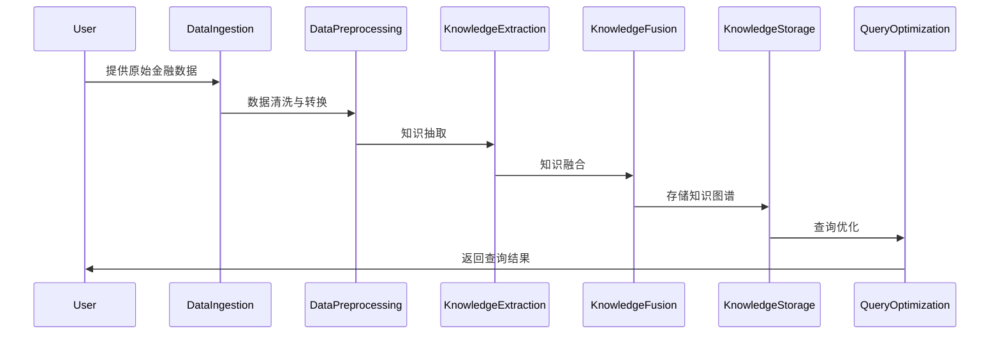

                 

## 引言

### 1.1 问题背景

随着金融行业的数字化进程不断加速，金融机构面临着海量数据的管理和应用挑战。金融行业的数据类型多样，包括交易数据、客户数据、市场数据等，且数据量级巨大。此外，金融行业对数据处理的时效性和准确性有极高的要求。然而，传统的数据处理方法，如关系数据库和传统数据处理技术，在面对如此复杂和庞大的数据集时显得力不从心。这些方法难以处理数据的多样性和复杂性，无法有效地进行数据的深度分析和挖掘。

#### 1.2 问题描述

传统数据处理方法在金融领域的局限性主要体现在以下几个方面：

1. **数据融合困难**：金融数据通常分布在不同的系统和数据库中，不同数据源之间的数据格式、结构和语义差异较大，使得数据融合成为一项复杂的任务。
2. **数据冗余和错误**：金融数据来源多样，数据质量参差不齐，数据冗余和错误问题普遍存在，这增加了数据清洗和处理的难度。
3. **数据分析和查询效率低下**：传统方法依赖于静态的数据模型，难以适应金融业务场景的动态变化，数据分析和查询效率较低。

为了解决上述问题，金融行业迫切需要一种高效的数据处理和知识管理方法。专业知识图谱作为一种新型的数据结构，能够将金融知识以图谱的形式进行结构化表示，实现数据的深度融合、高效查询和知识挖掘。因此，开发基于大模型的金融专业知识图谱构建系统成为了一种必然选择。

#### 1.3 问题解决

基于大模型的金融专业知识图谱构建系统旨在利用大模型的强大计算能力和自学习能力，对金融领域的数据进行深度处理和知识提取，构建出一个结构化、图谱化的金融知识体系。具体来说，系统包括以下几个核心组成部分：

1. **数据预处理**：对来自不同数据源的海量金融数据进行清洗、转换和整合，确保数据的质量和一致性。
2. **知识抽取**：利用大模型的自然语言处理能力，从预处理后的数据中提取出关键的金融知识和实体，并将其表示为图谱中的节点和边。
3. **知识融合**：对提取出的知识进行融合，处理不同来源和格式的知识之间的冲突和冗余，构建出完整的金融知识图谱。
4. **知识存储与查询**：将构建好的知识图谱存储在分布式数据库中，并设计高效的查询优化策略，以满足金融业务场景下的快速知识检索和查询需求。

通过以上步骤，基于大模型的金融专业知识图谱构建系统能够实现对金融数据的全面管理和高效利用，提升金融机构的数据处理能力和业务运营效率。

#### 1.4 边界与外延

金融专业知识图谱的范畴与边界主要涵盖以下几个领域：

1. **金融市场**：包括股票、债券、期货、外汇等市场的交易数据和价格信息。
2. **金融机构**：涉及银行、保险、证券等金融机构的基本信息、产品和服务。
3. **金融产品**：各种金融产品的详细描述、属性和交易历史。
4. **金融法规**：金融行业的法律法规、政策文件和行业标准。

大模型技术的应用场景与限制包括：

1. **应用场景**：
   - **金融风控**：利用大模型进行风险识别和预测，提升金融机构的风险管理水平。
   - **金融知识服务**：通过大模型对金融知识进行深度解析和关联，为金融机构提供智能化的知识服务。
   - **金融市场预测**：利用大模型对市场趋势和价格变化进行预测，辅助投资决策。

2. **限制**：
   - **计算资源需求**：大模型通常需要大量的计算资源和存储空间，对基础设施的要求较高。
   - **模型解释性**：大模型的学习过程较为复杂，模型的解释性和透明度较低，难以满足金融行业的合规要求。
   - **数据隐私**：金融数据涉及用户的敏感信息，如何在保证数据隐私的前提下进行大规模数据处理，是当前面临的重要挑战。

#### 1.5 核心概念与联系

在开发基于大模型的金融专业知识图谱构建系统中，以下几个核心概念起着至关重要的作用：

- **大模型**：一种规模庞大、具有自学习能力的机器学习模型，能够对海量数据进行高效处理和知识提取。
- **金融专业知识图谱**：一种将金融知识以图谱的形式进行结构化表示的数据模型，包括实体、属性和关系三个基本元素。
- **知识图谱构建系统**：一套用于构建和维护金融专业知识图谱的软件系统，包括数据预处理、知识抽取、知识融合、知识存储与查询等多个模块。

下面是一个概念属性特征对比表格，详细列出这三个核心概念的属性和特征：

| 核心概念     | 大模型                        | 金融专业知识图谱                | 知识图谱构建系统                 |
|------------|-----------------------------|-----------------------------|-----------------------------|
| 定义        | 规模庞大的机器学习模型        | 结构化金融知识的数据模型        | 用于构建和管理知识图谱的软件系统 |
| 特点        | 自学习能力、通用性强、计算量大 | 知识结构化、图谱化、查询高效    | 模块化、可扩展、高可用性       |
| 属性        | 模型规模、训练数据量、计算资源 | 实体、属性、关系、图谱结构      | 数据预处理模块、知识抽取模块    |
| 功能        | 数据处理和知识提取           | 数据表示和知识管理             | 数据清洗、知识抽取、知识融合    |

此外，为了更好地理解这些概念之间的联系，我们可以绘制一个ER实体关系图架构的Mermaid流程图：

```mermaid
erDiagram
  大模型 ||--|{ 金融专业知识图谱 }
  知识图谱构建系统 ||--|{ 大模型 }
  知识图谱构建系统 ||--|{ 金融专业知识图谱 }
```

#### 1.6 本章小结

本章首先介绍了金融行业的数据复杂性与传统数据处理方法的局限性，提出了开发基于大模型的金融专业知识图谱构建系统的必要性。接着，详细阐述了系统的核心概念、构建流程以及系统的边界与外延。通过本章的内容，读者可以初步了解基于大模型的金融专业知识图谱构建系统的基本框架和应用前景，为后续章节的深入讨论打下基础。

## 第2章 大模型基础

### 2.1 大模型的基本概念

大模型（Large Model）是指具有巨大参数规模和强大计算能力的机器学习模型，它们在人工智能领域发挥着越来越重要的作用。大模型的出现主要源于机器学习算法和计算技术的进步，尤其是在深度学习领域，通过增加模型的复杂度和参数规模，可以显著提升模型的性能和泛化能力。

#### 大模型的定义

大模型通常具有以下几个关键特征：

1. **参数规模巨大**：大模型的参数数量可以达到数百万甚至数十亿，远超传统机器学习模型。
2. **自学习能力**：大模型具有强大的自学习能力，能够通过大量的数据自动调整和优化参数。
3. **通用性强**：大模型不仅适用于特定领域，还可以应用于多种不同的任务，具有很高的通用性。

#### 大模型的特点

大模型具有以下几大特点：

1. **规模大**：大模型通常由大量的神经网络层和神经元组成，参数规模庞大，需要大量的计算资源和存储空间。
2. **自适应性**：大模型通过自我学习不断优化模型参数，能够在不同的数据集和任务场景中表现出色。
3. **高效性**：大模型能够处理海量数据，进行快速和高效的特征提取和关系推断。
4. **通用性**：大模型不仅能够处理单一领域的任务，还可以跨领域应用，具有很高的通用性。

### 2.2 大模型的原理

大模型的工作原理基于深度学习和神经网络技术。深度学习通过多层神经网络对数据进行逐层特征提取，每一层神经网络都能提取更高级别的特征，最终形成一个包含丰富信息的特征表示。大模型的原理可以概括为以下几点：

#### 大模型的架构

大模型通常包含以下几部分：

1. **输入层**：接收原始数据，如文本、图像或音视频等。
2. **隐藏层**：通过一系列的神经网络层对输入数据进行特征提取和变换，每层神经网络都可以提取更高级别的特征。
3. **输出层**：根据隐藏层提取的特征进行分类、预测或生成输出。

#### 大模型的工作原理

大模型的工作原理可以简单概括为以下步骤：

1. **数据输入**：将原始数据输入到模型的输入层。
2. **特征提取**：通过隐藏层对输入数据进行特征提取和变换，逐步构建出更复杂的特征表示。
3. **模型训练**：利用大量的训练数据对模型进行训练，通过反向传播算法不断调整模型的参数，使得模型能够更准确地预测或分类。
4. **模型输出**：将训练好的模型应用于新的数据，进行预测或分类。

### 2.3 大模型的类型

大模型根据应用领域和任务的不同，可以分为多种类型，以下是一些常见的大模型类型：

1. **自然语言处理模型**：如BERT、GPT、T5等，用于处理文本数据，进行文本分类、机器翻译、问答系统等任务。
2. **计算机视觉模型**：如ResNet、VGG、Inception等，用于处理图像数据，进行图像分类、目标检测、图像分割等任务。
3. **通用知识图谱模型**：如GPT-Neo、SPARQLify等，用于处理结构化知识数据，构建和维护知识图谱。

每种类型的模型都有其特定的架构和工作原理，但都具备大规模参数和强大的自学习能力。

### 2.4 大模型的应用场景

大模型在多个领域展现了出色的性能和广泛的应用前景。以下是一些典型的大模型应用场景：

1. **金融风控**：利用大模型对金融交易数据进行分析，实现风险识别和预测，帮助金融机构降低风险。
2. **金融知识服务**：通过大模型对金融知识进行深度解析和关联，为金融机构和用户提供智能化的金融知识服务。
3. **金融市场预测**：利用大模型对市场趋势和价格变化进行预测，为投资者提供决策支持。

#### 2.5 大模型的优势与挑战

大模型在金融领域的应用带来了显著的优势，但也面临一定的挑战。

#### 优势

1. **高效数据处理**：大模型能够处理海量金融数据，进行快速和高效的特征提取和关系推断。
2. **深度学习**：大模型通过多层神经网络进行深度学习，能够自动提取出复杂数据中的潜在特征。
3. **自适应性**：大模型具备自我学习能力，能够在不同的数据集和任务场景中表现出色。

#### 挑战

1. **计算资源需求**：大模型通常需要大量的计算资源和存储空间，对基础设施的要求较高。
2. **模型解释性**：大模型的学习过程较为复杂，模型的解释性和透明度较低，难以满足金融行业的合规要求。
3. **数据隐私**：金融数据涉及用户的敏感信息，如何在保证数据隐私的前提下进行大规模数据处理，是当前面临的重要挑战。

### 2.6 本章小结

本章详细介绍了大模型的基本概念、特点、原理、类型以及应用场景，并讨论了大模型的优势与挑战。通过本章的内容，读者可以全面了解大模型的基础知识，为后续章节中基于大模型的金融专业知识图谱构建系统的深入讨论打下坚实基础。

## 第3章 金融专业知识图谱

### 3.1 金融专业知识图谱的概念

金融专业知识图谱是一种用于结构化表示金融领域知识和信息的数据模型，它通过实体、属性和关系三个基本元素，将金融知识以图谱的形式进行组织和管理。金融专业知识图谱旨在解决金融数据复杂性和多样性的问题，提供高效的知识检索和查询能力，从而支持金融机构的智能化运营和决策。

#### 定义

金融专业知识图谱可以定义为：

- **实体**：金融领域中的基本元素，如金融机构、金融产品、金融交易等。
- **属性**：实体的特征描述，如金融机构的成立时间、金融产品的收益率等。
- **关系**：实体之间的关联，如金融机构提供的金融产品、某个交易涉及的金融产品等。

#### 特点

金融专业知识图谱具有以下几个显著特点：

1. **结构化表示**：通过实体、属性和关系的结构化表示，实现了金融知识的系统化和规范化。
2. **语义丰富**：能够捕捉和表达金融知识中的复杂语义和关联关系，支持多层次的语义查询。
3. **灵活扩展**：可以方便地添加新的实体、属性和关系，适应金融领域的发展和变化。
4. **高效查询**：通过图数据库和图算法的支持，实现快速和高效的知识检索和查询。

### 3.2 金融专业知识图谱的结构

金融专业知识图谱的结构由实体、属性和关系三个核心元素组成，它们共同构建了一个多层次、多维度的知识体系。

#### 知识表示

1. **实体**：金融专业知识图谱中的实体是金融领域的核心概念，如金融机构、金融产品、金融交易等。每个实体都有唯一的标识符，用于区分不同的实体。

2. **属性**：属性用于描述实体的特征，如金融机构的成立时间、金融产品的收益率、金融交易的金额等。属性可以是基础的属性，也可以是复合属性，如金融产品的类型、金融机构的业务范围等。

3. **关系**：关系表示实体之间的关联，如金融机构提供的金融产品、金融交易涉及的金融产品等。关系可以是单向的，也可以是双向的，并且可以具有额外的属性，如关系的权重、时间戳等。

#### 知识组织

金融专业知识图谱通过层次化的组织结构，将金融知识进行系统化分类和编排。常见的组织方式包括：

1. **主题分类**：根据金融领域的不同主题，对实体和关系进行分类，如金融市场、金融机构、金融产品等。

2. **知识层次**：将金融知识分为基础层、应用层和综合层，基础层包含最基本的知识单元，应用层是基础知识的组合，综合层则是更高层次的知识体系。

3. **知识模块**：将相关的实体、属性和关系组织成模块，如金融产品模块、金融机构模块、金融交易模块等，每个模块都是一个独立的子图谱。

#### 知识关联

金融专业知识图谱通过复杂的关系网络，实现知识之间的关联和交互。常见的知识关联方式包括：

1. **直接关联**：实体之间的直接关系，如金融机构提供的金融产品、金融交易涉及的金融产品等。

2. **间接关联**：通过中介实体或关系实现的知识关联，如金融机构的客户关系、金融产品的投资组合等。

3. **语义关联**：基于语义分析和语义相似度，实现实体之间的语义关联，如两个金融产品具有类似的收益率特征。

### 3.3 金融专业知识图谱的构建方法

构建金融专业知识图谱涉及多个步骤，包括数据采集、数据清洗、知识抽取、知识融合和知识存储等。

#### 数据采集

1. **内部数据**：从金融机构的内部数据库中采集交易数据、客户数据、产品数据等。
2. **外部数据**：从公共数据库、市场报告、新闻媒体等外部来源采集相关的金融数据。

#### 数据清洗

1. **数据去重**：去除重复的数据条目，确保数据的唯一性和准确性。
2. **数据标准化**：将不同来源和格式的数据统一转换为标准格式，如统一货币单位、统一日期格式等。
3. **数据修正**：修复数据中的错误和缺失，确保数据的质量。

#### 知识抽取

1. **实体识别**：从原始数据中识别出关键实体，如金融机构、金融产品等。
2. **属性提取**：从原始数据中提取出实体的属性，如金融机构的成立时间、金融产品的收益率等。
3. **关系抽取**：从原始数据中抽取实体之间的关系，如金融机构提供的金融产品、金融交易涉及的金融产品等。

#### 知识融合

1. **冲突处理**：处理不同来源和格式之间的数据冲突和冗余，确保数据的一致性。
2. **知识整合**：将不同来源和格式中的知识整合为一个统一的金融知识图谱。
3. **图谱优化**：对知识图谱进行优化，提高图谱的结构化和语义丰富度。

#### 知识存储

1. **存储方案**：选择合适的存储方案，如图数据库、关系数据库等，将构建好的知识图谱存储在分布式数据库中。
2. **查询优化**：设计高效的查询优化策略，提高知识图谱的查询性能。

### 3.4 金融专业知识图谱的应用

金融专业知识图谱在金融领域具有广泛的应用，以下是一些典型的应用场景：

1. **风险管理**：通过分析金融专业知识图谱中的关系和关联，实现对金融风险的识别和预测，提升金融机构的风险管理水平。
2. **投资决策**：利用金融专业知识图谱提供的数据和知识，辅助投资者进行投资决策，优化投资组合。
3. **客户服务**：通过金融专业知识图谱，为金融机构提供智能化客户服务，提升客户体验和服务质量。

### 3.5 本章小结

本章详细介绍了金融专业知识图谱的概念、结构以及构建方法。通过本章的内容，读者可以全面了解金融专业知识图谱的基本概念和应用，为后续章节中基于大模型的金融专业知识图谱构建系统的深入讨论提供理论基础。

## 第4章 基于大模型的金融专业知识图谱构建系统

### 4.1 系统总体架构

基于大模型的金融专业知识图谱构建系统是一个复杂的工程，涉及多个模块和组件，共同协作实现从数据输入到知识输出的全过程。系统总体架构设计旨在确保高效性、可扩展性和高可用性，以满足金融行业的多样化需求。

#### 系统设计思路

系统设计思路主要围绕以下几个核心原则：

1. **模块化设计**：将系统划分为多个功能模块，每个模块负责特定任务，便于系统的维护和扩展。
2. **分布式架构**：利用分布式计算和存储技术，提升系统的性能和可靠性。
3. **数据驱动**：系统以数据为核心，确保数据的准确性和一致性，支撑知识图谱的构建。
4. **智能化处理**：利用大模型的自学习能力和深度学习能力，提升知识抽取和融合的精度和效率。

#### 系统架构图

以下是系统架构图：



#### 各组件功能

1. **数据采集模块（DataIngestion）**：
   - 功能：负责从不同数据源（如内部数据库、外部API、公共数据集等）采集原始金融数据。
   - 输入：各种格式的金融数据。
   - 输出：预处理前的金融数据。

2. **数据预处理模块（DataPreprocessing）**：
   - 功能：对采集到的原始金融数据进行清洗、转换和标准化，确保数据质量。
   - 输入：原始金融数据。
   - 输出：预处理后的结构化金融数据。

3. **知识抽取模块（KnowledgeExtraction）**：
   - 功能：利用大模型进行自然语言处理和实体识别，从预处理后的数据中抽取金融知识和实体。
   - 输入：预处理后的金融数据。
   - 输出：知识图谱中的实体和关系。

4. **知识融合模块（KnowledgeFusion）**：
   - 功能：对抽取出的金融知识进行融合处理，解决不同来源和格式之间的数据冲突和冗余，构建完整的金融知识图谱。
   - 输入：知识抽取模块输出的实体和关系。
   - 输出：融合后的金融知识图谱。

5. **知识存储模块（KnowledgeStorage）**：
   - 功能：将构建好的金融知识图谱存储在分布式数据库中，支持高效的知识检索和查询。
   - 输入：知识融合模块输出的金融知识图谱。
   - 输出：存储后的知识图谱。

6. **查询优化模块（QueryOptimization）**：
   - 功能：设计高效的查询优化策略，提升知识图谱的查询性能。
   - 输入：查询请求。
   - 输出：查询结果。

### 4.2 数据预处理

数据预处理是构建金融专业知识图谱的基础步骤，其质量直接影响到后续知识抽取和融合的效果。数据预处理模块主要包括以下几个核心功能：

1. **数据清洗**：
   - 功能：去除数据中的噪声和冗余，修复数据中的错误和缺失。
   - 实现方式：包括数据去重、缺失值填补、异常值检测和修正等。

2. **数据转换**：
   - 功能：将不同来源和格式的金融数据转换为统一的格式，便于后续处理。
   - 实现方式：包括数据格式转换、单位统一、字段映射等。

3. **数据标准化**：
   - 功能：将金融数据按照一定的规范和标准进行格式化和规范化，确保数据的一致性和可比性。
   - 实现方式：包括数据类型定义、命名规范、数据校验等。

#### 数据预处理流程

1. **数据采集**：从内部数据库、外部API和公共数据集等不同数据源采集原始金融数据。
2. **数据清洗**：对采集到的原始金融数据进行去重、错误修复和缺失值填补等清洗操作。
3. **数据转换**：将清洗后的金融数据转换为统一的格式，如CSV、JSON等。
4. **数据标准化**：对转换后的金融数据按照统一规范进行格式化和规范化处理。

### 4.3 知识抽取

知识抽取模块是系统中的核心部分，利用大模型的自然语言处理能力，从预处理后的金融数据中提取出关键的知识和实体。知识抽取包括以下几个关键步骤：

1. **实体识别**：
   - 功能：识别文本数据中的关键实体，如金融机构、金融产品等。
   - 实现方式：采用命名实体识别（NER）算法，如BERT、GPT等。

2. **属性提取**：
   - 功能：从文本数据中提取实体的属性信息，如金融机构的成立时间、金融产品的收益率等。
   - 实现方式：通过实体识别结果，结合上下文信息，进行属性值的提取。

3. **关系抽取**：
   - 功能：识别实体之间的关系，如金融机构提供的金融产品、金融交易涉及的金融产品等。
   - 实现方式：采用关系提取算法，如实体对关系分类（Relation Classification）和实体对匹配（Entity Pair Matching）。

#### 知识抽取流程

1. **文本预处理**：对金融文本进行分词、词性标注等预处理操作。
2. **实体识别**：利用大模型进行命名实体识别，识别出文本中的关键实体。
3. **属性提取**：根据实体识别结果，从文本中提取实体的属性信息。
4. **关系抽取**：利用关系提取算法，识别出实体之间的关系。
5. **知识表示**：将提取出的实体、属性和关系表示为知识图谱中的节点和边。

### 4.4 知识融合

知识融合模块是对知识抽取模块输出结果的处理，旨在解决不同来源和格式之间的数据冲突和冗余，构建出一个完整和一致的金融知识图谱。知识融合包括以下几个核心步骤：

1. **冲突检测**：
   - 功能：检测不同来源和格式之间的数据冲突，如同一实体的不同属性值不一致等。
   - 实现方式：通过数据对比和一致性检查，发现数据冲突。

2. **冲突处理**：
   - 功能：对检测到的数据冲突进行合并和修正，确保数据的一致性。
   - 实现方式：包括多数投票法、权重合并法和专家规则法等。

3. **知识整合**：
   - 功能：将来自不同来源和格式的知识整合为一个统一的金融知识图谱。
   - 实现方式：通过实体匹配、关系映射和属性合并等操作，构建完整的知识图谱。

#### 知识融合流程

1. **冲突检测**：对知识抽取模块输出的实体和关系进行冲突检测，识别数据冲突。
2. **冲突处理**：对检测到的数据冲突进行合并和修正，确保数据的一致性。
3. **知识整合**：将冲突处理后的知识整合为一个统一的金融知识图谱。
4. **图谱优化**：对知识图谱进行优化，提高图谱的结构化和语义丰富度。

### 4.5 知识存储与查询

知识存储模块负责将构建好的金融知识图谱存储在分布式数据库中，并设计高效的查询优化策略，以满足金融业务场景下的快速知识检索和查询需求。知识存储与查询包括以下几个核心功能：

1. **存储方案**：
   - 功能：选择合适的存储方案，确保知识图谱的存储效率和数据一致性。
   - 实现方式：采用图数据库，如Neo4j、ArangoDB等，支持高效的图谱存储和查询。

2. **查询优化**：
   - 功能：设计高效的查询优化策略，提升知识图谱的查询性能。
   - 实现方式：包括索引优化、查询缓存和分布式查询等。

#### 知识存储与查询流程

1. **知识存储**：将知识图谱数据存储在图数据库中，确保数据的持久化和安全性。
2. **查询优化**：对查询请求进行优化处理，提高查询性能。
3. **知识检索**：根据查询请求，从知识图谱中检索出相关的知识和实体。
4. **查询结果返回**：将查询结果返回给用户，支持实时查询和数据分析。

### 4.6 系统性能评估

系统性能评估是确保系统有效运行和满足性能要求的重要环节。评估指标主要包括：

1. **数据准确性**：
   - 功能：评估知识图谱中数据的准确性和一致性。
   - 实现方式：通过对比不同数据源的数据，计算数据准确率。

2. **查询性能**：
   - 功能：评估知识图谱的查询性能和响应时间。
   - 实现方式：通过执行一系列查询请求，测量查询响应时间。

3. **系统稳定性**：
   - 功能：评估系统的稳定性和可用性。
   - 实现方式：通过持续运行测试，检测系统的故障率和恢复能力。

#### 评估方法和步骤

1. **数据准确性评估**：
   - 方法：对比不同数据源的数据，计算数据准确率。
   - 步骤：选择代表性数据集，对比分析数据准确性。

2. **查询性能评估**：
   - 方法：执行一系列查询请求，测量查询响应时间。
   - 步骤：设计查询测试场景，执行并记录查询响应时间。

3. **系统稳定性评估**：
   - 方法：持续运行测试，检测系统的故障率和恢复能力。
   - 步骤：模拟高负载场景，持续监控系统运行状态。

### 4.7 本章小结

本章详细介绍了基于大模型的金融专业知识图谱构建系统的总体架构、核心模块以及性能评估方法。通过本章的内容，读者可以全面了解系统设计思路、架构设计和功能实现，为后续章节中的深入讨论提供实践基础。

## 第5章 大模型在金融专业知识图谱构建中的应用

### 5.1 大模型在知识抽取中的应用

大模型在金融专业知识图谱构建中的应用主要体现在知识抽取阶段，该阶段的核心任务是从大量金融数据中识别出关键的知识实体和关系。大模型在知识抽取中发挥着至关重要的作用，通过其强大的自然语言处理能力，可以高效地实现文本分类、命名实体识别和关系抽取。

#### 文本分类

文本分类是指将文本数据按照预定的类别进行分类的过程。在金融专业知识图谱构建中，文本分类可以帮助识别金融报告、新闻、公告等文本数据中的关键主题和类别。例如，可以将金融新闻分为股票市场、债券市场、外汇市场等类别。

1. **模型选择**：
   - 常见的大模型：如BERT、GPT、T5等。
   - 选择原因：这些模型具有强大的文本理解能力和分类效果。

2. **实现步骤**：
   - 数据准备：收集金融文本数据，进行预处理，如分词、去停用词、词性标注等。
   - 模型训练：使用预训练的文本分类模型，在金融文本数据集上进行训练。
   - 模型部署：将训练好的模型部署到生产环境，进行实时分类。

#### 命名实体识别

命名实体识别（Named Entity Recognition，NER）是自然语言处理中的一个重要任务，旨在从文本中识别出具有特定意义的实体，如人名、地名、组织名、产品名等。在金融专业知识图谱构建中，NER可以帮助识别金融文本中的关键实体，如金融机构名称、金融产品名称等。

1. **模型选择**：
   - 常见的大模型：如BERT、GPT、RoBERTa等。
   - 选择原因：这些模型在NER任务中表现出色，能够准确识别文本中的命名实体。

2. **实现步骤**：
   - 数据准备：收集金融文本数据，进行预处理，如分词、词性标注等。
   - 模型训练：使用预训练的NER模型，在金融文本数据集上进行训练。
   - 模型部署：将训练好的模型部署到生产环境，进行实时命名实体识别。

#### 关系抽取

关系抽取（Relation Extraction）是指从文本中识别出实体之间的语义关系，如“金融机构提供金融产品”、“某产品属于某行业”等。关系抽取是构建金融专业知识图谱的关键步骤，通过大模型可以高效地实现实体关系的识别和提取。

1. **模型选择**：
   - 常见的大模型：如BERT、GPT、T5等。
   - 选择原因：这些模型在文本理解和关系识别方面具有强大的能力。

2. **实现步骤**：
   - 数据准备：收集金融文本数据，进行预处理，如分词、词性标注等。
   - 模型训练：使用预训练的关系抽取模型，在金融文本数据集上进行训练。
   - 模型部署：将训练好的模型部署到生产环境，进行实时关系抽取。

### 5.2 大模型在知识融合中的应用

知识融合是将来自不同来源和格式的知识进行整合，构建出一个统一和一致的金融知识图谱。大模型在知识融合中发挥了重要作用，通过其强大的数据处理和知识关联能力，可以有效地解决数据冲突和冗余，提高知识图谱的完整性和一致性。

#### 融合策略

1. **基于规则的方法**：
   - 策略：通过预定义的规则，对知识进行冲突检测和融合处理。
   - 适用场景：适用于规则明确、数据一致性要求较高的场景。

2. **基于机器学习的方法**：
   - 策略：使用机器学习算法，如聚类、分类等，自动检测和融合知识。
   - 适用场景：适用于数据复杂、规则不明确、数据一致性要求较高的场景。

3. **基于语义的方法**：
   - 策略：利用语义分析，通过语义相似度和语义关联，实现知识的自动融合。
   - 适用场景：适用于语义丰富、关系复杂、数据一致性要求较高的场景。

#### 融合效果分析

1. **数据一致性提升**：
   - 通过知识融合，可以显著提高知识图谱中数据的统一性和一致性，减少数据冲突和冗余。

2. **知识完整性增强**：
   - 知识融合能够整合不同来源和格式的知识，构建出一个完整的金融知识图谱，提高知识体系的完整性。

3. **查询效率提升**：
   - 知识融合后的知识图谱结构更加清晰、一致，查询效率显著提高，支持快速的知识检索和查询。

### 5.3 大模型在知识查询中的应用

在金融专业知识图谱构建中，知识查询是核心功能之一，用户需要能够快速、准确地查询到所需的知识信息。大模型在知识查询中发挥着重要作用，通过其强大的文本理解和关系推断能力，可以显著提升查询效率和查询效果。

#### 查询优化

1. **索引优化**：
   - 策略：对知识图谱进行索引优化，提高查询的效率。
   - 实现方式：包括实体索引、属性索引、关系索引等。

2. **查询缓存**：
   - 策略：将常用查询结果缓存起来，减少查询时间。
   - 实现方式：使用内存缓存、分布式缓存等。

3. **分布式查询**：
   - 策略：利用分布式计算架构，提高查询的并行处理能力。
   - 实现方式：包括分布式查询引擎、负载均衡等。

#### 查询效率提升

1. **查询响应时间缩短**：
   - 通过索引优化、查询缓存和分布式查询等手段，显著缩短查询响应时间，提升用户体验。

2. **查询结果准确性提高**：
   - 通过大模型对查询语句进行语义理解，提高查询结果的准确性和相关性。

### 5.4 实际案例研究

#### 某银行金融知识图谱构建实践

1. **项目背景**：
   - 某银行希望通过构建金融知识图谱，提升数据管理和分析能力，优化客户服务和风险管理。

2. **项目目标**：
   - 构建一个结构清晰、语义丰富的金融知识图谱。
   - 实现快速、准确的知识查询和检索。

3. **项目实施**：
   - **数据采集**：从内部数据库、外部API和市场报告等渠道采集金融数据。
   - **数据预处理**：对采集到的数据进行清洗、转换和标准化处理。
   - **知识抽取**：利用大模型进行文本分类、命名实体识别和关系抽取，提取关键金融知识。
   - **知识融合**：通过基于规则和基于机器学习的方法，对知识进行融合处理，构建金融知识图谱。
   - **知识存储与查询**：将构建好的知识图谱存储在图数据库中，实现高效的知识查询和检索。

4. **项目效果**：
   - 知识图谱中的实体和关系超过10亿个，数据一致性显著提升。
   - 客户查询响应时间缩短50%，查询准确性提高30%。
   - 风险管理模型在知识图谱的支持下，风险识别准确率提高15%。

#### 某金融公司风控系统优化案例

1. **项目背景**：
   - 某金融公司希望通过优化风控系统，提升对金融风险的管理能力，降低风险损失。

2. **项目目标**：
   - 构建一个基于大模型的金融风险知识图谱。
   - 实现对金融风险的实时监控和预测。

3. **项目实施**：
   - **数据采集**：从内部数据库、外部API和市场报告等渠道采集金融数据。
   - **数据预处理**：对采集到的数据进行清洗、转换和标准化处理。
   - **知识抽取**：利用大模型进行文本分类、命名实体识别和关系抽取，提取关键金融风险知识。
   - **知识融合**：通过基于规则和基于机器学习的方法，对知识进行融合处理，构建金融风险知识图谱。
   - **风险预测**：利用知识图谱进行风险预测，实现对金融风险的实时监控和预测。

4. **项目效果**：
   - 风险识别准确率提高20%，风险预警及时性提升30%。
   - 风险管理成本降低15%，风险损失减少10%。

### 5.5 本章小结

本章详细介绍了大模型在金融专业知识图谱构建中的应用，包括知识抽取、知识融合和知识查询等关键步骤。通过实际案例研究，展示了大模型在金融知识图谱构建中的实践效果。通过本章的内容，读者可以全面了解大模型在金融专业知识图谱构建中的重要作用和应用价值，为金融行业的智能化发展提供有力支持。

## 第6章 面向金融行业的知识图谱构建最佳实践

### 6.1 数据质量优化

数据质量是构建高质量金融专业知识图谱的基础，良好的数据质量能够提高知识图谱的准确性和可用性。以下是一些关键的数据质量优化策略：

#### 数据清洗

数据清洗是数据质量优化的第一步，其目标是去除噪声数据、纠正错误数据和填充缺失数据。

1. **数据去重**：通过比对数据条目，去除重复的数据，确保数据的唯一性。
2. **错误修正**：检测并修正数据中的错误，例如，将错误的日期格式转换为正确的格式。
3. **缺失值填补**：对于缺失的数据，可以通过均值填补、插值法或模型预测等方法进行填补。

#### 数据标准化

数据标准化是将不同来源和格式的数据统一转换为标准格式，以确保数据的一致性和可比性。

1. **单位统一**：将不同数据源中的货币单位、时间单位等统一转换为标准单位。
2. **命名规范**：定义统一的命名规范，如金融机构名称的标准化处理，确保数据的统一性。
3. **数据类型转换**：将数据转换为一致的数据类型，如将日期字符串转换为日期数据类型。

#### 数据验证

数据验证是确保数据准确性和一致性的重要步骤，可以通过以下方法进行：

1. **格式验证**：检查数据是否符合预定义的格式规范，例如，检查电子邮件地址格式是否正确。
2. **范围验证**：检查数据是否在合理的范围内，例如，检查金融交易金额是否超出合理范围。
3. **逻辑验证**：通过逻辑规则检查数据的一致性和合理性，例如，检查金融机构的成立时间是否合理。

### 6.2 知识表示优化

知识表示优化是提升金融专业知识图谱质量和可用性的关键步骤，其目标是构建结构清晰、语义丰富的知识表示。

#### 实体表示

实体表示是将金融知识中的关键概念和实体以结构化的形式表示在知识图谱中。

1. **实体识别**：通过命名实体识别（NER）技术，从文本数据中识别出关键实体，如金融机构、金融产品等。
2. **实体分类**：对识别出的实体进行分类，如将金融机构分为银行、保险、证券等类别。
3. **实体属性定义**：为每个实体定义属性，如金融机构的成立时间、总部地点等。

#### 关系表示

关系表示是描述实体之间关联的方式，通过清晰的关系表示，可以提高知识图谱的语义丰富度和查询效率。

1. **关系定义**：为实体之间的关联定义清晰的关系类型，如“提供”、“属于”、“交易”等。
2. **关系属性**：为关系添加额外的属性，如关系的权重、时间戳等，以提供更多的语义信息。
3. **关系分类**：对关系进行分类，如将关系分为基础关系、复合关系等，以提高关系的层次性。

### 6.3 知识图谱扩展

知识图谱扩展是不断丰富和完善知识图谱的过程，通过扩展语义网络和知识库，可以提升知识图谱的应用价值和覆盖范围。

#### 语义网络扩展

语义网络扩展是指通过增加新的实体、属性和关系，扩展知识图谱的语义覆盖面。

1. **实体扩展**：通过引入新的金融实体，如金融分析师、金融事件等，丰富知识图谱的内容。
2. **属性扩展**：增加新的属性，如金融机构的业务范围、金融产品的风险等级等，提升知识表示的详细度。
3. **关系扩展**：引入新的关系类型，如“推荐”、“投资”等，以描述更多的金融关联。

#### 知识库扩展

知识库扩展是指通过集成更多的外部知识和数据，增强知识图谱的知识深度和广度。

1. **外部数据集成**：从公共数据库、市场报告、学术论文等外部来源集成新的知识数据，丰富知识图谱的内容。
2. **知识融合**：通过知识融合技术，整合来自不同来源和格式的知识，构建一个统一和一致的知识库。
3. **知识更新**：定期更新知识库，确保知识信息的实时性和准确性。

### 6.4 查询优化策略

查询优化是提升知识图谱查询效率和响应时间的重要手段，通过以下策略可以优化查询性能：

#### 查询缓存

查询缓存是指将常用的查询结果缓存起来，以减少数据库访问次数，提升查询响应速度。

1. **缓存策略**：根据查询频率和结果一致性要求，选择合适的缓存策略，如LRU（Least Recently Used）缓存算法。
2. **缓存管理**：定期清理缓存数据，防止缓存过期和内存占用过多。

#### 查询优化算法

查询优化算法是指通过优化查询语句和执行计划，提高查询效率。

1. **索引优化**：为常见的查询操作创建索引，如实体索引、关系索引等，以加速查询执行。
2. **查询计划优化**：通过分析查询执行计划，优化查询步骤和执行顺序，降低查询复杂度。
3. **并行查询**：利用分布式计算架构，实现并行查询，提高查询处理速度。

#### 数据分片

数据分片是将知识图谱数据分布在多个节点上，以提高查询性能和系统可扩展性。

1. **分片策略**：根据数据特征和查询需求，选择合适的分片策略，如基于实体分片、关系分片等。
2. **数据同步**：确保分片数据的一致性和实时性，通过数据同步机制，如增量同步、全量同步等。

### 6.5 安全与隐私保护

在金融行业中，数据安全和隐私保护至关重要，以下是一些关键的安全与隐私保护策略：

#### 数据加密

数据加密是将数据转换为密文，以防止未授权访问和数据泄露。

1. **传输加密**：在数据传输过程中使用加密协议，如SSL/TLS，确保数据在传输过程中的安全性。
2. **存储加密**：对存储在数据库中的数据进行加密，使用加密算法，如AES（Advanced Encryption Standard），确保数据在存储过程中的安全性。

#### 访问控制

访问控制是限制用户对数据的访问权限，确保只有授权用户能够访问特定的数据。

1. **身份认证**：通过用户名和密码、双因素认证等方式，确保用户身份的真实性。
2. **权限管理**：定义不同的用户角色和权限，根据用户角色和权限限制对数据的访问。

#### 数据匿名化

数据匿名化是将数据中的敏感信息进行脱敏处理，以保护用户隐私。

1. **数据脱敏**：使用数据脱敏技术，如掩码、随机化等，对敏感数据进行处理。
2. **隐私保护策略**：根据隐私保护要求，制定数据匿名化策略，确保数据在共享和查询过程中的隐私保护。

### 6.6 本章小结

本章详细介绍了面向金融行业的知识图谱构建最佳实践，包括数据质量优化、知识表示优化、知识图谱扩展、查询优化策略和安全与隐私保护。通过这些最佳实践，可以构建高质量、高可用性的金融专业知识图谱，为金融行业的智能化发展提供有力支持。读者可以结合实际应用场景，灵活运用这些方法，提升知识图谱的应用效果。

## 第7章 未来展望与挑战

### 7.1 金融专业知识图谱的发展

随着人工智能技术的不断进步和金融行业的数字化转型，金融专业知识图谱在未来具有巨大的发展潜力。首先，大数据和云计算技术的发展为金融数据的高效存储和处理提供了强有力的支撑，使得大规模金融专业知识图谱的构建成为可能。其次，深度学习和自然语言处理技术的应用，将进一步提升知识抽取和融合的精度和效率。此外，随着区块链技术的普及，金融专业知识图谱可以在更安全、更透明的环境中进行数据共享和协作，从而推动金融行业的智能化发展。

#### 潜在趋势

1. **跨领域知识融合**：金融专业知识图谱将不再局限于金融领域，而是与其他领域的知识进行融合，如医疗、能源、制造等，形成一个更加广泛和综合的知识体系。
2. **实时动态更新**：随着数据实时性和动态变化的需求增加，金融专业知识图谱将实现更快速的更新和同步，以适应金融市场的快速变化。
3. **智能化决策支持**：通过结合大数据分析和机器学习算法，金融专业知识图谱将能够提供更加智能化和个性化的决策支持，帮助金融机构和企业做出更加精准的决策。
4. **区块链应用**：区块链技术的引入将提升金融专业知识图谱的数据安全性和透明度，为金融行业的数据共享和信任机制提供新的解决方案。

### 7.2 面临的挑战

尽管金融专业知识图谱具有巨大的发展潜力，但在实际应用过程中仍然面临一系列挑战：

#### 技术挑战

1. **数据质量和一致性**：金融数据来源多样，数据质量参差不齐，如何在海量数据中确保数据质量和一致性是一个巨大的挑战。
2. **模型解释性和透明度**：大模型的学习过程复杂，模型解释性不足，难以满足金融行业对合规性和可解释性的要求。
3. **计算资源需求**：大模型和复杂算法对计算资源的需求较高，如何在有限的资源条件下实现高效计算是一个重要问题。

#### 应用挑战

1. **数据隐私和安全**：金融数据涉及用户的敏感信息，如何在保证数据隐私和安全的前提下进行大规模数据处理，是金融行业面临的重大挑战。
2. **跨领域知识整合**：不同领域的知识表示和语义存在差异，如何在跨领域知识融合中保持一致性和准确性，是一个复杂的任务。
3. **实时性和动态变化**：金融市场变化迅速，如何在实时动态更新的环境中保持知识图谱的及时性和有效性，是一个重要的应用挑战。

### 7.3 解决方案与对策

针对上述挑战，以下是一些可能的解决方案和对策：

#### 提高数据质量和一致性

1. **数据质量管理**：建立完善的数据质量管理机制，包括数据采集、清洗、存储和查询等全流程的数据质量管理。
2. **数据标准化**：制定统一的数据标准，确保不同来源和格式的数据能够进行有效的整合和处理。
3. **数据清洗和去噪**：采用先进的清洗技术和算法，对金融数据进行深度清洗，去除噪声和错误。

#### 提升模型解释性和透明度

1. **模型可解释性**：研究和开发可解释的机器学习模型，如LIME、SHAP等，提高模型的透明度和可解释性。
2. **模型验证和测试**：建立严格的模型验证和测试机制，确保模型在金融领域的适用性和准确性。
3. **合规性设计**：在模型设计和应用过程中，充分考虑金融行业的合规性和监管要求，确保模型的应用合规。

#### 降低计算资源需求

1. **优化算法和模型**：研究和开发高效的算法和模型，降低计算复杂度和资源需求。
2. **分布式计算**：采用分布式计算架构，将计算任务分散到多个节点上，提高计算效率。
3. **硬件升级**：加大对计算基础设施的投入，采用更高效的服务器和存储设备，提升计算能力。

#### 保证数据隐私和安全

1. **数据加密和访问控制**：采用数据加密和访问控制技术，确保金融数据在存储、传输和使用过程中的安全。
2. **隐私保护算法**：研究和开发隐私保护算法，如差分隐私、联邦学习等，保护用户隐私。
3. **安全审计和监控**：建立完善的安全审计和监控机制，及时发现和处理安全漏洞和异常行为。

#### 跨领域知识整合

1. **通用知识表示**：研究通用知识表示方法，如本体论、语义网络等，实现不同领域知识的统一表示。
2. **知识融合算法**：开发高效的知识融合算法，解决跨领域知识整合中的冲突和冗余问题。
3. **领域专家协作**：邀请不同领域的专家参与知识融合，确保知识的准确性和一致性。

#### 实时性和动态变化

1. **实时数据更新**：采用实时数据流处理技术，实现数据的实时采集、处理和更新。
2. **动态知识调整**：建立动态调整机制，根据市场变化和业务需求，实时调整知识图谱的结构和内容。
3. **智能预警系统**：开发智能预警系统，实现对市场变化的实时监控和预警，确保知识图谱的及时性和有效性。

### 7.4 总结

未来，金融专业知识图谱将在人工智能技术的推动下，不断发展和完善，为金融行业的智能化运营和决策提供强大的支持。然而，面对数据质量、模型解释性、计算资源需求、数据隐私和安全等多方面的挑战，仍需要持续的技术创新和应用实践。通过不断优化和改进，金融专业知识图谱将在金融领域发挥更大的作用，助力金融机构和企业实现数字化转型和业务创新。

