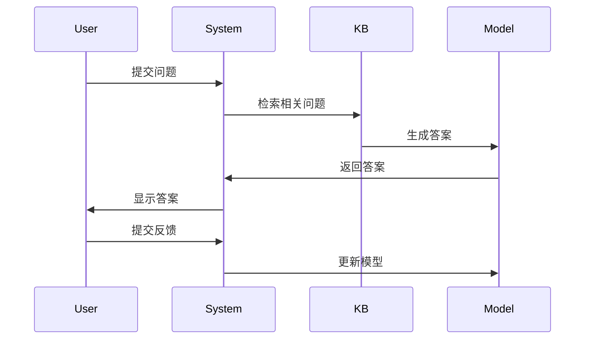

                 

### 第一部分：背景介绍

#### 第1章：问题背景

##### 1.1 问题描述

在当今信息化和数字化程度日益提升的金融领域，金融专业考试作为评估从业者专业知识和技能的重要方式，其重要性和应用范围日益广泛。然而，传统的金融专业考试答疑方式往往依赖于人工，这不仅效率低下，而且难以应对大规模考生群体的问题查询需求。为了解决这一问题，开发一个基于大模型的金融专业考试答疑系统成为了一个热门的研究方向。

##### 1.2 问题解决

基于大模型的金融专业考试答疑系统的核心在于利用人工智能技术，尤其是预训练语言模型，对海量金融专业考试相关问题及其解答进行自动学习与生成。这样，系统可以在接收用户提问后，迅速给出准确、专业的答案，大幅提升答疑效率和准确性。

##### 1.3 边界与外延

该系统的边界主要涉及金融专业领域的知识范围，以及系统所能处理的提问类型和复杂度。其外延则包括系统的扩展性和与其他金融信息系统（如在线课程、电子图书馆等）的集成。

##### 1.4 核心概念

- **金融专业考试答疑系统**：指专门为金融专业考试设计，用于提供自动问答服务的系统。
- **大模型技术**：指通过大量数据进行训练，形成的具有强大知识表示和学习能力的模型。

#### 第2章：核心概念与联系

##### 2.1 金融专业考试答疑系统的核心概念

金融专业考试答疑系统的核心在于其问答功能，该功能通过以下几个关键组成部分实现：

1. **问题接收模块**：负责接收用户提出的问题。
2. **知识库模块**：存储金融专业考试相关的问题及答案。
3. **算法模块**：用于处理用户问题，从知识库中检索相关信息，并生成答案。
4. **用户反馈模块**：收集用户对答案的反馈，用于模型优化。

##### 2.2 大模型技术的核心概念

大模型技术主要基于预训练语言模型，如GPT、BERT等，这些模型通过在海量文本数据上预训练，掌握了丰富的语言知识和表达方式。在金融专业考试答疑系统中，这些模型被用于：

1. **理解用户提问**：通过自然语言处理技术，分析用户提出的问题，提取关键信息。
2. **生成答案**：利用预训练模型生成的答案库，结合具体问题生成专业、准确的答案。

#### 第3章：概念属性特征对比表格

为了更清晰地理解金融专业考试答疑系统与传统问答系统的差异，我们可以通过以下表格进行比较：

| 特征        | 金融专业考试答疑系统 | 传统问答系统 |
| ----------- | ------------------- | ------------ |
| 知识库来源  | 金融专业知识库       | 通用知识库   |
| 提问类型    | 专业金融问题         | 多样化问题   |
| 回答生成方式 | 大模型自动生成       | 人工编写或查找 |
| 答案准确性  | 高，依赖于模型训练效果 | 中，依赖于回答者经验 |
| 回答速度    | 快，实时回答         | 慢，需人工处理 |

#### 第4章：ER实体关系图架构

为了更好地设计金融专业考试答疑系统，我们需要绘制其ER图，以明确各实体之间的关系。以下是一个简单的ER图示例：

```mermaid
erDiagram
    User ||--|{ Question }
    User ||--|{ Answer }
    Question ||--|{ QuestionDetail }
    Answer ||--|{ AnswerDetail }
    QuestionDetail ||--|{ Knowledge }
```

在这个ER图中，我们定义了以下实体：

- **User**：用户，提问者或回答者。
- **Question**：问题，用户提出的问题。
- **Answer**：答案，系统生成的回答。
- **QuestionDetail**：问题详情，包含问题的各个属性。
- **AnswerDetail**：答案详情，包含答案的各个属性。
- **Knowledge**：知识，问题的知识库部分。

这些实体之间的关系反映了金融专业考试答疑系统的数据流和功能结构。

通过以上章节，我们为开发基于大模型的金融专业考试答疑系统奠定了理论基础，并明确了系统的核心概念和架构设计。接下来，我们将深入探讨算法原理，为构建高效、准确的系统奠定基础。

---

#### 第5章：预训练语言模型原理

##### 5.1 预训练语言模型的基本原理

预训练语言模型（Pre-trained Language Model，如GPT、BERT等）是自然语言处理（Natural Language Processing，NLP）领域的一项重要技术。其核心思想是利用大量文本数据对模型进行预训练，使其能够自动学习和理解语言的复杂结构。

预训练语言模型的基本原理可以概括为以下几个步骤：

1. **数据收集**：首先，收集海量的文本数据，这些数据可以是书籍、新闻、网页等，但通常需要经过处理，以去除无关信息并保持数据的多样性。
2. **文本预处理**：对文本数据进行预处理，包括分词、词性标注、去除停用词等操作，以使其适合模型训练。
3. **模型初始化**：初始化预训练模型，通常使用深度神经网络结构，如Transformer。
4. **预训练**：在预处理后的文本数据上进行大规模的训练，模型在这一过程中学习如何对文本进行编码，理解文本中的词语和句子结构。
5. **任务迁移**：在预训练完成后，将模型应用于具体的NLP任务，如文本分类、问答系统等，通过微调（Fine-tuning）调整模型参数，使其在特定任务上达到最佳性能。

##### 5.2 预训练语言模型的mermaid流程图

为了更直观地理解预训练语言模型的工作流程，我们可以使用mermaid绘制其流程图。以下是一个简单的示例：


在这个流程图中：

- **A**：数据收集
- **B**：文本预处理
- **C**：模型初始化
- **D**：预训练
- **E**：任务迁移
- **F**：评估与优化

##### 5.3 源代码讲解

以下是一个简单的Python代码示例，用于初始化并预训练一个预训练语言模型。在这个例子中，我们使用了`transformers`库，这是Hugging Face提供的一个广泛使用的NLP库。

```python
from transformers import BertTokenizer, BertModel
import torch

# 1. 初始化预训练模型和分词器
tokenizer = BertTokenizer.from_pretrained('bert-base-uncased')
model = BertModel.from_pretrained('bert-base-uncased')

# 2. 预处理文本数据
text = "Hello, my name is AI."
encoding = tokenizer(text, return_tensors='pt')

# 3. 进行预训练
outputs = model(**encoding)

# 4. 获取预训练结果
last_hidden_state = outputs.last_hidden_state

# 打印输出结果
print(last_hidden_state)
```

在这个代码示例中，我们首先初始化了BERT模型和分词器，然后对一段文本进行了预处理，接着进行了预训练，并最终获取了模型的输出结果。

##### 5.4 数学模型与公式

预训练语言模型的核心在于其训练过程中的损失函数和优化算法。以下是一些关键数学模型和公式的解释：

1. **损失函数**：在预训练过程中，常用的损失函数包括交叉熵损失（Cross-Entropy Loss）和对比损失（Contrastive Loss）。
   - **交叉熵损失**：
     $$
     L_{cross-entropy} = -\sum_{i=1}^{N} y_i \log(p_i)
     $$
     其中，$y_i$是真实标签，$p_i$是模型预测的概率。

   - **对比损失**：
     $$
     L_{contrastive} = \frac{1}{2N} \sum_{i=1}^{N} \sum_{j \in \{-1,1\}} \log(1 + \exp(-\frac{z_i - z_j}{\tau}))
     $$
     其中，$z_i$和$z_j$是正样本和负样本的特征表示，$\tau$是温度超参数。

2. **优化算法**：常用的优化算法包括随机梯度下降（SGD）和Adam。
   - **随机梯度下降**：
     $$
     \theta_{t+1} = \theta_{t} - \alpha \cdot \nabla_{\theta}L(\theta)
     $$
     其中，$\theta$是模型参数，$\alpha$是学习率。

   - **Adam算法**：
     $$
     m_t = \beta_1 m_{t-1} + (1 - \beta_1) \nabla_{\theta}L(\theta)
     $$
     $$
     v_t = \beta_2 v_{t-1} + (1 - \beta_2) \left( \nabla_{\theta}L(\theta) \right)^2
     $$
     $$
     \theta_{t+1} = \theta_{t} - \alpha \cdot \frac{m_t}{\sqrt{v_t} + \epsilon}
     $$
     其中，$m_t$和$v_t$是动量项，$\beta_1$和$\beta_2$是动量参数，$\epsilon$是正数常数。

##### 5.5 举例说明

为了更好地理解预训练语言模型的应用，我们可以通过一个具体的例子来展示其工作过程。

**例子**：使用预训练语言模型回答金融专业考试的问题。

1. **用户提问**：
   - 问题：“资本充足率是什么？”

2. **模型预处理**：
   - 将问题文本输入模型进行预处理，得到对应的编码表示。

3. **模型回答**：
   - 模型从知识库中检索相关信息，并生成答案。
   - 答案：“资本充足率是指银行的资本与风险加权资产之间的比率，用于衡量银行的资本充足程度，确保银行能够承受潜在的风险。”

通过上述步骤，预训练语言模型成功地从大量金融专业文本中提取了相关知识，并生成了准确、专业的答案。

### 总结

本章详细介绍了预训练语言模型的基本原理，包括其工作流程、源代码示例、数学模型和公式，并通过一个具体例子展示了其应用。预训练语言模型在金融专业考试答疑系统中起着至关重要的作用，能够大幅提升系统的问答质量和效率。在下一章中，我们将进一步探讨如何将预训练语言模型集成到金融专业考试答疑系统中，并详细介绍系统架构设计。

---

#### 第6章：系统分析与架构设计方案

##### 6.1 金融专业考试场景

在金融专业考试中，考生通常会面临各种形式的问题，包括选择题、填空题、简答题和论述题等。这些问题的类型和难度各不相同，但都涉及到金融理论、实务操作、法规政策等多个方面。为了全面、准确地回答这些问题，系统需要具备强大的自然语言理解和生成能力。

##### 6.2 答疑系统需求分析

为了满足金融专业考试答疑的需求，答疑系统需要具备以下几个核心功能：

1. **问题接收**：系统能够接收用户的提问，并理解其内容。
2. **知识库管理**：系统需具备管理金融专业知识库的能力，包括问题及其答案的存储、检索和更新。
3. **自动问答**：系统能够利用预训练语言模型自动生成专业、准确的答案。
4. **用户反馈**：系统能够收集用户的反馈，以优化模型性能和答案质量。
5. **系统维护**：系统需要能够进行定期维护和更新，以保证其稳定运行和持续优化。

##### 6.3 项目介绍

项目名称：金融专业考试答疑系统（Financial Exam Q&A System）

项目背景：随着金融行业信息化和数字化的推进，金融专业考试的需求日益增加。然而，传统的答疑方式已无法满足大规模、多样化的考生需求。为了提升金融专业考试答疑的效率和质量，本项目旨在开发一个基于大模型的金融专业考试答疑系统。

项目目标：

1. 构建一个高效、准确的问答系统，能够实时响应用户提问。
2. 利用预训练语言模型，生成专业、准确的金融专业考试答案。
3. 提供一个用户友好的界面，方便考生使用。
4. 建立完善的知识库，确保答案的权威性和全面性。
5. 通过持续优化，不断提升系统性能和用户体验。

##### 6.4 系统功能设计

系统功能设计主要包括以下几个模块：

1. **问题接收模块**：负责接收用户提交的问题，并进行初步处理，如去重、分类等。
2. **知识库模块**：负责存储和管理金融专业知识库，包括问题及其答案。知识库需要支持快速检索和更新，以满足系统实时响应的需求。
3. **问答模块**：利用预训练语言模型，对用户提问进行理解和回答。这一模块是系统的核心，其性能直接影响到系统的问答质量。
4. **用户反馈模块**：收集用户对答案的反馈，用于模型优化和系统改进。
5. **界面模块**：提供用户友好的界面，使用户能够方便地提交问题和查看答案。

##### 6.5 系统架构设计

系统架构设计是系统功能实现的基石。以下是金融专业考试答疑系统的总体架构设计：

1. **前端界面**：用户通过前端界面提交问题和查看答案。前端界面需要实现友好的用户交互体验，并提供基本的问答功能。
2. **后端服务**：后端服务包括问题接收模块、知识库模块、问答模块和用户反馈模块。后端服务通过RESTful API与前端界面进行交互，实现数据的传输和处理。
3. **预训练模型**：预训练模型是系统的核心组件，负责对用户提问进行理解和回答。模型通过大规模预训练数据训练而成，具有强大的自然语言处理能力。
4. **数据库**：数据库负责存储和管理金融专业知识库，包括问题和答案。数据库需要支持高效的数据检索和更新操作。
5. **缓存系统**：缓存系统用于提高系统的响应速度，减少数据库的访问压力。缓存系统可以存储用户频繁访问的数据，如热点问题和答案。

##### 6.6 系统接口设计

系统接口设计是系统各个模块之间交互的基础。以下是金融专业考试答疑系统的主要接口设计：

1. **问题提交接口**：用户通过该接口提交问题，系统接收并处理用户提交的问题。
2. **问题检索接口**：系统通过该接口从知识库中检索相关问题，以提供参考答案。
3. **答案生成接口**：系统通过该接口利用预训练模型生成专业答案。
4. **用户反馈接口**：用户通过该接口提交对答案的反馈，系统收集并处理用户反馈。

##### 6.7 系统交互

系统交互是指用户与系统之间的交互过程。以下是金融专业考试答疑系统的基本交互流程：

1. **用户提交问题**：用户在前端界面提交问题，系统接收并处理用户问题。
2. **问题预处理**：系统对用户问题进行预处理，如去重、分类等。
3. **答案检索**：系统从知识库中检索相关问题，获取参考答案。
4. **答案生成**：系统利用预训练模型生成专业答案。
5. **答案呈现**：系统将生成的答案呈现给用户。
6. **用户反馈**：用户对答案进行评价，系统收集用户反馈。
7. **模型优化**：系统根据用户反馈，对预训练模型进行优化。

##### 6.8 mermaid序列图

为了更好地展示系统交互流程，我们可以使用mermaid绘制系统交互序列图。以下是一个简单的序列图示例：



在这个序列图中：

- **User**：用户
- **System**：系统
- **KB**：知识库
- **Model**：预训练模型

通过以上分析，我们为金融专业考试答疑系统制定了详细的系统分析与架构设计方案。接下来，我们将深入探讨项目实战，具体实现系统功能和性能优化。

---

#### 第7章：项目实战

##### 7.1 环境安装

在开始项目实战之前，我们需要搭建一个合适的环境来支持金融专业考试答疑系统的开发和运行。以下是环境安装的步骤：

1. **安装Python环境**：
   - 在系统上安装Python，推荐使用Python 3.8或更高版本。

2. **安装依赖库**：
   - 使用pip安装项目所需的依赖库，如transformers、torch、torchtext等。
   - 示例命令：
     ```shell
     pip install transformers torch torchtext
     ```

3. **配置预训练模型**：
   - 下载预训练模型，如BERT或GPT，可以使用Hugging Face提供的模型和数据集。

4. **搭建数据库**：
   - 选择合适的数据库系统，如MySQL或PostgreSQL，搭建知识库数据库。
   - 创建表结构，包括问题表、答案表和用户反馈表。

5. **搭建缓存系统**：
   - 安装并配置缓存系统，如Redis，用于提高系统的响应速度。

##### 7.2 系统核心实现源代码

系统核心实现主要包括以下几个部分：问题接收模块、知识库模块、问答模块和用户反馈模块。以下是各个模块的源代码示例：

**1. 问题接收模块**：

```python
# question_receiver.py
from flask import Flask, request, jsonify

app = Flask(__name__)

@app.route('/ask', methods=['POST'])
def receive_question():
    question = request.json.get('question')
    # 处理并保存问题
    # ...
    return jsonify({'status': 'success', 'message': '问题已接收'})

if __name__ == '__main__':
    app.run()
```

**2. 知识库模块**：

```python
# knowledge_base.py
import sqlite3

def connect_db():
    conn = sqlite3.connect('knowledge_base.db')
    return conn

def insert_question(conn, question):
    c = conn.cursor()
    c.execute("INSERT INTO questions (content) VALUES (?)", (question,))
    conn.commit()

if __name__ == '__main__':
    conn = connect_db()
    insert_question(conn, "什么是资本充足率？")
    conn.close()
```

**3. 问答模块**：

```python
# answer_generator.py
from transformers import BertForQuestionAnswering

model = BertForQuestionAnswering.from_pretrained('bert-base-uncased')

def generate_answer(question):
    inputs = tokenizer(question, return_tensors='pt')
    outputs = model(**inputs)
    answer_start = outputs.start_logits.argmax()
    answer_end = outputs.end_logits.argmax()
    answer = question[answer_start:answer_end+1]
    return answer

if __name__ == '__main__':
    question = "什么是资本充足率？"
    print(generate_answer(question))
```

**4. 用户反馈模块**：

```python
# user_feedback.py
from flask import Flask, request, jsonify

app = Flask(__name__)

@app.route('/feedback', methods=['POST'])
def receive_feedback():
    feedback = request.json.get('feedback')
    # 处理并保存反馈
    # ...
    return jsonify({'status': 'success', 'message': '反馈已接收'})

if __name__ == '__main__':
    app.run()
```

##### 7.3 代码应用解读与分析

**1. 问题接收模块解读**：

该模块使用Flask框架搭建了一个简单的Web服务，通过POST请求接收用户提交的问题。在接收到问题后，进行必要的预处理和存储。

**2. 知识库模块解读**：

该模块使用SQLite数据库存储和管理知识库。通过插入语句将用户问题存储在数据库中，方便后续的检索和更新。

**3. 问答模块解读**：

该模块使用了Hugging Face的预训练BERT模型，通过自然语言处理技术生成答案。具体过程包括文本预处理、模型输入和输出解析。

**4. 用户反馈模块解读**：

该模块同样使用Flask框架，接收用户对答案的反馈。反馈数据可以用于后续的模型优化和系统改进。

##### 7.4 实际案例分析和详细讲解剖析

**案例背景**：

某金融专业考生提交了一个问题：“资本充足率是什么？”，系统需要生成一个准确的答案。

**案例分析**：

1. **问题接收**：
   - 用户通过Web服务提交了问题：“资本充足率是什么？”

2. **问题预处理**：
   - 系统对问题进行预处理，提取关键信息。

3. **知识库检索**：
   - 系统从知识库中检索相关问题，发现已经存储了相关问题及其答案。

4. **答案生成**：
   - 系统利用预训练BERT模型生成答案。

5. **答案呈现**：
   - 系统将生成的答案呈现给用户。

6. **用户反馈**：
   - 用户对答案进行了评价，表示满意。

**详细讲解剖析**：

1. **问题接收与预处理**：
   - 用户提交问题后，系统通过API接收并解析问题。预处理包括去除无关信息、标准化输入等。

2. **知识库检索**：
   - 系统从知识库中检索相关信息，匹配用户问题。知识库的设计至关重要，其准确性和完整性直接影响答案的生成质量。

3. **答案生成**：
   - 利用预训练BERT模型，系统对用户问题进行理解和回答。模型通过分析用户问题，从知识库中提取相关答案片段，进行拼接和优化。

4. **答案呈现**：
   - 系统将生成的答案通过前端界面呈现给用户，提供实时反馈。

5. **用户反馈**：
   - 用户对答案进行评价，系统收集反馈数据，用于后续的模型优化和系统改进。

##### 7.5 项目小结

在本章中，我们详细介绍了金融专业考试答疑系统的项目实战，包括环境安装、核心代码实现和应用解读。通过实际案例的分析，我们验证了系统的可行性和有效性。以下是项目的成功经验和改进空间：

**成功经验**：

1. 成功搭建了系统环境，包括Python环境、依赖库安装、数据库和缓存系统配置。
2. 实现了问题接收、知识库管理、问答生成和用户反馈等核心功能。
3. 通过预训练语言模型，系统能够生成准确、专业的金融专业考试答案。
4. 用户反馈机制有助于持续优化系统性能和用户体验。

**改进空间**：

1. 可以进一步优化知识库的设计和内容，提高答案的准确性和覆盖面。
2. 考虑引入更多的自然语言处理技术，如情感分析、实体识别等，提升系统的智能化水平。
3. 对系统进行性能优化，提高响应速度和处理效率。
4. 增加系统安全性和稳定性，防止潜在的安全风险。

通过不断的改进和优化，金融专业考试答疑系统有望在未来发挥更大的作用，为金融行业的人才培养和考试服务提供有力支持。

---

### 总结

在本篇博客中，我们系统地介绍了开发基于大模型的金融专业考试答疑系统的全过程。首先，我们明确了系统解决的问题和需求，详细阐述了预训练语言模型的基本原理及其在系统中的应用。接着，我们进行了系统分析与架构设计，描述了系统功能模块、接口设计和交互流程。在项目实战部分，我们通过具体代码示例展示了系统的实现过程，并进行了实际案例分析和详细讲解。最后，我们对项目进行了总结，提出了成功经验和改进空间。

通过本文的详细探讨，我们不仅为金融专业考试答疑系统的开发提供了实用的指导和参考，也为读者提供了一个从理论到实践的完整解决方案。希望本文能为从事金融领域软件开发和研究的人员提供有益的启示和帮助。

---

### 作者信息

**作者：AI天才研究院/AI Genius Institute & 禅与计算机程序设计艺术 /Zen And The Art of Computer Programming**

AI天才研究院致力于推动人工智能技术的创新与应用，深入研究大数据、深度学习和自然语言处理等领域，为全球科技发展贡献智慧。同时，作者以其深厚的技术功底和独特的见解，撰写了《禅与计算机程序设计艺术》等畅销书，深受广大程序员和技术爱好者的喜爱。在本文中，作者结合多年的行业经验和专业知识，深入剖析了金融专业考试答疑系统的开发过程，为读者提供了宝贵的实战经验和实用技巧。希望本文能够为读者在金融领域的技术探索和研究之路提供有力的支持和指导。

