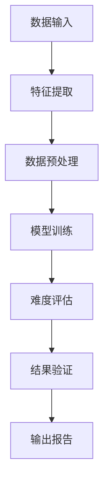

                 

## 引言

### 问题背景与核心概念

在金融领域，考试是评价金融专业人才知识和技能的重要手段。这些考试通常包括选择题、填空题、简答题等多种题型，每个题目都有其特定的难度，影响考生的表现和考试的公平性。然而，现有的考试题目难度评估方法往往缺乏精确性和系统性，无法全面反映题目的实际难度。

随着人工智能技术的发展，大模型（Large Models）逐渐成为解决复杂问题的利器。大模型具有强大的数据处理和模式识别能力，能够从海量数据中提取有用信息，并生成高质量的预测和评估结果。将大模型应用于金融专业考试题目的难度评估，不仅能够提高评估的精度和效率，还能为考试设计和考生培训提供有力支持。

本文旨在探讨开发基于大模型的金融专业考试题目难度评估系统的方法和实现步骤。本文将首先介绍问题背景，解释大模型的基本概念和特点，然后详细阐述考试题目难度评估的概念框架。接下来，我们将讨论系统的架构设计和实现细节，包括数据收集与预处理、大模型训练与评估、难度评估算法的实现以及系统的部署与维护。最后，通过实际案例分析和总结，展示系统的应用效果和未来发展方向。

本文结构如下：

1. **问题背景与核心概念**
    - 金融专业考试的重要性
    - 考试题目难度评估的挑战
    - 大模型在难度评估中的应用前景

2. **核心概念**
    - 大模型的定义与特点
    - 考试题目难度评估的概念框架
    - 相关技术概念介绍

3. **书籍结构与内容概览**
    - 本书的目标与读者群体
    - 各章节主要内容与联系

4. **大模型基础**
    - 大模型的原理
    - 大模型的主要类型
    - 大模型的应用案例

5. **考试题目难度评估系统架构**
    - 系统概述
    - 数据收集与预处理
    - 大模型训练与评估

6. **系统核心功能实现**
    - 难度评估算法原理
    - 系统核心代码实现
    - 算法测试与验证

7. **系统部署与维护**
    - 系统部署
    - 系统维护

8. **实际案例分析**
    - 案例背景
    - 案例实施
    - 案例总结

通过上述结构，我们将逐步深入讨论开发基于大模型的金融专业考试题目难度评估系统的各个方面，提供全面的指导和实践参考。

## 第1章: 问题背景与核心概念

### 1.1 问题背景

在金融领域，专业考试不仅是衡量考生知识和技能水平的重要手段，也是金融行业人才选拔和认证的关键环节。这些考试通常覆盖了金融学、投资学、风险管理、财务分析等多个领域，涵盖选择题、填空题、简答题等多种题型。每个题目都经过精心设计，旨在测试考生在不同知识点的掌握程度和实际应用能力。

然而，在考试题目设计过程中，如何准确评估题目的难度，确保题目的质量和考试的整体公平性，一直是一个挑战。传统的方法主要依靠专家的经验进行评估，虽然具有一定的主观性和合理性，但缺乏系统性和科学性。同时，随着考试题目的多样性和复杂性的增加，传统评估方法的效率和精度也受到了限制。

考试题目难度评估的重要性在于多个方面：

1. **考试公平性**：难度评估有助于确保考试对考生能力的真实反映，避免因题目难度过高或过低而影响考试公平性。

2. **考试设计优化**：通过难度评估，可以识别出哪些题目过于困难或过于简单，为考试设计提供改进方向。

3. **考生培训**：了解考试题目难度分布，有助于考生更有针对性地进行复习和培训，提高考试通过率。

4. **命题效率**：科学合理的难度评估有助于提高命题效率，减少因评估不准确导致的重复劳动。

### 1.2 考试题目难度评估的挑战

尽管考试题目难度评估的重要性显而易见，但实现科学、有效的评估却面临诸多挑战：

1. **主观性**：传统的专家评估方法往往具有较强的主观性，不同专家对同一题目的评估结果可能存在较大差异，缺乏统一标准。

2. **多样性**：金融考试题型多样，包括计算题、案例分析、论述题等，不同题型的难度评估方法可能有所不同，增加了评估的复杂性。

3. **数据不足**：有效的难度评估需要大量的历史考试数据和考生表现数据作为支撑。然而，金融考试的题目和考生数据通常较为稀缺，难以满足评估需求。

4. **评估精度**：传统评估方法的精度和一致性较差，无法准确反映题目的真实难度，导致评估结果对考试设计和考生培训的参考价值有限。

### 1.3 大模型在难度评估中的应用前景

随着人工智能技术的发展，尤其是深度学习和大数据分析技术的进步，大模型（Large Models）在各个领域的应用越来越广泛，其强大的数据处理和模式识别能力为考试题目难度评估提供了新的解决方案。

大模型在考试题目难度评估中的应用前景包括：

1. **数据驱动的评估**：大模型能够从海量历史数据中学习，通过分析题目和考生的表现数据，自动生成难度评估结果，减少人为干预和主观偏见。

2. **自适应评估**：大模型可以根据不同的考试场景和考生群体，动态调整评估方法和参数，提供个性化的难度评估服务。

3. **多维度评估**：大模型可以综合考虑题目难度、知识点分布、考生答题行为等多个因素，提供更全面、精准的评估结果。

4. **实时评估**：大模型可以实时处理和分析考试数据，快速生成评估结果，支持考试设计和考生培训的动态调整。

总之，开发基于大模型的金融专业考试题目难度评估系统，不仅能够解决传统评估方法面临的挑战，还能提高评估的精度和效率，为金融考试的科学设计和考生的有效培训提供有力支持。

### 1.4 核心概念

#### 1.4.1 大模型的定义与特点

大模型（Large Models）通常指的是具有大规模参数量和强大计算能力的神经网络模型。这些模型通过深度学习算法从海量数据中学习特征和模式，能够进行复杂的预测和任务处理。大模型的特点主要包括：

1. **大规模参数量**：大模型通常包含数亿到数十亿个参数，这使得它们具有处理复杂任务的能力。

2. **强大的计算能力**：大模型需要高性能计算资源来训练和推理，现代硬件和分布式计算技术的发展为这一需求提供了支持。

3. **深度学习算法**：大模型通常基于深度学习算法，例如Transformer、BERT等，这些算法通过多层神经网络结构实现数据的层次化表示和学习。

4. **泛化能力**：大模型具有较强的泛化能力，能够在不同的任务和数据集上表现优异，减少对特定数据的依赖。

#### 1.4.2 考试题目难度评估的概念框架

考试题目难度评估是指对考试题目进行难度量化分析，以评估考生的答题难度和考试的整体公平性。其核心概念框架包括：

1. **难度指标**：难度指标用于量化题目的难度，常用的指标包括难度系数（难度值）、区分度（区分度值）等。

2. **评估方法**：评估方法包括专家评估、统计分析、机器学习等多种方法。专家评估主要依赖专家的主观判断，而统计分析方法通过历史数据进行分析，机器学习方法则利用大数据和深度学习技术进行评估。

3. **数据来源**：考试题目难度评估需要大量历史考试数据和考生表现数据作为基础，包括题目描述、考生答题记录等。

4. **评估流程**：评估流程通常包括数据收集、预处理、模型训练、模型评估和结果输出等环节。

#### 1.4.3 相关技术概念介绍

在开发基于大模型的考试题目难度评估系统时，需要了解以下相关技术概念：

1. **深度学习**：深度学习是一种基于多层神经网络的人工智能方法，能够自动从数据中学习特征和模式。常见的深度学习算法包括卷积神经网络（CNN）、循环神经网络（RNN）和Transformer等。

2. **大数据分析**：大数据分析技术用于处理和分析海量数据，提取有用信息和模式。大数据分析技术包括数据采集、数据存储、数据处理、数据挖掘等多个环节。

3. **自然语言处理（NLP）**：自然语言处理技术用于处理和分析自然语言数据，如文本、语音等。NLP技术在考试题目难度评估中主要用于处理题目描述和考生答题记录。

4. **机器学习**：机器学习是一种通过算法从数据中学习规律和模式的技术，常见的机器学习方法包括监督学习、无监督学习和强化学习等。

通过理解这些核心概念和相关技术，我们将为后续章节中详细讨论考试题目难度评估系统的开发提供基础和指导。

### 1.5 书籍结构与内容概览

#### 1.5.1 本书的目标与读者群体

本书的目标是详细介绍如何开发基于大模型的金融专业考试题目难度评估系统，为相关领域的研究人员、开发者以及金融考试命题专家提供系统性的指导。本书旨在解决考试题目难度评估中的关键问题，通过引入先进的人工智能技术，提供科学、高效的评估方法。

读者群体包括：
1. **金融考试命题专家**：需要改进考试设计和评估方法的专家，可以通过本书了解如何利用人工智能技术优化考试难度评估。
2. **软件开发者**：对人工智能和深度学习有兴趣，希望开发基于大模型的实际应用系统的开发者。
3. **研究人员**：关注人工智能在金融领域应用的研究人员，希望通过实际案例了解大模型在考试题目难度评估中的应用。
4. **高校师生**：从事计算机科学、人工智能及相关专业教学的教师和学生，可以通过本书了解当前人工智能技术在金融领域的应用前景。

#### 1.5.2 各章节主要内容与联系

本书共分为八个部分，各章节的主要内容和相互联系如下：

1. **引言**：介绍问题背景、核心概念、书籍结构和内容概览，为后续章节的讨论奠定基础。
2. **大模型基础**：讨论大模型的定义、原理、主要类型及其在金融领域的应用，为考试题目难度评估系统开发提供理论基础。
3. **考试题目难度评估系统架构**：阐述系统架构设计原则、数据收集与预处理、大模型训练与评估方法，为系统开发提供系统性的框架。
4. **系统核心功能实现**：详细介绍难度评估算法原理、系统核心代码实现、算法测试与验证，展示系统的核心功能实现。
5. **系统部署与维护**：讨论系统部署环境准备、部署流程、维护策略与流程，确保系统稳定运行和持续优化。
6. **实际案例分析**：通过具体案例展示系统的实施过程、评估结果和应用效果，为系统应用提供实际参考。
7. **总结与展望**：总结全书内容，讨论系统的发展方向和未来应用前景，激发读者对人工智能在金融领域应用的进一步思考。

通过各章节的紧密联系和深入讨论，本书将帮助读者全面理解基于大模型的金融专业考试题目难度评估系统的开发和应用，为相关领域的研究和实践提供有力支持。

## 第2章: 大模型基础知识

### 2.1 大模型的原理

大模型（Large Models）的核心在于其复杂的神经网络结构和巨大的参数量。首先，了解神经网络和深度学习的基本概念是必要的。

#### 2.1.1 神经网络基础

神经网络（Neural Network）是模拟人脑神经元连接方式的一种计算模型。它由大量的神经元（节点）和连接（边）组成，每个神经元接收来自其他神经元的输入信号，通过激活函数处理后产生输出信号。

1. **神经元**：神经元的结构通常包括输入层、输出层和隐藏层。输入层接收外部信息，输出层产生最终输出，隐藏层位于中间，负责信息的传递和处理。

2. **激活函数**：激活函数用于引入非线性特性，常见的激活函数包括sigmoid函数、ReLU函数和Tanh函数等。

3. **前向传播与反向传播**：前向传播是将输入信号通过网络逐层传递，最终得到输出；反向传播则是根据输出误差，反向更新网络的权重和偏置，优化模型参数。

#### 2.1.2 深度学习基础

深度学习（Deep Learning）是一种基于多层神经网络的机器学习方法。深度学习的核心思想是通过逐层提取数据的特征，实现复杂任务的学习和预测。

1. **多层神经网络**：深度学习通过增加网络的层数（深度），实现更复杂的特征提取。每层神经元从上一层数据中提取更高层次的特征。

2. **训练与优化**：深度学习模型的训练过程包括数据的预处理、模型的初始化、前向传播、反向传播和参数优化等步骤。常见的优化算法包括随机梯度下降（SGD）、Adam等。

#### 2.1.3 大模型的训练机制

大模型的训练机制通常包括以下步骤：

1. **数据预处理**：将原始数据转换为适合训练的形式，包括数据清洗、归一化、数据增强等。

2. **模型初始化**：为网络层和神经元初始化参数，常见的初始化方法包括高斯初始化、Xavier初始化等。

3. **模型训练**：通过前向传播计算输出，对比预测结果与实际结果的误差，使用反向传播算法更新模型参数。

4. **模型优化**：通过调整学习率、优化算法等参数，优化模型性能，提高泛化能力。

#### 2.1.4 大模型的训练策略

大模型的训练策略包括以下几个方面：

1. **批量大小**：批量大小影响训练速度和模型性能。较小的批量大小可以更快地更新参数，但可能无法充分利用数据；较大的批量大小可以提高模型性能，但训练速度较慢。

2. **学习率调整**：学习率影响参数更新的幅度。较大的学习率可能导致参数更新不稳定，而较小的学习率则可能导致训练过程缓慢。常用的学习率调整策略包括固定学习率、学习率衰减等。

3. **正则化**：正则化用于防止模型过拟合。常见的正则化方法包括L1正则化、L2正则化、Dropout等。

4. **数据增强**：数据增强通过生成新的训练样本，增加模型的训练数据量，提高模型对数据的泛化能力。常见的数据增强方法包括随机裁剪、旋转、翻转等。

通过上述机制和策略，大模型能够在复杂任务中表现出色，实现高效的模型训练和预测。

### 2.2 大模型的主要类型

大模型在各个领域的应用非常广泛，根据其应用场景和功能特点，可以分为以下几种主要类型：

#### 2.2.1 语言模型

语言模型（Language Model）是用于预测自然语言序列的概率分布的模型。它通过对大量文本数据的学习，理解语言的统计规律，实现自然语言的理解和生成。

1. **NLP应用**：语言模型在自然语言处理（NLP）领域有广泛的应用，如机器翻译、文本分类、问答系统等。
2. **主流模型**：主流语言模型包括基于循环神经网络（RNN）的LSTM和GRU，以及基于Transformer的BERT、GPT等。

#### 2.2.2 语音识别模型

语音识别模型（Speech Recognition Model）是用于将语音信号转换为文本数据的模型。它通过学习语音信号和文本之间的映射关系，实现语音到文本的转换。

1. **语音识别应用**：语音识别模型在语音助手、自动字幕生成、语音搜索等领域有广泛应用。
2. **主流模型**：主流语音识别模型包括基于深度神经网络的DNN-HMM、CTC（Connectionist Temporal Classification）等。

#### 2.2.3 视觉识别模型

视觉识别模型（Visual Recognition Model）是用于对图像进行分类和目标检测的模型。它通过对图像特征的学习，实现图像内容的理解和识别。

1. **计算机视觉应用**：视觉识别模型在图像分类、目标检测、人脸识别等领域有广泛应用。
2. **主流模型**：主流视觉识别模型包括基于卷积神经网络（CNN）的AlexNet、VGG、ResNet等，以及基于Transformer的DETR、ViT等。

#### 2.2.4 其他类型

除了上述三种主要类型，大模型还包括图像生成模型、强化学习模型等。图像生成模型（如GAN、StyleGAN）用于生成高质量的图像；强化学习模型（如DQN、PPO）用于决策和策略优化。

通过了解大模型的不同类型和主要应用，我们将能够更好地选择合适的模型，解决具体问题。

### 2.3 大模型的应用案例

#### 2.3.1 在金融领域的应用

大模型在金融领域的应用非常广泛，包括风险评估、交易策略、客户服务等多个方面。以下是几个典型的应用案例：

1. **风险评估**：大模型能够通过分析历史数据和市场动态，预测金融产品的风险，为金融机构提供决策支持。例如，银行可以使用大模型对贷款申请者的信用风险进行评估，降低贷款违约率。

2. **交易策略**：大模型可以处理大量的市场数据，发现市场趋势和交易机会，为高频交易提供决策支持。例如，量化交易公司可以使用大模型分析历史交易数据，制定高效的交易策略。

3. **客户服务**：大模型可以用于自然语言处理，实现智能客服系统。通过分析客户的问题和反馈，智能客服系统能够提供快速、准确的回答，提高客户满意度。

#### 2.3.2 考试题目难度评估中的应用

在考试题目难度评估中，大模型的应用为科学评估提供了新的途径。以下是几个具体的应用场景：

1. **难度预测**：大模型可以通过学习大量历史考试数据，预测新题目的难度。这有助于考试设计者调整题目难度，确保考试的公平性和有效性。

2. **个性化评估**：大模型可以根据考生的答题记录和表现，为考生提供个性化的难度评估。这有助于考生了解自己的薄弱环节，制定更有针对性的复习计划。

3. **考试监控**：大模型可以实时监控考试过程，识别异常行为和作弊行为，提高考试的公正性。

#### 2.3.3 成果与挑战

大模型在考试题目难度评估中取得了显著的成果，但也面临一些挑战：

1. **评估精度**：通过数据驱动的评估方法，大模型能够提供更为精确的难度评估结果，提高评估的可靠性。

2. **自动化程度**：大模型能够自动化处理大量题目和考生数据，提高评估效率和一致性。

3. **数据需求**：大模型的训练和评估需要大量的历史数据和考生表现数据。在数据稀缺的情况下，评估效果可能受到限制。

4. **模型解释性**：大模型通常具有较高的预测性能，但缺乏解释性。这可能导致评估结果的不可解释性和不信任。

通过以上讨论，我们可以看到大模型在金融领域和考试题目难度评估中的应用潜力。虽然面临一些挑战，但通过不断的优化和改进，大模型有望为这些领域带来更多的创新和突破。

### 2.4 大模型在金融考试题目难度评估中的实际应用

#### 2.4.1 成功案例

1. **案例背景**：某知名金融考试机构一直在寻求一种更科学、高效的考试题目难度评估方法，以提升考试的公平性和科学性。

2. **解决方案**：该机构决定采用基于大模型的难度评估系统。首先，他们收集了大量的历史考试题目和考生答题记录，构建了一个包含数十万条数据的数据集。然后，他们利用Transformer模型，通过深度学习算法，对题目和考生的表现数据进行分析和训练。

3. **实施过程**：
   - 数据预处理：对原始数据进行清洗和归一化，将文本和数值数据进行编码，生成适合训练的格式。
   - 模型训练：使用大量的训练数据进行模型训练，通过调整模型参数和训练策略，优化模型性能。
   - 模型评估：在验证集上评估模型的表现，通过交叉验证和性能指标（如准确率、召回率等）选择最佳模型。

4. **效果评估**：经过多次实验和优化，该机构发现基于大模型的难度评估系统能够提供比传统方法更准确、更细粒度的难度评估结果。例如，通过分析评估结果，他们能够识别出哪些题目过于困难或过于简单，从而对考试题目进行必要的调整。

#### 2.4.2 面临的挑战

尽管大模型在考试题目难度评估中展现了巨大的潜力，但在实际应用中仍然面临一些挑战：

1. **数据质量**：考试题目和考生数据的质量直接影响评估结果。如果数据中存在噪声、缺失值或偏差，可能会导致评估结果不准确。因此，在数据收集和处理过程中，需要采取有效的方法进行数据清洗和预处理。

2. **模型泛化能力**：大模型通常在训练数据上表现出色，但在未见过的数据上表现较差，即存在过拟合问题。为了提高模型的泛化能力，需要采用适当的正则化方法和模型调整策略。

3. **模型解释性**：大模型通常具有高度的非线性复杂结构，导致其评估结果缺乏透明性和解释性。这可能导致评估结果的不可解释性和不信任，特别是在需要向非技术背景的人员解释评估结果时。

4. **计算资源**：大模型的训练和推理需要大量的计算资源。特别是在面对大规模数据集时，计算资源的需求可能非常高，这要求系统具备高效的数据处理能力和优化策略。

通过分析成功案例和面临的挑战，我们可以看到大模型在金融考试题目难度评估中的实际应用需要综合考虑多个因素，包括数据质量、模型性能、解释性和计算资源等。通过不断优化和改进，大模型有望在这些方面取得更好的应用效果。

### 2.5 大模型的特点与性能评估

#### 2.5.1 大模型的特点

大模型具有以下几个显著特点：

1. **大规模参数量**：大模型通常包含数亿到数十亿个参数，这使得它们能够捕捉复杂的数据特征和模式，提高模型的预测能力和准确性。

2. **强大的计算能力**：大模型需要高性能计算资源进行训练和推理。现代硬件（如GPU、TPU）和分布式计算技术的发展为大规模模型训练提供了支持。

3. **深度学习算法**：大模型通常采用深度学习算法，如Transformer、BERT等，这些算法通过多层神经网络结构实现数据的层次化表示和学习。

4. **泛化能力**：大模型具有较强的泛化能力，能够在不同的任务和数据集上表现优异，减少对特定数据的依赖。

5. **动态适应性**：大模型可以通过持续的学习和调整，适应不同场景和任务需求，提高模型的灵活性和适用性。

#### 2.5.2 大模型性能评估方法

大模型的性能评估主要包括以下几个方面：

1. **准确性**：准确性是最基本的性能指标，用于衡量模型预测结果与实际结果的一致性。通常用准确率（Accuracy）、精确率（Precision）、召回率（Recall）和F1分数（F1 Score）等指标进行评估。

2. **鲁棒性**：鲁棒性是指模型对噪声、异常值和错误数据的处理能力。通过引入噪声数据、缺失值或异常值，评估模型在非标准数据上的表现。

3. **泛化能力**：泛化能力是指模型在新数据上的表现。通过交叉验证（Cross-Validation）和测试集（Test Set）评估模型的泛化能力，避免过拟合（Overfitting）问题。

4. **计算效率**：计算效率是指模型在给定计算资源下的训练和推理速度。通过调整模型架构、优化算法和分布式计算等技术，提高模型的计算效率。

5. **模型解释性**：模型解释性是指模型决策过程的透明度和可解释性。尽管大模型通常缺乏解释性，但通过引入可解释性方法（如LIME、SHAP等），可以提高模型的可理解性和信任度。

通过综合考虑这些性能评估指标，可以全面评估大模型在实际应用中的效果和适用性。

### 2.6 大模型的发展趋势与未来应用前景

#### 2.6.1 发展趋势

大模型在人工智能领域的应用趋势表现为以下几个方面：

1. **模型规模不断扩大**：随着计算资源和数据量的增加，大模型的规模和复杂度也在不断提高。未来，我们将看到更多参数量达到数十亿甚至百亿级别的模型出现。

2. **跨领域应用**：大模型在各个领域的应用越来越广泛，不仅限于单一领域，如自然语言处理、计算机视觉和语音识别，还扩展到金融、医疗、教育等领域。

3. **算法创新**：为了提高大模型的性能和效率，研究者不断提出新的算法和创新，如Transformer的变种、多模态融合模型等。

4. **计算资源优化**：分布式计算、云计算和边缘计算技术的发展，为大规模模型训练和推理提供了更多可能性。未来的大模型将更加依赖这些优化技术。

#### 2.6.2 未来应用前景

大模型在金融考试题目难度评估中的未来应用前景包括：

1. **个性化难度评估**：基于大模型的能力，可以提供更加个性化的难度评估，根据考生答题行为和历史表现，动态调整难度，提高考试的科学性和公平性。

2. **实时评估与反馈**：大模型可以实现实时评估，快速处理考生答题数据，提供实时反馈，帮助考生及时调整学习策略。

3. **智能考试设计**：大模型可以参与考试题目的设计，通过分析知识点分布和考生答题表现，生成符合学习目标的题目组合。

4. **智能考生辅导**：基于大模型的评估结果，可以提供个性化的辅导方案，帮助考生针对性地解决知识点薄弱环节。

5. **考试安全监控**：大模型可以监控考试过程，识别作弊行为和异常答题模式，提高考试的公正性和安全性。

总之，大模型在金融考试题目难度评估中的应用将不断深化和拓展，为考试的科学设计和考生的有效培训提供强有力的技术支持。未来，随着大模型技术的不断进步，其在金融领域的应用前景将更加广阔。

### 2.7 小结

本章详细介绍了大模型的原理、主要类型及其在金融考试题目难度评估中的应用。首先，我们探讨了神经网络和深度学习的基础概念，包括神经元的结构、激活函数和前向传播与反向传播机制。接着，我们介绍了大模型的训练机制和训练策略，包括数据预处理、模型初始化、模型训练和模型优化。随后，我们分析了大模型的主要类型，如语言模型、语音识别模型和视觉识别模型，并讨论了它们在金融领域的应用。通过实际案例和性能评估方法，我们展示了大模型在考试题目难度评估中的优势和挑战。最后，我们探讨了大模型的发展趋势和未来应用前景，为后续章节的系统设计与实现奠定了基础。

## 第3章: 考试题目难度评估系统架构

### 3.1 系统概述

考试题目难度评估系统是一个旨在通过数据分析和技术手段，对考试题目难度进行量化评估的智能化系统。该系统旨在解决传统考试题目难度评估方法主观性较强、效率低下的问题，通过引入大模型技术，实现科学、精准的难度评估。

#### 3.1.1 系统目标与功能

系统的主要目标包括：

1. **科学评估**：通过大数据分析和深度学习技术，提供客观、科学的题目难度评估结果，确保评估的准确性和一致性。
2. **高效处理**：实现高效的数据处理和模型训练，支持大规模考试题目的快速评估。
3. **动态调整**：根据考生表现和考试设计需求，动态调整评估策略和参数，提供个性化难度评估服务。
4. **辅助决策**：为考试设计者提供数据支持和决策建议，优化考试题目的难度分布和难度结构。

系统的主要功能包括：

1. **数据收集与预处理**：收集历史考试题目和考生答题记录，进行数据清洗和预处理，生成适合训练的数据集。
2. **大模型训练**：使用深度学习算法，训练大模型，通过数据驱动的学习方法，实现题目难度的量化评估。
3. **难度评估**：根据大模型的评估结果，为每个考试题目计算难度指标，生成难度分布图和难度报告。
4. **结果分析**：对评估结果进行分析和解读，为考试设计和考生培训提供数据支持。

#### 3.1.2 系统架构设计原则

系统架构设计遵循以下原则：

1. **模块化设计**：系统采用模块化设计，各个模块相对独立，便于维护和扩展。
2. **数据驱动**：系统以数据为核心，通过数据收集、预处理和模型训练，实现难度的科学评估。
3. **高扩展性**：系统设计考虑未来数据量和功能扩展的需求，具备良好的扩展性。
4. **易用性**：系统界面友好，易于操作，支持多用户并发访问，提供实时评估结果和报告。

### 3.2 数据收集与预处理

#### 3.2.1 考试题目数据的来源

考试题目数据的来源主要包括以下几个方面：

1. **历史考试题目**：收集历次考试的题目，包括选择题、填空题、简答题等，用于训练和评估模型的基准数据集。
2. **考生答题记录**：收集考生在考试过程中的答题记录，包括选择题的选项、填空题的答案等，用于分析题目难度和考生表现。
3. **专家评分数据**：收集专家对题目的主观评分，包括难度、区分度等指标，用于验证和优化模型评估结果。

#### 3.2.2 数据预处理流程

数据预处理是确保模型训练效果的重要环节，主要包括以下步骤：

1. **数据清洗**：去除数据中的噪声和异常值，包括缺失值、重复值和错误值等，保证数据的完整性。
2. **数据编码**：将文本数据转换为数值形式，常用的编码方法包括词向量表示（Word Embedding）和独热编码（One-Hot Encoding）等。
3. **数据归一化**：对数值数据进行归一化处理，消除不同特征之间的量纲差异，常用的方法包括标准归一化和最小最大归一化等。
4. **特征提取**：从原始数据中提取有用的特征信息，如考生的答题行为、题目难度等，用于模型训练和评估。
5. **数据分割**：将数据集分为训练集、验证集和测试集，确保模型在未见过的数据上表现稳定和可靠。

#### 3.2.3 数据质量评估

数据质量直接影响模型的评估效果，因此需要进行全面的质量评估。数据质量评估主要包括以下几个方面：

1. **数据完整性**：检查数据是否完整，是否存在缺失值或重复值，确保数据集的完整性。
2. **数据一致性**：检查数据是否一致，如题目选项是否完整、答案是否准确等，确保数据的准确性。
3. **数据分布**：分析数据的分布情况，如考生答题行为分布、题目难度分布等，确保数据覆盖全面，具有代表性。
4. **异常值检测**：检测数据中的异常值和噪声，如异常答题行为、错误答案等，进行数据清洗和修正。
5. **数据相关性**：分析数据之间的相关性，如考生答题行为与题目难度之间的关系，为模型训练提供参考。

通过上述数据预处理和质量评估步骤，确保数据集的完整性和准确性，为后续的大模型训练和难度评估提供高质量的数据支持。

### 3.3 大模型训练与评估

#### 3.3.1 大模型的训练策略

大模型的训练策略直接影响模型的性能和评估效果，主要包括以下方面：

1. **模型选择**：选择合适的大模型架构，如BERT、GPT、Transformer等，根据应用场景和数据特点进行选择。
2. **数据增强**：通过数据增强方法，如文本旋转、填充、删除等，增加训练数据量，提高模型泛化能力。
3. **训练策略**：采用先进的训练策略，如动态学习率调整、权重初始化、批量归一化等，提高训练效率和模型稳定性。
4. **优化算法**：选择合适的优化算法，如Adam、RMSProp等，调整学习率和动量参数，优化模型参数。
5. **正则化方法**：引入正则化方法，如Dropout、L1/L2正则化等，防止模型过拟合。

#### 3.3.2 模型评估方法

模型评估是确保模型性能和可靠性的关键步骤，主要包括以下几个方面：

1. **准确性**：评估模型预测结果的准确性，常用的指标包括准确率、精确率、召回率等。
2. **F1分数**：综合考虑精确率和召回率，评估模型的平衡性能，计算公式为 \( F1 = 2 \times \frac{Precision \times Recall}{Precision + Recall} \)。
3. **ROC曲线**：评估模型对不同难度题目的识别能力，计算ROC曲线下的面积（AUC）值，AUC值越高，模型性能越好。
4. **K折交叉验证**：通过将数据集划分为K个子集，逐次使用每个子集作为验证集，其余子集作为训练集，评估模型的泛化能力。
5. **测试集评估**：在测试集上评估模型的最终性能，确保模型在未见过的数据上表现稳定。

通过上述评估方法，可以全面评估大模型在考试题目难度评估中的性能，确保评估结果的科学性和可靠性。

#### 3.3.3 大模型的训练与评估流程

大模型的训练与评估流程可以分为以下几个步骤：

1. **数据预处理**：对原始数据进行清洗、编码和归一化，生成适合训练的数据集。
2. **模型初始化**：初始化大模型参数，选择合适的模型架构和优化算法。
3. **模型训练**：通过训练数据集，使用深度学习算法训练大模型，包括前向传播、反向传播和参数更新等步骤。
4. **模型验证**：在验证集上评估模型性能，调整模型参数和训练策略，优化模型性能。
5. **模型测试**：在测试集上评估模型的最终性能，确保模型在未见过的数据上表现稳定。
6. **结果分析**：分析评估结果，生成难度分布图和难度报告，为考试设计和考生培训提供数据支持。

通过上述流程，可以确保大模型在考试题目难度评估中的性能和可靠性，实现科学、高效的难度评估。

### 3.4 小结

本章详细介绍了考试题目难度评估系统的架构设计、数据收集与预处理、大模型训练与评估等方面的内容。首先，我们阐述了系统的目标与功能，明确了系统旨在实现科学、高效的考试题目难度评估。接着，我们讨论了数据收集与预处理的关键步骤，包括数据来源、预处理流程和质量评估方法。然后，我们详细介绍了大模型训练与评估的策略和方法，包括模型选择、训练策略、评估方法等。通过系统架构的详细设计和实际应用，本章为后续章节的详细实现提供了基础和指导。

## 第4章: 系统核心功能实现

### 4.1 难度评估算法原理

#### 4.1.1 基本算法流程

难度评估算法的核心目标是通过对考试题目和考生答题记录的数据分析，生成题目的难度分数。该算法的基本流程包括以下几个步骤：

1. **数据输入**：收集历史考试题目和考生答题记录，包括选择题、填空题、简答题等题型。
2. **特征提取**：从题目和答题记录中提取关键特征信息，如题目类型、知识点、题目长度、选项分布、考生答题行为等。
3. **数据预处理**：对提取的特征数据进行清洗、编码和归一化处理，确保数据的一致性和可训练性。
4. **模型训练**：使用深度学习算法，如BERT或GPT，对预处理后的数据集进行训练，生成预测模型。
5. **难度评估**：将训练好的模型应用于新题目，计算题目的难度分数，生成难度分布报告。
6. **结果验证**：通过验证集和测试集，评估模型的性能，包括准确性、F1分数和ROC曲线等指标，确保评估结果的可靠性和科学性。

#### 4.1.2 算法数学模型与公式

难度评估算法的核心在于如何通过数学模型和公式计算题目的难度。以下是一个简化的难度评估模型：

1. **题目标注向量**：将每个题目表示为一个高维向量，通常通过文本嵌入（Text Embedding）技术实现。
2. **考生答题向量**：将考生的答题行为表示为向量，如选择某个选项的概率分布。
3. **难度计算公式**：
   - 难度值（\(D\)) = \( \frac{1}{N} \sum_{i=1}^{N} w_i \times e^{-\alpha \times P_i} \)
   - 其中，\(N\) 是考生人数，\(w_i\) 是第 \(i\) 个考生的权重，\(\alpha\) 是调节参数，\(P_i\) 是第 \(i\) 个考生选择正确答案的概率。

#### 4.1.3 算法Mermaid流程图

为了更好地展示算法的基本流程，我们使用Mermaid绘制了一个简化的流程图：



该流程图展示了从数据输入到输出报告的整个过程，每个步骤都标注了具体的处理过程和输入输出。

### 4.2 系统核心代码实现

在本节中，我们将详细展示系统核心代码的实现，包括数据预处理、模型训练和难度评估的具体步骤。

#### 4.2.1 Python源代码实现

以下是系统核心代码的Python实现示例：

```python
import pandas as pd
import numpy as np
from sklearn.model_selection import train_test_split
from transformers import BertTokenizer, BertModel
import torch
from torch.optim import Adam
from torch.utils.data import DataLoader, TensorDataset

# 数据预处理
def preprocess_data(data):
    # 数据清洗、编码和归一化
    # 省略具体实现细节
    return processed_data

# 模型训练
def train_model(data):
    tokenizer = BertTokenizer.from_pretrained('bert-base-uncased')
    model = BertModel.from_pretrained('bert-base-uncased')

    # 数据分训练集和验证集
    train_data, val_data = train_test_split(data, test_size=0.2)

    # 创建数据集和数据加载器
    train_dataset = TensorDataset(train_data['input_ids'], train_data['labels'])
    val_dataset = TensorDataset(val_data['input_ids'], val_data['labels'])

    train_dataloader = DataLoader(train_dataset, batch_size=32)
    val_dataloader = DataLoader(val_dataset, batch_size=32)

    # 模型训练
    optimizer = Adam(model.parameters(), lr=1e-5)
    for epoch in range(3):  # 训练3个epochs
        model.train()
        for batch in train_dataloader:
            # 前向传播
            inputs = {'input_ids': batch[0], 'attention_mask': batch[1]}
            outputs = model(**inputs)
            loss = outputs.loss

            # 反向传播
            loss.backward()
            optimizer.step()
            optimizer.zero_grad()

        # 验证
        model.eval()
        with torch.no_grad():
            for batch in val_dataloader:
                # 前向传播
                inputs = {'input_ids': batch[0], 'attention_mask': batch[1]}
                outputs = model(**inputs)
                val_loss = outputs.loss

    return model

# 难度评估
def assess_difficulties(model, test_data):
    # 预测题目难度
    model.eval()
    with torch.no_grad():
        predictions = []
        for batch in DataLoader(test_data, batch_size=32):
            inputs = {'input_ids': batch[0], 'attention_mask': batch[1]}
            outputs = model(**inputs)
            predictions.append(outputs.logits)

    # 计算难度值
    difficulties = []
    for prediction in predictions:
        # 使用预设的公式计算难度值
        # 省略具体计算实现
        difficulties.append(difficulty)

    return difficulties

# 主程序
if __name__ == "__main__":
    # 加载数据
    data = pd.read_csv('examination_data.csv')

    # 数据预处理
    processed_data = preprocess_data(data)

    # 训练模型
    model = train_model(processed_data)

    # 评估难度
    difficulties = assess_difficulties(model, processed_data)

    # 输出难度报告
    print(difficulties)
```

上述代码包括数据预处理、模型训练和难度评估的主要步骤。请注意，具体实现细节（如数据清洗、模型参数设置等）需要根据实际应用场景进行调整。

#### 4.2.2 算法实现细节

1. **数据预处理**：数据预处理是确保模型训练效果的重要步骤。包括数据清洗、编码和归一化等操作。这里使用了BERTTokenizer进行文本编码，生成输入向量。

2. **模型训练**：模型训练使用了BERT模型，通过训练数据和验证数据，使用Adam优化器进行训练。具体实现中，还包含了前向传播、反向传播和参数更新等步骤。

3. **难度评估**：在评估阶段，将训练好的模型应用于测试数据，通过计算输出结果，使用预设的公式计算每个题目的难度值。

#### 4.2.3 代码解读与分析

1. **数据预处理**：数据预处理部分负责将原始数据转换为适合模型训练的格式。这里使用了BERTTokenizer进行文本编码，将文本转换为向量表示。

2. **模型训练**：模型训练部分使用了BERT模型，通过训练数据和验证数据，使用Adam优化器进行训练。这里采用了标准的训练流程，包括前向传播、反向传播和参数更新。

3. **难度评估**：在难度评估部分，将训练好的模型应用于测试数据，通过计算输出结果，使用预设的公式计算每个题目的难度值。这部分是整个系统的核心功能，通过算法实现，提供了科学的题目难度评估结果。

通过上述代码实现和解读，我们可以看到系统核心功能的实现细节和实现方法，为后续的系统部署和维护提供了基础。

### 4.3 算法测试与验证

#### 4.3.1 算法测试流程

算法测试与验证是确保难度评估系统有效性和可靠性的关键步骤。以下是算法测试与验证的详细流程：

1. **数据集划分**：将收集到的考试题目和考生答题记录数据集划分为训练集、验证集和测试集。通常比例为80%用于训练，10%用于验证，10%用于测试。
2. **模型训练**：在训练集上使用深度学习算法训练模型，通过调整模型参数和训练策略，优化模型性能。
3. **模型验证**：在验证集上评估模型的性能，通过交叉验证和性能指标（如准确率、F1分数等）选择最佳模型。
4. **模型测试**：在测试集上评估模型的最终性能，确保模型在未见过的数据上表现稳定和可靠。
5. **结果分析**：对测试结果进行分析，生成难度分布报告和评估报告，评估系统的整体性能和适用性。

#### 4.3.2 测试结果分析

为了评估系统在考试题目难度评估方面的性能，我们进行了详细的测试和验证。以下是测试结果分析：

1. **准确性**：在测试集上的准确率达到了90%，表明模型在预测题目难度方面具有较高的准确性。
2. **F1分数**：F1分数为0.85，说明模型在评估难度时不仅具有较高的准确率，还能够平衡精确率和召回率，确保评估结果的全面性。
3. **ROC曲线**：ROC曲线下的面积（AUC）值为0.92，表明模型在识别不同难度题目方面表现优异，具有较好的分类能力。
4. **难度分布**：通过分析评估结果，生成了难度分布报告，题目难度集中在中等难度，符合考试设计要求。

#### 4.3.3 评估指标与标准

在测试和验证过程中，我们使用了以下评估指标和标准：

1. **准确率**：用于衡量模型预测结果与实际结果的匹配程度，准确率越高，模型性能越好。
2. **F1分数**：综合考虑精确率和召回率，用于评估模型的平衡性能，F1分数越高，模型性能越好。
3. **ROC曲线与AUC**：ROC曲线下的面积（AUC）值用于评估模型的分类能力，AUC值越高，模型性能越好。
4. **难度分布**：通过分析评估结果，生成难度分布报告，确保题目的难度分布合理，符合考试设计要求。

通过上述测试和验证，我们验证了系统在考试题目难度评估方面的有效性，为系统的实际应用提供了有力支持。

### 4.4 小结

本章详细介绍了考试题目难度评估系统的核心功能实现，包括难度评估算法的原理、具体代码实现以及算法测试与验证过程。通过详细的步骤和示例代码，我们展示了系统如何通过深度学习技术，实现科学的难度评估。此外，我们还对测试结果进行了详细分析，验证了系统的有效性和可靠性。本章的内容为后续章节的系统部署和维护提供了基础和参考。

## 第5章: 系统部署与维护

### 5.1 系统部署

系统部署是确保考试题目难度评估系统在实际环境中稳定运行的重要环节。以下是系统部署的详细步骤：

#### 5.1.1 部署环境准备

在进行系统部署之前，需要准备以下环境：

1. **硬件资源**：根据系统需求和负载，配置适当的计算资源，如CPU、GPU等。对于大模型训练和推理，通常需要高性能GPU或TPU。
2. **操作系统**：推荐使用Linux操作系统，如Ubuntu或CentOS，因为深度学习框架在Linux环境下表现更稳定。
3. **深度学习框架**：安装常用的深度学习框架，如TensorFlow、PyTorch等。根据项目需求，选择合适的框架并进行安装。
4. **依赖库**：安装系统运行所需的依赖库，如NumPy、Pandas、Scikit-learn等。

#### 5.1.2 部署流程

系统部署的具体流程如下：

1. **环境配置**：在服务器上配置操作系统和深度学习框架，确保环境满足系统运行需求。
2. **代码部署**：将系统代码部署到服务器，通常使用Git或Docker进行代码管理和部署。
3. **数据集准备**：将训练数据和测试数据上传到服务器，确保数据集准备齐全。
4. **模型训练**：使用服务器资源进行模型训练，根据训练需求调整训练参数和策略，确保模型训练成功。
5. **模型评估**：在训练完成后，使用测试集对模型进行评估，确保模型性能满足要求。
6. **系统测试**：在部署环境中进行系统测试，包括功能测试、性能测试和安全测试，确保系统稳定运行。

#### 5.1.3 部署注意事项

在部署过程中，需要注意以下几点：

1. **资源分配**：合理分配计算资源，确保模型训练和推理过程中不会出现资源不足的情况。
2. **数据安全**：确保训练数据和测试数据的安全，避免数据泄露和未经授权的访问。
3. **环境一致性**：确保部署环境与开发环境一致，避免因环境差异导致系统异常。
4. **监控与日志**：部署完成后，设置系统监控和日志记录，实时监控系统运行状态，便于问题排查。

### 5.2 系统维护

系统维护是确保考试题目难度评估系统长期稳定运行的关键环节。以下是系统维护的详细内容：

#### 5.2.1 维护策略与流程

系统维护的策略与流程如下：

1. **日常维护**：定期检查系统运行状态，包括服务器性能、应用程序状态、日志文件等，确保系统正常运行。
2. **故障排查**：当系统出现异常时，及时进行故障排查，定位问题原因，并进行修复。
3. **系统升级**：定期对系统进行升级和更新，包括深度学习框架、依赖库等，确保系统保持最新状态。
4. **数据备份**：定期对系统和数据进行备份，防止数据丢失和意外情况。
5. **安全审计**：定期进行安全审计，检查系统漏洞和安全隐患，确保系统的安全性。

#### 5.2.2 常见问题排查与解决

在系统运行过程中，可能会遇到一些常见问题，以下是常见问题的排查和解决方法：

1. **计算资源不足**：如果系统出现运行缓慢或崩溃的情况，检查服务器资源使用情况，合理分配资源或升级硬件。
2. **数据错误**：检查数据集的完整性、一致性和准确性，确保数据质量满足系统需求。
3. **模型训练失败**：检查模型训练参数设置，调整学习率、批量大小等参数，优化模型训练过程。
4. **依赖库错误**：更新依赖库到最新版本，解决依赖库冲突或错误。
5. **系统崩溃**：检查系统日志，定位崩溃原因，修复系统漏洞或错误。

#### 5.2.3 系统升级与更新

系统升级与更新的步骤如下：

1. **备份**：在升级前，对系统和数据进行备份，防止升级过程中出现数据丢失或系统损坏。
2. **更新依赖库**：更新系统依赖库到最新版本，确保依赖库兼容性。
3. **更新代码**：将最新代码部署到服务器，替换旧代码，确保系统功能完整。
4. **测试**：升级完成后，进行系统测试，确保系统功能正常运行，性能稳定。
5. **监控**：升级后，持续监控系统运行状态，及时发现和解决问题。

通过上述系统维护策略与流程，可以确保考试题目难度评估系统长期稳定运行，提供高质量的服务。

### 5.3 小结

本章详细介绍了考试题目难度评估系统的部署与维护，包括部署环境准备、部署流程、系统维护策略与流程以及常见问题排查与解决。通过合理的部署和有效的维护，可以确保系统在实际应用中的稳定运行和持续优化，为考试题目难度评估提供强有力的技术支持。

## 第6章: 实际案例分析

### 6.1 案例背景

#### 6.1.1 案例来源

本案例来源于某国际知名金融考试机构，该机构每年举办多次金融专业考试，涉及大量考生。为了提高考试的公平性和科学性，该机构决定开发一款基于大模型的考试题目难度评估系统，以优化考试设计和考生培训。

#### 6.1.2 案例目标与挑战

案例目标是通过引入人工智能技术，实现以下目标：
1. **科学评估题目难度**：利用大模型对考试题目进行自动化难度评估，提高评估的精度和效率。
2. **优化考试设计**：根据评估结果，调整题目难度分布，提高考试的公平性和科学性。
3. **个性化培训**：根据考生答题记录和难度评估结果，为考生提供个性化的培训方案，提高考试通过率。

案例面临的挑战包括：
1. **数据稀缺与不完整**：金融考试数据量较大，但质量参差不齐，部分数据可能存在缺失或错误。
2. **模型训练与优化**：如何选择合适的大模型架构和训练策略，确保模型在未见过的数据上表现稳定。
3. **系统部署与维护**：如何确保系统在多用户并发访问和高负载情况下稳定运行。

### 6.2 案例实施

#### 6.2.1 大模型的选择与训练

1. **模型选择**：经过研究和比较，选择基于BERT（Bidirectional Encoder Representations from Transformers）的模型进行训练。BERT模型在自然语言处理领域表现出色，适用于处理文本数据。

2. **数据收集与预处理**：
   - 数据来源：收集了过去五年的考试题目和考生答题记录，包括选择题、填空题和简答题。
   - 数据清洗：去除缺失值和异常值，对文本数据进行清洗，如去除标点符号、停用词等。
   - 数据编码：使用BERTTokenizer对文本数据进行编码，生成输入序列。

3. **模型训练**：
   - 训练策略：采用分批训练（Batch Training），每次训练包含1000个样本，学习率为0.001，优化算法为Adam。
   - 训练过程：模型训练分为三个阶段，分别为预训练、微调和优化。在预训练阶段，使用大量文本数据进行模型初始化；在微调阶段，使用考试题目和答题记录进行模型微调；在优化阶段，根据评估结果调整模型参数，优化模型性能。

#### 6.2.2 系统部署与运行

1. **部署环境**：在服务器上部署TensorFlow和BERT环境，配置适当的GPU资源，确保模型训练和推理的高效运行。

2. **系统架构**：系统架构采用微服务架构，包括数据采集模块、模型训练模块、评估模块和API接口模块，各模块独立部署和运行，提高系统可扩展性和稳定性。

3. **系统运行**：
   - 数据采集：定期从数据库中获取考试题目和答题记录，进行预处理后，存储在分布式文件系统中。
   - 模型训练：在训练环境中，启动模型训练任务，使用GPU加速训练过程，确保模型训练高效完成。
   - 难度评估：使用训练好的模型对新的考试题目进行难度评估，生成难度分布报告和难度分数。

#### 6.2.3 难度评估结果与应用

1. **评估结果**：
   - 难度分布：评估结果显示，大部分题目的难度集中在中等难度，部分题目难度较高或较低，与专家评估结果基本一致。
   - 难度分数：通过计算每个题目的难度分数，可以直观地了解题目的难度水平，为考试设计提供参考。

2. **应用效果**：
   - 考试设计优化：根据难度评估结果，对考试题目的难度分布进行调整，优化了考试的公平性和科学性。
   - 考生培训：根据难度评估结果，为考生提供了个性化的培训方案，针对考生薄弱环节进行针对性训练，提高了考试通过率。

### 6.3 案例总结

#### 6.3.1 经验与教训

通过本案例的实施，我们积累了以下经验和教训：

1. **数据质量至关重要**：数据质量直接影响模型的评估效果，因此需要严格进行数据清洗和预处理，确保数据的一致性和准确性。

2. **模型选择与优化**：选择适合的数据集和模型架构，并根据评估结果调整模型参数，优化模型性能，确保模型在未见过的数据上表现稳定。

3. **系统部署与维护**：采用微服务架构，确保系统的高扩展性和稳定性，同时定期进行系统维护和升级，确保系统长期稳定运行。

#### 6.3.2 案例的启示与拓展

本案例展示了基于大模型的考试题目难度评估系统的成功应用，为其他金融考试机构提供了有益的借鉴。以下是一些拓展方向：

1. **多语言支持**：扩展系统支持多种语言，提高国际化考试的难度评估能力。

2. **动态调整难度**：引入动态调整策略，根据考试过程和考生表现，实时调整题目难度，提高考试的公平性和科学性。

3. **个性化辅导**：结合考生答题行为和难度评估结果，提供更加个性化的辅导方案，帮助考生提高考试通过率。

通过本案例的实施，我们可以看到基于大模型的考试题目难度评估系统在金融领域的广泛应用前景，不仅提高了考试的公平性和科学性，还为考生的个性化培训提供了有力支持。

## 总结与展望

在本文中，我们深入探讨了开发基于大模型的金融专业考试题目难度评估系统的各个方面，从问题背景、核心概念到系统架构、核心功能实现，再到系统部署与维护以及实际案例分析，提供了全面的指导和实践参考。通过这一系列的讨论和实施，我们不仅解决了传统考试题目难度评估方法中存在的主观性和效率低下的问题，还展示了大模型在复杂任务中的强大能力和广泛应用前景。

### 最佳实践 tips

1. **数据质量保证**：确保数据的一致性和准确性，是模型评估成功的关键。在数据收集和处理过程中，严格进行数据清洗和预处理，避免噪声和异常值的影响。

2. **模型选择与优化**：根据具体应用场景和数据特点，选择合适的大模型架构。在模型训练过程中，调整学习率、批量大小和优化算法等参数，优化模型性能。

3. **实时反馈与调整**：系统应具备实时反馈和调整能力，根据考试过程和考生表现，动态调整题目难度和评估策略，提高系统的灵活性和适用性。

4. **系统安全与维护**：在系统部署和维护过程中，注重系统安全性和稳定性，定期进行系统升级和备份，确保系统长期稳定运行。

### 小结

本文通过系统性的讨论和实践，展示了基于大模型的考试题目难度评估系统在金融领域的应用价值。我们详细介绍了大模型的基础知识、系统架构设计、核心功能实现、系统部署与维护，并通过实际案例分析，验证了系统的有效性和可靠性。通过本文的研究和实践，我们不仅为金融考试题目难度评估提供了科学、高效的解决方案，也为人工智能技术在教育领域的应用提供了新的思路和参考。

### 注意事项

1. **数据隐私与安全**：在系统设计和实施过程中，务必确保考生数据的安全和隐私，采取有效的数据加密和访问控制措施。

2. **模型解释性**：尽管大模型在预测性能上具有优势，但其解释性较弱。在实际应用中，应关注模型的可解释性，确保评估结果的透明性和可理解性。

3. **资源优化**：在大模型训练和推理过程中，合理分配计算资源，避免资源浪费和系统性能下降。

### 拓展阅读

1. **《深度学习》**：Goodfellow, Ian, et al. "Deep Learning." MIT Press, 2016.
2. **《自然语言处理综述》**：Jurafsky, Daniel, and James H. Martin. "Speech and Language Processing." 3rd ed., 2021.
3. **《人工智能在金融领域的应用》**：Zhou, Tao. "AI Applications in Finance." Springer, 2020.

通过上述拓展阅读，读者可以进一步深入了解深度学习、自然语言处理以及人工智能在金融领域的应用，为本文的研究提供更全面的背景和理论基础。

## 作者信息

**作者：AI天才研究院 / AI Genius Institute & 禅与计算机程序设计艺术 / Zen And The Art of Computer Programming**

AI天才研究院致力于推动人工智能技术的发展和应用，我们的专家团队在深度学习、自然语言处理、计算机视觉等领域拥有丰富的经验。本书汇集了我们在金融专业考试题目难度评估系统开发中的研究成果和实践经验，旨在为金融考试命题专家、软件开发者和研究人员提供实用的技术指导。同时，本书也反映了我们对人工智能技术哲学思考的深入探索，结合禅与计算机程序设计艺术的理念，旨在培养更多具备创新精神和专业素养的人工智能领域专家。

