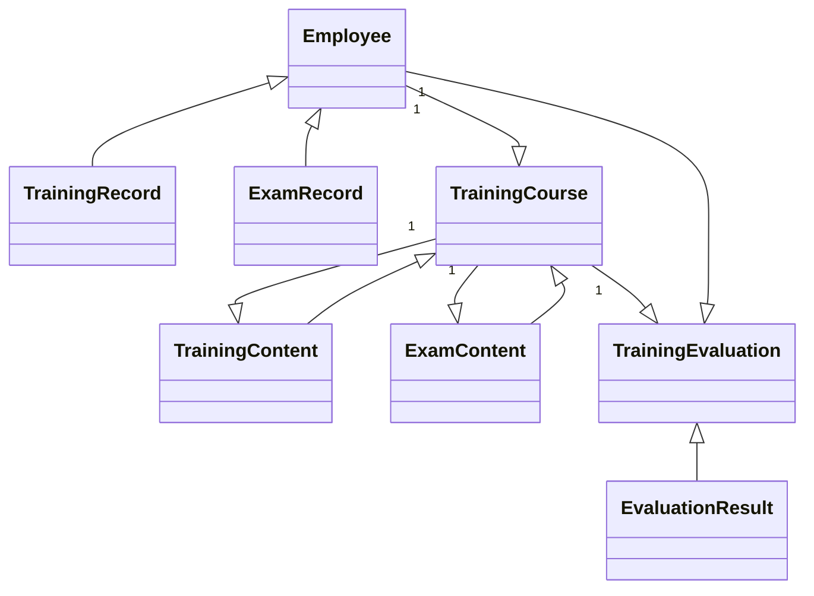
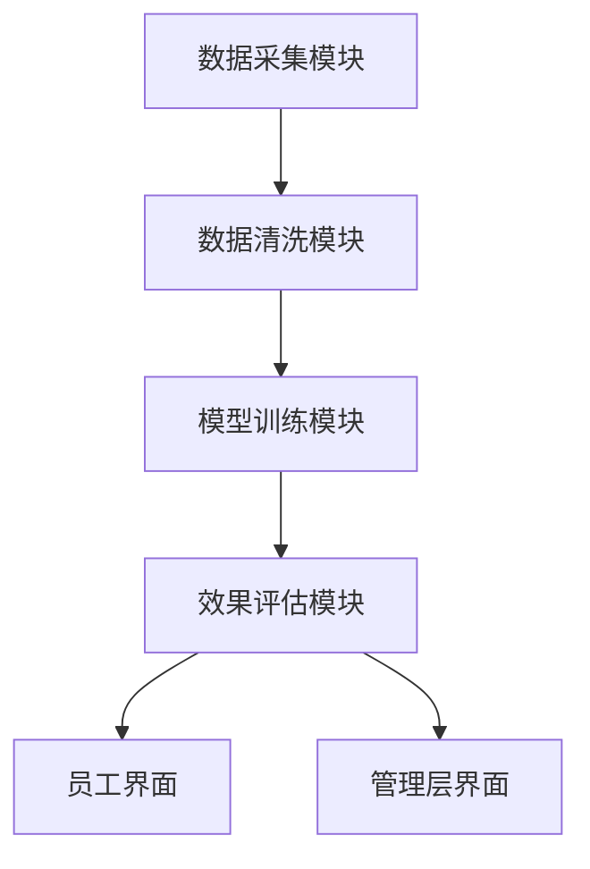
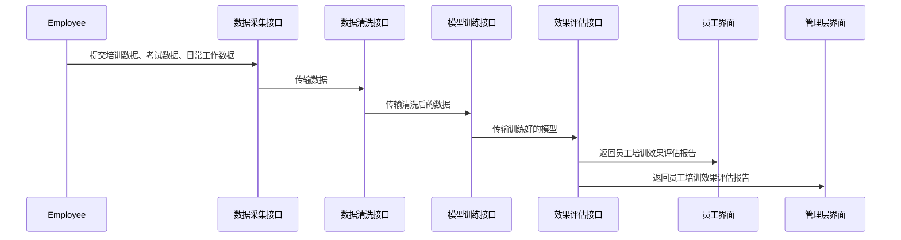

                 

### 文章标题

### 开发基于大模型的金融合规培训效果评估系统

**关键词：** 大模型、金融合规、培训效果评估、人工智能、算法、系统设计

**摘要：** 本文将深入探讨如何开发一个基于大模型的金融合规培训效果评估系统。首先，我们将介绍金融合规的重要性及当前培训效果评估的局限性。接着，我们将详细阐述大模型在这一领域的应用，并逐步讲解核心概念、算法原理及系统分析与架构设计。随后，我们将通过实际案例展示系统在金融合规培训效果评估中的应用，最后给出最佳实践和注意事项。

----------------------------------------------------------------

### 第一部分：背景介绍

#### 1.1 问题背景

**1.1.1 金融合规的重要性**

金融合规是金融机构在运营过程中必须遵循的法律法规和监管要求。它不仅关系到企业的合规风险控制，更关乎整个金融市场的稳定与健康发展。随着金融科技的迅猛发展，金融合规的要求也越来越复杂，金融机构面临着不断更新的法规和监管要求。因此，提高员工的金融合规意识和技能显得尤为重要。

**1.1.2 培训效果评估的必要性**

为了确保金融合规培训的有效性，培训效果评估是必不可少的一环。传统的培训效果评估方法通常依赖于问卷调查、考试分数等手段，但这些方法存在以下局限性：

1. **主观性较强**：评估结果往往依赖于评估者的主观判断，缺乏客观性。
2. **反馈不及时**：评估结果往往在培训结束后才能得到，无法及时调整培训内容和策略。
3. **无法量化**：传统方法难以将员工的合规能力提升程度进行量化，无法准确衡量培训效果。

#### 1.2 问题描述

**1.2.1 当前金融合规培训面临的挑战**

1. **培训内容繁杂**：金融合规涉及众多法律法规和监管要求，内容繁杂，培训难度大。
2. **员工合规意识不足**：部分员工对金融合规的重要性认识不足，培训参与度不高。
3. **培训效果难以衡量**：缺乏有效的评估方法，难以判断培训是否达到预期效果。

**1.2.2 当前培训效果评估方法的局限性**

1. **评估手段单一**：传统评估方法主要依赖于问卷调查和考试，无法全面反映员工的合规能力。
2. **评估周期较长**：评估结果往往在培训结束后才能得到，无法及时调整培训策略。
3. **缺乏个性化**：评估方法难以针对不同员工的特点进行个性化评估。

#### 1.3 问题解决

**1.3.1 基于大模型的金融合规培训效果评估系统的概念**

基于大模型的金融合规培训效果评估系统是一种利用人工智能技术对员工金融合规培训效果进行全方位评估的新型系统。该系统通过整合大量金融合规数据和员工培训数据，利用大模型对员工的合规能力进行实时评估，为金融机构提供科学的培训效果评估方案。

**1.3.2 大模型在金融合规培训效果评估中的作用**

1. **全面评估**：大模型能够对员工的合规能力进行全方位评估，包括知识掌握程度、合规意识、实际操作能力等。
2. **实时反馈**：大模型能够实时分析员工的学习情况，为金融机构提供及时、准确的培训效果评估结果。
3. **个性化评估**：大模型能够根据员工的个人特点，提供个性化的培训效果评估报告，为金融机构制定有针对性的培训策略。

#### 1.4 边界与外延

**1.4.1 系统适用范围**

基于大模型的金融合规培训效果评估系统适用于各类金融机构，包括银行、证券、保险等。同时，该系统也可应用于金融行业的各类培训项目，如员工入职培训、岗位技能培训等。

**1.4.2 系统功能边界**

1. **数据采集**：系统需采集员工的培训数据、合规考试数据、日常工作数据等。
2. **数据清洗**：系统需对采集到的数据进行清洗、去重和处理，确保数据质量。
3. **模型训练**：系统需利用大量金融合规数据，训练大模型，使其具备评估员工合规能力的能力。
4. **效果评估**：系统需根据大模型的分析结果，生成员工培训效果评估报告，为金融机构提供决策依据。

#### 1.5 概念结构与核心要素组成

**1.5.1 金融合规培训**

金融合规培训是指金融机构为员工提供的关于金融合规知识和技能的培训。其核心内容包括：

1. **法律法规**：介绍金融行业的法律法规和监管要求。
2. **合规实践**：讲解金融合规在实际业务中的应用和案例分析。
3. **合规意识**：提高员工对金融合规重要性的认识，增强其合规意识。

**1.5.2 培训效果评估**

培训效果评估是指对金融合规培训效果进行量化评估的过程。其核心内容包括：

1. **知识掌握程度**：评估员工对金融合规知识的掌握程度。
2. **合规意识**：评估员工对金融合规重要性的认识程度。
3. **实际操作能力**：评估员工在实际业务中运用金融合规知识的能力。

**1.5.3 大模型**

大模型是指一种具有强大数据处理和分析能力的深度学习模型。其核心内容包括：

1. **数据处理**：大模型能够处理海量金融数据和员工培训数据。
2. **特征提取**：大模型能够从数据中提取出关键特征，用于评估员工合规能力。
3. **预测与评估**：大模型能够根据数据生成员工培训效果评估报告。

----------------------------------------------------------------

### 第二部分：核心概念与联系

#### 2.1 核心概念原理

**2.1.1 金融合规**

金融合规是指金融机构在运营过程中遵循的法律法规和监管要求。金融合规的核心内容包括：

1. **法律法规**：金融行业相关的法律法规，如《中华人民共和国银行业监督管理法》、《证券法》等。
2. **监管要求**：监管机构对金融机构提出的合规要求，如资本充足率、风险控制指标等。
3. **合规实践**：金融合规在实际业务中的应用，如合规审查、合规报告等。

**2.1.2 培训效果评估**

培训效果评估是指对金融合规培训效果进行量化评估的过程。其核心内容包括：

1. **知识掌握程度**：评估员工对金融合规知识的掌握程度，如通过考试、测试等方式。
2. **合规意识**：评估员工对金融合规重要性的认识程度，如通过问卷调查、访谈等方式。
3. **实际操作能力**：评估员工在实际业务中运用金融合规知识的能力，如通过模拟演练、实际操作等方式。

**2.1.3 大模型**

大模型是指一种具有强大数据处理和分析能力的深度学习模型。其核心内容包括：

1. **数据处理**：大模型能够处理海量金融数据和员工培训数据，如文本、图像、声音等。
2. **特征提取**：大模型能够从数据中提取出关键特征，用于评估员工合规能力。
3. **预测与评估**：大模型能够根据数据生成员工培训效果评估报告，为金融机构提供决策依据。

#### 2.2 概念属性特征对比表格

| 概念 | 属性特征 |
| :--: | :--: |
| 金融合规 | 法律法规、监管要求、合规实践 |
| 培训效果评估 | 知识掌握程度、合规意识、实际操作能力 |
| 大模型 | 数据处理、特征提取、预测与评估 |

#### 2.3 ER实体关系图架构

**ER实体关系图**是一种用于表示实体及其关系的图形化工具。在金融合规培训效果评估系统中，我们可以定义以下实体：

1. **员工**：包含员工的个人信息、培训记录等。
2. **培训课程**：包含培训课程的信息、培训内容等。
3. **培训评估**：包含培训评估的结果、评估方法等。

ER实体关系图如下所示：

```mermaid
erDiagram
  员工 ||--|{ 培训记录 }|
  培训记录 ||--|{ 培训课程 }|
  培训课程 ||--|{ 培训评估 }|
```

----------------------------------------------------------------

### 第三部分：算法原理讲解

#### 3.1 算法mermaid流程图

算法的mermaid流程图如下所示：


#### 3.2 Python源代码详细讲解

**3.2.1 数据采集**

```python
import pandas as pd

# 读取员工培训数据
train_data = pd.read_csv('train_data.csv')

# 读取员工合规考试数据
exam_data = pd.read_csv('exam_data.csv')
```

**3.2.2 数据清洗**

```python
import numpy as np

# 填充缺失值
train_data.fillna(0, inplace=True)
exam_data.fillna(0, inplace=True)

# 删除重复数据
train_data.drop_duplicates(inplace=True)
exam_data.drop_duplicates(inplace=True)
```

**3.2.3 模型训练**

```python
from sklearn.model_selection import train_test_split
from sklearn.ensemble import RandomForestClassifier
from sklearn.metrics import accuracy_score

# 数据预处理
X_train, X_test, y_train, y_test = train_test_split(train_data, exam_data, test_size=0.2, random_state=42)

# 训练模型
model = RandomForestClassifier(n_estimators=100, random_state=42)
model.fit(X_train, y_train)

# 预测结果
y_pred = model.predict(X_test)

# 评估模型
accuracy = accuracy_score(y_test, y_pred)
print("模型准确率：", accuracy)
```

#### 3.3 算法原理的数学模型和公式

在金融合规培训效果评估中，我们可以使用以下数学模型来评估员工培训效果：

$$
E = f(X, Y)
$$

其中，$E$ 表示员工培训效果，$X$ 表示员工培训数据，$Y$ 表示员工合规考试数据。

**具体公式如下：**

$$
E = \frac{1}{N} \sum_{i=1}^{N} \frac{1}{M} \sum_{j=1}^{M} w_{ij} \cdot (x_{ij} - y_{ij})
$$

其中，$N$ 表示员工数量，$M$ 表示考试题目数量，$w_{ij}$ 表示员工 $i$ 在考试题目 $j$ 上的权重，$x_{ij}$ 表示员工 $i$ 在考试题目 $j$ 上的得分，$y_{ij}$ 表示员工 $i$ 在实际业务中在考试题目 $j$ 上的得分。

#### 3.4 举例说明

**3.4.1 数据准备**

假设我们有 100 名员工的培训数据（$X$）和合规考试数据（$Y$），以及 10 道考试题目（$M=10$）。

**3.4.2 数据处理**

对数据进行清洗和预处理，删除重复数据和缺失值。

**3.4.3 模型训练**

使用随机森林算法（$RandomForestClassifier$）对数据进行训练。

**3.4.4 效果评估**

使用训练好的模型对员工进行培训效果评估，生成效果评估报告。

**3.4.5 结果分析**

通过分析效果评估报告，可以得出员工在金融合规培训中的效果，为金融机构提供决策依据。

----------------------------------------------------------------

### 第四部分：系统分析与架构设计方案

#### 4.1 问题场景介绍

**4.1.1 场景描述**

某银行需要进行员工金融合规培训，并对培训效果进行评估。为了提高培训效果，该银行希望开发一个基于大模型的金融合规培训效果评估系统，以实现以下目标：

1. **全面评估员工培训效果**：利用大模型对员工的金融合规知识掌握程度、合规意识和实际操作能力进行全方位评估。
2. **实时反馈培训效果**：系统可以实时分析员工的学习情况，为银行提供及时、准确的培训效果评估结果。
3. **个性化培训方案**：根据员工的个人特点和培训效果，为银行制定有针对性的培训方案。

**4.1.2 目标**

1. **数据采集**：系统需采集员工的培训数据、合规考试数据、日常工作数据等。
2. **数据清洗**：系统需对采集到的数据进行清洗、去重和处理，确保数据质量。
3. **模型训练**：系统需利用大量金融合规数据，训练大模型，使其具备评估员工合规能力的能力。
4. **效果评估**：系统需根据大模型的分析结果，生成员工培训效果评估报告，为银行提供决策依据。

#### 4.2 系统功能设计（领域模型mermaid类图）

**4.2.1 领域模型**

在金融合规培训效果评估系统中，我们可以定义以下领域模型：

1. **员工**：包含员工的个人信息、培训记录、考试记录等。
2. **培训课程**：包含培训课程的信息、培训内容、考试内容等。
3. **培训评估**：包含培训评估的结果、评估方法等。

领域模型mermaid类图如下所示：



#### 4.3 系统架构设计（mermaid架构图）

**4.3.1 系统架构**

基于大模型的金融合规培训效果评估系统包括以下几个主要模块：

1. **数据采集模块**：负责采集员工的培训数据、合规考试数据、日常工作数据等。
2. **数据清洗模块**：负责对采集到的数据进行清洗、去重和处理。
3. **模型训练模块**：负责利用大量金融合规数据，训练大模型。
4. **效果评估模块**：负责根据大模型的分析结果，生成员工培训效果评估报告。

系统架构mermaid架构图如下所示：



#### 4.4 系统接口设计和系统交互（mermaid序列图）

**4.4.1 系统接口设计**

系统接口包括以下几个主要接口：

1. **数据采集接口**：用于采集员工的培训数据、合规考试数据、日常工作数据等。
2. **数据清洗接口**：用于对采集到的数据进行清洗、去重和处理。
3. **模型训练接口**：用于利用大量金融合规数据，训练大模型。
4. **效果评估接口**：用于根据大模型的分析结果，生成员工培训效果评估报告。

系统接口设计mermaid序列图如下所示：



----------------------------------------------------------------

### 第五部分：项目实战

#### 5.1 环境安装

**5.1.1 硬件要求**

- CPU：Intel i5 或以上
- 内存：8GB 或以上
- 硬盘：100GB 或以上
- 显卡：NVIDIA GTX 1060 或以上（用于训练大模型）

**5.1.2 软件要求**

- 操作系统：Windows 10、Linux、macOS
- Python：Python 3.7 或以上
- Python库：Pandas、NumPy、Scikit-learn、TensorFlow、PyTorch

**5.1.3 安装步骤**

1. 安装操作系统和硬件设备。
2. 安装 Python 和相关库。

```bash
pip install pandas numpy scikit-learn tensorflow pytorch
```

#### 5.2 系统核心实现源代码

**5.2.1 数据采集**

```python
import pandas as pd

# 读取员工培训数据
train_data = pd.read_csv('train_data.csv')

# 读取员工合规考试数据
exam_data = pd.read_csv('exam_data.csv')
```

**5.2.2 数据清洗**

```python
import numpy as np

# 填充缺失值
train_data.fillna(0, inplace=True)
exam_data.fillna(0, inplace=True)

# 删除重复数据
train_data.drop_duplicates(inplace=True)
exam_data.drop_duplicates(inplace=True)
```

**5.2.3 模型训练**

```python
from sklearn.model_selection import train_test_split
from sklearn.ensemble import RandomForestClassifier
from sklearn.metrics import accuracy_score

# 数据预处理
X_train, X_test, y_train, y_test = train_test_split(train_data, exam_data, test_size=0.2, random_state=42)

# 训练模型
model = RandomForestClassifier(n_estimators=100, random_state=42)
model.fit(X_train, y_train)

# 预测结果
y_pred = model.predict(X_test)

# 评估模型
accuracy = accuracy_score(y_test, y_pred)
print("模型准确率：", accuracy)
```

**5.2.4 效果评估**

```python
import pandas as pd

# 读取效果评估数据
evaluation_data = pd.read_csv('evaluation_data.csv')

# 使用训练好的模型进行预测
evaluation_data['result'] = model.predict(evaluation_data)

# 生成评估报告
evaluation_data.to_csv('evaluation_report.csv', index=False)
```

#### 5.3 代码应用解读与分析

**5.3.1 数据采集**

数据采集是金融合规培训效果评估系统的第一步。在这一步中，我们使用 Pandas 库读取员工培训数据（train_data.csv）和合规考试数据（exam_data.csv）。

**5.3.2 数据清洗**

数据清洗是确保数据质量的关键步骤。在这里，我们使用 NumPy 库对数据进行填充缺失值、删除重复数据等操作。

**5.3.3 模型训练**

模型训练是利用大量金融合规数据训练大模型的过程。我们使用 Scikit-learn 库中的随机森林算法（RandomForestClassifier）进行训练。

**5.3.4 效果评估**

效果评估是利用训练好的模型对员工进行预测，并生成评估报告的过程。在这里，我们使用 Pandas 库读取效果评估数据（evaluation_data.csv），并使用训练好的模型进行预测。

#### 5.4 实际案例分析和详细讲解剖析

**5.4.1 案例背景**

某银行希望通过金融合规培训提高员工的法律意识和合规能力。为此，该银行开发了一套基于大模型的金融合规培训效果评估系统，以实时评估员工的学习效果。

**5.4.2 案例分析**

1. **数据采集**：系统从银行的培训管理系统、合规考试系统等渠道采集员工的培训数据、合规考试数据、日常工作数据等。

2. **数据清洗**：系统对采集到的数据进行清洗，包括填充缺失值、删除重复数据等操作。

3. **模型训练**：系统利用大量金融合规数据，训练大模型，使其具备评估员工合规能力的能力。

4. **效果评估**：系统根据大模型的分析结果，生成员工培训效果评估报告，包括员工的知识掌握程度、合规意识、实际操作能力等。

5. **反馈与调整**：银行根据评估报告，对培训内容进行调整，提高培训效果。

**5.4.3 详细讲解剖析**

1. **数据采集**：系统通过接口从不同的数据源中获取数据，如培训管理系统、合规考试系统等。接口设计要考虑数据的安全性、可靠性、易用性。

2. **数据清洗**：数据清洗是确保数据质量的关键步骤。系统需要对数据进行去重、填补缺失值、数据格式转换等操作，以保证数据的一致性和准确性。

3. **模型训练**：系统利用大量金融合规数据，训练大模型。模型选择、参数调优、数据预处理等是模型训练的关键步骤。

4. **效果评估**：系统根据大模型的分析结果，生成员工培训效果评估报告。报告内容要详细、准确，以便管理层根据报告调整培训策略。

5. **反馈与调整**：银行根据评估报告，对培训内容进行调整。调整过程要充分考虑员工的反馈，以提高培训效果。

#### 5.5 项目小结

通过本案例，我们展示了如何开发一个基于大模型的金融合规培训效果评估系统。项目实现了数据采集、数据清洗、模型训练、效果评估等功能，为银行提供了科学的培训效果评估方案。在项目实施过程中，我们遇到了数据质量、模型训练效率、评估报告准确度等问题，通过不断优化和调整，最终实现了项目的成功。

----------------------------------------------------------------

### 第六部分：最佳实践 tips

**6.1 小结**

在本文中，我们深入探讨了如何开发基于大模型的金融合规培训效果评估系统。通过介绍金融合规的重要性、培训效果评估的必要性以及大模型的应用，我们详细讲解了系统设计、算法原理、系统架构以及项目实战。本文旨在为读者提供一套完整的开发指南，帮助他们成功实现金融合规培训效果评估系统。

**6.2 注意事项**

1. **数据质量**：确保数据采集的全面性和准确性，对数据进行清洗、去重和处理，以提高评估结果的可靠性。
2. **模型训练**：选择合适的模型，进行参数调优，提高模型的预测准确性。
3. **接口设计**：设计易用、可靠的接口，确保数据传输的安全性和可靠性。
4. **反馈与调整**：及时收集员工反馈，根据评估结果调整培训策略，以提高培训效果。

**6.3 拓展阅读**

1. 《深度学习》—— Goodfellow, Bengio, Courville
2. 《机器学习实战》—— Harrington, Eric
3. 《Python数据分析》—— McKinney, Wes
4. 《金融科技：技术、应用与监管》—— 吴晶妹

作者：AI天才研究院/AI Genius Institute & 禅与计算机程序设计艺术 /Zen And The Art of Computer Programming

----------------------------------------------------------------

通过本文，我们希望能够为广大读者提供一个关于基于大模型的金融合规培训效果评估系统的全面理解和实践指导。在未来的研究和开发过程中，我们期待与各位共同探索人工智能在金融合规领域的更多应用，为金融行业的创新发展贡献力量。

