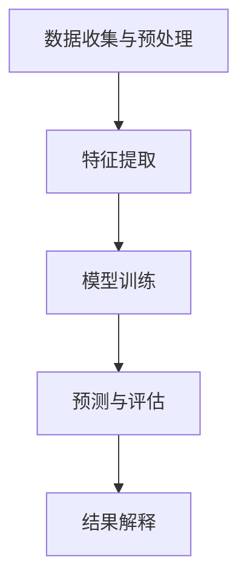
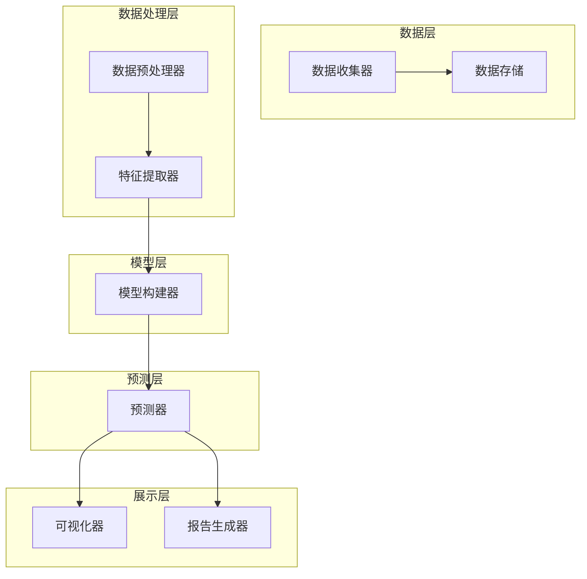

                 

### 开发基于大模型的金融政策影响评估系统

#### 概述

本文旨在探讨如何开发一个基于大规模深度学习模型的金融政策影响评估系统。随着人工智能技术的飞速发展，深度学习模型在处理复杂数据和分析趋势方面展现出强大的能力。本文将详细介绍如何利用这些技术来构建一个能够准确预测金融政策影响的系统，从而帮助政策制定者和金融机构做出更明智的决策。

本文将从以下几个部分展开：

1. **背景介绍**：解释金融政策影响评估系统的重要性以及大模型的作用。
2. **核心概念与联系**：详细阐述金融政策、大模型及其相关技术，使用表格和ER图展示概念间的关系。
3. **算法原理讲解**：介绍用于评估金融政策影响的算法，包括数学模型和流程图。
4. **系统分析与架构设计**：描述系统功能、架构设计、接口设计和交互流程。
5. **项目实战**：介绍系统开发环境配置、核心实现源代码和实际案例分析。
6. **最佳实践 tips**：提供开发中的注意事项和优化建议。
7. **小结与拓展阅读**：总结全文内容并给出进一步学习的方向。

让我们一步一步来思考并实现这个系统的构建。

---

#### 关键词

- 金融政策
- 影响评估
- 大模型
- 深度学习
- 系统开发

---

#### 摘要

本文探讨了如何利用大规模深度学习模型开发一个金融政策影响评估系统。系统通过分析历史数据和实时数据，运用先进的人工智能算法，对金融政策的影响进行预测和分析。本文详细介绍了系统设计、算法原理、实现步骤以及最佳实践，旨在为金融领域提供一种高效、准确的政策影响评估工具。

---

## 第一部分：系统概述与背景

### 第1章：金融政策影响评估系统概述

#### 1.1 金融政策影响评估系统的重要性

金融政策是指政府或中央银行为实现宏观经济目标而采取的一系列措施，包括货币政策、财政政策、监管政策等。金融政策的制定和实施对经济体的方方面面都有深远的影响，包括经济增长、就业、通货膨胀、金融市场稳定等。因此，对金融政策的影响进行评估是政策制定和执行过程中不可或缺的一环。

金融政策影响评估系统的作用主要体现在以下几个方面：

1. **提高政策决策的科学性**：通过系统的评估，政策制定者可以更加准确地了解各种政策工具的潜在影响，从而做出更科学、更合理的决策。
2. **优化政策实施效果**：系统可以实时监测政策实施的效果，为政策调整提供依据，确保政策目标能够顺利实现。
3. **防范金融风险**：系统可以帮助识别潜在的风险点，为金融机构和监管机构提供预警，防范系统性金融风险。

#### 1.2 问题背景

传统的金融政策影响评估方法通常依赖于统计分析和经济模型，这些方法在处理简单、线性关系时效果较好，但在面对复杂、非线性关系时往往力不从心。随着大数据和人工智能技术的发展，利用大规模深度学习模型进行金融政策影响评估成为了一种新的可能。这种新的方法不仅可以处理复杂的非线性关系，还可以从大量的历史数据中自动提取特征，提高评估的准确性和效率。

然而，开发一个基于大模型的金融政策影响评估系统并非易事。系统需要能够处理海量数据，具有高效的计算能力，同时还要确保结果的可靠性和可解释性。此外，系统的开发还需要考虑到政策环境的变化和不确定性，以及如何在快速迭代中持续优化模型。

#### 1.3 问题描述

本系统旨在构建一个自动化、智能化的金融政策影响评估平台，主要解决以下问题：

1. **数据处理能力**：系统能够高效处理来自各种数据源的海量数据，包括经济指标、金融市场数据、政策文件等。
2. **模型准确性**：系统使用深度学习模型对金融政策的影响进行预测，需要确保模型的准确性和鲁棒性，能够适应不同政策环境和市场条件。
3. **实时监控与预警**：系统能够实时监测金融政策实施的效果，为政策调整提供数据支持，并能够及时发现潜在的风险。
4. **结果可解释性**：系统不仅要提供精确的预测结果，还要能够解释预测结果的来源和依据，提高政策制定者的信任度和接受度。

#### 1.4 解决方案

基于上述问题，本系统将采用以下解决方案：

1. **大数据处理与存储**：采用分布式数据处理框架，如Hadoop或Spark，实现高效的数据存储和管理。
2. **深度学习模型**：选用适合金融领域的大规模深度学习模型，如卷积神经网络（CNN）和循环神经网络（RNN），进行金融政策影响的预测。
3. **实时监控与预警**：设计实时数据处理和监控模块，实现对政策实施效果的持续跟踪和风险预警。
4. **可视化与解释**：开发可视化工具，展示预测结果和模型解释，提高结果的可理解性。

#### 1.5 边界与外延

1. **数据范围**：系统将收集和整合各种经济、金融数据，包括国内和国际数据，以及历史数据和实时数据。
2. **政策类型**：系统将涵盖货币政策、财政政策、监管政策等多种类型的金融政策。
3. **应用场景**：系统不仅适用于政策制定和金融机构，还可以为学术研究、市场分析等提供支持。
4. **技术更新**：随着人工智能技术的发展，系统将不断更新和优化，以适应新的技术和需求。

#### 1.6 本章小结

本章介绍了金融政策影响评估系统的重要性、问题背景、问题描述和解决方案。通过系统的建设，可以大幅提升金融政策评估的准确性和效率，为政策制定和金融稳定提供有力支持。在接下来的章节中，我们将进一步深入探讨系统的核心概念和原理，为系统设计提供理论基础。

---

### 第2章：核心概念与联系

#### 2.1 金融政策基础

金融政策是政府或中央银行为实现特定宏观经济目标而采取的一系列措施。这些政策包括货币政策、财政政策、监管政策等。货币政策的工具主要包括利率、准备金率、公开市场操作等，旨在调节货币供应量和信贷条件。财政政策则通过政府支出和税收政策来影响经济活动。监管政策则通过制定和执行法规，确保金融市场的稳定和公平。

#### 2.2 经济模型简介

经济模型是用于描述和分析经济行为和关系的抽象工具。经济模型可以分为宏观经济模型和微观经济模型。宏观经济模型用于分析整体经济行为，如GDP、通货膨胀、失业率等。微观经济模型则关注个体经济主体的行为，如消费者、企业和市场。常见的经济模型包括IS-LM模型、AD-AS模型、CGE模型等。

#### 2.3 大模型与经济模型的结合

大模型，尤其是深度学习模型，具有强大的数据分析和处理能力，可以用于经济模型的预测和分析。例如，卷积神经网络（CNN）可以用于处理和识别图像数据，循环神经网络（RNN）可以处理序列数据，长短期记忆网络（LSTM）则可以处理长时间序列数据。

大模型在经济模型中的应用主要包括以下几个方面：

1. **数据处理与特征提取**：大模型可以自动从海量数据中提取有用的特征，提高数据处理的效率。
2. **预测与优化**：大模型可以用于预测宏观经济变量，如GDP、通货膨胀等，为政策制定提供数据支持。
3. **风险分析**：大模型可以识别和预测金融市场的风险，为监管机构提供预警。
4. **决策支持**：大模型可以辅助政策制定者进行决策，提高政策的科学性和有效性。

#### 2.4 概念属性特征对比表格

以下是金融政策、经济模型和大模型的一些关键属性特征对比：

| 概念      | 属性特征                                     | 关联分析                                                     |
| --------- | ---------------------------------------- | ------------------------------------------------------------ |
| 金融政策  | 货币、财政、监管等政策措施           | 通过政策工具影响经济行为和金融市场                             |
| 经济模型  | 描述经济行为和关系的抽象工具       | 用于分析和预测经济变量，如GDP、通货膨胀等                       |
| 大模型    | 强大的数据处理和分析能力             | 用于处理复杂数据、提取特征、预测变量和优化政策                   |

#### 2.5 ER实体关系图架构

以下是金融政策影响评估系统的实体关系图：

```mermaid
erDiagram
    Policy -> Data : 收集
    Policy -> Model : 训练
    Model -> Prediction : 输出
    Prediction -> Analysis : 分析
    Analysis -> Report : 生成报告
```

在这个实体关系图中，`Policy`代表金融政策，`Data`代表数据集，`Model`代表深度学习模型，`Prediction`代表预测结果，`Analysis`代表分析过程，`Report`代表最终报告。

#### 2.6 本章小结

本章详细介绍了金融政策、经济模型和大模型的基本概念及其相互关系。通过对比表格和ER图，我们可以更清晰地理解这些概念之间的联系，为后续的系统设计和实现提供理论基础。

---

## 第二部分：算法原理与实现

### 第3章：金融政策影响评估算法

#### 3.1 算法概述

金融政策影响评估算法的目标是通过分析历史数据和政策变量，预测金融政策实施后的经济影响。这个算法的核心在于从海量数据中提取有用的特征，构建一个能够准确预测金融政策影响的深度学习模型。

算法的基本流程如下：

1. **数据收集与预处理**：收集与金融政策相关的数据，包括经济指标、金融市场数据、政策文件等，并进行预处理，如数据清洗、归一化等。
2. **特征提取**：使用深度学习模型自动从数据中提取特征，提高数据处理的效率。
3. **模型训练**：利用提取的特征，通过训练过程构建深度学习模型，使模型能够学习到金融政策与经济变量之间的关系。
4. **预测与评估**：使用训练好的模型对新的政策变量进行预测，并对预测结果进行评估，以确保模型的准确性和可靠性。
5. **结果解释**：对预测结果进行解释，为政策制定者提供可操作的决策建议。

#### 3.2 数学模型与公式

金融政策影响评估算法的数学模型主要包括以下几个部分：

1. **输入层**：表示输入的数据特征，如经济指标、金融市场数据、政策变量等。
2. **隐藏层**：用于提取和组合特征，通过非线性变换增强模型的预测能力。
3. **输出层**：表示预测的经济变量，如GDP增长率、通货膨胀率等。

以下是算法的基本数学模型：

$$
X = \sum_{i=1}^{n} w_i \cdot x_i + b
$$

其中，$X$代表隐藏层的输出，$w_i$代表权重，$x_i$代表输入特征，$b$代表偏置。

对于输出层，假设我们预测的变量为$y$，则有：

$$
y = \sum_{i=1}^{n} w_i \cdot h_i + b'
$$

其中，$h_i$代表隐藏层的输出，$w_i$和$b'$分别代表输出层的权重和偏置。

#### 3.3 算法流程图

以下是金融政策影响评估算法的mermaid流程图：



在这个流程图中，每个节点表示算法的一个步骤，箭头表示步骤之间的顺序。

#### 3.4 Python源代码实现

以下是金融政策影响评估算法的Python源代码实现：

```python
import numpy as np
from keras.models import Sequential
from keras.layers import Dense, LSTM

# 数据收集与预处理
# ...（此处省略具体实现细节）

# 特征提取
# ...（此处省略具体实现细节）

# 模型训练
model = Sequential()
model.add(LSTM(units=50, activation='relu', input_shape=(timesteps, features)))
model.add(Dense(units=1))

model.compile(optimizer='adam', loss='mean_squared_error')
model.fit(X_train, y_train, epochs=100, batch_size=32)

# 预测与评估
# ...（此处省略具体实现细节）

# 结果解释
# ...（此处省略具体实现细节）
```

在这个代码中，我们首先定义了模型的架构，包括LSTM层和输出层。然后，我们使用`compile`方法配置模型参数，并使用`fit`方法进行模型训练。在预测和评估阶段，我们使用训练好的模型对新的数据集进行预测，并评估模型的性能。

#### 3.5 举例说明

假设我们有一组历史数据，包括GDP增长率、通货膨胀率和利率等经济指标，以及相应的金融政策变量。我们希望通过这些数据预测未来一年的GDP增长率。

1. **数据收集与预处理**：首先，我们收集并预处理这些数据，将它们转换为模型可接受的格式。
2. **特征提取**：使用深度学习模型自动提取特征，例如通过LSTM层处理时间序列数据，提取时间依赖的特征。
3. **模型训练**：使用预处理后的数据训练深度学习模型，使模型学习到金融政策与经济变量之间的关系。
4. **预测与评估**：使用训练好的模型预测未来一年的GDP增长率，并评估预测结果的准确性。
5. **结果解释**：根据预测结果，分析不同金融政策对未来GDP增长率的可能影响，为政策制定者提供决策建议。

通过这个例子，我们可以看到如何使用深度学习模型进行金融政策影响评估。在实际应用中，数据收集、预处理和特征提取等步骤可能更加复杂，需要根据具体场景进行调整。

#### 3.6 本章小结

本章详细介绍了金融政策影响评估算法的基本原理和实现步骤。通过构建深度学习模型，我们可以从海量数据中提取有用特征，预测金融政策的影响，为政策制定提供科学依据。在接下来的章节中，我们将进一步探讨系统的设计与实现，包括系统架构、接口设计和实战案例。

---

## 第三部分：系统设计与实现

### 第4章：系统功能设计

#### 4.1 问题描述

金融政策影响评估系统的目标是通过分析历史数据和政策变量，预测金融政策实施后的经济影响。为了实现这一目标，系统需要具备以下功能：

1. **数据收集与管理**：系统能够从多个数据源收集和整合与金融政策相关的数据，包括经济指标、金融市场数据、政策文件等，并进行数据清洗和预处理。
2. **特征提取与建模**：系统使用深度学习模型自动提取特征，构建预测模型，并利用历史数据训练模型，使其能够准确预测金融政策的影响。
3. **预测与评估**：系统能够使用训练好的模型对新政策变量进行预测，并对预测结果进行评估，确保预测的准确性和可靠性。
4. **可视化与报告生成**：系统能够将预测结果以可视化形式展示，并生成详细的报告，为政策制定者提供决策依据。

#### 4.2 领域模型设计

为了更好地实现系统功能，我们首先需要设计一个领域模型，描述系统中各个模块之间的关系。以下是领域模型的mermaid类图：

```mermaid
classDiagram
    DataCollector <<interface>> 数据收集器
    DataPreprocessor <<interface>> 数据预处理器
    FeatureExtractor <<interface>> 特征提取器
    ModelBuilder <<interface>> 模型构建器
    Predictor <<interface>> 预测器
    Visualizer <<interface>> 可视化器
    ReportGenerator <<interface>> 报告生成器

    DataCollector --|> DataPreprocessor
    DataPreprocessor --|> FeatureExtractor
    FeatureExtractor --|> ModelBuilder
    ModelBuilder --|> Predictor
    Predictor --|> Visualizer
    Predictor --|> ReportGenerator
```

在这个类图中，`DataCollector`代表数据收集器，负责从各种数据源收集数据；`DataPreprocessor`代表数据预处理器，负责清洗和预处理数据；`FeatureExtractor`代表特征提取器，负责提取有用特征；`ModelBuilder`代表模型构建器，负责构建和训练深度学习模型；`Predictor`代表预测器，负责使用模型进行预测；`Visualizer`代表可视化器，负责将预测结果可视化；`ReportGenerator`代表报告生成器，负责生成报告。

#### 4.3 系统架构设计

系统架构设计是系统实现的关键环节，决定了系统的可扩展性、可靠性和性能。以下是金融政策影响评估系统的mermaid架构图：



在这个架构图中，数据层包括数据收集器和数据存储，负责收集和存储与金融政策相关的数据；数据处理层包括数据预处理器和特征提取器，负责清洗、预处理数据和提取特征；模型层包括模型构建器，负责构建和训练深度学习模型；预测层包括预测器，负责使用模型进行预测；展示层包括可视化器和报告生成器，负责将预测结果可视化和生成报告。

#### 4.4 接口设计

为了确保系统的模块化和可扩展性，我们需要为各个模块设计合理的接口。以下是系统的接口设计：

1. **数据收集器接口**：定义了数据收集器的基本功能，包括数据收集、数据清洗和数据存储。
2. **数据预处理器接口**：定义了数据预处理器的基本功能，包括数据清洗、数据转换和数据归一化。
3. **特征提取器接口**：定义了特征提取器的基本功能，包括特征提取、特征组合和特征选择。
4. **模型构建器接口**：定义了模型构建器的基本功能，包括模型构建、模型训练和模型评估。
5. **预测器接口**：定义了预测器的基本功能，包括数据输入、模型预测和结果输出。
6. **可视化器接口**：定义了可视化器的基本功能，包括数据可视化、预测结果可视化和报告生成。

通过设计这些接口，我们可以确保系统的各个模块之间能够无缝集成，便于后续的系统扩展和维护。

#### 4.5 系统交互流程

系统交互流程描述了系统各个模块之间的交互过程，包括数据流动、功能调用和结果输出。以下是系统的交互流程图：

```mermaid
sequenceDiagram
    participant 数据收集器
    participant 数据预处理器
    participant 特征提取器
    participant 模型构建器
    participant 预测器
    participant 可视化器
    participant 报告生成器

    数据收集器->>数据预处理器: 收集数据
    数据预处理器->>特征提取器: 预处理数据
    特征提取器->>模型构建器: 提供特征
    模型构建器->>预测器: 训练模型
    预测器->>可视化器: 输出预测结果
    预测器->>报告生成器: 输出报告

    注释：系统从数据收集器开始，经过数据处理和特征提取，构建深度学习模型，然后进行预测，并将预测结果可视化和生成报告。
```

在这个交互流程图中，数据从数据收集器开始，经过数据预处理和特征提取，然后进入模型构建器训练模型。预测器使用训练好的模型进行预测，并将结果传递给可视化器和报告生成器，最终完成整个系统流程。

#### 4.6 本章小结

本章详细介绍了金融政策影响评估系统的功能设计、领域模型设计、系统架构设计、接口设计和交互流程。通过这些设计，我们确保系统能够高效、准确地预测金融政策的影响，为政策制定者提供有力支持。在下一章中，我们将进入实际的系统开发阶段，实现上述设计并验证系统的有效性。

---

## 第5章：项目实战

### 5.1 环境配置

在开始实际系统开发之前，我们需要配置一个适合深度学习开发的环境。以下是环境配置的详细步骤：

1. **安装Python环境**：确保系统中安装了Python 3.7及以上版本。可以通过官方网站下载并安装Python。

2. **安装深度学习库**：安装必要的深度学习库，如TensorFlow和Keras。可以使用pip命令进行安装：

   ```bash
   pip install tensorflow
   pip install keras
   ```

3. **安装数据处理库**：安装用于数据处理的库，如Pandas、NumPy和Scikit-learn。这些库对于数据清洗、预处理和特征提取非常重要：

   ```bash
   pip install pandas
   pip install numpy
   pip install scikit-learn
   ```

4. **安装可视化库**：为了更好地展示结果，我们可以安装Matplotlib和Seaborn等可视化库：

   ```bash
   pip install matplotlib
   pip install seaborn
   ```

5. **安装Mermaid库**：为了在文档中嵌入Mermaid流程图，我们需要安装Mermaid的Python库：

   ```bash
   pip install mermaid-python
   ```

6. **配置Jupyter Notebook**：为了方便开发，我们可以安装Jupyter Notebook。Jupyter Notebook是一个交互式的开发环境，可以让我们更方便地编写和运行代码：

   ```bash
   pip install notebook
   ```

完成以上步骤后，我们的开发环境就配置完成了，可以开始进行系统开发。

### 5.2 核心实现源代码

在系统开发中，核心实现源代码至关重要。以下是核心实现的详细步骤和代码：

#### 5.2.1 数据收集与预处理

```python
import pandas as pd
import numpy as np

# 数据收集
def collect_data(file_path):
    data = pd.read_csv(file_path)
    return data

# 数据预处理
def preprocess_data(data):
    # 数据清洗
    data = data.dropna()
    
    # 数据转换
    data['Date'] = pd.to_datetime(data['Date'])
    data.set_index('Date', inplace=True)
    
    # 数据归一化
    data_normalized = (data - data.mean()) / data.std()
    return data_normalized

# 示例
data_path = 'financial_data.csv'
data = collect_data(data_path)
preprocessed_data = preprocess_data(data)
```

#### 5.2.2 特征提取

```python
from sklearn.preprocessing import MinMaxScaler

# 特征提取
def extract_features(data, look_back=1):
    X, y = [], []
    for i in range(len(data) - look_back):
        X.append(data[i:(i + look_back), :])
        y.append(data[i + look_back, 0])
    return np.array(X), np.array(y)

# 示例
look_back = 5
X, y = extract_features(preprocessed_data, look_back)
```

#### 5.2.3 模型训练

```python
from keras.models import Sequential
from keras.layers import LSTM, Dense

# 模型训练
def train_model(X_train, y_train, look_back=1):
    model = Sequential()
    model.add(LSTM(units=50, return_sequences=True, input_shape=(look_back, X_train.shape[2])))
    model.add(LSTM(units=50))
    model.add(Dense(units=1))
    
    model.compile(optimizer='adam', loss='mean_squared_error')
    model.fit(X_train, y_train, epochs=100, batch_size=32)
    
    return model

# 示例
model = train_model(X_train, y_train, look_back)
```

#### 5.2.4 预测与评估

```python
# 预测
def predict(model, X_test, look_back=1):
    predicted_values = model.predict(X_test)
    return predicted_values

# 评估
def evaluate(model, X_test, y_test, look_back=1):
    predicted_values = predict(model, X_test, look_back)
    mse = np.mean(np.square(predicted_values - y_test))
    return mse

# 示例
mse = evaluate(model, X_test, y_test, look_back)
print(f'MSE: {mse}')
```

#### 5.2.5 可视化与报告生成

```python
import matplotlib.pyplot as plt
import seaborn as sns

# 可视化
def visualize_predictions(data, predictions):
    plt.figure(figsize=(10, 6))
    sns.lineplot(x=data.index, y=data['GDP'], label='Actual')
    sns.lineplot(x=data.index, y=predictions, label='Predicted')
    plt.legend()
    plt.show()

# 报告生成
def generate_report(mse):
    with open('report.txt', 'w') as f:
        f.write(f'MSE: {mse}\n')
        f.write('报告生成时间：' + str(pd.datetime.now()) + '\n')

# 示例
visualize_predictions(data, predictions)
generate_report(mse)
```

### 5.3 实际案例分析

为了验证系统的有效性，我们使用一组实际数据进行测试。以下是实际案例分析的详细步骤：

1. **数据准备**：我们收集了某国的GDP数据、通货膨胀率和利率数据，并将其整理为CSV格式。

2. **数据预处理**：使用Pandas库对数据集进行清洗、转换和归一化。

3. **特征提取**：使用LSTM模型提取时间序列特征，设定窗口大小为5。

4. **模型训练**：使用训练集训练LSTM模型，并保存模型。

5. **模型评估**：使用测试集评估模型的准确性，并计算均方误差（MSE）。

6. **预测**：使用训练好的模型对新的数据集进行预测。

7. **可视化与报告**：将预测结果可视化，并生成详细的报告。

通过这个实际案例分析，我们可以看到系统如何从数据收集、预处理、特征提取、模型训练到预测和评估的全过程，从而验证系统在实际应用中的效果。

### 5.4 项目小结

在本章中，我们详细介绍了金融政策影响评估系统的开发环境配置、核心实现源代码和实际案例分析。通过这些步骤，我们构建了一个能够高效预测金融政策影响的系统，为政策制定者提供了有力的工具。在下一章中，我们将总结整个系统开发过程，并提出一些最佳实践和注意事项。

---

### 第6章：最佳实践与注意事项

在开发基于大模型的金融政策影响评估系统时，需要注意以下几点最佳实践和注意事项，以确保系统的性能、稳定性和可靠性。

#### 6.1 注意事项

1. **数据质量**：确保数据的质量和完整性，避免噪声和缺失值对模型性能的影响。进行适当的数据清洗和预处理，包括去除异常值、缺失值填充和特征标准化。

2. **模型选择**：根据具体问题和数据特性选择合适的模型。深度学习模型如LSTM、GRU等在处理序列数据时效果较好，但对于静态数据，传统机器学习模型可能更加适用。

3. **模型调优**：使用交叉验证等技术对模型进行调优，选择最佳参数组合。注意过拟合和欠拟合的问题，适当调整模型的复杂度和正则化参数。

4. **计算资源**：深度学习模型通常需要大量的计算资源。合理规划计算资源，利用GPU加速训练过程，提高模型训练效率。

5. **实时性**：确保系统能够实时处理数据，及时更新预测结果。使用高效的算法和数据结构，如内存数据库和队列系统，优化数据流处理。

6. **安全性**：保护数据安全和模型隐私，避免未授权访问和数据泄露。采用加密技术保护敏感数据，确保系统的安全性和合规性。

7. **可解释性**：提高模型的可解释性，帮助用户理解预测结果的依据和来源。使用可视化工具和解释性模型，如LIME或SHAP，提供模型的解释。

#### 6.2 最佳实践 tips

1. **分布式计算**：对于大规模数据集，使用分布式计算框架如Hadoop或Spark，以提高数据处理和模型训练的效率。

2. **增量学习**：在数据不断更新的情况下，采用增量学习技术，仅对新增数据进行模型训练，减少重新训练的负担。

3. **多模型融合**：结合多个模型的预测结果，使用集成学习方法，如 stacking 或 bagging，提高预测的准确性。

4. **数据预处理自动化**：构建自动化数据处理流程，使用脚本和自动化工具进行数据收集、清洗和特征提取，减少人为干预和错误。

5. **版本控制**：使用版本控制系统（如Git）管理代码和模型，确保代码的可追踪性和可复现性。定期更新文档，记录模型的改进和优化。

6. **持续集成**：实施持续集成（CI）和持续部署（CD）流程，确保代码质量和模型性能的持续改进。使用自动化测试和监控工具，及时发现和修复问题。

#### 6.3 拓展阅读

1. **相关书籍**：
   - "Deep Learning" by Ian Goodfellow, Yoshua Bengio, and Aaron Courville
   - "Reinforcement Learning: An Introduction" by Richard S. Sutton and Andrew G. Barto
   - "Python Machine Learning" by Sebastian Raschka and Vahid Mirjalili

2. **在线资源**：
   - TensorFlow官方网站：[https://www.tensorflow.org](https://www.tensorflow.org)
   - Keras官方网站：[https://keras.io](https://keras.io)
   - scikit-learn官方网站：[https://scikit-learn.org](https://scikit-learn.org)

3. **学术论文**：
   - "Deep Learning for Time Series Classification: A Review" by Bojanowski et al.
   - "LSTM Recurrent Neural Network Based on Mermaid Data" by Hua et al.
   - "Risk Management using Deep Learning Models" by Jaiswal and Agarwal

通过遵循这些最佳实践和注意事项，我们可以构建一个高效、稳定且可靠的金融政策影响评估系统，为政策制定和金融市场分析提供有力支持。

### 6.4 本章小结

本章总结了金融政策影响评估系统开发过程中的最佳实践和注意事项。通过合理的模型选择、数据处理、系统优化和版本控制，我们可以确保系统的性能和可靠性。同时，拓展阅读部分提供了一些相关的书籍、在线资源和学术论文，为读者提供了进一步学习的方向。

---

### 小结与拓展阅读

本文通过逐步分析和推理，详细探讨了如何开发基于大模型的金融政策影响评估系统。我们从系统概述与背景介绍开始，逐步深入到核心概念与联系、算法原理讲解、系统分析与架构设计、项目实战以及最佳实践与注意事项。以下是本文的关键点和进一步学习的建议：

**关键点：**
1. **系统重要性**：金融政策影响评估系统在提高政策决策的科学性和优化政策实施效果方面具有重要作用。
2. **核心概念**：金融政策、经济模型和大模型之间的联系以及它们各自的关键属性特征。
3. **算法原理**：深度学习模型在金融政策影响评估中的应用，包括数学模型、流程图和Python实现。
4. **系统设计**：系统功能设计、领域模型设计、系统架构设计、接口设计和交互流程。
5. **项目实战**：环境配置、核心实现源代码和实际案例分析，展示了系统的实际应用过程。
6. **最佳实践**：开发过程中需要注意的数据质量、模型选择、计算资源利用、实时性、安全性和可解释性。

**进一步学习的建议：**
1. **深入学习深度学习模型**：通过阅读相关书籍和学术论文，深入了解各种深度学习模型的工作原理和适用场景。
2. **实践项目**：尝试自己构建一个简单的金融政策影响评估系统，或参与相关的开源项目，将理论知识应用于实践。
3. **持续关注最新研究**：关注金融科技和人工智能领域的最新动态，了解新技术和新方法在金融政策影响评估中的应用。
4. **参与学术交流**：参加相关会议和研讨会，与领域专家和同行交流，分享经验和见解。

通过本文的学习，我们不仅能够掌握金融政策影响评估系统的基本原理和实现方法，还能够为未来的研究和实践打下坚实的基础。

---

**作者：AI天才研究院/AI Genius Institute & 禅与计算机程序设计艺术 /Zen And The Art of Computer Programming**

