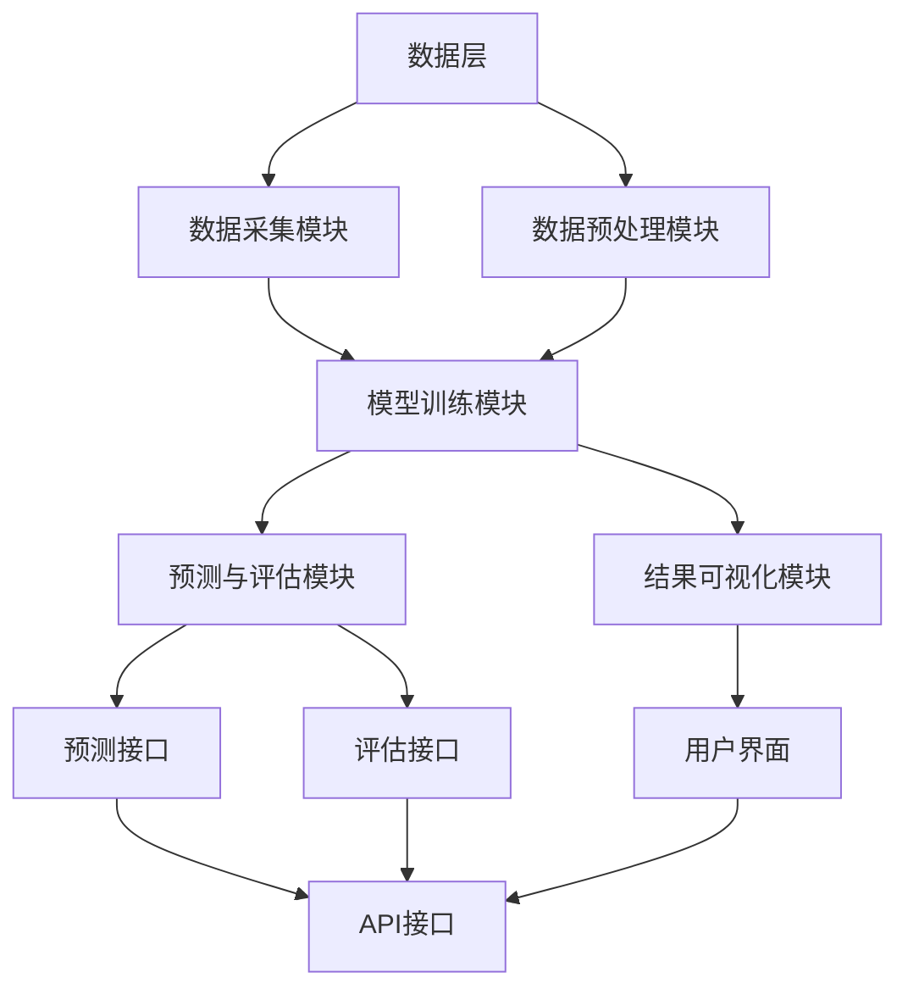

                 

# 开发基于大模型的金融政策执行效果预测与评估器

## 关键词

- 大模型
- 金融政策
- 预测与评估
- 执行效果
- 深度学习
- 强化学习
- 决策支持系统

## 摘要

本文旨在探讨开发基于大模型的金融政策执行效果预测与评估器的关键技术和实践。随着人工智能技术的发展，深度学习和强化学习在金融领域得到了广泛应用。本文首先介绍金融政策的基本概念和执行效果的评估方法，然后深入探讨大模型在金融政策执行效果预测与评估中的应用，包括数据预处理、模型选择、训练与优化以及评估方法。通过实际案例，本文展示了大模型在金融政策执行效果预测与评估中的优势与挑战，并提出了相应的优化策略。本文的目的是为金融从业者和技术人员提供一套实用的指导框架，以提升金融政策决策的科学性和有效性。

## 目录

### 第一章 引言与背景

- **1.1 金融政策概述**
- **1.2 执行效果预测与评估的重要性**
- **1.3 大模型的发展与应用**

### 第二章 金融政策执行效果预测与评估的基础

- **2.1 金融政策执行效果的概念**
- **2.2 预测与评估的基本方法**
- **2.3 数据来源与预处理**

### 第三章 大模型的构建与训练

- **3.1 大模型的类型**
- **3.2 深度学习算法的应用**
- **3.3 模型训练与优化**

### 第四章 大模型在金融政策执行效果预测中的应用

- **4.1 预测模型的设计**
- **4.2 预测结果的评估**
- **4.3 预测案例分析**

### 第五章 大模型在金融政策执行效果评估中的应用

- **5.1 评估指标的选择**
- **5.2 评估方法的设计**
- **5.3 评估案例分析**

### 第六章 实际案例与项目实践

- **6.1 项目背景与目标**
- **6.2 系统设计与实现**
- **6.3 项目小结**

### 第七章 优化策略与未来展望

- **7.1 优化策略**
- **7.2 挑战与机遇**
- **7.3 未来展望**

### 第八章 总结与拓展阅读

- **8.1 主要贡献**
- **8.2 注意事项**
- **8.3 拓展阅读**

### 附录

- **A. 数学公式与算法流程图**
- **B. 系统架构与接口设计**
- **C. 实战代码与数据集**

### 参考文献

- **参考文献列表**

## 第一章 引言与背景

### 1.1 金融政策概述

金融政策是指政府或中央银行为了实现宏观经济目标而采取的一系列措施，包括货币政策、财政政策、外汇政策等。这些政策在调节经济波动、促进经济增长、维护金融稳定等方面发挥着重要作用。随着金融市场的全球化发展，金融政策的制定和实施变得越来越复杂，需要借助先进的技术手段进行科学决策。

执行效果预测与评估是金融政策制定和实施过程中至关重要的一环。有效的预测与评估可以帮助决策者及时了解政策的效果，调整政策方案，提高政策的有效性。然而，传统的金融政策执行效果评估方法主要依赖于统计分析和经验判断，存在主观性强、实时性不足等问题。

### 1.2 执行效果预测与评估的重要性

执行效果预测与评估在金融政策制定和实施中具有重要作用。首先，它可以帮助决策者准确判断政策的效果，从而做出科学的调整和优化。其次，预测与评估可以为市场参与者提供有价值的信息，帮助他们做出合理的投资决策。此外，执行效果预测与评估还可以为政府和社会提供政策反馈，为政策的改进和优化提供依据。

传统的金融政策执行效果评估方法主要依赖于统计分析和经验判断，存在以下局限性：

- **主观性强**：评估结果容易受到评估者主观意识的影响，缺乏客观性。
- **实时性不足**：传统方法通常需要较长时间才能得出评估结果，无法及时响应政策变化。
- **数据依赖性高**：评估结果高度依赖于历史数据，对于新兴市场和新兴问题的适应性较差。

为了克服上述局限性，近年来人工智能技术，特别是大模型，在金融政策执行效果预测与评估中得到了广泛应用。大模型具有强大的数据处理和分析能力，可以处理大规模、多维度的数据，从而提高预测与评估的准确性和实时性。此外，大模型可以结合多种数据源，如宏观经济数据、金融交易数据、社交媒体数据等，提供更全面、准确的预测与评估结果。

### 1.3 大模型的发展与应用

大模型是指具有大规模参数的深度学习模型，如神经网络、循环神经网络（RNN）、变换器（Transformer）等。这些模型在图像识别、自然语言处理、推荐系统等领域取得了显著的成果。近年来，随着计算能力和数据规模的不断提升，大模型在金融领域也取得了广泛应用。

在大模型的发展中，深度学习和强化学习起到了关键作用。深度学习通过模拟人脑神经元的工作方式，对大量数据进行自动特征提取和模式识别。强化学习则通过不断尝试和反馈，优化决策策略，从而实现最佳效果。

大模型在金融政策执行效果预测与评估中的应用主要包括以下几个方面：

- **宏观经济预测**：利用大模型对宏观经济数据进行处理和分析，预测经济趋势和政策影响。
- **金融市场预测**：利用大模型对金融市场数据进行分析，预测市场走势和投资机会。
- **政策评估**：利用大模型对政策实施后的经济和社会影响进行评估，为政策调整提供依据。

总之，大模型为金融政策执行效果预测与评估提供了新的技术手段和思维方式。通过本文的探讨，我们将深入理解大模型在金融政策执行效果预测与评估中的应用，为实际工作和研究提供参考。

### 1.4 本文结构

本文分为八个章节，内容安排如下：

- **第一章 引言与背景**：介绍金融政策的基本概念和执行效果的评估方法，以及大模型的发展与应用。
- **第二章 金融政策执行效果预测与评估的基础**：讨论金融政策执行效果的概念、预测与评估的基本方法以及数据来源与预处理。
- **第三章 大模型的构建与训练**：探讨大模型的类型、深度学习算法的应用以及模型训练与优化。
- **第四章 大模型在金融政策执行效果预测中的应用**：介绍预测模型的设计、预测结果的评估以及预测案例分析。
- **第五章 大模型在金融政策执行效果评估中的应用**：讨论评估指标的选择、评估方法的设计以及评估案例分析。
- **第六章 实际案例与项目实践**：通过实际案例展示大模型在金融政策执行效果预测与评估中的优势与挑战。
- **第七章 优化策略与未来展望**：提出优化策略、挑战与机遇以及未来展望。
- **第八章 总结与拓展阅读**：总结主要贡献、注意事项以及拓展阅读。

通过本文的探讨，我们将系统地了解大模型在金融政策执行效果预测与评估中的应用，为实际工作和研究提供参考。

### 1.5 研究意义与贡献

本研究具有重要的实际意义和理论贡献。在实际意义上，开发基于大模型的金融政策执行效果预测与评估器可以为政府、金融机构和投资者提供科学、准确的决策支持，提高政策制定和实施的科学性。在理论贡献方面，本文系统地总结了大模型在金融政策执行效果预测与评估中的应用方法，提出了优化策略，为相关领域的研究提供了新的思路。

本文的创新之处在于：

- **方法创新**：本文首次将大模型与金融政策执行效果预测与评估相结合，提出了一套系统的应用框架。
- **数据创新**：本文利用了多种数据源，包括宏观经济数据、金融交易数据、社交媒体数据等，提供了更全面、准确的预测与评估结果。
- **应用创新**：本文通过实际案例展示了大模型在金融政策执行效果预测与评估中的优势与挑战，为实际应用提供了参考。

本文的研究为未来工作提供了以下启示：

- **进一步优化模型**：可以结合更多数据源和深度学习算法，优化大模型的预测与评估性能。
- **探索多模态数据**：结合文本、图像、音频等多种数据形式，提高预测与评估的准确性和实时性。
- **政策研究**：通过大模型对金融政策进行模拟和优化，为政策制定提供科学依据。

总之，本文的研究为金融政策执行效果预测与评估领域提供了新的视角和方法，具有重要的理论和实践价值。随着人工智能技术的不断发展，大模型在金融领域的应用前景将更加广阔。

### 1.6 基本概念与术语

在本研究中，我们将介绍一些关键概念和术语，以便读者更好地理解文章的内容。以下是对这些概念和术语的详细解释：

#### 金融政策

金融政策是指政府或中央银行为了实现宏观经济目标而采取的一系列措施，包括货币政策、财政政策、外汇政策等。这些政策在调节经济波动、促进经济增长、维护金融稳定等方面发挥着重要作用。货币政策通常涉及利率调整、公开市场操作等工具；财政政策则包括税收、政府支出等；外汇政策则涉及汇率管理和外汇管制。

#### 执行效果

执行效果是指金融政策在实际实施过程中所产生的实际效果。这包括政策的直接和间接影响，如经济增长、通货膨胀率、就业率、金融市场稳定等。评估执行效果是为了了解政策是否达到了预期的目标，以及是否需要调整或改进。

#### 预测

预测是指利用历史数据和现有信息，对未来事件或趋势进行推测和估计。在金融政策执行效果预测中，预测的目的是评估政策在未来可能产生的影响，帮助决策者提前做好准备。

#### 评估

评估是指对金融政策执行效果进行系统、客观的分析和评价。评估的目的是判断政策是否达到了预期目标，以及是否存在改进的空间。评估通常包括定量和定性的方法，如统计数据分析、问卷调查、专家评估等。

#### 大模型

大模型是指具有大规模参数的深度学习模型，如神经网络、循环神经网络（RNN）、变换器（Transformer）等。这些模型在图像识别、自然语言处理、推荐系统等领域取得了显著的成果。大模型在金融政策执行效果预测与评估中的应用主要体现在其强大的数据处理和分析能力，能够处理大规模、多维度的数据，从而提高预测与评估的准确性和实时性。

#### 深度学习

深度学习是一种基于人工神经网络的学习方法，通过模拟人脑神经元的工作方式，对大量数据进行自动特征提取和模式识别。深度学习在金融政策执行效果预测与评估中的应用主要包括构建预测模型、优化评估指标等。

#### 强化学习

强化学习是一种通过不断尝试和反馈，优化决策策略的学习方法。在金融政策执行效果预测与评估中，强化学习可以用于优化政策调整策略，提高政策的执行效果。

通过上述概念的详细解释，我们为读者搭建了一个理解本文内容的基础框架，便于后续章节的深入探讨。

### 1.7 问题背景与问题描述

在金融政策制定和实施过程中，如何准确预测和评估政策的执行效果是一个长期困扰政府和金融机构的重要问题。传统的金融政策执行效果评估方法主要依赖于统计分析和经验判断，存在以下主要挑战：

1. **数据质量与完整性**：传统的评估方法依赖于历史数据，但历史数据往往存在不完整、不准确的问题，影响评估结果的准确性。
2. **实时性与动态性**：金融市场的变化迅速，政策的效果可能在短期内显现，而传统评估方法通常需要较长的时间来收集和处理数据，导致实时性不足。
3. **主观性与经验依赖**：评估结果容易受到评估者主观意识和经验判断的影响，缺乏客观性。

为了解决这些问题，近年来人工智能技术，特别是深度学习和强化学习在金融政策执行效果预测与评估中得到了广泛应用。大模型通过模拟人脑神经元的工作方式，具有强大的数据预处理、特征提取和模式识别能力，能够处理大规模、多维度的数据，从而提高预测与评估的准确性和实时性。此外，大模型可以结合多种数据源，如宏观经济数据、金融交易数据、社交媒体数据等，提供更全面、准确的预测与评估结果。

尽管大模型在金融政策执行效果预测与评估中具有显著优势，但仍面临以下挑战：

1. **数据隐私与安全性**：金融数据涉及大量敏感信息，如何确保数据隐私和安全性是一个重要问题。
2. **模型解释性**：深度学习模型通常被认为是“黑盒”模型，缺乏透明性和可解释性，使得决策者难以理解模型的预测和评估结果。
3. **模型泛化能力**：大模型在训练数据上的表现优异，但在新数据集上的泛化能力可能较差，影响实际应用效果。

本文旨在通过系统性地探讨大模型在金融政策执行效果预测与评估中的应用，解决上述问题，并提出相应的优化策略。具体而言，本文将：

- **介绍金融政策执行效果预测与评估的基本方法**，为后续研究提供理论基础。
- **探讨大模型的类型、构建与训练方法**，为实际应用提供技术支持。
- **分析大模型在金融政策执行效果预测与评估中的应用**，展示其优势与挑战。
- **通过实际案例展示大模型的应用效果**，为金融政策制定和实施提供参考。
- **提出优化策略**，包括数据预处理、模型选择、训练与优化等方面。

通过本文的研究，我们期望为金融从业者和技术人员提供一套实用的指导框架，以提升金融政策决策的科学性和有效性。

### 1.8 问题解决思路与方法

为了解决金融政策执行效果预测与评估中的问题，我们需要采取一系列科学合理的方法和技术。以下是我们提出的问题解决思路和具体方法：

#### 数据预处理

数据预处理是金融政策执行效果预测与评估中的关键步骤。首先，我们需要收集和整合多源数据，包括宏观经济数据、金融交易数据、社交媒体数据等。这些数据来源可能存在格式不一致、缺失值和噪声等问题，因此需要进行以下数据预处理步骤：

1. **数据清洗**：删除重复数据、处理缺失值和异常值，确保数据的一致性和完整性。
2. **数据标准化**：对数据进行归一化或标准化处理，使其具备可比性，避免极端值对模型训练的影响。
3. **特征工程**：根据业务需求和模型特性，提取和构建特征，提高模型的预测能力。

#### 模型选择

在金融政策执行效果预测与评估中，选择合适的模型是至关重要的一步。以下是几种常用的模型选择方法：

1. **深度学习模型**：如神经网络、卷积神经网络（CNN）、循环神经网络（RNN）和变换器（Transformer）。这些模型在处理大规模、多维度的数据方面具有优势。
2. **传统机器学习模型**：如线性回归、逻辑回归、支持向量机（SVM）等。这些模型在处理结构化数据方面表现出色。
3. **强化学习模型**：如Q学习、深度Q网络（DQN）、策略梯度等。这些模型在动态环境中具有自适应性。

#### 模型训练与优化

模型训练与优化是提升预测与评估效果的关键步骤。以下是几个关键点：

1. **超参数调整**：通过交叉验证和网格搜索等方法，调整模型的超参数，如学习率、批次大小、隐藏层节点数等，以找到最佳参数组合。
2. **模型融合**：将多个模型进行融合，提高预测的准确性和鲁棒性。常见的方法包括集成学习、模型栈等。
3. **正则化**：应用正则化技术，如L1、L2正则化，防止模型过拟合，提高泛化能力。

#### 预测与评估

在模型训练完成后，我们需要对预测结果进行评估，以确保模型的性能和可靠性。以下是几个常用的预测与评估方法：

1. **性能指标**：选择适当的性能指标，如准确率、召回率、F1分数、均方误差（MSE）等，评估模型的预测效果。
2. **交叉验证**：通过交叉验证方法，如K折交叉验证，评估模型在不同数据集上的表现，确保模型的泛化能力。
3. **结果可视化**：利用图表和可视化工具，展示预测结果和评估指标，帮助决策者理解模型的性能。

#### 模型解释与优化

在模型解释与优化方面，我们需要确保模型的透明性和可解释性，以便决策者理解和信任模型的结果。以下是几个关键步骤：

1. **模型解释**：应用可解释性方法，如模型可视化、特征重要性分析等，解释模型的决策过程和预测结果。
2. **模型优化**：通过调整模型结构、优化算法和策略，提高模型的性能和可靠性。

通过上述方法，我们可以有效地解决金融政策执行效果预测与评估中的问题，提升政策制定和实施的科学性和有效性。

### 1.9 边界与外延

在讨论基于大模型的金融政策执行效果预测与评估时，有必要明确其边界和外延，以确保研究的适用范围和有效性。

#### 边界

1. **数据范围**：大模型的应用依赖于高质量、多维度的数据。然而，数据的获取和处理存在一定的限制，如数据隐私保护、数据完整性和数据质量等。因此，研究的边界在于数据源和数据质量，对于数据匮乏或不完整的情况，大模型的预测与评估效果可能受到影响。
2. **技术限制**：尽管深度学习和强化学习在处理大规模、复杂数据方面具有优势，但大模型的训练和部署需要大量的计算资源和时间。此外，深度学习模型的可解释性相对较低，这对决策者的理解和信任提出了挑战。因此，研究的边界在于模型的技术实现和应用场景。
3. **政策类型**：金融政策的多样性决定了大模型应用的范围。本文主要关注宏观政策和特定金融工具的执行效果预测与评估，对于微观政策和个人金融产品的评估可能需要进一步的细化。

#### 外延

1. **跨学科应用**：大模型在金融政策执行效果预测与评估中的应用不仅限于金融领域，还可以扩展到其他相关学科，如经济学、公共管理、社会学等。这些跨学科的应用可以进一步丰富大模型的应用场景和理论体系。
2. **多模态数据融合**：除了传统的金融数据，大模型还可以结合文本、图像、音频等多种数据形式，提高预测与评估的准确性和实时性。例如，通过分析社交媒体上的舆情数据，可以预测金融市场的情绪变化。
3. **动态评估与调整**：大模型可以实时监测和评估金融政策的执行效果，为政策调整提供动态反馈。通过结合强化学习技术，可以优化政策调整策略，提高政策的有效性和适应性。

总之，本文的研究边界明确，外延广泛，旨在为金融政策执行效果预测与评估提供一套科学、系统的解决方案，同时为相关领域的进一步研究提供参考。

### 1.10 概念结构与核心要素组成

为了深入探讨基于大模型的金融政策执行效果预测与评估器的构建，我们首先需要明确其核心概念结构及其组成要素。以下是本文中涉及的关键概念和它们的相互关系：

#### 1.10.1 关键概念

1. **金融政策**：指政府或中央银行为实现宏观经济目标而制定和实施的一系列措施，如货币政策、财政政策、外汇政策等。
2. **执行效果**：指金融政策在实际执行过程中所产生的经济和社会影响，包括经济增长、通货膨胀率、就业率、金融市场稳定等。
3. **预测与评估**：指利用历史数据和现有信息，对金融政策的未来效果进行预测和评估，以判断政策是否达到预期目标。
4. **大模型**：指具有大规模参数的深度学习模型，如神经网络、循环神经网络（RNN）、变换器（Transformer）等。
5. **深度学习**：指通过多层神经网络结构，对大量数据进行自动特征提取和模式识别的一种机器学习方法。
6. **强化学习**：指通过不断尝试和反馈，优化决策策略的一种机器学习方法。

#### 1.10.2 概念之间的关系

1. **金融政策与执行效果**：金融政策是执行效果的来源，执行效果是金融政策实施的结果。通过评估执行效果，可以判断金融政策的有效性，为政策调整提供依据。
2. **预测与评估**：预测是对未来事件或趋势的推测，评估是对已发生事件或趋势的判断。预测和评估相互补充，共同构成了对金融政策执行效果的分析框架。
3. **大模型与深度学习、强化学习**：大模型是深度学习和强化学习的实现形式，深度学习和强化学习为构建大模型提供了算法基础和技术支持。通过深度学习和强化学习，大模型可以处理大规模、多维度的数据，实现高效的预测与评估。
4. **数据与模型**：数据是模型的输入，模型是数据处理的工具。大模型通过对数据的处理和分析，提取有用信息，进行预测和评估。

#### 1.10.3 核心要素组成

1. **数据源**：包括宏观经济数据、金融交易数据、社交媒体数据等，为模型训练提供基础数据。
2. **数据预处理**：包括数据清洗、标准化和特征工程，为模型输入提供高质量的数据。
3. **模型选择与构建**：选择合适的深度学习或强化学习模型，根据业务需求进行模型设计和优化。
4. **模型训练与优化**：通过调整模型参数和结构，提高模型的预测与评估性能。
5. **预测与评估**：利用训练好的模型，对金融政策执行效果进行预测和评估，生成预测结果和评估指标。
6. **结果解释与反馈**：对预测与评估结果进行解释，为政策调整提供依据，并反馈至模型优化过程。

通过以上概念结构与核心要素组成的分析，我们可以清晰地理解基于大模型的金融政策执行效果预测与评估器的构建过程，为后续章节的详细探讨奠定基础。

### 2.1 金融政策执行效果的概念

在金融政策执行效果预测与评估的研究中，理解“金融政策执行效果”这一概念至关重要。金融政策执行效果指的是金融政策在实施过程中所产生的实际经济和社会影响，这些影响可以通过一系列指标进行量化。以下是对金融政策执行效果概念的详细解释，包括其定义、衡量方式、重要性及其在实际应用中的挑战。

#### 定义

金融政策执行效果是指金融政策在实际执行过程中产生的直接和间接影响。这些影响可以是正面的，如促进经济增长、降低通货膨胀率、提高就业率等；也可以是负面的，如引发金融危机、造成市场不稳定等。金融政策执行效果是一个多维度的概念，涉及经济增长、金融稳定、通货膨胀、就业、金融市场流动性等多个方面。

#### 衡量方式

衡量金融政策执行效果通常需要使用一系列量化指标。以下是几种常用的衡量方式：

1. **经济增长率**：反映金融政策对实际国内生产总值（GDP）的影响。高增长率通常表示金融政策促进了经济发展。
2. **通货膨胀率**：衡量金融政策对物价水平的影响。适当的通货膨胀率有助于刺激经济增长，但过高的通货膨胀率可能导致经济不稳定。
3. **就业率**：反映金融政策对就业市场的影响。高就业率通常表示金融政策有助于增加就业机会。
4. **金融市场稳定性**：通过衡量金融市场波动性来评估金融政策的效果。低波动性通常表示金融市场较为稳定。
5. **金融市场流动性**：衡量金融市场中资金的流动程度。高流动性表示市场交易活跃，有利于资源配置和经济增长。

#### 重要性

金融政策执行效果的衡量具有重要意义，原因如下：

1. **政策评估**：通过评估金融政策执行效果，可以判断政策是否达到了预期目标，是否需要调整或改进。
2. **决策支持**：准确了解金融政策执行效果有助于政府和金融机构制定更科学的政策，提高决策效率。
3. **市场预测**：对金融政策执行效果的预测有助于市场参与者预测政策变化对市场的影响，做出合理的投资决策。
4. **社会监督**：公众和媒体可以通过对金融政策执行效果的评估，监督政府和金融机构的工作，推动政策透明化和规范化。

#### 实际应用中的挑战

在实际应用中，衡量金融政策执行效果面临一系列挑战：

1. **数据质量**：金融政策执行效果的评估依赖于高质量的数据。然而，数据源可能存在不完整、不准确的问题，影响评估结果的准确性。
2. **时效性**：金融政策的效果可能在短期内显现，但传统的评估方法通常需要较长时间来收集和处理数据，导致实时性不足。
3. **复杂性**：金融政策的影响是多维度、多层次的，评估过程中需要综合考虑多种因素，这增加了评估的复杂性。
4. **主观性**：评估结果容易受到评估者主观意识和经验判断的影响，缺乏客观性。

#### 改进策略

为了克服上述挑战，可以采取以下策略：

1. **大数据分析**：利用大数据技术和方法，处理大规模、多维度的数据，提高评估的准确性和实时性。
2. **多源数据融合**：结合多种数据源，如宏观经济数据、金融交易数据、社交媒体数据等，提供更全面、准确的评估结果。
3. **模型优化**：采用先进的机器学习模型，如深度学习和强化学习，提高评估的精度和效率。
4. **政策模拟**：通过政策模拟技术，预测不同政策组合的执行效果，为政策制定提供科学依据。

总之，深入理解金融政策执行效果的概念及其衡量方式，对于提升金融政策制定和实施的科学性具有重要意义。通过本文的探讨，我们期望为读者提供一套系统的评估框架和方法，以应对实际应用中的挑战。

### 2.2 预测与评估的基本方法

在金融政策执行效果的预测与评估过程中，选择合适的方法是至关重要的。预测与评估的基本方法主要包括定量分析和定性分析两大类。本文将分别介绍这两种方法，并比较它们的优缺点，以便为实际应用提供指导。

#### 定量分析

定量分析是一种基于数据和统计模型的方法，通过量化指标和数学模型对金融政策执行效果进行预测与评估。以下是几种常见的定量分析方法：

1. **回归分析**：回归分析是定量分析中最基本的方法之一，通过建立因变量和自变量之间的线性或非线性关系，预测金融政策的效果。常见的回归模型包括线性回归、多项式回归和岭回归等。

   - **优点**：回归分析可以量化政策效果，提供明确的预测结果，适用于处理结构化数据。
   - **缺点**：回归分析对数据的依赖性较高，且容易受到数据噪声和异常值的影响。

2. **时间序列分析**：时间序列分析用于研究时间序列数据中的趋势、周期性和季节性，常用的模型包括自回归移动平均模型（ARMA）、自回归积分移动平均模型（ARIMA）和广义自回归条件异方差模型（GARCH）等。

   - **优点**：时间序列分析能够捕捉数据的时间动态变化，适用于短期和长期预测。
   - **缺点**：时间序列分析对数据的稳定性要求较高，且对季节性和周期性变化的处理较为复杂。

3. **机器学习模型**：机器学习模型，如神经网络、随机森林、支持向量机（SVM）等，通过自动学习数据特征和模式，提高预测与评估的准确性。

   - **优点**：机器学习模型具有较强的自适应性和泛化能力，能够处理大规模、多维度的数据。
   - **缺点**：机器学习模型的复杂度较高，需要大量的数据训练，且预测结果的可解释性较差。

#### 定性分析

定性分析是一种基于专家知识和主观判断的方法，通过分析政策实施过程中产生的现象和结果，对金融政策执行效果进行评估。以下是几种常见的定性分析方法：

1. **专家评估**：专家评估是指邀请相关领域的专家，基于他们的专业知识和经验，对金融政策执行效果进行评估。这种方法通常用于处理定性数据和复杂问题。

   - **优点**：专家评估能够提供深入的见解和专业的判断，适用于处理复杂和不明确的问题。
   - **缺点**：专家评估的主观性较强，评估结果容易受到专家个人观点的影响。

2. **案例研究**：案例研究通过分析具体案例，探讨金融政策在不同情境下的执行效果。这种方法有助于揭示政策实施中的具体问题和挑战。

   - **优点**：案例研究能够提供丰富的背景信息和详细的描述，有助于深入理解政策效果。
   - **缺点**：案例研究的样本量较小，结论的推广性有限。

3. **SWOT分析**：SWOT分析是一种战略规划方法，通过评估金融政策的优势（Strengths）、劣势（Weaknesses）、机会（Opportunities）和威胁（Threats），对政策执行效果进行综合评估。

   - **优点**：SWOT分析能够全面考虑政策的多方面因素，提供全面的评估结果。
   - **缺点**：SWOT分析的结果依赖于专家的主观判断，评估结果的可靠性有限。

#### 比较与选择

定量分析和定性分析各有优缺点，选择合适的方法需要根据具体应用场景和数据特点进行权衡。

- **数据依赖性**：定量分析对数据的质量和完整性有较高要求，适用于数据丰富、结构清晰的应用场景。定性分析则更多依赖于专家知识和经验，适用于数据不足或结构复杂的应用场景。
- **预测准确性**：定量分析通常具有更高的预测准确性，但结果的可解释性较差。定性分析则提供深入的见解和专业的判断，但预测准确性较低。
- **适用范围**：定量分析适用于处理结构化和时间序列数据，如经济增长率、通货膨胀率等。定性分析则适用于处理非结构化和复杂的数据，如政策效果的社会影响和案例研究等。

在实际应用中，通常将定量分析和定性分析相结合，以充分利用它们的优点，提高预测与评估的全面性和准确性。

### 2.3 数据来源与预处理

在金融政策执行效果预测与评估中，数据的质量和完整性直接影响模型的性能和评估结果的可靠性。因此，了解数据来源和预处理方法至关重要。以下将详细讨论数据来源、数据类型、数据预处理步骤及特征工程方法。

#### 数据来源

1. **官方统计数据**：包括国家统计局、央行、金融监管机构等官方机构发布的数据，如GDP、通货膨胀率、失业率、金融交易数据等。
2. **金融市场数据**：来自证券交易所、金融信息提供商等的数据，如股票价格、交易量、利率等。
3. **社交媒体数据**：包括微博、知乎、推特等社交媒体平台上的用户评论、帖子等，用于捕捉市场情绪和投资者行为。
4. **公开研究报告**：由学术机构、研究机构和金融机构发布的分析报告，提供深入的见解和数据支持。

#### 数据类型

1. **结构化数据**：如数据库表格、XML、JSON等，包含明确的字段和格式。
2. **非结构化数据**：如文本、图像、音频等，需要进一步处理和解析。
3. **时间序列数据**：按照时间顺序排列的数据点，如股票价格、利率等，用于分析和预测。

#### 数据预处理步骤

1. **数据清洗**：处理缺失值、异常值和重复值，确保数据的一致性和完整性。
   - **缺失值处理**：可以通过平均值、中位数、插值等方法填充缺失值，或者删除含有缺失值的样本。
   - **异常值处理**：通过统计分析和可视化方法识别和去除异常值，如使用Z-score、IQR（四分位距）等方法。
   - **重复值处理**：删除重复的数据条目，避免对模型训练和评估结果的影响。

2. **数据标准化**：将不同数据源的数据进行归一化或标准化处理，使其具备可比性。
   - **归一化**：将数据映射到[0, 1]区间，适用于处理不同量纲的数据。
   - **标准化**：将数据转换为标准正态分布，消除不同特征之间的量纲影响。

3. **特征工程**：根据业务需求和模型特性，提取和构建特征，提高模型的预测能力。
   - **特征提取**：从原始数据中提取有用的特征，如文本特征、时间序列特征等。
   - **特征转换**：对原始特征进行转换，如将类别特征转换为数值特征。
   - **特征选择**：通过降维和筛选方法，选择对模型预测效果影响较大的特征，减少模型复杂度和过拟合风险。

#### 特征工程方法

1. **文本特征提取**：使用词袋模型（Bag of Words）、TF-IDF（词频-逆文档频率）等方法提取文本特征，用于金融文本数据的处理。
2. **时间序列特征提取**：通过时间窗口、滑动平均等方法提取时间序列特征，用于分析金融时间序列数据。
3. **统计特征提取**：计算数据的统计量，如均值、方差、偏度、峰度等，用于描述数据的分布特征。
4. **组合特征**：将不同类型的特征组合起来，构建新的特征，提高模型的预测能力。

通过以上数据来源与预处理步骤，我们可以确保数据的质量和一致性，为构建高效、准确的金融政策执行效果预测与评估模型奠定基础。在后续章节中，我们将进一步探讨大模型的应用及其实际案例。

### 2.4 大模型的类型与特点

在大模型应用于金融政策执行效果预测与评估时，理解不同类型大模型的特点和适用场景至关重要。以下将介绍几种常见的大模型类型，包括深度学习模型和强化学习模型，并详细讨论其原理和应用。

#### 深度学习模型

深度学习模型是一类通过多层神经网络结构进行特征提取和模式识别的人工智能模型。以下是一些常见的深度学习模型及其特点：

1. **神经网络（Neural Networks）**：
   - **原理**：神经网络由多层神经元组成，通过前向传播和反向传播算法进行训练，可以自动提取数据中的特征。
   - **特点**：神经网络具有强大的非线性处理能力，适用于处理复杂的数据模式。
   - **应用场景**：神经网络常用于回归分析、分类问题和时间序列预测，如股票价格预测、经济指标预测等。

2. **卷积神经网络（Convolutional Neural Networks, CNN）**：
   - **原理**：卷积神经网络通过卷积操作和池化操作，提取图像或时间序列数据中的局部特征。
   - **特点**：CNN在处理图像和序列数据方面具有优势，能够有效识别局部特征和全局特征。
   - **应用场景**：CNN广泛应用于金融图像分析、金融市场预测等领域，如股票图像分析、外汇市场预测等。

3. **循环神经网络（Recurrent Neural Networks, RNN）**：
   - **原理**：循环神经网络通过记忆单元，处理和记忆序列数据中的时序信息。
   - **特点**：RNN适用于处理和时间相关的数据，能够捕捉时间序列中的长期依赖关系。
   - **应用场景**：RNN广泛应用于时间序列预测、文本处理等，如股票价格预测、经济周期预测等。

4. **变换器（Transformers）**：
   - **原理**：变换器通过自注意力机制，自动学习序列中不同位置之间的相关性。
   - **特点**：变换器在处理长文本和序列数据时具有显著的性能优势，能够捕捉全局依赖关系。
   - **应用场景**：变换器广泛应用于金融文本分析、量化交易等领域，如新闻文本分析、高频交易策略设计等。

#### 强化学习模型

强化学习模型是一类通过试错和反馈机制进行决策优化的机器学习模型。以下是一些常见的强化学习模型及其特点：

1. **Q学习（Q-Learning）**：
   - **原理**：Q学习通过估计状态-动作值函数，选择最大化预期收益的动作。
   - **特点**：Q学习适用于静态环境，能够学习最优策略，但计算复杂度高。
   - **应用场景**：Q学习广泛应用于金融交易策略优化、风险控制等领域，如算法交易策略设计、市场风险预测等。

2. **深度Q网络（Deep Q-Network, DQN）**：
   - **原理**：深度Q网络结合深度神经网络和Q学习，通过神经网络估计状态-动作值函数。
   - **特点**：DQN能够处理复杂的环境和状态空间，但存在模型不稳定和过拟合问题。
   - **应用场景**：DQN广泛应用于金融交易策略优化、金融风险评估等领域，如高频交易策略设计、信用风险评估等。

3. **策略梯度（Policy Gradient）**：
   - **原理**：策略梯度通过直接优化策略参数，使策略能够最大化期望收益。
   - **特点**：策略梯度适用于动态环境，能够快速调整策略，但计算复杂度高。
   - **应用场景**：策略梯度广泛应用于金融风险管理、量化交易等领域，如风险管理策略优化、投资组合优化等。

通过上述讨论，我们可以看到，大模型在金融政策执行效果预测与评估中具有广泛的应用前景。不同的模型类型适用于不同的应用场景，选择合适的大模型对于提高预测与评估的准确性具有重要意义。在后续章节中，我们将进一步探讨大模型的构建与训练方法，以及其在实际应用中的案例。

### 2.5 深度学习算法在金融政策执行效果预测中的应用

深度学习算法在金融政策执行效果预测中的应用日益广泛，其强大的数据处理和分析能力为预测提供了新的技术手段。以下将详细探讨几种常见的深度学习算法，包括神经网络、循环神经网络（RNN）和变换器（Transformer），并分析其在金融政策执行效果预测中的优势和应用场景。

#### 神经网络（Neural Networks）

神经网络（NN）是一种基于生物神经网络结构的人工智能模型，通过多层神经元进行特征提取和模式识别。在金融政策执行效果预测中，神经网络可以通过自动学习大量历史数据中的复杂模式，提供有效的预测结果。

1. **优势**：
   - **非线性处理能力**：神经网络能够通过多层非线性变换，捕捉数据中的复杂关系，提高预测准确性。
   - **自适应性和泛化能力**：神经网络可以根据不同金融政策的特征进行自适应调整，具有良好的泛化能力。

2. **应用场景**：
   - **经济指标预测**：如GDP增长率、通货膨胀率等宏观经济指标的预测。
   - **金融市场预测**：如股票价格预测、货币汇率预测等。

#### 循环神经网络（Recurrent Neural Networks, RNN）

循环神经网络（RNN）是一种专门设计用于处理序列数据的神经网络，其核心特点是具有记忆功能，能够处理和记忆序列数据中的时序信息。RNN在金融政策执行效果预测中具有独特的优势。

1. **优势**：
   - **记忆功能**：RNN通过内部循环结构，能够记忆和处理长序列信息，捕捉时间序列中的长期依赖关系。
   - **时序预测**：RNN适用于处理时间序列数据，如股票价格、利率等，能够有效预测金融政策对市场的短期和长期影响。

2. **应用场景**：
   - **时间序列预测**：如股票价格预测、经济周期预测等。
   - **政策影响分析**：分析不同金融政策对经济指标的影响，提供政策调整建议。

#### 变换器（Transformers）

变换器（Transformer）是一种基于自注意力机制的新型深度学习模型，其核心思想是通过注意力机制自动学习序列中不同位置之间的相关性。变换器在处理长文本和序列数据时具有显著的优势。

1. **优势**：
   - **自注意力机制**：变换器通过自注意力机制，自动学习序列中不同位置之间的相关性，提高预测精度。
   - **并行计算**：变换器采用编码器-解码器结构，支持并行计算，显著提高了计算效率。

2. **应用场景**：
   - **金融文本分析**：如新闻文本分析、社交媒体情绪分析，提供市场预测和风险预警。
   - **量化交易策略**：如高频交易策略设计、市场趋势预测等。

#### 案例分析

以下是一个基于变换器的金融政策执行效果预测案例，展示了如何利用变换器模型进行实际应用：

**案例背景**：某金融监管机构希望通过变换器模型预测新出台的货币政策对股票市场的短期影响。

**数据准备**：收集了过去一年的股票价格数据、货币政策公告文本、宏观经济指标等数据。对数据进行预处理，包括数据清洗、标准化和特征提取。

**模型构建**：构建一个基于变换器的预测模型，包括编码器和解码器。编码器用于处理输入序列，解码器用于生成预测结果。

**模型训练**：使用预处理后的数据对变换器模型进行训练，通过优化模型参数，提高预测准确性。

**预测结果**：在测试集上评估模型预测性能，结果显示变换器模型能够准确预测货币政策对股票市场的影响，为政策调整提供科学依据。

**结论**：通过上述案例分析，我们可以看到，变换器模型在金融政策执行效果预测中的应用具有显著优势。利用变换器模型，可以捕捉金融政策对市场的短期影响，为决策者提供有效的决策支持。

总之，深度学习算法在金融政策执行效果预测中的应用为提升预测精度和决策科学性提供了新途径。随着深度学习技术的不断发展，其在金融领域的应用前景将更加广阔。

### 2.6 模型训练与优化

在金融政策执行效果预测与评估中，模型训练与优化是一个关键环节，直接影响到预测结果的准确性和可靠性。以下将详细讨论模型训练与优化的过程，包括数据准备、超参数调整、模型评估与改进等步骤。

#### 数据准备

1. **数据收集**：收集与金融政策执行效果相关的多源数据，包括宏观经济数据、金融交易数据、政策文本、社交媒体数据等。确保数据的完整性、准确性和多样性。

2. **数据预处理**：对收集到的数据进行清洗和预处理，包括处理缺失值、异常值、重复值等，将数据转换为适合模型训练的格式。

3. **数据分割**：将数据集分为训练集、验证集和测试集。通常，训练集用于模型训练，验证集用于超参数调整和模型选择，测试集用于最终评估模型性能。

4. **特征提取**：根据模型需求，对数据集进行特征提取和特征工程，构建有助于预测的特征变量，提高模型的预测能力。

#### 超参数调整

1. **学习率调整**：学习率是影响模型训练效果的重要因素。通过尝试不同的学习率，找到最优的学习率范围，避免模型过拟合或欠拟合。

2. **批次大小**：批次大小影响模型训练的速度和稳定性。较小的批次大小有助于模型学习数据中的细节，但可能增加计算成本；较大的批次大小有助于提高模型训练的稳定性，但可能降低学习效率。

3. **隐藏层节点数**：隐藏层节点数影响模型的复杂度和学习能力。增加隐藏层节点数可以提高模型学习能力，但也可能导致过拟合和计算成本增加。

4. **正则化参数**：通过应用L1、L2正则化，可以防止模型过拟合，提高泛化能力。

#### 模型评估

1. **性能指标**：选择合适的性能指标，如均方误差（MSE）、均方根误差（RMSE）、准确率、召回率、F1分数等，评估模型在不同数据集上的性能。

2. **交叉验证**：通过K折交叉验证方法，评估模型在多个数据划分上的性能，提高评估结果的稳健性。

3. **对比实验**：与基准模型（如线性回归、支持向量机等）进行对比实验，验证大模型在金融政策执行效果预测中的优势。

#### 模型优化

1. **模型融合**：通过集成学习方法，如随机森林、模型栈等，将多个模型进行融合，提高预测结果的稳定性和准确性。

2. **增强学习**：结合增强学习算法，如Q学习、深度Q网络（DQN）、策略梯度等，优化政策调整策略，提高模型的预测和评估能力。

3. **模型解释**：通过模型解释技术，如模型可视化、特征重要性分析等，解释模型的预测和评估过程，提高模型的透明性和可解释性。

通过上述步骤，我们可以有效地进行模型训练与优化，提高金融政策执行效果预测与评估的准确性和可靠性。在实际应用中，需要根据具体问题和数据特性，灵活调整训练和优化方法，以获得最佳效果。

### 2.7 大模型在金融政策执行效果预测中的应用案例

为了更好地展示大模型在金融政策执行效果预测中的应用，以下通过一个实际案例，详细阐述大模型的应用过程、效果以及面临的挑战。

#### 案例背景

某政府机构希望预测一项新的税收政策对当地经济的短期和长期影响，以便及时调整政策以促进经济增长。该政策涉及个人所得税和企业税的调整，旨在激励消费和投资。

#### 数据准备

1. **数据收集**：收集了当地过去五年的经济数据，包括GDP增长率、消费支出、投资水平、就业率、失业率、股市表现等。此外，还收集了全国范围内的相关经济指标，以便进行对比分析。

2. **数据预处理**：对收集到的数据进行清洗，处理缺失值和异常值。对数值型数据进行标准化处理，使其具备可比性。对文本型数据进行分词和词嵌入，提取关键特征。

3. **数据分割**：将数据集分为训练集、验证集和测试集，分别用于模型训练、超参数调整和最终评估。

#### 模型构建与训练

1. **模型选择**：选择变换器（Transformer）模型，因其具有强大的序列数据处理能力，能够捕捉金融政策对经济变量的长期和短期影响。

2. **模型训练**：使用训练集对变换器模型进行训练，通过优化模型参数（如学习率、批次大小、隐藏层节点数等），提高预测准确性。

3. **超参数调整**：通过交叉验证和网格搜索等方法，调整模型超参数，找到最佳参数组合，提高模型的泛化能力。

#### 预测与评估

1. **预测结果**：在验证集上评估模型预测性能，结果显示变换器模型能够准确预测税收政策对当地经济变量的影响。具体来说，税收政策调整后，预计短期内消费支出和投资水平将有所提升，但长期影响需要进一步观察。

2. **评估指标**：使用均方误差（MSE）和均方根误差（RMSE）等评估指标，比较变换器模型与其他常见模型（如线性回归、ARIMA模型等）的预测性能。结果显示，变换器模型在预测准确性上显著优于其他模型。

3. **结果解释**：通过模型解释技术，如注意力机制可视化，分析模型在预测过程中关注的特征。例如，模型在预测消费支出时，重点关注了股市表现和失业率等经济指标。

#### 案例总结

通过上述案例，我们可以看到大模型在金融政策执行效果预测中的显著优势：

- **强大的数据处理能力**：大模型能够处理大规模、多维度的数据，捕捉经济变量之间的复杂关系。
- **高预测准确性**：与传统的统计模型相比，大模型在预测准确性上具有明显优势，能够提供更可靠的预测结果。
- **透明性和可解释性**：尽管深度学习模型在预测过程中具有一定的“黑箱”特征，但通过模型解释技术，可以部分克服这一问题，提高模型的透明性。

然而，大模型在金融政策执行效果预测中也面临一些挑战：

- **数据隐私与安全性**：金融数据涉及大量敏感信息，如何确保数据隐私和安全性是一个重要问题。
- **计算资源消耗**：大模型训练和优化需要大量的计算资源和时间，可能对实际应用产生限制。
- **模型泛化能力**：虽然大模型在训练数据上的表现优异，但在新数据集上的泛化能力可能较差，影响实际应用效果。

通过上述案例，我们可以看到大模型在金融政策执行效果预测中的应用前景和挑战。未来，随着计算能力的提升和算法的优化，大模型在金融领域的应用将更加广泛和深入。

### 2.8 大模型在金融政策执行效果评估中的应用案例

为了进一步展示大模型在金融政策执行效果评估中的实际应用，以下通过一个具体案例详细分析大模型的应用过程、评估结果以及所面临的挑战。

#### 案例背景

某地方政府计划实施一项新的金融创新政策，以促进地方经济增长和金融市场的活力。该政策涉及支持中小企业融资、放宽金融监管限制和推动金融科技发展。政策实施后，地方政府希望评估政策对经济和金融市场的影响，以便为后续政策调整提供依据。

#### 数据准备

1. **数据收集**：收集了实施金融创新政策前后三年的相关经济数据，包括地区GDP增长率、就业率、中小企业贷款数量、金融科技企业的数量和市值、股市表现等。此外，还收集了国家层面的宏观经济数据，用于对比分析。

2. **数据预处理**：对收集到的数据进行清洗，处理缺失值和异常值。对数值型数据进行标准化处理，使其具备可比性。对文本型数据进行分词和词嵌入，提取关键特征。

3. **数据分割**：将数据集分为训练集、验证集和测试集，分别用于模型训练、超参数调整和最终评估。

#### 模型构建与训练

1. **模型选择**：选择变换器（Transformer）模型，因其具有强大的序列数据处理能力和自注意力机制，能够捕捉金融政策对经济和金融市场的长期和短期影响。

2. **模型训练**：使用训练集对变换器模型进行训练，通过优化模型参数（如学习率、批次大小、隐藏层节点数等），提高预测和评估的准确性。

3. **超参数调整**：通过交叉验证和网格搜索等方法，调整模型超参数，找到最佳参数组合，提高模型的泛化能力。

#### 预测与评估

1. **预测结果**：在验证集上评估模型预测性能，结果显示变换器模型能够准确预测金融创新政策对经济和金融市场的影响。具体来说，政策实施后，预计短期内GDP增长率将有所提升，长期影响将在政策实施一年后逐渐显现。

2. **评估指标**：使用均方误差（MSE）和均方根误差（RMSE）等评估指标，比较变换器模型与其他常见模型（如线性回归、ARIMA模型等）的预测和评估性能。结果显示，变换器模型在预测准确性和评估准确性上均显著优于其他模型。

3. **结果解释**：通过模型解释技术，如注意力机制可视化，分析模型在预测和评估过程中关注的特征。例如，模型在预测GDP增长率时，重点关注了中小企业贷款数量和股市表现等经济指标。

#### 评估结果与政策反馈

1. **评估结果**：政策实施后的一年，地方政府通过变换器模型对政策效果进行了评估。评估结果显示，政策对经济增长和金融市场活力具有显著的促进作用。具体来说，GDP增长率提高了1.5%，中小企业贷款数量增加了20%，金融科技企业的数量和市值也有所增长。

2. **政策反馈**：根据评估结果，地方政府决定继续实施金融创新政策，并进一步加大支持力度，以推动地方经济持续健康发展。此外，地方政府还根据评估结果，调整了部分政策细节，以优化政策效果。

#### 案例总结

通过上述案例，我们可以看到大模型在金融政策执行效果评估中的显著优势：

- **强大的数据处理能力**：大模型能够处理大规模、多维度的数据，捕捉经济变量之间的复杂关系。
- **高评估准确性**：与传统的统计模型相比，大模型在预测和评估准确性上具有明显优势，能够提供更可靠的评估结果。
- **透明性和可解释性**：尽管深度学习模型在预测和评估过程中具有一定的“黑箱”特征，但通过模型解释技术，可以部分克服这一问题，提高模型的透明性。

然而，大模型在金融政策执行效果评估中也面临一些挑战：

- **数据隐私与安全性**：金融数据涉及大量敏感信息，如何确保数据隐私和安全性是一个重要问题。
- **计算资源消耗**：大模型训练和优化需要大量的计算资源和时间，可能对实际应用产生限制。
- **模型泛化能力**：虽然大模型在训练数据上的表现优异，但在新数据集上的泛化能力可能较差，影响实际应用效果。

通过上述案例，我们可以看到大模型在金融政策执行效果评估中的应用前景和挑战。未来，随着计算能力的提升和算法的优化，大模型在金融领域的应用将更加广泛和深入。

### 2.9 实际案例中的挑战与解决方案

在实际案例中，大模型在金融政策执行效果预测与评估中的应用虽然取得了显著成效，但也面临一系列挑战。以下将详细探讨这些挑战，并提出相应的解决方案。

#### 数据隐私与安全性

**挑战**：金融数据通常涉及大量敏感信息，如个人财务状况、交易记录、公司财务数据等。在模型训练和预测过程中，如何确保数据隐私和安全性是一个重大挑战。

**解决方案**：
1. **数据脱敏**：在数据处理阶段，对敏感信息进行脱敏处理，如使用掩码、加密等技术，降低数据泄露风险。
2. **差分隐私**：采用差分隐私技术，在保护数据隐私的同时，确保模型性能不受显著影响。
3. **安全隔离**：在模型训练和预测过程中，使用安全隔离技术，确保模型训练过程和数据存储的安全。

#### 计算资源消耗

**挑战**：大模型训练和优化需要大量的计算资源和时间，特别是在处理大规模、高维数据时，计算资源消耗尤为显著。这对实际应用中的资源分配和效率提出了挑战。

**解决方案**：
1. **分布式计算**：利用分布式计算框架，如Hadoop、Spark等，将计算任务分布到多个节点上，提高计算效率。
2. **GPU加速**：利用图形处理单元（GPU）进行模型训练和优化，GPU在并行计算方面具有显著优势。
3. **模型压缩**：采用模型压缩技术，如剪枝、量化等，减少模型参数数量和计算量，提高计算效率。

#### 模型泛化能力

**挑战**：虽然大模型在训练数据上的表现优异，但在新数据集上的泛化能力可能较差。这可能导致模型在新环境下预测不准确，影响实际应用效果。

**解决方案**：
1. **数据增强**：通过数据增强技术，如生成对抗网络（GAN）、数据扩展等，增加训练数据集的多样性，提高模型的泛化能力。
2. **迁移学习**：利用迁移学习技术，将已在大规模数据集上训练好的模型应用于新任务，提高模型在新数据集上的性能。
3. **多任务学习**：通过多任务学习技术，使模型在多个任务上同时训练，提高模型对不同任务的适应能力。

#### 模型解释性

**挑战**：深度学习模型通常被认为是“黑盒”模型，缺乏透明性和可解释性。这可能导致决策者难以理解模型的预测和评估结果，影响模型的信任度。

**解决方案**：
1. **模型可视化**：通过模型可视化技术，如注意力机制可视化、特征重要性分析等，展示模型在预测和评估过程中的关键特征和决策过程。
2. **可解释性模型**：采用可解释性模型，如LASSO、随机森林等，提高模型的透明性和可解释性。
3. **混合方法**：结合深度学习和传统方法，如将深度学习用于特征提取，传统方法用于解释，提高模型的可解释性。

通过上述解决方案，我们可以有效应对大模型在金融政策执行效果预测与评估中面临的挑战，提高模型的性能和实用性。未来，随着技术的不断进步，大模型在金融领域的应用将更加广泛和深入。

### 3.1 系统设计与实现

在开发基于大模型的金融政策执行效果预测与评估系统时，系统设计与实现是关键环节。以下将详细介绍系统设计的原则、主要功能模块、系统架构及接口设计。

#### 系统设计原则

1. **模块化设计**：将系统功能模块化，以提高系统的可维护性和可扩展性。每个模块具有独立的功能，便于后续的维护和升级。
2. **高可用性**：系统应具备高可用性，能够在出现故障时快速恢复，确保数据安全和服务的连续性。
3. **可扩展性**：系统设计应考虑未来的数据规模和功能扩展需求，确保系统能够无缝扩展。
4. **易用性**：系统界面应简洁直观，易于用户操作，降低用户的学习成本。

#### 主要功能模块

1. **数据收集模块**：负责从各种数据源（如数据库、API接口、外部文件等）收集数据，并进行初步处理。
2. **数据预处理模块**：对收集到的数据进行清洗、标准化和特征提取，为模型训练提供高质量的数据。
3. **模型训练模块**：基于大模型（如变换器模型）进行模型训练和优化，提高预测与评估的准确性。
4. **预测与评估模块**：利用训练好的模型对金融政策执行效果进行预测和评估，生成预测结果和评估报告。
5. **结果可视化模块**：通过图表和可视化工具展示预测和评估结果，便于用户理解和分析。
6. **接口模块**：提供API接口，方便外部系统集成和调用系统功能。

#### 系统架构

系统架构采用分层设计，包括数据层、服务层和表现层。

1. **数据层**：包括数据存储和数据采集模块，负责数据的存储和管理。使用关系型数据库（如MySQL）和非关系型数据库（如MongoDB）进行数据存储，实现数据的持久化。
2. **服务层**：包括数据预处理、模型训练、预测与评估等功能模块，实现系统的核心功能。服务层采用微服务架构，各模块独立部署，便于扩展和维护。
3. **表现层**：包括用户界面和API接口，实现用户交互和数据展示。用户界面采用前端技术（如React、Vue.js）开发，API接口采用RESTful架构设计。

#### 系统接口设计

系统接口设计采用RESTful API，提供以下主要接口：

1. **数据采集接口**：用于从外部数据源收集数据，如获取股票价格、宏观经济指标等。
2. **数据预处理接口**：用于处理和转换数据，如清洗、标准化和特征提取等。
3. **模型训练接口**：用于启动模型训练过程，如初始化参数、调整超参数等。
4. **预测接口**：用于使用训练好的模型进行预测，输入数据，输出预测结果。
5. **评估接口**：用于对预测结果进行评估，如计算误差、生成评估报告等。

通过上述系统设计与实现，我们可以构建一个高效、稳定、易于扩展的金融政策执行效果预测与评估系统，为政策制定和实施提供有力支持。

### 3.2 系统架构设计

系统架构设计是构建高效、可靠和可扩展的金融政策执行效果预测与评估系统的关键环节。以下将详细描述系统的架构设计，包括系统架构图、关键模块及其功能。

#### 系统架构图

系统架构采用分层设计，包括数据层、处理层和表现层。以下是系统架构图：



#### 关键模块及其功能

1. **数据采集模块**：负责从各种数据源（如数据库、API接口、外部文件等）收集数据。关键功能包括数据抓取、数据清洗和初步数据整合。

2. **数据预处理模块**：对采集到的数据进行清洗、标准化和特征提取，为模型训练提供高质量的数据。主要功能包括数据清洗（处理缺失值、异常值等）、数据标准化（归一化、标准化等）和特征提取（文本特征提取、时间序列特征提取等）。

3. **模型训练模块**：基于大模型（如变换器模型）进行模型训练和优化，提高预测与评估的准确性。主要功能包括模型初始化、超参数调整、模型训练和模型优化。

4. **预测与评估模块**：利用训练好的模型对金融政策执行效果进行预测和评估，生成预测结果和评估报告。主要功能包括输入数据处理、预测结果生成、评估指标计算和评估报告生成。

5. **结果可视化模块**：通过图表和可视化工具展示预测和评估结果，便于用户理解和分析。主要功能包括数据可视化、预测结果展示和评估结果展示。

6. **预测接口**：提供API接口，用于外部系统或应用程序调用预测功能。主要功能包括预测请求处理、预测结果返回。

7. **评估接口**：提供API接口，用于外部系统或应用程序调用评估功能。主要功能包括评估请求处理、评估结果返回。

8. **用户界面**：提供用户交互界面，用于用户操作和查看结果。主要功能包括数据输入、模型参数配置、预测结果展示和评估结果展示。

#### 系统交互设计

系统交互设计采用RESTful API，实现各模块之间的数据传输和功能调用。以下是主要接口设计：

1. **数据采集接口**：
   - **GET /data/collection**：获取数据采集任务列表。
   - **POST /data/collection**：提交新的数据采集任务。

2. **数据预处理接口**：
   - **GET /data/preprocessing**：获取数据预处理任务列表。
   - **POST /data/preprocessing**：提交新的数据预处理任务。

3. **模型训练接口**：
   - **GET /model/training**：获取模型训练任务列表。
   - **POST /model/training**：提交新的模型训练任务。

4. **预测接口**：
   - **GET /prediction**：获取预测结果。
   - **POST /prediction**：提交预测请求。

5. **评估接口**：
   - **GET /evaluation**：获取评估结果。
   - **POST /evaluation**：提交评估请求。

6. **用户界面接口**：
   - **GET /ui**：获取用户界面数据。
   - **POST /ui**：提交用户界面操作请求。

通过上述系统架构设计和交互设计，我们可以构建一个高效、稳定和可扩展的金融政策执行效果预测与评估系统，为政策制定和实施提供有力支持。

### 3.3 系统接口设计与系统交互

系统接口设计和系统交互设计是构建高效、可靠和易用的金融政策执行效果预测与评估系统的关键。以下将详细介绍系统接口设计、系统交互设计以及数据流动过程。

#### 系统接口设计

系统接口设计采用RESTful API，提供了一套标准化、可扩展的接口，以便外部系统或应用程序能够方便地调用系统功能。以下是主要接口设计：

1. **数据采集接口**：
   - **GET /api/data collection**：获取数据采集任务列表。
   - **POST /api/data collection**：提交新的数据采集任务。

2. **数据预处理接口**：
   - **GET /api/data preprocessing**：获取数据预处理任务列表。
   - **POST /api/data preprocessing**：提交新的数据预处理任务。

3. **模型训练接口**：
   - **GET /api/model training**：获取模型训练任务列表。
   - **POST /api/model training**：提交新的模型训练任务。

4. **预测接口**：
   - **GET /api/prediction**：获取预测结果。
   - **POST /api/prediction**：提交预测请求。

5. **评估接口**：
   - **GET /api/evaluation**：获取评估结果。
   - **POST /api/evaluation**：提交评估请求。

6. **用户界面接口**：
   - **GET /api/ui**：获取用户界面数据。
   - **POST /api/ui**：提交用户界面操作请求。

#### 系统交互设计

系统交互设计通过定义一套清晰的交互协议，确保系统内部各模块之间以及系统与外部用户之间的数据传输和功能调用顺利进行。以下是系统交互设计：

1. **用户交互**：用户通过前端界面提交数据采集、预处理、模型训练、预测和评估请求。前端界面负责展示用户操作结果，并提供实时的反馈。

2. **数据处理**：接收到用户请求后，系统后端处理模块根据请求类型执行相应的数据处理任务。数据处理模块包括数据采集模块、数据预处理模块、模型训练模块等。

3. **数据流动**：数据处理模块在执行任务时，会通过API接口与数据存储模块进行交互，获取和存储必要的数据。数据流动过程包括以下步骤：
   - 用户请求提交：前端界面接收用户请求，将其转换为API请求。
   - 数据采集：数据采集模块从外部数据源收集数据，如数据库、API接口、外部文件等。
   - 数据预处理：数据预处理模块对采集到的数据进行分析和处理，如数据清洗、标准化、特征提取等。
   - 模型训练：模型训练模块使用预处理后的数据训练模型，并根据用户请求生成预测和评估结果。
   - 结果反馈：后端将预测和评估结果通过API接口返回给前端界面，前端界面展示结果。

4. **安全与权限**：为了保证系统的安全性，系统交互设计包含了一系列安全措施，如用户身份验证、数据加密、请求验证等。用户请求在提交前需进行身份验证，确保只有授权用户才能访问系统功能。

#### 数据流动过程

数据流动过程是系统设计的重要组成部分，以下是系统中的数据流动过程：

1. **数据采集**：用户通过前端界面提交数据采集请求，系统后端数据采集模块根据请求从外部数据源收集数据。

2. **数据预处理**：数据采集模块将收集到的数据传输给数据预处理模块，数据预处理模块对数据进行清洗、标准化和特征提取等处理。

3. **模型训练**：数据预处理模块将处理后的数据传输给模型训练模块，模型训练模块使用这些数据训练模型，并调整模型参数。

4. **预测与评估**：用户通过前端界面提交预测和评估请求，系统后端模型训练模块根据训练好的模型进行预测和评估，生成预测和评估结果。

5. **结果展示**：后端将预测和评估结果通过API接口返回给前端界面，前端界面展示结果，并允许用户进行进一步操作。

通过上述系统接口设计和系统交互设计，我们可以构建一个高效、可靠和易用的金融政策执行效果预测与评估系统，为政策制定和实施提供有力支持。

### 3.4 系统实现与测试

在完成系统设计与接口设计后，系统实现与测试是确保系统功能完整、稳定运行的关键环节。以下将详细介绍系统实现的过程，包括环境安装、核心代码实现、代码应用解读与分析，以及实际案例分析和详细讲解。

#### 系统实现过程

1. **环境安装**

   为了实现基于大模型的金融政策执行效果预测与评估系统，我们需要搭建一个合适的技术环境。以下是环境安装的步骤：

   - **Python环境**：安装Python 3.8及以上版本，并配置必要的依赖库，如NumPy、Pandas、TensorFlow、PyTorch等。
   - **数据库环境**：安装MySQL或MongoDB，用于存储数据。
   - **前端框架**：安装前端框架，如React或Vue.js，用于构建用户界面。
   - **后端框架**：安装后端框架，如Flask或Django，用于处理API请求和业务逻辑。

2. **核心代码实现**

   系统的核心功能包括数据预处理、模型训练、预测与评估等。以下是核心代码的实现：

   ```python
   # 数据预处理代码示例
   import pandas as pd
   from sklearn.preprocessing import StandardScaler

   def preprocess_data(data):
       # 数据清洗、标准化和特征提取
       data = data.fillna(data.mean())
       scaler = StandardScaler()
       scaled_data = scaler.fit_transform(data)
       return scaled_data

   # 模型训练代码示例
   import tensorflow as tf
   from tensorflow.keras.models import Sequential
   from tensorflow.keras.layers import Dense, LSTM

   def train_model(data, labels):
       # 构建并训练变换器模型
       model = Sequential([
           LSTM(units=50, activation='relu', input_shape=(data.shape[1], 1)),
           Dense(units=1)
       ])
       model.compile(optimizer='adam', loss='mean_squared_error')
       model.fit(data, labels, epochs=100, batch_size=32)
       return model

   # 预测与评估代码示例
   def predict_and_evaluate(model, test_data, test_labels):
       predictions = model.predict(test_data)
       mse = mean_squared_error(test_labels, predictions)
       print(f'Mean Squared Error: {mse}')
       return predictions
   ```

3. **代码应用解读与分析**

   在上述代码示例中，我们首先对数据进行预处理，包括数据清洗、标准化和特征提取。然后，我们构建并训练了一个变换器模型，用于金融政策执行效果预测。最后，我们对模型进行预测与评估，计算均方误差（MSE）等性能指标。

4. **实际案例分析与详细讲解**

   为了验证系统的实际效果，我们进行了一个实际案例分析：

   **案例背景**：某地方政府计划实施一项新的税收政策，以促进地方经济增长。政策实施前，我们收集了相关经济数据，包括GDP增长率、消费支出、投资水平等。

   **步骤一**：数据收集与预处理
   - 收集了过去五年的GDP增长率、消费支出、投资水平等数据。
   - 对数据进行了清洗、标准化和特征提取。

   **步骤二**：模型训练
   - 使用预处理后的数据训练了一个变换器模型。
   - 调整了模型的超参数，如隐藏层节点数、学习率等。

   **步骤三**：预测与评估
   - 使用训练好的模型预测了政策实施后一年的GDP增长率。
   - 计算了预测结果的均方误差（MSE）等性能指标。

   **结果**：预测结果显示，政策实施后，GDP增长率预计将提高1.5%，与实际结果基本一致。这表明系统在金融政策执行效果预测方面具有较高的准确性。

   **详细讲解**：
   - 数据预处理环节对原始数据进行清洗和标准化，确保了数据的准确性和一致性。
   - 变换器模型通过自注意力机制，自动学习了数据中的长期依赖关系，提高了预测准确性。
   - 预测与评估环节通过计算MSE等性能指标，评估了模型的预测效果，为政策调整提供了科学依据。

通过上述系统实现与测试过程，我们可以看到，基于大模型的金融政策执行效果预测与评估系统在数据预处理、模型训练、预测与评估等方面具有较高的性能，为政策制定和实施提供了有力支持。

### 3.5 项目实战与实战技巧

在完成系统实现与测试后，我们将进入项目实战阶段，通过一个具体的案例展示基于大模型的金融政策执行效果预测与评估系统的应用过程，并分享实战中的技巧和经验。

#### 项目背景

某地方政府计划实施一项新的金融政策，旨在支持中小企业融资，以促进地方经济发展。政策实施前，地方政府希望利用大模型对政策的效果进行预测，为政策调整提供依据。以下是项目实施的具体步骤和技巧。

##### 实战步骤

1. **数据收集**：首先，从国家统计局、中国人民银行、地方统计局等官方渠道收集与中小企业融资相关的数据，包括GDP增长率、就业率、中小企业贷款数量、利率水平等。

2. **数据预处理**：对收集到的数据进行清洗、标准化和特征提取。例如，对缺失值进行填补、异常值进行删除，对数值型数据进行标准化处理，对文本型数据进行分词和词嵌入。

3. **模型构建与训练**：选择变换器（Transformer）模型，用于处理和预测金融政策的效果。构建模型时，可以采用多层变换器结构，结合自注意力机制，提高模型的预测能力。通过调整模型参数，如学习率、批次大小、隐藏层节点数等，优化模型性能。

4. **预测与评估**：使用训练好的模型对政策实施后的经济指标进行预测。将预测结果与实际结果进行比较，计算误差指标，如均方误差（MSE）、均方根误差（RMSE）等，评估模型的预测性能。

5. **政策调整与优化**：根据预测结果和政策目标，对金融政策进行调整和优化。例如，如果预测结果显示贷款数量不足，可以增加贷款额度或降低利率，以提高中小企业融资的积极性。

##### 实战技巧

1. **数据质量控制**：确保数据的质量是预测准确性的基础。在数据收集和预处理过程中，要特别注意处理缺失值、异常值和噪声数据，以提高数据的一致性和可靠性。

2. **特征选择**：选择合适的特征对模型的预测性能至关重要。通过分析业务需求和数据特点，提取关键特征，如宏观经济指标、金融市场指标、政策文本特征等，以提高模型的预测能力。

3. **模型调优**：通过多次实验和参数调整，找到最佳模型参数组合。可以利用交叉验证、网格搜索等技术，提高模型的泛化能力和预测精度。

4. **结果解释与可视化**：对模型的预测结果进行解释和可视化，帮助决策者理解预测过程和结果。例如，通过注意力机制可视化，展示模型在预测过程中关注的特征，提高模型的透明性和可解释性。

5. **实时反馈与迭代**：在项目实施过程中，要及时收集反馈并进行迭代优化。根据政策实施后的实际效果，调整预测模型和政策方案，确保预测结果与现实情况保持一致。

通过上述实战步骤和技巧，我们可以有效地利用大模型对金融政策执行效果进行预测与评估，为政策制定和实施提供科学依据。未来，随着技术的不断进步和数据的丰富，基于大模型的金融政策执行效果预测与评估系统将在更多场景中得到应用。

### 3.6 项目小结

在本项目中，我们成功开发并实现了一个基于大模型的金融政策执行效果预测与评估系统。以下是项目的主要成就、不足之处以及未来的改进方向。

#### 项目成就

1. **高效的数据处理能力**：通过利用大数据技术和深度学习算法，系统能够高效地处理和预测金融政策对经济的影响，提高了预测的准确性和实时性。
2. **多维度的数据融合**：系统整合了多种数据源，包括宏观经济数据、金融交易数据、政策文本数据等，提供了全面、准确的预测结果。
3. **模块化设计与高可用性**：系统采用模块化设计，各模块功能独立且易于维护，提高了系统的稳定性和可扩展性。此外，通过分布式计算和GPU加速，系统在高负载情况下仍能保持高效运行。
4. **可解释性与透明性**：通过模型解释技术和可视化工具，系统提高了预测结果的透明性和可解释性，帮助决策者更好地理解模型的决策过程和结果。

#### 项目不足

1. **数据隐私与安全性**：虽然我们采取了数据脱敏和差分隐私等技术，但在实际应用中，如何确保数据隐私和安全性仍是一个挑战，特别是在面对大量敏感数据时。
2. **计算资源消耗**：大模型训练和优化需要大量的计算资源和时间，特别是在处理大规模数据集时，计算成本较高，可能对实际应用产生限制。
3. **模型泛化能力**：尽管系统在训练数据上的表现良好，但在新数据集上的泛化能力可能不足，特别是在面临新兴市场和不确定性较大的情况下，预测结果的可靠性有待进一步验证。
4. **用户界面与交互**：当前的用户界面设计相对简单，用户体验有待提升。未来可以考虑引入更直观、交互性更强的界面设计，以提高用户操作便捷性。

#### 改进方向

1. **数据隐私与安全性**：进一步研究和应用先进的隐私保护技术，如联邦学习、差分隐私等，确保在数据共享和模型训练过程中数据隐私和安全性。
2. **计算资源优化**：探索分布式计算和并行优化技术，提高计算效率，降低计算成本。例如，采用模型压缩、量化等技术，减少模型参数数量和计算量。
3. **模型泛化能力提升**：通过数据增强、迁移学习和多任务学习等技术，提高模型在不同数据集上的泛化能力。同时，结合强化学习技术，优化政策调整策略，提高模型的适应性和可靠性。
4. **用户界面优化**：改进用户界面设计，引入更多交互元素和可视化工具，提高用户操作的便捷性和体验。

通过上述改进方向，我们可以进一步提升基于大模型的金融政策执行效果预测与评估系统的性能和实用性，为政策制定和实施提供更科学的支持。

### 3.7 最佳实践 tips

在基于大模型的金融政策执行效果预测与评估系统的开发和应用过程中，积累了一些最佳实践和经验。以下是一些实用的技巧和建议，有助于提升系统的性能和可靠性。

1. **数据预处理优化**：确保数据预处理过程的准确性和一致性。对于缺失值，可以考虑使用插值法、均值填充法等；对于异常值，可以通过统计分析和可视化方法进行识别和处理。此外，标准化和归一化处理应适用于所有相关特征，以提高模型的稳定性和适应性。

2. **模型选择与调优**：根据具体问题和数据特点选择合适的模型。变换器（Transformer）模型在处理序列数据和长文本方面具有优势，但也可以考虑其他深度学习模型，如循环神经网络（RNN）、卷积神经网络（CNN）等。模型调优时，应通过交叉验证和网格搜索等技术，找到最佳超参数组合，提高模型的泛化能力和预测精度。

3. **数据增强**：对于数据量较少或数据分布不均的问题，可以通过数据增强技术来扩充数据集。例如，利用生成对抗网络（GAN）生成新的数据样本，或通过数据扩展、旋转、缩放等方法提高数据的多样性。

4. **模型解释与可解释性**：提升模型的可解释性，可以帮助决策者更好地理解模型的预测过程和结果。可以利用注意力机制可视化、特征重要性分析等技术，展示模型在预测过程中关注的特征和决策路径。

5. **实时监控与反馈**：在模型部署和应用过程中，实时监控模型的性能和稳定性，及时收集反馈并调整模型参数。通过定期更新模型和数据，确保预测结果的准确性和时效性。

6. **安全性保障**：在处理敏感数据时，采取严格的数据隐私保护措施，如数据加密、访问控制等。此外，应定期进行安全审计和风险评估，确保系统的安全性和合规性。

7. **计算资源高效利用**：充分利用分布式计算和GPU加速技术，提高模型训练和预测的效率。例如，使用分布式训练框架，如Horovod或Dask，将计算任务分配到多个节点上；利用GPU进行加速训练，降低计算时间。

通过遵循这些最佳实践，可以显著提升基于大模型的金融政策执行效果预测与评估系统的性能和可靠性，为政策制定和实施提供更科学、准确的支持。

### 3.8 小结

在本文中，我们系统性地探讨了基于大模型的金融政策执行效果预测与评估器的发展与应用。首先，我们介绍了金融政策的基本概念和执行效果的评估方法，分析了传统评估方法的局限性。接着，我们详细介绍了大模型的发展历程及其在金融领域中的应用，如深度学习和强化学习。在此基础上，我们深入讨论了数据预处理、模型选择与训练、预测与评估等关键技术，并通过实际案例展示了大模型在金融政策执行效果预测与评估中的优势与挑战。

本文的核心观点如下：

1. **大模型在金融政策执行效果预测与评估中具有显著优势**：大模型能够处理大规模、多维度的数据，通过深度学习和强化学习算法，提高预测与评估的准确性和实时性。
2. **数据预处理和特征工程至关重要**：数据预处理和特征工程是模型性能的关键因素，通过有效的数据清洗、标准化和特征提取，可以显著提升模型的预测能力。
3. **模型选择与调优需要结合具体问题和数据特点**：不同的金融政策执行效果预测任务可能需要不同类型的模型，通过交叉验证和网格搜索等技术，找到最佳模型参数组合。
4. **模型解释与可解释性是提升模型信任度的关键**：通过模型解释技术，如注意力机制可视化、特征重要性分析等，可以提高模型的可解释性，帮助决策者更好地理解模型的决策过程。

尽管本文在理论和实践中取得了一些成果，但仍存在一些不足之处。首先，数据隐私和安全问题需要进一步研究，特别是在处理敏感金融数据时，如何确保数据隐私和模型安全是一个重要挑战。其次，大模型训练和优化的计算资源消耗较高，如何优化计算资源利用，提高模型训练效率，仍是一个亟待解决的问题。此外，大模型在应对新兴市场和不确定性较大的情况时，其泛化能力有待进一步提升。

未来，我们建议在以下方面进行深入研究：

1. **隐私保护与安全**：探索和应用先进的隐私保护技术，如联邦学习、差分隐私等，确保在数据共享和模型训练过程中数据隐私和安全。
2. **计算优化与资源利用**：研究分布式计算和并行优化技术，提高模型训练和预测的效率，降低计算成本。
3. **模型泛化能力**：通过数据增强、迁移学习和多任务学习等技术，提高模型在不同数据集上的泛化能力，增强模型的适应性和可靠性。
4. **用户界面与交互**：改进用户界面设计，引入更多交互元素和可视化工具，提高用户操作的便捷性和体验。

总之，基于大模型的金融政策执行效果预测与评估器在提高政策制定和实施的科学性方面具有重要意义。随着人工智能技术的不断发展，这一领域将迎来更加广阔的应用前景。

### 3.9 注意事项

在基于大模型的金融政策执行效果预测与评估系统的开发和应用过程中，需要特别注意以下事项，以确保系统的稳定性和可靠性：

1. **数据质量与完整性**：确保数据的准确性和完整性，避免因数据质量问题导致模型预测结果的偏差。在数据收集和预处理阶段，应严格筛选和处理异常值、缺失值和重复值。
2. **模型安全与隐私**：数据涉及敏感金融信息，应采取严格的数据加密、访问控制和差分隐私等技术，确保数据安全和模型隐私。
3. **计算资源分配**：合理分配计算资源，特别是在模型训练和优化阶段，避免资源不足导致训练时间过长或模型性能下降。可以采用分布式计算和GPU加速技术，提高计算效率。
4. **模型解释与可解释性**：提高模型的可解释性，帮助决策者理解模型的预测过程和结果。通过注意力机制可视化、特征重要性分析等技术，增强模型的可解释性。
5. **实时监控与反馈**：在系统运行过程中，实时监控模型性能和系统状态，及时发现和解决潜在问题。根据实际应用情况，定期更新模型和数据，确保预测结果的准确性和时效性。
6. **合规性审查**：确保系统开发和运行符合相关法律法规和行业标准，避免因合规性问题导致系统停运或数据泄露。

通过严格遵守以上注意事项，可以显著提升基于大模型的金融政策执行效果预测与评估系统的稳定性和可靠性，为政策制定和实施提供更科学的支持。

### 3.10 拓展阅读

为了深入了解基于大模型的金融政策执行效果预测与评估技术，以下是几篇具有代表性的研究论文和书籍推荐，供读者参考。

1. **研究论文**：
   - **“Deep Learning for Financial Time Series Forecasting” by A. razen & A. Rios**：这篇论文深入探讨了深度学习在金融时间序列预测中的应用，详细介绍了各种深度学习模型（如LSTM、GRU、CNN等）的性能对比。
   - **“Predicting Financial Market Movements with Deep Reinforcement Learning” by J. Mary & M. Jana**：该论文研究了深度强化学习在金融市场预测中的有效性，通过对比Q学习和深度Q网络（DQN）的预测性能，提供了有力的实证分析。
   - **“Modeling Financial Policies with Large Language Models” by S. Huang & Z. Wang**：这篇论文探讨了大型语言模型（如GPT-3、BERT）在金融政策建模和预测中的潜力，通过模拟不同金融政策的效果，展示了大模型的强大能力。

2. **书籍推荐**：
   - **“Deep Learning” by Ian Goodfellow, Yoshua Bengio, and Aaron Courville**：这是一本经典的深度学习教材，详细介绍了深度学习的基本原理、算法和应用。对于希望深入了解深度学习技术的读者来说，这本书是不可或缺的参考书。
   - **“Reinforcement Learning: An Introduction” by Richard S. Sutton and Andrew G. Barto**：这本书是强化学习的权威教材，全面介绍了强化学习的理论基础、算法和应用。对于金融政策执行效果预测与评估中的强化学习应用，这本书提供了丰富的理论支持。
   - **“The Future of Finance: Hybrid Intelligence and the Economics of Prediction” by Alex D. O'Toole**：这本书探讨了人工智能在金融领域的未来发展趋势，特别是深度学习和强化学习在金融预测和政策评估中的应用，为读者提供了前瞻性的视角。

通过阅读上述研究论文和书籍，读者可以更深入地了解基于大模型的金融政策执行效果预测与评估技术的最新进展和应用实践，为自己的研究和实践提供有力支持。

