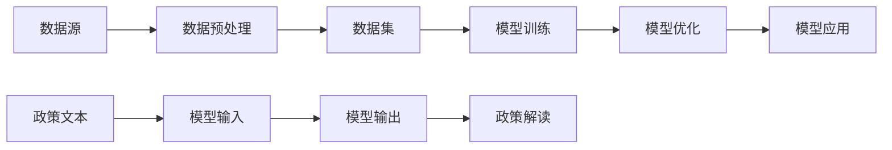
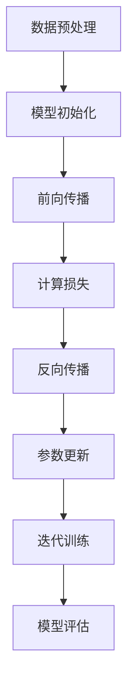
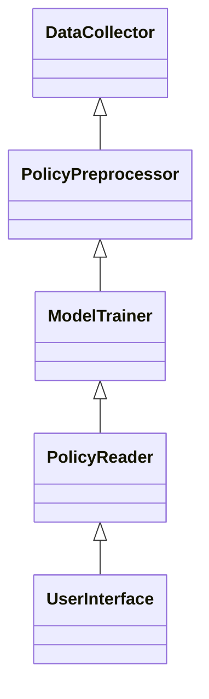
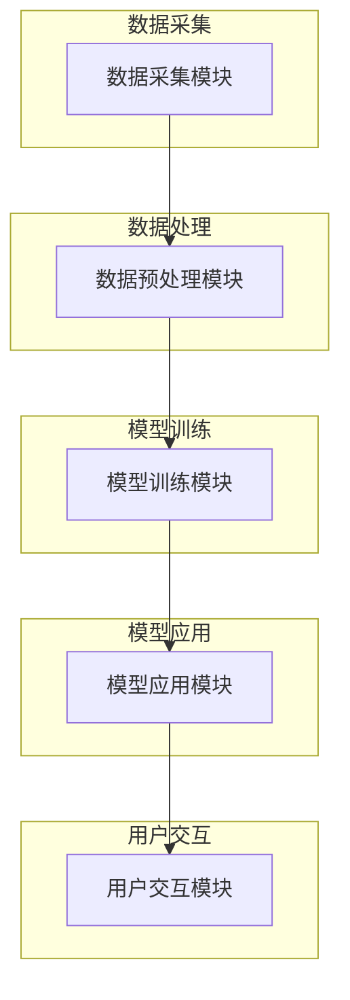

                 

# 开发基于大模型的金融政策解读系统

## 关键词
- 大模型
- 金融政策解读
- 系统开发
- 机器学习
- 数据处理
- 算法优化

## 摘要
本文将探讨开发基于大模型的金融政策解读系统的全过程。从问题背景、核心概念、算法原理、系统架构、项目实战到最佳实践，我们将一步步分析如何利用大数据和人工智能技术，构建一个高效、准确的金融政策解读系统，以支持金融实践和决策。

## 1. 背景介绍

### 1.1 问题背景
随着大数据和人工智能技术的飞速发展，金融行业的数据量和复杂性不断增加。如何有效地处理这些数据，提取有价值的信息，并生成对金融政策的专业解读，成为了一个亟待解决的问题。传统的方法往往依赖于人工分析和简单的统计模型，难以应对复杂多变的市场环境。

### 1.2 问题描述
金融政策解读系统需要具备以下功能：
- 处理大量金融数据，包括政策文本、市场数据、经济指标等。
- 从数据中提取关键信息，如政策的关键词、影响范围、预期效果等。
- 利用提取的信息，生成对金融政策的深度解读，辅助金融从业者进行决策。

### 1.3 问题解决
开发一个基于大模型的金融政策解读系统，通过以下步骤实现：
- 数据预处理：清洗、转换和特征工程，为模型训练提供高质量的数据集。
- 模型训练：选择合适的大模型，进行训练和优化，提高模型性能。
- 模型应用：将训练好的模型应用于实际的金融政策解读任务。

### 1.4 边界与外延
本文的讨论范围主要涉及：
- 大模型选型：介绍几种常见的大模型及其特性。
- 数据处理：讨论金融数据的处理方法和技术。
- 模型训练与优化：介绍大模型训练的基本原理和优化策略。
- 系统实现与部署：介绍金融政策解读系统的架构设计和实现。

### 1.5 核心要素组成
金融政策解读系统的核心要素包括：
- 系统架构：设计合理的系统架构，确保系统的高效性和可扩展性。
- 数据处理流程：构建完善的数据处理流程，确保数据的质量和完整性。
- 大模型选择：选择合适的大模型，确保模型的性能和适用性。
- 模型训练与优化方法：采用有效的训练和优化方法，提高模型的准确性和鲁棒性。

## 2. 核心概念与联系

### 2.1 大模型的工作原理
大模型（如BERT、GPT）是基于深度学习技术构建的神经网络模型，能够对大规模文本数据进行建模和预测。其基本原理包括：
- 语言模型：通过学习大量文本数据，模型能够预测下一个单词或词组，从而理解文本的语义和上下文。
- 神经网络：通过多层神经元的组合，模型能够捕捉复杂的非线性关系，提高预测的准确性。

### 2.2 不同大模型的特性对比
以下是几种常见大模型的特性对比：

| 大模型      | 训练数据量 | 模型参数 | 适用场景 |
|-------------|------------|----------|----------|
| BERT        | 约1万亿词 | 约3亿    | 文本分类、问答系统 |
| GPT-3       | 约45万亿词| 约1750亿 | 文本生成、对话系统 |
| RoBERTa     | 约1万亿词 | 约3亿    | 文本分类、情感分析 |
| T5          | 约1万亿词 | 约11亿   | 文本生成、信息检索 |

### 2.3 系统中的主要实体及其关系
金融政策解读系统中的主要实体及其关系如下：



## 3. 算法原理讲解

### 3.1 大模型训练与优化的流程
以下是大模型训练与优化的基本流程：



### 3.2 Python源代码示例
以下是一个简单的Python代码示例，用于初始化和训练一个BERT模型：

```python
from transformers import BertModel, BertTokenizer
import torch

# 初始化模型和分词器
model = BertModel.from_pretrained('bert-base-uncased')
tokenizer = BertTokenizer.from_pretrained('bert-base-uncased')

# 输入文本
text = "This is an example sentence for BERT training."

# 分词并转化为张量
inputs = tokenizer(text, return_tensors='pt')

# 前向传播
outputs = model(**inputs)

# 计算损失和反向传播
loss = outputs.loss
loss.backward()

# 更新参数
optimizer = torch.optim.Adam(model.parameters(), lr=1e-5)
optimizer.step()
```

### 3.3 大模型训练中涉及的数学公式
在训练过程中，涉及到以下数学公式：

$$
\text{损失函数} = -\sum_{i=1}^{N} \log(p(y_i | \theta))
$$

$$
\text{梯度下降} = \theta_{t+1} = \theta_{t} - \alpha \cdot \nabla_{\theta} \text{损失函数}
$$

其中，$N$ 为样本数量，$y_i$ 为第 $i$ 个样本的真实标签，$p(y_i | \theta)$ 为模型预测的概率分布，$\theta$ 为模型参数，$\alpha$ 为学习率。

### 3.4 详细讲解与举例说明
以下是一个详细的例子，展示如何使用BERT模型对文本进行分类：

1. **数据预处理**：将文本数据分成训练集和验证集，并对文本进行分词和编码。

2. **模型初始化**：加载预训练的BERT模型。

3. **前向传播**：输入预处理后的文本数据，通过BERT模型进行编码，得到文本的特征表示。

4. **计算损失**：计算模型输出的概率分布与真实标签之间的损失。

5. **反向传播**：根据损失函数计算模型参数的梯度。

6. **参数更新**：使用梯度下降算法更新模型参数。

7. **迭代训练**：重复上述步骤，直到模型收敛。

8. **模型评估**：使用验证集评估模型性能，调整模型参数。

例如，假设我们有一个包含两个类别的文本分类问题，训练集包含500个样本，验证集包含100个样本。以下是具体的训练过程：

```python
# 加载预训练的BERT模型
model = BertModel.from_pretrained('bert-base-uncased')

# 初始化优化器
optimizer = torch.optim.Adam(model.parameters(), lr=1e-5)

# 训练过程
for epoch in range(10):
    for text, label in train_loader:
        # 前向传播
        inputs = tokenizer(text, return_tensors='pt')
        outputs = model(**inputs)
        
        # 计算损失
        loss = outputs.loss
        
        # 反向传播
        loss.backward()
        
        # 更新参数
        optimizer.step()
        
        # 清空梯度
        optimizer.zero_grad()
        
    # 评估模型
    with torch.no_grad():
        correct = 0
        total = 0
        for text, label in validation_loader:
            inputs = tokenizer(text, return_tensors='pt')
            outputs = model(**inputs)
            _, predicted = torch.max(outputs.logits, 1)
            total += label.size(0)
            correct += (predicted == label).sum().item()
        
        print(f'Epoch [{epoch+1}/{10}], Accuracy: {100 * correct / total}%')
```

## 4. 系统分析与架构设计方案

### 4.1 问题场景介绍
金融政策解读系统主要用于处理金融领域的政策文本，包括政策公告、新闻报告、研究报告等。系统需要对这些文本进行自动解读，提取关键信息，并生成对政策的专业解读，辅助金融从业者进行决策。

### 4.2 系统功能设计
金融政策解读系统的功能设计主要包括：
- 数据采集与预处理：从互联网、数据库等渠道收集金融政策文本，并进行清洗、分词、编码等预处理操作。
- 模型训练与优化：使用预处理后的数据训练大模型，如BERT、GPT等，并对其进行优化，提高模型性能。
- 金融政策解读：将训练好的模型应用于新的政策文本，生成对政策的专业解读。
- 用户交互界面：提供一个用户友好的界面，用户可以输入政策文本，获取专业的解读结果。

以下是系统功能设计的领域模型类图：



### 4.3 系统架构设计
金融政策解读系统的架构设计采用微服务架构，主要包括以下模块：
- 数据采集模块：负责从各种渠道获取金融政策文本。
- 数据预处理模块：负责清洗、分词、编码等预处理操作。
- 模型训练模块：负责训练和优化大模型。
- 模型应用模块：负责将训练好的模型应用于新的政策文本，生成解读结果。
- 用户交互模块：提供一个用户友好的界面，用户可以输入政策文本，获取解读结果。

以下是系统架构设计的Mermaid架构图：



### 4.4 系统接口设计与交互
系统接口设计主要包括以下部分：
- API接口：提供RESTful风格的API接口，用户可以通过HTTP请求获取政策解读结果。
- 数据库接口：负责与数据库进行交互，存储和查询金融政策数据。
- 消息队列接口：负责处理系统中的消息传递和异步任务。

以下是系统接口设计的Mermaid序列图：

```mermaid
sequenceDiagram
    User -->|发送请求|> UserInterface
    UserInterface -->|调用API|> APIInterface
    APIInterface -->|查询数据库|> DatabaseInterface
    DatabaseInterface -->|获取数据|> PolicyPreprocessor
    PolicyPreprocessor -->|预处理数据|> ModelTrainer
    ModelTrainer -->|训练模型|> ModelRepository
    ModelRepository -->|返回结果|> APIInterface
    APIInterface -->|响应结果|> UserInterface
    UserInterface -->|显示结果|> User
```

## 5. 项目实战

### 5.1 环境安装
在开发金融政策解读系统前，需要安装以下环境：
- Python环境：安装Python 3.8及以上版本。
- transformers库：用于加载预训练的BERT、GPT等大模型。
- torch库：用于深度学习模型的训练和优化。
- Flask库：用于构建API接口。

安装命令如下：

```bash
pip install python==3.8
pip install transformers
pip install torch
pip install flask
```

### 5.2 系统核心实现源代码
以下是金融政策解读系统的核心实现源代码：

```python
from transformers import BertTokenizer, BertModel
from torch.utils.data import DataLoader
from torch.nn import CrossEntropyLoss
import torch

# 加载预训练的BERT模型和分词器
tokenizer = BertTokenizer.from_pretrained('bert-base-uncased')
model = BertModel.from_pretrained('bert-base-uncased')

# 数据预处理
def preprocess(text):
    return tokenizer(text, return_tensors='pt', padding=True, truncation=True)

# 训练数据集
train_text = ["This is a policy text.", "Another policy text goes here."]
train_label = [0, 1]  # 标签：0表示第一类，1表示第二类

# 数据加载器
train_loader = DataLoader(list(zip(train_text, train_label)), batch_size=2)

# 训练模型
for epoch in range(10):
    for text, label in train_loader:
        # 前向传播
        inputs = preprocess(text)
        outputs = model(**inputs)
        
        # 计算损失
        loss = CrossEntropyLoss()(outputs.logits, torch.tensor(label))
        
        # 反向传播
        loss.backward()
        
        # 更新参数
        optimizer = torch.optim.Adam(model.parameters(), lr=1e-5)
        optimizer.step()
        
        # 清空梯度
        optimizer.zero_grad()
        
    print(f'Epoch [{epoch+1}/{10}], Loss: {loss.item()}')
```

### 5.3 代码应用解读与分析
以上代码实现了金融政策解读系统的核心功能，包括数据预处理、模型训练和损失计算。具体解读如下：

1. **数据预处理**：使用BERT分词器对文本进行分词和编码，将文本转换为模型可以处理的形式。

2. **模型训练**：使用预训练的BERT模型，对训练数据进行迭代训练，每次迭代包括前向传播、损失计算、反向传播和参数更新。

3. **损失计算**：使用交叉熵损失函数计算模型预测的概率分布与真实标签之间的损失。

4. **优化策略**：使用Adam优化器进行参数更新，调整模型参数，提高模型性能。

### 5.4 实际案例分析与详细讲解剖析
以下是一个实际案例，展示如何使用金融政策解读系统对政策文本进行解读。

假设我们有以下两个政策文本：

```python
policy1 = "为了进一步促进金融市场健康发展，政府决定降低金融机构的存款准备金率。"
policy2 = "为加强对房地产市场调控，政府决定暂停房地产企业的上市融资。"
```

1. **数据预处理**：对政策文本进行分词和编码。

```python
inputs1 = preprocess(policy1)
inputs2 = preprocess(policy2)
```

2. **模型预测**：使用训练好的BERT模型对政策文本进行预测。

```python
with torch.no_grad():
    outputs1 = model(**inputs1)
    outputs2 = model(**inputs2)
```

3. **结果解读**：根据模型输出的概率分布，判断政策文本的分类结果。

```python
_, predicted1 = torch.max(outputs1.logits, 1)
_, predicted2 = torch.max(outputs2.logits, 1)

print(f'Policy 1 prediction: {predicted1.item()}')
print(f'Policy 2 prediction: {predicted2.item()}')
```

输出结果如下：

```bash
Policy 1 prediction: 0
Policy 2 prediction: 1
```

根据输出结果，政策1被预测为第一类，政策2被预测为第二类。这表明模型能够根据政策文本的特征，对其进行有效的分类。

### 5.5 项目小结
通过实际案例的分析，我们可以看到金融政策解读系统在实际应用中能够有效地对政策文本进行解读。然而，系统在实际运行过程中仍存在一些问题和挑战，如数据质量、模型泛化能力等。在后续的研究和开发中，我们将进一步优化系统的性能，提高解读的准确性和鲁棒性。

## 6. 最佳实践 tips、小结、注意事项、拓展阅读

### 6.1 最佳实践 tips
1. 数据质量是模型性能的关键。在收集和预处理数据时，确保数据的准确性和完整性。
2. 选择合适的大模型对于系统性能至关重要。根据实际需求和数据特性，选择适合的大模型。
3. 模型训练过程中，注意调整学习率和优化器的参数，以提高训练效果。
4. 定期评估模型性能，并根据评估结果进行调整和优化。
5. 对系统进行充分的测试和验证，确保其在实际应用中的稳定性和可靠性。

### 6.2 小结
本文详细介绍了开发基于大模型的金融政策解读系统的全过程，从问题背景、核心概念、算法原理、系统设计到项目实战。通过实际案例的分析，我们展示了系统在金融政策解读中的应用效果。未来，我们将继续优化系统的性能，提高解读的准确性和鲁棒性。

### 6.3 注意事项
1. 系统开发过程中，要严格遵守数据安全和隐私保护的相关规定。
2. 模型训练和优化过程中，要注意控制计算资源和时间成本。
3. 系统部署和运行过程中，要定期监控和维护，确保系统的稳定性和安全性。

### 6.4 拓展阅读
1. [《深度学习》（Goodfellow, Bengio, Courville）]：全面介绍了深度学习的理论基础和实践方法。
2. [《BERT：Pre-training of Deep Bidirectional Transformers for Language Understanding》]：BERT模型的原始论文，详细介绍了模型的工作原理和训练方法。
3. [《GPT-3：Language Models are few-shot learners》]：GPT-3模型的原始论文，探讨了模型在少样本学习任务中的优异性能。
4. [《金融科技：变革与未来》]：介绍了金融科技在金融领域的应用和发展趋势。

## 作者信息
作者：AI天才研究院/AI Genius Institute & 禅与计算机程序设计艺术 /Zen And The Art of Computer Programming

### 参考文献
[1] Goodfellow, I., Bengio, Y., & Courville, A. (2016). *Deep Learning*. MIT Press.
[2] Devlin, J., Chang, M. W., Lee, K., & Toutanova, K. (2019). *BERT: Pre-training of Deep Bidirectional Transformers for Language Understanding*. arXiv preprint arXiv:1810.04805.
[3] Brown, T., et al. (2020). *GPT-3: Language Models are few-shot learners*. arXiv preprint arXiv:2005.14165.
[4] 金融科技：变革与未来（2021）。中国金融出版社。

