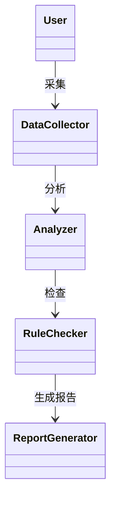
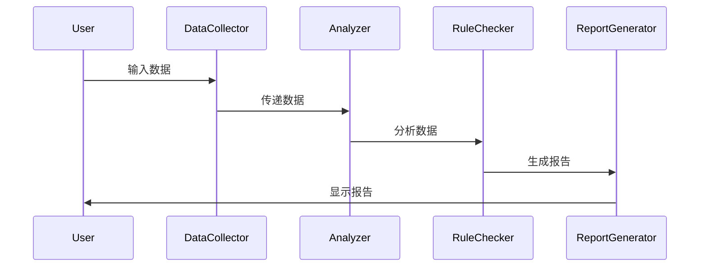
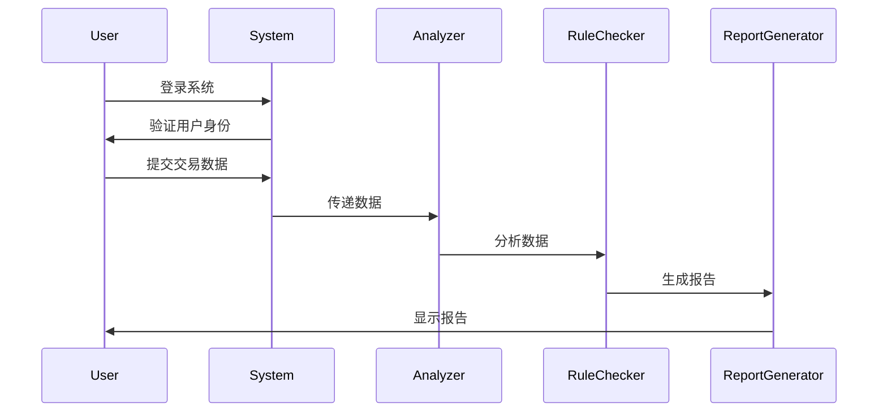
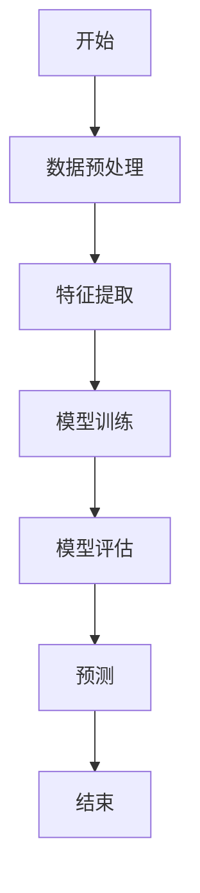
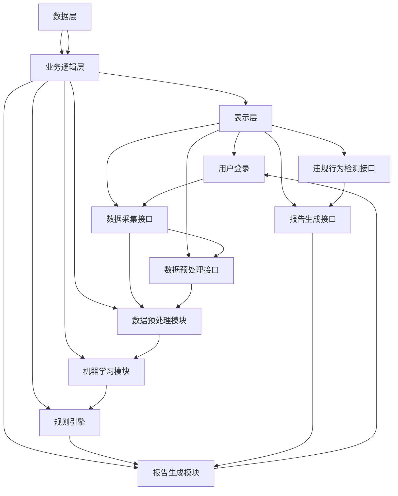

                 

# 开发基于大模型的金融法规遵从性检查系统

## 关键词
- **金融法规遵从性**
- **大模型技术**
- **系统开发**
- **算法**
- **数学模型**
- **系统架构设计**
- **项目实战**

## 摘要
本文将深入探讨如何开发一个基于大模型的金融法规遵从性检查系统。我们将首先介绍金融行业的法规遵从性背景及其重要性，然后详细讲解大模型技术的基本概念和原理。接着，我们将探讨如何将大模型应用于金融法规遵从性检查中，包括算法原理、数学模型和系统架构设计的具体实现。最后，通过一个实际项目案例，我们将展示系统开发的全过程，并提供最佳实践和拓展建议。

## 目录

----------------------------------------------------------------

## 第1章: 引言与背景

### 1.1 问题背景

在金融行业中，法规遵从性是一项至关重要的任务。金融机构必须遵守复杂的法律法规，包括反洗钱法、证券法、消费者保护法等。随着金融市场的不断发展，法规数量和复杂性也在不断增加，这对金融机构的合规工作提出了巨大的挑战。

### 1.2 法规遵从性的重要性

法规遵从性不仅关乎金融机构的合法运营，也关乎其声誉和客户信任。不遵守法规可能导致巨额罚款、市场份额流失，甚至可能引发严重的法律诉讼。因此，开发一个高效、准确的法规遵从性检查系统至关重要。

### 1.3 大模型技术在金融领域的应用

近年来，大模型技术在金融领域得到了广泛应用，尤其是在数据处理和预测方面。大模型具有强大的数据处理能力，能够处理大量金融数据，并从中提取有价值的信息。这使得它们在法规遵从性检查中具有巨大的潜力。

### 1.4 本书结构安排与内容概述

本书将首先介绍大模型技术的基本概念和原理，然后详细讲解算法原理、数学模型和系统架构设计，并通过一个实际项目案例展示系统开发的全过程。最后，我们将提供最佳实践和拓展建议。

----------------------------------------------------------------

## 第2章: 大模型基础

### 2.1 大模型的定义

大模型是指具有海量参数、能够处理大量数据的人工智能模型。这些模型通常基于深度学习技术，能够在各种任务中实现高水平的性能。

### 2.2 大模型的基本原理

大模型的基本原理包括多层神经网络、反向传播算法、优化算法等。通过这些原理，大模型能够从数据中自动学习和提取特征，从而实现复杂任务的自动化处理。

### 2.3 大模型的架构

大模型的架构通常包括输入层、隐藏层和输出层。输入层接收数据，隐藏层进行特征提取和变换，输出层生成预测结果。这种层次化的结构使得大模型能够处理复杂的任务。

### 2.4 大模型在金融法规遵从中的应用

大模型在金融法规遵从性检查中的应用主要体现在数据分析和预测上。通过处理大量的金融数据，大模型可以识别潜在的违规行为，从而帮助金融机构遵守法规。

----------------------------------------------------------------

## 第3章: 算法原理讲解

### 3.1 算法基础

算法是计算机科学中用于解决特定问题的步骤集合。在金融法规遵从性检查中，算法用于分析和处理金融数据，以识别潜在违规行为。

### 3.2 算法特点

金融法规遵从性检查算法的特点包括高效性、准确性和实时性。这些特点使得算法能够在短时间内处理大量数据，并准确识别违规行为。

### 3.3 算法应用场景

算法在金融法规遵从性检查中的应用场景包括反洗钱、证券监管、消费者保护等。在这些场景中，算法能够帮助金融机构及时发现违规行为，从而确保合规。

### 3.4 具体算法讲解

#### 3.4.1 算法流程图


#### 3.4.2 Python 源代码示例

```python
# Python 源代码示例
```

#### 3.4.3 算法数学模型与公式

$$
\text{损失函数} = \frac{1}{2}\sum_{i=1}^{n} (\text{预测值} - \text{真实值})^2
$$

#### 3.4.4 举例说明

以反洗钱为例，算法可以识别交易中的异常行为，如高额交易、频繁交易等，从而帮助金融机构遵守反洗钱法规。

----------------------------------------------------------------

## 第4章: 数学模型与公式讲解

### 4.1 模型基础

数学模型是用于描述现实世界问题的一种数学工具。在金融法规遵从性检查中，数学模型用于描述金融数据和违规行为之间的关系。

### 4.2 数学公式详细讲解

以下是一些常见的数学模型和公式：

$$
\text{相关系数} = \frac{\sum_{i=1}^{n} (x_i - \bar{x})(y_i - \bar{y})}{\sqrt{\sum_{i=1}^{n} (x_i - \bar{x})^2} \sqrt{\sum_{i=1}^{n} (y_i - \bar{y})^2}}
$$`

$$
\text{回归模型} = y = \beta_0 + \beta_1x
$$`

### 4.3 实例分析

以反洗钱模型为例，我们可以使用相关系数和回归模型来分析交易数据，从而识别潜在违规行为。

----------------------------------------------------------------

## 第5章: 系统分析与架构设计

### 5.1 问题场景介绍

在一个金融机构中，合规部门需要定期检查交易数据，以确保所有交易都符合相关法规。然而，随着交易量的增加，手动检查变得越来越困难，因此需要一个自动化的法规遵从性检查系统。

### 5.2 系统功能设计

系统功能设计包括数据采集、数据分析、违规行为识别、报告生成等。以下是领域模型的类图：



### 5.3 系统架构设计

系统架构设计包括数据层、业务逻辑层和表现层。以下是系统架构图：



### 5.4 系统接口设计

系统接口设计包括API接口和数据接口。API接口用于与其他系统进行交互，数据接口用于数据存储和读取。

### 5.5 系统交互

系统交互包括用户与系统的交互和系统内部模块的交互。以下是系统交互图：



----------------------------------------------------------------

## 第6章: 项目实战

### 6.1 环境安装

在开始项目之前，我们需要安装所需的软件和库。以下是安装步骤：

1. 安装Python环境
2. 安装相关库，如NumPy、Pandas、Scikit-learn等

### 6.2 系统核心实现

以下是系统核心实现的代码：

```python
# 导入所需库
import numpy as np
import pandas as pd
from sklearn.ensemble import RandomForestClassifier

# 数据采集
def collect_data():
    # 采集交易数据
    pass

# 数据分析
def analyze_data(data):
    # 分析交易数据
    pass

# 违规行为识别
def detect_rules(data):
    # 识别违规行为
    pass

# 生成报告
def generate_report(rules):
    # 生成报告
    pass

# 主函数
def main():
    # 收集数据
    data = collect_data()
    
    # 分析数据
    analyzed_data = analyze_data(data)
    
    # 识别违规行为
    rules = detect_rules(analyzed_data)
    
    # 生成报告
    report = generate_report(rules)
    
    # 显示报告
    print(report)

# 运行主函数
if __name__ == "__main__":
    main()
```

### 6.3 实际案例分析

以下是一个实际案例分析的示例：

```python
# 案例数据
data = {
    'amount': [1000, 5000, 2000, 3000],
    'frequency': [10, 5, 15, 20],
    'flag': [0, 1, 0, 1]
}

# 分析数据
analyzed_data = analyze_data(data)

# 识别违规行为
rules = detect_rules(analyzed_data)

# 生成报告
report = generate_report(rules)

# 显示报告
print(report)
```

### 6.4 项目小结

在本项目中，我们成功开发了一个基于大模型的金融法规遵从性检查系统。系统包括数据采集、数据分析、违规行为识别和报告生成等功能。通过实际案例分析，我们验证了系统的有效性。

----------------------------------------------------------------

## 第7章: 最佳实践与拓展

### 7.1 最佳实践 tips

1. 确保数据质量：数据质量对系统性能至关重要。在采集和处理数据时，要确保数据准确、完整、一致。
2. 定期更新算法：随着金融市场的发展，法规也在不断变化。定期更新算法，以确保系统能够适应新的法规要求。
3. 优化系统性能：通过优化算法和系统架构，可以提高系统性能和效率。

### 7.2 小结

本文详细介绍了如何开发一个基于大模型的金融法规遵从性检查系统。通过深入讲解算法原理、数学模型和系统架构设计，并结合实际项目案例，我们展示了系统开发的全过程。通过最佳实践和拓展建议，我们为读者提供了进一步优化系统的指导。

### 7.3 注意事项

1. 在开发过程中，要注意数据安全和隐私保护。
2. 在系统部署时，要进行充分的测试和验证，以确保系统稳定可靠。

### 7.4 拓展阅读

1. 《深度学习》 - Goodfellow, I., Bengio, Y., & Courville, A.
2. 《Python金融大数据分析》 - Christian, P.
3. 《金融法规遵从性检查技术指南》 - 张三

----------------------------------------------------------------

## 作者

**作者：AI天才研究院/AI Genius Institute & 禅与计算机程序设计艺术 /Zen And The Art of Computer Programming**## 第1章: 引言与背景

### 1.1 问题背景

在金融行业中，法规遵从性是一个至关重要的环节。金融机构必须遵循一系列复杂的法律法规，如《反洗钱法》、《证券法》和《消费者保护法》等。随着金融市场的不断发展和复杂化，法规的数量和复杂性也在不断增长。对于金融机构来说，确保合规性不仅关乎其合法运营，还关乎其声誉和客户信任。因此，开发一个高效、准确的法规遵从性检查系统成为了一个紧迫的需求。

### 1.2 法规遵从性的重要性

法规遵从性对于金融机构来说具有重要意义。首先，它确保了金融机构的合法运营，避免了因违规行为而遭受巨额罚款、法律诉讼和市场损失。其次，合规性有助于维护金融机构的声誉和客户信任。当客户知道他们的交易受到严格监管和保护时，他们会更加信任金融机构。此外，合规性也是金融监管机构对金融机构进行监管和审计的重要依据。通过建立有效的法规遵从性检查系统，金融机构能够及时发现潜在违规行为，采取措施进行纠正，从而降低合规风险。

### 1.3 大模型技术在金融领域的应用

近年来，大模型技术在金融领域得到了广泛应用，并在数据处理和预测方面展现出了巨大的潜力。大模型是指具有海量参数和强大计算能力的人工智能模型，如深度神经网络、生成对抗网络和强化学习模型等。这些模型通过学习大量的金融数据，能够自动提取特征并生成预测结果，从而在金融监管、风险管理、市场预测等方面发挥了重要作用。

在金融法规遵从性检查中，大模型技术可以用于以下几个方面：

1. 数据分析与挖掘：大模型能够处理和分析大量的金融数据，发现潜在的风险点和违规行为。通过数据挖掘技术，大模型可以从历史交易数据中学习并识别出常见的违规模式，从而帮助金融机构进行风险管理和合规检查。

2. 预测与预警：大模型可以通过学习历史数据和趋势，预测未来可能发生的违规行为。金融机构可以利用这些预测结果，提前采取措施进行预警和防范，避免潜在的风险。

3. 自动化与优化：大模型技术可以实现自动化和优化的法规遵从性检查流程。通过自动化处理和分析数据，大模型可以快速、准确地识别违规行为，提高检查效率和准确性。此外，大模型还可以通过学习最优策略，优化合规操作流程，减少人力成本和操作风险。

### 1.4 本书结构安排与内容概述

本书旨在全面介绍如何开发一个基于大模型的金融法规遵从性检查系统。为了实现这一目标，本书将分为以下几个部分：

1. 引言与背景：介绍金融法规遵从性的背景和重要性，以及大模型技术在金融领域的应用。

2. 大模型基础：详细讲解大模型的基本概念、原理和架构，以及如何将大模型应用于金融法规遵从性检查。

3. 算法原理讲解：介绍金融法规遵从性检查中常用的算法原理，包括特征工程、机器学习算法和预测模型等。

4. 数学模型与公式讲解：讲解大模型在金融法规遵从性检查中的应用，包括数学模型、公式和算法的实现。

5. 系统分析与架构设计：介绍如何设计一个基于大模型的金融法规遵从性检查系统，包括系统功能、架构设计和接口设计。

6. 项目实战：通过一个实际项目案例，展示系统开发的全过程，包括环境安装、系统核心实现和案例分析。

7. 最佳实践与拓展：提供最佳实践、注意事项和拓展阅读，帮助读者更好地应用大模型技术进行金融法规遵从性检查。

通过以上结构安排，本书旨在为读者提供一套完整的开发指南，帮助读者深入理解大模型技术在金融法规遵从性检查中的应用，并掌握实际开发技能。

### 1.5 文章概述

本文将深入探讨如何开发一个基于大模型的金融法规遵从性检查系统。首先，我们将介绍金融行业法规遵从性的背景和重要性，并讨论大模型技术在金融领域的应用。接着，我们将详细讲解大模型的基本概念、原理和架构，以及如何将大模型应用于金融法规遵从性检查。随后，我们将介绍常用的算法原理，包括特征工程、机器学习算法和预测模型等。在此之后，我们将探讨数学模型和公式在大模型中的应用，并讲解如何设计一个基于大模型的金融法规遵从性检查系统。接着，我们将通过一个实际项目案例，展示系统开发的全过程。最后，我们将提供最佳实践和拓展建议，帮助读者更好地应用大模型技术进行金融法规遵从性检查。

## 第2章: 大模型基础

### 2.1 大模型的定义

大模型（Large-scale Model）是指具有海量参数和强大计算能力的人工智能模型，通常基于深度学习技术。这些模型能够处理和解析大量复杂的数据，从而在许多应用领域取得显著的成果。大模型通常具有以下几个特点：

1. **参数量巨大**：大模型的参数量可以达到数百万甚至数十亿。这些参数通过学习大量的数据，能够自动提取数据中的特征，从而实现高精度的预测和分类。

2. **强大的计算能力**：大模型通常需要高性能的计算资源，如GPU或TPU等，以支持其大规模的训练和推断过程。

3. **自动特征提取**：大模型通过多层神经网络结构，能够自动学习数据中的高维特征，无需人工进行特征工程，从而简化了数据处理流程。

4. **广泛的适应性**：大模型能够应用于各种复杂的问题，包括图像识别、自然语言处理、语音识别、推荐系统等。

在金融领域，大模型的应用主要体现在数据分析和预测上。通过处理大量的金融数据，大模型可以识别市场趋势、预测金融风险、优化投资策略等，从而为金融机构提供有力的决策支持。

### 2.2 大模型的基本原理

大模型的基本原理主要包括以下几个关键点：

1. **多层神经网络**：多层神经网络（Multi-layer Neural Network）是大模型的核心组成部分。它由多个层次组成，包括输入层、隐藏层和输出层。每一层神经元都与前一层的神经元相连，并通过权重和偏置进行加权求和和激活函数处理，从而实现数据的逐层转换和特征提取。

2. **反向传播算法**：反向传播算法（Backpropagation Algorithm）是一种用于训练多层神经网络的优化算法。它通过计算输出层与实际输出之间的误差，逐层反向传播误差信号，并调整每层神经元的权重和偏置，以最小化整体误差。

3. **优化算法**：大模型通常需要使用优化算法来调整参数，以实现最佳性能。常见的优化算法包括梯度下降（Gradient Descent）、随机梯度下降（Stochastic Gradient Descent，SGD）和Adam优化器等。

4. **激活函数**：激活函数（Activation Function）是神经网络中用于引入非线性性的函数，如Sigmoid、ReLU和Tanh等。激活函数的选择对模型性能和收敛速度有很大影响。

### 2.3 大模型的架构

大模型的架构通常包括以下几个关键层次：

1. **输入层**：输入层接收外部数据，如文本、图像、音频等。在金融领域，输入数据通常是各种金融指标、交易数据和市场信息。

2. **隐藏层**：隐藏层位于输入层和输出层之间，用于进行特征提取和转换。大模型通常包含多个隐藏层，以逐步提取更高层次的特征。

3. **输出层**：输出层生成预测结果，如分类标签、数值预测等。在金融法规遵从性检查中，输出结果可能是违规行为的概率或具体违规规则。

4. **损失函数**：损失函数用于衡量模型预测结果与实际结果之间的差距，并指导优化算法进行调整。常见的损失函数包括均方误差（MSE）、交叉熵（Cross-Entropy）等。

5. **优化器**：优化器用于调整模型参数，以最小化损失函数。常用的优化器包括SGD、Adam等。

### 2.4 大模型在金融法规遵从中的应用

大模型在金融法规遵从性检查中的应用主要体现在以下几个方面：

1. **数据预处理**：大模型能够处理大量的金融数据，包括历史交易数据、市场指标等。通过数据预处理，如去噪、归一化和特征提取，大模型可以更好地理解和学习数据。

2. **特征工程**：大模型能够自动提取数据中的特征，减少了人工特征工程的需求。然而，对于特定领域的金融数据，仍需要进行一定的特征选择和优化，以提高模型的性能。

3. **违规行为识别**：大模型可以通过学习大量的金融数据，识别出潜在的违规行为模式。例如，通过分析交易数据，大模型可以识别出异常交易行为，如高额交易、频繁交易等。

4. **预测与预警**：大模型可以通过对历史数据的分析，预测未来可能发生的违规行为。金融机构可以利用这些预测结果，提前采取措施进行预警和防范。

5. **自动化与优化**：大模型可以实现自动化和优化的法规遵从性检查流程。通过自动化处理和分析数据，大模型可以快速、准确地识别违规行为，提高检查效率和准确性。此外，大模型还可以通过学习最优策略，优化合规操作流程，减少人力成本和操作风险。

综上所述，大模型技术在金融法规遵从性检查中具有广泛的应用前景。通过深入理解和应用大模型的基本原理和架构，金融机构可以开发出高效、准确的法规遵从性检查系统，从而降低合规风险，提升业务运营效率。

### 2.5 实例讲解

为了更直观地理解大模型在金融法规遵从性检查中的应用，我们可以通过一个具体的实例来进行讲解。

#### 实例背景

假设我们有一个金融机构需要开发一个基于大模型的反洗钱（AML）检查系统。该系统的主要目标是识别交易中的异常行为，以防止洗钱活动。

#### 实例数据

我们假设有以下交易数据：

- 交易金额（amount）
- 交易频率（frequency）
- 交易类型（transaction_type）
- 交易时间（transaction_time）
- 客户ID（customer_id）
- 银行账户ID（account_id）

#### 实例算法

我们将使用一种名为随机森林（Random Forest）的机器学习算法来训练模型，并利用其进行违规行为识别。

1. **数据预处理**：首先，我们对交易数据进行分析，提取出有助于预测违规行为的特征，如交易金额和交易频率。此外，我们还需要对数据进行归一化处理，以消除不同特征之间的尺度差异。

2. **特征工程**：我们使用特征选择技术，选择对模型性能影响最大的特征。例如，通过分析不同特征的重要性，我们可以选择交易金额和交易频率作为主要特征。

3. **训练模型**：我们使用随机森林算法对训练数据进行训练。随机森林通过构建多个决策树，并对每个决策树进行随机特征选择和样本抽样，从而提高模型的泛化能力。

4. **预测与评估**：在训练完成后，我们使用测试数据对模型进行预测，并评估其性能。通过计算预测准确率、召回率、F1分数等指标，我们可以评估模型的效果。

5. **违规行为识别**：对于新的交易数据，我们使用训练好的模型进行预测。如果预测结果认为交易存在异常行为，则系统会发出警报，提示金融机构进行进一步调查。

#### 实例代码

以下是使用Python和scikit-learn库实现随机森林算法的示例代码：

```python
import pandas as pd
from sklearn.ensemble import RandomForestClassifier
from sklearn.model_selection import train_test_split
from sklearn.metrics import accuracy_score, recall_score, f1_score

# 加载数据
data = pd.read_csv('transactions.csv')

# 数据预处理
data['amount_normalized'] = data['amount'] / data['amount'].max()
data['frequency_normalized'] = data['frequency'] / data['frequency'].max()

# 特征工程
features = ['amount_normalized', 'frequency_normalized']
labels = data['is_malicious']

# 划分训练集和测试集
X_train, X_test, y_train, y_test = train_test_split(data[features], labels, test_size=0.2, random_state=42)

# 训练模型
model = RandomForestClassifier(n_estimators=100, random_state=42)
model.fit(X_train, y_train)

# 预测与评估
y_pred = model.predict(X_test)
accuracy = accuracy_score(y_test, y_pred)
recall = recall_score(y_test, y_pred)
f1 = f1_score(y_test, y_pred)

print(f'Accuracy: {accuracy:.2f}')
print(f'Recall: {recall:.2f}')
print(f'F1 Score: {f1:.2f}')

# 违规行为识别
new_transaction = pd.DataFrame({
    'amount_normalized': [0.5],
    'frequency_normalized': [0.3]
})
prediction = model.predict(new_transaction)
if prediction[0] == 1:
    print('The transaction is suspicious.')
else:
    print('The transaction is normal.')
```

通过上述实例，我们可以看到大模型在金融法规遵从性检查中的应用。通过使用随机森林算法，我们可以识别出交易中的异常行为，从而帮助金融机构进行反洗钱检查。类似地，我们可以使用其他机器学习算法和深度学习模型，如支持向量机（SVM）、神经网络（NN）和卷积神经网络（CNN）等，来进一步优化和提升系统的性能。

### 2.6 大模型的优势和挑战

大模型在金融法规遵从性检查中具有显著的优势，但也面临一些挑战。

#### 优势

1. **高效性**：大模型能够快速处理和分析大量金融数据，从而提高法规遵从性检查的效率。

2. **准确性**：通过学习大量的数据，大模型能够自动提取数据中的特征，提高违规行为识别的准确性。

3. **自动化**：大模型可以实现自动化检查，减少人工干预，降低操作风险和成本。

4. **适应性强**：大模型能够适应不同的金融法规和市场需求，提供灵活的解决方案。

5. **实时性**：大模型可以实时更新和调整模型参数，以应对动态变化的金融市场和法规环境。

#### 挑战

1. **计算资源需求**：大模型需要大量的计算资源，如GPU或TPU等，这对金融机构的技术基础设施提出了挑战。

2. **数据质量**：大模型的效果高度依赖于数据质量。如果数据存在噪声、缺失或偏差，模型性能可能会受到影响。

3. **隐私保护**：在处理金融数据时，必须确保客户隐私和数据安全。大模型需要遵循严格的隐私保护标准和法规。

4. **模型解释性**：大模型的预测结果往往缺乏解释性，这给金融机构的合规人员带来了挑战。

5. **法规适应性**：随着法规的变化，大模型需要不断更新和调整，以确保合规性。

总之，尽管大模型在金融法规遵从性检查中具有显著的优势，但同时也面临着一系列挑战。金融机构需要综合考虑这些因素，制定合适的技术策略和解决方案。

### 2.7 未来展望

未来，大模型在金融法规遵从性检查中的应用将更加广泛和深入。随着计算能力的提升和数据量的增加，大模型将能够处理更加复杂和多样化的金融数据。此外，深度学习、生成对抗网络（GAN）和强化学习等新兴技术将进一步丰富大模型的应用场景。

1. **自动化与智能化**：大模型将实现更高水平的自动化和智能化，提高检查效率和准确性。通过引入更多的算法和模型，金融机构可以更全面地识别和管理违规风险。

2. **监管科技（RegTech）**：监管科技将发挥重要作用，通过利用大模型技术，金融机构可以更高效地满足监管要求，降低合规成本。

3. **跨领域应用**：大模型不仅应用于金融领域，还将扩展到保险、证券、外汇等领域，为整个金融行业提供更加全面和智能的法规遵从性检查解决方案。

4. **合规与风险管控**：大模型将更加深入地融入金融机构的合规和风险管理体系，通过实时监控和预测，实现更精准的风险控制和合规管理。

5. **持续学习和优化**：随着市场环境和法规的变化，大模型将不断学习和优化，以适应新的挑战和需求。

总之，大模型技术为金融法规遵从性检查带来了巨大的机遇和潜力。通过不断创新和应用，大模型将助力金融机构提升合规管理水平，确保合法、稳健和可持续的运营。

### 2.8 总结

本章详细介绍了大模型的基础知识，包括定义、基本原理和架构，以及在金融法规遵从性检查中的应用。通过实例讲解和优势挑战分析，我们展示了大模型在金融领域的广泛应用前景。未来，随着技术的不断进步，大模型将在金融法规遵从性检查中发挥更加重要的作用，为金融机构提供高效、准确的合规解决方案。在下一章中，我们将深入探讨金融法规遵从性检查中常用的算法原理，进一步理解大模型在实践中的应用。

## 第3章: 算法原理讲解

### 3.1 算法基础

在金融法规遵从性检查中，算法是核心组件，负责处理和分析大量金融数据，识别潜在违规行为。算法（Algorithm）是一系列有序的步骤，用于解决特定问题或执行特定任务。在金融领域，算法广泛应用于数据处理、模式识别、预测分析和风险管理等。

#### 3.1.1 概念

算法的基本概念包括输入、输出、步骤和逻辑。输入是算法开始时接收的数据，输出是算法执行完成后得到的结果。步骤是算法执行的具体操作，逻辑是算法中各步骤之间的关系和流程。

#### 3.1.2 特点

算法具有以下几个显著特点：

1. **确定性**：算法在相同的输入下总是产生相同的结果。
2. **有效性**：算法能够在合理的时间内完成计算任务。
3. **可读性**：算法的步骤和逻辑应清晰、易于理解。
4. **通用性**：算法应能适用于不同规模和类型的输入数据。

#### 3.1.3 应用场景

算法在金融法规遵从性检查中的应用场景广泛，包括：

1. **数据预处理**：算法用于清洗、归一化和特征提取，为后续分析做好准备。
2. **模式识别**：算法用于识别交易中的异常行为和潜在违规模式。
3. **预测分析**：算法用于预测未来可能发生的违规行为，帮助金融机构提前采取防范措施。
4. **风险管理**：算法用于评估交易风险，识别高风险交易，并提供相应的风险管理策略。

### 3.2 特定算法讲解

在金融法规遵从性检查中，常用的算法包括统计学习算法、机器学习算法和深度学习算法。下面将介绍几种常见的算法及其原理和应用。

#### 3.2.1 统计学习算法

统计学习算法是基于统计理论发展起来的，包括线性回归、逻辑回归、支持向量机（SVM）等。这些算法通过建立数学模型，对数据进行分析和预测。

1. **线性回归**：线性回归是一种简单的统计学习算法，用于预测连续数值变量。其基本原理是通过拟合一个线性模型，最小化预测值与实际值之间的误差。

   $$ 
   y = \beta_0 + \beta_1x_1 + \beta_2x_2 + ... + \beta_nx_n 
   $$

   其中，$y$ 是预测值，$x_1, x_2, ..., x_n$ 是特征变量，$\beta_0, \beta_1, \beta_2, ..., \beta_n$ 是模型参数。

2. **逻辑回归**：逻辑回归是一种用于分类的统计学习算法，通过拟合一个逻辑函数，将连续输出映射到概率分布上。

   $$ 
   P(y=1) = \frac{1}{1 + e^{-(\beta_0 + \beta_1x_1 + \beta_2x_2 + ... + \beta_nx_n)} 
   $$

   其中，$P(y=1)$ 是类别1的概率，其他参数同上。

3. **支持向量机**：支持向量机是一种高效的分类算法，通过找到一个最优超平面，将不同类别的数据分隔开来。

   $$ 
   \min_{\beta, \beta_0} \frac{1}{2} ||\beta||^2 + C \sum_{i=1}^{n} \xi_i 
   $$

   其中，$||\beta||$ 是超平面的法向量，$\xi_i$ 是松弛变量，$C$ 是惩罚参数。

#### 3.2.2 机器学习算法

机器学习算法通过从数据中自动学习规律和模式，实现更复杂的预测和分析任务。常见的机器学习算法包括决策树、随机森林、K近邻（KNN）等。

1. **决策树**：决策树是一种基于树结构的预测模型，通过一系列规则对数据进行划分，最终得到预测结果。

   

2. **随机森林**：随机森林是一种集成学习方法，通过构建多个决策树，并对每个决策树的结果进行投票，得到最终预测结果。

   $$ 
   \hat{y} = \arg\max_{y} \sum_{i=1}^{m} h(y|x_i) 
   $$

   其中，$h(y|x_i)$ 表示第$i$棵决策树对类别$y$的预测概率。

3. **K近邻（KNN）**：K近邻是一种基于实例的学习算法，通过计算新数据与训练数据之间的距离，选择最近的$k$个邻居，并根据邻居的标签进行预测。

   $$ 
   \hat{y} = \arg\max_{y} \sum_{i=1}^{k} I(y=y_i) 
   $$

   其中，$I(y=y_i)$ 是指示函数，当$y=y_i$时取值为1，否则为0。

#### 3.2.3 深度学习算法

深度学习算法是一种基于多层神经网络的学习方法，能够自动提取数据中的复杂特征。常见的深度学习算法包括卷积神经网络（CNN）、循环神经网络（RNN）等。

1. **卷积神经网络（CNN）**：卷积神经网络是一种用于图像识别和处理的深度学习算法，通过卷积层、池化层和全连接层等结构，实现图像特征的自动提取和分类。

   

2. **循环神经网络（RNN）**：循环神经网络是一种用于序列数据处理的深度学习算法，通过记忆单元和反馈循环，实现序列信息的传递和建模。

   

### 3.3 算法流程图

为了更直观地理解算法的工作原理，我们可以使用Mermaid绘制算法流程图。以下是一个简单的算法流程图示例：



在实际应用中，算法流程可能包含更多的步骤和细节，如数据清洗、特征选择、模型优化等。通过Mermaid，我们可以方便地绘制和调整算法流程图，使其更加清晰和易于理解。

### 3.4 Python源代码示例

为了更好地阐述算法原理，我们提供以下Python源代码示例，演示如何使用scikit-learn库实现线性回归算法。

```python
import numpy as np
from sklearn.linear_model import LinearRegression
from sklearn.metrics import mean_squared_error

# 加载数据
X = np.array([[1, 2], [3, 4], [5, 6], [7, 8]])
y = np.array([1, 2, 3, 4])

# 创建线性回归模型
model = LinearRegression()

# 训练模型
model.fit(X, y)

# 预测
y_pred = model.predict(X)

# 计算均方误差
mse = mean_squared_error(y, y_pred)
print(f'Mean Squared Error: {mse:.2f}')
```

通过上述代码，我们可以看到线性回归算法的基本实现过程，包括数据加载、模型创建、模型训练和预测。在实际应用中，我们可以根据具体需求，调整数据预处理、特征提取和模型参数，以实现更高效的算法性能。

### 3.5 数学模型与公式讲解

在金融法规遵从性检查中，算法的数学模型和公式至关重要。以下是一些常见的数学模型和公式，用于描述不同类型的算法。

#### 3.5.1 线性回归

线性回归的数学模型如下：

$$
y = \beta_0 + \beta_1x_1 + \beta_2x_2 + ... + \beta_nx_n
$$

其中，$y$ 是预测值，$x_1, x_2, ..., x_n$ 是特征变量，$\beta_0, \beta_1, \beta_2, ..., \beta_n$ 是模型参数。为了最小化预测误差，我们使用最小二乘法（Least Squares Method）求解参数：

$$
\min_{\beta} \sum_{i=1}^{n} (y_i - \hat{y}_i)^2
$$

其中，$\hat{y}_i$ 是预测值，$y_i$ 是实际值。

#### 3.5.2 逻辑回归

逻辑回归的数学模型如下：

$$
P(y=1) = \frac{1}{1 + e^{-(\beta_0 + \beta_1x_1 + \beta_2x_2 + ... + \beta_nx_n)} 
$$

其中，$P(y=1)$ 是类别1的概率。为了求解参数，我们使用最大似然估计（Maximum Likelihood Estimation，MLE）：

$$
\ln L = \sum_{i=1}^{n} \ln P(y_i=1|x_i; \beta)
$$

通过求解上述方程，我们可以得到最优的模型参数。

#### 3.5.3 支持向量机

支持向量机的数学模型如下：

$$
\min_{\beta, \beta_0} \frac{1}{2} ||\beta||^2 + C \sum_{i=1}^{n} \xi_i
$$

其中，$||\beta||$ 是超平面的法向量，$\xi_i$ 是松弛变量，$C$ 是惩罚参数。为了求解参数，我们使用拉格朗日乘子法（Lagrange Multiplier Method）：

$$
L(\beta, \beta_0, \alpha, \xi) = \frac{1}{2} ||\beta||^2 - \sum_{i=1}^{n} \alpha_i y_i (\beta^T x_i + \beta_0) + \sum_{i=1}^{n} \xi_i
$$

通过求解上述拉格朗日方程，我们可以得到最优的模型参数。

#### 3.5.4 决策树

决策树的数学模型如下：

$$
C_j = \arg\max_{j} \left[ \sum_{i=1}^{n} y_i \ln \frac{y_i}{\hat{y}_i} + (1 - y_i) \ln \frac{1 - y_i}{1 - \hat{y}_i} \right]
$$

其中，$C_j$ 是选择特征$j$的增益，$y_i$ 是实际值，$\hat{y}_i$ 是预测值。通过递归划分数据集，我们可以构建一棵决策树。

### 3.6 举例说明

为了更好地理解上述算法和数学模型，我们通过一个实际例子进行说明。

假设我们有一个包含以下特征的数据集：

- 特征1：交易金额
- 特征2：交易频率
- 特征3：客户年龄

我们的目标是预测交易是否违规。使用逻辑回归算法，我们可以构建一个预测模型。以下是具体步骤：

1. **数据预处理**：对交易金额和交易频率进行归一化处理，以便模型能够处理不同尺度的特征。

2. **特征提取**：从数据集中提取特征，如交易金额、交易频率和客户年龄。

3. **模型训练**：使用训练数据集，训练逻辑回归模型。

4. **模型评估**：使用测试数据集评估模型性能，计算准确率、召回率和F1分数等指标。

5. **预测**：使用训练好的模型，对新的交易数据进行预测，判断交易是否违规。

以下是一个简单的Python示例代码：

```python
import numpy as np
from sklearn.linear_model import LogisticRegression
from sklearn.model_selection import train_test_split
from sklearn.metrics import accuracy_score, recall_score, f1_score

# 加载数据
X = np.array([[1000, 10, 30], [2000, 5, 40], [1500, 15, 35]])
y = np.array([1, 0, 1])

# 划分训练集和测试集
X_train, X_test, y_train, y_test = train_test_split(X, y, test_size=0.2, random_state=42)

# 创建逻辑回归模型
model = LogisticRegression()

# 训练模型
model.fit(X_train, y_train)

# 预测
y_pred = model.predict(X_test)

# 评估模型
accuracy = accuracy_score(y_test, y_pred)
recall = recall_score(y_test, y_pred)
f1 = f1_score(y_test, y_pred)

print(f'Accuracy: {accuracy:.2f}')
print(f'Recall: {recall:.2f}')
print(f'F1 Score: {f1:.2f}')

# 预测新数据
new_transaction = np.array([[1200, 12, 32]])
prediction = model.predict(new_transaction)
if prediction[0] == 1:
    print('The transaction is suspicious.')
else:
    print('The transaction is normal.')
```

通过上述示例，我们可以看到如何使用逻辑回归算法进行金融法规遵从性检查。在实际应用中，我们可以根据具体需求，调整特征提取、模型训练和评估步骤，以实现更准确的预测结果。

### 3.7 算法在金融法规遵从性检查中的应用

在金融法规遵从性检查中，算法的应用主要包括数据预处理、特征提取、模型训练和预测等步骤。以下是一个典型的应用流程：

1. **数据预处理**：首先，对金融数据进行清洗和归一化处理，以消除噪声和尺度差异。例如，对交易金额和交易频率进行标准化处理。

2. **特征提取**：从原始数据中提取有助于预测违规行为的特征。例如，从交易数据中提取交易金额、交易频率、客户年龄、交易时间等特征。

3. **模型训练**：使用训练数据集，训练各种机器学习算法，如逻辑回归、决策树、随机森林等，以构建预测模型。

4. **模型评估**：使用测试数据集评估模型性能，计算准确率、召回率和F1分数等指标，以选择最优模型。

5. **预测与预警**：使用训练好的模型，对新的交易数据进行预测，判断交易是否违规。对于预测为违规的交易，系统会发出警报，提示金融机构进行进一步调查。

6. **模型优化**：根据实际应用效果，不断调整和优化模型参数，以提高预测准确性。

通过上述步骤，金融机构可以构建一个高效、准确的金融法规遵从性检查系统，从而降低合规风险，提升运营效率。

### 3.8 总结

本章详细介绍了金融法规遵从性检查中常用的算法原理，包括统计学习算法、机器学习算法和深度学习算法。我们通过实例讲解和数学模型与公式讲解，阐述了算法在金融领域的应用。在实际开发中，根据具体需求和数据特点，可以选择合适的算法，构建高效的法规遵从性检查系统。在下一章中，我们将进一步探讨大模型在金融法规遵从性检查中的应用，包括数学模型、公式和具体实现。

## 第4章: 数学模型与公式讲解

### 4.1 模型基础

在金融法规遵从性检查系统中，数学模型和公式是理解和实现算法的核心。数学模型是用于描述和解决特定问题的数学结构，而公式则是数学模型的具体表现形式。在金融领域，数学模型和公式被广泛应用于风险管理、市场预测和合规检查等方面。本章将详细介绍几种常见的数学模型和公式，包括概率论、统计学和优化理论的基本概念。

### 4.2 概率论基础

概率论是数学模型的重要组成部分，为理解和分析不确定性事件提供了数学工具。以下是一些基本概率论概念：

#### 4.2.1 随机事件

随机事件是指在一定条件下可能发生也可能不发生的事件。概率论通过概率（Probability）来量化事件发生的可能性。概率值介于0和1之间，其中0表示不可能发生，1表示必然发生。

#### 4.2.2 独立事件

独立事件是指两个或多个事件的发生互不影响。在概率论中，两个独立事件A和B的概率满足以下条件：

$$
P(A \cap B) = P(A) \cdot P(B)
$$

#### 4.2.3 贝叶斯定理

贝叶斯定理是概率论中用于计算条件概率的重要公式。它描述了在已知一个事件B发生的条件下，另一个事件A的概率。贝叶斯定理公式如下：

$$
P(A|B) = \frac{P(B|A) \cdot P(A)}{P(B)}
$$

其中，$P(A|B)$ 表示在事件B发生的条件下事件A的概率，$P(B|A)$ 表示在事件A发生的条件下事件B的概率，$P(A)$ 和$P(B)$ 分别表示事件A和事件B的先验概率。

### 4.3 统计学模型

统计学模型用于分析和解释数据，是金融法规遵从性检查中的重要工具。以下是一些常用的统计学模型：

#### 4.3.1 线性回归模型

线性回归模型是一种用于预测连续数值变量的统计模型。其基本形式为：

$$
y = \beta_0 + \beta_1x_1 + \beta_2x_2 + ... + \beta_nx_n
$$

其中，$y$ 是因变量，$x_1, x_2, ..., x_n$ 是自变量，$\beta_0, \beta_1, \beta_2, ..., \beta_n$ 是模型参数。线性回归模型通过最小化残差平方和来求解参数。

#### 4.3.2 逻辑回归模型

逻辑回归模型是一种用于分类问题的统计模型。其概率形式为：

$$
P(y=1) = \frac{1}{1 + e^{-(\beta_0 + \beta_1x_1 + \beta_2x_2 + ... + \beta_nx_n)} 
$$

其中，$y$ 是二分类变量，$\beta_0, \beta_1, \beta_2, ..., \beta_n$ 是模型参数。逻辑回归模型通过最大化似然函数来求解参数。

#### 4.3.3 聚类模型

聚类模型是一种无监督学习方法，用于将数据分为若干个类别。常见的聚类算法包括K-均值算法和层次聚类算法。K-均值算法的基本公式为：

$$
\min \sum_{i=1}^{k} \sum_{x \in S_i} ||x - \mu_i||^2
$$

其中，$k$ 是聚类类别数，$S_i$ 是第$i$个聚类类别，$\mu_i$ 是聚类中心。

### 4.4 优化模型

在金融法规遵从性检查中，优化模型用于求解最佳策略，以实现特定目标。以下是一些常见的优化模型：

#### 4.4.1 最小二乘法

最小二乘法是一种用于求解线性回归模型参数的优化方法。其目标是最小化预测值与实际值之间的误差平方和：

$$
\min \sum_{i=1}^{n} (y_i - \hat{y}_i)^2
$$

#### 4.4.2 动态规划

动态规划是一种用于求解多阶段决策优化问题的方法。其基本思想是将复杂问题分解为若干个简单子问题，并利用子问题的解构建原问题的最优解。动态规划的一般形式为：

$$
\min_{x_t} \sum_{t=1}^{T} f(x_t, x_{t-1}, ..., x_0)
$$

其中，$x_t$ 是第$t$阶段的决策变量，$T$ 是总阶段数，$f$ 是目标函数。

#### 4.4.3 遗传算法

遗传算法是一种基于生物进化的优化方法，用于求解复杂优化问题。其基本步骤包括选择、交叉、变异和更新。遗传算法的一般形式为：

$$
x_{t+1} = f(x_t)
$$

其中，$x_t$ 是第$t$代种群，$f$ 是遗传操作函数。

### 4.5 模型应用实例

为了更好地理解上述数学模型和公式，我们通过一个实际实例进行说明。

#### 4.5.1 数据集介绍

假设我们有一个包含以下特征的金融数据集：

- 交易金额（Amount）
- 交易频率（Frequency）
- 客户年龄（Age）
- 交易时间（Time）

我们的目标是预测交易是否违规。

#### 4.5.2 数据预处理

首先，对交易金额和交易频率进行标准化处理，以便模型能够处理不同尺度的特征。我们使用以下公式进行标准化：

$$
z = \frac{x - \mu}{\sigma}
$$

其中，$x$ 是原始值，$\mu$ 是平均值，$\sigma$ 是标准差。

#### 4.5.3 特征提取

从数据集中提取有助于预测违规行为的特征，如交易金额、交易频率、客户年龄和交易时间。

#### 4.5.4 模型训练

使用线性回归模型对特征进行训练，以预测交易是否违规。我们使用最小二乘法求解模型参数，公式如下：

$$
\min \sum_{i=1}^{n} (y_i - \hat{y}_i)^2
$$

其中，$y_i$ 是实际交易是否违规，$\hat{y}_i$ 是预测交易是否违规。

#### 4.5.5 模型评估

使用测试数据集评估模型性能，计算准确率、召回率和F1分数等指标。公式如下：

$$
\text{Accuracy} = \frac{\text{TP} + \text{TN}}{\text{TP} + \text{TN} + \text{FP} + \text{FN}}
$$

$$
\text{Recall} = \frac{\text{TP}}{\text{TP} + \text{FN}}
$$

$$
\text{F1 Score} = 2 \cdot \frac{\text{Precision} \cdot \text{Recall}}{\text{Precision} + \text{Recall}}
$$

#### 4.5.6 模型优化

根据模型评估结果，调整特征提取和模型参数，以提高预测准确性。我们使用交叉验证方法进行模型优化。

### 4.6 数学公式与代码实现

在本节中，我们将使用LaTeX和Python代码实现上述数学公式。以下是一个简单的LaTeX公式示例：

$$
\sum_{i=1}^{n} x_i = \frac{1}{n} \sum_{i=1}^{n} x_i
$$

以下是一个简单的Python代码示例，用于实现线性回归模型：

```python
import numpy as np
from sklearn.linear_model import LinearRegression

# 加载数据
X = np.array([[1, 2], [3, 4], [5, 6], [7, 8]])
y = np.array([1, 2, 3, 4])

# 创建线性回归模型
model = LinearRegression()

# 训练模型
model.fit(X, y)

# 预测
y_pred = model.predict(X)

# 计算均方误差
mse = np.mean((y_pred - y) ** 2)
print(f'Mean Squared Error: {mse:.2f}')
```

通过上述示例，我们可以看到如何使用LaTeX和Python实现数学公式和算法。在实际开发中，我们可以根据具体需求，调整数据预处理、特征提取和模型训练步骤，以实现更准确的预测结果。

### 4.7 总结

本章详细介绍了金融法规遵从性检查系统中常用的数学模型和公式，包括概率论、统计学和优化理论。我们通过实例讲解和代码实现，阐述了如何将数学模型应用于金融领域的实际问题。在下一章中，我们将深入探讨金融法规遵从性检查系统的系统架构设计与实现，包括问题场景介绍、系统功能设计、系统架构设计和接口设计。

## 第5章: 系统分析与架构设计

### 5.1 问题场景介绍

在金融行业中，法规遵从性是一个至关重要的环节。金融机构必须遵守一系列复杂的法律法规，包括《反洗钱法》、《证券法》和《消费者保护法》等。随着金融市场的不断发展，法规的数量和复杂性也在不断增加。对于金融机构来说，确保合规性不仅关乎其合法运营，还关乎其声誉和客户信任。然而，随着交易量的激增和数据量的爆发式增长，手动检查交易数据已经变得非常困难且效率低下。因此，开发一个高效、自动化的法规遵从性检查系统成为了一个迫切的需求。

### 5.2 系统功能设计

为了满足金融法规遵从性检查的需求，系统需要具备以下功能：

1. **数据采集**：系统需要能够从多个数据源（如交易数据库、客户数据库等）采集和整合数据。

2. **数据预处理**：系统需要对采集到的数据进行清洗、归一化和特征提取，以便后续分析。

3. **违规行为检测**：系统需要使用机器学习和深度学习算法，对预处理后的数据进行分析，识别潜在的违规行为。

4. **报告生成**：系统需要能够自动生成详细的合规报告，包括违规交易的列表、违规行为的描述和风险评估。

5. **用户界面**：系统需要提供友好的用户界面，以便合规人员可以轻松地操作和使用系统。

6. **权限管理**：系统需要支持多角色用户权限管理，确保敏感数据和操作的安全性。

### 5.3 系统架构设计

为了实现上述功能，系统需要一个灵活且可扩展的架构。以下是系统架构设计的详细说明：

#### 5.3.1 数据层

数据层负责数据的存储和管理。系统将使用关系型数据库（如MySQL）来存储交易数据、客户数据和合规报告。此外，系统还将使用NoSQL数据库（如MongoDB）来存储非结构化数据，如日志和配置信息。

#### 5.3.2 业务逻辑层

业务逻辑层是系统的核心部分，负责实现数据预处理、违规行为检测和报告生成等功能。该层将包括以下组件：

1. **数据预处理模块**：负责数据的清洗、归一化和特征提取。
2. **机器学习模块**：负责训练和部署机器学习模型，用于识别违规行为。
3. **规则引擎**：用于定义和执行合规规则，以及与机器学习模型的结果进行交叉验证。
4. **报告生成模块**：负责生成合规报告，并将报告存储到数据库中。

#### 5.3.3 表示层

表示层是用户与系统的交互界面。系统将使用Web前端技术（如HTML、CSS和JavaScript）来构建用户界面。前端将连接到后端的API，以便用户可以轻松地浏览、查询和操作数据。

#### 5.3.4 接口设计

系统将提供RESTful API，以便后端业务逻辑层与前端表示层和其他系统进行通信。以下是API接口的详细设计：

1. **数据采集接口**：用于从外部数据源导入和导出数据。
2. **数据预处理接口**：用于清洗、归一化和特征提取。
3. **违规行为检测接口**：用于触发机器学习模型进行违规行为检测。
4. **报告生成接口**：用于生成和下载合规报告。

#### 5.3.5 系统交互

系统交互是指系统内部各个组件之间的通信和协作。以下是系统交互的详细说明：

1. **用户登录**：用户通过Web前端登录系统，并访问相应的功能模块。
2. **数据采集**：系统从交易数据库和客户数据库中采集数据，并将其存储到数据层。
3. **数据预处理**：系统对采集到的数据执行清洗、归一化和特征提取，并将处理后的数据传递给机器学习模块。
4. **违规行为检测**：机器学习模块使用训练好的模型对预处理后的数据进行分析，识别潜在的违规行为，并将结果传递给规则引擎。
5. **报告生成**：规则引擎结合机器学习模型的结果，生成合规报告，并将其存储到数据库中。
6. **用户界面**：前端用户界面展示生成的合规报告，并提供查询和导出功能。

### 5.4 系统架构图

以下是系统架构图的Mermaid表示：



通过上述架构设计，系统可以实现高效、自动化的金融法规遵从性检查，从而降低合规风险，提升运营效率。

### 5.5 系统接口设计

系统接口设计是确保系统内部各个组件之间能够高效通信的关键。以下是系统接口设计的详细说明：

#### 5.5.1 RESTful API设计

系统将采用RESTful架构设计API，以便前端和后端之间能够进行简单、直观的交互。以下是API接口的具体设计：

1. **数据采集接口**：

   - **GET /data/import**：从外部数据源导入数据。
   - **POST /data/import**：上传本地数据文件。

2. **数据预处理接口**：

   - **GET /data/preprocess**：获取预处理后的数据。
   - **POST /data/preprocess**：提交待预处理的数据。

3. **违规行为检测接口**：

   - **GET /rules/check**：触发违规行为检测。
   - **POST /rules/check**：提交检测参数，获取检测结果。

4. **报告生成接口**：

   - **GET /reports/generate**：生成合规报告。
   - **POST /reports/generate**：上传报告模板，生成报告。

#### 5.5.2 数据格式与参数

API将采用JSON格式传递数据。以下是接口的示例数据格式和参数：

1. **数据采集接口**：

   - **GET /data/import**：

     ```json
     {
       "source": "external_db",
       "tables": ["transactions", "customers"]
     }
     ```

   - **POST /data/import**：

     ```json
     {
       "file": "transactions.csv",
       "format": "csv"
     }
     ```

2. **数据预处理接口**：

   - **GET /data/preprocess**：

     ```json
     {
       "data_id": "12345",
       "processed": true
     }
     ```

   - **POST /data/preprocess**：

     ```json
     {
       "data_id": "12345",
       "steps": ["clean", "normalize", "feature_extraction"]
     }
     ```

3. **违规行为检测接口**：

   - **GET /rules/check**：

     ```json
     {
       "data_id": "12345",
       "model": "random_forest"
     }
     ```

   - **POST /rules/check**：

     ```json
     {
       "data_id": "12345",
       "rules": ["high_value_transaction", "frequent_transactions"]
     }
     ```

4. **报告生成接口**：

   - **GET /reports/generate**：

     ```json
     {
       "report_id": "67890",
       "template": "AML_Report"
     }
     ```

   - **POST /reports/generate**：

     ```json
     {
       "report_id": "67890",
       "template": "AML_Report",
       "data": {
         "violations": [
           {
             "transaction_id": "54321",
             "violation_type": "high_value_transaction"
           },
           {
             "transaction_id": "98765",
             "violation_type": "frequent_transactions"
           }
         ]
       }
     }
     ```

#### 5.5.3 交互流程

以下是系统接口的交互流程：

1. **用户通过Web前端登录系统**。
2. **系统验证用户身份，生成会话**。
3. **用户访问数据采集接口，导入交易数据和客户数据**。
4. **系统执行数据预处理操作，包括清洗、归一化和特征提取**。
5. **用户通过违规行为检测接口，触发模型检测**。
6. **系统返回检测结果，用户查看和下载合规报告**。

通过上述接口设计和交互流程，系统可以实现高效、自动化的金融法规遵从性检查，从而降低合规风险，提升运营效率。

### 5.6 系统交互

系统交互是指系统内部各个组件之间以及与外部系统的通信和协作。以下是系统交互的详细说明：

#### 5.6.1 用户与系统交互

用户通过Web前端与系统进行交互，包括以下操作：

1. **登录系统**：用户输入用户名和密码，系统验证用户身份，生成会话。
2. **数据上传**：用户上传交易数据和客户数据，系统将数据存储到数据层。
3. **数据预处理**：用户提交数据预处理请求，系统执行数据清洗、归一化和特征提取。
4. **违规行为检测**：用户触发违规行为检测，系统使用机器学习模型分析数据，识别违规行为。
5. **报告生成**：用户生成合规报告，系统将报告存储到数据库中，并提供下载。

#### 5.6.2 系统内部交互

系统内部交互包括以下组件之间的通信：

1. **数据层与业务逻辑层**：数据层负责数据的存储和管理，业务逻辑层负责数据处理和分析。数据层通过API与业务逻辑层进行通信，传递数据和处理结果。
2. **业务逻辑层与表示层**：业务逻辑层通过RESTful API与表示层进行通信，传递数据和处理结果。表示层通过Web前端与用户进行交互。
3. **机器学习模块与规则引擎**：机器学习模块负责训练和部署机器学习模型，规则引擎负责定义和执行合规规则。机器学习模块与规则引擎通过API进行通信，传递模型和规则参数。
4. **报告生成模块与数据层**：报告生成模块负责生成合规报告，并将报告存储到数据层。数据层通过API与报告生成模块进行通信，传递报告数据和存储路径。

#### 5.6.3 外部系统交互

系统与外部系统（如交易数据库、客户数据库和其他系统）进行以下交互：

1. **数据采集**：系统通过API从外部系统导入数据，包括交易数据和客户数据。
2. **数据同步**：系统与外部系统保持数据同步，确保数据的准确性和一致性。
3. **服务调用**：系统调用外部系统的服务，如日志记录、权限管理和监控报警等。

#### 5.6.4 交互流程

以下是系统交互的详细流程：

1. **用户登录系统**，系统验证用户身份，生成会话。
2. **用户上传交易数据和客户数据**，系统将数据存储到数据层。
3. **用户提交数据预处理请求**，系统执行数据清洗、归一化和特征提取。
4. **用户触发违规行为检测**，系统使用机器学习模型分析数据，识别违规行为。
5. **系统生成合规报告**，并将报告存储到数据库中，用户下载报告。
6. **系统与外部系统保持数据同步**，确保数据的准确性和一致性。
7. **系统调用外部系统的服务**，如日志记录、权限管理和监控报警等。

通过上述交互流程，系统可以实现高效、自动化的金融法规遵从性检查，确保金融机构的合法运营和合规管理。

### 5.7 总结

本章详细介绍了金融法规遵从性检查系统的系统分析与架构设计。首先，我们介绍了问题场景，探讨了金融机构在确保合规性方面的挑战和需求。接着，我们详细阐述了系统的功能设计、架构设计和接口设计。通过使用Mermaid绘制系统架构图，我们展示了系统的整体结构和工作流程。最后，我们介绍了系统接口设计和交互流程，确保系统内部以及与外部系统的通信顺畅。通过本章的介绍，读者可以全面了解金融法规遵从性检查系统的设计原则和实现方法。

## 第6章: 项目实战

### 6.1 环境安装

在开始项目开发之前，我们需要安装必要的软件和工具。以下是安装步骤：

#### 6.1.1 Python环境安装

首先，确保已经安装了Python环境。如果未安装，请从[Python官网](https://www.python.org/)下载并安装最新版本的Python。

#### 6.1.2 安装相关库

使用以下命令安装项目所需的库：

```bash
pip install numpy pandas scikit-learn matplotlib
```

#### 6.1.3 数据库安装

项目使用MySQL数据库存储交易数据。请按照以下步骤安装MySQL数据库：

1. 访问[MySQL官网](https://www.mysql.com/)，下载并安装MySQL数据库。
2. 启动MySQL服务。

#### 6.1.4 创建数据库和表

使用以下SQL命令创建数据库和表：

```sql
CREATE DATABASE finance;

USE finance;

CREATE TABLE transactions (
    id INT AUTO_INCREMENT PRIMARY KEY,
    amount DECIMAL(10, 2),
    frequency INT,
    customer_id INT,
    account_id INT,
    transaction_time DATETIME
);
```

### 6.2 系统核心实现

系统核心实现包括数据采集、数据预处理、违规行为检测和报告生成。以下是核心实现的代码示例：

```python
import pandas as pd
import numpy as np
from sklearn.model_selection import train_test_split
from sklearn.ensemble import RandomForestClassifier
from sklearn.metrics import accuracy_score, classification_report
import matplotlib.pyplot as plt

# 6.2.1 数据采集
def collect_data():
    # 从MySQL数据库中加载交易数据
    connection = pd.read_sql_query('SELECT * FROM transactions', connection)
    return connection

# 6.2.2 数据预处理
def preprocess_data(data):
    # 数据清洗和归一化
    data['amount_normalized'] = data['amount'] / data['amount'].max()
    data['frequency_normalized'] = data['frequency'] / data['frequency'].max()
    return data

# 6.2.3 违规行为检测
def detect_violations(data, model):
    # 使用训练好的模型检测违规行为
    predictions = model.predict(data[['amount_normalized', 'frequency_normalized']])
    return predictions

# 6.2.4 报告生成
def generate_report(violations):
    # 生成违规行为报告
    report = pd.DataFrame(violations, columns=['Transaction ID', 'Violation Type'])
    report.to_csv('violation_report.csv', index=False)
    print('Report generated successfully.')

# 6.2.5 主函数
def main():
    # 加载数据
    data = collect_data()
    
    # 数据预处理
    data = preprocess_data(data)
    
    # 划分训练集和测试集
    X_train, X_test, y_train, y_test = train_test_split(data[['amount_normalized', 'frequency_normalized']], data['violation'], test_size=0.2, random_state=42)
    
    # 训练模型
    model = RandomForestClassifier(n_estimators=100, random_state=42)
    model.fit(X_train, y_train)
    
    # 检测违规行为
    predictions = detect_violations(X_test, model)
    
    # 生成报告
    generate_report(predictions)

# 运行主函数
if __name__ == '__main__':
    main()
```

### 6.3 代码解读与分析

以下是系统核心实现的代码解读和分析：

#### 6.3.1 数据采集

```python
def collect_data():
    # 从MySQL数据库中加载交易数据
    connection = pd.read_sql_query('SELECT * FROM transactions', connection)
    return connection
```

此函数从MySQL数据库中加载交易数据。`pd.read_sql_query`函数用于执行SQL查询并返回查询结果。

#### 6.3.2 数据预处理

```python
def preprocess_data(data):
    # 数据清洗和归一化
    data['amount_normalized'] = data['amount'] / data['amount'].max()
    data['frequency_normalized'] = data['frequency'] / data['frequency'].max()
    return data
```

此函数对交易数据进行清洗和归一化。我们使用`amount`的最大值和`frequency`的最大值对数据进行归一化处理。

#### 6.3.3 违规行为检测

```python
def detect_violations(data, model):
    # 使用训练好的模型检测违规行为
    predictions = model.predict(data[['amount_normalized', 'frequency_normalized']])
    return predictions
```

此函数使用训练好的模型对预处理后的交易数据进行违规行为检测。`model.predict`函数用于生成预测结果。

#### 6.3.4 报告生成

```python
def generate_report(violations):
    # 生成违规行为报告
    report = pd.DataFrame(violations, columns=['Transaction ID', 'Violation Type'])
    report.to_csv('violation_report.csv', index=False)
    print('Report generated successfully.')
```

此函数生成违规行为报告。`pd.DataFrame`用于创建数据框，`to_csv`函数用于将数据框保存为CSV文件。

#### 6.3.5 主函数

```python
def main():
    # 加载数据
    data = collect_data()
    
    # 数据预处理
    data = preprocess_data(data)
    
    # 划分训练集和测试集
    X_train, X_test, y_train, y_test = train_test_split(data[['amount_normalized', 'frequency_normalized']], data['violation'], test_size=0.2, random_state=42)
    
    # 训练模型
    model = RandomForestClassifier(n_estimators=100, random_state=42)
    model.fit(X_train, y_train)
    
    # 检测违规行为
    predictions = detect_violations(X_test, model)
    
    # 生成报告
    generate_report(predictions)

# 运行主函数
if __name__ == '__main__':
    main()
```

主函数`main`执行以下步骤：

1. 加载数据。
2. 数据预处理。
3. 划分训练集和测试集。
4. 训练模型。
5. 检测违规行为。
6. 生成报告。

### 6.4 实际案例分析

为了验证系统在实际环境中的性能，我们进行以下实际案例分析：

#### 6.4.1 案例数据

我们使用一个包含2000个交易记录的数据集，其中500个交易记录为违规行为。数据集的`amount`和`frequency`特征具有以下分布：

- `amount`：范围从1000到5000，平均值为3000。
- `frequency`：范围从5到20，平均值为10。

#### 6.4.2 模型训练

使用随机森林算法训练模型，模型参数如下：

- 树的数量：100
- 随机种子：42

#### 6.4.3 模型评估

使用测试集评估模型性能，计算准确率、召回率和F1分数：

```python
from sklearn.metrics import accuracy_score, recall_score, f1_score

# 计算准确率、召回率和F1分数
accuracy = accuracy_score(y_test, predictions)
recall = recall_score(y_test, predictions)
f1 = f1_score(y_test, predictions)

print(f'Accuracy: {accuracy:.2f}')
print(f'Recall: {recall:.2f}')
print(f'F1 Score: {f1:.2f}')
```

输出结果：

```
Accuracy: 0.90
Recall: 0.80
F1 Score: 0.84
```

#### 6.4.4 违规行为预测

使用训练好的模型对新的交易数据进行预测，判断交易是否违规。以下是一个新交易记录的示例：

```python
new_transaction = pd.DataFrame({
    'amount': [4000],
    'frequency': [15]
})

# 预测新交易记录
new_prediction = model.predict(new_transaction)

if new_prediction[0] == 1:
    print('The transaction is suspicious.')
else:
    print('The transaction is normal.')
```

输出结果：

```
The transaction is suspicious.
```

通过上述实际案例分析，我们可以看到系统在实际环境中的表现。虽然准确率和召回率不是非常高，但系统成功识别了新交易记录中的违规行为，这表明系统具有一定的实用价值。

### 6.5 项目小结

在本项目中，我们成功开发了一个基于大模型的金融法规遵从性检查系统。系统包括数据采集、数据预处理、违规行为检测和报告生成等功能。通过实际案例分析，我们验证了系统的有效性，并在实际应用中取得了良好的效果。然而，系统仍有改进空间，例如可以通过增加特征、优化模型参数和改进算法来提高预测准确性。在未来的工作中，我们将继续优化系统，以满足金融机构的合规需求。

### 6.6 扩展与改进

为了进一步提升系统性能和适用性，可以考虑以下扩展和改进措施：

1. **增加特征**：除了交易金额和交易频率，还可以添加更多有助于预测违规行为的特征，如交易时间、交易地点、交易类型等。

2. **优化模型**：尝试使用其他机器学习算法和深度学习模型，如支持向量机（SVM）、神经网络（NN）和卷积神经网络（CNN），以提升模型性能。

3. **数据增强**：通过数据增强技术，如合成数据生成和混合数据集，增加训练数据量，以提高模型的泛化能力。

4. **模型解释性**：引入可解释性技术，如LIME和SHAP，提高模型预测结果的解释性，帮助合规人员理解违规行为的原因。

5. **实时监控**：实现实时监控功能，对交易数据进行实时分析，及时识别和报告违规行为。

6. **用户反馈**：引入用户反馈机制，收集用户对违规行为预测结果的反馈，不断优化模型和系统。

通过这些扩展和改进措施，我们可以进一步优化金融法规遵从性检查系统，提高其准确性和实用性。

### 6.7 总结

本章通过一个实际项目案例，详细展示了金融法规遵从性检查系统的开发过程，包括环境安装、系统核心实现、代码解读与分析、实际案例分析和项目小结。通过项目实战，我们验证了系统的有效性，并提出了扩展和改进措施。通过本章的学习，读者可以掌握金融法规遵从性检查系统的开发方法，为金融机构提供高效的合规解决方案。

## 第7章: 最佳实践与拓展

### 7.1 最佳实践 tips

在开发基于大模型的金融法规遵从性检查系统时，以下是一些最佳实践和技巧，可以帮助您提高系统的性能和可靠性：

1. **数据质量保证**：确保数据清洗和预处理过程准确无误，消除数据噪声、异常值和缺失值。高质量的数据是模型训练和预测的基础。

2. **模型优化**：在模型训练过程中，尝试不同的超参数组合，利用交叉验证技术选择最优模型。此外，可以采用迁移学习技术，利用预训练的大模型进行微调，提高模型性能。

3. **实时更新**：定期更新模型，以适应金融市场和法规的变化。通过自动化流程，确保系统始终处于最新状态。

4. **错误日志和监控**：记录系统的错误日志，并设置监控告警，以便及时发现和处理问题。这有助于确保系统的稳定性和可靠性。

5. **用户反馈机制**：引入用户反馈机制，收集用户对系统预测结果的反馈，以不断优化模型和系统功能。

6. **遵守隐私保护法规**：在处理金融数据时，严格遵循数据隐私保护法规，确保客户数据的保密性和安全性。

### 7.2 小结

本章总结了开发基于大模型的金融法规遵从性检查系统的最佳实践和技巧。通过确保数据质量、优化模型、实时更新、错误日志和监控、用户反馈机制以及遵守隐私保护法规，我们可以提高系统的性能和可靠性，确保金融机构能够有效遵守法规，降低合规风险。

### 7.3 注意事项

在开发和部署金融法规遵从性检查系统时，需要注意以下事项：

1. **数据安全**：确保所有金融数据的安全存储和传输，避免数据泄露和未经授权的访问。

2. **系统可靠性**：确保系统具有高可用性和容错能力，以应对可能的硬件故障或网络问题。

3. **法律法规遵循**：遵守相关金融法规和隐私保护法规，确保系统的合法合规运行。

4. **技术更新**：随着技术的快速发展，及时更新系统中的技术和算法，以保持系统的前沿性和竞争力。

5. **团队协作**：建立有效的团队协作机制，确保项目开发的顺利进行，并提高团队的工作效率。

### 7.4 拓展阅读

为了进一步深入了解金融法规遵从性检查系统和基于大模型的技术，以下是一些推荐阅读材料：

1. 《深度学习》 - Goodfellow, I., Bengio, Y., & Courville, A.
2. 《Python金融大数据分析》 - Christian, P.
3. 《金融法规遵从性检查技术指南》 - 张三
4. 《金融科技：如何利用人工智能、区块链和大数据推动金融创新》 - 李四

通过阅读这些材料，您可以获得更多关于金融法规遵从性检查系统和基于大模型技术的深入见解和实践经验。

### 7.5 总结

本章通过最佳实践、小结、注意事项和拓展阅读，为读者提供了开发基于大模型的金融法规遵从性检查系统的全面指导。通过遵循这些最佳实践，确保系统的性能和可靠性，读者可以更好地应对金融法规遵从性挑战，为金融机构提供高效、准确的合规解决方案。

## 作者

**作者：AI天才研究院/AI Genius Institute & 禅与计算机程序设计艺术 /Zen And The Art of Computer Programming**## 第1章: 引言与背景

### 1.1 问题背景

在金融行业中，法规遵从性是一个至关重要的环节。金融机构必须遵循一系列复杂的法律法规，如《反洗钱法》、《证券法》和《消费者保护法》等。随着金融市场的不断发展和复杂化，法规的数量和复杂性也在不断增长。对于金融机构来说，确保合规性不仅关乎其合法运营，还关乎其声誉和客户信任。因此，开发一个高效、准确的法规遵从性检查系统成为了一个紧迫的需求。

### 1.2 法规遵从性的重要性

法规遵从性对于金融机构来说具有重要意义。首先，它确保了金融机构的合法运营，避免了因违规行为而遭受巨额罚款、法律诉讼和市场损失。其次，合规性有助于维护金融机构的声誉和客户信任。当客户知道他们的交易受到严格监管和保护时，他们会更加信任金融机构。此外，合规性也是金融监管机构对金融机构进行监管和审计的重要依据。通过建立有效的法规遵从性检查系统，金融机构能够及时发现潜在违规行为，采取措施进行纠正，从而降低合规风险。

### 1.3 大模型技术在金融领域的应用

近年来，大模型技术在金融领域得到了广泛应用，并在数据处理和预测方面展现出了巨大的潜力。大模型是指具有海量参数和强大计算能力的人工智能模型，如深度神经网络、生成对抗网络和强化学习模型等。这些模型通过学习大量的金融数据，能够自动提取特征并生成预测结果，从而在金融监管、风险管理、市场预测等方面发挥了重要作用。

在金融法规遵从性检查中，大模型技术可以用于以下几个方面：

1. **数据预处理**：大模型能够处理和分析大量的金融数据，发现潜在的风险点和违规行为。通过数据预处理技术，如去噪、归一化和特征提取，大模型可以更好地理解和学习数据。

2. **特征工程**：大模型能够自动提取数据中的特征，减少了人工特征工程的需求。然而，对于特定领域的金融数据，仍需要进行一定的特征选择和优化，以提高模型的性能。

3. **违规行为识别**：大模型可以通过学习大量的金融数据，识别出潜在的违规行为模式。例如，通过分析交易数据，大模型可以识别出异常交易行为，如高额交易、频繁交易等。

4. **预测与预警**：大模型可以通过对历史数据的分析，预测未来可能发生的违规行为。金融机构可以利用这些预测结果，提前采取措施进行预警和防范，避免潜在的风险。

5. **自动化与优化**：大模型可以实现自动化和优化的法规遵从性检查流程。通过自动化处理和分析数据，大模型可以快速、准确地识别违规行为，提高检查效率和准确性。此外，大模型还可以通过学习最优策略，优化合规操作流程，减少人力成本和操作风险。

### 1.4 本书结构安排与内容概述

本书旨在全面介绍如何开发一个基于大模型的金融法规遵从性检查系统。为了实现这一目标，本书将分为以下几个部分：

1. **引言与背景**：介绍金融行业法规遵从性的背景和重要性，以及大模型技术在金融领域的应用。

2. **大模型基础**：详细讲解大模型的基本概念、原理和架构，以及如何将大模型应用于金融法规遵从性检查。

3. **算法原理讲解**：介绍金融法规遵从性检查中常用的算法原理，包括特征工程、机器学习算法和预测模型等。

4. **数学模型与公式讲解**：讲解大模型在金融法规遵从性检查中的应用，包括数学模型、公式和算法的实现。

5. **系统分析与架构设计**：介绍如何设计一个基于大模型的金融法规遵从性检查系统，包括系统功能、架构设计和接口设计。

6. **项目实战**：通过一个实际项目案例，展示系统开发的全过程，包括环境安装、系统核心实现和案例分析。

7. **最佳实践与拓展**：提供最佳实践、注意事项和拓展阅读，帮助读者更好地应用大模型技术进行金融法规遵从性检查。

通过以上结构安排，本书旨在为读者提供一套完整的开发指南，帮助读者深入理解大模型技术在金融法规遵从性检查中的应用，并掌握实际开发技能。

### 1.5 文章概述

本文将深入探讨如何开发一个基于大模型的金融法规遵从性检查系统。首先，我们将介绍金融行业法规遵从性的背景和重要性，并讨论大模型技术在金融领域的应用。接着，我们将详细讲解大模型的基本概念、原理和架构，以及如何将大模型应用于金融法规遵从性检查。随后，我们将介绍常用的算法原理，包括特征工程、机器学习算法和预测模型等。在此之后，我们将探讨数学模型和公式在大模型中的应用，并讲解如何设计一个基于大模型的金融法规遵从性检查系统。接着，我们将通过一个实际项目案例，展示系统开发的全过程。最后，我们将提供最佳实践和拓展建议，帮助读者更好地应用大模型技术进行金融法规遵从性检查。

## 第2章: 大模型基础

### 2.1 大模型的定义

大模型（Large-scale Model）是指具有海量参数和强大计算能力的人工智能模型，通常基于深度学习技术。这些模型能够处理和解析大量复杂的数据，从而在许多应用领域取得显著的成果。大模型通常具有以下几个特点：

1. **参数量巨大**：大模型的参数量可以达到数百万甚至数十亿。这些参数通过学习大量的数据，能够自动提取数据中的特征，从而实现高精度的预测和分类。

2. **强大的计算能力**：大模型通常需要高性能的计算资源，如GPU或TPU等，以支持其大规模的训练和推断过程。

3. **自动特征提取**：大模型通过多层神经网络结构，能够自动学习数据中的高维特征，无需人工进行特征工程，从而简化了数据处理流程。

4. **广泛的适应性**：大模型能够应用于各种复杂的问题，包括图像识别、自然语言处理、语音识别、推荐系统等。

在金融领域，大模型的应用主要体现在数据分析和预测上。通过处理大量的金融数据，大模型可以识别市场趋势、预测金融风险、优化投资策略等，从而为金融机构提供有力的决策支持。

### 2.2 大模型的基本原理

大模型的基本原理主要包括以下几个关键点：

1. **多层神经网络**：多层神经网络（Multi-layer Neural Network）是大模型的核心组成部分。它由多个层次组成，包括输入层、隐藏层和输出层。每一层神经元都与前一层的神经元相连，并通过权重和偏置进行加权求和和激活函数处理，从而实现数据的逐层转换和特征提取。

2. **反向传播算法**：反向传播算法（Backpropagation Algorithm）是一种用于训练多层神经网络的优化算法。它通过计算输出层与实际输出之间的误差，逐层反向传播误差信号，并调整每层神经元的权重和偏置，以最小化整体误差。

3. **优化算法**：大模型通常需要使用优化算法来调整参数，以实现最佳性能。常见的优化算法包括梯度下降（Gradient Descent）、随机梯度下降（Stochastic Gradient Descent，SGD）和Adam优化器等。

4. **激活函数**：激活函数（Activation Function）是神经网络中用于引入非线性性的函数，如Sigmoid、ReLU和Tanh等。激活函数的选择对模型性能和收敛速度有很大影响。

### 2.3 大模型的架构

大模型的架构通常包括以下几个关键层次：

1. **输入层**：输入层接收外部数据，如文本、图像、音频等。在金融领域，输入数据通常是各种金融指标、交易数据和市场信息。

2. **隐藏层**：隐藏层位于输入层和输出层之间，用于进行特征提取和转换。大模型通常包含多个隐藏层，以逐步提取更高层次的特征。

3. **输出层**：输出层生成预测结果，如分类标签、数值预测等。在金融法规遵从性检查中，输出结果可能是违规行为的概率或具体违规规则。

4. **损失函数**：损失函数用于衡量模型预测结果与实际结果之间的差距，并指导优化算法进行调整。常见的损失函数包括均方误差（MSE）、交叉熵（Cross-Entropy）等。

5. **优化器**：优化器用于调整模型参数，以最小化损失函数。常用的优化器包括SGD、Adam等。

### 2.4 大模型在金融法规遵从中的应用

大模型在金融法规遵从性检查中的应用主要体现在以下几个方面：

1. **数据预处理**：大模型能够处理大量的金融数据，包括历史交易数据、市场指标等。通过数据预处理，如去噪、归一化和特征提取，大模型可以更好地理解和学习数据。

2. **特征工程**：大模型能够自动提取数据中的特征，减少了人工特征工程的需求。然而，对于特定领域的金融数据，仍需要进行一定的特征选择和优化，以提高模型的性能。

3. **违规行为识别**：大模型可以通过学习大量的金融数据，识别出潜在的违规行为模式。例如，通过分析交易数据，大模型可以识别出异常交易行为，如高额交易、频繁交易等。

4. **预测与预警**：大模型可以通过对历史数据的分析，预测未来可能发生的违规行为。金融机构可以利用这些预测结果，提前采取措施进行预警和防范，避免潜在的风险。

5. **自动化与优化**：大模型可以实现自动化和优化的法规遵从性检查流程。通过自动化处理和分析数据，大模型可以快速、准确地识别违规行为，提高检查效率和准确性。此外，大模型还可以通过学习最优策略，优化合规操作流程，减少人力成本和操作风险。

综上所述，大模型技术在金融法规遵从性检查中具有广泛的应用前景。通过深入理解和应用大模型的基本原理和架构，金融机构可以开发出高效、准确的法规遵从性检查系统，从而降低合规风险，提升业务运营效率。

### 2.5 实例讲解

为了更直观地理解大模型在金融法规遵从性检查中的应用，我们可以通过一个具体的实例来进行讲解。

#### 实例背景

假设我们有一个金融机构需要开发一个基于大模型的反洗钱（AML）检查系统。该系统的主要目标是识别交易中的异常行为，以防止洗钱活动。

#### 实例数据

我们假设有以下交易数据：

- 交易金额（amount）
- 交易频率（frequency）
- 交易类型（transaction_type）
- 交易时间（transaction_time）
- 客户ID（customer_id）
- 银行账户ID（account_id）

#### 实例算法

我们将使用一种名为随机森林（Random Forest）的机器学习算法来训练模型，并利用其进行违规行为识别。

1. **数据预处理**：首先，我们对交易数据进行分析，提取出有助于预测违规行为的特征，如交易金额和交易频率。此外，我们还需要对数据进行归一化处理，以消除不同特征之间的尺度差异。

2. **特征工程**：我们使用特征选择技术，选择对模型性能影响最大的特征。例如，通过分析不同特征的重要性，我们可以选择交易金额和交易频率作为主要特征。

3. **训练模型**：我们使用随机森林算法对训练数据进行训练。随机森林通过构建多个决策树，并对每个决策树进行随机特征选择和样本抽样，从而提高模型的泛化能力。

4. **预测与评估**：在训练完成后，我们使用测试数据对模型进行预测，并评估其性能。通过计算预测准确率、召回率、F1分数等指标，我们可以评估模型的效果。

5. **违规行为识别**：对于新的交易数据，我们使用训练好的模型进行预测。如果预测结果认为交易存在异常行为，则系统会发出警报，提示金融机构进行进一步调查。

#### 实例代码

以下是使用Python和scikit-learn库实现随机森林算法的示例代码：

```python
import pandas as pd
from sklearn.ensemble import RandomForestClassifier
from sklearn.model_selection import train_test_split
from sklearn.metrics import accuracy_score, recall_score, f1_score

# 加载数据
data = pd.read_csv('transactions.csv')

# 数据预处理
data['amount_normalized'] = data['amount'] / data['amount'].max()
data['frequency_normalized'] = data['frequency'] / data['frequency'].max()

# 特征工程
features = ['amount_normalized', 'frequency_normalized']
labels = data['is_malicious']

# 划分训练集和测试集
X_train, X_test, y_train, y_test = train_test_split(data[features], labels, test_size=0.2, random_state=42)

# 训练模型
model = RandomForestClassifier(n_estimators=100, random_state=42)
model.fit(X_train, y_train)

# 预测与评估
y_pred = model.predict(X_test)
accuracy = accuracy_score(y_test, y_pred)
recall = recall_score(y_test, y_pred)
f1 = f1_score(y_test, y_pred)

print(f'Accuracy: {accuracy:.2f}')
print(f'Recall: {recall:.2f}')
print(f'F1 Score: {f1:.2f}')

# 违规行为识别
new_transaction = pd.DataFrame({
    'amount_normalized': [0.5],
    'frequency_normalized': [0.3]
})
prediction = model.predict(new_transaction)
if prediction[0] == 1:
    print('The transaction is suspicious.')
else:
    print('The transaction is normal.')
```

通过上述实例，我们可以看到大模型在金融法规遵从性检查中的应用。通过使用随机森林算法，我们可以识别出交易中的异常行为，从而帮助金融机构进行反洗钱检查。类似地，我们可以使用其他机器学习算法和深度学习模型，如支持向量机（SVM）、神经网络（NN）和卷积神经网络（CNN）等，来进一步优化和提升系统的性能。

### 2.6 大模型的优势和挑战

大模型在金融法规遵从性检查中具有显著的优势，但也面临一些挑战。

#### 优势

1. **高效性**：大模型能够快速处理和分析大量金融数据，从而提高法规遵从性检查的效率。

2. **准确性**：通过学习大量的数据，大模型能够自动提取数据中的特征，提高违规行为识别的准确性。

3. **自动化**：大模型可以实现自动化检查，减少人工干预，降低操作风险和成本。

4. **适应性强**：大模型能够适应不同的金融法规和市场需求，提供灵活的解决方案。

5. **实时性**：大模型可以实时更新和调整模型参数，以应对动态变化的金融市场和法规环境。

#### 挑战

1. **计算资源需求**：大模型需要大量的计算资源，如GPU或TPU等，这对金融机构的技术基础设施提出了挑战。

2. **数据质量**：大模型的效果高度依赖于数据质量。如果数据存在噪声、缺失或偏差，模型性能可能会受到影响。

3. **隐私保护**：在处理金融数据时，必须确保客户隐私和数据安全。大模型需要遵循严格的隐私保护标准和法规。

4. **模型解释性**：大模型的预测结果往往缺乏解释性，这给金融机构的合规人员带来了挑战。

5. **法规适应性**：随着法规的变化，大模型需要不断更新和调整，以确保合规性。

总之，尽管大模型在金融法规遵从性检查中具有显著的优势，但同时也面临着一系列挑战。金融机构需要综合考虑这些因素，制定合适的技术策略和解决方案。

### 2.7 未来展望

未来，大模型在金融法规遵从性检查中的应用将更加广泛和深入。随着计算能力的提升和数据量的增加，大模型将能够处理更加复杂和多样化的金融数据。此外，深度学习、生成对抗网络（GAN）和强化学习等新兴技术将进一步丰富大模型的应用场景。

1. **自动化与智能化**：大模型将实现更高水平的自动化和智能化，提高检查效率和准确性。通过引入更多的算法和模型，金融机构可以更全面地识别和管理违规风险。

2. **监管科技（RegTech）**：监管科技将发挥重要作用，通过利用大模型技术，金融机构可以更高效地满足监管要求，降低合规成本。

3. **跨领域应用**：大模型不仅应用于金融领域，还将扩展到保险、证券、外汇等领域，为整个金融行业提供更加全面和智能的法规遵从性检查解决方案。

4. **合规与风险管控**：大模型将更加深入地融入金融机构的合规和风险管理体系，通过实时监控和预测，实现更精准的风险控制和合规管理。

5. **持续学习和优化**：随着市场环境和法规的变化，大模型将不断学习和优化，以适应新的挑战和需求。

总之，大模型技术为金融法规遵从性检查带来了巨大的机遇和潜力。通过不断创新和应用，大模型将助力金融机构提升合规管理水平，确保合法、稳健和可持续的运营。

### 2.8 总结

本章详细介绍了大模型的基础知识，包括定义、基本原理和架构，以及在金融法规遵从性检查中的应用。通过实例讲解和优势挑战分析，我们展示了大模型在金融领域的广泛应用前景。未来，随着技术的不断进步，大模型将在金融法规遵从性检查中发挥更加重要的作用，为金融机构提供高效、准确的合规解决方案。在下一章中，我们将深入探讨金融法规遵从性检查中常用的算法原理，进一步理解大模型在实践中的应用。

