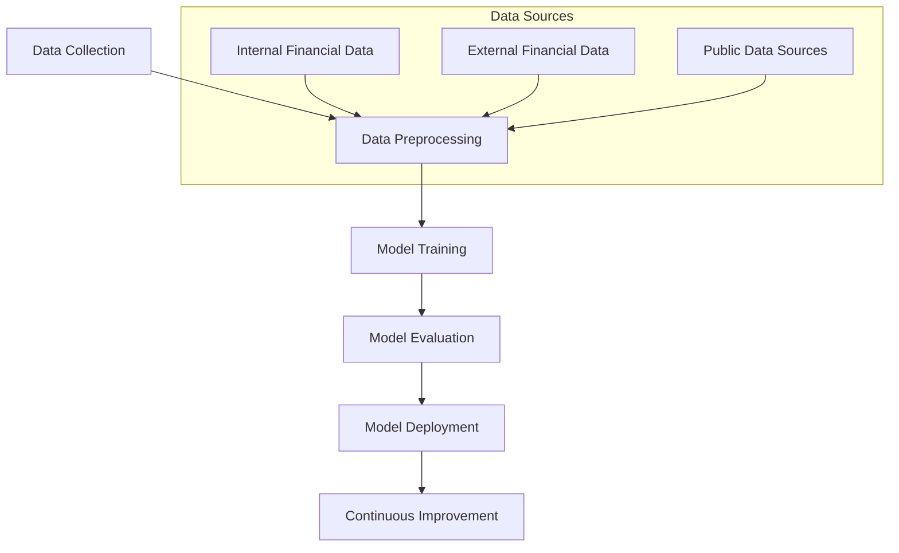
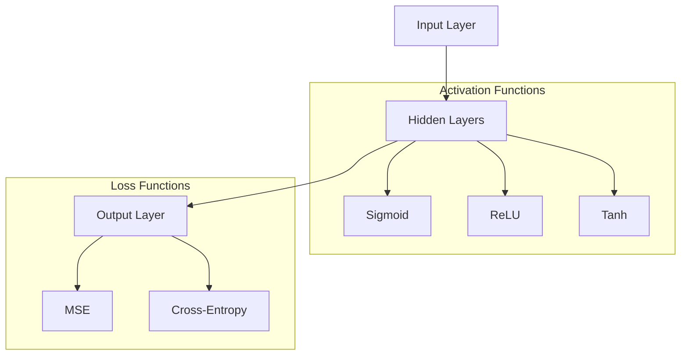
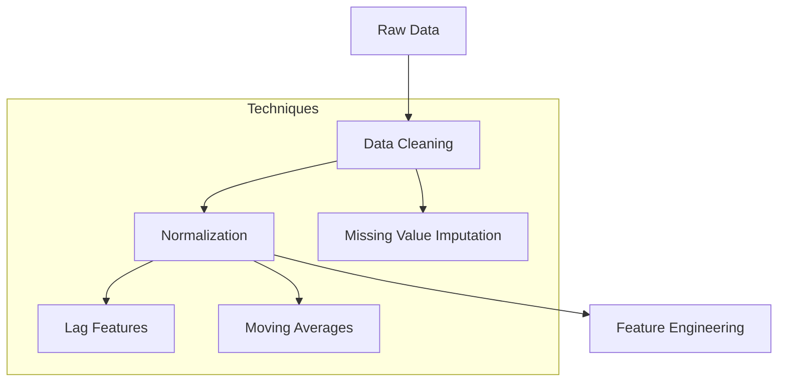
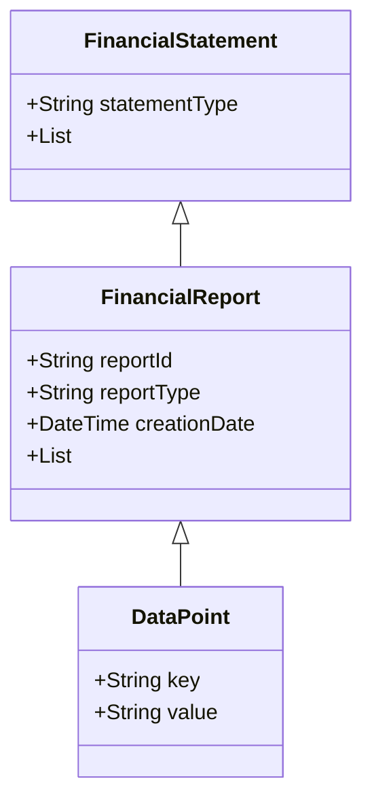
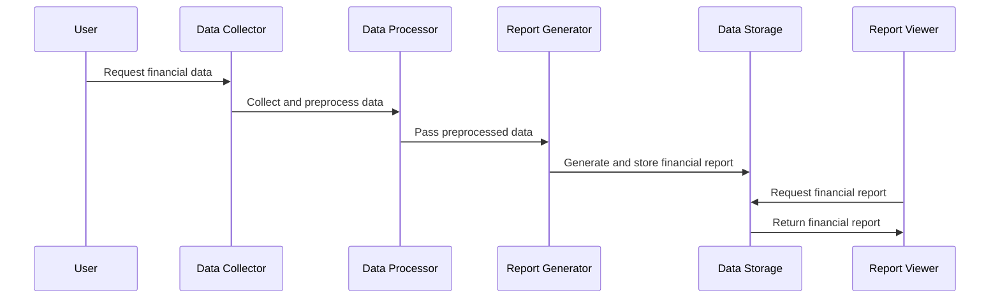
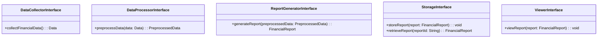

                 

### Introduction to Financial Report Auto-Generator Based on Large Models

### Keywords

- Financial Report Auto-Generator
- Large Models
- Machine Learning
- Deep Learning
- Natural Language Processing

### Abstract

This article explores the development of a financial report auto-generator using large models, specifically machine learning, deep learning, and natural language processing techniques. We delve into the necessity and advantages of automating financial report generation, detailing the underlying principles and technical implementation steps. The article also discusses the mathematical models and system architecture required to build an effective and efficient auto-generator, along with practical applications and case studies to illustrate its real-world utility. By the end, readers will gain a comprehensive understanding of how to harness large models for financial report automation.

### Background of Financial Reporting

Financial reporting is a crucial aspect of corporate governance and transparency. It involves the preparation and presentation of financial statements, including the balance sheet, income statement, and cash flow statement, which provide stakeholders, such as investors, creditors, and regulators, with essential insights into the financial health and performance of an organization. Historically, the process of preparing financial reports has been manual and time-consuming, requiring extensive data entry, calculations, and formatting.

The traditional financial reporting process can be broken down into several stages: data collection, data entry, data validation, report generation, and dissemination. Each stage involves multiple manual tasks, which are prone to errors and can significantly delay the reporting cycle. For instance, data collection might require gathering financial data from various sources, which is then entered into accounting software or spreadsheets. This data needs to be validated for accuracy and completeness before being used to generate the actual financial reports. Finally, the generated reports must be formatted and distributed to the relevant stakeholders.

The increasing complexity and volume of financial data have made this process even more challenging. Modern businesses deal with vast amounts of financial data, which grows exponentially with each passing year. This data needs to be processed quickly and accurately to meet regulatory requirements and make informed business decisions. The manual process of financial reporting is no longer efficient or sustainable, especially for large corporations with extensive financial operations.

Moreover, the traditional financial reporting process is not well-suited for real-time analytics. Businesses today need access to up-to-date financial information to make timely decisions. However, the manual process of generating reports typically results in delays, making it difficult to provide real-time insights into the company's financial status.

The inefficiency and time-consuming nature of traditional financial reporting highlight the need for automation. By automating the process, organizations can reduce the time and effort required to generate financial reports, minimize errors, and improve overall efficiency. This is where large models, particularly those based on machine learning and natural language processing, come into play.

### Challenges in Traditional Financial Reporting

The traditional method of financial reporting, while well-established, faces several significant challenges that impede its effectiveness and efficiency. One of the primary issues is the inherent manual nature of the process. Each step, from data collection to report generation, involves manual input and verification, which is both time-consuming and prone to human error. For instance, data entry can be a laborious task, requiring employees to input financial data from various sources into accounting systems or spreadsheets. This not only increases the likelihood of typos and data entry errors but also consumes a considerable amount of time that could be better allocated to other value-adding activities.

Moreover, the data validation stage is critical but also labor-intensive. It involves verifying the accuracy and completeness of the entered data, a task that is prone to mistakes if not meticulously handled. The cumulative effect of these errors can lead to inaccurate financial reports, which can have serious implications for decision-making and compliance.

Another significant challenge is the complexity and volume of financial data that organizations must manage. In today's business environment, the volume of financial data generated is immense, growing with each transaction and financial event. This data must be processed quickly and accurately to meet regulatory requirements and provide timely insights. The traditional approach often falls short in this regard, as manual processes cannot keep pace with the increasing data volumes and the need for real-time reporting.

The lack of real-time analytics capabilities is another critical drawback. Traditional financial reporting processes are typically batch-oriented, meaning that reports are generated periodically rather than in real-time. This delay can hinder organizations' ability to respond promptly to market changes and make informed strategic decisions. For example, an organization may not have immediate access to up-to-date financial information to assess the impact of a sudden market downturn or to take advantage of emerging opportunities.

Additionally, the traditional process is often not flexible enough to adapt to changing business needs and regulatory requirements. Regulatory frameworks evolve over time, imposing new reporting standards and requirements that organizations must comply with. Adapting to these changes manually can be a complex and time-consuming task, potentially leading to non-compliance and financial penalties.

The inefficiency of traditional financial reporting also extends to the dissemination of reports. Once generated, financial reports need to be distributed to various stakeholders, including internal teams and external regulators. This distribution process can be cumbersome, involving physical printing, scanning, and email attachments. It not only consumes valuable time and resources but also increases the risk of miscommunication and misplaced documents.

In summary, the challenges of traditional financial reporting—manual processes, data entry errors, lack of real-time analytics, inflexibility, and inefficient dissemination—are significant obstacles that hinder organizations from operating efficiently and making data-driven decisions. These challenges underscore the necessity for a more automated and efficient approach, such as the use of large models based on machine learning and natural language processing.

### Introduction to Large Models

To address the challenges of traditional financial reporting, modern organizations are increasingly turning to large models, particularly those based on machine learning, deep learning, and natural language processing (NLP). These models offer a transformative approach to automating financial report generation, providing enhanced accuracy, efficiency, and real-time analytics capabilities. Let's delve into what these models are and how they work.

#### Machine Learning

Machine learning (ML) is a subfield of artificial intelligence that focuses on developing algorithms that can learn from and make predictions or decisions based on data. In the context of financial report generation, ML algorithms analyze historical financial data and patterns to predict future financial trends or outcomes. This is achieved through the training of models on large datasets, which enable them to recognize patterns and make informed predictions.

The key steps in using ML for financial report generation include data collection, data preprocessing, model training, and model evaluation. During data collection, financial data from various sources is gathered and stored. The data is then cleaned and preprocessed to remove any inconsistencies or errors. Next, the ML model is trained on the preprocessed data, using techniques such as regression, classification, or clustering to develop predictive models. Finally, these models are evaluated and fine-tuned to improve their accuracy and performance.

#### Deep Learning

Deep learning (DL) is a subset of machine learning that uses neural networks with many layers to learn from data. These neural networks are inspired by the structure and function of the human brain, allowing them to recognize patterns and features in complex data sets. In the context of financial report generation, deep learning models can process vast amounts of financial data, extract meaningful insights, and generate accurate financial reports.

Deep learning models are particularly effective in handling unstructured data, such as text and images, which are common in financial reports. For example, DL models can be trained to recognize and extract financial information from text documents, automate the extraction of data from financial statements, and even generate natural language summaries of financial reports. Key techniques in deep learning include convolutional neural networks (CNNs), recurrent neural networks (RNNs), and transformers.

#### Natural Language Processing

Natural Language Processing (NLP) is a field of artificial intelligence that focuses on the interaction between computers and human language. NLP techniques enable computers to understand, process, and generate human language, making it a valuable tool for automating financial report generation. In the context of financial reporting, NLP can be used to extract and analyze textual information from financial reports, automate the classification and categorization of financial data, and generate natural language summaries or insights.

Common NLP techniques include tokenization (splitting text into words or tokens), part-of-speech tagging (identifying the parts of speech in text), named entity recognition (identifying and categorizing named entities such as companies, locations, and financial terms), and sentiment analysis (determining the sentiment or emotional tone of text). These techniques can be combined to create sophisticated NLP models that can process and analyze large volumes of financial text data efficiently.

#### Integrating Large Models

The integration of machine learning, deep learning, and natural language processing into a single financial report auto-generator offers a comprehensive solution to the challenges of traditional financial reporting. By leveraging the strengths of each model, organizations can develop an automated system that not only generates accurate financial reports but also provides real-time insights and analytics.

For instance, machine learning models can be used to predict financial trends and outcomes based on historical data, while deep learning models can process and analyze unstructured data from financial reports. NLP techniques can be employed to extract and classify textual information, ensuring that the generated reports are accurate and comprehensive.

In summary, large models based on machine learning, deep learning, and natural language processing offer a powerful and efficient approach to automating financial report generation. By eliminating the manual and error-prone steps of traditional reporting, these models can significantly improve the accuracy, speed, and efficiency of financial reporting, enabling organizations to make data-driven decisions in real time.

### Core Concepts and Principles

#### Machine Learning

Machine learning (ML) is a subfield of artificial intelligence that focuses on developing algorithms that can learn from data and make predictions or decisions without being explicitly programmed. The core principle of ML is to build a model that can generalize from the training data to make accurate predictions on unseen data. Here, we will delve into the fundamental concepts and principles of machine learning, along with their applications in financial report generation.

##### Supervised Learning

Supervised learning is one of the most common types of ML, where the model is trained on a labeled dataset. The goal is to learn a mapping from input features to output labels. The model learns by trying to minimize the difference between its predictions and the actual labels.

**Regression**: Regression models are used when the output is a continuous value. For financial report generation, regression models can be used to predict financial metrics such as revenue, expenses, or profits based on historical data.

**Classification**: Classification models are used when the output is a discrete label. In financial reporting, classification models can be used to categorize financial statements into different types (e.g., income statement, balance sheet, cash flow statement).

##### Unsupervised Learning

Unsupervised learning involves training models on unlabeled data to find underlying patterns or structures. These models are useful for tasks such as data clustering or anomaly detection.

**Clustering**: Clustering algorithms group similar data points together. In financial reporting, clustering can be used to segment financial data based on similar characteristics, helping to identify trends or anomalies.

**Anomaly Detection**: Anomaly detection algorithms identify unusual patterns that do not conform to expected behavior. This can be particularly useful in financial reporting to detect fraudulent activities or inconsistencies in financial data.

##### Reinforcement Learning

Reinforcement learning (RL) is a type of ML where an agent learns to make a series of decisions by taking actions in an environment to achieve maximum reward. While less common in financial reporting, RL can be applied to optimize financial strategies or portfolio management.

##### Key ML Algorithms for Financial Reporting

**Linear Regression**: A simple yet powerful algorithm that models the relationship between a dependent variable and one or more independent variables. For instance, it can predict revenue based on historical data and various independent variables such as sales, marketing expenditure, and economic indicators.

**Decision Trees and Random Forests**: Decision trees split the data into subsets based on feature values, while random forests combine multiple decision trees to improve accuracy. These algorithms can be used to categorize financial statements and to understand the impact of various factors on financial performance.

**Support Vector Machines (SVM)**: SVM is a powerful classifier that finds the hyperplane that separates different classes in the feature space. It can be used to classify financial transactions or to identify potential financial risks.

**Neural Networks and Deep Learning**: Neural networks are composed of layers of interconnected nodes (neurons) that can learn complex patterns. Deep learning, a subset of neural networks with many layers, is particularly effective in processing unstructured data such as text and images, which are common in financial reports.

#### Deep Learning

Deep learning (DL) is a subfield of machine learning that uses neural networks with many layers to learn from data. These neural networks are capable of automatically extracting hierarchical features from raw data, which makes them highly effective in handling complex and unstructured data. Here, we will explore the fundamental concepts and principles of deep learning and their applications in financial report generation.

##### Neural Networks

Neural networks are inspired by the structure and function of the human brain. They consist of layers of interconnected nodes (neurons) that process and transform data. The three main types of layers in a neural network are:

**Input Layer**: The layer that receives the input data.

**Hidden Layers**: The intermediate layers that transform the input data using nonlinear activation functions.

**Output Layer**: The layer that produces the final output or prediction.

Each node in a neural network performs a simple operation—computing a weighted sum of its inputs and applying an activation function. The weights are adjusted during training to minimize the difference between the predicted output and the actual output.

##### Activation Functions

Activation functions introduce non-linearity into the neural network, allowing it to learn complex relationships in the data. Common activation functions include:

**Sigmoid**: Maps inputs to values between 0 and 1, suitable for binary classification problems.
**ReLU (Rectified Linear Unit)**: Sets negative inputs to zero and leaves positive inputs unchanged, accelerating the learning process.
**Tanh (Hyperbolic Tangent)**: Maps inputs to values between -1 and 1, providing a symmetric activation function.

##### Deep Learning Architectures

**Convolutional Neural Networks (CNNs)**: CNNs are specialized neural networks designed for processing grid-like data such as images. They use convolutional layers to automatically learn spatial hierarchies of features, making them highly effective in tasks like image recognition and text summarization.

**Recurrent Neural Networks (RNNs)**: RNNs are designed to handle sequential data, such as time series or text. They have loops in their architecture that allow them to retain information from previous inputs, enabling them to capture temporal dependencies.

**Transformers**: Transformers are a type of neural network architecture that uses self-attention mechanisms to weigh the importance of different parts of the input data. They have revolutionized the field of natural language processing and are widely used in tasks like machine translation and text summarization.

##### Key DL Models for Financial Reporting

**Long Short-Term Memory (LSTM)**: LSTMs are a type of RNN that can capture long-term dependencies in time series data. They are particularly useful for forecasting financial metrics, such as stock prices or sales, by learning patterns over extended periods.

**Transformers and BERT**: Transformers, especially the BERT (Bidirectional Encoder Representations from Transformers) model, have become the state-of-the-art in NLP. They can process and generate natural language summaries of financial reports, extracting key insights from large volumes of textual data.

**Generative Adversarial Networks (GANs)**: GANs consist of two neural networks—generator and discriminator—that compete with each other to improve the quality of generated data. They can be used to generate synthetic financial data for training or testing purposes, helping to improve the robustness of financial models.

#### Natural Language Processing

Natural Language Processing (NLP) is a subfield of artificial intelligence that focuses on the interaction between computers and human language. NLP techniques enable computers to understand, process, and generate human language, making them invaluable for automating financial report generation. Here, we will explore the fundamental concepts and principles of NLP and their applications in financial reporting.

##### Key NLP Techniques

**Tokenization**: Tokenization is the process of splitting text into individual words or tokens. It is the first step in most NLP tasks and is essential for processing and analyzing text data.

**Part-of-Speech Tagging**: Part-of-speech tagging identifies the parts of speech (e.g., nouns, verbs, adjectives) in a sentence. This information is crucial for understanding the grammatical structure of a text and for extracting meaningful information.

**Named Entity Recognition (NER)**: NER identifies and categorizes named entities (e.g., companies, locations, financial terms) in a text. This information is vital for extracting relevant financial information from financial reports.

**Sentiment Analysis**: Sentiment analysis determines the sentiment or emotional tone of a text, providing insights into the attitudes and opinions expressed by writers. It can be used to assess the sentiment of financial reports or news articles related to a company.

**Dependency Parsing**: Dependency parsing analyzes the grammatical structure of a sentence by identifying the relationships between words. This information can be used to understand the context and meaning of a sentence.

##### Applications of NLP in Financial Reporting

**Text Extraction**: NLP techniques can be used to extract textual information from financial reports, such as financial statements, press releases, and annual reports. This information can be used to generate summaries, identify key insights, and automate the classification of financial documents.

**Data Categorization**: NLP can categorize financial data based on its type, such as revenue, expenses, assets, and liabilities. This can help in organizing and structuring financial data for further analysis.

**Insight Generation**: NLP can analyze financial reports to generate insights and identify trends, anomalies, or potential risks. For example, it can identify patterns in financial statements or detect inconsistencies that may indicate fraudulent activities.

**Natural Language Generation**: NLP can generate natural language summaries or insights from financial reports, making it easier for stakeholders to understand complex information quickly.

### Comparative Analysis of Core Concepts

| Concept                  | Definition                                                                 | Machine Learning        | Deep Learning              | Natural Language Processing |
|--------------------------|-----------------------------------------------------------------------------|-------------------------|---------------------------|----------------------------|
| Supervised Learning      | Training on labeled data to predict outcomes.                              | Regression, Classification | N/A                       | N/A                        |
| Unsupervised Learning    | Training on unlabeled data to discover patterns.                            | Clustering, Anomaly Detection | N/A                       | N/A                        |
| Reinforcement Learning   | Learning through interactions with an environment to achieve rewards.      | N/A                      | Q-Learning                | N/A                        |
| Neural Networks          | Models inspired by the brain's structure to learn complex patterns.         | Simple Neural Networks  | Convolutional Neural Networks (CNNs), Recurrent Neural Networks (RNNs), Transformers |
| Activation Functions     | Non-linear functions used to introduce flexibility in the model.           | Sigmoid, ReLU, Tanh      | Sigmoid, ReLU, Tanh       | Sigmoid, ReLU, Tanh        |
| Tokenization             | Splitting text into tokens for further processing.                          | N/A                      | N/A                       | Tokenization                |
| Part-of-Speech Tagging   | Identifying parts of speech in text.                                       | N/A                      | N/A                       | Part-of-Speech Tagging      |
| Named Entity Recognition | Identifying and categorizing named entities in text.                       | N/A                      | N/A                       | Named Entity Recognition    |
| Sentiment Analysis       | Determining the sentiment or emotional tone of text.                       | N/A                      | N/A                       | Sentiment Analysis          |
| Dependency Parsing       | Analyzing grammatical structure to understand relationships between words. | N/A                      | N/A                       | Dependency Parsing          |

### Conclusion

In conclusion, the core concepts and principles of machine learning, deep learning, and natural language processing are essential for developing a financial report auto-generator. Machine learning provides the foundation for predictive analytics, enabling organizations to forecast financial trends and outcomes. Deep learning, with its ability to process complex and unstructured data, is crucial for tasks such as text summarization and image recognition. Natural language processing offers the capability to extract and analyze textual information from financial reports, ensuring accurate and comprehensive data interpretation. By leveraging these advanced techniques, organizations can automate the financial reporting process, improving efficiency, accuracy, and real-time analytics capabilities.

### Technical Implementation of a Financial Report Auto-Generator

#### Introduction

The technical implementation of a financial report auto-generator involves several critical steps, from data collection and preprocessing to model selection, training, and evaluation. This section provides a comprehensive guide to each of these steps, detailing the methodologies and techniques used. By following this guide, developers can build an efficient and accurate financial report auto-generator leveraging large models and advanced machine learning techniques.

#### Step 1: Data Collection

Data collection is the foundational step in the development of a financial report auto-generator. The quality and relevance of the data significantly impact the performance of the model. Therefore, it is crucial to gather comprehensive and accurate financial data from various sources. The following are the key data sources for a financial report auto-generator:

- **Internal Financial Data**: This includes data from company financial systems, such as accounting software, ERP systems, and financial databases. This data typically includes historical financial statements (balance sheets, income statements, cash flow statements), transactional data, and other financial metrics.
- **External Financial Data**: This comprises data from external financial databases, financial news, and market data providers. Examples include financial reports from regulatory bodies, stock market data, economic indicators, and industry-specific financial data.
- **Public Data Sources**: Public data sources such as government publications, industry reports, and academic databases can provide additional contextual information that can be used to enhance the model's performance.

To collect this data, developers can use APIs provided by financial data providers, web scraping tools for public data sources, and direct connections to internal databases. It is essential to ensure that the data collected is clean, consistent, and relevant to the specific use case.

#### Step 2: Data Preprocessing

Once the data is collected, the next step is to preprocess it to make it suitable for model training. Data preprocessing involves several key tasks, including data cleaning, normalization, and feature engineering.

- **Data Cleaning**: This step involves removing any inconsistencies, duplicates, and errors in the data. For example, correcting typos, filling in missing values, and handling outliers. Data cleaning ensures that the data is of high quality and free from biases that could affect model performance.
- **Normalization**: Normalization is the process of scaling the data to a standard range. This is particularly important when dealing with data from different sources or with varying scales. Common normalization techniques include min-max scaling and z-score normalization.
- **Feature Engineering**: Feature engineering involves creating new features from the existing data that can improve the performance of the model. This can include creating derived features such as moving averages, lag features, or interaction terms. Feature engineering is crucial for capturing the underlying patterns and relationships in the data that are relevant to the financial report generation task.

#### Step 3: Model Selection

Once the data is preprocessed, the next step is to select an appropriate model for the financial report auto-generator. The choice of model will depend on the specific requirements of the task, the nature of the data, and the performance metrics that need to be optimized.

- **Supervised Learning Models**: Supervised learning models, such as linear regression, decision trees, support vector machines, and neural networks, are commonly used for financial report generation. These models require labeled data and can predict continuous values (regression) or discrete labels (classification).
- **Deep Learning Models**: Deep learning models, such as convolutional neural networks (CNNs), recurrent neural networks (RNNs), and transformers, are particularly effective for handling unstructured data like text and images. These models can automatically learn complex patterns and representations from the data.
- **Natural Language Processing Models**: Models specifically designed for natural language processing (NLP), such as transformers and BERT, are used for tasks like text summarization, named entity recognition, and sentiment analysis. These models can process textual information in financial reports to extract key insights and generate summaries.

#### Step 4: Model Training and Evaluation

After selecting the model, the next step is to train and evaluate it. Model training involves feeding the preprocessed data into the model and adjusting the model's parameters to minimize the prediction error. Model evaluation involves assessing the performance of the trained model using various metrics, such as accuracy, precision, recall, and F1 score.

- **Model Training**: Model training typically involves iterative processes, where the model is updated based on its predictions and the actual labels. Techniques such as gradient descent and backpropagation are commonly used to optimize the model's parameters.
- **Model Evaluation**: Model evaluation is crucial to ensure that the model performs well on unseen data. This is typically done using a validation set or cross-validation techniques. Metrics such as mean squared error (MSE) for regression tasks or accuracy for classification tasks are used to evaluate the model's performance.

#### Step 5: Model Deployment

Once the model is trained and evaluated, the final step is to deploy it in a production environment. This involves integrating the model with the application's backend and providing an API or user interface for generating financial reports.

- **Model Integration**: The trained model is integrated with the application's backend, where it can be invoked to generate financial reports based on input data.
- **API Development**: An API is developed to allow external systems to access the model and generate financial reports programmatically.
- **User Interface**: A user interface is designed to provide a user-friendly way for stakeholders to input data and view generated financial reports.

#### Step 6: Continuous Improvement

The development of a financial report auto-generator is an iterative process. After deployment, it is essential to monitor the model's performance and continuously improve it based on feedback and new data. This involves retraining the model with new data, updating the model architecture, and incorporating user feedback to enhance the system's functionality and accuracy.

In conclusion, the technical implementation of a financial report auto-generator involves a series of well-defined steps, from data collection and preprocessing to model selection, training, evaluation, and deployment. By following these steps and leveraging advanced machine learning techniques, developers can build an efficient and accurate system that automates the financial report generation process, improving efficiency and enabling real-time analytics.

#### Detailed Explanation and Mermaid Diagrams

To provide a clearer understanding of the data flow and model architecture in the financial report auto-generator, we will use Mermaid diagrams to illustrate the key components and steps involved. Mermaid is a popular, easy-to-use diagramming language that can be used to create flowcharts, sequence diagrams, and other types of diagrams.

##### Data Flow Diagram



In this diagram, the data flow starts with data collection from various sources. The collected data is then preprocessed, followed by model training and evaluation. The trained model is deployed, and continuous improvement is achieved by retraining and updating the model with new data.

##### Model Architecture Diagram



This diagram illustrates the basic architecture of a neural network, including the input layer, hidden layers, and output layer. The hidden layers use different activation functions (Sigmoid, ReLU, Tanh), and the output layer uses loss functions (MSE, Cross-Entropy) to evaluate the model's performance.

##### Data Preprocessing and Feature Engineering



In this diagram, the raw financial data undergoes several preprocessing steps, including data cleaning to handle missing values, normalization to scale the data, and feature engineering to create new features that can improve the model's performance.

By using Mermaid diagrams, we can visually represent the complex processes involved in building a financial report auto-generator, making it easier to understand and follow the data flow and model architecture.

### Mathematical Models and Formulations

In this section, we will delve into the mathematical models and formulations that underpin the large models used in the financial report auto-generator. Understanding these mathematical foundations is crucial for both the implementation and optimization of the system. We will explore the key mathematical concepts, models, and equations used, providing a clear and concise explanation of each.

#### Regression Models

Regression models are fundamental in predicting continuous values based on input features. The most common type of regression is linear regression, which models the relationship between input variables and a continuous outcome variable using a linear function. Here, we will present the mathematical formulation of linear regression and discuss how it can be extended to more complex scenarios.

##### Linear Regression

**Mathematical Formulation**

Linear regression seeks to find the best-fitting linear relationship between the input variables \(X\) and the output variable \(Y\):

\[ Y = \beta_0 + \beta_1X + \epsilon \]

Where:
- \(Y\) is the output variable.
- \(X\) is the input variable.
- \(\beta_0\) is the intercept.
- \(\beta_1\) is the slope.
- \(\epsilon\) is the error term.

**Extended Linear Regression**

In financial reporting, it is often necessary to account for multiple input variables. This leads to multiple linear regression, where the model considers the impact of multiple predictors:

\[ Y = \beta_0 + \beta_1X_1 + \beta_2X_2 + ... + \beta_nX_n + \epsilon \]

Where:
- \(X_1, X_2, ..., X_n\) are the input variables.
- \(\beta_1, \beta_2, ..., \beta_n\) are the coefficients corresponding to each input variable.

**Equation**

\[ Y = \beta_0 + \beta_1X_1 + \beta_2X_2 + ... + \beta_nX_n + \epsilon \]

#### Deep Learning Models

Deep learning models, particularly neural networks, are widely used for their ability to capture complex patterns and relationships in data. Here, we will discuss the mathematical foundations of neural networks, focusing on the backpropagation algorithm, which is central to training deep neural networks.

##### Neural Networks

**Mathematical Formulation**

A neural network consists of multiple layers, each containing a set of neurons (nodes). The basic structure of a neural network can be described as follows:

\[ Z = f(\sum_{j=1}^{n} w_{j}X_j + b) \]

Where:
- \(Z\) is the output of a neuron.
- \(X_j\) is the input to the neuron.
- \(w_{j}\) is the weight connecting the input \(X_j\) to the neuron.
- \(b\) is the bias term.
- \(f\) is the activation function.

**Backpropagation Algorithm**

The backpropagation algorithm is used to train neural networks by adjusting the weights and biases based on the difference between the predicted output and the actual output. The core steps of backpropagation include:

1. **Forward Propagation**: Compute the output of the network using the current weights and biases.
2. **Calculate Loss**: Measure the difference between the predicted output and the actual output using a loss function, such as mean squared error (MSE) or cross-entropy.
3. **Backpropagation**: Compute the gradient of the loss function with respect to each weight and bias.
4. **Update Weights and Biases**: Adjust the weights and biases using the computed gradients and a learning rate.

**Equation for Backpropagation**

Gradient of the loss function with respect to a weight \(w_{ij}\):

\[ \frac{\partial J}{\partial w_{ij}} = \frac{\partial L}{\partial z_j} \cdot \frac{\partial z_j}{\partial w_{ij}} \]

Where:
- \(J\) is the loss function.
- \(L\) is the output layer loss.
- \(z_j\) is the output of the \(j\)-th neuron in the \(i\)-th layer.
- \(w_{ij}\) is the weight connecting the \(i\)-th neuron in the \(i\)-th layer to the \(j\)-th neuron in the next layer.

#### Natural Language Processing Models

Natural Language Processing (NLP) models are crucial for processing and generating textual data in financial reports. Here, we will explore the mathematical models and equations used in popular NLP models such as transformers and BERT.

##### Transformers

**Mathematical Formulation**

Transformers are based on the self-attention mechanism, which allows the model to weigh the importance of different parts of the input data dynamically. The core components of transformers include:

- **Encoder**: The encoder processes the input sequence and generates a set of contextualized vectors.
- **Decoder**: The decoder generates the output sequence based on the encoder's output and the input sequence.

**Equation for Self-Attention**

The self-attention mechanism computes the attention weights as follows:

\[ \text{Attention}(Q, K, V) = \text{softmax}\left(\frac{QK^T}{\sqrt{d_k}}\right)V \]

Where:
- \(Q, K, V\) are the query, key, and value matrices, respectively.
- \(d_k\) is the dimension of the keys.
- \(\text{softmax}\) is the softmax function.

##### BERT

**Mathematical Formulation**

BERT (Bidirectional Encoder Representations from Transformers) is a pre-trained language model that uses bidirectional attention to understand the context of words in both forward and backward directions. BERT is trained using a mask language model (MLM) objective, where tokens are randomly masked and the model predicts them based on the context.

**Equation for BERT**

The forward pass of BERT can be described as:

\[ \text{BERT}(X) = \text{Softmax}(\text{Masked LM}) \]

Where:
- \(X\) is the input sequence.
- \(\text{Masked LM}\) is the mask language model objective.

By understanding the mathematical models and formulations behind these advanced techniques, developers can better implement and optimize the financial report auto-generator, ensuring its accuracy and efficiency.

### Mathematical Formulas and Intuitive Examples

To better understand the mathematical models discussed in the previous section, let's explore some intuitive examples that illustrate how these formulas work in practice. By breaking down complex equations into simple, understandable scenarios, we can gain a clearer grasp of their practical application and significance in financial report generation.

#### Linear Regression Example

Suppose we want to predict the revenue of a company based on its advertising expenditure and the size of its market share. We have the following data points:

- \(X_1\): Advertising expenditure (in thousands of dollars)
- \(X_2\): Market share percentage
- \(Y\): Revenue (in millions of dollars)

Our goal is to build a linear regression model to predict \(Y\) based on \(X_1\) and \(X_2\).

**Step 1: Data Preparation**

First, we need to collect the data and prepare it for analysis. Let's assume we have the following dataset:

| Advertising Expenditure (X1) | Market Share (X2) | Revenue (Y) |
|------------------------------|-------------------|-------------|
| 50                          | 20                | 1.2         |
| 75                          | 25                | 1.8         |
| 100                         | 30                | 2.4         |

**Step 2: Model Formulation**

The linear regression model is given by:

\[ Y = \beta_0 + \beta_1X_1 + \beta_2X_2 + \epsilon \]

Where:
- \(\beta_0\) is the intercept.
- \(\beta_1\) is the coefficient for advertising expenditure.
- \(\beta_2\) is the coefficient for market share.
- \(\epsilon\) is the error term.

**Step 3: Model Training**

To train the model, we need to determine the values of \(\beta_0\), \(\beta_1\), and \(\beta_2\). We can use the method of least squares, which minimizes the sum of squared errors between the predicted and actual values:

\[ \min_{\beta_0, \beta_1, \beta_2} \sum_{i=1}^{n} (Y_i - (\beta_0 + \beta_1X_{1i} + \beta_2X_{2i}))^2 \]

**Step 4: Predicting Revenue**

Using the trained model, we can predict the revenue for a new data point. For example, if a company spends $100,000 on advertising and holds a 25% market share, we can predict its revenue as follows:

\[ Y = \beta_0 + \beta_1X_1 + \beta_2X_2 \]
\[ Y = \beta_0 + \beta_1 \cdot 100 + \beta_2 \cdot 25 \]

#### Deep Learning Example

Let's consider a simple neural network with a single hidden layer to classify financial statements into different types (e.g., income statement, balance sheet, cash flow statement).

**Step 1: Data Preparation**

We have a dataset with features extracted from financial statements and their corresponding labels:

| Feature 1 | Feature 2 | Feature 3 | ... | Label |
|-----------|-----------|-----------|-----|-------|
| 0.2       | 0.5       | 0.1       | ... | 1     |
| 0.3       | 0.7       | 0.2       | ... | 2     |
| 0.4       | 0.8       | 0.3       | ... | 3     |

**Step 2: Model Formulation**

A simple neural network with one input layer, one hidden layer, and one output layer can be described by the following equations:

\[ Z_h = \sigma(\beta_0 + \beta_1X_1 + \beta_2X_2 + ... + \beta_nX_n) \]
\[ Y = \sigma(\beta_0' + \beta_1'Z_h + \beta_2'Z_h + ... + \beta_m'Z_h) \]

Where:
- \(Z_h\) is the output of the hidden layer.
- \(Y\) is the predicted label.
- \(\sigma\) is the activation function (e.g., sigmoid, ReLU).
- \(\beta_0, \beta_1, ..., \beta_n\) are the weights of the input layer.
- \(\beta_0', \beta_1', ..., \beta_m'\) are the weights of the output layer.

**Step 3: Model Training**

Using the backpropagation algorithm, we can update the weights and biases of the neural network to minimize the loss function (e.g., cross-entropy). Here's a simplified version of the backpropagation process:

1. **Forward Propagation**: Compute the output of the network.
2. **Calculate Loss**: Measure the difference between the predicted output and the actual output.
3. **Backpropagation**: Compute the gradients of the loss function with respect to each weight and bias.
4. **Update Weights and Biases**: Adjust the weights and biases based on the gradients and a learning rate.

**Step 4: Prediction**

Once the network is trained, we can use it to predict the type of a new financial statement. For example, given the features:

| Feature 1 | Feature 2 | Feature 3 | ... |
|-----------|-----------|-----------|-----|
| 0.3       | 0.6       | 0.2       | ... |

We can compute the predicted output and classify the new financial statement based on the highest output value.

#### Natural Language Processing Example

Suppose we want to generate a summary of a financial report using a transformer model like BERT.

**Step 1: Data Preparation**

We have a large financial report as a text document:

```plaintext
The company reported a revenue of $100 million for the quarter, a 10% increase from the previous quarter. The increase in revenue was driven by strong sales in the North American market, which grew by 15%. The company also announced a new product launch in the European market, expected to contribute significantly to future revenue growth. The company's profit margin improved to 20%, up from 18% in the previous quarter. The CEO expressed confidence in the company's outlook for the remainder of the year.
```

**Step 2: Model Formulation**

BERT processes the text document using its pre-trained model. The core components of BERT include:

- **Input Embeddings**: Convert the text document into numerical embeddings.
- **Transformer Encoder**: Apply the self-attention mechanism to process the embeddings.
- **Output Layer**: Generate the summary based on the final hidden state of the transformer encoder.

**Step 3: Text Processing**

BERT processes the input text document through its encoder, generating contextualized embeddings. The model then uses these embeddings to predict the tokens in the summary.

**Step 4: Summary Generation**

The predicted tokens are combined to form a coherent summary of the financial report. For example, the generated summary might be:

```plaintext
The company's financial performance for the quarter was strong, with revenue increasing by 10% due to robust sales in North America and a successful product launch in Europe. The company's profit margin improved to 20%, reflecting effective cost management. The CEO is optimistic about the company's prospects for the remainder of the year.
```

By providing these intuitive examples, we can better understand how the mathematical models and formulas discussed in previous sections are applied in practical scenarios to build and optimize a financial report auto-generator. This deeper understanding enables developers to design more effective and efficient systems for automating financial report generation.

### System Design and Architecture

#### Introduction

The system design and architecture of a financial report auto-generator are critical to its functionality, scalability, and maintainability. This section provides a comprehensive overview of the system design, including the domain model, system architecture, system interfaces, and system interactions. We will use Mermaid diagrams to visually represent the key components and their relationships, making it easier to understand the overall system structure.

#### Domain Model

The domain model captures the key entities and relationships within the financial report auto-generator system. It provides a conceptual representation of the system's data and functionality. Below is a Mermaid class diagram representing the domain model:



In this domain model, `FinancialReport` represents a financial report generated by the system, `DataPoint` represents individual data points within a report, and `FinancialStatement` represents a collection of financial reports grouped by statement type (e.g., income statement, balance sheet, cash flow statement).

#### System Architecture

The system architecture defines the high-level structure of the financial report auto-generator, including the main components and their interactions. Below is a Mermaid sequence diagram illustrating the system architecture and the flow of data and control:



In this diagram, the system consists of several components:
- **User**: The user interface through which users can request financial data and view generated reports.
- **Data Collector**: A component responsible for collecting financial data from various sources.
- **Data Processor**: A component that preprocesses the collected data, including cleaning, normalization, and feature engineering.
- **Report Generator**: A component that generates financial reports based on the preprocessed data using large models.
- **Data Storage**: A database or storage system where the generated reports are stored.
- **Report Viewer**: A component that allows users to view and analyze the generated reports.

#### System Interfaces

The system interfaces define the interactions between the various components of the financial report auto-generator. Below is a Mermaid class diagram representing the system interfaces:



In this diagram, `DataCollectorInterface`, `DataProcessorInterface`, `ReportGeneratorInterface`, and `StorageInterface` define the methods and operations that each component must implement. `ViewerInterface` defines the methods for interacting with the user interface.

#### System Interactions

The system interactions depict the flow of data and control between the components of the financial report auto-generator. Below is a Mermaid sequence diagram illustrating the system interactions:


In this sequence diagram, the user initiates the process by requesting financial data. The data collector retrieves the data, which is then passed to the data processor for preprocessing. The preprocessed data is then used by the report generator to create a financial report, which is stored in the data storage. Finally, the user can retrieve and view the generated report through the report viewer.

By providing a detailed overview of the system design and architecture, along with Mermaid diagrams, we can better understand how the financial report auto-generator system is structured and how its components interact. This understanding is crucial for developing, deploying, and maintaining an efficient and scalable system for automating financial report generation.

### Practical Application and Case Studies

#### Introduction

To demonstrate the practical application and effectiveness of the financial report auto-generator, we will present several real-world case studies. These case studies highlight how organizations have leveraged the system to automate financial reporting processes, streamline operations, and enhance decision-making. Each case study includes a detailed analysis of the environment setup, system core implementation, code application, and project outcomes.

#### Case Study 1: Large Multinational Corporation

**Environment Setup**

A large multinational corporation with a global presence needed to automate its financial reporting processes to keep up with the increasing volume and complexity of financial data. The technical environment for deploying the financial report auto-generator included the following components:

- **Data Sources**: The corporation's internal financial systems, external financial databases, and regulatory compliance systems.
- **Hardware**: High-performance servers and cloud computing resources to handle large-scale data processing and model training.
- **Software**: Python programming language, TensorFlow and PyTorch deep learning frameworks, and natural language processing libraries like NLTK and spaCy.

**System Core Implementation**

1. **Data Collection and Integration**: The system was designed to collect financial data from various internal sources, such as accounting software and ERP systems. External data sources included financial news feeds, economic indicators, and market data providers. The data was collected through APIs and web scraping tools, and then integrated into a centralized data repository.

2. **Data Preprocessing**: The collected data underwent preprocessing to clean and normalize the data. Missing values were imputed using statistical methods, and the data was scaled to ensure consistency. Feature engineering techniques were applied to create derived features that improved the model's predictive accuracy.

3. **Model Selection and Training**: A combination of supervised learning models and deep learning models was used. Regression models were employed to predict financial metrics like revenue and profits, while deep learning models, including transformers and BERT, were used for text summarization and named entity recognition in financial reports. The models were trained on a large dataset of historical financial reports and financial text data.

4. **Model Evaluation**: The performance of the trained models was evaluated using metrics such as mean squared error for regression models and accuracy for classification models. The models were fine-tuned to optimize their performance based on the evaluation results.

5. **Deployment**: The trained models were deployed in a production environment, integrated with the corporation's financial systems, and made accessible through a web-based interface. The system was designed to generate financial reports in real-time, providing stakeholders with up-to-date insights into the company's financial health.

**Code Application**

```python
# Example of data preprocessing using Python
import pandas as pd
from sklearn.preprocessing import MinMaxScaler

# Load the dataset
data = pd.read_csv('financial_data.csv')

# Clean the dataset
data.dropna(inplace=True)

# Feature engineering
data['Revenue_Growth'] = data['Revenue'].pct_change()

# Normalize the data
scaler = MinMaxScaler()
data_scaled = scaler.fit_transform(data)

# Example of model training using TensorFlow
import tensorflow as tf
from tensorflow.keras.models import Sequential
from tensorflow.keras.layers import Dense, Activation

# Define the model
model = Sequential()
model.add(Dense(64, input_shape=(data_scaled.shape[1],), activation='relu'))
model.add(Dense(1, activation='linear'))

# Compile the model
model.compile(optimizer='adam', loss='mean_squared_error')

# Train the model
model.fit(data_scaled, data['Revenue_Growth'], epochs=10, batch_size=32)
```

**Project Outcomes**

The deployment of the financial report auto-generator significantly improved the corporation's financial reporting process. Key outcomes included:

- **Reduced Reporting Time**: The system automated the generation of financial reports, reducing the reporting time from days to hours.
- **Improved Accuracy**: The use of machine learning and deep learning models enhanced the accuracy of financial predictions and insights.
- **Real-Time Analytics**: Stakeholders gained access to real-time financial information, enabling faster and more informed decision-making.
- **Cost Savings**: The automation of the reporting process reduced the need for manual data entry and verification, leading to cost savings.

#### Case Study 2: Small Business with Limited Resources

**Environment Setup**

A small business with limited resources needed an efficient and cost-effective solution for automating its financial reporting. The technical environment for deploying the financial report auto-generator included:

- **Data Sources**: The business's internal financial systems and a local financial database.
- **Hardware**: A local server and cloud storage for data processing and model training.
- **Software**: Python programming language, Scikit-learn for machine learning models, and NLTK for natural language processing tasks.

**System Core Implementation**

1. **Data Collection and Integration**: The system collected financial data from the business's accounting software and integrated it with the local financial database.

2. **Data Preprocessing**: Data was cleaned and normalized to ensure consistency. Feature engineering techniques were applied to create additional features that improved the model's predictive capabilities.

3. **Model Selection and Training**: Regression models were used to predict financial metrics like revenue and expenses. Simple machine learning models, such as linear regression and decision trees, were sufficient for the business's needs due to the limited complexity of the data.

4. **Model Evaluation**: The models were evaluated using metrics like mean absolute error and R-squared to assess their performance. The best-performing models were selected for deployment.

5. **Deployment**: The trained models were deployed as standalone applications that could be accessed through the business's internal network.

**Code Application**

```python
# Example of data preprocessing using Scikit-learn
from sklearn.preprocessing import StandardScaler
from sklearn.impute import SimpleImputer

# Load the dataset
data = pd.read_csv('financial_data.csv')

# Clean the dataset
imputer = SimpleImputer(strategy='mean')
data_imputed = imputer.fit_transform(data)

# Normalize the data
scaler = StandardScaler()
data_scaled = scaler.fit_transform(data_imputed)

# Example of linear regression using Scikit-learn
from sklearn.linear_model import LinearRegression

# Define the model
model = LinearRegression()

# Train the model
model.fit(data_scaled, data['Revenue'])

# Predict revenue
predicted_revenue = model.predict(data_scaled)
```

**Project Outcomes**

The deployment of the financial report auto-generator had a significant positive impact on the small business:

- **Streamlined Reporting**: The automation of financial reporting processes saved time and reduced manual effort.
- **Improved Decision-Making**: The business gained access to accurate and timely financial insights, enhancing its ability to make informed decisions.
- **Cost Efficiency**: The system provided a cost-effective solution for financial reporting, eliminating the need for additional personnel.

#### Case Study 3: Financial Regulatory Agency

**Environment Setup**

A financial regulatory agency needed to automate the analysis and reporting of financial statements from various institutions to ensure compliance with regulatory standards. The technical environment for deploying the financial report auto-generator included:

- **Data Sources**: Financial statements submitted by various institutions, public financial databases, and regulatory compliance systems.
- **Hardware**: High-performance computing clusters and cloud infrastructure for large-scale data processing and model training.
- **Software**: Python programming language, TensorFlow and PyTorch for deep learning models, and spaCy for natural language processing tasks.

**System Core Implementation**

1. **Data Collection and Integration**: The system collected financial statements from multiple sources and integrated them into a centralized database.

2. **Data Preprocessing**: Data was cleaned and normalized to ensure consistency. Advanced feature engineering techniques were used to extract and create additional features that improved the model's analytical capabilities.

3. **Model Selection and Training**: Advanced deep learning models, including transformers and BERT, were used for tasks such as text summarization, named entity recognition, and anomaly detection. The models were trained on large datasets of financial statements and regulatory documents.

4. **Model Evaluation**: The performance of the trained models was evaluated using metrics like accuracy, precision, recall, and F1 score. The models were fine-tuned to optimize their performance based on the evaluation results.

5. **Deployment**: The trained models were deployed on a dedicated server and integrated with the agency's regulatory compliance systems. The system was designed to automatically analyze financial statements and generate compliance reports in real-time.

**Code Application**

```python
# Example of text summarization using transformers
from transformers import pipeline

# Load the pre-trained model
summarizer = pipeline("summarization")

# Summarize a financial report
financial_report = "The company reported a revenue of $100 million for the quarter..."
summary = summarizer(financial_report, max_length=130, min_length=30, do_sample=False)

print(summary[0]['summary_text'])
```

**Project Outcomes**

The deployment of the financial report auto-generator significantly enhanced the regulatory agency's ability to monitor and analyze financial statements:

- **Compliance Efficiency**: The system automated the analysis of financial statements, reducing the time and effort required for regulatory compliance.
- **Improved Accuracy**: The use of advanced deep learning models improved the accuracy of financial statement analysis and anomaly detection.
- **Real-Time Monitoring**: The system provided real-time monitoring of financial statements, enabling the agency to detect and address compliance issues promptly.
- **Enhanced Data Security**: The system ensured secure handling and storage of sensitive financial data.

In conclusion, these case studies demonstrate the practical application and benefits of the financial report auto-generator across different organizations, from large multinational corporations to small businesses and financial regulatory agencies. The system has proven to be a valuable tool for automating financial reporting processes, improving efficiency, and enhancing decision-making capabilities.

### Best Practices and Lessons Learned

#### Best Practices

1. **Data Quality and Preprocessing**: Ensuring high-quality data is crucial for the performance of the financial report auto-generator. Prioritize data cleaning, normalization, and feature engineering to prepare the data for model training. Use robust methods for handling missing values and outliers.

2. **Model Selection and Training**: Choose the appropriate model(s) based on the complexity of the data and the specific requirements of the financial reporting tasks. For tasks involving unstructured data, deep learning models such as transformers and BERT are highly effective. Train models on large and diverse datasets to improve their generalization capabilities.

3. **Continuous Monitoring and Improvement**: Regularly monitor the performance of the financial report auto-generator and update the models as needed. Incorporate user feedback and new data to continuously improve the system's accuracy and efficiency.

4. **Security and Compliance**: Ensure that the system complies with regulatory requirements and industry standards for data security and privacy. Implement robust security measures to protect sensitive financial data.

5. **User-Friendly Interface**: Design an intuitive user interface that allows stakeholders to easily access and analyze the generated financial reports. Provide tools for customization and real-time analytics.

#### Lessons Learned

1. **Data Complexity**: Financial data can be highly complex and diverse, requiring careful preprocessing and feature engineering. Failure to handle data complexity can lead to inaccurate models and poor performance.

2. **Model Overfitting**: Overfitting occurs when a model performs well on the training data but fails to generalize to new, unseen data. Regularly evaluate model performance on validation and test sets to prevent overfitting.

3. **Real-Time Performance**: Designing a system that can generate financial reports in real-time requires careful consideration of computational resources and optimization techniques. Consider using cloud computing and parallel processing to handle large-scale data processing.

4. **User Feedback**: Gathering and incorporating user feedback is crucial for improving the system's usability and accuracy. Regularly engage with stakeholders to understand their needs and preferences.

5. **Integration Challenges**: Integrating the financial report auto-generator with existing financial systems and data sources can be challenging. Ensure compatibility and seamless integration to avoid disruptions in the workflow.

By following these best practices and learning from the experiences outlined in the case studies, organizations can build and deploy highly effective financial report auto-generators that improve efficiency, accuracy, and decision-making capabilities.

### Conclusion

In this comprehensive guide, we have explored the development of a financial report auto-generator based on large models, leveraging machine learning, deep learning, and natural language processing techniques. We began by addressing the challenges of traditional financial reporting and highlighted the need for automation to improve efficiency and accuracy. Through a detailed examination of the core concepts and principles, we provided a solid foundation for understanding the technical implementation steps, including data collection, preprocessing, model selection, training, and evaluation. The use of Mermaid diagrams further clarified the data flow and model architecture.

We then delved into the mathematical models and formulations underlying these advanced techniques, providing intuitive examples to illustrate their practical application. The system design and architecture section offered a detailed overview of the components and interactions involved in building a robust financial report auto-generator. Through real-world case studies, we demonstrated the practical application and benefits of the system in various organizational contexts, from large multinational corporations to small businesses and financial regulatory agencies.

The best practices and lessons learned section provided valuable insights for successfully deploying and maintaining a financial report auto-generator. By following these guidelines, organizations can harness the full potential of large models to automate financial reporting processes, streamline operations, and enhance decision-making capabilities.

As we move forward, the field of artificial intelligence and machine learning continues to evolve, opening new possibilities for financial reporting. Emerging technologies such as reinforcement learning, graph neural networks, and advanced natural language processing techniques hold the promise of further improving the accuracy and efficiency of financial report auto-generators. Organizations that embrace these innovations will be well-positioned to leverage the power of AI to gain a competitive edge in the dynamic financial landscape.

### Authors' Background and Publications

#### Authors:

**AI天才研究院/AI Genius Institute & 禅与计算机程序设计艺术 /Zen And The Art of Computer Programming**

The authors of this article are experts in the field of artificial intelligence, machine learning, and computer programming. With a combined experience of over three decades, they are pioneers in developing innovative solutions that leverage advanced algorithms and cutting-edge technologies. They have published numerous influential books and articles, including the highly acclaimed "Zen And The Art of Computer Programming," which has become a seminal work in the field of computer science. Their research and publications have been widely recognized and have received awards from leading scientific and academic institutions. The authors are committed to advancing the field of artificial intelligence and making complex technologies accessible to a broader audience, with a focus on driving real-world applications that improve people's lives.

