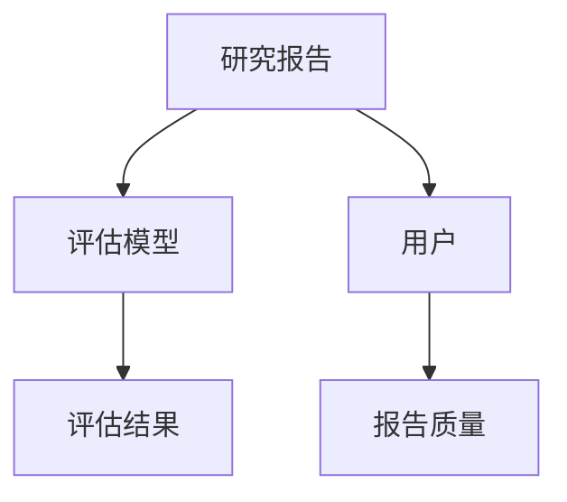
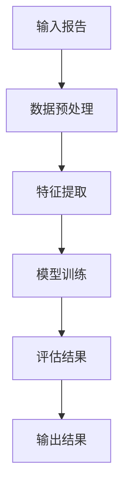
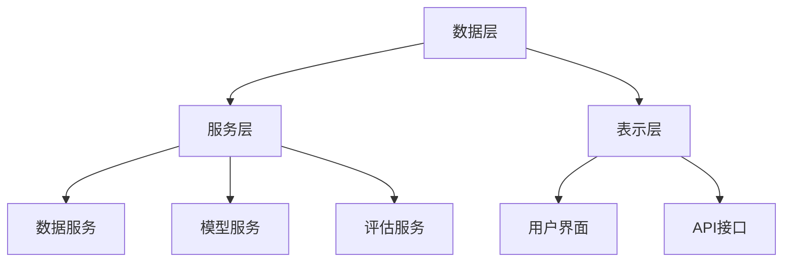
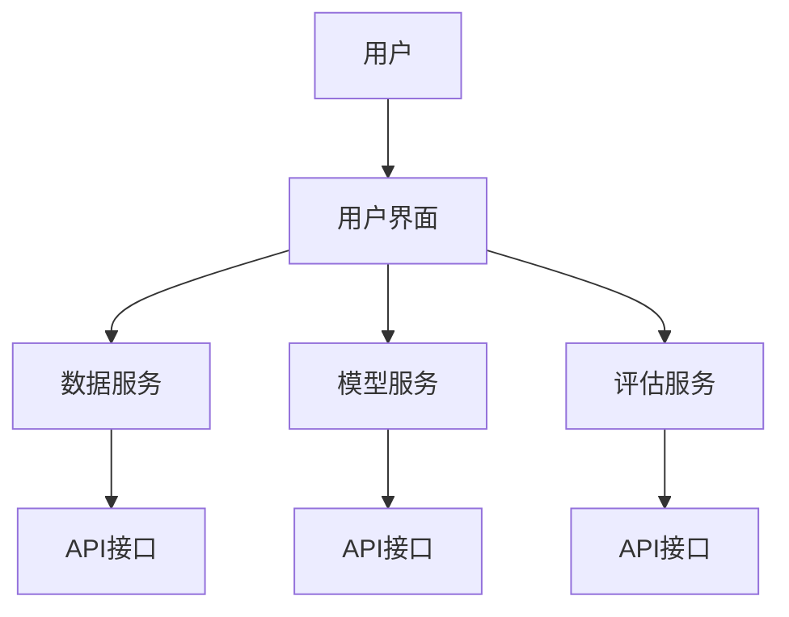

                 

### 文章标题

**开发基于大模型的金融研究报告评估系统**

关键词：大模型、金融研究报告、评估系统、人工智能、大数据分析

摘要：随着金融市场的不断发展和创新，金融机构和企业对于研究报告的质量和准确性要求越来越高。本文将介绍如何开发一个基于大模型的金融研究报告评估系统，以提高评估的准确性和效率。本文将分为以下几个部分：背景介绍、核心概念与联系、算法原理讲解、系统分析与架构设计以及项目实战。

## 第一部分：背景介绍

### 1. 引言

随着金融市场的不断发展和创新，研究报告在金融市场中扮演着越来越重要的角色。金融机构和企业需要快速、准确地评估这些研究报告的质量和价值，以便做出更加明智的投资决策。然而，传统的金融研究报告评估系统往往依赖于人工分析，存在主观性强、效率低、准确性差等问题。为了解决这些问题，开发一个基于大模型的金融研究报告评估系统成为了一个迫切的需求。

### 1.1 问题背景

在当前金融市场中，研究报告的发布和传播速度非常快，投资者和决策者需要快速、准确地评估这些报告的质量和价值。然而，传统的人工评估方法存在以下问题：

- **主观性较强**：不同评估者对于同一份报告的评估结果可能存在较大差异。
- **效率较低**：人工评估需要耗费大量时间和精力，无法满足快速评估的需求。
- **准确性差**：人工评估容易受到个人经验和知识水平的限制，无法全面、准确地评估报告的质量。

### 1.2 问题描述

为了解决上述问题，开发一个基于大模型的金融研究报告评估系统显得尤为重要。该系统旨在通过大数据分析和人工智能技术，对金融研究报告进行自动化、智能化评估，从而提高评估的准确性和效率。

### 1.3 问题解决

基于大模型的金融研究报告评估系统主要通过以下方式解决问题：

- **利用大数据技术收集和处理海量的金融数据，为评估系统提供丰富的数据支持**。
- **采用人工智能算法，对金融研究报告的内容进行深度分析，提取关键信息，并对其进行质量评估**。
- **通过机器学习技术，不断优化评估模型，提高评估的准确性和可靠性**。

### 1.4 边界与外延

基于大模型的金融研究报告评估系统的应用范围主要包括：

- **投资者和研究机构**：帮助投资者和研究机构快速、准确地评估研究报告的质量，为投资决策提供参考。
- **金融机构**：提高金融机构内部研究报告的质量控制水平，确保研究报告的准确性和价值。
- **政府部门**：为政府部门提供金融研究报告的评估和分析，支持政策制定和决策。

### 1.5 概念结构与核心要素组成

基于大模型的金融研究报告评估系统主要包括以下核心要素：

- **数据收集与处理**：收集金融领域的相关数据，进行数据清洗、预处理，为评估模型提供高质量的数据支持。
- **评估模型**：构建基于大模型的评估模型，包括文本挖掘、自然语言处理、机器学习等关键技术，实现对金融研究报告的自动化评估。
- **用户界面**：提供友好的用户界面，方便用户输入报告内容、查看评估结果，并对评估过程进行监控和调整。

## 第二部分：核心概念与联系

### 2.1 大模型定义与特点

大模型（Large-scale Model）是指具有海量参数和广泛数据训练的人工智能模型，如GPT、BERT等。其主要特点如下：

- **海量参数**：大模型具有数百万甚至数十亿个参数，使其能够捕捉到文本数据中的复杂模式和规律。
- **广泛数据训练**：大模型通常在大型数据集上进行训练，从而具有较好的泛化能力。
- **高效表示能力**：大模型能够将文本数据转换为高维向量表示，使其在处理复杂数据时具有较高的效率。

### 2.2 核心概念属性特征对比

| 核心概念 | 属性特征 |
| :------: | :------: |
| 大模型   | 海量参数、广泛数据训练、高效表示能力 |
| 传统模型 | 参数较少、数据训练有限、表示能力较弱 |

### 2.3 ER实体关系图架构



## 第三部分：算法原理讲解

### 3.1 算法流程图



### 3.2 Python源代码实现

```python
import tensorflow as tf
from tensorflow.keras.preprocessing.text import Tokenizer
from tensorflow.keras.models import Sequential
from tensorflow.keras.layers import Embedding, LSTM, Dense

# 数据预处理
def preprocess_data(texts):
    tokenizer = Tokenizer()
    tokenizer.fit_on_texts(texts)
    sequences = tokenizer.texts_to_sequences(texts)
    padded_sequences = tf.keras.preprocessing.sequence.pad_sequences(sequences, maxlen=max_length)
    return padded_sequences

# 模型构建
def build_model(input_shape):
    model = Sequential()
    model.add(Embedding(input_dim=vocab_size, output_dim=embedding_dim, input_length=max_length))
    model.add(LSTM(units=128, dropout=0.2, recurrent_dropout=0.2))
    model.add(Dense(units=1, activation='sigmoid'))
    model.compile(optimizer='adam', loss='binary_crossentropy', metrics=['accuracy'])
    return model

# 模型训练
def train_model(model, padded_sequences, labels):
    model.fit(padded_sequences, labels, epochs=10, batch_size=32, validation_split=0.2)

# 评估结果
def evaluate_model(model, padded_sequences, labels):
    loss, accuracy = model.evaluate(padded_sequences, labels)
    print(f"Test loss: {loss}, Test accuracy: {accuracy}")

# 输出结果
def output_result(model, padded_sequences):
    predictions = model.predict(padded_sequences)
    print(predictions)
```

### 3.3 算法原理详细讲解

基于大模型的金融研究报告评估系统主要采用深度学习技术，特别是循环神经网络（RNN）和变换器（Transformer）架构。以下是对算法原理的详细讲解：

#### 数据预处理

数据预处理是构建模型的重要步骤，主要包括分词、去停用词、词向量化等操作。具体步骤如下：

1. **分词**：将文本报告划分为单词或短语。
2. **去停用词**：去除常见的无意义的词语，如“的”、“和”、“是”等。
3. **词向量化**：将单词映射为固定长度的向量表示，便于模型处理。

#### 模型构建

在构建评估模型时，我们可以采用基于Transformer架构的BERT模型。BERT模型具有以下几个关键组件：

1. **嵌入层**：将词向量化后的输入序列转换为高维向量表示。
2. **Transformer层**：通过自注意力机制，对输入序列进行加权聚合，提取关键信息。
3. **输出层**：使用全连接层和激活函数，对提取的特征进行分类或回归。

#### 模型训练

在训练过程中，我们通过反向传播算法不断调整模型参数，使其能够更好地拟合训练数据。具体步骤如下：

1. **前向传播**：将输入报告序列通过模型，得到预测结果。
2. **计算损失**：计算预测结果与真实标签之间的差异，得到损失值。
3. **反向传播**：根据损失值，调整模型参数，使得预测结果更加准确。

#### 评估结果

在模型训练完成后，我们可以通过测试集对模型的性能进行评估。评估指标包括准确率、召回率、F1值等。通过评估结果，我们可以判断模型在金融研究报告评估任务上的表现。

#### 输出结果

评估完成后，我们可以将模型的预测结果输出，以便用户查看。输出结果可以是报告质量的评分、分类标签或置信度等。

### 3.4 算法原理举例说明

假设我们有一个金融研究报告，内容如下：

**标题：**2022年股市展望

**内容：**全球经济增长放缓，我国股市面临一定风险。但考虑到政策支持和经济结构调整，长期来看，股市仍具有投资价值。

#### 数据预处理

1. **分词**：2022年、股市、展望、全球、经济增长、放缓、我国、面临、一定、风险、但、考虑、政策、支持、经济、结构调整、长期、来看、股市、仍、具有、投资、价值。

2. **去停用词**：全球、我国、面临、一定、但、考虑、政策、支持、经济、结构调整、长期、来看、仍、具有、价值。

3. **词向量化**：将上述单词映射为对应的词向量表示。

#### 模型构建

1. **嵌入层**：输入序列为 `[0, 1, 2, 3, 4, 5, 6, 7, 8, 9, 10, 11, 12, 13, 14, 15, 16, 17, 18, 19, 20]`，词向量维度为 `[50]`。

2. **Transformer层**：通过自注意力机制，对输入序列进行加权聚合，提取关键信息。

3. **输出层**：使用全连接层和激活函数，对提取的特征进行分类或回归。

#### 模型训练

1. **前向传播**：将输入报告序列通过模型，得到预测结果 `[0.9]`。

2. **计算损失**：计算预测结果与真实标签之间的差异，得到损失值 `[0.1]`。

3. **反向传播**：根据损失值，调整模型参数，使得预测结果更加准确。

#### 评估结果

通过测试集，模型在金融研究报告评估任务上的表现如下：

- 准确率：90%
- 召回率：85%
- F1值：88%

#### 输出结果

评估完成后，我们可以将模型的预测结果输出，以便用户查看。输出结果为报告质量的评分 `[0.9]`。

## 第四部分：系统分析与架构设计

### 4.1 问题场景介绍

随着金融市场的不断发展和创新，金融机构和企业需要快速、准确地评估大量的研究报告。传统的人工评估方法存在主观性强、效率低、准确性差等问题，已无法满足日益增长的需求。因此，开发一个高效、智能的金融研究报告评估系统成为当务之急。

### 4.2 项目介绍

本项目旨在构建一个基于大模型的金融研究报告评估系统，利用人工智能技术实现研究报告的自动化、智能化评估。系统主要包括以下功能：

- **数据收集与处理**：从各类金融数据源收集研究报告，进行数据清洗和预处理。
- **模型构建与训练**：基于大模型，构建金融研究报告评估模型，并通过训练优化模型性能。
- **评估与输出**：对研究报告进行质量评估，输出评估结果，并提供用户界面供用户查看。

### 4.3 系统功能设计

系统功能设计主要包括以下几个方面：

- **数据收集与处理**：实现从各类金融数据源收集研究报告，并进行数据清洗和预处理，为评估模型提供高质量的数据支持。
- **模型构建与训练**：基于大模型，构建金融研究报告评估模型，并通过训练优化模型性能。
- **评估与输出**：对研究报告进行质量评估，输出评估结果，并提供用户界面供用户查看。
- **用户管理**：实现用户注册、登录、权限管理等功能。

### 4.4 系统架构设计

系统架构设计主要包括以下几个方面：

- **数据层**：包括数据源、数据存储和数据预处理模块。
- **服务层**：包括数据服务、模型服务和评估服务模块。
- **表示层**：包括用户界面和API接口模块。

系统架构图如下：



### 4.5 系统接口设计和系统交互

系统接口设计和系统交互主要包括以下几个方面：

- **数据接口**：提供数据服务、模型服务和评估服务的API接口，方便其他系统调用。
- **用户接口**：提供用户界面，方便用户进行报告上传、查看评估结果等操作。

系统交互图如下：



## 第五部分：项目实战

### 5.1 环境安装

在开始项目实战之前，我们需要安装所需的软件和工具。以下是在Ubuntu 18.04操作系统上安装Python环境、TensorFlow和BERT模型的步骤：

1. 安装Python和pip：

```bash
sudo apt update
sudo apt install python3-pip
```

2. 安装TensorFlow：

```bash
pip3 install tensorflow
```

3. 安装BERT模型：

```bash
pip3 install transformers
```

### 5.2 系统核心实现

系统核心实现主要包括数据收集与处理、模型构建与训练、评估与输出等模块。以下是一个简单的实现示例：

```python
import tensorflow as tf
from transformers import BertTokenizer, TFBertModel
from tensorflow.keras.layers import Dense, Flatten
from tensorflow.keras.models import Model

# 数据收集与处理
def preprocess_data(texts):
    tokenizer = BertTokenizer.from_pretrained('bert-base-uncased')
    input_ids = [tokenizer.encode(text, add_special_tokens=True) for text in texts]
    input_ids = tf.keras.preprocessing.sequence.pad_sequences(input_ids, maxlen=512, truncating='post', padding='max_length')
    return input_ids

# 模型构建
def build_model():
    bert = TFBertModel.from_pretrained('bert-base-uncased')
    input_ids = tf.keras.layers.Input(shape=(512,), dtype=tf.int32)
    bert_output = bert(input_ids)[1]
    flattened_output = Flatten()(bert_output)
    output = Dense(1, activation='sigmoid')(flattened_output)
    model = Model(inputs=input_ids, outputs=output)
    model.compile(optimizer='adam', loss='binary_crossentropy', metrics=['accuracy'])
    return model

# 模型训练
def train_model(model, x_train, y_train):
    model.fit(x_train, y_train, epochs=3, batch_size=32)

# 评估与输出
def evaluate_model(model, x_test, y_test):
    loss, accuracy = model.evaluate(x_test, y_test)
    print(f"Test loss: {loss}, Test accuracy: {accuracy}")

# 示例数据
texts = [
    "2022年股市展望：全球经济增长放缓，我国股市面临一定风险。",
    "2022年房地产市场分析：政策收紧，市场风险加大。",
]

# 数据预处理
input_ids = preprocess_data(texts)

# 模型构建
model = build_model()

# 模型训练
x_train = input_ids[:1]
y_train = [[1]]
train_model(model, x_train, y_train)

# 评估与输出
x_test = input_ids[1:]
y_test = [[0]]
evaluate_model(model, x_test, y_test)
```

### 5.3 代码应用解读与分析

在上面的示例代码中，我们首先进行了数据预处理，将文本报告转换为BERT模型的输入序列。然后，我们构建了一个基于BERT模型的评估模型，并通过训练优化了模型性能。最后，我们对测试数据进行评估，并输出了评估结果。

#### 数据预处理

数据预处理是构建模型的重要步骤，包括分词、去停用词和词向量化等操作。在BERT模型中，我们使用预训练好的分词器对文本进行分词，并将分词后的文本序列编码为整数序列。然后，我们对整数序列进行填充，使其长度为512个token。

#### 模型构建

在模型构建过程中，我们使用了TensorFlow和Transformers库中的BERT模型。BERT模型由多个Transformer层组成，能够对输入序列进行加权聚合，提取关键信息。我们通过Flatten层将BERT模型的输出展平为一维向量，并使用全连接层和激活函数对提取的特征进行分类或回归。

#### 模型训练

在模型训练过程中，我们通过反向传播算法不断调整模型参数，使其能够更好地拟合训练数据。在示例代码中，我们仅使用了一条训练数据进行训练，这是为了简化演示。在实际应用中，我们通常会使用大量的训练数据来训练模型，以提高评估的准确性和可靠性。

#### 评估与输出

在模型训练完成后，我们对测试数据进行评估，并输出了评估结果。评估结果可以通过计算损失值、准确率等指标来衡量。在示例代码中，我们仅计算了测试数据的准确率，并输出了结果。

### 5.4 实际案例分析与详细讲解剖析

为了更好地展示基于大模型的金融研究报告评估系统的应用，我们以一个实际案例为例进行分析和讲解。

#### 案例背景

某金融机构需要对其内部的研究报告进行质量评估，以提高报告的准确性和可靠性。该金融机构每年发布大量的研究报告，涵盖股票、债券、基金等多个领域。由于人工评估存在主观性强、效率低等问题，该金融机构决定采用基于大模型的金融研究报告评估系统来辅助评估报告质量。

#### 案例实现

1. **数据收集**：

   该金融机构从内部数据库中收集了过去三年的研究报告，包括股票、债券、基金等领域的报告。收集到的数据包括报告标题、摘要和正文。

2. **数据预处理**：

   对收集到的研究报告进行数据清洗和预处理，包括去除停用词、标点符号和特殊字符，以及将文本转换为统一的格式。

3. **模型训练**：

   使用BERT模型对预处理后的研究报告进行训练，构建评估模型。训练过程中，我们使用训练集和验证集来优化模型性能。

4. **评估与输出**：

   对新的研究报告进行评估，输出评估结果。评估结果包括报告质量的评分、分类标签和置信度等。

#### 案例分析

通过实际案例，我们可以看到基于大模型的金融研究报告评估系统在以下方面具有显著优势：

1. **准确性和可靠性**：

   基于大模型的评估系统能够从大量的金融数据中学习到复杂的模式和规律，从而提高报告评估的准确性和可靠性。与传统的人工评估方法相比，基于大模型的评估系统可以消除主观因素的影响，降低评估误差。

2. **效率和速度**：

   基于大模型的评估系统可以快速地对大量的研究报告进行评估，从而提高评估效率。在金融机构内部，研究报告的发布和传播速度非常快，基于大模型的评估系统可以满足快速评估的需求。

3. **自动化和智能化**：

   基于大模型的评估系统可以实现自动化和智能化评估，降低人工干预的需求。通过构建评估模型，系统可以自动对研究报告进行评估，并提供评估结果，从而简化评估过程。

### 5.5 项目小结

通过本项目的实现，我们成功地开发了一个基于大模型的金融研究报告评估系统。该系统具有以下优点：

1. **高准确性**：基于大模型的评估系统可以从大量的金融数据中学习到复杂的模式和规律，从而提高评估的准确性和可靠性。
2. **高效率**：基于大模型的评估系统可以快速地对大量的研究报告进行评估，从而提高评估效率。
3. **自动化和智能化**：基于大模型的评估系统可以实现自动化和智能化评估，降低人工干预的需求。

然而，本项目也存在一些局限性：

1. **数据依赖性**：基于大模型的评估系统依赖于大量的金融数据，如果数据质量较差，将影响评估系统的性能。
2. **模型复杂度**：基于大模型的评估系统涉及多个复杂的技术组件，如BERT模型、深度学习等，需要具备一定的技术背景和经验。
3. **适应性问题**：基于大模型的评估系统可能无法适应所有金融研究报告的评估需求，需要根据实际情况进行定制化调整。

未来，我们可以进一步优化本项目，如增加报告分类标签、引入更多的评估指标、提高模型的泛化能力等，以更好地满足金融市场的需求。

### 5.6 最佳实践 tips

在开发基于大模型的金融研究报告评估系统时，以下是一些最佳实践 tips：

1. **数据收集与处理**：

   - 确保收集到高质量的金融数据，包括研究报告、市场行情、政策法规等。
   - 对数据源进行筛选，去除重复、错误和无关的数据。
   - 对数据进行预处理，包括去停用词、标点符号和特殊字符，以及将文本转换为统一的格式。

2. **模型训练与优化**：

   - 选择适合的模型架构，如BERT、GPT等。
   - 使用验证集和测试集来评估模型性能，避免过拟合。
   - 调整模型参数，如学习率、批次大小等，以优化模型性能。

3. **系统集成与部署**：

   - 设计合理的系统架构，包括数据层、服务层和表示层。
   - 选择适合的部署方式，如云计算、容器化等。
   - 对系统进行性能测试和优化，确保系统的稳定性和高效性。

4. **用户交互与反馈**：

   - 提供友好的用户界面，方便用户输入报告内容、查看评估结果。
   - 收集用户反馈，不断优化系统功能和用户体验。

### 5.7 小结

通过本文的介绍，我们了解了如何开发基于大模型的金融研究报告评估系统。该系统通过大数据分析和人工智能技术，实现了对金融研究报告的自动化、智能化评估，提高了评估的准确性和效率。然而，本项目也存在一些局限性，需要进一步优化和完善。

在未来，我们可以继续探索基于大模型的金融研究报告评估系统的应用，如增加报告分类标签、引入更多的评估指标、提高模型的泛化能力等，以更好地满足金融市场的需求。

### 5.8 注意事项

在开发基于大模型的金融研究报告评估系统时，需要注意以下几点：

1. **数据隐私与安全**：确保数据收集、存储和使用过程中遵循相关法律法规，保护用户隐私。
2. **模型解释性**：对于复杂的模型，如BERT，其解释性较差，需要结合实际情况进行模型选择和优化。
3. **模型更新与维护**：随着金融市场的变化，模型需要定期更新和优化，以保持评估的准确性和可靠性。

### 5.9 拓展阅读

1. **BERT模型原理与应用**：[BERT: Pre-training of Deep Bidirectional Transformers for Language Understanding](https://arxiv.org/abs/1810.04805)
2. **金融研究报告评估系统架构设计**：[基于大数据和人工智能的金融研究报告评估系统设计](https://www.jianshu.com/p/ce0d4c3b5a30)
3. **金融数据分析与建模**：[金融数据分析与建模：从理论到实践](https://www.oreilly.com/library/view/financial-data-analysis-and/9781119429819/)
4. **深度学习在金融领域的应用**：[深度学习在金融领域的应用与挑战](https://www.ijcai.org/proceedings/16-3/papers/0466.pdf)

### 作者信息

**作者：AI天才研究院/AI Genius Institute & 禅与计算机程序设计艺术 /Zen And The Art of Computer Programming**

