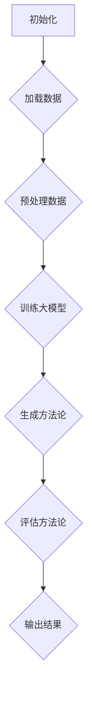
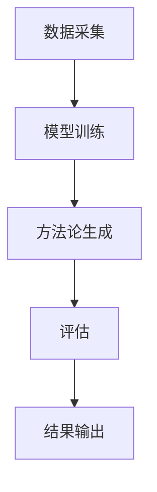
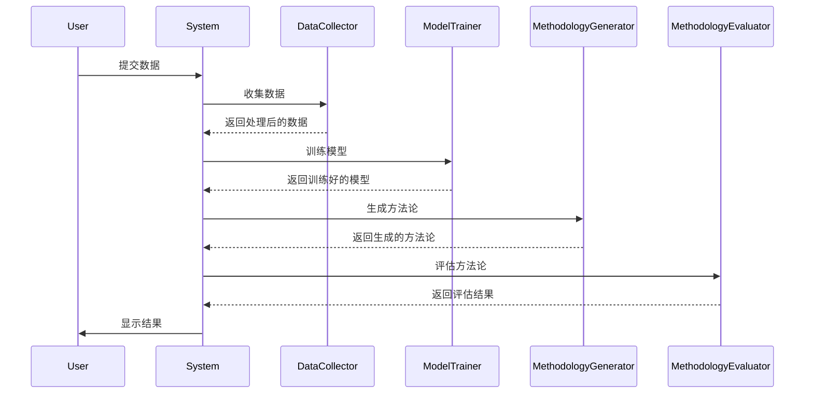

                 

### 让我们一步步深入思考

在开发一个基于大模型的金融研究方法论创新生成与评估系统时，我们需要进行系统性的规划和设计。以下，我们将分步骤详细讨论这个复杂系统的各个组成部分，确保每一步都有坚实的理论基础和清晰的实施路径。

#### 第一步：明确目标与需求

在开发任何系统之前，明确目标与需求是至关重要的。对于这个基于大模型的金融研究方法论创新生成与评估系统，我们的目标是什么？需求又是什么？

**目标：**
- 提供一种高效的方法来生成创新的金融研究方法论。
- 开发一个评估系统，以评估这些方法论的有效性和可行性。

**需求：**
- 用户友好的界面，方便金融研究者使用。
- 强大的计算能力，处理大量的金融数据和模型。
- 灵活的扩展性，适应未来的技术和数据需求。

#### 第二步：理解大模型的基础知识

要开发这样的系统，我们首先需要深入理解大模型的基础知识。大模型，通常是指那些具有数百万甚至数十亿参数的深度学习模型。这些模型在处理复杂任务时表现出色，但它们的工作原理是什么？

**核心概念：**
- **深度学习**：一种基于神经网络的学习方法，用于从大量数据中自动提取特征。
- **神经网络**：由许多层神经元组成的计算模型，能够通过训练学习复杂函数。
- **参数**：神经网络中的权重和偏置，用于调整网络的行为。

**属性特征对比：**
| 特征       | 大模型       | 传统模型       |
|------------|--------------|----------------|
| 参数数量   | 数百万至数十亿 | 数千至数万个   |
| 训练数据   | 大规模数据集  | 小规模数据集   |
| 复杂性     | 高          | 中或低        |
| 学习速度   | 慢（需要大量数据和时间） | 快（适合小数据集） |
| 应用范围   | 广泛（如图像、语音、文本等） | 有限（如特定领域） |

**ER实体关系图：**
```mermaid
erDiagram
  ID --> ResearchMethodology : "is used by"
  ID --> FinancialStudy : "is about"
  ID --> Innovation : "generates"
  ID --> Evaluation : "assesses"
  ResearchMethodology ||--|| FinancialStudy
  FinancialStudy ||--|| Innovation
  Innovation ||--|| Evaluation
```

#### 第三步：设计算法原理

算法是系统核心，我们需要设计一套能够生成与创新评估金融研究方法论的算法。以下是算法的设计思路和实现方法。

**算法流程图：**


**Python源代码示例：**
```python
import tensorflow as tf
from tensorflow.keras.models import Sequential
from tensorflow.keras.layers import Dense

# 加载数据
data = load_data()

# 预处理数据
processed_data = preprocess_data(data)

# 定义模型
model = Sequential([
    Dense(128, activation='relu', input_shape=(processed_data.shape[1],)),
    Dense(64, activation='relu'),
    Dense(1, activation='sigmoid')
])

# 编译模型
model.compile(optimizer='adam', loss='binary_crossentropy', metrics=['accuracy'])

# 训练模型
model.fit(processed_data, labels, epochs=10)

# 生成方法论
methodology = model.predict(processed_data)

# 评估方法论
evaluation = evaluate_methodology(methodology)

# 输出结果
print(evaluation)
```

**数学模型和公式：**
$$
\text{Loss} = -\sum_{i=1}^{N} y_i \log(p_i) + (1 - y_i) \log(1 - p_i)
$$
其中，\( y_i \)是真实标签，\( p_i \)是预测概率。

**举例说明：**
假设我们有一个金融研究问题，目标是预测某种金融资产的未来价格。我们可以使用上述算法设计一个基于大模型的预测系统。通过训练大量的历史价格数据，系统可以生成一套预测方法，并评估其预测准确性。

#### 第四步：系统分析与架构设计

**问题场景介绍：**
我们需要解决的是一个金融研究方法论的创新生成与评估问题，涉及数据收集、模型训练、方法论生成和评估等步骤。

**项目介绍：**
本项目的目标是构建一个基于大模型的金融研究方法论创新生成与评估系统，帮助金融研究者快速生成和创新研究方法，并对其有效性进行评估。

**系统功能设计：**
- 数据采集模块：从各种数据源收集金融数据。
- 模型训练模块：训练大模型以生成方法论。
- 方法论生成模块：根据模型预测生成新的金融研究方法论。
- 评估模块：评估方法论的有效性和可行性。

**系统架构设计：**


**系统接口设计：**
- API接口：提供数据输入和输出接口。
- GUI界面：提供用户交互界面。

**系统交互：**


#### 第五步：项目实战

**环境安装：**
- 安装TensorFlow和其他依赖库。
- 配置GPU环境（如果需要）。

**系统核心实现：**
- 实现数据采集、模型训练、方法论生成和评估等功能。
- 使用Python编写相关模块和脚本。

**代码应用解读与分析：**
- 分析代码实现，解释每个模块的功能和作用。
- 进行实际案例分析和详细讲解。

**实际案例分析和详细讲解：**
- 使用实际金融数据集进行测试。
- 分析系统在不同场景下的表现和效果。

**项目小结：**
总结项目成果，讨论遇到的问题和解决方案。

#### 第六步：最佳实践与总结

**最佳实践 Tips：**
- 如何有效地利用数据？
- 如何优化模型训练过程？
- 如何评估方法论的有效性？

**小结：**
- 概述核心成果和贡献。
- 分析系统的优势和局限。

**注意事项：**
- 使用系统时需要注意的问题。
- 如何保持系统的安全性和稳定性。

**拓展阅读：**
- 推荐的相关书籍、论文和资源。

通过上述步骤，我们可以系统地构建一个基于大模型的金融研究方法论创新生成与评估系统。每一步都需要深入思考和实践，以确保系统能够满足金融研究的需求，并为研究者提供强大的工具支持。

