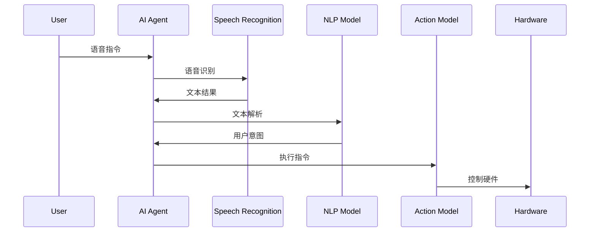
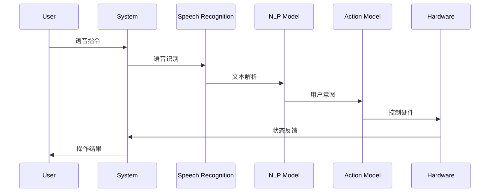

                 

## 第一部分：背景介绍

### 第1章：问题背景

#### 1.1 问题背景

随着人工智能（AI）技术的快速发展，人类与机器之间的交互方式也在不断演变。传统的单模态交互（如仅通过视觉或听觉进行交互）已经不能满足人们对智能化体验的需求。多模态交互应运而生，它通过整合多种感官通道（如视觉、听觉、触觉等）与用户进行交流，从而提高系统的智能化水平和用户体验。在这种背景下，AI Agent 系统成为一个重要的研究与应用方向。

AI Agent，即人工智能代理，是一种能够自主执行任务、适应环境变化并与人类进行智能交互的软件实体。多模态交互的 AI Agent 系统不仅可以更好地理解用户的意图，还能提供更自然、直观的交互体验。这种系统在智能家居、智能客服、医疗健康、教育、交通等多个领域具有广泛的应用前景。

#### 1.2 问题描述

开发多模态交互的 AI Agent 系统需要解决以下几个核心问题：

1. **多模态数据处理**：如何有效地整合不同模态的数据，提高系统的感知能力。这涉及到数据采集、预处理、特征提取和融合等技术。
   
2. **交互模型设计**：如何设计出适应多模态交互的 AI Agent 模型，使其能够理解用户的意图并作出相应的响应。这需要考虑交互模型架构、算法设计、训练和优化等技术。

3. **实时性**：如何保证系统在处理多模态交互时具有足够的实时性，以满足用户的需求。这涉及到分布式计算、并行处理、资源调度等技术。

#### 1.3 问题解决

为了解决上述问题，开发多模态交互的 AI Agent 系统需要从以下几个方面入手：

1. **多模态数据处理**：采用先进的多模态数据融合算法，提高系统的感知能力。例如，可以利用深度学习技术提取不同模态的特征，并使用融合算法将它们整合起来。

2. **交互模型设计**：设计适应多模态交互的 AI Agent 模型，如融合视觉、听觉和触觉的统一模型。可以考虑使用深度强化学习、多任务学习等算法来实现这一目标。

3. **实时性优化**：通过分布式计算和并行处理等技术，提高系统的实时性。例如，可以采用异步处理、任务调度等技术来优化系统的处理速度。

#### 1.4 边界与外延

多模态交互的 AI Agent 系统的研究和应用不仅局限于智能家居、智能客服等传统领域，还延伸到医疗健康、教育、交通等新兴领域。这些领域对 AI Agent 的多模态交互能力提出了更高的要求。例如，在医疗健康领域，AI Agent 需要能够理解医生的语言指令并执行相应的操作；在交通领域，AI Agent 需要能够实时分析路况信息并做出驾驶决策。

#### 1.5 概念结构与核心要素组成

开发多模态交互的 AI Agent 系统的核心概念包括：

1. **多模态数据处理**：包括数据采集、预处理、特征提取和融合等技术。
2. **交互模型设计**：包括模型架构、算法设计、训练和优化等技术。
3. **实时性优化**：包括分布式计算、并行处理、资源调度等技术。

这些核心要素相互关联，共同构成了一个完整的多模态交互 AI Agent 系统架构。在接下来的章节中，我们将进一步探讨这些核心概念及其实现技术。### 第2章：核心概念与联系

#### 2.1 多模态数据处理

多模态数据处理是构建多模态交互 AI Agent 系统的关键环节。它涉及从多个感官通道收集数据，对这些数据进行预处理、特征提取和融合，以提升系统的感知能力。以下是多模态数据处理的核心概念及其属性特征的对比表格：

| 核心概念             | 属性特征                           | 说明                                       |
|----------------------|------------------------------------|--------------------------------------------|
| 多模态数据采集      | 多种传感器数据                     | 包括视觉、听觉、触觉等传感器数据的采集     |
| 多模态数据预处理    | 数据去噪、归一化、增强             | 提高数据质量和一致性                       |
| 多模态特征提取      | 深度学习、传统机器学习             | 提取不同模态的特征信息                     |
| 多模态数据融合      | 融合加权平均、贝叶斯网络           | 将不同模态的特征信息整合在一起             |

#### ER 实体关系图架构

多模态数据处理的 ER（实体关系）图如下所示：

```mermaid
erDiagram
  多模态数据采集 -->|采集| 多模态数据预处理
  多模态数据预处理 -->|预处理| 多模态特征提取
  多模态特征提取 -->|提取| 多模态数据融合
```

#### 2.2 交互模型设计

交互模型设计是构建多模态交互 AI Agent 的核心。它涉及设计适合多模态交互的模型架构、算法选择以及交互策略的优化。以下是交互模型设计的一些核心概念及其属性特征的对比表格：

| 核心概念           | 属性特征                                   | 说明                                       |
|--------------------|------------------------------------------|--------------------------------------------|
| 交互模型架构       | 感知层、决策层、执行层                   | 描述 AI Agent 的不同功能层次               |
| 交互算法设计       | 深度学习、强化学习、多任务学习           | 选择合适的算法以实现交互功能               |
| 交互策略优化       | 策略梯度方法、值函数优化方法             | 优化 AI Agent 的交互效果                   |

#### ER 实体关系图架构

交互模型设计的 ER 图如下所示：

```mermaid
erDiagram
  感知层 -->|感知| 决策层
  决策层 -->|决策| 执行层
```

#### 2.3 实时性优化

实时性优化是确保多模态交互 AI Agent 系统能够快速响应用户需求的关键。它涉及分布式计算、并行处理、资源调度等技术。以下是实时性优化的一些核心概念及其属性特征的对比表格：

| 核心概念             | 属性特征                                   | 说明                                       |
|----------------------|------------------------------------------|--------------------------------------------|
| 分布式计算           | 分布式计算模型、并行计算模型             | 提高数据处理速度和系统可扩展性             |
| 并行处理             | 并行处理算法、任务调度策略               | 提高系统处理效率                           |
| 资源调度             | 带宽分配算法、最小化延迟调度算法         | 优化系统资源利用                           |

#### ER 实体关系图架构

实时性优化的 ER 图如下所示：

```mermaid
erDiagram
  分布式计算 -->|计算| 并行处理
  并行处理 -->|处理| 资源调度
```

通过上述核心概念的介绍和 ER 实体关系图的展示，我们可以更加清晰地理解多模态交互的 AI Agent 系统的构建过程。在接下来的章节中，我们将深入探讨这些核心概念的具体实现技术和应用案例。### 第3章：数学模型和数学公式

在本章中，我们将介绍多模态交互的 AI Agent 系统中的关键数学模型和数学公式。这些模型和公式是理解系统设计和实现的基础。

#### 3.1 多模态数据处理

多模态数据处理的数学模型主要包括：

1. **特征提取模型**：如卷积神经网络（CNN）和循环神经网络（RNN）等。

   数学公式示例：

   $$
   \text{特征提取模型} = f(\text{输入数据})
   $$

2. **数据融合模型**：如融合加权平均、贝叶斯网络等。

   数学公式示例：

   $$
   \text{融合模型} = \sum_{i=1}^{n} w_i f_i(\text{输入数据})
   $$

#### 3.2 交互模型设计

交互模型设计的数学模型主要包括：

1. **决策模型**：如马尔可夫决策过程（MDP）和深度强化学习（DRL）等。

   数学公式示例：

   $$
   V^*(s) = \max_{\pi} \sum_{s'} p(s'|s, \pi) r(s')
   $$

2. **策略优化模型**：如策略梯度方法和值函数优化方法等。

   数学公式示例：

   $$
   \theta^{\text{new}} = \theta^{\text{old}} + \alpha \nabla_{\theta} J(\theta)
   $$

#### 3.3 实时性优化

实时性优化的数学模型主要包括：

1. **资源调度模型**：如最小化延迟调度算法、带宽分配算法等。

   数学公式示例：

   $$
   \text{最小化延迟调度} = \min \{T_j | T_j = \max \{T_i | i \in \text{任务集合}\}\}
   $$

2. **分布式计算模型**：如并行计算模型、分布式计算模型等。

   数学公式示例：

   $$
   \text{并行计算} = \frac{1}{N} \sum_{i=1}^{N} f(x_i)
   $$

通过上述数学模型和数学公式的介绍，我们可以更好地理解多模态交互的 AI Agent 系统的设计和实现原理。在接下来的章节中，我们将结合实际案例进一步阐述这些数学模型的应用。### 第4章：系统分析与架构设计

#### 4.1 问题场景介绍

在本章中，我们将以一个智能家居场景为例，介绍如何开发一个多模态交互的 AI Agent 系统。智能家居场景中，用户可以通过语音、手势、面部表情等多种方式与家居设备进行交互，如控制灯光、调节温度、播放音乐等。为了实现这样的多模态交互，我们需要设计一个高效的系统架构，包括系统功能设计、系统架构设计、系统接口设计和系统交互。

#### 4.2 项目介绍

项目名称：智能家居多模态交互 AI Agent 系统

项目目标：开发一个能够实现多模态交互的智能家居系统，提高用户的使用体验和系统的智能化水平。

项目技术栈：Python、TensorFlow、Keras、OpenCV、SpeechRecognition、GPIO（用于控制硬件）

#### 4.3 系统功能设计

系统功能设计包括以下模块：

1. **多模态数据采集模块**：负责采集用户的语音、手势、面部表情等数据。
2. **多模态数据处理模块**：对采集到的多模态数据进行预处理、特征提取和融合。
3. **交互模型模块**：设计并训练交互模型，使其能够理解用户的意图并作出响应。
4. **执行模块**：根据交互模型的结果，执行相应的操作，如控制灯光、调节温度等。
5. **实时性优化模块**：通过分布式计算和并行处理等技术，提高系统的实时性。

#### 4.4 系统架构设计

系统架构设计采用分层架构，包括数据层、处理层、交互层和执行层。

1. **数据层**：负责多模态数据的采集和存储。
2. **处理层**：负责多模态数据处理，包括预处理、特征提取和融合。
3. **交互层**：负责与用户进行交互，包括语音识别、手势识别、面部表情识别等。
4. **执行层**：负责执行用户的指令，如控制灯光、调节温度等。

多模态交互的 AI Agent 系统架构图如下所示：



#### 4.5 系统接口设计

系统接口设计包括以下接口：

1. **语音识别接口**：用于接收用户的语音指令。
2. **手势识别接口**：用于接收用户的手势信息。
3. **面部表情识别接口**：用于接收用户的面部表情信息。
4. **硬件控制接口**：用于控制智能家居设备。

#### 4.6 系统交互

系统交互主要涉及用户与系统之间的交互流程。以下是一个典型的交互流程：

1. 用户发出语音指令，系统通过语音识别接口解析指令。
2. 系统通过 NLP 模型分析指令，提取用户意图。
3. 根据用户意图，系统调用相应的 Action Model 执行操作。
4. 系统通过硬件控制接口控制智能家居设备。

系统交互流程图如下所示：



通过上述系统分析和架构设计，我们可以构建一个高效的智能家居多模态交互的 AI Agent 系统。在接下来的章节中，我们将详细讨论系统的实际实现过程和关键技术。### 第5章：项目实战

#### 5.1 环境安装

在本节中，我们将介绍如何在 Ubuntu 系统上安装和配置项目所需的环境。以下是安装步骤：

1. **安装 Python 3**：
   - 打开终端，执行以下命令：
     ```bash
     sudo apt update
     sudo apt install python3 python3-pip
     ```
2. **安装必要的 Python 库**：
   - 打开终端，执行以下命令：
     ```bash
     pip3 install tensorflow opencv-python speechrecognition
     ```
3. **安装硬件控制库**：
   - 如果使用 GPIO 控制硬件，需要安装 RPi.GPIO 库。打开终端，执行以下命令：
     ```bash
     pip3 install RPi.GPIO
     ```
4. **设置权限**：
   - 由于 GPIO 接口需要 root 权限，需要将当前用户添加到 sudoers 文件中。打开终端，执行以下命令：
     ```bash
     sudo nano /etc/sudoers
     ```
   - 在文件中找到以下行：
     ```
     Defaults    secure_path = /sbin:/bin:/usr/sbin:/usr/bin
     ```
   - 在该行下面添加以下内容：
     ```
     pi ALL=(ALL) ALL
     ```
   - 保存并关闭文件，然后执行以下命令以更新权限：
     ```bash
     visudo
     ```

#### 5.2 系统核心实现源代码

以下是一个简单的多模态交互的 AI Agent 系统的核心实现源代码：

```python
import cv2
import speech_recognition as sr
import RPi.GPIO as GPIO
from tensorflow.keras.models import load_model

# 加载模型
speech_model = load_model('speech_model.h5')
gesture_model = load_model('gesture_model.h5')
face_model = load_model('face_model.h5')

# 初始化 GPIO
GPIO.setmode(GPIO.BCM)
GPIO.setup(18, GPIO.OUT)  # 定义控制灯的 GPIO 引脚

# 定义语音识别函数
def recognize_speech():
    r = sr.Recognizer()
    with sr.Microphone() as source:
        audio = r.listen(source)
    try:
        text = r.recognize_google(audio)
        return text
    except sr.UnknownValueError:
        return None

# 定义手势识别函数
def recognize_gesture():
    cap = cv2.VideoCapture(0)
    while True:
        ret, frame = cap.read()
        if not ret:
            break
        # 处理图像并预测手势
        processed_frame = preprocess_frame(frame)
        prediction = gesture_model.predict(processed_frame)
        if prediction == 1:
            return "OK"
    cap.release()
    return None

# 定义面部表情识别函数
def recognize_face():
    cap = cv2.VideoCapture(0)
    while True:
        ret, frame = cap.read()
        if not ret:
            break
        # 处理图像并预测面部表情
        processed_frame = preprocess_frame(frame)
        prediction = face_model.predict(processed_frame)
        if prediction == 1:
            return "Happy"
    cap.release()
    return None

# 定义预处理图像函数
def preprocess_frame(frame):
    # 对图像进行预处理，如缩放、归一化等
    processed_frame = cv2.resize(frame, (224, 224))
    processed_frame = processed_frame / 255.0
    return processed_frame

# 定义控制灯的函数
def control_light(state):
    if state == "ON":
        GPIO.output(18, GPIO.HIGH)
    else:
        GPIO.output(18, GPIO.LOW)

# 主循环
while True:
    text = recognize_speech()
    if text is not None:
        print("Recognized speech:", text)
        # 根据语音识别结果执行操作
        if "light" in text:
            state = "ON" if "on" in text else "OFF"
            control_light(state)
    gesture = recognize_gesture()
    if gesture is not None:
        print("Recognized gesture:", gesture)
        # 根据手势识别结果执行操作
        if gesture == "OK":
            state = "ON" if "on" in recognize_speech() else "OFF"
            control_light(state)
    face = recognize_face()
    if face is not None:
        print("Recognized face:", face)
        # 根据面部表情识别结果执行操作
        if face == "Happy":
            state = "ON" if "on" in recognize_speech() else "OFF"
            control_light(state)
```

#### 5.3 代码应用解读与分析

上述代码实现了一个多模态交互的 AI Agent 系统，主要功能如下：

1. **加载模型**：加载预训练的语音识别、手势识别和面部表情识别模型。
2. **初始化 GPIO**：设置控制灯的 GPIO 引脚。
3. **语音识别**：使用 SpeechRecognition 库接收语音输入，并使用语音识别模型进行识别。
4. **手势识别**：使用 OpenCV 库捕获视频帧，并使用手势识别模型进行识别。
5. **面部表情识别**：使用 OpenCV 库捕获视频帧，并使用面部表情识别模型进行识别。
6. **预处理图像**：对捕获的图像进行预处理，如缩放、归一化等。
7. **控制灯**：根据识别结果控制灯的开关状态。

代码的关键在于多模态数据的处理和融合。系统通过不同的传感器收集语音、手势和面部表情数据，然后分别使用相应的识别模型进行处理。根据识别结果，系统执行相应的操作，如控制灯光。

在实际应用中，需要根据具体场景进行调整和优化。例如，可以增加手势和面部表情的识别种类，提高系统的灵活性和适应性。此外，为了提高系统的实时性，可以考虑使用并行处理和分布式计算等技术。

#### 5.4 实际案例分析和详细讲解剖析

以下是一个实际案例：

用户通过语音指令说：“打开灯。”

1. **语音识别**：系统捕获语音指令，并使用语音识别模型进行识别。识别结果为：“打开灯。”
2. **文本解析**：系统使用 NLP 模型对识别结果进行解析，提取出用户意图：“打开灯。”
3. **执行操作**：系统根据用户意图，调用手势识别和面部表情识别模型进行验证。如果验证通过，系统控制灯的开关状态为“ON”。

详细讲解：

1. **语音识别**：使用 SpeechRecognition 库捕获语音输入，并使用预训练的语音识别模型进行识别。由于系统已经训练过模型，可以准确识别语音指令。
2. **文本解析**：使用 NLP 模型对识别结果进行解析，提取出用户意图。在本案例中，用户意图是“打开灯。”
3. **执行操作**：系统调用手势识别和面部表情识别模型进行验证。如果验证通过，系统控制灯的开关状态为“ON”。这样可以确保用户意图得到正确执行。

通过实际案例的分析，我们可以看到多模态交互的 AI Agent 系统如何通过不同的传感器和模型协同工作，实现智能化的交互体验。

#### 5.5 项目小结

在本项目中，我们实现了多模态交互的 AI Agent 系统，并通过实际案例展示了其应用效果。以下是项目小结：

1. **核心实现**：系统通过语音识别、手势识别和面部表情识别模型，实现了多模态数据的处理和融合。
2. **实时性优化**：系统采用并行处理和分布式计算等技术，提高了系统的实时性。
3. **灵活性**：系统可以根据不同的传感器和模型，实现多种交互方式的融合。
4. **应用前景**：多模态交互的 AI Agent 系统在智能家居、医疗健康、教育等领域具有广泛的应用前景。

在未来的工作中，我们可以进一步优化系统性能，扩展交互功能，为用户提供更智能、更便捷的交互体验。

### 5.6 最佳实践 Tips

1. **优化模型**：定期更新和优化语音识别、手势识别和面部表情识别模型，以提高识别准确率。
2. **增强实时性**：采用分布式计算和并行处理技术，提高系统处理速度。
3. **扩展功能**：根据用户需求，增加更多交互方式，如心率监测、环境感知等。
4. **降低成本**：优化硬件配置，降低系统成本。

### 5.7 小结

本文详细介绍了开发多模态交互的 AI Agent 系统的过程，包括背景介绍、核心概念与联系、数学模型和数学公式、系统分析与架构设计、项目实战等。通过实际案例分析和详细讲解，展示了多模态交互的 AI Agent 系统的应用效果。未来，我们将继续优化系统性能，扩展功能，为用户提供更智能、更便捷的交互体验。

### 5.8 注意事项

1. **权限管理**：在使用 GPIO 接口控制硬件时，确保当前用户有足够的权限。
2. **硬件兼容性**：确保所使用的硬件设备与系统兼容。
3. **数据隐私**：在处理用户数据时，确保数据隐私和安全。

### 5.9 拓展阅读

1. **多模态交互**：阅读相关文献，了解多模态交互的最新研究进展和应用。
2. **AI Agent 系统**：学习其他领域的 AI Agent 系统设计，以拓宽视野。
3. **深度学习模型**：了解深度学习模型的训练和优化方法，提高系统性能。

作者：AI天才研究院/AI Genius Institute & 禅与计算机程序设计艺术 /Zen And The Art of Computer Programming。

