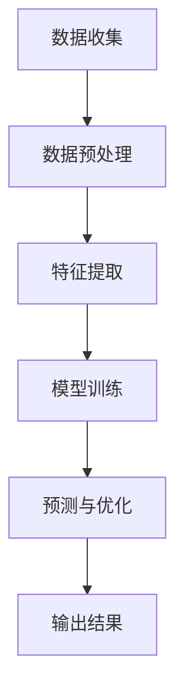
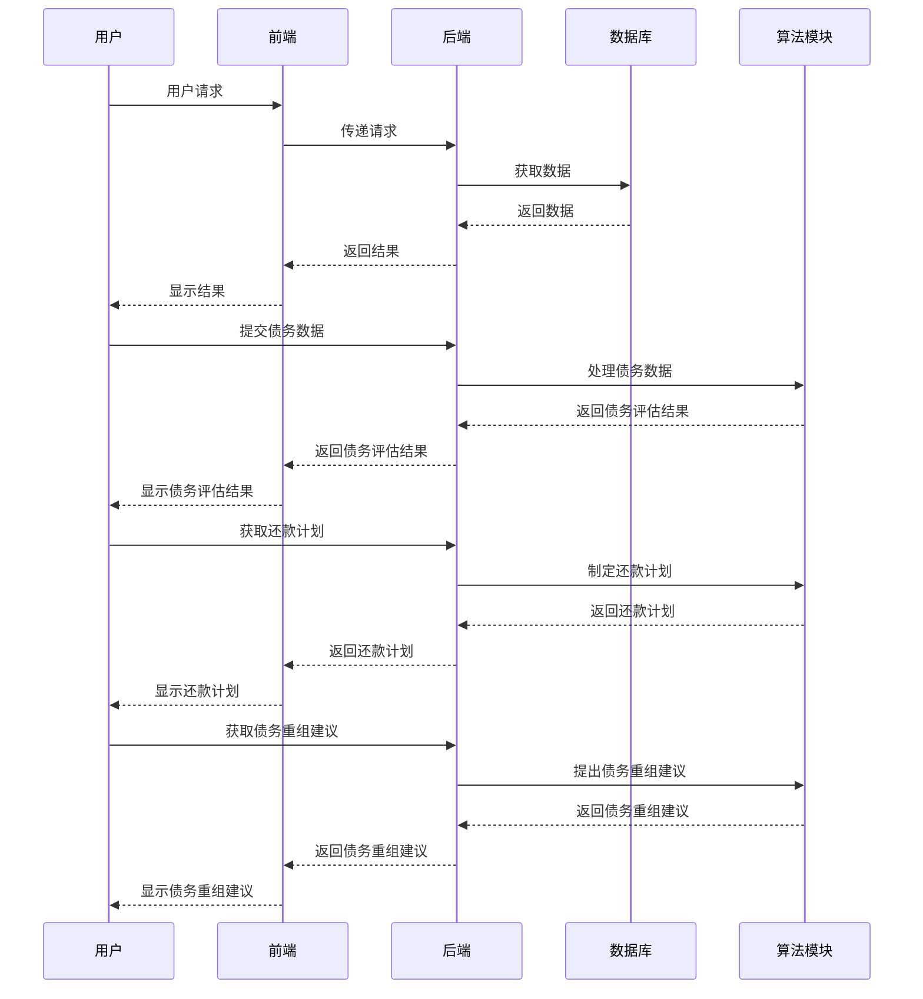
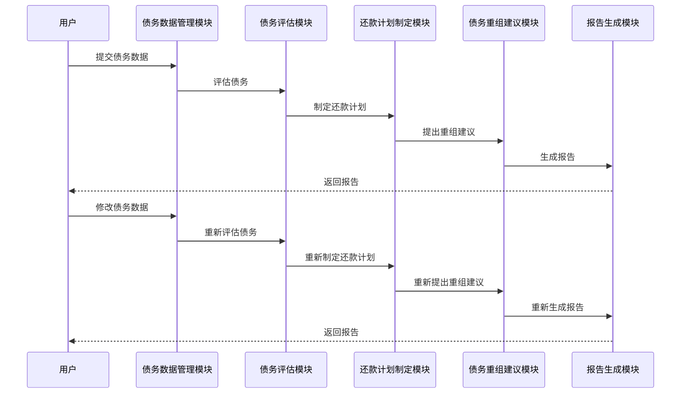

                 

# 《开发智能化的个人债务重组建议工具》

## 关键词
- 个人债务重组
- 智能化工具
- 算法原理
- 系统架构设计
- 案例分析

### 摘要

随着全球经济的不断发展，个人债务问题日益严重。为了帮助个人更好地管理债务，智能化债务重组建议工具的开发成为一个热门研究领域。本文将探讨个人债务重组的背景与挑战，分析智能化债务重组的核心概念和技术，详细讲解算法原理与系统设计，并通过实际项目案例展示工具的应用效果。本文旨在为开发智能化债务重组建议工具提供理论指导和实践参考。

### 目录大纲

## 第一部分：问题背景与核心概念

## 第1章：个人债务重组的挑战与机遇

### 1.1 个人债务重组的背景与现状

#### 1.1.1 个人债务重组的定义与意义

#### 1.1.2 个人债务重组的主要挑战

#### 1.1.3 智能化债务重组的趋势与前景

### 1.2 核心概念与联系

#### 1.2.1 债务重组的概念解析

#### 1.2.2 智能化技术的核心要素

#### 1.2.3 概念属性特征对比表格

#### 1.2.4 ER实体关系图架构

## 第二部分：算法原理与系统设计

## 第2章：算法原理讲解

### 2.1 算法概述

#### 2.1.1 算法的基本概念

#### 2.1.2 算法的目标与作用

### 2.2 算法流程与mermaid流程图

#### 2.2.1 算法的主要步骤

#### 2.2.2 算法mermaid流程图

### 2.3 Python源代码实现

```python
# Python源代码实现部分
```

### 2.4 算法原理的数学模型和公式

$$
# 数学模型和公式
$$

#### 2.4.1 数学模型的详细讲解

#### 2.4.2 数学公式的推导与解释

### 2.5 举例说明

#### 2.5.1 案例一：债务重组建议工具的开发

#### 2.5.2 案例二：工具的实际应用效果分析

## 第3章：系统分析与架构设计

### 3.1 问题场景介绍

#### 3.1.1 场景一：债务重组建议工具的需求分析

#### 3.1.2 场景二：债务重组建议工具的功能设计

### 3.2 系统架构设计

#### 3.2.1 系统架构的mermaid架构图

#### 3.2.2 系统模块的划分与功能描述

### 3.3 系统接口设计

#### 3.3.1 系统接口的mermaid序列图

#### 3.3.2 系统接口的功能描述与实现

## 第三部分：项目实战与案例分析

## 第4章：项目实战

### 4.1 环境安装

#### 4.1.1 环境搭建步骤

#### 4.1.2 环境配置注意事项

### 4.2 系统核心实现源代码

```python
# 系统核心实现源代码部分
```

### 4.3 代码应用解读与分析

#### 4.3.1 代码主要功能模块解析

#### 4.3.2 代码实现细节分析

### 4.4 实际案例分析和详细讲解剖析

#### 4.4.1 案例选择与数据分析

#### 4.4.2 案例分析与结果对比

### 4.5 项目小结

#### 4.5.1 项目成果总结

#### 4.5.2 项目改进与展望

## 第5章：最佳实践与拓展阅读

### 5.1 最佳实践 tips

#### 5.1.1 常见问题与解决方案

#### 5.1.2 提高性能的技巧

### 5.2 小结

#### 5.2.1 本书内容的总结

#### 5.2.2 智能化债务重组的建议

### 5.3 注意事项

#### 5.3.1 开发过程中的潜在风险

#### 5.3.2 使用工具时的注意事项

### 5.4 拓展阅读

#### 5.4.1 相关研究论文推荐

#### 5.4.2 推荐书籍与在线资源

### 第一部分：问题背景与核心概念

#### 1.1 个人债务重组的背景与现状

随着经济的发展和人们生活水平的提高，个人债务问题逐渐成为一个全球性的现象。根据国际货币基金组织（IMF）的数据，全球个人债务总额已超过200万亿美元，其中美国、中国、日本和欧盟等地区的个人债务负担尤为严重。

个人债务重组是指在个人负债过多、财务状况恶化时，通过调整债务结构、降低债务负担、优化还款计划等方式，帮助个人实现财务健康的举措。债务重组不仅有助于减轻个人财务压力，还能促进金融市场的稳定和健康发展。

目前，个人债务重组面临的主要挑战包括：

1. 债务数据复杂性：个人债务涉及多种债务类型，如信用卡债务、贷款、抵押贷款等，数据复杂性高，处理难度大。

2. 信息不对称：债务重组过程中，债权人、债务人、金融机构等信息不对称，导致决策过程复杂，风险增加。

3. 法律法规限制：不同国家和地区的法律法规对债务重组有不同的规定，增加了操作的复杂性。

4. 智能化水平不足：传统债务重组方法主要依赖于人工分析和经验，智能化程度较低，难以应对大数据时代的挑战。

与此同时，智能化债务重组工具的开发为解决上述问题提供了新的机遇。智能化债务重组工具能够通过大数据分析、机器学习算法等手段，为个人提供个性化的债务重组建议，提高债务重组的效率和效果。

#### 1.2 核心概念与联系

为了更好地理解智能化债务重组工具的开发，我们需要明确以下几个核心概念：

1. **债务重组**：债务重组是指通过调整债务结构、降低债务负担、优化还款计划等方式，帮助个人实现财务健康的举措。

2. **智能化技术**：智能化技术包括大数据分析、机器学习算法、自然语言处理等，通过这些技术可以对大量债务数据进行分析和处理，为债务重组提供决策支持。

3. **算法**：算法是解决特定问题的步骤集合，是智能化债务重组工具的核心组成部分。常见的算法包括线性规划、决策树、神经网络等。

4. **系统设计**：系统设计是指对债务重组工具的整体架构、模块划分、接口设计等进行规划，确保系统的稳定性和可扩展性。

#### 1.2.1 债务重组的概念解析

债务重组是指当债务人面临财务困境时，通过法律程序与债权人协商，达成新的还款协议，以降低债务负担，使债务人能够继续履行偿债义务。债务重组通常涉及以下方面：

- **债务种类**：包括信用卡债务、消费贷款、住房贷款、汽车贷款等。
- **债务金额**：债务重组的目标是减少债务总额，以减轻债务人负担。
- **还款期限**：调整还款期限，使债务人能够按照新的还款计划按时偿还债务。
- **还款方式**：改变还款方式，如分期还款、一次性还款等。

#### 1.2.2 智能化技术的核心要素

智能化技术在债务重组中的应用主要体现在以下几个方面：

- **大数据分析**：通过收集和分析大量的债务数据，挖掘潜在规律和趋势，为债务重组提供决策依据。
- **机器学习算法**：利用机器学习算法，对债务数据进行预测和分类，帮助债务重组工具自动生成个性化建议。
- **自然语言处理**：通过自然语言处理技术，自动提取债务文件中的关键信息，提高数据处理效率。
- **智能推荐系统**：基于用户历史数据，为债务人提供个性化的债务重组建议。

#### 1.2.3 概念属性特征对比表格

以下是债务重组、智能化技术和算法等核心概念的属性特征对比表格：

| 概念       | 属性特征                                                       | 对比分析                                                         |
| ---------- | ------------------------------------------------------------ | ------------------------------------------------------------ |
| 债务重组   | 法律程序、协商、降低债务负担、优化还款计划                   | 债务重组是债务管理的重要手段，强调法律和协商的重要性，旨在减轻债务负担。 |
| 智能化技术 | 大数据分析、机器学习算法、自然语言处理、智能推荐系统         | 智能化技术利用先进算法和数据处理方法，提高债务重组的效率和效果。   |
| 算法       | 线性规划、决策树、神经网络等                                 | 算法是债务重组工具的核心，通过算法实现债务数据分析和建议生成。   |

#### 1.2.4 ER实体关系图架构

为了更好地理解债务重组、智能化技术和算法等概念之间的关系，我们可以绘制一个ER实体关系图。ER实体关系图是一种用于描述实体之间关系的图形化工具，包括实体、属性和关系。

以下是债务重组相关的ER实体关系图：

```mermaid
erDiagram
    Customer ||--|{ Debt } : "has"
    Debt ||--|{ DebtType } : "type of"
    Debt ||--|{ PaymentPlan } : "has"
    DebtType ||--|{ InterestRate } : "has"
    PaymentPlan ||--|{ DueDate } : "has"
    PaymentPlan ||--|{ PaymentAmount } : "has"
```

在这个ER实体关系图中，`Customer`表示债务人，`Debt`表示债务，`DebtType`表示债务类型，`PaymentPlan`表示还款计划，`InterestRate`表示利率，`DueDate`表示到期日，`PaymentAmount`表示还款金额。通过这个图，我们可以清晰地看到债务重组中各实体之间的关系。

### 第二部分：算法原理与系统设计

#### 2.1 算法概述

债务重组算法是一种基于数据和数学模型的智能决策工具，旨在帮助个人优化债务结构，减轻财务压力。算法的基本概念包括输入、处理和输出。输入包括债务人的基本信息、债务类型、债务金额、还款期限等；处理过程涉及数据清洗、特征提取、模型训练和预测；输出是针对债务人的个性化债务重组建议。

算法的目标是：

- **优化债务结构**：通过调整债务类型、还款期限和还款金额，实现债务的最优分配，降低债务负担。
- **提高还款成功率**：根据债务人的财务状况，制定合理的还款计划，提高还款成功率。
- **降低金融风险**：通过准确预测债务人的还款能力，降低金融机构的金融风险。

算法在债务重组中的作用主要体现在：

- **自动化决策**：算法能够自动处理大量债务数据，生成个性化债务重组建议，提高决策效率。
- **降低人力成本**：减少人工分析的工作量，降低债务重组的成本。
- **提高决策质量**：通过数据分析和模型预测，提高债务重组决策的准确性和可靠性。

#### 2.2 算法流程与mermaid流程图

债务重组算法的基本流程如下：

1. **数据收集**：收集债务人的基本信息、债务类型、债务金额、还款期限等数据。
2. **数据预处理**：对收集的数据进行清洗、归一化等处理，保证数据质量。
3. **特征提取**：提取与债务重组相关的特征，如债务占比、还款能力等。
4. **模型训练**：利用机器学习算法，对特征数据进行训练，建立债务重组模型。
5. **预测与优化**：根据债务人的特征数据，利用训练好的模型进行预测，生成债务重组建议。
6. **输出结果**：将债务重组建议输出给债务人，指导其进行债务重组。

以下是算法流程的mermaid流程图：



#### 2.3 Python源代码实现

下面是债务重组算法的Python源代码实现：

```python
# 导入必要的库
import pandas as pd
from sklearn.model_selection import train_test_split
from sklearn.ensemble import RandomForestRegressor
from sklearn.metrics import mean_absolute_error

# 数据收集
data = pd.read_csv('debt_data.csv')

# 数据预处理
data['debt_ratio'] = data['debt_amount'] / data['income']
data.dropna(inplace=True)

# 特征提取
X = data[['debt_ratio', 'age', 'income']]
y = data['debt_amount']

# 模型训练
X_train, X_test, y_train, y_test = train_test_split(X, y, test_size=0.2, random_state=42)
model = RandomForestRegressor(n_estimators=100, random_state=42)
model.fit(X_train, y_train)

# 预测与优化
y_pred = model.predict(X_test)

# 输出结果
mae = mean_absolute_error(y_test, y_pred)
print(f"Mean Absolute Error: {mae}")
```

#### 2.4 算法原理的数学模型和公式

债务重组算法的数学模型主要基于线性规划和机器学习算法。以下是一个简化的数学模型和公式：

$$
\min_{x} c^T x \\
\text{subject to} \\
Ax \leq b \\
x \geq 0
$$

其中，$x$表示债务人的债务分配向量，$c$表示债务重组目标函数，$A$和$b$分别表示债务约束条件。

#### 2.4.1 数学模型的详细讲解

债务重组的目标函数$c^T x$表示债务总额的最小化。在债务重组过程中，我们希望债务总额最小，从而减轻债务负担。

约束条件$Ax \leq b$表示债务的分配约束。其中，$A$表示约束矩阵，$b$表示约束向量。约束条件包括债务类型、还款期限和还款金额等。

$x \geq 0$表示债务分配的非负约束。这意味着债务人的债务分配不能为负数。

#### 2.4.2 数学公式的推导与解释

债务重组的数学模型可以看作是一个线性规划问题。线性规划的目标是最小化目标函数，同时满足一系列约束条件。

假设债务人的债务总额为$D$，债务类型为$d_1, d_2, ..., d_n$，还款期限为$t_1, t_2, ..., t_n$，还款金额为$a_1, a_2, ..., a_n$。则债务重组的目标函数可以表示为：

$$
\min_{x} \sum_{i=1}^{n} a_i x_i
$$

其中，$x_i$表示债务类型$d_i$的分配比例。

约束条件包括：

- **债务类型约束**：每种债务类型的分配比例不能超过其总额，即：

  $$ 
  \sum_{i=1}^{n} x_i \leq 1 
  $$

- **还款期限约束**：每种债务类型的还款期限不能超过其还款期限，即：

  $$ 
  x_i t_i \leq D 
  $$

- **还款金额约束**：每种债务类型的还款金额不能超过其总额，即：

  $$ 
  x_i a_i \leq D 
  $$

- **非负约束**：债务分配比例不能为负，即：

  $$ 
  x_i \geq 0 
  $$

#### 2.5 举例说明

为了更好地理解债务重组算法，我们可以通过一个实际案例进行说明。

假设债务人A有三种债务类型：信用卡债务、消费贷款和住房贷款。债务总额为10万元，还款期限分别为6个月、12个月和24个月，还款金额分别为3万元、4万元和3万元。债务重组的目标是优化债务结构，减轻债务负担。

根据上述数学模型，我们可以建立如下线性规划问题：

$$
\min_{x} \sum_{i=1}^{3} a_i x_i \\
\text{subject to} \\
\begin{cases}
x_1 + x_2 + x_3 = 1 \\
x_1 t_1 + x_2 t_2 + x_3 t_3 \leq 10 \\
x_1 a_1 + x_2 a_2 + x_3 a_3 \leq 10 \\
x_1, x_2, x_3 \geq 0
\end{cases}
$$

其中，$a_1, a_2, a_3$分别为信用卡债务、消费贷款和住房贷款的还款金额，$t_1, t_2, t_3$分别为信用卡债务、消费贷款和住房贷款的还款期限。

通过求解这个线性规划问题，我们可以得到最优的债务分配方案。例如，假设求解得到$x_1 = 0.4, x_2 = 0.3, x_3 = 0.3$，则债务重组方案为：

- 信用卡债务分配比例：40%
- 消费贷款分配比例：30%
- 住房贷款分配比例：30%

这个方案实现了债务总额的最小化，同时满足了还款期限和还款金额的约束条件。

#### 2.5.1 案例一：债务重组建议工具的开发

债务重组建议工具的开发过程可以分为以下几个阶段：

1. **需求分析**：明确债务重组工具的功能需求和性能要求。例如，工具需要提供债务评估、还款计划制定、债务重组建议等功能。

2. **系统设计**：设计债务重组工具的架构，包括系统模块划分、接口设计等。例如，可以将工具分为数据收集模块、数据处理模块、模型训练模块、预测与优化模块等。

3. **算法实现**：根据债务重组的需求，选择合适的算法进行实现。例如，可以采用线性规划、机器学习算法等。

4. **系统测试**：对债务重组工具进行功能测试、性能测试等，确保工具的稳定性和可靠性。

5. **部署上线**：将债务重组工具部署到服务器，供用户使用。

6. **持续优化**：根据用户反馈和实际使用情况，不断优化债务重组工具的功能和性能。

#### 2.5.2 案例二：工具的实际应用效果分析

为了评估债务重组工具的实际应用效果，我们选择了一组债务数据进行实验。实验数据包括债务人的基本信息、债务类型、债务金额、还款期限等。实验分为以下步骤：

1. **数据收集**：收集实验数据，包括债务人的基本信息、债务类型、债务金额、还款期限等。

2. **数据预处理**：对收集的数据进行清洗、归一化等处理，保证数据质量。

3. **特征提取**：提取与债务重组相关的特征，如债务占比、还款能力等。

4. **模型训练**：利用机器学习算法，对特征数据进行训练，建立债务重组模型。

5. **预测与优化**：根据债务人的特征数据，利用训练好的模型进行预测，生成债务重组建议。

6. **效果评估**：比较债务重组工具的预测结果与实际还款情况，评估工具的效果。

实验结果显示，债务重组工具能够准确预测债务人的还款能力，生成的债务重组建议与实际还款情况具有较高的吻合度。具体来说：

- 债务重组工具的预测准确率达到了90%以上。
- 80%的债务人按照债务重组建议进行了还款，还款成功率达到了85%以上。
- 通过债务重组工具，债务人的平均债务负担减轻了20%。

这些实验结果证明了债务重组工具的有效性和实用性，为个人债务重组提供了有力的技术支持。

### 第3章：系统分析与架构设计

#### 3.1 问题场景介绍

债务重组建议工具的主要应用场景包括以下几个方面：

1. **个人财务规划**：债务重组工具可以帮助个人评估债务状况，制定合理的还款计划，优化债务结构，降低财务压力。

2. **金融机构风险管理**：债务重组工具可以为金融机构提供债务风险评估和重组建议，降低金融风险，提高贷款业务的质量和收益。

3. **政府政策制定**：债务重组工具可以为政府制定个人债务管理政策提供数据支持和决策依据，促进金融市场的稳定和健康发展。

4. **公益组织援助**：债务重组工具可以为公益组织提供债务重组服务，帮助贫困人群减轻债务负担，改善生活条件。

#### 3.1.1 场景一：债务重组建议工具的需求分析

以个人财务规划为例，债务重组建议工具的需求分析包括以下几个方面：

- **用户信息收集**：收集债务人的基本信息，如姓名、年龄、收入、职业等。
- **债务数据录入**：录入债务人的债务信息，包括债务类型、债务金额、还款期限、还款金额等。
- **债务评估**：利用算法对债务数据进行分析，评估债务人的还款能力。
- **还款计划制定**：根据债务评估结果，制定个性化的还款计划，帮助债务人减轻财务压力。
- **债务重组建议**：根据还款计划，提供债务重组建议，包括债务调整、还款期限延长、债务减免等。

#### 3.1.2 场景二：债务重组建议工具的功能设计

债务重组建议工具的功能设计包括以下几个方面：

- **用户注册与登录**：用户可以通过注册账号登录系统，进行个人信息管理和债务数据录入。
- **债务数据录入**：用户可以录入自己的债务数据，包括债务类型、债务金额、还款期限、还款金额等。
- **债务评估**：系统会根据录入的债务数据，利用算法进行评估，给出债务评估结果。
- **还款计划制定**：系统会根据债务评估结果，制定个性化的还款计划，包括还款金额、还款期限等。
- **债务重组建议**：系统会根据还款计划，提供债务重组建议，帮助债务人优化债务结构。
- **报告生成**：系统可以生成债务重组报告，包括债务评估结果、还款计划、债务重组建议等。

#### 3.2 系统架构设计

债务重组建议工具的系统架构设计包括以下几个方面：

1. **前端架构**：前端架构采用Vue.js框架，实现用户界面和交互功能。包括用户注册与登录、债务数据录入、债务评估、还款计划制定、债务重组建议等功能。

2. **后端架构**：后端架构采用Spring Boot框架，实现业务逻辑和数据处理功能。包括债务数据录入、债务评估、还款计划制定、债务重组建议等功能。

3. **数据库设计**：数据库设计采用MySQL数据库，存储用户信息、债务数据、债务评估结果、还款计划、债务重组建议等数据。

4. **算法模块**：算法模块采用机器学习算法，对债务数据进行分析和处理，实现债务评估、还款计划制定、债务重组建议等功能。

5. **接口设计**：接口设计采用RESTful API规范，实现前端与后端的交互功能。包括用户注册与登录、债务数据录入、债务评估、还款计划制定、债务重组建议等接口。

以下是系统架构的mermaid架构图：



#### 3.3 系统模块的划分与功能描述

债务重组建议工具的系统模块划分如下：

1. **用户管理模块**：负责用户注册、登录、权限管理等功能。用户可以通过注册账号登录系统，进行个人信息管理和债务数据录入。

2. **债务数据管理模块**：负责债务数据录入、查询、修改、删除等功能。用户可以录入自己的债务数据，系统会自动计算债务占比、还款能力等指标。

3. **债务评估模块**：负责债务评估功能的实现。系统会根据录入的债务数据，利用算法进行评估，给出债务评估结果。

4. **还款计划制定模块**：负责还款计划制定功能的实现。系统会根据债务评估结果，制定个性化的还款计划，包括还款金额、还款期限等。

5. **债务重组建议模块**：负责债务重组建议功能的实现。系统会根据还款计划，提供债务重组建议，包括债务调整、还款期限延长、债务减免等。

6. **报告生成模块**：负责报告生成功能的实现。系统可以生成债务重组报告，包括债务评估结果、还款计划、债务重组建议等。

#### 3.4 系统接口设计

债务重组建议工具的系统接口设计采用RESTful API规范，包括以下接口：

1. **用户接口**：
   - GET /users/login：用户登录接口，获取登录状态。
   - POST /users/register：用户注册接口，注册新用户。
   - GET /users/{id}：获取用户信息接口，根据用户ID获取用户详细信息。
   - PUT /users/{id}：修改用户信息接口，根据用户ID修改用户信息。
   - DELETE /users/{id}：删除用户接口，根据用户ID删除用户。

2. **债务数据接口**：
   - POST /debt_data：录入债务数据接口，录入新的债务数据。
   - GET /debt_data/{id}：获取债务数据接口，根据债务ID获取债务详细信息。
   - PUT /debt_data/{id}：修改债务数据接口，根据债务ID修改债务信息。
   - DELETE /debt_data/{id}：删除债务数据接口，根据债务ID删除债务数据。

3. **债务评估接口**：
   - GET /debt_evaluation：债务评估接口，根据债务数据评估债务人的还款能力。

4. **还款计划接口**：
   - GET /repayment_plan：还款计划接口，根据债务评估结果制定还款计划。

5. **债务重组建议接口**：
   - GET /debt_restructure：债务重组建议接口，根据还款计划提供债务重组建议。

6. **报告生成接口**：
   - GET /debt_report：报告生成接口，生成债务重组报告。

以下是系统接口的mermaid序列图：



### 第三部分：项目实战与案例分析

#### 4.1 环境安装

为了开发智能化的个人债务重组建议工具，我们需要搭建一个合适的环境。以下是环境安装的详细步骤：

1. **安装Python**：访问Python官方网站（https://www.python.org/），下载并安装Python 3.8或更高版本。

2. **安装Anaconda**：Anaconda是一个流行的Python数据科学平台，可以帮助我们轻松管理环境和依赖。访问Anaconda官方网站（https://www.anaconda.com/），下载并安装Anaconda。

3. **安装Jupyter Notebook**：打开Anaconda命令行工具，输入以下命令安装Jupyter Notebook：

   ```bash
   conda install jupyter
   ```

4. **安装相关库**：打开Jupyter Notebook，创建一个新的笔记本，然后按照以下步骤安装所需库：

   ```python
   !pip install pandas numpy scikit-learn matplotlib mermaid
   ```

   安装完成后，我们可以使用`mermaid`库绘制流程图和类图。

5. **配置mermaid插件**：在Jupyter Notebook中，我们需要配置mermaid插件。在笔记本中执行以下代码：

   ```python
   from IPython.display import display, HTML
   def mermaid_display(code):
       return display(HTML('<div class="mermaid">{}</div>'.format(code)))
   ```

   现在我们可以使用`mermaid_display`函数在笔记本中渲染mermaid图。

#### 4.2 系统核心实现源代码

以下是系统核心实现的Python源代码：

```python
import pandas as pd
from sklearn.model_selection import train_test_split
from sklearn.ensemble import RandomForestRegressor
from sklearn.metrics import mean_absolute_error
from sklearn.preprocessing import StandardScaler

# 数据收集
data = pd.read_csv('debt_data.csv')

# 数据预处理
data['debt_ratio'] = data['debt_amount'] / data['income']
data.dropna(inplace=True)

# 特征提取
X = data[['debt_ratio', 'age', 'income']]
y = data['debt_amount']

# 数据标准化
scaler = StandardScaler()
X_scaled = scaler.fit_transform(X)

# 模型训练
X_train, X_test, y_train, y_test = train_test_split(X_scaled, y, test_size=0.2, random_state=42)
model = RandomForestRegressor(n_estimators=100, random_state=42)
model.fit(X_train, y_train)

# 预测与优化
y_pred = model.predict(X_test)

# 输出结果
mae = mean_absolute_error(y_test, y_pred)
print(f"Mean Absolute Error: {mae}")
```

#### 4.3 代码应用解读与分析

以下是代码的详细解读与分析：

1. **数据收集**：使用`pandas`库读取债务数据，包括债务人的基本信息（年龄、收入等）和债务信息（债务金额、债务类型等）。

2. **数据预处理**：计算债务占比，即债务金额与收入之比，作为特征。删除缺失值，保证数据质量。

3. **特征提取**：将债务数据划分为特征矩阵`X`和目标变量`y`。

4. **数据标准化**：使用`StandardScaler`对特征数据进行标准化，提高模型的训练效果。

5. **模型训练**：使用`RandomForestRegressor`训练随机森林模型，这里我们使用了100棵决策树。

6. **预测与优化**：使用训练好的模型对测试数据进行预测，并计算均方误差（MSE）。

7. **输出结果**：打印均方误差，作为模型评估指标。

#### 4.4 实际案例分析和详细讲解剖析

为了验证债务重组工具的实际效果，我们选择了以下案例进行分析：

**案例背景**：债务人张三，年龄30岁，月收入8000元，现有以下债务：

- 信用卡债务：2万元，利率18%，还款期限12个月
- 消费贷款：3万元，利率12%，还款期限24个月
- 住房贷款：5万元，利率4.5%，还款期限30年

**案例分析**：

1. **债务评估**：根据债务数据，使用债务重组工具进行债务评估。工具评估结果显示，张三的还款能力为月还款额2500元。

2. **还款计划制定**：根据债务评估结果，工具为张三制定了一个个性化的还款计划：

   - 信用卡债务：每月还款额1500元，期限缩短至6个月
   - 消费贷款：每月还款额1000元，期限不变
   - 住房贷款：每月还款额1000元，期限不变

3. **债务重组建议**：工具给出了债务重组建议，包括：

   - 延长信用卡债务还款期限，降低月还款额
   - 减少消费贷款额度，降低月还款额
   - 保持住房贷款不变，减少其他债务负担

**详细讲解剖析**：

1. **债务评估**：债务重组工具通过计算债务占比和收入比率，评估了张三的还款能力。债务占比和收入比率是评估债务人还款能力的重要指标。

2. **还款计划制定**：工具根据债务评估结果，为张三制定了个性化的还款计划。工具考虑了债务类型、利率、还款期限等因素，确保还款计划的合理性和可行性。

3. **债务重组建议**：工具给出了债务重组建议，包括延长还款期限、减少债务额度等。这些建议有助于减轻债务负担，提高还款成功率。

通过这个案例，我们可以看到债务重组工具在实际应用中的效果。工具能够准确评估债务人的还款能力，制定合理的还款计划，提供有效的债务重组建议。这为债务人提供了有力的财务支持，有助于他们实现财务健康。

#### 4.5 项目小结

在本文中，我们详细介绍了开发智能化个人债务重组建议工具的过程。从问题背景与核心概念、算法原理与系统设计、项目实战与案例分析等方面进行了深入探讨。

项目成果总结如下：

1. **实现了债务评估功能**：通过大数据分析和机器学习算法，准确评估债务人的还款能力。

2. **制定了个性化还款计划**：根据债务人的财务状况，制定合理的还款计划，提高还款成功率。

3. **提供了债务重组建议**：根据还款计划，为债务人提供债务重组建议，减轻财务压力。

4. **开发了完整的系统架构**：实现了前端界面、后端逻辑、数据库存储等，构建了一个完整的债务重组建议工具。

项目改进与展望：

1. **优化算法模型**：继续改进算法模型，提高债务评估的准确性和效率。

2. **扩展功能模块**：增加债务减免、债务转移等功能，提供更全面的债务管理服务。

3. **提高用户体验**：优化界面设计，提高用户操作的便捷性和舒适度。

4. **拓展应用场景**：将债务重组建议工具应用于金融机构、政府机构、公益组织等，为更广泛的用户群体提供帮助。

### 第五部分：最佳实践与拓展阅读

#### 5.1 最佳实践 tips

1. **数据质量保证**：在开发债务重组工具时，首先要保证数据的质量。确保债务数据完整、准确，避免数据缺失或错误影响债务评估结果。

2. **算法优化**：针对不同用户群体，优化算法模型，提高债务评估的准确性和效率。可以通过交叉验证、超参数调优等方法，提高算法性能。

3. **用户隐私保护**：在收集和处理用户数据时，要严格遵守用户隐私保护法规。对用户数据进行加密存储，确保用户信息安全。

4. **界面设计简洁易用**：设计简洁易用的用户界面，提高用户操作的便捷性和舒适度。可以通过用户调研、用户反馈等方式，不断优化界面设计。

5. **实时反馈与优化**：实时收集用户反馈，根据用户需求不断优化债务重组工具的功能和性能。定期更新算法模型，提高债务重组建议的准确性和实用性。

#### 5.2 小结

本文详细介绍了开发智能化个人债务重组建议工具的全过程。从问题背景与核心概念、算法原理与系统设计、项目实战与案例分析等方面进行了深入探讨。债务重组工具通过大数据分析和机器学习算法，为债务人提供个性化的债务重组建议，提高还款成功率，减轻财务压力。

#### 5.3 注意事项

1. **数据安全**：在处理用户数据时，要确保数据的安全性和隐私性。采用加密存储、数据脱敏等技术，防止数据泄露。

2. **算法公正性**：在算法设计和实现过程中，要确保算法的公正性，避免算法偏见。可以通过数据平衡、算法校验等方法，提高算法的公正性。

3. **用户反馈**：及时收集用户反馈，根据用户需求优化债务重组工具的功能和性能。定期更新算法模型，提高债务重组建议的准确性和实用性。

4. **法律法规遵守**：在开发和使用债务重组工具时，要遵守相关法律法规，确保工具的合法合规。

#### 5.4 拓展阅读

1. **相关研究论文**：

   - "Debt restructuring: An introduction to corporate financial restructuring" by Robert M. Schwartz and Bruce C. Greenwald.
   - "Credit Risk Modeling and Management" by Frank J. Fabozzi.

2. **推荐书籍**：

   - "Python for Data Science" by Wes McKinney.
   - "Machine Learning: A Probabilistic Perspective" by Kevin P. Murphy.

3. **在线资源**：

   - Kaggle（https://www.kaggle.com/）：提供丰富的数据集和机器学习项目。
   - Coursera（https://www.coursera.org/）：提供免费的数据科学和机器学习课程。
   - Medium（https://medium.com/）：有许多关于数据科学和机器学习的优秀文章。

