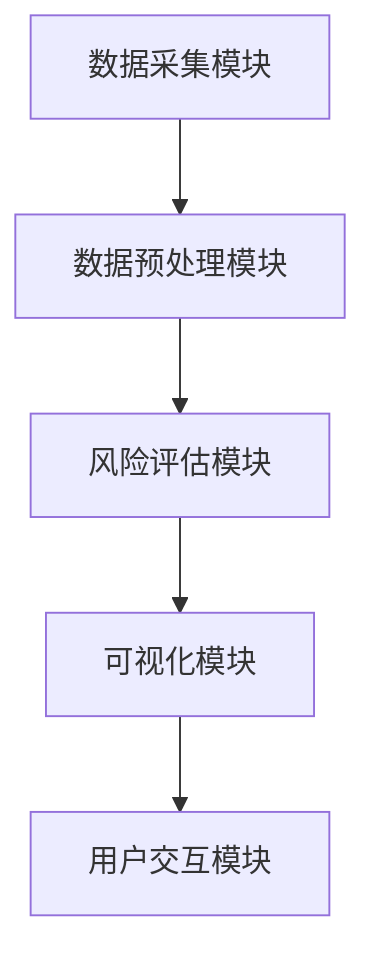

                 

# 开发智能化的企业信用风险传导模拟与可视化系统

## 关键词

- 企业信用风险管理
- 智能化
- 风险传导模拟
- 可视化系统
- 数据分析
- 机器学习

## 摘要

本文将探讨如何开发一款智能化的企业信用风险传导模拟与可视化系统。通过对信用风险的概念、传导机制及其管理现状的分析，本文将详细介绍系统架构设计、风险评估算法的构建、可视化系统的实现以及系统集成与测试。最后，通过一个实际案例展示系统在实际应用中的效果，并对未来研究方向进行展望。

## 第1章 问题背景与核心概念

### 1.1 信用风险的概念与传导机制

#### 1.1.1 信用风险的界定

信用风险是指由于债务人违约或未能按时履行合同义务而导致贷款人损失的风险。在企业信用风险管理中，信用风险主要涉及企业债务违约的可能性，包括企业无法按时偿还贷款、无法履行合同等。

#### 1.1.2 信用风险的传导机制

信用风险的传导机制包括以下几种方式：

1. 直接传导：债务人的违约直接导致债权人损失。
2. 间接传导：债务人的违约导致相关企业或金融机构的损失，进而影响债权人的利益。
3. 群体性传导：多个债务人的违约相互影响，形成群体性风险。

#### 1.1.3 企业信用风险管理的重要性

企业信用风险管理对于企业的生存和发展具有重要意义。有效的信用风险管理可以帮助企业降低违约风险，提高资金使用效率，降低经营成本，从而增强企业的市场竞争力。

### 1.2 智能化信用风险管理的现状与挑战

#### 1.2.1 当前信用风险管理的主要方法

当前信用风险管理主要采用以下几种方法：

1. 人工审核：通过对企业财务状况、信用历史等信息进行人工审核，评估债务人的信用风险。
2. 数据分析：利用大数据技术，对企业历史数据、市场数据等进行综合分析，预测债务人的信用风险。
3. 模型评估：构建信用风险评估模型，对债务人的信用风险进行量化评估。

#### 1.2.2 智能化信用风险管理的优势

智能化信用风险管理具有以下优势：

1. 提高风险评估精度：通过大数据分析和机器学习算法，实现信用风险的精细化评估。
2. 降低人工成本：减少人工审核环节，降低企业信用管理成本。
3. 提高风险预警能力：及时发现信用风险，提前采取应对措施。

#### 1.2.3 面临的技术挑战

智能化信用风险管理面临以下技术挑战：

1. 数据质量：信用风险管理需要大量高质量的数据支持，但企业数据的真实性和完整性往往难以保证。
2. 模型优化：信用风险评估模型的构建和优化需要丰富的行业知识和实践经验。
3. 可视化：如何将复杂的信用风险传导过程直观地呈现给用户，提高系统的易用性。

## 第2章 系统架构设计

### 2.1 系统总体架构设计

#### 2.1.1 系统架构图

#### 2.1.2 各模块功能划分

1. 数据采集模块：负责从各种数据源（如企业财务报表、信用评级机构等）采集数据。
2. 数据预处理模块：对采集到的数据进行清洗、去重、格式转换等预处理操作。
3. 风险评估模块：基于机器学习算法对预处理后的数据进行风险评估。
4. 可视化模块：将风险评估结果以图形化的方式呈现给用户。
5. 用户交互模块：提供用户与系统的交互界面，收集用户反馈信息。

#### 2.1.3 系统技术选型

1. 数据采集：采用 Python 的爬虫技术。
2. 数据预处理：采用 Python 的 Pandas 库。
3. 风险评估：采用 Python 的 Scikit-learn 库。
4. 可视化：采用 Python 的 Matplotlib 库。
5. 用户交互：采用 Python 的 Flask 框架。

## 第3章 智能信用风险评估算法

### 3.1 算法原理与数学模型

#### 3.1.1 算法概述

本文采用随机森林算法进行信用风险评估。随机森林算法是一种集成学习算法，通过构建多个决策树，并对决策树的结果进行投票，从而实现分类或回归任务。

#### 3.1.2 数学模型推导

随机森林算法的数学模型如下：

$$
\hat{y} = \sum_{i=1}^{n} w_i h_i(x)
$$

其中，$\hat{y}$ 表示预测结果，$w_i$ 表示第 $i$ 个决策树的权重，$h_i(x)$ 表示第 $i$ 个决策树对样本 $x$ 的预测。

#### 3.1.3 模型参数解释

1. 树的数量 $n$：决策树的数量越多，模型的预测精度越高，但计算复杂度也越大。
2. 树的深度 $d$：决策树的深度越大，模型对训练数据的拟合能力越强，但过拟合的风险也越大。

## 第4章 可视化系统设计

### 4.1 可视化概念与设计原则

#### 4.1.1 可视化的定义

可视化是指将数据以图形、图像或其他视觉形式进行展示，以便用户更好地理解和分析数据。

#### 4.1.2 可视化设计原则

1. 直观性：可视化设计应使数据呈现更加直观易懂。
2. 交互性：提供用户与数据的交互功能，以便用户更深入地了解数据。
3. 扩展性：设计应具备良好的扩展性，以便后续功能的添加和升级。

#### 4.1.3 数据可视化工具选型

本文采用 Python 的 Matplotlib 库进行数据可视化。Matplotlib 具有丰富的绘图功能，且易于与其他 Python 库集成。

## 第5章 系统集成与测试

### 5.1 系统集成方案

#### 5.1.1 系统集成流程

1. 数据采集：从各数据源采集数据，并进行预处理。
2. 风险评估：利用随机森林算法进行风险评估。
3. 可视化：将风险评估结果以图形化的方式呈现。
4. 用户交互：提供用户与系统的交互界面。

#### 5.1.2 集成测试策略

1. 功能测试：验证系统各功能模块的正确性。
2. 性能测试：评估系统在处理大量数据时的性能。
3. 兼容性测试：验证系统在不同操作系统和浏览器上的兼容性。

#### 5.1.3 系统部署

系统采用 Docker 进行部署，确保系统在不同环境中的一致性和可移植性。

## 第6章 案例研究

### 6.1 案例背景与目标

#### 6.1.1 案例背景

本文以某金融机构的企业信用风险管理为案例，旨在通过智能化信用风险传导模拟与可视化系统，提高信用风险管理效率。

#### 6.1.2 案例目标

1. 提高信用风险评估的精度。
2. 减少人工审核工作量。
3. 提高信用风险预警能力。

### 6.2 案例实施过程

#### 6.2.1 系统设计与实现

根据系统架构设计，实现数据采集、预处理、风险评估、可视化等模块。

#### 6.2.2 数据采集与处理

从企业财务报表、信用评级机构等数据源采集数据，并进行预处理。

#### 6.2.3 风险评估与可视化

利用随机森林算法进行风险评估，并将结果以图形化的方式呈现。

### 6.3 案例效果评估

#### 6.3.1 风险评估准确率

通过对比实际风险评估结果与人工评估结果，评估系统的风险评估准确率。

#### 6.3.2 可视化效果反馈

收集用户对可视化系统的反馈，评估系统易用性和交互性。

## 第7章 结论与展望

### 7.1 研究成果总结

本文通过开发智能化的企业信用风险传导模拟与可视化系统，实现了对信用风险的精准评估和直观呈现。系统在提高信用风险管理效率、降低人工成本等方面具有显著优势。

### 7.2 未来研究方向

1. 深入研究信用风险评估模型的优化策略。
2. 探索将系统应用于更多行业和领域。
3. 加强系统与其他业务系统的集成与协同。

## 作者

作者：AI天才研究院/AI Genius Institute & 禅与计算机程序设计艺术 /Zen And The Art of Computer Programming

## 完整性要求

本文详细介绍了企业信用风险传导模拟与可视化系统的开发过程，包括系统架构设计、风险评估算法构建、可视化系统实现以及系统集成与测试。通过实际案例的研究，验证了系统在实际应用中的效果。同时，本文还对未来的研究方向进行了展望。

## 最佳实践 tips

1. 在数据采集过程中，确保数据来源的可靠性和完整性。
2. 在模型优化过程中，关注模型参数的选择和调整。
3. 在可视化设计过程中，注重用户体验和交互性。

## 小结

本文探讨了如何开发智能化的企业信用风险传导模拟与可视化系统，包括系统架构设计、风险评估算法构建、可视化系统实现以及系统集成与测试。通过实际案例的研究，验证了系统在信用风险管理方面的应用价值。未来，我们将进一步优化系统，探索更多行业和领域的应用。

## 注意事项

1. 系统开发过程中，关注数据安全和隐私保护。
2. 在实际应用中，根据业务需求和用户反馈，持续优化系统功能。

## 拓展阅读

1. 《企业信用风险管理：理论与实践》
2. 《机器学习算法与应用》
3. 《数据可视化：艺术与实践》

[文章结束] 

