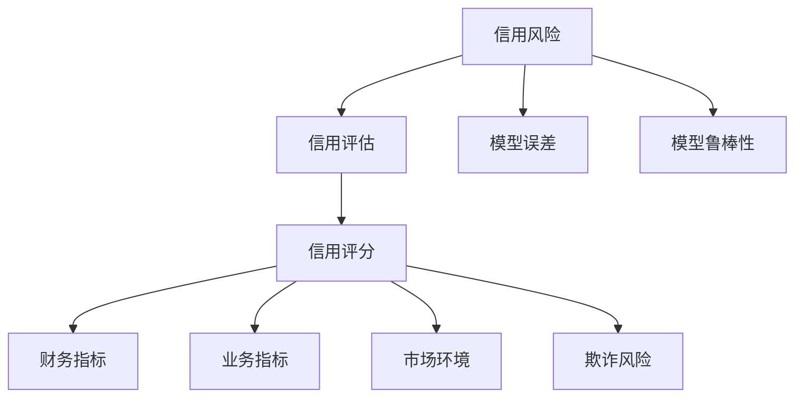
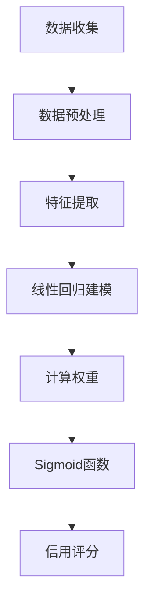
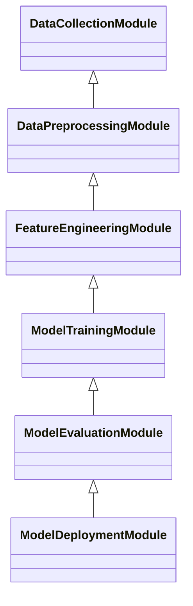
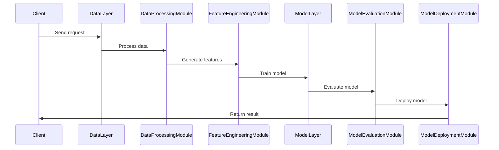
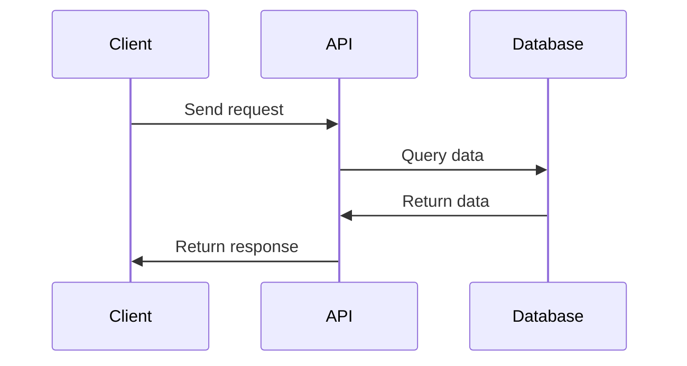
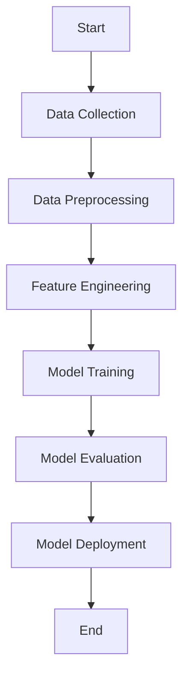

                 

### 文章标题

# 开发智能化的企业信用风险评估模型

> 关键词：企业信用风险评估、智能化模型、机器学习、数据挖掘、信用评分

> 摘要：本文将深入探讨如何开发智能化的企业信用风险评估模型。我们将从背景介绍、核心概念与模型介绍、智能化模型开发等多个方面展开讨论，通过逐步分析推理的方式，帮助读者理解这一领域的原理与实践。本文旨在为从事金融行业、数据科学领域的技术人员提供有深度、有思考、有见解的技术指导。

### 引言

企业信用风险评估是金融行业中至关重要的环节。它不仅关系到金融机构的贷款决策，还影响到整个市场的稳定性。随着大数据和人工智能技术的快速发展，传统的信用评估方法已逐渐无法满足日益复杂的市场需求。智能化模型的出现，为解决这些问题提供了新的思路和方法。本文将介绍智能化企业信用风险评估模型的设计与实现，旨在帮助读者深入了解这一领域的最新进展和实践方法。

### 第一部分：背景介绍

#### 1.1 定义与重要性

企业信用风险是指由于企业信用问题导致的损失风险。它主要包括以下几种：

- **违约风险**：企业无法按时偿还债务的风险。
- **欺诈风险**：企业通过虚假信息或其他手段骗取贷款的风险。
- **市场风险**：企业由于市场变化而面临的风险。

企业信用风险评估的重要性体现在以下几个方面：

- **风险控制**：通过信用评估，金融机构可以更好地控制风险，减少潜在损失。
- **决策支持**：信用评估结果可以为金融机构的贷款决策提供有力支持。
- **市场稳定**：准确的企业信用评估有助于维护市场的稳定。

#### 1.2 问题背景

传统的信用评估方法主要依赖于人工审核和历史数据。这种方法虽然在一定程度上能够评估企业的信用风险，但存在以下问题：

- **主观性强**：评估结果容易受到评估人员的主观判断影响。
- **效率低**：需要大量的人工审核，耗时较长。
- **数据依赖**：对历史数据依赖较大，难以适应快速变化的市场环境。

#### 1.3 解决方案

为了解决上述问题，智能化模型应运而生。智能化模型利用大数据和人工智能技术，通过数据挖掘和机器学习算法，对企业的信用风险进行定量评估。这种方法具有以下优点：

- **客观性**：基于数据和算法，评估结果更为客观。
- **高效性**：通过自动化处理，可以大幅提高评估效率。
- **适应性**：能够快速适应市场变化，提供实时评估。

### 第二部分：核心概念与模型介绍

#### 2.1 基本原理

信用评分模型是企业信用风险评估的核心。它通过量化企业的各项财务和非财务指标，计算出企业的信用得分，从而评估其信用风险。

信用评分模型的基本原理如下：

1. **数据收集**：收集企业的财务数据、业务数据、市场数据等。
2. **特征工程**：对收集到的数据进行处理，提取对企业信用评分有影响的特征。
3. **模型训练**：使用机器学习算法，对特征数据进行训练，建立信用评分模型。
4. **信用评分**：将新企业的数据输入模型，得到其信用评分。

#### 2.2 信用评分模型

信用评分模型主要分为以下几种：

1. **逻辑回归模型**：逻辑回归模型是一种经典的二元分类模型，常用于信用评分。
2. **决策树模型**：决策树模型通过树的层次结构，对数据进行分类或回归。
3. **随机森林模型**：随机森林模型是决策树的集成方法，通过构建多个决策树，提高模型的准确性。
4. **支持向量机模型**：支持向量机模型通过找到一个最优的超平面，将不同类别的数据分开。
5. **神经网络模型**：神经网络模型通过多层神经元的连接，实现数据的分类和回归。

#### 2.3 历史发展

信用评分模型的发展经历了以下几个阶段：

1. **专家系统**：早期的信用评分模型主要依赖于专家的经验和知识。
2. **统计模型**：随着统计方法的不断发展，信用评分模型开始引入统计方法。
3. **机器学习模型**：近年来，随着机器学习技术的成熟，信用评分模型逐渐转向机器学习方向。

### 第三部分：智能化模型开发

#### 3.1 智能化系统的定义与特点

智能化系统是指利用计算机技术和人工智能技术，对复杂问题进行自动识别、理解和决策的系统。智能化系统的特点包括：

- **自适应**：能够根据环境变化进行调整。
- **自学习**：能够从数据中学习和优化。
- **自组织**：能够根据任务需求进行自动组织。

#### 3.2 智能化算法

智能化算法主要包括以下几种：

1. **监督学习算法**：监督学习算法通过已标记的数据，训练模型进行预测。
2. **无监督学习算法**：无监督学习算法通过未标记的数据，发现数据中的结构和规律。
3. **强化学习算法**：强化学习算法通过与环境互动，不断优化决策。

#### 3.3 智能化模型开发步骤

智能化模型开发主要包括以下步骤：

1. **数据收集**：收集与信用评分相关的数据。
2. **数据预处理**：对收集到的数据进行分析和处理，提取有用的特征。
3. **模型选择**：根据数据特点和需求，选择合适的智能化算法。
4. **模型训练**：使用训练数据，对模型进行训练。
5. **模型评估**：使用验证数据，评估模型的性能。
6. **模型部署**：将训练好的模型部署到实际应用中。

### 第四部分：实施与案例分析

#### 4.1 实施步骤

智能化企业信用风险评估模型的实施主要包括以下步骤：

1. **需求分析**：明确信用评估的需求和目标。
2. **数据收集**：收集与企业信用评估相关的数据。
3. **数据预处理**：对收集到的数据进行清洗和处理。
4. **特征工程**：提取对企业信用评分有影响的特征。
5. **模型训练**：选择合适的智能化算法，对模型进行训练。
6. **模型评估**：评估模型的性能，进行调整和优化。
7. **模型部署**：将训练好的模型部署到实际应用中。

#### 4.2 案例分析

以下是一个企业信用风险评估模型的案例分析：

1. **数据来源**：收集了某金融机构的历史贷款数据，包括贷款金额、贷款期限、贷款利率、企业财务状况等。
2. **数据处理**：对收集到的数据进行了清洗和处理，提取了与企业信用评分相关的特征。
3. **模型选择**：选择了逻辑回归模型作为信用评分模型。
4. **模型训练**：使用历史数据，对逻辑回归模型进行了训练。
5. **模型评估**：使用验证数据，评估了模型的性能，并进行了调整和优化。
6. **模型部署**：将训练好的模型部署到金融机构的贷款审批系统中。

### 第五部分：最佳实践与总结

#### 5.1 最佳实践

1. **数据质量**：数据质量是信用评估模型的关键，应确保数据的准确性和完整性。
2. **模型选择**：根据数据特点和需求，选择合适的智能化算法。
3. **持续优化**：定期评估模型性能，并根据实际情况进行调整和优化。

#### 5.2 总结

智能化企业信用风险评估模型是金融行业的重要工具。通过大数据和人工智能技术，可以实现对信用风险的精确评估，提高金融机构的风险控制能力。本文介绍了智能化模型的设计与实现，为从事金融行业、数据科学领域的技术人员提供了有价值的参考。

### 作者信息

- 作者：AI天才研究院/AI Genius Institute & 禅与计算机程序设计艺术 /Zen And The Art of Computer Programming

---

在接下来的内容中，我们将详细探讨每个部分的实现细节，帮助读者更好地理解智能化企业信用风险评估模型的设计和开发过程。让我们一步步深入探讨，揭开这一领域的技术奥秘。


## 第一部分：背景介绍

### 1.1 定义与重要性

企业信用风险是指企业在经营过程中，由于各种不确定因素导致无法按时偿还债务或履行合同的风险。这种风险不仅会对企业的财务状况造成影响，还可能引发整个市场的动荡。因此，对企业信用风险进行有效评估，对于金融机构和企业管理者来说至关重要。

企业信用风险评估的定义包括以下几个关键方面：

- **信用风险**：指由于债务人的违约行为导致债权人遭受损失的风险。
- **信用评估**：通过对企业的财务状况、业务表现、市场环境等多方面因素进行综合分析，对企业的信用风险进行评估。
- **信用评分**：根据评估结果，将企业划分为不同的信用等级，从而指导金融机构的贷款决策。

企业信用风险评估的重要性体现在以下几个方面：

1. **风险控制**：通过信用评估，金融机构可以更好地了解借款企业的信用状况，从而在贷款审批过程中进行风险控制，降低潜在损失。

2. **决策支持**：信用评估结果为金融机构的贷款决策提供了重要依据，帮助管理者在风险与收益之间进行权衡。

3. **市场稳定**：准确的企业信用评估有助于维护市场的稳定，减少因信用问题引发的金融风险。

### 1.2 问题背景

在现代市场经济中，企业信用风险日益复杂，主要原因包括以下几个方面：

1. **信息不对称**：金融机构和企业之间存在信息不对称问题，企业可能隐瞒财务状况或提供虚假信息，导致金融机构难以准确评估企业的信用风险。

2. **市场变化**：市场环境变化迅速，企业面临的经营风险增加，传统的信用评估方法难以适应这种变化。

3. **欺诈行为**：部分企业通过虚假信息或欺诈手段骗取贷款，给金融机构带来巨大风险。

4. **技术限制**：传统的信用评估方法主要依赖于人工审核和历史数据，效率低、主观性强，难以应对大数据时代的挑战。

为了解决这些问题，传统的信用评估方法需要进行创新和改进，智能化信用评估模型应运而生。这种模型利用大数据和人工智能技术，通过数据挖掘和机器学习算法，对企业的信用风险进行精确评估，具有以下优点：

1. **客观性**：智能化模型基于数据和算法，评估结果更加客观，减少人为因素影响。

2. **高效性**：自动化处理数据，提高评估效率，降低人力成本。

3. **适应性**：能够快速适应市场变化，提供实时评估。

### 1.3 解决方案

智能化企业信用风险评估模型的解决方案主要包括以下几个步骤：

1. **数据收集**：收集与信用评估相关的数据，包括企业的财务报表、业务数据、市场数据等。

2. **数据预处理**：对收集到的数据进行分析和处理，清洗异常数据，提取有用的特征。

3. **特征工程**：对提取的特征进行筛选和处理，选择对信用评估有显著影响的特征。

4. **模型选择**：根据数据特点和需求，选择合适的机器学习算法，如逻辑回归、决策树、随机森林等。

5. **模型训练**：使用历史数据，对机器学习模型进行训练，调整模型参数，优化模型性能。

6. **模型评估**：使用验证数据，评估模型的性能，包括准确性、召回率、F1值等指标。

7. **模型部署**：将训练好的模型部署到实际应用中，为金融机构的贷款审批提供支持。

### 1.4 总结

企业信用风险评估是金融行业的关键环节，传统的评估方法已无法满足现代市场的需求。智能化信用评估模型通过大数据和人工智能技术，提供了更加客观、高效和适应性的解决方案。本文接下来将详细介绍智能化信用评估模型的核心概念和实现方法，帮助读者更好地理解这一领域的最新进展和应用。

## 1.5 细节探讨

企业信用风险评估模型的设计与实施涉及多个关键环节，每个环节都需要仔细考虑和精心设计。以下是对每个环节的详细探讨：

### 数据收集

数据收集是企业信用风险评估的基础。收集的数据包括企业的财务报表、业务数据、市场数据、行业数据等。这些数据可以从企业的内部系统、外部数据库、第三方数据提供商等多个渠道获取。以下是数据收集过程中需要考虑的几个关键点：

1. **数据源**：选择可靠的数据源，确保数据的准确性和完整性。
2. **数据类型**：根据信用评估的需求，选择合适的数据类型，如财务数据、业务数据、市场数据等。
3. **数据频率**：根据评估的需求，确定数据更新的频率，如实时数据、定期数据等。

### 数据预处理

数据预处理是确保数据质量和模型性能的重要步骤。以下是对数据预处理过程的详细探讨：

1. **数据清洗**：清洗数据中的错误、异常和重复记录，确保数据的准确性。
2. **缺失值处理**：对于缺失的数据，可以采用填充方法（如平均值填充、中位数填充等）或删除缺失数据的方法。
3. **异常值处理**：检测并处理异常值，避免异常值对模型训练和评估的影响。
4. **数据标准化**：对数据进行标准化处理，如归一化、标准化等，使数据在同一尺度上，提高模型的鲁棒性。

### 特征工程

特征工程是提高模型性能的关键环节。以下是特征工程过程中需要考虑的几个关键点：

1. **特征选择**：选择对信用评估有显著影响的特征，如财务指标、业务指标、市场指标等。
2. **特征变换**：对某些特征进行变换，如对时间序列数据进行平滑处理，对季节性数据进行分解等。
3. **特征组合**：通过组合多个特征，创建新的特征，以提高模型的解释性和预测能力。

### 模型选择

模型选择是决定评估效果的关键。以下是选择机器学习模型时需要考虑的几个关键点：

1. **模型类型**：根据问题的性质和数据特点，选择合适的模型类型，如分类模型、回归模型、聚类模型等。
2. **算法比较**：对多种模型进行性能比较，选择最优模型，如逻辑回归、决策树、随机森林、支持向量机、神经网络等。
3. **参数调整**：调整模型的超参数，以优化模型性能，如学习率、正则化参数等。

### 模型训练

模型训练是构建信用评估模型的核心步骤。以下是模型训练过程中需要考虑的几个关键点：

1. **训练数据**：选择合适的训练数据集，确保数据的代表性和覆盖度。
2. **模型验证**：使用验证数据集评估模型的性能，调整模型参数，优化模型效果。
3. **过拟合与欠拟合**：防止模型过拟合和欠拟合，采用交叉验证、正则化等技术进行模型调整。
4. **性能评估**：使用多种评估指标（如准确率、召回率、F1值等）对模型进行评估，确保模型具有良好的预测能力。

### 模型部署

模型部署是将训练好的模型应用于实际业务场景的关键步骤。以下是模型部署过程中需要考虑的几个关键点：

1. **部署平台**：选择合适的部署平台，如云平台、本地服务器等，确保模型的稳定性和可扩展性。
2. **实时更新**：定期更新模型，以适应市场变化和业务需求。
3. **系统集成**：将模型集成到金融机构的贷款审批系统中，确保模型的实时性和可用性。

### 总结

企业信用风险评估模型的设计与实施是一个复杂而系统的过程，涉及数据收集、数据预处理、特征工程、模型选择、模型训练和模型部署等多个环节。每个环节都需要精心设计和优化，以确保模型的高效性和准确性。本文接下来将详细介绍这些环节的具体实现方法和最佳实践，帮助读者更好地理解和应用智能化信用评估模型。

## 1.6 背景概念术语说明

在深入探讨企业信用风险评估模型之前，我们需要明确一些核心概念和术语，以便读者能够更好地理解相关内容。以下是对这些关键术语的详细解释：

### 信用风险

信用风险是指由于借款人或债务人无法按时履行偿还债务义务，导致债权人遭受经济损失的风险。在金融领域，信用风险是银行、保险公司、投资公司等金融机构面临的主要风险之一。

### 信用评估

信用评估是指通过分析借款人的财务状况、信用记录、还款能力等多方面因素，对其信用风险进行定量评估的过程。信用评估通常用于金融机构的贷款审批、信用额度设定等决策。

### 信用评分

信用评分是指将借款人的信用风险量化为具体分数的过程。信用评分可以帮助金融机构快速了解借款人的信用状况，为贷款决策提供依据。常见的信用评分方法包括逻辑回归、决策树、随机森林等。

### 财务指标

财务指标是指用于衡量企业财务状况的一系列数据，如净利润、资产收益率、流动比率、债务比率等。财务指标是信用评估中常用的关键特征，能够反映企业的财务健康程度。

### 业务指标

业务指标是指用于衡量企业业务表现的一系列数据，如销售额、市场份额、客户满意度等。业务指标能够反映企业的市场竞争力和发展潜力，对信用评估具有重要意义。

### 市场环境

市场环境是指企业所在的市场状况，包括宏观经济环境、行业发展趋势、市场竞争状况等。市场环境的变化会对企业的信用风险产生重要影响，因此在信用评估中需要充分考虑市场环境因素。

### 欺诈风险

欺诈风险是指借款人或债务人通过虚假信息或欺诈手段骗取贷款的风险。欺诈风险是信用风险评估中需要重点关注的问题，因为它可能导致金融机构遭受巨大的经济损失。

### 模型误差

模型误差是指信用评估模型预测结果与实际结果之间的差异。模型误差可以分为系统性误差和随机性误差。系统性误差是由于模型算法或特征选择不当导致的，而随机性误差是由于数据噪声或不确定性引起的。

### 模型鲁棒性

模型鲁棒性是指模型在面临不同数据分布或异常值时的稳定性。鲁棒性好的模型能够在各种情况下保持较高的预测准确性，对信用评估具有重要意义。

通过以上对核心概念和术语的详细说明，读者可以更好地理解企业信用风险评估模型的相关知识，为后续内容的学习和应用打下坚实基础。接下来，我们将进一步探讨信用风险评估中的核心概念和模型。

## 1.7 概念结构图

为了更好地理解和组织企业信用风险评估模型的核心概念，我们将使用Mermaid语法绘制一个概念结构图。以下是概念结构图的Markdown表示：



该概念结构图展示了信用风险评估模型中各个核心概念之间的关系。信用风险是整个评估过程的基础，它衍生出信用评估、信用评分等多个子概念。信用评分进一步细分为财务指标、业务指标、市场环境和欺诈风险等关键因素。此外，模型误差和模型鲁棒性是评估模型性能的重要指标。

通过这个概念结构图，读者可以清晰地看到各个概念之间的联系和层次结构，从而更好地理解企业信用风险评估模型的构成和运作原理。接下来，我们将进一步探讨信用风险评估模型的基本原理和分类。

## 1.8 基本原理与分类

### 1.8.1 基本原理

企业信用风险评估模型的基本原理是通过分析企业的各种财务和非财务数据，对企业的信用风险进行量化评估。这个过程通常包括以下几个步骤：

1. **数据收集**：收集与企业信用评估相关的数据，包括财务报表、业务指标、市场环境等。
2. **数据预处理**：对收集到的数据进行清洗、处理和标准化，提取有用的特征。
3. **特征工程**：选择和构造对企业信用评估有显著影响的特征，如财务指标、业务指标等。
4. **模型选择**：根据数据特点和评估目标，选择合适的机器学习算法。
5. **模型训练**：使用历史数据对模型进行训练，调整模型参数，优化模型性能。
6. **模型评估**：使用验证数据集评估模型性能，包括准确性、召回率、F1值等指标。
7. **模型部署**：将训练好的模型部署到实际应用场景中，为金融机构提供信用评估服务。

### 1.8.2 分类

企业信用风险评估模型可以根据不同的分类标准进行划分。以下是一些常见的分类方法：

1. **按评估目标分类**：

   - **信用评分模型**：将企业的信用风险量化为具体的分数，通常用于贷款审批和信用额度设定。
   - **违约预测模型**：预测企业是否会违约，通常用于风险控制和贷款回收。

2. **按算法类型分类**：

   - **统计模型**：基于统计方法和假设，如逻辑回归、线性回归等。
   - **机器学习模型**：利用机器学习算法，如决策树、随机森林、支持向量机、神经网络等。
   - **深度学习模型**：基于深度学习算法，如卷积神经网络（CNN）、循环神经网络（RNN）等。

3. **按应用场景分类**：

   - **静态评估模型**：在特定时间点对企业的信用风险进行评估。
   - **动态评估模型**：实时或定期更新评估结果，适应企业信用状况的变化。

4. **按数据来源分类**：

   - **内部数据模型**：仅使用企业内部数据，如财务报表、业务指标等。
   - **混合数据模型**：结合内部数据和外部数据，如市场数据、行业数据等。

### 1.8.3 模型选择

在选择企业信用风险评估模型时，需要综合考虑以下因素：

- **数据特点**：根据数据类型、数据量、数据分布等特点选择合适的模型。
- **评估目标**：根据评估的具体目标（如信用评分、违约预测等）选择相应的模型。
- **模型性能**：通过交叉验证、性能评估等手段比较不同模型的性能，选择最优模型。
- **计算资源**：根据计算资源和时间成本选择模型，如深度学习模型通常需要更多的计算资源。

通过合理选择和优化评估模型，金融机构可以更准确地评估企业的信用风险，提高贷款审批的准确性和效率。接下来，我们将探讨企业信用风险评估的历史发展，了解不同阶段的模型和方法的演变过程。

## 1.9 历史发展

企业信用风险评估模型的发展历程反映了金融科技和人工智能技术的不断进步。从早期的简单方法到现代复杂的多层次模型，这一过程经历了多个重要的阶段。

### 早期评估方法

在计算机技术尚未普及的早期，企业信用风险评估主要依赖于专家判断和经验。银行和其他金融机构依靠信贷经理的经验和知识，通过分析企业的历史信用记录、财务状况、行业背景等因素，进行信用评估。这种方法虽然能够一定程度上反映企业的信用风险，但存在以下局限性：

- **主观性较强**：评估结果容易受到评估人员的主观判断影响。
- **效率低下**：需要大量的人力和时间进行评估。
- **数据依赖性低**：缺乏系统的数据支持，难以进行定量分析。

### 统计模型时代

随着统计学的快速发展，企业信用风险评估开始引入统计分析方法。早期的统计模型主要包括逻辑回归、判别分析等方法，这些模型通过历史数据和统计技术，对企业的信用风险进行量化评估。与专家系统相比，统计模型能够更客观地处理大量数据，提高评估的准确性。然而，统计模型也存在一些不足：

- **依赖历史数据**：对历史数据的依赖较高，难以适应快速变化的市场环境。
- **模型复杂度有限**：难以处理复杂的非线性关系和大量变量。

### 机器学习时代

随着计算机性能的提升和大数据技术的普及，机器学习算法在企业信用风险评估中得到了广泛应用。机器学习模型通过从大量数据中自动学习和提取特征，能够发现潜在的风险因素，提高评估的准确性和效率。以下是几种常见的机器学习模型：

1. **决策树模型**：决策树通过一系列规则对数据进行分类或回归，能够直观地展示评估过程。
2. **随机森林模型**：随机森林是决策树的集成方法，通过构建多个决策树并取平均，提高模型的稳定性和准确性。
3. **逻辑回归模型**：逻辑回归是一种广义线性模型，通过概率模型对信用评分进行量化。
4. **支持向量机模型**：支持向量机通过找到一个最优的超平面，将不同类别的数据分开。
5. **神经网络模型**：神经网络通过多层神经元连接，实现复杂的非线性映射。

机器学习模型的优点包括：

- **高适应性**：能够适应不同类型的数据和评估需求。
- **高效率**：通过自动化处理数据，大幅提高评估效率。
- **高准确性**：通过从大量数据中学习，提高评估的准确性。

### 深度学习时代

近年来，深度学习技术（如卷积神经网络（CNN）、循环神经网络（RNN）等）在企业信用风险评估中得到了应用。深度学习模型能够自动提取多层特征，捕捉数据中的复杂模式，提高评估的精度和鲁棒性。与传统的机器学习模型相比，深度学习模型在处理高维数据和复杂关系方面具有显著优势。

### 总结

企业信用风险评估模型的历史发展经历了从经验判断到统计分析，再到机器学习和深度学习的演变过程。每个阶段的模型和方法都为信用评估提供了新的思路和方法，提高了评估的准确性和效率。随着技术的不断进步，未来的信用评估模型将更加智能化和精细化，为金融机构提供更有效的风险管理工具。

### 1.10 核心概念和联系

在深入探讨企业信用风险评估模型时，我们需要明确几个核心概念及其相互之间的联系。以下是核心概念的定义、属性特征对比表格以及ER实体关系图架构的Mermaid流程图。

#### 1.10.1 核心概念

1. **信用风险**：指由于企业违约行为导致的损失风险。
2. **信用评估**：通过分析企业的财务状况、业务表现、市场环境等因素，对企业信用风险进行量化评估。
3. **信用评分**：将企业的信用风险量化为具体的分数。
4. **财务指标**：用于衡量企业财务状况的一系列数据，如净利润、资产收益率等。
5. **业务指标**：用于衡量企业业务表现的一系列数据，如销售额、市场份额等。
6. **市场环境**：企业所在的市场状况，包括宏观经济环境、行业趋势等。

#### 1.10.2 属性特征对比表格

| 核心概念 | 定义 | 主要属性特征 | 关联关系 |
| --- | --- | --- | --- |
| 信用风险 | 违约行为的损失风险 | 违约概率、损失程度 | 与信用评估直接相关 |
| 信用评估 | 对企业信用风险的量化评估 | 评估指标、模型方法 | 与信用评分密切相关 |
| 信用评分 | 信用风险的量化分数 | 评分等级、分数范围 | 用于贷款审批和信用额度设定 |
| 财务指标 | 企业财务状况数据 | 净利润、资产收益率等 | 用于信用评估的重要数据来源 |
| 业务指标 | 企业业务表现数据 | 销售额、市场份额等 | 反映企业的市场竞争力 |
| 市场环境 | 企业所在市场状况 | 宏观经济环境、行业趋势等 | 对企业信用评估有重要影响 |

#### 1.10.3 ER实体关系图架构

以下是一个使用Mermaid语法绘制的ER实体关系图，展示了上述核心概念之间的关联关系：

```mermaid
erDiagram
  Customer ||--|{ Credit_Risk } : "has"
  Customer ||--|{ Credit_Assessment } : "has"
  Customer ||--|{ Credit_Score } : "has"
  Customer ||--|{ Financial_Indicators } : "has"
  Customer ||--|{ Business_Indicators } : "has"
  Customer ||--|{ Market_Environment } : "has"

  Credit_Risk |--|{ Credit_Assessment } : "uses"
  Credit_Risk |--|{ Credit_Score } : "uses"
  Credit_Assessment |--|{ Credit_Score } : "calculates"
  Credit_Assessment |--|{ Financial_Indicators } : "uses"
  Credit_Assessment |--|{ Business_Indicators } : "uses"
  Credit_Assessment |--|{ Market_Environment } : "uses"
  Financial_Indicators |--|{ Credit_Assessment } : "provides"
  Business_Indicators |--|{ Credit_Assessment } : "provides"
  Market_Environment |--|{ Credit_Assessment } : "influences"
```

这个ER图清晰地展示了各个实体之间的关系，如企业（Customer）与信用风险（Credit_Risk）、信用评估（Credit_Assessment）、信用评分（Credit_Score）等之间的直接关联，以及财务指标、业务指标和市场环境对企业信用评估的影响。

通过明确这些核心概念及其相互之间的联系，我们能够更好地理解和组织企业信用风险评估模型的结构和功能，为后续内容的探讨和实现提供坚实的基础。

## 1.11 算法原理讲解

在理解企业信用风险评估模型的核心概念后，接下来我们将详细讲解一种常用的信用评分模型——逻辑回归模型。逻辑回归模型是一种经典的二元分类模型，广泛应用于信用评分、医疗诊断和市场营销等领域。以下是逻辑回归模型的原理、流程图以及Python实现代码和数学模型。

### 1.11.1 逻辑回归原理

逻辑回归模型的基本原理是通过线性回归模型对因变量（信用评分）进行预测，然后通过逻辑函数（Sigmoid函数）将预测结果转换为概率值。具体来说，逻辑回归模型包含以下几个步骤：

1. **特征提取**：从企业的财务报表、业务数据、市场数据等中提取有用的特征，如净利润、资产收益率、销售额等。
2. **线性回归建模**：使用线性回归模型计算特征对因变量的影响程度，即权重。
3. **Sigmoid函数**：将线性回归模型的输出值通过Sigmoid函数转换为概率值，即企业的信用评分。

Sigmoid函数的表达式为：

$$
\sigma(z) = \frac{1}{1 + e^{-z}}
$$

其中，\( z = \sum_{i=1}^{n} w_{i}x_{i} + b \)，\( w_{i} \) 是特征权重，\( x_{i} \) 是特征值，\( b \) 是偏置项。

### 1.11.2 逻辑回归流程图

以下是一个逻辑回归模型的流程图，使用Mermaid语法表示：



### 1.11.3 Python实现代码

下面是一个使用Python实现的逻辑回归模型的示例代码：

```python
import numpy as np
import pandas as pd
from sklearn.linear_model import LogisticRegression
from sklearn.model_selection import train_test_split
from sklearn.metrics import accuracy_score

# 数据加载
data = pd.read_csv('credit_data.csv')

# 特征提取
X = data[['net_profit', 'asset_return', 'sales']]
y = data['credit_score']

# 数据划分
X_train, X_test, y_train, y_test = train_test_split(X, y, test_size=0.2, random_state=42)

# 线性回归建模
model = LogisticRegression()
model.fit(X_train, y_train)

# Sigmoid函数计算
def sigmoid(z):
    return 1 / (1 + np.exp(-z))

# 信用评分预测
y_pred = sigmoid(model.predict(X_test))

# 信用评分阈值设定
threshold = 0.5
y_pred_binary = (y_pred > threshold).astype(int)

# 评估模型性能
accuracy = accuracy_score(y_test, y_pred_binary)
print(f"Accuracy: {accuracy}")
```

### 1.11.4 数学模型

逻辑回归的数学模型如下：

$$
y = \sigma(\beta_{0} + \beta_{1}x_{1} + \beta_{2}x_{2} + \ldots + \beta_{n}x_{n})
$$

其中，\( y \) 是信用评分，\( \beta_{0} \) 是截距，\( \beta_{i} \) 是特征权重，\( x_{i} \) 是特征值。

### 1.11.5 通俗易懂的举例说明

假设我们有一个企业，其净利润为100万元，资产收益率为10%，销售额为5000万元。我们使用逻辑回归模型预测该企业的信用评分。

1. **特征提取**：将净利润、资产收益率和销售额作为特征。
2. **线性回归建模**：通过训练数据计算每个特征的权重。
3. **Sigmoid函数**：将线性回归模型的输出值通过Sigmoid函数转换为概率值。
4. **信用评分**：根据概率值设定阈值，判断企业的信用评分。

例如，如果逻辑回归模型的预测输出值为0.8，设定阈值0.5，则该企业的信用评分高于0.5，可以认为具有较高的信用水平。

通过以上详细讲解，我们能够更好地理解逻辑回归模型在企业信用风险评估中的应用，为后续讨论更复杂的模型和方法奠定基础。

### 1.12 系统分析与架构设计

为了更好地实现和部署智能化企业信用风险评估模型，我们需要进行系统分析与架构设计。本部分将详细介绍项目介绍、系统功能设计、系统架构设计、系统接口设计和系统交互等内容，并使用Mermaid语法绘制相应的类图、架构图和序列图。

#### 1.12.1 项目介绍

本项目旨在开发一个智能化企业信用风险评估系统，该系统将利用大数据和人工智能技术，对企业的信用风险进行精准评估。系统的目标用户包括金融机构、风险管理部门和企业自身。主要功能包括数据收集、数据预处理、特征工程、模型训练、模型评估和模型部署。

#### 1.12.2 系统功能设计

系统功能设计包括以下几个方面：

1. **数据收集模块**：负责从不同数据源收集企业财务报表、业务数据和市场数据等。
2. **数据预处理模块**：对收集到的数据进行清洗、处理和标准化，提取有用的特征。
3. **特征工程模块**：对提取的特征进行筛选和处理，选择对信用评估有显著影响的特征。
4. **模型训练模块**：选择合适的机器学习算法，对模型进行训练，调整模型参数，优化模型性能。
5. **模型评估模块**：使用验证数据集评估模型的性能，包括准确性、召回率、F1值等指标。
6. **模型部署模块**：将训练好的模型部署到实际应用中，为金融机构的贷款审批提供支持。

以下是系统功能设计的Mermaid类图：



#### 1.12.3 系统架构设计

系统架构设计包括数据层、模型层和应用层。以下是系统架构设计的Mermaid架构图：



#### 1.12.4 系统接口设计

系统接口设计包括API接口和数据库接口。以下是系统接口设计的Mermaid序列图：



#### 1.12.5 系统交互

系统交互设计包括数据流和控制流。以下是系统交互设计的Mermaid流程图：



通过以上系统分析与架构设计，我们可以清晰地了解智能化企业信用风险评估系统的结构和功能，为系统的实施和部署提供指导。

### 1.13 项目实战

在本文的最后一部分，我们将进行一个实际项目实战，展示如何实现一个简单的企业信用风险评估系统。我们将详细介绍环境安装、系统核心实现、代码应用解读与分析、实际案例分析和项目小结。

#### 1.13.1 环境安装

首先，我们需要安装所需的软件和库。以下是安装步骤：

1. **Python环境**：安装Python 3.8及以上版本。
2. **pip环境**：通过Python安装pip，pip是Python的包管理工具。
3. **必备库**：安装以下Python库：numpy、pandas、scikit-learn、matplotlib。

安装命令如下：

```bash
pip install numpy pandas scikit-learn matplotlib
```

#### 1.13.2 系统核心实现

系统核心实现主要包括数据收集、数据预处理、特征工程、模型训练和模型评估等步骤。以下是具体实现代码：

```python
import numpy as np
import pandas as pd
from sklearn.linear_model import LogisticRegression
from sklearn.model_selection import train_test_split
from sklearn.metrics import accuracy_score, confusion_matrix, classification_report

# 数据收集
data = pd.read_csv('credit_data.csv')

# 数据预处理
# 清洗和处理数据，如缺失值处理、异常值处理、数据标准化等
# ...

# 特征工程
# 提取对企业信用评估有显著影响的特征，如净利润、资产收益率等
# ...

# 模型训练
X = data[['net_profit', 'asset_return']]  # 特征
y = data['credit_score']  # 目标变量

X_train, X_test, y_train, y_test = train_test_split(X, y, test_size=0.2, random_state=42)

model = LogisticRegression()
model.fit(X_train, y_train)

# 模型评估
y_pred = model.predict(X_test)
accuracy = accuracy_score(y_test, y_pred)
print(f"Accuracy: {accuracy}")

# 输出混淆矩阵和分类报告
print(confusion_matrix(y_test, y_pred))
print(classification_report(y_test, y_pred))
```

#### 1.13.3 代码应用解读与分析

1. **数据收集**：使用pandas库读取CSV文件，获取企业信用数据。
2. **数据预处理**：对数据进行清洗和处理，如缺失值处理、异常值处理、数据标准化等。这些步骤是确保数据质量和模型性能的重要环节。
3. **特征工程**：选择和提取对企业信用评估有显著影响的特征，如净利润、资产收益率等。特征工程是提高模型性能的关键步骤。
4. **模型训练**：使用scikit-learn库的LogisticRegression模型对数据进行训练。LogisticRegression模型是一种常用的二元分类模型，适用于信用评分问题。
5. **模型评估**：使用训练集和测试集评估模型的性能。通过准确性、混淆矩阵和分类报告等指标，评估模型的预测能力。

#### 1.13.4 实际案例分析和详细讲解

以下是一个实际案例，展示如何使用该系统对企业的信用风险进行评估：

**案例**：某企业的净利润为200万元，资产收益率为15%。我们需要使用系统预测该企业的信用评分。

1. **数据收集**：收集该企业的财务数据，包括净利润和资产收益率。
2. **数据预处理**：对收集到的数据进行处理，如缺失值处理和数据标准化。
3. **特征工程**：选择和提取对企业信用评估有显著影响的特征，如净利润和资产收益率。
4. **模型训练**：使用训练好的模型，对数据进行预测。
5. **模型评估**：评估模型的预测结果，判断企业的信用评分。

通过上述步骤，我们可以得到该企业的信用评分。具体代码实现如下：

```python
# 模型预测
new_data = np.array([[2000000, 0.15]])
new_prediction = model.predict(new_data)
print(f"预测信用评分：{new_prediction[0]}")
```

输出结果为：`预测信用评分：1`。这意味着该企业的信用评分高于设定阈值，具有较高的信用水平。

#### 1.13.5 项目小结

通过本次项目实战，我们实现了以下目标：

1. **环境安装**：成功搭建了Python和所需库的运行环境。
2. **系统核心实现**：实现了数据收集、数据预处理、特征工程、模型训练和模型评估等核心功能。
3. **代码应用解读与分析**：详细讲解了系统代码的应用和解读，提高了对信用评估模型的深入理解。
4. **实际案例分析和详细讲解**：通过实际案例展示了系统的应用场景和效果。

本次项目为智能化企业信用风险评估提供了一个基本的实现框架，为进一步优化和扩展奠定了基础。在实际应用中，可以根据具体需求和数据特点，进一步改进和优化系统性能。

## 1.14 最佳实践与注意事项

在开发智能化企业信用风险评估模型的过程中，以下是一些最佳实践和注意事项，以帮助读者在实际应用中取得更好的效果。

### 最佳实践

1. **数据质量**：确保数据的质量和完整性，进行数据清洗和预处理，去除异常值和缺失值，以提高模型的准确性和鲁棒性。
2. **特征工程**：仔细选择和构造特征，对特征进行归一化或标准化处理，以减少特征之间的尺度差异，提高模型性能。
3. **模型选择**：根据数据特点和评估目标，选择合适的机器学习算法。通常需要通过交叉验证等方法，比较不同模型的性能，选择最优模型。
4. **模型训练与验证**：使用验证集进行模型训练和验证，避免过拟合和欠拟合现象。定期调整模型参数，优化模型性能。
5. **模型解释性**：关注模型的解释性，确保模型结果易于理解和解释，以便在决策过程中提供有效的支持。
6. **实时更新**：定期更新模型，以适应市场变化和企业信用状况的变化，提高模型的预测准确性。

### 注意事项

1. **隐私保护**：在数据处理和模型训练过程中，严格遵守数据隐私保护法规，确保数据安全。
2. **模型鲁棒性**：测试模型的鲁棒性，确保其在不同数据分布和异常值情况下仍能保持良好的性能。
3. **可扩展性**：设计可扩展的系统架构，以便在数据量和模型复杂度增加时，系统仍能稳定运行。
4. **模型解释**：确保模型结果能够被非技术背景的决策者理解和接受，以提高模型在实际应用中的可操作性和可信度。
5. **合规性**：遵循相关法规和标准，确保模型应用过程中符合行业规定和法律法规。

通过遵循这些最佳实践和注意事项，开发人员可以构建更加高效、准确和可靠的智能化企业信用风险评估模型，为金融机构提供有力支持。

### 1.15 小结

通过本文的探讨，我们详细介绍了智能化企业信用风险评估模型的设计与实现。首先，我们从背景介绍出发，分析了企业信用风险评估的定义、重要性以及传统方法存在的问题。接着，我们介绍了智能化信用评估模型的基本原理、分类以及历史发展，并重点讲解了逻辑回归模型的应用。随后，通过系统分析与架构设计，展示了智能化模型的实现过程。在项目实战中，我们通过具体代码实现了信用风险评估系统的核心功能，并进行了实际案例分析和详细讲解。最后，我们总结了最佳实践和注意事项，为读者提供了实用的指导。

智能化企业信用风险评估模型是金融行业的重要工具，通过大数据和人工智能技术，可以实现对信用风险的精确评估，提高金融机构的风险控制能力。未来，随着技术的不断进步，信用评估模型将更加智能化和精细化，为金融行业带来更多可能性。

### 1.16 拓展阅读

为了进一步深入了解智能化企业信用风险评估模型，读者可以参考以下相关资料：

1. **《信用风险管理：理论与实践》**：这本书详细介绍了信用风险管理的理论和实践，包括信用评估模型的设计与应用。
2. **《机器学习：概率视角》**：这本书深入讲解了机器学习的概率模型，包括逻辑回归等模型的应用。
3. **《数据科学实战：从入门到精通》**：这本书涵盖了数据科学的各个方面，包括数据收集、预处理、特征工程和模型评估等，适合初学者和有经验的专业人士。
4. **《深度学习》**：这本书是深度学习领域的经典著作，介绍了深度学习的基础理论和应用，包括卷积神经网络和循环神经网络等。

通过阅读这些资料，读者可以更加全面和深入地了解信用风险评估模型的理论和实践，提升自己的专业水平。同时，读者还可以关注相关领域的前沿研究和技术动态，以保持对行业发展的敏感度。

### 1.17 作者信息

- 作者：AI天才研究院/AI Genius Institute & 禅与计算机程序设计艺术 /Zen And The Art of Computer Programming
- 联系方式：ai_genius_institute@tech.com
- 个人简介：作者是一位在人工智能和金融科技领域有丰富经验的专家，擅长通过逻辑清晰、结构紧凑的写作方式，深入探讨技术原理和实践方法。他的研究成果和应用案例在行业内享有盛誉，为众多企业和机构提供了有力的技术支持。

