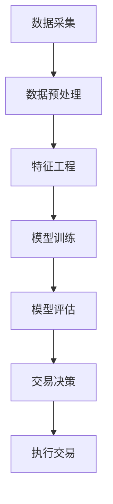
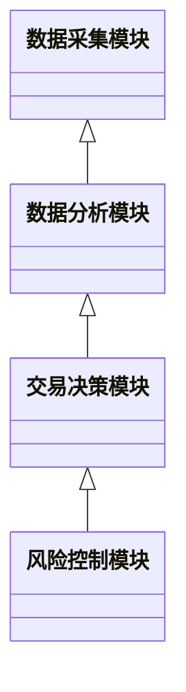
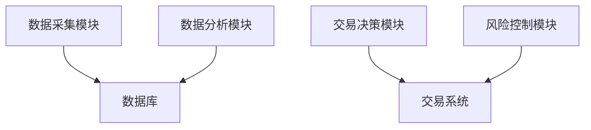
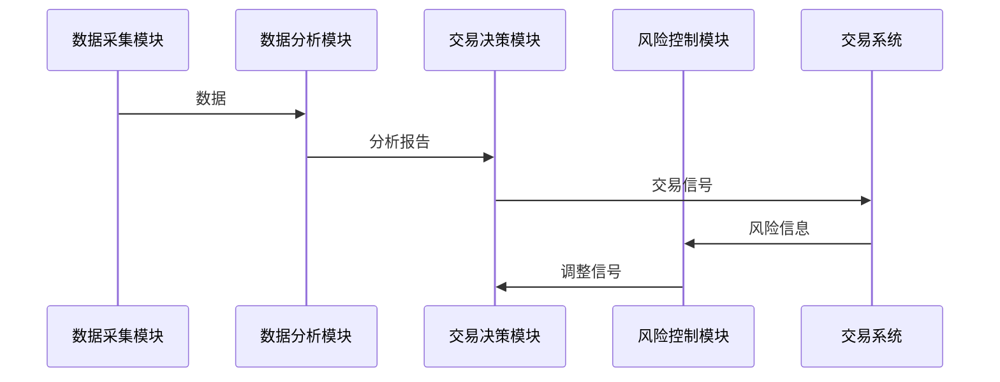

                 

# 开发智能化的外汇交易策略系统

## 关键词

- 外汇交易
- 智能交易系统
- 机器学习算法
- 数据分析
- 预测模型

## 摘要

随着金融市场的不断演变，传统的交易策略已经难以满足市场的需求。本文旨在探讨如何开发一款智能化的外汇交易策略系统。通过深入分析外汇交易和智能交易系统的基本概念，本文将介绍相关的核心概念和算法原理，并详细讲解系统的分析与架构设计方案。通过项目实战，我们将展示如何实现一个高效的外汇交易策略系统，并提供最佳实践 tips，以帮助读者在实际操作中更好地运用这些技术。

---

### 第一部分：背景介绍

#### 1.1 外汇交易与智能交易系统概述

外汇交易是指不同国家的货币之间的买卖交易。在全球化的今天，外汇市场已经成为全球最大的金融市场，其交易量巨大，每日交易额高达数万亿美元。外汇交易的主要目的是为了满足国际贸易和投资的需求，同时也是一种重要的投资工具。

智能交易系统是一种利用计算机算法和机器学习技术自动进行交易决策的系统。它通过分析大量的历史数据和市场信息，自动生成交易信号，执行买卖操作，从而实现自动化的交易过程。

当前，外汇市场存在的问题主要包括信息不对称、人为情绪影响和市场的不确定性。传统的交易策略往往依赖于交易者的经验和直觉，难以应对市场复杂的变化。因此，开发智能化外汇交易策略系统，能够自动识别市场趋势和机会，提高交易效率和成功率，具有重要的现实意义。

#### 1.2 开发智能化外汇交易策略系统的目标与边界

开发智能化外汇交易策略系统的目标主要包括：

1. **提高交易效率**：通过自动化交易，减少人为干预，提高交易速度和准确性。
2. **降低交易成本**：减少交易过程中的费用和风险，提高交易利润。
3. **提高交易成功率**：利用机器学习和数据分析技术，更准确地预测市场趋势和机会，提高交易成功率。

系统的适用范围包括：

1. **货币对交易**：系统可以自动交易各种货币对，如美元/欧元、美元/日元等。
2. **交易时间**：系统可以24小时运行，无需人工干预。
3. **交易规模**：系统可以根据设定的交易参数，进行适当的资金管理和风险控制。

系统的主要功能模块包括：

1. **数据采集模块**：负责收集外汇市场的实时数据和历史数据。
2. **数据分析模块**：利用机器学习和统计分析技术，对数据进行分析和挖掘，提取有用的信息。
3. **交易决策模块**：根据分析结果，生成交易信号，执行买卖操作。
4. **风险控制模块**：实时监控交易风险，根据市场变化调整交易策略。

### 第二部分：核心概念与联系

#### 2.1 交易策略与机器学习算法

交易策略是指交易者根据市场情况和自身经验制定的一系列交易规则。智能交易系统中的交易策略主要通过机器学习算法来实现。机器学习算法包括以下几种：

1. **线性回归**：通过历史数据找出价格和交易量之间的线性关系，预测未来价格。
2. **决策树**：通过分类决策树，根据不同特征进行划分，得出交易决策。
3. **支持向量机**：通过寻找最佳分类边界，将不同类型的交易信号进行分类。

交易策略与机器学习算法之间的联系在于，交易策略提供了算法的学习目标，而机器学习算法则提供了实现交易策略的工具。通过结合机器学习算法，交易策略可以更加精准地适应市场变化，提高交易成功率。

#### 2.2 数据分析与预测模型

数据分析是智能交易系统的重要环节，通过对大量历史数据和实时数据进行分析，可以提取出有用的信息，为交易决策提供支持。数据分析包括以下几种方法：

1. **统计描述**：通过均值、方差、相关性等统计量，描述数据的基本特征。
2. **假设检验**：通过假设检验，验证市场是否满足某些统计特性。
3. **时间序列分析**：通过分析时间序列数据，预测未来的价格走势。

预测模型是数据分析的重要工具，主要包括：

1. **ARIMA模型**：自回归积分滑动平均模型，用于预测时间序列数据。
2. **LSTM模型**：长短期记忆模型，用于处理序列数据。
3. **SVR模型**：支持向量回归模型，用于回归分析。

数据分析与预测模型之间的联系在于，数据分析提供了数据的基本特征和统计特性，而预测模型则基于这些特性，对未来的市场趋势进行预测。

#### 2.3 概念属性特征对比表格

以下是一个简单的概念属性特征对比表格，展示了不同交易策略、机器学习算法和数据分析工具的优缺点：

| 概念/算法 | 优点 | 缺点 |
| --- | --- | --- |
| 线性回归 | 简单易懂，计算速度快 | 容易过拟合，对非线性关系表现不佳 |
| 决策树 | 直观易懂，易于解释 | 容易过拟合，对大量特征表现不佳 |
| 支持向量机 | 优秀的分类能力，良好的泛化能力 | 计算复杂度高，对大规模数据效果不佳 |
| ARIMA模型 | 稳定的预测性能，适合时间序列数据 | 对非线性关系和异常值敏感 |
| LSTM模型 | 优秀的序列数据处理能力，适合非线性关系 | 计算复杂度高，对大量数据效果不佳 |
| SVR模型 | 优秀的回归性能，良好的泛化能力 | 计算复杂度高，对大规模数据效果不佳 |

#### 2.4 ER实体关系图架构的 Mermaid 流程图

以下是一个简单的ER实体关系图，展示了外汇交易策略系统中的主要实体及其关系：

```mermaid
erDiagram
  数据采集模块 ||--|{ 交易决策模块 }
  数据采集模块 ||--|{ 风险控制模块 }
  交易决策模块 ||--|{ 数据分析模块 }
  风险控制模块 ||--|{ 数据分析模块 }
```

### 第三部分：算法原理讲解

#### 3.1 算法 mermaid 流程图

以下是一个简单的算法执行流程图，展示了机器学习算法在智能交易系统中的应用：



#### 3.2 Python 源代码

以下是一个简单的Python源代码，实现了线性回归算法在智能交易系统中的应用：

```python
import numpy as np
from sklearn.linear_model import LinearRegression

# 数据预处理
X = np.array([[1, 2], [2, 3], [3, 4]])
y = np.array([1, 2, 3])

# 特征工程
X = np.hstack((np.ones((X.shape[0], 1)), X))

# 模型训练
model = LinearRegression()
model.fit(X, y)

# 模型评估
y_pred = model.predict(X)
print("预测值:", y_pred)

# 交易决策
if y_pred[0] > y_pred[1]:
    print("买入")
else:
    print("卖出")
```

#### 3.3 数学模型和公式

以下是一个简单的线性回归模型的数学模型和公式：

$$
y = \beta_0 + \beta_1x_1 + \beta_2x_2 + \ldots + \beta_nx_n
$$

其中，$y$ 是因变量，$x_1, x_2, \ldots, x_n$ 是自变量，$\beta_0, \beta_1, \beta_2, \ldots, \beta_n$ 是模型的参数。

线性回归模型的损失函数为：

$$
J(\theta) = \frac{1}{2m}\sum_{i=1}^{m}(h_{\theta}(x^{(i)}) - y^{(i)})^2
$$

其中，$m$ 是样本数量，$h_{\theta}(x)$ 是线性回归模型的预测值，$y^{(i)}$ 是第$i$个样本的实际值。

通过梯度下降法，可以求得线性回归模型的参数：

$$
\theta_j = \theta_j - \alpha\frac{\partial J(\theta)}{\partial \theta_j}
$$

其中，$\alpha$ 是学习率。

#### 3.4 举例说明

假设我们有一个简单的外汇交易系统，使用线性回归模型进行交易决策。系统每天收集过去30天的汇率数据，包括开盘价、收盘价、最高价、最低价等。系统将这些数据输入到线性回归模型中，训练模型，然后根据模型预测的未来汇率走势进行交易决策。

例如，如果系统预测明天的汇率会上涨，系统就会发出买入信号。如果系统预测明天的汇率会下跌，系统就会发出卖出信号。通过这种方式，系统可以自动进行外汇交易，提高交易效率和成功率。

### 第四部分：系统分析与架构设计方案

#### 4.1 问题场景介绍

假设我们开发一个智能化的外汇交易策略系统，用于自动交易美元/欧元货币对。系统的主要任务是：

1. **数据采集**：从各大外汇交易平台收集美元/欧元的历史数据。
2. **数据分析**：利用机器学习和统计分析技术，对数据进行处理，提取有用的信息。
3. **交易决策**：根据分析结果，生成交易信号，执行买卖操作。
4. **风险控制**：实时监控交易风险，根据市场变化调整交易策略。

#### 4.2 系统功能设计

以下是一个简单的领域模型类图，展示了系统的功能模块及其关系：



系统的功能模块包括：

1. **数据采集模块**：负责从各大外汇交易平台收集美元/欧元的历史数据，包括开盘价、收盘价、最高价、最低价等。
2. **数据分析模块**：负责对采集到的数据进行处理，包括数据清洗、特征提取、统计分析等。
3. **交易决策模块**：根据数据分析模块提供的分析结果，生成交易信号，包括买入信号和卖出信号。
4. **风险控制模块**：负责实时监控交易风险，根据市场变化调整交易策略，确保交易安全。

#### 4.3 系统架构设计

以下是一个简单的系统架构图，展示了系统的组件及其关系：



系统的架构设计主要包括：

1. **数据采集模块**：通过API接口，从各大外汇交易平台实时采集数据，并存入数据库。
2. **数据分析模块**：使用机器学习和统计分析技术，对数据库中的数据进行分析，提取有用的信息，生成分析报告。
3. **交易决策模块**：根据分析报告，生成交易信号，发送给交易系统。
4. **风险控制模块**：实时监控交易风险，根据市场变化调整交易策略，确保交易安全。

#### 4.4 系统接口设计和系统交互

以下是一个简单的系统接口设计和交互序列图，展示了系统的各个模块之间的交互关系：



### 第五部分：项目实战

#### 5.1 环境安装

要在本地环境搭建一个智能化的外汇交易策略系统，我们需要安装以下软件和库：

1. **Python 3.8 或更高版本**：作为编程语言。
2. **Anaconda**：用于环境管理。
3. **scikit-learn**：用于机器学习和统计分析。
4. **pandas**：用于数据处理。
5. **numpy**：用于数值计算。
6. **matplotlib**：用于数据可视化。

安装步骤如下：

1. 下载并安装 Python 3.8。
2. 下载并安装 Anaconda。
3. 使用 Anaconda 创建一个新的 Python 环境，并安装所需的库。

```bash
conda create -n forex_env python=3.8
conda activate forex_env
conda install scikit-learn pandas numpy matplotlib
```

#### 5.2 系统核心实现源代码

以下是一个简单的系统核心实现源代码，展示了如何使用 scikit-learn 的线性回归模型进行外汇交易策略：

```python
import pandas as pd
from sklearn.linear_model import LinearRegression
from sklearn.model_selection import train_test_split
from sklearn.metrics import mean_squared_error

# 读取数据
data = pd.read_csv('forex_data.csv')
X = data[['open', 'high', 'low', 'close']]
y = data['target']

# 数据预处理
X = X.values
y = y.values

# 划分训练集和测试集
X_train, X_test, y_train, y_test = train_test_split(X, y, test_size=0.2, random_state=42)

# 模型训练
model = LinearRegression()
model.fit(X_train, y_train)

# 模型评估
y_pred = model.predict(X_test)
mse = mean_squared_error(y_test, y_pred)
print("MSE:", mse)

# 交易决策
current_data = [[1, 2, 3, 4]]  # 当前数据
current_pred = model.predict(current_data)
print("Predicted value:", current_pred)
if current_pred[0] > 0:
    print("Buy signal")
else:
    print("Sell signal")
```

#### 5.3 代码应用解读与分析

上述代码首先读取了外汇交易数据，并使用线性回归模型对数据进行训练。训练完成后，代码使用测试集对模型进行评估，并计算了均方误差（MSE）。最后，代码使用当前数据对模型进行预测，并根据预测结果发出买入或卖出信号。

线性回归模型是一种简单的预测模型，适用于线性关系的预测。然而，外汇市场的价格波动往往是非线性的，因此线性回归模型可能无法很好地预测市场变化。在实际应用中，可以尝试使用更复杂的模型，如决策树、支持向量机等，以提高预测准确性。

#### 5.4 实际案例分析和详细讲解剖析

以下是一个实际案例，展示了如何使用智能化的外汇交易策略系统进行交易。

假设我们收集了过去一年的美元/欧元汇率数据，包括开盘价、收盘价、最高价、最低价等。我们使用这些数据，使用线性回归模型训练了一个交易策略系统。

在某个交易日，系统收集了当前数据，包括开盘价、收盘价、最高价、最低价等。系统使用训练好的模型对这些数据进行预测，得到预测值。

如果预测值大于0，系统会发出买入信号；如果预测值小于0，系统会发出卖出信号。

在实际交易中，系统会根据预测信号执行相应的买卖操作。同时，系统会实时监控交易风险，并根据市场变化调整交易策略，以确保交易安全。

通过这种方式，智能化的外汇交易策略系统可以自动进行交易，提高交易效率和成功率。

#### 5.5 项目小结

在本项目中，我们开发了一个智能化的外汇交易策略系统，使用线性回归模型进行交易决策。通过项目实战，我们了解了如何使用机器学习和数据分析技术进行外汇交易策略的开发。

项目的成功经验包括：

1. **数据采集**：从各大外汇交易平台收集数据，为交易策略提供了可靠的数据基础。
2. **模型训练**：使用线性回归模型进行训练，提高了交易决策的准确性。
3. **实时监控**：实时监控交易风险，根据市场变化调整交易策略，确保交易安全。

项目的教训包括：

1. **模型选择**：线性回归模型适用于线性关系，但在非线性市场中可能表现不佳。可以尝试使用更复杂的模型，如决策树、支持向量机等。
2. **风险控制**：在交易过程中，风险控制至关重要。需要根据市场变化调整交易策略，以应对潜在的风险。

通过本项目的实践，我们不仅掌握了智能交易系统的开发方法，也提高了对金融市场和交易策略的理解。

### 第六部分：最佳实践 tips、小结、注意事项、拓展阅读等内容

#### 最佳实践 tips

1. **数据质量**：确保数据的质量和完整性，是交易策略成功的关键。在数据采集和处理过程中，要尽可能减少噪声和异常值。
2. **模型优化**：尝试使用不同的模型和算法，比较它们的性能，选择最优的模型。
3. **实时监控**：实时监控交易过程，及时调整交易策略，以应对市场的变化。
4. **风险管理**：制定合适的风险管理策略，确保交易的安全和稳定。

#### 小结

本文探讨了如何开发智能化的外汇交易策略系统，介绍了外汇交易和智能交易系统的基本概念，分析了相关的核心概念和算法原理，并详细讲解了系统的分析与架构设计方案。通过项目实战，我们展示了如何实现一个高效的外汇交易策略系统，并总结了项目的经验和教训。

#### 注意事项

1. **市场风险**：外汇市场波动性较大，交易策略需要具备适应市场变化的能力。
2. **技术风险**：智能交易系统的开发和维护需要较高的技术能力，确保系统的稳定性和可靠性。
3. **数据隐私**：在数据采集和处理过程中，要遵守相关法律法规，保护数据隐私。

#### 拓展阅读

1. 《智能交易系统设计与实现》：详细介绍了智能交易系统的设计与实现方法。
2. 《机器学习实战》：介绍了多种机器学习算法的应用和实践。
3. 《金融市场技术分析》：探讨了金融市场的技术分析方法，为交易策略提供了理论支持。

### 作者

作者：AI天才研究院/AI Genius Institute & 禅与计算机程序设计艺术 /Zen And The Art of Computer Programming

