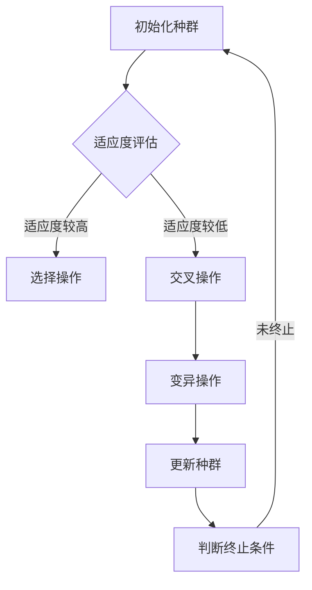
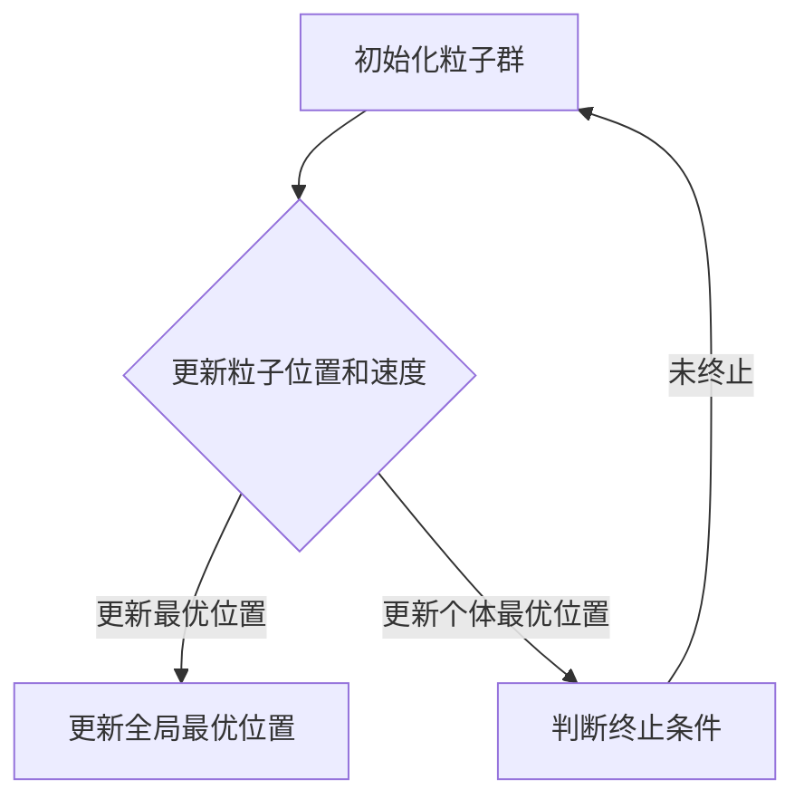

                 

### 2. 策略优化算法

#### 2.1 算法概述

优化算法在资产配置策略优化引擎中起着关键作用。根据目标函数的不同，优化算法可以分为几种类型，如线性优化、非线性优化、动态优化和混合优化等。选择合适的优化算法是构建高效资产配置策略优化引擎的关键步骤。

#### 2.2 算法原理讲解

为了更好地理解优化算法，我们将详细介绍两种常用的算法：遗传算法和粒子群优化算法。

##### 2.2.1 遗传算法（Genetic Algorithm, GA）

遗传算法是一种基于生物进化的启发式搜索算法，主要用于求解优化问题。其核心思想是通过模拟生物进化过程，不断迭代搜索最优解。

###### 2.2.1.1 算法流程图



###### 2.2.1.2 Python代码实现

```python
import numpy as np
import random

def fitness_function(solution):
    # 定义适应度函数
    return sum(solution)

def selection(population, fitnesses, k):
    # 定义选择操作
    selected = random.choices(population, weights=fitnesses, k=k)
    return selected

def crossover(parent1, parent2):
    # 定义交叉操作
    cross_point = random.randint(1, len(parent1) - 1)
    child = parent1[:cross_point] + parent2[cross_point:]
    return child

def mutate(child):
    # 定义变异操作
    for i in range(len(child)):
        if random.random() < 0.1:
            child[i] = (child[i] + random.random() * 2 - 1) % 1
    return child

def genetic_algorithm(pop_size, num_iterations, k=3):
    # 定义遗传算法
    population = [random.uniform(0, 1) for _ in range(pop_size)]
    best_solution = None
    best_fitness = -1

    for _ in range(num_iterations):
        fitnesses = [fitness_function(individual) for individual in population]
        best_fitness = max(fitnesses)
        best_solution = population[fitnesses.index(best_fitness)]

        selected = selection(population, fitnesses, k)
        children = []

        for i in range(0, pop_size, 2):
            parent1, parent2 = selected[i], selected[i+1]
            child1, child2 = crossover(parent1, parent2)
            children.append(mutate(child1))
            children.append(mutate(child2))

        population = children

    return best_solution, best_fitness
```

###### 2.2.1.3 数学模型与公式

遗传算法的适应度函数通常表示为：

$$
f(x) = \sum_{i=1}^{n} w_i \cdot x_i
$$

其中，$x_i$ 表示第 $i$ 个决策变量的取值，$w_i$ 表示第 $i$ 个决策变量的权重。

适应度评估基于目标函数的优化程度，通常采用以下公式计算：

$$
fitness = \frac{1}{f(x)}
$$

选择、交叉和变异操作分别基于适应度值进行概率选择和随机操作，以模拟生物进化过程。

###### 2.2.1.4 举例说明

假设我们要优化一个二元目标函数：

$$
f(x, y) = (x - 0.5)^2 + (y - 0.5)^2
$$

目标是最小化 $f(x, y)$。使用遗传算法求解时，可以设置种群大小为 50，迭代次数为 100，选择概率为 0.9，交叉概率为 0.8，变异概率为 0.1。通过迭代过程，算法将找到最优解 $(x, y) \approx (0.5, 0.5)$，最小化目标函数。

##### 2.2.2 粒子群优化算法（Particle Swarm Optimization, PSO）

粒子群优化算法是一种基于群体智能的优化算法，通过模拟鸟群觅食行为来搜索最优解。粒子群优化算法简单易实现，对复杂问题具有良好的搜索能力。

###### 2.2.2.1 算法流程图



###### 2.2.2.2 Python代码实现

```python
import numpy as np
import random

def fitness_function(solution):
    # 定义适应度函数
    return -sum(solution**2)

def update_velocity(particel, best_position, w=0.5, c1=1, c2=2):
    # 定义速度更新公式
    r1 = random.random()
    r2 = random.random()
    velocity = (w * particel['velocity'] + c1 * r1 * (best_position - particel['position']) + c2 * r2 * (best_position - particel['position'])) 
    return velocity

def update_position(particel, velocity):
    # 定义位置更新公式
    particel['position'] += velocity
    return particel['position']

def particle_swarm_optimization(num_particles, dimensions, num_iterations):
    # 定义粒子群优化算法
    particles = [{'position': [random.uniform(-1, 1) for _ in range(dimensions)], 'velocity': [random.uniform(-0.1, 0.1) for _ in range(dimensions)], 'best_position': None, 'best_fitness': float('inf')} for _ in range(num_particles)]
    global_best_position = None
    global_best_fitness = float('inf')

    for _ in range(num_iterations):
        for particel in particles:
            fitness = fitness_function(particel['position'])
            if fitness < particel['best_fitness']:
                particel['best_fitness'] = fitness
                particel['best_position'] = particel['position']
            if fitness < global_best_fitness:
                global_best_fitness = fitness
                global_best_position = particel['position']

        for particel in particles:
            particel['velocity'] = update_velocity(particel, global_best_position)
            particel['position'] = update_position(particel, particel['velocity'])

    return global_best_position, global_best_fitness
```

###### 2.2.2.3 数学模型与公式

粒子群优化算法的适应度函数通常表示为：

$$
f(x) = -\sum_{i=1}^{n} x_i^2
$$

其中，$x_i$ 表示第 $i$ 个决策变量的取值。

速度和位置更新公式如下：

$$
v_{i}^{t+1} = w \cdot v_{i}^{t} + c_1 \cdot r_1 \cdot (p_{i}^{t} - x_{i}^{t}) + c_2 \cdot r_2 \cdot (g_{i}^{t} - x_{i}^{t})
$$

$$
x_{i}^{t+1} = x_{i}^{t} + v_{i}^{t+1}
$$

其中，$v_i^t$ 表示第 $i$ 个粒子的速度，$x_i^t$ 表示第 $i$ 个粒子的位置，$p_i^t$ 表示第 $i$ 个粒子的个体最优位置，$g_i^t$ 表示第 $i$ 个粒子的全局最优位置，$w$、$c_1$ 和 $c_2$ 为权重参数，$r_1$ 和 $r_2$ 为随机数。

###### 2.2.2.4 举例说明

假设我们要优化一个一元目标函数：

$$
f(x) = -x^2
$$

目标是最小化 $f(x)$。使用粒子群优化算法求解时，可以设置粒子数量为 30，迭代次数为 100，权重参数 $w=0.5$，$c_1=1.5$，$c_2=2.0$。通过迭代过程，算法将找到最优解 $x \approx 0$，最小化目标函数。

通过以上对遗传算法和粒子群优化算法的详细介绍，我们可以更好地理解这些优化算法在资产配置策略优化引擎中的应用。在实际应用中，可以根据具体问题选择合适的算法，并通过不断迭代和优化，实现高效的资产配置策略。

