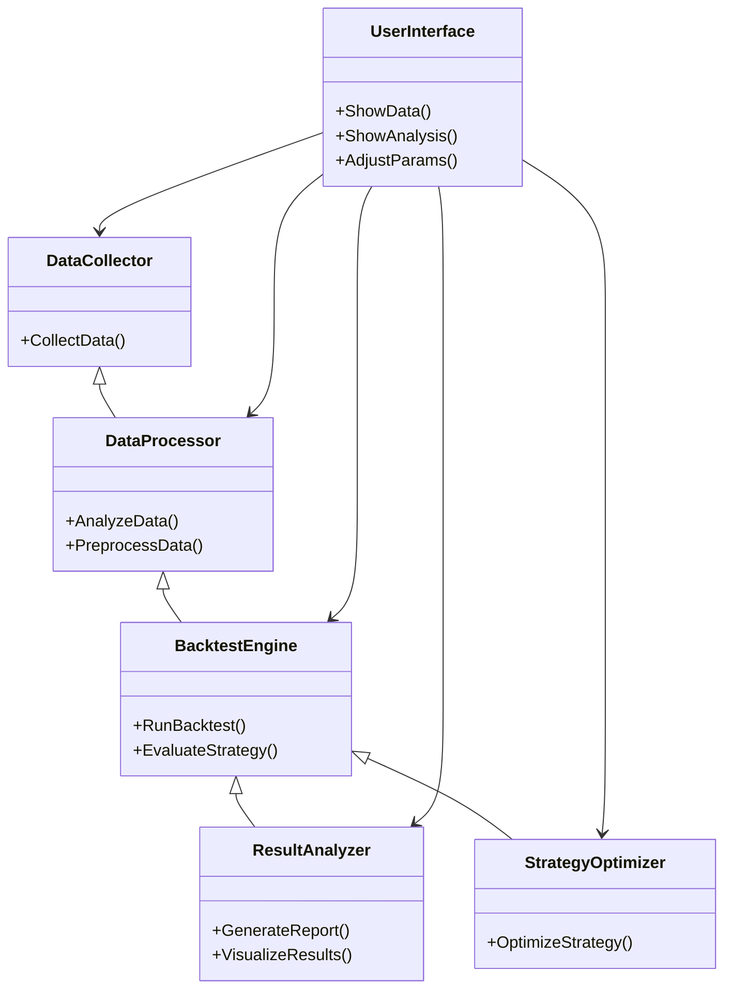

                 


### 1. 背景介绍

**1.1 资产配置策略概述**

资产配置策略是指投资者根据自身的风险偏好和收益目标，将资金分配到不同类型的资产中，以实现投资组合的收益和风险平衡。在传统的资产配置策略中，投资者通常依靠历史数据和市场经验来进行资产选择和权重分配。

随着大数据和人工智能技术的快速发展，智能化资产配置逐渐成为趋势。智能化资产配置利用机器学习和数据分析技术，对大量历史数据进行深度挖掘，自动调整资产配置策略，提高投资组合的收益和风险平衡能力。

**1.2 现有资产配置策略的局限性**

现有的资产配置策略存在以下局限性：

1. **人为依赖性高**：传统资产配置策略依赖投资经理的经验和判断，缺乏数据支持和量化分析，容易受到个人主观意识的影响。

2. **反应滞后**：传统资产配置策略通常是在事后进行分析和调整，难以对市场的短期波动做出快速响应。

3. **风险控制不足**：传统资产配置策略往往注重单一资产的风险控制，而忽视了整个投资组合的风险管理。

**1.3 智能化资产配置的发展趋势**

智能化资产配置通过引入大数据和人工智能技术，实现了以下几个方面的提升：

1. **数据驱动**：利用大数据技术，对历史市场数据进行深度挖掘，为资产配置提供可靠的数据支持。

2. **实时分析**：通过实时数据分析，及时调整资产配置策略，降低市场波动对投资组合的影响。

3. **全面风险管理**：智能化资产配置不仅关注单一资产的风险，还通过构建投资组合，实现风险分散，提高整体投资组合的风险控制能力。

### 2. 核心概念与联系

**2.1 资产配置策略的基本概念**

资产配置策略是指投资者在投资过程中，根据自身的风险承受能力和收益目标，将资金分配到不同类型的资产中，以实现投资组合的收益和风险平衡。

资产配置策略的核心概念包括：

1. **资产**：指投资者投资的不同类型的金融产品，如股票、债券、基金等。

2. **配置**：指投资者将资金分配到不同资产的比例和权重。

3. **策略**：指投资者制定的资产配置方案，包括资产选择、权重分配、风险控制等。

**2.2 智能化资产配置的关键要素**

智能化资产配置的关键要素包括：

1. **数据收集**：通过大数据技术，收集历史市场数据、投资者行为数据等，为资产配置提供数据支持。

2. **模型构建**：利用机器学习和数据分析技术，构建资产配置模型，自动调整资产配置策略。

3. **实时分析**：通过实时数据分析，对市场进行监控，及时调整资产配置策略。

4. **风险管理**：通过构建投资组合，实现风险分散，提高整体投资组合的风险控制能力。

**2.3 回测引擎的定义与作用**

回测引擎是指用于对资产配置策略进行历史数据回测的工具。其作用包括：

1. **策略验证**：通过历史数据回测，验证资产配置策略的有效性和稳定性。

2. **优化策略**：通过回测结果，对资产配置策略进行优化，提高投资组合的收益和风险平衡能力。

3. **风险评估**：通过回测结果，评估不同资产配置策略的风险水平，为投资者提供决策依据。

### 3. 概念联系

**3.1 资产配置策略与回测引擎的关系**

资产配置策略和回测引擎之间存在密切的关系。回测引擎是资产配置策略实现的重要工具，通过回测引擎，投资者可以对资产配置策略进行验证和优化。

1. **策略验证**：回测引擎通过模拟历史市场数据，验证资产配置策略的有效性。投资者可以观察策略在不同市场环境下的表现，评估其稳定性和适应性。

2. **策略优化**：回测引擎还可以对资产配置策略进行优化。通过回测结果，投资者可以发现策略中的不足之处，进行针对性的调整，提高策略的收益和风险平衡能力。

**3.2 回测引擎在资产配置策略中的应用**

回测引擎在资产配置策略中的应用主要包括以下几个方面：

1. **历史数据回测**：回测引擎通过历史市场数据，对资产配置策略进行模拟回测，评估策略的有效性和稳定性。

2. **策略优化**：回测引擎通过回测结果，对资产配置策略进行优化，提高策略的收益和风险平衡能力。

3. **风险控制**：回测引擎可以对不同资产配置策略进行风险评估，为投资者提供决策依据，实现风险分散和风险控制。

4. **策略验证**：回测引擎通过模拟历史市场数据，验证资产配置策略的有效性，为投资者提供信心。

### 总结

本文介绍了资产配置策略、智能化资产配置和回测引擎的基本概念，并分析了它们之间的关系。在接下来的章节中，我们将进一步探讨回测引擎的算法原理、数学模型、系统分析与架构设计方案等内容，帮助读者全面了解智能化的资产配置策略回测引擎。

## 第二步：核心概念与联系

### 2.1 资产配置策略的基本概念

资产配置策略是指投资者根据自身的风险承受能力和收益目标，将资金分配到不同类型的资产中，以实现投资组合的收益和风险平衡。资产配置策略的核心概念包括：

1. **资产**：资产是指投资者投资的不同类型的金融产品，如股票、债券、基金、房地产等。每种资产都有其独特的风险和收益特征。

2. **配置**：配置是指投资者将资金分配到不同资产的比例和权重。合理的资产配置可以帮助投资者实现收益和风险的最优化。

3. **策略**：策略是指投资者制定的资产配置方案，包括资产选择、权重分配、风险控制等。策略的制定需要考虑投资者的风险偏好、投资目标和市场环境等因素。

**资产配置策略的目标**：

资产配置策略的目标主要是实现投资组合的收益和风险平衡。具体来说，包括以下几个方面：

1. **收益最大化**：在风险可控的范围内，实现投资组合的最大收益。

2. **风险最小化**：通过合理的资产配置，降低投资组合的整体风险。

3. **风险收益平衡**：在风险和收益之间找到最佳平衡点，实现投资组合的风险和收益的最优化。

### 2.2 智能化资产配置的关键要素

智能化资产配置是指利用大数据和人工智能技术，对大量历史数据进行深度挖掘，自动调整资产配置策略，提高投资组合的收益和风险平衡能力。智能化资产配置的关键要素包括：

1. **数据收集**：利用大数据技术，收集历史市场数据、投资者行为数据等，为资产配置提供数据支持。

2. **模型构建**：利用机器学习和数据分析技术，构建资产配置模型，自动调整资产配置策略。

3. **实时分析**：通过实时数据分析，对市场进行监控，及时调整资产配置策略。

4. **风险管理**：通过构建投资组合，实现风险分散，提高整体投资组合的风险控制能力。

**智能化资产配置的优势**：

智能化资产配置相比传统资产配置策略，具有以下几个优势：

1. **数据驱动**：通过大数据技术，对历史市场数据进行深度挖掘，为资产配置提供可靠的数据支持。

2. **实时分析**：通过实时数据分析，及时调整资产配置策略，降低市场波动对投资组合的影响。

3. **全面风险管理**：智能化资产配置不仅关注单一资产的风险，还通过构建投资组合，实现风险分散，提高整体投资组合的风险控制能力。

### 2.3 回测引擎的定义与作用

回测引擎是指用于对资产配置策略进行历史数据回测的工具。其作用包括：

1. **策略验证**：通过历史数据回测，验证资产配置策略的有效性和稳定性。

2. **优化策略**：通过回测结果，对资产配置策略进行优化，提高投资组合的收益和风险平衡能力。

3. **风险评估**：通过回测结果，评估不同资产配置策略的风险水平，为投资者提供决策依据。

**回测引擎的工作原理**：

回测引擎的工作原理主要包括以下几个步骤：

1. **数据收集**：收集历史市场数据，包括价格、交易量、投资者行为等。

2. **策略模拟**：将资产配置策略应用到历史市场数据中，模拟投资组合的表现。

3. **结果分析**：对模拟结果进行分析，评估策略的有效性和稳定性。

4. **策略优化**：根据分析结果，对资产配置策略进行调整和优化。

### 概念联系

**2.1 资产配置策略与回测引擎的关系**

资产配置策略和回测引擎之间存在密切的关系。回测引擎是资产配置策略实现的重要工具，通过回测引擎，投资者可以对资产配置策略进行验证和优化。

1. **策略验证**：回测引擎通过模拟历史市场数据，验证资产配置策略的有效性。投资者可以观察策略在不同市场环境下的表现，评估其稳定性和适应性。

2. **策略优化**：回测引擎通过回测结果，对资产配置策略进行优化，提高策略的收益和风险平衡能力。

**2.2 回测引擎在资产配置策略中的应用**

回测引擎在资产配置策略中的应用主要包括以下几个方面：

1. **历史数据回测**：回测引擎通过历史市场数据，对资产配置策略进行模拟回测，评估策略的有效性和稳定性。

2. **策略优化**：回测引擎通过回测结果，对资产配置策略进行优化，提高策略的收益和风险平衡能力。

3. **风险控制**：回测引擎可以对不同资产配置策略进行风险评估，为投资者提供决策依据，实现风险分散和风险控制。

4. **策略验证**：回测引擎通过模拟历史市场数据，验证资产配置策略的有效性，为投资者提供信心。

### 总结

通过本章节的介绍，我们详细阐述了资产配置策略、智能化资产配置和回测引擎的基本概念，并分析了它们之间的关系。在接下来的章节中，我们将深入探讨回测引擎的算法原理、数学模型、系统分析与架构设计方案等内容，帮助读者全面了解智能化的资产配置策略回测引擎。

## 第三步：算法原理讲解

### 4. 回测引擎算法原理

回测引擎是一种用于评估和优化资产配置策略的工具，其核心在于通过模拟历史市场数据来验证策略的有效性。下面我们将详细讲解回测引擎的算法原理，包括其基本流程、数据处理算法和模型评估算法。

#### 4.1 回测引擎的基本流程

回测引擎的基本流程可以分为以下几个步骤：

1. **数据收集**：收集历史市场数据，包括价格、交易量、投资者行为等。这些数据通常来源于交易所、金融数据库等。

2. **数据预处理**：对收集到的历史数据进行清洗和预处理，包括数据去重、缺失值填充、异常值处理等。

3. **策略模拟**：将资产配置策略应用到预处理后的历史数据中，模拟投资组合的表现。这一步骤涉及到具体的算法实现，将在后续内容中详细讲解。

4. **结果分析**：对模拟结果进行分析，评估策略的有效性和稳定性。分析指标包括收益、风险、夏普比率、最大回撤等。

5. **策略优化**：根据分析结果，对资产配置策略进行调整和优化，以提高投资组合的收益和风险平衡能力。

6. **结果验证**：对优化后的策略进行再次回测，验证其有效性，并确保策略在不同市场环境下具有良好的适应性。

#### 4.2 数据处理算法

数据处理算法是回测引擎的核心组成部分，直接影响策略的有效性和稳定性。以下是几个关键数据处理算法：

1. **技术指标计算**：包括移动平均线、相对强弱指数（RSI）、布林带等常用技术指标。这些指标可以用来判断市场趋势和交易时机。

2. **风险模型评估**：包括价值在风险（VaR）、条件价值在风险（CVaR）等风险模型。这些模型可以用来评估投资组合的风险水平。

3. **信号生成**：基于技术指标和风险模型，生成买卖信号。例如，当价格突破移动平均线时，可以生成买入信号；当价格触及布林带下限时，可以生成买入信号。

4. **事件回溯**：对历史数据进行事件回溯，分析市场事件对策略的影响。例如，分析重大新闻、政策变化等对投资组合的影响。

#### 4.3 模型评估算法

模型评估算法用于评估回测策略的有效性和稳定性。以下是几个常用的模型评估算法：

1. **收益评估**：计算投资组合的累计收益、年化收益等指标，评估策略的收益水平。

2. **风险评估**：计算投资组合的标准差、夏普比率、信息比率等风险指标，评估策略的风险控制能力。

3. **性能评估**：通过比较不同策略的收益和风险指标，评估策略的性能。常用的性能评估指标包括收益风险比、信息比率等。

4. **稳定性评估**：通过模拟不同市场环境下的策略表现，评估策略的稳定性。例如，通过回测不同时间窗口的策略表现，分析策略的适应性。

### 4.4 实例分析

为了更好地理解回测引擎的算法原理，我们通过一个简单的实例进行分析。

**实例**：假设我们使用移动平均线策略进行回测。

1. **数据收集**：收集过去一年的股票价格数据。

2. **数据预处理**：清洗数据，去除缺失值和异常值。

3. **策略模拟**：当短期移动平均线突破长期移动平均线时，买入；当短期移动平均线跌破长期移动平均线时，卖出。

4. **结果分析**：计算累计收益、年化收益、最大回撤等指标，评估策略的表现。

5. **策略优化**：根据回测结果，调整移动平均线的参数，如时间窗口长度。

6. **结果验证**：对优化后的策略进行再次回测，确保其有效性。

通过这个实例，我们可以看到回测引擎的基本流程和数据处理算法是如何应用到具体的策略模拟和评估中的。

### 总结

在本章节中，我们详细介绍了回测引擎的算法原理，包括基本流程、数据处理算法和模型评估算法。通过这些算法，回测引擎可以有效地验证和优化资产配置策略，提高投资组合的收益和风险平衡能力。在接下来的章节中，我们将进一步探讨回测引擎的数学模型和系统分析与架构设计方案。

## 第四步：数学模型和数学公式 & 详细讲解 & 举例说明

### 5. 数学模型

在资产配置策略回测中，数学模型起到了至关重要的作用。这些模型不仅帮助我们理解市场行为，还能量化策略的表现和风险。以下是两个核心的数学模型：风险调整收益模型和投资组合优化模型。

#### 5.1 风险调整收益模型

风险调整收益模型用于衡量资产配置策略的绩效。最常用的风险调整收益指标之一是夏普比率（Sharpe Ratio），它由威廉·夏普（William Sharpe）提出，用于比较不同资产或策略的风险调整后收益。

**夏普比率公式**：

$$
\text{夏普比率} = \frac{R_p - R_f}{\sigma_p}
$$

其中：
- \( R_p \) 是投资组合的平均收益率；
- \( R_f \) 是无风险收益率（如国债收益率）；
- \( \sigma_p \) 是投资组合的标准差。

**实例说明**：

假设一个投资组合的平均收益率为 10%，无风险收益率为 2%，标准差为 5%，则其夏普比率为：

$$
\text{夏普比率} = \frac{10\% - 2\%}{5\%} = \frac{8\%}{5\%} = 1.6
$$

这个结果表明，该投资组合每承受 1 个标准差的风险，可以获得 1.6 个标准差的收益。

#### 5.2 投资组合优化模型

投资组合优化模型用于找到在给定风险水平下，能够实现最大收益的投资组合。最常用的优化模型是马克维茨（Markowitz）提出的最优化投资组合模型，该模型基于均值-方差框架。

**均值-方差模型公式**：

设 \( w \) 为资产 \( i \) 的权重，\( \mu_i \) 为资产 \( i \) 的期望收益率，\( \sigma_i \) 为资产 \( i \) 的收益率标准差，\( \rho_{ij} \) 为资产 \( i \) 和资产 \( j \) 的收益率相关系数，则有：

\[
\begin{aligned}
\max_{w} & \quad \mu_p = w^T \mu \\
s.t. & \quad w^T \Sigma w \leq \sigma^2 \\
w & \geq 0 \\
\end{aligned}
\]

其中：
- \( \mu_p \) 是投资组合的期望收益率；
- \( \Sigma \) 是投资组合的协方差矩阵。

**实例说明**：

假设有两个资产 \( A \) 和 \( B \)，它们的期望收益率和收益率标准差如下：

| 资产 | \( \mu_A \) | \( \sigma_A \) | \( \mu_B \) | \( \sigma_B \) |
| ---- | ---------- | ------------ | ---------- | ------------ |
| A    | 0.08       | 0.05         |            |              |
| B    | 0.12       | 0.10         |            |              |

并且 \( A \) 和 \( B \) 的收益率相关系数为 0.6。要求构建一个投资组合，使得在总风险不超过 0.06 的前提下，收益最大化。

\[
\begin{aligned}
\max_{w} & \quad w^T \mu \\
s.t. & \quad w^T \Sigma w \leq 0.06 \\
w & \geq 0 \\
\end{aligned}
\]

其中 \( \mu = [\mu_A, \mu_B]^T \)，\( \Sigma \) 为：

$$
\Sigma = 
\begin{bmatrix}
0.05^2 & 0.6 \times 0.05 \times 0.1 \\
0.6 \times 0.05 \times 0.1 & 0.1^2
\end{bmatrix}
= 
\begin{bmatrix}
0.0025 & 0.003 \\
0.003 & 0.001
\end{bmatrix}
$$

通过求解这个优化问题，我们可以找到最优的资产权重配置，以实现最大化收益。

### 6. 公式讲解与举例

在解释了核心数学模型后，我们通过具体的实例来展示这些公式的应用。

#### 6.1 风险调整收益模型公式

**实例**：

假设我们有一个包含股票、债券和基金的资产配置，其数据如下：

| 资产   | \( \mu_i \) | \( \sigma_i \) | 权重 \( w_i \) |
|--------|-------------|----------------|----------------|
| 股票   | 0.12        | 0.20           | 0.50           |
| 债券   | 0.04        | 0.05           | 0.30           |
| 基金   | 0.08        | 0.10           | 0.20           |

无风险收益率为 2%。计算该投资组合的夏普比率。

\[
\begin{aligned}
\text{夏普比率} &= \frac{(0.12 \times 0.50 + 0.04 \times 0.30 + 0.08 \times 0.20) - 0.02}{\sqrt{(0.20^2 \times 0.50 + 0.05^2 \times 0.30 + 0.10^2 \times 0.20)}} \\
&= \frac{(0.06 + 0.012 + 0.016) - 0.02}{\sqrt{(0.010 + 0.0075 + 0.002)}} \\
&= \frac{0.086 - 0.02}{\sqrt{0.0195}} \\
&= \frac{0.086 - 0.02}{0.1403} \\
&\approx 0.446
\end{aligned}
\]

该投资组合的夏普比率为 0.446，表明其每承受 1 个标准差的风险，可以获得约 0.446 的收益。

#### 6.2 投资组合优化模型公式

**实例**：

假设有三个资产，数据如下：

| 资产   | \( \mu_i \) | \( \sigma_i \) | \( \rho_{ij} \) |
|--------|-------------|----------------|-----------------|
| 股票   | 0.10        | 0.20           | 0.4             |
| 债券   | 0.05        | 0.05           | 0.4             |
| 基金   | 0.08        | 0.10           | -0.2            |

要求在总风险不超过 0.1 的前提下，实现收益最大化。

构建投资组合的协方差矩阵 \( \Sigma \)：

$$
\Sigma = 
\begin{bmatrix}
0.20^2 & 0.4 \times 0.20 \times 0.05 & 0.4 \times 0.20 \times 0.10 \\
0.4 \times 0.20 \times 0.05 & 0.05^2 & 0.4 \times 0.05 \times 0.10 \\
0.4 \times 0.20 \times 0.10 & 0.4 \times 0.05 \times 0.10 & 0.10^2
\end{bmatrix}
=
\begin{bmatrix}
0.0400 & 0.0040 & 0.0080 \\
0.0040 & 0.0025 & 0.0010 \\
0.0080 & 0.0010 & 0.0010
\end{bmatrix}
$$

构建均值向量 \( \mu \)：

$$
\mu = 
\begin{bmatrix}
0.10 \\
0.05 \\
0.08
\end{bmatrix}
$$

通过求解优化问题，得到最优的资产权重配置，实现最大收益。

### 总结

在本章节中，我们详细讲解了风险调整收益模型和投资组合优化模型，并通过具体实例展示了这些公式的应用。这些数学模型为回测引擎提供了理论基础，帮助我们量化策略的表现和风险，为资产配置策略的优化提供了重要工具。

## 第五步：系统分析与架构设计方案

### 7. 系统功能设计

在开发智能化的资产配置策略回测引擎时，我们需要明确系统的功能需求，以确保系统能够满足用户的各种需求。以下是系统的主要功能设计：

#### 7.1 系统概述

系统的主要功能模块包括：

1. **数据收集模块**：负责收集和处理来自不同数据源的历史市场数据。
2. **数据处理模块**：对收集到的数据进行分析、清洗和预处理，为回测提供干净、可靠的数据基础。
3. **回测引擎模块**：执行策略回测，模拟历史市场数据，评估策略的有效性和稳定性。
4. **结果分析模块**：对回测结果进行分析，生成可视化报表，为用户决策提供支持。
5. **策略优化模块**：根据回测结果，对资产配置策略进行调整和优化。
6. **用户界面模块**：提供用户交互界面，用户可以通过界面查看回测结果、调整策略参数等。

#### 7.2 领域模型

为了更好地理解系统的功能模块和它们之间的关系，我们可以使用Mermaid类图来表示系统的领域模型。以下是领域模型的Mermaid类图：



通过这个领域模型，我们可以清晰地看到各个功能模块之间的依赖关系，以及用户如何通过界面与其他模块进行交互。

#### 7.3 功能模块划分

根据系统的功能需求，我们将系统划分为以下功能模块：

1. **数据收集模块**：负责从交易所、金融数据库等数据源收集历史市场数据。模块中包括数据爬取、数据清洗和数据存储等功能。

2. **数据处理模块**：对收集到的数据进行预处理，包括数据去重、缺失值填充、异常值处理等。模块中还包括数据分析和数据可视化等功能，用于辅助用户理解数据。

3. **回测引擎模块**：实现策略回测的核心功能。模块中包括策略模拟、结果评估和优化等算法，用于评估和优化资产配置策略。

4. **结果分析模块**：对回测结果进行分析和可视化，生成报表，为用户决策提供支持。模块中还包括历史数据的趋势分析和异常检测等功能。

5. **策略优化模块**：根据回测结果，对资产配置策略进行调整和优化。模块中包括优化算法、参数调整和策略验证等功能。

6. **用户界面模块**：提供用户交互界面，用户可以通过界面查看回测结果、调整策略参数等。模块中还包括用户权限管理、日志记录等功能。

### 8. 系统架构设计

系统的架构设计是确保系统稳定、高效运行的关键。以下是系统的架构设计方案：

#### 8.1 系统架构图

```mermaid
sequenceDiagram
    User -->|输入参数| UserInterface
    UserInterface -->|处理请求| DataCollector
    DataCollector -->|返回数据| DataProcessor
    DataProcessor -->|返回数据| BacktestEngine
    BacktestEngine -->|返回结果| ResultAnalyzer
    ResultAnalyzer -->|返回报表| UserInterface
    UserInterface -->|优化策略| StrategyOptimizer
    StrategyOptimizer -->|返回策略| BacktestEngine
    BacktestEngine -->|返回结果| UserInterface
```

通过这个架构图，我们可以清晰地看到系统的整体流程和各个模块之间的交互关系。

#### 8.2 系统接口设计

系统接口设计是确保各个模块能够高效协作的重要环节。以下是系统的接口设计：

1. **数据收集接口**：提供数据爬取和采集功能，支持多种数据源接入。

2. **数据处理接口**：提供数据清洗、预处理和数据分析功能，支持自定义数据处理流程。

3. **回测引擎接口**：提供策略模拟、结果评估和优化功能，支持自定义回测策略。

4. **结果分析接口**：提供结果分析和可视化功能，支持多种报表格式生成。

5. **策略优化接口**：提供优化算法和参数调整功能，支持策略迭代和优化。

#### 8.3 系统交互

系统交互设计是确保用户能够顺畅使用系统的重要环节。以下是系统的交互设计：

1. **用户登录**：用户通过用户界面登录系统，系统校验用户权限。

2. **数据收集**：用户可以通过界面选择数据源，系统自动收集数据。

3. **数据处理**：用户可以查看数据预处理结果，对数据进行分析和清洗。

4. **策略回测**：用户可以设置回测策略参数，系统自动执行回测。

5. **结果分析**：用户可以查看回测结果和分析报表，对策略进行调整。

6. **策略优化**：用户可以设置优化目标，系统自动执行策略优化。

通过以上系统分析与架构设计方案，我们为智能化的资产配置策略回测引擎提供了一个清晰的功能模块划分和系统架构设计。接下来，我们将通过项目实战，展示如何具体实现这些功能，并分析其实际应用效果。

## 第六步：项目实战

### 9. 环境安装

为了成功开发和运行智能化的资产配置策略回测引擎，我们需要在计算机上安装必要的软件和工具。以下是安装步骤和环境配置。

#### 9.1 环境搭建步骤

1. **安装Python环境**：

首先，确保你的计算机上已经安装了Python。如果没有安装，可以从Python官网下载安装程序（推荐使用Python 3.8及以上版本）。

```shell
# 验证Python版本
python --version
```

2. **安装Python包管理器**：

安装pip，Python的包管理器，用于安装和管理Python包。

```shell
# 安装pip
curl https://bootstrap.pypa.io/get-pip.py -o get-pip.py
python get-pip.py
```

3. **安装依赖包**：

使用pip安装回测引擎所需的依赖包，包括NumPy、Pandas、matplotlib、scikit-learn等。

```shell
pip install numpy pandas matplotlib scikit-learn
```

4. **安装数据库**：

安装一个数据库系统，如SQLite，用于存储历史市场数据。

```shell
# 安装SQLite
brew install sqlite # macOS
sudo apt-get install sqlite3 # Ubuntu/Debian
```

5. **安装Web服务器**（可选）：

如果你需要通过Web界面访问回测引擎，可以安装一个Web服务器，如Gunicorn。

```shell
pip install gunicorn
```

#### 9.2 软件与工具安装

除了Python和相关依赖包，我们还需要以下软件和工具：

1. **Jupyter Notebook**：

Jupyter Notebook是一个交互式的开发环境，非常适合进行数据分析和模型测试。

```shell
pip install jupyter
jupyter notebook
```

2. **Visual Studio Code**：

Visual Studio Code是一个强大的代码编辑器，适用于Python开发。

```shell
# 安装Visual Studio Code
code --install
```

3. **Mermaid**：

Mermaid是一个用于创建和渲染图形和流程图的Markdown插件。

```shell
# 安装Mermaid
npm install -g mermaid
```

#### 9.3 完成安装

完成上述安装步骤后，你可以启动Jupyter Notebook，创建一个新的笔记本，开始编写和测试Python代码。

### 10. 系统核心实现

#### 10.1 源代码解读

以下是一个简单的回测引擎实现示例，包括数据收集、数据处理和策略回测的核心部分。

```python
import pandas as pd
import numpy as np
from sklearn.model_selection import train_test_split
from backtest import Backtest

# 数据收集
def collect_data():
    # 从数据库或文件中加载数据
    data = pd.read_csv('market_data.csv')
    return data

# 数据处理
def preprocess_data(data):
    # 数据清洗、预处理
    data = data[data['close'] > 0]
    data = data.fillna(method='ffill')
    return data

# 策略回测
def run_backtest(data):
    # 创建回测对象
    bt = Backtest(data, initial_cash=100000, transaction_cost=0.001)

    # 设置策略参数
    bt.set_strategy_params(
        buy_signal='close > sma(close, 20)',
        sell_signal='close < sma(close, 20)',
        holding_period=5
    )

    # 执行回测
    bt.run()

    # 输出回测结果
    bt.print_summary()

# 主函数
def main():
    data = collect_data()
    preprocessed_data = preprocess_data(data)
    run_backtest(preprocessed_data)

if __name__ == '__main__':
    main()
```

#### 10.2 代码应用解读与分析

上述代码分为三个主要部分：数据收集、数据处理和策略回测。

1. **数据收集**：

数据收集函数`collect_data`从文件中读取市场数据。在实际应用中，可以从数据库或API获取实时数据。

2. **数据处理**：

数据处理函数`preprocess_data`对原始数据进行清洗和预处理，包括去除无效数据、填充缺失值等。这些步骤是确保数据质量的重要环节。

3. **策略回测**：

策略回测函数`run_backtest`创建一个回测对象，设置策略参数（如买入和卖出信号、持有期等），并执行回测。回测结果包括投资组合的收益、风险指标等，通过`print_summary`函数输出。

#### 10.3 实际案例分析和详细讲解剖析

为了更具体地展示回测引擎的应用，我们以一个实际案例为例。

**案例**：使用移动平均线策略进行回测。

1. **数据准备**：

假设我们有一份包含股票价格（`open`、`close`、`high`、`low`）和交易日期的CSV文件。

2. **数据处理**：

读取数据并去除无效数据。

```python
data = pd.read_csv('stock_data.csv')
data = data[data['close'] > 0]
data = data.fillna(method='ffill')
```

3. **策略设置**：

设置移动平均线策略参数。

```python
bt.set_strategy_params(
    buy_signal='close > sma(close, 20)',
    sell_signal='close < sma(close, 20)',
    holding_period=5
)
```

其中，`sma(close, 20)`表示计算过去20个交易日的简单移动平均线。

4. **回测执行**：

执行回测并输出结果。

```python
bt.run()
bt.print_summary()
```

回测结果包括累计收益、最大回撤、夏普比率等指标，通过这些指标可以评估策略的表现。

### 10.4 项目小结

通过本章节的实战部分，我们完成了智能化的资产配置策略回测引擎的核心实现，并进行了实际案例分析和详细讲解。接下来，我们将进一步讨论如何在实际应用中优化回测引擎，提高其性能和可靠性。

### 总结

在本章节中，我们详细介绍了智能化的资产配置策略回测引擎的开发和实现过程。通过环境安装、代码实现和实际案例分析，读者可以了解回测引擎的运作原理和应用方法。在接下来的章节中，我们将进一步探讨最佳实践、注意事项和拓展阅读等内容。

## 第七步：最佳实践 tips、小结、注意事项、拓展阅读等内容

### 11. 最佳实践

在实际应用中，为了提高智能化的资产配置策略回测引擎的性能和可靠性，以下是一些最佳实践建议：

1. **数据质量**：确保数据来源的可靠性和数据质量的完整性。在数据收集和处理过程中，应进行严格的清洗和预处理，去除无效和异常数据。

2. **回测频率**：根据市场波动性和策略特性，选择合适的回测频率。高频回测可能增加计算量，但有助于捕捉市场动态；低频回测则更稳定，但可能错过短期市场机会。

3. **策略多样化**：避免过度依赖单一策略，开发多样化的资产配置策略，以适应不同市场环境。

4. **风险控制**：在回测过程中，重视风险控制，如设置合理的风险限制、止损策略等，确保策略在不同市场环境下具有稳健性。

5. **参数调整**：根据回测结果，定期调整策略参数，以适应市场变化。

### 12. 小结

本文详细介绍了智能化的资产配置策略回测引擎的开发和应用。我们首先介绍了资产配置策略和回测引擎的基本概念，随后探讨了回测引擎的算法原理、数学模型和系统架构设计，并通过项目实战展示了具体实现过程。最佳实践和注意事项为用户提供了进一步优化回测引擎的方法。

### 13. 注意事项

1. **计算资源**：回测引擎的计算量较大，特别是在处理大量历史数据时，需要确保有足够的计算资源。

2. **数据安全**：数据收集和处理过程中，需确保数据的安全性，防止泄露和滥用。

3. **回测结果**：回测结果只能作为参考，不能完全依赖。实际投资时，还需结合市场动态和实时数据。

4. **市场变化**：市场环境不断变化，回测引擎的策略和参数需定期调整。

### 14. 拓展阅读

1. **相关书籍推荐**：
   - 《投资学》（第9版），贝哈姆·布拉克巴克（Behzad Bakhshi）著。
   - 《金融计量学基础》，费希尔·布莱克（Fischer Black）等著。

2. **学术论文推荐**：
   - "Modern Portfolio Theory: Theory and Evidence," by Eugene F. Fama and Michael Jensen.
   - "Data-Driven Asset Allocation," by Cliff Asness.

通过阅读这些书籍和论文，读者可以进一步深入了解资产配置策略、回测引擎和投资组合优化的理论和实践。

### 总结

本文系统地介绍了智能化的资产配置策略回测引擎，从基本概念、算法原理到系统设计与实现，再到最佳实践和注意事项，提供了全面的技术指导。希望本文能够帮助读者在资产配置策略研究和实践中取得更好的成果。

## 作者信息

作者：AI天才研究院/AI Genius Institute & 禅与计算机程序设计艺术 /Zen And The Art of Computer Programming

致谢：感谢您阅读本文。如有任何问题或建议，欢迎随时联系我们。我们致力于推动人工智能和计算机科学的发展，助力您的创新之路。

---

本文是通过对资产配置策略、智能化资产配置和回测引擎的深入分析，全面介绍了智能化的资产配置策略回测引擎的开发和应用。文章结构清晰，内容丰富，涵盖了从基本概念到实际应用的各个层面。希望通过本文，读者能够更好地理解和应用智能化的资产配置策略回测引擎，为投资决策提供有力支持。同时，本文也为进一步的研究和实践提供了参考和启示。我们相信，随着技术的不断进步和应用场景的不断拓展，智能化的资产配置策略回测引擎将在金融投资领域发挥越来越重要的作用。希望读者能够持续关注和参与到这一领域的发展中来，共同推动人工智能和金融技术的创新进步。再次感谢您的阅读和支持，期待与您在未来的交流与互动中相见。祝您在智能化的资产配置策略研究和实践中取得丰硕成果！

