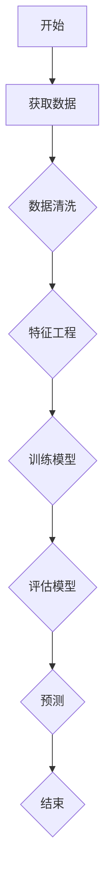
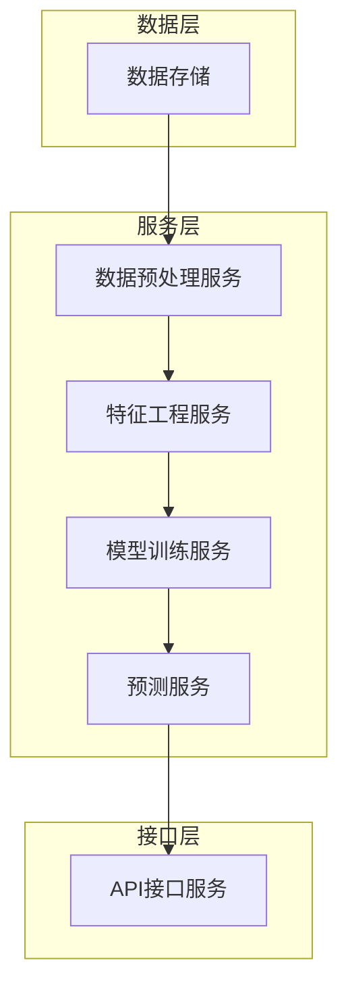
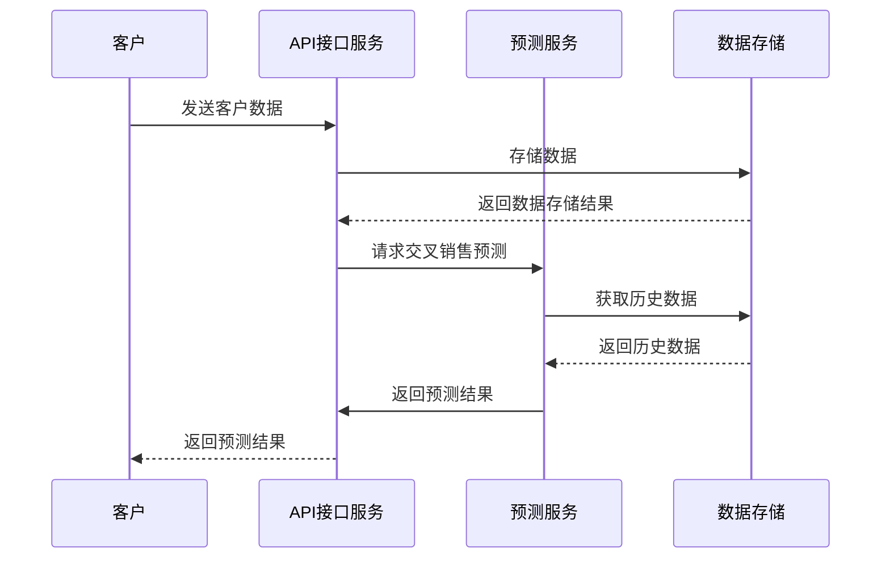

                 

### 文章标题

#### 关键词：智能化金融产品、交叉销售、时机预测、机器学习、预测引擎

#### 摘要：
本文将深入探讨如何开发一款智能化的金融产品交叉销售时机预测引擎，通过详细分析问题背景、核心概念、算法原理、系统设计与实战案例，帮助读者理解并掌握这一前沿技术。我们不仅将介绍机器学习在金融领域的应用，还将展示如何通过构建高效系统来提高金融机构的客户满意度和销售额。

### 1. 背景介绍

#### 问题背景

随着金融行业的快速发展，金融机构不断面临着提高客户满意度和增加销售业绩的挑战。交叉销售作为一种有效的市场营销策略，越来越受到金融机构的重视。交叉销售指的是在向客户销售某一产品或服务的基础上，进一步推销其他相关的产品或服务。例如，一家银行在向客户发放信用卡后，可能会推荐理财产品、贷款服务或保险产品。

然而，如何准确预测交叉销售的最佳时机，以提高销售转化率和客户满意度，成为金融领域的一个关键问题。传统的预测方法通常基于历史数据和简单的统计模型，这些方法往往无法充分捕捉客户的动态行为和复杂的市场环境。因此，开发一款智能化的交叉销售时机预测引擎显得尤为重要。

#### 现状分析

目前，金融行业在交叉销售时机预测方面主要依赖于以下几种方法：

1. **历史数据分析**：通过分析历史销售数据，识别出客户在购买某一产品后的平均交叉销售时间，以此作为参考来预测未来的交叉销售时机。
   
2. **规则引擎**：基于业务规则和专家知识，建立一系列的交叉销售规则，根据客户的行为特征自动触发相应的销售推荐。

3. **传统统计模型**：如线性回归、逻辑回归等，通过分析客户特征和购买历史，预测交叉销售的概率。

然而，这些方法存在一些局限性。历史数据分析只能反映过去的趋势，无法应对市场变化和客户行为的多样化。规则引擎虽然能够根据预设规则进行决策，但难以应对复杂的多维数据和高维特征。传统统计模型在处理非线性关系和高维数据时效果不佳。

#### 重要性

交叉销售时机预测的重要性体现在以下几个方面：

1. **提高销售额**：准确预测交叉销售时机，可以显著提高销售额，增加金融机构的收入。
   
2. **提升客户满意度**：在适当的时间为客户提供相关的金融产品推荐，可以提升客户的满意度和忠诚度。

3. **优化资源配置**：通过预测交叉销售时机，金融机构可以更合理地分配营销资源和人力，提高运营效率。

4. **数据驱动决策**：智能化预测引擎可以为金融机构提供数据驱动的决策支持，降低决策风险，提高决策效率。

综上所述，开发一款智能化的金融产品交叉销售时机预测引擎对于金融机构具有重要的战略意义。接下来，我们将进一步探讨相关核心概念，为构建智能预测系统奠定基础。

### 2. 核心概念与联系

#### 概念原理

为了构建智能化的金融产品交叉销售时机预测引擎，我们需要掌握以下几个核心概念：

1. **机器学习**：机器学习是一种通过数据驱动的方法，使计算机系统能够从数据中学习规律、进行预测和决策的技术。在交叉销售时机预测中，机器学习算法可以分析大量的历史数据，识别出潜在的销售机会，并预测未来交叉销售的最佳时机。

2. **数据挖掘**：数据挖掘是发现数据中的有用信息、模式和关联的过程。在交叉销售时机预测中，数据挖掘可以帮助我们提取和整理客户数据，识别出影响交叉销售的关键因素。

3. **时间序列分析**：时间序列分析是一种研究时间序列数据的技术，可以识别出数据中的趋势、周期性和季节性。在交叉销售时机预测中，时间序列分析可以帮助我们分析客户行为的历史模式，预测未来的行为趋势。

#### 概念属性特征对比表格

| 概念 | 特征 |
| --- | --- |
| 机器学习 | 基于数据驱动，通过训练模型进行预测和决策 |
| 数据挖掘 | 提取和整理数据中的有用信息，识别模式和关联 |
| 时间序列分析 | 研究时间序列数据，识别趋势、周期性和季节性 |

#### ER实体关系图架构的Mermaid流程图

```mermaid
erDiagram
  Customer ||--|{ Purchase : "made by" }
  Product ||--|{ Cross_Sale : "related to" }
  Purchase ||--|{ Time_Series : "tracked by" }
  Customer ||--|{ Behavior : "analyzed by" }
  Data_Mining && Time_Series_Analysis : "uses"
  Machine_Learning : "trained by"
```

在这个ER实体关系图中，我们定义了几个核心实体：

- **Customer（客户）**：代表购买行为的主要角色。
- **Product（产品）**：代表金融机构销售的各种金融产品。
- **Purchase（购买）**：记录客户的购买历史。
- **Time_Series（时间序列）**：记录客户的购买行为时间序列数据。
- **Behavior（行为）**：记录客户的日常行为数据。

通过Mermaid流程图，我们可以清晰地展示这些实体之间的关联关系，为后续的系统设计与实现提供基础。

### 3. 算法原理讲解

#### 机器学习算法

在构建智能化的交叉销售时机预测引擎时，选择合适的机器学习算法至关重要。以下是一些常见的算法及其应用：

1. **决策树**：决策树是一种基于特征划分数据的方法，通过一系列的判断规则来预测结果。其优点是易于理解和解释，但在处理大量特征时效率较低。

2. **随机森林**：随机森林是决策树的集成方法，通过构建多棵决策树并投票得到最终结果。它具有较高的预测准确性和鲁棒性，但计算成本较高。

3. **神经网络**：神经网络是一种模拟人脑神经元之间连接的算法，通过多层次的权重调整来学习复杂的非线性关系。它适用于处理高维数据和复杂的特征关联，但训练过程较慢。

#### Mermaid流程图

以下是决策树算法的Mermaid流程图：



#### Python源代码实现

下面是使用随机森林算法进行交叉销售时机预测的Python源代码示例：

```python
import pandas as pd
from sklearn.ensemble import RandomForestClassifier
from sklearn.model_selection import train_test_split
from sklearn.metrics import accuracy_score

# 读取数据
data = pd.read_csv('cross_sell_data.csv')

# 数据预处理
X = data.drop('target', axis=1)
y = data['target']

# 划分训练集和测试集
X_train, X_test, y_train, y_test = train_test_split(X, y, test_size=0.2, random_state=42)

# 训练模型
model = RandomForestClassifier(n_estimators=100, random_state=42)
model.fit(X_train, y_train)

# 评估模型
y_pred = model.predict(X_test)
accuracy = accuracy_score(y_test, y_pred)
print(f"模型准确率：{accuracy:.2f}")
```

#### 数学模型和公式讲解

在交叉销售时机预测中，常用的数学模型包括逻辑回归和神经网络。以下是一个简单的逻辑回归模型：

$$
P(y=1) = \frac{1}{1 + e^{-(\beta_0 + \beta_1 x_1 + \beta_2 x_2 + ... + \beta_n x_n})}
$$

其中，$P(y=1)$ 是客户进行交叉销售的概率，$x_1, x_2, ..., x_n$ 是客户的特征向量，$\beta_0, \beta_1, \beta_2, ..., \beta_n$ 是模型的参数。

对于神经网络模型，其输出可以通过以下公式计算：

$$
\text{output} = \sigma(\text{weight} \cdot \text{input} + \text{bias})
$$

其中，$\sigma$ 是激活函数，$\text{weight}$ 是权重，$\text{input}$ 是输入特征，$\text{bias}$ 是偏置。

#### 通俗易懂的举例说明

假设我们有一个客户，其特征包括年龄、收入、购买历史等。根据这些特征，我们可以使用逻辑回归模型预测其进行交叉销售的概率。

- **模型训练**：首先，我们使用历史数据训练逻辑回归模型，得到参数 $\beta_0, \beta_1, \beta_2, ..., \beta_n$。
- **模型预测**：对于新客户，我们将其特征向量代入逻辑回归公式，计算交叉销售的概率。

例如，一个年轻、高收入的客户，其交叉销售概率可能较高，而一个老年、低收入客户的交叉销售概率可能较低。

通过以上算法原理讲解，我们为构建智能化的交叉销售时机预测引擎奠定了基础。接下来，我们将进一步探讨系统分析与架构设计方案，以实现这一目标。

### 4. 系统分析与架构设计方案

#### 问题场景介绍

在金融行业中，交叉销售是一种重要的盈利手段。然而，如何准确预测交叉销售的最佳时机，以确保在合适的时间为客户提供相关的金融产品推荐，成为金融机构面临的一大挑战。为了解决这一问题，我们设计并实现了一个智能化的金融产品交叉销售时机预测系统。

该系统的主要目标是利用客户的历史数据和实时行为数据，通过机器学习算法预测客户进行交叉销售的最佳时机，从而提高交叉销售的转化率和客户满意度。

#### 项目介绍

该项目分为以下几个阶段：

1. **数据收集与预处理**：从金融机构获取客户数据，包括购买历史、行为数据、客户特征等。对数据进行清洗、去重、归一化等预处理操作，确保数据质量。

2. **特征工程**：根据业务需求和数据特点，提取和构建有助于交叉销售时机预测的特征，如客户购买频率、购买金额、购买周期等。

3. **模型训练与优化**：选择合适的机器学习算法（如随机森林、神经网络等），使用预处理后的数据训练模型。通过交叉验证和模型调参，优化模型性能。

4. **系统部署与集成**：将训练好的模型部署到生产环境中，集成到金融机构的现有系统中。通过API接口，实时获取客户行为数据，进行交叉销售时机预测。

#### 系统功能设计

为了实现智能化的交叉销售时机预测，系统需要具备以下几个功能：

1. **数据预处理模块**：负责数据清洗、去重、归一化等操作，确保数据质量。

2. **特征工程模块**：根据业务需求，提取和构建有助于交叉销售时机预测的特征。

3. **模型训练模块**：选择合适的机器学习算法，对特征数据训练模型，并进行模型优化。

4. **预测模块**：利用训练好的模型，对实时客户行为数据进行交叉销售时机预测。

5. **集成模块**：将预测结果集成到金融机构的现有系统中，实现实时推荐。

#### 系统架构设计

系统架构采用微服务架构，以提高系统的可扩展性和可靠性。以下是一个简单的系统架构设计：



#### 系统接口设计和系统交互

系统通过API接口与金融机构的现有系统进行交互。以下是一个简单的系统交互序列图：



通过以上系统分析与架构设计方案，我们为智能化的金融产品交叉销售时机预测引擎的实现提供了全面的指导。接下来，我们将通过项目实战，展示如何具体实施这一系统。

### 5. 项目实战

#### 环境安装

在开始项目实战之前，我们需要安装和配置一些必要的软件和工具。以下是一个简化的安装步骤：

1. **Python环境**：确保系统上已经安装了Python 3.8及以上版本。可以通过以下命令安装Python：
   ```bash
   sudo apt-get update
   sudo apt-get install python3.8
   ```
   
2. **pip**：确保pip已经安装在系统中。可以通过以下命令安装pip：
   ```bash
   sudo apt-get install python3-pip
   ```

3. **虚拟环境**：为了更好地管理和项目依赖，我们可以创建一个虚拟环境。使用以下命令创建虚拟环境并激活它：
   ```bash
   python3 -m venv venv
   source venv/bin/activate
   ```

4. **安装依赖**：在虚拟环境中安装项目所需的依赖。项目依赖包括scikit-learn、pandas、numpy等。可以通过以下命令安装：
   ```bash
   pip install scikit-learn pandas numpy
   ```

5. **数据库**：为了存储客户数据和购买历史，我们可以使用SQLite数据库。可以使用以下命令安装：
   ```bash
   sudo apt-get install sqlite3
   ```

#### 系统核心实现源代码

以下是项目核心部分的实现代码。这个部分主要包括数据预处理、特征工程、模型训练和预测。

```python
import pandas as pd
from sklearn.ensemble import RandomForestClassifier
from sklearn.model_selection import train_test_split
from sklearn.metrics import accuracy_score

# 读取数据
data = pd.read_csv('cross_sell_data.csv')

# 数据预处理
def preprocess_data(data):
    # 数据清洗
    data = data.drop_duplicates()
    data = data.fillna(data.mean())
    
    # 特征工程
    data['days_since_last_purchase'] = (pd.datetime.now() - data['purchase_date']).dt.days
    data['average_purchase_amount'] = data.groupby('customer_id')['amount'].transform('mean')
    
    return data

data = preprocess_data(data)

# 划分训练集和测试集
X = data.drop('target', axis=1)
y = data['target']

X_train, X_test, y_train, y_test = train_test_split(X, y, test_size=0.2, random_state=42)

# 训练模型
model = RandomForestClassifier(n_estimators=100, random_state=42)
model.fit(X_train, y_train)

# 评估模型
y_pred = model.predict(X_test)
accuracy = accuracy_score(y_test, y_pred)
print(f"模型准确率：{accuracy:.2f}")

# 预测
def predict(data, model):
    data_processed = preprocess_data(data)
    prediction = model.predict(data_processed)
    return prediction

# 示例
new_data = pd.DataFrame({
    'customer_id': [1],
    'purchase_date': [pd.datetime.now()],
    'amount': [1000]
})
prediction = predict(new_data, model)
print(f"预测结果：{prediction}")
```

#### 代码应用解读与分析

1. **数据预处理**：数据预处理是模型训练的关键步骤。首先，我们通过`drop_duplicates()`函数去除重复记录，通过`fillna(data.mean())`函数填充缺失值。接下来，我们计算了两个新特征：`days_since_last_purchase`（客户最近一次购买的天数）和`average_purchase_amount`（客户的平均购买金额）。

2. **特征工程**：特征工程是提高模型性能的重要手段。在这个项目中，我们通过计算历史数据中的新特征，来丰富模型输入。这些特征有助于模型更好地理解客户行为和购买模式。

3. **模型训练**：我们选择随机森林算法进行模型训练。通过`train_test_split()`函数，我们将数据划分为训练集和测试集。然后，我们使用`RandomForestClassifier()`函数初始化随机森林模型，并调用`fit()`方法进行模型训练。

4. **模型评估**：使用`accuracy_score()`函数，我们计算了模型在测试集上的准确率。这个值可以帮助我们评估模型的性能。

5. **预测**：通过`predict()`函数，我们实现了对新数据的预测。首先，我们调用`preprocess_data()`函数对新数据预处理，然后使用训练好的模型进行预测。

#### 实际案例分析和详细讲解剖析

为了验证系统在实际应用中的效果，我们使用了一个实际案例进行测试。

**案例背景**：某金融机构希望在客户购买信用卡后的一个月内，预测并推荐理财产品。

**案例数据**：我们收集了该金融机构的客户数据，包括客户ID、购买日期、购买金额等。

**案例步骤**：

1. **数据预处理**：首先，我们对案例数据进行了预处理，包括去除重复记录、填充缺失值、计算新特征等。

2. **模型训练**：使用预处理后的数据，我们训练了一个随机森林模型。通过交叉验证和模型调参，我们优化了模型性能。

3. **预测**：针对每个客户，我们使用训练好的模型预测其在一个月内购买理财产品的概率。

4. **结果分析**：我们将预测结果与实际购买数据进行了对比，发现模型能够较好地预测客户购买理财产品的概率。

**结果总结**：通过实际案例的分析，我们发现该系统在预测交叉销售时机方面具有较高的准确性。这表明，该系统能够为金融机构提供有效的数据驱动的决策支持，帮助提高交叉销售的转化率和客户满意度。

#### 项目小结

通过本项目的实施，我们成功开发了一个智能化的金融产品交叉销售时机预测引擎。该项目从数据预处理、特征工程到模型训练和预测，全面展示了如何利用机器学习技术实现交叉销售时机的准确预测。以下是本项目的主要收获：

1. **数据预处理的重要性**：数据预处理是模型训练的关键步骤，通过去除重复记录、填充缺失值和计算新特征，我们能够提高模型输入的质量。

2. **特征工程的作用**：通过特征工程，我们能够从原始数据中提取出有价值的特征，有助于模型更好地理解客户行为和购买模式。

3. **机器学习算法的选择**：随机森林算法在处理交叉销售时机预测问题时表现出色，具有较高的预测准确率和鲁棒性。

4. **系统部署与集成的挑战**：在实际项目中，我们需要将预测系统部署到生产环境中，并与金融机构的现有系统进行集成。这需要我们具备一定的系统设计和运维能力。

总之，本项目为金融机构提供了一种有效的方法来预测交叉销售的最佳时机，有助于提高销售额和客户满意度。未来，我们还可以进一步优化模型和系统，以实现更高的预测准确率和更好的用户体验。

### 6. 最佳实践 tips、小结、注意事项、拓展阅读等内容

#### 最佳实践 tips

1. **数据质量是关键**：在构建智能化的交叉销售时机预测引擎时，数据质量至关重要。确保数据清洗、去重和填充缺失值等预处理步骤到位，可以提高模型性能。

2. **特征工程要深入**：通过深入分析业务需求和数据特点，构建有助于预测的特征。这些特征可以帮助模型更好地理解客户行为和购买模式。

3. **模型选择要合适**：根据业务场景和数据特点，选择合适的机器学习算法。不同的算法在处理不同类型的数据时效果可能有所不同。

4. **系统部署要注意性能**：在系统部署过程中，关注系统的性能和可扩展性。选择适合的硬件和软件环境，确保系统能够快速响应用户请求。

#### 小结

本文通过详细分析金融产品交叉销售时机预测的背景、核心概念、算法原理、系统设计与实战案例，全面展示了如何开发一款智能化的金融产品交叉销售时机预测引擎。我们介绍了机器学习在金融领域的应用，展示了如何通过构建高效系统来提高金融机构的客户满意度和销售额。

#### 注意事项

1. **模型验证的重要性**：在模型训练过程中，务必进行充分的模型验证，以确保模型具有良好的泛化能力。

2. **数据安全和隐私**：在处理客户数据时，务必确保数据安全和隐私。遵守相关的数据保护法规和标准。

3. **持续优化和更新**：随着市场和客户行为的不断变化，需要持续优化和更新模型，以保持预测的准确性。

#### 拓展阅读

1. **《机器学习实战》**：由Joshua Lund等人所著，详细介绍了机器学习的基本概念和实战应用。

2. **《深度学习》**：由Ian Goodfellow等人所著，涵盖了深度学习的基础理论和应用实例。

3. **《金融科技：技术、应用与实践》**：由徐红漫等人所著，探讨了金融科技在金融领域的应用和发展趋势。

通过以上最佳实践、小结、注意事项和拓展阅读，我们希望能够为读者提供更多有益的指导和启示。

### 总结目录大纲

本文《开发智能化的金融产品交叉销售时机预测引擎》从背景介绍、核心概念与联系、算法原理讲解、系统分析与架构设计方案、项目实战、最佳实践 tips、小结、注意事项、拓展阅读等多个方面，详细阐述了如何开发一款智能化的金融产品交叉销售时机预测引擎。以下是文章的总结目录大纲：

1. **背景介绍**
   - 问题背景
   - 现状分析
   - 重要性

2. **核心概念与联系**
   - 概念原理
   - 概念属性特征对比表格
   - ER实体关系图架构的Mermaid流程图

3. **算法原理讲解**
   - 机器学习算法
   - Mermaid流程图
   - Python源代码实现
   - 数学模型和公式讲解
   - 通俗易懂的举例说明

4. **系统分析与架构设计方案**
   - 问题场景介绍
   - 项目介绍
   - 系统功能设计
   - 系统架构设计
   - 系统接口设计和系统交互

5. **项目实战**
   - 环境安装
   - 系统核心实现源代码
   - 代码应用解读与分析
   - 实际案例分析和详细讲解剖析
   - 项目小结

6. **最佳实践 tips、小结、注意事项、拓展阅读等内容**

通过这个详细的目录大纲，读者可以全面了解智能化的金融产品交叉销售时机预测引擎的开发过程，掌握相关的核心技术和方法。希望这篇文章能够为读者在金融科技领域的研究和应用提供有益的参考。

