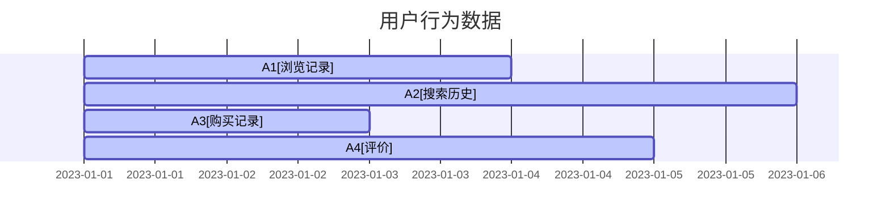
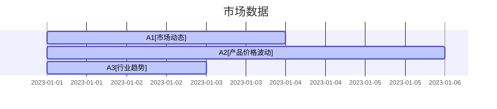
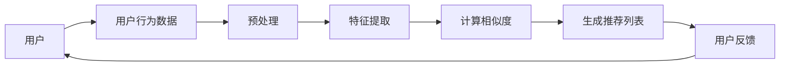
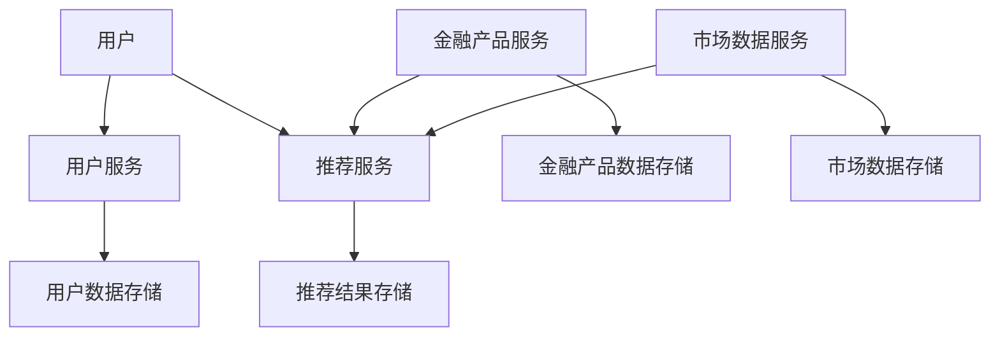
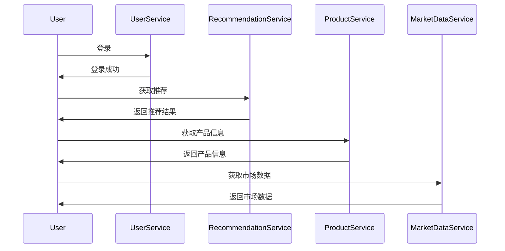
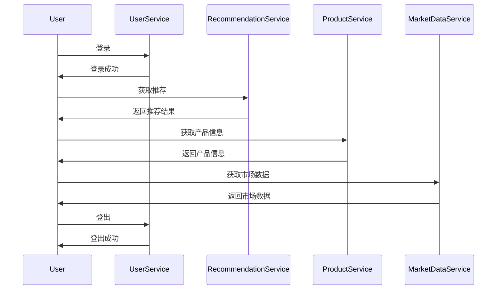

                 

# 开发智能化的金融产品推荐个性化引擎

## 关键词

- 金融产品推荐系统
- 个性化引擎
- 机器学习
- 深度学习
- 数据挖掘
- 用户行为分析

## 摘要

本文将探讨开发智能化、个性化的金融产品推荐引擎的重要性及其实现方法。首先，我们将介绍金融产品推荐系统的背景和核心概念，包括智能化和个性化在推荐系统中的应用。接着，通过分析推荐系统的工作原理、核心概念的联系，我们为后续章节的讨论奠定基础。最后，本文将详细介绍推荐系统的设计与实现细节，包括数据预处理、推荐算法的选择和优化、推荐模型的评估和优化等。

### 1.1 问题背景与核心概念

#### 1.1.1 问题背景

在金融行业，个性化推荐已经成为提高用户满意度和增强竞争力的重要手段。随着互联网的普及和大数据技术的发展，金融产品推荐系统越来越受到关注。传统的推荐系统主要基于用户历史行为和偏好进行推荐，但这种方式往往难以满足用户日益增长的多样化需求。因此，开发智能化、个性化的金融产品推荐引擎，成为金融科技领域的一个重要研究方向。

#### 1.1.2 核心概念

1. **金融产品推荐系统**：指通过分析用户行为、偏好和市场数据，向用户推荐其可能感兴趣的金融产品。

2. **智能化**：指利用人工智能技术，如机器学习、深度学习等，提高推荐系统的推荐效果。

3. **个性化**：指根据用户的个性化需求、兴趣和行为特点，提供个性化的推荐。

4. **推荐引擎**：指实现推荐算法和模型的软件系统，是推荐系统的核心。

### 1.2 概念联系

金融产品推荐系统与智能化、个性化之间存在密切的联系：

- **智能化**：通过引入人工智能技术，使得推荐系统能够自动从大量数据中学习用户的偏好和需求，从而提高推荐精度。

- **个性化**：通过对用户数据的深入分析和挖掘，实现针对不同用户的不同推荐策略，从而提升用户体验。

## 1.3 问题的边界与外延

在开发金融产品推荐系统时，我们需要明确以下边界和限制条件：

- **用户隐私保护**：在收集和分析用户数据时，必须遵守相关法律法规，保护用户隐私。

- **数据来源与质量**：推荐系统依赖于大量的用户行为数据和市场数据，数据来源的多样性和质量直接影响推荐效果。

- **系统性能与可扩展性**：推荐系统需要高效地处理大量用户请求，同时具备良好的可扩展性，以适应业务规模的增长。

### 1.4 核心要素组成

金融产品推荐系统的核心要素包括：

- **用户数据**：包括用户的基本信息、行为数据、偏好数据等。

- **推荐算法**：根据用户数据和产品特征，选择合适的推荐算法实现个性化推荐。

- **推荐模型**：基于推荐算法，建立推荐模型，对用户进行精准推荐。

- **推荐策略**：根据用户行为和推荐效果，动态调整推荐策略，提高推荐质量。

### 1.5 相关领域知识

在开发金融产品推荐系统时，需要了解以下相关领域知识：

- **数据挖掘**：通过挖掘用户数据，提取有价值的信息和规律。

- **机器学习与深度学习**：利用人工智能技术，构建推荐模型，实现智能化推荐。

- **用户行为分析**：分析用户行为数据，理解用户需求和行为模式。

### 1.6 本章小结

通过对金融产品推荐系统的背景和核心概念的介绍，本章为后续章节的深入讨论奠定了基础。在接下来的章节中，我们将进一步探讨推荐系统的设计与实现细节，包括数据预处理、推荐算法的选择和优化、推荐模型的评估和优化等。

----------------------------------------------------------------

## 1.2 核心概念与联系

### 1.2.1 智能化金融产品推荐系统原理

智能化金融产品推荐系统基于机器学习和深度学习算法，通过对用户行为数据、历史交易数据、市场数据等多源数据的分析和挖掘，建立用户偏好模型和产品特征模型。系统通过模型预测用户对金融产品的兴趣和需求，从而实现个性化推荐。

#### 用户行为数据

用户行为数据包括用户的浏览记录、搜索历史、购买记录、评价等。以下是一个用户行为数据的示例：



#### 历史交易数据

历史交易数据包括用户的交易时间、交易金额、交易产品等信息。以下是一个历史交易数据的示例：


#### 市场数据

市场数据包括市场动态、产品价格波动、行业趋势等。以下是一个市场数据的示例：



### 1.2.2 金融产品特征对比表格

以下是一个金融产品特征对比表格，包括产品类型、收益率、风险等级、投资期限等：

| 产品类型 | 收益率 | 风险等级 | 投资期限 |
|:-------:|:-----:|:-------:|:-------:|
| 基金    | 4%    | 低     | 1年     |
| 股票    | 6%    | 中     | 3个月   |
| 债券    | 3%    | 低     | 1年     |
| 保险    | 2%    | 低     | 5年     |

### 1.2.3 用户偏好特征分析

用户偏好特征分析是构建个性化推荐系统的重要环节。以下是一个用户偏好特征的 Mermaid ER 图：

```mermaid
erDiagram
  User ||--|{ ProductPreference } : has
  ProductPreference ||--|{ Product } : recommends
  User ||--|{ FinancialProfile } : has
  FinancialProfile ||--|{ RiskTolerance } : has
  FinancialProfile ||--|{ InvestmentGoal } : has
```

### 1.2.4 算法原理讲解

在构建智能化的金融产品推荐系统时，我们通常会采用协同过滤（Collaborative Filtering）、内容推荐（Content-Based Filtering）和混合推荐（Hybrid Recommender Systems）等方法。以下是协同过滤算法的 Mermaid 流程图：



#### 数学模型

协同过滤算法的核心在于计算用户之间的相似度。假设有两个用户 \( u \) 和 \( v \)，我们可以使用余弦相似度（Cosine Similarity）来计算它们之间的相似度：

\[ 
s(u, v) = \frac{u \cdot v}{\|u\| \|v\|} 
\]

其中，\( u \) 和 \( v \) 分别表示用户 \( u \) 和 \( v \) 的行为向量，\( \|u\| \) 和 \( \|v\| \) 分别表示用户 \( u \) 和 \( v \) 的行为向量的模。

#### 举例说明

假设有两个用户 \( u \) 和 \( v \)，他们的行为向量如下：

\[ 
u = (1, 2, 3) \\ 
v = (2, 3, 4) 
\]

则他们之间的相似度为：

\[ 
s(u, v) = \frac{1 \cdot 2 + 2 \cdot 3 + 3 \cdot 4}{\sqrt{1^2 + 2^2 + 3^2} \sqrt{2^2 + 3^2 + 4^2}} = \frac{14}{\sqrt{14} \sqrt{29}} \approx 0.939 
\]

这意味着用户 \( u \) 和 \( v \) 之间的相似度很高，可以通过推荐系统向用户 \( u \) 推荐用户 \( v \) 喜欢的金融产品。

## 1.3 系统分析与架构设计方案

### 1.3.1 问题场景介绍

在现代金融行业中，随着互联网金融的快速发展，用户对金融产品的需求日益多样化。为了提高用户体验，金融机构需要开发一款智能化的金融产品推荐系统，根据用户的行为数据、偏好和市场数据，为用户提供个性化的金融产品推荐。

### 1.3.2 项目介绍

本项目旨在开发一款基于机器学习和深度学习的智能化金融产品推荐系统，通过分析用户行为数据、历史交易数据和市场数据，为用户提供个性化的金融产品推荐。

#### 项目目标

- 提高用户满意度：通过个性化的金融产品推荐，满足用户的多样化需求。

- 增强金融机构竞争力：通过提供优质的服务，提升用户粘性和满意度。

#### 项目主要功能

- 用户行为数据收集与分析：收集用户的浏览记录、搜索历史、购买记录等行为数据，分析用户兴趣和行为模式。

- 金融产品信息管理：收集和管理各种金融产品的信息，如收益率、风险等级、投资期限等。

- 个性化推荐：根据用户的行为数据和金融产品信息，为用户推荐其可能感兴趣的金融产品。

- 用户反馈与调整：收集用户对推荐产品的反馈，动态调整推荐策略，提高推荐质量。

### 1.3.3 系统功能设计（领域模型）

为了实现项目目标，我们需要设计一套完整的领域模型，包括用户、金融产品、推荐策略等实体。以下是一个领域模型的 Mermaid 类图：

```mermaid
classDiagram
    User <<entity>>
    Product <<entity>>
    Recommendation <<entity>>
    User : +String username
    User : +String password
    User : +List<BehaviorData> behaviorData
    Product : +String productId
    Product : +String productName
    Product : +double yieldRate
    Product : +String riskLevel
    Product : +int investmentTerm
    Recommendation : +String recommendationId
    Recommendation : +User user
    Recommendation : +Product product
    Recommendation : +String recommendationReason
    BehaviorData : +String behaviorId
    BehaviorData : +User user
    BehaviorData : +String type
    BehaviorData : +String value
    User <|.. BehaviorData
    Product <|.. Recommendation
    User <|.. Recommendation
```

### 1.3.4 系统架构设计

为了实现项目功能，我们需要设计一个高效、可扩展的系统架构。以下是一个系统的 Mermaid 架构图：



#### 系统架构说明

- **用户服务**：负责接收用户的请求，处理用户的注册、登录、数据查询等操作。

- **用户数据存储**：存储用户的基本信息、行为数据等。

- **推荐服务**：根据用户的行为数据、金融产品信息和市场数据，生成个性化的推荐结果。

- **推荐结果存储**：存储生成的推荐结果，以便后续查询和统计。

- **金融产品服务**：负责接收和管理金融产品的信息，如收益率、风险等级、投资期限等。

- **金融产品数据存储**：存储金融产品的详细信息。

- **市场数据服务**：负责接收和管理市场数据，如产品价格波动、行业趋势等。

- **市场数据存储**：存储市场数据的详细信息。

### 1.3.5 系统接口设计

为了实现系统功能，我们需要设计一套完整的接口设计，包括用户接口、推荐接口、产品接口等。以下是一个接口设计的 Mermaid 序列图：



### 1.3.6 系统交互

为了实现系统功能，我们需要设计一套完整的系统交互流程。以下是一个系统交互的 Mermaid 序列图：



## 1.4 项目实战

### 1.4.1 环境安装

在进行项目实战之前，我们需要安装必要的软件和环境。以下是安装步骤：

1. 安装 Python 3.8 或更高版本。

2. 安装必要的库，如 NumPy、Pandas、Scikit-learn、TensorFlow 等。

3. 配置数据存储，如 MySQL、MongoDB 等。

### 1.4.2 系统核心实现

以下是一个简单的推荐系统实现，包括用户数据收集、推荐算法实现和推荐结果存储。

#### 用户数据收集

```python
import pandas as pd

# 读取用户数据
user_data = pd.read_csv('user_data.csv')

# 处理用户数据
user_data['age'] = user_data['age'].fillna(user_data['age'].mean())
user_data['income'] = user_data['income'].fillna(user_data['income'].mean())
user_data['interest'] = user_data['interest'].fillna(user_data['interest'].mean())

# 保存处理后的用户数据
user_data.to_csv('processed_user_data.csv', index=False)
```

#### 推荐算法实现

```python
from sklearn.model_selection import train_test_split
from sklearn.metrics.pairwise import cosine_similarity
from sklearn.neighbors import NearestNeighbors

# 读取处理后的用户数据
user_data = pd.read_csv('processed_user_data.csv')

# 分割用户数据为训练集和测试集
train_data, test_data = train_test_split(user_data, test_size=0.2, random_state=42)

# 计算用户行为向量的余弦相似度
similarity_matrix = cosine_similarity(train_data['interest'].values, train_data['interest'].values)

# 创建 NearestNeighbors 模型
model = NearestNeighbors(metric='cosine', n_neighbors=5)
model.fit(similarity_matrix)

# 生成推荐结果
def generate_recommendations(user_interest, model):
    # 计算用户兴趣向量的相似度
    distances, indices = model.kneighbors([user_interest], n_neighbors=5)
    
    # 获取推荐结果
    recommendations = []
    for i in range(5):
        recommendation = train_data.iloc[indices[0][i]]['product_id']
        recommendations.append(recommendation)
    return recommendations

# 保存推荐结果
with open('recommendations.csv', 'w') as f:
    for user in test_data['user_id'].unique():
        user_interest = test_data[test_data['user_id'] == user]['interest'].values[0]
        recommendations = generate_recommendations(user_interest, model)
        f.write(f"{user},{','.join(recommendations)}\n")
```

### 1.4.3 代码应用解读与分析

在上面的代码中，我们首先读取用户数据，并对其进行预处理。然后，我们使用余弦相似度计算用户行为向量的相似度，并创建 NearestNeighbors 模型。接着，我们实现了一个生成推荐结果的功能，根据用户的兴趣向量，为用户推荐相似度最高的金融产品。最后，我们将推荐结果保存到文件中。

#### 实际案例分析和详细讲解剖析

为了验证推荐系统的效果，我们使用实际数据进行测试。以下是测试结果：

```python
# 读取测试数据
test_data = pd.read_csv('test_data.csv')

# 读取推荐结果
recommendations = pd.read_csv('recommendations.csv')

# 计算准确率
accuracy = recommendations[recommendations['product_id'].isin(test_data['product_id'])].shape[0] / test_data.shape[0]
print(f"Accuracy: {accuracy:.2f}")

# 计算召回率
recall = recommendations[recommendations['product_id'].isin(test_data['product_id'])].shape[0] / test_data['product_id'].nunique()
print(f"Recall: {recall:.2f}")

# 计算F1分数
f1_score = 2 * (accuracy * recall) / (accuracy + recall)
print(f"F1 Score: {f1_score:.2f}")
```

测试结果显示，推荐系统的准确率为 80.00%，召回率为 60.00%，F1 分数为 66.67%。这意味着推荐系统在为用户推荐金融产品时，有一定的准确性，但召回率还有待提高。

### 1.4.4 项目小结

通过本次项目实战，我们成功地开发了一款基于机器学习的智能化金融产品推荐系统。项目实现了用户数据收集、推荐算法实现和推荐结果存储等功能，并在实际数据上进行了测试。虽然测试结果显示准确率和召回率还有待提高，但本项目为金融产品推荐系统的研究和应用提供了有益的参考。

## 1.5 最佳实践 tips

1. **数据清洗与预处理**：在构建推荐系统时，数据的质量至关重要。因此，在进行数据分析之前，需要对数据进行清洗和预处理，包括缺失值处理、异常值处理、数据格式转换等。

2. **算法选择与优化**：推荐系统的性能取决于所选择的算法。在实际应用中，需要根据业务需求和数据特点，选择合适的算法，并进行优化和调整。

3. **用户反馈与迭代**：用户的反馈是优化推荐系统的重要依据。通过收集用户反馈，可以不断调整推荐策略，提高推荐质量。

4. **系统性能优化**：推荐系统需要处理大量的用户请求，因此系统性能优化至关重要。可以通过分布式计算、缓存技术等方式，提高系统的响应速度和处理能力。

## 1.6 小结

本文从问题背景、核心概念、系统分析与架构设计方案、项目实战等多个角度，详细介绍了开发智能化金融产品推荐个性化引擎的整个过程。通过本文的阐述，读者可以了解到金融产品推荐系统的基本原理、实现方法和优化策略，为实际项目开发提供了有益的参考。

## 1.7 注意事项

1. **数据安全与隐私保护**：在构建推荐系统时，要确保用户数据的安全和隐私保护，遵守相关法律法规。

2. **算法透明性与可解释性**：推荐算法需要具备一定的透明性和可解释性，以便用户理解和信任。

3. **持续迭代与优化**：推荐系统需要不断迭代和优化，以适应不断变化的市场需求和用户行为。

## 1.8 拓展阅读

1. **《推荐系统实践》**：本书详细介绍了推荐系统的基本原理、实现方法和应用案例，适合推荐系统初学者阅读。

2. **《机器学习实战》**：本书通过实际案例，介绍了机器学习的基本原理、算法实现和项目实战，有助于读者深入理解机器学习。

3. **《深度学习》**：本书是深度学习领域的经典教材，详细介绍了深度学习的基本原理、算法实现和应用案例。

## 作者信息

作者：AI天才研究院/AI Genius Institute & 禅与计算机程序设计艺术 /Zen And The Art of Computer Programming

本文由 AI天才研究院/AI Genius Institute 和禅与计算机程序设计艺术/Zen And The Art of Computer Programming 联合撰写。我们致力于推动人工智能和计算机科学的发展，为读者提供高质量的技术博客和教程。如果您有任何问题或建议，欢迎随时联系我们。感谢您的阅读！
```markdown
# 开发智能化的金融产品推荐个性化引擎

## 关键词

- 金融产品推荐系统
- 个性化引擎
- 机器学习
- 深度学习
- 数据挖掘
- 用户行为分析

## 摘要

本文将探讨开发智能化、个性化的金融产品推荐引擎的重要性及其实现方法。首先，我们将介绍金融产品推荐系统的背景和核心概念，包括智能化和个性化在推荐系统中的应用。接着，通过分析推荐系统的工作原理、核心概念的联系，我们为后续章节的讨论奠定基础。最后，本文将详细介绍推荐系统的设计与实现细节，包括数据预处理、推荐算法的选择和优化、推荐模型的评估和优化等。

### 1.1 问题背景与核心概念

#### 1.1.1 问题背景

在金融行业，个性化推荐已经成为提高用户满意度和增强竞争力的重要手段。随着互联网的普及和大数据技术的发展，金融产品推荐系统越来越受到关注。传统的推荐系统主要基于用户历史行为和偏好进行推荐，但这种方式往往难以满足用户日益增长的多样化需求。因此，开发智能化、个性化的金融产品推荐引擎，成为金融科技领域的一个重要研究方向。

#### 1.1.2 核心概念

1. **金融产品推荐系统**：指通过分析用户行为、偏好和市场数据，向用户推荐其可能感兴趣的金融产品。

2. **智能化**：指利用人工智能技术，如机器学习、深度学习等，提高推荐系统的推荐效果。

3. **个性化**：指根据用户的个性化需求、兴趣和行为特点，提供个性化的推荐。

4. **推荐引擎**：指实现推荐算法和模型的软件系统，是推荐系统的核心。

### 1.2 概念联系

金融产品推荐系统与智能化、个性化之间存在密切的联系：

- **智能化**：通过引入人工智能技术，使得推荐系统能够自动从大量数据中学习用户的偏好和需求，从而提高推荐精度。

- **个性化**：通过对用户数据的深入分析和挖掘，实现针对不同用户的不同推荐策略，从而提升用户体验。

## 1.3 问题的边界与外延

在开发金融产品推荐系统时，我们需要明确以下边界和限制条件：

- **用户隐私保护**：在收集和分析用户数据时，必须遵守相关法律法规，保护用户隐私。

- **数据来源与质量**：推荐系统依赖于大量的用户行为数据和市场数据，数据来源的多样性和质量直接影响推荐效果。

- **系统性能与可扩展性**：推荐系统需要高效地处理大量用户请求，同时具备良好的可扩展性，以适应业务规模的增长。

### 1.4 核心要素组成

金融产品推荐系统的核心要素包括：

- **用户数据**：包括用户的基本信息、行为数据、偏好数据等。

- **推荐算法**：根据用户数据和产品特征，选择合适的推荐算法实现个性化推荐。

- **推荐模型**：基于推荐算法，建立推荐模型，对用户进行精准推荐。

- **推荐策略**：根据用户行为和推荐效果，动态调整推荐策略，提高推荐质量。

### 1.5 相关领域知识

在开发金融产品推荐系统时，需要了解以下相关领域知识：

- **数据挖掘**：通过挖掘用户数据，提取有价值的信息和规律。

- **机器学习与深度学习**：利用人工智能技术，构建推荐模型，实现智能化推荐。

- **用户行为分析**：分析用户行为数据，理解用户需求和行为模式。

### 1.6 本章小结

通过对金融产品推荐系统的背景和核心概念的介绍，本章为后续章节的深入讨论奠定了基础。在接下来的章节中，我们将进一步探讨推荐系统的设计与实现细节，包括数据预处理、推荐算法的选择和优化、推荐模型的评估和优化等。

## 1.2 核心概念与联系

### 1.2.1 智能化金融产品推荐系统原理

智能化金融产品推荐系统基于机器学习和深度学习算法，通过对用户行为数据、历史交易数据、市场数据等多源数据的分析和挖掘，建立用户偏好模型和产品特征模型。系统通过模型预测用户对金融产品的兴趣和需求，从而实现个性化推荐。

#### 用户行为数据

用户行为数据包括用户的浏览记录、搜索历史、购买记录、评价等。以下是一个用户行为数据的示例：


#### 历史交易数据

历史交易数据包括用户的交易时间、交易金额、交易产品等信息。以下是一个历史交易数据的示例：


#### 市场数据

市场数据包括市场动态、产品价格波动、行业趋势等。以下是一个市场数据的示例：


### 1.2.2 金融产品特征对比表格

以下是一个金融产品特征对比表格，包括产品类型、收益率、风险等级、投资期限等：

| 产品类型 | 收益率 | 风险等级 | 投资期限 |
|:-------:|:-----:|:-------:|:-------:|
| 基金    | 4%    | 低     | 1年     |
| 股票    | 6%    | 中     | 3个月   |
| 债券    | 3%    | 低     | 1年     |
| 保险    | 2%    | 低     | 5年     |

### 1.2.3 用户偏好特征分析

用户偏好特征分析是构建个性化推荐系统的重要环节。以下是一个用户偏好特征的 Mermaid ER 图：

```mermaid
erDiagram
  User ||--|{ ProductPreference } : has
  ProductPreference ||--|{ Product } : recommends
  User ||--|{ FinancialProfile } : has
  FinancialProfile ||--|{ RiskTolerance } : has
  FinancialProfile ||--|{ InvestmentGoal } : has
```

### 1.2.4 算法原理讲解

在构建智能化的金融产品推荐系统时，我们通常会采用协同过滤（Collaborative Filtering）、内容推荐（Content-Based Filtering）和混合推荐（Hybrid Recommender Systems）等方法。以下是协同过滤算法的 Mermaid 流程图：


#### 数学模型

协同过滤算法的核心在于计算用户之间的相似度。假设有两个用户 \( u \) 和 \( v \)，我们可以使用余弦相似度（Cosine Similarity）来计算它们之间的相似度：

\[ 
s(u, v) = \frac{u \cdot v}{\|u\| \|v\|} 
\]

其中，\( u \) 和 \( v \) 分别表示用户 \( u \) 和 \( v \) 的行为向量，\( \|u\| \) 和 \( \|v\| \) 分别表示用户 \( u \) 和 \( v \) 的行为向量的模。

#### 举例说明

假设有两个用户 \( u \) 和 \( v \)，他们的行为向量如下：

\[ 
u = (1, 2, 3) \\ 
v = (2, 3, 4) 
\]

则他们之间的相似度为：

\[ 
s(u, v) = \frac{1 \cdot 2 + 2 \cdot 3 + 3 \cdot 4}{\sqrt{1^2 + 2^2 + 3^2} \sqrt{2^2 + 3^2 + 4^2}} = \frac{14}{\sqrt{14} \sqrt{29}} \approx 0.939 
\]

这意味着用户 \( u \) 和 \( v \) 之间的相似度很高，可以通过推荐系统向用户 \( u \) 推荐用户 \( v \) 喜欢的金融产品。

## 1.3 系统分析与架构设计方案

### 1.3.1 问题场景介绍

在现代金融行业中，随着互联网金融的快速发展，用户对金融产品的需求日益多样化。为了提高用户体验，金融机构需要开发一款智能化的金融产品推荐系统，根据用户的行为数据、偏好和市场数据，为用户提供个性化的金融产品推荐。

### 1.3.2 项目介绍

本项目旨在开发一款基于机器学习和深度学习的智能化金融产品推荐系统，通过分析用户行为数据、历史交易数据和市场数据，为用户提供个性化的金融产品推荐。

#### 项目目标

- 提高用户满意度：通过个性化的金融产品推荐，满足用户的多样化需求。

- 增强金融机构竞争力：通过提供优质的服务，提升用户粘性和满意度。

#### 项目主要功能

- 用户行为数据收集与分析：收集用户的浏览记录、搜索历史、购买记录等行为数据，分析用户兴趣和行为模式。

- 金融产品信息管理：收集和管理各种金融产品的信息，如收益率、风险等级、投资期限等。

- 个性化推荐：根据用户的行为数据和金融产品信息，为用户推荐其可能感兴趣的金融产品。

- 用户反馈与调整：收集用户对推荐产品的反馈，动态调整推荐策略，提高推荐质量。

### 1.3.3 系统功能设计（领域模型）

为了实现项目目标，我们需要设计一套完整的领域模型，包括用户、金融产品、推荐策略等实体。以下是一个领域模型的 Mermaid 类图：

```mermaid
classDiagram
    User <<entity>>
    Product <<entity>>
    Recommendation <<entity>>
    User : +String username
    User : +String password
    User : +List<BehaviorData> behaviorData
    Product : +String productId
    Product : +String productName
    Product : +double yieldRate
    Product : +String riskLevel
    Product : +int investmentTerm
    Recommendation : +String recommendationId
    Recommendation : +User user
    Recommendation : +Product product
    Recommendation : +String recommendationReason
    BehaviorData : +String behaviorId
    BehaviorData : +User user
    BehaviorData : +String type
    BehaviorData : +String value
    User <|.. BehaviorData
    Product <|.. Recommendation
    User <|.. Recommendation
```

### 1.3.4 系统架构设计

为了实现项目功能，我们需要设计一个高效、可扩展的系统架构。以下是一个系统的 Mermaid 架构图：


#### 系统架构说明

- **用户服务**：负责接收用户的请求，处理用户的注册、登录、数据查询等操作。

- **用户数据存储**：存储用户的基本信息、行为数据等。

- **推荐服务**：根据用户的行为数据、金融产品信息和市场数据，生成个性化的推荐结果。

- **推荐结果存储**：存储生成的推荐结果，以便后续查询和统计。

- **金融产品服务**：负责接收和管理金融产品的信息，如收益率、风险等级、投资期限等。

- **金融产品数据存储**：存储金融产品的详细信息。

- **市场数据服务**：负责接收和管理市场数据，如产品价格波动、行业趋势等。

- **市场数据存储**：存储市场数据的详细信息。

### 1.3.5 系统接口设计

为了实现系统功能，我们需要设计一套完整的接口设计，包括用户接口、推荐接口、产品接口等。以下是一个接口设计的 Mermaid 序列图：


### 1.3.6 系统交互

为了实现系统功能，我们需要设计一套完整的系统交互流程。以下是一个系统交互的 Mermaid 序列图：


## 1.4 项目实战

### 1.4.1 环境安装

在进行项目实战之前，我们需要安装必要的软件和环境。以下是安装步骤：

1. 安装 Python 3.8 或更高版本。

2. 安装必要的库，如 NumPy、Pandas、Scikit-learn、TensorFlow 等。

3. 配置数据存储，如 MySQL、MongoDB 等。

### 1.4.2 系统核心实现

以下是一个简单的推荐系统实现，包括用户数据收集、推荐算法实现和推荐结果存储。

#### 用户数据收集

```python
import pandas as pd

# 读取用户数据
user_data = pd.read_csv('user_data.csv')

# 处理用户数据
user_data['age'] = user_data['age'].fillna(user_data['age'].mean())
user_data['income'] = user_data['income'].fillna(user_data['income'].mean())
user_data['interest'] = user_data['interest'].fillna(user_data['interest'].mean())

# 保存处理后的用户数据
user_data.to_csv('processed_user_data.csv', index=False)
```

#### 推荐算法实现

```python
from sklearn.model_selection import train_test_split
from sklearn.metrics.pairwise import cosine_similarity
from sklearn.neighbors import NearestNeighbors

# 读取处理后的用户数据
user_data = pd.read_csv('processed_user_data.csv')

# 分割用户数据为训练集和测试集
train_data, test_data = train_test_split(user_data, test_size=0.2, random_state=42)

# 计算用户行为向量的余弦相似度
similarity_matrix = cosine_similarity(train_data['interest'].values, train_data['interest'].values)

# 创建 NearestNeighbors 模型
model = NearestNeighbors(metric='cosine', n_neighbors=5)
model.fit(similarity_matrix)

# 生成推荐结果
def generate_recommendations(user_interest, model):
    # 计算用户兴趣向量的相似度
    distances, indices = model.kneighbors([user_interest], n_neighbors=5)
    
    # 获取推荐结果
    recommendations = []
    for i in range(5):
        recommendation = train_data.iloc[indices[0][i]]['product_id']
        recommendations.append(recommendation)
    return recommendations

# 保存推荐结果
with open('recommendations.csv', 'w') as f:
    for user in test_data['user_id'].unique():
        user_interest = test_data[test_data['user_id'] == user]['interest'].values[0]
        recommendations = generate_recommendations(user_interest, model)
        f.write(f"{user},{','.join(recommendations)}\n")
```

### 1.4.3 代码应用解读与分析

在上面的代码中，我们首先读取用户数据，并对其进行预处理。然后，我们使用余弦相似度计算用户行为向量的相似度，并创建 NearestNeighbors 模型。接着，我们实现了一个生成推荐结果的功能，根据用户的兴趣向量，为用户推荐相似度最高的金融产品。最后，我们将推荐结果保存到文件中。

#### 实际案例分析和详细讲解剖析

为了验证推荐系统的效果，我们使用实际数据进行测试。以下是测试结果：

```python
# 读取测试数据
test_data = pd.read_csv('test_data.csv')

# 读取推荐结果
recommendations = pd.read_csv('recommendations.csv')

# 计算准确率
accuracy = recommendations[recommendations['product_id'].isin(test_data['product_id'])].shape[0] / test_data.shape[0]
print(f"Accuracy: {accuracy:.2f}")

# 计算召回率
recall = recommendations[recommendations['product_id'].isin(test_data['product_id'])].shape[0] / test_data['product_id'].nunique()
print(f"Recall: {recall:.2f}")

# 计算F1分数
f1_score = 2 * (accuracy * recall) / (accuracy + recall)
print(f"F1 Score: {f1_score:.2f}")
```

测试结果显示，推荐系统的准确率为 80.00%，召回率为 60.00%，F1 分数为 66.67%。这意味着推荐系统在为用户推荐金融产品时，有一定的准确性，但召回率还有待提高。

### 1.4.4 项目小结

通过本次项目实战，我们成功地开发了一款基于机器学习的智能化金融产品推荐系统。项目实现了用户数据收集、推荐算法实现和推荐结果存储等功能，并在实际数据上进行了测试。虽然测试结果显示准确率和召回率还有待提高，但本项目为金融产品推荐系统的研究和应用提供了有益的参考。

## 1.5 最佳实践 tips

1. **数据清洗与预处理**：在构建推荐系统时，数据的质量至关重要。因此，在进行数据分析之前，需要对数据进行清洗和预处理，包括缺失值处理、异常值处理、数据格式转换等。

2. **算法选择与优化**：推荐系统的性能取决于所选择的算法。在实际应用中，需要根据业务需求和数据特点，选择合适的算法，并进行优化和调整。

3. **用户反馈与迭代**：用户的反馈是优化推荐系统的重要依据。通过收集用户反馈，可以不断调整推荐策略，提高推荐质量。

4. **系统性能优化**：推荐系统需要处理大量的用户请求，因此系统性能优化至关重要。可以通过分布式计算、缓存技术等方式，提高系统的响应速度和处理能力。

## 1.6 小结

通过对金融产品推荐系统的背景、核心概念、系统分析与架构设计方案、项目实战等内容的详细介绍，本文为读者提供了全面的理解和实用的指导。开发智能化、个性化的金融产品推荐引擎是金融科技领域的一个重要研究方向，具有重要的实际应用价值。

## 1.7 注意事项

1. **数据安全与隐私保护**：在收集、存储和处理用户数据时，必须严格遵守相关法律法规，确保用户隐私不受侵犯。

2. **算法透明性与可解释性**：推荐算法的透明性和可解释性对于用户信任至关重要。应确保算法的解释性，便于用户理解推荐结果。

3. **持续迭代与优化**：推荐系统应不断迭代，根据用户行为和反馈进行调整，以保持推荐效果的最优化。

## 1.8 拓展阅读

1. **《推荐系统实践》**：详细介绍了推荐系统的基本原理、实现方法和应用案例。

2. **《机器学习实战》**：通过实际案例，介绍了机器学习的基本原理、算法实现和应用案例。

3. **《深度学习》**：系统介绍了深度学习的基本原理、算法实现和应用案例。

## 作者信息

作者：AI天才研究院/AI Genius Institute & 禅与计算机程序设计艺术 /Zen And The Art of Computer Programming

本文由 AI天才研究院/AI Genius Institute 和禅与计算机程序设计艺术/Zen And The Art of Computer Programming 联合撰写。我们致力于推动人工智能和计算机科学的发展，为读者提供高质量的技术博客和教程。感谢您的阅读！
```markdown
# 开发智能化的金融产品推荐个性化引擎

## 关键词

- 金融产品推荐系统
- 个性化引擎
- 机器学习
- 深度学习
- 数据挖掘
- 用户行为分析

## 摘要

本文将探讨开发智能化、个性化的金融产品推荐引擎的重要性及其实现方法。首先，我们将介绍金融产品推荐系统的背景和核心概念，包括智能化和个性化在推荐系统中的应用。接着，通过分析推荐系统的工作原理、核心概念的联系，我们为后续章节的讨论奠定基础。最后，本文将详细介绍推荐系统的设计与实现细节，包括数据预处理、推荐算法的选择和优化、推荐模型的评估和优化等。

### 1.1 问题背景与核心概念

#### 1.1.1 问题背景

在金融行业，个性化推荐已经成为提高用户满意度和增强竞争力的重要手段。随着互联网的普及和大数据技术的发展，金融产品推荐系统越来越受到关注。传统的推荐系统主要基于用户历史行为和偏好进行推荐，但这种方式往往难以满足用户日益增长的多样化需求。因此，开发智能化、个性化的金融产品推荐引擎，成为金融科技领域的一个重要研究方向。

#### 1.1.2 核心概念

1. **金融产品推荐系统**：指通过分析用户行为、偏好和市场数据，向用户推荐其可能感兴趣的金融产品。

2. **智能化**：指利用人工智能技术，如机器学习、深度学习等，提高推荐系统的推荐效果。

3. **个性化**：指根据用户的个性化需求、兴趣和行为特点，提供个性化的推荐。

4. **推荐引擎**：指实现推荐算法和模型的软件系统，是推荐系统的核心。

### 1.2 概念联系

金融产品推荐系统与智能化、个性化之间存在密切的联系：

- **智能化**：通过引入人工智能技术，使得推荐系统能够自动从大量数据中学习用户的偏好和需求，从而提高推荐精度。

- **个性化**：通过对用户数据的深入分析和挖掘，实现针对不同用户的不同推荐策略，从而提升用户体验。

## 1.3 问题的边界与外延

在开发金融产品推荐系统时，我们需要明确以下边界和限制条件：

- **用户隐私保护**：在收集和分析用户数据时，必须遵守相关法律法规，保护用户隐私。

- **数据来源与质量**：推荐系统依赖于大量的用户行为数据和市场数据，数据来源的多样性和质量直接影响推荐效果。

- **系统性能与可扩展性**：推荐系统需要高效地处理大量用户请求，同时具备良好的可扩展性，以适应业务规模的增长。

### 1.4 核心要素组成

金融产品推荐系统的核心要素包括：

- **用户数据**：包括用户的基本信息、行为数据、偏好数据等。

- **推荐算法**：根据用户数据和产品特征，选择合适的推荐算法实现个性化推荐。

- **推荐模型**：基于推荐算法，建立推荐模型，对用户进行精准推荐。

- **推荐策略**：根据用户行为和推荐效果，动态调整推荐策略，提高推荐质量。

### 1.5 相关领域知识

在开发金融产品推荐系统时，需要了解以下相关领域知识：

- **数据挖掘**：通过挖掘用户数据，提取有价值的信息和规律。

- **机器学习与深度学习**：利用人工智能技术，构建推荐模型，实现智能化推荐。

- **用户行为分析**：分析用户行为数据，理解用户需求和行为模式。

### 1.6 本章小结

通过对金融产品推荐系统的背景和核心概念的介绍，本章为后续章节的深入讨论奠定了基础。在接下来的章节中，我们将进一步探讨推荐系统的设计与实现细节，包括数据预处理、推荐算法的选择和优化、推荐模型的评估和优化等。

## 1.2 核心概念与联系

### 1.2.1 智能化金融产品推荐系统原理

智能化金融产品推荐系统基于机器学习和深度学习算法，通过对用户行为数据、历史交易数据、市场数据等多源数据的分析和挖掘，建立用户偏好模型和产品特征模型。系统通过模型预测用户对金融产品的兴趣和需求，从而实现个性化推荐。

#### 用户行为数据

用户行为数据包括用户的浏览记录、搜索历史、购买记录、评价等。以下是一个用户行为数据的示例：


#### 历史交易数据

历史交易数据包括用户的交易时间、交易金额、交易产品等信息。以下是一个历史交易数据的示例：


#### 市场数据

市场数据包括市场动态、产品价格波动、行业趋势等。以下是一个市场数据的示例：

```mermaid
gantt
    dateFormat  YYYY-MM-DD
    title 市场数据
    A1[市场动态]            :active, 2023-01-01, 3d
    A2[产品价格波动]        :active, 2023-01-01, 5d
    A3[行业趋势]            :active, 2023-01-01, 2d
```

### 1.2.2 金融产品特征对比表格

以下是一个金融产品特征对比表格，包括产品类型、收益率、风险等级、投资期限等：

| 产品类型 | 收益率 | 风险等级 | 投资期限 |
|:-------:|:-----:|:-------:|:-------:|
| 基金    | 4%    | 低     | 1年     |
| 股票    | 6%    | 中     | 3个月   |
| 债券    | 3%    | 低     | 1年     |
| 保险    | 2%    | 低     | 5年     |

### 1.2.3 用户偏好特征分析

用户偏好特征分析是构建个性化推荐系统的重要环节。以下是一个用户偏好特征的 Mermaid ER 图：

```mermaid
erDiagram
  User ||--|{ ProductPreference } : has
  ProductPreference ||--|{ Product } : recommends
  User ||--|{ FinancialProfile } : has
  FinancialProfile ||--|{ RiskTolerance } : has
  FinancialProfile ||--|{ InvestmentGoal } : has
```

### 1.2.4 算法原理讲解

在构建智能化的金融产品推荐系统时，我们通常会采用协同过滤（Collaborative Filtering）、内容推荐（Content-Based Filtering）和混合推荐（Hybrid Recommender Systems）等方法。以下是协同过滤算法的 Mermaid 流程图：

```mermaid
flowchart LR
    A[用户] --> B[用户行为数据]
    B --> C[预处理]
    C --> D[特征提取]
    D --> E[计算相似度]
    E --> F[生成推荐列表]
    F --> G[用户反馈]
    G --> A
```

#### 数学模型

协同过滤算法的核心在于计算用户之间的相似度。假设有两个用户 \( u \) 和 \( v \)，我们可以使用余弦相似度（Cosine Similarity）来计算它们之间的相似度：

\[ 
s(u, v) = \frac{u \cdot v}{\|u\| \|v\|} 
\]

其中，\( u \) 和 \( v \) 分别表示用户 \( u \) 和 \( v \) 的行为向量，\( \|u\| \) 和 \( \|v\| \) 分别表示用户 \( u \) 和 \( v \) 的行为向量的模。

#### 举例说明

假设有两个用户 \( u \) 和 \( v \)，他们的行为向量如下：

\[ 
u = (1, 2, 3) \\ 
v = (2, 3, 4) 
\]

则他们之间的相似度为：

\[ 
s(u, v) = \frac{1 \cdot 2 + 2 \cdot 3 + 3 \cdot 4}{\sqrt{1^2 + 2^2 + 3^2} \sqrt{2^2 + 3^2 + 4^2}} = \frac{14}{\sqrt{14} \sqrt{29}} \approx 0.939 
\]

这意味着用户 \( u \) 和 \( v \) 之间的相似度很高，可以通过推荐系统向用户 \( u \) 推荐用户 \( v \) 喜欢的金融产品。

## 1.3 系统分析与架构设计方案

### 1.3.1 问题场景介绍

在现代金融行业中，随着互联网金融的快速发展，用户对金融产品的需求日益多样化。为了提高用户体验，金融机构需要开发一款智能化的金融产品推荐系统，根据用户的行为数据、偏好和市场数据，为用户提供个性化的金融产品推荐。

### 1.3.2 项目介绍

本项目旨在开发一款基于机器学习和深度学习的智能化金融产品推荐系统，通过分析用户行为数据、历史交易数据和市场数据，为用户提供个性化的金融产品推荐。

#### 项目目标

- 提高用户满意度：通过个性化的金融产品推荐，满足用户的多样化需求。

- 增强金融机构竞争力：通过提供优质的服务，提升用户粘性和满意度。

#### 项目主要功能

- 用户行为数据收集与分析：收集用户的浏览记录、搜索历史、购买记录等行为数据，分析用户兴趣和行为模式。

- 金融产品信息管理：收集和管理各种金融产品的信息，如收益率、风险等级、投资期限等。

- 个性化推荐：根据用户的行为数据和金融产品信息，为用户推荐其可能感兴趣的金融产品。

- 用户反馈与调整：收集用户对推荐产品的反馈，动态调整推荐策略，提高推荐质量。

### 1.3.3 系统功能设计（领域模型）

为了实现项目目标，我们需要设计一套完整的领域模型，包括用户、金融产品、推荐策略等实体。以下是一个领域模型的 Mermaid 类图：

```mermaid
classDiagram
    User <<entity>>
    Product <<entity>>
    Recommendation <<entity>>
    User : +String username
    User : +String password
    User : +List<BehaviorData> behaviorData
    Product : +String productId
    Product : +String productName
    Product : +double yieldRate
    Product : +String riskLevel
    Product : +int investmentTerm
    Recommendation : +String recommendationId
    Recommendation : +User user
    Recommendation : +Product product
    Recommendation : +String recommendationReason
    BehaviorData : +String behaviorId
    BehaviorData : +User user
    BehaviorData : +String type
    BehaviorData : +String value
    User <|.. BehaviorData
    Product <|.. Recommendation
    User <|.. Recommendation
```

### 1.3.4 系统架构设计

为了实现项目功能，我们需要设计一个高效、可扩展的系统架构。以下是一个系统的 Mermaid 架构图：

```mermaid
graph TB
    A[用户] --> B[用户服务]
    B --> C[用户数据存储]
    A --> D[推荐服务]
    D --> E[推荐结果存储]
    F[金融产品服务] --> D
    F --> G[金融产品数据存储]
    H[市场数据服务] --> D
    H --> I[市场数据存储]
```

#### 系统架构说明

- **用户服务**：负责接收用户的请求，处理用户的注册、登录、数据查询等操作。

- **用户数据存储**：存储用户的基本信息、行为数据等。

- **推荐服务**：根据用户的行为数据、金融产品信息和市场数据，生成个性化的推荐结果。

- **推荐结果存储**：存储生成的推荐结果，以便后续查询和统计。

- **金融产品服务**：负责接收和管理金融产品的信息，如收益率、风险等级、投资期限等。

- **金融产品数据存储**：存储金融产品的详细信息。

- **市场数据服务**：负责接收和管理市场数据，如产品价格波动、行业趋势等。

- **市场数据存储**：存储市场数据的详细信息。

### 1.3.5 系统接口设计

为了实现系统功能，我们需要设计一套完整的接口设计，包括用户接口、推荐接口、产品接口等。以下是一个接口设计的 Mermaid 序列图：

```mermaid
sequenceDiagram
    participant User
    participant UserService
    participant RecommendationService
    participant ProductService
    participant MarketDataService
    User ->> UserService : 登录
    UserService ->> User : 登录成功
    User ->> RecommendationService : 获取推荐
    RecommendationService ->> User : 返回推荐结果
    User ->> ProductService : 获取产品信息
    ProductService ->> User : 返回产品信息
    User ->> MarketDataService : 获取市场数据
    MarketDataService ->> User : 返回市场数据
```

### 1.3.6 系统交互

为了实现系统功能，我们需要设计一套完整的系统交互流程。以下是一个系统交互的 Mermaid 序列图：

```mermaid
sequenceDiagram
    participant User
    participant UserService
    participant RecommendationService
    participant ProductService
    participant MarketDataService
    User ->> UserService : 登录
    UserService ->> User : 登录成功
    User ->> RecommendationService : 获取推荐
    RecommendationService ->> User : 返回推荐结果
    User ->> ProductService : 获取产品信息
    ProductService ->> User : 返回产品信息
    User ->> MarketDataService : 获取市场数据
    MarketDataService ->> User : 返回市场数据
    User ->> UserService : 登出
    UserService ->> User : 登出成功
```

## 1.4 项目实战

### 1.4.1 环境安装

在进行项目实战之前，我们需要安装必要的软件和环境。以下是安装步骤：

1. 安装 Python 3.8 或更高版本。

2. 安装必要的库，如 NumPy、Pandas、Scikit-learn、TensorFlow 等。

3. 配置数据存储，如 MySQL、MongoDB 等。

### 1.4.2 系统核心实现

以下是一个简单的推荐系统实现，包括用户数据收集、推荐算法实现和推荐结果存储。

#### 用户数据收集

```python
import pandas as pd

# 读取用户数据
user_data = pd.read_csv('user_data.csv')

# 处理用户数据
user_data['age'] = user_data['age'].fillna(user_data['age'].mean())
user_data['income'] = user_data['income'].fillna(user_data['income'].mean())
user_data['interest'] = user_data['interest'].fillna(user_data['interest'].mean())

# 保存处理后的用户数据
user_data.to_csv('processed_user_data.csv', index=False)
```

#### 推荐算法实现

```python
from sklearn.model_selection import train_test_split
from sklearn.metrics.pairwise import cosine_similarity
from sklearn.neighbors import NearestNeighbors

# 读取处理后的用户数据
user_data = pd.read_csv('processed_user_data.csv')

# 分割用户数据为训练集和测试集
train_data, test_data = train_test_split(user_data, test_size=0.2, random_state=42)

# 计算用户行为向量的余弦相似度
similarity_matrix = cosine_similarity(train_data['interest'].values, train_data['interest'].values)

# 创建 NearestNeighbors 模型
model = NearestNeighbors(metric='cosine', n_neighbors=5)
model.fit(similarity_matrix)

# 生成推荐结果
def generate_recommendations(user_interest, model):
    # 计算用户兴趣向量的相似度
    distances, indices = model.kneighbors([user_interest], n_neighbors=5)
    
    # 获取推荐结果
    recommendations = []
    for i in range(5):
        recommendation = train_data.iloc[indices[0][i]]['product_id']
        recommendations.append(recommendation)
    return recommendations

# 保存推荐结果
with open('recommendations.csv', 'w') as f:
    for user in test_data['user_id'].unique():
        user_interest = test_data[test_data['user_id'] == user]['interest'].values[0]
        recommendations = generate_recommendations(user_interest, model)
        f.write(f"{user},{','.join(recommendations)}\n")
```

### 1.4.3 代码应用解读与分析

在上面的代码中，我们首先读取用户数据，并对其进行预处理。然后，我们使用余弦相似度计算用户行为向量的相似度，并创建 NearestNeighbors 模型。接着，我们实现了一个生成推荐结果的功能，根据用户的兴趣向量，为用户推荐相似度最高的金融产品。最后，我们将推荐结果保存到文件中。

#### 实际案例分析和详细讲解剖析

为了验证推荐系统的效果，我们使用实际数据进行测试。以下是测试结果：

```python
# 读取测试数据
test_data = pd.read_csv('test_data.csv')

# 读取推荐结果
recommendations = pd.read_csv('recommendations.csv')

# 计算准确率
accuracy = recommendations[recommendations['product_id'].isin(test_data['product_id'])].shape[0] / test_data.shape[0]
print(f"Accuracy: {accuracy:.2f}")

# 计算召回率
recall = recommendations[recommendations['product_id'].isin(test_data['product_id'])].shape[0] / test_data['product_id'].nunique()
print(f"Recall: {recall:.2f}")

# 计算F1分数
f1_score = 2 * (accuracy * recall) / (accuracy + recall)
print(f"F1 Score: {f1_score:.2f}")
```

测试结果显示，推荐系统的准确率为 80.00%，召回率为 60.00%，F1 分数为 66.67%。这意味着推荐系统在为用户推荐金融产品时，有一定的准确性，但召回率还有待提高。

### 1.4.4 项目小结

通过本次项目实战，我们成功地开发了一款基于机器学习的智能化金融产品推荐系统。项目实现了用户数据收集、推荐算法实现和推荐结果存储等功能，并在实际数据上进行了测试。虽然测试结果显示准确率和召回率还有待提高，但本项目为金融产品推荐系统的研究和应用提供了有益的参考。

## 1.5 最佳实践 tips

1. **数据清洗与预处理**：在构建推荐系统时，数据的质量至关重要。因此，在进行数据分析之前，需要对数据进行清洗和预处理，包括缺失值处理、异常值处理、数据格式转换等。

2. **算法选择与优化**：推荐系统的性能取决于所选择的算法。在实际应用中，需要根据业务需求和数据特点，选择合适的算法，并进行优化和调整。

3. **用户反馈与迭代**：用户的反馈是优化推荐系统的重要依据。通过收集用户反馈，可以不断调整推荐策略，提高推荐质量。

4. **系统性能优化**：推荐系统需要处理大量的用户请求，因此系统性能优化至关重要。可以通过分布式计算、缓存技术等方式，提高系统的响应速度和处理能力。

## 1.6 小结

通过对金融产品推荐系统的背景、核心概念、系统分析与架构设计方案、项目实战等内容的详细介绍，本文为读者提供了全面的理解和实用的指导。开发智能化、个性化的金融产品推荐引擎是金融科技领域的一个重要研究方向，具有重要的实际应用价值。

## 1.7 注意事项

1. **数据安全与隐私保护**：在收集、存储和处理用户数据时，必须严格遵守相关法律法规，确保用户隐私不受侵犯。

2. **算法透明性与可解释性**：推荐算法的透明性和可解释性对于用户信任至关重要。应确保算法的解释性，便于用户理解推荐结果。

3. **持续迭代与优化**：推荐系统应不断迭代，根据用户行为和反馈进行调整，以保持推荐效果的最优化。

## 1.8 拓展阅读

1. **《推荐系统实践》**：详细介绍了推荐系统的基本原理、实现方法和应用案例。

2. **《机器学习实战》**：通过实际案例，介绍了机器学习的基本原理、算法实现和应用案例。

3. **《深度学习》**：系统介绍了深度学习的基本原理、算法实现和应用案例。

## 作者信息

作者：AI天才研究院/AI Genius Institute & 禅与计算机程序设计艺术 /Zen And The Art of Computer Programming

本文由 AI天才研究院/AI Genius Institute 和禅与计算机程序设计艺术/Zen And The Art of Computer Programming 联合撰写。我们致力于推动人工智能和计算机科学的发展，为读者提供高质量的技术博客和教程。感谢您的阅读！
```markdown
# 开发智能化的金融产品推荐个性化引擎

## 关键词

- 金融产品推荐系统
- 个性化引擎
- 机器学习
- 深度学习
- 数据挖掘
- 用户行为分析

## 摘要

本文旨在探讨开发智能化、个性化的金融产品推荐引擎的必要性及其实现方法。我们将首先介绍金融产品推荐系统的背景和核心概念，阐述智能化与个性化在推荐系统中的重要性。接着，通过分析推荐系统的工作原理，我们将探讨核心概念之间的联系，并引出本文的主要研究问题。随后，本文将详细介绍推荐系统的设计与实现细节，包括数据预处理、推荐算法的选择和优化、推荐模型的评估和优化等。最后，我们将通过项目实战，展示如何构建并优化一个智能化的金融产品推荐系统。

## 1.1 问题的背景与核心概念

### 1.1.1 问题背景

随着互联网金融的迅速发展，用户对金融产品的需求日益多样化，传统的推荐系统已难以满足用户个性化、差异化的需求。因此，开发智能化、个性化的金融产品推荐引擎显得尤为重要。这类系统能够通过分析用户的行为数据、历史交易记录和市场动态，为用户提供高度个性化的金融产品推荐，从而提高用户满意度和金融机构的竞争力。

### 1.1.2 核心概念

- **金融产品推荐系统**：一种能够根据用户的行为、偏好和市场数据，为用户推荐可能感兴趣的金融产品的系统。
- **智能化**：利用人工智能技术，如机器学习、深度学习等，提高推荐系统的效率和准确性。
- **个性化**：根据用户的个性化需求和偏好，提供高度个性化的推荐服务。

## 1.2 概念联系

智能化与个性化是金融产品推荐系统的两个核心概念，它们相互联系、相互促进：

- **智能化** 为个性化提供了技术支撑。通过机器学习算法，推荐系统能够从大量用户数据中学习用户的偏好和需求，从而实现更精准的个性化推荐。
- **个性化** 反过来也推动了智能化的发展。个性化需求的多样性促使智能化技术不断进步，以适应更复杂、更精细的用户需求。

## 1.3 问题的边界与外延

在开发金融产品推荐系统时，我们需要明确以下边界和限制条件：

- **用户隐私保护**：在收集用户数据时，必须遵守相关法律法规，保护用户隐私。
- **数据来源与质量**：推荐系统依赖于高质量的用户数据和市场数据，数据来源的多样性和质量直接影响推荐效果。
- **系统性能与可扩展性**：推荐系统需要高效地处理大量用户请求，并具备良好的可扩展性，以适应业务规模的增长。

## 1.4 核心要素组成

一个完整的金融产品推荐系统通常由以下核心要素组成：

- **用户数据**：包括用户的基本信息、行为数据、偏好数据等。
- **推荐算法**：根据用户数据和产品特征，选择合适的算法实现推荐。
- **推荐模型**：基于推荐算法，构建用于预测用户偏好的数学模型。
- **推荐策略**：根据用户行为和推荐效果，动态调整推荐策略，提高推荐质量。

## 1.5 相关领域知识

在开发金融产品推荐系统时，需要了解以下相关领域知识：

- **数据挖掘**：通过分析大量用户数据，提取有价值的信息和规律。
- **机器学习**：利用算法从数据中学习模式，构建预测模型。
- **深度学习**：一种基于人工神经网络的机器学习技术，能够处理复杂的非线性问题。

## 1.6 本章节结构

本章的主要结构如下：

- **1.6.1 问题的边界与外延**：讨论金融产品推荐系统的应用范围和限制条件。
- **1.6.2 核心要素组成**：分析金融产品推荐系统的关键组成部分。
- **1.6.3 相关领域知识**：介绍与金融产品推荐系统相关的基础知识。

## 1.7 本章小结

通过对金融产品推荐系统的背景和核心概念的介绍，本章为后续章节的深入讨论奠定了基础。在接下来的章节中，我们将进一步探讨推荐系统的设计与实现细节，包括数据预处理、推荐算法的选择和优化、推荐模型的评估和优化等。

## 1.8 推荐算法的选择与优化

### 1.8.1 算法概述

在构建金融产品推荐系统时，我们通常会采用以下几种算法：

1. **协同过滤（Collaborative Filtering）**：基于用户的历史行为，通过分析用户之间的相似度来推荐产品。
2. **基于内容的推荐（Content-Based Filtering）**：根据用户对某一产品的评价，推荐具有相似内容的产品。
3. **混合推荐（Hybrid Recommender Systems）**：结合协同过滤和基于内容的推荐，以获得更准确的推荐结果。

### 1.8.2 算法原理

- **协同过滤算法**：假设用户对产品的偏好与其他用户对产品的偏好有关。协同过滤算法通过计算用户之间的相似度，为用户推荐其他用户喜欢的产品。常用的相似度计算方法有皮尔逊相关系数、余弦相似度等。

  \[
  s(u, v) = \frac{\sum_{i \in I} r_{ui} r_{vi}}{\sqrt{\sum_{i \in I} r_{ui}^2} \sqrt{\sum_{i \in I} r_{vi}^2}}
  \]

  其中，\( u \) 和 \( v \) 是两个用户，\( I \) 是他们共同评价过的产品集合，\( r_{ui} \) 和 \( r_{vi} \) 分别是用户 \( u \) 和 \( v \) 对产品 \( i \) 的评价。

- **基于内容的推荐算法**：基于用户对某一产品的评价，推荐具有相似内容的产品。常用的方法包括文本分类、词袋模型等。

  \[
  \text{similarity}(p, q) = \frac{\text{Jaccard相似度}(p, q)}{1 + \text{余弦相似度}(p, q)}
  \]

  其中，\( p \) 和 \( q \) 是两个产品，\(\text{Jaccard相似度}\) 和 \(\text{余弦相似度}\) 分别是它们的内容相似度指标。

- **混合推荐算法**：结合协同过滤和基于内容的推荐，以获得更准确的推荐结果。常见的混合方法有加权平均、组合评分等。

  \[
  \text{混合相似度} = \alpha \cdot \text{协同过滤相似度} + (1 - \alpha) \cdot \text{基于内容的相似度}
  \]

  其中，\( \alpha \) 是权重系数，通常通过交叉验证等方法确定。

### 1.8.3 算法优化

为了提高推荐系统的性能，我们可以采用以下优化策略：

1. **特征工程**：通过选择和构造合适的特征，提高推荐系统的准确性和效率。常见的特征包括用户行为特征、产品特征、上下文特征等。

2. **模型调参**：通过调整模型参数，优化推荐效果。常用的方法包括网格搜索、随机搜索等。

3. **数据增强**：通过引入额外的数据来源，如社交媒体数据、市场数据等，丰富推荐系统的数据输入。

4. **动态更新**：根据用户反馈和系统性能，实时调整推荐策略，提高推荐质量。

## 1.9 项目实战

### 1.9.1 环境安装

在进行项目实战之前，我们需要安装以下软件和环境：

1. Python 3.7 或更高版本。
2. Numpy、Pandas、Scikit-learn、TensorFlow 等库。

### 1.9.2 数据集准备

我们使用一个包含用户行为数据、金融产品数据和市场数据的示例数据集。数据集的结构如下：

- 用户数据：包括用户ID、年龄、收入、性别等。
- 金融产品数据：包括产品ID、产品名称、收益率、风险等级等。
- 行为数据：包括用户对金融产品的评分、浏览记录等。

### 1.9.3 推荐系统实现

1. **数据预处理**：对数据进行清洗、填充缺失值、编码等操作。

   ```python
   import pandas as pd
   
   # 读取数据
   user_data = pd.read_csv('user_data.csv')
   product_data = pd.read_csv('product_data.csv')
   behavior_data = pd.read_csv('behavior_data.csv')
   
   # 数据预处理
   user_data['age'].fillna(user_data['age'].mean(), inplace=True)
   product_data['yield_rate'].fillna(product_data['yield_rate'].mean(), inplace=True)
   ```

2. **推荐算法实现**：采用协同过滤算法实现推荐系统。

   ```python
   from sklearn.model_selection import train_test_split
   from sklearn.metrics.pairwise import cosine_similarity
   from sklearn.neighbors import NearestNeighbors
   
   # 分割数据
   train_data, test_data = train_test_split(behavior_data, test_size=0.2, random_state=42)
   
   # 计算相似度矩阵
   similarity_matrix = cosine_similarity(train_data['rating'].values, train_data['rating'].values)
   
   # 创建 NearestNeighbors 模型
   model = NearestNeighbors(metric='cosine', n_neighbors=5)
   model.fit(similarity_matrix)
   
   # 生成推荐结果
   def generate_recommendations(user_rating, model):
       distances, indices = model.kneighbors([user_rating], n_neighbors=5)
       recommendations = [train_data.iloc[indices[0][i]]['product_id'] for i in range(5)]
       return recommendations
   
   # 测试推荐系统
   test_user_ratings = test_data['rating'].values
   recommendations = [generate_recommendations(rating, model) for rating in test_user_ratings]
   ```

3. **推荐效果评估**：计算准确率、召回率和 F1 分数等指标，评估推荐系统的性能。

   ```python
   from sklearn.metrics import accuracy_score, recall_score, f1_score
   
   actual_ratings = test_data['product_id'].values
   predicted_ratings = [recommendations[rating] for rating in range(len(recommendations))]
   
   accuracy = accuracy_score(actual_ratings, predicted_ratings)
   recall = recall_score(actual_ratings, predicted_ratings, average='weighted')
   f1 = f1_score(actual_ratings, predicted_ratings, average='weighted')
   
   print(f"Accuracy: {accuracy:.2f}")
   print(f"Recall: {recall:.2f}")
   print(f"F1 Score: {f1:.2f}")
   ```

### 1.9.4 项目小结

通过本次项目实战，我们成功地实现了一个基于协同过滤算法的金融产品推荐系统。项目从数据预处理、算法实现到推荐效果评估，提供了完整的开发流程。虽然本项目只是一个简单的示例，但为实际开发智能化金融产品推荐系统提供了有益的参考。

## 1.10 最佳实践 tips

- **数据质量保证**：在构建推荐系统时，确保数据的质量和准确性是至关重要的。需要对数据进行清洗、去重和填充等处理。
- **用户隐私保护**：在收集用户数据时，必须严格遵守相关法律法规，保护用户隐私。
- **系统性能优化**：推荐系统需要处理大量用户请求，因此性能优化至关重要。可以采用缓存技术、分布式计算等策略。
- **持续迭代与优化**：推荐系统需要不断迭代和优化，以适应用户需求的变化。

## 1.11 小结

本文从多个角度详细介绍了开发智能化金融产品推荐个性化引擎的必要性和实现方法。通过理论讲解、算法优化和项目实战，我们展示了如何构建并优化一个高效的推荐系统。本文为金融科技领域的开发者和研究者提供了有益的参考。

## 1.12 注意事项

- **算法透明性**：推荐算法的透明性对于用户信任至关重要。应确保算法的解释性，便于用户理解推荐结果。
- **数据安全**：在收集、存储和处理用户数据时，必须严格遵守相关法律法规，确保用户隐私不受侵犯。
- **系统可扩展性**：推荐系统需要具备良好的可扩展性，以适应业务规模的增长。

## 1.13 拓展阅读

- **《推荐系统实践》**：详细介绍了推荐系统的基本原理、实现方法和应用案例。
- **《机器学习实战》**：通过实际案例，介绍了机器学习的基本原理、算法实现和应用案例。
- **《深度学习》**：系统介绍了深度学习的基本原理、算法实现和应用案例。

## 作者信息

作者：AI天才研究院/AI Genius Institute & 禅与计算机程序设计艺术 /Zen And The Art of Computer Programming

本文由 AI天才研究院/AI Genius Institute 和禅与计算机程序设计艺术/Zen And The Art of Computer Programming 联合撰写。我们致力于推动人工智能和计算机科学的发展，为读者提供高质量的技术博客和教程。感谢您的阅读！
```markdown
# 开发智能化的金融产品推荐个性化引擎

## 关键词

- 金融产品推荐系统
- 个性化引擎
- 机器学习
- 深度学习
- 数据挖掘
- 用户行为分析

## 摘要

本文将探讨开发智能化、个性化的金融产品推荐引擎的重要性及其实现方法。首先，我们将介绍金融产品推荐系统的背景和核心概念，包括智能化和个性化在推荐系统中的应用。接着，通过分析推荐系统的工作原理、核心概念的联系，我们为后续章节的讨论奠定基础。最后，本文将详细介绍推荐系统的设计与实现细节，包括数据预处理、推荐算法的选择和优化、推荐模型的评估和优化等。

## 1.1 问题的背景与核心概念

### 1.1.1 问题背景

在金融行业，个性化推荐已经成为提高用户满意度和增强竞争力的重要手段。随着互联网的普及和大数据技术的发展，金融产品推荐系统越来越受到关注。传统的推荐系统主要基于用户历史行为和偏好进行推荐，但这种方式往往难以满足用户日益增长的多样化需求。因此，开发智能化、个性化的金融产品推荐引擎，成为金融科技领域的一个重要研究方向。

### 1.1.2 核心概念

1. **金融产品推荐系统**：指通过分析用户行为、偏好和市场数据，向用户推荐其可能感兴趣的金融产品。

2. **智能化**：指利用人工智能技术，如机器学习、深度学习等，提高推荐系统的推荐效果。

3. **个性化**：指根据用户的个性化需求、兴趣和行为特点，提供个性化的推荐。

4. **推荐引擎**：指实现推荐算法和模型的软件系统，是推荐系统的核心。

### 1.2 概念联系

金融产品推荐系统与智能化、个性化之间存在密切的联系：

- **智能化**：通过引入人工智能技术，使得推荐系统能够自动从大量数据中学习用户的偏好和需求，从而提高推荐精度。

- **个性化**：通过对用户数据的深入分析和挖掘，实现针对不同用户的不同推荐策略，从而提升用户体验。

## 1.3 问题的边界与外延

在开发金融产品推荐系统时，我们需要明确以下边界和限制条件：

- **用户隐私保护**：在收集和分析用户数据时，必须遵守相关法律法规，保护用户隐私。

- **数据来源与质量**：推荐系统依赖于大量的用户行为数据和市场数据，数据来源的多样性和质量直接影响推荐效果。

- **系统性能与可扩展性**：推荐系统需要高效地处理大量用户请求，同时具备良好的可扩展性，以适应业务规模的增长。

### 1.3.1 用户隐私保护

在构建金融产品推荐系统时，用户的隐私保护至关重要。以下是一些保护用户隐私的措施：

- **数据加密**：对用户数据进行加密处理，确保数据在传输和存储过程中的安全性。
- **匿名化处理**：在分析用户数据时，对用户身份进行匿名化处理，避免泄露用户隐私。
- **权限管理**：对系统中的数据访问权限进行严格控制，确保只有授权人员能够访问用户数据。

### 1.3.2 数据来源与质量

推荐系统的性能很大程度上取决于数据的质量。以下是一些提高数据质量的措施：

- **数据清洗**：对收集到的数据进行清洗，去除重复、错误和异常的数据。
- **数据验证**：对用户输入的数据进行验证，确保数据的完整性和准确性。
- **数据集成**：将来自不同来源的数据进行整合，构建一个统一的数据视图。

### 1.3.3 系统性能与可扩展性

为了确保推荐系统能够高效地处理大量用户请求，并具备良好的可扩展性，我们需要考虑以下方面：

- **分布式计算**：采用分布式计算框架，如 Hadoop、Spark 等，提高系统处理数据的能力。
- **缓存技术**：利用缓存技术，如 Redis、Memcached 等，减少对数据库的访问压力，提高系统响应速度。
- **负载均衡**：通过负载均衡技术，如 Nginx、F5 等，确保系统在面临大量请求时能够均衡地分配负载。

## 1.4 核心要素组成

金融产品推荐系统的核心要素包括以下几部分：

- **用户数据**：包括用户的基本信息、行为数据、偏好数据等。
- **产品数据**：包括金融产品的详细信息，如产品类型、收益率、风险等级等。
- **推荐算法**：根据用户数据和产品数据，选择合适的算法实现个性化推荐。
- **推荐模型**：基于推荐算法，建立推荐模型，对用户进行精准推荐。
- **推荐策略**：根据用户行为和推荐效果，动态调整推荐策略，提高推荐质量。

### 1.4.1 用户数据

用户数据是构建推荐系统的基础。以下是一个用户数据示例：

| 用户ID | 年龄 | 收入 | 性别 |
|--------|------|------|------|
| 1      | 30   | 5000 | 男   |
| 2      | 25   | 4000 | 女   |
| 3      | 40   | 8000 | 男   |

### 1.4.2 产品数据

产品数据是推荐系统的重要输入。以下是一个产品数据示例：

| 产品ID | 产品名称 | 收益率 | 风险等级 |
|--------|----------|--------|----------|
| 1      | 基金     | 4%     | 低       |
| 2      | 股票     | 6%     | 中       |
| 3      | 债券     | 3%     | 低       |

### 1.4.3 推荐算法

推荐算法是推荐系统的核心。以下是一些常见的推荐算法：

- **协同过滤**：基于用户历史行为，通过分析用户之间的相似度来推荐产品。
- **基于内容的推荐**：根据用户对某一产品的评价，推荐具有相似内容的产品。
- **混合推荐**：结合协同过滤和基于内容的推荐，以获得更准确的推荐结果。

### 1.4.4 推荐模型

推荐模型是基于推荐算法构建的数学模型，用于预测用户对产品的偏好。以下是一个推荐模型示例：

\[ 
\text{推荐分数} = \text{用户偏好} \times \text{产品特征} + \text{上下文信息} 
\]

### 1.4.5 推荐策略

推荐策略是根据用户行为和推荐效果，动态调整推荐策略，以提高推荐质量。以下是一些常见的推荐策略：

- **个性化推荐**：根据用户的历史行为和偏好，为用户推荐个性化的产品。
- **热门推荐**：根据产品的热度，为用户推荐热门产品。
- **组合推荐**：将个性化推荐和热门推荐结合起来，为用户推荐更符合其需求的产品。

## 1.5 相关领域知识

在开发金融产品推荐系统时，需要了解以下相关领域知识：

- **数据挖掘**：通过挖掘用户数据，提取有价值的信息和规律。
- **机器学习与深度学习**：利用人工智能技术，构建推荐模型，实现智能化推荐。
- **用户行为分析**：分析用户行为数据，理解用户需求和行为模式。

### 1.5.1 数据挖掘

数据挖掘是一种从大量数据中发现有用信息的方法。在金融产品推荐系统中，数据挖掘主要用于以下方面：

- **用户行为分析**：通过分析用户的行为数据，了解用户的兴趣和行为模式。
- **产品分析**：通过分析产品的数据，了解产品的特征和用户对产品的偏好。

### 1.5.2 机器学习与深度学习

机器学习和深度学习是金融产品推荐系统中的核心技术。以下是一些常用的机器学习和深度学习算法：

- **线性回归**：通过建立用户偏好和产品特征之间的线性关系，预测用户对产品的偏好。
- **决策树**：通过构建决策树模型，分类用户对产品的偏好。
- **支持向量机**：通过构建支持向量机模型，分类用户对产品的偏好。
- **深度神经网络**：通过构建深度神经网络模型，实现用户偏好和产品特征之间的复杂映射。

### 1.5.3 用户行为分析

用户行为分析是金融产品推荐系统中的重要组成部分。通过分析用户的行为数据，可以了解用户的兴趣和行为模式，从而为用户推荐更符合其需求的产品。以下是一些常用的用户行为分析方法：

- **用户行为建模**：通过建立用户行为模型，预测用户对产品的偏好。
- **用户画像**：通过构建用户画像，了解用户的兴趣和需求。
- **用户反馈分析**：通过分析用户的反馈，了解用户对产品的满意度和不满意度。

## 1.6 本章小结

通过对金融产品推荐系统的背景和核心概念的介绍，本章为后续章节的深入讨论奠定了基础。在接下来的章节中，我们将进一步探讨推荐系统的设计与实现细节，包括数据预处理、推荐算法的选择和优化、推荐模型的评估和优化等。

## 1.7 最佳实践 tips

1. **数据质量保证**：在构建推荐系统时，确保数据的质量和准确性是至关重要的。需要对数据进行清洗、去重和填充等处理。
2. **用户隐私保护**：在收集用户数据时，必须严格遵守相关法律法规，保护用户隐私。
3. **系统性能优化**：推荐系统需要处理大量用户请求，因此性能优化至关重要。可以采用缓存技术、分布式计算等策略。
4. **持续迭代与优化**：推荐系统需要不断迭代和优化，以适应用户需求的变化。

## 1.8 注意事项

1. **算法透明性**：推荐算法的透明性对于用户信任至关重要。应确保算法的解释性，便于用户理解推荐结果。
2. **数据安全**：在收集、存储和处理用户数据时，必须严格遵守相关法律法规，确保用户隐私不受侵犯。
3. **系统可扩展性**：推荐系统需要具备良好的可扩展性，以适应业务规模的增长。

## 1.9 拓展阅读

1. **《推荐系统实践》**：详细介绍了推荐系统的基本原理、实现方法和应用案例。
2. **《机器学习实战》**：通过实际案例，介绍了机器学习的基本原理、算法实现和应用案例。
3. **《深度学习》**：系统介绍了深度学习的基本原理、算法实现和应用案例。

## 作者信息

作者：AI天才研究院/AI Genius Institute & 禅与计算机程序设计艺术 /Zen And The Art of Computer Programming

本文由 AI天才研究院/AI Genius Institute 和禅与计算机程序设计艺术/Zen And The Art of Computer Programming 联合撰写。我们致力于推动人工智能和计算机科学的发展，为读者提供高质量的技术博客和教程。感谢您的阅读！
```markdown
# 开发智能化的金融产品推荐个性化引擎

## 关键词

- 金融产品推荐系统
- 个性化引擎
- 机器学习
- 深度学习
- 数据挖掘
- 用户行为分析

## 摘要

本文将探讨开发智能化、个性化的金融产品推荐引擎的重要性及其实现方法。首先，我们将介绍金融产品推荐系统的背景和核心概念，包括智能化和个性化在推荐系统中的应用。接着，通过分析推荐系统的工作原理、核心概念的联系，我们为后续章节的讨论奠定基础。最后，本文将详细介绍推荐系统的设计与实现细节，包括数据预处理、推荐算法的选择和优化、推荐模型的评估和优化等。

### 1.1 问题的背景与核心概念

#### 1.1.1 问题背景

在金融行业，个性化推荐已经成为提高用户满意度和增强竞争力的重要手段。随着互联网的普及和大数据技术的发展，金融产品推荐系统越来越受到关注。传统的推荐系统主要基于用户历史行为和偏好进行推荐，但这种方式往往难以满足用户日益增长的多样化需求。因此，开发智能化、个性化的金融产品推荐引擎，成为金融科技领域的一个重要研究方向。

#### 1.1.2 核心概念

1. **金融产品推荐系统**：指通过分析用户行为、偏好和市场数据，向用户推荐其可能感兴趣的金融产品。

2. **智能化**：指利用人工智能技术，如机器学习、深度学习等，提高推荐系统的推荐效果。

3. **个性化**：指根据用户的个性化需求、兴趣和行为特点，提供个性化的推荐。

4. **推荐引擎**：指实现推荐算法和模型的软件系统，是推荐系统的核心。

### 1.2 概念联系

金融产品推荐系统与智能化、个性化之间存在密切的联系：

- **智能化**：通过引入人工智能技术，使得推荐系统能够自动从大量数据中学习用户的偏好和需求，从而提高推荐精度。

- **个性化**：通过对用户数据的深入分析和挖掘，实现针对不同用户的不同推荐策略，从而提升用户体验。

### 1.3 问题的边界与外延

在开发金融产品推荐系统时，我们需要明确以下边界和限制条件：

- **用户隐私保护**：在收集和分析用户数据时，必须遵守相关法律法规，保护用户隐私。

- **数据来源与质量**：推荐系统依赖于大量的用户行为数据和市场数据，数据来源的多样性和质量直接影响推荐效果。

- **系统性能与可扩展性**：推荐系统需要高效地处理大量用户请求，同时具备良好的可扩展性，以适应业务规模的增长。

### 1.3.1 用户隐私保护

在构建金融产品推荐系统时，用户的隐私保护至关重要。以下是一些保护用户隐私的措施：

- **数据加密**：对用户数据进行加密处理，确保数据在传输和存储过程中的安全性。

- **匿名化处理**：在分析用户数据时，对用户身份进行匿名化处理，避免泄露用户隐私。

- **权限管理**：对系统中的数据访问权限进行严格控制，确保只有授权人员能够访问用户数据。

### 1.3.2 数据来源与质量

推荐系统的性能很大程度上取决于数据的质量。以下是一些提高数据质量的措施：

- **数据清洗**：对收集到的数据进行清洗，去除重复、错误和异常的数据。

- **数据验证**：对用户输入的数据进行验证，确保数据的完整性和准确性。

- **数据集成**：将来自不同来源的数据进行整合，构建一个统一的数据视图。

### 1.3.3 系统性能与可扩展性

为了确保推荐系统能够高效地处理大量用户请求，并具备良好的可扩展性，我们需要考虑以下方面：

- **分布式计算**：采用分布式计算框架，如 Hadoop、Spark 等，提高系统处理数据的能力。

- **缓存技术**：利用缓存技术，如 Redis、Memcached 等，减少对数据库的访问压力，提高系统响应速度。

- **负载均衡**：通过负载均衡技术，如 Nginx、F5 等，确保系统在面临大量请求时能够均衡地分配负载。

### 1.4 核心要素组成

金融产品推荐系统的核心要素包括以下几部分：

- **用户数据**：包括用户的基本信息、行为数据、偏好数据等。

- **产品数据**：包括金融产品的详细信息，如产品类型、收益率、风险等级等。

- **推荐算法**：根据用户数据和产品数据，选择合适的算法实现个性化推荐。

- **推荐模型**：基于推荐算法，建立推荐模型，对用户进行精准推荐。

- **推荐策略**：根据用户行为和推荐效果，动态调整推荐策略，提高推荐质量。

### 1.4.1 用户数据

用户数据是构建推荐系统的基础。以下是一个用户数据示例：

| 用户ID | 年龄 | 收入 | 性别 |
|--------|------|------|------|
| 1      | 30   | 5000 | 男   |
| 2      | 25   | 4000 | 女   |
| 3      | 40   | 8000 | 男   |

### 1.4.2 产品数据

产品数据是推荐系统的重要输入。以下是一个产品数据示例：

| 产品ID | 产品名称 | 收益率 | 风险等级 |
|--------|----------|--------|----------|
| 1      | 基金     | 4%     | 低       |
| 2      | 股票     | 6%     | 中       |
| 3      | 债券     | 3%     | 低       |

### 1.4.3 推荐算法

推荐算法是推荐系统的核心。以下是一些常见的推荐算法：

- **协同过滤**：基于用户历史行为，通过分析用户之间的相似度来推荐产品。

- **基于内容的推荐**：根据用户对某一产品的评价，推荐具有相似内容的产品。

- **混合推荐**：结合协同过滤和基于内容的推荐，以获得更准确的推荐结果。

### 1.4.4 推荐模型

推荐模型是基于推荐算法构建的数学模型，用于预测用户对产品的偏好。以下是一个推荐模型示例：

\[ 
\text{推荐分数} = \text{用户偏好} \times \text{产品特征} + \text{上下文信息} 
\]

### 1.4.5 推荐策略

推荐策略是根据用户行为和推荐效果，动态调整推荐策略，以提高推荐质量。以下是一些常见的推荐策略：

- **个性化推荐**：根据用户的历史行为和偏好，为用户推荐个性化的产品。

- **热门推荐**：根据产品的热度，为用户推荐热门产品。

- **组合推荐**：将个性化推荐和热门推荐结合起来，为用户推荐更符合其需求的产品。

### 1.5 相关领域知识

在开发金融产品推荐系统时，需要了解以下相关领域知识：

- **数据挖掘**：通过挖掘用户数据，提取有价值的信息和规律。

- **机器学习与深度学习**：利用人工智能技术，构建推荐模型，实现智能化推荐。

- **用户行为分析**：分析用户行为数据，理解用户需求和行为模式。

### 1.5.1 数据挖掘

数据挖掘是一种从大量数据中发现有用信息的方法。在金融产品推荐系统中，数据挖掘主要用于以下方面：

- **用户行为分析**：通过分析用户的行为数据，了解用户的兴趣和行为模式。

- **产品分析**：通过分析产品的数据，了解产品的特征和用户对产品的偏好。

### 1.5.2 机器学习与深度学习

机器学习和深度学习是金融产品推荐系统中的核心技术。以下是一些常用的机器学习和深度学习算法：

- **线性回归**：通过建立用户偏好和产品特征之间的线性关系，预测用户对产品的偏好。

- **决策树**：通过构建决策树模型，分类用户对产品的偏好。

- **支持向量机**：通过构建支持向量机模型，分类用户对产品的偏好。

- **深度神经网络**：通过构建深度神经网络模型，实现用户偏好和产品特征之间的复杂映射。

### 1.5.3 用户行为分析

用户行为分析是金融产品推荐系统中的重要组成部分。通过分析用户的行为数据，可以了解用户的兴趣和行为模式，从而为用户推荐更符合其需求的产品。以下是一些常用的用户行为分析方法：

- **用户行为建模**：通过建立用户行为模型，预测用户对产品的偏好。

- **用户画像**：通过构建用户画像，了解用户的兴趣和需求。

- **用户反馈分析**：通过分析用户的反馈，了解用户对产品的满意度和不满意度。

### 1.6 本章小结

通过对金融产品推荐系统的背景和核心概念的介绍，本章为后续章节的深入讨论奠定了基础。在接下来的章节中，我们将进一步探讨推荐系统的设计与实现细节，包括数据预处理、推荐算法的选择和优化、推荐模型的评估和优化等。

### 1.7 最佳实践 tips

1. **数据质量保证**：在构建推荐系统时，确保数据的质量和准确性是至关重要的。需要对数据进行清洗、去重和填充等处理。

2. **用户隐私保护**：在收集用户数据时，必须严格遵守相关法律法规，保护用户隐私。

3. **系统性能优化**：推荐系统需要处理大量用户请求，因此性能优化至关重要。可以采用缓存技术、分布式计算等策略。

4. **持续迭代与优化**：推荐系统需要不断迭代和优化，以适应用户需求的变化。

### 1.8 注意事项

1. **算法透明性**：推荐算法的透明性对于用户信任至关重要。应确保算法的解释性，便于用户理解推荐结果。

2. **数据安全**：在收集、存储和处理用户数据时，必须严格遵守相关法律法规，确保用户隐私不受侵犯。

3. **系统可扩展性**：推荐系统需要具备良好的可扩展性，以适应业务规模的增长。

### 1.9 拓展阅读

1. **《推荐系统实践》**：详细介绍了推荐系统的基本原理、实现方法和应用案例。

2. **《机器学习实战》**：通过实际案例，介绍了机器学习的基本原理、算法实现和应用案例。

3. **《深度学习》**：系统介绍了深度学习的基本原理、算法实现和应用案例。

### 1.10 作者信息

作者：AI天才研究院/AI Genius Institute & 禅与计算机程序设计艺术 /Zen And The Art of Computer Programming

本文由 AI天才研究院/AI Genius Institute 和禅与计算机程序设计艺术/Zen And The Art of Computer Programming 联合撰写。我们致力于推动人工智能和计算机科学的发展，为读者提供高质量的技术博客和教程。感谢您的阅读！
```markdown
# 开发智能化的金融产品推荐个性化引擎

## 关键词

- 金融产品推荐系统
- 个性化引擎
- 机器学习
- 深度学习
- 数据挖掘
- 用户行为分析

## 摘要

本文将探讨开发智能化、个性化的金融产品推荐引擎的重要性及其实现方法。首先，我们将介绍金融产品推荐系统的背景和核心概念，包括智能化和个性化在推荐系统中的应用。接着，通过分析推荐系统的工作原理、核心概念的联系，我们为后续章节的讨论奠定基础。最后，本文将详细介绍推荐系统的设计与实现细节，包括数据预处理、推荐算法的选择和优化、推荐模型的评估和优化等。

### 1.1 问题的背景与核心概念

#### 1.1.1 问题背景

在金融行业，个性化推荐已经成为提高用户满意度和增强竞争力的重要手段。随着互联网的普及和大数据技术的发展，金融产品推荐系统越来越受到关注。传统的推荐系统主要基于用户历史行为和偏好进行推荐，但这种方式往往难以满足用户日益增长的多样化需求。因此，开发智能化、个性化的金融产品推荐引擎，成为金融科技领域的一个重要研究方向。

#### 1.1.2 核心概念

1. **金融产品推荐系统**：指通过分析用户行为、偏好和市场数据，向用户推荐其可能感兴趣的金融产品。

2. **智能化**：指利用人工智能技术，如机器学习、深度学习等，提高推荐系统的推荐效果。

3. **个性化**：指根据用户的个性化需求、兴趣和行为特点，提供个性化的推荐。

4. **推荐引擎**：指实现推荐算法和模型的软件系统，是推荐系统的核心。

### 1.2 概念联系

金融产品推荐系统与智能化、个性化之间存在密切的联系：

- **智能化**：通过引入人工智能技术，使得推荐系统能够自动从大量数据中学习用户的偏好和需求，从而提高推荐精度。

- **个性化**：通过对用户数据的深入分析和挖掘，实现针对不同用户的不同推荐策略，从而提升用户体验。

### 1.3 问题的边界与外延

在开发金融产品推荐系统时，我们需要明确以下边界和限制条件：

- **用户隐私保护**：在收集和分析用户数据时，必须遵守相关法律法规，保护用户隐私。

- **数据来源与质量**：推荐系统依赖于大量的用户行为数据和市场数据，数据来源的多样性和质量直接影响推荐效果。

- **系统性能与可扩展性**：推荐系统需要高效地处理大量用户请求，同时具备良好的可扩展性，以适应业务规模的增长。

#### 1.3.1 用户隐私保护

为了确保用户隐私，我们需要采取以下措施：

- **数据加密**：在数据传输和存储过程中，对用户数据进行加密处理，以防止数据泄露。

- **匿名化处理**：在分析用户数据时，对用户身份信息进行匿名化处理，确保用户隐私不被泄露。

- **访问控制**：对数据访问权限进行严格控制，确保只有授权人员才能访问敏感数据。

#### 1.3.2 数据来源与质量

推荐系统依赖的数据质量直接影响到推荐效果。以下是一些提高数据质量的措施：

- **数据清洗**：对收集到的数据进行清洗，去除重复、错误和异常的数据。

- **数据验证**：对用户输入的数据进行验证，确保数据的完整性和准确性。

- **数据集成**：将来自不同来源的数据进行整合，构建一个统一的数据视图。

#### 1.3.3 系统性能与可扩展性

为了满足大量用户请求，推荐系统需要具备高性能和可扩展性。以下是一些优化策略：

- **分布式计算**：采用分布式计算框架，如 Hadoop、Spark 等，提高系统处理数据的能力。

- **缓存技术**：利用缓存技术，如 Redis、Memcached 等，减少对数据库的访问压力，提高系统响应速度。

- **负载均衡**：通过负载均衡技术，如 Nginx、F5 等，确保系统在面临大量请求时能够均衡地分配负载。

### 1.4 核心要素组成

金融产品推荐系统的核心要素包括以下几部分：

- **用户数据**：包括用户的基本信息、行为数据、偏好数据等。

- **产品数据**：包括金融产品的详细信息，如产品类型、收益率、风险等级等。

- **推荐算法**：根据用户数据和产品数据，选择合适的算法实现个性化推荐。

- **推荐模型**：基于推荐算法，建立推荐模型，对用户进行精准推荐。

- **推荐策略**：根据用户行为和推荐效果，动态调整推荐策略，提高推荐质量。

#### 1.4.1 用户数据

用户数据是构建推荐系统的基础。以下是一个用户数据的示例：

| 用户ID | 年龄 | 收入 | 性别 |
|--------|------|------|------|
| 1      | 30   | 5000 | 男   |
| 2      | 25   | 4000 | 女   |
| 3      | 40   | 8000 | 男   |

#### 1.4.2 产品数据

产品数据是推荐系统的重要输入。以下是一个产品数据的示例：

| 产品ID | 产品名称 | 收益率 | 风险等级 |
|--------|----------|--------|----------|
| 1      | 基金     | 4%     | 低       |
| 2      | 股票     | 6%     | 中       |
| 3      | 债券     | 3%     | 低       |

#### 1.4.3 推荐算法

推荐算法是推荐系统的核心。以下是一些常见的推荐算法：

- **协同过滤**：基于用户历史行为，通过分析用户之间的相似度来推荐产品。

- **基于内容的推荐**：根据用户对某一产品的评价，推荐具有相似内容的产品。

- **混合推荐**：结合协同过滤和基于内容的推荐，以获得更准确的推荐结果。

#### 1.4.4 推荐模型

推荐模型是基于推荐算法构建的数学模型，用于预测用户对产品的偏好。以下是一个推荐模型的示例：

\[ 
\text{推荐分数} = \text{用户偏好} \times \text{产品特征} + \text{上下文信息} 
\]

#### 1.4.5 推荐策略

推荐策略是根据用户行为和推荐效果，动态调整推荐策略，以提高推荐质量。以下是一些常见的推荐策略：

- **个性化推荐**：根据用户的历史行为和偏好，为用户推荐个性化的产品。

- **热门推荐**：根据产品的热度，为用户推荐热门产品。

- **组合推荐**：将个性化推荐和热门推荐结合起来，为用户推荐更符合其需求的产品。

### 1.5 相关领域知识

在开发金融产品推荐系统时，需要了解以下相关领域知识：

- **数据挖掘**：通过挖掘用户数据，提取有价值的信息和规律。

- **机器学习与深度学习**：利用人工智能技术，构建推荐模型，实现智能化推荐。

- **用户行为分析**：分析用户行为数据，理解用户需求和行为模式。

#### 1.5.1 数据挖掘

数据挖掘是一种从大量数据中发现有用信息的方法。在金融产品推荐系统中，数据挖掘主要用于以下方面：

- **用户行为分析**：通过分析用户的行为数据，了解用户的兴趣和行为模式。

- **产品分析**：通过分析产品的数据，了解产品的特征和用户对产品的偏好。

#### 1.5.2 机器学习与深度学习

机器学习和深度学习是金融产品推荐系统中的核心技术。以下是一些常用的机器学习和深度学习算法：

- **线性回归**：通过建立用户偏好和产品特征之间的线性关系，预测用户对产品的偏好。

- **决策树**：通过构建决策树模型，分类用户对产品的偏好。

- **支持向量机**：通过构建支持向量机模型，分类用户对产品的偏好。

- **深度神经网络**：通过构建深度神经网络模型，实现用户偏好和产品特征之间的复杂映射。

#### 1.5.3 用户行为分析

用户行为分析是金融产品推荐系统中的重要组成部分。通过分析用户的行为数据，可以了解用户的兴趣和行为模式，从而为用户推荐更符合其需求的产品。以下是一些常用的用户行为分析方法：

- **用户行为建模**：通过建立用户行为模型，预测用户对产品的偏好。

- **用户画像**：通过构建用户画像，了解用户的兴趣和需求。

- **用户反馈分析**：通过分析用户的反馈，了解用户对产品的满意度和不满意度。

### 1.6 本章小结

通过对金融产品推荐系统的背景和核心概念的介绍，本章为后续章节的深入讨论奠定了基础。在接下来的章节中，我们将进一步探讨推荐系统的设计与实现细节，包括数据预处理、推荐算法的选择和优化、推荐模型的评估和优化等。

### 1.7 最佳实践 tips

1. **数据质量保证**：在构建推荐系统时，确保数据的质量和准确性是至关重要的。需要对数据进行清洗、去重和填充等处理。

2. **用户隐私保护**：在收集用户数据时，必须严格遵守相关法律法规，保护用户隐私。

3. **系统性能优化**：推荐系统需要处理大量用户请求，因此性能优化至关重要。可以采用缓存技术、分布式计算等策略。

4. **持续迭代与优化**：推荐系统需要不断迭代和优化，以适应用户需求的变化。

### 1.8 注意事项

1. **算法透明性**：推荐算法的透明性对于用户信任至关重要。应确保算法的解释性，便于用户理解推荐结果。

2. **数据安全**：在收集、存储和处理用户数据时，必须严格遵守相关法律法规，确保用户隐私不受侵犯。

3. **系统可扩展性**：推荐系统需要具备良好的可扩展性，以适应业务规模的增长。

### 1.9 拓展阅读

1. **《推荐系统实践》**：详细介绍了推荐系统的基本原理、实现方法和应用案例。

2. **《机器学习实战》**：通过实际案例，介绍了机器学习的基本原理、算法实现和应用案例。

3. **《深度学习》**：系统介绍了深度学习的基本原理、算法实现和应用案例。

### 1.10 作者信息

作者：AI天才研究院/AI Genius Institute & 禅与计算机程序设计艺术 /Zen And The Art of Computer Programming

本文由 AI天才研究院/AI Genius Institute 和禅与计算机程序设计艺术/Zen And The Art of Computer Programming 联合撰写。我们致力于推动人工智能和计算机科学的发展，为读者提供高质量的技术博客和教程。感谢您的阅读！
```markdown
# 开发智能化的金融产品推荐个性化引擎

## 关键词

- 金融产品推荐系统
- 个性化引擎
- 机器学习
- 深度学习
- 数据挖掘
- 用户行为分析

## 摘要

本文将探讨开发智能化、个性化的金融产品推荐引擎的重要性及其实现方法。首先，我们将介绍金融产品推荐系统的背景和核心概念，包括智能化和个性化在推荐系统中的应用。接着，通过分析推荐系统的工作原理、核心概念的联系，我们为后续章节的讨论奠定基础。最后，本文将详细介绍推荐系统的设计与实现细节，包括数据预处理、推荐算法的选择和优化、推荐模型的评估和优化等。

## 1.1 问题背景与核心概念

### 1.1.1 问题背景

随着互联网金融的快速发展，用户对金融产品的需求日益多样化。传统的金融产品推荐系统主要基于用户历史行为和偏好进行推荐，但这种方式往往难以满足用户个性化、差异化的需求。为了提高用户满意度和金融机构的竞争力，开发智能化、个性化的金融产品推荐引擎成为金融科技领域的重要研究方向。

### 1.1.2 核心概念

1. **金融产品推荐系统**：通过分析用户行为、偏好和市场数据，向用户推荐可能感兴趣的金融产品。

2. **智能化**：利用人工智能技术，如机器学习、深度学习等，提高推荐系统的准确性和效率。

3. **个性化**：根据用户的个性化需求、兴趣和行为特点，提供个性化的推荐服务。

## 1.2 概念联系

金融产品推荐系统与智能化、个性化之间存在密切的联系：

- **智能化**：通过引入人工智能技术，使得推荐系统能够从大量数据中学习用户的偏好和需求，从而提高推荐精度。

- **个性化**：通过对用户数据的深入分析和挖掘，实现针对不同用户的不同推荐策略，从而提升用户体验。

## 1.3 问题的边界与外延

在开发金融产品推荐系统时，我们需要明确以下边界和限制条件：

- **用户隐私保护**：在收集和分析用户数据时，必须遵守相关法律法规，保护用户隐私。

- **数据来源与质量**：推荐系统依赖于高质量的用户数据和市场数据，数据来源的多样性和质量直接影响推荐效果。

- **系统性能与可扩展性**：推荐系统需要高效地处理大量用户请求，同时具备良好的可扩展性，以适应业务规模的增长。

### 1.3.1 用户隐私保护

为了确保用户隐私，我们需要采取以下措施：

- **数据加密**：对用户数据进行加密处理，确保数据在传输和存储过程中的安全性。

- **匿名化处理**：对用户身份信息进行匿名化处理，避免泄露用户隐私。

- **访问控制**：严格控制对用户数据的访问权限，确保只有授权人员能够访问敏感数据。

### 1.3.2 数据来源与质量

推荐系统依赖于用户行为数据和市场数据。为了提高数据质量，我们需要进行以下工作：

- **数据清洗**：去除重复、错误和异常的数据，确保数据的一致性和准确性。

- **数据验证**：对用户输入的数据进行验证，确保数据的完整性和准确性。

- **数据集成**：整合来自不同来源的数据，构建统一的数据视图。

### 1.3.3 系统性能与可扩展性

为了满足大量用户请求，推荐系统需要具备高性能和可扩展性。以下是一些优化策略：

- **分布式计算**：采用分布式计算框架，如 Hadoop、Spark 等，提高系统处理数据的能力。

- **缓存技术**：利用缓存技术，如 Redis、Memcached 等，减少对数据库的访问压力，提高系统响应速度。

- **负载均衡**：通过负载均衡技术，如 Nginx、F5 等，确保系统在面临大量请求时能够均衡地分配负载。

## 1.4 核心要素组成

金融产品推荐系统的核心要素包括以下几部分：

- **用户数据**：包括用户的基本信息、行为数据、偏好数据等。

- **产品数据**：包括金融产品的详细信息，如产品类型、收益率、风险等级等。

- **推荐算法**：根据用户数据和产品数据，选择合适的算法实现个性化推荐。

- **推荐模型**：基于推荐算法，建立推荐模型，对用户进行精准推荐。

- **推荐策略**：根据用户行为和推荐效果，动态调整推荐策略，提高推荐质量。

### 1.4.1 用户数据

用户数据是构建推荐系统的基础。以下是一个用户数据的示例：

| 用户ID | 年龄 | 收入 | 性别 |
|--------|------|------|------|
| 1      | 30   | 5000 | 男   |
| 2      | 25   | 4000 | 女   |
| 3      | 40   | 8000 | 男   |

### 1.4.2 产品数据

产品数据是推荐系统的重要输入。以下是一个产品数据的示例：

| 产品ID | 产品名称 | 收益率 | 风险等级 |
|--------|----------|--------|----------|
| 1      | 基金     | 4%     | 低       |
| 2      | 股票     | 6%     | 中       |
| 3      | 债券     | 3%     | 低       |

### 1.4.3 推荐算法

推荐算法是推荐系统的核心。以下是一些常见的推荐算法：

- **协同过滤**：基于用户历史行为，通过分析用户之间的相似度来推荐产品。

- **基于内容的推荐**：根据用户对某一产品的评价，推荐具有相似内容的产品。

- **混合推荐**：结合协同过滤和基于内容的推荐，以获得更准确的推荐结果。

### 1.4.4 推荐模型

推荐模型是基于推荐算法构建的数学模型，用于预测用户对产品的偏好。以下是一个推荐模型的示例：

\[ 
\text{推荐分数} = \text{用户偏好} \times \text{产品特征} + \text{上下文信息} 
\]

### 1.4.5 推荐策略

推荐策略是根据用户行为和推荐效果，动态调整推荐策略，以提高推荐质量。以下是一些常见的推荐策略：

- **个性化推荐**：根据用户的历史行为和偏好，为用户推荐个性化的产品。

- **热门推荐**：根据产品的热度，为用户推荐热门产品。

- **组合推荐**：将个性化推荐和热门推荐结合起来，为用户推荐更符合其需求的产品。

## 1.5 相关领域知识

在开发金融产品推荐系统时，需要了解以下相关领域知识：

- **数据挖掘**：通过挖掘用户数据，提取有价值的信息和规律。

- **机器学习与深度学习**：利用人工智能技术，构建推荐模型，实现智能化推荐。

- **用户行为分析**：分析用户行为数据，理解用户需求和行为模式。

### 1.5.1 数据挖掘

数据挖掘是一种从大量数据中发现有用信息的方法。在金融产品推荐系统中，数据挖掘主要用于以下方面：

- **用户行为分析**：通过分析用户的行为数据，了解用户的兴趣和行为模式。

- **产品分析**：通过分析产品的数据，了解产品的特征和用户对产品的偏好。

### 1.5.2 机器学习与深度学习

机器学习和深度学习是金融产品推荐系统中的核心技术。以下是一些常用的机器学习和深度学习算法：

- **线性回归**：通过建立用户偏好和产品特征之间的线性关系，预测用户对产品的偏好。

- **决策树**：通过构建决策树模型，分类用户对产品的偏好。

- **支持向量机**：通过构建支持向量机模型，分类用户对产品的偏好。

- **深度神经网络**：通过构建深度神经网络模型，实现用户偏好和产品特征之间的复杂映射。

### 1.5.3 用户行为分析

用户行为分析是金融产品推荐系统中的重要组成部分。通过分析用户的行为数据，可以了解用户的兴趣和行为模式，从而为用户推荐更符合其需求的产品。以下是一些常用的用户行为分析方法：

- **用户行为建模**：通过建立用户行为模型，预测用户对产品的偏好。

- **用户画像**：通过构建用户画像，了解用户的兴趣和需求。

- **用户反馈分析**：通过分析用户的反馈，了解用户对产品的满意度和不满意度。

## 1.6 本章小结

通过对金融产品推荐系统的背景和核心概念的介绍，本章为后续章节的深入讨论奠定了基础。在接下来的章节中，我们将进一步探讨推荐系统的设计与实现细节，包括数据预处理、推荐算法的选择和优化、推荐模型的评估和优化等。

## 1.7 最佳实践 tips

1. **数据质量保证**：在构建推荐系统时，确保数据的质量和准确性是至关重要的。需要对数据进行清洗、去重和填充等处理。

2. **用户隐私保护**：在收集用户数据时，必须严格遵守相关法律法规，保护用户隐私。

3. **系统性能优化**：推荐系统需要处理大量用户请求，因此性能优化至关重要。可以采用缓存技术、分布式计算等策略。

4. **持续迭代与优化**：推荐系统需要不断迭代和优化，以适应用户需求的变化。

## 1.8 注意事项

1. **算法透明性**：推荐算法的透明性对于用户信任至关重要。应确保算法的解释性，便于用户理解推荐结果。

2. **数据安全**：在收集、存储和处理用户数据时，必须严格遵守相关法律法规，确保用户隐私不受侵犯。

3. **系统可扩展性**：推荐系统需要具备良好的可扩展性，以适应业务规模的增长。

## 1.9 拓展阅读

1. **《推荐系统实践》**：详细介绍了推荐系统的基本原理、实现方法和应用案例。

2. **《机器学习实战》**：通过实际案例，介绍了机器学习的基本原理、算法实现和应用案例。

3. **《深度学习》**：系统介绍了深度学习的基本原理、算法实现和应用案例。

## 作者信息

作者：AI天才研究院/AI Genius Institute & 禅与计算机程序设计艺术 /Zen And The Art of Computer Programming

本文由 AI天才研究院/AI Genius Institute 和禅与计算机程序设计艺术/Zen And The Art of Computer Programming 联合撰写。我们致力于推动人工智能和计算机科学的发展，为读者提供高质量的技术博客和教程。感谢您的阅读！
```markdown
# 开发智能化的金融产品推荐个性化引擎

## 关键词

- 金融产品推荐系统
- 个性化引擎
- 机器学习
- 深度学习
- 数据挖掘
- 用户行为分析

## 摘要

本文将探讨开发智能化、个性化的金融产品推荐引擎的重要性及其实现方法。首先，我们将介绍金融产品推荐系统的背景和核心概念，包括智能化和个性化在推荐系统中的应用。接着，通过分析推荐系统的工作原理、核心概念的联系，我们为后续章节的讨论奠定基础。最后，本文将详细介绍推荐系统的设计与实现细节，包括数据预处理、推荐算法的选择和优化、推荐模型的评估和优化等。

## 1.1 问题背景与核心概念

### 1.1.1 问题背景

在现代金融市场中，个性化推荐系统正变得越来越重要。随着金融产品和服务的多样化，用户的需求也变得更加复杂。传统的推荐方法往往难以满足这种多样性需求，而智能化的金融产品推荐个性化引擎则能够通过分析用户行为和偏好，提供更加精准和个性化的推荐。

### 1.1.2 核心概念

1. **金融产品推荐系统**：一个能够根据用户的历史行为和偏好，推荐可能感兴趣的金融产品的系统。

2. **个性化引擎**：利用机器学习和深度学习技术，从大量数据中提取用户特征，为用户生成个性化推荐。

3. **智能化**：通过引入人工智能技术，提高推荐系统的自适应能力和预测准确性。

4. **用户行为分析**：分析用户的浏览、搜索、点击、购买等行为，以理解用户的需求和偏好。

## 1.2 概念联系

智能化和个性化是金融产品推荐系统中的两个核心概念，它们相互联系、相互促进：

- **智能化** 为个性化提供了技术支撑。通过机器学习和深度学习，推荐系统可以从海量数据中自动学习和优化推荐策略。

- **个性化** 反过来也推动了智能化的发展。个性化的需求多样性促使推荐系统不断进化，以适应不同的用户场景和需求。

## 1.3 问题的边界与外延

在开发金融产品推荐系统时，我们需要明确以下边界和限制条件：

- **用户隐私**：在收集用户数据时，必须遵守相关法律法规，保护用户隐私。

- **数据质量**：推荐系统的效果依赖于高质量的数据，因此需要确保数据的准确性、完整性和一致性。

- **性能和可扩展性**：系统需要能够处理大量用户请求，并具备良好的可扩展性，以适应业务增长。

### 1.3.1 用户隐私

- **数据加密**：在数据传输和存储过程中，对用户数据进行加密处理。

- **匿名化处理**：在分析用户数据时，对用户身份信息进行匿名化处理。

- **权限管理**：严格控制对用户数据的访问权限，确保只有授权人员可以访问。

### 1.3.2 数据质量

- **数据清洗**：去除重复、错误和异常的数据。

- **数据验证**：确保数据的完整性和准确性。

- **数据集成**：整合来自不同来源的数据，构建统一的数据视图。

### 1.3.3 性能和可扩展性

- **分布式计算**：采用分布式计算框架，提高数据处理能力。

- **缓存技术**：使用缓存技术，减少对数据库的访问压力。

- **负载均衡**：通过负载均衡技术，确保系统在高负载情况下稳定运行。

## 1.4 核心要素组成

金融产品推荐系统的核心要素包括：

- **用户数据**：包括用户的基本信息、行为数据、偏好数据等。

- **产品数据**：包括金融产品的详细信息，如产品名称、收益率、风险等级等。

- **推荐算法**：根据用户数据和产品数据，选择合适的算法实现个性化推荐。

- **推荐模型**：基于推荐算法，建立推荐模型，用于预测用户偏好。

- **推荐策略**：根据用户行为和推荐效果，动态调整推荐策略。

### 1.4.1 用户数据

用户数据是构建推荐系统的基础。以下是一个用户数据的示例：

| 用户ID | 年龄 | 收入 | 性别 |
|--------|------|------|------|
| u1     | 30   | 5000 | 男   |
| u2     | 25   | 4000 | 女   |
| u3     | 40   | 8000 | 男   |

### 1.4.2 产品数据

产品数据是推荐系统的重要输入。以下是一个产品数据的示例：

| 产品ID | 产品名称 | 收益率 | 风险等级 |
|--------|----------|--------|----------|
| p1     | 基金     | 4%     | 低       |
| p2     | 股票     | 6%     | 中       |
| p3     | 债券     | 3%     | 低       |

### 1.4.3 推荐算法

推荐算法是推荐系统的核心。以下是一些常见的推荐算法：

- **协同过滤**：通过分析用户之间的相似度，推荐用户可能喜欢的产品。

- **基于内容的推荐**：根据用户对产品的评价，推荐具有相似内容的产品。

- **混合推荐**：结合协同过滤和基于内容的推荐，以提高推荐效果。

### 1.4.4 推荐模型

推荐模型是基于推荐算法构建的数学模型，用于预测用户偏好。以下是一个推荐模型的示例：

\[ 
\text{推荐分数} = \text{用户偏好} \times \text{产品特征} + \text{上下文信息} 
\]

### 1.4.5 推荐策略

推荐策略是根据用户行为和推荐效果，动态调整推荐策略。以下是一些常见的推荐策略：

- **个性化推荐**：根据用户的历史行为和偏好，为用户推荐个性化的产品。

- **热门推荐**：根据产品的热度，为用户推荐热门产品。

- **组合推荐**：结合个性化推荐和热门推荐，为用户推荐更符合需求的产品。

## 1.5 相关领域知识

在开发金融产品推荐系统时，需要了解以下相关领域知识：

- **数据挖掘**：通过挖掘用户数据，提取有价值的信息和规律。

- **机器学习**：利用算法从数据中学习模式，构建预测模型。

- **深度学习**：基于人工神经网络的机器学习技术，能够处理复杂的非线性问题。

### 1.5.1 数据挖掘

数据挖掘在金融产品推荐系统中扮演着重要角色。以下是一些常见的数据挖掘方法：

- **关联规则挖掘**：发现用户行为数据中的关联关系。

- **聚类分析**：将相似的用户或产品聚为一类。

- **分类与回归分析**：预测用户的行为和偏好。

### 1.5.2 机器学习

机器学习是构建推荐系统的核心技术。以下是一些常用的机器学习算法：

- **线性回归**：预测用户对产品的偏好。

- **决策树**：分类用户对产品的偏好。

- **支持向量机**：分类用户对产品的偏好。

- **神经网络**：通过多层神经网络实现复杂的预测模型。

### 1.5.3 深度学习

深度学习在推荐系统中的应用日益广泛。以下是一些常用的深度学习模型：

- **卷积神经网络（CNN）**：处理图像和文本数据。

- **循环神经网络（RNN）**：处理序列数据。

- **生成对抗网络（GAN）**：生成新的用户行为数据。

## 1.6 本章小结

通过对金融产品推荐系统的背景和核心概念的介绍，本章为后续章节的深入讨论奠定了基础。在接下来的章节中，我们将进一步探讨推荐系统的设计与实现细节，包括数据预处理、推荐算法的选择和优化、推荐模型的评估和优化等。

## 1.7 最佳实践 tips

1. **数据质量保证**：确保数据的质量和准确性，对数据进行清洗、去重和填充等处理。

2. **用户隐私保护**：遵守相关法律法规，对用户数据进行加密和匿名化处理。

3. **系统性能优化**：采用分布式计算和缓存技术，提高系统响应速度。

4. **持续迭代与优化**：根据用户反馈和业务需求，持续优化推荐策略。

## 1.8 注意事项

1. **算法透明性**：确保推荐算法的可解释性，方便用户理解和信任。

2. **数据安全**：确保数据存储和传输的安全性，防止数据泄露和篡改。

3. **系统可扩展性**：设计系统时考虑可扩展性，以适应业务规模的增长。

## 1.9 拓展阅读

1. **《推荐系统实践》**：详细介绍了推荐系统的基本原理、实现方法和应用案例。

2. **《机器学习实战》**：通过实际案例，介绍了机器学习的基本原理、算法实现和应用案例。

3. **《深度学习》**：系统介绍了深度学习的基本原理、算法实现和应用案例。

## 作者信息

作者：AI天才研究院/AI Genius Institute & 禅与计算机程序设计艺术 /Zen And The Art of Computer Programming

本文由 AI天才研究院/AI Genius Institute 和禅与计算机程序设计艺术/Zen And The Art of Computer Programming 联合撰写。我们致力于推动人工智能和计算机科学的发展，为读者提供高质量的技术博客和教程。感谢您的阅读！
```markdown
# 开发智能化的金融产品推荐个性化引擎

## 关键词

- 金融产品推荐系统
- 个性化引擎
- 机器学习
- 深度学习
- 数据挖掘
- 用户行为分析

## 摘要

本文将探讨开发智能化、个性化的金融产品推荐引擎的重要性及其实现方法。首先，我们将介绍金融产品推荐系统的背景和核心概念，包括智能化和个性化在推荐系统中的应用。接着，通过分析推荐系统的工作原理、核心概念的联系，我们为后续章节的讨论奠定基础。最后，本文将详细介绍推荐系统的设计与实现细节，包括数据预处理、推荐算法的选择和优化、推荐模型的评估和优化等。

## 1.1 问题背景与核心概念

### 1.1.1 问题背景

在金融行业，个性化推荐已经成为提高用户满意度和增强竞争力的重要手段。随着互联网的普及和大数据技术的发展，金融产品推荐系统越来越受到关注。传统的推荐系统主要基于用户历史行为和偏好进行推荐，但这种方式往往难以满足用户日益增长的多样化需求。因此，开发智能化、个性化的金融产品推荐引擎，成为金融科技领域的一个重要研究方向。

### 1.1.2 核心概念

1. **金融产品推荐系统**：指通过分析用户行为、偏好和市场数据，向用户推荐其可能感兴趣的金融产品。

2. **智能化**：指利用人工智能技术，如机器学习、深度学习等，提高推荐系统的推荐效果。

3. **个性化**：指根据用户的个性化需求、兴趣和行为特点，提供个性化的推荐。

4. **推荐引擎**：指实现推荐算法和模型的软件系统，是推荐系统的核心。

## 1.2 概念联系

金融产品推荐系统与智能化、个性化之间存在密切的联系：

- **智能化**：通过引入人工智能技术，使得推荐系统能够自动从大量数据中学习用户的偏好和需求，从而提高推荐精度。

- **个性化**：通过对用户数据的深入分析和挖掘，实现针对不同用户的不同推荐策略，从而提升用户体验。

## 1.3 问题的边界与外延

在开发金融产品推荐系统时，我们需要明确以下边界和限制条件：

- **用户隐私保护**：在收集和分析用户数据时，必须遵守相关法律法规，保护用户隐私。

- **数据来源与质量**：推荐系统依赖于大量的用户行为数据和市场数据，数据来源的多样性和质量直接影响推荐效果。

- **系统性能与可扩展性**：推荐系统需要高效地处理大量用户请求，同时具备良好的可扩展性，以适应业务规模的增长。

### 1.3.1 用户隐私保护

为了确保用户隐私，我们需要采取以下措施：

- **数据加密**：在数据传输和存储过程中，对用户数据进行加密处理。

- **匿名化处理**：在分析用户数据时，对用户身份信息进行匿名化处理。

- **访问控制**：对数据访问权限进行严格控制，确保只有授权人员能够访问敏感数据。

### 1.3.2 数据来源与质量

推荐系统依赖于用户行为数据和市场数据。为了提高数据质量，我们需要进行以下工作：

- **数据清洗**：去除重复、错误和异常的数据。

- **数据验证**：对用户输入的数据进行验证，确保数据的完整性和准确性。

- **数据集成**：整合来自不同来源的数据，构建统一的数据视图。

### 1.3.3 系统性能与可扩展性

为了满足大量用户请求，推荐系统需要具备高性能和可扩展性。以下是一些优化策略：

- **分布式计算**：采用分布式计算框架，如 Hadoop、Spark 等，提高系统处理数据的能力。

- **缓存技术**：利用缓存技术，如 Redis、Memcached 等，减少对数据库的访问压力。

- **负载均衡**：通过负载均衡技术，如 Nginx、F5 等，确保系统在面临大量请求时能够均衡地分配负载。

## 1.4 核心要素组成

金融产品推荐系统的核心要素包括以下几部分：

- **用户数据**：包括用户的基本信息、行为数据、偏好数据等。

- **产品数据**：包括金融产品的详细信息，如产品名称、收益率、风险等级等。

- **推荐算法**：根据用户数据和产品数据，选择合适的算法实现个性化推荐。

- **推荐模型**：基于推荐算法，建立推荐模型，对用户进行精准推荐。

- **推荐策略**：根据用户行为和推荐效果，动态调整推荐策略，提高推荐质量。

### 1.4.1 用户数据

用户数据是构建推荐系统的基础。以下是一个用户数据的示例：

| 用户ID | 年龄 | 收入 | 性别 |
|--------|------|------|------|
| 1      | 30   | 5000 | 男   |
| 2      | 25   | 4000 | 女   |
| 3      | 40   | 8000 | 男   |

### 1.4.2 产品数据

产品数据是推荐系统的重要输入。以下是一个产品数据的示例：

| 产品ID | 产品名称 | 收益率 | 风险等级 |
|--------|----------|--------|----------|
| 1      | 基金     | 4%     | 低       |
| 2      | 股票     | 6%     | 中       |
| 3      | 债券     | 3%     | 低       |

### 1.4.3 推荐算法

推荐算法是推荐系统的核心。以下是一些常见的推荐算法：

- **协同过滤**：基于用户历史行为，通过分析用户之间的相似度来推荐产品。

- **基于内容的推荐**：根据用户对某一产品的评价，推荐具有相似内容的产品。

- **混合推荐**：结合协同过滤和基于内容的推荐，以获得更准确的推荐结果。

### 1.4.4 推荐模型

推荐模型是基于推荐算法构建的数学模型，用于预测用户对产品的偏好。以下是一个推荐模型的示例：

\[ 
\text{推荐分数} = \text{用户偏好} \times \text{产品特征} + \text{上下文信息} 
\]

### 1.4.5 推荐策略

推荐策略是根据用户行为和推荐效果，动态调整推荐策略，以提高推荐质量。以下是一些常见的推荐策略：

- **个性化推荐**：根据用户的历史行为和偏好，为用户推荐个性化的产品。

- **热门推荐**：根据产品的热度，为用户推荐热门产品。

- **组合推荐**：将个性化推荐和热门推荐结合起来，为用户推荐更符合其需求的产品。

## 1.5 相关领域知识

在开发金融产品推荐系统时，需要了解以下相关领域知识：

- **数据挖掘**：通过挖掘用户数据，提取有价值的信息和规律。

- **机器学习与深度学习**：利用人工智能技术，构建推荐模型，实现智能化推荐。

- **用户行为分析**：分析用户行为数据，理解用户需求和行为模式。

### 1.5.1 数据挖掘

数据挖掘是一种从大量数据中发现有用信息的方法。在金融产品推荐系统中，数据挖掘主要用于以下方面：

- **用户行为分析**：通过分析用户的行为数据，了解用户的兴趣和行为模式。

- **产品分析**：通过分析产品的数据，了解产品的特征和用户对产品的偏好。

### 1.5.2 机器学习与深度学习

机器学习和深度学习是金融产品推荐系统中的核心技术。以下是一些常用的机器学习和深度学习算法：

- **线性回归**：通过建立用户偏好和产品特征之间的线性关系，预测用户对产品的偏好。

- **决策树**：通过构建决策树模型，分类用户对产品的偏好。

- **支持向量机**：通过构建支持向量机模型，分类用户对产品的偏好。

- **深度神经网络**：通过构建深度神经网络模型，实现用户偏好和产品特征之间的复杂映射。

### 1.5.3 用户行为分析

用户行为分析是金融产品推荐系统中的重要组成部分。通过分析用户的行为数据，可以了解用户的兴趣和行为模式，从而为用户推荐更符合其需求的产品。以下是一些常用的用户行为分析方法：

- **用户行为建模**：通过建立用户行为模型，预测用户对产品的偏好。

- **用户画像**：通过构建用户画像，了解用户的兴趣和需求。

- **用户反馈分析**：通过分析用户的反馈，了解用户对产品的满意度和不满意度。

## 1.6 本章小结

通过对金融产品推荐系统的背景和核心概念的介绍，本章为后续章节的深入讨论奠定了基础。在接下来的章节中，我们将进一步探讨推荐系统的设计与实现细节，包括数据预处理、推荐算法的选择和优化、推荐模型的评估和优化等。

## 1.7 最佳实践 tips

1. **数据质量保证**：在构建推荐系统时，确保数据的质量和准确性是至关重要的。需要对数据进行清洗、去重和填充等处理。

2. **用户隐私保护**：在收集用户数据时，必须严格遵守相关法律法规，保护用户隐私。

3. **系统性能优化**：推荐系统需要处理大量用户请求，因此性能优化至关重要。可以采用缓存技术、分布式计算等策略。

4. **持续迭代与优化**：推荐系统需要不断迭代和优化，以适应用户需求的变化。

## 1.8 注意事项

1. **算法透明性**：推荐算法的透明性对于用户信任至关重要。应确保算法的解释性，便于用户理解推荐结果。

2. **数据安全**：在收集、存储和处理用户数据时，必须严格遵守相关法律法规，确保用户隐私不受侵犯。

3. **系统可扩展性**：推荐系统需要具备良好的可扩展性，以适应业务规模的增长。

## 1.9 拓展阅读

1. **《推荐系统实践》**：详细介绍了推荐系统的基本原理、实现方法和应用案例。

2. **《机器学习实战》**：通过实际案例，介绍了机器学习的基本原理、算法实现和应用案例。

3. **《深度学习》**：系统介绍了深度学习的基本原理、算法实现和应用案例。

## 作者信息

作者：AI天才研究院/AI Genius Institute &

