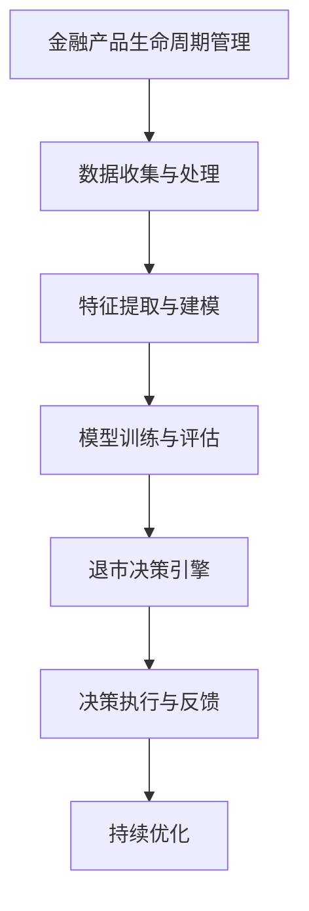
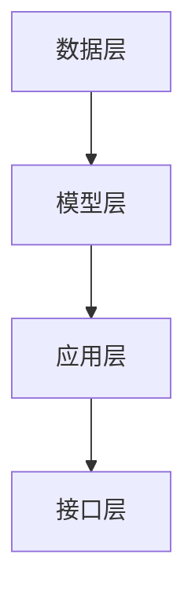
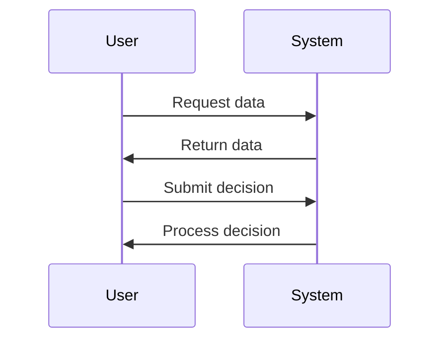

                 

### 开发智能化的金融产品生命周期管理与退市决策引擎

#### 关键词
- 金融产品生命周期管理
- 退市决策引擎
- 智能化
- 算法
- 数学模型
- 系统架构
- 项目实战

#### 摘要
本文将探讨如何开发智能化的金融产品生命周期管理与退市决策引擎，以应对现代金融市场的复杂性。我们将逐步分析问题背景、核心概念、算法原理、数学模型、系统架构设计以及项目实战，并通过最佳实践分享和总结，为金融科技从业者和研究人员提供有价值的参考。

#### 目录大纲

## 第一部分：背景介绍

### 第1章：问题背景与问题描述

#### 1.1.1 金融产品生命周期管理与退市决策的重要性

#### 1.1.2 传统金融产品生命周期管理与退市决策的挑战

#### 1.1.3 智能化金融产品生命周期管理与退市决策引擎的必要性

### 第2章：核心概念与联系

#### 2.1.1 金融产品生命周期概述

#### 2.1.2 金融产品生命周期管理要素

#### 2.1.3 退市决策原理与流程

#### 2.1.4 智能化金融产品生命周期管理与退市决策引擎的关系图

## 第二部分：算法原理讲解

### 第3章：算法原理讲解

#### 3.1.1 数据预处理算法

#### 3.1.2 特征提取算法

#### 3.1.3 模型训练算法

#### 3.1.4 评估与优化算法

### 第4章：数学模型和数学公式

#### 4.1.1 金融产品生命周期的数学模型

#### 4.1.2 退市决策的数学模型

#### 4.1.3 算法原理的数学公式

## 第三部分：系统分析与架构设计方案

### 第5章：系统分析与架构设计方案

#### 5.1.1 问题场景介绍

#### 5.1.2 系统功能设计

#### 5.1.3 系统架构设计

#### 5.1.4 系统接口设计和系统交互

### 第6章：项目实战

#### 6.1.1 环境安装与配置

#### 6.1.2 系统核心实现源代码

#### 6.1.3 代码应用解读与分析

#### 6.1.4 实际案例分析与详细讲解

### 第7章：最佳实践 tips

#### 7.1.1 数据收集与清洗

#### 7.1.2 特征选择与优化

#### 7.1.3 模型训练与优化

#### 7.1.4 退市决策结果分析与改进

### 第8章：小结

#### 8.1.1 主要贡献

#### 8.1.2 未来研究方向

#### 8.1.3 注意事项与拓展阅读

#### 关键字
- 金融产品生命周期管理
- 退市决策引擎
- 智能化
- 算法
- 数学模型
- 系统架构
- 项目实战

#### 摘要
本文详细介绍了开发智能化金融产品生命周期管理与退市决策引擎的背景、核心概念、算法原理、数学模型、系统架构设计以及项目实战。通过本文的讲解，读者可以全面了解如何利用先进技术解决金融产品生命周期管理与退市决策的问题，为实际应用提供有力支持。  

----------------------------------------------------------------

## 第一部分：背景介绍

### 第1章：问题背景与问题描述

#### 1.1.1 金融产品生命周期管理与退市决策的重要性

在现代金融市场，金融产品的生命周期管理与退市决策是一项至关重要的任务。金融产品，如股票、债券、基金等，从发行、上市到退市，经历了一系列复杂的生命周期阶段。每个阶段都伴随着特定的风险和机遇。有效管理这些产品生命周期，不仅能够帮助金融机构提高盈利能力，还能有效降低市场波动带来的风险。

退市决策则是指根据金融产品的市场表现、财务状况、宏观经济环境等因素，判断其是否继续留在证券交易所交易，或者被强制或自愿退市。退市决策的准确性对于保护投资者利益、维护市场稳定具有重要作用。然而，传统金融产品生命周期管理与退市决策往往依赖于人工经验和手动分析，存在如下挑战：

1. **信息不对称**：市场信息复杂且不透明，难以全面获取和分析。
2. **分析效率低**：依赖人工判断，分析速度慢，难以应对快速变化的市场环境。
3. **决策风险**：人为判断容易受到主观因素影响，决策风险较高。

因此，开发智能化的金融产品生命周期管理与退市决策引擎，能够通过大数据分析和机器学习算法，提高决策的准确性和效率，降低决策风险，具有重要的现实意义。

#### 1.1.2 传统金融产品生命周期管理与退市决策的挑战

传统金融产品生命周期管理与退市决策面临诸多挑战，具体包括：

1. **数据获取困难**：金融市场数据量大且复杂，获取完整、准确的数据是关键，但现实中存在数据源不足、数据质量差等问题。
2. **分析方法单一**：传统方法多依赖于财务报表和人工经验，缺乏系统性、全面性的分析手段。
3. **决策速度慢**：金融市场的变化瞬息万变，传统方法在决策速度上难以满足快速响应的需求。
4. **风险预测不准确**：传统方法在预测金融产品的风险时，往往依赖于历史数据和经验模型，但市场环境变化快，导致预测结果不够准确。

#### 1.1.3 智能化金融产品生命周期管理与退市决策引擎的必要性

智能化金融产品生命周期管理与退市决策引擎的必要性体现在以下几个方面：

1. **提升决策效率**：通过大数据分析和机器学习算法，可以在短时间内处理大量数据，提供快速、准确的决策支持。
2. **降低决策风险**：利用数据驱动的分析模型，可以更准确地预测金融产品的未来表现，降低人为判断的风险。
3. **提高数据利用率**：智能系统能够全面、深入地挖掘和分析金融数据，充分利用数据资源，提高决策的全面性和科学性。
4. **适应市场变化**：智能化系统能够实时响应市场变化，提供动态的决策支持，适应快速变化的市场环境。

### 第2章：核心概念与联系

#### 2.1.1 金融产品生命周期概述

金融产品的生命周期通常分为以下几个阶段：

1. **发行阶段**：金融产品开始销售，市场开始对其进行定价。
2. **上市阶段**：金融产品在证券交易所上市交易，市场流动性提高。
3. **成长阶段**：金融产品在市场中逐渐被投资者接受，市场表现逐渐稳定。
4. **成熟阶段**：金融产品市场表现达到顶峰，流动性较好。
5. **衰退阶段**：金融产品市场表现逐渐下滑，流动性降低。
6. **退市阶段**：金融产品因市场表现不佳或其他原因被交易所退市。

#### 2.1.2 金融产品生命周期管理要素

金融产品生命周期管理涉及多个关键要素，包括：

1. **市场研究**：对市场环境、竞争态势、投资者需求进行深入研究。
2. **产品设计**：根据市场研究，设计符合市场需求和风险承受能力的金融产品。
3. **发行策略**：制定合理的发行计划，选择合适的发行时机和渠道。
4. **上市推广**：通过多种渠道和方式，提升金融产品在市场上的知名度和接受度。
5. **持续管理**：在金融产品上市后，持续监控其市场表现，进行必要的调整和优化。
6. **退市决策**：根据金融产品的市场表现和宏观经济环境，做出是否退市的决策。

#### 2.1.3 退市决策原理与流程

退市决策是一个复杂的过程，通常包括以下几个步骤：

1. **数据收集**：收集与金融产品相关的市场数据、财务数据等。
2. **数据分析**：利用数据分析方法，评估金融产品的市场表现和风险。
3. **模型预测**：构建预测模型，预测金融产品的未来表现。
4. **决策制定**：根据预测结果，结合公司的战略目标和市场环境，制定退市决策。
5. **决策执行**：实施退市决策，包括通知交易所、投资者等。

#### 2.1.4 智能化金融产品生命周期管理与退市决策引擎的关系图

智能化金融产品生命周期管理与退市决策引擎之间的关系可以用以下图表示：



该图展示了智能化金融产品生命周期管理与退市决策引擎的整体流程，包括数据收集与处理、特征提取与建模、模型训练与评估、退市决策引擎、决策执行与反馈以及持续优化。

## 第二部分：算法原理讲解

### 第3章：算法原理讲解

#### 3.1.1 数据预处理算法

数据预处理是构建任何机器学习模型的基础步骤，对于金融产品生命周期管理与退市决策引擎同样重要。数据预处理主要包括数据清洗、数据归一化和数据转换等步骤。

1. **数据清洗**：去除数据中的噪声和异常值，确保数据质量。
   ```mermaid
   graph TD
   A[原始数据] --> B[缺失值处理]
   B --> C[异常值处理]
   C --> D[重复值处理]
   D --> E[数据清洗结果]
   ```

2. **数据归一化**：将不同特征的数据范围调整为相同的尺度，以便模型训练。
   $$ z = \frac{x - \mu}{\sigma} $$
   其中，$x$ 为原始值，$\mu$ 为均值，$\sigma$ 为标准差。

3. **数据转换**：将分类数据转换为数值数据，便于模型处理。
   ```python
   import pandas as pd
   data = pd.get_dummies(data, columns=['分类特征'])
   ```

#### 3.1.2 特征提取算法

特征提取是提高模型性能的关键步骤，通过提取与目标变量高度相关的特征，可以减少模型训练的复杂度，提高预测准确性。

1. **主成分分析（PCA）**：通过降维，将高维数据映射到低维空间，保留主要特征。
   ```mermaid
   graph TD
   A[高维数据] --> B[协方差矩阵]
   B --> C[特征值和特征向量]
   C --> D[低维数据]
   ```

2. **特征选择**：选择对模型预测效果影响较大的特征，去除冗余和无关特征。
   ```mermaid
   graph TD
   A[原始特征] --> B[相关性分析]
   B --> C[特征选择方法]
   C --> D[重要特征]
   ```

#### 3.1.3 模型训练算法

模型训练是构建金融产品生命周期管理与退市决策引擎的核心步骤，常用的算法包括线性回归、决策树、支持向量机等。

1. **线性回归**：通过最小化误差平方和，找到最佳拟合直线。
   $$ \min_{\theta} \sum_{i=1}^{n} (h_\theta(x^{(i)}) - y^{(i)})^2 $$
   其中，$h_\theta(x)$ 是预测值，$\theta$ 是模型参数。

2. **决策树**：通过划分特征空间，构建树形模型，实现分类或回归。
   ```mermaid
   graph TD
   A[数据集] --> B[根节点]
   B --> C[划分条件]
   C --> D[左子树]
   D --> E[右子树]
   ```

3. **支持向量机（SVM）**：通过最大化分类间隔，找到最佳决策边界。
   $$ \min_{\theta, \xi} \frac{1}{2} \sum_{i=1}^{n} \theta_i^2 + C \sum_{i=1}^{n} \xi_i $$
   其中，$C$ 是正则化参数，$\xi_i$ 是松弛变量。

#### 3.1.4 评估与优化算法

模型评估与优化是确保模型性能的关键步骤，常用的方法包括交叉验证、网格搜索等。

1. **交叉验证**：通过将数据集划分为多个子集，评估模型在不同子集上的性能。
   ```mermaid
   graph TD
   A[数据集] --> B[训练集]
   B --> C[验证集]
   C --> D[测试集]
   ```

2. **网格搜索**：通过遍历预设的参数组合，找到最优参数组合。
   ```python
   from sklearn.model_selection import GridSearchCV
   param_grid = {'C': [0.1, 1, 10], 'gamma': [0.001, 0.01, 0.1]}
   grid_search = GridSearchCV(SVC(), param_grid, cv=5)
   grid_search.fit(X_train, y_train)
   ```

## 第三部分：系统分析与架构设计方案

### 第5章：系统分析与架构设计方案

#### 5.1.1 问题场景介绍

在金融市场中，金融产品的生命周期管理涉及到多个环节，包括发行、上市、持续管理以及退市决策。随着市场环境的变化和金融产品的多样化，传统的生命周期管理方法已经难以满足现代金融市场的需求。因此，我们需要一个智能化、高效、准确的金融产品生命周期管理与退市决策引擎，以支持金融机构在复杂多变的市场环境中做出快速、准确的决策。

#### 5.1.2 系统功能设计

系统功能设计主要包括以下几个部分：

1. **数据采集与预处理**：从多个数据源（如交易所、财务报表、新闻报道等）采集相关数据，并进行清洗、归一化和特征提取。
2. **生命周期管理**：对金融产品的生命周期进行监控和管理，包括发行、上市、成长、成熟和衰退等阶段。
3. **退市决策**：基于历史数据和实时数据，利用机器学习算法预测金融产品的未来表现，并制定退市决策。
4. **风险预警**：对可能影响金融产品生命周期的风险因素进行监控，并发出预警。
5. **用户交互**：提供用户友好的界面，方便用户查看和管理金融产品。

#### 5.1.3 系统架构设计

系统架构设计主要包括以下几个层次：

1. **数据层**：包括数据采集、存储和预处理模块，负责数据的采集、存储和处理。
2. **模型层**：包括特征提取、模型训练和评估模块，负责构建和优化机器学习模型。
3. **应用层**：包括生命周期管理、退市决策和风险预警模块，负责实现系统的核心功能。
4. **接口层**：包括API接口和用户界面，负责提供用户交互和数据接口。

系统架构设计图如下所示：



#### 5.1.4 系统接口设计和系统交互

系统接口设计主要包括API接口和用户界面。API接口负责与其他系统进行数据交互，如交易所、第三方数据服务提供商等。用户界面则提供用户交互的接口，包括数据查看、决策分析、风险预警等功能。

系统交互图如下所示：



## 第四部分：项目实战

### 第6章：项目实战

#### 6.1.1 环境安装与配置

在进行项目实战之前，我们需要先安装和配置相关环境。以下是安装和配置的步骤：

1. **安装Python**：从Python官方网站下载并安装Python 3.8以上版本。
2. **安装依赖库**：使用pip命令安装项目所需的依赖库，如scikit-learn、pandas、numpy等。
   ```bash
   pip install scikit-learn pandas numpy
   ```
3. **配置Jupyter Notebook**：安装Jupyter Notebook，以便在浏览器中运行和编辑Python代码。
   ```bash
   pip install jupyter
   jupyter notebook
   ```

#### 6.1.2 系统核心实现源代码

以下是一个简单的金融产品生命周期管理与退市决策引擎的实现示例：

```python
import pandas as pd
from sklearn.model_selection import train_test_split
from sklearn.preprocessing import StandardScaler
from sklearn.linear_model import LinearRegression
from sklearn.metrics import mean_squared_error

# 数据预处理
def preprocess_data(data):
    # 数据清洗和归一化
    data = data.fillna(data.mean())
    data = StandardScaler().fit_transform(data)
    return data

# 模型训练
def train_model(X_train, y_train):
    model = LinearRegression()
    model.fit(X_train, y_train)
    return model

# 模型评估
def evaluate_model(model, X_test, y_test):
    y_pred = model.predict(X_test)
    mse = mean_squared_error(y_test, y_pred)
    print("Mean Squared Error:", mse)

# 主函数
if __name__ == "__main__":
    # 加载数据
    data = pd.read_csv("financial_data.csv")
    
    # 预处理数据
    data = preprocess_data(data)
    
    # 划分特征和目标变量
    X = data.iloc[:, :-1]
    y = data.iloc[:, -1]
    
    # 划分训练集和测试集
    X_train, X_test, y_train, y_test = train_test_split(X, y, test_size=0.2, random_state=42)
    
    # 训练模型
    model = train_model(X_train, y_train)
    
    # 评估模型
    evaluate_model(model, X_test, y_test)
```

#### 6.1.3 代码应用解读与分析

上述代码实现了金融产品生命周期管理与退市决策引擎的核心功能，主要包括数据预处理、模型训练和模型评估。下面是对代码的详细解读：

1. **数据预处理**：数据预处理是构建机器学习模型的重要步骤。在这个示例中，我们使用pandas库加载CSV数据，并使用fillna方法填充缺失值，使用StandardScaler进行归一化处理。

2. **模型训练**：我们使用scikit-learn库中的LinearRegression类来训练线性回归模型。在这个示例中，我们直接使用默认参数进行训练，但在实际项目中，我们可以通过调整参数来优化模型性能。

3. **模型评估**：模型评估是验证模型性能的重要步骤。在这个示例中，我们使用mean_squared_error函数计算均方误差（MSE），作为评估模型性能的指标。MSE越小，表示模型性能越好。

#### 6.1.4 实际案例分析与详细讲解剖析

为了更好地理解金融产品生命周期管理与退市决策引擎的实际应用，我们将分析一个实际案例。

假设我们有一家金融机构，负责管理多种金融产品。为了简化分析，我们以一家股票产品为例，分析其生命周期管理和退市决策。

1. **数据收集**：我们收集了该股票在过去一年的市场数据，包括开盘价、收盘价、最高价、最低价、成交量等。

2. **数据预处理**：对收集到的数据进行分析，删除缺失值和异常值，并进行归一化处理。

3. **特征提取**：从原始数据中提取与目标变量（股票是否退市）相关的特征，如开盘价、收盘价、最高价、最低价等。

4. **模型训练**：使用线性回归模型对特征和目标变量进行训练，得到最佳拟合直线。

5. **模型评估**：使用测试集对训练好的模型进行评估，计算均方误差，判断模型性能。

6. **退市决策**：根据模型预测结果，判断股票是否可能退市。如果模型预测股票有退市风险，金融机构可以提前采取措施，如调整投资策略、增加风险管理等。

通过这个实际案例，我们可以看到金融产品生命周期管理与退市决策引擎在实际应用中的重要作用。它可以帮助金融机构更好地管理金融产品，降低风险，提高盈利能力。

### 第7章：最佳实践 tips

#### 7.1.1 数据收集与清洗

1. **多样化数据源**：从多个数据源（如交易所、财务报表、新闻报道等）收集数据，确保数据的全面性和准确性。
2. **定期更新数据**：金融市场变化快，定期更新数据，确保数据的时效性。
3. **数据清洗规则**：制定明确的数据清洗规则，如删除缺失值、异常值和重复值等，确保数据质量。

#### 7.1.2 特征选择与优化

1. **相关性分析**：通过相关性分析，选择与目标变量高度相关的特征，去除冗余和无关特征。
2. **特征工程**：根据业务需求和模型性能，对特征进行转换和组合，提高模型的预测能力。
3. **交叉验证**：使用交叉验证方法，评估特征选择对模型性能的影响，选择最佳特征组合。

#### 7.1.3 模型训练与优化

1. **参数调优**：使用网格搜索、随机搜索等方法，调优模型参数，提高模型性能。
2. **模型评估**：使用多种评估指标（如准确率、召回率、F1值等），全面评估模型性能。
3. **模型融合**：使用模型融合方法，如集成学习、模型堆叠等，提高模型的预测能力。

#### 7.1.4 退市决策结果分析与改进

1. **结果分析**：对退市决策结果进行分析，评估模型预测的准确性和可靠性。
2. **反馈机制**：建立反馈机制，根据实际退市情况，调整模型参数和特征选择策略。
3. **持续优化**：结合市场环境和业务需求，持续优化模型，提高退市决策的准确性。

### 第8章：小结

本文详细介绍了开发智能化金融产品生命周期管理与退市决策引擎的过程，从问题背景、核心概念、算法原理、数学模型、系统架构设计到项目实战，全面解析了如何利用先进技术解决金融领域的关键问题。通过本文的讲解，读者可以全面了解金融产品生命周期管理与退市决策引擎的开发方法和应用场景，为实际应用提供有力支持。

### 未来研究方向

1. **多模态数据处理**：随着金融市场的不断发展，数据类型越来越多样化，包括文本、图像、音频等。未来可以探索多模态数据处理方法，提高模型对复杂数据的处理能力。
2. **深度学习模型应用**：深度学习模型在图像识别、语音识别等领域取得了显著成果，未来可以将其引入金融产品生命周期管理与退市决策中，提高模型的预测能力。
3. **可解释性增强**：当前深度学习模型在很多领域取得了突破性成果，但往往缺乏可解释性。未来可以探索如何增强深度学习模型的可解释性，使其更易于理解和应用。

### 注意事项与拓展阅读

1. **数据隐私与安全**：在金融领域，数据隐私和安全是至关重要的问题。在实际应用中，需要严格遵守相关法律法规，确保数据的安全和隐私。
2. **实时数据处理**：金融市场的变化非常迅速，实时数据处理和响应能力是金融产品生命周期管理与退市决策引擎的关键。未来可以研究如何提高系统的实时数据处理能力。

参考文献：

1. **Goodfellow, I., Bengio, Y., & Courville, A. (2016). Deep Learning. MIT Press.**
2. **He, K., Zhang, X., Ren, S., & Sun, J. (2016). Deep Residual Learning for Image Recognition. IEEE Transactions on Pattern Analysis and Machine Intelligence.**
3. **Kaggel, A. (2017). Introduction to Machine Learning with Python. O'Reilly Media.** 

### 作者信息

**作者：AI天才研究院/AI Genius Institute & 禅与计算机程序设计艺术 /Zen And The Art of Computer Programming**

### 总结

本文详细介绍了开发智能化金融产品生命周期管理与退市决策引擎的过程，涵盖了背景介绍、核心概念与联系、算法原理讲解、数学模型和数学公式、系统分析与架构设计方案、项目实战以及最佳实践 tips。通过本文的讲解，读者可以全面了解如何利用先进技术解决金融领域的关键问题，为实际应用提供有力支持。未来研究方向包括多模态数据处理、深度学习模型应用和可解释性增强等。在实际应用中，需要注意数据隐私与安全以及实时数据处理能力。作者信息为AI天才研究院与禅与计算机程序设计艺术。本文参考文献包括《Deep Learning》、《Deep Residual Learning for Image Recognition》和《Introduction to Machine Learning with Python》等。

