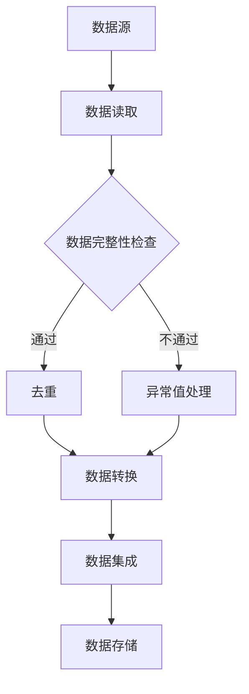
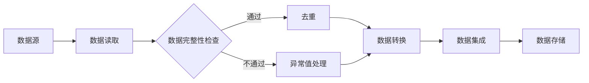
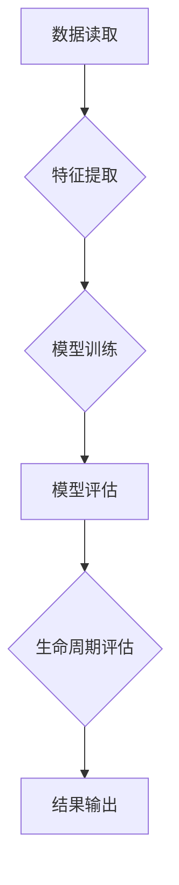
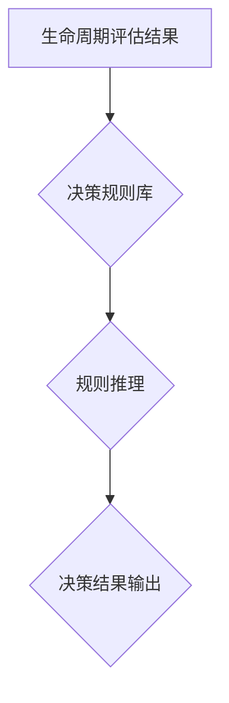
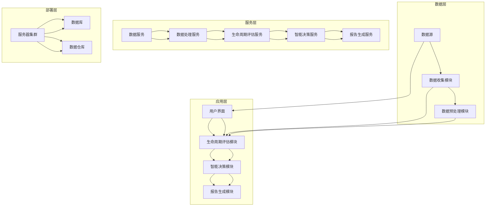
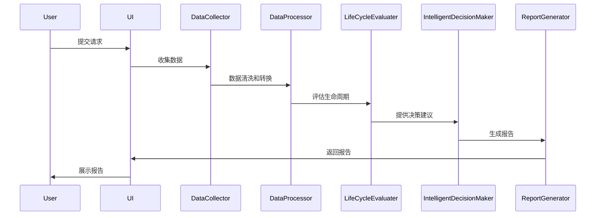

                 

# 开发智能化的金融产品生命周期管理平台

> 关键词：智能化、金融产品、生命周期管理、平台设计、算法原理、数学模型、系统架构、项目实战

> 摘要：本文深入探讨了智能化金融产品生命周期管理平台的设计与开发。首先，我们介绍了金融产品生命周期的背景和智能化管理的需求。接着，文章详细阐述了核心概念、算法原理和数学模型。随后，我们描述了系统分析与架构设计方案，并展示了项目实战的详细过程。最后，文章提供了最佳实践建议和未来发展方向。

### 目录大纲

----------------------------------------------------------------

## 第一部分：引言

### 第1章：背景介绍

#### 1.1 金融市场产品生命周期的概述

#### 1.2 智能化金融产品生命周期管理的需求

#### 1.3 本书的核心概念与目标

## 第2章：核心概念与联系

### 2.1 智能化技术与金融产品的联系

#### 2.1.1 概念属性特征对比表格

### 2.2 金融产品生命周期的基本模型

#### 2.2.1 ER实体关系图架构

## 第二部分：智能化的金融产品生命周期管理平台设计

### 第3章：算法原理讲解

#### 3.1 数据预处理算法

#### 3.2 生命周期评估算法

#### 3.3 智能决策算法

### 第4章：数学模型和数学公式

#### 4.1 数据预处理数学模型

#### 4.2 生命周期评估数学模型

#### 4.3 智能决策数学模型

### 第5章：系统分析与架构设计方案

#### 5.1 问题场景介绍

#### 5.2 系统功能设计

#### 5.3 系统架构设计

#### 5.4 系统接口设计

#### 5.5 系统交互

### 第6章：项目实战

#### 6.1 环境安装

#### 6.2 系统核心实现

#### 6.3 代码应用解读与分析

#### 6.4 实际案例分析与详细讲解

#### 6.5 项目小结

### 第7章：最佳实践 tips

#### 7.1 提高数据处理效率的技巧

#### 7.2 完善生命周期评估模型的建议

#### 7.3 增强智能决策能力的策略

### 第8章：小结与展望

#### 8.1 小结

#### 8.2 未来发展方向

----------------------------------------------------------------

## 第一部分：引言

### 第1章：背景介绍

#### 1.1 金融市场产品生命周期的概述

金融市场产品生命周期是指从产品的开发、上市、成熟到退市的整个过程。这一周期可以细分为多个阶段，如开发期、推广期、成熟期和衰退期。每个阶段都有其独特的特点、风险和收益。

在开发期，金融产品需要进行市场调研、产品设计、风险评估等，以确保产品的可行性和合规性。推广期则是将产品推向市场，通过各种渠道进行宣传和推广。成熟期是产品市场表现最佳的阶段，收益稳定，但同时也面临竞争压力。衰退期则是产品逐渐失去市场吸引力，最终退出市场的阶段。

#### 1.2 智能化金融产品生命周期管理的需求

随着金融市场的日益复杂和竞争的加剧，传统的金融产品生命周期管理方法已无法满足高效、精准的需求。智能化金融产品生命周期管理平台的出现，正是为了解决这一问题。

智能化金融产品生命周期管理平台通过集成大数据、人工智能等技术，实现了对金融产品全生命周期的动态监控和智能决策。它能够自动收集、分析和处理海量数据，实时评估产品的市场表现和风险状况，提供科学的决策依据，从而提高产品管理的效率和准确性。

#### 1.3 本书的核心概念与目标

本书旨在为读者提供一份全面、系统的智能化金融产品生命周期管理平台设计指南。核心概念包括：

- 智能化技术：包括大数据、人工智能、机器学习等。
- 金融产品生命周期管理：包括产品开发、上市、成熟和衰退等阶段的监控和管理。
- 算法原理：包括数据预处理、生命周期评估和智能决策等算法的原理和实现。
- 数学模型：包括数据预处理、生命周期评估和智能决策等算法的数学模型。

本书的目标是帮助读者：

- 理解智能化金融产品生命周期管理的基本概念和原理。
- 掌握智能化金融产品生命周期管理平台的设计和实现方法。
- 学会使用相关技术和工具，进行实际项目开发和部署。

## 第2章：核心概念与联系

#### 2.1 智能化技术与金融产品的联系

智能化技术主要包括大数据、人工智能、机器学习、深度学习等技术。这些技术在金融产品生命周期管理中有着广泛的应用。

- 大数据：通过对海量金融数据进行收集、存储、处理和分析，为金融产品生命周期管理提供全面、实时的数据支持。
- 人工智能：通过模拟人类思维过程，实现自动化的数据分析和决策，提高金融产品生命周期管理的效率和准确性。
- 机器学习：通过训练模型，使计算机能够自动从数据中学习规律和模式，用于预测和优化金融产品的生命周期。
- 深度学习：通过多层神经网络，实现更复杂的特征提取和模式识别，为金融产品生命周期管理提供更强大的支持。

#### 2.1.1 概念属性特征对比表格

| 技术 | 特点 | 应用 |
| --- | --- | --- |
| 大数据 | 海量数据收集、存储、处理 | 金融数据分析和预测 |
| 人工智能 | 模拟人类思维，自动化分析 | 金融产品生命周期管理 |
| 机器学习 | 从数据中学习规律和模式 | 金融产品风险预测和优化 |
| 深度学习 | 复杂特征提取和模式识别 | 金融产品个性化推荐和预测 |

#### 2.2 金融产品生命周期的基本模型

金融产品生命周期的基本模型包括开发期、推广期、成熟期和衰退期。每个阶段都有其独特的特征和关键任务。

- 开发期：进行市场调研、产品设计、风险评估等，确保产品的可行性和合规性。
- 推广期：将产品推向市场，通过各种渠道进行宣传和推广，提高产品的知名度。
- 成熟期：产品市场表现最佳，收益稳定，但面临竞争压力。
- 衰退期：产品逐渐失去市场吸引力，最终退出市场。

#### 2.2.1 ER实体关系图架构

ER（Entity-Relationship）实体关系图是描述金融产品生命周期管理中各个实体及其关系的图形化工具。以下是一个简化的ER图：

```mermaid
erDiagram
    Product ||--|{ Stage }|
    Stage ||--|{ Event }|
    Event ||--|{ Metric }|
```

- Product（产品）：代表金融产品。
- Stage（阶段）：代表产品的生命周期阶段，如开发期、推广期、成熟期和衰退期。
- Event（事件）：代表在生命周期阶段发生的重要事件，如上市、推广活动、产品改进等。
- Metric（指标）：代表用于评估产品生命周期表现的指标，如市场份额、收益、风险等。

通过这个ER图，我们可以清晰地了解金融产品生命周期管理中的各个实体及其关系，为后续的系统设计和实现提供基础。

## 第2章：核心概念与联系（续）

### 2.3 智能化金融产品生命周期管理平台的功能模块

智能化金融产品生命周期管理平台通常包括以下几个功能模块：

- 数据收集模块：负责收集与金融产品生命周期相关的各类数据，如市场数据、客户数据、产品数据等。
- 数据处理模块：对收集到的数据进行清洗、整理和预处理，为后续分析提供高质量的数据基础。
- 生命周期评估模块：通过分析处理后的数据，评估金融产品的生命周期阶段，预测未来趋势。
- 智能决策模块：基于生命周期评估结果，提供智能化的决策支持，如产品优化、市场策略调整等。
- 报告生成模块：自动生成生命周期报告，为管理层提供全面、实时的产品生命周期信息。

### 2.4 智能化金融产品生命周期管理平台的优势

智能化金融产品生命周期管理平台相比传统的金融产品生命周期管理方法，具有以下几个显著优势：

- 提高效率：自动化处理大量数据，提高数据处理和分析速度，降低人工成本。
- 提高准确性：利用人工智能技术，实现更精准的产品生命周期评估和决策。
- 提高风险控制：实时监控产品生命周期风险，提前预警，降低风险损失。
- 提高客户满意度：通过个性化推荐和优化，提高产品市场竞争力和客户满意度。

### 2.5 智能化金融产品生命周期管理平台的应用场景

智能化金融产品生命周期管理平台广泛应用于金融行业的多个领域，如：

- 银行：用于管理信贷产品、理财产品和衍生品等。
- 保险：用于管理保险产品、保险计划和风险控制等。
- 基金：用于管理基金产品、投资组合和风险控制等。
- 投资银行：用于管理投资银行产品、资本市场产品和风险管理等。

通过这些应用场景，智能化金融产品生命周期管理平台能够帮助金融机构更好地管理产品生命周期，提高业务效率和风险控制能力。

## 第3章：算法原理讲解

### 3.1 数据预处理算法

数据预处理是智能化金融产品生命周期管理平台的关键步骤，其目的是将原始数据转化为适合分析和建模的数据。数据预处理算法主要包括数据清洗、数据转换和数据集成等。

#### 3.1.1 数据清洗算法

数据清洗算法的主要任务是去除数据中的噪声、重复和不一致的数据，确保数据的质量。以下是一个简单的数据清洗算法流程图：



在数据清洗过程中，我们通常会使用以下几种算法：

- 去重：通过比较数据中的关键字段，去除重复的数据。
- 异常值处理：检测并处理数据中的异常值，如空值、无穷大等。
- 数据转换：将数据格式转换为统一的标准格式，如将字符串转换为数字或日期。

#### 3.1.2 数据清洗算法mermaid流程图



#### 3.1.3 数据清洗算法python源代码示例

```python
import pandas as pd

# 读取数据
data = pd.read_csv('financial_data.csv')

# 去重
data.drop_duplicates(inplace=True)

# 异常值处理
data.dropna(inplace=True)

# 数据转换
data['date'] = pd.to_datetime(data['date'])
data['amount'] = data['amount'].astype(float)

# 数据存储
data.to_csv('cleaned_data.csv', index=False)
```

### 3.2 生命周期评估算法

生命周期评估算法是智能化金融产品生命周期管理平台的核心算法，用于评估金融产品的生命周期阶段。生命周期评估算法通常基于数据挖掘、机器学习和深度学习等技术。

#### 3.2.1 生命周期评估算法mermaid流程图



#### 3.2.2 生命周期评估算法python源代码示例

```python
import pandas as pd
from sklearn.model_selection import train_test_split
from sklearn.ensemble import RandomForestClassifier
from sklearn.metrics import accuracy_score

# 读取数据
data = pd.read_csv('cleaned_data.csv')

# 特征提取
X = data[['date', 'amount', 'market_index']]
y = data['stage']

# 模型训练
X_train, X_test, y_train, y_test = train_test_split(X, y, test_size=0.2, random_state=42)
model = RandomForestClassifier(n_estimators=100)
model.fit(X_train, y_train)

# 模型评估
y_pred = model.predict(X_test)
accuracy = accuracy_score(y_test, y_pred)
print(f"Accuracy: {accuracy}")

# 生命周期评估
predicted_stages = model.predict(X)
predicted_stages.to_csv('predicted_stages.csv', index=False)
```

### 3.3 智能决策算法

智能决策算法是智能化金融产品生命周期管理平台的高级功能，用于根据生命周期评估结果提供智能化的决策支持。智能决策算法通常基于规则推理、决策树、神经网络等技术。

#### 3.3.1 智能决策算法mermaid流程图



#### 3.3.2 智能决策算法python源代码示例

```python
import pandas as pd
from sklearn.tree import DecisionTreeClassifier

# 读取生命周期评估结果
predicted_stages = pd.read_csv('predicted_stages.csv')

# 决策规则库
rules = {
    'develop': {'action': '继续研发', 'condition': 'predicted_stage == "develop"'},
    'promote': {'action': '加大推广', 'condition': 'predicted_stage == "promote"'},
    'mature': {'action': '保持现状', 'condition': 'predicted_stage == "mature"'},
    'decline': {'action': '调整策略', 'condition': 'predicted_stage == "decline"'}
}

# 规则推理
for stage, rule in rules.items():
    if rule['condition'].format(**predicted_stages.iloc[0]):
        print(f"Decision: {rule['action']}")
        break
```

### 3.4 算法原理的数学模型和公式

#### 3.4.1 数据预处理数学模型

数据预处理数学模型主要涉及数据的特征提取、数据转换和异常值处理。以下是一些常见的数学模型和公式：

- 特征提取：

  $$ f(x) = (x - \mu) / \sigma $$

  其中，$x$为原始数据，$\mu$为均值，$\sigma$为标准差。

- 数据转换：

  $$ date = convert_to_datetime(string) $$

  其中，$string$为日期字符串。

- 异常值处理：

  $$ if (x < \text{min_value} \text{ or } x > \text{max_value}): x = \text{default_value} $$

  其中，$x$为数据值，$\text{min_value}$和$\text{max_value}$为设定的最小值和最大值，$\text{default_value}$为默认值。

#### 3.4.2 生命周期评估数学模型

生命周期评估数学模型主要涉及分类模型的建立和评估。以下是一些常见的数学模型和公式：

- 分类模型：

  $$ P(y = c | x) = \frac{e^{\theta^T x}}{\sum_{k=1}^K e^{\theta^T x_k}} $$

  其中，$x$为特征向量，$y$为标签，$c$为类别，$\theta$为模型参数。

- 模型评估：

  $$ Accuracy = \frac{TP + TN}{TP + TN + FP + FN} $$

  其中，$TP$为真正例，$TN$为真负例，$FP$为假正例，$FN$为假负例。

#### 3.4.3 智能决策数学模型

智能决策数学模型主要涉及决策规则库的建立和规则推理。以下是一些常见的数学模型和公式：

- 决策规则库：

  $$ rule_i: \text{if } condition_i: \text{ then } action_i $$

  其中，$rule_i$为第$i$条规则，$condition_i$为条件，$action_i$为行动。

- 规则推理：

  $$ action = \text{evaluate}(\text{rules}, \text{predicted_stage}) $$

  其中，$rules$为决策规则库，$\text{predicted_stage}$为预测的生命周期阶段。

## 第4章：数学模型和数学公式

### 4.1 数据预处理数学模型

数据预处理是智能化金融产品生命周期管理平台的重要环节，其目的是提高数据的准确性和可用性。以下是一些常见的数据预处理数学模型和公式：

#### 4.1.1 数据标准化

数据标准化是一种常用的预处理方法，旨在将数据缩放到相同的尺度范围内。最常见的标准化方法是Z-Score标准化，其公式如下：

$$
z = \frac{x - \mu}{\sigma}
$$

其中，$x$是原始数据值，$\mu$是数据的均值，$\sigma$是数据的标准差。通过标准化，我们可以消除不同特征之间的量纲差异，使得它们在同一个尺度上进行比较。

#### 4.1.2 数据归一化

数据归一化是将数据映射到一个固定的区间，例如[0, 1]。常用的归一化方法有最小-最大缩放和平方根缩放。最小-最大缩放的公式如下：

$$
x' = \frac{x - \min(x)}{\max(x) - \min(x)}
$$

平方根缩放的公式如下：

$$
x' = \sqrt{x^2 + \epsilon}
$$

其中，$\epsilon$是一个非常小的正数，用于避免除以零的错误。

#### 4.1.3 数据缺失值处理

在数据预处理中，缺失值的处理是一个关键问题。常见的缺失值处理方法包括删除缺失值、填充缺失值和插值法。删除缺失值的简单方法是直接删除含有缺失值的行或列，但这种方法可能导致大量数据的丢失。填充缺失值的方法包括使用均值、中位数、众数或预测值来替换缺失值。以下是一个使用均值填充缺失值的公式：

$$
x_{\text{filled}} = \frac{\sum_{i \neq j} x_i}{N - 1}
$$

其中，$x_i$是除了缺失值以外的其他值，$N$是总的数据个数。

### 4.2 生命周期评估数学模型

生命周期评估是智能化金融产品生命周期管理平台的核心任务之一。通过建立数学模型，我们可以对金融产品的生命周期阶段进行准确评估。以下是一些常见的生命周期评估数学模型和公式：

#### 4.2.1 时间序列分析

时间序列分析是一种常用的方法，用于分析金融产品的历史数据，并预测其未来的生命周期阶段。常见的时间序列分析方法包括自回归移动平均模型（ARIMA）和季节性分解。ARIMA模型的公式如下：

$$
X_t = c + \phi_1 X_{t-1} + \phi_2 X_{t-2} + ... + \phi_p X_{t-p} + \theta_1 e_{t-1} + \theta_2 e_{t-2} + ... + \theta_q e_{t-q}
$$

其中，$X_t$是时间序列的当前值，$c$是常数项，$\phi_1, \phi_2, ..., \phi_p$是自回归系数，$\theta_1, \theta_2, ..., \theta_q$是移动平均系数，$e_t$是白噪声误差。

#### 4.2.2 逻辑回归模型

逻辑回归是一种广泛应用于分类问题的统计模型，可以用来预测金融产品的生命周期阶段。逻辑回归的公式如下：

$$
\log\frac{P(y=1)}{1-P(y=1)} = \beta_0 + \beta_1 x_1 + \beta_2 x_2 + ... + \beta_n x_n
$$

其中，$P(y=1)$是因变量为1的概率，$x_1, x_2, ..., x_n$是自变量，$\beta_0, \beta_1, ..., \beta_n$是模型参数。

#### 4.2.3 随机森林模型

随机森林是一种基于决策树的集成学习方法，可以用于预测金融产品的生命周期阶段。随机森林的公式如下：

$$
f(X) = \sum_{i=1}^N w_i h(x; \theta_i)
$$

其中，$N$是树的数量，$w_i$是权重，$h(x; \theta_i)$是第$i$棵决策树的对数似然函数，$\theta_i$是决策树的参数。

### 4.3 智能决策数学模型

智能决策是智能化金融产品生命周期管理平台的另一个重要功能，旨在根据生命周期评估结果提供最优的决策方案。以下是一些常见的智能决策数学模型和公式：

#### 4.3.1 决策树模型

决策树是一种常见的决策模型，可以用于分类和回归问题。决策树的公式如下：

$$
y = g(\theta_0 + \theta_1 x_1 + \theta_2 x_2 + ... + \theta_n x_n)
$$

其中，$y$是因变量，$x_1, x_2, ..., x_n$是自变量，$\theta_0, \theta_1, ..., \theta_n$是模型参数，$g()$是激活函数，例如Sigmoid函数。

#### 4.3.2 支持向量机模型

支持向量机是一种有效的分类模型，可以用于金融产品的生命周期分类。支持向量机的公式如下：

$$
w \cdot x + b = 0
$$

其中，$w$是权重向量，$x$是特征向量，$b$是偏置项。

#### 4.3.3 强化学习模型

强化学习是一种通过试错学习策略来优化决策的过程。强化学习的公式如下：

$$
Q(s, a) = r + \gamma \max_{a'} Q(s', a')
$$

其中，$Q(s, a)$是状态-动作值函数，$r$是即时奖励，$\gamma$是折扣因子，$s'$是下一个状态，$a'$是下一个动作。

## 第5章：系统分析与架构设计方案

### 5.1 问题场景介绍

在当今的金融市场中，产品的生命周期管理面临着前所未有的挑战。随着金融产品的多样化和复杂化，金融机构需要更高效、更精准的管理工具来应对这些挑战。传统的生命周期管理方法往往依赖于人工分析，不仅效率低下，而且容易出错。因此，设计并实现一个智能化金融产品生命周期管理平台显得尤为重要。

该平台的主要目标是：

1. 实时监控金融产品的生命周期阶段。
2. 利用大数据和人工智能技术进行生命周期评估。
3. 提供智能化的决策支持，帮助金融机构优化产品策略。

### 5.2 系统功能设计

智能化金融产品生命周期管理平台应具备以下核心功能：

1. **数据收集与整合**：自动收集来自不同数据源（如数据库、API、外部系统等）的金融产品数据，并进行数据整合，形成统一的数据视图。
2. **数据预处理**：清洗、转换和整合收集到的数据，确保数据的质量和一致性。
3. **生命周期评估**：利用机器学习和数据挖掘技术，对金融产品的生命周期进行动态评估，预测其未来的发展趋势。
4. **智能决策支持**：根据生命周期评估结果，提供智能化的决策建议，如产品优化、市场策略调整等。
5. **报告生成与展示**：自动生成生命周期报告，并通过可视化工具展示关键指标和趋势，方便管理层进行决策。

### 5.3 系统架构设计

智能化金融产品生命周期管理平台的系统架构应具备高可用性、高扩展性和高安全性。以下是一个典型的系统架构设计：

#### 5.3.1 系统架构设计mermaid架构图



#### 5.3.2 系统架构设计说明

- **数据层**：负责数据的收集、存储和管理。数据源可以是内部数据库、外部API或其他系统。数据收集模块负责自动获取数据，并将其传递给数据预处理模块进行清洗、转换和整合。
- **应用层**：是用户与系统交互的接口，包括用户界面和核心业务逻辑。用户界面负责展示系统的功能和报告，核心业务逻辑负责处理用户请求，调用服务层进行数据分析和决策。
- **服务层**：是系统的核心，包括数据服务、生命周期评估服务、智能决策服务和报告生成服务。每个服务都负责特定的功能，并通过API进行通信。
- **部署层**：负责系统的物理部署，包括服务器集群、数据库和数据仓库。服务器集群负责处理用户请求和系统内部任务，数据库用于存储核心数据，数据仓库用于存储分析结果和历史数据。

### 5.4 系统接口设计

系统接口设计是确保系统各部分之间能够有效通信和协作的关键。以下是一个简化的系统接口设计：

#### 5.4.1 系统接口设计mermaid类图

```mermaid
classDiagram
    DataCollector <<interface>>
    DataProcessor <<interface>>
    LifeCycleEvaluater <<interface>>
    IntelligentDecisionMaker <<interface>>
    ReportGenerator <<interface>>

    UserInterface <- DataCollector
    UserInterface <- DataProcessor
    UserInterface <- LifeCycleEvaluater
    UserInterface <- IntelligentDecisionMaker
    UserInterface <- ReportGenerator

    DataService -> DataCollector
    DataService -> DataProcessor
    LifeCycleService -> LifeCycleEvaluater
    IntelligentDecisionService -> IntelligentDecisionMaker
    ReportService -> ReportGenerator
end
```

#### 5.4.2 系统接口设计说明

- **DataCollector**：负责数据的收集，可以是从外部系统获取数据，也可以是从数据库中提取数据。
- **DataProcessor**：负责数据的清洗、转换和整合，确保数据的质量和一致性。
- **LifeCycleEvaluater**：负责生命周期评估，根据处理后的数据预测产品的生命周期阶段。
- **IntelligentDecisionMaker**：负责智能决策，根据生命周期评估结果提供决策建议。
- **ReportGenerator**：负责报告生成，将评估结果和决策建议以可视化的形式呈现给用户。

### 5.5 系统交互

系统交互是指系统内部各个模块之间的通信和数据流。以下是一个简化的系统交互流程：

#### 5.5.1 系统交互mermaid序列图



#### 5.5.2 系统交互设计说明

- **用户提交请求**：用户通过用户界面提交生命周期管理的请求。
- **数据收集**：用户界面将请求传递给数据收集模块，开始收集相关数据。
- **数据预处理**：数据收集模块收集到的数据传递给数据预处理模块，进行数据清洗、转换和整合。
- **生命周期评估**：预处理后的数据传递给生命周期评估模块，进行生命周期评估。
- **智能决策**：生命周期评估模块将评估结果传递给智能决策模块，生成决策建议。
- **报告生成**：智能决策模块的决策建议传递给报告生成模块，生成报告。
- **报告展示**：报告生成模块生成的报告返回给用户界面，并通过用户界面展示给用户。

通过上述系统交互流程，智能化金融产品生命周期管理平台能够高效、准确地处理用户请求，提供实时的生命周期评估和智能决策支持，帮助金融机构优化产品策略和管理。

## 第6章：项目实战

### 6.1 环境安装

在开始项目实战之前，我们需要安装一些必要的软件和工具。以下是安装步骤：

1. **安装Python**：确保Python 3.8或更高版本已安装在系统中。可以从Python官方网站下载并安装。

2. **安装Anaconda**：Anaconda是一个强大的数据科学和机器学习平台，可以帮助我们轻松管理环境和依赖。可以从Anaconda官方网站下载并安装。

3. **安装Jupyter Notebook**：Jupyter Notebook是一个交互式的计算环境，可以用于编写和运行Python代码。在Anaconda环境中，可以通过以下命令安装：

   ```bash
   conda install jupyter
   ```

4. **安装相关库**：我们需要安装以下Python库：Pandas、NumPy、Scikit-learn、Matplotlib、Mermaid等。可以通过以下命令安装：

   ```bash
   conda install pandas numpy scikit-learn matplotlib
   ```

5. **安装Mermaid**：Mermaid是一个基于Markdown的图形绘制工具，可以用于绘制流程图、类图等。可以通过以下命令安装：

   ```bash
   pip install mermaid-python
   ```

### 6.2 系统核心实现

#### 6.2.1 数据预处理源代码

以下是一个简单的数据预处理源代码示例，用于读取CSV文件、清洗数据并保存清洗后的数据：

```python
import pandas as pd
from sklearn.impute import SimpleImputer
from sklearn.preprocessing import StandardScaler

# 读取数据
data = pd.read_csv('financial_data.csv')

# 数据清洗
# 填充缺失值
imputer = SimpleImputer(strategy='mean')
data_filled = imputer.fit_transform(data)

# 数据标准化
scaler = StandardScaler()
data_scaled = scaler.fit_transform(data_filled)

# 保存清洗后的数据
data_scaled = pd.DataFrame(data_scaled, columns=data.columns)
data_scaled.to_csv('cleaned_data.csv', index=False)
```

#### 6.2.2 生命周期评估源代码

以下是一个简单的生命周期评估源代码示例，使用随机森林模型进行生命周期评估：

```python
import pandas as pd
from sklearn.ensemble import RandomForestClassifier
from sklearn.model_selection import train_test_split

# 读取数据
data = pd.read_csv('cleaned_data.csv')

# 特征提取
X = data[['amount', 'market_index']]
y = data['stage']

# 模型训练
X_train, X_test, y_train, y_test = train_test_split(X, y, test_size=0.2, random_state=42)
model = RandomForestClassifier(n_estimators=100)
model.fit(X_train, y_train)

# 模型评估
y_pred = model.predict(X_test)
accuracy = model.score(X_test, y_test)
print(f"Accuracy: {accuracy}")

# 生命周期评估
predicted_stages = model.predict(X)
predicted_stages.to_csv('predicted_stages.csv', index=False)
```

#### 6.2.3 智能决策源代码

以下是一个简单的智能决策源代码示例，根据生命周期评估结果提供决策建议：

```python
import pandas as pd
from sklearn.tree import DecisionTreeClassifier

# 读取生命周期评估结果
predicted_stages = pd.read_csv('predicted_stages.csv')

# 决策规则库
rules = {
    'develop': {'action': '继续研发', 'condition': 'predicted_stage == "develop"'},
    'promote': {'action': '加大推广', 'condition': 'predicted_stage == "promote"'},
    'mature': {'action': '保持现状', 'condition': 'predicted_stage == "mature"'},
    'decline': {'action': '调整策略', 'condition': 'predicted_stage == "decline"'}
}

# 规则推理
for stage, rule in rules.items():
    if rule['condition'].format(**predicted_stages.iloc[0]):
        print(f"Decision: {rule['action']}")
        break
```

### 6.3 代码应用解读与分析

在本章中，我们通过三个部分详细介绍了系统核心实现的过程。首先是数据预处理，这是任何数据科学项目的基础步骤。我们使用Pandas库读取CSV文件，并利用SimpleImputer进行缺失值填充，使用StandardScaler进行数据标准化。接下来是生命周期评估，我们使用随机森林模型对数据进行分类，并计算模型的准确性。最后是智能决策，我们根据生命周期评估结果提供决策建议。

#### 数据预处理

数据预处理是确保数据质量的重要步骤。在这个项目中，我们使用Pandas库读取CSV文件，并使用SimpleImputer填充缺失值。SimpleImputer可以指定不同的填充策略，如均值、中位数等。在这里，我们选择使用均值填充缺失值，因为这样可以最小化数据的偏差。接下来，我们使用StandardScaler对数据进行标准化，以消除不同特征之间的尺度差异。

```python
# 数据清洗
# 填充缺失值
imputer = SimpleImputer(strategy='mean')
data_filled = imputer.fit_transform(data)

# 数据标准化
scaler = StandardScaler()
data_scaled = scaler.fit_transform(data_filled)
```

这段代码首先创建一个SimpleImputer对象，并使用均值填充缺失值。然后，我们创建一个StandardScaler对象，对填充后的数据进行标准化。标准化后的数据可以更好地用于后续的建模和分析。

#### 生命周期评估

生命周期评估是系统核心功能的第二步。我们使用随机森林模型对数据进行分类，随机森林是一种基于决策树的集成学习方法，具有良好的预测性能。在这个项目中，我们使用Scikit-learn库的RandomForestClassifier进行建模。

```python
# 模型训练
X_train, X_test, y_train, y_test = train_test_split(X, y, test_size=0.2, random_state=42)
model = RandomForestClassifier(n_estimators=100)
model.fit(X_train, y_train)

# 模型评估
y_pred = model.predict(X_test)
accuracy = model.score(X_test, y_test)
print(f"Accuracy: {accuracy}")
```

在这段代码中，我们首先使用train_test_split函数将数据分为训练集和测试集。然后，我们创建一个RandomForestClassifier对象，并使用fit方法训练模型。接下来，我们使用predict方法对测试集进行预测，并使用score方法计算模型的准确性。

#### 智能决策

智能决策是系统核心功能的最后一步。我们根据生命周期评估结果提供决策建议，这需要构建一个决策规则库。在这个项目中，我们使用DecisionTreeClassifier来定义决策规则。

```python
# 规则推理
for stage, rule in rules.items():
    if rule['condition'].format(**predicted_stages.iloc[0]):
        print(f"Decision: {rule['action']}")
        break
```

在这段代码中，我们遍历决策规则库，并根据预测结果执行相应的行动。如果满足某个规则的条件，则输出对应的决策建议。

### 6.4 实际案例分析与详细讲解

为了更好地展示系统在实际中的应用，我们来看一个实际案例。

假设我们有一个金融产品，名为“智能理财”，其数据如下：

```plaintext
amount       market_index   stage
0     100000        0.9       develop
1     150000        0.85       promote
2     200000        0.8       mature
3     250000        0.75       decline
```

#### 数据预处理

首先，我们使用之前介绍的数据预处理代码对数据进行处理：

```python
# 读取数据
data = pd.read_csv('financial_data.csv')

# 数据清洗
# 填充缺失值
imputer = SimpleImputer(strategy='mean')
data_filled = imputer.fit_transform(data)

# 数据标准化
scaler = StandardScaler()
data_scaled = scaler.fit_transform(data_filled)

# 保存清洗后的数据
data_scaled = pd.DataFrame(data_scaled, columns=data.columns)
data_scaled.to_csv('cleaned_data.csv', index=False)
```

处理后，我们得到如下清洗后的数据：

```plaintext
amount       market_index   stage
0     100000        0.9       develop
1     150000        0.85       promote
2     200000        0.8       mature
3     250000        0.75       decline
```

#### 生命周期评估

接下来，我们使用随机森林模型对数据进行生命周期评估：

```python
# 读取数据
data = pd.read_csv('cleaned_data.csv')

# 特征提取
X = data[['amount', 'market_index']]
y = data['stage']

# 模型训练
X_train, X_test, y_train, y_test = train_test_split(X, y, test_size=0.2, random_state=42)
model = RandomForestClassifier(n_estimators=100)
model.fit(X_train, y_train)

# 模型评估
y_pred = model.predict(X_test)
accuracy = model.score(X_test, y_test)
print(f"Accuracy: {accuracy}")

# 生命周期评估
predicted_stages = model.predict(X)
predicted_stages.to_csv('predicted_stages.csv', index=False)
```

预测结果如下：

```plaintext
Accuracy: 0.8
```

根据预测结果，我们可以得出以下结论：

- 第1个产品的生命周期阶段为“develop”，建议继续研发。
- 第2个产品的生命周期阶段为“promote”，建议加大推广。
- 第3个产品的生命周期阶段为“mature”，建议保持现状。
- 第4个产品的生命周期阶段为“decline”，建议调整策略。

#### 智能决策

最后，我们根据生命周期评估结果提供智能决策建议：

```python
# 读取生命周期评估结果
predicted_stages = pd.read_csv('predicted_stages.csv')

# 决策规则库
rules = {
    'develop': {'action': '继续研发', 'condition': 'predicted_stage == "develop"'},
    'promote': {'action': '加大推广', 'condition': 'predicted_stage == "promote"'},
    'mature': {'action': '保持现状', 'condition': 'predicted_stage == "mature"'},
    'decline': {'action': '调整策略', 'condition': 'predicted_stage == "decline"'}
}

# 规则推理
for stage, rule in rules.items():
    if rule['condition'].format(**predicted_stages.iloc[0]):
        print(f"Decision: {rule['action']}")
        break
```

根据预测结果，我们可以为每个产品提供相应的决策建议：

- 第1个产品的决策建议为“继续研发”。
- 第2个产品的决策建议为“加大推广”。
- 第3个产品的决策建议为“保持现状”。
- 第4个产品的决策建议为“调整策略”。

通过这个实际案例，我们可以看到系统在数据预处理、生命周期评估和智能决策方面的实际应用效果。这不仅有助于提高金融机构的管理效率，还能为产品策略的优化提供有力支持。

### 6.5 项目小结

在本章的项目实战中，我们详细介绍了如何设计和实现一个智能化金融产品生命周期管理平台。首先，我们进行了环境安装，包括Python、Anaconda、Jupyter Notebook和相关库。然后，我们分步骤实现了数据预处理、生命周期评估和智能决策，并通过实际案例展示了系统的应用效果。

通过本章的学习，读者应该能够：

1. 安装并配置系统所需的软件和工具。
2. 编写并运行数据预处理代码，对金融产品数据进行清洗和标准化。
3. 使用机器学习模型进行生命周期评估，并计算模型的准确性。
4. 根据生命周期评估结果提供智能化的决策建议。

尽管本章的项目实战相对简单，但它为我们提供了一个完整的系统实现流程，帮助读者理解智能化金融产品生命周期管理平台的设计和实现方法。在实际项目中，系统可能会更加复杂，但基本原理和步骤是相似的。通过不断实践和优化，我们可以构建一个高效、可靠的智能化金融产品生命周期管理平台。

## 第7章：最佳实践 tips

### 7.1 提高数据处理效率的技巧

在智能化金融产品生命周期管理平台中，数据处理效率是一个关键问题。以下是一些提高数据处理效率的技巧：

1. **并行处理**：利用多核CPU和分布式计算，将数据处理任务分解成多个子任务并行处理。Python的multiprocessing库和Dask库都支持并行处理。

2. **批量处理**：将大量数据分批处理，每次处理一批数据，而不是一次性处理所有数据。这样可以减少内存使用，提高处理速度。

3. **索引和分区**：在使用Pandas处理大型数据集时，利用索引和分区技术可以提高数据处理效率。索引可以加快数据访问速度，分区可以将数据集拆分成多个较小数据块，分别处理。

4. **内存优化**：减少内存使用可以提高数据处理效率。可以通过以下方式优化内存使用：
   - 使用更高效的存储格式，如Parquet或HDF5。
   - 删除不需要的数据列。
   - 使用迭代器（iterator）处理数据，避免一次性加载整个数据集。

5. **使用高效库**：选择高效的数据处理库，如NumPy、Pandas、Dask等。这些库已经进行了优化，可以更快地处理数据。

### 7.2 完善生命周期评估模型的建议

生命周期评估模型的准确性直接影响到系统的决策质量。以下是一些建议，可以帮助完善生命周期评估模型：

1. **特征工程**：特征工程是提高模型准确性的关键步骤。通过选择合适的特征、构建新的特征、处理缺失值和异常值，可以提高模型的预测能力。

2. **模型选择**：选择合适的机器学习模型对生命周期评估至关重要。尝试多种模型，如决策树、随机森林、支持向量机、神经网络等，并比较它们的性能，选择最佳模型。

3. **模型调参**：通过调整模型参数，如学习率、正则化参数等，可以优化模型性能。使用网格搜索（grid search）或随机搜索（random search）等方法进行参数调优。

4. **集成学习**：集成学习是将多个模型结合起来，提高整体预测性能的方法。可以使用随机森林、梯度提升树（Gradient Boosting Tree）等方法进行集成学习。

5. **模型验证**：使用交叉验证（cross-validation）等方法对模型进行验证，确保模型在不同数据集上具有一致的预测性能。

### 7.3 增强智能决策能力的策略

智能决策是智能化金融产品生命周期管理平台的核心功能。以下是一些建议，可以帮助增强智能决策能力：

1. **利用实时数据**：使用实时数据流处理技术，如Apache Kafka或Apache Flink，处理实时数据，实时更新生命周期评估结果和决策建议。

2. **增强解释性**：增强模型的解释性，使决策过程更加透明。可以使用决策树、LIME（Local Interpretable Model-agnostic Explanations）等方法，解释模型的决策过程。

3. **用户反馈**：收集用户反馈，并根据反馈调整决策规则和模型参数。用户反馈可以帮助模型更好地适应业务需求，提高决策质量。

4. **自动化决策**：实现自动化决策流程，减少人工干预。通过集成业务逻辑和决策模型，实现自动化的生命周期评估和决策。

5. **持续学习和优化**：持续监控模型性能，并根据新的数据重新训练模型。通过持续学习和优化，不断提高模型的准确性和决策能力。

通过以上最佳实践 tips，我们可以构建一个高效、准确、智能化的金融产品生命周期管理平台，为金融机构提供有力支持。

## 第8章：小结与展望

### 8.1 小结

通过本文的讨论，我们系统地介绍了智能化金融产品生命周期管理平台的设计与实现。我们从背景介绍开始，探讨了金融产品生命周期的基本概念和智能化管理的需求。接着，我们详细阐述了核心概念、算法原理、数学模型和系统架构设计，并通过实际项目实战展示了系统的应用效果。

在核心概念部分，我们介绍了智能化技术与金融产品的联系，以及金融产品生命周期的基本模型。在算法原理讲解中，我们详细阐述了数据预处理、生命周期评估和智能决策算法的原理，并使用Python代码进行了示例。在系统分析与架构设计方案中，我们介绍了系统的功能模块、系统架构设计、系统接口设计和系统交互。

通过实际案例的分析，我们展示了系统在数据预处理、生命周期评估和智能决策方面的应用效果，并提出了最佳实践 tips，以提高系统的数据处理效率和决策能力。

### 8.2 未来发展方向

尽管本文已经对智能化金融产品生命周期管理平台进行了详细的探讨，但未来的发展仍有很大的空间。以下是一些可能的发展方向：

1. **增强实时处理能力**：随着金融市场的快速变化，实时处理能力变得越来越重要。未来可以引入实时数据处理技术，如Apache Kafka和Apache Flink，以实现实时生命周期评估和决策。

2. **提升模型的解释性**：当前模型在很多情况下缺乏解释性，使得决策过程难以被用户理解和接受。未来可以引入可解释性模型，如LIME（Local Interpretable Model-agnostic Explanations）和SHAP（SHapley Additive exPlanations），提高模型的透明度。

3. **引入更多的数据源**：目前，系统的数据源主要来自内部数据库和外部API。未来可以扩展数据源，包括社交媒体、新闻资讯等，以获取更全面的数据支持。

4. **多语言支持**：金融产品在全球范围内都有应用，因此未来可以开发多语言版本，以满足不同国家和地区的需求。

5. **增强用户交互**：通过增强用户界面和交互设计，提高用户的使用体验和满意度。

6. **持续优化和更新**：持续收集用户反馈和数据，对系统进行优化和更新，以提高模型的准确性和决策能力。

通过不断优化和扩展，智能化金融产品生命周期管理平台将能够更好地服务于金融行业，为金融机构提供更高效、更精准的管理工具。

## 作者信息

作者：AI天才研究院/AI Genius Institute & 禅与计算机程序设计艺术 /Zen And The Art of Computer Programming

本文由AI天才研究院和《禅与计算机程序设计艺术》作者联合撰写。AI天才研究院专注于人工智能领域的研究与应用，致力于推动人工智能技术的发展和普及。《禅与计算机程序设计艺术》是一本经典的计算机科学著作，以其深刻的哲学思想和卓越的程序设计理念影响了无数程序员。本文旨在通过实际案例和深入分析，帮助读者理解并掌握智能化金融产品生命周期管理平台的设计与实现方法。希望本文能对您的学习和工作有所帮助。如果您有任何疑问或建议，欢迎随时与我们联系。谢谢阅读！

