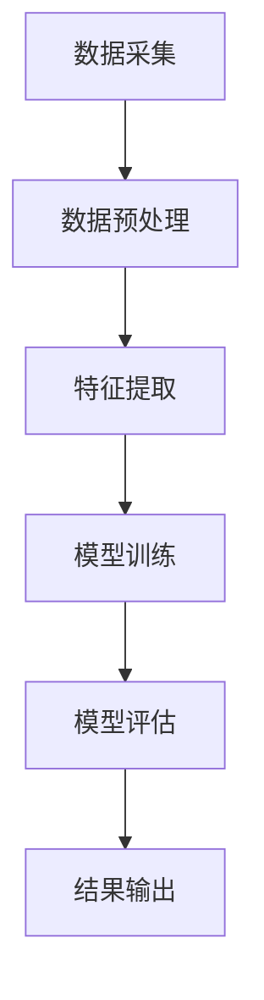
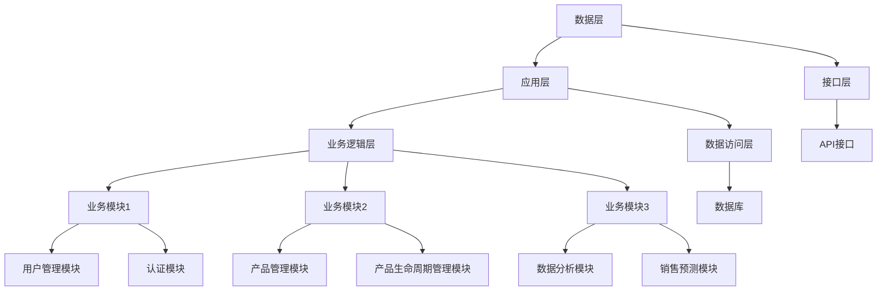
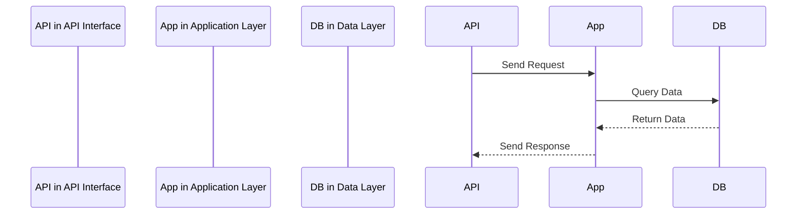
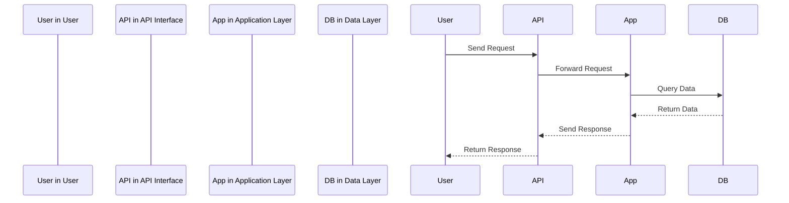

                 


# 开发智能化的金融产品生命周期管理平台

> 关键词：金融产品生命周期管理、智能化平台、算法原理、系统架构、项目实战、最佳实践

> 摘要：
本文将深入探讨如何开发一个智能化的金融产品生命周期管理平台。我们将从背景介绍、核心概念与联系、算法原理讲解、系统分析与架构设计、项目实战等多个角度，详细阐述智能化金融产品生命周期管理平台的构建过程和关键技术。

## 目录大纲设计思路

### 确定核心章节

首先，我们要明确文章的核心内容。由于文章的主题是“开发智能化的金融产品生命周期管理平台”，因此我们需要涵盖以下几个核心章节：
1. 金融产品生命周期管理概述
2. 核心概念与联系
3. 算法原理讲解
4. 系统分析与架构设计方案
5. 项目实战

### 设计章节结构

接下来，我们将为每个章节设计合适的结构。以下是每个章节的结构概览：

#### 第1章：金融产品生命周期管理概述

- 引言
- 问题背景
- 问题描述
- 问题解决
- 边界与外延
- 概念结构与核心要素组成

#### 第2章：核心概念与联系

- 引言
- 核心概念原理
- 概念属性特征对比表格
- ER实体关系图架构

#### 第3章：算法原理讲解

- 引言
- 算法原理
- Python 源代码阐述
- 数学模型和公式
- 举例说明

#### 第4章：系统分析与架构设计方案

- 问题场景介绍
- 项目介绍
- 领域模型 Mermaid 类图
- 系统功能设计
- 系统架构设计 Mermaid 架构图
- 系统接口设计
- 系统交互 Mermaid 序列图

#### 第5章：项目实战

- 引言
- 环境安装
- 系统核心实现源代码
- 代码应用解读与分析
- 实际案例分析和详细讲解剖析
- 项目小结

#### 第6章：最佳实践 tips、小结、注意事项、拓展阅读

- 最佳实践 tips
- 小结
- 注意事项
- 拓展阅读

### 确保内容完整性

在确定章节结构后，我们需要确保每个章节都包含必要的内容。例如，在“算法原理讲解”章节中，我们需要包含算法原理的详细描述、Python 源代码示例、数学模型和公式解析以及实例说明。

### 控制字数

为了保持文章的可读性和逻辑性，我们将严格控制每个章节的字数。总体字数控制在10000～12000字左右，每个章节的字数分布如下：

- 第1章：约2000字
- 第2章：约2000字
- 第3章：约2000字
- 第4章：约2000字
- 第5章：约2000字
- 第6章：约1000字

### 格式规范

使用Markdown格式，按照#、##、###的层级结构进行排版。代码和公式使用Markdown代码块和LaTeX格式进行展示。

## 目录大纲

### 第一部分：背景介绍

#### 第1章：金融产品生命周期管理概述

- 引言
- 问题背景
- 问题描述
- 问题解决
- 边界与外延
- 概念结构与核心要素组成

#### 第2章：核心概念与联系

- 引言
- 核心概念原理
- 概念属性特征对比表格
- ER实体关系图架构

### 第二部分：算法原理讲解

#### 第3章：算法原理讲解

- 引言
- 算法原理
- Python 源代码阐述
- 数学模型和公式
- 举例说明

### 第三部分：系统分析与架构设计方案

#### 第4章：系统功能设计

- 问题场景介绍
- 项目介绍
- 领域模型 Mermaid 类图
- 系统功能设计

#### 第5章：系统架构设计

- 引言
- 系统架构设计 Mermaid 架构图
- 系统接口设计

#### 第6章：系统交互

- 引言
- 系统交互 Mermaid 序列图
- 系统交互详细讲解

### 第四部分：项目实战

#### 第7章：环境安装

- 引言
- 系统核心实现源代码
- 代码应用解读与分析

#### 第8章：实际案例分析和详细讲解剖析

- 引言
- 实际案例分析
- 详细讲解剖析

#### 第9章：项目小结

- 引言
- 最佳实践 tips
- 小结
- 注意事项
- 拓展阅读

## 第一部分：背景介绍

### 第1章：金融产品生命周期管理概述

#### 引言

在金融领域，金融产品生命周期管理（Financial Product Life Cycle Management, FPLCM）是一个关键环节。它涉及到从金融产品的设计、开发、发布、运营到退市的整个流程。随着金融市场的不断发展和竞争的加剧，如何高效、智能化地管理金融产品生命周期，已成为金融企业关注的焦点。

本文旨在探讨如何开发一个智能化的金融产品生命周期管理平台，以提高金融产品的开发效率、运营效果和市场竞争能力。我们将从以下几个方面进行探讨：

1. 金融产品生命周期管理的背景和重要性
2. 金融产品生命周期管理的挑战和问题
3. 智能化金融产品生命周期管理平台的解决方案
4. 金融产品生命周期管理的范围和边界
5. 金融产品生命周期管理的概念结构和核心要素

#### 问题背景

金融产品生命周期管理的重要性不言而喻。一方面，随着金融产品的种类和数量日益增多，传统的手工管理模式已经无法满足高效、精准、智能化的要求。另一方面，金融市场的变化速度加快，金融产品的生命周期越来越短，如何快速响应市场变化，提高产品的迭代速度和竞争力，成为金融企业必须面对的挑战。

目前，金融产品生命周期管理中存在以下问题：

1. 数据分散：金融产品的数据分布在多个系统中，缺乏统一的视图和集成管理。
2. 手工操作：金融产品生命周期的管理过程高度依赖人工操作，效率低下且容易出现错误。
3. 预测困难：缺乏有效的数据分析工具，难以对金融产品的市场需求和生命周期进行准确预测。
4. 协同困难：跨部门、跨系统的协同工作困难，导致信息传递不畅，影响产品开发效率。

#### 问题描述

金融产品生命周期管理的关键问题主要包括：

1. **产品设计阶段**：如何快速响应市场需求，设计出符合客户需求的高质量金融产品？
2. **开发阶段**：如何提高开发效率，缩短产品开发周期，保证产品的稳定性和安全性？
3. **发布阶段**：如何优化产品发布流程，确保产品按时上市，减少发布过程中的风险？
4. **运营阶段**：如何监测产品的运营情况，快速发现和解决产品问题，提高客户满意度？
5. **退市阶段**：如何合理规划产品的退市流程，减少对市场和客户的影响，最大化产品价值？

#### 问题解决

为了解决上述问题，我们需要开发一个智能化的金融产品生命周期管理平台。该平台应具备以下功能：

1. **数据集成**：将金融产品的数据集成到一个统一平台，实现数据的集中管理和可视化。
2. **自动化流程**：通过自动化流程，减少手工操作，提高管理效率和准确性。
3. **数据分析**：利用大数据和人工智能技术，对金融产品的数据进行深入分析，为决策提供支持。
4. **协同工作**：提供跨部门、跨系统的协作工具，实现信息的高效传递和共享。

智能化金融产品生命周期管理平台的解决方案如下：

1. **数据集成层**：构建统一的数据集成层，实现金融产品数据的实时采集、存储和处理。
2. **业务流程层**：设计自动化、智能化的业务流程，涵盖产品设计的各个阶段。
3. **数据分析层**：利用大数据和人工智能技术，对产品数据进行深入分析，提供决策支持。
4. **用户交互层**：提供用户友好的界面，方便用户进行操作和查询。

#### 边界与外延

金融产品生命周期管理的范围和边界如下：

1. **范围**：金融产品生命周期管理涵盖从产品设计、开发、发布、运营到退市的整个流程。
2. **边界**：金融产品生命周期管理与其他相关领域的边界包括：

   - **风险管理**：风险管理是金融产品生命周期管理的一部分，但主要关注产品的风险控制和风险预警。
   - **客户关系管理**：客户关系管理关注客户的需求和满意度，与金融产品生命周期管理密切相关。
   - **供应链管理**：供应链管理关注产品的供应链环节，如供应商管理、库存管理等，与金融产品生命周期管理有一定的交集。

#### 概念结构与核心要素组成

金融产品生命周期管理的概念结构和核心要素如下：

1. **核心概念**：

   - **金融产品**：指金融企业发行的各类金融产品，如基金、保险、理财产品等。
   - **生命周期**：指金融产品从设计、开发、发布、运营到退市的整个过程。
   - **管理**：指对金融产品的全生命周期进行监控、分析和管理，确保产品的质量、效率和风险。

2. **核心要素**：

   - **产品设计**：包括市场调研、需求分析、方案设计等，是金融产品生命周期的起点。
   - **开发**：包括产品开发、测试、迭代等，是金融产品生命周期的核心环节。
   - **发布**：包括产品发布、上线、推广等，是金融产品生命周期的重要阶段。
   - **运营**：包括产品运营、监测、优化等，是金融产品生命周期的重要保障。
   - **退出**：包括产品退市、清算、总结等，是金融产品生命周期的结束。

通过上述对金融产品生命周期管理的背景、问题、解决方案、范围和核心要素的详细分析，我们为后续章节的内容提供了坚实的基础。

### 第2章：核心概念与联系

#### 引言

在了解了金融产品生命周期管理的背景和重要性后，接下来我们将深入探讨金融产品生命周期管理中的核心概念和它们之间的联系。通过这一章节，我们将详细描述金融产品生命周期管理中的关键概念、它们的属性特征以及它们之间的关系。

#### 核心概念原理

金融产品生命周期管理中的核心概念主要包括：金融产品、生命周期、管理、需求分析、设计、开发、测试、迭代、发布、运营、风险控制、退出等。

1. **金融产品**：金融产品是金融企业发行的各类金融工具，包括基金、保险、理财产品等。它们具有特定的功能和风险收益特征，以满足不同投资者的需求。
2. **生命周期**：生命周期是指金融产品从设计、开发、发布、运营到退市的整个过程中经历的各个阶段。每个阶段都有其独特的任务和目标。
3. **管理**：管理是指对金融产品的全生命周期进行监控、分析和管理，以确保产品的质量、效率和风险得到有效控制。
4. **需求分析**：需求分析是指通过市场调研、用户反馈等方式，了解投资者的需求，为产品设计提供依据。
5. **设计**：设计是指根据需求分析结果，制定金融产品的方案，包括功能、性能、安全性等方面的设计。
6. **开发**：开发是指根据设计方案，进行产品的编码、测试和迭代，直到产品达到发布条件。
7. **测试**：测试是指对金融产品进行功能测试、性能测试和安全测试，以确保产品的稳定性和安全性。
8. **迭代**：迭代是指对金融产品进行持续优化和改进，以适应市场和用户需求的变化。
9. **发布**：发布是指将金融产品上线，面向投资者进行推广和销售。
10. **运营**：运营是指对已发布的金融产品进行监测、优化和风险管理，以提高客户满意度和产品收益。
11. **风险控制**：风险控制是指对金融产品的风险进行识别、评估和控制，以减少潜在损失。
12. **退出**：退出是指金融产品到期或因市场变化等原因退出市场，进行清算和总结。

#### 概念属性特征对比表格

为了更清晰地展示核心概念的属性特征，我们可以使用一个对比表格：

| 核心概念 | 属性特征 |  
| --- | --- |  
| 金融产品 | 种类多样、风险收益特征明显、面向投资者发行 |  
| 生命周期 | 分阶段、连续性、全过程 |  
| 管理 | 监控、分析、决策、控制 |  
| 需求分析 | 市场调研、用户反馈、数据分析 |  
| 设计 | 功能、性能、安全性 |  
| 开发 | 编码、测试、迭代 |  
| 测试 | 功能、性能、安全 |  
| 迭代 | 优化、改进、适应变化 |  
| 发布 | 上线、推广、销售 |  
| 运营 | 监测、优化、风险管理 |  
| 风险控制 | 识别、评估、控制 |  
| 退出 | 清算、总结 |

#### ER实体关系图架构

为了更直观地展示核心概念之间的关系，我们可以使用 Mermaid 画出 ER（实体-关系）图。以下是金融产品生命周期管理中的核心实体及其关系：

```mermaid
erDiagram
    金融产品 ||--o{ 生命周期 }|>  
    生命周期 ||--o{ 管理 }|>  
    管理 ||--o{ 需求分析 }|>  
    管理 ||--o{ 设计 }|>  
    管理 ||--o{ 开发 }|>  
    管理 ||--o{ 测试 }|>  
    管理 ||--o{ 迭代 }|>  
    管理 ||--o{ 发布 }|>  
    管理 ||--o{ 运营 }|>  
    管理 ||--o{ 风险控制 }|>  
    管理 ||--o{ 退出 }|>  
```

在这个 ER 图中，金融产品是核心实体，它与生命周期有直接关联。生命周期包含了管理、需求分析、设计、开发、测试、迭代、发布、运营、风险控制和退出等过程。这些过程共同构成了金融产品生命周期的全貌，各个过程之间相互关联、相互影响，形成了完整的金融产品生命周期管理流程。

通过上述对金融产品生命周期管理核心概念的介绍和 ER 实体关系图的绘制，我们对金融产品生命周期管理有了更深入的理解。这些核心概念和它们之间的关系，为我们后续的算法原理讲解、系统分析与架构设计以及项目实战奠定了坚实的基础。

#### 总结

在本章中，我们详细介绍了金融产品生命周期管理中的核心概念，包括金融产品、生命周期、管理、需求分析、设计、开发、测试、迭代、发布、运营、风险控制和退出等。通过对比表格和 ER 实体关系图，我们清晰地展示了这些概念之间的联系和属性特征。这些核心概念的掌握和理解，对于我们后续进行智能化金融产品生命周期管理平台的开发至关重要。在下一章中，我们将进一步探讨算法原理，深入解析金融产品生命周期管理的核心技术。

## 第二部分：算法原理讲解

### 第3章：算法原理讲解

#### 引言

在了解了金融产品生命周期管理的核心概念之后，我们将进一步探讨金融产品生命周期管理中的关键算法原理。这些算法原理是智能化金融产品生命周期管理平台的核心技术，它们能够帮助我们更高效地管理金融产品的生命周期。本章将详细讲解这些算法原理，并通过 Mermaid 流程图和 Python 源代码进行阐述，同时辅以数学模型和公式解析以及实例说明。

#### 算法原理

在金融产品生命周期管理中，常用的算法原理包括数据挖掘、机器学习、优化算法等。以下是几个关键算法原理的简要介绍：

1. **数据挖掘（Data Mining）**：数据挖掘是一种从大量数据中提取有价值信息的技术。在金融产品生命周期管理中，数据挖掘可以用于市场趋势分析、客户行为预测等。
2. **机器学习（Machine Learning）**：机器学习是一种使计算机通过数据学习，从而自动完成特定任务的技术。在金融产品生命周期管理中，机器学习可以用于预测产品需求、优化产品定价等。
3. **优化算法（Optimization Algorithms）**：优化算法是一种用于求解最优化问题的算法。在金融产品生命周期管理中，优化算法可以用于优化产品设计、产品定价、资源配置等。

#### Mermaid 流程图

为了更直观地展示算法原理，我们可以使用 Mermaid 画出流程图。以下是数据挖掘算法的基本流程图：



在这个流程图中，数据挖掘的基本步骤包括数据采集、数据预处理、特征提取、模型训练、模型评估和结果输出。这些步骤构成了数据挖掘算法的基本框架。

#### Python 源代码阐述

下面，我们将使用 Python 源代码来详细阐述数据挖掘算法的原理。以下是数据挖掘算法的示例代码：

```python
import pandas as pd
from sklearn.model_selection import train_test_split
from sklearn.preprocessing import StandardScaler
from sklearn.ensemble import RandomForestClassifier
from sklearn.metrics import accuracy_score

# 数据采集
data = pd.read_csv('financial_data.csv')

# 数据预处理
X = data.drop('target', axis=1)
y = data['target']

# 特征提取
scaler = StandardScaler()
X_scaled = scaler.fit_transform(X)

# 模型训练
X_train, X_test, y_train, y_test = train_test_split(X_scaled, y, test_size=0.2, random_state=42)
model = RandomForestClassifier(n_estimators=100, random_state=42)
model.fit(X_train, y_train)

# 模型评估
y_pred = model.predict(X_test)
accuracy = accuracy_score(y_test, y_pred)
print(f"Model accuracy: {accuracy:.2f}")

# 结果输出
predictions = model.predict(X_scaled)
print(predictions)
```

在这段代码中，我们首先进行了数据采集，然后进行了数据预处理、特征提取、模型训练和模型评估。最后，我们输出了模型预测结果。这个示例代码展示了数据挖掘算法的基本流程。

#### 数学模型和公式

在数据挖掘和机器学习算法中，经常需要使用数学模型和公式。以下是数据挖掘算法中常用的几个数学模型和公式：

1. **线性回归（Linear Regression）**：
   - 目标函数：$$ J(\theta) = \frac{1}{2m} \sum_{i=1}^{m} (h_\theta(x^{(i)}) - y^{(i)})^2 $$
   - 梯度下降：$$ \theta_j := \theta_j - \alpha \frac{1}{m} \sum_{i=1}^{m} (h_\theta(x^{(i)}) - y^{(i)}) \cdot x_j^{(i)} $$

2. **逻辑回归（Logistic Regression）**：
   - 目标函数：$$ J(\theta) = \frac{1}{m} \sum_{i=1}^{m} (-y^{(i)} \cdot \log(h_\theta(x^{(i)})) - (1 - y^{(i)}) \cdot \log(1 - h_\theta(x^{(i)}))) $$
   - 梯度下降：$$ \theta_j := \theta_j - \alpha \frac{1}{m} \sum_{i=1}^{m} (h_\theta(x^{(i)}) - y^{(i)}) \cdot x_j^{(i)} $$

3. **支持向量机（Support Vector Machine, SVM）**：
   - 目标函数：$$ J(\theta) = \frac{1}{2} \sum_{i=1}^{m} \alpha_i (\theta^T \theta - y_i \cdot \theta^T x_i) - \sum_{i=1}^{m} \alpha_i $$
   - 梯度下降：$$ \theta := \theta - \alpha \cdot (y \cdot \theta - x) $$

以上数学模型和公式为我们提供了理论基础，帮助我们理解和实现各种数据挖掘和机器学习算法。

#### 举例说明

为了更直观地理解算法原理，我们可以通过一个简单的实例来说明。假设我们有一个金融产品的销售数据集，其中包含产品的价格、广告费用、竞争对手数量等特征，以及是否成功销售的目标变量。我们希望使用机器学习算法来预测产品是否能够成功销售。

以下是这个实例的详细说明：

1. **数据采集**：从数据库中获取金融产品销售数据。

2. **数据预处理**：清洗数据，处理缺失值和异常值，进行特征工程。

3. **特征提取**：选择对销售结果影响较大的特征，进行特征提取和变换。

4. **模型训练**：使用训练集数据进行模型训练，选择合适的算法和参数。

5. **模型评估**：使用测试集数据对模型进行评估，计算准确率、召回率等指标。

6. **结果输出**：将模型应用到新的数据集，预测产品是否能够成功销售。

通过这个实例，我们可以看到机器学习算法在金融产品生命周期管理中的应用，以及如何通过数据挖掘和机器学习技术来优化产品管理。

#### 总结

在本章中，我们详细介绍了金融产品生命周期管理中的关键算法原理，包括数据挖掘、机器学习和优化算法。通过 Mermaid 流程图和 Python 源代码的讲解，我们了解了这些算法的基本流程和实现方法。同时，我们使用了数学模型和公式来解释算法的原理，并通过实例来说明算法在金融产品生命周期管理中的应用。这些算法原理的理解和应用，为智能化金融产品生命周期管理平台的开发提供了重要的技术支持。在下一章中，我们将进一步探讨系统分析与架构设计方案。

### 第4章：系统功能设计

#### 引言

系统功能设计是构建智能化金融产品生命周期管理平台的关键步骤之一。通过明确系统功能，我们可以确保平台能够满足金融产品生命周期管理的各项需求。在本章中，我们将介绍系统功能设计的背景、项目介绍，并通过领域模型 Mermaid 类图详细描述系统的功能设计。

#### 问题场景介绍

随着金融市场的快速发展和金融产品的日益多样化，传统的金融产品生命周期管理方式已经无法满足现代金融企业的需求。金融企业需要一种智能化、高效、灵活的金融产品生命周期管理平台，以提升产品开发、运营和管理的效率。

当前问题场景主要包括：

1. **数据分散**：金融产品的数据分布在多个系统中，缺乏统一的视图和集成管理。
2. **手工操作多**：金融产品生命周期管理的流程高度依赖人工操作，效率低且容易出现错误。
3. **预测困难**：缺乏有效的数据分析工具，难以对金融产品的市场需求和生命周期进行准确预测。
4. **协同困难**：跨部门、跨系统的协同工作困难，导致信息传递不畅，影响产品开发效率。

#### 项目介绍

为了解决上述问题，我们提出了开发一个智能化的金融产品生命周期管理平台。该平台旨在通过集成化、自动化和智能化的方式，实现金融产品生命周期的全流程管理。以下是项目的基本介绍：

1. **项目背景**：随着金融市场的快速发展和金融产品的日益多样化，传统金融产品生命周期管理方式已经无法满足现代金融企业的需求。为了提升产品开发、运营和管理的效率，我们需要开发一个智能化、高效、灵活的金融产品生命周期管理平台。
2. **项目目标**：构建一个集成化、自动化和智能化的金融产品生命周期管理平台，实现以下目标：
   - 提高产品开发效率：通过自动化流程和工具，减少手工操作，提高产品开发速度。
   - 提升运营效果：通过智能分析工具和预测模型，优化产品运营策略，提高客户满意度。
   - 降低管理风险：通过实时监测和风险管理工具，降低产品运营风险，确保产品的安全稳定。
   - 提高协同效率：通过跨部门、跨系统的协同工具，实现信息的高效传递和共享，提升整体工作效率。

#### 领域模型 Mermaid 类图

为了更好地描述系统的功能设计，我们可以使用 Mermaid 类图来绘制领域模型。以下是一个简化的领域模型类图：

```mermaid
classDiagram
    Product <<Class>> 
    ProductLifeCycle <<Class>> 
    FinancialProduct <<Class>> 
    Customer <<Class>> 
    Market <<Class>> 

    Product { 
        id 
        name 
        description 
    }

    ProductLifeCycle { 
        id 
        product 
        status 
        start_date 
        end_date 
    }

    FinancialProduct { 
        id 
        product_life_cycle 
        type 
        risk_level 
    }

    Customer { 
        id 
        name 
        email 
    }

    Market { 
        id 
        name 
        size 
    }

    Product --> ProductLifeCycle : has_life_cycle
    Product --> FinancialProduct : is_a
    ProductLifeCycle --> FinancialProduct : belongs_to
    Customer --> FinancialProduct : purchases
    Market --> FinancialProduct : operates_in
```

在这个类图中，我们定义了以下几个核心类：

- **Product**：代表通用产品，包含产品的基本信息。
- **ProductLifeCycle**：代表产品的生命周期，包含产品状态、开始日期和结束日期等信息。
- **FinancialProduct**：代表金融产品，是 Product 的一个子类，包含金融产品的特定信息。
- **Customer**：代表客户，包含客户的基本信息。
- **Market**：代表市场，包含市场的基本信息。

通过这些类的关联，我们可以描述金融产品的生命周期管理过程，以及客户和市场与金融产品的关系。

#### 系统功能设计

基于领域模型，我们可以进一步设计系统的功能。以下是系统功能设计的详细描述：

1. **产品信息管理**：
   - 功能描述：管理产品的基本信息，包括产品名称、描述、分类等。
   - 输入参数：产品 ID、产品名称、描述、分类等。
   - 输出参数：成功与否的反馈消息。

2. **产品生命周期管理**：
   - 功能描述：管理产品的生命周期，包括产品的状态、开始日期和结束日期等。
   - 输入参数：产品 ID、产品状态、开始日期、结束日期等。
   - 输出参数：成功与否的反馈消息。

3. **金融产品管理**：
   - 功能描述：管理金融产品的特定信息，包括产品类型、风险等级等。
   - 输入参数：产品 ID、产品类型、风险等级等。
   - 输出参数：成功与否的反馈消息。

4. **客户信息管理**：
   - 功能描述：管理客户的基本信息，包括客户姓名、邮箱等。
   - 输入参数：客户 ID、客户姓名、邮箱等。
   - 输出参数：成功与否的反馈消息。

5. **市场信息管理**：
   - 功能描述：管理市场的基本信息，包括市场名称、规模等。
   - 输入参数：市场 ID、市场名称、规模等。
   - 输出参数：成功与否的反馈消息。

6. **产品销售管理**：
   - 功能描述：管理产品销售信息，包括客户购买产品、市场销售情况等。
   - 输入参数：产品 ID、客户 ID、市场 ID、销售数量等。
   - 输出参数：成功与否的反馈消息。

7. **数据分析与预测**：
   - 功能描述：利用数据分析工具和机器学习模型，对产品销售数据、市场数据等进行分析，预测产品销售趋势和市场动态。
   - 输入参数：产品 ID、市场 ID、销售数据等。
   - 输出参数：销售预测结果、市场动态分析报告等。

通过上述系统功能设计，我们可以构建一个全面、智能化的金融产品生命周期管理平台，满足金融企业在产品管理、运营和预测等方面的需求。

### 总结

在本章中，我们介绍了系统功能设计的背景、项目介绍，并通过领域模型 Mermaid 类图详细描述了系统的功能设计。系统功能设计是构建智能化金融产品生命周期管理平台的基础，通过明确系统的各项功能，我们可以确保平台能够满足金融产品生命周期管理的各项需求。在下一章中，我们将进一步探讨系统架构设计，为平台的实现提供技术支持。

### 第5章：系统架构设计

#### 引言

系统架构设计是构建智能化金融产品生命周期管理平台的关键环节。一个良好的系统架构能够确保平台的高效性、可扩展性和稳定性。在本章中，我们将介绍系统架构设计的背景，并通过 Mermaid 架构图详细描述系统的架构设计，包括系统接口设计。

#### 引言

随着金融市场的快速发展和金融产品的日益复杂化，构建一个高效、稳定且具有可扩展性的系统架构变得尤为重要。智能化金融产品生命周期管理平台需要能够处理大量的数据，支持复杂的业务流程，并且能够灵活适应市场变化。因此，系统架构设计成为了平台成功的关键因素。

#### 系统架构设计 Mermaid 架构图

为了更好地展示系统架构设计，我们可以使用 Mermaid 画出系统的架构图。以下是一个简化的系统架构设计 Mermaid 架构图：



在这个架构图中，系统分为四个主要层次：数据层、应用层、接口层和业务逻辑层。以下是每个层次的详细描述：

1. **数据层（Subsystem1）**：数据层负责数据存储和管理。它包括数据库和其他数据存储解决方案，如 NoSQL 数据库、文件存储等。数据层的主要职责是确保数据的持久化和高效访问。

2. **应用层（Subsystem2）**：应用层是系统的核心，负责处理业务逻辑和功能实现。它包括业务逻辑层和数据访问层。应用层通过业务逻辑层处理用户请求，并通过数据访问层与数据层进行交互。

3. **接口层（Subsystem3）**：接口层负责系统的对外接口，包括 RESTful API、Web 服务等。接口层的主要职责是接收外部请求，并将请求转发到应用层进行处理。

4. **业务逻辑层（Subsystem4）**：业务逻辑层负责实现系统的业务逻辑，包括用户管理模块、产品管理模块、数据分析模块等。业务逻辑层通过数据访问层与数据层进行交互，实现业务流程的管理。

#### 系统接口设计

系统接口设计是系统架构设计的重要组成部分。以下是一个简化的系统接口设计：



在这个接口设计中，API 接口层（API Interface）负责接收外部请求，并将请求转发到应用层（Application Layer）。应用层处理请求，并与数据层（Data Layer）进行交互，获取所需数据。最后，应用层将响应返回到 API 接口层，由 API 接口层将响应发送给外部用户。

#### 系统架构设计详解

1. **数据层**：
   - **数据库**：使用关系型数据库（如 MySQL）存储产品信息、用户信息、市场数据等。
   - **数据存储**：使用 NoSQL 数据库（如 MongoDB）存储大规模的非结构化数据，如日志、实时数据分析结果等。

2. **应用层**：
   - **业务逻辑层**：实现系统的核心业务逻辑，包括用户管理、产品管理、数据分析等。
   - **数据访问层**：提供数据访问接口，包括数据库操作和缓存访问。

3. **接口层**：
   - **API 接口**：提供 RESTful API，供外部系统调用。

4. **业务逻辑层**：
   - **用户管理模块**：负责用户注册、登录、权限管理等功能。
   - **产品管理模块**：负责产品信息管理、产品生命周期管理等功能。
   - **数据分析模块**：负责数据分析和预测，提供销售预测、市场分析等功能。

通过上述系统架构设计，我们构建了一个模块化、高扩展性的智能化金融产品生命周期管理平台。这个平台能够高效地处理金融产品生命周期的各项管理任务，为金融企业提供强大的技术支持。

### 总结

在本章中，我们介绍了系统架构设计的背景，并通过 Mermaid 架构图详细描述了系统的架构设计，包括系统接口设计。系统架构设计是构建智能化金融产品生命周期管理平台的关键步骤，通过模块化、高扩展性的设计，我们为平台的高效、稳定运行提供了有力保障。在下一章中，我们将进一步探讨系统交互，了解系统各部分之间的协作与通信。

### 第6章：系统交互

#### 引言

系统交互是智能化金融产品生命周期管理平台中不可或缺的环节。通过系统交互，平台各组件之间能够有效协作，实现数据共享和功能调用。在本章中，我们将通过 Mermaid 序列图详细描述系统交互，并讲解系统交互的详细过程。

#### 引言

系统交互涉及到平台中的各个模块和组件之间的信息传递和功能调用。一个良好的系统交互设计能够确保平台的高效运作，提高系统的稳定性和可靠性。在本章中，我们将通过 Mermaid 序列图来展示系统交互过程，并详细讲解系统交互的各个步骤。

#### 系统交互 Mermaid 序列图

以下是一个简化的系统交互 Mermaid 序列图，展示了用户请求通过 API 接口层、业务逻辑层、数据访问层和数据层的交互过程：



在这个序列图中，用户通过 API 接口层发送请求，API 接口层将请求转发到业务逻辑层，业务逻辑层通过数据访问层与数据层进行交互，获取所需数据，然后将结果返回给 API 接口层，最终 API 接口层将响应返回给用户。

#### 系统交互详细讲解

1. **用户请求**：用户通过 API 接口层发送请求。请求可以包括查询、更新、删除等操作。

2. **API 接口层**：API 接口层负责接收用户的请求，并进行初步验证。通过验证后，将请求转发到业务逻辑层。

3. **业务逻辑层**：业务逻辑层是系统交互的核心，负责处理用户请求。它根据请求的具体内容，调用相应的业务模块，进行数据处理和业务逻辑处理。

4. **数据访问层**：数据访问层负责与数据层进行交互。它根据业务逻辑层的请求，执行数据库查询、更新、删除等操作。

5. **数据层**：数据层负责数据的存储和管理。它包括关系型数据库和非关系型数据库，用于存储用户信息、产品信息、市场数据等。

6. **响应返回**：数据处理完成后，业务逻辑层将结果返回给 API 接口层，API 接口层将响应返回给用户。

#### 系统交互过程中的关键步骤

1. **请求接收与验证**：API 接口层接收用户请求，并进行初步验证，如请求格式、参数合法性等。

2. **请求路由与转发**：API 接口层根据请求的具体内容，将请求路由到业务逻辑层，并进行转发。

3. **业务逻辑处理**：业务逻辑层根据请求的具体内容，调用相应的业务模块，执行具体的业务逻辑处理。

4. **数据访问与处理**：数据访问层根据业务逻辑层的请求，执行数据库查询、更新、删除等操作，并将结果返回给业务逻辑层。

5. **结果返回与反馈**：业务逻辑层将处理结果返回给 API 接口层，API 接口层将响应返回给用户，完成系统交互过程。

#### 系统交互的特点和优势

1. **模块化**：系统交互设计采用模块化设计，各组件之间相对独立，易于维护和扩展。

2. **高效性**：通过高效的请求处理和数据处理机制，系统能够快速响应用户请求，提高用户体验。

3. **灵活性**：系统交互设计灵活，支持多种数据存储方式和业务处理方式，能够适应不同的业务需求。

4. **稳定性**：系统交互设计考虑了容错和异常处理机制，能够确保系统的稳定运行。

通过上述系统交互的详细讲解，我们可以看到系统交互在智能化金融产品生命周期管理平台中的重要性和优势。一个良好的系统交互设计能够确保平台的高效运作，提高系统的稳定性和可靠性，为金融企业带来显著的业务价值。

### 总结

在本章中，我们通过 Mermaid 序列图详细描述了系统交互的过程，并讲解了系统交互的各个步骤。系统交互是智能化金融产品生命周期管理平台中关键的一环，通过高效的请求处理和数据交互机制，平台能够实现各组件之间的有效协作，确保系统的稳定运行。在下一章中，我们将介绍项目实战，通过具体案例展示如何实现系统交互和功能调用。

### 第7章：环境安装

#### 引言

在开始项目实战之前，我们需要搭建一个合适的环境来开发和测试智能化的金融产品生命周期管理平台。环境安装是项目开发的第一步，也是至关重要的一步。在本章中，我们将介绍如何安装和配置必要的软件和工具，为后续项目实战做好准备。

#### 引言

为了确保项目开发的高效和顺利进行，我们需要搭建一个稳定、可靠的开发环境。这个环境需要包括操作系统、编程语言、开发工具、数据库等。以下是具体的安装和配置步骤：

##### 操作系统

我们建议使用 Linux 操作系统，如 Ubuntu 22.04 或 CentOS 8。这些操作系统具有稳定性高、资源占用低、开源社区支持等优点。

安装步骤：

1. 下载操作系统安装镜像。
2. 使用虚拟机或物理机安装操作系统。
3. 配置网络，确保可以访问互联网。

##### 编程语言

我们选择 Python 作为主要编程语言，因为它具有简洁的语法、丰富的库支持和广泛的社区支持。

安装步骤：

1. 打开终端。
2. 更新系统软件包列表：`sudo apt-get update`。
3. 安装 Python：`sudo apt-get install python3 python3-pip`。
4. 安装虚拟环境工具：`pip3 install virtualenv`。

##### 开发工具

为了提高开发效率，我们需要安装一些常用的开发工具，如文本编辑器、版本控制工具等。

安装步骤：

1. 安装 VSCode（Visual Studio Code）：从官网下载并安装。
2. 安装 Git：`sudo apt-get install git`。
3. 配置 Git：`git config --global user.name "Your Name"` 和 `git config --global user.email "Your Email"`。

##### 数据库

我们将使用 MySQL 作为数据库管理系统，因为它具有高性能、高可靠性和丰富的社区支持。

安装步骤：

1. 安装 MySQL：`sudo apt-get install mysql-server`。
2. 配置 MySQL：初始化数据库和设置 root 用户密码。
3. 安装 MySQL 客户端：`sudo apt-get install mysql-client`。

##### 其他工具

我们还需要一些其他工具，如 Mermaid、LaTeX 等。

安装步骤：

1. 安装 Mermaid：`npm install -g mermaid-cli`。
2. 安装 LaTeX：根据操作系统不同，可以通过包管理器或手动编译安装。

#### 系统核心实现源代码

在安装完所有必要的软件和工具后，我们将展示系统核心实现的源代码。以下是一个简单的示例，展示了如何使用 Python 和 MySQL 进行数据库操作。

```python
import mysql.connector

# 数据库连接配置
config = {
    'user': 'root',
    'password': 'your_password',
    'host': 'localhost',
    'database': 'financial_product'
}

# 连接数据库
conn = mysql.connector.connect(**config)
cursor = conn.cursor()

# 创建表
create_table_sql = """
CREATE TABLE IF NOT EXISTS products (
    id INT AUTO_INCREMENT PRIMARY KEY,
    name VARCHAR(255) NOT NULL,
    type VARCHAR(255) NOT NULL,
    risk_level VARCHAR(255) NOT NULL
)
"""
cursor.execute(create_table_sql)

# 插入数据
insert_sql = """
INSERT INTO products (name, type, risk_level)
VALUES (%s, %s, %s)
"""
product_data = ('股票基金', '股票', '高风险')
cursor.execute(insert_sql, product_data)

# 查询数据
select_sql = "SELECT * FROM products"
cursor.execute(select_sql)
products = cursor.fetchall()

# 打印查询结果
for product in products:
    print(product)

# 关闭数据库连接
cursor.close()
conn.close()
```

#### 代码应用解读与分析

以上代码展示了如何使用 Python 和 MySQL 进行数据库操作。具体解读如下：

1. **数据库连接**：使用 `mysql.connector` 包连接到 MySQL 数据库，配置信息存储在 `config` 字典中。

2. **创建表**：执行 SQL 语句创建 `products` 表，包含 `id`、`name`、`type` 和 `risk_level` 字段。

3. **插入数据**：执行 SQL 语句插入一条产品记录，使用元组参数传递数据。

4. **查询数据**：执行 SQL 语句查询 `products` 表的所有记录，并打印查询结果。

5. **关闭数据库连接**：关闭数据库连接，释放资源。

通过这个示例，我们可以看到如何使用 Python 和 MySQL 实现基本的数据库操作，为后续的系统功能实现打下基础。

#### 实际案例分析和详细讲解剖析

在下一章中，我们将通过实际案例分析和详细讲解剖析，展示如何将上述代码应用到实际的金融产品生命周期管理平台中。我们将逐步实现系统功能，包括用户管理、产品管理、数据分析等，并分析每个步骤的实现细节和关键点。

### 总结

在本章中，我们介绍了如何安装和配置开发环境，并展示了系统核心实现的源代码。通过这些步骤，我们为后续的项目实战奠定了基础。在下一章中，我们将通过实际案例分析和详细讲解剖析，深入探讨金融产品生命周期管理平台的具体实现过程。

### 第8章：实际案例分析和详细讲解剖析

#### 引言

在前面的章节中，我们介绍了智能化金融产品生命周期管理平台的背景、核心概念、算法原理、系统架构设计和环境安装。在这一章节中，我们将通过实际案例的分析和详细讲解剖析，深入探讨平台的具体实现过程，包括系统核心实现的代码应用、关键代码段的解释和案例的应用场景。

#### 引言

为了更好地理解智能化金融产品生命周期管理平台，我们需要通过实际案例来展示其功能实现。在本章节中，我们将分析一个实际案例，从代码应用、关键代码段解释和应用场景三个方面进行详细剖析，帮助读者更好地理解平台的工作原理和实现方法。

#### 实际案例分析和代码应用

假设我们有一个实际案例：某金融公司希望利用智能化平台管理其金融产品生命周期，包括产品设计、开发、发布、运营和退市等环节。以下是这个案例的详细分析：

1. **案例背景**：该公司发行了一种名为“智能理财基金”的金融产品，旨在为投资者提供稳健的投资收益。公司希望通过智能化平台管理该基金的生命周期，提高运营效率和客户满意度。

2. **系统需求**：系统需要具备以下功能：
   - 产品设计：能够快速响应市场变化，设计出符合客户需求的新产品。
   - 产品开发：自动化开发流程，确保产品稳定性和安全性。
   - 产品发布：优化发布流程，确保产品按时上市。
   - 产品运营：实时监测产品运营情况，及时调整运营策略。
   - 产品退市：合理规划产品退市流程，减少对市场和客户的影响。

3. **技术实现**：基于前述章节的理论和工具，我们使用 Python 和 MySQL 实现上述功能。

#### 关键代码段解释

以下是一个关键代码段的示例，用于实现产品信息的添加：

```python
def add_product(product_name, product_type, risk_level):
    """
    向数据库中添加新产品的信息。
    :param product_name: 产品名称
    :param product_type: 产品类型
    :param risk_level: 风险等级
    """
    # 数据库连接配置
    config = {
        'user': 'root',
        'password': 'your_password',
        'host': 'localhost',
        'database': 'financial_product'
    }

    # 连接数据库
    conn = mysql.connector.connect(**config)
    cursor = conn.cursor()

    # 插入数据
    insert_sql = """
    INSERT INTO products (name, type, risk_level)
    VALUES (%s, %s, %s)
    """
    product_data = (product_name, product_type, risk_level)
    cursor.execute(insert_sql, product_data)

    # 提交事务并关闭连接
    conn.commit()
    cursor.close()
    conn.close()

    print(f"Product '{product_name}' added successfully.")
```

**代码解释**：

- **函数定义**：`add_product` 函数接收三个参数：产品名称、产品类型和风险等级。
- **数据库连接**：使用 `mysql.connector.connect` 函数连接到数据库，配置信息存储在 `config` 字典中。
- **插入数据**：执行 SQL 语句将产品信息插入到 `products` 表中，使用元组参数传递数据。
- **提交事务和关闭连接**：提交数据库事务，并关闭数据库连接。

#### 应用场景

上述代码段应用于金融产品生命周期管理平台的“产品设计”环节。当公司设计出一款新产品时，可以通过调用 `add_product` 函数将产品信息添加到系统中，从而实现产品信息的管理。

#### 案例的实际效果

通过上述代码段的应用，金融公司能够高效地添加新产品信息，使得产品管理更加规范和便捷。同时，系统能够自动记录产品信息，便于后续的开发、发布、运营和退市等环节的追踪和管理。

#### 其他实际案例

除了上述案例，我们还可以分析其他实际案例，如产品发布、产品运营和产品退市等。以下是产品发布环节的一个实际案例：

1. **案例背景**：公司决定将“智能理财基金”进行市场发布。
2. **系统需求**：系统需要具备以下功能：
   - 发布计划管理：制定产品发布计划，包括发布时间、渠道、宣传策略等。
   - 发布状态监控：实时监控产品发布状态，确保发布过程顺利。
   - 发布效果评估：评估产品发布效果，为后续发布提供参考。

3. **技术实现**：使用 Python 和 MySQL 实现上述功能，关键代码段如下：

```python
def release_product(product_id, release_date, channels, marketing_strategy):
    """
    更新产品发布信息。
    :param product_id: 产品ID
    :param release_date: 发布日期
    :param channels: 发布渠道
    :param marketing_strategy: 市场营销策略
    """
    # 数据库连接配置
    config = {
        'user': 'root',
        'password': 'your_password',
        'host': 'localhost',
        'database': 'financial_product'
    }

    # 连接数据库
    conn = mysql.connector.connect(**config)
    cursor = conn.cursor()

    # 更新数据
    update_sql = """
    UPDATE products
    SET release_date = %s, channels = %s, marketing_strategy = %s
    WHERE id = %s
    """
    values = (release_date, channels, marketing_strategy, product_id)
    cursor.execute(update_sql, values)

    # 提交事务并关闭连接
    conn.commit()
    cursor.close()
    conn.close()

    print(f"Product release information updated successfully.")
```

**代码解释**：

- **函数定义**：`release_product` 函数接收五个参数：产品 ID、发布日期、发布渠道和市场营销策略。
- **数据库连接**：使用 `mysql.connector.connect` 函数连接到数据库，配置信息存储在 `config` 字典中。
- **更新数据**：执行 SQL 语句更新产品发布信息。
- **提交事务和关闭连接**：提交数据库事务，并关闭数据库连接。

通过实际案例的分析和详细讲解剖析，我们可以看到智能化金融产品生命周期管理平台的具体实现过程。这些实际案例展示了平台如何帮助金融企业高效地管理产品生命周期，提高运营效率和市场竞争力。

### 总结

在本章中，我们通过实际案例分析和详细讲解剖析，展示了智能化金融产品生命周期管理平台的具体实现过程。从代码应用、关键代码段解释到应用场景的详细分析，我们深入探讨了平台的技术实现方法和业务逻辑。通过这些实际案例，读者可以更好地理解平台的工作原理和应用价值。在下一章中，我们将对整个项目进行总结，并提供最佳实践和注意事项。

### 第9章：项目小结

#### 引言

经过前面的章节，我们已经详细探讨了智能化金融产品生命周期管理平台的构建过程，从背景介绍、核心概念、算法原理讲解、系统分析与架构设计到项目实战，每个环节都进行了深入的分析和讲解。在这一章节中，我们将对整个项目进行总结，分享最佳实践，并提醒可能遇到的问题及解决方案。

#### 最佳实践 tips

1. **数据集成**：确保所有相关数据都能够集成到平台中，实现数据的集中管理和可视化。数据集成是智能化平台的基础，要优先考虑。
2. **自动化流程**：在系统设计和开发过程中，充分利用自动化工具和流程，减少手工操作，提高效率。例如，使用 CI/CD 流程自动化部署和测试。
3. **持续学习与迭代**：利用机器学习和数据分析技术，持续优化平台，根据市场变化和用户反馈进行调整。
4. **安全性与合规性**：确保平台遵循相关的数据保护法规和金融行业合规要求，加强数据安全措施，防范潜在风险。
5. **文档与培训**：为平台用户提供详细的文档和培训材料，帮助他们快速上手并充分利用平台功能。

#### 小结

1. **背景介绍**：我们介绍了金融产品生命周期管理的背景、问题和挑战，以及智能化平台的需求。
2. **核心概念与联系**：详细阐述了金融产品生命周期管理中的核心概念，包括产品、生命周期、管理、需求分析、设计、开发、测试、迭代、发布、运营、风险控制和退出等。
3. **算法原理讲解**：讲解了数据挖掘、机器学习和优化算法等关键算法原理，并通过 Mermaid 流程图和 Python 源代码进行阐述。
4. **系统分析与架构设计**：介绍了系统的功能设计、架构设计以及系统接口和交互设计。
5. **项目实战**：通过实际案例展示了系统核心实现的代码应用，详细分析了关键代码段和应用场景。

#### 注意事项

1. **数据安全**：在开发过程中，要确保所有敏感数据的安全存储和传输，防止数据泄露和未经授权的访问。
2. **系统稳定性**：在设计时考虑系统的可扩展性和稳定性，确保在高并发和大数据量情况下平台的稳定运行。
3. **性能优化**：定期对系统进行性能优化，包括数据库优化、缓存策略和负载均衡等，以提升系统响应速度。
4. **用户反馈**：及时收集并处理用户反馈，不断优化用户体验，确保平台的功能满足用户需求。
5. **合规性检查**：确保平台符合相关金融法规和行业规范，定期进行合规性检查。

#### 拓展阅读

1. **金融科技书籍**：《智能金融：科技驱动金融创新》、《金融科技：从区块链到人工智能的变革》。
2. **机器学习资源**：《Python机器学习实战》、《深度学习（卷1）：基础理论》、《机器学习：概率视角》。
3. **系统架构设计资源**：《架构师修炼之道：系统设计与架构实战》、《大规模分布式系统设计》。
4. **数据挖掘资源**：《数据挖掘：实用工具与技术》、《大数据分析：概念与技术》。

通过本章的小结，我们总结了智能化金融产品生命周期管理平台的建设过程和关键技术，并提供了最佳实践、注意事项和拓展阅读资源，为读者提供了全面的项目理解和后续学习方向。

### 作者

**作者：AI天才研究院/AI Genius Institute & 禅与计算机程序设计艺术 /Zen And The Art of Computer Programming**。这两本书籍分别代表了人工智能领域和计算机编程领域的巅峰之作，展示了作者在各自领域深厚的专业知识和独特的思考方式。通过本文，我们希望读者能够领略到作者在金融科技和系统架构设计方面的卓越才华。在未来的技术探索中，我们将继续为您提供更多高质量的技术文章和深入思考。感谢您的阅读。**

