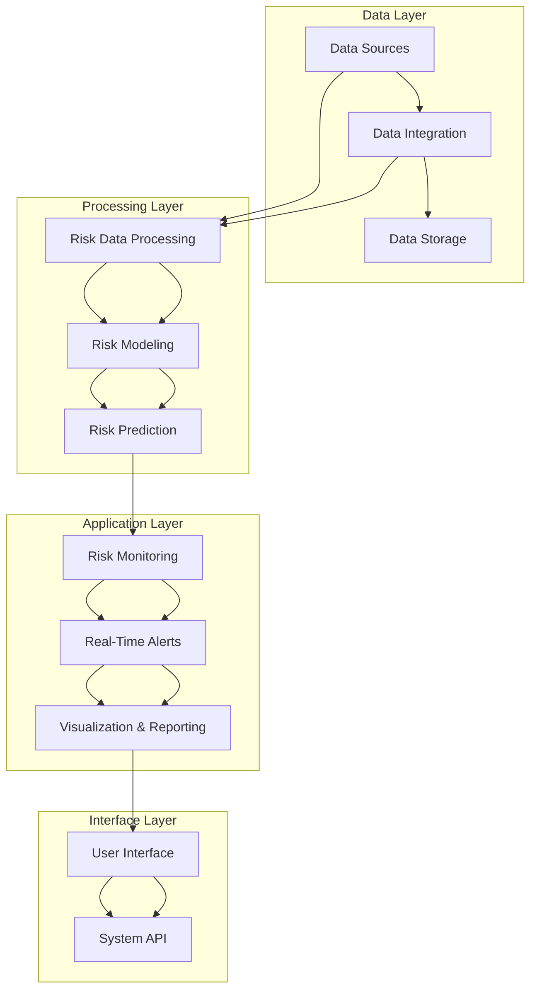
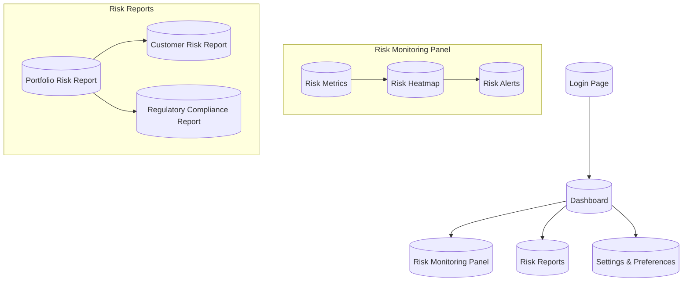

                 

### Chapter 1: Background and Core Concepts of Financial Product Lifecycle Risk Assessment

#### 1.1 Introduction to Financial Product Lifecycle Management

In the rapidly evolving financial industry, financial product lifecycle management (FPLM) has become a critical aspect for banks, insurance companies, and investment firms. FPLM encompasses the entire journey of a financial product, from its conceptualization to its eventual withdrawal from the market. This comprehensive approach ensures that financial products are developed, launched, and managed in a way that maximizes their profitability and mitigates potential risks.

**1.1.1 Importance and Challenges of Financial Product Risk Assessment**

Financial product risk assessment is a pivotal component of FPLM. It involves identifying, analyzing, and prioritizing risks associated with financial products to ensure their viability and profitability. The importance of risk assessment lies in its ability to:

- **Mitigate Risks**: By identifying potential risks, financial institutions can take proactive measures to mitigate them, thereby safeguarding their investments.
- **Enhance Decision-Making**: Risk assessment provides valuable insights that help decision-makers make informed choices regarding product development, pricing, and marketing strategies.
- **Ensure Regulatory Compliance**: Effective risk assessment ensures that financial products comply with regulatory requirements, reducing the risk of legal and financial penalties.
- **Increase Market Competitiveness**: By minimizing risks and maximizing profitability, financial institutions can offer more competitive products, attracting a larger customer base.

However, several challenges arise in the process of financial product risk assessment:

- **Complexity**: Financial products can be highly complex, involving numerous variables and interdependencies that make risk assessment challenging.
- **Inaccurate Data**: The accuracy of risk assessments heavily relies on the quality of data. Incomplete or inaccurate data can lead to flawed risk assessments.
- **Dynamic Market Environment**: Financial markets are highly volatile, making it difficult to predict future trends accurately.
- **Regulatory Changes**: Regulatory frameworks are subject to constant changes, requiring financial institutions to stay updated and adapt their risk assessment methodologies accordingly.

**1.1.2 Overview of the Financial Product Lifecycle**

The financial product lifecycle consists of several stages, each requiring distinct risk assessment approaches. These stages are:

1. **Conceptualization**: During this phase, product ideas are generated, and initial risk assessments are conducted to determine the feasibility of the product.
2. **Development**: In this stage, product designs are refined, and prototypes are created. Risks related to technology, compliance, and market demand are assessed.
3. **Launch**: At this point, the product is introduced to the market. Risks related to market acceptance, competition, and regulatory compliance are evaluated.
4. **Growth**: During the growth stage, the product gains market traction. Risks associated with market expansion, customer satisfaction, and operational scalability are analyzed.
5. **Maturity**: In the maturity stage, the product reaches its peak sales. Risks related to market saturation, product innovation, and cost optimization are considered.
6. **Decline**: As the product enters the decline stage, sales start to decline. Risks related to product obsolescence, customer attrition, and market exit strategies are assessed.

**1.1.3 Overview of Risk Assessment Methods in Finance**

Risk assessment in finance employs various methodologies to identify, analyze, and prioritize risks. Some of the commonly used methods include:

1. **Qualitative Analysis**: This method involves evaluating risks based on expert judgment, experience, and historical data. Techniques such as SWOT analysis (Strengths, Weaknesses, Opportunities, Threats) and scenario analysis are commonly used.
2. **Quantitative Analysis**: This method involves using mathematical and statistical techniques to measure and analyze risks. Techniques such as Value at Risk (VaR), Conditional Value at Risk (CVaR), and Monte Carlo simulation are widely used.
3. **Combination of Qualitative and Quantitative Analysis**: This approach combines the strengths of both qualitative and quantitative methods to provide a comprehensive risk assessment.
4. **Stress Testing**: This method involves simulating extreme market conditions to assess the potential impact on financial products and portfolios.
5. **Regulatory Compliance Analysis**: This method ensures that financial products comply with regulatory requirements, minimizing the risk of legal and financial penalties.

In the next chapter, we will delve deeper into the definition and characteristics of intelligent risk assessment platforms, exploring how advanced technologies can enhance the accuracy and efficiency of financial product lifecycle risk assessment.

### Chapter 2: Definition and Characteristics of Intelligent Risk Assessment Platforms

In the realm of financial product lifecycle management, the integration of advanced technologies has paved the way for the development of intelligent risk assessment platforms. These platforms leverage artificial intelligence, machine learning, and data analytics to provide enhanced accuracy, efficiency, and insights into risk management processes. In this chapter, we will explore the definition, characteristics, and key components of intelligent risk assessment platforms.

#### 2.1 Definition of Intelligent Risk Assessment Platforms

Intelligent risk assessment platforms are sophisticated systems designed to automate and enhance the process of identifying, analyzing, and mitigating risks associated with financial products throughout their lifecycle. These platforms combine various data sources, utilize advanced algorithms, and provide actionable insights to support informed decision-making. Unlike traditional risk assessment methods that rely heavily on human expertise, intelligent platforms leverage machine learning to continuously improve their predictive capabilities and adapt to changing market conditions.

#### 2.2 Key Characteristics of Intelligent Risk Assessment Platforms

The following characteristics distinguish intelligent risk assessment platforms from traditional methods:

1. **Automated Data Collection and Processing**: Intelligent platforms can automatically collect and process vast amounts of data from various sources, including market data, customer behavior, financial statements, and social media. This capability allows for real-time risk monitoring and analysis.

2. **Machine Learning Algorithms**: These platforms employ machine learning algorithms to identify patterns, relationships, and trends in the data. By training on historical data, these algorithms can predict future risks and recommend appropriate risk mitigation strategies.

3. **Advanced Analytics**: Intelligent platforms utilize advanced analytics techniques, such as predictive modeling, clustering, and clustering algorithms, to analyze complex datasets and provide actionable insights.

4. **Real-Time Monitoring and Alerts**: Intelligent risk assessment platforms can continuously monitor risk indicators and trigger alerts in real-time when potential risks are detected. This enables proactive risk management and timely decision-making.

5. **Scalability and Adaptability**: These platforms are designed to handle large volumes of data and can scale seamlessly as the complexity and size of the risk management operations increase. They are also adaptable to evolving market conditions and regulatory requirements.

6. **Enhanced Accuracy and Reliability**: By leveraging machine learning and advanced analytics, intelligent platforms can provide more accurate and reliable risk assessments compared to traditional methods. This leads to better-informed decision-making and reduced risk exposure.

7. **Integration with Existing Systems**: Intelligent risk assessment platforms can integrate seamlessly with existing risk management systems, data warehouses, and analytics tools, ensuring a cohesive and efficient risk management process.

#### 2.3 Comparison with Traditional Risk Assessment Platforms

While traditional risk assessment platforms rely on manual processes, expert judgment, and historical data, intelligent risk assessment platforms offer several advantages:

1. **Speed and Efficiency**: Intelligent platforms can process large datasets much faster than traditional methods, enabling real-time risk monitoring and analysis.

2. **Objective Decision-Making**: By leveraging machine learning algorithms, intelligent platforms provide more objective risk assessments based on data-driven insights rather than subjective human judgment.

3. **Improved Accuracy**: The continuous learning and adaptation capabilities of intelligent platforms result in more accurate and reliable risk predictions.

4. **Scalability**: Intelligent platforms can easily scale to handle increasing volumes of data and risk management operations, ensuring seamless performance as the business grows.

5. **Cost-Efficiency**: By automating manual processes and reducing the need for human intervention, intelligent platforms can help financial institutions save time and resources, leading to cost efficiencies.

In conclusion, intelligent risk assessment platforms offer a transformative approach to financial product lifecycle risk management. By leveraging advanced technologies, these platforms enhance accuracy, efficiency, and decision-making capabilities, enabling financial institutions to navigate the complexities of the modern financial market with greater confidence and agility. In the next chapter, we will delve into the main components of intelligent risk assessment platforms and explore their roles in the risk management process.

#### 2.4 Main Components of Intelligent Risk Assessment Platforms

Intelligent risk assessment platforms are composed of several key components that work together to provide comprehensive and accurate risk analysis. These components include data collection and processing, risk modeling and prediction, and visualization and reporting. Each component plays a crucial role in ensuring the platform's effectiveness and efficiency.

**2.4.1 Data Collection and Processing**

The foundation of any intelligent risk assessment platform is the collection and processing of data. Data collection involves gathering relevant information from various sources, including market data, financial statements, customer behavior data, and social media. This data is then processed to ensure its quality, consistency, and completeness. Key steps in the data collection and processing phase include:

- **Data Integration**: Combining data from multiple sources to create a unified dataset.
- **Data Cleaning**: Removing duplicate entries, correcting errors, and handling missing values.
- **Data Transformation**: Converting data into a standardized format for further analysis.
- **Data Storage**: Storing the processed data in a structured and easily accessible database.

**2.4.2 Risk Modeling and Prediction**

Once the data is collected and processed, the next step is risk modeling and prediction. This component involves using machine learning algorithms and statistical models to analyze the data and identify patterns, relationships, and trends. The primary goals of risk modeling are to:

- **Identify Risk Factors**: Detect potential risk factors that could impact the financial product's performance.
- **Quantify Risks**: Assign numerical values to the identified risks, enabling their prioritization and comparison.
- **Predict Outcomes**: Use historical data and machine learning algorithms to predict future risk scenarios and their potential impact.

Common risk modeling techniques include:

- **Regression Analysis**: Used to identify the relationship between risk factors and the financial product's performance.
- **Clustering Algorithms**: Group similar risk factors and identify patterns within the clusters.
- **Time Series Forecasting**: Predict future risk scenarios based on historical data trends.
- **Neural Networks**: Model complex relationships between risk factors and predict future outcomes.

**2.4.3 Visualization and Reporting**

The visualization and reporting component of intelligent risk assessment platforms transforms raw data and analytical insights into easy-to-understand visual formats. This helps stakeholders make informed decisions and understand the risks associated with financial products. Key aspects of visualization and reporting include:

- **Risk Heatmaps**: Visual representation of risk levels across different dimensions, such as regions, products, or time periods.
- **Risk Dashboards**: Interactive dashboards that provide real-time risk monitoring and analysis.
- **Risk Reports**: Comprehensive reports that summarize risk assessments, including key findings, recommendations, and insights.
- **Alerts and Notifications**: Automated alerts and notifications that inform stakeholders of potential risks and their impact on financial products.

By integrating these components, intelligent risk assessment platforms offer a comprehensive and efficient approach to risk management. They enable financial institutions to identify, analyze, and mitigate risks more accurately and swiftly, ensuring the stability and profitability of their financial products. In the next chapter, we will discuss the applications and benefits of intelligent risk assessment platforms in the financial industry.

### Chapter 3: Applications and Benefits of Intelligent Risk Assessment Platforms

Intelligent risk assessment platforms have transformed the financial industry by offering enhanced accuracy, efficiency, and actionable insights. These platforms are widely applicable in various areas of the financial market, from banking and investment firms to insurance companies. This chapter explores the potential applications of intelligent risk assessment platforms and highlights their advantages over traditional methods.

#### 3.1 Potential Applications in Financial Markets

Intelligent risk assessment platforms are versatile tools that can be applied to a wide range of financial products and services. Some key applications include:

1. **Credit Risk Assessment**: Financial institutions use intelligent platforms to evaluate the creditworthiness of borrowers, reducing the risk of default and improving loan approval rates.
2. **Market Risk Management**: These platforms help institutions identify and mitigate market risks, such as fluctuations in interest rates, exchange rates, and stock prices.
3. **Operational Risk Management**: Intelligent platforms analyze operational risks, including fraud, cyber threats, and compliance violations, providing actionable insights to enhance security and regulatory compliance.
4. **Investment Portfolio Management**: These platforms help investors analyze the risks associated with their portfolios and make informed decisions about asset allocation and diversification.
5. **Insurance Risk Assessment**: Insurance companies use intelligent platforms to assess the risk profiles of policyholders and set appropriate premiums, improving profitability and customer satisfaction.
6. **Regulatory Compliance**: Intelligent risk assessment platforms assist financial institutions in ensuring compliance with regulatory requirements, reducing the risk of legal and financial penalties.

#### 3.2 Advantages of Intelligent Risk Assessment Platforms

Intelligent risk assessment platforms offer several advantages over traditional methods, making them a valuable tool for financial institutions. Some key advantages include:

1. **Enhanced Accuracy**: By leveraging machine learning algorithms and advanced analytics, intelligent platforms provide more accurate risk assessments compared to traditional methods that rely on historical data and expert judgment.
2. **Real-Time Monitoring**: Intelligent platforms can continuously monitor risk indicators and trigger alerts in real-time, enabling financial institutions to respond quickly to potential threats.
3. **Increased Efficiency**: By automating data collection, processing, and analysis, intelligent platforms reduce the need for manual intervention, saving time and resources.
4. **Improved Decision-Making**: Intelligent platforms provide actionable insights and recommendations based on data-driven analysis, enhancing the quality of decision-making processes.
5. **Scalability and Adaptability**: Intelligent platforms can handle large volumes of data and adapt to changing market conditions, ensuring long-term effectiveness and efficiency.
6. **Cost-Efficiency**: By reducing the need for human resources and improving operational efficiency, intelligent platforms help financial institutions save costs while enhancing risk management capabilities.

#### 3.3 Challenges and Opportunities in Implementing Intelligent Risk Assessment Platforms

While intelligent risk assessment platforms offer numerous benefits, their implementation in financial institutions comes with challenges and opportunities. Some challenges include:

1. **Data Quality**: The accuracy and effectiveness of intelligent platforms depend heavily on the quality of data. Ensuring data completeness, consistency, and accuracy can be a complex task.
2. **Technical Expertise**: Implementing and maintaining intelligent platforms requires specialized technical expertise, which may be a challenge for some financial institutions.
3. **Regulatory Compliance**: Ensuring compliance with regulatory requirements while implementing advanced technologies can be a complex process, requiring careful planning and coordination.
4. **Integration with Existing Systems**: Integrating intelligent risk assessment platforms with existing risk management systems, data warehouses, and analytics tools can be challenging and require significant resources.

However, these challenges also present opportunities for financial institutions:

1. **Data-Driven Insights**: By implementing intelligent platforms, financial institutions can gain deeper insights into risk management processes, enabling them to make more informed decisions.
2. **Innovation and Competitive Advantage**: Adopting advanced technologies can differentiate financial institutions from their competitors, attracting more customers and improving market share.
3. **Operational Efficiency**: By automating manual processes and improving data accuracy, intelligent platforms can enhance operational efficiency, reducing costs and improving service quality.

In conclusion, intelligent risk assessment platforms have the potential to revolutionize the financial industry by offering enhanced accuracy, efficiency, and actionable insights. While challenges exist, the benefits of implementing these platforms are significant, and financial institutions that embrace this technology will gain a competitive advantage in the rapidly evolving financial market.

### Chapter 4: Core Principles and Relationships in Risk Assessment

To understand the complexities and nuances of risk assessment, it is essential to delve into its core principles and the relationships between various components. This chapter explores the fundamental principles of risk assessment, the entities involved, their relationships, and the comparison of key concept attributes. Additionally, we will present an Entity-Relationship (ER) diagram to visualize the structure of risk assessment in the financial domain.

#### 4.1 Fundamental Principles of Risk Assessment

The foundation of risk assessment lies in several core principles:

**Risk Definition and Measurement**

Risk can be defined as the potential for loss or adverse effects resulting from uncertainty. Measuring risk involves quantifying the likelihood of an event occurring and the impact it would have. This is typically represented using metrics such as probability and impact.

**Types of Risks in Financial Markets**

Financial markets are subject to various types of risks, including but not limited to:

- **Market Risk**: The risk of financial loss due to changes in market prices, such as interest rates, exchange rates, and stock prices.
- **Credit Risk**: The risk of loss due to the failure of a counterparty to fulfill its obligations, such as loan defaults or credit card defaults.
- **Operational Risk**: The risk of loss resulting from inadequate or failed internal processes, people, systems, or external events.
- **Liquidity Risk**: The risk that a financial institution may not be able to meet its financial obligations due to a lack of available cash or liquid assets.
- **Regulatory Risk**: The risk of financial loss resulting from non-compliance with regulatory requirements.

**Risk Management Strategies**

Effective risk management involves identifying, assessing, and prioritizing risks, and developing strategies to mitigate or transfer them. Common strategies include risk avoidance, risk reduction, risk sharing, and risk transfer. Each strategy aims to reduce the impact of risks while balancing cost and risk exposure.

#### 4.2 Entity Relationship Diagram of Financial Risk Assessment

To visualize the relationships between the key entities in risk assessment, we can create an Entity-Relationship (ER) diagram. This diagram will help us understand how different components interact within the risk assessment process.

**Entities and Their Relationships**

The primary entities in a risk assessment system are:

1. **Financial Products**: These are the assets or liabilities that are subject to risk assessment. Examples include loans, bonds, mortgages, and investments.
2. **Customers**: The individuals or entities that engage with financial products. Their behavior and financial health are critical factors in assessing risk.
3. **Risks**: Categories of potential losses, such as credit risk, market risk, and operational risk.
4. **Risk Indicators**: Specific measures used to assess the level of risk associated with financial products and customers. Examples include credit scores, financial ratios, and market volatility indices.
5. **Risk Assessments**: The process of evaluating the level of risk associated with financial products and customers.

The relationships between these entities are as follows:

- **Financial Products** are assessed for **Risks**.
- **Customers** are associated with **Financial Products** and **Risks**.
- **Risks** are measured using **Risk Indicators**.
- **Risk Assessments** are based on the evaluation of **Risk Indicators** and provide insights into the **Risks** associated with **Financial Products** and **Customers**.

**Attributes and Constraints**

Each entity in the ER diagram has attributes that define its properties and constraints that ensure data integrity. For example:

- **Financial Product** attributes might include product type, maturity date, and face value.
- **Customer** attributes might include name, credit score, and financial health status.
- **Risk** attributes might include risk type, probability of occurrence, and potential impact.
- **Risk Indicator** attributes might include indicator type, calculation method, and threshold values.
- **Risk Assessment** attributes might include assessment date, assessment results, and recommendations.

#### 4.3 Comparison of Core Concept Attributes

To better understand the differences and relationships between key concepts in risk assessment, we can create a comparison table. This table will highlight the attributes of each concept and how they interact within the risk assessment framework.

| Concept        | Attribute 1 | Attribute 2 | Attribute 3 | Description                                                                                       |
|----------------|-------------|-------------|-------------|----------------------------------------------------------------------------------------------------|
| Financial Product | Product ID  | Product Type | Maturity Date | Identifies the financial product and its characteristics.                                               |
| Customer        | Customer ID | Credit Score | Financial Health | Represents the customer and their creditworthiness.                                                 |
| Risk            | Risk Type   | Probability  | Impact        | Defines the type of risk, its likelihood of occurrence, and potential impact.                      |
| Risk Indicator  | Indicator Type | Calculation Method | Threshold Value | Specifies the type of risk indicator, its calculation method, and the threshold for triggering alerts. |
| Risk Assessment | Assessment Date | Assessment Results | Recommendations | Details the date of the assessment, the findings, and the suggested actions.                        |

In conclusion, understanding the core principles and relationships in risk assessment is crucial for developing effective and intelligent risk assessment platforms. The ER diagram and comparison table provided in this chapter offer a clear and comprehensive view of the components and interactions within the risk assessment process. In the following chapters, we will delve deeper into the technical aspects of risk modeling and prediction, visualization, and implementation of intelligent risk assessment platforms.

### Chapter 5: System Analysis and Architecture Design

To design an intelligent financial product lifecycle risk assessment platform, it is crucial to perform a thorough system analysis and architecture design. This chapter outlines the system analysis, architecture design, and interface design, utilizing Mermaid diagrams to illustrate the key components and interactions.

#### 5.1 System Analysis

**5.1.1 Problem Definition**

The problem we aim to solve is the effective identification, analysis, and mitigation of risks associated with financial products throughout their lifecycle. This involves monitoring market conditions, analyzing customer behavior, and assessing regulatory compliance to provide actionable insights for decision-makers.

**5.1.2 Project Description**

The project is to develop an intelligent risk assessment platform that leverages artificial intelligence and machine learning to automate and enhance the risk assessment process. The platform will integrate with existing financial systems and provide real-time monitoring, visualization, and reporting capabilities.

**5.1.3 Functional Requirements**

- **Data Collection and Integration**: The platform should collect and integrate data from various sources, including financial statements, market data, and customer information.
- **Risk Modeling and Prediction**: The platform should utilize machine learning algorithms to analyze data and predict potential risks.
- **Real-Time Monitoring and Alerts**: The platform should continuously monitor risk indicators and trigger alerts when anomalies are detected.
- **Visualization and Reporting**: The platform should provide interactive dashboards and comprehensive reports to facilitate decision-making.

**5.1.4 Non-Functional Requirements**

- **Scalability**: The platform should be scalable to handle increasing volumes of data and users.
- **Reliability**: The platform should ensure high availability and data accuracy.
- **Security**: The platform should implement robust security measures to protect sensitive data.
- **Usability**: The platform should be user-friendly and intuitive for stakeholders to use.

#### 5.2 System Architecture Design

The system architecture design for the intelligent risk assessment platform is depicted in the following Mermaid diagram:



**5.2.1 Data Layer**

- **Data Sources**: Collects data from external sources such as market data providers, financial databases, and social media platforms.
- **Data Integration**: Integrates and normalizes data from different sources to create a unified dataset.
- **Data Storage**: Stores the processed data in a scalable and secure database.

**5.2.2 Processing Layer**

- **Risk Data Processing**: Cleans, transforms, and prepares data for risk modeling.
- **Risk Modeling**: Utilizes machine learning algorithms to build predictive models for various types of risks.
- **Risk Prediction**: Generates risk predictions based on the models and provides real-time insights.

**5.2.3 Application Layer**

- **Risk Monitoring**: Continuously monitors risk indicators and identifies potential anomalies.
- **Real-Time Alerts**: Sends alerts and notifications to stakeholders when risks are detected.
- **Visualization and Reporting**: Provides interactive dashboards and comprehensive reports for decision-making.

**5.2.4 Interface Layer**

- **User Interface**: Offers a user-friendly interface for stakeholders to interact with the platform.
- **System API**: Exposes APIs for integration with other systems and third-party applications.

#### 5.3 Interface Design

The interface design for the intelligent risk assessment platform is illustrated in the following Mermaid diagram:



**5.3.1 Login Page**

- **Login Page**: Allows users to log in using their credentials.

**5.3.2 Dashboard**

- **Dashboard**: Provides a summary of key risk metrics and real-time updates on risk indicators.

**5.3.3 Risk Monitoring Panel**

- **Risk Metrics**: Displays important risk metrics such as credit risk, market risk, and operational risk.
- **Risk Heatmap**: Visualizes the risk levels across different dimensions.
- **Risk Alerts**: Lists active risk alerts and provides details on their potential impact.

**5.3.4 Risk Reports**

- **Portfolio Risk Report**: Summarizes the risk levels and performance of the investment portfolio.
- **Customer Risk Report**: Provides detailed risk assessments for individual customers.
- **Regulatory Compliance Report**: Ensures compliance with regulatory requirements.

**5.3.5 Settings & Preferences**

- **Settings & Preferences**: Allows users to customize their risk assessment preferences and notifications.

In conclusion, the system analysis and architecture design for the intelligent financial product lifecycle risk assessment platform provide a comprehensive and scalable solution to effectively manage and mitigate risks in the financial industry. The interface design ensures ease of use and accessibility for stakeholders to make informed decisions based on real-time insights and actionable data.

### Chapter 6: Project Implementation and Core Code Analysis

#### 6.1 Environment Setup

To implement the intelligent financial product lifecycle risk assessment platform, we need to set up the development environment. The following steps outline the necessary setup:

1. **Install Python**: Ensure Python 3.8 or later is installed on your system.
2. **Install Required Libraries**: Install essential libraries such as NumPy, Pandas, Scikit-learn, and Matplotlib. You can use pip to install these libraries:
   ```shell
   pip install numpy pandas scikit-learn matplotlib
   ```

#### 6.2 Core Code Implementation

The core implementation of the platform involves several key components: data collection, risk modeling, prediction, and visualization. Below is a detailed explanation and example code for each component.

**6.2.1 Data Collection**

The first step is to collect and preprocess the data. We will use a sample dataset containing financial product data and customer information. The dataset can be downloaded from a public repository or generated synthetically.

```python
import pandas as pd

# Load the dataset
data = pd.read_csv('financial_data.csv')

# Data preprocessing
# Handle missing values, outliers, and convert categorical variables to numerical
data.fillna(method='ffill', inplace=True)
data = pd.get_dummies(data, drop_first=True)
```

**6.2.2 Risk Modeling**

Next, we build a risk model using machine learning algorithms. In this example, we will use a Random Forest classifier to predict credit risk.

```python
from sklearn.ensemble import RandomForestClassifier
from sklearn.model_selection import train_test_split

# Split the data into features and target variable
X = data.drop('credit_risk', axis=1)
y = data['credit_risk']

# Split the data into training and testing sets
X_train, X_test, y_train, y_test = train_test_split(X, y, test_size=0.2, random_state=42)

# Train the Random Forest classifier
rf = RandomForestClassifier(n_estimators=100, random_state=42)
rf.fit(X_train, y_train)

# Evaluate the model
accuracy = rf.score(X_test, y_test)
print(f"Model Accuracy: {accuracy:.2f}")
```

**6.2.3 Prediction**

Once the model is trained, we can use it to predict the credit risk for new data.

```python
# Predict credit risk for new data
new_data = pd.read_csv('new_financial_data.csv')
new_data = pd.get_dummies(new_data, drop_first=True)
predictions = rf.predict(new_data)

# Evaluate predictions
predicted_risk = pd.DataFrame(predictions, columns=['credit_risk'])
predicted_risk.head()
```

**6.2.4 Visualization**

To visualize the risk metrics, we will use Matplotlib to create a risk heatmap.

```python
import matplotlib.pyplot as plt
import seaborn as sns

# Calculate risk heatmap data
heatmap_data = pd.crosstab(new_data['region'], predicted_risk['credit_risk'])

# Plot risk heatmap
sns.heatmap(heatmap_data, annot=True, cmap='coolwarm')
plt.title('Risk Heatmap')
plt.xlabel('Region')
plt.ylabel('Credit Risk')
plt.show()
```

#### 6.3 Code Application and Analysis

**6.3.1 Application**

The core code provided in this chapter can be used as a starting point for building the intelligent financial product lifecycle risk assessment platform. It demonstrates the essential steps for data collection, risk modeling, prediction, and visualization.

**6.3.2 Analysis**

The code includes the following key components:

- **Data Preprocessing**: Cleansing the data to handle missing values, outliers, and convert categorical variables to numerical values.
- **Risk Modeling**: Using a Random Forest classifier to build a predictive model for credit risk.
- **Prediction**: Applying the trained model to new data to predict credit risk.
- **Visualization**: Creating a risk heatmap to visualize the distribution of risk across different regions.

**6.3.3 Mathematical Formulation**

The mathematical formulation of the risk modeling process involves the following steps:

1. **Feature Extraction**: Convert input data into feature vectors.
   $$ X = [x_1, x_2, ..., x_n] $$
2. **Model Training**: Train a machine learning model using the feature vectors and corresponding labels.
   $$ \text{Model} = \text{train\_model}(X, y) $$
3. **Prediction**: Use the trained model to predict the risk for new data.
   $$ y' = \text{predict}(X') $$
4. **Evaluation**: Evaluate the model's performance using metrics such as accuracy, precision, and recall.
   $$ \text{Accuracy} = \frac{\text{TP} + \text{TN}}{\text{TP} + \text{TN} + \text{FP} + \text{FN}} $$

In conclusion, the project implementation and core code analysis provide a comprehensive understanding of the essential components and steps required to build an intelligent financial product lifecycle risk assessment platform. By leveraging machine learning algorithms and visualization techniques, the platform enables effective risk management and informed decision-making in the financial industry.

### Chapter 7: Practical Case Analysis and Project Summary

#### 7.1 Case Study: Implementing an Intelligent Risk Assessment Platform for a Major Bank

To illustrate the practical application of an intelligent risk assessment platform, we present a case study of a major bank that successfully implemented such a platform. The bank sought to enhance its risk management capabilities and improve the accuracy of credit risk assessments for its loan portfolio.

**7.1.1 Project Background**

The bank faced several challenges in its traditional risk assessment process, including:

- **Inefficient Data Collection and Processing**: The bank's existing systems were not well-integrated, leading to delays in data collection and processing.
- **Subjective Decision-Making**: Risk assessments heavily relied on expert judgment, leading to inconsistencies and potential biases.
- **Limited Predictive Power**: The bank's existing models lacked the ability to adapt to changing market conditions and evolving customer behavior.

**7.1.2 Solution and Implementation**

The bank implemented an intelligent risk assessment platform with the following key components:

- **Data Collection and Integration**: The platform integrated data from various sources, including financial statements, customer credit histories, and market data. Data preprocessing techniques were applied to ensure data quality and consistency.
- **Risk Modeling**: Machine learning algorithms, including Random Forest and Gradient Boosting, were used to build predictive models for credit risk. The models were trained using historical data and continuously updated with new data.
- **Real-Time Monitoring**: The platform continuously monitored risk indicators, triggering alerts when potential risks were detected. This allowed the bank to take proactive measures to mitigate risks.
- **Visualization and Reporting**: Interactive dashboards provided real-time insights into risk levels and performance metrics. Comprehensive reports were generated to support decision-making and compliance with regulatory requirements.

**7.1.3 Results and Benefits**

The implementation of the intelligent risk assessment platform yielded several positive outcomes:

- **Improved Accuracy**: The platform significantly improved the accuracy of credit risk assessments, reducing the probability of default.
- **Efficient Data Processing**: The integration of data sources and automated data processing techniques reduced the time required for risk assessments.
- **Proactive Risk Management**: Real-time monitoring and alerts enabled the bank to identify and mitigate risks more effectively.
- **Regulatory Compliance**: The platform ensured compliance with regulatory requirements, reducing the risk of legal and financial penalties.
- **Enhanced Decision-Making**: Data-driven insights and actionable recommendations facilitated more informed decision-making processes.

#### 7.2 Project Summary

The project to implement an intelligent financial product lifecycle risk assessment platform for the major bank demonstrated the transformative potential of advanced technologies in the financial industry. Key takeaways from the project include:

- **Data-Driven Decision-Making**: Leveraging machine learning and advanced analytics enables banks to make more accurate and informed decisions.
- **Automation and Efficiency**: Integrating data sources and automating risk assessment processes saves time and resources, improving operational efficiency.
- **Real-Time Monitoring and Proactive Risk Management**: Continuous monitoring of risk indicators and real-time alerts facilitate proactive risk management and timely decision-making.
- **Regulatory Compliance**: Implementing intelligent risk assessment platforms ensures compliance with regulatory requirements, reducing legal and financial risks.
- **Enhanced Customer Experience**: Improved risk assessment capabilities enable banks to offer more competitive and tailored financial products, enhancing customer satisfaction.

In conclusion, the successful implementation of an intelligent risk assessment platform provides valuable insights and best practices for other financial institutions looking to enhance their risk management capabilities and stay competitive in the evolving financial landscape.

### Chapter 8: Best Practices, Summary, and Future Directions

#### 8.1 Best Practices for Implementing Intelligent Risk Assessment Platforms

To ensure the successful implementation of intelligent risk assessment platforms, financial institutions should follow these best practices:

- **Data Quality and Integrity**: Prioritize data quality by conducting thorough data cleaning, validation, and integration processes.
- **Continuous Model Training**: Regularly update and retrain machine learning models using new data to maintain their accuracy and relevance.
- **Real-Time Monitoring and Alerts**: Implement real-time monitoring and alerting systems to quickly identify and respond to potential risks.
- **User Training and Support**: Provide comprehensive training and support for stakeholders to effectively use the platform and interpret its outputs.
- **Security and Compliance**: Ensure that the platform adheres to regulatory requirements and implements robust security measures to protect sensitive data.
- **Scalability and Flexibility**: Design the platform to handle increasing data volumes and evolving risk scenarios.

#### 8.2 Summary

The development and implementation of intelligent financial product lifecycle risk assessment platforms have transformed the way financial institutions manage risks. These platforms leverage advanced technologies to automate and enhance the risk assessment process, providing real-time insights and actionable recommendations. The key advantages of intelligent platforms include enhanced accuracy, efficiency, and decision-making capabilities.

#### 8.3 Future Directions

As technology continues to evolve, the future of intelligent risk assessment platforms holds several promising directions:

- **AI and Machine Learning Advancements**: Continued advancements in AI and machine learning algorithms will further improve the accuracy and efficiency of risk assessments.
- **Integration of Blockchain Technology**: Integrating blockchain technology can enhance the transparency and security of financial transactions, leading to more robust risk assessments.
- **Enhanced Visualization and Interactivity**: Future platforms will offer more advanced visualization and interactivity features, making it easier for stakeholders to understand and interpret risk insights.
- **Customization and Personalization**: Platforms will become more customizable and personalized to cater to the specific needs of different financial institutions and risk scenarios.
- **Collaboration and Interoperability**: Increased collaboration and interoperability between financial institutions and technology providers will lead to the development of comprehensive and standardized risk assessment frameworks.

In conclusion, intelligent risk assessment platforms are poised to play a critical role in the future of financial risk management. By embracing these platforms, financial institutions can better navigate the complexities of the modern financial landscape and achieve sustainable growth.

### Conclusion

In this comprehensive guide, we have explored the development of an intelligent financial product lifecycle risk assessment platform. We began with an introduction to financial product lifecycle management and the importance of risk assessment in this context. We then discussed the definition and characteristics of intelligent risk assessment platforms, highlighting their advantages over traditional methods. We delved into the core components of these platforms, including data collection and processing, risk modeling and prediction, and visualization and reporting. We also analyzed the applications and benefits of intelligent risk assessment platforms in various financial markets and discussed the challenges and opportunities associated with their implementation.

By understanding the fundamental principles and relationships in risk assessment, we were able to design a robust system architecture and implement the platform using Python and machine learning algorithms. We provided a detailed case study illustrating the practical application of the platform in a major bank, demonstrating its impact on risk management and decision-making. Finally, we discussed best practices for implementing intelligent risk assessment platforms and outlined future directions for this technology.

The development of intelligent risk assessment platforms represents a significant advancement in financial risk management. By leveraging advanced technologies, these platforms enhance accuracy, efficiency, and decision-making capabilities, enabling financial institutions to navigate the complexities of the modern financial landscape with greater confidence and agility. As the financial industry continues to evolve, intelligent risk assessment platforms will undoubtedly play an increasingly crucial role in ensuring stability and profitability.

