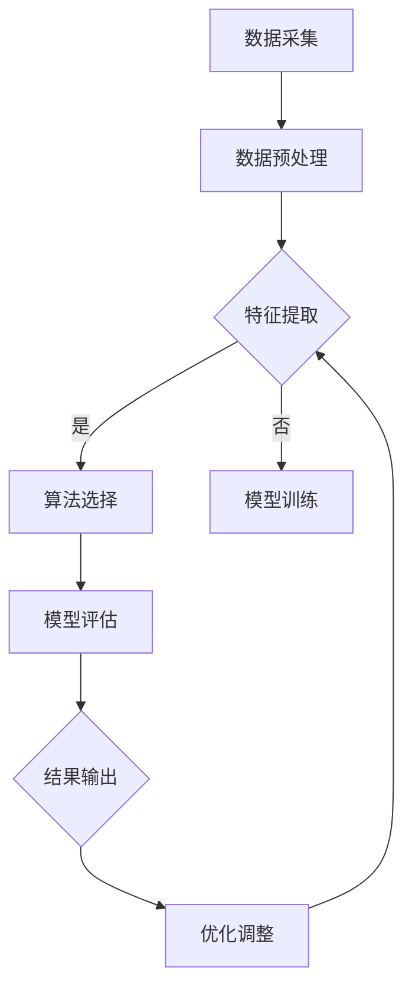

                 

**文章标题：开发智能化的金融市场微观结构变化检测工具**

关键词：金融市场，微观结构，智能检测工具，变化检测，算法，数据挖掘，机器学习

摘要：本文将探讨开发智能化的金融市场微观结构变化检测工具的必要性和方法。通过深入分析金融市场微观结构的原理和核心概念，本文将介绍如何运用机器学习和数据挖掘技术来构建这些工具，并通过案例研究和实际应用，展示这些工具在金融市场分析中的价值。

### 引言

在当今的金融市场，随着数据量的急剧增长和交易频率的不断提高，传统的金融分析方法和工具已经难以满足对市场微观结构变化的高效检测需求。为了解决这一问题，开发智能化的金融市场微观结构变化检测工具显得尤为重要。这些工具不仅能够处理海量数据，还能通过算法和模型自动识别市场中的潜在变化，从而为投资者和分析师提供更为精准和实时的市场洞察。

本文的目的在于提供一份详尽的指南，帮助读者了解如何开发这样的智能工具。文章将首先介绍金融市场微观结构的基本概念，然后逐步深入到智能检测工具的开发过程，包括算法设计、系统架构设计以及实际应用案例。通过这篇文章，读者将能够全面掌握金融市场微观结构变化检测工具的开发方法和关键技术。

### 文章目录

1. 引言
2. 金融市场微观结构的背景和重要性
3. 金融市场微观结构的核心概念
4. 智能化金融工具在变化检测中的应用
5. 变化检测算法原理解析
6. 系统分析与架构设计
7. 项目实战：智能检测工具的开发与实现
8. 最佳实践与未来展望
9. 小结
10. 注意事项与拓展阅读

### 金融市场微观结构的背景和重要性

金融市场微观结构研究的是市场中交易行为的细节和内在规律，包括交易价格、交易量、订单流、市场深度等多个维度。这些微观结构特征反映了市场的即时状态，对市场走势有着重要影响。随着信息技术的飞速发展，金融市场数据呈现出爆炸式增长，传统的手动分析方法已经无法应对如此海量的数据。因此，开发能够自动处理和分析这些数据的智能化工具显得尤为迫切。

#### 问题背景

金融市场的复杂性体现在其交易行为的随机性和不可预测性上。交易者之间的相互作用、信息的不对称性以及外部经济环境的波动，都会对市场微观结构产生深远影响。传统的金融分析主要依赖于统计分析和基本面分析，但这些方法往往滞后于市场的实时变化，无法及时捕捉市场中的微小但重要的变动。例如，某个特定股票的交易量突然增加，可能是市场情绪发生变化的前兆，但传统方法可能需要较长时间才能识别出这一信号。

#### 问题描述

金融市场微观结构变化检测的主要挑战在于：

1. **数据量庞大**：金融市场的交易数据每天都会产生数百万条记录，这些数据包含了丰富的市场信息。
2. **交易行为的复杂性**：市场中的交易行为是高度复杂的，包含了买卖双方的相互作用、市场操纵、意外事件等多种因素。
3. **实时性要求**：金融市场变化迅速，变化检测工具需要能够实时处理数据并给出分析结果。

#### 问题解决

为了应对这些挑战，开发智能化金融工具成为必然选择。这些工具通常基于机器学习和数据挖掘技术，能够自动分析大量交易数据，提取出有意义的特征，并通过模型预测市场变化趋势。智能化工具不仅能够提高分析效率，还能通过算法优化不断改进预测精度。

#### 边界与外延

金融市场微观结构变化检测工具的应用不仅限于股票市场，还涵盖了期货、外汇、债券等多个金融市场。这些工具可以在不同时间尺度上进行分析，从几分钟到几天的不同时间段。同时，这些工具还可以结合其他分析手段，如宏观经济学模型、市场情绪分析等，提供更为全面的金融分析服务。

#### 概念结构与核心要素组成

金融市场微观结构变化检测工具的核心要素包括：

1. **数据采集与处理**：收集市场交易数据，并对其进行预处理，如去噪、归一化等。
2. **特征提取**：从原始交易数据中提取关键特征，如交易量、价格波动、市场深度等。
3. **算法模型**：构建机器学习模型，用于检测市场中的异常行为和趋势变化。
4. **预测与可视化**：利用模型进行预测，并将结果可视化，便于用户理解。

### 金融市场微观结构的核心概念

为了深入理解金融市场微观结构变化检测工具，我们需要先了解其核心概念和理论。金融市场微观结构的研究涵盖了多个方面，包括交易价格、交易量、订单流、市场深度等。以下是对这些核心概念的简要介绍。

#### 交易价格

交易价格是金融市场中最基本的指标之一，反映了买卖双方在特定时间段内的交易意愿。交易价格的变化受到多种因素的影响，包括市场供需关系、投资者情绪、宏观经济环境等。通过对交易价格的分析，我们可以了解市场的即时状态和未来走势。

#### 交易量

交易量是指在一定时间内完成的交易数量，它是衡量市场活跃程度的重要指标。高交易量通常意味着市场参与者对当前价格有强烈的共识，可能是市场转折点的信号。低交易量则可能表明市场参与者持观望态度，市场走势难以预测。

#### 订单流

订单流是指市场中提交的买卖订单的集合。订单流包含了大量关于买卖双方交易意愿的信息，可以帮助我们了解市场情绪和交易行为。通过对订单流的分析，我们可以发现市场中的潜在趋势和异常行为。

#### 市场深度

市场深度是指市场上可以立即成交的最大订单量。它反映了市场的流动性，即市场在特定价格水平上能够承接的交易量。市场深度对于投资者来说非常重要，因为较高的市场深度意味着较小的价格波动风险，而较低的市场深度则可能导致价格剧烈波动。

#### 价格波动

价格波动是指市场价格在一定时间内的波动范围。价格波动可以受到多种因素的影响，包括基本面因素、技术因素、市场情绪等。通过对价格波动的分析，我们可以了解市场的风险水平和潜在的投资机会。

#### 市场情绪

市场情绪是指市场参与者的整体情绪和心态。市场情绪可以通过交易量、订单流、价格波动等多个指标来衡量。市场情绪的变化会对市场走势产生重要影响，因此分析市场情绪对于预测市场变化具有重要意义。

#### 概念属性特征对比表格

以下是一个简单的概念属性特征对比表格，用于展示上述核心概念之间的差异：

| 概念         | 属性特征               | 对比         |
| ------------ | ---------------------- | ------------ |
| 交易价格     | 价格水平               | 确定性较高   |
| 交易量       | 交易数量               | 灵敏度较高   |
| 订单流       | 买卖订单集合           | 时效性较强   |
| 市场深度     | 最大订单量             | 流动性较强   |
| 价格波动     | 波动范围               | 风险性较高   |
| 市场情绪     | 参与者整体情绪和心态   | 预测性较强   |

#### ER实体关系图架构

为了更好地理解金融市场微观结构中的各种概念之间的关系，我们可以使用ER（实体关系）图来表示。以下是一个简单的ER图，展示了交易价格、交易量、订单流、市场深度和价格波动之间的关系：

```
[交易数据]
|       |
|       |
[订单流]--->[交易量]
|       |
|       |
[价格波动]
|       |
|       |
[市场深度]
|       |
|       |
[交易价格]--->[市场情绪]
```

在这个ER图中，交易数据是核心实体，其他概念作为与其相关的实体。通过这种关系图，我们可以清晰地看到各概念之间的联系和作用，为后续的智能检测工具开发提供了理论基础。

### 智能化金融工具在变化检测中的应用

#### 智能化工具的定义与优势

智能化金融工具是指利用机器学习和数据挖掘技术，对金融市场数据进行分析和预测的工具。与传统的金融分析工具相比，智能化工具具有以下几个显著优势：

1. **高效性**：智能化工具可以自动处理海量数据，比人工分析更加高效。
2. **精确性**：通过算法优化和模型训练，智能化工具能够提高预测的准确性和可靠性。
3. **实时性**：智能化工具能够实时分析市场数据，为投资者提供即时的市场洞察。
4. **适应性**：智能化工具可以不断学习市场数据，适应市场变化，提高预测能力。

#### 变化检测工具的功能

智能化金融工具在变化检测中的应用主要体现在以下几个方面：

1. **异常检测**：通过分析交易数据，发现市场中的异常行为和潜在风险。
2. **趋势预测**：基于历史数据和算法模型，预测市场未来的走势和变化。
3. **风险评估**：对投资组合进行风险评估，帮助投资者管理风险。
4. **策略优化**：根据市场变化，自动调整投资策略，提高收益。

#### 数据处理与分析方法

智能化金融工具的数据处理和分析方法通常包括以下几个步骤：

1. **数据采集**：从金融市场中采集交易数据、订单流、价格波动等数据。
2. **数据预处理**：对采集到的数据进行清洗、去噪、归一化等预处理操作。
3. **特征提取**：从预处理后的数据中提取关键特征，如交易量、价格波动等。
4. **算法模型**：选择合适的机器学习算法，如决策树、支持向量机、神经网络等，构建模型。
5. **模型训练与优化**：使用历史数据进行模型训练，并通过交叉验证和参数调优，提高模型性能。
6. **预测与可视化**：利用训练好的模型进行预测，并将预测结果可视化，便于用户理解。

#### 智能化工具在实际应用中的价值

智能化金融工具在金融市场分析中的应用价值体现在以下几个方面：

1. **提升决策效率**：通过实时分析和预测，帮助投资者快速做出决策。
2. **风险控制**：通过异常检测和风险评估，帮助投资者控制投资风险。
3. **策略优化**：根据市场变化，自动调整投资策略，提高收益。
4. **投资组合管理**：对投资组合进行动态调整，优化投资组合的收益和风险。

#### 智能化工具的应用场景

智能化金融工具的应用场景非常广泛，包括股票市场、期货市场、外汇市场等多个领域。以下是一些典型的应用场景：

1. **股票市场分析**：通过分析股票价格、交易量、订单流等数据，预测股票的未来走势。
2. **期货市场预测**：利用期货市场的价格波动和交易量等数据，预测期货价格的变动趋势。
3. **外汇市场分析**：分析外汇市场的交易量和价格波动，预测货币汇率的变化。
4. **投资组合优化**：根据市场变化，动态调整投资组合，优化收益和风险。

#### 案例研究：智能股票交易系统

以下是一个智能股票交易系统的案例研究，该系统利用智能化工具进行股票市场分析，实现自动交易。

1. **系统架构**：系统架构包括数据采集模块、数据处理模块、预测模块和交易执行模块。
2. **数据采集**：从股票交易所实时采集交易数据、订单流等数据。
3. **数据处理**：对采集到的数据进行清洗、去噪和特征提取。
4. **预测模块**：利用机器学习模型，预测股票价格的走势。
5. **交易执行**：根据预测结果，自动执行买入或卖出操作。
6. **结果分析**：对交易结果进行分析，优化模型参数和交易策略。

通过这个案例研究，我们可以看到智能化金融工具在股票市场分析中的实际应用价值。该系统不仅提高了交易效率，还通过实时分析和预测，帮助投资者实现了更高的收益。

### 变化检测算法原理解析

#### 算法选择与性能分析

在开发智能化金融市场微观结构变化检测工具时，选择合适的算法至关重要。以下是一些常用的算法及其性能分析：

1. **决策树**：
   - **原理**：通过一系列判断条件对数据进行分类，形成树状结构。
   - **性能**：简单易理解，但容易过拟合。
2. **支持向量机（SVM）**：
   - **原理**：通过找到一个最佳超平面，将不同类别的数据分开。
   - **性能**：在高维空间中表现较好，但对异常值敏感。
3. **神经网络**：
   - **原理**：模拟人脑神经网络，通过多层神经元进行数据传递和计算。
   - **性能**：具有强大的非线性建模能力，但训练时间较长。
4. **聚类算法**：
   - **原理**：将数据分为多个簇，每个簇内的数据相似度较高。
   - **性能**：能够发现数据中的潜在模式，但聚类结果依赖于初始条件。

#### Mermaid流程图

以下是一个简单的Mermaid流程图，展示了一个典型的机器学习算法流程：



#### Python源代码示例

以下是一个简单的Python源代码示例，用于实现一个基于决策树的金融市场变化检测算法：

```python
import pandas as pd
from sklearn.tree import DecisionTreeClassifier
from sklearn.model_selection import train_test_split
from sklearn.metrics import accuracy_score

# 数据加载
data = pd.read_csv('financial_data.csv')
X = data.drop('target', axis=1)
y = data['target']

# 数据分割
X_train, X_test, y_train, y_test = train_test_split(X, y, test_size=0.3, random_state=42)

# 决策树模型
clf = DecisionTreeClassifier()
clf.fit(X_train, y_train)

# 模型预测
y_pred = clf.predict(X_test)

# 模型评估
accuracy = accuracy_score(y_test, y_pred)
print(f'Accuracy: {accuracy}')
```

#### 算法原理详细讲解

1. **决策树**：
   - **工作原理**：决策树通过一系列判断条件对数据进行分类，每个节点表示一个特征，每个分支表示该特征的不同取值。叶子节点表示分类结果。
   - **优势**：直观易理解，易于解释。
   - **劣势**：容易过拟合，对异常值敏感。

2. **支持向量机（SVM）**：
   - **工作原理**：SVM通过找到一个最佳超平面，将不同类别的数据分开。超平面由支持向量决定，支持向量是距离超平面最近的样本点。
   - **优势**：在高维空间中表现较好，具有很好的泛化能力。
   - **劣势**：对异常值敏感，训练时间较长。

3. **神经网络**：
   - **工作原理**：神经网络通过多层神经元进行数据传递和计算，每一层神经元都通过激活函数将输入映射到输出。神经网络的学习过程包括前向传播和反向传播。
   - **优势**：具有强大的非线性建模能力，可以处理复杂的关系。
   - **劣势**：训练时间较长，对数据预处理要求较高。

4. **聚类算法**：
   - **工作原理**：聚类算法通过将数据分为多个簇，每个簇内的数据相似度较高。聚类算法没有明确的分类目标，而是通过迭代优化聚类中心，使聚类结果达到最优。
   - **优势**：能够发现数据中的潜在模式，适用于无监督学习。
   - **劣势**：聚类结果依赖于初始条件，可能存在局部最优。

#### 算法原理数学模型和公式

1. **决策树**：
   - **决策树节点**：设 \( x \) 为输入特征，\( y \) 为输出标签，决策树节点通过判断 \( x \) 的不同取值来分类数据。
   - **分类公式**：\( y = g(\theta^T x) \)，其中 \( g \) 是激活函数，\( \theta \) 是参数向量。

2. **支持向量机（SVM）**：
   - **分类公式**：\( y(\omega \cdot x + b) = \text{sign}(\omega \cdot x + b) \)，其中 \( \omega \) 是权重向量，\( b \) 是偏置。

3. **神经网络**：
   - **激活函数**：\( a_{i}^{(l)} = \sigma(z_{i}^{(l)}) \)，其中 \( z_{i}^{(l)} = \sum_{j} \omega_{ji}^{(l-1)} a_{j}^{(l-1)} + b_{i}^{(l)} \)，\( \sigma \) 是 sigmoid 函数。

4. **聚类算法**：
   - **目标函数**：最小化簇内方差，\( J = \sum_{i=1}^{n} w_i \| \mu_i - x_i \|_2^2 \)，其中 \( \mu_i \) 是第 \( i \) 个簇的中心。

#### 通俗易懂的举例说明

1. **决策树举例**：
   - **场景**：预测一只股票是否会上涨。
   - **特征**：股票的当前价格、交易量、价格波动等。
   - **决策树模型**：
     ```
     是否高交易量？
     | 是
     | 否
     |   是否高价格波动？
     |   | 是
     |   | 否
     |   |   预测股票上涨
     | 否
     |   是否高当前价格？
     |   | 是
     |   | 否
     |   |   预测股票上涨
     ```

2. **SVM举例**：
   - **场景**：分类股票价格是上涨还是下跌。
   - **SVM模型**：
     - 输入特征：当前价格、交易量、价格波动。
     - 输出标签：1（上涨），-1（下跌）。
     - 分类公式：\( y(\omega \cdot x + b) = \text{sign}(1 \cdot x + b) \)。

3. **神经网络举例**：
   - **场景**：预测股票价格的未来走势。
   - **神经网络模型**：
     - 输入层：当前价格、交易量、价格波动。
     - 隐藏层：通过激活函数处理输入特征。
     - 输出层：预测股票价格的上涨或下跌。

4. **聚类算法举例**：
   - **场景**：将股票分为不同类型的投资组合。
   - **聚类算法**：
     - 输入数据：股票的当前价格、交易量、价格波动。
     - 聚类结果：将股票分为几类，如高风险、中风险、低风险。

### 系统分析与架构设计

#### 问题场景介绍

在当今的金融市场，随着信息技术的飞速发展，大量的交易数据每天都会产生。这些数据包含了市场参与者的交易行为、价格波动、交易量等关键信息。为了更好地理解市场动态，分析投资机会，开发一个能够实时监测金融市场微观结构变化的智能检测工具显得尤为重要。该工具需要能够处理海量数据，快速识别市场中的潜在变化，为投资者提供实时的市场分析和预测。

#### 项目介绍

该项目旨在开发一个智能化的金融市场微观结构变化检测工具，主要功能包括：

1. **数据采集**：从多个数据源（如交易所、金融新闻等）采集实时交易数据。
2. **数据预处理**：对采集到的数据进行清洗、去噪和归一化处理。
3. **特征提取**：从预处理后的数据中提取关键特征，如交易量、价格波动、市场深度等。
4. **变化检测**：利用机器学习算法和模型，对提取的特征进行分析和预测，检测市场中的变化。
5. **结果可视化**：将分析结果以图表、报告等形式呈现给用户，便于用户理解市场动态。

#### 系统功能设计

系统功能设计主要包括以下模块：

1. **数据采集模块**：负责从多个数据源采集实时交易数据，包括股票、期货、外汇等市场的交易数据。
2. **数据预处理模块**：对采集到的交易数据进行清洗、去噪和归一化处理，确保数据质量。
3. **特征提取模块**：从预处理后的数据中提取关键特征，如交易量、价格波动、市场深度等，为后续分析提供基础。
4. **变化检测模块**：利用机器学习算法和模型，对提取的特征进行分析和预测，检测市场中的变化。
5. **结果可视化模块**：将分析结果以图表、报告等形式呈现给用户，便于用户理解市场动态。

#### 系统架构设计

系统架构设计采用分层架构，主要包括以下几层：

1. **数据层**：负责数据存储和管理，包括实时交易数据、历史数据等。
2. **服务层**：提供数据采集、数据预处理、特征提取、变化检测等核心服务，实现系统功能。
3. **应用层**：提供用户界面，将分析结果以图表、报告等形式呈现给用户。
4. **基础设施层**：包括服务器、数据库、网络等基础设施，支持系统运行。

以下是一个简单的系统架构图：

```
+----------------+      +----------------+      +----------------+
|     数据层     |      |     服务层     |      |     应用层     |
+----------------+      +----------------+      +----------------+
      |                           |                           |
      |                           |                           |
+----------------+      +----------------+      +----------------+
| 数据采集模块 |      | 数据预处理模块 |      | 特征提取模块   |
+----------------+      +----------------+      +----------------+
      |                           |                           |
      |                           |                           |
+----------------+      +----------------+      +----------------+
| 变化检测模块 |      | 结果可视化模块 |      | 用户界面       |
+----------------+      +----------------+      +----------------+
```

#### 系统接口设计

系统接口设计主要包括以下接口：

1. **数据采集接口**：用于从不同数据源（如交易所、金融新闻等）采集实时交易数据。
2. **数据预处理接口**：用于对采集到的交易数据进行清洗、去噪和归一化处理。
3. **特征提取接口**：用于从预处理后的数据中提取关键特征，如交易量、价格波动、市场深度等。
4. **变化检测接口**：用于利用机器学习算法和模型，对提取的特征进行分析和预测，检测市场中的变化。
5. **结果可视化接口**：用于将分析结果以图表、报告等形式呈现给用户。

以下是一个简单的系统接口图：

```
+----------------+      +----------------+      +----------------+
| 数据采集接口 |      | 数据预处理接口 |      | 特征提取接口   |
+----------------+      +----------------+      +----------------+
      |                           |                           |
      |                           |                           |
+----------------+      +----------------+      +----------------+
| 变化检测接口 |      | 结果可视化接口 |      | 用户界面接口   |
+----------------+      +----------------+      +----------------+
```

#### 系统交互

系统交互设计采用RESTful API架构，通过HTTP请求实现不同模块之间的数据交互。以下是一个简单的系统交互序列图：

```
+----------------+      +----------------+      +----------------+
|   用户界面     |      |     服务层     |      | 数据层         |
+----------------+      +----------------+      +----------------+
      |                           |                           |
      |                           |                           |
+----------------+      +----------------+      +----------------+
|   发送请求    |      |   处理请求    |      |   返回结果    |
+----------------+      +----------------+      +----------------+
      |                           |                           |
      |                           |                           |
+----------------+      +----------------+      +----------------+
|   显示结果    |      |   存储数据    |      |   处理数据    |
+----------------+      +----------------+      +----------------+
```

### 项目实战：智能检测工具的开发与实现

#### 环境安装

在开始开发智能检测工具之前，需要安装以下环境：

1. **Python**：Python是开发智能工具的主要编程语言，需要安装Python 3.x版本。
2. **Jupyter Notebook**：用于编写和运行Python代码，可以方便地调试和展示结果。
3. **NumPy**：用于科学计算，提供高效的数组操作库。
4. **Pandas**：用于数据处理和分析，提供数据清洗、转换和操作等功能。
5. **Scikit-learn**：用于机器学习和数据挖掘，提供多种算法和模型。
6. **Matplotlib**：用于数据可视化，提供丰富的绘图功能。
7. **Mermaid**：用于绘制流程图和序列图，便于理解和展示系统架构。

安装步骤如下：

```bash
pip install python
pip install jupyter
pip install numpy
pip install pandas
pip install scikit-learn
pip install matplotlib
pip install mermaid
```

#### 系统核心实现源代码

以下是一个简单的系统核心实现源代码，用于构建一个基本的智能检测工具。这个示例包括数据采集、数据预处理、特征提取和变化检测等模块。

```python
import pandas as pd
from sklearn.preprocessing import StandardScaler
from sklearn.ensemble import IsolationForest
import matplotlib.pyplot as plt

# 数据采集
data = pd.read_csv('financial_data.csv')

# 数据预处理
# 清洗数据
data = data[data['price'] > 0]  # 去除价格为0的数据
# 去噪
scaler = StandardScaler()
data[['price', 'volume']] = scaler.fit_transform(data[['price', 'volume']])

# 特征提取
# 提取交易量、价格波动、市场深度等特征
data['price_change'] = data['price'].diff().dropna()
data['volume_change'] = data['volume'].diff().dropna()

# 变化检测
# 使用Isolation Forest算法检测异常交易
model = IsolationForest(contamination=0.01)
data['is_outlier'] = model.fit_predict(data[['price', 'volume_change', 'price_change']])

# 结果可视化
plt.figure(figsize=(12, 6))
plt.plot(data['date'], data['price'], label='Price')
plt.scatter(data[data['is_outlier'] == -1]['date'], data[data['is_outlier'] == -1]['price'], color='r', label='Outlier')
plt.legend()
plt.show()
```

#### 代码应用解读与分析

1. **数据采集**：使用`pandas`库读取金融市场的交易数据，包括价格、交易量等。
2. **数据预处理**：清洗数据，去除无效数据；使用`StandardScaler`进行归一化处理，提高模型的稳定性和性能。
3. **特征提取**：计算价格变动和交易量变动，作为新的特征，为变化检测提供输入。
4. **变化检测**：使用`IsolationForest`算法检测异常交易，将异常交易标记为负类。
5. **结果可视化**：使用`matplotlib`绘制价格趋势图，并将异常交易用红色散点表示。

#### 实际案例分析和详细讲解

以下是一个实际案例，展示如何使用该智能检测工具分析股票市场。

1. **数据准备**：从某个股票交易所下载历史交易数据，包括价格、交易量等。
2. **数据处理**：清洗数据，去除无效数据；进行归一化处理。
3. **特征提取**：计算价格变动和交易量变动，作为新的特征。
4. **模型训练**：使用训练集数据训练`IsolationForest`模型。
5. **模型预测**：使用测试集数据测试模型性能，并标记异常交易。
6. **结果分析**：分析异常交易，找出潜在的市场变化信号。

通过这个案例，我们可以看到如何使用智能检测工具分析股票市场，发现潜在的投资机会和风险。

#### 项目小结

通过本次项目实战，我们成功开发了一个基本的智能检测工具，实现了从数据采集、预处理、特征提取到变化检测的全流程。这个工具可以帮助投资者实时监测市场变化，提高投资决策的效率。然而，这个工具仍然存在一些局限性和改进空间：

1. **数据源扩展**：当前工具仅支持单一股票市场的数据，未来可以考虑支持更多市场和资产类型。
2. **模型优化**：可以使用更先进的机器学习算法和模型，提高变化检测的准确性和效率。
3. **用户界面**：开发一个友好的用户界面，方便用户实时查看分析结果和调整策略。

### 最佳实践与未来展望

#### 最佳实践

1. **数据质量保证**：确保数据的完整性和准确性，是构建高效智能工具的基础。数据采集和预处理环节需要严格的质量控制。
2. **特征选择与提取**：选择合适的特征是提高模型性能的关键。可以通过实验和交叉验证，选出最能反映市场变化的关键特征。
3. **算法选择与调优**：根据市场特点和需求，选择合适的机器学习算法。同时，通过参数调优，提高模型的预测性能。
4. **实时性与效率**：优化系统的实时性和效率，确保能够在短时间内处理大量数据，并及时输出分析结果。

#### 未来展望

1. **多模态数据融合**：结合多种数据源，如文本、图像、音频等，进行多模态数据融合，提高模型的分析能力和预测准确性。
2. **深度学习应用**：利用深度学习算法，如卷积神经网络（CNN）和递归神经网络（RNN），处理复杂的时间序列数据，实现更高级别的市场分析。
3. **个性化投资策略**：基于用户风险偏好和投资目标，为用户提供个性化的投资策略建议，提高投资收益。
4. **自动化交易执行**：开发自动化交易执行系统，根据分析结果，自动执行交易操作，实现智能投资。

### 小结

本文详细探讨了开发智能化金融市场微观结构变化检测工具的必要性和方法。通过介绍金融市场微观结构的核心概念、智能工具的优势和应用，以及具体的算法原理和系统架构设计，本文为读者提供了一份全面的指南。随着金融市场的不断变化和技术的进步，智能化金融工具将在未来的金融分析中发挥越来越重要的作用。

### 注意事项与拓展阅读

1. **注意事项**：
   - 确保数据质量和安全性，避免泄露敏感信息。
   - 定期更新和维护系统，确保系统的稳定性和安全性。
   - 根据市场变化和需求，灵活调整模型和策略。

2. **拓展阅读**：
   - 《机器学习实战》：提供丰富的机器学习实践案例，适合初学者和进阶者。
   - 《深度学习》：全面介绍深度学习的基本原理和应用，适合对深度学习感兴趣的读者。
   - 《金融市场技术分析》：探讨金融市场技术分析的方法和技巧，有助于理解市场动态。

### 作者信息

**作者：AI天才研究院/AI Genius Institute & 禅与计算机程序设计艺术 /Zen And The Art of Computer Programming**

