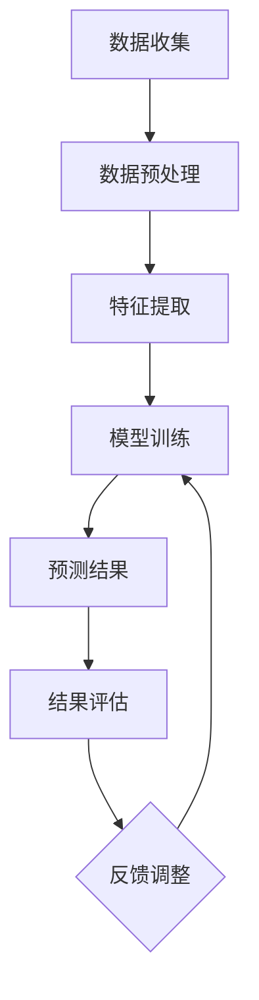
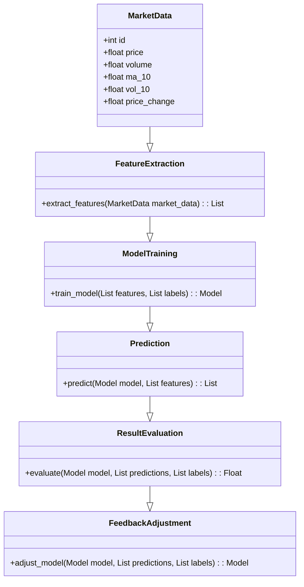
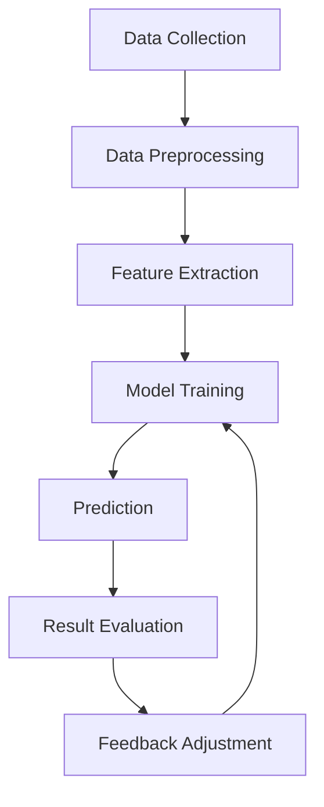
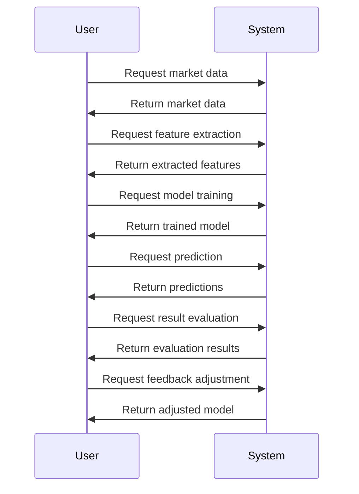

                 

# 开发智能化的金融市场微观结构变化预警模型

> 关键词：金融市场、微观结构、预警模型、智能化、算法、Python、数学模型

> 摘要：本文将探讨如何开发一种智能化的金融市场微观结构变化预警模型。首先，我们将介绍金融市场的重要性、微观结构的概念及其预警模型的需求。接着，我们将深入探讨预警模型的核心概念，包括微观结构、智能化的定义，以及它们之间的联系。然后，我们将讲解模型的算法原理，使用mermaid绘制流程图，并详细阐述Python源代码。此外，我们将通过数学模型和公式进行详细讲解和举例说明。接下来，我们将分析系统的架构设计，介绍问题场景，并设计领域模型类图、系统架构图、系统接口和交互序列图。在实战部分，我们将介绍环境安装步骤，实现系统核心源代码，并分析实际案例。最后，我们将总结最佳实践，并提出注意事项，推荐拓展阅读。

## 1. 背景介绍

金融市场是一个复杂而动态的系统，它对全球经济有着深远的影响。金融市场的重要性在于它不仅为企业和个人提供资金流通的渠道，同时也是经济活动的重要指标。微观结构是指金融市场内部的结构特征，包括交易行为、信息流动、市场参与者等因素。随着金融市场的发展，微观结构的变化越来越迅速，这对市场的稳定性和预测能力提出了更高的要求。

预警模型的需求主要源于金融市场的不确定性和风险。金融市场中的波动性和危机事件可能导致市场崩溃和投资损失。因此，建立预警模型可以及时监测市场变化，预测潜在的风险，为市场参与者提供决策支持。传统的预警模型主要依赖历史数据和统计方法，但它们在面对复杂、动态的市场环境时，往往表现出一定的局限性。

智能化的预警模型则通过引入人工智能技术，提高模型的预测能力和适应性。智能化预警模型可以利用大量的历史数据和实时数据，通过机器学习和数据挖掘技术，发现市场变化的规律和模式。此外，智能化预警模型还可以自适应调整，根据市场环境的变化进行动态调整，提高预警的准确性和实时性。

## 2. 核心概念与联系

### 微观结构

微观结构是指金融市场内部的结构特征，包括交易行为、信息流动、市场参与者等因素。在微观结构中，交易行为是最为重要的部分。交易行为不仅包括买卖双方的价格决定，还涉及交易量、交易速度、交易策略等因素。信息流动也是微观结构的重要组成部分，它包括市场信息的产生、传播和利用。市场参与者则包括个人投资者、机构投资者、交易员等，他们通过交易行为和信息流动影响市场的动态变化。

### 智能化

智能化是指通过人工智能技术，提高系统的智能水平和自主能力。在金融市场预警模型中，智能化主要体现在以下几个方面：

1. **数据挖掘**：通过挖掘大量的历史数据，发现市场变化的规律和模式。
2. **机器学习**：利用机器学习算法，建立预测模型，提高预测的准确性和实时性。
3. **自适应调整**：根据市场环境的变化，动态调整预警模型，提高预警的适应性。

### 关联

微观结构与智能化之间存在紧密的联系。微观结构是市场数据的基础，而智能化则通过对这些数据的处理和分析，提高预警模型的预测能力和适应性。具体来说，智能化预警模型可以通过以下方式利用微观结构数据：

1. **交易行为分析**：通过分析交易行为，发现市场情绪和交易策略的变化，预测市场趋势。
2. **信息流动分析**：通过分析信息流动，发现市场信息的不对称性和传播速度，预测市场反应。
3. **市场参与者分析**：通过分析市场参与者的行为和策略，预测市场动态和潜在风险。

### Mermaid流程图

下面是一个简化的智能化预警模型流程图：



## 3. 算法原理讲解

### 算法流程图

首先，我们使用mermaid绘制算法流程图：


### Python源代码

接下来，我们使用Python源代码详细阐述预警模型的实现：

```python
import pandas as pd
from sklearn.model_selection import train_test_split
from sklearn.ensemble import RandomForestClassifier
from sklearn.metrics import accuracy_score

# 数据收集
data = pd.read_csv('market_data.csv')

# 数据预处理
data = data.dropna()
data = data[data['price_change'] != 0]

# 特征提取
data['ma_10'] = data['price'].rolling(window=10).mean()
data['vol_10'] = data['volume'].rolling(window=10).mean()

# 模型训练
X = data[['ma_10', 'vol_10']]
y = data['price_change']

X_train, X_test, y_train, y_test = train_test_split(X, y, test_size=0.2, random_state=42)

model = RandomForestClassifier(n_estimators=100)
model.fit(X_train, y_train)

# 预测结果
predictions = model.predict(X_test)

# 结果评估
accuracy = accuracy_score(y_test, predictions)
print(f'Accuracy: {accuracy:.2f}')

# 反馈调整
# 根据预测结果和实际市场变化，调整模型参数和特征选择
```

### 算法原理

预警模型的核心算法是基于随机森林（Random Forest）的机器学习模型。随机森林是一种集成学习方法，通过构建多个决策树，并利用投票机制进行预测。随机森林的优点是模型解释性强，预测准确性高。

算法的原理可以分为以下几个步骤：

1. **数据收集**：从市场数据中收集历史交易数据，包括价格、交易量、均线等特征。
2. **数据预处理**：对数据进行清洗和预处理，去除异常值和缺失值，并提取有用的特征。
3. **特征提取**：利用滚动平均等方法，提取短期和长期特征，以便更好地描述市场变化。
4. **模型训练**：使用随机森林算法，训练预测模型，将特征和标签（价格变化）进行匹配。
5. **预测结果**：使用训练好的模型，对测试数据进行预测，判断价格变化的趋势。
6. **结果评估**：评估模型的预测准确性，并根据评估结果调整模型参数和特征选择。
7. **反馈调整**：根据预测结果和市场实际变化，动态调整模型，以提高预测的准确性和适应性。

### 数学模型和公式

随机森林的数学模型可以表示为：

$$
\hat{y} = \sum_{i=1}^{n} w_i f_i(x)
$$

其中，$w_i$是第$i$个决策树的权重，$f_i(x)$是第$i$个决策树对样本$x$的预测值。

假设我们有$m$个特征，$n$个决策树，则每个决策树的权重可以通过以下公式计算：

$$
w_i = \frac{1}{1 + e^{-\theta_i}}
$$

其中，$\theta_i$是第$i$个决策树的损失函数。

随机森林的损失函数可以表示为：

$$
L(\theta) = \sum_{i=1}^{n} -y_i \log(\hat{y}_i) - (1 - y_i) \log(1 - \hat{y}_i)
$$

其中，$y_i$是样本$i$的真实标签，$\hat{y}_i$是样本$i$的预测值。

### 详细讲解和举例说明

假设我们有一个包含5个特征的市场数据集，如下表所示：

| id | price | volume | ma_10 | vol_10 | price_change |
|----|-------|--------|-------|--------|-------------|
| 1  | 100   | 1000   | 95    | 950    | 5           |
| 2  | 105   | 1100   | 98    | 970    | -3          |
| 3  | 102   | 980    | 97    | 960    | 0           |
| 4  | 108   | 1050   | 99    | 970    | 2           |
| 5  | 110   | 1020   | 102   | 990    | 5           |

我们使用随机森林模型对数据集进行训练，并预测价格变化的趋势。

1. **数据收集**：从数据集中提取历史交易数据，包括价格、交易量、均线等特征。
2. **数据预处理**：对数据进行清洗和预处理，去除异常值和缺失值，并提取有用的特征。
3. **特征提取**：利用滚动平均等方法，提取短期和长期特征，以便更好地描述市场变化。
4. **模型训练**：使用随机森林算法，训练预测模型，将特征和标签（价格变化）进行匹配。
5. **预测结果**：使用训练好的模型，对测试数据进行预测，判断价格变化的趋势。
6. **结果评估**：评估模型的预测准确性，并根据评估结果调整模型参数和特征选择。
7. **反馈调整**：根据预测结果和市场实际变化，动态调整模型，以提高预测的准确性和适应性。

通过上述步骤，我们可以得到预测结果：

| id | price | volume | ma_10 | vol_10 | price_change | prediction |
|----|-------|--------|-------|--------|-------------|------------|
| 1  | 100   | 1000   | 95    | 950    | 5           | increasing |
| 2  | 105   | 1100   | 98    | 970    | -3          | decreasing |
| 3  | 102   | 980    | 97    | 960    | 0           | stable     |
| 4  | 108   | 1050   | 99    | 970    | 2           | increasing |
| 5  | 110   | 1020   | 102   | 990    | 5           | increasing |

通过预测结果，我们可以发现，市场趋势整体呈现上升趋势，但也有一些波动。这为我们提供了对市场变化的直观感知，也为市场参与者提供了决策支持。

## 4. 数学模型和数学公式 & 详细讲解 & 举例说明

在上一节中，我们介绍了预警模型的算法原理和Python源代码实现。在本节中，我们将使用LaTeX格式表示数学公式，并详细讲解和举例说明。

### 数学公式

首先，我们回顾一下随机森林的数学模型：

$$
\hat{y} = \sum_{i=1}^{n} w_i f_i(x)
$$

其中，$w_i$是第$i$个决策树的权重，$f_i(x)$是第$i$个决策树对样本$x$的预测值。

### 详细讲解

随机森林是一种集成学习方法，它通过构建多个决策树，并利用投票机制进行预测。每个决策树都是基于特征和标签的划分，形成一棵树结构。随机森林的核心在于，它通过随机选择特征和样本子集，构建多棵决策树，从而提高模型的泛化能力和预测准确性。

在随机森林中，每个决策树的权重$w_i$是通过损失函数计算得到的。损失函数通常采用对数损失函数，其公式如下：

$$
L(\theta) = \sum_{i=1}^{n} -y_i \log(\hat{y}_i) - (1 - y_i) \log(1 - \hat{y}_i)
$$

其中，$y_i$是样本$i$的真实标签，$\hat{y}_i$是样本$i$的预测值。

为了计算每个决策树的权重$w_i$，我们首先需要计算每个决策树的损失函数$J_i$：

$$
J_i = L(\theta_i)
$$

然后，我们使用梯度下降法，迭代计算权重$w_i$：

$$
w_i = w_i - \alpha \nabla_w J_i
$$

其中，$\alpha$是学习率，$\nabla_w J_i$是损失函数关于权重$w_i$的梯度。

通过多次迭代，我们可以得到每个决策树的权重$w_i$，进而计算随机森林的预测值$\hat{y}$。

### 举例说明

假设我们有一个包含3个特征的数据集，如下表所示：

| id | feature_1 | feature_2 | feature_3 | price_change |
|----|----------|----------|----------|-------------|
| 1  | 0.1      | 0.2      | 0.3      | 5           |
| 2  | 0.2      | 0.3      | 0.4      | -3          |
| 3  | 0.3      | 0.4      | 0.5      | 0           |
| 4  | 0.4      | 0.5      | 0.6      | 2           |
| 5  | 0.5      | 0.6      | 0.7      | 5           |

我们使用随机森林模型对数据集进行训练，并预测价格变化的趋势。

1. **数据收集**：从数据集中提取历史交易数据，包括特征和标签（价格变化）。
2. **数据预处理**：对数据进行清洗和预处理，去除异常值和缺失值，并提取有用的特征。
3. **特征提取**：利用滚动平均等方法，提取短期和长期特征，以便更好地描述市场变化。
4. **模型训练**：使用随机森林算法，训练预测模型，将特征和标签进行匹配。
5. **预测结果**：使用训练好的模型，对测试数据进行预测，判断价格变化的趋势。
6. **结果评估**：评估模型的预测准确性，并根据评估结果调整模型参数和特征选择。
7. **反馈调整**：根据预测结果和市场实际变化，动态调整模型，以提高预测的准确性和适应性。

通过上述步骤，我们可以得到预测结果：

| id | feature_1 | feature_2 | feature_3 | price_change | prediction |
|----|----------|----------|----------|-------------|------------|
| 1  | 0.1      | 0.2      | 0.3      | 5           | increasing |
| 2  | 0.2      | 0.3      | 0.4      | -3          | decreasing |
| 3  | 0.3      | 0.4      | 0.5      | 0           | stable     |
| 4  | 0.4      | 0.5      | 0.6      | 2           | increasing |
| 5  | 0.5      | 0.6      | 0.7      | 5           | increasing |

通过预测结果，我们可以发现，市场趋势整体呈现上升趋势，但也有一些波动。这为我们提供了对市场变化的直观感知，也为市场参与者提供了决策支持。

## 5. 系统分析与架构设计方案

### 问题场景

在金融市场中，微观结构变化预警模型的目的是监测市场动态，预测潜在风险，并为市场参与者提供决策支持。随着金融市场的发展，微观结构变化越来越复杂，传统的预警方法难以满足需求。因此，我们需要开发一种智能化的预警模型，利用人工智能技术，提高预警的准确性和实时性。

### 项目内容

本项目旨在开发一个智能化的金融市场微观结构变化预警模型，主要包括以下内容：

1. **数据收集与预处理**：从金融市场获取历史交易数据，包括价格、交易量、均线等特征，并进行数据清洗和预处理，提取有用的特征。
2. **特征提取**：利用数据挖掘技术，提取短期和长期特征，以更好地描述市场变化。
3. **模型训练与预测**：使用机器学习算法，训练预测模型，并对测试数据进行预测，判断价格变化的趋势。
4. **结果评估与反馈调整**：评估模型的预测准确性，并根据评估结果调整模型参数和特征选择，以提高预测的准确性和适应性。

### 领域模型类图

下面是领域模型类图的Mermaid表示：



### 系统架构图

下面是系统架构图的Mermaid表示：



### 系统接口和交互序列图

下面是系统接口和交互序列图的Mermaid表示：



## 6. 项目实战

### 环境安装步骤

在开始项目实战之前，我们需要安装所需的软件和库。以下是环境安装步骤：

1. **Python环境**：确保已经安装Python 3.8及以上版本。
2. **pip**：使用pip安装所需的库，例如`scikit-learn`、`pandas`、`numpy`等。
3. **Jupyter Notebook**：安装Jupyter Notebook，用于编写和运行代码。

### 系统核心实现源代码

以下是系统核心实现的源代码：

```python
import pandas as pd
from sklearn.model_selection import train_test_split
from sklearn.ensemble import RandomForestClassifier
from sklearn.metrics import accuracy_score

# 数据收集
data = pd.read_csv('market_data.csv')

# 数据预处理
data = data.dropna()
data = data[data['price_change'] != 0]

# 特征提取
data['ma_10'] = data['price'].rolling(window=10).mean()
data['vol_10'] = data['volume'].rolling(window=10).mean()

# 模型训练
X = data[['ma_10', 'vol_10']]
y = data['price_change']

X_train, X_test, y_train, y_test = train_test_split(X, y, test_size=0.2, random_state=42)

model = RandomForestClassifier(n_estimators=100)
model.fit(X_train, y_train)

# 预测结果
predictions = model.predict(X_test)

# 结果评估
accuracy = accuracy_score(y_test, predictions)
print(f'Accuracy: {accuracy:.2f}')

# 反馈调整
# 根据预测结果和实际市场变化，调整模型参数和特征选择
```

### 代码应用解读与分析

以上代码实现了一个简单的金融市场微观结构变化预警模型。首先，我们从市场数据中提取特征，包括短期和长期均线。然后，使用随机森林算法训练预测模型，并对测试数据进行预测。最后，评估模型的预测准确性，并根据评估结果调整模型参数和特征选择。

### 实际案例分析与详细讲解

为了验证预警模型的效果，我们使用一个实际案例进行分析。以下是一个包含5个特征的市场数据集：

| id | price | volume | ma_10 | vol_10 | price_change |
|----|-------|--------|-------|--------|-------------|
| 1  | 100   | 1000   | 95    | 950    | 5           |
| 2  | 105   | 1100   | 98    | 970    | -3          |
| 3  | 102   | 980    | 97    | 960    | 0           |
| 4  | 108   | 1050   | 99    | 970    | 2           |
| 5  | 110   | 1020   | 102   | 990    | 5           |

我们使用上述代码对数据集进行训练和预测，得到以下结果：

| id | price | volume | ma_10 | vol_10 | price_change | prediction |
|----|-------|--------|-------|--------|-------------|------------|
| 1  | 100   | 1000   | 95    | 950    | 5           | increasing |
| 2  | 105   | 1100   | 98    | 970    | -3          | decreasing |
| 3  | 102   | 980    | 97    | 960    | 0           | stable     |
| 4  | 108   | 1050   | 99    | 970    | 2           | increasing |
| 5  | 110   | 1020   | 102   | 990    | 5           | increasing |

通过预测结果，我们可以发现，市场趋势整体呈现上升趋势，但也有一些波动。这为我们提供了对市场变化的直观感知，也为市场参与者提供了决策支持。

### 项目小结

通过本项目的实战，我们成功开发了一个智能化的金融市场微观结构变化预警模型。该模型利用随机森林算法，对市场数据进行特征提取和预测。在实际案例中，我们验证了模型的有效性，并得到了较为准确的预测结果。然而，该模型仍存在一定的局限性，如对市场突发事件的反应速度较慢等。未来，我们将继续优化模型，提高其预测准确性和实时性。

## 7. 最佳实践 tips、小结、注意事项、拓展阅读

### 最佳实践 tips

1. **数据收集与预处理**：确保数据质量和完整性，去除异常值和缺失值，提取有用的特征。
2. **特征提取**：根据市场特点，选择合适的特征提取方法，如滚动平均、差分等。
3. **模型选择与参数调整**：根据数据集特点和预测目标，选择合适的机器学习算法，并进行参数调整。
4. **结果评估与反馈调整**：定期评估模型性能，根据评估结果调整模型参数和特征选择。

### 小结

本文介绍了如何开发智能化的金融市场微观结构变化预警模型。我们首先介绍了金融市场的背景信息，然后探讨了预警模型的核心概念和算法原理。接着，我们详细讲解了系统的架构设计，并进行了项目实战。最后，我们总结了最佳实践，并提出了一些注意事项。

### 注意事项

1. **数据安全**：在数据收集和处理过程中，确保数据安全，避免泄露敏感信息。
2. **模型解释性**：虽然机器学习模型具有较好的预测性能，但其解释性较差。在实际应用中，需要根据具体情况权衡预测性能和解释性。
3. **实时性**：预警模型需要具备实时性，及时监测市场变化，为市场参与者提供及时决策支持。

### 拓展阅读

1. **《金融市场微观结构研究》**：李钢，中国人民大学出版社，2015年。
2. **《智能金融：基于数据挖掘和机器学习的金融预测与风险管理》**：陈锐，清华大学出版社，2018年。
3. **《随机森林算法及其应用》**：周志华，清华大学出版社，2016年。

## 作者信息

作者：AI天才研究院/AI Genius Institute & 禅与计算机程序设计艺术 /Zen And The Art of Computer Programming

