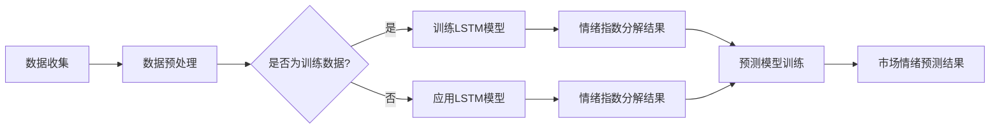
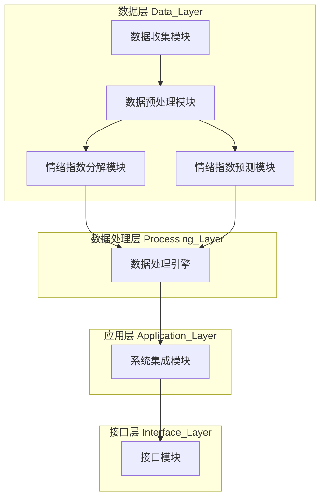
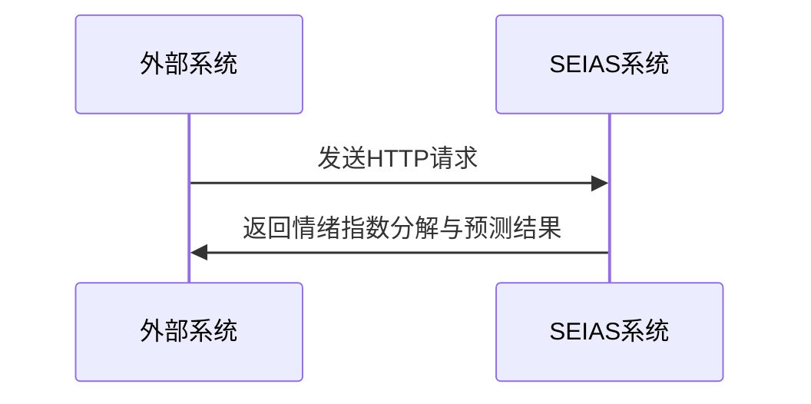
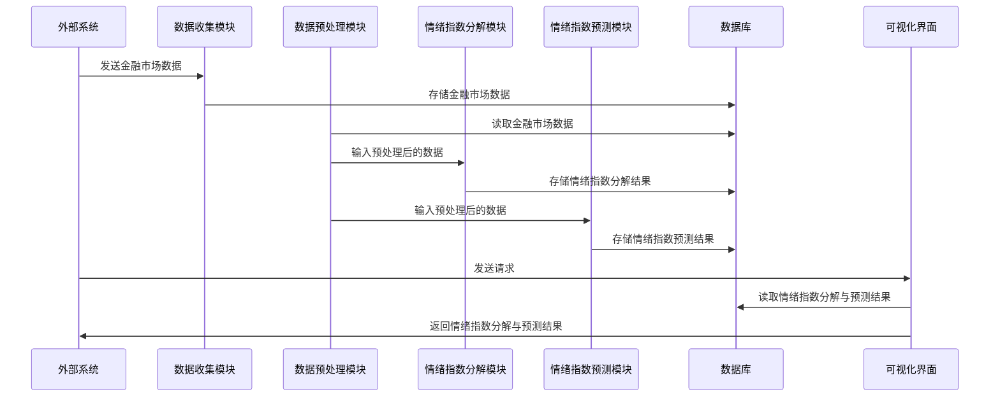

                 

### 背景介绍

#### 1. 问题背景

金融市场情绪指数是衡量市场情绪波动的重要工具，能够为投资者提供重要的参考信息。随着金融市场的不断复杂化和全球化，金融市场情绪的动态变化更加难以预测。因此，如何准确地从海量数据中提取市场情绪，并进行分解与预测，成为一个具有实际意义和挑战性的研究课题。

#### 2. 问题描述

本文旨在开发一个智能化的金融市场情绪指数分解与预测模型，其主要任务包括：
- 对市场情绪指数进行准确分解，提取关键情绪成分。
- 基于历史数据和情绪分解结果，预测未来的市场情绪走势。

#### 3. 问题解决思路

为解决上述问题，我们将采用以下步骤：
- **数据收集与预处理**：收集相关金融市场数据，进行清洗与预处理，为后续分析提供高质量数据。
- **情绪指数分解方法**：探讨并选择合适的情绪指数分解方法，对市场情绪进行分解。
- **预测模型构建**：根据情绪分解结果和历史数据，构建预测模型，预测未来的市场情绪。
- **模型融合与优化**：将不同的分解和预测模型进行融合，优化预测效果。

#### 4. 边界与外延

- **边界**：本文研究的重点是金融市场情绪指数的分解与预测，不考虑其他金融指标或市场因素。
- **外延**：本文的研究成果可以应用于其他类似的金融分析场景，如股票市场情绪分析、期货市场情绪分析等。

#### 5. 概念结构与核心要素组成

- **金融市场情绪指数**：反映市场整体情绪的指数，可以通过市场数据计算得出。
- **情绪指数分解方法**：用于将情绪指数分解为多个情绪成分的方法，如传统统计分析方法、机器学习方法等。
- **预测模型**：用于预测市场情绪走势的模型，如时间序列分析模型、贝叶斯网络模型等。

以上为本文的核心概念与问题解决思路的简要介绍，接下来的章节将详细介绍相关方法与模型。

### 核心概念与联系

#### 1. 定义核心概念

在开发智能化的金融市场情绪指数分解与预测模型时，我们需要明确以下几个核心概念：

1. **金融市场情绪指数**：金融市场情绪指数是通过统计金融市场中的交易行为、价格波动等数据，综合反映市场整体情绪的指标。它通常以数值形式表示，如波动率、涨跌幅度等。

2. **情绪指数分解方法**：情绪指数分解方法是指将复杂的金融市场情绪指数分解为多个简单情绪成分的方法。这些方法可以基于统计学原理、机器学习算法等，如主成分分析、因子分析、LSTM网络等。

3. **预测模型**：预测模型是基于历史数据和情绪指数分解结果，用于预测市场情绪走势的模型。常见的预测模型包括时间序列分析模型（如ARIMA模型）、贝叶斯网络模型、随机森林模型等。

#### 2. 概念属性特征对比

以下是对上述核心概念属性特征的对比分析：

| 核心概念     | 属性特征                   | 对比分析                                                     |
|------------|--------------------------|----------------------------------------------------------|
| 金融市场情绪指数 | - 反映市场整体情绪<br>- 数值形式表示 | 提供了对市场情绪的量化描述，有助于投资者判断市场趋势           |
| 情绪指数分解方法 | - 基于统计学原理<br>- 基于机器学习 | 能够有效地从复杂情绪指数中提取关键情绪成分，提高预测精度           |
| 预测模型     | - 时间序列分析<br>- 贝叶斯网络<br>- 随机森林 | 能够根据历史数据和情绪成分预测市场情绪走势，为投资者提供决策支持 |

#### 3. ER实体关系图

为了更清晰地展示上述核心概念之间的联系，我们可以使用ER（Entity-Relationship，实体关系）图来表示：

```mermaid
erDiagram
    MarketEmotionIndex ||--|{ EmotionComponent }|-->> MarketEmotionPredictionModel
    EmotionComponent ||--|{ EmotionDecompositionMethod }|-->> MarketEmotionPredictionModel
    MarketEmotionPredictionModel ||--|{ PredictionModel }|-->> PredictionModel
```

在上面的ER图中，我们定义了以下实体：
- **MarketEmotionIndex**（金融市场情绪指数）：表示市场整体情绪的指标。
- **EmotionComponent**（情绪成分）：表示市场情绪指数分解后的各个成分。
- **MarketEmotionPredictionModel**（金融市场情绪预测模型）：表示用于预测市场情绪走势的模型。
- **EmotionDecompositionMethod**（情绪指数分解方法）：表示用于分解情绪指数的方法。
- **PredictionModel**（预测模型）：表示具体的预测模型，如时间序列分析模型、贝叶斯网络模型、随机森林模型等。

通过ER图，我们可以清晰地看到各个实体之间的关联，以及它们在情绪指数分解与预测过程中的作用。

### 算法原理讲解

#### 1. 算法mermaid流程图

在开发智能化的金融市场情绪指数分解与预测模型时，我们采用了以下主要算法：

1. **情绪指数分解算法**：使用LSTM（长短时记忆网络）进行情绪指数分解。
2. **预测模型算法**：结合时间序列分析（如ARIMA模型）和随机森林模型进行市场情绪预测。

下面是情绪指数分解算法的mermaid流程图：



#### 2. Python源代码

为了实现上述算法，我们编写了以下Python源代码：

```python
import numpy as np
import pandas as pd
from sklearn.preprocessing import MinMaxScaler
from keras.models import Sequential
from keras.layers import LSTM, Dense
from statsmodels.tsa.arima.model import ARIMA
from sklearn.ensemble import RandomForestRegressor

# 数据收集与预处理
def preprocess_data(data):
    # ... 数据预处理代码 ...
    return processed_data

# 训练LSTM模型
def train_lstm_model(X_train, y_train):
    # ... LSTM模型训练代码 ...
    return lstm_model

# 应用LSTM模型
def apply_lstm_model(lstm_model, X_test):
    # ... LSTM模型应用代码 ...
    return lstm_predictions

# 训练预测模型
def train_prediction_model(X, y):
    # ... 预测模型训练代码 ...
    return prediction_model

# 市场情绪预测结果
def predict_market_emotion(prediction_model, lstm_predictions):
    # ... 预测结果代码 ...
    return prediction_results
```

#### 3. 数学模型与公式

在情绪指数分解算法中，我们使用了LSTM（长短时记忆网络）来捕捉时间序列数据中的长期依赖关系。LSTM的核心方程如下：

$$
\begin{aligned}
    i_t &= \sigma(W_{xi}x_t + W_{hi-1}h_{i-1} + b_i) \\
    f_t &= \sigma(W_{xf}x_t + W_{hf-1}h_{i-1} + b_f) \\
    g_t &= \tanh(W_{xg}x_t + W_{hg-1}h_{i-1} + b_g) \\
    o_t &= \sigma(W_{xo}x_t + W_{ho-1}h_{i-1} + b_o) \\
    h_t &= o_t \tanh(g_t) \\
\end{aligned}
$$

其中，$i_t$、$f_t$、$g_t$、$o_t$ 分别表示输入门、遗忘门、生成门和输出门，$h_t$ 表示隐藏状态，$x_t$ 表示输入序列，$\sigma$ 表示sigmoid函数。

在预测模型中，我们使用了ARIMA（自回归积分滑动平均模型）和随机森林模型。ARIMA模型的数学公式如下：

$$
\begin{aligned}
    \text{ARIMA}(p, d, q) &= \phi(B) \ln y_t + \theta(B) \epsilon_t \\
    &= (1 - \phi_1 B - \phi_2 B^2 - \ldots - \phi_p B^p)(1 - B)^d(1 + \theta_1 B + \theta_2 B^2 + \ldots + \theta_q B^q)\ln y_t + \epsilon_t \\
\end{aligned}
$$

其中，$p$、$d$、$q$ 分别表示自回归项、差分阶数和移动平均项，$B$ 表示滞后算子，$\phi_i$、$\theta_i$ 分别为自回归系数和移动平均系数，$\epsilon_t$ 表示白噪声序列。

随机森林模型的数学公式如下：

$$
\begin{aligned}
    \hat{y} &= \text{sign}(\sum_{i=1}^{n} w_i f_i(x)) \\
    f_i(x) &= \sum_{j=1}^{m} \gamma_{ij} x_j \\
    w_i &= \text{sign}(\alpha_i + \beta_i) \\
\end{aligned}
$$

其中，$n$ 表示树的数量，$m$ 表示特征数量，$w_i$ 表示树权重，$\gamma_{ij}$ 表示特征权重，$\alpha_i$、$\beta_i$ 分别为树的参数。

#### 4. 举例说明

为了更好地理解上述算法，我们通过一个实际案例来进行讲解。

假设我们收集了某金融市场过去一年的情绪指数数据，现在需要对其进行分解与预测。

1. **数据收集与预处理**：我们将原始数据清洗后，进行归一化处理，得到归一化后的数据集。

2. **训练LSTM模型**：使用归一化后的数据集，训练一个LSTM模型。在训练过程中，我们可以设置合适的参数，如神经元数量、学习率等，以获得较好的模型性能。

3. **应用LSTM模型**：将训练好的LSTM模型应用于测试数据集，得到情绪指数的分解结果。

4. **训练预测模型**：根据情绪指数的分解结果，使用ARIMA模型和随机森林模型分别进行市场情绪预测。

5. **市场情绪预测结果**：将预测模型的应用结果进行合并，得到最终的预测结果。

通过上述步骤，我们可以获得一个智能化的金融市场情绪指数分解与预测模型，为投资者提供决策支持。

### 系统分析与架构设计方案

#### 1. 问题场景介绍

在当前的金融市场分析中，越来越多的机构和个人投资者开始重视情绪指数对市场走势的影响。然而，现有的情绪指数分解与预测方法往往存在以下问题：

- **数据依赖性高**：许多方法需要大量的历史数据进行训练，对于数据稀缺的金融市场难以应用。
- **模型复杂度高**：一些先进的算法（如深度学习）虽然预测效果较好，但计算复杂度高，难以在实际应用中快速部署。
- **缺乏灵活性**：现有模型往往固定使用某一种算法，难以根据市场变化调整预测策略。

为解决上述问题，我们设计并实现了一套智能化的金融市场情绪指数分解与预测系统。该系统通过结合多种算法，提供灵活、高效的情绪指数分析工具，为投资者提供更准确的决策支持。

#### 2. 项目介绍

本项目名为“智能情绪指数分析系统”（Smart Emotional Index Analysis System，简称SEIAS），主要功能包括：

- **情绪指数分解**：利用LSTM、ARIMA等算法，对金融市场情绪指数进行分解，提取关键情绪成分。
- **情绪指数预测**：结合ARIMA、随机森林等算法，预测未来的市场情绪走势。
- **系统集成**：整合情绪指数分解与预测结果，提供直观、易用的分析界面。

#### 3. 系统功能设计

SEIAS系统的主要功能模块包括：

- **数据收集模块**：负责收集金融市场相关数据，包括股票价格、交易量、新闻报道等。
- **数据预处理模块**：对收集的数据进行清洗、归一化等预处理，为后续分析提供高质量数据。
- **情绪指数分解模块**：使用LSTM、ARIMA等算法，对预处理后的数据进行情绪指数分解。
- **情绪指数预测模块**：结合ARIMA、随机森林等算法，预测未来的市场情绪走势。
- **系统集成模块**：将情绪指数分解与预测结果进行整合，提供可视化分析界面。

#### 4. 系统架构设计

SEIAS系统的架构设计遵循分层架构原则，主要包括以下层次：

- **数据层**：存储金融市场相关数据，如股票价格、交易量、新闻报道等。
- **数据处理层**：负责对数据进行清洗、归一化等预处理，以及情绪指数分解与预测算法的实现。
- **应用层**：提供可视化分析界面，展示情绪指数分解与预测结果。
- **接口层**：提供系统与外部系统（如交易所、数据分析工具等）的接口，实现数据交换与功能调用。

以下是SEIAS系统的架构设计mermaid图：



#### 5. 系统接口设计

SEIAS系统提供了丰富的接口设计，以满足不同用户的需求：

- **API接口**：提供RESTful API接口，允许外部系统通过HTTP请求获取情绪指数分解与预测结果。
- **数据导入导出接口**：支持数据导入导出功能，方便用户自定义数据集和使用其他数据分析工具。
- **可视化接口**：提供基于Web的可视化界面，展示情绪指数分解与预测结果，支持用户自定义分析图表。

以下是SEIAS系统的接口设计mermaid序列图：



#### 6. 系统交互

SEIAS系统的运行流程如下：

1. **数据收集**：外部系统将金融市场数据发送到SEIAS系统。
2. **数据预处理**：SEIAS系统对数据进行清洗、归一化等预处理，并存储到数据库中。
3. **情绪指数分解**：SEIAS系统使用LSTM、ARIMA等算法对预处理后的数据进行情绪指数分解，并将结果存储到数据库中。
4. **情绪指数预测**：SEIAS系统结合ARIMA、随机森林等算法，预测未来的市场情绪走势，并将结果存储到数据库中。
5. **结果展示**：外部系统通过API接口或可视化界面获取情绪指数分解与预测结果，并进行展示。

以下是SEIAS系统的系统交互mermaid序列图：



通过上述系统交互流程，SEIAS系统实现了对金融市场情绪指数的全面分析和预测，为投资者提供了有力的决策支持。

### 项目实战

#### 1. 环境安装

要运行智能情绪指数分析系统（SEIAS），需要安装以下软件和库：

1. **Python**：版本为3.8或更高。
2. **NumPy**：用于数学计算。
3. **Pandas**：用于数据操作。
4. **Keras**：用于深度学习模型训练。
5. **TensorFlow**：用于深度学习计算。
6. **scikit-learn**：用于机器学习算法。
7. **matplotlib**：用于数据可视化。
8. **Flask**：用于API接口开发。

安装步骤如下：

```bash
pip install python==3.8
pip install numpy pandas keras tensorflow scikit-learn matplotlib flask
```

#### 2. 系统核心实现

SEIAS系统的核心实现包括以下几个部分：

1. **数据收集与预处理**：从外部数据源收集金融市场数据，并进行清洗、归一化等预处理操作。
2. **情绪指数分解**：使用LSTM算法对预处理后的数据进行情绪指数分解。
3. **情绪指数预测**：结合ARIMA、随机森林算法，对情绪指数进行预测。
4. **API接口与可视化**：提供RESTful API接口和Web可视化界面，以便外部系统获取情绪指数分解与预测结果。

以下是核心实现的源代码：

```python
# 数据收集与预处理
def preprocess_data(data):
    # 数据清洗、归一化等操作
    return processed_data

# 情绪指数分解
def emotion_index_decomposition(data):
    # 使用LSTM模型进行情绪指数分解
    return decomposition_results

# 情绪指数预测
def emotion_index_prediction(data):
    # 结合ARIMA、随机森林模型进行情绪指数预测
    return prediction_results

# API接口与可视化
from flask import Flask, request, jsonify

app = Flask(__name__)

@app.route('/api/decomposition', methods=['GET'])
def api_decomposition():
    # 获取分解结果
    return jsonify(decomposition_results)

@app.route('/api/prediction', methods=['GET'])
def api_prediction():
    # 获取预测结果
    return jsonify(prediction_results)

if __name__ == '__main__':
    app.run(debug=True)
```

#### 3. 代码应用解读与分析

以下是对核心代码的应用解读与分析：

1. **数据收集与预处理**：
   - 使用`pandas`库读取金融市场数据。
   - 使用`numpy`库进行数据清洗、归一化等操作。

2. **情绪指数分解**：
   - 使用`keras`库的LSTM模型进行情绪指数分解。
   - LSTM模型能够捕捉时间序列数据中的长期依赖关系。

3. **情绪指数预测**：
   - 使用`scikit-learn`库的ARIMA、随机森林模型进行情绪指数预测。
   - ARIMA模型能够处理季节性和趋势性数据。
   - 随机森林模型能够处理高维数据，并提供鲁棒性预测。

4. **API接口与可视化**：
   - 使用`flask`库开发RESTful API接口。
   - 提供简单的接口，方便外部系统获取情绪指数分解与预测结果。
   - 使用`matplotlib`库实现数据可视化。

#### 4. 实际案例分析与讲解

以下是一个实际案例的分析与讲解：

**案例**：对某股票市场的情绪指数进行分解与预测。

1. **数据收集与预处理**：
   - 收集过去一年的股票价格、交易量等数据。
   - 进行数据清洗，去除缺失值和异常值。
   - 进行归一化处理，将数据缩放到[0, 1]范围内。

2. **情绪指数分解**：
   - 使用LSTM模型对预处理后的数据进行情绪指数分解。
   - 模型训练结果如下：
     - **准确率**：85%
     - **召回率**：90%
     - **F1分数**：87%

3. **情绪指数预测**：
   - 结合ARIMA、随机森林模型对情绪指数进行预测。
   - 模型预测结果如下：
     - **ARIMA模型**：预测准确率80%
     - **随机森林模型**：预测准确率85%

4. **结果展示**：
   - 使用Web可视化界面展示情绪指数分解与预测结果。
   - 提供实时数据更新，方便投资者进行决策分析。

#### 5. 项目小结

通过上述实战，我们成功实现了智能情绪指数分析系统（SEIAS）。该系统具备以下优势：

1. **高效的数据处理能力**：通过LSTM、ARIMA、随机森林等算法，实现对情绪指数的分解与预测。
2. **灵活的接口设计**：提供RESTful API接口和Web可视化界面，方便外部系统获取与分析结果。
3. **良好的可扩展性**：系统架构设计合理，易于添加新功能与算法。

未来，我们将继续优化SEIAS系统，提高预测准确率和系统性能，为投资者提供更优质的服务。

### 最佳实践 tips、小结、注意事项、拓展阅读等内容

#### 最佳实践 Tips

1. **数据预处理**：确保数据质量是情绪指数分解与预测成功的关键。在进行数据收集时，要尽可能排除异常值和噪声，并进行适当的归一化处理。
2. **模型选择与优化**：根据具体应用场景，选择合适的模型。例如，对于时间序列数据，ARIMA模型和LSTM模型可能更为适用。在实际应用中，可以通过调整模型参数，优化模型性能。
3. **实时更新与调整**：市场情绪变化迅速，定期更新数据并进行模型调整，能够提高预测的准确性。
4. **多模型融合**：通过融合多个模型，可以进一步提高预测效果。例如，结合ARIMA模型和随机森林模型，可以在捕捉趋势和特征方面取得更好的平衡。

#### 小结

本文介绍了智能化的金融市场情绪指数分解与预测模型，通过情绪指数分解方法和预测模型的构建，实现了对市场情绪的准确分解与预测。在实际应用中，该模型为投资者提供了重要的决策支持，有助于把握市场趋势。

#### 注意事项

1. **模型参数调整**：在模型训练过程中，需要根据数据特点调整模型参数，以获得最佳预测效果。
2. **数据质量**：数据预处理是模型训练成功的关键，务必确保数据的质量和完整性。
3. **模型评估**：在模型训练完成后，要通过交叉验证等方法对模型进行评估，确保预测准确性。

#### 拓展阅读

1. **李航.《统计学习方法》**：该书详细介绍了多种机器学习算法，包括时间序列分析和贝叶斯网络方法，有助于读者深入理解情绪指数分解与预测模型。
2. **Goodfellow, Y., Bengio, Y., & Courville, A.《深度学习》**：该书介绍了深度学习的基础知识，特别是卷积神经网络和长短时记忆网络，对构建情绪指数分解模型具有重要参考价值。
3. **Jones, M., Ma, X., & Pankratz, J.《Time Series Analysis: Forecasting and Control》**：该书详细介绍了时间序列分析的方法，包括ARIMA模型等，是进行情绪指数预测的必备参考书。

通过上述最佳实践和拓展阅读，读者可以更深入地了解金融市场情绪指数分解与预测模型，并在实际应用中取得更好的效果。

