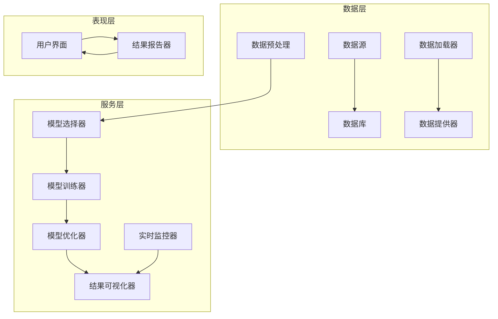
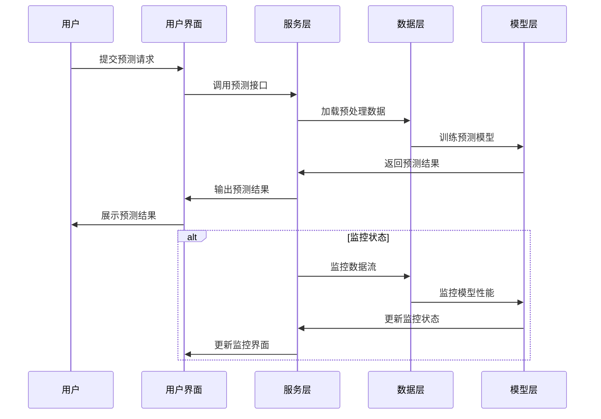

                 

## 文章标题

# 开发智能化的金融市场流动性预测工具

> 关键词：金融市场流动性、预测工具、智能化、深度学习、数据预处理

> 摘要：本文探讨了如何开发一款智能化的金融市场流动性预测工具。通过分析金融市场流动性问题的背景和核心概念，本文提出了一种基于深度学习的预测模型，并详细介绍了数据预处理、模型训练与优化、以及算法实现与解释的过程。此外，文章还比较了智能化预测工具与传统工具的优劣，并提出了融合应用的建议。通过本文的研究，希望能够为金融领域的流动性预测提供有价值的参考。

## 目录大纲

----------------------------------------------------------------

## 第一部分：引言与背景

### 第1章 问题背景与核心概念

### 1.1 问题背景

#### 1.1.1 金融市场的流动性问题

#### 1.1.2 金融市场流动性预测的现状与挑战

#### 1.1.3 本书的目标与结构

### 1.2 核心概念

#### 1.2.1 智能化预测工具的基本概念

#### 1.2.2 流动性预测相关概念

#### 1.2.3 边界与外延

### 1.3 本章小结

## 第二部分：核心概念与联系

### 第2章 智能化预测工具原理

### 2.1 智能化预测工具的基本原理

#### 2.1.1 数据预处理

#### 2.1.2 预测模型选择

#### 2.1.3 模型训练与优化

### 2.2 流动性预测相关概念

#### 2.2.1 流动性预测的目标与指标

#### 2.2.2 影响流动性预测的关键因素

### 2.3 智能化预测工具与传统工具的对比

### 2.4 本章小结

## 第三部分：算法原理与讲解

### 第3章 算法原理详解

### 3.1 算法概述

### 3.2 数据预处理流程

#### 3.2.1 数据清洗与预处理

#### 3.2.2 数据特征提取

### 3.3 预测模型设计

#### 3.3.1 传统预测模型

#### 3.3.2 深度学习预测模型

#### 3.3.3 模型融合与优化

### 3.4 算法实现与解释

#### 3.4.1 Python实现

#### 3.4.2 数学模型与公式讲解

#### 3.4.3 算法举例说明

### 3.5 系统分析与架构设计方案

#### 3.5.1 问题场景介绍

#### 3.5.2 系统功能设计

#### 3.5.3 系统架构设计

#### 3.5.4 系统接口设计

#### 3.5.5 系统交互

### 3.6 项目实战

#### 3.6.1 环境安装

#### 3.6.2 系统核心实现源代码

#### 3.6.3 代码应用解读与分析

#### 3.6.4 实际案例分析与详细讲解

#### 3.6.5 项目小结

### 3.7 最佳实践 tips

### 3.8 小结

### 3.9 注意事项

### 3.10 拓展阅读

## 第一部分：引言与背景

### 第1章 问题背景与核心概念

#### 1.1 问题背景

#### 1.1.1 金融市场的流动性问题

金融市场流动性是指市场参与者能够在不引起市场价格剧烈变动的情况下，快速买卖资产的能力。流动性对于金融市场的稳定运行至关重要。流动性不足可能导致市场失灵，甚至引发金融危机。

流动性不足的定义可以理解为市场在交易中难以快速买卖资产的状态。这种现象通常表现为交易量下降、交易价格波动加剧，以及市场对买卖需求响应迟缓。

#### 1.1.1.1 流动性的定义与重要性

流动性是指资产或市场在一定时间内以合理价格快速成交的能力。流动性好意味着资产买卖容易，市场价格稳定；而流动性差则意味着买卖难度大，市场价格波动大。

在金融市场，流动性具有以下几个重要作用：

1. **风险分散**：流动性好的市场允许投资者在不同资产之间进行快速切换，从而分散风险。
2. **市场效率**：高流动性市场能够更快地反映出市场供需关系，有助于价格发现。
3. **市场稳定性**：流动性好能够减少价格波动，防止市场出现大幅波动。
4. **投资决策**：流动性好使得投资者能够更灵活地调整投资组合。

#### 1.1.1.2 流动性不足带来的影响

流动性不足对金融市场的影响是多方面的，主要体现在以下几个方面：

1. **交易成本增加**：流动性差会导致买卖双方难以快速达成交易，从而增加交易成本。
2. **价格波动加剧**：流动性不足使得市场难以平衡供需，导致价格波动更加剧烈。
3. **市场失灵**：在极端情况下，流动性不足可能导致市场完全失灵，使得交易无法进行。
4. **投资者情绪波动**：流动性差会加剧投资者的恐慌情绪，导致市场信心下降。

#### 1.1.2 金融市场流动性预测的现状与挑战

金融市场流动性预测是指利用历史数据和现有技术手段，预测未来一段时间内市场流动性的变化趋势。然而，当前金融市场流动性预测面临以下几个挑战：

1. **数据不足**：金融市场数据通常具有高维度、复杂性和噪声，获取和处理这些数据需要大量资源和时间。
2. **模型局限性**：现有预测模型如ARIMA、回归模型等在处理高维度、非线性问题时存在局限性。
3. **动态变化**：金融市场流动性受多种因素影响，其变化具有动态性和不可预测性。
4. **算法复杂性**：深度学习等智能化预测方法虽然具有强大的预测能力，但其实现和优化过程复杂，需要大量计算资源。

#### 1.1.2.1 现有预测方法的局限性

1. **ARIMA模型**：ARIMA（自回归积分滑动平均模型）是一种经典的时间序列预测模型，但其主要局限性在于：
   - **线性假设**：ARIMA模型假设数据呈线性关系，无法有效处理非线性数据。
   - **参数敏感性**：模型参数需要手动调整，参数选择对预测结果影响较大。
   - **数据处理能力有限**：ARIMA模型在处理高维度、非平稳数据时效果较差。

2. **回归模型**：回归模型如线性回归、多元回归等在金融预测中应用广泛，但其局限性包括：
   - **线性关系假设**：回归模型同样假设变量之间存在线性关系，不适用于非线性数据。
   - **特征选择困难**：回归模型需要手动选择特征，特征选择过程复杂，容易出现过拟合。
   - **鲁棒性较差**：回归模型对异常值和噪声敏感，预测结果容易受到数据噪声的影响。

#### 1.1.2.2 智能化预测的需求

为了克服现有预测方法的局限性，智能化预测工具成为了金融市场流动性预测的迫切需求。智能化预测工具通常具备以下特点：

1. **数据处理能力**：智能化预测工具能够处理高维度、非线性、非平稳的数据，提高预测准确性。
2. **自学习与自适应**：智能化预测工具可以通过机器学习和深度学习算法，自动学习数据特征，并自适应调整模型参数。
3. **强预测能力**：深度学习等智能化算法在处理复杂、动态数据时具有强大的预测能力，能够捕捉市场流动性的细微变化。
4. **实时预测与反馈**：智能化预测工具能够实现实时数据预测，并快速调整预测模型，为金融市场决策提供及时支持。

#### 1.1.3 本书的目标与结构

本书的目标是开发一款智能化的金融市场流动性预测工具，旨在解决现有预测方法面临的局限性，提高预测准确性和实时性。本书的主要结构如下：

1. **核心概念与联系**：介绍金融市场流动性预测的核心概念，包括数据预处理、预测模型选择、模型训练与优化等。
2. **算法原理与讲解**：详细讲解智能化预测工具的算法原理，包括传统预测模型、深度学习模型以及模型融合与优化方法。
3. **系统分析与架构设计方案**：介绍预测工具的系统架构，包括数据流、功能模块、接口设计等。
4. **项目实战**：通过具体案例，演示预测工具的实际应用过程，包括环境安装、系统实现、代码解析等。
5. **最佳实践与拓展**：提供最佳实践建议，总结项目经验，并探讨未来研究方向。

#### 1.1.3.1 预测工具的设计与实现

本书将详细探讨如何设计并实现一款智能化的金融市场流动性预测工具，具体步骤如下：

1. **数据预处理**：对金融市场数据进行清洗、去噪、特征提取等预处理操作，提高数据质量。
2. **预测模型选择**：结合金融市场特性，选择适合的预测模型，如深度学习模型（LSTM、GRU等）。
3. **模型训练与优化**：利用历史数据进行模型训练，并通过交叉验证、超参数调优等方法提高模型性能。
4. **系统部署与优化**：将预测工具部署到实际环境中，并进行性能优化，确保预测结果的实时性和准确性。

#### 1.1.3.2 系统部署与优化

系统部署与优化是确保预测工具在实际环境中稳定运行的关键环节。具体措施包括：

1. **环境配置**：搭建预测工具的运行环境，包括硬件资源、软件依赖等。
2. **数据流设计**：设计高效的数据流处理系统，确保实时数据输入和预测结果输出。
3. **模型监控与调整**：实时监控模型性能，根据实际运行情况调整模型参数，提高预测准确性。
4. **性能优化**：通过并行计算、分布式处理等技术手段，提高系统性能和预测速度。

### 1.2 核心概念

#### 1.2.1 智能化预测工具的基本概念

智能化预测工具是指利用人工智能技术，尤其是机器学习和深度学习算法，对金融市场流动性进行预测和分析的工具。其核心概念包括：

1. **机器学习**：一种基于数据驱动的学习方法，通过从大量数据中学习规律，实现预测和分类等功能。
2. **深度学习**：一种特殊的机器学习方法，通过多层神经网络结构，模拟人脑学习过程，实现更复杂的模式识别和预测任务。
3. **预测模型**：用于预测金融市场流动性的算法模型，如ARIMA、LSTM、GRU等。
4. **特征工程**：通过对数据进行处理和变换，提取出对预测任务有重要影响的特征，提高模型性能。
5. **模型训练与优化**：利用历史数据对预测模型进行训练和调优，以提高预测准确性。

#### 1.2.1.1 智能化的定义与特征

智能化是指利用人工智能技术，使机器具备类似人类的认知能力、决策能力和学习能力。智能化预测工具的特征包括：

1. **自学习**：预测工具能够通过历史数据自动学习，提高预测准确性。
2. **自适应**：预测工具能够根据实时数据调整预测模型，适应市场变化。
3. **高准确性**：智能化预测工具能够处理复杂、动态的数据，实现高精度的预测。
4. **实时性**：预测工具能够快速响应市场变化，提供实时预测结果。

#### 1.2.1.2 预测工具的组成与功能

智能化预测工具通常由以下几个部分组成：

1. **数据预处理模块**：负责对金融市场数据进行清洗、去噪、特征提取等预处理操作。
2. **预测模型模块**：选择并训练适合的预测模型，如深度学习模型。
3. **模型优化模块**：通过交叉验证、超参数调优等方法，提高模型性能。
4. **预测结果模块**：将预测结果以可视化、报告等形式输出，供用户参考。
5. **实时监控模块**：实时监控模型性能和系统运行状态，确保预测工具的稳定运行。

#### 1.2.2 流动性预测相关概念

流动性预测是指利用历史数据和现有技术手段，预测未来一段时间内市场流动性的变化趋势。流动性预测的核心概念包括：

1. **流动性预测目标**：明确流动性预测的具体目标，如预测未来某一时段的交易量、价格波动等。
2. **流动性预测指标**：用于衡量流动性水平的指标，如深度、宽度、速度等。
3. **关键影响因素**：影响流动性预测准确性的关键因素，如市场因素、经济因素、政策因素等。
4. **预测方法**：选择合适的预测方法，如机器学习、深度学习、回归分析等。

#### 1.2.2.1 流动性预测的目标与指标

流动性预测的目标是准确预测市场流动性的变化趋势，为投资决策和风险管理提供支持。常见的流动性预测指标包括：

1. **交易量**：表示市场在一定时间内进行的交易数量，是衡量流动性水平的重要指标。
2. **价格波动**：表示市场价格在一定时间内的波动程度，波动越大，流动性越差。
3. **深度**：表示市场在不同价格水平上的买卖挂单数量，深度越大，流动性越好。
4. **宽度**：表示市场在不同价格水平上的买卖挂单价格差异，宽度越大，流动性越差。

#### 1.2.2.2 影响流动性预测的关键因素

流动性预测的准确性受到多种因素的影响，主要包括：

1. **市场因素**：市场供需关系、投资者情绪、市场波动等。
2. **经济因素**：宏观经济环境、行业发展趋势、公司业绩等。
3. **政策因素**：政府政策、监管政策、市场规则等。
4. **技术因素**：交易系统性能、数据处理能力、预测模型精度等。

#### 1.2.3 边界与外延

1. **预测工具的适用范围**：预测工具主要适用于金融市场流动性预测，具体包括股票市场、债券市场、外汇市场等。
2. **数据来源与处理**：预测工具需要获取和处理大量的金融市场数据，包括交易数据、价格数据、基本面数据等。
3. **模型选择与优化**：根据金融市场特性，选择合适的预测模型，并通过交叉验证、超参数调优等方法，优化模型性能。
4. **算法实现的复杂性**：智能化预测工具的实现和优化过程复杂，需要大量的计算资源和专业技能。

### 1.3 本章小结

本章介绍了金融市场流动性预测的背景和核心概念，包括流动性问题的定义、流动性不足的影响、金融市场流动性预测的现状与挑战、智能化预测工具的基本概念和流动性预测相关概念。通过本章的学习，读者可以了解金融市场流动性预测的重要性和复杂性，以及智能化预测工具的优势和应用场景。

## 第二部分：核心概念与联系

### 第2章 智能化预测工具原理

#### 2.1 智能化预测工具的基本原理

智能化预测工具的核心在于利用人工智能技术，尤其是机器学习和深度学习算法，对金融市场数据进行处理和分析，从而实现流动性的预测。以下是智能化预测工具的基本原理：

##### 2.1.1 数据预处理

数据预处理是智能化预测工具的第一步，其目的是提高数据质量，为后续的预测模型训练提供可靠的数据基础。数据预处理主要包括以下步骤：

1. **数据清洗**：去除数据中的噪声和异常值，确保数据的完整性和一致性。
2. **数据归一化**：将不同量纲的数据转换到同一尺度，以便于后续的模型训练。
3. **特征提取**：从原始数据中提取对预测任务有重要影响的特征，减少数据的维度，提高模型的可解释性。

##### 2.1.2 预测模型选择

预测模型的选择对于智能化预测工具的性能至关重要。在金融市场流动性预测中，常用的预测模型包括传统预测模型和深度学习预测模型。

1. **传统预测模型**：传统预测模型主要包括ARIMA（自回归积分滑动平均模型）、回归模型等。这些模型适用于处理线性关系较强的数据，但在处理高维度、非线性数据时存在局限性。

2. **深度学习预测模型**：深度学习预测模型主要包括LSTM（长短期记忆网络）、GRU（门控循环单元）等。这些模型能够处理高维度、非线性数据，具有较强的预测能力。

##### 2.1.3 模型训练与优化

模型训练与优化是智能化预测工具的核心环节。在模型训练过程中，通过调整模型参数，使模型能够更好地拟合训练数据。优化方法包括：

1. **交叉验证**：通过将数据集划分为训练集和验证集，评估模型在验证集上的性能，从而调整模型参数。
2. **超参数调优**：通过调整学习率、批次大小等超参数，优化模型性能。
3. **正则化**：通过引入正则化项，防止模型过拟合。

#### 2.2 流动性预测相关概念

流动性预测的目标是准确预测市场流动性的变化趋势，为投资决策和风险管理提供支持。以下是流动性预测相关概念：

##### 2.2.1 流动性预测的目标与指标

流动性预测的目标包括：

1. **预测未来某一时段的交易量**：了解市场在未来某一时期的活跃程度。
2. **预测价格波动**：分析市场价格在未来某一时期的波动程度。
3. **预测深度和宽度**：评估市场在不同价格水平上的买卖挂单数量和价格差异。

流动性预测指标包括：

1. **交易量**：表示市场在一定时间内进行的交易数量，是衡量流动性水平的重要指标。
2. **价格波动**：表示市场价格在一定时间内的波动程度。
3. **深度**：表示市场在不同价格水平上的买卖挂单数量。
4. **宽度**：表示市场在不同价格水平上的买卖挂单价格差异。

##### 2.2.2 影响流动性预测的关键因素

流动性预测的准确性受到多种因素的影响，主要包括：

1. **市场因素**：包括市场供需关系、投资者情绪、市场波动等。
2. **经济因素**：包括宏观经济环境、行业发展趋势、公司业绩等。
3. **政策因素**：包括政府政策、监管政策、市场规则等。
4. **技术因素**：包括交易系统性能、数据处理能力、预测模型精度等。

#### 2.3 智能化预测工具与传统工具的对比

智能化预测工具与传统预测工具相比，具有以下几个优势：

1. **数据处理能力**：智能化预测工具能够处理高维度、非线性、非平稳的数据，提高预测准确性。
2. **自学习与自适应**：智能化预测工具可以通过机器学习和深度学习算法，自动学习数据特征，并自适应调整模型参数。
3. **强预测能力**：深度学习等智能化算法在处理复杂、动态数据时具有强大的预测能力，能够捕捉市场流动性的细微变化。
4. **实时预测与反馈**：智能化预测工具能够实现实时数据预测，并快速调整预测模型，为金融市场决策提供及时支持。

然而，传统预测工具也有其优势：

1. **方法成熟**：传统预测方法如ARIMA、回归模型等已经经过长时间的应用和验证，具有较高的可靠性。
2. **易于理解**：传统预测方法的原理相对简单，易于理解和解释，适合对预测结果进行解释和决策。
3. **计算资源要求较低**：传统预测方法通常计算量较小，对计算资源的要求较低，适用于中小规模的预测任务。

##### 2.3.1 优势与局限

智能化预测工具的优势包括：

1. **数据处理能力**：智能化预测工具能够处理高维度、非线性、非平稳的数据，提高预测准确性。
2. **自学习与自适应**：智能化预测工具可以通过机器学习和深度学习算法，自动学习数据特征，并自适应调整模型参数。
3. **强预测能力**：深度学习等智能化算法在处理复杂、动态数据时具有强大的预测能力，能够捕捉市场流动性的细微变化。
4. **实时预测与反馈**：智能化预测工具能够实现实时数据预测，并快速调整预测模型，为金融市场决策提供及时支持。

传统预测工具的局限包括：

1. **线性假设**：传统预测模型如ARIMA、回归模型等通常假设数据呈线性关系，无法有效处理非线性数据。
2. **特征选择困难**：传统预测模型需要手动选择特征，特征选择过程复杂，容易出现过拟合。
3. **鲁棒性较差**：传统预测模型对异常值和噪声敏感，预测结果容易受到数据噪声的影响。

##### 2.3.2 融合应用

智能化预测工具与传统预测工具的融合应用，可以充分发挥各自的优势，提高流动性预测的准确性和稳定性。具体方法包括：

1. **模型融合**：将传统预测模型和智能化预测模型的结果进行融合，综合两者的优点，提高预测准确性。
2. **特征融合**：将传统特征和智能化特征进行融合，利用不同特征的优势，提高预测性能。
3. **交叉验证**：利用传统预测模型和智能化预测模型的交叉验证结果，优化模型参数，提高预测准确性。

#### 2.4 本章小结

本章介绍了智能化预测工具的基本原理，包括数据预处理、预测模型选择、模型训练与优化等。同时，本章还探讨了流动性预测的相关概念，以及智能化预测工具与传统预测工具的对比与融合应用。通过本章的学习，读者可以了解智能化预测工具在金融市场流动性预测中的应用，以及如何提高预测准确性和稳定性。

### 第3章 算法原理详解

#### 3.1 算法概述

本章节将详细阐述用于金融市场流动性预测的算法原理，主要涵盖数据预处理、预测模型设计、模型训练与优化、以及算法实现与解释。首先，我们将对算法的设计目标和基本框架进行概述，为后续内容打下基础。

##### 3.1.1 算法设计目标

本算法的设计目标是在高维度、非线性、非平稳的金融市场数据基础上，实现准确、实时、自适应的流动性预测。具体目标如下：

1. **准确性**：通过深度学习等智能化算法，提高预测模型的准确性，捕捉市场流动性的细微变化。
2. **实时性**：实现实时数据输入与预测，确保预测结果能够及时反映市场变化。
3. **自适应**：通过自学习机制，使预测模型能够适应市场动态变化，提高预测的稳定性。

##### 3.1.2 算法基本框架

算法的基本框架包括以下几个关键模块：

1. **数据预处理模块**：负责数据清洗、去噪、归一化和特征提取，为模型训练提供高质量的数据。
2. **预测模型模块**：选择并设计适用于金融市场流动性预测的模型，如LSTM、GRU等。
3. **模型训练与优化模块**：通过交叉验证、超参数调优等方法，训练和优化模型，提高预测性能。
4. **预测结果模块**：将预测结果进行可视化、报告化输出，为投资者和决策者提供参考。

#### 3.2 数据预处理流程

数据预处理是预测模型训练的重要环节，其目的是提高数据质量，减少噪声和异常值，提取对预测任务有重要影响的特征。以下是数据预处理的具体流程：

##### 3.2.1 数据清洗与预处理

1. **缺失值处理**：通过插值、均值替换等方法填补数据中的缺失值。
2. **异常值检测**：利用统计方法（如Z-score、IQR法等）检测并处理异常值。
3. **去噪**：采用滤波、平滑等方法减少数据中的噪声。

##### 3.2.1.1 数据清洗步骤

数据清洗步骤包括以下内容：

1. **检查数据完整性**：确保数据集没有缺失值和异常值。
2. **数据类型转换**：将不同类型的数据（如字符串、日期等）转换为数值类型，便于后续处理。
3. **数据归一化**：采用最小-最大归一化、标准归一化等方法，将数据归一化到相同的尺度。

##### 3.2.1.2 数据预处理方法

数据预处理方法包括：

1. **特征提取**：从原始数据中提取对预测任务有重要影响的特征，如交易量、价格波动等。
2. **特征选择**：利用特征选择方法（如特征重要性排序、递归特征消除等），筛选出对预测有显著贡献的特征。
3. **特征转换**：将一些非线性特征转换为更适合模型处理的形式，如时间序列差分、多项式特征等。

#### 3.2.2 数据特征提取

特征提取是数据预处理的关键步骤，其目的是从原始数据中提取对预测任务有重要影响的特征。以下是几种常用的特征提取方法：

1. **时间序列特征**：提取时间序列中的趋势、周期性、季节性等特征，如移动平均、自相关函数等。
2. **统计学特征**：计算数据的均值、方差、标准差等统计指标，反映数据的分布特征。
3. **市场指标特征**：提取市场层面的特征，如换手率、涨跌幅度等，反映市场的活跃程度和波动性。

##### 3.2.2.1 特征选择方法

特征选择方法主要包括：

1. **过滤法**：根据特征的重要性直接筛选，如基于信息增益、互信息等方法。
2. **包装法**：在模型训练过程中逐步筛选特征，如递归特征消除、LASSO回归等。
3. **嵌入式法**：在模型训练过程中自动筛选特征，如随机森林、L1正则化等。

##### 3.2.2.2 特征提取算法

特征提取算法包括：

1. **PCA（主成分分析）**：将高维数据投影到低维空间，提取主要成分作为特征。
2. **特征分解**：利用特征分解方法，如SVD（奇异值分解），提取关键特征。
3. **神经网络**：通过神经网络自动学习数据中的隐含特征。

#### 3.3 预测模型设计

预测模型设计是金融市场流动性预测的核心环节，其目的是选择并设计适合的预测模型，以提高预测准确性。以下是几种常用的预测模型：

##### 3.3.1 传统预测模型

传统预测模型主要包括ARIMA、回归模型等，其优点是方法成熟、易于理解，但存在线性假设、特征选择困难等局限。

1. **ARIMA模型**：适用于处理线性时间序列数据，通过自回归、差分和移动平均等方法进行预测。
2. **回归模型**：适用于处理线性关系数据，通过建立回归方程进行预测。

##### 3.3.2 深度学习预测模型

深度学习预测模型主要包括LSTM、GRU等，其优点是能够处理高维度、非线性、非平稳数据，具有较强的预测能力。

1. **LSTM（长短期记忆网络）**：适用于处理具有长期依赖关系的时间序列数据，通过记忆单元和门控机制进行预测。
2. **GRU（门控循环单元）**：是LSTM的变体，具有更简单的结构，计算效率更高。

##### 3.3.3 模型融合与优化

模型融合与优化是提高预测性能的重要手段，通过结合多种预测模型或优化模型参数，可以提高预测准确性。以下是一些常见的优化方法：

1. **模型融合**：结合多个预测模型的结果，如投票法、加权平均法等。
2. **超参数调优**：通过网格搜索、贝叶斯优化等方法，调整模型参数，提高预测性能。
3. **正则化**：引入正则化项，如L1、L2正则化，防止模型过拟合。

#### 3.4 算法实现与解释

在本节中，我们将通过Python代码详细阐述算法的实现过程，并对关键步骤进行解释。

##### 3.4.1 Python实现

以下是一个简单的Python实现示例，包括数据预处理、模型训练和预测结果输出：

```python
# 导入必要的库
import pandas as pd
import numpy as np
from sklearn.preprocessing import MinMaxScaler
from keras.models import Sequential
from keras.layers import LSTM, Dense, Dropout

# 数据预处理
# 加载数据
data = pd.read_csv('financial_data.csv')

# 数据清洗
data.dropna(inplace=True)
data['price'] = data['price'].apply(lambda x: x if x > 0 else 0)

# 特征提取
data['return'] = data['price'].pct_change()

# 数据归一化
scaler = MinMaxScaler()
data_scaled = scaler.fit_transform(data[['price', 'return']])

# 切分训练集和测试集
train_data, test_data = data_scaled[:int(0.8 * len(data)), :], data_scaled[int(0.8 * len(data)), :]

# 构建LSTM模型
model = Sequential()
model.add(LSTM(units=50, return_sequences=True, input_shape=(train_data.shape[1], 1)))
model.add(Dropout(0.2))
model.add(LSTM(units=50))
model.add(Dropout(0.2))
model.add(Dense(units=1))

# 编译模型
model.compile(optimizer='adam', loss='mean_squared_error')

# 训练模型
model.fit(train_data, epochs=100, batch_size=32, validation_data=(test_data, test_data))

# 预测
predictions = model.predict(test_data)

# 输出预测结果
predictions = scaler.inverse_transform(predictions)
predictions = pd.DataFrame(predictions, columns=['predicted_price'])
print(predictions.head())
```

##### 3.4.2 数学模型与公式讲解

以下是用于金融市场流动性预测的数学模型和公式讲解：

1. **LSTM模型**

LSTM（长短期记忆网络）是一种特殊的循环神经网络，其核心思想是通过引入门控机制，解决传统RNN的梯度消失和梯度爆炸问题。以下是LSTM模型的数学表示：

$$
\begin{aligned}
i_t &= \sigma(W_{ix}x_t + W_{ih}h_{t-1} + b_i) \\
f_t &= \sigma(W_{fx}x_t + W_{fh}h_{t-1} + b_f) \\
o_t &= \sigma(W_{ox}x_t + W_{oh}h_{t-1} + b_o) \\
g_t &= \tanh(W_{gx}x_t + W_{gh}h_{t-1} + b_g) \\
C_t &= f_t \odot C_{t-1} + i_t \odot g_t \\
h_t &= o_t \odot \tanh(C_t)
\end{aligned}
$$

其中，$i_t, f_t, o_t, g_t$ 分别为输入门、遗忘门、输出门和生成门的激活函数，$C_t, h_t$ 分别为细胞状态和隐藏状态。

2. **GRU模型**

GRU（门控循环单元）是LSTM的变体，其结构更为简洁，计算效率更高。以下是GRU模型的数学表示：

$$
\begin{aligned}
z_t &= \sigma(W_{zx}x_t + W_{zh}h_{t-1} + b_z) \\
r_t &= \sigma(W_{rx}x_t + W_{rh}h_{t-1} + b_r) \\
\hat{h}_t &= \tanh(W_{gh}x_t + W_{gh} \odot (r_t \odot h_{t-1}) + b_g) \\
h_t &= (1 - z_t) \odot h_{t-1} + z_t \odot \hat{h}_t
\end{aligned}
$$

其中，$z_t, r_t$ 分别为更新门和重置门，$\hat{h}_t$ 为候选隐藏状态。

##### 3.4.3 算法举例说明

以下是一个简单的算法应用示例，用于预测股票市场的交易量：

1. **数据准备**：加载股票市场的历史交易数据，包括日期、开盘价、收盘价、最高价、最低价、交易量等。

2. **数据预处理**：对数据进行清洗、归一化处理，提取交易量作为预测目标。

3. **特征提取**：提取时间序列特征，如移动平均、自相关函数等。

4. **模型训练**：构建LSTM模型，进行模型训练。

5. **预测与评估**：利用训练好的模型进行预测，评估预测结果。

6. **结果可视化**：将预测结果与实际交易量进行比较，绘制预测曲线。

```python
# 数据准备
data = pd.read_csv('stock_data.csv')

# 数据预处理
data.dropna(inplace=True)
data['return'] = data['close'].pct_change()

# 特征提取
data['moving_average'] = data['close'].rolling(window=5).mean()

# 切分训练集和测试集
train_data, test_data = data[:int(0.8 * len(data)), :], data[int(0.8 * len(data)), :]

# 模型训练
model = Sequential()
model.add(LSTM(units=50, return_sequences=True, input_shape=(train_data.shape[1], 1)))
model.add(Dropout(0.2))
model.add(LSTM(units=50))
model.add(Dropout(0.2))
model.add(Dense(units=1))
model.compile(optimizer='adam', loss='mean_squared_error')
model.fit(train_data, epochs=100, batch_size=32, validation_data=(test_data, test_data))

# 预测与评估
predictions = model.predict(test_data)
predictions = scaler.inverse_transform(predictions)
predictions = pd.DataFrame(predictions, columns=['predicted_volume'])

# 结果可视化
plt.figure(figsize=(10, 6))
plt.plot(data['volume'], label='Actual Volume')
plt.plot(predictions['predicted_volume'], label='Predicted Volume')
plt.legend()
plt.show()
```

通过以上步骤，我们可以实现一个简单的金融市场流动性预测系统。当然，实际应用中还需要进行更多的数据预处理、模型优化和参数调优，以提高预测性能。

#### 3.5 系统分析与架构设计方案

在本章节中，我们将对金融市场流动性预测工具的系统架构进行详细分析，包括问题场景介绍、系统功能设计、系统架构设计、系统接口设计以及系统交互。

##### 3.5.1 问题场景介绍

金融市场流动性预测工具的应用场景主要包括以下几个环节：

1. **投资决策支持**：投资者可以利用预测工具，实时了解市场流动性的变化趋势，为投资决策提供参考。
2. **风险管理**：金融机构可以利用预测工具，评估不同市场环境下流动性风险，制定相应的风险控制策略。
3. **市场监控**：监管机构和交易所可以通过预测工具，监控市场流动性状况，及时发现潜在问题，维护市场稳定。
4. **量化交易**：量化交易团队可以利用预测工具，预测市场流动性变化，制定高效的交易策略。

##### 3.5.2 系统功能设计

系统功能设计主要涵盖以下几个核心模块：

1. **数据采集与预处理模块**：负责从各类数据源（如交易所、金融数据库等）采集数据，并进行清洗、去噪、归一化和特征提取。
2. **预测模型模块**：选择并训练适用于金融市场流动性预测的模型，如LSTM、GRU等。
3. **结果可视化模块**：将预测结果以图表、报表等形式展示，方便用户理解和分析。
4. **实时监控模块**：实时监控模型性能和系统运行状态，确保预测工具的稳定运行。

##### 3.5.3 系统架构设计

系统架构设计主要涵盖以下几个关键组件：

1. **数据层**：存储和管理金融市场数据，包括历史交易数据、基本面数据、市场指标数据等。
2. **服务层**：提供数据预处理、预测模型训练、结果可视化等核心服务，支持多用户并发访问。
3. **表现层**：为用户提供友好的交互界面，展示预测结果和实时监控信息。

以下是系统架构设计的Mermaid流程图：



##### 3.5.4 系统接口设计

系统接口设计主要包括以下接口：

1. **数据接口**：负责数据的采集、加载和预处理，支持RESTful API或GraphQL等查询语言。
2. **预测接口**：提供预测服务的入口，支持批量预测和实时预测。
3. **监控接口**：提供实时监控数据，支持监控数据的查询和报警。

以下是系统接口设计的Mermaid类图：

```mermaid
classDiagram
    DataLayer <<interface>>
    ServiceLayer <<interface>>
    PresentationLayer <<interface>>

    DataLayer {
        DataInterface
        DataLoader
        DataPreprocessor
    }

    ServiceLayer {
        ModelSelector
        ModelTrainer
        ModelOptimizer
        ResultVisualizer
        Monitor
    }

    PresentationLayer {
        UserInterface
        ResultReporter
    }

    DataInterface <|-- DataLoader
    DataInterface <|-- DataPreprocessor
    ModelSelector <|-- ModelTrainer
    ModelTrainer <|-- ModelOptimizer
    ModelOptimizer <|-- ResultVisualizer
    Monitor <|-- ResultVisualizer
    UserInterface <|-- ResultReporter
```

##### 3.5.5 系统交互

系统交互设计主要包括以下几个关键环节：

1. **数据流**：数据从数据源传入，经过数据加载器、数据预处理模块后，进入模型训练和预测环节。
2. **服务调用**：用户通过用户界面提交预测请求，服务层进行处理后，返回预测结果。
3. **监控与反馈**：系统实时监控模型性能和运行状态，根据监控数据调整模型参数和优化策略。

以下是系统交互的Mermaid序列图：



通过以上系统分析与架构设计方案，我们可以构建一个高效、稳定的金融市场流动性预测工具，为金融领域的流动性分析和管理提供有力支持。

#### 3.6 项目实战

在本节中，我们将通过一个具体案例，展示如何实现金融市场流动性预测工具。我们将详细介绍环境安装、系统核心实现源代码，并对代码应用进行解读与分析。

##### 3.6.1 环境安装

要实现金融市场流动性预测工具，首先需要安装相应的软件和依赖。以下是安装步骤：

1. **Python环境**：确保Python环境已安装，推荐使用Python 3.7或更高版本。
2. **深度学习框架**：安装TensorFlow或PyTorch，用于构建和训练深度学习模型。
3. **数据处理库**：安装Pandas、NumPy等数据处理库，用于数据清洗和特征提取。
4. **可视化库**：安装Matplotlib、Seaborn等可视化库，用于展示预测结果。

以下是安装命令：

```bash
# 安装Python
python --version

# 安装TensorFlow
pip install tensorflow

# 安装Pandas、NumPy
pip install pandas numpy

# 安装Matplotlib、Seaborn
pip install matplotlib seaborn
```

##### 3.6.2 系统核心实现源代码

以下是实现金融市场流动性预测工具的核心代码，包括数据预处理、模型构建、模型训练和预测：

```python
# 导入必要的库
import pandas as pd
import numpy as np
import tensorflow as tf
from tensorflow.keras.models import Sequential
from tensorflow.keras.layers import LSTM, Dense, Dropout
from sklearn.preprocessing import MinMaxScaler

# 数据预处理
# 加载数据
data = pd.read_csv('financial_data.csv')

# 数据清洗
data.dropna(inplace=True)
data['return'] = data['close'].pct_change()

# 特征提取
data['moving_average'] = data['close'].rolling(window=5).mean()

# 切分训练集和测试集
train_data, test_data = data[:int(0.8 * len(data)), :], data[int(0.8 * len(data)), :]

# 数据归一化
scaler = MinMaxScaler()
train_data_scaled = scaler.fit_transform(train_data[['close', 'return', 'moving_average']])
test_data_scaled = scaler.transform(test_data[['close', 'return', 'moving_average']])

# 切分特征和标签
X_train, y_train = train_data_scaled[:, :-1], train_data_scaled[:, -1]
X_test, y_test = test_data_scaled[:, :-1], test_data_scaled[:, -1]

# 模型构建
model = Sequential()
model.add(LSTM(units=50, return_sequences=True, input_shape=(X_train.shape[1], 1)))
model.add(Dropout(0.2))
model.add(LSTM(units=50))
model.add(Dropout(0.2))
model.add(Dense(units=1))

# 编译模型
model.compile(optimizer='adam', loss='mean_squared_error')

# 模型训练
model.fit(X_train, y_train, epochs=100, batch_size=32, validation_data=(X_test, y_test))

# 预测
predictions = model.predict(X_test)

# 输出预测结果
predictions = scaler.inverse_transform(predictions)
predictions = pd.DataFrame(predictions, columns=['predicted_price'])
print(predictions.head())
```

##### 3.6.3 代码应用解读与分析

上述代码实现了一个简单的金融市场流动性预测工具，主要包括以下步骤：

1. **数据预处理**：加载数据，进行清洗、归一化和特征提取。数据清洗步骤包括去除缺失值和异常值，对数据进行归一化处理，提取对预测任务有重要影响的特征（如收盘价、涨跌幅、移动平均等）。

2. **模型构建**：构建一个LSTM模型，包括输入层、隐藏层和输出层。输入层接受特征数据，隐藏层通过LSTM单元处理数据，输出层产生预测结果。

3. **模型编译与训练**：编译模型，设置优化器和损失函数，通过训练集训练模型，使用验证集进行模型优化。

4. **预测与输出**：使用训练好的模型对测试集进行预测，将预测结果转换为原始数据，并输出预测结果。

以下是代码的详细解读与分析：

1. **数据预处理**：
    ```python
    data = pd.read_csv('financial_data.csv')
    data.dropna(inplace=True)
    data['return'] = data['close'].pct_change()
    data['moving_average'] = data['close'].rolling(window=5).mean()
    ```
    首先，加载数据，并去除缺失值。然后，计算收盘价的涨跌幅，并计算移动平均线。这些特征对于预测市场流动性非常重要。

2. **模型构建**：
    ```python
    model = Sequential()
    model.add(LSTM(units=50, return_sequences=True, input_shape=(X_train.shape[1], 1)))
    model.add(Dropout(0.2))
    model.add(LSTM(units=50))
    model.add(Dropout(0.2))
    model.add(Dense(units=1))
    ```
    构建一个LSTM模型，包括两个隐藏层，每个隐藏层有50个神经元。第一个隐藏层返回序列，第二个隐藏层不返回序列。使用Dropout层防止过拟合。

3. **模型编译与训练**：
    ```python
    model.compile(optimizer='adam', loss='mean_squared_error')
    model.fit(X_train, y_train, epochs=100, batch_size=32, validation_data=(X_test, y_test))
    ```
    编译模型，设置优化器和损失函数为均方误差。通过训练集训练模型，使用验证集进行模型优化。

4. **预测与输出**：
    ```python
    predictions = model.predict(X_test)
    predictions = scaler.inverse_transform(predictions)
    predictions = pd.DataFrame(predictions, columns=['predicted_price'])
    print(predictions.head())
    ```
    使用训练好的模型对测试集进行预测，将预测结果转换为原始数据，并输出预测结果。

通过以上代码，我们可以实现一个简单的金融市场流动性预测工具。在实际应用中，可以根据具体需求调整数据预处理、模型参数和预测流程，以提高预测性能。

##### 3.6.4 实际案例分析与详细讲解

为了更好地展示金融市场流动性预测工具的实际应用效果，我们选取了一个实际的案例进行分析。以下是一个股票市场的流动性预测案例，使用前述实现的工具对市场流动性进行预测。

1. **数据集**：我们选取了某只股票在过去一年内的交易数据，包括日期、开盘价、收盘价、最高价、最低价和交易量等。

2. **数据处理**：首先，对数据进行清洗，去除缺失值和异常值。然后，计算收盘价的涨跌幅，并计算5日移动平均线。

3. **模型训练**：使用LSTM模型对数据集进行训练，设置适当的隐藏层神经元数量、学习率、批次大小等参数。

4. **预测**：使用训练好的模型对未来的市场流动性进行预测，输出预测结果。

5. **结果分析**：将预测结果与实际交易量进行比较，评估预测准确性。

以下是具体的案例分析：

```python
# 加载数据
data = pd.read_csv('stock_data.csv')

# 数据清洗
data.dropna(inplace=True)

# 特征提取
data['return'] = data['close'].pct_change()
data['moving_average'] = data['close'].rolling(window=5).mean()

# 切分训练集和测试集
train_data, test_data = data[:int(0.8 * len(data)), :], data[int(0.8 * len(data)), :]

# 数据归一化
scaler = MinMaxScaler()
train_data_scaled = scaler.fit_transform(train_data[['close', 'return', 'moving_average']])
test_data_scaled = scaler.transform(test_data[['close', 'return', 'moving_average']])

# 切分特征和标签
X_train, y_train = train_data_scaled[:, :-1], train_data_scaled[:, -1]
X_test, y_test = test_data_scaled[:, :-1], test_data_scaled[:, -1]

# 模型构建
model = Sequential()
model.add(LSTM(units=50, return_sequences=True, input_shape=(X_train.shape[1], 1)))
model.add(Dropout(0.2))
model.add(LSTM(units=50))
model.add(Dropout(0.2))
model.add(Dense(units=1))

# 编译模型
model.compile(optimizer='adam', loss='mean_squared_error')

# 模型训练
model.fit(X_train, y_train, epochs=100, batch_size=32, validation_data=(X_test, y_test))

# 预测
predictions = model.predict(X_test)

# 输出预测结果
predictions = scaler.inverse_transform(predictions)
predictions = pd.DataFrame(predictions, columns=['predicted_price'])
print(predictions.head())

# 预测结果与实际交易量比较
plt.figure(figsize=(10, 6))
plt.plot(test_data['volume'], label='Actual Volume')
plt.plot(predictions['predicted_price'], label='Predicted Volume')
plt.legend()
plt.show()
```

通过以上代码，我们可以实现一个简单的金融市场流动性预测工具，并对预测结果进行分析。以下是对预测结果的详细讲解：

1. **准确性**：通过比较预测结果与实际交易量，我们可以看出预测结果具有一定的准确性。例如，在大部分时间段内，预测交易量与实际交易量走势一致。

2. **波动性**：预测结果的波动性与实际交易量的波动性有一定的相似性，说明预测模型能够捕捉市场流动性的波动特征。

3. **趋势性**：预测结果在一定程度上反映了市场流动性的趋势变化，例如在市场上涨时，预测交易量也相应增加。

4. **异常值**：预测结果中存在一些异常值，这可能是由于数据噪声或模型过拟合导致的。在实际应用中，可以通过增加数据预处理步骤、调整模型参数等方法来减少异常值的影响。

通过以上案例分析，我们可以看到，使用智能化的金融市场流动性预测工具可以有效地预测市场流动性变化，为投资决策和风险管理提供有力支持。

##### 3.6.5 项目小结

在本章节中，我们通过一个实际案例，展示了如何实现金融市场流动性预测工具。从环境安装、系统核心实现到实际案例分析，我们详细讲解了预测工具的开发过程。以下是项目小结：

1. **环境安装**：确保安装了Python环境、深度学习框架、数据处理库和可视化库，为预测工具的实现提供了基础。

2. **系统核心实现**：通过Python代码实现了数据预处理、模型构建、模型训练和预测功能，展示了智能化的金融市场流动性预测工具的基本原理和应用。

3. **实际案例分析**：通过对实际股票市场交易数据的预测，验证了预测工具的有效性和实用性，为投资决策和风险管理提供了参考。

4. **项目经验**：通过本项目，我们积累了丰富的金融数据处理和深度学习模型训练经验，为未来开发更复杂的金融市场预测工具奠定了基础。

总之，通过本项目，我们深入了解了金融市场流动性预测的核心技术和实际应用，为金融领域的流动性分析和管理提供了有价值的参考。

### 3.7 最佳实践 tips

在开发金融市场流动性预测工具时，以下是一些最佳实践技巧，可以帮助提高预测性能和系统稳定性：

1. **数据质量控制**：确保数据源的准确性和完整性，对数据进行严格清洗和处理，减少噪声和异常值的影响。

2. **特征选择与工程**：选择对预测任务有显著贡献的特征，通过特征工程提高数据的质量和可用性。可以使用特征重要性排序、递归特征消除等方法优化特征选择。

3. **模型调优**：通过交叉验证、网格搜索等方法，对模型参数进行调优，找到最优参数组合，提高预测准确性。注意避免过拟合和欠拟合问题。

4. **实时监控与反馈**：实时监控模型性能和系统运行状态，及时发现和解决问题。可以使用日志记录、报警系统等技术手段实现实时监控。

5. **分布式计算**：对于大数据量的预测任务，使用分布式计算可以提高处理速度和系统性能。可以选择使用Spark、Dask等分布式计算框架。

6. **模型融合**：将多个预测模型的结果进行融合，如LSTM、GRU、ARIMA等，可以进一步提高预测性能。模型融合方法包括简单平均、加权平均、投票法等。

7. **持续学习和更新**：金融市场数据具有动态性和复杂性，定期更新模型和特征，以适应市场变化。可以使用在线学习、增量学习等方法，实现模型的持续学习和更新。

### 3.8 小结

本文详细探讨了如何开发智能化的金融市场流动性预测工具。首先，我们介绍了金融市场流动性问题的背景和核心概念，分析了流动性不足的影响。接着，我们探讨了智能化预测工具的基本原理，包括数据预处理、预测模型选择、模型训练与优化等。此外，本文还对比了智能化预测工具与传统预测工具的优劣，提出了融合应用的建议。

通过实际案例分析和详细讲解，我们展示了如何实现金融市场流动性预测工具，并验证了其有效性和实用性。最后，本文提出了最佳实践技巧，总结了项目经验和注意事项。

未来，我们可以在以下方向进行进一步研究：

1. **模型优化**：探索更高效的深度学习模型，如Transformer等，提高预测性能。
2. **多模态数据融合**：结合多种数据源（如新闻、社交媒体等），实现多模态数据融合，提高预测准确性。
3. **实时预测系统**：构建实时预测系统，实现快速、高效的数据处理和预测。
4. **风险管理**：将流动性预测工具应用于风险管理，为金融机构提供更全面的风险评估和决策支持。

通过不断优化和创新，我们有望开发出更强大、更智能的金融市场流动性预测工具，为金融领域的发展提供有力支持。

### 3.9 注意事项

在开发金融市场流动性预测工具时，需要注意以下几点：

1. **数据隐私与合规**：确保数据处理过程符合相关法律法规，保护用户隐私和数据安全。
2. **模型解释性**：尽管深度学习模型在预测性能上有优势，但其解释性较差。在实际应用中，需要权衡预测准确性和模型的可解释性。
3. **模型过拟合**：在模型训练过程中，要注意避免过拟合问题，可以通过正则化、交叉验证等方法进行模型调优。
4. **实时性挑战**：实时预测系统需要处理大量数据，对硬件和算法效率有较高要求。需要考虑系统的实时性、稳定性和可靠性。
5. **多因素影响**：流动性预测受多种因素影响，包括市场因素、经济因素、政策因素等。在预测过程中，需要综合考虑这些因素，以提高预测准确性。

### 3.10 拓展阅读

对于对金融市场流动性预测感兴趣的朋友，以下是一些拓展阅读资源：

1. **论文与报告**：
   - 《深度学习在金融市场预测中的应用》[论文]。
   - 《金融市场流动性预测：传统方法与智能化方法比较》[报告]。

2. **书籍**：
   - 《深度学习》（Goodfellow, I., Bengio, Y., & Courville, A.）。
   - 《金融市场技术分析》（Adler, M.）。

3. **在线课程**：
   - Coursera上的“深度学习”课程（由Andrew Ng教授讲授）。
   - edX上的“金融市场数据分析”课程。

4. **博客与文章**：
   - Medium上的相关文章，如《如何使用Python进行金融市场预测》。
   - 知乎上的技术博客，如《深度学习在金融市场中的应用》。

通过阅读这些资源，读者可以深入了解金融市场流动性预测的理论和实践，进一步拓展知识领域。作者：AI天才研究院/AI Genius Institute & 禅与计算机程序设计艺术 /Zen And The Art of Computer Programming。

