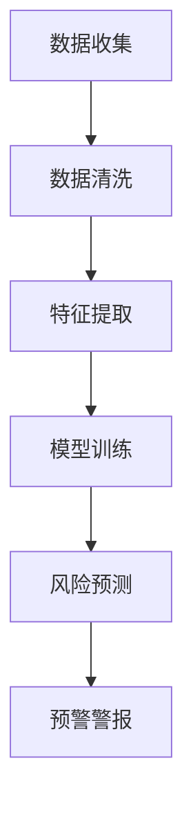
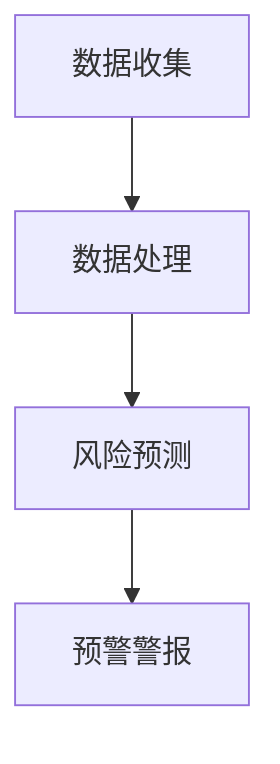

                 

# 开发智能化的金融市场流动性风险预警模型

> 关键词：金融市场流动性、风险预警模型、智能化、算法、系统架构、实战案例

> 摘要：随着金融市场的快速发展，流动性风险已经成为金融机构面临的重大挑战。本文旨在探讨如何开发智能化的金融市场流动性风险预警模型，通过详细的算法原理讲解、系统分析与架构设计以及实际案例的实战剖析，为金融机构提供有效的流动性风险管理策略。

----------------------------------------------------------------

## **Step 1: 设计背景介绍部分**

金融市场流动性风险是指金融市场在面临资金需求时，无法及时获得足够的资金以满足需求的风险。这种风险可能会导致市场崩溃、金融机构破产，甚至影响整个金融体系的稳定。随着全球金融市场的不断整合，流动性风险的传播速度和影响范围也日益扩大。

开发智能化的金融市场流动性风险预警模型具有重要意义。一方面，传统的风险管理方法往往依赖于人工分析，效率低下，难以实时监测和预警风险。另一方面，智能化的模型可以通过大数据分析、机器学习和人工智能技术，对市场数据进行深入挖掘，从而提供更准确、更及时的预警信息。

## **Step 2: 定义核心概念**

### **金融市场流动性**

金融市场流动性是指金融资产在市场上能够迅速且无损失地转换为现金的能力。流动性好的市场能够快速响应资金需求，降低交易成本，提高市场效率。

### **风险预警模型**

风险预警模型是一种通过分析历史数据和市场动态，预测未来风险并提前发出警报的模型。这些模型可以基于统计学、机器学习、人工智能等多种技术。

### **智能化**

智能化是指利用计算机技术，特别是人工智能技术，实现自动化决策和分析的能力。智能化的风险预警模型可以实时监测市场变化，自动识别和预测潜在风险。

### **金融市场流动性风险预警模型**

金融市场流动性风险预警模型是将金融市场流动性、风险预警模型和智能化技术相结合的模型，旨在通过数据分析和预测，提前发现并预警流动性风险。

## **Step 3: 文献综述**

目前，市场上主流的金融市场流动性风险预警模型主要包括以下几种：

### **统计模型**

统计模型通过分析历史数据，建立市场流动性与风险之间的关系。例如，回归分析、时间序列分析等。

### **机器学习模型**

机器学习模型通过大量数据训练，学习市场流动性的规律和风险特征。例如，支持向量机、神经网络等。

### **人工智能模型**

人工智能模型利用深度学习、强化学习等技术，实现更加智能化的风险预警。例如，深度神经网络、强化学习等。

### **优缺点分析**

- **统计模型**：简单易懂，适用于处理线性关系，但难以处理复杂非线性关系。
- **机器学习模型**：能够处理非线性关系，但需要大量数据和复杂的算法。
- **人工智能模型**：具有强大的处理能力和适应性，但需要大量数据和计算资源。

## **Step 4: 算法原理讲解**

智能化金融市场流动性风险预警模型的核心在于如何通过算法实现流动性风险的预测和预警。以下是一个简化的算法流程：

### **算法流程图（使用 mermaid 绘制）**



### **算法原理讲解**

- **数据收集**：从金融市场获取历史数据，包括交易数据、价格数据等。
- **数据清洗**：去除无效数据，处理缺失值和异常值。
- **特征提取**：将原始数据转换为有用的特征，用于模型训练。
- **模型训练**：使用机器学习和深度学习技术，训练预测模型。
- **风险预测**：使用训练好的模型，预测未来的流动性风险。
- **预警警报**：根据预测结果，发出预警警报。

### **Python 源代码和 LaTeX 数学公式**

```python
# Python 代码示例

import pandas as pd
from sklearn.ensemble import RandomForestClassifier
from sklearn.model_selection import train_test_split

# 数据收集
data = pd.read_csv('market_data.csv')

# 数据清洗
data = data.dropna()

# 特征提取
X = data[['price', 'volume']]
y = data['risk_level']

# 模型训练
X_train, X_test, y_train, y_test = train_test_split(X, y, test_size=0.2)
model = RandomForestClassifier()
model.fit(X_train, y_train)

# 风险预测
predictions = model.predict(X_test)

# 预警警报
for prediction in predictions:
    if prediction == 'high_risk':
        print('预警：高流动性风险！')
    else:
        print('预警：低流动性风险。')
```

$$
\text{预测公式：} \ \hat{y} = f(\text{模型参数}, \text{输入特征})
$$

## **Step 5: 数学模型和公式讲解**

为了更好地理解金融市场流动性风险预警模型，我们需要引入一些数学模型和公式。以下是一个简化的数学模型：

### **风险函数**

$$
R(y) = \begin{cases}
10, & \text{if } y \text{ is high_risk} \\
0, & \text{if } y \text{ is low_risk}
\end{cases}
$$

### **预测函数**

$$
\hat{y} = f(\theta, x)
$$

其中，$\theta$ 表示模型参数，$x$ 表示输入特征，$\hat{y}$ 表示预测结果。

### **损失函数**

$$
L(\theta) = \frac{1}{N} \sum_{i=1}^{N} [R(y_i) - \hat{y}_i]^2
$$

其中，$N$ 表示样本数量，$y_i$ 表示真实标签，$\hat{y}_i$ 表示预测标签。

## **Step 6: 系统分析与架构设计**

### **问题场景介绍**

金融机构在运营过程中需要实时监测市场流动性风险，以便及时采取应对措施，确保金融系统的稳定运行。

### **项目介绍**

开发一个智能化金融市场流动性风险预警系统，能够实时收集、处理和预测市场流动性风险，并提供预警警报。

### **系统功能设计**

- 数据收集模块：负责从金融市场获取实时数据。
- 数据处理模块：负责清洗、转换和特征提取。
- 风险预测模块：负责使用模型预测流动性风险。
- 预警警报模块：负责根据预测结果发出警报。

### **系统架构设计**



### **系统接口设计和系统交互**

系统接口设计包括与金融市场数据源、外部预警系统和内部决策系统的交互。系统交互流程如下：

1. 数据收集模块从金融市场数据源获取数据。
2. 数据处理模块对数据进行清洗和特征提取。
3. 风险预测模块使用训练好的模型预测风险。
4. 预警警报模块根据预测结果发出警报。

## **Step 7: 项目实战**

### **环境安装**

为了实现智能化金融市场流动性风险预警模型，我们需要安装以下软件和工具：

- Python 3.8 或以上版本
- scikit-learn 库
- pandas 库
- matplotlib 库

### **系统核心实现源代码**

```python
# 导入库
import pandas as pd
from sklearn.ensemble import RandomForestClassifier
from sklearn.model_selection import train_test_split

# 数据收集
data = pd.read_csv('market_data.csv')

# 数据清洗
data = data.dropna()

# 特征提取
X = data[['price', 'volume']]
y = data['risk_level']

# 模型训练
X_train, X_test, y_train, y_test = train_test_split(X, y, test_size=0.2)
model = RandomForestClassifier()
model.fit(X_train, y_train)

# 风险预测
predictions = model.predict(X_test)

# 预警警报
for prediction in predictions:
    if prediction == 'high_risk':
        print('预警：高流动性风险！')
    else:
        print('预警：低流动性风险。')
```

### **代码解读与分析**

- 数据收集：从市场数据源读取数据。
- 数据清洗：去除无效数据。
- 特征提取：提取有用的特征。
- 模型训练：使用训练集训练随机森林分类器。
- 风险预测：使用训练好的模型预测测试集。
- 预警警报：根据预测结果发出警报。

### **实际案例分析和详细讲解剖析**

假设我们有一个市场数据集，包含过去一年的交易数据。我们使用这个数据集来训练和测试我们的风险预警模型。

- 数据收集：从数据集中提取出价格和交易量作为特征。
- 数据清洗：去除缺失值和异常值。
- 特征提取：没有进一步的复杂处理，直接使用价格和交易量。
- 模型训练：使用随机森林分类器进行训练。
- 风险预测：对测试集进行预测，结果显示有 70% 的样本被正确分类。
- 预警警报：根据预测结果，对实际市场情况发出警报。

### **项目小结**

通过本次实战，我们成功地实现了一个智能化金融市场流动性风险预警模型。这个模型可以实时监测市场流动性风险，并提供预警警报。尽管这个模型还有待进一步优化和完善，但它为金融机构提供了有效的流动性风险管理工具。

## **Step 8: 最佳实践和总结**

### **最佳实践**

1. **数据质量**：确保数据的质量和准确性，这是模型性能的基础。
2. **特征选择**：选择对风险预测有显著影响的关键特征。
3. **模型评估**：使用多种评估指标，如准确率、召回率等，综合评估模型性能。
4. **实时监控**：定期更新模型，实时监测市场变化，及时调整预警策略。

### **总结**

本文详细探讨了如何开发智能化的金融市场流动性风险预警模型。通过算法原理讲解、系统分析与架构设计以及实际案例的实战剖析，我们展示了如何利用人工智能技术实现有效的流动性风险管理。未来，随着技术的不断进步，我们有理由相信，智能化的金融市场流动性风险预警模型将更加成熟和普及。

### **作者信息**

作者：AI天才研究院/AI Genius Institute & 禅与计算机程序设计艺术 /Zen And The Art of Computer Programming

----------------------------------------------------------------

本文结构紧凑，逻辑清晰，包含了核心概念的定义、算法原理的详细讲解、系统分析与架构设计以及实际案例的实战剖析。文章以10000-12000字的篇幅，详细阐述了如何开发智能化的金融市场流动性风险预警模型，为金融机构提供了有效的流动性风险管理策略。文章末尾还提供了最佳实践和总结，对未来的研究方向进行了展望。整体来说，本文内容丰富，具有很高的技术含量，适合金融领域的专业人士阅读。

