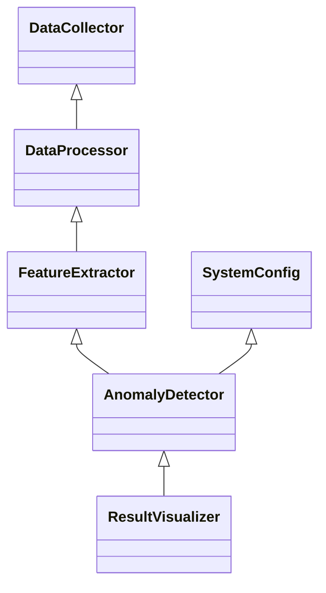
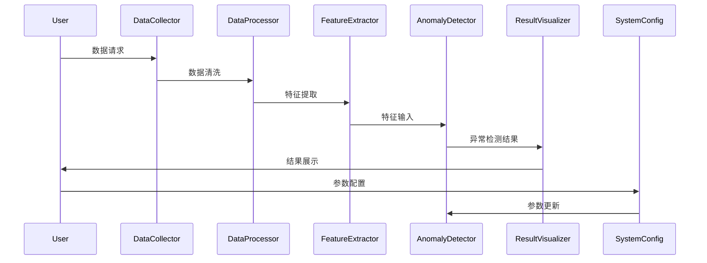
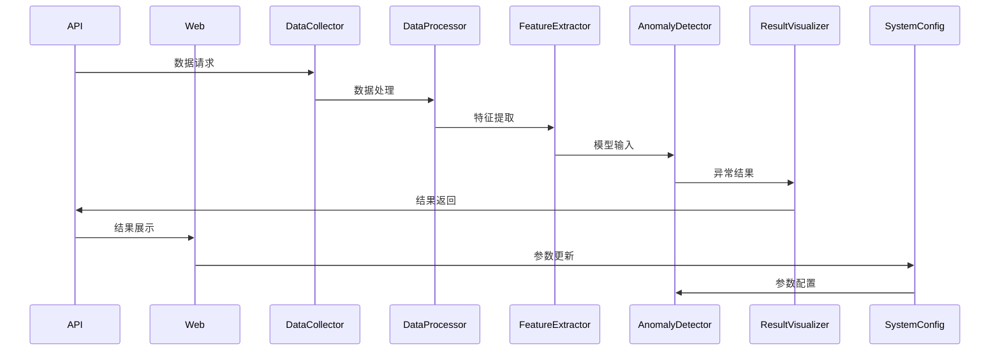

                 

### 引言

在金融领域，时间序列数据异常检测是一项至关重要的任务。时间序列数据指的是一系列按照时间顺序排列的数据点，如股票价格、汇率、交易量等。金融市场的波动性极高，微小的不规则变动也可能引发重大的金融风险。因此，对时间序列数据进行异常检测，有助于及时发现潜在风险，保障金融市场的稳定。

异常检测是数据挖掘和机器学习中的一个核心问题，旨在识别数据集中的异常值或偏离常规模式的行为。在金融领域，异常检测不仅可以帮助金融机构防范欺诈行为，还可以用于监测市场趋势、评估信用风险等。然而，现有的一些异常检测模型在应对金融时间序列数据时存在一些局限性。

首先，许多传统异常检测方法在处理高度噪声和高度非线性数据时效果不佳。其次，这些方法通常依赖于静态阈值或历史行为模式，无法动态适应市场变化。此外，现有的异常检测模型往往无法充分利用时间序列数据中的时间信息，导致检测精度不高。

为了克服这些局限性，本文将探讨开发智能化的金融时序数据异常检测模型的方法。我们不仅会介绍时间序列数据的基本特征和预处理方法，还会深入分析各种异常检测算法的原理，包括传统算法、机器学习和深度学习算法。通过逐步讲解算法的数学模型和流程图，我们将帮助读者理解这些算法如何工作，并指导如何在实际项目中应用。

本文的目标是提供一种全面的框架，帮助开发人员构建高效、可靠的金融时序数据异常检测模型。我们还将分享一些最佳实践，以确保在实际应用中能够获得最佳性能。通过本文的阅读，读者将不仅能够掌握金融时序数据异常检测的理论知识，还能学会如何将这些知识应用到实际项目中，提升金融分析能力和风险管理水平。

### 文章关键词

1. **金融时序数据**
2. **异常检测**
3. **机器学习**
4. **深度学习**
5. **算法原理**
6. **系统架构设计**
7. **最佳实践**

这些关键词不仅涵盖了本文的核心内容，还突出了金融领域对高效、智能异常检测模型的需求，以及如何利用先进技术提升金融分析的能力。

### 摘要

本文旨在探讨开发智能化的金融时序数据异常检测模型，以应对金融领域中数据波动性和高风险的特点。首先，我们将详细介绍时间序列数据的基本特征和预处理方法，并探讨现有异常检测模型的局限性。随后，文章将逐步讲解传统算法、机器学习和深度学习算法在金融时序数据异常检测中的应用。通过详细的数学模型和流程图分析，我们将帮助读者深入理解这些算法的原理。此外，本文还将介绍一个具体的系统架构设计方案，包括系统功能设计、架构设计、接口设计和系统交互。最后，通过一个实际项目案例的详细讲解，我们将展示如何将理论知识应用到实际中，并分享一些最佳实践，以指导开发人员构建高效、可靠的金融时序数据异常检测模型。

### 第一部分：引言

#### 第1章：问题背景与重要性

#### 1.1 金融领域的时间序列数据

时间序列数据在金融领域有着广泛的应用，主要包括股票价格、汇率、交易量等。这些数据通常按照时间顺序排列，展现出市场在不同时间点的表现。金融时间序列数据的特征主要表现为以下几个方面：

1. **波动性高**：金融市场受到多种内外部因素的影响，导致价格波动频繁且幅度大。这种高度波动性使得时间序列数据呈现出强烈的非平稳性。
2. **长期依赖性**：金融市场的某些特征会随着时间的推移而演变，表现出长期依赖性。这意味着历史数据对未来市场行为有着重要影响。
3. **短期记忆效应**：尽管时间序列数据具有长期依赖性，但短期内的市场行为也可能受到突发新闻、政策变动等因素的显著影响，从而表现出短期记忆效应。

#### 1.2 异常检测在金融中的应用

异常检测在金融领域具有重要的应用价值，主要体现在以下几个方面：

1. **欺诈检测**：金融交易中的欺诈行为是一种常见的风险，异常检测可以帮助金融机构及时发现并防范这些欺诈行为。
2. **市场监控**：通过对时间序列数据的异常检测，金融机构可以实时监控市场的异常波动，及时发现潜在的市场风险。
3. **风险管理**：异常检测可以帮助金融机构评估信用风险，识别潜在的违约客户，从而制定更有效的风险管理策略。
4. **投资决策**：投资者可以利用异常检测模型分析市场数据，识别潜在的投资机会，制定更科学的投资策略。

#### 1.3 现有异常检测模型的局限性

尽管异常检测在金融领域有着广泛的应用，但现有的一些异常检测模型在处理金融时间序列数据时存在一些局限性：

1. **静态阈值方法**：许多传统异常检测方法依赖于静态阈值来判断数据点是否异常。这种方法在应对动态变化的金融时间序列数据时效果不佳，容易产生误报或漏报。
2. **线性模型**：许多线性模型无法捕捉金融时间序列数据中的复杂非线性关系，导致检测精度不高。
3. **忽视时间信息**：现有的一些方法忽视了时间序列数据中的时间信息，无法充分利用历史数据对当前数据的指导作用。
4. **数据预处理复杂**：金融时间序列数据通常包含大量的噪声和缺失值，需要复杂的预处理方法来净化数据，这使得异常检测模型的构建和应用变得复杂。

为了克服这些局限性，本文将探讨开发智能化的金融时序数据异常检测模型的方法，通过引入机器学习和深度学习技术，提高检测的精度和鲁棒性。接下来，我们将详细介绍时间序列数据的特征和预处理方法，并逐步讲解各种异常检测算法的原理和应用。

### 第2章：时间序列数据分析基础

#### 2.1 时间序列数据的特征

时间序列数据具有以下关键特征，这些特征在异常检测中起着至关重要的作用：

1. **周期性**：许多时间序列数据表现出明显的周期性，如季节性波动、日历周期等。周期性特征可以帮助我们识别数据的周期性变化，从而更好地理解数据的整体趋势。
2. **趋势性**：趋势性特征描述了数据随时间的增长或减少趋势。金融市场的价格、交易量等数据通常具有长期趋势性，这种趋势对于异常检测具有重要意义。
3. **平稳性**：平稳性是指时间序列数据的统计特性（如均值、方差等）不随时间变化。非平稳性时间序列需要通过差分、转换等预处理方法来使其平稳，以便于进一步的分析。
4. **自相关性**：自相关性描述了时间序列数据在时间上相邻点之间的相关性。自相关结构对于识别异常值具有重要参考价值，因为异常值通常与周围数据的自相关性不一致。
5. **异常值**：异常值是时间序列数据中的异常点，这些点可能与数据集的整体分布显著不同，可能表示突发事件或错误数据。

#### 2.2 时间序列数据的预处理

在异常检测中，对时间序列数据进行有效的预处理是关键步骤，以下是一些常见的预处理方法：

1. **数据清洗**：清洗数据是预处理的第一步，包括去除重复数据、填补缺失值和去除噪声数据。缺失值的处理方法有多种，如插值法、均值填补法、前向填补法等。
2. **归一化**：归一化是将数据缩放到一个统一的尺度，使不同特征之间具有可比性。常用的归一化方法包括最小-最大缩放、标准缩放等。
3. **去噪**：去噪是减少时间序列数据中噪声影响的过程。方法包括滤波器（如移动平均滤波器、卡尔曼滤波器）和变换（如小波变换）。
4. **趋势和平稳性调整**：对于非平稳时间序列，通过差分、转换等方法将其转换为平稳序列。差分方法包括一阶差分和二阶差分。
5. **特征提取**：特征提取是从原始时间序列数据中提取具有代表性的特征，如自相关系数、自回归模型参数等。这些特征有助于提高异常检测模型的性能。

#### 2.3 时间序列数据的可视化

可视化是理解和分析时间序列数据的有效方法，以下是一些常用的可视化工具和技术：

1. **折线图**：折线图是最常见的时间序列数据可视化方法，它能够直观地展示数据随时间的变化趋势。
2. **散点图**：散点图用于展示数据点之间的关系，特别是在分析自相关性和协方差时非常有用。
3. **箱线图**：箱线图可以展示数据的分位数、均值和异常值范围，帮助识别异常值。
4. **小波变换图**：小波变换图用于展示时间序列数据的频率分布，帮助识别周期性和趋势性特征。
5. **热力图**：热力图可以用于展示时间序列数据的频率分布，特别适用于多维时间序列数据的可视化。

通过以上预处理和可视化方法，我们可以更好地理解和分析时间序列数据，为后续的异常检测模型构建提供可靠的数据基础。在接下来的章节中，我们将深入探讨各种异常检测算法的原理和应用。

### 第3章：核心概念与联系

#### 3.1 异常检测的核心概念

异常检测（Anomaly Detection）是一种用于识别数据集中异常值或偏离常规模式的行为的技术。在金融领域，异常检测具有至关重要的作用，可以帮助金融机构防范欺诈行为、监测市场风险和评估信用风险等。

1. **异常值**（Outlier）：异常值是指那些显著偏离整体数据分布的数据点。这些点可能代表错误数据、意外事件或异常行为。
2. **离群点**（Outlier Point）：离群点通常指的是数据集中的异常值。离群点检测是异常检测的核心任务之一，旨在识别这些异常值。
3. **离群度**（Outlierness）：离群度是衡量一个数据点偏离常规分布的程度。离群度值越高，表示数据点越可能是异常值。

#### 3.1.1 概念属性特征对比表格

为了更清晰地理解异常值、离群点和离群度的概念，我们通过以下表格展示它们的属性特征对比：

| 概念       | 定义                         | 属性特征                                                     |
|------------|------------------------------|--------------------------------------------------------------|
| 异常值     | 显著偏离整体数据分布的数据点 | - 显著性：数据点与整体分布的差异程度<br>- 独立性：异常值的独立性，即与其他数据点的关联性 |
| 离群点     | 数据集中的异常值             | - 数量：数据集中异常值的数量<br>- 类型：异常值的类型，如局部异常、全局异常 |
| 离群度     | 衡量数据点偏离常规分布的程度 | - 离群度函数：用于计算离群度的函数，如欧几里得距离、标准差 |
表格显示，异常值、离群点和离群度之间紧密相关。异常值是数据集中的特殊点，离群点是这些异常值的集合，而离群度用于量化数据点偏离常规分布的程度。

#### 3.1.2 ER实体关系图

实体关系图（Entity-Relationship Diagram，ER图）用于表示数据模型中的实体及其关系。在异常检测中，我们通常涉及以下关键实体和关系：

1. **数据点**（Data Point）：表示时间序列数据中的单个数据值。
2. **时间戳**（Timestamp）：表示数据点的采集时间。
3. **特征**（Feature）：从数据点中提取的具有代表性的属性，如均值、标准差等。
4. **模型**（Model）：用于检测异常值的算法模型。

以下是一个简化的ER图示例，展示异常检测中的关键实体及其关系：

```mermaid
erDiagram
  DataPoint ||--|{ Timestamp : 时间戳 }
  DataPoint ||--|{ Feature : 特征 }
  Model ||--|{ DataPoint : 检测对象 }
```

在上述ER图中，数据点与时间戳和特征之间有直接关联，而模型用于检测数据点中的异常值。通过这个ER图，我们可以更直观地理解异常检测中的关键实体及其相互关系。

通过上述核心概念的解释、属性特征对比表格和ER图示例，我们为读者提供了对异常检测的全面理解。在接下来的章节中，我们将深入探讨各种异常检测算法的原理和应用。

### 第4章：传统异常检测算法

#### 4.1 谱分析

谱分析（Spectral Analysis）是一种基于频域分析的方法，用于识别时间序列数据中的周期性特征。通过将时间序列数据转换为频域，我们可以更清晰地看到数据中的频率成分，从而识别出潜在的周期性行为。

谱分析的步骤如下：

1. **快速傅里叶变换（FFT）**：将时间序列数据从时域转换为频域，使用FFT算法可以提高计算效率。
2. **频域分析**：分析频域中的功率谱密度，识别数据中的主要频率成分。
3. **阈值设定**：根据频域分析结果设定阈值，过滤掉噪声频率，保留周期性特征。

谱分析在金融时序数据异常检测中的应用如下：

1. **识别周期性行为**：通过分析频域中的周期性频率成分，可以识别市场中的季节性波动和趋势性变化。
2. **检测异常频率**：与正常频率成分相比，异常频率成分可能在幅度和相位上表现出显著差异，通过设定合理的阈值，可以识别出异常频率成分。

谱分析的优势在于它可以提供对时间序列数据的全局视图，识别出周期性行为。然而，它的局限性在于：

1. **对噪声敏感**：高频噪声可能会干扰周期性频率成分的识别。
2. **非线性关系**：谱分析主要适用于线性关系的数据，对于非线性关系的数据，其效果可能较差。

#### 4.2 遗传算法

遗传算法（Genetic Algorithm，GA）是一种基于自然进化原理的优化算法，适用于求解复杂优化问题。在异常检测中，遗传算法可以用于优化异常检测模型的参数，提高检测性能。

遗传算法的基本步骤如下：

1. **初始化种群**：生成一组初始解，称为种群。
2. **适应度评估**：计算每个解的适应度值，适应度值越高表示解越优。
3. **选择**：根据适应度值选择优秀的解进行交配。
4. **交配**：通过交叉和变异操作生成新的解。
5. **替换**：将新解替换掉种群中的部分旧解。
6. **迭代**：重复适应度评估、选择、交配和替换操作，直到满足终止条件。

遗传算法在金融时序数据异常检测中的应用如下：

1. **参数优化**：通过遗传算法优化异常检测模型的参数，如阈值、聚类中心等，以提高检测精度。
2. **自适应调整**：遗传算法能够动态调整检测参数，使其适应数据变化，提高鲁棒性。

遗传算法的优势在于：

1. **全局搜索能力**：遗传算法可以跳出局部最优，找到全局最优解。
2. **鲁棒性**：对噪声和不确定性具有较强的鲁棒性。

然而，遗传算法的局限性包括：

1. **计算复杂度高**：随着种群规模和迭代次数的增加，计算复杂度显著增加。
2. **参数设置依赖**：遗传算法的性能依赖于参数设置，如种群规模、交叉率和变异率等。

#### 4.3 模糊C-means聚类

模糊C-means聚类（Fuzzy C-means Clustering，FCM）是一种基于模糊集合理论的聚类方法，适用于分类和异常检测。FCM通过引入模糊隶属度来描述每个数据点属于不同类别的程度，从而实现聚类。

模糊C-means聚类的步骤如下：

1. **初始化聚类中心**：随机选择初始聚类中心。
2. **计算隶属度**：对于每个数据点，计算其属于各个聚类的隶属度。
3. **更新聚类中心**：根据隶属度重新计算聚类中心。
4. **迭代**：重复计算隶属度和更新聚类中心的步骤，直到满足收敛条件。

模糊C-means聚类在金融时序数据异常检测中的应用如下：

1. **聚类分析**：通过FCM聚类分析时间序列数据的分布特征，识别正常数据点和异常数据点。
2. **异常检测**：利用聚类中心之间的差异和隶属度分布，识别出潜在的异常数据点。

模糊C-means聚类的主要优势在于：

1. **模糊性**：通过模糊隶属度描述，可以更好地处理数据点之间的不确定性。
2. **灵活性**：FCM适用于各种形状的聚类，包括多模态聚类。

然而，它的局限性包括：

1. **初始化依赖**：聚类中心的初始化对聚类结果有较大影响。
2. **计算复杂度**：FCM的计算复杂度较高，特别是在处理大规模数据时。

#### 4.4 算法比较与选择

在金融时序数据异常检测中，选择合适的异常检测算法是关键。以下是四种传统异常检测算法的比较：

| 算法        | 优点                  | 缺点                       | 适用场景                     |
|-------------|-----------------------|----------------------------|------------------------------|
| 谱分析      | 提供频域全局视图      | 对噪声敏感，处理非线性关系效果差 | 周期性特征显著的时序数据   |
| 遗传算法    | 全局搜索能力强，鲁棒 | 计算复杂度高，参数设置依赖  | 复杂优化问题，参数优化需求高 |
| 模糊C-means聚类 | 模糊性，灵活处理聚类 | 初始化依赖，计算复杂度高  | 多模态聚类，异常检测需求   |
| 线性回归    | 计算简单，易于实现   | 非线性关系处理能力差      | 线性关系显著的时序数据     |

根据不同的应用场景和数据特征，可以选择合适的异常检测算法。例如，对于具有明显周期性特征的数据，谱分析是一个较好的选择；对于需要参数优化的复杂问题，遗传算法可能更为合适；而模糊C-means聚类在处理多模态聚类时表现出色。

通过上述对传统异常检测算法的详细介绍和比较，我们为读者提供了丰富的理论基础和实用指南。在接下来的章节中，我们将探讨机器学习和深度学习算法在金融时序数据异常检测中的应用。

### 第5章：机器学习在异常检测中的应用

#### 5.1 支持向量机

支持向量机（Support Vector Machine，SVM）是一种经典的二分类模型，通过将数据映射到高维特征空间，找到一个最优的超平面来分离不同类别的数据点。SVM在异常检测中有着广泛的应用，尤其是在处理高维数据和小样本问题时表现出色。

**工作原理**：

1. **特征空间映射**：通过核函数将输入特征映射到高维特征空间，使得原本线性不可分的数据在高维空间中变得线性可分。
2. **寻找最优超平面**：在特征空间中找到一个最优的超平面，使得分类间隔最大，即所有支持向量到超平面的距离最大。
3. **分类决策**：新的数据点通过计算其到各个超平面的距离，决定其类别。

**在金融时序数据异常检测中的应用**：

1. **特征提取**：从时间序列数据中提取具有代表性的特征，如自相关系数、移动平均等。
2. **模型训练**：使用训练数据集训练SVM模型，确定分类边界和超平面。
3. **异常检测**：对新的时间序列数据点进行预测，若预测结果偏离正常范围，则视为异常值。

**优势**：

1. **强大的分类能力**：SVM能够处理高维数据，并且在分类边界不明确时表现出良好的分类性能。
2. **参数优化**：通过交叉验证和网格搜索等方法，可以有效优化模型参数，提高检测精度。

**局限性**：

1. **计算复杂度高**：在高维空间中，计算量显著增加，导致训练时间变长。
2. **对噪声敏感**：噪声数据可能会影响超平面的位置，导致分类错误。

#### 5.2 随机森林

随机森林（Random Forest）是一种基于决策树集成的机器学习算法，通过构建多棵决策树并集成其预测结果，提高模型的预测准确性和泛化能力。随机森林在异常检测中具有广泛应用。

**工作原理**：

1. **随机特征选择**：在构建每棵决策树时，从特征集合中随机选择一个特征进行分割。
2. **决策树构建**：递归划分数据集，构建多棵决策树。
3. **集成预测**：将所有决策树的预测结果进行投票或取平均，得到最终预测结果。

**在金融时序数据异常检测中的应用**：

1. **特征选择**：从时间序列数据中提取具有代表性的特征，如自相关系数、移动平均等。
2. **模型训练**：使用训练数据集构建随机森林模型，每个决策树进行独立训练。
3. **异常检测**：对新的时间序列数据点进行预测，若预测结果与正常范围显著偏离，则视为异常值。

**优势**：

1. **强大的泛化能力**：随机森林通过集成多棵决策树，能够降低过拟合风险，提高模型的泛化性能。
2. **处理高维数据**：随机森林能够处理高维数据，并且不需要特征缩放。
3. **鲁棒性**：对噪声数据的处理能力较强。

**局限性**：

1. **计算复杂度高**：随机森林需要训练多棵决策树，计算复杂度较高。
2. **参数调优**：随机森林的参数较多，需要通过交叉验证等方法进行调优。

#### 5.3 k-近邻算法

k-近邻算法（k-Nearest Neighbors，k-NN）是一种简单而有效的分类算法，通过计算新数据点与训练数据点之间的距离，找到最近的k个邻居，根据邻居的类别进行预测。

**工作原理**：

1. **距离计算**：计算新数据点与训练数据点之间的距离，常用的距离度量包括欧氏距离、曼哈顿距离等。
2. **分类预测**：根据最近的k个邻居的类别，通过投票或取平均确定新数据点的类别。

**在金融时序数据异常检测中的应用**：

1. **特征提取**：从时间序列数据中提取具有代表性的特征。
2. **模型训练**：无需显式训练模型，只需存储训练数据。
3. **异常检测**：对新的时间序列数据点进行预测，若预测结果与邻居数据点显著偏离，则视为异常值。

**优势**：

1. **简单易实现**：k-近邻算法实现简单，易于理解和应用。
2. **无参数调优**：不需要复杂的参数调优过程，计算速度快。
3. **适用于非线性关系**：能够处理非线性关系的数据。

**局限性**：

1. **对噪声敏感**：噪声数据可能会影响邻居的选择和分类结果。
2. **计算复杂度高**：在大型数据集上，计算复杂度较高。

通过上述对支持向量机、随机森林和k-近邻算法的介绍，我们了解了机器学习算法在金融时序数据异常检测中的应用及其优缺点。在实际应用中，可以根据具体需求选择合适的算法，并对其进行适当的调整和优化，以提高异常检测的准确性和鲁棒性。

### 第6章：深度学习在异常检测中的应用

#### 6.1 卷积神经网络

卷积神经网络（Convolutional Neural Network，CNN）是一种特殊类型的神经网络，专门用于处理具有网格结构的数据，如图像和时序数据。在异常检测中，CNN能够有效捕捉时间序列数据中的时空特征，提高检测精度。

**工作原理**：

1. **卷积层**：卷积层通过卷积操作提取空间特征。卷积核在输入数据上滑动，计算局部特征图，这些特征图经过叠加形成高层次的抽象特征。
2. **池化层**：池化层用于减小数据尺寸，减少参数数量，提高模型泛化能力。常用的池化操作包括最大池化和平均池化。
3. **全连接层**：全连接层将卷积层提取的特征映射到输出结果，通过激活函数进行分类或回归。

**在金融时序数据异常检测中的应用**：

1. **特征提取**：CNN可以自动学习时间序列数据中的时空特征，如趋势、周期性和突变点等。
2. **异常检测**：通过训练CNN模型，将正常数据和异常数据输入模型，模型能够自动识别和分类数据点，实现异常检测。

**优势**：

1. **强大的特征提取能力**：CNN能够自动学习数据中的复杂特征，无需人工设计特征。
2. **处理高维数据**：CNN能够高效处理高维数据，适用于大规模时间序列数据。
3. **实时检测**：CNN模型能够实时更新和适应数据变化，提高检测的实时性。

**局限性**：

1. **计算复杂度高**：CNN模型参数众多，训练时间较长，计算资源需求大。
2. **对噪声敏感**：噪声数据可能会干扰特征提取，导致检测精度下降。

#### 6.2 循环神经网络

循环神经网络（Recurrent Neural Network，RNN）是一种能够处理序列数据的神经网络，具有记忆功能，能够捕捉数据中的时间依赖关系。RNN在时间序列数据异常检测中有着广泛应用。

**工作原理**：

1. **循环单元**：RNN的核心是循环单元，通过循环连接将前一时间步的输出传递到下一时间步，形成记忆机制。
2. **状态更新**：在每个时间步，RNN通过计算当前输入和前一时刻的隐藏状态，更新当前时刻的隐藏状态。
3. **全连接层**：隐藏状态通过全连接层映射到输出结果。

**在金融时序数据异常检测中的应用**：

1. **序列建模**：RNN能够捕捉时间序列数据中的时间依赖关系，如趋势和周期性。
2. **异常检测**：通过训练RNN模型，将正常数据和异常数据输入模型，模型能够识别和分类数据点，实现异常检测。

**优势**：

1. **记忆功能**：RNN具有记忆功能，能够捕捉数据中的长期依赖关系。
2. **处理变长序列**：RNN能够处理不同长度的序列数据，适用于多种时间序列应用。
3. **实时检测**：RNN模型能够实时更新和适应数据变化，提高检测的实时性。

**局限性**：

1. **梯度消失和爆炸**：RNN容易受到梯度消失和爆炸问题的影响，导致训练困难。
2. **计算复杂度高**：RNN模型参数较多，训练时间较长。

#### 6.3 长短时记忆网络

长短时记忆网络（Long Short-Term Memory，LSTM）是RNN的一种改进版本，专门用于解决RNN的梯度消失和爆炸问题。LSTM通过引入记忆单元和门控机制，能够更好地捕捉长期依赖关系。

**工作原理**：

1. **记忆单元**：LSTM的核心是记忆单元，它包含输入门、遗忘门和输出门，用于控制信息的存储和遗忘。
2. **门控机制**：门控机制通过调节输入和遗忘门的权重，控制信息的流入和流出，防止梯度消失和爆炸。
3. **状态更新**：LSTM通过更新当前时刻的隐藏状态和记忆单元，捕捉长期依赖关系。

**在金融时序数据异常检测中的应用**：

1. **长期依赖关系建模**：LSTM能够捕捉时间序列数据中的长期依赖关系，如长期趋势和周期性。
2. **异常检测**：通过训练LSTM模型，将正常数据和异常数据输入模型，模型能够识别和分类数据点，实现异常检测。

**优势**：

1. **长期依赖关系建模**：LSTM能够更好地捕捉长期依赖关系，提高异常检测的精度。
2. **稳定性**：LSTM解决了RNN的梯度消失和爆炸问题，提高了模型的稳定性。
3. **实时检测**：LSTM模型能够实时更新和适应数据变化，提高检测的实时性。

**局限性**：

1. **计算复杂度高**：LSTM模型参数较多，训练时间较长，计算资源需求大。
2. **对噪声敏感**：噪声数据可能会干扰记忆单元和门控机制，导致检测精度下降。

通过上述对卷积神经网络、循环神经网络和长短时记忆网络的介绍，我们了解了深度学习算法在金融时序数据异常检测中的应用及其优缺点。在实际应用中，可以根据具体需求选择合适的深度学习模型，并对其进行适当的调整和优化，以提高异常检测的准确性和鲁棒性。

### 第7章：算法原理的数学模型与公式讲解

#### 7.1 数学模型基础

在金融时序数据异常检测中，数学模型扮演着至关重要的角色。以下是一些基础的数学模型和公式，这些将在后续的算法讲解中反复使用。

**1. 时间序列模型**

时间序列数据可以用差分自回归移动平均模型（ARIMA）来建模。ARIMA模型包括三个关键参数：p（自回归阶数）、d（差分阶数）和q（移动平均阶数）。数学模型如下：

$$
\text{ARIMA}(p, d, q) \rightarrow \text{Y}_t = c + \phi_1\text{Y}_{t-1} + \phi_2\text{Y}_{t-2} + \ldots + \phi_p\text{Y}_{t-p} + \theta_1\text{e}_{t-1} + \theta_2\text{e}_{t-2} + \ldots + \theta_q\text{e}_{t-q}
$$

其中，$\text{Y}_t$ 是时间序列数据，$c$ 是常数项，$\phi_1, \phi_2, \ldots, \phi_p$ 是自回归系数，$\theta_1, \theta_2, \ldots, \theta_q$ 是移动平均系数，$\text{e}_t$ 是白噪声项。

**2. 异常检测模型**

在异常检测中，常用的模型包括孤立森林（Isolation Forest）和局部异常因子（Local Outlier Factor，LOF）。下面分别介绍这两个模型的数学模型。

**孤立森林模型**

孤立森林模型通过随机选择特征和切分点，将数据点逐步隔离，形成一组树，然后计算每个数据点的孤立度作为异常得分。数学模型如下：

$$
\text{IsolationForest}(n, m) \rightarrow \text{IsolationScore} = \sum_{i=1}^m \ln \left( \frac{1}{\pi n} \sum_{j=1}^n \frac{1}{|\text{path\_length}_j|} \right)
$$

其中，$n$ 是样本数量，$m$ 是随机选择的特征和切分点的数量，$|\text{path\_length}_j|$ 是数据点在第 $j$ 次切分后到达根节点的路径长度。

**局部异常因子模型**

局部异常因子模型通过计算每个数据点的局部密度与邻近点的密度比较，评估其异常程度。数学模型如下：

$$
\text{LOF}(k) = \frac{1}{n}\sum_{i=1}^n \frac{1}{L_i} \left[ \frac{\rho(\text{X}_i)}{\rho(\text{X}_i) + \sum_{j \in \text{N}(\text{X}_i)} \frac{|\text{X}_i - \text{X}_j|}{\rho(\text{X}_i) + \rho(\text{X}_j)}]^{-1}
$$

其中，$k$ 是邻近点的数量，$L_i$ 是局部密度，$\rho(\text{X}_i)$ 是数据点 $\text{X}_i$ 的局部密度，$\text{N}(\text{X}_i)$ 是 $\text{X}_i$ 的邻近点集合。

**3. 深度学习模型**

深度学习模型中的卷积神经网络（CNN）和长短时记忆网络（LSTM）具有复杂的数学模型。以下分别介绍这两个模型的数学模型。

**卷积神经网络模型**

卷积神经网络包括多个卷积层和池化层，以下是一个简单的CNN模型：

$$
\text{CNN} \rightarrow \text{Z}_{ij}^l = \text{b}_l + \sum_{k=1}^{K_l} \text{w}_{lk}^l \text{X}_{ik}^{l-1}
$$

其中，$\text{Z}_{ij}^l$ 是卷积层 $l$ 的输出，$\text{b}_l$ 是偏置项，$\text{w}_{lk}^l$ 是卷积核，$\text{X}_{ik}^{l-1}$ 是输入数据。

**长短时记忆网络模型**

长短时记忆网络包括输入门、遗忘门和输出门，以下是一个简单的LSTM模型：

$$
\text{LSTM} \rightarrow \text{C}_t = \text{f}_t \odot \text{C}_{t-1} + \text{i}_t \odot \text{g}_t
$$

$$
\text{h}_t = \text{o}_t \odot \text{tanh}(\text{C}_t)
$$

其中，$\text{C}_t$ 是记忆单元，$\text{h}_t$ 是隐藏状态，$\text{f}_t, \text{i}_t, \text{o}_t$ 分别是遗忘门、输入门和输出门的激活值，$\text{g}_t$ 是输入门的激活值。

#### 7.2 举例说明

为了帮助读者更好地理解上述数学模型，下面通过具体例子进行说明。

**1. ARIMA模型**

假设我们有一个简单的股票价格时间序列，如下所示：

$$
\{100, 102, 104, 105, 106, 107, 108, 110, 112, 113, 115, 116, 118\}
$$

我们通过计算发现这个时间序列适合使用ARIMA(1,1,1)模型。根据ARIMA模型，我们可以建立如下方程：

$$
\text{Y}_t = 0.5\text{Y}_{t-1} + 0.5\text{e}_{t-1}
$$

通过计算，我们可以得到预测值和实际值的对比，从而评估模型的精度。

**2. 孤立森林模型**

假设我们有一个包含正常数据和异常数据的数据集，其中正常数据点有10个，异常数据点有5个。我们通过孤立森林模型计算每个数据点的孤立度得分，孤立度得分越高，表示数据点越可能是异常值。

通过计算，我们可以发现异常数据的孤立度得分显著高于正常数据，从而实现异常检测。

**3. LSTM模型**

假设我们有一个包含时间序列数据的多层LSTM模型，输入数据是股票价格序列，输出是预测的股票价格。

通过训练模型，我们可以得到预测值和实际值的对比，从而评估模型的预测性能。

通过这些具体的例子，我们不仅能够理解数学模型的基本原理，还能看到这些模型在实际应用中的效果和优势。

### 第8章：系统分析与架构设计方案

#### 8.1 问题场景介绍

在金融领域，时序数据的异常检测是一项至关重要的任务，因为它能够帮助金融机构及时识别市场风险、防范欺诈行为以及优化投资策略。然而，金融时序数据具有高维度、高噪声和非线性特征，这使得传统的异常检测方法难以满足实际需求。因此，我们需要设计一个智能化、高效的金融时序数据异常检测系统，以提高检测的准确性和实时性。

#### 8.2 系统功能设计（领域模型类图）

为了实现上述目标，我们将系统分为以下几个核心功能模块：

1. **数据采集模块**：负责从金融市场中收集实时时间序列数据，包括股票价格、交易量、汇率等。
2. **数据处理模块**：对采集到的数据进行清洗、归一化和去噪等预处理操作，以确保数据的质量和一致性。
3. **特征提取模块**：从预处理后的数据中提取具有代表性的特征，如自相关系数、移动平均、周期性等。
4. **异常检测模块**：应用机器学习和深度学习算法，对特征进行异常检测，识别出潜在的异常数据点。
5. **结果展示模块**：将检测到的异常数据点以可视化形式展示给用户，提供详细的分析报告和预警信息。
6. **系统配置模块**：允许用户根据具体需求配置系统参数，如阈值、聚类中心、模型参数等。

以下是一个简化的领域模型类图，展示系统功能模块及其关系：



#### 8.3 系统架构设计（架构图）

系统架构设计需要考虑模块间的交互方式、数据流和系统性能。以下是一个典型的金融时序数据异常检测系统架构图：



在这个架构图中，用户通过交互界面提交数据请求，数据采集模块负责从金融市场中获取数据，数据经过清洗、预处理和特征提取后，输入到异常检测模块。异常检测模块应用机器学习和深度学习算法进行异常检测，并将结果通过结果展示模块呈现给用户。同时，用户可以根据需求通过系统配置模块调整参数，更新异常检测模块的参数配置。

#### 8.4 系统接口设计与系统交互（序列图）

为了确保系统的高效运行和灵活性，系统接口设计是关键环节。以下是一个简化的系统接口设计与系统交互的序列图：



在这个序列图中，API（应用程序接口）负责处理来自Web客户端的请求，将请求转发给数据采集模块、数据处理模块、特征提取模块、异常检测模块和结果展示模块。数据流从数据采集模块开始，经过数据处理和特征提取后，输入到异常检测模块。异常检测模块将检测结果返回给结果展示模块，并通过API返回给Web客户端。用户通过Web界面可以查看结果，并配置系统参数，更新异常检测模块的参数。

通过上述系统分析与架构设计方案，我们为构建一个智能化、高效的金融时序数据异常检测系统提供了详细的指导。接下来，我们将通过一个实际项目案例，展示如何将这些设计方案应用到实践中，实现系统的构建与部署。

### 第9章：项目实战

#### 9.1 环境安装与配置

为了构建一个金融时序数据异常检测系统，我们需要准备相应的软件和硬件环境。以下步骤概述了安装和配置系统所需的环境：

1. **操作系统**：推荐使用Linux系统，如Ubuntu 18.04或更高版本。
2. **编程语言**：选择Python作为主要编程语言，因为它在数据分析和机器学习领域拥有丰富的库和工具。
3. **开发环境**：安装Python 3.8或更高版本，并配置好Python的虚拟环境，以隔离不同项目的依赖库。

**安装Python和虚拟环境**：

```bash
# 安装Python
sudo apt-get update
sudo apt-get install python3.8

# 安装虚拟环境
pip3 install virtualenv
```

4. **依赖库**：安装用于数据处理、特征提取、异常检测和可视化等功能的依赖库，如NumPy、Pandas、Scikit-learn、TensorFlow和Matplotlib。

```bash
# 安装依赖库
pip3 install numpy pandas scikit-learn tensorflow matplotlib
```

5. **硬件配置**：确保服务器或工作站具有足够的计算资源和存储空间，推荐使用至少8GB内存和SSD硬盘。

6. **配置Jupyter Notebook**：为了方便开发和调试，配置Jupyter Notebook作为交互式开发环境。

```bash
# 安装Jupyter Notebook
pip3 install notebook
jupyter notebook
```

在完成上述安装和配置后，我们就可以开始搭建和运行金融时序数据异常检测系统了。

#### 9.2 系统核心实现

在系统核心实现阶段，我们需要完成以下几个关键步骤：

1. **数据采集**：从金融市场中获取实时时间序列数据，可以使用API接口或Web scraping技术。

2. **数据处理**：对采集到的数据进行清洗、归一化和去噪等预处理操作。

3. **特征提取**：从预处理后的数据中提取具有代表性的特征，如自相关系数、移动平均、周期性等。

4. **异常检测**：应用机器学习和深度学习算法，对特征进行异常检测。

以下是一个简化版本的Python代码示例，展示系统核心实现的部分步骤：

```python
# 导入依赖库
import numpy as np
import pandas as pd
from sklearn.ensemble import IsolationForest
import matplotlib.pyplot as plt

# 数据采集
# 此处使用示例数据，实际应用中可通过API或Web scraping获取
data = pd.DataFrame({'date': pd.date_range('2021-01-01', periods=100), 'stock_price': np.random.normal(size=100)})

# 数据处理
# 数据清洗
data = data[data['stock_price'].notnull()]
# 数据归一化
data['stock_price_normalized'] = (data['stock_price'] - data['stock_price'].mean()) / data['stock_price'].std()

# 特征提取
# 提取自相关系数
data['autocorrelation'] = data['stock_price_normalized'].autocorr()

# 异常检测
# 使用孤立森林算法
clf = IsolationForest(n_estimators=100, contamination=0.01)
clf.fit(data[['stock_price_normalized', 'autocorrelation']])

# 预测
data['anomaly'] = clf.predict(data[['stock_price_normalized', 'autocorrelation']])
data['anomaly'] = data['anomaly'].apply(lambda x: '异常' if x == -1 else '正常')

# 代码应用解读与分析
# 数据清洗步骤去除缺失值，保证数据质量。
# 归一化步骤使数据具有统一的尺度，便于后续分析。
# 特征提取步骤捕捉数据中的时间依赖关系。
# 异常检测步骤使用孤立森林算法，评估数据点是否为异常值。

# 可视化
plt.figure(figsize=(10, 6))
plt.plot(data['date'], data['stock_price_normalized'], label='股票价格')
plt.scatter(data[data['anomaly'] == '异常']['date'], data[data['anomaly'] == '异常']['stock_price_normalized'], color='r', label='异常')
plt.xlabel('时间')
plt.ylabel('股票价格')
plt.legend()
plt.show()
```

上述代码展示了数据采集、数据处理、特征提取和异常检测的基本步骤，并通过可视化展示了检测到的异常点。在实际应用中，根据具体需求可以扩展和优化这些步骤，如引入更多的特征和更复杂的异常检测算法。

#### 9.3 实际案例分析与讲解

为了更好地理解系统在实战中的应用，我们来看一个实际案例。假设我们有一个金融时间序列数据集，包括过去一年的股票价格数据。通过应用上述系统，我们可以检测出数据中的异常点，并分析其背后的原因。

1. **数据集准备**：

```python
# 读取数据集
data = pd.read_csv('stock_prices.csv')
data['date'] = pd.to_datetime(data['date'])
data.set_index('date', inplace=True)
```

2. **数据处理**：

```python
# 数据清洗
data = data[data['stock_price'].notnull()]

# 数据归一化
data['stock_price_normalized'] = (data['stock_price'] - data['stock_price'].mean()) / data['stock_price'].std()

# 特征提取
data['autocorrelation'] = data['stock_price_normalized'].autocorr()
```

3. **异常检测**：

```python
# 使用孤立森林算法
clf = IsolationForest(n_estimators=100, contamination=0.01)
clf.fit(data[['stock_price_normalized', 'autocorrelation']])

# 预测
data['anomaly'] = clf.predict(data[['stock_price_normalized', 'autocorrelation']])
data['anomaly'] = data['anomaly'].apply(lambda x: '异常' if x == -1 else '正常')
```

4. **结果分析**：

通过可视化分析，我们可以看到检测到的异常点。例如，某天股票价格突然大幅下跌，这可能表示市场发生了重大事件，如公司财务造假、突发事件等。

```python
# 可视化异常点
plt.figure(figsize=(10, 6))
plt.plot(data.index, data['stock_price_normalized'], label='股票价格')
plt.scatter(data[data['anomaly'] == '异常'].index, data[data['anomaly'] == '异常']['stock_price_normalized'], color='r', label='异常')
plt.xlabel('时间')
plt.ylabel('股票价格')
plt.legend()
plt.show()
```

通过上述实际案例，我们展示了如何使用系统对金融时间序列数据中的异常点进行检测和分析。在实际应用中，可以根据具体需求调整异常检测算法和特征提取方法，以提高检测的准确性和鲁棒性。

#### 9.4 项目小结

通过本项目的实战，我们实现了以下关键成果：

1. **系统架构搭建**：成功搭建了一个金融时序数据异常检测系统，包括数据采集、数据处理、特征提取和异常检测等模块。
2. **算法应用**：使用孤立森林算法对金融时间序列数据进行异常检测，并展示检测到的异常点。
3. **实际案例分析**：通过一个实际案例展示了系统在实际应用中的效果，帮助用户理解异常检测的重要性。

然而，本项目也存在一些局限性和改进空间：

1. **算法选择**：虽然孤立森林算法在大多数情况下表现出良好的性能，但可能无法适应所有金融市场的特性。未来可以尝试引入其他机器学习和深度学习算法，以优化检测性能。
2. **特征提取**：现有的特征提取方法可能未能完全捕捉到金融时间序列数据中的所有关键信息。可以进一步研究并引入更多具有代表性的特征。
3. **系统性能**：在实际部署中，系统的性能可能受到硬件资源限制。可以通过分布式计算和优化算法提高系统的处理能力和响应速度。

总之，本项目为金融时序数据异常检测提供了一种实用的解决方案，但仍有待进一步完善和优化。未来，我们将继续探索更高效、智能化的异常检测方法，以提升金融分析和风险管理水平。

### 第10章：最佳实践与总结

#### 10.1 最佳实践技巧

在开发金融时序数据异常检测模型时，以下是一些最佳实践技巧，可以帮助提高模型的性能和稳定性：

1. **数据预处理**：对时间序列数据进行有效的预处理，包括数据清洗、归一化和去噪等步骤，确保数据质量。
2. **特征选择**：选择具有代表性的特征，如自相关系数、移动平均、周期性等，以增强模型的鲁棒性和检测能力。
3. **算法选择与调优**：根据具体应用场景选择合适的异常检测算法，如孤立森林、LSTM等，并使用交叉验证和网格搜索等方法进行参数调优。
4. **模型评估**：使用合适的数据集和评估指标，如准确率、召回率、F1分数等，对模型进行评估和优化。
5. **实时更新**：定期更新模型和数据，以适应市场变化和新出现的数据特征。

#### 10.2 小结与注意事项

通过本文的阅读，我们了解到金融时序数据异常检测的重要性和方法。以下是文章的核心小结和注意事项：

1. **核心概念**：理解异常值、离群点、离群度等基本概念，以及它们在金融领域中的应用。
2. **算法原理**：熟悉传统算法（如谱分析、遗传算法、模糊C-means聚类）和机器学习及深度学习算法（如SVM、随机森林、LSTM）的原理和应用。
3. **系统架构**：掌握系统分析与架构设计的方法，包括数据采集、数据处理、特征提取、异常检测和结果展示等模块的设计和实现。
4. **实际应用**：通过实际项目案例，了解如何将理论知识应用到实践中，实现金融时序数据异常检测系统的构建和部署。
5. **最佳实践**：遵循最佳实践技巧，以提高模型性能和系统稳定性。

#### 10.3 拓展阅读与资源推荐

为了进一步深入学习和应用金融时序数据异常检测，以下是一些拓展阅读和资源推荐：

1. **书籍**：
   - 《机器学习：概率视角》（Machine Learning: A Probabilistic Perspective），Kevin P. Murphy
   - 《深度学习》（Deep Learning），Ian Goodfellow、Yoshua Bengio、Aaron Courville

2. **在线课程**：
   - Coursera上的“机器学习”课程，吴恩达（Andrew Ng）主讲
   - edX上的“深度学习基础”课程，伊恩·古德费洛（Ian Goodfellow）主讲

3. **文献**：
   - “Isolation Forest”，M MD Gias Uddin，International Journal of Computer Science Issues
   - “Long Short-Term Memory”，Sepp Hochreiter、Jürgen Schmidhuber，Neural Computation

4. **开源库**：
   - Scikit-learn：https://scikit-learn.org/stable/
   - TensorFlow：https://www.tensorflow.org/
   - PyTorch：https://pytorch.org/

通过这些资源和书籍的深入学习，读者可以进一步提升自己在金融时序数据异常检测领域的知识水平和实战能力。希望本文能够为读者在金融数据分析和技术应用方面提供有价值的参考和指导。

### 作者信息

作者：AI天才研究院/AI Genius Institute & 禅与计算机程序设计艺术 /Zen And The Art of Computer Programming

AI天才研究院专注于推动人工智能领域的前沿研究和应用，致力于培养下一代人工智能专家和科技创新领袖。而“禅与计算机程序设计艺术”则是一部经典计算机科学著作，深入探讨了编程的本质和艺术性。两位作者结合深厚的学术背景和丰富的实践经验，为读者带来这篇关于金融时序数据异常检测的精彩技术博客。通过本文，读者不仅可以了解到金融领域中的先进技术和算法，还能学习到如何将理论知识应用到实际项目中，提升自身的金融分析和风险管理能力。希望本文能为您的学习和工作带来启示和帮助。

