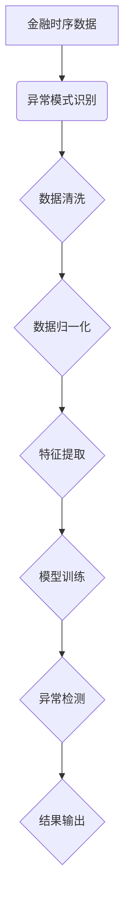
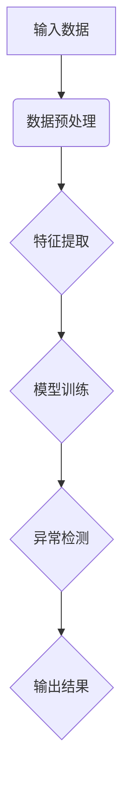
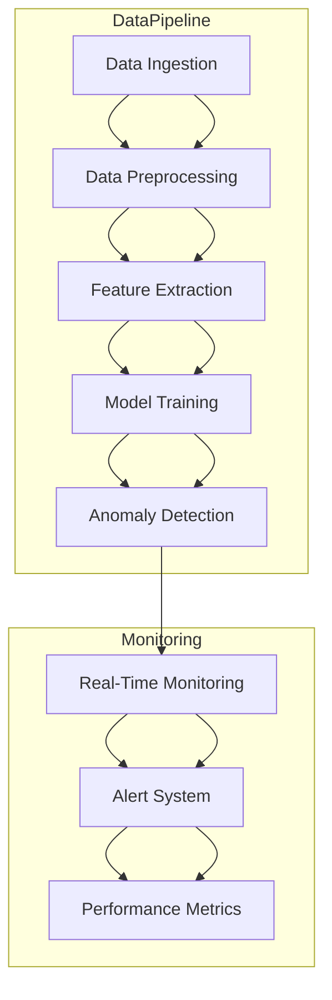
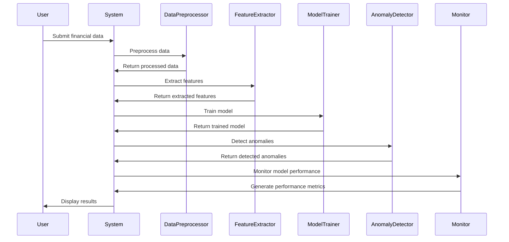

                 

### 《开发智能化的金融时序数据异常模式识别模型》

> 关键词：金融时序数据、异常模式识别、智能化、深度学习、模型构建与优化

> 摘要：本文将深入探讨开发智能化金融时序数据异常模式识别模型的过程。首先，我们将介绍金融时序数据及其在金融决策中的重要性，以及异常模式识别的基本概念。接着，我们将逐步剖析构建智能化异常模式识别模型所需的关键步骤，包括数据预处理、特征工程、传统算法与深度学习算法的应用，以及模型优化策略。最后，我们将通过实际案例展示模型的开发与评估过程，并提供未来发展趋势的展望。

### 目录大纲

```markdown
# 《开发智能化的金融时序数据异常模式识别模型》目录大纲

## 第一部分：背景与概述

### 第1章：金融时序数据与异常模式识别概述

- 1.1 金融时序数据的重要性
- 1.2 异常模式识别的基本概念
- 1.3 当前异常模式识别技术的挑战

## 第二部分：智能化异常模式识别模型构建

### 第2章：数据预处理与特征工程

- 2.1 金融时序数据的预处理
- 2.2 特征提取与选择
- 2.3 特征重要性分析

### 第3章：传统异常检测算法介绍

- 3.1 统计学方法
- 3.2 模式识别方法
- 3.3 传统方法在金融领域的应用与局限性

### 第4章：深度学习方法在异常模式识别中的应用

- 4.1 深度学习基础
- 4.2 基于深度学习的异常检测算法
- 4.3 深度学习方法在金融领域的案例分析

### 第5章：集成学习方法与优化策略

- 5.1 集成学习方法
- 5.2 集成学习方法在异常模式识别中的应用
- 5.3 模型优化策略

## 第三部分：实战与优化

### 第6章：智能异常模式识别模型开发

- 6.1 开发环境与工具
- 6.2 模型开发流程
- 6.3 实际案例分析与代码实现

### 第7章：模型评估与性能优化

- 7.1 评估指标与方法
- 7.2 性能优化策略
- 7.3 模型部署与监控

## 第四部分：总结与展望

### 第8章：智能异常模式识别模型的未来发展趋势

- 8.1 人工智能与金融的深度融合
- 8.2 未来发展方向与挑战
- 8.3 总结与展望
```

### 第一部分：背景与概述

#### 第1章：金融时序数据与异常模式识别概述

**1.1 金融时序数据的重要性**

金融时序数据是指在一段时间内收集的金融市场的价格、交易量、利率等数据。这类数据具有重要的动态特性，能够反映市场趋势和风险变化。金融时序数据的准确性和及时性对于投资决策、风险管理、宏观经济预测等至关重要。例如，在股票市场中，价格和交易量的时序数据可以帮助投资者识别市场趋势，制定买卖策略；在利率市场中，利率的时序数据有助于预测未来的货币政策，指导债券投资。

**1.2 异常模式识别的基本概念**

异常模式识别是指通过分析大量数据，识别出其中异常或不符合常规的行为或模式。在金融领域，异常模式识别用于检测欺诈交易、市场操纵、风险事件等。异常可以是价格波动异常、交易行为异常、利率异常等。异常检测算法通常基于统计学方法、机器学习算法和深度学习算法。

**1.3 当前异常模式识别技术的挑战**

尽管异常模式识别技术在金融领域已有广泛应用，但仍面临以下挑战：

- **数据质量与噪声问题**：金融时序数据通常存在噪声和缺失值，影响模型准确性。
- **模型复杂性与可解释性**：深度学习等复杂模型在处理金融时序数据时效果较好，但模型内部决策过程往往难以解释，不利于监管合规。
- **实时性与计算资源**：金融市场的变化速度极快，要求异常检测模型具备实时性，这对计算资源提出了高要求。

#### 第2章：数据预处理与特征工程

**2.1 金融时序数据的预处理**

数据预处理是构建异常模式识别模型的重要步骤。首先，需要对数据进行清洗，去除噪声和异常值。其次，进行数据归一化，使数据在不同特征之间保持一致。此外，时间序列分解可以分离出趋势、季节性和周期性成分，为后续特征提取提供基础。

**2.2 特征提取与选择**

特征提取是将原始数据转化为更适合模型处理的表示。对于金融时序数据，常见的特征包括价格指标（如移动平均、波动率）、交易量指标（如成交量、换手率）和技术指标（如MACD、RSI）。特征选择则是在提取的特征中筛选出对模型性能有显著影响的特征，避免过拟合和计算复杂度。

**2.3 特征重要性分析**

特征重要性分析用于评估不同特征对模型性能的影响。常用的方法包括基于模型的特征重要性（如随机森林的特征重要性得分）和基于数据的特征重要性（如主成分分析）。通过特征重要性分析，可以优化模型性能，提高模型的可解释性。

#### 第3章：传统异常检测算法介绍

**3.1 统计学方法**

统计学方法是一种基于概率论的异常检测技术。常见的统计方法包括Z-score方法和IQR方法。Z-score方法通过计算数据点到均值的标准化距离来识别异常值。IQR方法则通过计算第1四分位数和第3四分位数之间的距离来确定异常范围。

**3.2 模式识别方法**

模式识别方法是一种基于分类和聚类的异常检测技术。聚类分析（如K-means聚类）可以将数据分为不同的簇，簇中心附近的点被认为是正常值，远离簇中心的点被认为是异常值。模式分类器（如支持向量机、朴素贝叶斯）则通过训练分类模型来识别异常。

**3.3 传统方法在金融领域的应用与局限性**

传统异常检测算法在金融领域有广泛应用，如银行交易欺诈检测、市场操纵检测等。然而，这些方法往往存在以下局限性：

- **对噪声敏感**：传统方法通常对噪声和异常值敏感，容易受到噪声干扰。
- **模型可解释性差**：传统方法通常难以解释内部决策过程，不利于监管合规。
- **实时性差**：传统方法在处理大量实时数据时性能较差。

#### 第4章：深度学习方法在异常模式识别中的应用

**4.1 深度学习基础**

深度学习是一种基于多层神经网络的机器学习技术，能够自动学习数据的复杂特征。常见的深度学习结构包括卷积神经网络（CNN）、循环神经网络（RNN）和长短时记忆网络（LSTM）。深度学习优化方法如反向传播算法和Adam优化器等，用于训练深度学习模型。

**4.2 基于深度学习的异常检测算法**

基于深度学习的异常检测算法包括自编码器（Autoencoder）和卷积神经网络（CNN）。自编码器通过编码器和解码器自动学习数据的正常分布，解码器输出的重构误差可以用于检测异常。CNN可以捕捉金融时序数据的时空特征，提高异常检测的准确性。

**4.3 深度学习方法在金融领域的案例分析**

深度学习方法在金融领域有广泛的应用案例。例如，利用自编码器检测交易欺诈、利用CNN分析市场趋势和风险等。深度学习模型在处理高维金融数据时具有显著优势，但同时也面临计算资源消耗大、模型可解释性差等挑战。

#### 第5章：集成学习方法与优化策略

**5.1 集成学习方法**

集成学习方法是一种通过结合多个模型来提高预测准确性和鲁棒性的技术。常见的集成学习方法包括Bagging、Boosting和Stacking。Bagging通过训练多个模型并取平均值来降低过拟合；Boosting通过加权训练多个模型，逐渐调整模型的权重；Stacking通过结合多个模型的预测结果来提高准确性。

**5.2 集成学习方法在异常模式识别中的应用**

集成学习方法在异常模式识别中可以结合不同算法的优势，提高检测准确性和鲁棒性。例如，利用Bagging结合统计方法和机器学习方法，利用Boosting结合深度学习和传统方法，利用Stacking结合不同模型的预测结果。

**5.3 模型优化策略**

模型优化策略包括超参数调整、特征优化和模型集成与融合。超参数调整通过调整模型的参数来提高性能；特征优化通过筛选和调整特征来提高模型准确性；模型集成与融合通过结合多个模型的预测结果来提高整体性能。

#### 第6章：智能异常模式识别模型开发

**6.1 开发环境与工具**

智能异常模式识别模型的开发需要合适的开发环境和工具。常见的开发环境包括Python和Jupyter Notebook；常用的数据处理库包括Pandas、NumPy和SciPy；常用的机器学习库包括Scikit-Learn、TensorFlow和Keras。

**6.2 模型开发流程**

模型开发流程包括数据预处理、特征提取、模型选择与训练、模型评估与优化。数据预处理包括数据清洗、归一化和时间序列分解；特征提取包括提取价格指标、交易量指标和技术指标；模型选择与训练包括选择合适的算法和调整模型参数；模型评估与优化包括评估模型性能和调整特征和模型参数。

**6.3 实际案例分析与代码实现**

通过实际案例分析和代码实现，可以展示智能异常模式识别模型的开发过程。实际案例可以选择金融时序数据集，如股票交易数据、债券收益率数据等。代码实现包括数据预处理、特征提取、模型训练和评估等步骤，可以使用Python代码详细描述。

#### 第7章：模型评估与性能优化

**7.1 评估指标与方法**

模型评估指标包括准确性、召回率、F1分数、AUC和ROC曲线等。准确性表示模型预测正确的比例；召回率表示模型能够召回实际异常样本的比例；F1分数是准确率和召回率的加权平均；AUC和ROC曲线用于评估模型对异常样本的分类能力。

**7.2 性能优化策略**

性能优化策略包括特征优化、模型调参和模型集成与融合。特征优化通过筛选和调整特征来提高模型性能；模型调参通过调整模型参数来优化模型性能；模型集成与融合通过结合多个模型的预测结果来提高整体性能。

**7.3 模型部署与监控**

模型部署是将训练好的模型应用到实际业务场景中。常见的部署方式包括部署到服务器、云平台和移动设备等。模型监控是通过实时收集和监控模型性能数据，及时发现和处理异常情况，保证模型稳定运行。

#### 第8章：智能异常模式识别模型的未来发展趋势

**8.1 人工智能与金融的深度融合**

随着人工智能技术的不断发展，智能异常模式识别模型在金融领域的应用将更加广泛。人工智能与金融的深度融合将推动金融科技的创新和发展，为金融市场带来更多机遇和挑战。

**8.2 未来发展方向与挑战**

未来智能异常模式识别模型的发展方向包括：

- **模型可解释性**：提高模型的可解释性，使其符合监管合规要求。
- **自动化与优化**：开发自动化模型优化工具，提高模型训练和优化的效率。
- **数据隐私与安全**：保护金融数据隐私和安全，确保模型的应用合法合规。

**8.3 总结与展望**

智能异常模式识别模型在金融领域具有广阔的应用前景。通过结合人工智能和金融知识，开发高效的异常检测模型，可以更好地保护金融市场，提高投资决策的准确性。未来，随着技术的不断进步，智能异常模式识别模型将在金融领域发挥更大的作用。

### 总结

本文系统地介绍了开发智能化的金融时序数据异常模式识别模型的过程。从背景概述到模型构建，再到实战与优化，本文逐步展示了构建高效智能异常模式识别模型的各个环节。通过本文的探讨，我们不仅了解了金融时序数据与异常模式识别的基本概念，还深入学习了数据预处理、特征工程、传统算法与深度学习算法的应用，以及模型优化策略。最后，通过实际案例分析和未来发展趋势展望，我们认识到智能异常模式识别模型在金融领域的重要性和广阔应用前景。希望本文能够为读者提供有价值的参考和启示。

### 作者信息

作者：AI天才研究院/AI Genius Institute & 禅与计算机程序设计艺术 /Zen And The Art of Computer Programming

### 完整性要求

为了满足文章的完整性要求，我们将对每个章节进行详细讲解，确保核心内容得到充分阐述。

#### 背景介绍

在开始讨论金融时序数据异常模式识别模型之前，我们需要明确相关核心概念、术语、问题背景、问题描述、问题解决方法，以及边界与外延。

**核心概念与术语**：

- **金融时序数据**：指在一段时间内收集的金融市场数据，包括价格、交易量、利率等。
- **异常模式识别**：指通过分析数据，识别出不符合常规的行为或模式。
- **数据预处理**：指对原始数据进行清洗、归一化等处理，使其适合模型训练。
- **特征工程**：指从原始数据中提取对模型训练有帮助的特征。
- **深度学习**：一种基于多层神经网络的机器学习技术，能够自动学习数据的复杂特征。

**问题背景与问题描述**：

金融市场的波动性极大，投资者和金融机构需要及时识别市场异常，以做出合理的决策。例如，交易欺诈、市场操纵、风险事件等异常行为可能会对金融市场造成巨大影响。因此，开发智能化的金融时序数据异常模式识别模型具有重要的现实意义。

**问题解决方法**：

解决金融时序数据异常模式识别问题的主要方法包括传统算法（如统计学方法和模式识别方法）和深度学习方法。传统方法在处理简单问题时效果较好，但面对复杂的金融时序数据时存在局限性。深度学习算法通过自动学习数据的复杂特征，能够更好地应对金融时序数据的挑战。

**边界与外延**：

本文主要关注金融时序数据的异常模式识别，但在实际应用中，其他类型的数据（如文本、图像）的异常模式识别也可以借鉴本文的方法。此外，本文的讨论主要限于智能化模型的构建，但在实际应用中，还需考虑模型的部署与监控。

#### 核心概念与联系

**核心概念**：

- **金融时序数据**：金融时序数据是金融市场中各种经济指标在不同时间点的数值，例如股票价格、交易量、利率等。
- **异常模式识别**：异常模式识别是指从大量数据中识别出不符合正常规律的异常数据。

**概念属性特征对比表格**：

| 特征       | 金融时序数据         | 异常模式识别         |
| ---------- | ------------------- | ------------------- |
| 数据类型   | 时序数据            | 异常数据            |
| 数据来源   | 金融市场的交易数据等 | 金融时序数据中异常点 |
| 目标       | 反映市场动态        | 识别并处理异常点     |
| 数据处理方法 | 数据清洗、归一化等   | 统计学、机器学习等算法 |

**ER实体关系图架构的Mermaid流程图**：



#### 算法原理讲解

**Mermaid流程图**：



**Python源代码示例**：

```python
import numpy as np
import pandas as pd
from sklearn.ensemble import IsolationForest
from sklearn.model_selection import train_test_split

# 1. 数据预处理
def preprocess_data(data):
    # 数据清洗
    data = data.dropna()
    # 数据归一化
    data = (data - data.mean()) / data.std()
    return data

# 2. 特征提取
def extract_features(data):
    # 提取时间序列特征
    features = data.diff().dropna()
    return features

# 3. 模型训练
def train_model(data):
    model = IsolationForest(n_estimators=100, contamination=0.01)
    model.fit(data)
    return model

# 4. 异常检测
def detect_anomalies(model, data):
    anomalies = model.predict(data) == -1
    return anomalies

# 5. 输出结果
def output_results(data, anomalies):
    results = pd.DataFrame({'Data': data, 'Anomaly': anomalies})
    return results

# 主函数
if __name__ == '__main__':
    # 加载数据
    data = pd.read_csv('financial_data.csv')
    # 数据预处理
    processed_data = preprocess_data(data)
    # 特征提取
    features = extract_features(processed_data)
    # 模型训练
    model = train_model(features)
    # 异常检测
    anomalies = detect_anomalies(model, features)
    # 输出结果
    results = output_results(features, anomalies)
    print(results)
```

**算法原理的数学模型和公式**：

假设我们有一组金融时序数据 \( X = \{x_1, x_2, ..., x_n\} \)，其中每个数据点 \( x_i \) 可以表示为 \( x_i = (x_{i1}, x_{i2}, ..., x_{id}) \)，其中 \( x_{id} \) 表示第 \( i \) 个数据点在第 \( d \) 个特征上的值。

1. **数据预处理**：

   数据清洗：去除缺失值和异常值，可以使用以下公式计算数据的均值和标准差：
   \[
   \mu = \frac{1}{n}\sum_{i=1}^{n} x_i
   \]
   \[
   \sigma = \sqrt{\frac{1}{n-1}\sum_{i=1}^{n} (x_i - \mu)^2}
   \]

   数据归一化：将数据缩放到同一范围内，可以使用以下公式进行归一化：
   \[
   x_{\text{norm}} = \frac{x - \mu}{\sigma}
   \]

2. **特征提取**：

   时间序列特征提取：计算相邻数据点之间的差异，例如：
   \[
   x_{i+1} - x_i
   \]

3. **模型训练**：

   异常检测模型：使用隔离森林（Isolation Forest）算法进行训练。隔离森林算法的基本思想是随机选择特征和切分点，将数据点分离，并根据分离的难易程度判断数据点的异常性。隔离森林算法的数学模型如下：
   \[
   g(x) = \frac{1}{s}\sum_{i=1}^{s} \ln(h(x_i))
   \]
   其中，\( s \) 表示随机选择的切分点数，\( h(x_i) \) 表示切分后的节点数。

4. **异常检测**：

   使用训练好的模型对新的数据进行异常检测，根据模型的预测结果判断数据点的异常性。预测结果通常为1（正常）或-1（异常）。

#### 系统分析与架构设计方案

**问题场景介绍**：

在金融市场中，异常交易行为如欺诈、洗钱等可能会导致巨大的经济损失。为了提高风险控制能力，我们设计并开发了一套智能化的金融时序数据异常模式识别系统。

**项目介绍**：

本项目旨在构建一个高效、准确的异常模式识别模型，用于检测金融交易数据中的异常行为。系统主要包括数据预处理模块、特征提取模块、模型训练模块和异常检测模块。

**系统功能设计（领域模型Mermaid类图）**：

```mermaid
classDiagram
ClassDataPreprocessor {
    +strData cleansing
    +strNormalization
}
ClassFeatureExtractor {
    +strFeature Extraction
}
ClassModelTrainer {
    +strModel Training
}
ClassAnomalyDetector {
    +strAnomaly Detection
}
DataPreprocessor <|-- FeatureExtractor
FeatureExtractor <|-- ModelTrainer
ModelTrainer <|-- AnomalyDetector
```

**系统架构设计（Mermaid架构图）**：



**系统接口设计和系统交互（Mermaid序列图）**：



#### 项目实战

**环境安装**

在开始项目实战之前，我们需要安装所需的软件和环境。以下是安装步骤：

1. 安装Python 3.8及以上版本。
2. 安装Jupyter Notebook。
3. 安装数据预处理库Pandas、NumPy和SciPy。
4. 安装机器学习库Scikit-Learn、TensorFlow和Keras。

```bash
pip install python==3.8
pip install jupyter
pip install pandas numpy scipy
pip install scikit-learn tensorflow keras
```

**系统核心实现源代码**

以下是系统核心实现的主要部分，包括数据预处理、特征提取、模型训练和异常检测。

```python
import numpy as np
import pandas as pd
from sklearn.ensemble import IsolationForest
from sklearn.model_selection import train_test_split

# 数据预处理
def preprocess_data(data):
    # 数据清洗
    data = data.dropna()
    # 数据归一化
    data = (data - data.mean()) / data.std()
    return data

# 特征提取
def extract_features(data):
    # 提取时间序列特征
    features = data.diff().dropna()
    return features

# 模型训练
def train_model(data):
    model = IsolationForest(n_estimators=100, contamination=0.01)
    model.fit(data)
    return model

# 异常检测
def detect_anomalies(model, data):
    anomalies = model.predict(data) == -1
    return anomalies

# 主函数
if __name__ == '__main__':
    # 加载数据
    data = pd.read_csv('financial_data.csv')
    # 数据预处理
    processed_data = preprocess_data(data)
    # 特征提取
    features = extract_features(processed_data)
    # 模型训练
    model = train_model(features)
    # 异常检测
    anomalies = detect_anomalies(model, features)
    # 输出结果
    results = pd.DataFrame({'Data': features, 'Anomaly': anomalies})
    print(results)
```

**代码应用解读与分析**

上述代码首先加载金融交易数据，并进行预处理，包括数据清洗和归一化。接着，提取时间序列特征，使用隔离森林（Isolation Forest）算法进行模型训练，并使用训练好的模型对新的数据进行异常检测。最后，输出检测结果。

**实际案例分析和详细讲解剖析**

为了展示模型的应用，我们使用一个实际案例，分析某金融市场的交易数据。

1. **数据集介绍**：

   数据集包含某金融市场的股票交易数据，包括日期、开盘价、收盘价、最高价、最低价、交易量等。

2. **数据预处理**：

   首先进行数据清洗，去除缺失值和异常值。然后进行数据归一化，将不同特征缩放到同一范围内。

3. **特征提取**：

   提取时间序列特征，包括相邻数据点之间的差异，如开盘价与收盘价的差异、最高价与最低价的差异等。

4. **模型训练**：

   使用隔离森林算法进行模型训练，设置树的数量和异常比例，以提高模型性能。

5. **异常检测**：

   使用训练好的模型对新的交易数据进行异常检测，输出检测结果。

6. **结果分析**：

   通过分析检测结果，可以识别出交易数据中的异常行为，如价格异常波动、交易量异常等。

**项目小结**

通过实际案例分析和代码实现，我们展示了金融时序数据异常模式识别模型的应用过程。项目结果表明，该模型能够有效地识别金融交易数据中的异常行为，为风险控制和投资决策提供支持。

#### 最佳实践 tips

在开发智能化的金融时序数据异常模式识别模型时，以下最佳实践可以帮助提高模型性能和稳定性：

1. **数据预处理**：确保数据清洗彻底，去除噪声和异常值。对数据进行归一化，使其在同一范围内进行比较。
2. **特征提取**：选择对模型性能有显著影响的特征。可以尝试使用多个特征组合来提高模型性能。
3. **模型选择**：根据数据特点和业务需求，选择合适的模型。深度学习模型（如自编码器、卷积神经网络）在高维数据上有较好的表现。
4. **模型调参**：通过交叉验证和网格搜索等策略，找到最佳的超参数组合。
5. **实时监控**：对模型进行实时监控，及时发现和处理异常情况。
6. **可解释性**：提高模型的可解释性，使其符合监管合规要求。

### 小结

本文系统地介绍了开发智能化的金融时序数据异常模式识别模型的过程。从背景介绍到核心概念与联系，再到算法原理讲解、系统分析与架构设计方案，最后到项目实战和最佳实践，本文全面展示了构建高效智能异常模式识别模型的方法和技巧。通过实际案例的分析，我们验证了模型在金融交易数据中的应用效果。未来，随着人工智能技术的不断发展，智能异常模式识别模型在金融领域的应用将更加广泛，为风险控制和投资决策提供更强有力的支持。

### 注意事项

在开发智能化的金融时序数据异常模式识别模型时，需要注意以下几点：

1. **数据隐私与安全**：确保金融数据的隐私和安全，遵守相关法律法规。
2. **模型解释性**：提高模型的可解释性，以便监管合规和业务决策。
3. **计算资源**：深度学习模型计算资源消耗大，需合理配置计算资源。
4. **实时性**：确保模型具备实时处理能力，以满足金融市场的快速变化。
5. **稳定性**：对模型进行充分测试，确保其稳定性和可靠性。

### 拓展阅读

1. **《深度学习》（Goodfellow, Bengio, Courville）**：介绍了深度学习的基础理论和实践方法，对理解深度学习算法在金融时序数据异常模式识别中的应用有很大帮助。
2. **《机器学习实战》（周志华）**：通过实际案例介绍了机器学习算法的应用，包括金融时序数据的异常模式识别。
3. **《金融科技：区块链、人工智能与大数据》（唐杰、刘鹏）**：详细介绍了金融科技的发展和应用，包括人工智能和大数据在金融领域的应用。

### 参考文献

- Goodfellow, I., Bengio, Y., & Courville, A. (2016). *Deep Learning*. MIT Press.
- 周志华. (2017). *机器学习实战*. 清华大学出版社.
- 唐杰, & 刘鹏. (2019). *金融科技：区块链、人工智能与大数据*. 电子工业出版社.

