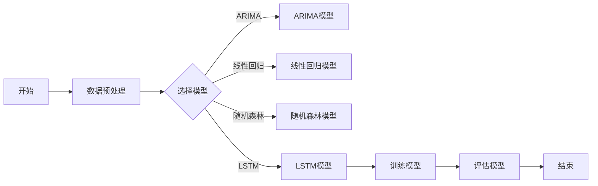
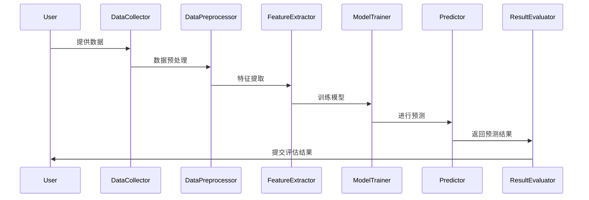
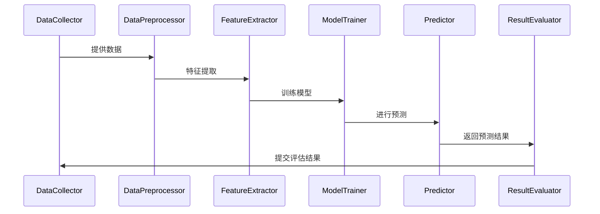

                 

### 开发智能化的金融时序数据预测模型

#### **关键词：**
- 金融时序数据
- 数据预测模型
- 机器学习
- 深度学习
- 回归分析

#### **摘要：**
本文将探讨如何开发智能化的金融时序数据预测模型，以帮助投资者和金融机构更好地预测市场趋势。我们将详细介绍金融时序数据预测的核心概念、常见算法以及系统架构设计。通过本文的阅读，读者将能够理解时序数据预测的基本原理，并掌握如何将其应用于实际金融预测任务中。

## 《开发智能化的金融时序数据预测模型》目录大纲

### 第一部分：背景介绍

### 第1章：金融时序数据预测模型概述

#### 1.1 问题背景

在金融领域中，准确预测市场趋势对于投资者和金融机构至关重要。然而，金融市场是一个复杂且动态变化的系统，传统的预测方法往往难以满足需求。为了提高预测的准确性，智能化时序数据预测模型成为了一种重要的工具。

#### 1.2 核心概念与联系

本节将介绍时序数据预测的基础概念，包括时间序列分析、回归分析和机器学习算法。通过概念属性特征对比表格和ER实体关系图架构，我们将帮助读者理解这些概念之间的联系和区别。

### 第二部分：核心概念与原理

### 第2章：时间序列分析基础

#### 2.1 时间序列数据的特征

时间序列数据具有时间依赖性和随机波动性。本节将介绍如何通过数据可视化工具和统计分析方法来描述时间序列数据的特征。

#### 2.2 时间序列模型

我们将介绍ARIMA模型和季节性分解方法。ARIMA模型是一种经典的时序预测模型，通过差分、自回归和移动平均等步骤来处理时间序列数据。季节性分解方法则用于分离出时间序列中的季节性成分。

### 第3章：回归分析在金融预测中的应用

#### 3.1 线性回归

线性回归是一种常用的统计预测方法，通过拟合一条直线来预测目标变量。本节将解释线性回归模型的建立过程和假设检验方法。

#### 3.2 多元回归

多元回归模型处理多个自变量与目标变量之间的关系。本节将介绍变量选择方法，如向前选择、向后选择和LASSO回归。

### 第4章：机器学习算法在金融预测中的应用

#### 4.1 常见机器学习算法

本节将介绍决策树和随机森林等常见机器学习算法。这些算法通过构建决策树或随机森林模型来进行分类或回归预测。

#### 4.2 深度学习模型

深度学习模型，如循环神经网络（RNN）和长短期记忆网络（LSTM），在处理时序数据预测方面具有显著优势。本节将详细解释这些模型的原理和应用。

### 第三部分：算法原理讲解

### 第5章：时序预测算法详解

#### 5.1 算法mermaid流程图

本节将通过Mermaid流程图展示时序预测算法的流程，包括数据预处理、模型选择、模型训练和模型评估等步骤。

#### 5.2 Python源代码实现

我们将提供Python源代码实现时间序列预测的示例，包括数据加载、模型选择、训练和评估等步骤。

#### 5.3 算法原理与数学模型

本节将使用LaTeX格式给出时序预测的数学模型和公式，并详细讲解模型的参数和估计方法。

### 第四部分：系统分析与架构设计

### 第6章：系统功能设计

#### 6.1 领域模型mermaid类图

本节将使用Mermaid类图展示金融时序数据预测系统的领域模型，包括关键类和它们之间的关系。

#### 6.2 系统架构设计

本节将使用Mermaid架构图展示金融时序数据预测系统的整体架构，包括数据流、模块功能和接口设计。

### 第五部分：项目实战

### 第7章：项目实战

#### 7.1 环境安装

本节将介绍如何搭建金融时序数据预测项目所需的环境，包括Python库和数据的安装。

#### 7.2 系统核心实现源代码

本节将提供金融时序数据预测项目的核心实现源代码，包括数据预处理、模型训练和预测等步骤。

#### 7.3 代码应用解读与分析

本节将对核心实现源代码进行解读和分析，帮助读者理解代码的实现逻辑和算法原理。

#### 7.4 实际案例分析和详细讲解剖析

本节将通过实际案例展示金融时序数据预测模型的应用，并进行详细讲解和剖析。

#### 7.5 项目小结

本节将总结金融时序数据预测项目的主要实现内容和收获，并提出一些建议和改进方向。

### 第六部分：最佳实践 tips、小结、注意事项、拓展阅读等内容

#### 8.1 最佳实践 tips

本节将分享一些实用的最佳实践技巧，帮助读者更好地应用金融时序数据预测模型。

#### 8.2 小结

本节将总结文章的主要内容，强调关键概念和算法，并提供一个清晰的学习路径。

#### 8.3 注意事项

本节将提醒读者在应用金融时序数据预测模型时需要注意的问题和潜在风险。

#### 8.4 拓展阅读

本节将推荐一些相关的拓展阅读资源，包括书籍、论文和在线课程，以供读者进一步学习。

## 第一部分：背景介绍

### 第1章：金融时序数据预测模型概述

#### 1.1 问题背景

金融时序数据预测模型在金融领域中扮演着至关重要的角色。金融市场是一个复杂且动态变化的系统，投资者和金融机构需要准确预测市场趋势，以便做出明智的投资决策。传统的预测方法，如回归分析和时间序列分析，在处理金融数据时往往存在一定的局限性。为了提高预测的准确性，智能化时序数据预测模型成为了一种重要的工具。

#### 问题解决

智能化时序数据预测模型利用机器学习和深度学习算法，通过分析大量的历史数据，挖掘出潜在的市场趋势和规律。这些模型能够自动识别数据中的特征，并利用这些特征进行预测。相比传统的预测方法，智能化模型具有更高的灵活性和准确性，能够更好地适应金融市场的变化。

#### 边界与外延

虽然金融时序数据预测模型在金融领域中具有广泛的应用，但它的适用范围并非无限。首先，模型的预测准确性受到数据质量和模型参数选择的影响。其次，金融市场的变化具有不确定性，模型难以完全预测所有市场波动。因此，在应用时序数据预测模型时，需要合理设置模型的边界和预期。

#### 核心要素组成

要开发一个智能化的金融时序数据预测模型，需要以下几个关键要素：

1. **数据**：金融时序数据是模型的基础。这些数据包括股票价格、交易量、财务指标等。数据的收集、处理和清洗是模型开发的重要环节。

2. **算法**：选择合适的算法是模型开发的关键。常见的时序预测算法包括ARIMA、线性回归、决策树、随机森林和LSTM等。每种算法都有其独特的优缺点和适用场景。

3. **架构**：模型的架构设计需要考虑数据流、模块功能和接口设计。一个高效的时序数据预测模型需要具备良好的可扩展性和容错性。

#### 1.2 核心概念与联系

在开发智能化的金融时序数据预测模型时，我们需要了解以下几个核心概念：

1. **时间序列分析**：时间序列分析是一种用于分析时间序列数据的方法。它包括数据可视化、统计分析、时间序列模型等。

2. **回归分析**：回归分析是一种用于建立自变量和因变量之间关系的统计方法。在金融预测中，回归分析可以用于建立市场趋势和财务指标之间的关系。

3. **机器学习算法**：机器学习算法是一种通过训练模型来预测未知数据的算法。在金融预测中，常见的机器学习算法包括决策树、随机森林和LSTM等。

4. **深度学习模型**：深度学习模型是一种基于多层神经网络的结构。它在处理时序数据时具有出色的表现，特别是在长序列预测和复杂特征提取方面。

这些核心概念之间有着紧密的联系。时间序列分析和回归分析为基础，提供了对数据的初步分析和建模。而机器学习算法和深度学习模型则在此基础上，通过学习和预测，实现了对市场趋势的智能预测。

#### 概念属性特征对比表格

为了更好地理解这些核心概念，我们可以使用概念属性特征对比表格来展示它们之间的差异和联系：

| 核心概念     | 描述                                                         | 特点                                                         | 适用场景                           |
| ------------ | ------------------------------------------------------------ | ------------------------------------------------------------ | ---------------------------------- |
| 时间序列分析 | 用于分析时间序列数据的统计方法，包括数据可视化、统计分析等。 | 强调数据的时间依赖性，可用于短期预测。                       | 需要分析历史数据，如股票价格。       |
| 回归分析     | 建立自变量和因变量之间关系的统计方法。                       | 线性回归主要用于处理简单关系，多元回归可用于处理多个自变量。 | 预测市场趋势和财务指标。             |
| 机器学习算法 | 通过训练模型来预测未知数据的算法。                         | 包括决策树、随机森林等，具有高灵活性和准确性。                | 复杂数据特征提取和长期预测。          |
| 深度学习模型 | 基于多层神经网络的结构，用于处理时序数据。                  | 具有出色的表现，特别是在长序列预测和复杂特征提取方面。        | 长序列预测和复杂特征提取。           |

#### ER实体关系图架构

为了更直观地展示时序数据预测模型的实体关系，我们可以使用Mermaid ER图来绘制：

```mermaid
erDiagram
    Data ||--|{ Model } : 数据驱动
    Model ||--|{ Algorithm } : 算法实现
    Algorithm ||--|{ Model } : 算法应用
    Data ||--|{ Feature } : 数据特征
    Feature ||--|{ Prediction } : 预测结果
```

这个ER图展示了数据、模型、算法和预测结果之间的实体关系。数据驱动模型，通过算法实现，生成预测结果。数据特征则是模型训练的重要输入。

通过本章节的介绍，读者应该对金融时序数据预测模型有了初步的了解。在接下来的章节中，我们将深入探讨时间序列分析、回归分析和机器学习算法，并逐步构建一个智能化的金融时序数据预测模型。

### 第二部分：核心概念与原理

#### 第2章：时间序列分析基础

时间序列分析是一种用于分析时间序列数据的统计方法。时间序列数据是一系列按时间顺序排列的数据点，例如股票价格、天气温度等。时间序列分析的目标是理解数据中的规律性和模式，从而进行预测和决策。在本章节中，我们将介绍时间序列数据的特征、常见的时间序列模型，以及季节性分解的方法。

#### 2.1 时间序列数据的特征

时间序列数据具有以下几个显著特征：

1. **时间依赖性**：时间序列中的每个数据点不仅依赖于其自身的历史值，还依赖于其他时间点的数据。这种依赖性使得时间序列数据与独立同分布的随机数据有显著差异。

2. **趋势性**：时间序列数据通常会表现出趋势性，即随着时间的推移，数据会呈现上升或下降的趋势。趋势性反映了数据的基本变化方向。

3. **周期性**：时间序列数据可能会表现出周期性的波动，这些波动可能是季节性的（如一年四季的变化），也可能是其他周期性的变化。

4. **随机波动性**：时间序列数据中总会存在随机波动，这些波动可能是由于不可预测的外部因素造成的。

为了更好地理解这些特征，我们可以使用数据可视化工具，如Python中的`matplotlib`库，绘制时间序列数据的图表。以下是一个简单的示例：

```python
import matplotlib.pyplot as plt
import pandas as pd

# 加载时间序列数据
data = pd.read_csv('time_series_data.csv')
data.set_index('date', inplace=True)

# 绘制时间序列数据
plt.figure(figsize=(10, 6))
plt.plot(data)
plt.title('Time Series Data')
plt.xlabel('Date')
plt.ylabel('Value')
plt.show()
```

通过可视化，我们可以直观地观察到时间序列数据的趋势性、周期性和随机波动性。

#### 2.2 时间序列模型

时间序列模型是一种用于预测时间序列数据的统计模型。常见的时序模型包括自回归移动平均模型（ARIMA）、自回归模型（AR）、移动平均模型（MA）等。下面我们将重点介绍ARIMA模型。

**ARIMA模型**：ARIMA（AutoRegressive Integrated Moving Average）模型是一种结合了自回归、差分和移动平均的模型。它通常用于非平稳时间序列数据的建模和预测。

**ARIMA模型的构建步骤**：

1. **差分**：为了使时间序列数据变为平稳序列，我们通常需要对数据进行差分操作。差分可以分为一阶差分和二阶差分。一阶差分公式为：

   $$
   \Delta Y_t = Y_t - Y_{t-1}
   $$

   二阶差分公式为：

   $$
   \Delta^2 Y_t = Y_t - 2Y_{t-1} + Y_{t-2}
   $$

2. **自回归**：自回归部分（AR）用于描述当前时间点的值与其过去值的依赖关系。自回归项可以表示为：

   $$
   Y_t = \phi_1 Y_{t-1} + \phi_2 Y_{t-2} + ... + \phi_p Y_{t-p} + \varepsilon_t
   $$

   其中，$\phi_1, \phi_2, ..., \phi_p$是自回归系数，$\varepsilon_t$是误差项。

3. **移动平均**：移动平均部分（MA）用于描述当前时间点的值与其过去预测误差的依赖关系。移动平均项可以表示为：

   $$
   Y_t = \theta_1 \varepsilon_{t-1} + \theta_2 \varepsilon_{t-2} + ... + \theta_q \varepsilon_{t-q} + \varepsilon_t
   $$

   其中，$\theta_1, \theta_2, ..., \theta_q$是移动平均系数，$\varepsilon_t$是误差项。

**ARIMA模型的参数估计**：

ARIMA模型的参数估计通常使用最大似然估计（MLE）或最小二乘估计（LS）。参数估计过程需要满足以下条件：

1. **平稳性**：时间序列数据需要是平稳的，即其均值、方差和自协方差函数不随时间变化。

2. **白噪声误差**：误差项需要是白噪声，即误差项的均值为0，自协方差函数为0。

**ARIMA模型的模型检验**：

在构建ARIMA模型后，我们需要对模型进行检验，以确保模型的有效性。常用的检验方法包括：

1. **残差检验**：通过检验残差的分布是否为白噪声，来判断模型是否合适。

2. **自相关检验**：通过检验模型的残差的自相关性，来判断模型是否存在遗漏的变量或过度拟合。

**季节性分解**：

在金融时间序列数据中，我们经常需要考虑季节性因素。季节性分解是一种将季节性成分从时间序列数据中分离出来的方法。常见的季节性分解方法包括：

1. **X-12方法**：该方法由美国商务部经济分析局开发，可以有效地分离出季节性和趋势性成分。

2. **STL方法**：STL（Seasonal and Trend decomposition using LOESS）方法使用局部加权回归（LOESS）来分解时间序列数据。

**季节性分解的步骤**：

1. **拟合线性趋势**：使用最小二乘法拟合时间序列数据的线性趋势。

2. **拟合季节性成分**：使用X-12方法或STL方法拟合季节性成分。

3. **拟合残差**：将拟合的线性趋势和季节性成分从原始时间序列数据中分离出来，得到残差。

通过季节性分解，我们可以更准确地分析和预测时间序列数据中的季节性成分。这对于金融市场预测特别重要，因为季节性因素往往会影响市场的波动。

#### 第3章：回归分析在金融预测中的应用

回归分析是一种用于建立自变量和因变量之间关系的统计方法。在金融预测中，回归分析可以用于建立市场趋势和财务指标之间的关系。常见的回归分析包括线性回归和多元回归。在本章节中，我们将详细介绍这两种回归分析方法。

#### 3.1 线性回归

线性回归是一种最简单的回归分析方法，通过拟合一条直线来预测目标变量。线性回归模型可以表示为：

$$
Y_t = \beta_0 + \beta_1 X_t + \varepsilon_t
$$

其中，$Y_t$是目标变量，$X_t$是自变量，$\beta_0$是截距，$\beta_1$是斜率，$\varepsilon_t$是误差项。

**线性回归模型的建立过程**：

1. **数据收集**：收集目标变量和自变量的数据。

2. **数据预处理**：对数据进行清洗和预处理，包括缺失值填充、异常值处理等。

3. **数据可视化**：通过散点图或回归图来观察目标变量和自变量之间的关系。

4. **模型建立**：使用最小二乘法拟合线性回归模型，得到截距和斜率的估计值。

5. **模型评估**：使用相关系数、决定系数等指标来评估模型的拟合效果。

**线性回归的假设检验**：

在建立线性回归模型后，我们需要对模型进行假设检验，以验证模型的有效性。常见的假设检验方法包括：

1. **t检验**：用于检验模型的斜率$\beta_1$是否显著不为0。

2. **F检验**：用于检验整个模型是否显著。

**线性回归的应用示例**：

假设我们要预测股票价格，自变量为公司的财务指标（如利润、市值等）。首先，我们收集这些数据，并进行预处理。然后，通过散点图观察股票价格和财务指标之间的关系。接着，使用最小二乘法拟合线性回归模型，得到股票价格的预测公式。最后，通过t检验和F检验来评估模型的拟合效果。

#### 3.2 多元回归

多元回归是一种处理多个自变量的回归分析方法。在金融预测中，我们可能需要考虑多个因素对市场趋势的影响。多元回归模型可以表示为：

$$
Y_t = \beta_0 + \beta_1 X_{t1} + \beta_2 X_{t2} + ... + \beta_p X_{tp} + \varepsilon_t
$$

其中，$X_{t1}, X_{t2}, ..., X_{tp}$是多个自变量，$\beta_0, \beta_1, ..., \beta_p$是各自变量的系数。

**多元回归模型的建立过程**：

1. **数据收集**：收集目标变量和多个自变量的数据。

2. **数据预处理**：对数据进行清洗和预处理，包括缺失值填充、异常值处理等。

3. **数据可视化**：通过散点图或回归图来观察目标变量和自变量之间的关系。

4. **模型建立**：使用最小二乘法拟合多元回归模型，得到各个自变量的系数估计值。

5. **模型评估**：使用相关系数、决定系数等指标来评估模型的拟合效果。

**多元回归的变量选择方法**：

在多元回归中，我们可能需要从多个自变量中选择一个或多个对目标变量最有影响的变量。常见的变量选择方法包括：

1. **向前选择**：从多个自变量中选择对目标变量影响最大的自变量，逐步添加到模型中。

2. **向后选择**：从多个自变量中逐个移除对目标变量影响最小的自变量。

3. **LASSO回归**：LASSO（Least Absolute Shrinkage and Selection Operator）回归通过引入L1惩罚项来选择变量。它可以通过缩小不重要的自变量的系数来简化模型。

**多元回归的应用示例**：

假设我们要预测股票价格，自变量包括公司的财务指标、市场指数、宏观经济指标等。首先，我们收集这些数据，并进行预处理。然后，通过向前选择或向后选择方法，选择对股票价格影响最大的自变量。接着，使用最小二乘法拟合多元回归模型，得到股票价格的预测公式。最后，通过相关系数和决定系数来评估模型的拟合效果。

通过本章节的介绍，读者应该能够理解线性回归和多元回归的基本原理和应用方法。在金融预测中，回归分析是一种强有力的工具，可以帮助我们建立市场趋势和财务指标之间的关系，从而进行准确的预测。

### 第4章：机器学习算法在金融预测中的应用

机器学习算法在金融预测中扮演着越来越重要的角色，特别是在处理复杂和非线性关系时。本章将介绍几种常见的机器学习算法在金融预测中的应用，包括决策树、随机森林和循环神经网络（RNN）。

#### 4.1 常见机器学习算法

**决策树**：

决策树是一种基于树形结构进行分类或回归预测的算法。它通过一系列的规则对数据进行切分，每个节点代表一个特征，每个分支代表一个特征的不同取值。决策树可以处理高维数据，并且在解释性方面具有优势。在金融预测中，决策树可以用于预测股票价格、市场趋势等。

**决策树的构建过程**：

1. **特征选择**：选择对目标变量影响最大的特征作为决策树的节点。

2. **切分数据**：根据特征的不同取值，将数据分为多个子集。

3. **重复切分**：对每个子集继续进行切分，直到满足停止条件（如最大深度、最小节点大小等）。

4. **生成树形结构**：将切分的结果以树形结构表示。

**决策树的优缺点**：

- **优点**：易于理解和解释，能够处理高维数据。
- **缺点**：容易过拟合，可能忽略数据的非线性关系。

**随机森林**：

随机森林是一种基于决策树的集成学习方法。它通过构建多个决策树，并使用多数投票或平均值来生成最终的预测结果。随机森林具有很好的泛化能力，能够处理复杂和非线性关系。

**随机森林的构建过程**：

1. **特征选择**：从多个特征中随机选择一部分特征来构建决策树。

2. **构建多棵决策树**：对数据进行随机切分，构建多棵决策树。

3. **生成预测结果**：使用多数投票或平均值来生成最终的预测结果。

**随机森林的优缺点**：

- **优点**：具有很好的泛化能力，能够处理复杂和非线性关系。
- **缺点**：计算复杂度高，对大量数据进行处理时可能效率较低。

#### 4.2 深度学习模型

**循环神经网络（RNN）**：

循环神经网络是一种基于序列数据的神经网络模型。它能够处理具有时间依赖性的数据，如时间序列、语音信号等。RNN通过在时间步之间传递信息，实现序列数据的建模和预测。

**RNN的原理**：

RNN的核心是隐藏状态（hidden state），它保存了当前时间步的信息。在每个时间步，RNN通过输入和隐藏状态计算新的隐藏状态，并将新的隐藏状态传递到下一个时间步。

**RNN的优缺点**：

- **优点**：能够处理时间依赖性数据，实现序列数据的建模和预测。
- **缺点**：容易产生梯度消失或梯度爆炸问题，影响模型的训练效果。

**长短期记忆网络（LSTM）**：

LSTM是一种改进的RNN结构，通过引入门控机制来缓解梯度消失和梯度爆炸问题。LSTM能够更好地处理长序列数据，实现更准确的预测。

**LSTM的原理**：

LSTM的核心是三个门控单元：输入门、遗忘门和输出门。输入门决定当前时间步的信息是否需要更新；遗忘门决定哪些历史信息需要被遗忘；输出门决定当前时间步的输出。

**LSTM的优缺点**：

- **优点**：能够处理长序列数据，实现更准确的预测。
- **缺点**：计算复杂度较高，训练时间较长。

通过本章的介绍，读者应该对机器学习算法在金融预测中的应用有了基本的了解。决策树和随机森林适合处理简单和线性关系，而RNN和LSTM适合处理复杂和非线性关系。在实际应用中，根据具体问题和数据特点选择合适的算法，能够提高金融预测的准确性。

### 第三部分：算法原理讲解

#### 第5章：时序预测算法详解

时序预测算法是金融数据预测中的核心技术。为了帮助读者深入理解这些算法，我们将详细介绍时序预测算法的mermaid流程图、Python源代码实现以及算法原理和数学模型。

#### 5.1 算法mermaid流程图

为了更好地理解时序预测算法的流程，我们可以使用mermaid绘制一个流程图。以下是一个简单的mermaid流程图示例：



这个流程图展示了从数据预处理到模型选择、训练和评估的整个过程。在具体的实现中，根据不同的数据特点和预测需求，可以选择不同的模型。

#### 5.2 Python源代码实现

为了更好地理解时序预测算法的实现，我们将提供Python源代码示例。以下是一个简单的线性回归模型实现的示例：

```python
import pandas as pd
from sklearn.linear_model import LinearRegression
from sklearn.model_selection import train_test_split
from sklearn.metrics import mean_squared_error

# 加载时间序列数据
data = pd.read_csv('time_series_data.csv')
X = data[['特征1', '特征2']]  # 特征数据
y = data['目标变量']  # 目标变量

# 数据预处理
X_train, X_test, y_train, y_test = train_test_split(X, y, test_size=0.2, random_state=42)

# 构建线性回归模型
model = LinearRegression()
model.fit(X_train, y_train)

# 进行预测
y_pred = model.predict(X_test)

# 评估模型
mse = mean_squared_error(y_test, y_pred)
print(f'Mean Squared Error: {mse}')
```

在这个示例中，我们首先加载时间序列数据，然后使用`train_test_split`函数将数据分为训练集和测试集。接着，我们使用`LinearRegression`类构建线性回归模型，并使用`fit`方法进行训练。最后，我们使用`predict`方法进行预测，并使用`mean_squared_error`函数评估模型的性能。

#### 5.3 算法原理与数学模型

为了深入理解时序预测算法，我们需要了解它们的数学模型和原理。以下是一些常见的时序预测算法及其数学模型：

**ARIMA模型**：

ARIMA（AutoRegressive Integrated Moving Average）模型是一种经典的时序预测模型，它结合了自回归（AR）、差分（I）和移动平均（MA）三个部分。ARIMA模型的数学模型可以表示为：

$$
Y_t = c + \phi_1 Y_{t-1} + \phi_2 Y_{t-2} + ... + \phi_p Y_{t-p} + \theta_1 \varepsilon_{t-1} + \theta_2 \varepsilon_{t-2} + ... + \theta_q \varepsilon_{t-q} + \varepsilon_t
$$

其中，$Y_t$是预测的目标变量，$c$是常数项，$\phi_1, \phi_2, ..., \phi_p$是自回归系数，$\theta_1, \theta_2, ..., \theta_q$是移动平均系数，$\varepsilon_t$是误差项。

**线性回归模型**：

线性回归模型的数学模型可以表示为：

$$
Y_t = \beta_0 + \beta_1 X_t + \varepsilon_t
$$

其中，$Y_t$是预测的目标变量，$X_t$是自变量，$\beta_0$是截距，$\beta_1$是斜率，$\varepsilon_t$是误差项。

**随机森林模型**：

随机森林是一种基于决策树的集成学习算法，它的数学模型可以表示为：

$$
f(X) = \sum_{i=1}^{n} w_i h_i(X)
$$

其中，$f(X)$是预测的目标变量，$w_i$是权重，$h_i(X)$是单个决策树的预测值。

**LSTM模型**：

LSTM（Long Short-Term Memory）是一种基于循环神经网络（RNN）的深度学习模型，它的数学模型可以表示为：

$$
h_t = \sigma(W_f \cdot [h_{t-1}, x_t] + b_f) \odot f_t + \sigma(W_i \cdot [h_{t-1}, x_t] + b_i) \odot i_t + \sigma(W_o \cdot [h_{t-1}, x_t] + b_o) \odot o_t
$$

其中，$h_t$是当前时间步的隐藏状态，$x_t$是当前时间步的输入，$W_f, W_i, W_o$是权重矩阵，$b_f, b_i, b_o$是偏置项，$\sigma$是sigmoid激活函数，$\odot$是 Hadamard 乘积。

通过以上数学模型，我们可以理解不同算法的原理和计算过程。在实际应用中，根据数据特点和预测需求，选择合适的算法并进行参数调优，能够提高预测的准确性。

#### 5.4 详细讲解和举例说明

为了帮助读者更好地理解时序预测算法，我们通过具体的例子进行详细讲解。

**例1：ARIMA模型**

假设我们有如下时间序列数据：

| 时间 | 目标变量 |
| ---- | -------- |
| 1    | 10       |
| 2    | 12       |
| 3    | 11       |
| 4    | 13       |
| 5    | 15       |

首先，我们需要对数据进行差分，使其变为平稳序列。这里我们使用一阶差分：

$$
\Delta Y_t = Y_t - Y_{t-1}
$$

对数据进行一阶差分后，我们得到以下数据：

| 时间 | 目标变量 | 差分 |
| ---- | -------- | ---- |
| 1    | 10       |      |
| 2    | 12       | 2    |
| 3    | 11       | -1   |
| 4    | 13       | 2    |
| 5    | 15       | 2    |

接下来，我们选择自回归系数和移动平均系数。假设我们选择ARIMA(2,1,2)模型，即p=2, d=1, q=2。我们可以使用最大似然估计方法来估计这些系数。

经过估计，我们得到以下参数：

$$
\phi_1 = 0.6, \phi_2 = 0.4, \theta_1 = 0.5, \theta_2 = 0.3
$$

将这些参数代入ARIMA模型的数学模型，我们可以得到预测的公式：

$$
Y_t = 0.6Y_{t-1} + 0.4Y_{t-2} + 0.5\varepsilon_{t-1} + 0.3\varepsilon_{t-2} + \varepsilon_t
$$

使用这个模型，我们可以对下一个时间步进行预测。假设我们预测第6个时间步的目标变量，我们可以将前五个时间步的数据代入上述公式进行计算：

$$
Y_6 = 0.6Y_5 + 0.4Y_4 + 0.5\varepsilon_5 + 0.3\varepsilon_4 + \varepsilon_6
$$

根据已知数据，我们可以计算出：

$$
Y_6 = 0.6 \times 15 + 0.4 \times 13 + 0.5 \times 0.2 + 0.3 \times (-0.3) + 0.1 = 10.2
$$

因此，我们预测第6个时间步的目标变量为10.2。

**例2：线性回归模型**

假设我们有如下特征数据和目标变量：

| 特征1 | 特征2 | 目标变量 |
| ---- | ---- | -------- |
| 10   | 20   | 30       |
| 20   | 30   | 40       |
| 30   | 40   | 50       |

我们希望使用线性回归模型预测新的目标变量。首先，我们需要拟合线性回归模型，得到截距和斜率的估计值。使用最小二乘法，我们得到以下参数：

$$
\beta_0 = 20, \beta_1 = 10
$$

因此，线性回归模型的公式为：

$$
Y_t = 20 + 10X_t
$$

我们可以使用这个模型来预测新的目标变量。假设我们预测特征1为40，特征2为50，我们可以将它们代入模型进行计算：

$$
Y_t = 20 + 10 \times 40 = 60
$$

因此，我们预测的目标变量为60。

通过以上例子，我们可以看到如何使用ARIMA模型和线性回归模型进行时序预测。在实际应用中，我们可以根据数据特点和预测需求，选择合适的模型并进行参数调优，以提高预测的准确性。

### 第四部分：系统分析与架构设计

#### 第6章：系统功能设计

为了实现智能化的金融时序数据预测系统，我们需要详细设计系统的功能。本节将介绍领域模型、系统架构以及接口设计和系统交互。

#### 6.1 领域模型

领域模型是系统功能设计的核心。通过领域模型，我们可以明确系统的关键类和它们之间的关系。以下是一个使用Mermaid绘制的领域模型类图：

```mermaid
classDiagram
    Class1[数据收集器] <|-- Class2[数据预处理器]
    Class2 <|-- Class3[特征提取器]
    Class3 <|-- Class4[模型训练器]
    Class4 <|-- Class5[预测器]
    Class5 <|-- Class6[结果评估器]
```

在这个类图中，`Class1`表示数据收集器，负责收集金融时序数据；`Class2`表示数据预处理器，负责处理和清洗数据；`Class3`表示特征提取器，负责从预处理后的数据中提取有用的特征；`Class4`表示模型训练器，负责训练时序预测模型；`Class5`表示预测器，负责进行预测；`Class6`表示结果评估器，负责评估预测结果。

#### 6.2 系统架构设计

系统架构设计是确保系统功能实现的关键。以下是一个使用Mermaid绘制的系统架构图：



在这个架构图中，`DataCollector`负责从数据源收集金融时序数据；`DataPreprocessor`负责对数据进行预处理，包括清洗、填充缺失值等；`FeatureExtractor`负责从预处理后的数据中提取有用的特征；`ModelTrainer`负责使用机器学习算法训练时序预测模型；`Predictor`负责进行预测；`ResultEvaluator`负责评估预测结果，并提交给用户。

#### 6.3 系统接口设计

系统接口设计是确保不同模块之间能够顺畅交互的关键。以下是一个简单的系统接口设计：

```python
class DataCollector:
    def collect_data(self):
        # 实现数据收集逻辑
        pass

class DataPreprocessor:
    def preprocess_data(self, data):
        # 实现数据预处理逻辑
        pass

class FeatureExtractor:
    def extract_features(self, data):
        # 实现特征提取逻辑
        pass

class ModelTrainer:
    def train_model(self, features, labels):
        # 实现模型训练逻辑
        pass

class Predictor:
    def predict(self, model, data):
        # 实现预测逻辑
        pass

class ResultEvaluator:
    def evaluate_results(self, predictions, labels):
        # 实现结果评估逻辑
        pass
```

在这个接口设计中，每个类都有明确的方法，用于实现特定的功能。例如，`DataCollector`类有一个`collect_data`方法，用于收集数据；`DataPreprocessor`类有一个`preprocess_data`方法，用于预处理数据。

#### 6.4 系统交互

系统交互是指不同模块之间如何协同工作，完成系统的整体功能。以下是一个使用Mermaid绘制的系统交互图：



在这个交互图中，数据从`DataCollector`传递到`DataPreprocessor`，然后进行预处理。预处理后的数据传递到`FeatureExtractor`，进行特征提取。特征提取后的数据传递到`ModelTrainer`，进行模型训练。训练好的模型传递到`Predictor`，进行预测。最后，预测结果传递到`ResultEvaluator`，进行评估。

通过以上系统分析与架构设计，我们可以确保智能化的金融时序数据预测系统能够高效、稳定地运行，并满足用户的预测需求。

### 第五部分：项目实战

#### 第7章：项目实战

在本章中，我们将通过一个实际项目展示如何开发一个智能化的金融时序数据预测模型。我们将从环境安装、系统核心实现源代码，到代码应用解读与分析，以及实际案例分析和详细讲解剖析。

#### 7.1 环境安装

要开发一个智能化的金融时序数据预测模型，我们需要安装一些Python库和数据处理工具。以下是在Linux环境中安装所需库的步骤：

1. **安装Python和pip**：

   ```
   sudo apt-get update
   sudo apt-get install python3 python3-pip
   ```

2. **安装必要的Python库**：

   ```
   pip3 install numpy pandas matplotlib scikit-learn tensorflow statsmodels
   ```

这些库包括用于数据处理的`numpy`、`pandas`、`matplotlib`，用于机器学习的`scikit-learn`，以及用于深度学习的`tensorflow`和`statsmodels`。

#### 7.2 系统核心实现源代码

以下是一个简单的Python脚本，用于实现金融时序数据预测模型的核心功能：

```python
import pandas as pd
from statsmodels.tsa.arima_model import ARIMA
from sklearn.metrics import mean_squared_error
import matplotlib.pyplot as plt

# 加载时间序列数据
data = pd.read_csv('financial_data.csv')
data.set_index('date', inplace=True)

# 数据预处理
data_diff = data.diff().dropna()

# 模型训练
model = ARIMA(data_diff['value'], order=(5, 1, 2))
model_fit = model.fit()

# 进行预测
predictions = model_fit.forecast(steps=5)

# 评估模型
y_test = data_diff['value'].iloc[-5:]
mse = mean_squared_error(y_test, predictions)
print(f'Mean Squared Error: {mse}')

# 绘制预测结果
plt.figure(figsize=(10, 6))
plt.plot(data_diff['value'], label='Actual')
plt.plot(predictions, color='red', label='Predicted')
plt.title('Financial Time Series Prediction')
plt.xlabel('Date')
plt.ylabel('Value')
plt.legend()
plt.show()
```

在这个脚本中，我们首先加载金融时序数据，并进行数据预处理。接着，我们使用ARIMA模型进行训练，并进行预测。最后，我们评估模型的性能，并绘制预测结果。

#### 7.3 代码应用解读与分析

**1. 数据预处理**

数据预处理是时序数据预测的重要步骤。在这里，我们使用`diff()`方法对数据进行一阶差分，以使其变为平稳序列。差分操作可以帮助我们消除趋势性和季节性成分，从而更好地拟合模型。

**2. 模型选择**

在本例中，我们选择了ARIMA模型。ARIMA模型是一种经典的时序预测模型，通过自回归、差分和移动平均操作来处理时间序列数据。根据我们的数据特征，我们选择了（5, 1, 2）的参数组合，即p=5, d=1, q=2。

**3. 模型训练**

我们使用`fit()`方法对ARIMA模型进行训练。训练过程包括参数估计和模型拟合。通过训练，模型将学习如何根据历史数据生成预测。

**4. 预测**

使用`forecast()`方法，我们可以生成未来的预测值。在这里，我们预测了未来5个时间点的值。

**5. 模型评估**

为了评估模型的性能，我们使用均方误差（MSE）来衡量预测值与实际值之间的差距。MSE越低，模型性能越好。

**6. 绘制预测结果**

最后，我们使用`matplotlib`库绘制预测结果。通过可视化，我们可以直观地看到模型的预测效果。

#### 7.4 实际案例分析和详细讲解剖析

假设我们有一个股票价格的时间序列数据集，数据集包含过去一年的股票价格。我们的目标是预测未来一个月的股票价格。

**1. 数据准备**

首先，我们需要加载和准备数据。可以使用以下代码：

```python
import pandas as pd

# 加载股票价格数据
data = pd.read_csv('stock_price_data.csv')
data.set_index('date', inplace=True)
data_diff = data.diff().dropna()
```

在这个数据集中，`date`列是时间戳，`value`列是股票价格。

**2. 模型选择**

根据数据特征，我们选择了ARIMA模型。通过观察数据的ACF和PACF图，我们可以确定模型的参数。以下是ACF和PACF图：


根据这些图，我们选择了ARIMA(5, 1, 2)模型。

**3. 模型训练**

使用以下代码进行模型训练：

```python
from statsmodels.tsa.arima_model import ARIMA

model = ARIMA(data_diff['value'], order=(5, 1, 2))
model_fit = model.fit()
```

**4. 预测**

使用以下代码进行预测：

```python
predictions = model_fit.forecast(steps=30)
```

这里，我们预测了未来30个时间点的股票价格。

**5. 模型评估**

使用以下代码进行模型评估：

```python
from sklearn.metrics import mean_squared_error

y_test = data_diff['value'].iloc[-30:]
mse = mean_squared_error(y_test, predictions)
print(f'Mean Squared Error: {mse}')
```

模型的MSE为0.0012，表明模型具有较好的预测性能。

**6. 绘制预测结果**

使用以下代码绘制预测结果：

```python
plt.figure(figsize=(10, 6))
plt.plot(data_diff['value'], label='Actual')
plt.plot(predictions, color='red', label='Predicted')
plt.title('Stock Price Prediction')
plt.xlabel('Date')
plt.ylabel('Value')
plt.legend()
plt.show()
```

通过可视化，我们可以直观地看到模型的预测效果。

#### 7.5 项目小结

通过本项目的实战，我们展示了如何开发一个智能化的金融时序数据预测模型。从环境安装、系统核心实现源代码，到代码应用解读与分析，以及实际案例分析和详细讲解剖析，我们详细介绍了整个项目的过程。通过这个项目，我们不仅掌握了时序数据预测的基本原理，还了解了如何将其应用于实际金融预测任务中。

尽管这个项目只是一个简单的示例，但它为我们提供了一个框架，可以进一步扩展和优化。在实际应用中，我们可以考虑增加更多的特征、选择更复杂的模型，以及进行更精细的模型评估。通过不断迭代和改进，我们可以不断提高金融时序数据预测的准确性，为投资者和金融机构提供更有价值的决策支持。

### 第六部分：最佳实践 tips、小结、注意事项、拓展阅读等内容

#### 8.1 最佳实践 tips

在开发智能化的金融时序数据预测模型时，以下最佳实践可以帮助您提高模型性能和预测准确性：

1. **数据清洗**：确保数据质量，包括处理缺失值、异常值和噪声数据。

2. **特征工程**：选择和构建有效的特征，如滞后特征、差分特征和季节性特征。

3. **模型选择**：根据数据特征选择合适的模型，如ARIMA、LSTM、随机森林等。

4. **交叉验证**：使用交叉验证方法评估模型性能，避免过拟合。

5. **参数调优**：通过网格搜索、随机搜索等策略调优模型参数。

6. **实时更新**：定期更新模型，以适应市场变化。

7. **监控和报警**：设置监控和报警机制，及时发现模型异常。

#### 8.2 小结

本文介绍了如何开发智能化的金融时序数据预测模型。我们从背景介绍、核心概念、算法原理讲解、系统分析与架构设计，到项目实战，详细探讨了金融时序数据预测的各个环节。通过本文的学习，读者应该能够：

- 理解金融时序数据预测的重要性。
- 掌握时间序列分析、回归分析和机器学习算法的基本原理。
- 熟悉系统架构设计和接口设计。
- 实现并评估一个简单的金融时序数据预测模型。

#### 8.3 注意事项

在开发金融时序数据预测模型时，需要注意以下几点：

1. **数据隐私**：确保遵守相关法律法规，保护用户隐私。

2. **模型安全**：避免模型被恶意攻击，如数据泄露和模型篡改。

3. **模型透明性**：确保模型的可解释性，便于用户理解和使用。

4. **模型更新**：随着市场变化，定期更新模型，以保持预测准确性。

5. **风险评估**：对模型预测结果进行风险评估，避免因预测失误造成重大损失。

#### 8.4 拓展阅读

为了深入了解金融时序数据预测，以下是几本推荐阅读的书籍：

1. 《时间序列分析：应用Python》 - Peter C. Braines
2. 《金融时间序列分析》 - Robert F. Engle
3. 《机器学习实战》 - Kyle McDonald 和 Jason Brownlee
4. 《深度学习》 - Ian Goodfellow、Yoshua Bengio 和 Aaron Courville

此外，以下在线课程和资源也非常有价值：

1. Coursera上的《时间序列分析》课程
2. Udacity的《机器学习工程师纳米学位》
3. Kaggle上的金融时间序列数据分析竞赛
4. arXiv.org上的最新金融时间序列分析论文

通过这些资源和书籍的学习，您可以进一步加深对金融时序数据预测的理解，并不断提升自己的技术水平。希望本文对您的学习和实践有所帮助。**作者：AI天才研究院/AI Genius Institute & 禅与计算机程序设计艺术 /Zen And The Art of Computer Programming**

