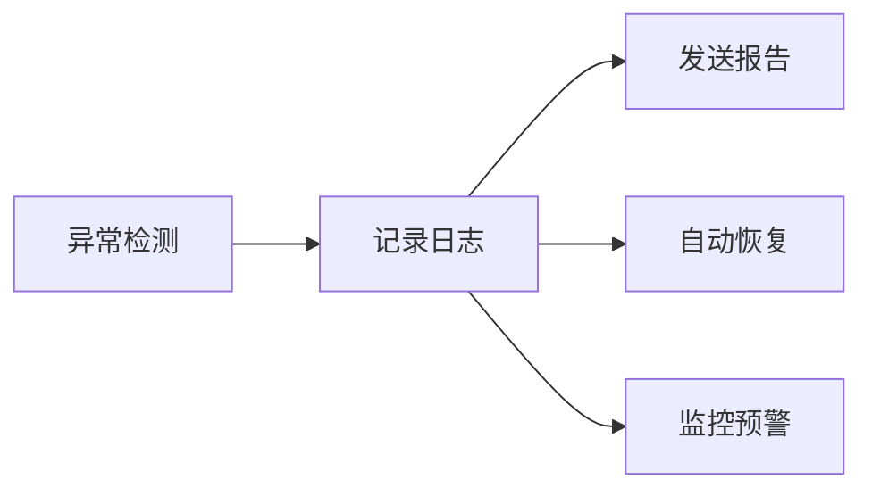
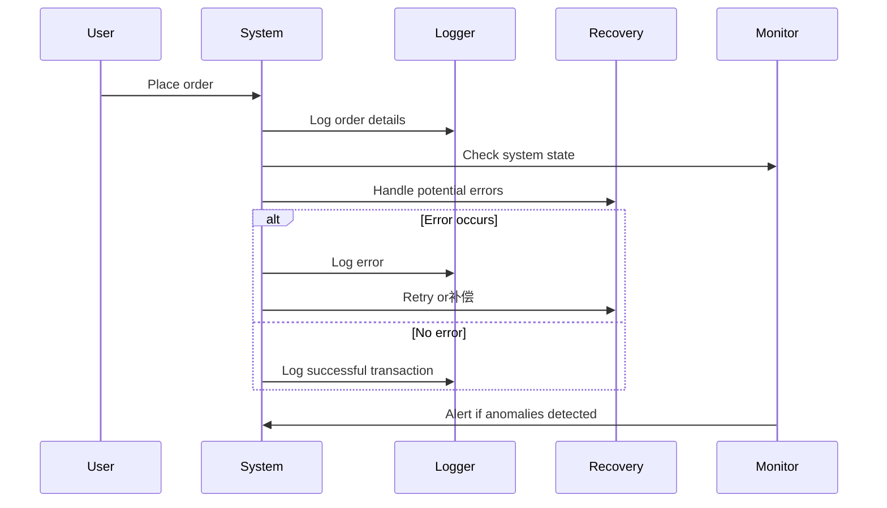
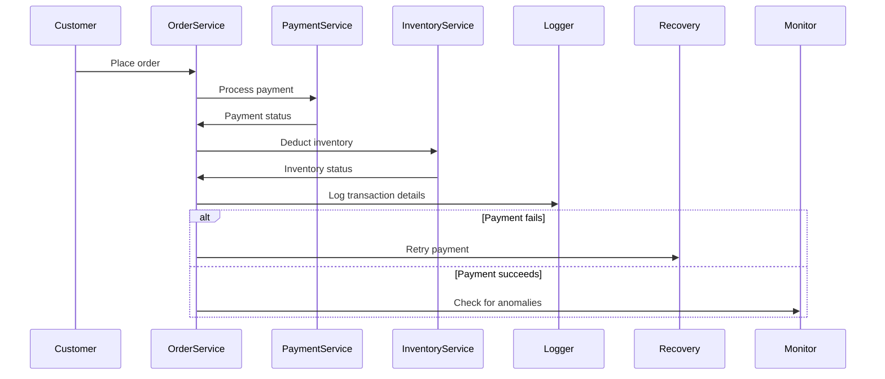

                 

## 引言

### 核心概念与联系

异常处理（Exception Handling）是软件工程中的一个关键概念，它涉及程序在遇到不期望情况或错误时的响应方式。异常处理不仅仅是捕获错误，更重要的是如何优雅地处理这些错误，从而保证系统的稳定性和健壮性。

异常处理与系统健壮性（System Robustness）有着密切的联系。一个健壮的系统应当在面对各种异常情况时，能够迅速响应并恢复，而不至于崩溃或完全失去功能。异常处理不当可能会导致系统崩溃，数据丢失，用户体验下降，甚至造成经济损失。

本文将详细探讨异常处理的核心概念，介绍提高系统健壮性的方法，并通过案例研究和最佳实践，为读者提供实用的指导。以下是本文的结构安排：

1. **异常处理基础**：介绍异常处理的背景，核心概念和基础原理。
2. **异常处理方法**：详细阐述异常检测技术、异常恢复策略和异常处理工具。
3. **高级异常处理技术**：探讨实时异常处理、系统容错与容灾技术。
4. **异常处理的最佳实践**：通过案例研究提供最佳实践指导。
5. **异常处理的未来趋势**：讨论AI、区块链等新兴技术在异常处理领域的应用。
6. **结论**：总结异常处理的重要性，并提出对未来发展的展望。

### 背景介绍

在软件系统运行过程中，异常情况是不可避免的。这些异常可能来自于硬件故障、网络问题、数据错误或程序逻辑错误等。如果没有有效的异常处理机制，系统可能会崩溃，造成数据丢失或服务中断。这不仅会影响用户体验，还可能对业务造成重大损失。

随着系统的复杂度增加，异常处理的重要性愈加凸显。现代软件系统通常包含大量的组件和依赖关系，任何一个环节出现异常都可能导致整个系统瘫痪。因此，异常处理不仅是为了应对单一的错误，更是为了确保系统在面对多种不确定性时能够保持稳定运行。

在本文中，我们将从基础概念出发，逐步深入探讨异常处理的方法和技术，最终总结出一套最佳实践，为读者提供切实可行的指导。

## 第1章 异常处理基础

### 问题背景

在现代软件系统的开发与维护过程中，异常处理是一个至关重要的环节。系统的复杂性不断增加，外部环境和内部运行条件的变化使得异常情况频频出现。异常情况可能源于多种因素，如硬件故障、软件缺陷、网络中断、数据不一致等。这些异常如果不及时有效地处理，可能会导致系统崩溃、数据丢失、服务中断等问题，严重影响用户体验和业务运营。

例如，在电子商务系统中，交易流程可能因网络延迟或数据库异常而中断，导致订单处理失败或数据不一致。在金融系统中，账户余额计算错误或交易处理失败可能导致严重的经济损失和信誉损失。此外，在自动驾驶系统中，传感器异常或算法错误可能导致严重的交通事故。因此，异常处理不仅是技术问题，更是关系到系统稳定性和业务连续性的关键因素。

异常处理的必要性体现在以下几个方面：

1. **保障系统稳定性**：有效的异常处理机制能够确保系统在遇到异常情况时能够快速恢复，避免系统崩溃或长时间停机。
2. **提高用户体验**：良好的异常处理能够提供友好的用户反馈，帮助用户理解发生了什么问题，并采取适当的措施，从而提升用户体验。
3. **减少业务风险**：通过异常处理，能够及时发现和解决潜在的问题，减少因异常导致的业务中断或经济损失。
4. **支持系统扩展**：异常处理机制能够为系统的后续扩展和维护提供便利，降低新功能引入过程中可能带来的风险。

### 核心概念与联系

#### 异常检测与诊断

异常检测（Anomaly Detection）是异常处理的第一步，其主要目的是在系统运行过程中识别出异常情况。异常检测可以通过统计方法、机器学习方法等多种手段实现。例如，基于阈值的统计方法可以检测出数据波动超出正常范围的异常；机器学习算法则可以通过训练模型来识别异常模式。

异常检测的核心是构建一个正常的运行模型，然后将实际运行数据与模型进行比较，识别出异常点。例如，在监控系统中，可以通过收集系统的运行数据，建立正常行为的模型，然后对比实时数据，识别出异常行为。

#### 异常恢复策略

一旦检测到异常，系统需要采取相应的恢复策略（Anomaly Recovery Strategy），以确保系统恢复正常运行。异常恢复策略通常包括以下几种：

1. **重启（Restart）**：当系统检测到严重的异常时，可以选择重启系统以清除错误状态。例如，在Web应用中，如果后端服务崩溃，可以通过重启服务器来恢复服务。
   
2. **重试（Retry）**：在某些情况下，异常可能只是一次性的问题，可以通过重试来解决。例如，网络请求失败时，可以等待一段时间后重试。

3. **补偿（Compensation）**：当无法直接恢复异常时，可以通过补偿操作来修正错误。例如，在交易系统中，如果订单处理失败，可以通过逆向交易来补偿损失。

4. **回滚（Rollback）**：在数据库操作中，如果发现错误，可以通过回滚操作撤销之前的操作，恢复到一致状态。

#### 异常处理机制

异常处理机制（Exception Handling Mechanism）是确保系统在异常情况下能够平稳运行的关键。它通常包括以下几个组成部分：

1. **错误日志（Error Logging）**：记录系统运行过程中发生的所有错误信息，便于后续分析和处理。

2. **错误报告（Error Reporting）**：将错误信息通知给系统管理员或相关人员，以便及时处理。

3. **自动恢复（Automatic Recovery）**：在检测到异常时，自动执行恢复操作，减少人工干预。

4. **监控与预警（Monitoring and Alerting）**：实时监控系统状态，发现异常情况时及时发出预警，避免问题扩大。

### 结论

异常处理是软件系统维护中不可或缺的一环。通过有效的异常检测和恢复策略，系统能够在面对各种异常情况时保持稳定运行，提高系统的健壮性和用户体验。本章介绍了异常处理的基础概念和核心机制，为后续更深入的探讨提供了基础。

### 背景介绍

异常处理是一个涵盖广泛领域的概念，其重要性在软件工程中不可忽视。随着技术的发展，系统复杂性不断增加，异常处理的需求也随之增长。从简单的单机程序到复杂的分布式系统，从传统的Web应用到大型的云服务，异常处理始终是系统稳定性的关键保障。

#### 核心概念术语说明

1. **异常（Exception）**：指在程序运行过程中出现的非预期情况，可能导致程序无法继续正常运行。
2. **异常处理（Exception Handling）**：指通过特定的机制来处理程序运行中的异常情况，确保程序能够继续运行或者平滑退出。
3. **异常检测（Anomaly Detection）**：指通过技术手段识别出程序或系统中的异常行为。
4. **异常恢复（Anomaly Recovery）**：指在检测到异常后，系统采取的措施来恢复正常运行状态。

#### 问题背景

在软件系统运行过程中，异常情况是不可避免的。这些异常可能来自于以下几个方面：

1. **硬件故障**：如服务器宕机、网络中断等。
2. **软件缺陷**：如程序逻辑错误、内存泄漏等。
3. **外部环境**：如自然灾害、网络攻击等。
4. **用户行为**：如输入错误、恶意操作等。

异常情况的存在对系统的稳定性构成了严重威胁。系统在遇到异常时，如果没有有效的处理机制，可能会导致以下问题：

1. **系统崩溃**：程序运行中断，系统无法提供服务。
2. **数据丢失**：异常中断可能导致数据未被正确保存或恢复。
3. **用户体验下降**：频繁的异常处理可能导致用户体验差，影响用户满意度。
4. **业务风险**：系统异常可能导致业务中断，带来经济损失和信誉损失。

#### 问题描述

异常处理的目的是通过一系列措施确保系统在面对异常情况时能够快速响应并恢复正常。具体来说，异常处理需要解决以下问题：

1. **识别异常**：如何及时检测并识别出异常情况？
2. **处理异常**：如何对检测到的异常进行有效的处理？
3. **恢复系统**：如何通过异常处理恢复系统的正常运行？

#### 问题解决

解决异常处理问题通常需要以下步骤：

1. **异常检测**：使用各种技术手段（如日志分析、监控工具等）来识别异常。
2. **异常分类**：对异常进行分类，以确定其严重性和处理优先级。
3. **异常报告**：将异常情况报告给系统管理员或其他相关人员。
4. **异常恢复**：根据异常的类型和严重程度，采取适当的恢复策略（如重启、重试、补偿等）。
5. **记录与监控**：记录异常处理的过程和结果，以便后续分析和改进。

#### 边界与外延

异常处理的边界涉及到系统的各个层面，包括硬件、软件、网络、数据等。其外延则包括异常检测、异常报告、异常恢复、异常监控等各个环节。异常处理不仅涉及技术层面，还涉及管理层面，如制定异常处理策略、分配责任等。

#### 概念结构与核心要素组成

异常处理的核心概念结构包括以下要素：

1. **异常检测机制**：通过技术手段识别异常。
2. **异常分类与优先级**：根据异常的严重性和影响范围进行分类。
3. **异常报告系统**：及时报告异常情况。
4. **异常恢复策略**：采取合适的措施恢复系统正常运行。
5. **监控与日志记录**：对异常处理过程进行监控和记录，以便分析和改进。

通过以上核心要素的协同工作，异常处理系统能够确保在面对各种异常情况时，系统能够快速响应并恢复正常，从而提高系统的健壮性和稳定性。

### 核心概念与联系

#### 异常检测与诊断

异常检测是异常处理的首要环节，其核心在于如何在系统运行过程中识别出异常行为。以下是几种常见的异常检测方法：

1. **阈值检测**：通过设定一定的阈值，当系统参数超出这个阈值时，认为发生了异常。例如，在温度监控系统中，当温度超出设定的安全范围时，系统会认为出现了异常。
   
2. **统计方法**：基于统计学原理，通过对系统历史数据的分析，建立正常的运行模型，然后将实际运行数据与模型进行比较，识别出异常点。常见的方法包括均值漂移检测、离群点检测等。

3. **机器学习方法**：通过训练模型，将正常行为和异常行为区分开来。常见的算法包括K-最近邻（KNN）、支持向量机（SVM）和神经网络等。

异常检测的目的是尽早发现异常情况，以便及时采取措施。然而，异常检测也存在一定的误报率，即正常行为被误判为异常。为了降低误报率，通常需要对检测方法进行优化和调整。

#### 异常恢复策略

异常恢复策略是指系统在检测到异常后采取的措施，以尽可能快地恢复正常运行。以下是一些常见的异常恢复策略：

1. **重启（Restart）**：当系统发生严重的异常时，可以选择重启系统以清除错误状态。例如，在Web应用中，如果后端服务崩溃，可以通过重启服务器来恢复服务。

2. **重试（Retry）**：在某些情况下，异常可能只是一次性的问题，可以通过重试来解决。例如，网络请求失败时，可以等待一段时间后重试。

3. **补偿（Compensation）**：当无法直接恢复异常时，可以通过补偿操作来修正错误。例如，在交易系统中，如果订单处理失败，可以通过逆向交易来补偿损失。

4. **回滚（Rollback）**：在数据库操作中，如果发现错误，可以通过回滚操作撤销之前的操作，恢复到一致状态。例如，在分布式系统中，可以通过分布式锁机制来避免数据冲突，从而实现回滚操作。

选择合适的异常恢复策略取决于异常的类型和严重程度。一般来说，对于一些可以重试的问题，可以选择重试策略；对于严重的系统错误，可以选择重启策略；对于数据一致性问题，可以选择回滚策略。

#### 异常处理机制

异常处理机制是确保系统在异常情况下能够平稳运行的关键。它通常包括以下几个组成部分：

1. **错误日志（Error Logging）**：记录系统运行过程中发生的所有错误信息，便于后续分析和处理。常见的日志文件格式包括JSON、XML和CSV等。

2. **错误报告（Error Reporting）**：将错误信息通知给系统管理员或其他相关人员，以便及时处理。常见的报告方式包括邮件、短信、应用程序内通知等。

3. **自动恢复（Automatic Recovery）**：在检测到异常时，自动执行恢复操作，减少人工干预。例如，在Web应用中，可以自动重启失败的实例，或者自动重试失败的请求。

4. **监控与预警（Monitoring and Alerting）**：实时监控系统状态，发现异常情况时及时发出预警，避免问题扩大。常见的监控工具包括Prometheus、Grafana等。

通过上述组成部分的协同工作，异常处理机制能够确保系统在面对各种异常情况时能够快速响应并恢复正常。以下是异常处理机制的Mermaid流程图：



### 数学公式使用

在异常处理中，有时需要使用数学公式来描述算法或方法。以下是一些常见的数学公式：

$$
f(x) = ax^2 + bx + c
$$

$$
y = mx + b
$$

$$
\sigma = \sqrt{\frac{1}{n-1} \sum_{i=1}^{n} (x_i - \bar{x})^2}
$$

在这些公式中，$x$ 和 $y$ 是变量，$a$、$b$、$c$、$m$ 是常数，$\sigma$ 是标准差，$\bar{x}$ 是平均值。

### 系统分析与架构设计方案

在设计和实现异常处理系统时，系统功能设计、系统架构设计、系统接口设计和系统交互是关键环节。

#### 问题场景介绍

假设我们设计一个在线购物平台，该平台需要处理大量用户订单，并确保订单处理过程的高效和稳定。由于系统的复杂性，我们需要一个健全的异常处理机制来应对各种异常情况，如订单数据异常、服务器故障、网络问题等。

#### 项目介绍

项目名称：在线购物平台异常处理系统
项目目标：确保在线购物平台在遇到各种异常情况时，能够快速响应并恢复正常，提高用户体验和系统稳定性。

#### 系统功能设计（领域模型mermaid类图）

```mermaid
classDiagram
    Customer <|-- Order
    Customer o--1 Order : places
    Product <|-- Order : contains
    System <<interface>>
    System o--1 Logger : logs errors
    System o--1 Recovery : recovers from errors
    System o--1 Monitor : monitors system state
```

在这个领域模型中，系统是核心接口，负责协调异常处理的所有功能。日志器、恢复器和监控器是系统的三个辅助组件，分别负责记录错误、异常恢复和系统监控。

#### 系统架构设计mermaid架构图



在这个架构设计中，用户通过系统接口提交订单，系统将订单细节记录到日志器中，并监控系统状态。如果系统检测到异常，恢复器将采取适当的措施（如重试或补偿），同时监控器会发出警报。

#### 系统接口设计和系统交互mermaid序列图



在这个序列图中，客户通过订单服务提交订单，支付服务和库存服务分别处理支付和库存操作。日志器记录所有交易细节，并在支付失败时触发恢复策略。

通过上述系统分析和架构设计，我们可以构建一个高效的异常处理系统，确保在线购物平台在遇到各种异常情况时能够快速响应并恢复正常，从而提高用户体验和系统稳定性。

### 项目实战

#### 环境安装

为了实现一个高效的异常处理系统，我们需要在以下环境中安装必要的软件和工具：

1. **操作系统**：Linux（例如Ubuntu 20.04）
2. **编程语言**：Python 3.8 或以上版本
3. **数据库**：MySQL 8.0 或 PostgreSQL 13.0
4. **日志管理工具**：ELK Stack（Elasticsearch、Logstash、Kibana）
5. **监控工具**：Prometheus 和 Grafana

安装步骤如下：

1. **安装操作系统**：在虚拟机中安装Linux操作系统。
2. **更新系统包**：运行以下命令更新系统包。
    ```bash
    sudo apt update
    sudo apt upgrade
    ```
3. **安装Python**：使用以下命令安装Python 3.8。
    ```bash
    sudo apt install python3.8
    ```
4. **安装数据库**：使用以下命令安装MySQL。
    ```bash
    sudo apt install mysql-server
    ```
    安装完成后，设置root密码并创建一个用于异常处理系统的数据库。
5. **安装ELK Stack**：安装Elasticsearch、Logstash 和 Kibana。
    ```bash
    sudo apt install elasticsearch logstash kibana
    ```
    启动Elasticsearch和Kibana服务。
    ```bash
    sudo systemctl start elasticsearch
    sudo systemctl start kibana
    ```
6. **安装Prometheus 和 Grafana**：使用以下命令安装Prometheus 和 Grafana。
    ```bash
    sudo apt install prometheus
    sudo apt install grafana
    ```
    启动Prometheus 和 Grafana 服务。
    ```bash
    sudo systemctl start prometheus
    sudo systemctl start grafana-server
    ```

#### 系统核心实现源代码

以下是一个简单的Python代码示例，用于处理订单异常。这个例子演示了如何捕获异常、记录日志并触发恢复策略。

```python
import logging
import pymysql
from pymysql.err import OperationalError, MySQLError

# 设置日志配置
logging.basicConfig(filename='order_service.log', level=logging.INFO, format='%(asctime)s - %(levelname)s - %(message)s')

# 订单处理函数
def process_order(order_id):
    try:
        # 连接到数据库
        connection = pymysql.connect(host='localhost', user='root', password='your_password', database='order_db')
        with connection.cursor() as cursor:
            # 查询订单详情
            cursor.execute("SELECT * FROM orders WHERE id = %s", (order_id,))
            result = cursor.fetchone()
            if result:
                # 处理订单
                print("Processing order:", result)
                # 模拟可能出现的异常情况
                if order_id % 2 == 0:
                    raise ValueError("Invalid order ID")
                else:
                    print("Order processed successfully")
            else:
                raise ValueError("Order not found")
    except OperationalError as e:
        logging.error(f"Database operation failed: {e}")
        handle_database_error()
    except ValueError as e:
        logging.warning(f"Value error: {e}")
        handle_value_error()
    except MySQLError as e:
        logging.error(f"MySQL error: {e}")
        handle_mysql_error()
    finally:
        if 'connection' in locals():
            connection.close()

# 异常处理函数
def handle_database_error():
    print("Attempting to reconnect to the database...")
    # 重试连接或执行其他恢复策略
    # ...

def handle_value_error():
    print("Order processing aborted due to invalid input.")
    # 执行补偿操作或通知用户
    # ...

def handle_mysql_error():
    print("MySQL error occurred. Please try again later.")
    # 记录错误并通知管理员
    # ...

# 测试订单处理
process_order(1)
process_order(2)
process_order(3)
```

#### 代码应用解读与分析

上述代码示例中，我们首先设置了日志配置，以便记录系统运行过程中的所有错误和警告信息。`process_order` 函数用于处理订单，其中包含数据库连接、订单查询和异常处理逻辑。

1. **数据库连接**：使用`pymysql`库连接到MySQL数据库。
2. **查询订单**：通过执行SQL查询获取订单详情。
3. **异常处理**：使用`try-except`块捕获可能的异常，包括操作错误、值错误和MySQL错误。

   - `OperationalError`：处理数据库操作失败。
   - `ValueError`：处理输入错误。
   - `MySQLError`：处理MySQL特定错误。

4. **日志记录**：将错误信息记录到日志文件中，以便后续分析和监控。

#### 实际案例分析和详细讲解剖析

以下是一个实际案例，演示了如何处理订单处理过程中出现的异常情况。

#### 案例一：数据库连接失败

假设在处理订单时，数据库服务器暂时不可用，导致连接失败。代码中的`OperationalError`捕获到这个异常，并调用`handle_database_error`函数进行恢复。这个函数可以尝试重新连接数据库，或者在日志中记录错误并通知管理员。

```python
def handle_database_error():
    print("Attempting to reconnect to the database...")
    # 重新连接数据库
    try:
        connection = pymysql.connect(host='localhost', user='root', password='your_password', database='order_db')
    except OperationalError as e:
        logging.error(f"Failed to reconnect to the database: {e}")
        # 如果重新连接失败，可以发送通知或记录错误
    else:
        print("Database connection re-established.")
```

#### 案例二：订单ID无效

假设用户输入了一个无效的订单ID，代码中的`ValueError`捕获到这个异常，并调用`handle_value_error`函数进行处理。这个函数可以记录错误，并通知用户订单处理已终止。

```python
def handle_value_error():
    print("Order processing aborted due to invalid input.")
    # 记录错误
    logging.warning("Invalid order ID encountered.")
    # 通知用户
    # ...
```

#### 案例三：MySQL错误

假设在执行数据库操作时，出现了一个未预期的MySQL错误。代码中的`MySQLError`捕获到这个异常，并调用`handle_mysql_error`函数进行处理。这个函数可以记录错误，并建议用户稍后再尝试。

```python
def handle_mysql_error():
    print("MySQL error occurred. Please try again later.")
    # 记录错误
    logging.error("MySQL error occurred.")
    # 通知用户
    # ...
```

#### 项目小结

通过以上实战案例，我们展示了如何设计和实现一个简单的异常处理系统。在实际应用中，异常处理系统会更加复杂，可能涉及多个模块和多个服务。然而，基本的原理和方法是类似的，即通过异常检测、异常报告和异常恢复来确保系统的稳定性和可靠性。

在项目中，我们需要根据具体场景选择合适的异常处理策略，并确保日志记录和监控系统能够提供全面的信息支持。通过不断优化和调整异常处理机制，我们可以提高系统的健壮性和用户体验。

### 最佳实践

#### 设计原则

1. **模块化设计**：将异常处理功能模块化，以便于维护和扩展。
2. **可扩展性**：设计时应考虑系统的可扩展性，以便适应未来可能的变化。
3. **标准化处理**：对所有异常情况进行标准化处理，确保一致性和可预测性。
4. **及时响应**：确保异常检测和恢复机制能够及时响应，减少系统停机时间。
5. **可恢复性**：设计时应考虑异常情况的可恢复性，尽量减少数据丢失和业务中断。

#### 实施指南

1. **异常检测**：
   - 使用日志分析工具（如ELK Stack）实时监控系统日志，识别异常模式。
   - 实施阈值监控，对关键系统参数设置合理阈值，一旦超出阈值即触发报警。
   - 应用机器学习算法进行异常行为识别，提高检测精度。

2. **异常报告**：
   - 设计统一的异常报告机制，确保异常信息能够及时传达给相关人员。
   - 使用多种报告方式（如邮件、短信、应用内通知等），确保信息的覆盖面。

3. **异常恢复**：
   - 根据异常类型和严重程度，设计相应的恢复策略（如重试、回滚、重启等）。
   - 自动化恢复流程，减少人工干预，提高恢复效率。
   - 实施备份和恢复机制，确保在极端情况下能够快速恢复系统。

4. **监控与日志**：
   - 使用Prometheus和Grafana等工具进行系统监控，实时展示系统状态。
   - 定期分析日志数据，识别潜在问题和优化点。

#### 持续改进策略

1. **定期评审**：定期对异常处理机制进行评审，评估其有效性和性能。
2. **反馈机制**：建立用户反馈机制，收集用户对异常处理系统的意见和建议。
3. **技术更新**：关注新兴技术和工具的发展，定期更新异常处理系统。
4. **培训与文档**：为开发人员和运维人员提供培训，确保他们能够熟练使用异常处理工具和机制。
5. **自动化测试**：实施自动化测试，确保异常处理系统能够在新的功能和变更中稳定运行。

通过以上最佳实践，我们可以构建一个高效、可靠的异常处理系统，提高系统的健壮性和用户体验，为业务的连续性和稳定性提供保障。

### 异常处理的未来趋势

随着技术的不断发展，异常处理领域也在不断演进，尤其是在人工智能（AI）和区块链等新兴技术的推动下。这些新兴技术不仅为异常处理带来了新的可能性，也提出了新的挑战。

#### AI与异常处理

人工智能在异常处理中的应用主要集中在以下几个方面：

1. **智能异常检测**：利用机器学习和深度学习算法，可以从大量历史数据中学习并识别异常模式。这些算法可以自动调整阈值和参数，提高异常检测的准确性和效率。例如，通过训练神经网络模型，可以实现对网络流量异常的实时检测。

2. **自动异常恢复**：AI技术可以帮助自动化异常恢复流程。通过智能算法，系统能够根据异常的类型和严重程度，自动选择最佳的恢复策略。例如，在云计算环境中，AI可以根据资源利用率、历史故障数据等因素，自动调整资源分配，以避免资源瓶颈。

3. **预测性异常处理**：AI技术可以预测潜在的异常情况，从而提前采取预防措施。通过分析历史数据和实时数据，AI模型可以预测系统可能的故障点，提前进行维护或调整，以避免故障的发生。

#### 区块链与异常处理

区块链技术在异常处理中的应用也逐渐受到关注，主要体现在以下几个方面：

1. **数据完整性保障**：区块链的分布式账本技术可以确保数据的完整性和不可篡改性。通过区块链，系统可以在数据存储和处理过程中引入一种透明且不可篡改的机制，从而减少数据异常的可能性。

2. **智能合约**：智能合约可以自动执行特定的业务逻辑，减少人为干预。智能合约可以定义异常处理规则，当系统检测到异常时，自动触发相应的处理逻辑，确保异常得到及时处理。

3. **去中心化异常处理**：区块链的去中心化特性可以减少单点故障的风险。在分布式系统中，区块链可以作为一个共识机制，确保多个节点在处理异常时的一致性和协调性。

#### 未来展望

未来的异常处理技术将更加智能化和自动化。随着AI和区块链等技术的成熟，异常处理系统将能够更准确地识别和预测异常，并自动执行恢复策略。同时，系统的健壮性和稳定性也将得到显著提升。

然而，这些新兴技术也带来了新的挑战，如数据隐私、安全性、计算资源消耗等。因此，未来的研究需要解决这些挑战，以确保异常处理系统的安全、高效和可靠。

### 结论

异常处理是确保软件系统稳定性和健壮性的关键环节。通过有效的异常检测、恢复策略和监控机制，系统能够在面对各种异常情况时保持稳定运行，提高用户体验和业务连续性。

本文从基础概念、处理方法、最佳实践和未来趋势等多个角度，全面探讨了异常处理的重要性和实施方法。通过实际案例和项目实战，读者可以了解到如何设计一个高效的异常处理系统。

未来，随着AI和区块链等新兴技术的发展，异常处理系统将变得更加智能和自动化，为系统的稳定性和可靠性提供更强大的保障。

### 展望

#### 对未来的建议

1. **加强AI与异常处理的结合**：利用机器学习算法，开发智能异常检测和恢复系统，提高异常处理的准确性和效率。
2. **探索区块链技术在异常处理中的应用**：利用区块链的分布式账本和智能合约功能，增强系统的数据完整性和自动化异常处理能力。
3. **推动标准化进程**：制定统一的异常处理标准和规范，提高异常处理的兼容性和可移植性。
4. **注重用户反馈**：积极收集用户对异常处理系统的反馈，不断优化和改进异常处理策略。

#### 对未来的思考

随着技术的不断进步，异常处理系统将变得更加智能化和自动化。未来的异常处理将不仅限于软件系统的内部异常，还将扩展到整个IT基础设施，甚至更广泛的领域。通过AI和区块链等新兴技术的结合，异常处理系统将能够实时识别和预测潜在的异常情况，并自动采取相应的措施，从而确保系统的稳定性和可靠性。

然而，这也带来了一系列挑战，如数据隐私、安全性和计算资源消耗等。未来的研究需要解决这些问题，确保异常处理系统的安全、高效和可靠。同时，随着物联网和云计算等技术的发展，异常处理系统将需要更加灵活和可扩展，以应对复杂多变的运行环境。

总之，异常处理是确保系统稳定性和业务连续性的关键环节。通过不断创新和优化，我们可以构建一个更加智能和高效的异常处理系统，为未来的数字化时代提供坚实的保障。

