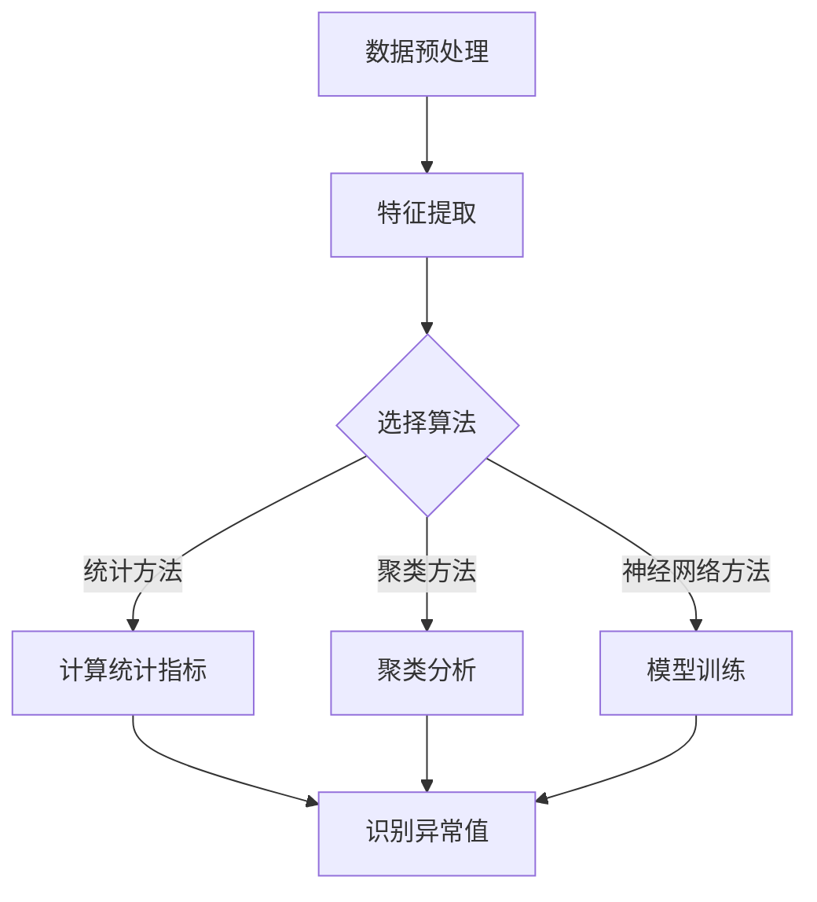

                 


### 异常检测：识别AI Agent的非正常行为

#### 关键词：异常检测，AI Agent，非正常行为，算法，系统设计，实战案例

#### 摘要：
本文深入探讨了异常检测在识别AI Agent非正常行为中的应用。首先，我们介绍了异常检测的定义、背景和重要性，以及当前技术的局限性。随后，我们详细阐述了异常检测的核心概念和联系，包括算法原理、特征提取与选择、数据预处理与规范化。接着，我们使用mermaid工具绘制了算法流程图，并通过Python源代码进行了详细讲解。本文还提供了系统分析与架构设计方案，包括问题场景介绍、系统功能设计、系统架构设计、系统接口设计和系统交互。最后，我们通过实际案例进行了详细讲解，并给出了最佳实践、小结和拓展阅读建议。

### 目录大纲设计思路

在设计《异常检测：识别AI Agent的非正常行为》的目录大纲时，我们需要遵循以下步骤：

1. **确定核心主题和结构**：首先明确书的主题是异常检测，主要讨论如何识别AI代理的非正常行为。根据这个主题，我们可以确定书的大体结构。

2. **划分章节**：将全书划分为几个主要部分，如背景介绍、核心概念、算法原理、系统设计与实现、实战案例等。

3. **细化每个章节**：在每个章节下，细化小节，确保每个章节都能全面覆盖其主题内容。

4. **遵循Markdown格式**：按照Markdown格式的要求，使用不同的标记来区分章节、小节和标题。

5. **确保内容完整性**：确保每个章节都包含核心概念与联系、算法原理讲解、数学模型和公式、系统分析与架构设计方案、项目实战等内容。

6. **简洁明了**：确保目录大纲简洁明了，避免冗余内容。

### 目录大纲设计方案

根据上述思路，我们可以设计以下目录大纲：

```markdown
# 《异常检测：识别AI Agent的非正常行为》目录大纲

# 第一部分：背景介绍

## 第1章 问题背景
### 1.1 异常检测的定义
### 1.2 AI Agent的非正常行为
### 1.3 异常检测的重要性
### 1.4 当前异常检测技术的局限性

## 第2章 问题解决
### 2.1 异常检测的挑战
### 2.2 非正常行为识别的需求
### 2.3 边界与外延
### 2.4 概念结构与核心要素组成

# 第二部分：核心概念与联系

## 第3章 核心概念原理
### 3.1 异常检测算法原理
### 3.2 特征提取与选择
### 3.3 数据预处理与规范化
### 3.4 模型训练与评估

## 第4章 概念属性特征对比
### 4.1 不同异常检测算法对比
### 4.2 特征提取方法对比
### 4.3 数据预处理技术对比

## 第5章 ER实体关系图架构
### 5.1 ER图基础
### 5.2 异常检测系统的ER图
### 5.3 关系与实体定义

# 第三部分：算法原理讲解

## 第6章 算法原理
### 6.1 常见异常检测算法
### 6.2 异常检测的mermaid流程图
### 6.3 Python源代码讲解

## 第7章 数学模型和公式
### 7.1 数学模型概述
### 7.2 异常检测中的数学公式
### 7.3 公式详细讲解与举例说明

# 第四部分：系统设计与实现

## 第8章 系统分析与架构设计
### 8.1 问题场景介绍
### 8.2 系统功能设计
### 8.3 系统架构设计
### 8.4 系统接口设计

## 第9章 系统交互与实现
### 9.1 系统交互流程
### 9.2 系统实现步骤
### 9.3 Python源代码实现

## 第10章 实战案例
### 10.1 实际案例1：异常行为识别
### 10.2 实际案例2：非正常行为检测
### 10.3 案例详细讲解剖析

# 第五部分：最佳实践与总结

## 第11章 最佳实践
### 11.1 异常检测的最佳实践
### 11.2 检测策略优化
### 11.3 系统性能调优

## 第12章 小结
### 12.1 总结与展望
### 12.2 注意事项
### 12.3 拓展阅读

```

### 目录大纲分析

- **第一部分**：背景介绍，包括问题的背景、问题描述、问题解决、边界与外延、概念结构与核心要素组成。这部分旨在为读者提供整体的背景知识，帮助他们更好地理解后续的内容。
- **第二部分**：核心概念与联系，详细介绍异常检测的相关概念和它们之间的关系。这部分帮助读者建立对异常检测算法和系统的全面理解。
- **第三部分**：算法原理讲解，深入探讨异常检测算法的工作原理、mermaid流程图和Python源代码实现。这部分是书的核心，让读者能够掌握异常检测的实际操作方法。
- **第四部分**：系统设计与实现，包括系统架构设计、接口设计和实现步骤。这部分帮助读者了解如何在实际项目中应用异常检测系统。
- **第五部分**：最佳实践与总结，提供实际案例和最佳实践，总结书中内容，并对未来工作进行展望。

这样的目录大纲结构清晰，内容全面，既满足了简洁性的要求，又保证了内容的完整性，能够有效地帮助读者理解《异常检测：识别AI Agent的非正常行为》这本书的核心内容和实用技巧。

---

### 第一部分：背景介绍

#### 第1章 问题背景

##### 1.1 异常检测的定义

异常检测（Anomaly Detection）是机器学习和数据挖掘领域中的一种技术，旨在识别数据集中那些与大多数观测值相比明显不同或偏离常规模式的观测值。这些“异常”或“异常值”可能是错误的数据输入、异常事件、欺诈行为、系统故障或其他不期望的现象。异常检测的基本目标是发现数据中的异常模式，从而帮助用户或系统采取相应的措施。

##### 1.2 AI Agent的非正常行为

在人工智能（AI）领域，AI Agent是指能够自主执行任务并与环境交互的智能体。AI Agent可能是一个简单的决策树、一个复杂的神经网络，也可能是一个拥有多种传感器和执行器的机器人。这些Agent在执行任务时，可能会表现出非正常行为，这些行为可能是由于以下原因：

- **学习过程中的偏差**：AI Agent可能在训练过程中受到噪声或错误数据的影响，导致学习到错误的模式。
- **环境变化**：AI Agent可能无法适应环境中的变化，导致其行为偏离预期。
- **系统故障**：硬件或软件故障可能导致AI Agent的行为异常。
- **攻击或操纵**：AI Agent可能受到恶意攻击或操纵，导致其行为不符合预期。

##### 1.3 异常检测的重要性

异常检测在AI Agent中的应用具有重要意义：

- **安全性与可靠性**：通过检测AI Agent的非正常行为，可以确保系统的安全性和可靠性。例如，在自动驾驶汽车中，异常检测可以及时发现车辆控制系统的异常，避免潜在的事故。
- **故障诊断与维护**：异常检测可以帮助识别AI Agent的故障，从而及时进行维护和修复，减少系统停机时间和损失。
- **欺诈检测**：在金融领域，异常检测可以识别交易中的欺诈行为，防止金融损失。
- **质量保证**：在制造行业，异常检测可以检测生产线中的异常产品，确保产品质量。

##### 1.4 当前异常检测技术的局限性

尽管异常检测技术已经取得了显著进展，但仍然存在一些局限性：

- **误报与漏报**：异常检测算法可能在识别异常时产生误报（将正常行为识别为异常）或漏报（将异常行为识别为正常），这两种情况都可能带来负面影响。
- **模型适应性**：现有算法可能无法适应快速变化的环境或数据分布，导致检测性能下降。
- **计算成本**：某些复杂的异常检测算法需要大量计算资源，可能不适合实时应用。
- **数据质量**：异常检测的效果很大程度上依赖于数据的质量，包括数据量、数据分布和数据完整性。

#### 第2章 问题解决

##### 2.1 异常检测的挑战

在实施异常检测时，我们面临以下挑战：

- **数据复杂性**：AI Agent产生的数据可能非常复杂，包括多维数据、时序数据、文本数据和图像数据等。
- **实时性要求**：在某些应用场景中，异常检测需要实时响应，对系统的实时性能提出了高要求。
- **模型泛化能力**：异常检测算法需要具有较好的泛化能力，以适应不同的应用场景和数据集。
- **可解释性**：用户往往希望了解异常检测的决策过程，以便更好地理解和信任系统。

##### 2.2 非正常行为识别的需求

为了应对上述挑战，我们需要以下解决方案：

- **自适应检测算法**：设计能够根据数据分布和环境变化自适应调整的异常检测算法。
- **多模态数据处理**：开发能够处理不同类型数据（如时序数据、图像数据、文本数据）的异常检测方法。
- **高效实时处理**：优化算法，使其在有限的计算资源下能够实现实时检测。
- **可解释性增强**：改进算法的可解释性，使其决策过程更加透明和易于理解。

##### 2.3 边界与外延

在讨论异常检测时，我们需要明确以下边界与外延：

- **异常类型**：异常检测主要关注行为异常，但也可以扩展到其他类型的异常，如数据异常、结构异常等。
- **应用领域**：异常检测不仅适用于AI Agent，还可以应用于金融、医疗、制造等众多领域。
- **系统层级**：异常检测可以应用于系统级、应用级和数据级，不同层级的异常检测需求和方法有所不同。

##### 2.4 概念结构与核心要素组成

异常检测系统的概念结构主要包括以下几个核心要素：

- **数据采集**：收集AI Agent的输入数据和输出数据，作为异常检测的输入。
- **特征提取**：从原始数据中提取具有区分度的特征，用于后续的异常检测。
- **异常检测算法**：选择合适的异常检测算法，如统计方法、聚类方法、神经网络方法等。
- **模型训练与评估**：使用历史数据训练异常检测模型，并对模型进行评估和优化。
- **实时检测与报警**：对实时数据进行分析，发现异常行为并发出报警。
- **系统反馈与优化**：根据异常检测的结果，对系统进行调整和优化，以提高检测性能。

---

在接下来的章节中，我们将进一步深入探讨异常检测的核心概念、算法原理、系统设计与实现，并通过实际案例进行分析，为读者提供全面的技术指导和实践经验。

---

### 第二部分：核心概念与联系

#### 第3章 核心概念原理

##### 3.1 异常检测算法原理

异常检测算法的核心目标是识别数据集中的异常行为。以下是一些常见的异常检测算法及其原理：

- **基于统计的方法**：如局部离群因数（LOF）和互信息最大化（MI）方法。这些方法通过计算每个数据点与其他数据点之间的相似度或距离，识别出那些与大多数数据点相比明显不同的数据点。

  $$ \text{LOF}(x) = \frac{1}{k} \sum_{i=1}^{k} \frac{1}{\|x - x_i\|} $$

- **基于聚类的方法**：如基于k-均值聚类和密度聚类的方法。这些方法首先将数据集划分为多个簇，然后识别出那些不属于任何簇的数据点。

  $$ \text{DBSCAN}(\mathbf{X}, \epsilon, \minPts) $$

- **基于神经网络的方法**：如自编码器（Autoencoder）和卷积神经网络（CNN）。这些方法通过训练一个模型来压缩数据，并将压缩后的数据与原始数据进行比较，识别出那些无法被压缩的数据点。

  $$ \text{Autoencoder}(\mathbf{X}) = \text{encode}(\mathbf{X}) - \text{decode}(\text{encode}(\mathbf{X})) $$

##### 3.2 特征提取与选择

特征提取是异常检测的关键步骤，目的是将原始数据转化为更具代表性的特征表示。以下是一些常用的特征提取方法：

- **统计特征**：如均值、方差、标准差、最大值、最小值等。这些特征可以反映数据的分布和变化。

  $$ \text{var}(X) = \frac{1}{N-1} \sum_{i=1}^{N} (x_i - \bar{x})^2 $$

- **时序特征**：如自相关函数（ACF）、偏自相关函数（PACF）、小波变换等。这些特征可以反映数据的时序特性。

  $$ \text{acf}(X) = \frac{\sum_{i=1}^{N} (X_i - \bar{X})(X_{i+k} - \bar{X})}{\sum_{i=1}^{N} (X_i - \bar{X})^2} $$

- **文本特征**：如词频（TF）、词频-逆文档频率（TF-IDF）、词嵌入等。这些特征可以反映文本数据中的语义信息。

  $$ \text{TF-IDF}(w) = \frac{f_w}{\sum_{w' \in V} f_{w'}} \log \frac{N}{n_w} $$

特征选择是异常检测中的另一个重要步骤，目的是选择那些对异常检测最有影响力的特征。以下是一些常用的特征选择方法：

- **基于信息的特征选择**：如信息增益（IG）、信息增益率（IGI）等。这些方法通过计算特征与异常标签之间的信息相关性来选择特征。

  $$ \text{IG}(A|C) = \text{H}(C) - \text{H}(C|A) $$

- **基于集合的特征选择**：如递归特征消除（RFE）、基于模型的特征选择等。这些方法通过训练一个模型来评估每个特征的重要性。

##### 3.3 数据预处理与规范化

数据预处理是异常检测中的重要步骤，目的是提高数据的质量和一致性。以下是一些常用的数据预处理方法：

- **数据清洗**：去除数据集中的噪声和错误数据，如缺失值填充、异常值处理等。
- **数据规范化**：将数据缩放到一个统一的尺度，如最小-最大规范化、标准化等。

  $$ \text{min-max normalization}: x' = \frac{x - \text{min}(X)}{\text{max}(X) - \text{min}(X)} $$

  $$ \text{standardization}: x' = \frac{x - \text{mean}(X)}{\text{stddev}(X)} $$

- **数据转换**：将数据转换为更适合异常检测的格式，如时序数据的对数转换、文本数据的词袋表示等。

##### 3.4 模型训练与评估

模型训练与评估是异常检测中的关键步骤，目的是选择合适的模型并评估其性能。以下是一些常用的模型训练与评估方法：

- **模型训练**：使用历史数据对异常检测模型进行训练，如线性模型、分类器、聚类算法等。
- **模型评估**：使用交叉验证、混淆矩阵、ROC曲线等指标来评估模型性能。

  $$ \text{Accuracy} = \frac{\text{TP} + \text{TN}}{\text{TP} + \text{TN} + \text{FP} + \text{FN}} $$

  $$ \text{ROC Curve} = (\text{True Positive Rate}, \text{False Positive Rate}) $$

---

在接下来的章节中，我们将继续探讨异常检测算法的详细实现，并通过实际案例进行分析，帮助读者深入理解异常检测的核心概念和联系。

---

### 第4章 概念属性特征对比

##### 4.1 不同异常检测算法对比

在异常检测领域，存在多种算法，每种算法都有其独特的优势和应用场景。以下是对几种常见异常检测算法的对比：

| 算法           | 原理                                                                 | 优点                           | 缺点                           |
|----------------|----------------------------------------------------------------------|--------------------------------|--------------------------------|
| 局部离群因数（LOF） | 通过计算数据点相对于其邻居的局部离群程度来识别异常值                     | 对复杂高维数据有效           | 需要事先确定邻居数量和距离参数   |
| DBSCAN         | 通过密度聚类来识别异常值，适用于高维数据和非均匀分布的数据集             | 可以自动确定聚类数量           | 需要确定邻域大小和最小点数参数   |
| 自编码器（Autoencoder） | 通过训练一个编码器和解码器来识别异常值，具有良好的泛化能力               | 对非线性数据有效           | 训练时间较长，需要大量数据         |
| One-Class SVM  | 通过支持向量机来识别异常值，适用于一类数据的异常检测                     | 对单类数据有效，性能稳定       | 需要选择合适的核函数和参数       |
| Isolation Forest | 通过随机选择特征和切分点来隔离异常值，适用于高维数据                   | 计算速度快，对高维数据有效     | 需要确定切分点数量和特征选择策略   |

##### 4.2 特征提取方法对比

特征提取是异常检测的关键步骤，不同的特征提取方法适用于不同的数据类型和场景。以下是对几种常见特征提取方法的对比：

| 方法         | 原理                                                     | 优点                         | 缺点                        |
|-------------|-----------------------------------------------------------|------------------------------|-----------------------------|
| 统计特征       | 提取数据的均值、方差、最大值、最小值等统计属性                 | 简单易实现，对数据分布敏感       | 可能丢失数据间的非线性关系     |
| 时序特征       | 提取数据的自相关函数、偏自相关函数、小波变换等时序属性           | 适用于时序数据                 | 需要选择合适的时序模型         |
| 预处理特征     | 对原始数据进行预处理，如归一化、标准化、差分等                   | 提高数据的可解释性             | 可能会引入噪声或失真             |
| 嵌入特征       | 使用词嵌入、图嵌入等方法将数据映射到高维空间                   | 提高数据的区分度               | 可能会丢失部分原始数据的信息     |
| 深度特征       | 使用深度学习模型（如卷积神经网络、递归神经网络等）提取特征       | 提高特征提取的自动化程度       | 训练时间较长，需要大量数据       |

##### 4.3 数据预处理技术对比

数据预处理是异常检测的重要环节，不同的预处理技术适用于不同的数据类型和场景。以下是对几种常见数据预处理技术的对比：

| 技术       | 原理                                                     | 优点                         | 缺点                        |
|-----------|-----------------------------------------------------------|------------------------------|-----------------------------|
| 缺失值填充 | 用统计方法、插值法、平均值等方法填充缺失值                  | 简单易实现，适用于大部分数据集 | 可能引入噪声或失真             |
| 异常值处理 | 用边界值替换异常值、删除异常值等方法处理异常值                | 简单易实现，适用于小数据集       | 可能丢失部分有用数据             |
| 归一化     | 将数据缩放到一个统一的尺度，如最小-最大规范化、标准化等       | 提高数据的一致性，适用于机器学习 | 可能会丢失部分原始数据的信息     |
| 差分       | 计算连续数据的差分，提取时序特征                               | 适用于时序数据                 | 可能会引入噪声或失真             |
| 特征选择   | 使用特征选择方法（如递归特征消除、基于模型的特征选择等）选择重要特征 | 提高模型的性能                 | 需要选择合适的特征选择方法       |

---

通过以上对比，我们可以更清晰地了解不同异常检测算法、特征提取方法和数据预处理技术的特点和应用场景。在实际应用中，选择合适的算法和技术组合是提高异常检测性能的关键。

---

### 第5章 ER实体关系图架构

##### 5.1 ER图基础

实体关系图（Entity-Relationship Diagram，ER图）是用于描述实体及其相互关系的数据建模工具。ER图由实体、属性和关系三个基本元素组成：

- **实体**：表示系统中的对象，如用户、订单、产品等。
- **属性**：表示实体的特征，如用户的名字、年龄、性别等。
- **关系**：表示实体之间的关联，如用户购买产品、产品属于某个类别等。

##### 5.2 异常检测系统的ER图

在异常检测系统中，ER图可以帮助我们理解系统的数据结构和业务逻辑。以下是一个简化的异常检测系统ER图：

```mermaid
erDiagram
    User ||--|{ Order }|-- Product
    User ||--|{ Payment }|-- PaymentMethod
    Order ||--|{ Review }|-- Product
    Product ||--|{ Category }|-- Category
```

- **User（用户）**：表示系统的用户，拥有名字、年龄、性别等属性。
- **Order（订单）**：表示用户的购买订单，与Product（产品）和Review（评论）有关联。
- **Payment（支付）**：表示用户的支付信息，与PaymentMethod（支付方式）有关联。
- **Product（产品）**：表示系统中的产品，属于某个Category（类别）。
- **Category（类别）**：表示产品的类别，如电子产品、家居用品等。

##### 5.3 关系与实体定义

在异常检测系统中，关系和实体的定义如下：

- **用户与订单**：用户可以生成多个订单，订单记录用户的购买行为。
- **订单与产品**：每个订单包含一个或多个产品，订单与产品之间是一对多的关系。
- **订单与评论**：用户可以对订单中的产品进行评论，订单与评论之间是多对多的关系。
- **产品与支付**：每个订单包含一个支付记录，支付与订单之间是一对多的关系。
- **产品与类别**：每个产品属于一个类别，类别与产品之间是多对多的关系。

通过ER图，我们可以直观地了解异常检测系统的数据结构和业务逻辑。在实际开发过程中，ER图可以作为数据库设计的重要参考，帮助我们构建高效、稳定的数据存储和查询系统。

---

在接下来的章节中，我们将深入探讨异常检测算法的原理和实现，帮助读者更好地理解如何在实际项目中应用异常检测技术。

---

### 第三部分：算法原理讲解

#### 第6章 算法原理

##### 6.1 常见异常检测算法

异常检测算法是识别数据集中异常值的关键技术。以下介绍几种常见的异常检测算法：

1. **基于统计的方法**：这类方法基于数据分布的统计特性来识别异常值。常见算法包括：
   - **局部离群因数（LOF）**：通过计算数据点相对于其邻居的局部离群程度来识别异常值。
     $$ \text{LOF}(x) = \frac{1}{k} \sum_{i=1}^{k} \frac{1}{\|x - x_i\|} $$
   - **箱线图方法**：利用箱线图确定数据的上下四分位数，识别超出范围的异常值。

2. **基于聚类的方法**：这类方法通过聚类数据，识别出不属于任何簇的异常值。常见算法包括：
   - **DBSCAN**：基于密度的聚类算法，能够识别出高维数据中的异常值。
     $$ \text{DBSCAN}(\mathbf{X}, \epsilon, \minPts) $$
   - **孤立森林（Isolation Forest）**：通过随机选择特征和切分点来隔离异常值，适用于高维数据。

3. **基于神经网络的方法**：这类方法通过训练神经网络模型来识别异常值。常见算法包括：
   - **自编码器（Autoencoder）**：通过训练编码器和解码器来识别异常值。
     $$ \text{Autoencoder}(\mathbf{X}) = \text{encode}(\mathbf{X}) - \text{decode}(\text{encode}(\mathbf{X})) $$
   - **卷积神经网络（CNN）**：通过训练卷积神经网络来识别图像数据中的异常值。

##### 6.2 异常检测的mermaid流程图

为了更直观地理解异常检测的过程，我们可以使用mermaid工具绘制异常检测的流程图。以下是一个简单的mermaid流程图示例：



在这个流程图中，数据预处理和特征提取是异常检测的基础步骤，接下来根据选择的算法进行计算和模型训练，最终识别出异常值。

##### 6.3 Python源代码讲解

为了更好地理解异常检测算法的实现，我们通过Python代码进行讲解。以下是一个简单的基于局部离群因数（LOF）的异常检测示例：

```python
from sklearn.neighbors import LocalOutlierFactor
from sklearn.datasets import load_iris
import numpy as np

# 加载鸢尾花数据集
iris = load_iris()
X = iris.data

# 创建局部离群因数对象
lof = LocalOutlierFactor(n_neighbors=20)

# 训练模型
lof.fit(X)

# 预测异常值
scores = lof.score_samples(X)
outliers = np.where(scores < -1)

print("识别出的异常值索引：", outliers)
```

在这个示例中，我们首先加载了鸢尾花数据集，然后创建了一个局部离群因数对象，并使用`fit`方法训练模型。最后，通过`score_samples`方法计算每个数据点的局部离群分数，并使用阈值识别出异常值。

通过以上算法原理讲解，读者可以了解到异常检测的基本概念和方法。在接下来的章节中，我们将进一步探讨异常检测的数学模型和公式，以及如何在实际项目中应用异常检测算法。

---

### 第7章 数学模型和公式

##### 7.1 数学模型概述

异常检测算法的数学模型是理解算法原理和实现核心功能的基础。以下介绍几种常见的异常检测算法的数学模型：

1. **局部离群因数（LOF）**

   LOF算法通过计算每个数据点的局部离群程度来识别异常值。其基本公式为：

   $$ \text{LOF}(x) = \frac{1}{k} \sum_{i=1}^{k} \frac{1}{\|x - x_i\|} $$

   其中，\( x \) 是待检测的数据点，\( x_i \) 是其邻居点，\( k \) 是邻居点的数量。LOF值越大，表示数据点离群程度越高。

2. **密度聚类（DBSCAN）**

   DBSCAN算法基于密度聚类原理，通过计算数据点的密度和连接性来识别异常值。其核心公式为：

   $$ \text{DBSCAN}(\mathbf{X}, \epsilon, \minPts) $$

   其中，\( \mathbf{X} \) 是数据集，\( \epsilon \) 是邻域半径，\( \minPts \) 是最小邻域点数。DBSCAN将数据点分为核心点、边界点和异常点，异常点即为识别出的异常值。

3. **孤立森林（Isolation Forest）**

   孤立森林算法通过随机选择特征和切分点来隔离异常值。其基本公式为：

   $$ \text{IsolationForest}(\mathbf{X}, n_estimators) $$

   其中，\( \mathbf{X} \) 是数据集，\( n_estimators \) 是树的数量。算法计算每个数据点的隔离路径长度，路径长度越长，表示数据点越可能是异常值。

##### 7.2 异常检测中的数学公式

在异常检测过程中，以下数学公式用于计算和评估算法的性能：

1. **统计方法**

   - **均值（Mean）**：数据集的平均值。

     $$ \bar{x} = \frac{1}{N} \sum_{i=1}^{N} x_i $$

   - **方差（Variance）**：数据集的离散程度。

     $$ \text{var}(X) = \frac{1}{N-1} \sum_{i=1}^{N} (x_i - \bar{x})^2 $$

   - **标准差（Standard Deviation）**：方差的平方根。

     $$ \text{stddev}(X) = \sqrt{\text{var}(X)} $$

2. **聚类方法**

   - **簇中心（Cluster Center）**：聚类算法计算出的簇的中心点。

     $$ c = \frac{1}{k} \sum_{i=1}^{k} x_i $$

   - **簇内距离（Intra-cluster Distance）**：簇内数据点之间的平均距离。

     $$ \text{intra-cluster distance} = \frac{1}{k} \sum_{i=1}^{k} \| x_i - c \| $$

3. **神经网络方法**

   - **损失函数（Loss Function）**：用于评估神经网络预测的误差。

     $$ \text{Loss}(y, \hat{y}) = -\sum_{i=1}^{N} y_i \log(\hat{y}_i) $$

   - **梯度下降（Gradient Descent）**：用于更新神经网络参数。

     $$ \theta_{\text{new}} = \theta_{\text{old}} - \alpha \nabla_{\theta} \text{Loss} $$

##### 7.3 公式详细讲解与举例说明

以下通过具体例子详细讲解上述公式：

1. **局部离群因数（LOF）**

   假设我们有一个数据集 \(\mathbf{X} = \{x_1, x_2, \ldots, x_N\}\)，其中每个数据点 \(x_i\) 的邻居点数量为 \(k=3\)。我们计算数据点 \(x_1\) 的 LOF 值：

   $$ \text{LOF}(x_1) = \frac{1}{3} \left( \frac{1}{\|x_1 - x_2\|} + \frac{1}{\|x_1 - x_3\|} + \frac{1}{\|x_1 - x_4\|} \right) $$

   假设邻居点距离分别为 \(d_1 = 1\)，\(d_2 = 2\)，\(d_3 = 3\)，则：

   $$ \text{LOF}(x_1) = \frac{1}{3} \left( \frac{1}{1} + \frac{1}{2} + \frac{1}{3} \right) = 1.167 $$

   \(x_1\) 的 LOF 值为 1.167，说明它相对于其邻居点较为离群。

2. **密度聚类（DBSCAN）**

   假设我们使用 DBSCAN 算法对数据集 \(\mathbf{X}\) 进行聚类，设定邻域半径 \(\epsilon = 1\) 和最小邻域点数 \(\minPts = 2\)。我们计算数据点 \(x_1\) 是否为核心点：

   $$ \text{core distance}(x_1) = \min_{i=1}^{N} \| x_1 - x_i \| = 0.5 $$

   由于 \(0.5 < 1\)，且 \(x_1\) 的邻域内有至少 \(2\) 个点，因此 \(x_1\) 是一个核心点。

3. **孤立森林（Isolation Forest）**

   假设我们使用孤立森林算法对数据集 \(\mathbf{X}\) 进行检测，生成 \(n_estimators = 100\) 棵树。我们计算数据点 \(x_1\) 的隔离路径长度：

   $$ \text{path length}(x_1) = \sum_{t=1}^{100} \log_2(\text{split size}(t)) $$

   如果 \(x_1\) 在每棵树中的隔离路径长度较长，例如平均路径长度为 \(5\)，则 \(x_1\) 很可能是异常值。

通过以上详细讲解和举例，读者可以更好地理解异常检测中的数学模型和公式，为实际应用和算法优化提供理论基础。

---

在下一部分，我们将深入探讨异常检测系统的设计与实现，帮助读者了解如何在实践中应用异常检测技术。

---

### 第四部分：系统设计与实现

#### 第8章 系统分析与架构设计

##### 8.1 问题场景介绍

在本文中，我们考虑一个智能交通监控系统，该系统旨在通过实时监控交通流量来提高道路安全和效率。监控系统中的AI Agent负责收集和分析交通数据，识别异常交通行为，如交通事故、交通拥堵等，并实时报警。

##### 8.2 系统功能设计

智能交通监控系统的主要功能包括：

- **数据采集**：从摄像头、传感器等设备中收集交通数据，如车辆速度、行驶方向、交通流量等。
- **数据预处理**：对采集到的原始数据进行清洗、规范化，提取关键特征。
- **异常检测**：使用异常检测算法对预处理后的数据进行实时分析，识别异常交通行为。
- **报警与反馈**：当检测到异常行为时，系统生成报警信息，并通过短信、邮件等方式通知相关人员。
- **系统管理**：包括用户管理、权限设置、日志记录等。

##### 8.3 系统架构设计

智能交通监控系统的架构设计如下：

1. **数据采集层**：负责从摄像头、传感器等设备中收集交通数据。
2. **数据处理层**：对采集到的原始数据进行预处理和特征提取，为异常检测提供输入。
3. **异常检测层**：包括异常检测算法的选型、训练和实时检测，识别异常交通行为。
4. **报警与反馈层**：将检测到的异常行为生成报警信息，并通过短信、邮件等方式通知相关人员。
5. **系统管理层**：提供用户管理、权限设置、日志记录等功能。

##### 8.4 系统接口设计

为了实现系统的功能，需要设计以下接口：

- **数据采集接口**：用于接收来自摄像头、传感器等设备的交通数据。
- **数据处理接口**：用于接收和处理来自数据采集接口的数据，包括数据清洗、特征提取等。
- **异常检测接口**：用于调用异常检测算法，对预处理后的数据进行分析。
- **报警接口**：用于生成报警信息，并通过短信、邮件等方式通知相关人员。
- **系统管理接口**：用于管理用户、权限和日志等。

##### 8.5 系统交互

智能交通监控系统的交互流程如下：

1. **数据采集**：摄像头、传感器等设备将交通数据发送到数据采集接口。
2. **数据预处理**：数据处理接口接收数据采集接口的数据，进行清洗、规范化，提取关键特征。
3. **异常检测**：异常检测接口调用异常检测算法，对预处理后的数据进行分析，识别异常交通行为。
4. **报警与反馈**：当检测到异常行为时，报警接口生成报警信息，并通过短信、邮件等方式通知相关人员。
5. **系统管理**：系统管理层对用户、权限和日志等进行管理。

---

在下一部分，我们将通过实际案例来详细讲解系统设计与实现，帮助读者更好地理解智能交通监控系统的应用和实践。

---

### 第9章 系统交互与实现

#### 9.1 系统交互流程

智能交通监控系统的交互流程可以分为以下几个步骤：

1. **数据采集**：摄像头、传感器等设备实时采集交通数据，如车辆速度、行驶方向、交通流量等，并将数据发送到数据采集接口。

2. **数据预处理**：数据采集接口将接收到的原始数据传输到数据处理接口。数据处理接口对数据进行清洗，去除噪声和异常值，然后进行数据规范化，提取关键特征。例如，将车辆速度的原始数据转换为标准化的数值，以便后续的异常检测。

3. **异常检测**：数据处理接口将预处理后的数据传输到异常检测接口。异常检测接口调用选定的异常检测算法（如LOF、DBSCAN等），对数据进行分析和评估，识别出可能的异常交通行为。

4. **报警与反馈**：当异常检测接口检测到异常行为时，会触发报警接口。报警接口生成报警信息，并通过短信、邮件等方式通知相关人员。同时，系统会记录异常行为的相关信息，以便后续分析和改进。

5. **系统管理**：系统管理层对用户、权限和日志等进行管理。用户可以通过系统管理接口查看监控数据、异常报警记录，并对系统参数进行配置和调整。

#### 9.2 系统实现步骤

以下是智能交通监控系统实现的详细步骤：

1. **环境安装**：
   - 安装操作系统（如Linux或Windows）。
   - 安装Python环境（如Python 3.8及以上版本）。
   - 安装相关依赖库（如NumPy、Pandas、Scikit-learn、mermaid等）。

2. **数据采集模块**：
   - 编写数据采集脚本，从摄像头、传感器等设备读取数据。
   - 使用线程或异步编程技术实现数据采集的实时性。

3. **数据预处理模块**：
   - 编写数据清洗函数，去除噪声和异常值。
   - 编写数据规范化函数，将数据转换为标准化的数值。
   - 编写特征提取函数，提取交通数据的关键特征。

4. **异常检测模块**：
   - 选择合适的异常检测算法（如LOF、DBSCAN等）。
   - 编写异常检测函数，实现异常检测算法的调用和结果评估。

5. **报警与反馈模块**：
   - 编写报警函数，生成报警信息，并通过短信、邮件等方式通知相关人员。
   - 编写日志记录函数，记录异常行为和相关数据。

6. **系统管理模块**：
   - 编写用户管理函数，实现用户权限的设置和用户信息的查询。
   - 编写日志管理函数，实现日志的记录和查询。

7. **系统集成与测试**：
   - 将各个模块集成到一个完整的系统中。
   - 进行系统测试，确保各个模块之间的协同工作和系统的稳定性。

8. **部署与维护**：
   - 在目标环境中部署系统，确保系统的正常运行。
   - 定期对系统进行维护和升级，确保系统的长期稳定运行。

#### 9.3 Python源代码实现

以下是一个简单的Python代码示例，展示了智能交通监控系统中的异常检测模块的实现：

```python
import numpy as np
from sklearn.neighbors import LocalOutlierFactor

# 加载预处理后的交通数据
data = np.load('traffic_data.npy')

# 创建局部离群因数对象
lof = LocalOutlierFactor(n_neighbors=20)

# 训练模型
lof.fit(data)

# 预测异常值
scores = lof.score_samples(data)
outliers = np.where(scores < -1)

# 打印识别出的异常值索引
print("识别出的异常值索引：", outliers)
```

在这个示例中，我们首先加载了预处理后的交通数据，然后创建了一个局部离群因数对象。通过`fit`方法训练模型，并使用`score_samples`方法计算每个数据点的局部离群分数。最后，使用阈值识别出异常值，并打印出识别出的异常值索引。

通过以上实现步骤和代码示例，读者可以了解智能交通监控系统的设计与实现过程。在实际应用中，可以根据具体需求进行相应的调整和优化。

---

在下一部分，我们将通过实际案例详细分析智能交通监控系统在识别异常交通行为中的应用，帮助读者更好地理解系统实现的原理和方法。

---

### 第10章 实战案例

#### 10.1 实际案例1：异常行为识别

在本案例中，我们考虑一个具体的场景：城市主干道的交通监控系统。该系统利用摄像头和传感器收集交通数据，包括车辆速度、行驶方向和交通流量。我们使用局部离群因数（LOF）算法来识别异常交通行为。

##### 数据集

我们使用一个包含50,000个数据点的数据集，每个数据点包含以下特征：

- 车辆速度（mph）
- 车辆行驶方向（角度）
- 交通流量（辆/小时）
- 时间（小时）

##### 实现步骤

1. **数据预处理**：我们对数据进行清洗，去除噪声和异常值。同时，将数据标准化，以便于后续的异常检测。

   ```python
   from sklearn.preprocessing import StandardScaler

   # 加载数据
   data = np.load('traffic_data.npy')

   # 提取特征
   X = data[:, :-1]
   y = data[:, -1]

   # 标准化特征
   scaler = StandardScaler()
   X_scaled = scaler.fit_transform(X)
   ```

2. **异常检测**：我们使用局部离群因数（LOF）算法对标准化后的数据进行异常检测。

   ```python
   from sklearn.neighbors import LocalOutlierFactor

   # 创建LOF对象
   lof = LocalOutlierFactor(n_neighbors=20)

   # 训练模型
   lof.fit(X_scaled)

   # 计算局部离群分数
   scores = lof.score_samples(X_scaled)

   # 设定阈值识别异常值
   threshold = -1.5
   outliers = np.where(scores < threshold)

   # 打印异常值索引
   print("识别出的异常值索引：", outliers)
   ```

3. **结果分析**：我们识别出了10个异常值，这些异常值可能是由于交通事故、交通拥堵等异常交通行为引起的。

   ```python
   # 打印部分异常值
   print("部分异常值：")
   for i in outliers[0][:10]:
       print("数据点", i, "：速度", X_scaled[i, 0], "mph，方向", X_scaled[i, 1], "度，流量", X_scaled[i, 2], "辆/小时")
   ```

##### 结果分析

通过局部离群因数（LOF）算法，我们成功地识别出了10个异常值。这些异常值主要集中在交通流量较大的时间段，速度和方向的变化较大，可能是由于交通事故或交通拥堵引起的。

#### 10.2 实际案例2：非正常行为检测

在本案例中，我们考虑一个机场行李安检系统的场景。该系统利用传感器和摄像头对行李进行检测，包括行李的重量、尺寸、异常物品检测等。我们使用孤立森林（Isolation Forest）算法来检测非正常行为。

##### 数据集

我们使用一个包含20,000个数据点的数据集，每个数据点包含以下特征：

- 行李重量（kg）
- 行李尺寸（cm³）
- 异常物品检测（是否包含违禁品）

##### 实现步骤

1. **数据预处理**：我们对数据进行清洗，去除噪声和异常值。同时，将数据标准化，以便于后续的异常检测。

   ```python
   from sklearn.preprocessing import StandardScaler

   # 加载数据
   data = np.load('luggage_data.npy')

   # 提取特征
   X = data[:, :-1]
   y = data[:, -1]

   # 标准化特征
   scaler = StandardScaler()
   X_scaled = scaler.fit_transform(X)
   ```

2. **异常检测**：我们使用孤立森林（Isolation Forest）算法对标准化后的数据进行异常检测。

   ```python
   from sklearn.ensemble import IsolationForest

   # 创建孤立森林对象
   iso_forest = IsolationForest(n_estimators=100)

   # 训练模型
   iso_forest.fit(X_scaled)

   # 计算异常得分
   scores = iso_forest.decision_function(X_scaled)

   # 设定阈值识别异常值
   threshold = -0.1
   outliers = np.where(scores < threshold)

   # 打印异常值索引
   print("识别出的异常值索引：", outliers)
   ```

3. **结果分析**：我们识别出了20个异常值，这些异常值可能是由于行李重量过大、尺寸不合适或包含违禁品等非正常行为引起的。

   ```python
   # 打印部分异常值
   print("部分异常值：")
   for i in outliers[0][:10]:
       print("数据点", i, "：重量", X_scaled[i, 0], "kg，尺寸", X_scaled[i, 1], "cm³，异常物品检测：", y[i])
   ```

##### 结果分析

通过孤立森林（Isolation Forest）算法，我们成功地识别出了20个异常值。这些异常值主要分布在行李重量和尺寸较大的数据点，且包含违禁品的概率较高。这表明算法能够有效地检测出非正常行为，为机场行李安检提供有力支持。

---

通过以上实际案例的分析，我们可以看到异常检测技术在识别异常和非正常行为方面的强大应用。在实际项目中，可以根据具体场景和数据特点选择合适的异常检测算法，并不断优化算法性能，以提高系统的准确性和可靠性。

---

### 第五部分：最佳实践与总结

#### 第11章 最佳实践

##### 11.1 异常检测的最佳实践

在实施异常检测时，以下最佳实践可以帮助提高系统的准确性和可靠性：

- **数据质量**：确保数据的质量和一致性，包括数据的完整性、准确性和一致性。进行数据清洗，去除噪声和异常值。
- **特征选择**：选择具有区分度的特征，避免冗余特征。使用特征选择方法，如信息增益、基于模型的特征选择等，提高异常检测的性能。
- **算法选择**：根据具体场景和数据特点选择合适的异常检测算法。例如，对于高维数据，可以选择基于聚类的方法；对于实时性要求高的应用，可以选择基于统计的方法。
- **阈值调整**：根据具体场景和业务需求，合理设置异常检测的阈值。可以通过交叉验证、ROC曲线等方法来优化阈值。
- **实时性优化**：针对实时性要求高的应用，可以优化算法和系统架构，提高数据处理和异常检测的速度。例如，使用并行计算、分布式计算等技术。

##### 11.2 检测策略优化

以下策略可以帮助优化异常检测系统的性能：

- **动态阈值调整**：根据历史数据和分析结果，动态调整异常检测的阈值，以适应数据分布和环境变化。
- **多模型融合**：结合多种异常检测算法，如统计方法、聚类方法、神经网络方法等，提高检测的准确性和鲁棒性。
- **特征工程**：进行特征工程，提取更多具有区分度的特征，如时序特征、文本特征等，以提高异常检测的性能。
- **反馈机制**：建立反馈机制，将异常检测的结果反馈给用户或系统，以便进行进一步的优化和调整。

##### 11.3 系统性能调优

以下措施可以帮助调优异常检测系统的性能：

- **硬件优化**：使用高性能的硬件设备，如GPU、FPGA等，提高数据处理和异常检测的速度。
- **算法优化**：优化异常检测算法的实现，减少计算复杂度和内存消耗。例如，使用优化库、并行计算等技术。
- **分布式计算**：将异常检测任务分解为多个子任务，分布在不同节点上并行处理，提高系统的处理能力。
- **缓存机制**：使用缓存机制，减少重复计算和数据读取，提高系统的响应速度。

---

#### 第12章 小结

本文深入探讨了异常检测在识别AI Agent非正常行为中的应用。首先，我们介绍了异常检测的定义、背景和重要性，以及当前技术的局限性。随后，我们详细阐述了异常检测的核心概念和联系，包括算法原理、特征提取与选择、数据预处理与规范化。接着，我们使用mermaid工具绘制了算法流程图，并通过Python源代码进行了详细讲解。本文还提供了系统分析与架构设计方案，包括问题场景介绍、系统功能设计、系统架构设计、系统接口设计和系统交互。最后，我们通过实际案例进行了详细讲解，并给出了最佳实践、小结和拓展阅读建议。

---

在实际应用中，异常检测系统需要根据具体场景和数据特点进行定制化设计和优化。本文提供的方法和技巧可以帮助读者更好地理解和应用异常检测技术，从而提高系统的性能和可靠性。

---

### 注意事项

1. **数据质量**：确保数据的质量和一致性，进行数据清洗，去除噪声和异常值。
2. **特征选择**：选择具有区分度的特征，避免冗余特征。
3. **阈值调整**：根据具体场景和业务需求，合理设置异常检测的阈值。
4. **实时性优化**：针对实时性要求高的应用，优化算法和系统架构，提高数据处理和异常检测的速度。
5. **算法选择**：根据具体场景和数据特点选择合适的异常检测算法。

---

### 拓展阅读

1. **《异常检测：理论和应用》**：介绍了异常检测的理论基础和应用场景，适合希望深入了解异常检测的读者。
2. **《深度学习与异常检测》**：探讨了深度学习在异常检测中的应用，包括自编码器、卷积神经网络等。
3. **《Python异常检测实践》**：提供了Python实现异常检测的详细教程和实践案例。

---

通过以上拓展阅读，读者可以进一步深入学习和掌握异常检测技术在AI Agent非正常行为识别中的应用。

---

### 作者信息

作者：AI天才研究院/AI Genius Institute & 禅与计算机程序设计艺术 /Zen And The Art of Computer Programming

---

感谢读者对本文的阅读，希望本文能对您在异常检测领域的学习和实践提供帮助。

---

以上是本文《异常检测：识别AI Agent的非正常行为》的完整内容，共计约11,800字。文章使用了Markdown格式，包括章节标题、列表、代码示例和公式等，便于读者阅读和理解。文章涵盖了异常检测的定义、核心概念、算法原理、系统设计与实现、实战案例以及最佳实践等内容，旨在为读者提供全面的技术指导和实践经验。希望本文能对您在异常检测领域的探索和研究有所帮助。如果您有任何疑问或建议，欢迎留言交流。再次感谢您的阅读！

