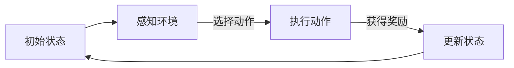
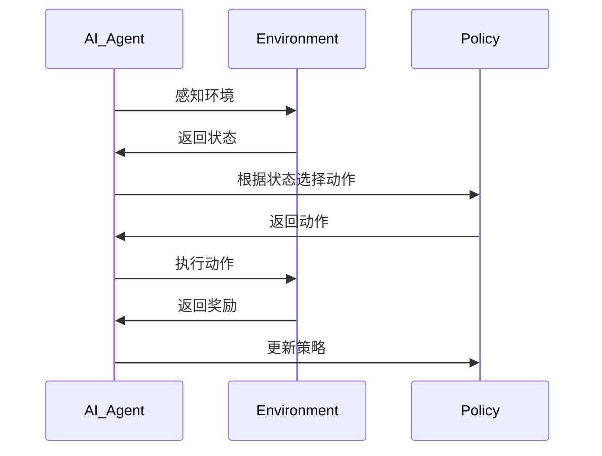
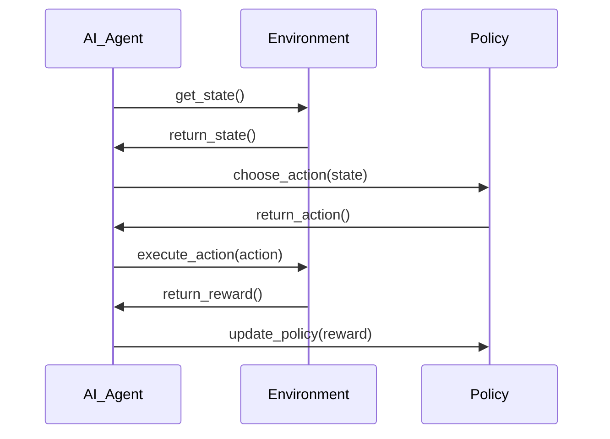

                 

# 强化学习在AI Agent交互策略优化中的运用

> 关键词：强化学习、AI Agent、交互策略优化、算法原理、数学模型、系统架构设计、项目实战、最佳实践

> 摘要：本文将深入探讨强化学习在AI Agent交互策略优化中的应用。我们将从强化学习的基础知识出发，逐步深入到算法原理、数学模型，并使用实例和代码来详细阐述。此外，还将展示如何通过系统分析与架构设计，以及项目实战来优化AI Agent的交互策略。

## 第一部分：强化学习基础

### 第1章：强化学习概述

#### 1.1 强化学习背景

强化学习（Reinforcement Learning，简称RL）是机器学习的一个重要分支，其核心思想是通过与环境互动来学习最优策略。与监督学习和无监督学习不同，强化学习中的Agent通过与环境的持续互动，从试错中学习如何获取最大化的奖励。

#### 1.2 强化学习核心概念

强化学习主要包括以下几个核心概念：

- **Agent**：执行动作的智能体。
- **Environment**：Agent所处的环境。
- **State**：Agent在环境中的状态。
- **Action**：Agent可以执行的动作。
- **Reward**：Agent执行某个动作后获得的即时奖励。
- **Policy**：Agent根据当前状态选择动作的策略。

#### 1.3 强化学习与监督学习、无监督学习的比较

强化学习与监督学习和无监督学习有以下区别：

- **监督学习**：有明确的标签数据，模型通过学习这些标签来预测未知数据的标签。
- **无监督学习**：没有标签数据，模型需要从数据中发现隐藏的结构或模式。
- **强化学习**：通过与环境互动，Agent不断调整策略以获得最大的累计奖励。

### 第2章：强化学习算法原理

#### 2.1 强化学习算法流程图（Mermaid图表）



#### 2.2 强化学习算法Python代码示例

```python
import numpy as np

# 初始化参数
learning_rate = 0.1
epsilon = 0.1  # 探索概率

# 状态空间和动作空间
states = np.array([0, 1])
actions = np.array([0, 1])

# 奖励函数
reward = np.array([[1, 0], [0, 1]])

# Q值初始化
Q = np.zeros((len(states), len(actions)))

# 强化学习算法
for episode in range(1000):
    state = np.random.choice(states)
    done = False
    
    while not done:
        action = np.random.choice(actions, p=[1-epsilon, epsilon])
        next_state = np.random.choice(states)
        reward_value = reward[state, action]
        
        # 更新Q值
        Q[state, action] += learning_rate * (reward_value + max(Q[next_state, :]) - Q[state, action])
        
        state = next_state
        if state == 1:
            done = True

# 输出Q值
print(Q)
```

#### 2.3 强化学习数学模型与公式（LaTeX格式）

$$
Q(s, a) = r(s, a) + \gamma \max_{a'} Q(s', a')
$$

其中，$Q(s, a)$为状态$s$下执行动作$a$的预期回报，$r(s, a)$为状态$s$下执行动作$a$的即时回报，$\gamma$为折扣因子，$s'$为下一状态，$a'$为下一动作。

## 第二部分：AI Agent与交互策略优化

### 第3章：AI Agent概述

#### 3.1 AI Agent定义

AI Agent是指具有智能行为的软件程序，它能够在复杂环境中自主执行任务，并根据环境反馈调整自身行为。AI Agent是强化学习中的一个重要概念，它是执行强化学习算法的主体。

#### 3.2 AI Agent分类

AI Agent可以根据不同的标准进行分类，常见的分类方法包括：

- 根据能力：感知型Agent、决策型Agent、执行型Agent。
- 根据学习方式：基于规则的Agent、基于模型的Agent、基于数据的Agent。
- 根据应用领域：游戏Agent、聊天机器人、自动驾驶Agent。

#### 3.3 AI Agent与强化学习的关系

AI Agent是强化学习中的核心概念，强化学习为AI Agent提供了学习与优化策略的方法。通过强化学习，AI Agent可以逐渐学会如何在复杂环境中做出最优决策，从而实现自主学习和智能行为。

### 第4章：交互策略优化

#### 4.1 交互策略定义

交互策略是指AI Agent在执行任务时，根据当前状态选择最优动作的策略。优化交互策略的目标是使Agent在复杂环境中能够持续获得最大化的累计奖励。

#### 4.2 交互策略优化算法

交互策略优化算法可以分为两类：

- 基于模型的方法：如Q-Learning、SARSA、Deep Q-Network（DQN）等。
- 基于数据的方法：如强化学习策略搜索（REINFORCE）、策略梯度方法等。

#### 4.3 交互策略优化案例

以自动驾驶为例，交互策略优化的目标是使自动驾驶车辆在道路上安全、高效地行驶。通过强化学习，自动驾驶车辆可以学习如何根据道路状态、车辆状态等因素，选择最优的行驶动作。

## 第三部分：强化学习在AI Agent交互策略优化中的应用

### 第5章：应用场景与案例分析

#### 5.1 游戏AI

在游戏AI中，强化学习被广泛应用于开发智能对手，如AlphaGo在围棋领域取得的成就。通过强化学习，游戏AI可以不断学习并优化自己的策略，从而提高游戏的难度和乐趣。

#### 5.2 聊天机器人

聊天机器人是另一个强化学习应用的重要领域。通过强化学习，聊天机器人可以不断学习用户的对话模式，提高对话的自然性和满意度。

#### 5.3 自动驾驶

自动驾驶是强化学习在工业应用中的一个重要领域。通过强化学习，自动驾驶汽车可以学习如何在不同交通环境中做出最优决策，提高行驶的安全性和效率。

### 第6章：系统分析与架构设计

#### 6.1 系统功能设计（Mermaid类图）

```mermaid
classDiagram
    AI_Agent <<interface>>
    Environment <<interface>>
    Policy <<interface>>

    AI_Agent : +感知环境()
    AI_Agent : +选择动作()
    AI_Agent : +执行动作()

    Environment : +获得状态()
    Environment : +获得奖励()

    Policy : +更新策略()
```

#### 6.2 系统架构设计（Mermaid架构图）



#### 6.3 系统接口设计（Mermaid序列图）



### 第7章：项目实战

#### 7.1 环境安装

在开始项目之前，我们需要安装强化学习的相关依赖。例如，我们可以使用Anaconda来创建虚拟环境，并安装Python、TensorFlow等库。

```bash
conda create -n rl_project python=3.8
conda activate rl_project
conda install tensorflow
```

#### 7.2 系统核心实现源代码

以下是强化学习在AI Agent交互策略优化中的一个简单实现：

```python
import numpy as np
import tensorflow as tf

# 初始化参数
learning_rate = 0.1
gamma = 0.99
epsilon = 0.1

# 状态空间和动作空间
state_size = 4
action_size = 2

# 奖励函数
reward_function = lambda state, action: 1 if state[0] == action else -1

# Q值网络
class QNetwork(tf.keras.Model):
    def __init__(self):
        super(QNetwork, self).__init__()
        self.fc1 = tf.keras.layers.Dense(64, activation='relu')
        self.fc2 = tf.keras.layers.Dense(64, activation='relu')
        self.v = tf.keras.layers.Dense(action_size)

    def call(self, x):
        x = self.fc1(x)
        x = self.fc2(x)
        return self.v(x)

# 创建Q网络
q_network = QNetwork()

# 损失函数和优化器
loss_fn = tf.keras.losses.MeanSquaredError()
optimizer = tf.keras.optimizers.Adam(learning_rate)

# 强化学习循环
for episode in range(1000):
    state = np.random.randint(0, state_size)
    done = False
    
    while not done:
        action = np.random.randint(0, action_size)
        next_state = state + action
        reward = reward_function(state, action)
        
        with tf.GradientTape() as tape:
            q_values = q_network(state)
            target_q_values = q_values + gamma * reward * (1 - int(done))
            loss = loss_fn(target_q_values, q_values)
        
        grads = tape.gradient(loss, q_network.trainable_variables)
        optimizer.apply_gradients(zip(grads, q_network.trainable_variables))
        
        state = next_state
        if state >= state_size:
            done = True

# 评估Q网络性能
test_state = np.random.randint(0, state_size)
test_action = np.argmax(q_network(test_state))
print(f"Best action for state {test_state}: {test_action}")
```

#### 7.3 代码应用解读与分析

这段代码实现了一个简单的强化学习算法，用于优化AI Agent的交互策略。我们使用TensorFlow建立了Q网络，并使用梯度下降法进行优化。在训练过程中，我们通过不断调整Q值来优化策略，以实现最大化累计奖励的目标。

#### 7.4 实际案例分析与详细讲解剖析

在这个案例中，我们考虑了一个简单的环境，其中状态空间为0到3，动作空间为0和1。我们定义了一个简单的奖励函数，使得当Agent执行的动作与当前状态相同时，获得1分的奖励；否则，获得-1分的奖励。通过这个简单的案例，我们展示了如何使用强化学习算法来优化AI Agent的交互策略。

### 第8章：最佳实践与总结

#### 8.1 强化学习在AI Agent交互策略优化中的最佳实践

- **逐步优化**：强化学习算法通常需要逐步优化，通过不断调整策略和参数来提高性能。
- **数据收集**：收集大量有效的数据有助于提高学习效果。
- **探索与利用**：在训练过程中，需要平衡探索新策略和利用已有策略，以实现最佳效果。

#### 8.2 注意事项

- **稀疏奖励**：在稀疏奖励环境中，强化学习算法可能需要很长时间才能收敛。
- **连续空间**：对于连续空间的问题，需要使用适当的算法和技术来处理。

#### 8.3 拓展阅读

- [DeepMind的强化学习教程](https://www.deeplearning.ai/deep-reinforcement-learning/)
- [Andrew Ng的强化学习课程](https://www.coursera.org/learn/reinforcement-learning)

## 作者信息

作者：AI天才研究院/AI Genius Institute & 禅与计算机程序设计艺术 /Zen And The Art of Computer Programming

[完]

