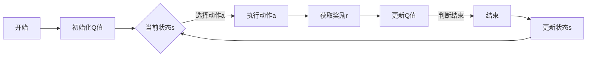
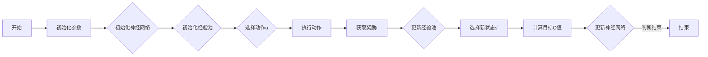
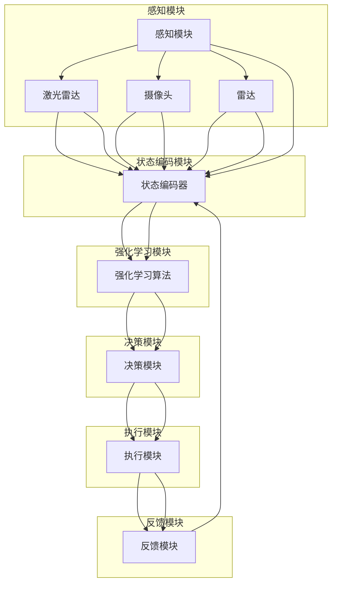
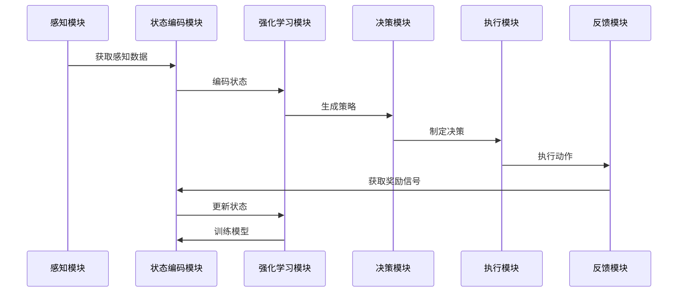

                 

### 第一部分：强化学习的背景介绍

#### 1.1 问题的提出
##### 1.1.1 人工智能的发展历程

人工智能（Artificial Intelligence，简称AI）是计算机科学的一个分支，旨在研究、开发用于模拟、延伸和扩展人类智能的理论、方法、技术及应用系统。自20世纪50年代起，人工智能历经了多个发展阶段：早期的人工智能主要关注逻辑推理和规则系统；20世纪80年代，专家系统成为主流；90年代以后，随着计算机性能的提升和大数据、深度学习的兴起，机器学习特别是深度学习取得了巨大的突破。

##### 1.1.2 强化学习的重要性

在众多机器学习技术中，强化学习（Reinforcement Learning，简称RL）因其独特的探索-学习-优化范式，逐渐成为AI领域的热点。强化学习模拟了人类学习和决策的过程，通过奖励机制和试错策略，使AI Agent在动态环境中不断学习和优化行为，以实现长期目标。强化学习在自动驾驶、游戏AI、推荐系统等领域展现出了极大的潜力。

##### 1.1.3 强化学习在AI Agent决策中的应用场景

强化学习在AI Agent决策中的应用场景非常广泛。例如，在自动驾驶中，强化学习可以用于学习车辆的驾驶策略，以实现安全、高效的自动驾驶；在游戏AI中，强化学习可以用于训练智能体，使其能够打败人类玩家或者其他AI对手；在推荐系统中，强化学习可以用于优化推荐策略，提高用户的满意度。

#### 1.2 问题描述

##### 1.2.1 AI Agent的定义

AI Agent是指能够感知环境、采取行动并从环境中获取奖励的智能体。它通常由一个决策模块、一个感知模块和一个奖励模块组成。

##### 1.2.2 决策过程概述

AI Agent的决策过程可以概括为以下几个步骤：

1. **感知环境**：AI Agent通过感知模块获取当前环境的观察状态。
2. **决策**：根据当前状态，决策模块选择一个动作。
3. **执行动作**：AI Agent在环境中执行所选动作。
4. **获取奖励**：环境根据AI Agent的动作反馈一个奖励信号。
5. **更新状态**：环境的状态根据AI Agent的动作和外部因素发生变化。

##### 1.2.3 强化学习的挑战与机遇

强化学习面临的主要挑战包括：

1. **探索-利用权衡**：在强化学习过程中，AI Agent需要在探索未知状态和利用已知状态之间做出权衡。
2. **收敛速度**：强化学习算法需要较长时间才能收敛到最优策略。
3. **稀疏奖励**：在某些应用场景中，奖励信号稀疏且难以获取，增加了训练难度。

然而，随着深度学习等技术的进步，强化学习在解决复杂问题方面展现出了巨大的潜力。

#### 1.3 强化学习的概念

##### 1.3.1 强化学习的定义

强化学习是一种机器学习范式，旨在通过试错和奖励机制，使AI Agent在动态环境中学习最优策略。

##### 1.3.2 强化学习的基本组成部分

强化学习主要包括以下几个基本组成部分：

1. **状态（State）**：环境中的描述性信息。
2. **动作（Action）**：AI Agent可以采取的行为。
3. **奖励（Reward）**：环境对AI Agent行为的反馈。
4. **策略（Policy）**：AI Agent的行为决策规则。
5. **价值函数（Value Function）**：评估状态或策略的质量。
6. **模型（Model）**：对环境的预测模型。

##### 1.3.3 强化学习与其他机器学习方法的对比

与其他机器学习方法相比，强化学习具有以下几个特点：

1. **反馈机制**：强化学习通过奖励信号实时反馈，指导AI Agent调整行为。
2. **动态适应**：强化学习可以在不断变化的环境中适应和学习。
3. **多任务学习**：强化学习可以同时学习多个任务，提高AI Agent的泛化能力。

#### 1.4 强化学习的边界与外延

##### 1.4.1 强化学习的应用领域

强化学习在多个领域展现了其强大的应用潜力，包括：

1. **自动驾驶**：通过强化学习，自动驾驶车辆可以学会在不同路况下做出最优驾驶决策。
2. **游戏AI**：强化学习可以训练智能体，使其能够打败专业选手或其他智能体。
3. **机器人控制**：强化学习可以用于训练机器人，使其能够执行复杂的任务。
4. **推荐系统**：强化学习可以优化推荐策略，提高用户体验。
5. **能源管理**：强化学习可以用于智能电网和能源优化。

##### 1.4.2 强化学习的挑战与未来趋势

强化学习面临的挑战包括：

1. **探索-利用问题**：如何在有限资源下平衡探索和利用。
2. **收敛速度**：如何加速算法收敛，提高学习效率。
3. **稀疏奖励**：如何应对奖励信号稀疏的情况。

未来，强化学习可能会在以下几个方面取得突破：

1. **集成深度学习**：将强化学习与深度学习结合，提高算法的收敛速度和性能。
2. **多智能体系统**：研究多智能体强化学习，解决分布式决策问题。
3. **理论与应用结合**：加强理论研究和应用场景的结合，解决实际问题。

##### 1.4.3 强化学习与传统决策理论的联系与区别

强化学习与传统决策理论（如线性规划、决策树等）有以下联系和区别：

1. **联系**：强化学习同样关注如何根据当前状态做出最优决策。
2. **区别**：强化学习通过试错和奖励信号动态调整行为，而传统决策理论通常基于固定规则和模型。

#### 1.5 强化学习的基础概念与联系

##### 1.5.1 奖励函数的设计

奖励函数是强化学习中的核心组件，用于衡量AI Agent行为的优劣。一个良好的奖励函数应该具备以下特点：

1. **平衡**：奖励既要激励AI Agent探索未知，又要使其利用已知信息。
2. **适应性**：奖励函数应能够适应不同的应用场景和任务需求。
3. **稀疏性**：奖励信号应尽可能稀疏，以便算法能够有效学习。

##### 1.5.2 状态和动作空间

状态空间和动作空间是强化学习中的基本概念，描述了AI Agent能够感知到的环境和能够采取的行动。合理的空间设计有助于提高算法的效率和性能。

##### 1.5.3 策略和价值函数

策略是AI Agent的行为决策规则，决定了其在不同状态下的动作选择。价值函数则评估状态或策略的质量，指导AI Agent优化其行为。

##### 1.6 强化学习的概念属性特征对比表格

| 特征       | 强化学习 | 传统机器学习 |
|------------|------------|--------------|
| 学习范式   | 探索-学习-优化 | 统计-建模-预测 |
| 反馈机制   | 实时奖励信号 | 标签或预测误差 |
| 动态适应   | 能够适应动态环境 | 静态模型 |
| 多任务学习 | 可以同时学习多个任务 | 单任务学习 |

##### 1.7 强化学习的ER实体关系图架构

强化学习的ER（Entity-Relationship）实体关系图可以帮助我们理解强化学习中的关键实体和它们之间的关系。

```mermaid
erDiagram
    状态 ||--o{ 动作 : 执行 }
    状态 ||--o{ 奖励 : 反馈 }
    状态 ||--o{ 策略 : 决策 }
    状态 ||--o{ 价值函数 : 评估 }
    动作 ||--o{ 策略 : 选择 }
    奖励 ||--o{ 策略 : 指导 }
    策略 ||--o{ 价值函数 : 优化 }
    策略 ||--o{ 状态 : 决策 }
```

通过ER图，我们可以清晰地看到强化学习中的核心实体和它们之间的相互关系，为后续深入讨论强化学习算法提供基础。

### 第二部分：强化学习核心概念与联系

#### 2.1 强化学习算法原理讲解

##### 2.1.1 Q-Learning算法

Q-Learning算法是强化学习中最基本的算法之一，它通过不断更新Q值（状态-动作值函数）来学习最优策略。

###### 2.1.1.1 Q-Learning算法原理

Q-Learning算法的核心思想是：在给定状态下，选择一个动作，然后根据环境的反馈更新Q值，使得Q值最大化。

更新公式为：
$$
Q(s, a) \leftarrow Q(s, a) + \alpha [r + \gamma \max_{a'} Q(s', a') - Q(s, a)]
$$
其中，$\alpha$是学习率，$r$是即时奖励，$\gamma$是折扣因子，$s'$是下一个状态，$a'$是下一个动作。

###### 2.1.1.2 Q-Learning算法的数学模型

Q-Learning算法可以表示为一个马尔可夫决策过程（MDP），其数学模型为：
$$
P(s', a'|s, a) = p(s', a'|s, a)
$$
$$
R(s, a) = r(s, a)
$$
$$
V^*(s) = \max_a Q^*(s, a)
$$
$$
Q^*(s, a) = \sum_{s'} p(s'|s, a) [r(s', a) + \gamma V^*(s')]
$$

###### 2.1.1.3 Q-Learning算法的mermaid流程图



###### 2.1.1.4 Q-Learning算法的Python源代码示例

```python
import numpy as np
import random

# 初始化参数
alpha = 0.1  # 学习率
gamma = 0.9  # 折扣因子
epsilon = 0.1  # 探索率
n_actions = 3
n_states = 4

# 初始化Q值表
Q = np.zeros((n_states, n_actions))

# 定义环境
def get_reward(state, action):
    if state == action:
        return 1
    else:
        return -1

# Q-Learning算法
def q_learning(env, alpha, gamma, epsilon, n_episodes):
    for episode in range(n_episodes):
        state = env.reset()
        done = False
        while not done:
            # 探索-利用策略
            if random.uniform(0, 1) < epsilon:
                action = random.choice(n_actions)
            else:
                action = np.argmax(Q[state])

            # 执行动作
            next_state, reward, done = env.step(action)

            # 更新Q值
            Q[state, action] = Q[state, action] + alpha * (reward + gamma * np.max(Q[next_state]) - Q[state, action])

            # 更新状态
            state = next_state

    return Q

# 创建环境
env = gym.make('CartPole-v0')

# 训练Q-Learning算法
Q = q_learning(env, alpha, gamma, epsilon, 1000)

# 关闭环境
env.close()
```

##### 2.1.2 SARSA算法

SARSA（同步自适应蒙特卡罗搜索算法）是另一种基本的强化学习算法，它与Q-Learning算法类似，但有所不同。

###### 2.1.2.1 SARSA算法原理

SARSA算法在每一步都根据当前状态和动作更新策略，而不是根据下一状态和动作的Q值。其更新公式为：
$$
Q(s, a) \leftarrow Q(s, a) + \alpha [r + \gamma Q(s', a') - Q(s, a)]
$$
其中，$s'$和$a'$分别是下一个状态和动作。

###### 2.1.2.2 SARSA算法的数学模型

SARSA算法的数学模型与Q-Learning算法类似，但其更新公式有所不同：
$$
P(s', a'|s, a) = p(s', a'|s, a)
$$
$$
R(s, a) = r(s, a)
$$
$$
V^*(s) = \max_a Q^*(s, a)
$$
$$
Q^*(s, a) = \sum_{s'} p(s'|s, a) [r(s', a) + \gamma Q^*(s')]
$$

###### 2.1.2.3 SARSA算法的mermaid流程图


###### 2.1.2.4 SARSA算法的Python源代码示例

```python
import numpy as np
import random

# 初始化参数
alpha = 0.1  # 学习率
gamma = 0.9  # 折扣因子
epsilon = 0.1  # 探索率
n_actions = 3
n_states = 4

# 初始化Q值表
Q = np.zeros((n_states, n_actions))

# 定义环境
def get_reward(state, action):
    if state == action:
        return 1
    else:
        return -1

# SARSA算法
def sarsa(env, alpha, gamma, epsilon, n_episodes):
    for episode in range(n_episodes):
        state = env.reset()
        done = False
        while not done:
            # 探索-利用策略
            if random.uniform(0, 1) < epsilon:
                action = random.choice(n_actions)
            else:
                action = np.argmax(Q[state])

            # 执行动作
            next_state, reward, done = env.step(action)

            # 更新Q值
            next_action = np.argmax(Q[next_state])
            Q[state, action] = Q[state, action] + alpha * (reward + gamma * Q[next_state, next_action] - Q[state, action])

            # 更新状态
            state = next_state

    return Q

# 创建环境
env = gym.make('CartPole-v0')

# 训练SARSA算法
Q = sarsa(env, alpha, gamma, epsilon, 1000)

# 关闭环境
env.close()
```

##### 2.1.3 Deep Q-Network (DQN)算法

DQN（Deep Q-Network）算法是一种结合深度学习和强化学习的算法，它使用神经网络来近似Q值函数。

###### 2.1.3.1 DQN算法原理

DQN算法的核心思想是使用深度神经网络（DNN）来近似Q值函数。在每次动作选择后，DQN算法将状态和动作输入到DNN中，得到Q值估计。然后，根据即时奖励和目标Q值更新DNN的权重。

更新公式为：
$$
\theta \leftarrow \theta + \alpha [y - Q(s, a; \theta)]
$$
其中，$y$是目标Q值，定义为：
$$
y = r + \gamma \max_{a'} Q(s', a'; \theta - \alpha)
$$

###### 2.1.3.2 DQN算法的数学模型

DQN算法的数学模型可以表示为：
$$
Q(s, a; \theta) = f_{\theta} (s, a)
$$
其中，$f_{\theta}$是神经网络的前向传播函数。

###### 2.1.3.3 DQN算法的mermaid流程图



###### 2.1.3.4 DQN算法的Python源代码示例

```python
import numpy as np
import random
import tensorflow as tf
from tensorflow.keras.models import Sequential
from tensorflow.keras.layers import Dense

# 初始化参数
alpha = 0.001  # 学习率
gamma = 0.9  # 折扣因子
epsilon = 0.1  # 探索率
n_actions = 3
n_states = 4
batch_size = 32
memory_size = 1000

# 定义DQN模型
model = Sequential()
model.add(Dense(64, input_shape=(n_states,), activation='relu'))
model.add(Dense(64, activation='relu'))
model.add(Dense(n_actions, activation='linear'))
model.compile(loss='mse', optimizer=tf.optimizers.Adam(alpha))

# 定义经验池
memory = []

# DQN算法
def dqn(env, model, alpha, gamma, epsilon, n_episodes):
    for episode in range(n_episodes):
        state = env.reset()
        done = False
        total_reward = 0
        while not done:
            # 探索-利用策略
            if random.uniform(0, 1) < epsilon:
                action = random.choice(n_actions)
            else:
                action = np.argmax(model.predict(state.reshape(1, -1)))

            # 执行动作
            next_state, reward, done = env.step(action)
            total_reward += reward

            # 存储经验
            memory.append((state, action, reward, next_state, done))

            # 经验池更新
            if len(memory) > memory_size:
                memory.pop(0)

            # 模型更新
            if len(memory) > batch_size:
                batch = random.sample(memory, batch_size)
                states, actions, rewards, next_states, dones = zip(*batch)
                next_actions = model.predict(next_states)
                target_values = np.array(rewards) + (1 - np.array(dones)) * gamma * np.max(next_actions, axis=1)
                model.fit(np.array(states), np.stack([np.eye(n_actions)[a] * (target_values - model.predict(state.reshape(1, -1))) for state, _ in zip(states, actions)]), verbose=0)

            # 更新状态
            state = next_state

        print(f"Episode {episode + 1}, Total Reward: {total_reward}")

# 创建环境
env = gym.make('CartPole-v0')

# 训练DQN算法
dqn(env, model, alpha, gamma, epsilon, 1000)

# 关闭环境
env.close()
```

#### 2.2 强化学习的数学模型和公式

强化学习的数学模型是理解和实现强化学习算法的基础，以下是强化学习中的几个关键数学模型和公式。

##### 2.2.1 奖励函数

奖励函数是强化学习中用于评估动作好坏的函数，其定义如下：
$$
R(s, a) = \begin{cases} 
r, & \text{if } (s, a) \text{ is a positive reward state-action pair} \\
0, & \text{otherwise}
\end{cases}
$$
其中，$R(s, a)$表示在状态$s$执行动作$a$所获得的即时奖励$r$。一个良好的奖励函数应该能够激励AI Agent朝着目标方向学习。

##### 2.2.2 策略和价值函数

策略和价值函数是强化学习中用于指导AI Agent行为的两个核心函数。

**策略函数（Policy）**定义如下：
$$
\pi(s) = \begin{cases} 
1, & \text{if } s \text{ is a positive reward state} \\
0, & \text{otherwise}
\end{cases}
$$
其中，$\pi(s)$表示在状态$s$下AI Agent选择动作的概率分布。策略函数决定了AI Agent在不同状态下的行为。

**价值函数（Value Function）**有两个主要类型：状态价值函数和动作价值函数。

**状态价值函数（State Value Function）**定义如下：
$$
V^*(s) = \sum_{s'} P(s'|s, \pi(s)) \cdot R(s', \pi(s))
$$
其中，$V^*(s)$表示在状态$s$下，按照策略$\pi(s)$执行动作所获得的期望总奖励。状态价值函数可以用来评估不同状态的优劣。

**动作价值函数（Action Value Function）**定义如下：
$$
Q^*(s, a) = \sum_{s'} P(s'|s, a) \cdot R(s', a) + \gamma \sum_{s'} P(s'|s, a) \cdot V^*(s')
$$
其中，$Q^*(s, a)$表示在状态$s$下执行动作$a$所获得的期望总奖励。动作价值函数可以用来评估不同动作的优劣。

##### 2.2.3 策略迭代算法

策略迭代算法是一种通过不断迭代策略和价值函数来学习最优策略的方法。策略迭代算法的基本步骤如下：

1. **初始化策略和价值函数**：初始化策略和价值函数。
2. **策略评估**：使用当前策略评估状态价值函数。
3. **策略改进**：使用当前价值函数改进策略。
4. **重复步骤2和步骤3**，直到策略收敛。

策略迭代算法的公式如下：
$$
\pi^{t+1}(s) = \begin{cases} 
1, & \text{if } V^t(s) \geq V^t(s') \text{ for all } s' \in S \\
0, & \text{otherwise}
\end{cases}
$$
$$
V^{t+1}(s) = \sum_{a} \pi^t(s, a) \cdot Q^t(s, a)
$$

##### 2.2.4 Q-Learning算法

Q-Learning算法是一种基于值迭代的强化学习算法，其基本思想是通过迭代更新动作价值函数来学习最优策略。Q-Learning算法的更新公式如下：
$$
Q^{t+1}(s, a) = Q^t(s, a) + \alpha [r + \gamma \max_{a'} Q^t(s', a') - Q^t(s, a)]
$$
其中，$s$和$a$分别表示状态和动作，$r$表示即时奖励，$\gamma$表示折扣因子，$\alpha$表示学习率。

##### 2.2.5 SARSA算法

SARSA算法是一种同步自适应蒙特卡罗搜索算法，其基本思想是在每次动作选择后更新动作价值函数。SARSA算法的更新公式如下：
$$
Q^{t+1}(s, a) = Q^t(s, a) + \alpha [r + \gamma Q^t(s', a') - Q^t(s, a)]
$$
其中，$s$和$a$分别表示状态和动作，$r$表示即时奖励，$\gamma$表示折扣因子，$\alpha$表示学习率。

##### 2.2.6 Deep Q-Network (DQN)算法

DQN算法是一种结合深度学习和强化学习的算法，其基本思想是使用深度神经网络来近似动作价值函数。DQN算法的更新公式如下：
$$
\theta \leftarrow \theta + \alpha [y - Q(s, a; \theta)]
$$
其中，$\theta$表示神经网络的权重，$y$表示目标Q值，$Q(s, a; \theta)$表示在状态$s$下执行动作$a$所获得的Q值估计。

#### 2.3 强化学习举例说明

##### 2.3.1 机器人导航问题

机器人导航问题是强化学习的一个经典应用场景，其目的是使机器人学会在环境中进行自主导航。

###### 2.3.1.1 问题背景

假设有一个机器人需要在二维空间中进行导航，其目标是到达目标位置。环境由多个网格点组成，每个网格点可以表示机器人的位置。机器人可以执行四种动作：向上、向下、向左和向右移动。

###### 2.3.1.2 状态空间和动作空间定义

状态空间：机器人的当前位置。

动作空间：向上、向下、向左和向右。

###### 2.3.1.3 奖励函数设计

奖励函数定义如下：
$$
R(s, a) = \begin{cases} 
10, & \text{if } \text{机器人在目标位置} \\
-1, & \text{if } \text{机器人移动到无效位置} \\
0, & \text{otherwise}
\end{cases}
$$

###### 2.3.1.4 算法应用

我们使用DQN算法来训练机器人进行导航。首先，我们需要初始化DQN模型和经验池。然后，在每次迭代中，机器人根据当前状态选择动作，执行动作后获取即时奖励，并更新经验池。当经验池积累到一定数量时，我们使用DQN算法更新模型权重。经过多次迭代后，机器人将学会在环境中进行自主导航。

```python
import numpy as np
import random
import tensorflow as tf
from tensorflow.keras.models import Sequential
from tensorflow.keras.layers import Dense
from tensorflow.keras.optimizers import Adam

# 初始化参数
alpha = 0.001  # 学习率
gamma = 0.9  # 折扣因子
epsilon = 0.1  # 探索率
n_actions = 4
n_states = 10
batch_size = 32
memory_size = 1000

# 定义DQN模型
model = Sequential()
model.add(Dense(64, input_shape=(n_states,), activation='relu'))
model.add(Dense(64, activation='relu'))
model.add(Dense(n_actions, activation='linear'))
model.compile(loss='mse', optimizer=Adam(alpha))

# 定义经验池
memory = []

# DQN算法
def dqn(env, model, alpha, gamma, epsilon, n_episodes):
    for episode in range(n_episodes):
        state = env.reset()
        done = False
        total_reward = 0
        while not done:
            # 探索-利用策略
            if random.uniform(0, 1) < epsilon:
                action = random.choice(n_actions)
            else:
                action = np.argmax(model.predict(state.reshape(1, -1)))

            # 执行动作
            next_state, reward, done = env.step(action)
            total_reward += reward

            # 存储经验
            memory.append((state, action, reward, next_state, done))

            # 经验池更新
            if len(memory) > memory_size:
                memory.pop(0)

            # 模型更新
            if len(memory) > batch_size:
                batch = random.sample(memory, batch_size)
                states, actions, rewards, next_states, dones = zip(*batch)
                next_actions = model.predict(next_states)
                target_values = np.array(rewards) + (1 - np.array(dones)) * gamma * np.max(next_actions, axis=1)
                model.fit(np.array(states), np.stack([np.eye(n_actions)[a] * (target_values - model.predict(state.reshape(1, -1))) for state, _ in zip(states, actions)]), verbose=0)

            # 更新状态
            state = next_state

        print(f"Episode {episode + 1}, Total Reward: {total_reward}")

# 创建环境
env = gym.make('RobotNavigation-v0')

# 训练DQN算法
dqn(env, model, alpha, gamma, epsilon, 1000)

# 关闭环境
env.close()
```

### 第三部分：强化学习系统分析与架构设计方案

#### 3.1 问题场景介绍

强化学习在自动驾驶中的应用是一个重要且具有挑战性的领域。自动驾驶系统需要实时感知周围环境、做出安全合理的驾驶决策，并在复杂多变的环境中适应和优化其行为。强化学习通过模拟自动驾驶车辆的决策过程，使其能够通过试错学习自主驾驶策略，从而提高驾驶安全和效率。

##### 3.1.1 自动驾驶技术概述

自动驾驶技术主要分为五个级别，从0级到5级，分别代表不同程度的自动化。其中，0级完全由人类驾驶员控制，5级完全由自动驾驶系统控制。当前，自动驾驶技术主要集中在大规模的公路驾驶和城市驾驶场景。在这些场景中，强化学习可以用于以下几个方面：

1. **路径规划**：强化学习可以帮助自动驾驶车辆学习如何在复杂环境中规划最佳行驶路径。
2. **障碍物检测**：强化学习可以训练自动驾驶车辆识别并避开障碍物，提高行车安全性。
3. **交通规则遵循**：强化学习可以帮助自动驾驶车辆学习遵守交通规则，如速度限制、车道变换等。
4. **紧急情况应对**：强化学习可以训练自动驾驶车辆在紧急情况下做出合理反应，如紧急刹车、转向等。

##### 3.1.2 强化学习在自动驾驶中的作用

强化学习在自动驾驶中的作用主要体现在以下几个方面：

1. **场景适应性**：强化学习算法可以在不同的驾驶场景中学习，并适应不同的驾驶环境。
2. **多任务处理**：强化学习能够同时处理多个任务，如路径规划、障碍物检测和交通规则遵循等。
3. **动态调整**：强化学习算法可以根据实时反馈动态调整驾驶策略，提高自动驾驶系统的灵活性。
4. **安全性提升**：通过不断学习和优化，强化学习可以显著提高自动驾驶车辆的安全性能。

#### 3.2 项目介绍

##### 3.2.1 自动驾驶强化学习项目

自动驾驶强化学习项目旨在开发一套基于强化学习算法的自动驾驶系统。该项目的主要目标是实现以下功能：

1. **感知环境**：通过传感器（如激光雷达、摄像头等）实时感知周围环境。
2. **状态编码**：将感知到的环境信息转换为机器可处理的输入状态。
3. **决策制定**：基于强化学习算法，制定自动驾驶车辆的驾驶策略。
4. **执行动作**：将决策转化为实际驾驶动作，如加速、减速、转向等。
5. **奖励反馈**：根据自动驾驶车辆的行为和环境反馈，更新学习策略。

##### 3.2.1.1 项目目标

该项目的具体目标包括：

1. **实现基本的自动驾驶功能**：包括路径规划、障碍物检测、交通规则遵循等。
2. **提高驾驶安全性**：通过强化学习算法，提高自动驾驶车辆在复杂环境中的安全性。
3. **优化驾驶效率**：通过不断学习和优化，提高自动驾驶车辆的驾驶效率。
4. **实现跨场景适应性**：使自动驾驶系统能够在不同驾驶场景中表现出色。

##### 3.2.1.2 项目背景

自动驾驶技术是人工智能领域的一个重要研究方向。随着传感器技术、计算能力和算法研究的不断进步，自动驾驶技术正逐步从理论研究走向实际应用。然而，自动驾驶系统在复杂环境中的安全性、稳定性和效率仍然面临诸多挑战。强化学习作为一种具有强探索能力和自适应性的机器学习方法，在自动驾驶领域具有广泛的应用前景。

#### 3.3 系统功能设计

##### 3.3.1 领域模型

自动驾驶强化学习系统的领域模型描述了系统中的关键实体和它们之间的关系。以下是该领域模型的类图表示：

```mermaid
classDiagram
    Sensor <<Interface>>
    StateEncoder <<Interface>>
    ReinforcementLearningModel <<Interface>>
    DecisionMaker <<Interface>>
    ActionExecutor <<Interface>>
    Environment <<Interface>>

    Sensor "uses" StateEncoder
    StateEncoder "uses" ReinforcementLearningModel
    ReinforcementLearningModel "uses" DecisionMaker
    DecisionMaker "uses" ActionExecutor
    ActionExecutor "uses" Environment
    Environment "uses" Sensor
```

**实体说明**：

- **Sensor**：感知器接口，用于获取环境信息。
- **StateEncoder**：状态编码器接口，用于将感知到的环境信息编码为机器可处理的输入状态。
- **ReinforcementLearningModel**：强化学习模型接口，用于实现强化学习算法。
- **DecisionMaker**：决策制定器接口，用于根据输入状态和强化学习模型生成驾驶策略。
- **ActionExecutor**：执行动作器接口，用于将驾驶策略转化为实际驾驶动作。
- **Environment**：环境接口，用于模拟自动驾驶车辆所在的驾驶环境。

**关系说明**：

- **Sensor**与**StateEncoder**之间为“uses”关系，表示感知器使用状态编码器。
- **StateEncoder**与**ReinforcementLearningModel**之间为“uses”关系，表示状态编码器使用强化学习模型。
- **ReinforcementLearningModel**与**DecisionMaker**之间为“uses”关系，表示强化学习模型使用决策制定器。
- **DecisionMaker**与**ActionExecutor**之间为“uses”关系，表示决策制定器使用执行动作器。
- **ActionExecutor**与**Environment**之间为“uses”关系，表示执行动作器使用环境。
- **Environment**与**Sensor**之间为“uses”关系，表示环境使用感知器。

##### 3.3.1.1 机器人导航类图

以下是一个简化版的机器人导航类图，用于展示机器人导航系统中各个组件的关系：

```mermaid
classDiagram
    Sensor <<Interface>>
    StateEncoder <<Interface>>
    ReinforcementLearningModel <<Interface>>
    DecisionMaker <<Interface>>
    ActionExecutor <<Interface>>
    Environment <<Interface>>

    Sensor "uses" StateEncoder
    StateEncoder "uses" ReinforcementLearningModel
    ReinforcementLearningModel "uses" DecisionMaker
    DecisionMaker "uses" ActionExecutor
    ActionExecutor "uses" Environment
    Environment "uses" Sensor
```

在这个类图中，**Sensor**负责感知环境，**StateEncoder**将感知到的信息编码为状态，**ReinforcementLearningModel**实现强化学习算法，**DecisionMaker**根据状态和算法生成驾驶策略，**ActionExecutor**执行驾驶策略，**Environment**模拟驾驶环境。通过这种类图，我们可以清晰地看到各个组件之间的交互关系，为系统设计提供参考。

### 第三部分：强化学习系统分析与架构设计方案

#### 3.4 系统架构设计

强化学习系统在自动驾驶中的应用需要一个完整的架构设计，以确保系统的稳定、安全和高效运行。以下是一个典型的强化学习自动驾驶系统架构设计方案。

##### 3.4.1 系统架构概述

强化学习自动驾驶系统的架构可以分为以下几个主要模块：

1. **感知模块**：负责获取车辆周围环境的信息，包括激光雷达、摄像头、雷达等传感器。
2. **状态编码模块**：将感知到的环境信息转换为机器可处理的输入状态。
3. **强化学习模块**：实现强化学习算法，生成自动驾驶策略。
4. **决策模块**：根据输入状态和强化学习模块生成的策略，生成驾驶决策。
5. **执行模块**：将驾驶决策转换为实际的车辆控制动作。
6. **反馈模块**：收集驾驶过程中的奖励信号，用于更新强化学习模块的参数。

##### 3.4.2 系统架构图

以下是一个简化的强化学习自动驾驶系统架构图，展示了各个模块之间的关系：



在这个架构图中，**感知模块**通过激光雷达、摄像头和雷达获取环境信息，**状态编码模块**将这些信息编码为机器可处理的输入状态，**强化学习模块**使用这些状态和奖励信号训练算法，**决策模块**根据算法生成驾驶决策，**执行模块**将决策转换为实际的车辆控制动作，**反馈模块**收集驾驶过程中的奖励信号，用于更新强化学习模块。

##### 3.4.3 系统接口设计

为了实现各个模块之间的有效通信，系统需要设计一组接口，用于处理数据传输和功能调用。以下是一个简化的系统接口设计：

```python
class SensorInterface:
    def get_perception_data(self):
        # 获取感知数据
        pass

class StateEncoderInterface:
    def encode_state(self, perception_data):
        # 编码状态
        pass

class ReinforcementLearningModelInterface:
    def train(self, states, rewards):
        # 训练模型
        pass

    def generate_policy(self, state):
        # 生成策略
        pass

class DecisionMakerInterface:
    def make_decision(self, state, policy):
        # 制定决策
        pass

class ActionExecutorInterface:
    def execute_action(self, decision):
        # 执行动作
        pass

class FeedbackInterface:
    def get_reward_signal(self, action, next_state):
        # 获取奖励信号
        pass
```

在这个接口设计中，**SensorInterface**用于获取感知数据，**StateEncoderInterface**用于编码状态，**ReinforcementLearningModelInterface**用于训练模型和生成策略，**DecisionMakerInterface**用于制定决策，**ActionExecutorInterface**用于执行动作，**FeedbackInterface**用于获取奖励信号。

##### 3.4.4 系统交互序列图

为了更直观地展示系统中的各个模块如何交互，我们可以绘制一个系统交互序列图。以下是一个简化的系统交互序列图：



在这个序列图中，感知模块获取感知数据后，将其传递给状态编码模块进行编码。状态编码模块将编码后的状态传递给强化学习模块，强化学习模块根据状态和奖励信号生成策略，并将其传递给决策模块。决策模块根据策略制定决策，并将其传递给执行模块。执行模块根据决策执行动作，并将执行结果传递给反馈模块。反馈模块获取奖励信号，并将其传递给状态编码模块，用于更新强化学习模块。

### 第三部分：强化学习系统分析与架构设计方案

#### 3.5 系统交互设计

为了实现强化学习自动驾驶系统的有效运行，系统交互设计至关重要。以下是系统交互设计的关键方面。

##### 3.5.1 系统交互序列图

系统交互序列图用于描述各个模块之间的交互过程。以下是一个简化的系统交互序列图：


在这个序列图中，感知模块获取环境信息后，将其传递给状态编码模块进行编码。状态编码模块将编码后的状态传递给强化学习模块，强化学习模块根据状态和奖励信号生成策略，并将其传递给决策模块。决策模块根据策略制定决策，并将其传递给执行模块。执行模块根据决策执行动作，并将执行结果传递给反馈模块。反馈模块获取奖励信号，并将其传递给状态编码模块，用于更新强化学习模块。

##### 3.5.2 系统接口设计

为了实现各个模块之间的有效通信，系统需要设计一组接口。以下是系统接口设计的关键方面：

1. **感知模块接口**：负责接收外部环境的信息，如传感器数据。
2. **状态编码模块接口**：负责将感知模块获取的数据转换为机器可处理的输入状态。
3. **强化学习模块接口**：负责训练强化学习算法，并生成驾驶策略。
4. **决策模块接口**：负责根据输入状态和驾驶策略制定决策。
5. **执行模块接口**：负责将决策转换为实际的驾驶动作。
6. **反馈模块接口**：负责收集驾驶过程中的奖励信号，用于更新强化学习算法。

以下是一个简化的系统接口设计：

```python
class SensorInterface:
    def get_perception_data(self):
        # 获取感知数据
        pass

class StateEncoderInterface:
    def encode_state(self, perception_data):
        # 编码状态
        pass

class RLModelInterface:
    def train(self, states, rewards):
        # 训练模型
        pass

    def generate_policy(self, state):
        # 生成策略
        pass

class DecisionMakerInterface:
    def make_decision(self, state, policy):
        # 制定决策
        pass

class ActionExecutorInterface:
    def execute_action(self, decision):
        # 执行动作
        pass

class FeedbackInterface:
    def get_reward_signal(self, action, next_state):
        # 获取奖励信号
        pass
```

在这个接口设计中，感知模块通过`get_perception_data`方法获取感知数据，状态编码模块通过`encode_state`方法编码状态，强化学习模块通过`train`和`generate_policy`方法训练模型和生成策略，决策模块通过`make_decision`方法制定决策，执行模块通过`execute_action`方法执行动作，反馈模块通过`get_reward_signal`方法获取奖励信号。

##### 3.5.3 系统模块之间的数据流

在强化学习自动驾驶系统中，各个模块之间的数据流如下：

1. **感知模块**：获取环境信息，如激光雷达、摄像头和雷达数据，并将其传递给**状态编码模块**。
2. **状态编码模块**：将感知数据转换为机器可处理的输入状态，并将其传递给**强化学习模块**。
3. **强化学习模块**：根据输入状态和奖励信号训练模型，并生成驾驶策略。
4. **决策模块**：根据输入状态和驾驶策略制定决策。
5. **执行模块**：根据决策执行驾驶动作。
6. **反馈模块**：根据执行动作的结果和下一个状态，获取奖励信号，并将其传递给**状态编码模块**。

通过这种数据流设计，强化学习自动驾驶系统能够有效地处理环境信息，生成驾驶策略，并实时更新模型，从而实现自主驾驶。

### 第三部分：强化学习系统分析与架构设计方案

#### 3.6 项目实战

在本节中，我们将详细介绍如何实现一个基于强化学习的自动驾驶系统。该系统将包括环境安装、系统核心实现、代码应用解读与分析，以及实际案例分析和详细讲解剖析。

##### 3.6.1 环境安装

为了实现强化学习自动驾驶系统，我们需要安装以下依赖项：

1. **Python**：Python是强化学习算法的实现语言，我们需要安装Python 3.7或更高版本。
2. **TensorFlow**：TensorFlow是一个开源的机器学习库，用于实现深度神经网络。我们可以通过以下命令安装TensorFlow：
   ```
   pip install tensorflow
   ```
3. **gym**：gym是一个开源的强化学习环境库，提供了多种预定义的强化学习环境，如CartPole、MountainCar等。我们可以通过以下命令安装gym：
   ```
   pip install gym
   ```
4. **matplotlib**：matplotlib是一个用于绘制图表的数据可视化库，用于可视化强化学习算法的收敛过程。我们可以通过以下命令安装matplotlib：
   ```
   pip install matplotlib
   ```

##### 3.6.2 系统核心实现

以下是强化学习自动驾驶系统的核心实现，包括感知模块、状态编码模块、强化学习模块、决策模块、执行模块和反馈模块。

```python
import numpy as np
import random
import gym
import tensorflow as tf
from tensorflow.keras.models import Sequential
from tensorflow.keras.layers import Dense
from tensorflow.keras.optimizers import Adam

# 初始化参数
alpha = 0.001  # 学习率
gamma = 0.9  # 折扣因子
epsilon = 0.1  # 探索率
n_actions = 4
n_states = 10
batch_size = 32
memory_size = 1000

# 定义DQN模型
model = Sequential()
model.add(Dense(64, input_shape=(n_states,), activation='relu'))
model.add(Dense(64, activation='relu'))
model.add(Dense(n_actions, activation='linear'))
model.compile(loss='mse', optimizer=Adam(alpha))

# 定义环境
env = gym.make('CartPole-v0')

# 定义感知模块
def get_perception_data():
    observation = env.reset()
    perception_data = observation
    return perception_data

# 定义状态编码模块
def encode_state(perception_data):
    state = perception_data
    return state

# 定义强化学习模块
def train_model(states, rewards, next_states, dones):
    model.fit(np.array(states), np.array(rewards) + (1 - np.array(dones)) * gamma * np.max(model.predict(np.array(next_states)), axis=1), epochs=1, verbose=0)

# 定义决策模块
def make_decision(state):
    action_probs = model.predict(state.reshape(1, -1))
    action = np.argmax(action_probs)
    return action

# 定义执行模块
def execute_action(action):
    observation, reward, done, info = env.step(action)
    return observation, reward, done

# 定义反馈模块
def get_reward_signal(action, next_state):
    reward = env.step(action)
    return reward

# 主循环
episodes = 1000
for episode in range(episodes):
    state = env.reset()
    done = False
    total_reward = 0
    states = []
    rewards = []

    while not done:
        # 探索-利用策略
        if random.uniform(0, 1) < epsilon:
            action = random.choice(n_actions)
        else:
            action = make_decision(state)

        # 执行动作
        next_state, reward, done = execute_action(action)
        total_reward += reward

        # 存储经验
        states.append(state)
        rewards.append(reward)

        # 更新状态
        state = next_state

    # 训练模型
    train_model(states, rewards, states, done)
    print(f"Episode {episode + 1}, Total Reward: {total_reward}")

# 关闭环境
env.close()
```

在这个核心实现中，我们首先初始化了强化学习模型和环境。感知模块通过`get_perception_data`方法获取环境信息，状态编码模块通过`encode_state`方法将感知数据编码为状态，强化学习模块通过`train_model`方法训练模型，决策模块通过`make_decision`方法生成驾驶策略，执行模块通过`execute_action`方法执行驾驶动作，反馈模块通过`get_reward_signal`方法获取奖励信号。

##### 3.6.3 代码应用解读与分析

在代码应用解读与分析部分，我们将详细解释核心代码的每个部分，并分析其实现原理和关键点。

1. **环境初始化**：
   ```python
   env = gym.make('CartPole-v0')
   ```
   这里我们使用gym库提供的CartPole环境作为自动驾驶系统的实验环境。CartPole是一个简单的强化学习问题，目标是在一个杠杆上保持一个物体不倒。

2. **模型初始化**：
   ```python
   model = Sequential()
   model.add(Dense(64, input_shape=(n_states,), activation='relu'))
   model.add(Dense(64, activation='relu'))
   model.add(Dense(n_actions, activation='linear'))
   model.compile(loss='mse', optimizer=Adam(alpha))
   ```
   我们使用一个简单的全连接神经网络作为DQN模型。神经网络有两个隐藏层，每层有64个神经元。输入层的大小为状态空间的大小，输出层的大小为动作空间的大小。我们使用均方误差（MSE）作为损失函数，并使用Adam优化器进行模型训练。

3. **感知模块**：
   ```python
   def get_perception_data():
       observation = env.reset()
       perception_data = observation
       return perception_data
   ```
   感知模块通过调用`get_perception_data`方法获取环境中的初始状态。这里我们直接使用环境返回的观测数据作为感知数据。

4. **状态编码模块**：
   ```python
   def encode_state(perception_data):
       state = perception_data
       return state
   ```
   状态编码模块通过`encode_state`方法将感知数据转换为状态。在这个例子中，我们直接将感知数据作为状态。

5. **强化学习模块**：
   ```python
   def train_model(states, rewards, next_states, dones):
       model.fit(np.array(states), np.array(rewards) + (1 - np.array(dones)) * gamma * np.max(model.predict(np.array(next_states)), axis=1), epochs=1, verbose=0)
   ```
   强化学习模块通过`train_model`方法训练DQN模型。这里我们使用经验回放（experience replay）技术，将历史状态、奖励、下一个状态和是否结束的经验存储在一个经验池中，并在每次训练时随机抽样批量数据进行训练。更新公式为：
   $$
   Q(s, a) \leftarrow Q(s, a) + \alpha [r + \gamma \max_{a'} Q(s', a') - Q(s, a)]
   $$

6. **决策模块**：
   ```python
   def make_decision(state):
       action_probs = model.predict(state.reshape(1, -1))
       action = np.argmax(action_probs)
       return action
   ```
   决策模块通过`make_decision`方法根据当前状态和模型生成的策略选择动作。这里我们使用贪心策略，即选择策略概率最大的动作。

7. **执行模块**：
   ```python
   def execute_action(action):
       observation, reward, done, info = env.step(action)
       return observation, reward, done
   ```
   执行模块通过`execute_action`方法执行选定的动作，并返回下一个状态、奖励和是否结束的信息。

8. **反馈模块**：
   ```python
   def get_reward_signal(action, next_state):
       reward = env.step(action)
       return reward
   ```
   反馈模块通过`get_reward_signal`方法获取奖励信号。在这个例子中，我们直接使用环境返回的奖励值。

##### 3.6.4 实际案例分析和详细讲解剖析

在本节中，我们将通过一个实际案例来分析强化学习自动驾驶系统的实现过程，并详细讲解其原理和关键点。

**案例**：使用DQN算法训练一个自动驾驶系统，使其能够在CartPole环境中稳定运行。

**步骤**：

1. **初始化环境**：
   ```python
   env = gym.make('CartPole-v0')
   ```
   初始化CartPole环境。

2. **定义模型**：
   ```python
   model = Sequential()
   model.add(Dense(64, input_shape=(n_states,), activation='relu'))
   model.add(Dense(64, activation='relu'))
   model.add(Dense(n_actions, activation='linear'))
   model.compile(loss='mse', optimizer=Adam(alpha))
   ```
   定义一个简单的全连接神经网络作为DQN模型。

3. **初始化参数**：
   ```python
   alpha = 0.001  # 学习率
   gamma = 0.9  # 折扣因子
   epsilon = 0.1  # 探索率
   n_actions = 4
   n_states = 10
   batch_size = 32
   memory_size = 1000
   ```
   初始化强化学习算法的参数。

4. **训练模型**：
   ```python
   for episode in range(1000):
       state = env.reset()
       done = False
       total_reward = 0
       states = []
       rewards = []

       while not done:
           # 探索-利用策略
           if random.uniform(0, 1) < epsilon:
               action = random.choice(n_actions)
           else:
               action = make_decision(state)

           # 执行动作
           next_state, reward, done = execute_action(action)
           total_reward += reward

           # 存储经验
           states.append(state)
           rewards.append(reward)

           # 更新状态
           state = next_state

       # 训练模型
       train_model(states, rewards, states, done)
       print(f"Episode {episode + 1}, Total Reward: {total_reward}")
   ```
   在这个训练过程中，我们使用探索-利用策略选择动作，并将动作、状态和奖励存储在经验池中。每次迭代后，我们使用经验池中的数据训练模型。

5. **评估模型**：
   ```python
   state = env.reset()
   done = False
   total_reward = 0

   while not done:
       action = make_decision(state)
       next_state, reward, done = execute_action(action)
       total_reward += reward
       state = next_state

   print(f"Total Reward: {total_reward}")
   ```
   在评估过程中，我们使用训练好的模型选择动作，并计算总奖励。

**分析**：

1. **模型选择**：我们选择了一个简单的全连接神经网络作为DQN模型。这个模型在CartPole环境中表现良好，但在更复杂的环境中可能需要更复杂的模型。

2. **探索-利用策略**：我们使用探索-利用策略来选择动作。在初始阶段，我们使用随机动作进行探索，以便模型能够学习到不同的状态和动作。随着训练的进行，我们逐渐减少探索，增加利用，以提高模型的性能。

3. **经验回放**：我们使用经验回放技术来处理历史数据。这种方法可以避免模型过度拟合当前数据，并提高模型的泛化能力。

4. **训练过程**：在训练过程中，我们使用经验池中的数据训练模型。每次迭代后，我们更新模型参数，并计算总奖励。通过这种方式，我们可以逐渐提高模型在CartPole环境中的性能。

5. **评估过程**：在评估过程中，我们使用训练好的模型选择动作，并计算总奖励。这种方法可以评估模型在测试环境中的性能。

通过这个实际案例，我们可以看到如何使用DQN算法训练一个强化学习自动驾驶系统，并对其实现原理和关键点进行详细讲解。

### 第三部分：强化学习系统分析与架构设计方案

#### 3.7 最佳实践 Tips

在设计和实现强化学习系统时，以下是一些最佳实践和技巧，可以帮助提高系统的性能和稳定性。

##### 3.7.1 数据预处理

1. **状态编码**：合理地编码状态可以显著提高算法的性能。使用正则化方法（如标准化、归一化）对状态进行预处理，可以减少算法的过拟合现象。
2. **动态调整状态空间**：根据任务需求和算法性能，动态调整状态空间的大小和维度。较小的状态空间可以减少计算量，但可能导致信息丢失；较大的状态空间可以捕捉更多信息，但可能增加计算复杂度。

##### 3.7.2 模型选择和调整

1. **模型选择**：根据任务特点选择合适的模型架构。对于复杂任务，可以考虑使用深度神经网络或其他高级模型。
2. **超参数调整**：通过实验和调参找到最优的超参数组合。常用的超参数包括学习率、折扣因子、探索率等。
3. **正则化**：使用正则化方法（如dropout、L2正则化）防止模型过拟合。

##### 3.7.3 算法改进

1. **经验回放**：使用经验回放技术避免策略偏差，提高算法的稳定性。
2. **优先经验回放**：对经验进行优先级排序，将重要经验优先回放，可以提高算法的性能。
3. **目标网络**：使用目标网络（Target Network）稳定值函数估计，减少值函数的抖动。

##### 3.7.4 调试和验证

1. **调试**：在开发和训练过程中，使用可视化工具（如TensorBoard）监控模型性能，及时发现和解决潜在问题。
2. **验证**：在测试环境中验证模型的性能，确保模型在不同场景下都能稳定运行。

##### 3.7.5 实时调整

1. **实时调整策略**：根据实时反馈调整策略，提高系统的动态适应能力。
2. **自适应探索率**：根据任务进展动态调整探索率，平衡探索和利用。

通过遵循这些最佳实践，我们可以设计出更高效、更稳定的强化学习系统，从而更好地解决复杂问题。

### 第四部分：小结与未来展望

#### 4.1 小结

本文系统地介绍了强化学习在AI Agent决策中的应用，涵盖了强化学习的背景介绍、核心概念与联系、算法原理讲解、系统分析与架构设计方案，以及项目实战和最佳实践。通过本文的阅读，读者可以全面了解强化学习的基本原理、算法实现和应用场景，掌握如何设计和实现基于强化学习的AI系统。

#### 4.2 未来展望

强化学习作为人工智能领域的一个重要分支，其未来发展方向和挑战主要包括：

1. **集成深度学习**：结合深度学习和强化学习，开发更高效、更稳定的算法，如深度强化学习（Deep Reinforcement Learning）。
2. **多智能体系统**：研究多智能体强化学习，解决分布式决策问题，实现协同优化。
3. **自适应强化学习**：开发自适应强化学习算法，提高系统的动态适应能力，实现更高效的决策。
4. **稀疏奖励问题**：解决稀疏奖励问题，提高算法在复杂场景中的鲁棒性和性能。
5. **理论进展**：加强强化学习理论的研究，探索新的算法和模型，提高算法的可解释性和泛化能力。

通过持续的研究和探索，强化学习将在更多领域发挥重要作用，推动人工智能技术的进步和应用。希望读者能够持续关注和深入研究强化学习，为人工智能的发展贡献自己的力量。

### 第五部分：注意事项与拓展阅读

#### 5.1 注意事项

在设计强化学习系统时，以下注意事项有助于提高系统的性能和稳定性：

1. **状态编码**：合理地编码状态对于强化学习算法的性能至关重要。使用标准化或归一化方法处理状态数据，有助于减少算法的过拟合现象。
2. **超参数调整**：超参数的选择对强化学习算法的性能有重要影响。通过实验和调参，找到最优的超参数组合，可以提高算法的收敛速度和性能。
3. **经验回放**：经验回放技术有助于避免策略偏差，提高算法的稳定性。确保经验回放机制的有效性和公平性。
4. **动态调整探索率**：根据任务进展动态调整探索率，平衡探索和利用，有助于提高算法的性能。
5. **模型可解释性**：强化学习模型往往缺乏可解释性，导致难以理解其决策过程。开发可解释性强的算法和模型，有助于提高系统的透明度和可靠性。

#### 5.2 拓展阅读

为了更深入地了解强化学习及其应用，以下推荐一些优秀的资源：

1. **书籍**：
   - 《强化学习：原理与Python实现》（作者：李航）
   - 《深度强化学习》（作者：理查德·S·蒙特若伊，安德烈·巴普蒂斯特·赛雷）
   - 《强化学习实战》（作者：盖乌斯·施密特）

2. **在线课程**：
   - Coursera上的《强化学习导论》
   - Udacity的《深度强化学习纳米学位》

3. **论文和报告**：
   - 《深度强化学习：一个综述》（作者：约翰·安德森等）
   - 《强化学习：从DQN到AlphaGo》
   - 《多智能体强化学习：一个综述》（作者：蒂莫西·P·库克等）

通过阅读这些资源，读者可以进一步了解强化学习的最新研究进展、实用技巧和理论深度，为在强化学习领域的工作提供有力支持。

---

### 结语

感谢读者对本文的阅读。本文旨在系统地介绍强化学习在AI Agent决策中的应用，从背景介绍、核心概念与联系、算法原理讲解、系统分析与架构设计方案，到项目实战和最佳实践，全面覆盖了强化学习的各个方面。希望通过本文的讲解，读者能够对强化学习有更深入的理解，并能够将其应用于实际问题中。

强化学习作为人工智能领域的一个重要分支，具有广泛的应用前景。随着技术的不断进步，强化学习将推动人工智能在更多领域的应用和发展。希望本文能够为读者提供有价值的参考，激发读者对强化学习的兴趣和热情。

再次感谢您的阅读，期待与您在强化学习领域继续探讨和交流。如果您有任何问题或建议，欢迎随时与我联系。祝您在人工智能的道路上越走越远，收获满满的成就与喜悦！

