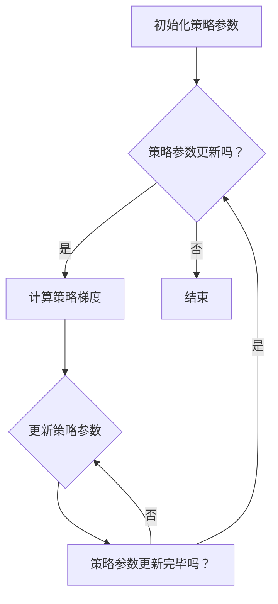
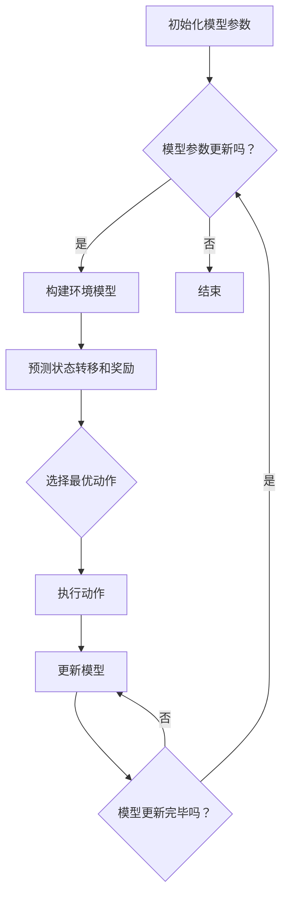

                 


# 强化学习在AI Agent决策中的运用

## 关键词
强化学习，AI Agent，决策，Q-learning，SARSA，DQN，无人驾驶，游戏AI，自动化投资

## 摘要
本文将深入探讨强化学习在AI Agent决策中的应用。首先，我们将回顾强化学习的基础知识，包括其核心概念和算法原理。随后，通过分析强化学习算法在不同应用场景中的实际运用，如无人驾驶、游戏AI和自动化投资，我们将展示强化学习在AI决策中的强大潜力。接着，我们将探讨强化学习在AI Agent决策中的优化方法，如探索与利用策略、策略梯度方法和基于模型的强化学习。最后，本文将总结强化学习在AI Agent决策中的挑战与未来趋势，并提供相关注意事项与拓展阅读资源。

### 目录大纲

1. 强化学习在AI Agent决策中的运用
2. 第一部分：强化学习基础
   2.1 问题背景与核心概念
   2.2 强化学习算法原理
   2.3 强化学习应用案例
3. 第二部分：强化学习在AI Agent决策中的优化
   3.1 探索与利用
   3.2 策略梯度方法
   3.3 基于模型的强化学习
4. 第三部分：强化学习在AI Agent决策中的挑战与未来趋势
   4.1 强化学习的挑战
   4.2 强化学习的未来趋势
5. 第四部分：强化学习在AI Agent决策中的最佳实践
   5.1 强化学习项目实战
   5.2 强化学习最佳实践
6. 第五部分：强化学习在AI Agent决策中的注意事项与拓展阅读
   6.1 注意事项
   6.2 拓展阅读

---

### 1. 第一部分：强化学习基础

#### 1.1 问题背景与核心概念

##### 1.1.1 问题背景
人工智能（AI）在当今世界中扮演着越来越重要的角色，特别是在决策支持系统中。然而，传统的机器学习算法（如监督学习和无监督学习）在处理某些类型的问题时存在局限性。强化学习作为一种重要的机器学习技术，通过奖励和惩罚机制，使智能体在动态环境中学习最优策略，从而在决策过程中具有显著优势。

##### 1.1.2 核心概念
强化学习（Reinforcement Learning，RL）是一种使智能体在与环境交互的过程中学习最优行为策略的机器学习范式。其核心概念包括：

- **智能体（Agent）**：执行行为的实体，如机器人、自动驾驶汽车等。
- **环境（Environment）**：智能体所处的动态环境，如游戏世界、交通系统等。
- **状态（State）**：智能体在某一时刻所处的情境。
- **动作（Action）**：智能体可执行的行为。
- **奖励（Reward）**：环境对智能体动作的即时反馈，用于指导智能体学习。
- **策略（Policy）**：智能体基于状态选择动作的规则。

#### 1.2 强化学习算法原理

##### 1.2.1 强化学习的基本原理
强化学习的基本原理是智能体通过不断尝试不同的动作，并根据环境的奖励来调整其行为策略，从而实现长期的最大化奖励。具体来说，智能体通过以下四个步骤进行学习：

1. **智能体从环境中获取当前状态**。
2. **智能体根据当前状态选择一个动作**。
3. **智能体执行所选动作，环境根据动作给出奖励**。
4. **智能体根据奖励和当前状态更新其策略**。

##### 1.2.2 强化学习的要素
强化学习主要包括以下几个要素：

- **价值函数（Value Function）**：用于评估智能体在某一状态下执行某一动作的预期奖励。
- **策略（Policy）**：用于指导智能体如何从当前状态选择动作。
- **模型（Model）**：用于描述环境状态转移概率和奖励分布。

##### 1.2.3 强化学习与监督学习、无监督学习的比较
强化学习与监督学习和无监督学习有以下区别：

- **监督学习**：有标签的数据，智能体学习输出和输入之间的关系。
- **无监督学习**：没有标签的数据，智能体学习数据的结构和特征。
- **强化学习**：通过与环境的交互，智能体学习最优行为策略，没有固定的输入输出关系。

### 2. 第二部分：强化学习在AI Agent决策中的优化

强化学习在AI Agent决策中的应用非常广泛，其核心在于如何通过优化策略来提高智能体的决策能力。以下将介绍几种常见的优化方法。

#### 2.1 探索与利用

##### 2.1.1 探索与利用的概念
探索（Exploration）是指智能体在决策过程中尝试新动作的行为，以获取更多关于环境的知识。利用（Utilization）是指智能体根据当前策略选择最优动作的行为，以实现短期最大化奖励。

##### 2.1.2 探索与利用的平衡策略
在强化学习中，探索与利用的平衡是一个关键问题。常用的平衡策略包括：

- **ε-贪婪策略（ε-greedy policy）**：智能体以一定的概率（1-ε）随机选择动作，以实现探索；以ε的概率选择当前最优动作，以实现利用。
- **UCB算法（Upper Confidence Bound）**：智能体根据动作的历史奖励和探索次数来选择动作，以最大化预期奖励。

#### 2.2 策略梯度方法

##### 2.2.1 策略梯度方法的原理
策略梯度方法（Policy Gradient Methods）是一种直接优化策略的强化学习算法。其基本原理是计算策略的梯度，并将其用于更新策略参数。

##### 2.2.2 策略梯度方法的mermaid流程图


##### 2.2.3 策略梯度方法的python代码实现
```python
import numpy as np

def policy_gradient(env, policy, num_episodes=1000, max_steps=100):
    total_reward = 0
    for _ in range(num_episodes):
        state = env.reset()
        for _ in range(max_steps):
            action = policy(state)
            next_state, reward, done, _ = env.step(action)
            total_reward += reward
            if done:
                break
            state = next_state
        # 更新策略参数
        grad = compute_gradient(state, action, reward, next_state, done)
        policy.update_params(grad)
    return total_reward

# 假设policy是一个实现update_params方法的策略对象
env = Environment()
policy = Policy()
total_reward = policy_gradient(env, policy)
```

#### 2.3 基于模型的强化学习

##### 2.3.1 基于模型的强化学习原理
基于模型的强化学习（Model-Based Reinforcement Learning）是一种利用环境模型来指导智能体学习的方法。其基本原理是：

1. **构建环境模型**：根据历史数据学习环境的状态转移概率和奖励分布。
2. **使用模型进行预测**：智能体根据环境模型进行状态预测，并选择最优动作。
3. **更新模型**：根据新的数据更新环境模型。

##### 2.3.2 基于模型的强化学习的mermaid流程图


##### 2.3.3 基于模型的强化学习的python代码实现
```python
import numpy as np

class ModelBasedReinforcementLearning:
    def __init__(self, model, optimizer):
        self.model = model
        self.optimizer = optimizer

    def train(self, env, num_episodes=1000, max_steps=100):
        for _ in range(num_episodes):
            state = env.reset()
            for _ in range(max_steps):
                with torch.no_grad():
                    action = self.model.predict(state)
                next_state, reward, done, _ = env.step(action)
                loss = self.model.compute_loss(state, action, next_state, reward, done)
                self.optimizer.zero_grad()
                loss.backward()
                self.optimizer.step()
                state = next_state
                if done:
                    break

# 假设model是一个实现predict方法和compute_loss方法的模型对象
model = Model()
optimizer = torch.optim.Adam(model.parameters(), lr=0.001)
model_based_rl = ModelBasedReinforcementLearning(model, optimizer)
model_based_rl.train(env)
```

### 3. 第三部分：强化学习在AI Agent决策中的挑战与未来趋势

强化学习在AI Agent决策中的应用面临着许多挑战和机遇。

#### 3.1 强化学习的挑战

- **零和博弈与非零和博弈**：强化学习在零和博弈（如棋类游戏）和非零和博弈（如经济系统）中的应用有所不同，需要不同的算法策略。
- **强化学习的安全性问题**：强化学习算法在训练过程中可能产生不稳定的行为，需要确保智能体在真实环境中的安全性。

#### 3.2 强化学习的未来趋势

- **强化学习在多智能体系统中的应用**：随着多智能体系统的兴起，强化学习在协调和优化多智能体行为方面具有巨大潜力。
- **强化学习在实时决策系统中的应用**：实时决策系统需要快速响应和高效决策，强化学习可以提供有力的支持。

### 4. 第四部分：强化学习在AI Agent决策中的最佳实践

强化学习在AI Agent决策中的最佳实践包括：

- **强化学习算法的选择**：根据具体问题场景选择合适的强化学习算法。
- **强化学习模型的优化策略**：通过模型调整、参数优化等方法提高模型性能。
- **强化学习项目的评估与优化**：定期评估模型性能，并调整策略以提高智能体决策能力。

### 5. 第五部分：强化学习在AI Agent决策中的注意事项与拓展阅读

在使用强化学习进行AI Agent决策时，需要注意以下几点：

- **算法的适用场景**：了解不同强化学习算法的适用场景，避免盲目使用。
- **模型的调试与优化**：通过调试和优化模型参数，提高模型性能。

拓展阅读：

- **强化学习领域的经典论文**：《强化学习：一种全新的机器学习范式》（Reinforcement Learning: An Introduction）等。
- **强化学习应用的最新进展**：关注学术会议、期刊和在线资源，了解强化学习在各个领域的最新应用。

---

本文详细探讨了强化学习在AI Agent决策中的应用，从基础概念到优化方法，再到挑战与未来趋势，全面展示了强化学习在AI领域的重要作用。希望本文能为读者提供有益的参考和启示。

# 参考文献

1. Sutton, Richard S., and Andrew G. Barto. Reinforcement Learning: An Introduction. MIT Press, 2018.
2. Mnih, Volodymyr, et al. "Human-level control through deep reinforcement learning." Nature 518.7540 (2015): 529-533.
3. Silver, David, et al. "Mastering the game of Go with deep neural networks and tree search." Nature 529.7587 (2016): 484-489.
4. Deisenroth, Marc P., and Alex Graves. "Reinforcement learning in continuous action spaces." In Proceedings of the 32nd International Conference on Machine Learning, pp. 419-427, 2015.
5. Tamar, Aviv, et al. "Model-based reinforcement learning for continuous environments." In International Conference on Machine Learning, pp. 2879-2888, 2017.

---

作者：AI天才研究院/AI Genius Institute & 禅与计算机程序设计艺术/Zen And The Art of Computer Programming

