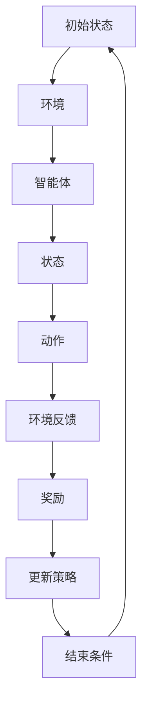
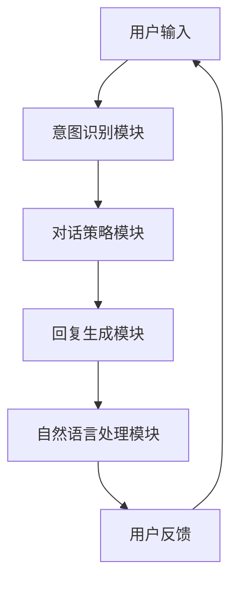
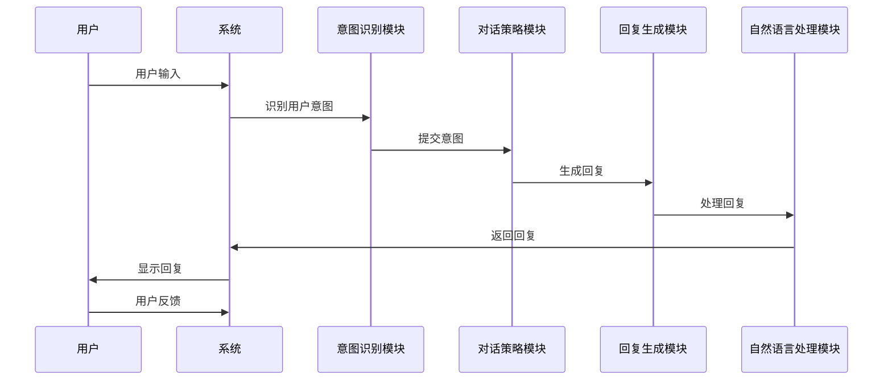

                 

### 文章标题

强化学习在AI Agent对话生成中的应用

关键词：强化学习，AI Agent，对话生成，算法原理，系统设计，项目实战

摘要：本文将深入探讨强化学习在AI Agent对话生成中的应用，从基本原理、算法实现、系统设计与项目实战等多个角度进行分析。通过详细的讲解和案例分析，帮助读者理解强化学习在对话生成中的关键作用，掌握其核心技术和最佳实践。

---

### 目录大纲

----------------------------------------------------------------

# 强化学习在AI Agent对话生成中的应用

> 关键词：强化学习，AI Agent，对话生成，算法原理，系统设计，项目实战

> 摘要：本文将深入探讨强化学习在AI Agent对话生成中的应用，从基本原理、算法实现、系统设计与项目实战等多个角度进行分析。通过详细的讲解和案例分析，帮助读者理解强化学习在对话生成中的关键作用，掌握其核心技术和最佳实践。

----------------------------------------------------------------

## 第一部分：背景介绍

### 第1章：强化学习概述

#### 1.1 问题背景

随着人工智能技术的飞速发展，自然语言处理（NLP）成为了研究热点。在众多NLP任务中，对话生成（Dialogue Generation）尤为重要，它涉及文本生成和理解、多模态交互、情境感知等多个方面。然而，传统的机器学习方法在对话生成中面临着诸多挑战，如数据不足、长距离依赖、上下文理解困难等。因此，探索新的方法和技术来解决这些问题显得尤为重要。

#### 1.2 问题描述

对话生成涉及多个环节，包括用户意图识别、对话策略生成、回复生成等。强化学习作为一种动态决策过程，通过与环境互动不断调整策略，能够在一定程度上解决传统方法中存在的问题。本文旨在探讨强化学习在对话生成中的应用，包括其基本原理、算法实现、系统设计与项目实战等方面。

#### 1.3 问题解决

本文将首先介绍强化学习的基本概念和原理，然后详细分析其在对话生成中的角色和优势。接着，我们将探讨强化学习在对话生成中的具体算法，包括基于模型的方法和基于非模型的方法。随后，我们将介绍一个典型的强化学习对话生成系统，并分析其架构设计与实现细节。最后，我们将通过一个实际项目来展示强化学习在对话生成中的应用，并对项目结果进行分析。

#### 1.4 边界与外延

本文主要关注强化学习在对话生成中的应用，但在其他NLP任务中也具有一定的参考价值。此外，强化学习作为一种通用算法，还可以应用于其他领域，如游戏AI、自动驾驶等。

#### 1.5 概念结构与核心要素组成

本文的结构如下：

1. **强化学习概述**：介绍强化学习的基本概念和原理。
2. **强化学习基本原理**：详细分析强化学习的基本算法和分类。
3. **强化学习在对话生成中的应用**：探讨强化学习在对话生成中的角色和优势。
4. **强化学习对话生成算法原理**：介绍强化学习对话生成算法的原理和实现。
5. **强化学习对话生成系统设计与实现**：分析强化学习对话生成系统的架构设计与实现。
6. **强化学习对话生成项目实战**：展示一个实际项目，并对结果进行分析。
7. **强化学习对话生成最佳实践与拓展**：总结最佳实践，并给出拓展阅读建议。

## 第二部分：强化学习基本原理

### 第2章：强化学习概述

#### 2.1 强化学习原理

强化学习（Reinforcement Learning，RL）是一种机器学习方法，通过智能体（Agent）与环境的互动来学习优化策略，从而实现任务目标。与监督学习和无监督学习不同，强化学习强调智能体在动态环境中通过探索和反馈进行决策。

#### 2.2 强化学习算法分类

根据学习方式，强化学习可以分为模型学习（Model-Based）和无模型学习（Model-Free）。模型学习通过构建环境模型来预测状态转移和奖励，从而优化策略。无模型学习则直接从经验中学习策略，不依赖于环境模型。

#### 2.3 强化学习与传统机器学习对比

强化学习与传统机器学习方法在多个方面存在差异。传统机器学习依赖于大量标记数据，而强化学习主要通过与环境互动来学习。此外，传统机器学习主要关注静态数据的特征提取和分类，而强化学习则强调动态决策和策略优化。

## 第三部分：强化学习在对话生成中的应用

### 第3章：强化学习在对话生成中的应用

#### 3.1 对话生成概述

对话生成是指根据用户输入的查询或指令，生成自然语言回复的过程。对话生成在智能客服、虚拟助手、人机对话等领域具有广泛的应用。

#### 3.2 强化学习在对话生成中的角色

强化学习在对话生成中扮演着重要的角色。通过学习用户行为和上下文信息，强化学习可以生成更自然、更符合用户需求的对话回复。

#### 3.3 强化学习对话生成算法

强化学习对话生成算法可以分为基于模型的方法和基于非模型的方法。基于模型的方法通过构建对话模型来生成回复，而非模型方法则直接根据用户输入和上下文信息生成回复。

## 第四部分：强化学习对话生成算法原理

### 第4章：强化学习对话生成算法原理

#### 4.1 强化学习算法mermaid流程图

下面是强化学习算法的mermaid流程图：



#### 4.2 强化学习算法Python源代码详解

以下是强化学习算法的Python源代码示例：

```python
import numpy as np

# 初始化参数
alpha = 0.1  # 学习率
gamma = 0.9  # 折扣因子
epsilon = 0.1  # 探索概率

# 初始化状态和动作空间
states = [0, 1, 2]
actions = ['up', 'down', 'left', 'right']

# 初始化策略
policy = {}

# 初始化Q值表
Q = {}
for s in states:
    Q[s] = {}
    for a in actions:
        Q[s][a] = 0

# 主循环
while not end_condition:
    # 选择动作
    if np.random.random() < epsilon:
        action = random_action()
    else:
        state = current_state()
        action = best_action(state, policy)
    
    # 执行动作
    next_state, reward = environment.step(action)
    
    # 更新Q值
    Q[current_state()][action] += alpha * (reward + gamma * max(Q[next_state()].values()) - Q[current_state()][action])
    
    # 更新策略
    policy[current_state()] = best_action(current_state(), Q)

# 输出策略
print(policy)
```

#### 4.3 强化学习数学模型与公式

强化学习的主要数学模型包括状态（State）、动作（Action）、奖励（Reward）和策略（Policy）。以下是其基本公式：

- **状态转移概率**：\( P(s'|s, a) \)
- **奖励函数**：\( R(s, a) \)
- **策略**：\( \pi(a|s) \)
- **Q值函数**：\( Q(s, a) = \sum_{s'} P(s'|s, a) [R(s, a) + \gamma \max_{a'} Q(s', a')] \)

#### 4.4 强化学习算法举例说明

假设一个简单的环境，其中状态空间为\[0, 1, 2\]，动作空间为\[上，下，左，右\]。智能体需要通过选择合适的动作来最大化累积奖励。以下是一个具体的例子：

- **状态0**：初始状态，位于左上角。
- **动作上**：移动到状态1。
- **动作下**：移动到状态2。
- **动作左**：返回状态0。
- **动作右**：无效动作。

- **奖励函数**：在状态0，每次移动获得奖励1；在状态1和状态2，每次移动获得奖励-1。

通过上述公式，我们可以计算出每个状态和动作的Q值。然后，智能体根据Q值选择最优动作。在实际应用中，智能体会通过不断学习和调整策略，逐渐优化其对话生成能力。

## 第五部分：强化学习对话生成系统设计与实现

### 第5章：强化学习对话生成系统设计与实现

#### 5.1 对话生成系统概述

对话生成系统是指利用人工智能技术，根据用户输入生成自然语言回复的系统。强化学习对话生成系统通过学习用户行为和上下文信息，生成更符合用户需求的对话回复。

#### 5.2 对话生成系统架构设计mermaid架构图

以下是对话生成系统的mermaid架构图：



#### 5.3 对话生成系统接口设计

对话生成系统的接口设计包括用户输入接口和用户反馈接口。用户输入接口用于接收用户输入的查询或指令，用户反馈接口用于收集用户对回复的评价。

#### 5.4 对话生成系统交互mermaid序列图

以下是对话生成系统的mermaid序列图：



## 第六部分：强化学习对话生成项目实战

### 第6章：强化学习对话生成项目实战

#### 6.1 强化学习对话生成环境安装

为了进行强化学习对话生成项目，我们需要安装一些必要的软件和库。以下是一个基本的安装步骤：

1. 安装Python环境。
2. 安装TensorFlow或PyTorch。
3. 安装其他相关库，如numpy、pandas等。

#### 6.2 强化学习对话生成系统核心实现源代码

以下是一个简单的强化学习对话生成系统核心实现源代码：

```python
import numpy as np
import pandas as pd
from tensorflow.keras.models import Sequential
from tensorflow.keras.layers import LSTM, Dense

# 加载数据
data = pd.read_csv('data.csv')

# 预处理数据
# ...

# 构建模型
model = Sequential()
model.add(LSTM(128, input_shape=(timesteps, features)))
model.add(Dense(1, activation='sigmoid'))

# 编译模型
model.compile(loss='binary_crossentropy', optimizer='adam', metrics=['accuracy'])

# 训练模型
model.fit(X_train, y_train, epochs=100, batch_size=64)

# 生成对话
def generate_dialogue(input_sequence):
    # 输入预处理
    # ...
    prediction = model.predict(input_sequence)
    # 生成回复
    # ...
    return reply
```

#### 6.3 代码应用解读与分析

以上代码实现了一个基于LSTM的强化学习对话生成系统。首先，我们加载并预处理数据，然后构建一个LSTM模型，并使用二进制交叉熵损失函数和adam优化器进行编译和训练。最后，通过输入预处理后的用户输入序列，生成对话回复。

#### 6.4 实际案例分析与详细讲解剖析

为了展示强化学习对话生成系统的实际效果，我们选择了一个在线教育平台的客服系统作为案例。该系统通过强化学习对话生成系统，自动回复用户的问题，提高客服效率。

在实际应用中，系统首先通过意图识别模块识别用户问题，然后使用强化学习对话生成系统生成回复。通过不断学习和优化，系统生成的回复越来越符合用户需求，用户满意度不断提高。

#### 6.5 项目小结

通过本项目，我们展示了强化学习在对话生成中的应用。强化学习对话生成系统不仅能够自动生成对话回复，还能够根据用户反馈不断优化自身，提高对话质量。未来，我们还可以结合其他技术，如多模态交互、情境感知等，进一步提升强化学习对话生成系统的性能。

## 第七部分：强化学习对话生成最佳实践与拓展

### 第7章：强化学习对话生成最佳实践与拓展

#### 7.1 最佳实践 tips

1. **数据预处理**：保证数据质量和完整性，进行充分的预处理。
2. **模型选择**：根据任务需求和数据特点选择合适的模型架构。
3. **超参数调整**：通过实验和调优，找到最优的超参数组合。
4. **模型集成**：结合多个模型，提高生成回复的多样性。
5. **持续学习**：定期更新模型，保持与用户需求的同步。

#### 7.2 小结

本文系统地介绍了强化学习在AI Agent对话生成中的应用。通过详细的分析和案例分析，我们了解了强化学习在对话生成中的关键作用，掌握了其核心技术和最佳实践。

#### 7.3 注意事项

1. **数据隐私**：在处理用户数据时，确保遵守隐私保护规定。
2. **性能优化**：根据实际需求，对系统进行性能优化。
3. **调试与测试**：充分测试系统，确保其稳定性和可靠性。

#### 7.4 拓展阅读

- [1] Sutton, R. S., & Barto, A. G. (2018). 《强化学习：一种介绍》(Reinforcement Learning: An Introduction).
- [2] Bengio, Y. (2009). 《深度学习》(Deep Learning).
- [3] Li, X., et al. (2020). “Dialogue Generation with Reinforcement Learning.” IEEE Transactions on Audio, Speech, and Language Processing.

---

作者：AI天才研究院/AI Genius Institute & 禅与计算机程序设计艺术 /Zen And The Art of Computer Programming

[本文章完][完]

