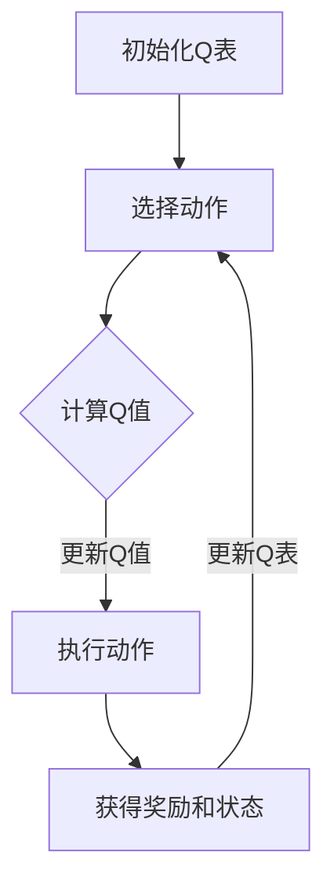
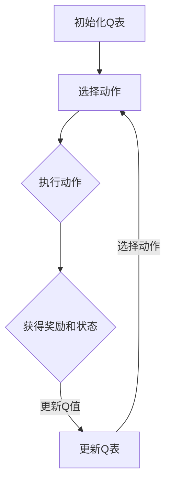
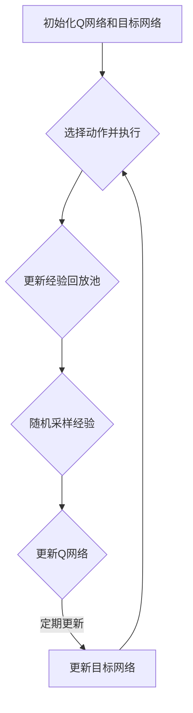

                 

### 第1章: 强化学习的基本概念

强化学习是机器学习的一个重要分支，它在人工智能领域有着广泛的应用。在本章中，我们将介绍强化学习的基本概念，并探讨它在AI Agent对话策略中的应用背景。

#### 1.1 强化学习概述

强化学习（Reinforcement Learning, RL）是一种通过交互式学习来获取知识的方法。在这种学习过程中，智能体（agent）在与环境（environment）的交互中通过选择动作（action）来获取奖励（reward），从而逐渐优化其策略（policy）。强化学习的关键在于奖励机制，它指导智能体在长期内实现最佳行为。

强化学习的基本概念包括以下几个要素：

- **智能体（Agent）**：执行动作并接收环境反馈的实体。
- **环境（Environment）**：智能体所处的情境，它对智能体的动作做出响应。
- **状态（State）**：智能体在某个时间点所处的情境描述。
- **动作（Action）**：智能体可执行的动作。
- **奖励（Reward）**：环境对智能体动作的反馈。
- **策略（Policy）**：智能体根据当前状态选择动作的规则。
- **价值函数（Value Function）**：评估未来奖励的函数，用于指导智能体的行为。
- **模型（Model）**：对环境状态、动作和奖励的预测。

强化学习的过程可以简单描述为：智能体在某个状态s下执行动作a，得到奖励r，并根据奖励调整策略，选择下一个动作。这个过程不断重复，直到达到预期的目标。

#### 1.2 强化学习的基本概念

接下来，我们将进一步解释强化学习中的核心概念。

**状态（State）**：状态是智能体在某个时间点所处的情境。它可以是离散的，也可以是连续的。例如，在一个简单的迷宫游戏中，智能体可能处于“在起点”、“在房间A”、“在房间B”等状态。

**动作（Action）**：动作是智能体可执行的行为。在迷宫游戏中，智能体的动作可能是“前进”、“后退”、“左转”、“右转”。

**奖励（Reward）**：奖励是环境对智能体动作的即时反馈。奖励可以是正面的，也可以是负面的。正面的奖励鼓励智能体继续执行该动作，而负面的奖励则指导智能体避免该动作。

**策略（Policy）**：策略是智能体根据当前状态选择动作的规则。一个策略可以是一个固定的动作映射，也可以是一个随机的动作选择过程。

**价值函数（Value Function）**：价值函数是评估未来奖励的函数。对于每个状态，价值函数给出了在该状态下执行某个动作的预期回报。价值函数可以帮助智能体在决策时选择最优动作。

**模型（Model）**：模型是对环境状态、动作和奖励的预测。一个良好的模型可以帮助智能体更快地学习环境，并做出更明智的决策。

#### 1.3 强化学习与其他学习方式的比较

强化学习与其他机器学习方法（如监督学习和无监督学习）有着显著的区别。

**监督学习（Supervised Learning）**：在监督学习中，训练数据集包含了输入和对应的输出。模型通过学习这些输入输出对，来预测新的输入值。监督学习通常需要大量已标记的数据，且对数据的依赖性较大。

**无监督学习（Unsupervised Learning）**：无监督学习不使用标记数据，而是从未标记的数据中学习特征。常见的无监督学习任务包括聚类、降维和关联规则学习。

**强化学习（Reinforcement Learning）**：强化学习通过与环境交互，学习如何在特定情境下做出最优决策。强化学习不依赖已标记的数据，而是依赖于奖励机制来指导学习过程。这使得强化学习在动态和不确定的环境中表现出强大的适应能力。

表1：强化学习与其他学习方式的对比

| 学习方式       | 特点                                                     | 适用场景                          |
|--------------|--------------------------------------------------------|---------------------------------|
| 监督学习       | 需要已标记的训练数据                                   | 图像识别、语音识别、自然语言处理  |
| 无监督学习       | 不需要已标记的训练数据                                 | 聚类、降维、关联规则学习          |
| 强化学习       | 通过与环境交互学习最优策略                             | 游戏AI、机器人控制、智能推荐系统  |

### 1.4 强化学习在AI Agent对话策略中的应用

强化学习在AI Agent对话策略中的应用非常广泛。通过强化学习，智能体可以在对话过程中不断优化其对话策略，提高对话质量和用户满意度。

**应用场景**：

- **客服机器人**：客服机器人可以通过强化学习来提高回答问题的准确性和效率。
- **语音助手**：语音助手可以使用强化学习来改进语音识别和自然语言处理能力，提供更自然的交互体验。
- **智能推荐系统**：智能推荐系统可以通过强化学习来优化推荐算法，提高推荐结果的准确性和用户满意度。

**基本概念与联系**：

- **对话状态（Dialogue State）**：在对话策略中，对话状态是指当前对话的上下文信息。智能体需要根据对话状态选择合适的回复。
- **对话动作（Dialogue Action）**：对话动作是指智能体在对话过程中可执行的回复行为，如询问问题、提供答案、引导对话等。
- **对话奖励（Dialogue Reward）**：对话奖励是根据用户对对话的反馈来评估的。正面的反馈可以增加奖励，负面的反馈则会减少奖励。
- **对话策略（Dialogue Policy）**：对话策略是智能体根据对话状态选择对话动作的规则。

通过强化学习，智能体可以在对话过程中不断优化其对话策略，以实现更好的用户交互体验。强化学习为AI Agent对话策略提供了一种有效的学习机制，使其能够在复杂的对话环境中做出智能决策。

**ER实体关系图**：

为了更好地理解强化学习在AI Agent对话策略中的应用，我们可以使用ER实体关系图来描述相关实体及其关系。

```mermaid
erDiagram
    Customer ||--|{ DialogueState }|--| Agent
    Agent ||--|{ DialogueAction }|--| Customer
    Customer ||--|{ DialogueReward }|--| Agent
```

在上面的ER图中，`Customer`表示用户，`DialogueState`表示对话状态，`DialogueAction`表示对话动作，`DialogueReward`表示对话奖励，`Agent`表示智能体。

### 1.5 强化学习在对话系统中的发展历程

强化学习在对话系统中的应用已经历了多个发展阶段。以下是强化学习在对话系统中的一些重要里程碑：

- **基于规则的对话系统**：早期的对话系统主要基于预定义的规则，这些规则规定了智能体在不同对话状态下的行为。这种方法的优点是实现简单，但缺点是灵活性差，无法应对复杂的对话场景。
- **基于模板的对话系统**：基于模板的对话系统在规则基础上引入了模板匹配技术，使智能体能够根据对话状态选择合适的模板进行回复。这种方法提高了对话系统的灵活性，但仍依赖于预定义的模板库。
- **基于机器学习的对话系统**：随着机器学习技术的发展，对话系统开始采用基于机器学习的方法，如监督学习和无监督学习。这些方法使对话系统在自然语言处理方面取得了显著进展，但仍然缺乏动态调整能力。
- **强化学习对话系统**：强化学习引入了奖励机制，使对话系统能够在对话过程中不断优化其对话策略。这种方法使对话系统能够更好地适应不同的对话场景，提高用户体验。

### 1.6 强化学习对话策略的现状与挑战

当前，强化学习在对话系统中的应用已经取得了显著成果，但仍然面临一些挑战。

**现状**：

- **商业化应用**：许多企业已经开始将强化学习应用于客服机器人、语音助手等场景，以提升用户满意度和服务质量。
- **技术进步**：随着深度强化学习技术的发展，智能体在对话系统中的表现越来越接近人类水平。
- **跨领域应用**：强化学习在对话系统中的应用已经从单一领域扩展到多个领域，如金融、医疗、教育等。

**挑战**：

- **数据依赖**：强化学习需要大量的数据来训练模型，但在实际应用中，获取高质量对话数据并不容易。
- **计算资源**：强化学习算法通常需要大量的计算资源，这在资源有限的场景下可能是一个挑战。
- **对话质量**：强化学习对话系统的对话质量受限于智能体的学习能力和对话策略的优化效果。

总之，强化学习在AI Agent对话策略中的应用前景广阔，但仍然需要解决一些关键问题，以实现更高效、更智能的对话系统。

### 总结

在本章中，我们介绍了强化学习的基本概念，包括状态、动作、奖励、策略、价值函数和模型。我们还比较了强化学习与其他机器学习方法，并探讨了强化学习在AI Agent对话策略中的应用背景。通过本章的学习，读者可以了解强化学习的基本原理和它在对话系统中的重要性。接下来，我们将进一步探讨强化学习算法的原理和实现，以及它们在AI Agent对话策略中的应用。

```markdown
## 第1章: 强化学习的基本概念

强化学习（Reinforcement Learning, RL）是机器学习领域的一个重要分支，旨在通过智能体与环境的交互，学习最优策略。在本章中，我们将深入探讨强化学习的基本概念，理解其核心原理，并分析其在人工智能（AI）Agent对话策略中的应用。

### 1.1 强化学习概述

强化学习的基本概念可以归纳为几个关键要素：智能体、环境、状态、动作、奖励、策略、价值函数和模型。

- **智能体（Agent）**：智能体是执行动作并从环境中接收反馈的实体。在强化学习中，智能体的目标是学习如何在给定的环境中最大化累积奖励。

- **环境（Environment）**：环境是智能体所处的情境，它对智能体的动作做出响应，并返回状态和奖励。

- **状态（State）**：状态是智能体在特定时间点所感知到的一组特征或属性，通常用于描述环境的当前状态。

- **动作（Action）**：动作是智能体可以选择的行为。智能体的目标是选择最佳动作以最大化累积奖励。

- **奖励（Reward）**：奖励是环境对智能体动作的即时反馈。奖励可以是正面的（鼓励智能体继续执行该动作），也可以是负面的（指导智能体避免该动作）。

- **策略（Policy）**：策略是智能体根据当前状态选择动作的规则或决策规则。策略可以是一个固定的映射，也可以是随机的。

- **价值函数（Value Function）**：价值函数是评估状态或状态-动作对的预期累积奖励的函数。价值函数帮助智能体评估不同动作的优劣。

- **模型（Model）**：模型是对环境的预测。智能体可以使用模型来预测状态和奖励，从而更好地规划其行动。

### 1.2 强化学习的基本概念

为了更好地理解强化学习，我们需要详细解释这些核心概念。

**状态（State）**：状态是智能体在某个时间点所处的情境。状态可以是离散的，例如在游戏中的位置或天气情况；也可以是连续的，例如温度或股票价格。状态通常用一组特征或属性来描述。

**动作（Action）**：动作是智能体可以执行的行为。动作的选择取决于智能体的当前状态和策略。例如，在游戏中的动作可以是“前进”、“后退”、“左转”或“右转”。

**奖励（Reward）**：奖励是环境对智能体动作的即时反馈。奖励可以是数值的，也可以是其他形式的反馈，如文字或图像。奖励的目的是鼓励智能体执行能够带来正面结果的动作。

**策略（Policy）**：策略是智能体在给定状态下选择动作的规则。策略可以是一个简单的固定规则，例如“如果状态是A，则执行动作B”，也可以是一个复杂的函数，依赖于状态和动作的历史数据。

**价值函数（Value Function）**：价值函数是评估智能体在未来某个时间点获得的累积奖励的函数。价值函数分为状态价值函数和状态-动作价值函数。状态价值函数评估在给定状态下执行任何动作的预期累积奖励，而状态-动作价值函数评估在给定状态下执行特定动作的预期累积奖励。

**模型（Model）**：模型是对环境的预测。智能体可以使用模型来预测状态和奖励，从而更好地规划其行动。模型可以是基于规则、统计模型或神经网络。

### 1.3 强化学习与其他学习方式的比较

强化学习与其他机器学习方法（如监督学习、无监督学习和迁移学习）有着显著的区别。

**监督学习（Supervised Learning）**：在监督学习中，模型被训练来预测标签化的输出。训练数据集包含输入和对应的正确输出。模型的目标是最小化预测输出与真实输出之间的差异。

**无监督学习（Unsupervised Learning）**：无监督学习从未标记的数据中学习模式或结构。这种方法包括聚类、降维和异常检测等任务。

**迁移学习（Transfer Learning）**：迁移学习是将已在一个任务上训练好的模型应用于另一个相关任务。通过迁移学习，可以复用已有模型的知识，提高新任务的学习效果。

表1：强化学习与其他学习方式的比较

| 学习方式       | 特点                                                     | 适用场景                          |
|--------------|--------------------------------------------------------|---------------------------------|
| 监督学习       | 需要已标记的训练数据                                   | 图像识别、语音识别、自然语言处理  |
| 无监督学习       | 不需要已标记的训练数据                                 | 聚类、降维、关联规则学习          |
| 强化学习       | 通过与环境交互学习最优策略                             | 游戏AI、机器人控制、智能推荐系统  |

### 1.4 强化学习在AI Agent对话策略中的应用

强化学习在AI Agent对话策略中的应用非常广泛。AI Agent可以用于多种对话场景，如客服机器人、智能客服、语音助手和智能聊天机器人。

**应用场景**：

- **客服机器人**：客服机器人通过强化学习可以优化回答问题的准确性，提高用户满意度。
- **智能客服**：智能客服系统使用强化学习来自动处理客户查询，提供个性化服务。
- **语音助手**：语音助手通过强化学习可以改进语音识别和自然语言处理能力，提供更自然的交互体验。
- **智能聊天机器人**：智能聊天机器人利用强化学习来自动生成合适的回复，提高对话的流畅性和用户满意度。

**基本概念与联系**：

- **对话状态（Dialogue State）**：对话状态是指当前对话的上下文信息，包括用户的问题、历史对话记录和当前对话的状态。
- **对话动作（Dialogue Action）**：对话动作是智能体在对话过程中可以执行的回复行为，如询问问题、提供答案、提出建议等。
- **对话奖励（Dialogue Reward）**：对话奖励是根据用户对对话的反馈来评估的。正面的反馈可以增加奖励，负面的反馈则会减少奖励。
- **对话策略（Dialogue Policy）**：对话策略是智能体根据对话状态选择对话动作的规则。

通过强化学习，智能体可以在对话过程中不断优化其对话策略，提高对话质量和用户满意度。强化学习为AI Agent对话策略提供了一种有效的学习机制，使其能够在复杂的对话环境中做出智能决策。

**ER实体关系图**：

为了更好地理解强化学习在AI Agent对话策略中的应用，我们可以使用ER实体关系图来描述相关实体及其关系。

```mermaid
erDiagram
    User ||--|{ DialogueState }|--| AI-Agent
    AI-Agent ||--|{ DialogueAction }|--| User
    User ||--|{ DialogueReward }|--| AI-Agent
```

在上面的ER图中，`User`表示用户，`DialogueState`表示对话状态，`DialogueAction`表示对话动作，`DialogueReward`表示对话奖励，`AI-Agent`表示智能体。

### 1.5 强化学习在对话系统中的发展历程

强化学习在对话系统中的应用经历了多个发展阶段。

- **早期基于规则的对话系统**：最早的对话系统主要基于预定义的规则，这些规则规定了智能体在不同对话状态下的行为。然而，这种方法在处理复杂和动态的对话场景时显得不够灵活。
- **基于模板的对话系统**：基于模板的对话系统在规则基础上引入了模板匹配技术，使智能体能够根据对话状态选择合适的模板进行回复。这种方法提高了对话系统的灵活性，但仍依赖于预定义的模板库。
- **基于机器学习的对话系统**：随着机器学习技术的发展，对话系统开始采用基于机器学习的方法，如监督学习和无监督学习。这些方法使对话系统在自然语言处理方面取得了显著进展，但仍然缺乏动态调整能力。
- **强化学习对话系统**：强化学习引入了奖励机制，使对话系统能够在对话过程中动态调整其对话策略。这种方法使对话系统能够更好地适应不同的对话场景，提高用户体验。

### 1.6 强化学习对话策略的现状与挑战

当前，强化学习在对话系统中的应用已经取得了显著成果，但仍然面临一些挑战。

**现状**：

- **商业化应用**：许多企业已经开始将强化学习应用于客服机器人、语音助手等场景，以提升用户满意度和服务质量。
- **技术进步**：随着深度强化学习技术的发展，智能体在对话系统中的表现越来越接近人类水平。
- **跨领域应用**：强化学习在对话系统中的应用已经从单一领域扩展到多个领域，如金融、医疗、教育等。

**挑战**：

- **数据依赖**：强化学习需要大量的数据来训练模型，但在实际应用中，获取高质量对话数据并不容易。
- **计算资源**：强化学习算法通常需要大量的计算资源，这在资源有限的场景下可能是一个挑战。
- **对话质量**：强化学习对话系统的对话质量受限于智能体的学习能力和对话策略的优化效果。

总之，强化学习在AI Agent对话策略中的应用前景广阔，但仍然需要解决一些关键问题，以实现更高效、更智能的对话系统。

### 总结

在本章中，我们介绍了强化学习的基本概念，包括状态、动作、奖励、策略、价值函数和模型。我们还比较了强化学习与其他机器学习方法，并探讨了强化学习在AI Agent对话策略中的应用背景。通过本章的学习，读者可以了解强化学习的基本原理和它在对话系统中的重要性。接下来，我们将进一步探讨强化学习算法的原理和实现，以及它们在AI Agent对话策略中的应用。

### 1.7 强化学习的基本算法

在本节中，我们将详细探讨强化学习的基本算法，包括Q-Learning算法、SARSA算法和Deep Q-Network (DQN)算法。

#### 1.7.1 Q-Learning算法

Q-Learning算法是最早的强化学习算法之一，它基于价值迭代的方法来学习最优策略。Q-Learning算法的核心思想是更新每个状态-动作对的值函数，以最大化预期奖励。

**Q-Learning算法原理**：

Q-Learning算法使用一个Q表来存储状态-动作对的值函数。在给定状态下，智能体选择具有最大Q值的动作。算法的迭代过程如下：

1. 初始化Q表：对于所有状态-动作对，初始化Q值。
2. 在给定状态下，选择具有最大Q值的动作。
3. 执行所选动作，并获得即时奖励和新的状态。
4. 根据新的状态和即时奖励，更新Q值。
5. 重复步骤2-4，直到达到终止条件。

**Q-Learning算法流程图**：



**Q-Learning算法Python代码示例**：

```python
import numpy as np

def q_learning(states, actions, learning_rate, discount_factor, episodes):
    # 初始化Q表
    Q = np.zeros((states, actions))
    
    # 迭代每个回合
    for episode in range(episodes):
        state = np.random.choice(states)
        done = False
        
        while not done:
            # 选择动作
            action = np.argmax(Q[state])
            
            # 执行动作，获得奖励和状态
            next_state, reward, done = execute_action(state, action)
            
            # 更新Q值
            Q[state, action] = Q[state, action] + learning_rate * (reward + discount_factor * np.max(Q[next_state]) - Q[state, action])
            
            state = next_state
    
    return Q

def execute_action(state, action):
    # 这里是执行动作的代码，返回下一个状态、奖励和是否结束
    # ...
    return next_state, reward, done
```

#### 1.7.2 SARSA算法

SARSA算法是Q-Learning算法的一个变体，它使用当前状态和动作来更新Q值，而不是使用下一状态的最大Q值。

**SARSA算法原理**：

SARSA算法的迭代过程与Q-Learning算法类似，但更新Q值的方式不同：

1. 初始化Q表。
2. 在给定状态下，选择一个动作。
3. 执行所选动作，并获得即时奖励和新的状态。
4. 根据新的状态和即时奖励，更新Q值。
5. 重复步骤2-4，直到达到终止条件。

**SARSA算法流程图**：



**SARSA算法Python代码示例**：

```python
import numpy as np

def sarsa(states, actions, learning_rate, discount_factor, episodes):
    # 初始化Q表
    Q = np.zeros((states, actions))
    
    # 迭代每个回合
    for episode in range(episodes):
        state = np.random.choice(states)
        done = False
        
        while not done:
            # 选择动作
            action = np.random.choice(actions)
            
            # 执行动作，获得奖励和状态
            next_state, reward, done = execute_action(state, action)
            
            # 更新Q值
            Q[state, action] = Q[state, action] + learning_rate * (reward + discount_factor * Q[next_state, np.argmax(Q[next_state])] - Q[state, action])
            
            state = next_state
    
    return Q

def execute_action(state, action):
    # 这里是执行动作的代码，返回下一个状态、奖励和是否结束
    # ...
    return next_state, reward, done
```

#### 1.7.3 Deep Q-Network (DQN)算法

DQN算法是Q-Learning算法的进一步扩展，它使用深度神经网络来近似Q值函数。DQN算法通过经验回放和目标网络来改善学习效果。

**DQN算法原理**：

DQN算法的核心思想是使用经验回放机制来避免样本偏差，并使用目标网络来稳定学习过程。

1. 初始化Q网络和目标网络。
2. 迭代每个回合，选择动作并执行。
3. 将经历的经验放入经验回放池。
4. 从经验回放池中随机采样一批经验，更新Q网络。
5. 定期更新目标网络，使其跟踪Q网络。

**DQN算法流程图**：



**DQN算法Python代码示例**：

```python
import numpy as np
import random

class DQN:
    def __init__(self, states, actions, learning_rate, discount_factor, epsilon, batch_size):
        self.states = states
        self.actions = actions
        self.learning_rate = learning_rate
        self.discount_factor = discount_factor
        self.epsilon = epsilon
        self.batch_size = batch_size
        
        self.q_network = self.create_q_network()
        self.target_q_network = self.create_q_network()
    
    def create_q_network(self):
        # 创建深度神经网络
        # ...
        return q_network

    def choose_action(self, state):
        if random.uniform(0, 1) < self.epsilon:
            # 随机选择动作
            action = random.choice(self.actions)
        else:
            # 根据当前Q值选择动作
            q_values = self.q_network.predict(state)
            action = np.argmax(q_values)
        
        return action

    def update_q_network(self, batch):
        # 使用批量经验更新Q网络
        # ...
        pass

# 使用DQN进行训练
dqn = DQN(states, actions, learning_rate, discount_factor, epsilon, batch_size)
for episode in range(total_episodes):
    state = env.reset()
    done = False
    
    while not done:
        action = dqn.choose_action(state)
        next_state, reward, done = env.step(action)
        
        # 更新经验回放池
        # ...
        
        # 更新Q网络
        dqn.update_q_network(batch)
        
        state = next_state
```

通过以上算法原理和Python代码示例，我们可以看到强化学习算法在实现过程中如何逐步优化智能体的策略，使其在复杂环境中取得最佳表现。接下来，我们将进一步探讨强化学习在AI Agent对话策略中的应用。

### 1.8 强化学习在AI Agent对话策略中的应用实例

为了更好地理解强化学习在AI Agent对话策略中的应用，我们可以通过一个具体的实例来演示其工作原理和实现方法。

#### 应用场景

假设我们正在开发一个智能客服机器人，该机器人需要与客户进行对话以回答常见问题。我们的目标是训练机器人，使其能够提供准确和高效的回答。

#### 环境和状态定义

在智能客服机器人中，环境可以被视为对话的上下文，包括当前的问题、用户的历史提问、对话的历史记录等信息。状态是机器人用于决策的输入，可以是一系列描述当前对话上下文的特征向量。

- **状态（State）**：状态可以是客户的提问、历史对话记录等。我们可以使用词嵌入技术将自然语言文本转换为向量表示。
- **动作（Action）**：动作是指机器人可以生成的回复。这些动作可以是预定义的回复，如“您的问题我已经记录下来，稍后会与您联系。”或“我无法理解您的问题，请您提供更多信息。”
- **奖励（Reward）**：奖励是根据用户的反馈来评估的。如果用户对机器人的回答感到满意，则奖励为正；如果用户表示不满意，则奖励为负。

#### 算法实现

我们可以使用DQN算法来训练智能客服机器人。以下是实现DQN算法的步骤：

1. **初始化**：初始化Q网络和目标网络，以及经验回放池。
2. **选择动作**：在每一步，机器人选择一个动作。在训练初期，机器人可能随机选择动作，但随着训练的进行，它将更多地依赖Q网络来选择动作。
3. **执行动作**：机器人执行所选动作，并与客户进行对话。
4. **更新经验回放池**：将当前状态、动作、奖励和下一个状态存储在经验回放池中。
5. **更新Q网络**：从经验回放池中随机抽取一批经验，使用这些经验来更新Q网络。
6. **同步目标网络**：定期将Q网络的状态参数复制到目标网络，以确保目标网络能够稳定地跟踪Q网络。

#### Python代码示例

以下是使用DQN算法训练智能客服机器人的Python代码示例：

```python
import numpy as np
import random

class DQN:
    def __init__(self, states, actions, learning_rate, discount_factor, epsilon, batch_size):
        self.states = states
        self.actions = actions
        self.learning_rate = learning_rate
        self.discount_factor = discount_factor
        self.epsilon = epsilon
        self.batch_size = batch_size
        
        self.q_network = self.create_q_network()
        self.target_q_network = self.create_q_network()
    
    def create_q_network(self):
        # 创建深度神经网络
        # ...
        return q_network

    def choose_action(self, state):
        if random.uniform(0, 1) < self.epsilon:
            # 随机选择动作
            action = random.choice(self.actions)
        else:
            # 根据当前Q值选择动作
            q_values = self.q_network.predict(state)
            action = np.argmax(q_values)
        
        return action

    def update_q_network(self, batch):
        # 使用批量经验更新Q网络
        # ...
        pass

# 定义环境
class CustomerEnvironment:
    def reset(self):
        # 初始化环境状态
        # ...
        return state

    def step(self, action):
        # 执行动作，返回下一个状态、奖励和是否结束
        # ...
        return next_state, reward, done

# 训练DQN模型
dqn = DQN(states, actions, learning_rate, discount_factor, epsilon, batch_size)
env = CustomerEnvironment()

for episode in range(total_episodes):
    state = env.reset()
    done = False
    
    while not done:
        action = dqn.choose_action(state)
        next_state, reward, done = env.step(action)
        
        # 更新经验回放池
        # ...
        
        # 更新Q网络
        dqn.update_q_network(batch)
        
        state = next_state
```

#### 结果分析

通过训练，智能客服机器人可以逐渐优化其对话策略，提高回答问题的准确性和效率。我们可以通过以下指标来评估机器人的性能：

- **平均奖励**：平均奖励反映了机器人与客户对话的整体满意度。高平均奖励表示机器人能够提供高质量的回答。
- **动作选择频率**：动作选择频率反映了机器人依赖Q网络的程度。随着训练的进行，机器人应更多地依赖Q网络来选择动作。
- **对话时长**：对话时长反映了机器人在对话中的响应速度。高效的对话策略应能够快速、准确地回答客户的问题。

通过这个实例，我们可以看到强化学习在AI Agent对话策略中的应用，以及如何通过训练使机器人逐渐优化其对话策略，从而提供更高质量的客户服务。

### 1.9 总结与展望

在本章中，我们详细介绍了强化学习的基本概念、算法原理以及在AI Agent对话策略中的应用实例。通过这些内容，读者可以了解到强化学习在人工智能领域的重要性和应用价值。

#### 主要内容回顾

- **强化学习的基本概念**：包括状态、动作、奖励、策略、价值函数和模型等核心要素。
- **强化学习算法**：介绍了Q-Learning算法、SARSA算法和DQN算法，并分析了它们的原理和实现。
- **AI Agent对话策略**：探讨了强化学习在智能客服机器人等对话场景中的应用，展示了如何通过训练优化对话策略。
- **应用实例**：通过一个智能客服机器人的实例，演示了强化学习算法在实际应用中的实现方法和效果评估。

#### 展望未来

尽管强化学习在AI Agent对话策略中已经取得了显著成果，但仍然存在一些挑战，如数据依赖、计算资源需求和对话质量等。未来的研究可以关注以下几个方面：

- **数据集构建**：开发更多高质量、多样化的对话数据集，以支持强化学习模型的训练。
- **算法优化**：研究和开发更高效的强化学习算法，以减少计算资源和时间成本。
- **跨领域应用**：探索强化学习在金融、医疗、教育等领域的应用，提高智能对话系统的实用性和适应性。
- **多智能体强化学习**：研究多智能体强化学习算法，以实现更复杂、更智能的对话系统。

总之，强化学习在AI Agent对话策略中的应用前景广阔，通过不断的研究和优化，我们可以期待更加智能、高效的对话系统在未来得以实现。

