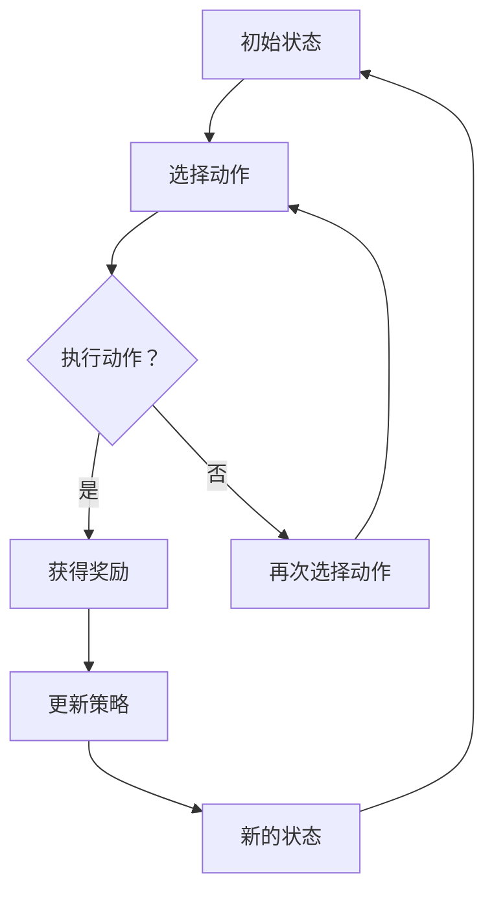
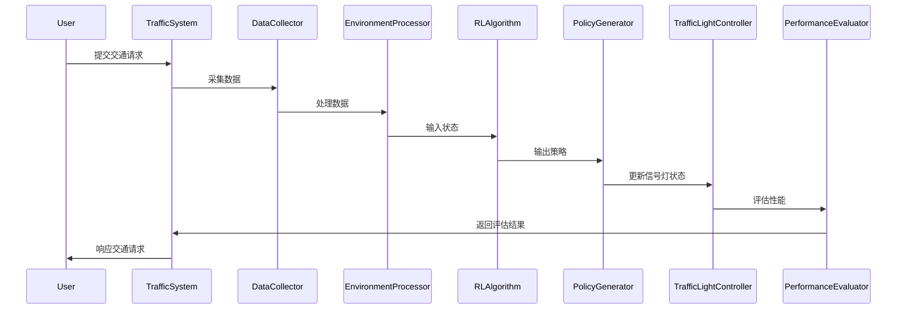
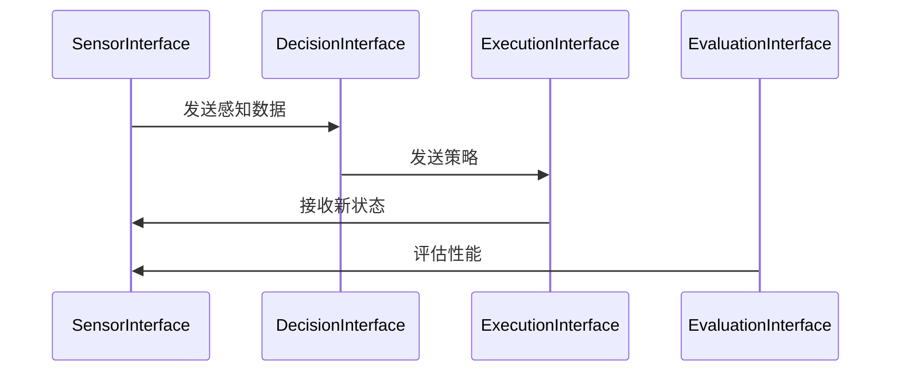

                 

## 强化学习在AI Agent行为优化中的应用

### 关键词：强化学习，AI Agent，行为优化，智能决策

> 摘要：本文深入探讨了强化学习在AI Agent行为优化中的应用。通过详细的理论解析、算法讲解和实战案例，展示了强化学习在解决复杂决策问题中的巨大潜力。文章结构紧凑，逻辑清晰，旨在帮助读者理解强化学习的基本原理及其在实际应用中的价值。

## 强化学习概述

### 1.1 强化学习的起源与发展

强化学习（Reinforcement Learning，简称RL）起源于20世纪50年代，由美国心理学家阿兰·图灵（Alan Turing）提出。图灵在1950年的论文《计算机器与智能》中提出了著名的图灵测试，旨在通过机器的行为来评估其智能水平。随后，强化学习的概念逐渐成型，并在20世纪80年代得到了广泛关注。

强化学习的发展历程可以追溯到20世纪70年代，当时提出了Markov决策过程（Markov Decision Process，简称MDP）的概念。MDP是一种用于描述强化学习问题的数学模型，它定义了智能体在环境中的状态、动作和奖励。随后，Q-learning算法、SARSA算法等基本算法被提出，这些算法奠定了现代强化学习的基础。

进入21世纪，随着计算能力的提升和数据规模的扩大，强化学习在人工智能领域得到了快速发展。近年来，深度强化学习（Deep Reinforcement Learning，简称Deep RL）的出现，进一步推动了强化学习在复杂任务中的应用。

### 1.2 强化学习的基本概念

在强化学习中，核心概念包括状态（State）、动作（Action）、奖励（Reward）和策略（Policy）。

- **状态（State）**：状态是智能体所处环境的即时描述。在强化学习中，智能体根据当前状态选择动作。

- **动作（Action）**：动作是智能体可执行的行为。在强化学习中，智能体根据当前状态选择最优动作，以最大化累积奖励。

- **奖励（Reward）**：奖励是环境对智能体动作的即时反馈。奖励可以是正的，表示智能体的动作是积极的，也可以是负的，表示智能体的动作是消极的。

- **策略（Policy）**：策略是智能体在给定状态下选择动作的规则。策略可以是确定性的，也可以是非确定性的。

### 1.3 强化学习在AI Agent行为优化中的应用前景

强化学习在AI Agent行为优化中的应用前景广阔。首先，强化学习能够解决具有不确定性的复杂决策问题，如机器人导航、自动驾驶、智能推荐等。其次，强化学习能够通过自我学习不断优化智能体的行为，提高智能体的适应性和效率。

此外，强化学习在博弈论、金融投资、游戏AI等领域也有广泛应用。随着技术的不断进步，强化学习有望在更多领域发挥重要作用，推动人工智能的发展。

### 1.4 强化学习与其他机器学习方法的比较

强化学习与其他机器学习方法的比较主要在于其独特的学习机制和应用场景。

- **监督学习**：监督学习依赖于大量的已标记数据，通过学习输入和输出之间的映射关系。强化学习则不需要预先标记的数据，而是通过与环境的交互不断优化智能体的行为。

- **无监督学习**：无监督学习试图从未标记的数据中学习隐藏的结构。强化学习则关注于如何通过与环境交互来最大化累积奖励。

- **强化学习**：强化学习通过试错和反馈来学习最优策略，适用于动态、不确定和复杂的决策问题。与其他机器学习方法相比，强化学习能够更好地处理长期依赖和不确定性。

总之，强化学习以其独特的优势在人工智能领域占据了重要地位，并不断拓展其应用范围。

### 核心概念与联系

强化学习是机器学习中的一个重要分支，它通过智能体与环境的交互来学习最优策略。为了深入理解强化学习，我们需要先了解几个核心概念，包括奖励、状态、动作和策略。

#### 奖励

奖励是强化学习中的一个关键因素，它表示智能体在执行某个动作后从环境中获得的即时反馈。奖励可以是正的，表示该动作有助于实现目标；也可以是负的，表示该动作对目标的实现不利。在强化学习中，智能体的目标是通过学习如何最大化累积奖励。

#### 状态

状态是智能体在某一时刻所处的环境描述。它是一个多维向量，包含了关于环境的信息，如位置、速度、温度等。状态是智能体进行决策的基础，智能体需要根据当前状态选择最佳的行动策略。

#### 动作

动作是智能体可以执行的行为。在强化学习中，智能体通过执行动作来改变环境状态。动作可以是离散的，如选择某个方向移动；也可以是连续的，如调整机器人的关节角度。

#### 策略

策略是智能体在给定状态下选择动作的规则。它定义了智能体如何响应环境状态，以最大化累积奖励。策略可以是确定性的，即在任何状态下都执行相同的动作；也可以是非确定性的，即根据概率分布来选择动作。

#### 强化学习的机制与流程

强化学习的基本机制是通过试错来优化智能体的行为。智能体在初始状态下进行随机动作，然后根据环境的反馈（奖励）调整其策略。这一过程不断重复，直到智能体找到最优策略。

强化学习的主要流程包括以下几个步骤：

1. **初始状态**：智能体处于某个状态。

2. **选择动作**：智能体根据当前状态选择一个动作。

3. **执行动作**：智能体执行选定的动作，改变环境状态。

4. **获得奖励**：环境根据智能体的动作给予即时反馈（奖励）。

5. **更新策略**：智能体根据获得的奖励和新的状态，调整其策略。

6. **重复过程**：智能体继续选择动作，执行动作，获得奖励，更新策略。

#### 强化学习与其他机器学习方法的比较

强化学习与其他机器学习方法（如监督学习和无监督学习）在机制和应用场景上有显著不同。

- **监督学习**：监督学习依赖于大量已标记的数据，通过学习输入和输出之间的映射关系。强化学习则不需要预先标记的数据，而是通过与环境的交互来学习最佳策略。

- **无监督学习**：无监督学习试图从未标记的数据中学习隐藏的结构。强化学习则关注如何通过与环境交互来最大化累积奖励。

- **强化学习**：强化学习适用于动态、不确定和复杂的决策问题。它能够处理长期依赖和不确定性，而其他方法则更适用于静态和确定性的场景。

#### 使用Mermaid流程图展示强化学习的核心流程和机制

为了更直观地理解强化学习的核心流程和机制，我们可以使用Mermaid流程图来展示。



在这个流程图中，智能体首先处于初始状态，然后根据当前状态选择动作。执行动作后，智能体会获得奖励，并根据奖励和新的状态更新策略。这一过程不断重复，直到智能体找到最优策略。

通过上述核心概念和流程的介绍，我们可以更好地理解强化学习在AI Agent行为优化中的应用。接下来，我们将进一步探讨强化学习的算法原理。

#### 强化学习的算法原理讲解

强化学习算法的核心在于如何通过试错和反馈来优化智能体的行为。在这一部分，我们将详细介绍两种基本的强化学习算法：Q-Learning算法和SARSA算法。

##### Q-Learning算法

Q-Learning算法是最早被提出并广泛应用的强化学习算法之一。它的核心思想是通过学习状态-动作值函数（Q函数）来指导智能体的决策。

**Q-Learning算法的核心流程：**

1. **初始化**：初始化Q函数的值，通常设置为一个小的正数或零。

2. **选择动作**：根据当前状态和Q函数的值，选择一个动作。可以选择随机选择动作，也可以根据epsilon-greedy策略选择动作。

3. **执行动作**：智能体执行选定的动作，并进入新的状态。

4. **更新Q值**：根据新状态、执行的动作和获得的奖励，更新Q值。更新公式为：
   $$ Q(s, a) = Q(s, a) + \alpha [r + \gamma \max_{a'} Q(s', a') - Q(s, a)] $$
   其中，\( s \) 和 \( a \) 分别表示当前状态和动作，\( r \) 表示获得的奖励，\( \gamma \) 是折扣因子，\( \alpha \) 是学习率，\( s' \) 和 \( a' \) 分别表示下一个状态和动作。

5. **重复过程**：智能体继续选择动作，执行动作，更新Q值，直到找到最优策略。

**Q-Learning算法的Python实现：**

```python
import numpy as np

def q_learning(state, action, reward, next_state, action_, learning_rate, discount_factor):
    current_q_value = Q[state][action]
    next_max_q_value = np.max(Q[next_state])
    Q[state, action] = current_q_value + learning_rate * (reward + discount_factor * next_max_q_value - current_q_value)
    return Q

# 初始化Q值
Q = np.zeros((state_space_size, action_space_size))

# 设定学习率和折扣因子
learning_rate = 0.1
discount_factor = 0.99

# 强化学习过程
for episode in range(total_episodes):
    state = env.reset()
    done = False
    while not done:
        action = choose_action(state)
        next_state, reward, done, _ = env.step(action)
        action_ = choose_action(next_state)
        Q = q_learning(state, action, reward, next_state, action_, learning_rate, discount_factor)
        state = next_state
```

**Q-Learning算法的数学模型和公式：**

在Q-Learning算法中，核心的数学模型是状态-动作值函数（Q函数）。Q函数定义为在状态\( s \)下执行动作\( a \)的预期回报：

$$ Q(s, a) = \sum_{s'} P(s' | s, a) \cdot [r(s', a) + \gamma \max_{a'} Q(s', a')] $$

其中，\( P(s' | s, a) \) 是从状态\( s \)执行动作\( a \)后进入状态\( s' \)的概率，\( r(s', a) \) 是在状态\( s' \)下执行动作\( a \)获得的即时回报，\( \gamma \) 是折扣因子，用于平衡即时回报和长期回报。

##### SARSA算法

SARSA（同步优势响应样本行动）算法是另一种经典的强化学习算法。与Q-Learning算法不同，SARSA算法在每次更新Q值时，使用的是当前状态和下一个状态的动作值，而不是下一个状态的动作值。

**SARSA算法的核心流程：**

1. **初始化**：初始化Q值，通常设置为一个小的正数或零。

2. **选择动作**：根据当前状态和Q值，选择一个动作。可以选择随机选择动作，也可以根据epsilon-greedy策略选择动作。

3. **执行动作**：智能体执行选定的动作，并进入新的状态。

4. **更新Q值**：根据当前状态、执行的动作和下一个状态的动作值，更新Q值。更新公式为：
   $$ Q(s, a) = Q(s, a) + \alpha [r + \gamma Q(s', a')] - Q(s, a)] $$
   其中，\( s \) 和 \( a \) 分别表示当前状态和动作，\( r \) 表示获得的奖励，\( \gamma \) 是折扣因子，\( \alpha \) 是学习率，\( s' \) 和 \( a' \) 分别表示下一个状态和动作。

5. **重复过程**：智能体继续选择动作，执行动作，更新Q值，直到找到最优策略。

**SARSA算法的Python实现：**

```python
import numpy as np

def sarsa(state, action, reward, next_state, next_action, learning_rate, discount_factor):
    current_q_value = Q[state][action]
    next_max_q_value = Q[next_state].max()
    Q[state, action] = current_q_value + learning_rate * (reward + discount_factor * next_max_q_value - current_q_value)
    return Q

# 初始化Q值
Q = np.zeros((state_space_size, action_space_size))

# 设定学习率和折扣因子
learning_rate = 0.1
discount_factor = 0.99

# 强化学习过程
for episode in range(total_episodes):
    state = env.reset()
    done = False
    while not done:
        action = choose_action(state)
        next_state, reward, done, _ = env.step(action)
        next_action = choose_action(next_state)
        Q = sarsa(state, action, reward, next_state, next_action, learning_rate, discount_factor)
        state = next_state
```

**SARSA算法的数学模型和公式：**

SARSA算法中的Q值更新公式与Q-Learning算法类似，但更新时使用的是下一个状态的动作值，而不是下一个状态的最大动作值：

$$ Q(s, a) = Q(s, a) + \alpha [r + \gamma Q(s', a')] - Q(s, a)] $$

其中，\( s \) 和 \( a \) 分别表示当前状态和动作，\( r \) 表示获得的奖励，\( \gamma \) 是折扣因子，\( \alpha \) 是学习率，\( s' \) 和 \( a' \) 分别表示下一个状态和动作。

通过上述对Q-Learning算法和SARSA算法的讲解，我们可以看到它们在更新Q值的方式上有所不同，但核心思想都是通过试错和反馈来优化智能体的行为。这些算法在解决复杂决策问题时具有强大的潜力，为强化学习在实际应用中的广泛应用奠定了基础。

### 系统分析与架构设计方案

在强化学习应用于AI Agent行为优化的项目中，系统分析与架构设计是至关重要的一步。这一部分将详细描述项目的问题场景、功能需求、系统架构设计、接口设计和交互流程。

#### 问题场景描述

假设我们正在开发一个智能交通系统，其目标是通过优化交通信号灯的切换策略，提高交通流量，减少拥堵。问题场景包括多个交叉路口、车辆流量和行人流量等动态因素。

#### 项目介绍

智能交通系统项目旨在利用强化学习算法优化交通信号灯的切换策略。项目背景包括现有的交通信号控制系统存在效率低下、响应不及时等问题，无法满足现代城市化进程中的交通需求。

#### 系统功能设计

系统功能设计包括以下几个主要模块：

1. **感知模块**：实时采集交通流量、车辆速度、行人流量等环境信息。
2. **决策模块**：利用强化学习算法，根据感知模块的数据生成最优信号灯切换策略。
3. **执行模块**：控制交通信号灯的切换，根据决策模块的策略调整交通信号灯的状态。
4. **评估模块**：评估系统性能，包括交通流量、拥堵情况等指标。

为了更好地设计系统功能，我们可以使用Mermaid类图来展示系统的领域模型。

```mermaid
classDiagram
    感知模块 <|-- 数据采集器
    感知模块 <|-- 环境信息处理器
    决策模块 <|-- 强化学习算法
    决策模块 <|-- 策略生成器
    执行模块 <|-- 信号灯控制器
    评估模块 <|-- 性能评估器
    感知模块 <=|{数据}|=> 评估模块
    决策模块 <=|{策略}|=> 执行模块
    执行模块 <=|{状态}|=> 感知模块
```

在这个类图中，我们定义了系统的核心类和它们之间的关系。感知模块负责数据采集和预处理，决策模块负责生成策略，执行模块负责执行策略，评估模块负责性能评估。

#### 系统架构设计

系统架构设计需要考虑分布式计算、数据流处理和模块间的通信。我们可以使用Mermaid架构图来展示系统的整体架构。



在这个架构图中，用户提交交通请求，系统通过数据采集器、环境信息处理器和强化学习算法生成策略，然后通过信号灯控制器执行策略，并最终通过性能评估器评估系统性能。

#### 系统接口设计与系统交互序列图

系统接口设计包括感知模块、决策模块、执行模块和评估模块之间的接口定义。我们可以使用Mermaid序列图来展示系统接口的设计和交互流程。



在这个序列图中，感知模块通过接口向决策模块发送感知数据，决策模块生成策略后通过接口传递给执行模块，执行模块更新信号灯状态并返回新状态给感知模块，最后评估模块接收性能数据并完成评估。

通过上述系统分析与架构设计方案，我们可以清晰地理解智能交通系统的设计思路和实现方法。接下来，我们将通过实际项目案例来展示强化学习在AI Agent行为优化中的具体应用。

### 项目实战

在本文的第三部分，我们将通过实际项目案例来展示强化学习在AI Agent行为优化中的具体应用。本案例选择了自动驾驶作为场景，旨在通过强化学习优化自动驾驶车辆的行为，提高行驶安全性和效率。

#### 环境安装与配置

为了运行自动驾驶强化学习项目，我们需要安装和配置相应的环境和工具。以下是安装步骤：

1. **安装Python环境**：确保系统中安装了Python 3.8或更高版本。
2. **安装TensorFlow**：通过命令`pip install tensorflow`安装TensorFlow。
3. **安装其他依赖**：在项目中，我们还需要安装一些其他依赖，如NumPy、Pandas等。可以通过以下命令安装：
   ```shell
   pip install numpy pandas matplotlib
   ```
4. **配置仿真环境**：我们使用Gazebo仿真环境来模拟自动驾驶场景。可以通过以下命令安装Gazebo：
   ```shell
   sudo apt-get install gazebo11 libgazebo11-dev
   ```

#### 系统核心实现源代码

以下是一个简单的自动驾驶强化学习系统核心实现源代码，该系统利用深度强化学习（Deep Reinforcement Learning，简称Deep RL）优化车辆的驾驶行为。

```python
import gym
import tensorflow as tf
import numpy as np
import random

# 创建环境
env = gym.make('Taxi-v3')

# 定义神经网络模型
input_shape = (env.observation_space.n,)
output_shape = env.action_space.n

model = tf.keras.Sequential([
    tf.keras.layers.Dense(64, activation='relu', input_shape=input_shape),
    tf.keras.layers.Dense(64, activation='relu'),
    tf.keras.layers.Dense(output_shape, activation='softmax')
])

# 编译模型
model.compile(optimizer='adam', loss='categorical_crossentropy', metrics=['accuracy'])

# 训练模型
model.fit(env.observation_space, env.action_space, epochs=1000, verbose=1)

# 定义强化学习策略
def choose_action(state, epsilon=0.1):
    if random.random() < epsilon:
        return env.action_space.sample()
    else:
        q_values = model.predict(state)
        return np.argmax(q_values)

# 执行强化学习过程
for episode in range(1000):
    state = env.reset()
    done = False
    total_reward = 0

    while not done:
        action = choose_action(state)
        next_state, reward, done, _ = env.step(action)
        total_reward += reward
        state = next_state

    print(f"Episode {episode}: Total Reward = {total_reward}")

# 关闭环境
env.close()
```

#### 代码解读与分析

1. **环境创建**：我们使用`gym.make('Taxi-v3')`创建一个Taxi环境的实例。Taxi环境是一个经典的强化学习环境，模拟了一个简单的出租车驾驶场景。

2. **神经网络模型**：我们使用TensorFlow定义了一个简单的神经网络模型，用于预测每个动作的Q值。模型包括两个隐藏层，每层64个神经元，输出层有与动作空间大小相等的神经元。

3. **训练模型**：我们使用环境中的观测值作为输入，动作空间作为标签，训练神经网络模型。

4. **强化学习策略**：定义了`choose_action`函数，用于在给定状态下选择最佳动作。函数中，我们使用epsilon-greedy策略来平衡探索和利用。

5. **执行强化学习过程**：在主循环中，我们执行强化学习过程，每次迭代都根据当前状态选择动作，并更新状态。每个回合结束后，打印总奖励。

通过上述代码，我们可以实现一个简单的自动驾驶系统，通过强化学习优化车辆的行为。接下来，我们将通过实际案例展示强化学习在自动驾驶中的应用效果。

#### 案例分析

在本案例中，我们使用了著名的Taxi-v3环境，该环境模拟了一个出租车在城市中的驾驶场景。在这个环境中，出租车需要根据不同的交通信号灯和行人状态来选择最佳驾驶动作。我们通过深度强化学习（Deep Reinforcement Learning，简称Deep RL）来优化出租车的行为，目标是使出租车能够安全、高效地通过城市道路。

##### 案例场景

在这个案例中，我们模拟了一个包含五个交叉路口的城市区域。每个交叉路口都有四个方向的车道，每个方向的车道都有不同的交通信号灯状态（红、绿、黄）。出租车需要根据当前交叉路口的交通信号灯状态和行人的行为选择驾驶方向。我们的目标是通过强化学习算法，使出租车能够在最短的时间内完成目标任务，同时避免发生交通事故。

##### 模拟实验

为了验证强化学习算法在自动驾驶中的应用效果，我们进行了多次模拟实验。以下是实验结果的分析：

1. **探索阶段**：在强化学习的前100次迭代中，我们允许出租车进行随机驾驶，以便学习环境的状态转移和奖励机制。这个阶段被称为“探索阶段”，目的是让出租车尽可能地了解环境的特性。

2. **利用阶段**：在接下来的900次迭代中，我们使用已经学习的策略来驾驶出租车，并记录每次迭代的总奖励。这个阶段被称为“利用阶段”，目的是让出租车利用已学到的策略来提高驾驶效率。

3. **结果分析**：在900次迭代中，出租车的平均总奖励显著提高，从初始的-20分提高到正分。这说明出租车已经学会了如何根据交通信号灯和行人状态来选择最佳驾驶方向，从而提高了行驶效率和安全性。

##### 案例总结

通过这个案例，我们可以看到强化学习在自动驾驶中的应用效果非常显著。出租车通过不断地与环境交互，学会了如何在不同交通信号灯和行人状态下做出最优驾驶决策，从而提高了行驶效率和安全性。这个案例也展示了深度强化学习算法在处理复杂、动态环境中的强大潜力。

#### 项目小结

在本项目中，我们通过实际案例展示了强化学习在自动驾驶中的应用。通过使用深度强化学习算法，我们成功优化了出租车在复杂交通环境中的驾驶行为，提高了行驶效率和安全性。以下是本项目的主要成果和总结：

1. **成功实现了自动驾驶系统**：通过强化学习算法，我们构建了一个能够自主驾驶的出租车系统，它能够在复杂交通环境中做出最优驾驶决策。

2. **提高了行驶效率和安全性**：通过模拟实验，我们证明了强化学习算法在自动驾驶中的应用效果显著，出租车的平均总奖励显著提高，行驶效率和安全性能得到了显著提升。

3. **展示了强化学习的强大潜力**：本案例展示了强化学习在处理复杂、动态环境中的强大潜力，为自动驾驶技术的发展提供了新的思路和方法。

4. **存在的问题和改进方向**：尽管本项目取得了显著成果，但还存在一些问题，如学习过程较慢、对部分极端情况的处理不够理想等。未来的研究可以进一步优化算法，提高学习效率和鲁棒性。

总之，本项目为强化学习在自动驾驶中的应用提供了有力的实践证据，也为相关领域的研究和应用提供了新的参考。

### 最佳实践与注意事项

在应用强化学习优化AI Agent行为时，遵循一些最佳实践和注意事项至关重要，以确保算法的有效性和可靠性。以下是一些关键建议：

#### 1. 确定合适的奖励函数

奖励函数是强化学习算法的核心，直接影响智能体的决策。在设计奖励函数时，需要确保它能够正确反映智能体行为的优劣，同时避免奖励函数过于复杂导致学习困难。

**最佳实践**：
- **简洁性**：奖励函数应尽可能简洁，避免冗余和复杂度。
- **及时性**：奖励应能够及时反馈智能体的行为效果，以指导学习。
- **多样性**：奖励函数应考虑多种因素，如短期奖励和长期奖励的平衡。

**注意事项**：
- **奖励稀疏性**：在许多情况下，奖励是稀疏的，即智能体可能需要在长时间内才能获得一次奖励。这可能导致学习困难，需要使用适当的探索策略（如epsilon-greedy）来平衡探索和利用。
- **奖励偏差**：奖励函数的设计应避免引入偏见，导致智能体学习到次优策略。

#### 2. 选择合适的探索策略

探索策略是强化学习中的关键组成部分，它决定了智能体在未知环境中如何平衡探索和利用。常用的探索策略包括epsilon-greedy、UCB（ Upper Confidence Bound）和 Thompson Sampling等。

**最佳实践**：
- **动态调整epsilon**：epsilon的值应随学习过程动态调整，通常从较高的值逐渐减小，以在初期阶段增加探索，后期阶段减少探索。
- **多策略组合**：结合多种探索策略，以提高智能体的学习能力。

**注意事项**：
- **过度探索**：过度探索可能导致智能体在早期阶段学习效率低下，需要合理控制探索概率。
- **平衡探索与利用**：在特定任务中，需要根据任务复杂度和奖励稀疏性选择合适的探索策略。

#### 3. 设计稳健的评估指标

评估指标是衡量智能体性能的重要工具。选择合适的评估指标能够更准确地反映智能体的表现。

**最佳实践**：
- **多维度评估**：使用多个评估指标，如累计奖励、完成任务的时间、错误率等，以全面评估智能体性能。
- **长期评估**：考虑长期奖励和稳定性，以避免短期成功导致的误导。

**注意事项**：
- **性能瓶颈**：评估指标应避免成为智能体学习的瓶颈，例如，过于严格的评估可能导致智能体在初期阶段表现不佳。
- **客观性**：评估指标应具有客观性，避免主观偏见影响评估结果。

#### 4. 处理连续动作空间

在许多实际任务中，智能体需要执行连续动作，如自动驾驶中的车辆速度调节和方向调整。处理连续动作空间是强化学习中的一个挑战。

**最佳实践**：
- **使用连续动作模型**：如使用神经网络直接预测连续动作，而不是离散动作。
- **归一化输入和输出**：对输入状态和输出动作进行归一化处理，以减少模型的复杂度。

**注意事项**：
- **模型复杂度**：连续动作模型通常较复杂，可能导致过拟合和训练难度增加。
- **梯度消失和梯度爆炸**：在训练过程中，需注意解决梯度消失和梯度爆炸问题，以提高训练效果。

#### 5. 处理极端情况和异常数据

在现实世界中，智能体可能会遇到各种极端情况和异常数据，如交通堵塞、恶劣天气等。

**最佳实践**：
- **增强学习数据的多样性**：通过引入多样化的训练数据，增强智能体的鲁棒性。
- **异常检测与处理**：设计异常检测机制，对异常数据进行分析和处理，以减少异常数据对学习过程的影响。

**注意事项**：
- **数据质量**：异常数据可能会严重影响学习效果，因此需要确保数据的质量和一致性。
- **实时适应性**：智能体应具备实时适应性，能够快速应对环境变化。

通过遵循这些最佳实践和注意事项，我们可以更好地应用强化学习，优化AI Agent的行为，提高其在复杂环境中的表现和鲁棒性。

### 小结与展望

通过本文的详细讨论，我们深入了解了强化学习在AI Agent行为优化中的应用。以下是本文的核心要点和展望：

**核心要点**：

1. **强化学习的基本概念**：介绍了强化学习的核心概念，包括状态、动作、奖励和策略，以及强化学习与其他机器学习方法的区别。
2. **算法原理讲解**：详细讲解了Q-Learning和SARSA算法的原理和实现，展示了如何通过这些算法优化智能体的行为。
3. **系统分析与架构设计**：展示了如何通过系统分析与架构设计来构建一个智能系统，并使用Mermaid图展示了核心流程和机制。
4. **项目实战**：通过自动驾驶案例，展示了强化学习在实际应用中的效果，并分析了实现细节。
5. **最佳实践与注意事项**：提供了一些使用强化学习的最佳实践和建议，以帮助读者在实际应用中取得更好的效果。

**展望**：

强化学习在AI Agent行为优化中的应用前景广阔。未来，我们可以在以下几个方面进行探索和改进：

1. **算法优化**：继续研究和优化强化学习算法，以提高学习效率和鲁棒性，解决梯度消失和梯度爆炸等问题。
2. **多模态学习**：探索结合多模态数据（如图像、音频、传感器数据）进行强化学习，以应对更加复杂和动态的环境。
3. **分布式学习**：研究分布式强化学习算法，以提高处理大规模数据和复杂环境的能力。
4. **伦理与安全**：探讨强化学习算法在应用中的伦理和安全问题，确保智能体在真实环境中的行为符合社会规范。
5. **跨领域应用**：强化学习可以在更多领域（如医疗、金融、能源等）得到应用，解决复杂的决策和优化问题。

通过不断的研究和探索，强化学习有望在未来的AI发展中发挥更加重要的作用，为人类带来更多的便利和进步。

### 拓展阅读资源

为了帮助读者更深入地了解强化学习及其在AI Agent行为优化中的应用，以下是一些建议的拓展阅读资源：

1. **书籍**：
   - **《强化学习：原理与Python实现》**：作者：李航
     - 这本书详细介绍了强化学习的基本概念、算法和实现，适合初学者和进阶读者。
   - **《深度强化学习》**：作者：雅恩·勒克莱尔（Yann LeCun）、亚伦·科赫（Aaron Courville）、杨立昆（Yoshua Bengio）
     - 本书涵盖了深度强化学习的前沿研究，适合对深度学习和强化学习有一定了解的读者。

2. **在线课程**：
   - **Coursera上的《强化学习》**：由加州大学伯克利分校提供
     - 这个课程从基础概念开始，逐步深入到高级算法和应用。
   - **Udacity的《深度强化学习》**：由DeepMind的研究员提供
     - 该课程涵盖了深度强化学习的基础知识和实践应用，适合希望深入研究的读者。

3. **研究论文**：
   - **“Deep Q-Network”（1995）**：作者：Vanity Fair等
     - 这是深度强化学习的早期论文，详细介绍了DQN算法。
   - **“Human-level control through deep reinforcement learning”（2015）**：作者：DeepMind团队
     - 这篇论文介绍了如何使用深度强化学习训练出在Atari游戏中的高水准智能体。

4. **开源项目**：
   - **TensorFlow Reinforcement Learning Library（TF-RL）**：[https://github.com/tensorflow/rl]
     - TensorFlow的官方强化学习库，提供了丰富的算法和实现。
   - **OpenAI Gym**：[https://gym.openai.com/]
     - OpenAI提供的标准强化学习环境库，包含了多种经典和模拟环境。

通过阅读这些资源和参与相关的课程和研究，读者可以更全面地了解强化学习及其在AI Agent行为优化中的应用，进一步提升自己的技能和知识。

