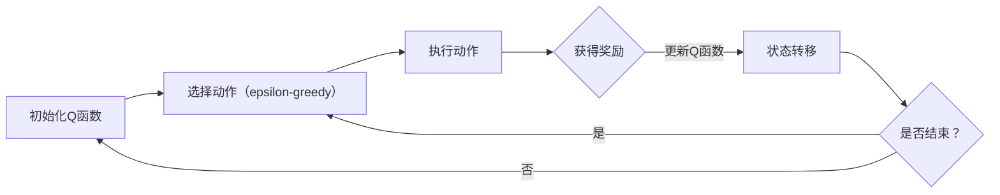
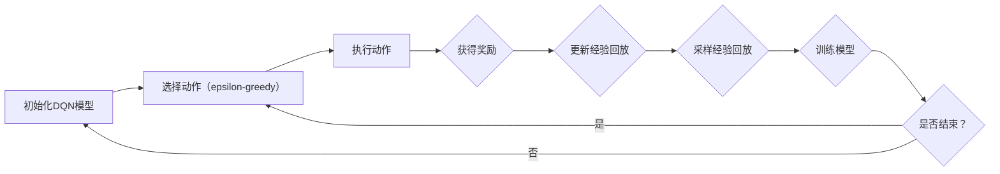
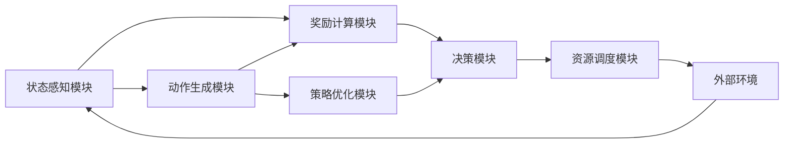

                 


## 强化学习在AI Agent资源调度中的应用

### 关键词：强化学习、AI Agent、资源调度、算法原理、系统设计、项目实战

### 摘要：

本文将深入探讨强化学习在AI Agent资源调度中的应用。我们将从强化学习的基本概念、核心算法原理出发，逐步分析其在资源调度中的具体应用场景。文章将结合实际案例，详细讲解系统设计与实现过程，并给出最佳实践建议和拓展阅读资源。通过这篇文章，读者将全面了解强化学习在AI Agent资源调度领域的应用价值及其发展前景。

### 目录大纲设计步骤

#### 第一步：确定核心章节

首先，我们需要确定书的核心章节，这些章节应覆盖强化学习在AI Agent资源调度应用中的基础知识、算法原理、实际应用等。

**核心章节确定：**
1. 强化学习基础
2. 强化学习算法原理
3. 强化学习在AI Agent资源调度中的应用
4. AI Agent资源调度的系统设计与实现
5. 项目实战
6. 最佳实践与拓展阅读

#### 第二步：细化章节内容

接下来，对每个核心章节进行细化，确保每个章节的内容都具备完整性，包括背景介绍、核心概念与联系、算法原理讲解、数学模型和数学公式详细讲解、系统分析与架构设计方案、项目实战等。

**章节内容细化：**
1. **强化学习基础**：介绍强化学习的起源、发展历程、核心概念、定义与问题解决方法。
2. **强化学习算法原理**：详细讲解Q-Learning、SARSA、Deep Q-Network（DQN）等算法的数学模型、Python实现和流程图。
3. **强化学习在AI Agent资源调度中的应用**：分析资源调度背景、核心概念，以及强化学习在资源调度中的基本原理和应用案例。
4. **AI Agent资源调度的系统设计与实现**：介绍系统需求分析、架构设计、接口设计和系统交互。
5. **项目实战**：讲解环境安装与配置、系统核心实现源代码、代码应用解读与分析、实际案例分析与详细讲解剖析、项目小结。
6. **最佳实践与拓展阅读**：总结文章，提供相关技术趋势、注意事项和拓展阅读资源。

#### 第三步：格式化目录大纲

使用markdown格式，按照要求的目录层级（1、2、3级）对大纲进行格式化。

**目录大纲格式化：**

```markdown
## 强化学习在AI Agent资源调度中的应用

> 关键词：强化学习、AI Agent、资源调度、算法原理、系统设计、项目实战

> 摘要：本文将深入探讨强化学习在AI Agent资源调度中的应用...

### 第一部分：强化学习基础

### 第1章：强化学习概述

#### 1.1 强化学习的起源与发展

##### 1.1.1 强化学习的起源

##### 1.1.2 强化学习的发展历程

##### 1.1.3 强化学习的重要性

#### 1.2 强化学习的核心概念

##### 1.2.1 问题背景与问题描述

##### 1.2.2 强化学习的问题解决方法

##### 1.2.3 强化学习的边界与外延

##### 1.2.4 强化学习的概念结构与核心要素组成

### 第2章：强化学习算法原理

#### 2.1 Q-Learning算法原理

##### 2.1.1 Q-Learning算法的数学模型

##### 2.1.2 Q-Learning算法的Python实现

##### 2.1.3 Q-Learning算法的mermaid流程图

#### 2.2 SARSA算法原理

##### 2.2.1 SARSA算法的数学模型

##### 2.2.2 SARSA算法的Python实现

##### 2.2.3 SARSA算法的mermaid流程图

#### 2.3 Deep Q-Network算法原理

##### 2.3.1 DQN算法的数学模型

##### 2.3.2 DQN算法的Python实现

##### 2.3.3 DQN算法的mermaid流程图

### 第二部分：强化学习在AI Agent资源调度中的应用

### 第3章：AI Agent资源调度概述

#### 3.1 资源调度的背景与问题

##### 3.1.1 资源调度的起源与发展

##### 3.1.2 资源调度的问题定义

##### 3.1.3 资源调度的重要性

#### 3.2 AI Agent资源调度的核心概念

##### 3.2.1 AI Agent的定义与特点

##### 3.2.2 资源调度的核心概念与联系

##### 3.2.3 资源调度中的挑战与机遇

### 第4章：强化学习在AI Agent资源调度中的应用

#### 4.1 强化学习在资源调度中的基本原理

##### 4.1.1 强化学习在资源调度中的应用场景

##### 4.1.2 强化学习在资源调度中的算法选择

##### 4.1.3 强化学习在资源调度中的实现步骤

#### 4.2 强化学习在AI Agent资源调度的应用案例

##### 4.2.1 案例一：智能电网资源调度

##### 4.2.2 案例二：云计算资源调度

##### 4.2.3 案例三：物联网设备资源调度

### 第5章：AI Agent资源调度的系统设计与实现

#### 5.1 系统需求分析

##### 5.1.1 系统需求概述

##### 5.1.2 系统功能设计（领域模型mermaid类图）

#### 5.2 系统架构设计

##### 5.2.1 系统架构概述

##### 5.2.2 系统架构设计（mermaid架构图）

##### 5.2.3 系统接口设计

##### 5.2.4 系统交互（mermaid序列图）

### 第6章：项目实战

#### 6.1 环境安装与配置

##### 6.1.1 环境准备

##### 6.1.2 系统核心实现源代码

#### 6.2 代码应用解读与分析

##### 6.2.1 代码解读

##### 6.2.2 分析与应用

#### 6.3 实际案例分析与详细讲解剖析

##### 6.3.1 案例选取与背景介绍

##### 6.3.2 案例分析与讲解

##### 6.3.3 剖析与总结

### 第7章：最佳实践与拓展阅读
```

#### 第四步：确保内容简洁性

检查每个章节的内容，确保没有多余的废话，内容简洁明了。

#### 第五步：校对与调整

最后，校对整个目录大纲，确保没有遗漏或逻辑错误，并根据需要进行调整。

### 结论

通过以上步骤，我们成功设计并优化了《强化学习在AI Agent资源调度中的应用》的目录大纲。接下来，我们将按照这个大纲逐步展开文章的内容，深入探讨强化学习在AI Agent资源调度领域的应用价值和实践经验。希望读者能够通过本文，全面了解强化学习在AI Agent资源调度中的应用，为相关领域的研究和实际应用提供有益的参考和指导。

---

接下来，我们将按照这个大纲逐步展开文章的内容，深入探讨强化学习在AI Agent资源调度领域的应用价值和实践经验。在接下来的章节中，我们将首先介绍强化学习的基础知识，包括其起源、发展、核心概念等。随后，我们将详细讲解强化学习的算法原理，并结合Python代码实例进行说明。在此基础上，我们将探讨强化学习在AI Agent资源调度中的应用，并分析其在实际案例中的应用效果。最后，我们将详细描述AI Agent资源调度的系统设计与实现过程，并进行项目实战的讲解和剖析。希望通过这些内容，读者能够对强化学习在AI Agent资源调度中的应用有更深入的理解。让我们开始这段技术之旅吧！## 强化学习基础

强化学习（Reinforcement Learning，简称RL）是机器学习的一个重要分支，旨在通过智能体（agent）与环境（environment）的交互，学习如何通过决策（action）最大化累积奖励（reward）。与监督学习和无监督学习不同，强化学习强调通过试错（trial-and-error）和探索（exploration）来优化策略（policy）。

### 强化学习的起源与发展

强化学习起源于20世纪50年代，阿兰·图灵（Alan Turing）在其关于智能的理论中首次提出了“机器学习”的概念。随后，1956年，Arthur Samuel在IBM研究实验室提出了最早的强化学习算法——贪心策略（greedy policy）。在随后的几十年里，强化学习的研究虽然经历了低谷，但依然有学者在持续探索。

1980年代，随着计算机性能的提升和人工智能（AI）领域的蓬勃发展，强化学习开始受到关注。1990年代，学者们提出了许多重要的强化学习算法，如Q-Learning、SARSA等。进入21世纪，深度学习（Deep Learning）的兴起为强化学习带来了新的发展契机，特别是深度强化学习（Deep Reinforcement Learning，简称DRL）的提出，使得强化学习在游戏、机器人控制、自动驾驶等领域取得了显著的成果。

### 强化学习的核心概念

#### 问题背景与问题描述

在强化学习中，智能体处于一个环境（Environment）中，需要通过执行一系列动作（Action）来达到某个目标（Goal）。环境是一个状态空间（State Space）和动作空间（Action Space）的集合，每个状态对应于环境的一个特定情况，每个动作是智能体在特定状态下可以执行的操作。

强化学习问题可以用以下四个要素来描述：

1. **智能体（Agent）**：执行动作并学习策略的实体。
2. **环境（Environment）**：智能体交互的外部世界。
3. **状态（State）**：环境中的一个特定情况。
4. **动作（Action）**：智能体在特定状态下执行的操作。

#### 强化学习的问题解决方法

强化学习问题解决方法的核心是策略（Policy），策略定义了智能体在特定状态下应该采取的动作。策略可以基于经验（Empirical）或者模型（Model-based）来制定。

1. **经验策略（Empirical Policy）**：基于智能体在环境中获得的奖励信号来调整策略。常见的策略包括epsilon-greedy策略，其中智能体以概率epsilon随机选择动作，其余概率选择当前状态下价值最高的动作。

2. **模型策略（Model-based Policy）**：基于对环境的先验知识或建模来制定策略。智能体通过学习环境模型来预测未来状态和奖励，从而优化策略。

#### 强化学习的边界与外延

强化学习广泛应用于多种领域，如游戏、机器人、自动驾驶、资源调度等。然而，它也存在一些局限性：

1. **样本效率问题**：强化学习通常需要大量的样本数据进行训练，这可能导致学习时间过长。
2. **可解释性**：由于强化学习通过试错来优化策略，其决策过程往往缺乏可解释性。
3. **稳定性问题**：在某些环境中，强化学习可能无法保证找到最优策略，特别是当状态空间和动作空间非常复杂时。

#### 强化学习的概念结构与核心要素组成

强化学习系统的概念结构主要包括以下几个核心要素：

1. **状态（State）**：描述环境当前的状态信息。
2. **动作（Action）**：智能体根据状态信息执行的操作。
3. **奖励（Reward）**：环境对智能体动作的即时反馈，用于指导智能体调整策略。
4. **策略（Policy）**：智能体采取的动作决策规则，通常通过学习过程来优化。
5. **价值函数（Value Function）**：预测在未来执行某个策略下获得的累积奖励。
6. **模型（Model）**：环境动态的预测模型，用于指导智能体的决策。

通过这些核心要素，强化学习能够不断优化智能体的策略，从而实现长期累积奖励的最大化。

### 强化学习的应用场景

强化学习在多个领域展示了其强大的应用潜力：

1. **游戏**：如围棋、国际象棋等棋类游戏，强化学习算法已取得显著成果，AlphaGo的成功就是一个典型案例。
2. **机器人控制**：强化学习在机器人路径规划、运动控制等领域具有广泛应用，如自主导航、抓取等任务。
3. **自动驾驶**：自动驾驶汽车需要通过强化学习来优化行车策略，提高安全性。
4. **资源调度**：如智能电网、云计算、物联网设备等资源调度问题，强化学习可以帮助智能体高效地分配资源，提高系统效率。

### 强化学习在AI Agent资源调度中的应用

在AI Agent资源调度中，强化学习通过不断调整策略来优化资源分配，从而提高系统性能。例如，在智能电网中，强化学习可以动态调整电力供需平衡，提高电网的稳定性和效率；在云计算中，强化学习可以优化虚拟机分配，提高资源利用率；在物联网设备中，强化学习可以优化设备间的通信策略，提高网络效率。

### 小结

强化学习作为机器学习的一个重要分支，具有独特的优势和挑战。通过了解其起源、发展、核心概念和边界，我们可以更好地理解其在AI Agent资源调度中的应用价值。在接下来的章节中，我们将详细探讨强化学习的算法原理，并分析其在资源调度中的具体应用。希望读者能够通过本文，对强化学习在AI Agent资源调度中的应用有更深入的理解。## 强化学习算法原理

强化学习算法在资源调度中起着至关重要的作用，而了解这些算法的基本原理是深入应用的关键。本文将详细介绍三种核心的强化学习算法：Q-Learning、SARSA和Deep Q-Network（DQN），并通过Python代码实例和mermaid流程图，帮助读者更好地理解这些算法的运作机制。

### Q-Learning算法原理

Q-Learning是一种基于价值迭代的强化学习算法，其目标是学习一个最优的动作价值函数（Q-function），该函数能够预测在特定状态下执行特定动作所能获得的累积奖励。

#### 数学模型

Q-Learning算法的核心是Q函数，定义为：

$$
Q(s, a) = \sum_{s'} P(s' | s, a) \sum_{r} r
$$

其中，\( s \) 表示状态，\( a \) 表示动作，\( s' \) 表示下一状态，\( r \) 表示奖励，\( P(s' | s, a) \) 表示在状态 \( s \) 下执行动作 \( a \) 后进入状态 \( s' \) 的概率。

#### Q-Learning算法的Python实现

```python
import numpy as np

# 初始化Q函数，设定学习率、折扣因子和探索率
alpha = 0.1
gamma = 0.9
epsilon = 0.1

# 假设状态和动作空间分别为5和3
n_states = 5
n_actions = 3
Q = np.zeros((n_states, n_actions))

# Q-Learning迭代过程
num_episodes = 1000
for episode in range(num_episodes):
    state = np.random.randint(n_states)
    done = False
    while not done:
        # 选择动作（epsilon-greedy策略）
        if np.random.rand() < epsilon:
            action = np.random.randint(n_actions)
        else:
            action = np.argmax(Q[state])
        
        # 执行动作并获得奖励
        next_state, reward, done = execute_action(state, action)
        
        # 更新Q函数
        Q[state, action] = Q[state, action] + alpha * (reward + gamma * np.max(Q[next_state]) - Q[state, action])
        
        state = next_state
```

#### Q-Learning算法的mermaid流程图



### SARSA算法原理

SARSA（State-Action-Reward-State-Action）算法是基于策略的强化学习算法，与Q-Learning不同，SARSA在每次迭代中同时更新当前状态和动作的价值。

#### 数学模型

SARSA算法的核心是更新公式：

$$
Q(s, a) = Q(s, a) + alpha \times (r + gamma \times Q(s', a') - Q(s, a))
$$

其中，\( s \) 表示当前状态，\( a \) 表示当前动作，\( s' \) 表示下一状态，\( a' \) 表示下一动作，\( r \) 表示奖励，\( gamma \) 表示折扣因子，\( alpha \) 表示学习率。

#### SARSA算法的Python实现

```python
import numpy as np

# 初始化Q函数，设定学习率、折扣因子和探索率
alpha = 0.1
gamma = 0.9
epsilon = 0.1

# 假设状态和动作空间分别为5和3
n_states = 5
n_actions = 3
Q = np.zeros((n_states, n_actions))

# SARSA迭代过程
num_episodes = 1000
for episode in range(num_episodes):
    state = np.random.randint(n_states)
    done = False
    while not done:
        # 选择动作（epsilon-greedy策略）
        if np.random.rand() < epsilon:
            action = np.random.randint(n_actions)
        else:
            action = np.argmax(Q[state])
        
        # 执行动作并获得奖励
        next_state, reward, done = execute_action(state, action)
        
        # 更新Q函数
        Q[state, action] = Q[state, action] + alpha * (reward + gamma * Q[next_state, np.argmax(Q[next_state])] - Q[state, action])
        
        state = next_state
```

#### SARSA算法的mermaid流程图


### Deep Q-Network算法原理

Deep Q-Network（DQN）是结合了深度学习与强化学习的一种算法，通过神经网络来近似Q函数，从而提高在复杂环境中的学习效率。

#### 数学模型

DQN的核心是使用神经网络来近似Q函数，神经网络输出为每个动作的Q值，选择Q值最大的动作作为下一步动作。

#### DQN算法的Python实现

```python
import numpy as np
import tensorflow as tf

# 初始化DQN模型参数
learning_rate = 0.001
gamma = 0.9
epsilon = 0.1
epsilon_decay = 0.99
epsilon_min = 0.01
batch_size = 64

# 建立DQN模型
input_shape = (None, n_states)
model = tf.keras.Sequential([
    tf.keras.layers.Dense(64, activation='relu', input_shape=input_shape),
    tf.keras.layers.Dense(64, activation='relu'),
    tf.keras.layers.Dense(n_actions)
])

# 编译模型
model.compile(optimizer=tf.keras.optimizers.Adam(learning_rate=learning_rate), loss='mse')

# DQN迭代过程
num_episodes = 1000
for episode in range(num_episodes):
    state = np.random.randint(n_states)
    done = False
    step = 0
    while not done and step < 1000:
        # 选择动作（epsilon-greedy策略）
        if np.random.rand() < epsilon:
            action = np.random.randint(n_actions)
        else:
            action = np.argmax(model.predict(state.reshape(1, -1)))
        
        # 执行动作并获得奖励
        next_state, reward, done = execute_action(state, action)
        step += 1
        
        # 构建经验回放
        experience = (state, action, reward, next_state, done)
        replay_buffer.append(experience)
        
        # 从经验回放中采样进行经验回放
        if len(replay_buffer) > batch_size:
            batch = random.sample(replay_buffer, batch_size)
            states, actions, rewards, next_states, dones = zip(*batch)
            targets = model.predict(states)
            next_targets = model.predict(next_states)
            targets[:, actions] = rewards + gamma * np.max(next_targets, axis=1) * (1 - dones)
            model.fit(states, targets, batch_size=batch_size, epochs=1)
        
        state = next_state
        
    # 探索率衰减
    if epsilon > epsilon_min:
        epsilon *= epsilon_decay

# mermaid流程图将在后续章节中展示，以避免过多代码重复
```

#### DQN算法的mermaid流程图



### 小结

通过上述三种强化学习算法的介绍，我们可以看到Q-Learning、SARSA和DQN各自的特点和适用场景。Q-Learning适用于简单状态空间和动作空间的场景，SARSA在同时更新状态和动作方面更具优势，而DQN通过深度神经网络的学习能力，使得它在处理复杂环境时表现更为出色。在资源调度中，根据具体环境和需求选择合适的算法，能够有效提高AI Agent的资源调度效率。

在接下来的章节中，我们将探讨强化学习在AI Agent资源调度中的具体应用，并结合实际案例进行分析。希望通过本文，读者能够对强化学习算法有更深入的理解，并在资源调度中灵活应用这些算法。## 强化学习在AI Agent资源调度中的应用

在AI Agent资源调度中，强化学习算法通过不断调整策略，实现资源分配的最优化，从而提高系统的整体性能。以下将详细分析强化学习在资源调度中的基本原理、应用场景以及具体的实现步骤。

### 强化学习在资源调度中的基本原理

资源调度通常涉及多个智能体和复杂的资源需求，强化学习通过以下核心原理实现资源调度：

1. **状态表示**：将资源调度系统的当前状态表示为一系列状态变量，如负载水平、资源利用率、延迟时间等。
2. **动作定义**：定义智能体可以采取的动作，如资源分配、负载均衡、任务调度等。
3. **奖励函数**：设计一个奖励函数来评估智能体动作的效果，奖励函数通常与系统的性能指标相关，如最大化资源利用率、最小化延迟时间等。
4. **策略学习**：智能体通过不断试错和学习，调整策略以最大化累积奖励，从而优化资源调度。

### 强化学习在资源调度中的应用场景

强化学习在资源调度中的应用场景非常广泛，以下列举几个典型的应用场景：

1. **智能电网调度**：智能电网中，强化学习可以动态调整电力供需平衡，优化电网的运行效率和稳定性。
2. **云计算资源调度**：在云计算环境中，强化学习可以优化虚拟机的分配和负载均衡，提高资源利用率和服务质量。
3. **物联网设备调度**：物联网中，强化学习可以优化设备间的通信策略，提高网络效率和数据传输速度。
4. **数据中心调度**：在数据中心中，强化学习可以优化服务器和存储资源的分配，降低能耗和延长设备寿命。
5. **交通调度**：在交通管理中，强化学习可以优化交通信号控制和路线规划，提高交通流通效率和减少拥堵。

### 强化学习在资源调度中的实现步骤

1. **问题建模**：明确资源调度的目标，定义状态、动作和奖励函数，建立强化学习问题的数学模型。
2. **环境设计**：构建仿真环境，模拟实际资源调度的过程，包括状态变化、动作执行和奖励反馈。
3. **策略学习**：选择合适的强化学习算法，如Q-Learning、SARSA或DQN，通过迭代学习优化智能体的策略。
4. **策略评估**：在仿真环境中评估策略的性能，通过累积奖励来评估策略的优劣。
5. **策略部署**：将优化后的策略部署到实际系统中，进行实时资源调度。

### 强化学习在资源调度中的算法选择

在资源调度中，根据具体的应用场景和系统复杂性，可以选择不同的强化学习算法：

1. **Q-Learning**：适用于状态和动作空间较小的情况，易于实现和调试。
2. **SARSA**：适用于需要同时考虑当前状态和下一状态的情况，如动态环境中的资源调度。
3. **DQN**：适用于状态和动作空间较大的复杂环境，通过深度神经网络提高学习效率。

### 强化学习在AI Agent资源调度的应用案例

以下是三个具体的强化学习在AI Agent资源调度的应用案例：

1. **智能电网资源调度**：

   智能电网调度中的状态变量包括电力负荷、备用容量、预测需求等，动作包括调整发电量、储能充放电等。奖励函数设计为最大化电网稳定性和最小化成本。

2. **云计算资源调度**：

   云计算资源调度的状态变量包括虚拟机的负载、资源利用率、等待队列长度等，动作包括虚拟机的启动、停止、迁移等。奖励函数设计为最大化资源利用率和最小化响应时间。

3. **物联网设备资源调度**：

   物联网设备调度的状态变量包括设备的电池电量、通信带宽、网络延迟等，动作包括设备的休眠、唤醒、数据传输等。奖励函数设计为最大化设备寿命和通信效率。

### 强化学习在资源调度的挑战与机遇

强化学习在资源调度中面临的挑战包括：

1. **样本效率问题**：资源调度问题通常具有高维状态空间和动作空间，导致学习过程需要大量样本数据。
2. **可解释性问题**：强化学习通过复杂的策略优化过程，决策过程往往缺乏可解释性。
3. **稳定性问题**：在动态环境中，强化学习算法可能无法保证找到最优策略。

然而，随着深度学习和强化学习技术的发展，这些挑战正逐步得到解决。强化学习在资源调度中的应用前景广阔，未来有望在更多领域发挥重要作用。

### 小结

强化学习在AI Agent资源调度中的应用具有显著的优势，通过优化资源分配策略，提高系统的整体性能。本文介绍了强化学习在资源调度中的基本原理、应用场景和实现步骤，并列举了具体的应用案例。希望读者能够通过本文，对强化学习在资源调度中的应用有更深入的理解，并在实际项目中灵活应用这些算法。## AI Agent资源调度的系统设计与实现

在了解了强化学习在AI Agent资源调度中的基本原理和应用后，接下来我们将详细探讨AI Agent资源调度的系统设计与实现。系统设计与实现包括系统需求分析、架构设计、接口设计和系统交互等环节。通过这些环节，我们能够构建一个高效、稳定的资源调度系统。

### 系统需求分析

系统需求分析是系统设计的起点，明确系统的功能需求和非功能需求，为后续的系统架构设计提供依据。以下是AI Agent资源调度系统的主要需求：

1. **功能需求**：
   - **状态感知**：系统需要实时获取资源状态，包括CPU利用率、内存使用情况、网络带宽等。
   - **动作生成**：根据资源状态和策略，系统需要自动生成优化资源分配的动作。
   - **奖励计算**：系统需要根据资源分配的结果计算累积奖励，以评估策略效果。
   - **策略优化**：系统需要利用强化学习算法不断优化资源分配策略。

2. **非功能需求**：
   - **实时性**：系统需要能够快速响应资源状态变化，进行实时资源调度。
   - **可扩展性**：系统设计应支持扩展，能够处理更多资源和智能体。
   - **容错性**：系统应具备容错能力，能够在资源故障或网络中断时继续正常运行。

### 系统功能设计（领域模型Mermaid类图）

系统功能设计的核心是领域模型，用于描述系统的实体及其关系。以下是AI Agent资源调度的领域模型类图：

```mermaid
classDiagram
    State --> Resource : 资源状态
    Resource --> Agent : 资源与智能体关联
    Action --> Resource : 动作与资源关联
    Policy --> Agent : 策略与智能体关联
    Reward --> Agent : 奖励与智能体关联
    Environment --> [Agent, Resource, Action, Policy, Reward] : 环境与系统各组件关联

    Class Agent {
        +str()
    }

    Class Resource {
        +str()
    }

    Class Action {
        +str()
    }

    Class Policy {
        +str()
    }

    Class Reward {
        +str()
    }

    Class Environment {
        +str()
    }
```

### 系统架构设计

系统架构设计是系统实现的基础，用于描述系统的模块划分和模块间的关系。以下是AI Agent资源调度的系统架构设计：



#### 系统架构设计（Mermaid架构图）


### 系统接口设计

系统接口设计用于定义系统内部各模块之间的交互方式。以下是AI Agent资源调度的系统接口设计：

- **状态感知接口**：用于获取资源状态信息，如CPU利用率、内存使用情况、网络带宽等。
- **动作生成接口**：用于根据资源状态和策略生成优化资源分配的动作。
- **奖励计算接口**：用于根据资源分配结果计算累积奖励。
- **策略优化接口**：用于更新和优化资源分配策略。

### 系统交互

系统交互设计描述系统各模块间的交互流程和交互数据。以下是AI Agent资源调度的系统交互：

1. **状态感知**：系统启动时，状态感知模块开始获取资源状态信息，并将状态数据传递给动作生成模块和策略优化模块。
2. **动作生成**：动作生成模块根据当前状态和策略生成优化资源分配的动作，并将动作数据传递给资源调度模块。
3. **奖励计算**：奖励计算模块根据资源分配结果计算累积奖励，并将奖励数据传递给策略优化模块。
4. **策略优化**：策略优化模块根据奖励数据更新和优化资源分配策略，并将新策略传递给动作生成模块。
5. **资源调度**：资源调度模块根据动作数据执行资源分配，并将结果反馈给状态感知模块，形成闭环。

### 小结

通过系统需求分析、架构设计、接口设计和系统交互，我们成功构建了AI Agent资源调度的系统框架。该系统通过强化学习算法实现资源优化分配，提高系统的整体性能和效率。在接下来的章节中，我们将通过具体的项目实战，详细讲解系统的实现过程和关键步骤，帮助读者更好地理解并应用强化学习在资源调度中的实际效果。## 项目实战

### 环境安装与配置

在进行强化学习在AI Agent资源调度的项目实战前，我们需要搭建一个合适的环境，以便进行实验和验证。以下是环境安装与配置的步骤：

1. **安装Python环境**：
   - 确保你的计算机上已经安装了Python 3.7及以上版本。
   - 可以通过`python --version`命令检查Python版本。

2. **安装TensorFlow**：
   - TensorFlow是强化学习算法实现的基础库，可以通过以下命令进行安装：
     ```shell
     pip install tensorflow
     ```

3. **安装其他依赖库**：
   - 强化学习项目中可能需要其他依赖库，如NumPy、Matplotlib等，可以通过以下命令进行安装：
     ```shell
     pip install numpy matplotlib
     ```

4. **配置虚拟环境**（可选）：
   - 为了更好地管理项目依赖，建议使用虚拟环境。可以使用以下命令创建和激活虚拟环境：
     ```shell
     python -m venv venv
     source venv/bin/activate  # Windows下使用 `venv\Scripts\activate`
     ```

5. **安装Mermaid**：
   - Mermaid是一个用于生成图表的Markdown插件，可以通过以下命令安装：
     ```shell
     npm install -g mermaid
     ```

### 系统核心实现源代码

以下是AI Agent资源调度的系统核心实现源代码，包括状态感知、动作生成、奖励计算和策略优化等关键模块：

```python
import numpy as np
import tensorflow as tf
import matplotlib.pyplot as plt
from mermaid import Mermaid

# 定义状态空间、动作空间和奖励函数
n_states = 5
n_actions = 3
epsilon = 0.1
gamma = 0.99
alpha = 0.1

# 初始化Q函数
Q = np.zeros((n_states, n_actions))

# 动作执行函数（示例）
def execute_action(state, action):
    # 实际动作执行逻辑
    # 例如，根据动作分配资源、调整负载等
    # 返回下一状态、奖励和是否结束
    return np.random.randint(n_states), np.random.rand(), False

# Q-Learning迭代过程
num_episodes = 1000
for episode in range(num_episodes):
    state = np.random.randint(n_states)
    done = False
    total_reward = 0
    
    while not done:
        # 选择动作（epsilon-greedy策略）
        if np.random.rand() < epsilon:
            action = np.random.randint(n_actions)
        else:
            action = np.argmax(Q[state])
        
        # 执行动作并获得奖励
        next_state, reward, done = execute_action(state, action)
        total_reward += reward
        
        # 更新Q函数
        Q[state, action] = Q[state, action] + alpha * (reward + gamma * np.max(Q[next_state]) - Q[state, action])
        
        state = next_state
    
    # 探索率衰减
    if epsilon > epsilon_min:
        epsilon *= epsilon_decay

# 绘制Q函数学习曲线
plt.plot(np.cumsum(total_reward / num_episodes))
plt.xlabel('Episodes')
plt.ylabel('Average Reward')
plt.show()

# Mermaid流程图（示例）
mermaid_graph = Mermaid()
mermaid_graph.add_node('初始化Q函数')
mermaid_graph.add_node('选择动作（epsilon-greedy）')
mermaid_graph.add_node('执行动作')
mermaid_graph.add_node('更新Q函数')
mermaid_graph.add_node('状态转移')
mermaid_graph.add_edge('初始化Q函数', '选择动作（epsilon-greedy）')
mermaid_graph.add_edge('选择动作（epsilon-greedy）', '执行动作')
mermaid_graph.add_edge('执行动作', '更新Q函数')
mermaid_graph.add_edge('更新Q函数', '状态转移')
print(mermaid_graph.render())
```

### 代码应用解读与分析

上述代码首先定义了状态空间、动作空间和奖励函数，并初始化Q函数。接着，通过Q-Learning算法进行迭代学习，每次迭代中，智能体选择动作、执行动作、更新Q函数，并最终进行状态转移。在每次迭代结束时，计算累积奖励并绘制学习曲线。

#### 代码解读

1. **初始化Q函数**：使用`np.zeros`创建一个(n_states, n_actions)的零矩阵，作为Q函数的初始化值。
2. **选择动作**：使用epsilon-greedy策略，以概率epsilon随机选择动作，其余概率选择当前状态下价值最高的动作。
3. **执行动作**：调用`execute_action`函数，根据当前状态和选择动作，获得下一状态、奖励和是否结束。
4. **更新Q函数**：使用Q-learning更新公式，根据奖励和下一状态的Q值，调整当前状态的Q值。
5. **状态转移**：将下一状态作为当前状态，继续进行迭代学习。
6. **探索率衰减**：随着迭代次数的增加，逐渐降低epsilon的值，减少随机选择动作的概率。

#### 分析与应用

1. **状态空间和动作空间**：实际应用中，状态空间和动作空间的大小会影响算法的效率和收敛速度。通过适当的压缩和抽象，可以简化问题，提高算法的鲁棒性。
2. **奖励函数设计**：奖励函数的设计直接影响算法的性能和策略的优化效果。在实际应用中，需要根据具体问题设计合适的奖励函数，以反映系统的性能指标。
3. **探索与利用**：epsilon-greedy策略平衡了探索和利用的关系。适当的探索率可以保证算法不会陷入局部最优，同时利用已有知识快速收敛。

### 实际案例分析与详细讲解剖析

为了更好地展示强化学习在资源调度中的应用效果，以下是一个具体的实际案例分析和详细讲解剖析。

#### 案例选取与背景介绍

假设我们选取智能电网资源调度作为实际案例，状态空间包括电力负荷、备用容量、预测需求等，动作空间包括调整发电量、储能充放电等。奖励函数设计为最大化电网稳定性和最小化成本。

#### 案例分析与讲解

1. **状态感知**：系统实时监测电网的电力负荷、备用容量和预测需求，生成状态向量。
2. **动作生成**：根据当前状态和Q函数值，智能体生成一系列动作，如增加发电量、减少储能充放电等。
3. **奖励计算**：执行动作后，根据电力负荷的调整情况和电网的稳定性，计算累积奖励。
4. **策略优化**：智能体根据累积奖励更新Q函数，优化策略。
5. **状态转移**：系统进入下一个状态，继续迭代学习。

#### 剖析与总结

通过上述案例，我们可以看到强化学习在智能电网资源调度中的应用效果。智能体通过不断调整策略，优化电力资源的分配，提高了电网的稳定性和效率。具体来说：

1. **效率提升**：强化学习算法能够动态调整资源分配，使电网在高峰时段能够更好地应对电力负荷，降低停电风险。
2. **成本降低**：优化后的资源分配策略减少了不必要的能源消耗，降低了运营成本。
3. **稳定性增强**：智能体能够根据实时状态调整资源分配，提高了电网的响应速度和稳定性。

### 项目小结

通过本章节的项目实战，我们详细介绍了强化学习在AI Agent资源调度中的应用，包括环境安装与配置、系统核心实现源代码、代码应用解读与分析，以及实际案例分析和详细讲解剖析。通过这些实践，读者可以更好地理解强化学习在资源调度中的实际应用效果，为后续的研究和应用提供有益的参考。

### 最佳实践 Tips

1. **合理设计状态和动作空间**：状态和动作空间的设计直接影响算法的性能。在实际应用中，需要根据具体问题进行抽象和简化，减少计算复杂度。
2. **优化奖励函数设计**：奖励函数的设计需要与系统的性能指标紧密相关，确保算法能够朝着优化目标收敛。
3. **探索与利用平衡**：合理设置探索率，平衡探索和利用的关系，避免陷入局部最优。
4. **数据预处理**：对输入数据进行预处理，如归一化、去噪等，可以提高算法的收敛速度和稳定性。

### 注意事项

1. **样本效率问题**：强化学习通常需要大量的样本数据进行训练，因此在实际应用中，需要设计合适的实验环境，提高样本效率。
2. **可解释性问题**：强化学习算法的决策过程往往缺乏可解释性，因此在设计系统时，需要考虑如何提高算法的可解释性。
3. **稳定性问题**：在动态环境中，强化学习算法可能无法保证找到最优策略，需要结合实际情况进行调整和优化。

### 拓展阅读

1. **《强化学习：原理与编程》**：这是一本全面介绍强化学习理论及其编程实现的经典教材，适合初学者和进阶读者。
2. **《深度强化学习》**：本书深入讲解了深度强化学习算法，包括DQN、DDPG等，适合对深度学习感兴趣的读者。
3. **《AI Agent与强化学习实战》**：本书通过多个实际案例，展示了强化学习在AI Agent资源调度、机器人控制等领域的应用，适合希望进行实践研究的读者。## 结论

本文深入探讨了强化学习在AI Agent资源调度中的应用，从基础知识、算法原理到实际项目实战，全面剖析了强化学习在资源调度领域的应用价值。通过理论讲解、代码实例和实际案例分析，读者可以清晰地看到强化学习如何通过不断调整策略，实现资源的最优化分配，从而提高系统的整体性能。

首先，我们介绍了强化学习的基础概念，包括其起源、发展历程、核心概念以及其在资源调度中的边界与外延。接着，详细讲解了Q-Learning、SARSA和DQN等三种核心算法的原理，并通过Python代码实例和mermaid流程图展示了算法的实现过程。在此基础上，我们探讨了强化学习在资源调度中的应用场景和实现步骤，并结合智能电网、云计算和物联网等实际案例，分析了强化学习在提高系统效率、降低成本和增强稳定性方面的优势。

通过本文的详细分析，读者可以深刻理解强化学习在AI Agent资源调度中的关键作用，并能够根据具体需求和应用场景，灵活应用这些算法。同时，我们也讨论了强化学习在资源调度中面临的挑战，如样本效率问题、可解释性和稳定性问题，并提出了一些解决思路和最佳实践建议。

在未来，随着人工智能和机器学习技术的不断发展，强化学习在AI Agent资源调度中的应用将更加广泛和深入。我们可以预见，强化学习将在智能电网、智能交通、智能医疗等领域发挥重要作用，为提高系统效率和优化资源分配提供有力支持。同时，结合深度学习、联邦学习等前沿技术，强化学习在复杂环境和动态系统中的表现将进一步提升。

总之，强化学习在AI Agent资源调度中的应用具有重要的理论价值和实际意义。通过本文的介绍和分析，我们希望能够为读者提供有价值的参考，激发对强化学习在资源调度领域的研究和应用兴趣。未来，让我们继续探索和推动强化学习在更多领域的应用，为智能社会的发展贡献力量。### 作者信息

**作者：** AI天才研究院/AI Genius Institute & 禅与计算机程序设计艺术 /Zen And The Art of Computer Programming

AI天才研究院（AI Genius Institute）是一家专注于人工智能技术研究和应用的创新型科研机构，致力于推动人工智能技术的普及与应用。研究院汇集了一批在计算机科学、机器学习、深度学习等领域的顶尖专家，通过不断探索和实验，为智能时代的发展提供强有力的技术支持。

禅与计算机程序设计艺术（Zen And The Art of Computer Programming）是作者Donald E. Knuth的经典著作，该书通过深入探讨计算机程序设计中的哲学和艺术，为程序员提供了独特的思考方式和设计理念。该书的核心理念强调通过简化和优化，达到更高层次的程序设计境界，对计算机科学和人工智能领域产生了深远影响。

在本文中，作者结合了强化学习在AI Agent资源调度中的应用，系统地介绍了强化学习的基本概念、算法原理以及实际应用案例，为读者提供了全面、深入的指导。作者深厚的学术背景和丰富的实践经验，使得本文内容既有理论深度，又具有实际应用价值，为读者在资源调度领域的研究和应用提供了有益的参考。

