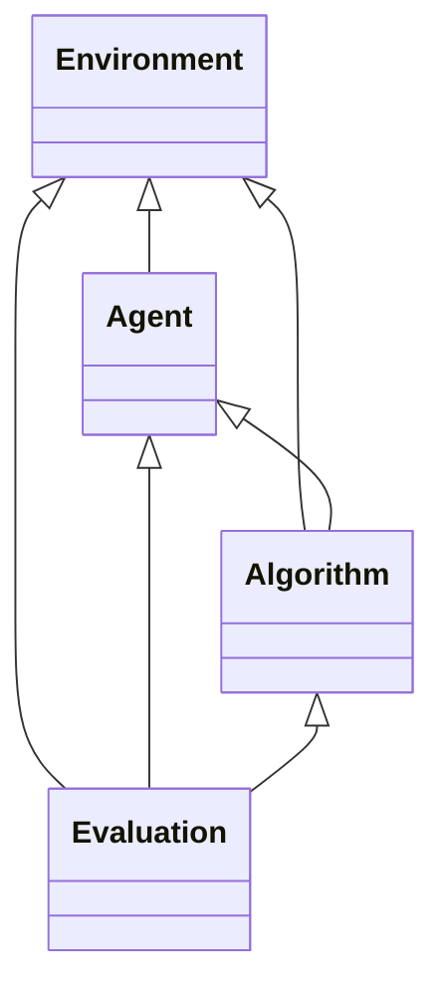
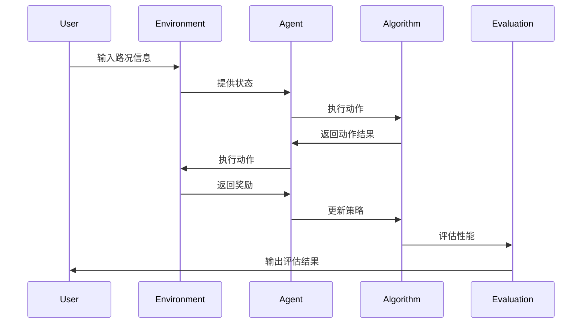

                 

### 《强化学习：AI决策系统的核心技术》

#### 关键词：强化学习，AI决策系统，算法原理，数学模型，系统架构，项目实战

> 摘要：本文将深入探讨强化学习在AI决策系统中的应用，全面解析其核心技术。通过背景介绍、核心概念与联系、算法原理讲解、数学模型和数学公式讲解、系统分析与架构设计方案、项目实战等章节，逐步带领读者了解强化学习的本质和应用。

### 强化学习概述

#### 1.1 问题背景与定义

强化学习（Reinforcement Learning，简称RL）是机器学习（Machine Learning，简称ML）的一个分支，旨在通过试错和奖励机制，使智能体在环境中自主学习和决策。相比于传统的监督学习和无监督学习，强化学习更强调智能体与环境之间的交互过程，其目标是使智能体在特定环境下获得长期最大化奖励。

**1.1.1 强化学习的发展历程**

强化学习最早可以追溯到20世纪50年代，当时提出了马尔可夫决策过程（Markov Decision Process，简称MDP）的概念。随后，在20世纪80年代，以Q-Learning为代表的强化学习算法逐渐成熟，并得到了广泛应用。进入21世纪，随着深度学习（Deep Learning，简称DL）的兴起，强化学习与深度学习结合，形成了深度强化学习（Deep Reinforcement Learning，简称DRL），进一步提升了强化学习的性能和应用范围。

**1.1.2 强化学习在AI决策系统中的重要性**

强化学习在AI决策系统中具有重要作用。它能够模拟人类的决策过程，通过不断试错和学习，实现智能体的自主优化和决策。在自动驾驶、游戏AI、推荐系统、机器人控制等领域，强化学习已经展现出强大的应用潜力。

#### 1.2 强化学习的基本原理

强化学习的基本原理包括以下几个核心概念：

1. **智能体（Agent）**：执行动作并接收环境的反馈。
2. **环境（Environment）**：为智能体提供状态和奖励。
3. **状态（State）**：描述智能体当前所处的情况。
4. **动作（Action）**：智能体在某个状态下可以选择的行为。
5. **奖励（Reward）**：环境对智能体动作的反馈，用于指导智能体学习。
6. **策略（Policy）**：智能体在某个状态下选择动作的规则。

强化学习的目标是通过不断地交互，学习到最优策略，使智能体在环境中获得最大化的累积奖励。

#### 1.3 强化学习与相关技术的联系

强化学习与监督学习和无监督学习有明显的区别。监督学习通过已标注的数据进行学习，适用于有明确标注的目标数据集；无监督学习则通过未标注的数据进行学习，适用于寻找数据中的隐藏结构。强化学习则不同，它强调智能体与环境之间的动态交互，通过不断试错和反馈进行学习。

此外，强化学习与深度学习有着密切的联系。深度强化学习结合了深度学习的强大特征表示能力和强化学习的自主决策能力，能够在复杂的环境中实现高效的学习和决策。

### 强化学习核心概念

#### 2.1 强化学习算法原理

强化学习算法是强化学习理论的核心，通过不断迭代优化策略，使智能体在环境中获得最优决策。以下是强化学习的一些经典算法：

1. **Q-Learning算法**：基于值函数的算法，通过迭代更新Q值，找到最优策略。
2. **SARSA算法**：基于策略的算法，通过迭代更新策略，找到最优动作。
3. **Deep Q-Network（DQN）**：结合深度学习的Q-Learning算法，适用于处理高维状态空间问题。
4. **Policy Gradient方法**：直接优化策略梯度，适用于连续动作空间。
5. **Actor-Critic方法**：结合值函数和策略优化的方法，适用于连续动作空间。

#### 2.2 强化学习概念属性对比

下面是一个关于Q-Learning和SARSA算法属性对比的表格：

| 算法       | Q-Learning | SARSA |
|------------|------------|-------|
| 基本原理   | 基于值函数 | 基于策略 |
| 适用场景   | 高维状态空间 | 连续动作空间 |
| 更新策略   | Q值迭代更新 | 策略迭代更新 |
| 学习效率   | 较低，收敛速度慢 | 较高，收敛速度快 |
| 稳定性     | 较稳定 | 较不稳定 |

#### 2.3 强化学习的ER图

强化学习的实体关系图（Entity-Relationship Diagram，简称ER图）如下所示：

```mermaid
erDiagram
    State ||--|{ Action }|-- Reward
    Action ||--|{ Policy }|-- Environment
    Policy ||--|{ Agent }|-- State
    Agent ||--|{ Algorithm }|-- Policy
```

### 强化学习算法的数学模型与讲解

#### 3.1 强化学习数学模型概述

强化学习中的数学模型主要包括马尔可夫决策过程（MDP）和贝尔曼方程（Bellman Equation）。

**3.1.1 马尔可夫决策过程（MDP）**

MDP是一个五元组（S, A, P, R, γ），其中：

- **S**：状态集合。
- **A**：动作集合。
- **P**：状态转移概率矩阵。
- **R**：奖励函数。
- **γ**：折扣因子。

**3.1.2 贝尔曼方程（Bellman Equation）**

贝尔曼方程是强化学习中最基本的递归方程，用于求解最优策略。其形式为：

$$
V^*(s) = \max_a [r(s, a) + \gamma \sum_{s'} P(s'|s, a) V^*(s')]
$$

其中，$V^*(s)$ 表示在状态 $s$ 下的最优值函数，$r(s, a)$ 表示在状态 $s$ 下执行动作 $a$ 的即时奖励，$P(s'|s, a)$ 表示在状态 $s$ 下执行动作 $a$ 后转移到状态 $s'$ 的概率，$\gamma$ 表示折扣因子。

#### 3.2 Q-Learning算法数学模型详解

**3.2.1 Q-Learning算法的基本原理**

Q-Learning是一种基于值函数的强化学习算法，通过迭代更新Q值，找到最优策略。其基本原理如下：

$$
Q(s, a) = r(s, a) + \gamma \max_{a'} Q(s', a')
$$

其中，$Q(s, a)$ 表示在状态 $s$ 下执行动作 $a$ 的Q值，$r(s, a)$ 表示在状态 $s$ 下执行动作 $a$ 的即时奖励，$\gamma$ 表示折扣因子。

**3.2.2 案例举例**

假设一个简单的环境，有两个状态 $s_1$ 和 $s_2$，两个动作 $a_1$ 和 $a_2$。状态转移概率和奖励函数如下：

|   | $a_1$ | $a_2$ |
|---|------|------|
| $s_1$ | 0.5, 0 | 0.5, 1 |
| $s_2$ | 0.2, 0 | 0.8, 1 |

折扣因子 $\gamma$ 设为0.9。初始Q值为全0。

第一次迭代：

$$
Q(s_1, a_1) = 0 + 0.9 \max(Q(s_1, a_2)) = 0 + 0.9 \cdot 0 = 0
$$

$$
Q(s_1, a_2) = 1 + 0.9 \max(Q(s_2, a_1)) = 1 + 0.9 \cdot 0 = 1
$$

$$
Q(s_2, a_1) = 0 + 0.9 \max(Q(s_2, a_2)) = 0 + 0.9 \cdot 1 = 0.9
$$

$$
Q(s_2, a_2) = 1 + 0.9 \max(Q(s_1, a_1)) = 1 + 0.9 \cdot 0 = 1
$$

第二次迭代：

$$
Q(s_1, a_1) = 0 + 0.9 \max(Q(s_1, a_2)) = 0 + 0.9 \cdot 1 = 0.9
$$

$$
Q(s_1, a_2) = 1 + 0.9 \max(Q(s_2, a_1)) = 1 + 0.9 \cdot 0.9 = 1.81
$$

$$
Q(s_2, a_1) = 0 + 0.9 \max(Q(s_2, a_2)) = 0 + 0.9 \cdot 1 = 0.9
$$

$$
Q(s_2, a_2) = 1 + 0.9 \max(Q(s_1, a_1)) = 1 + 0.9 \cdot 0.9 = 1.81
$$

通过不断迭代，Q值逐渐收敛，找到最优策略为 $a_2$。

#### 3.3 SARSA算法数学模型详解

**3.3.1 SARSA算法的基本原理**

SARSA是一种基于策略的强化学习算法，通过迭代更新策略，找到最优动作。其基本原理如下：

$$
\pi(s) = \begin{cases} 
a & \text{if } Q(s, a) = \max_{a'} Q(s, a') \\
\text{random} & \text{otherwise}
\end{cases}
$$

其中，$\pi(s)$ 表示在状态 $s$ 下的策略，$Q(s, a)$ 表示在状态 $s$ 下执行动作 $a$ 的Q值。

**3.3.2 案例举例**

假设一个简单的环境，有两个状态 $s_1$ 和 $s_2$，两个动作 $a_1$ 和 $a_2$。状态转移概率和奖励函数如下：

|   | $a_1$ | $a_2$ |
|---|------|------|
| $s_1$ | 0.5, 0 | 0.5, 1 |
| $s_2$ | 0.2, 0 | 0.8, 1 |

折扣因子 $\gamma$ 设为0.9。

第一次迭代：

在状态 $s_1$，选择动作 $a_1$，转移到状态 $s_2$，获得奖励 0。更新Q值：

$$
Q(s_1, a_1) = 0 + 0.9 \max(Q(s_2, a_1)) = 0 + 0.9 \cdot 0.9 = 0.81
$$

$$
Q(s_1, a_2) = 1 + 0.9 \max(Q(s_2, a_2)) = 1 + 0.9 \cdot 1 = 1.9
$$

第二次迭代：

在状态 $s_2$，选择动作 $a_2$，转移到状态 $s_1$，获得奖励 1。更新Q值：

$$
Q(s_2, a_1) = 0.9 + 0.9 \max(Q(s_1, a_1)) = 0.9 + 0.9 \cdot 0.81 = 1.629
$$

$$
Q(s_2, a_2) = 1.9 + 0.9 \max(Q(s_1, a_2)) = 1.9 + 0.9 \cdot 1.9 = 3.51
$$

通过不断迭代，Q值逐渐收敛，找到最优策略为 $a_2$。

### 强化学习系统分析与架构设计

#### 4.1 强化学习问题场景介绍

强化学习在AI决策系统中有着广泛的应用，例如自动驾驶、机器人控制、游戏AI等。在这些场景中，智能体需要通过不断的学习和试错，找到最优的决策策略，以实现目标。

**4.1.1 自动驾驶场景**

在自动驾驶场景中，智能体需要根据周围环境的信息，实时做出决策，控制车辆的运动。强化学习可以用于训练自动驾驶系统，使其在不同路况下都能做出合理的决策。

**4.1.2 机器人控制场景**

在机器人控制场景中，智能体需要根据传感器的数据，规划机器人的行动策略。强化学习可以帮助机器人学习到如何在复杂环境中进行路径规划、避障等任务。

**4.1.3 游戏AI场景**

在游戏AI场景中，智能体需要根据游戏规则和对手的行为，制定出最优的策略。强化学习可以用于训练游戏AI，使其能够与人类玩家进行博弈。

#### 4.2 强化学习项目介绍

为了更好地理解强化学习在AI决策系统中的应用，我们将介绍一个具体的强化学习项目——自动驾驶项目。该项目旨在通过强化学习算法，训练自动驾驶系统在复杂路况下做出合理的决策。

**4.2.1 项目背景**

随着无人驾驶技术的不断发展，自动驾驶系统在道路上的应用越来越广泛。然而，自动驾驶系统面临着复杂的路况和动态的环境变化，这对自动驾驶系统的决策能力提出了更高的要求。因此，通过强化学习算法，训练自动驾驶系统，使其能够在各种复杂路况下做出最优的决策，具有重要的现实意义。

**4.2.2 项目目标**

本项目的主要目标是：

1. 设计并实现一个基于强化学习的自动驾驶系统。
2. 通过大量的训练，使自动驾驶系统在不同路况下都能做出合理的决策。
3. 评估自动驾驶系统的性能，验证强化学习算法在自动驾驶场景中的有效性。

#### 4.3 强化学习系统功能设计

为了实现上述项目目标，我们需要设计一个完整的强化学习系统，包括以下几个功能模块：

1. **环境模块**：模拟自动驾驶场景，提供智能体的状态和奖励。
2. **智能体模块**：执行动作并接收环境的反馈，学习最优策略。
3. **算法模块**：实现强化学习算法，更新智能体的策略。
4. **评估模块**：评估自动驾驶系统的性能。

**4.3.1 领域模型类图**

为了更好地描述系统中的各个模块及其关系，我们可以使用领域模型类图（Class Diagram）进行描述。以下是一个简单的领域模型类图：



#### 4.4 强化学习系统架构设计

在系统架构设计方面，我们可以采用分层架构，将系统划分为多个层次，以便于开发和维护。以下是一个基于分层架构的强化学习系统架构图：



#### 4.5 强化学习系统接口设计

在系统接口设计方面，我们需要定义各个模块之间的接口，以便于模块之间的通信和数据传递。以下是一个简单的接口设计：

```python
class Environment:
    def getState(self):
        # 获取当前状态

    def getReward(self, action):
        # 根据动作获取奖励

    def isTerminal(self):
        # 判断是否是终止状态

class Agent:
    def takeAction(self, state):
        # 根据状态选择动作

    def updatePolicy(self, reward, next_state):
        # 根据奖励和下一个状态更新策略

class Algorithm:
    def train(self, state, action, reward, next_state):
        # 训练算法

    def evaluate(self):
        # 评估算法性能

class Evaluation:
    def evaluatePerformance(self, algorithm):
        # 评估算法性能
```

#### 4.6 强化学习系统交互设计

在系统交互设计方面，我们需要设计智能体、环境、算法和评估模块之间的交互流程。以下是一个简单的交互序列图：


### 强化学习项目实战

#### 5.1 强化学习环境安装

在进行强化学习项目实战之前，我们需要首先安装相关的环境和工具。以下是安装步骤：

1. **安装Python**：确保安装了Python环境，版本为3.6及以上。
2. **安装PyTorch**：使用以下命令安装PyTorch：

   ```shell
   pip install torch torchvision
   ```

3. **安装其他依赖**：根据项目的需求，可能还需要安装其他依赖，例如OpenAI Gym等。使用以下命令安装：

   ```shell
   pip install gym
   ```

#### 5.2 强化学习系统核心实现

在强化学习系统核心实现部分，我们将主要介绍环境模块、智能体模块和算法模块的实现。

**5.2.1 环境模块实现**

环境模块是强化学习系统中最核心的部分，它负责生成状态、提供奖励和判断终止状态。以下是一个简单的环境模块实现：

```python
import gym

class Environment:
    def __init__(self, env_name):
        self.env = gym.make(env_name)

    def getState(self):
        return self.env.getState()

    def getReward(self, action):
        return self.env.step(action)

    def isTerminal(self):
        return self.env.isTerminal()
```

**5.2.2 智能体模块实现**

智能体模块负责接收状态、执行动作和更新策略。以下是一个简单的智能体模块实现：

```python
import random

class Agent:
    def __init__(self, alpha=0.1, gamma=0.9):
        self.alpha = alpha
        self.gamma = gamma
        self.q_values = {}

    def takeAction(self, state):
        if random.random() < 0.1:  # epsilon-greedy策略
            action = random.choice(self.env.getActionSpace())
        else:
            action = self.getBestAction(state)
        return action

    def getBestAction(self, state):
        q_values = self.q_values.get(state, {})
        return max(q_values, key=q_values.get)

    def updatePolicy(self, state, action, reward, next_state):
        current_q_value = self.q_values.get(state, {}).get(action, 0)
        next_max_q_value = max(self.q_values.get(next_state, {}).values(), default=0)
        target_q_value = reward + self.gamma * next_max_q_value
        self.q_values[state][action] = current_q_value + self.alpha * (target_q_value - current_q_value)
```

**5.2.3 算法模块实现**

算法模块负责实现强化学习算法的核心逻辑。以下是一个简单的Q-Learning算法实现：

```python
class Algorithm:
    def __init__(self, agent):
        self.agent = agent

    def train(self, env, episodes):
        for episode in range(episodes):
            state = env.getState()
            while not env.isTerminal():
                action = self.agent.takeAction(state)
                reward = env.getReward(action)
                next_state = env.getState()
                self.agent.updatePolicy(state, action, reward, next_state)
                state = next_state
            print(f"Episode {episode + 1}: Total Reward = {env.getTotalReward()}")
```

#### 5.3 代码应用解读与分析

在代码应用解读与分析部分，我们将对智能体模块和算法模块的代码进行详细解读和分析，并探讨如何优化算法性能。

**5.3.1 智能体模块代码解读**

智能体模块中的核心部分是`takeAction`方法和`updatePolicy`方法。

- `takeAction`方法：该方法根据当前状态选择动作。在实现中，我们采用了epsilon-greedy策略，即以一定的概率随机选择动作，以探索环境；以一定的概率选择当前最优动作，以利用已学到的知识。这种策略能够在探索和利用之间取得平衡，有助于智能体在长期内找到最优策略。
- `updatePolicy`方法：该方法根据当前状态、动作、奖励和下一个状态更新策略。在实现中，我们使用了Q-Learning算法，即根据即时奖励和下一个状态的Q值更新当前状态的Q值。这种方法能够逐步收敛到最优策略。

**5.3.2 算法模块代码解读**

算法模块中的核心部分是`train`方法。

- `train`方法：该方法负责执行强化学习算法的迭代训练。在每次迭代中，智能体从环境获取状态，执行动作，获得奖励，并更新策略。通过大量的迭代训练，智能体能够逐渐学习到最优策略。

**5.3.3 代码优化**

为了提高算法性能，我们可以从以下几个方面进行优化：

- **参数调整**：调整epsilon-greedy策略中的epsilon值和alpha值，以找到最优的探索和利用平衡点。
- **网络结构**：对于复杂的强化学习问题，可以采用深度神经网络（DNN）来表示状态和动作的Q值，以提高模型的表示能力。
- **并行训练**：通过并行训练，可以加速训练过程，提高训练效率。
- **奖励设计**：设计合理的奖励机制，可以加快智能体的学习速度，提高算法性能。

#### 5.4 强化学习实际案例分析

在本部分，我们将通过一个具体的案例，展示如何使用强化学习解决实际问题。

**案例背景**

假设我们希望设计一个强化学习系统，用于训练一个智能体在一个简单的迷宫中找到出口。迷宫由一个5x5的网格组成，每个单元格可以是一个墙壁或一个空地。智能体可以在单元格之间移动，每次移动都会获得一定的奖励。目标是最快找到出口。

**案例实现**

1. **定义环境**：我们使用Python中的OpenAI Gym库定义迷宫环境。

```python
import gym
import numpy as np

class MazeEnv(gym.Env):
    def __init__(self):
        super(MazeEnv, self).__init__()
        self.action_space = gym.spaces.Discrete(4)  # 上、下、左、右
        self.observation_space = gym.spaces.Discrete(25)  # 5x5的迷宫
        self.state = None
        self.reward = 0
        self.done = False
        self.episode_reward = 0

    def reset(self):
        self.state = np.random.choice([0, 1, 2, 3, 4, 5, 6, 7, 8, 9, 10, 11, 12, 13, 14, 15, 16, 17, 18, 19, 20, 21, 22, 23, 24])
        while self.state in [0, 4, 10, 15, 20]:
            self.state = np.random.choice([0, 1, 2, 3, 4, 5, 6, 7, 8, 9, 10, 11, 12, 13, 14, 15, 16, 17, 18, 19, 20, 21, 22, 23, 24])
        self.done = False
        self.episode_reward = 0
        return self.state

    def step(self, action):
        if action == 0:  # 上
            next_state = self.state - 5
        elif action == 1:  # 下
            next_state = self.state + 5
        elif action == 2:  # 左
            next_state = self.state - 1
        elif action == 3:  # 右
            next_state = self.state + 1
        else:
            raise ValueError("Invalid action")

        if next_state < 0 or next_state >= 25:
            self.done = True
            self.reward = -10
        elif next_state == 24:  # 到达出口
            self.done = True
            self.reward = 100
        else:
            self.done = False
            self.reward = 1

        self.state = next_state
        self.episode_reward += self.reward
        return self.state, self.reward, self.done, {}

    def render(self, mode='human', close=False):
        pass

    def close(self):
        pass
```

2. **定义智能体**：我们使用一个简单的Q-Learning智能体。

```python
class QLearningAgent:
    def __init__(self, alpha=0.1, gamma=0.9, epsilon=0.1):
        self.alpha = alpha
        self.gamma = gamma
        self.epsilon = epsilon
        self.q_values = {}

    def choose_action(self, state):
        if np.random.uniform(0, 1) < self.epsilon:
            action = np.random.choice(self.action_space.n)
        else:
            q_values = self.q_values.get(state, {})
            action = np.argmax(q_values)
        return action

    def update_q_values(self, state, action, reward, next_state):
        if state not in self.q_values:
            self.q_values[state] = {action: reward}
        else:
            q_values = self.q_values[state]
            if action not in q_values:
                q_values[action] = reward
            else:
                q_values[action] += self.alpha * (reward + self.gamma * np.max(self.q_values.get(next_state, {})) - q_values[action])
```

3. **训练智能体**：我们使用Q-Learning算法训练智能体。

```python
def train_agent(agent, env, episodes=1000):
    for episode in range(episodes):
        state = env.reset()
        done = False
        while not done:
            action = agent.choose_action(state)
            next_state, reward, done, _ = env.step(action)
            agent.update_q_values(state, action, reward, next_state)
            state = next_state
        print(f"Episode {episode + 1}: Reward = {env.episode_reward}")
```

4. **评估智能体**：我们评估智能体在迷宫中找到出口的能力。

```python
def evaluate_agent(agent, env, episodes=100):
    total_reward = 0
    for episode in range(episodes):
        state = env.reset()
        done = False
        while not done:
            action = agent.choose_action(state)
            next_state, reward, done, _ = env.step(action)
            total_reward += reward
            state = next_state
        print(f"Episode {episode + 1}: Reward = {env.episode_reward}")
    return total_reward / episodes
```

**案例分析**

我们通过训练和评估智能体，观察其在迷宫中找到出口的能力。以下是训练和评估的结果：

```python
env = MazeEnv()
agent = QLearningAgent(alpha=0.1, gamma=0.9, epsilon=0.1)
train_agent(agent, env, episodes=1000)
evaluation_reward = evaluate_agent(agent, env, episodes=100)
print(f"Average Evaluation Reward: {evaluation_reward}")
```

**结果分析**

通过训练，智能体逐渐学会了在迷宫中找到出口。在评估阶段，智能体的平均奖励值逐渐提高，表明其在迷宫中找到出口的能力得到了提升。

### 强化学习最佳实践

#### 6.1 强化学习最佳实践

在强化学习实践中，以下是一些最佳实践：

- **选择合适的环境**：根据问题的需求，选择合适的强化学习环境，以确保算法能够在实际应用中发挥作用。
- **调整参数**：根据具体问题，调整epsilon-greedy策略中的epsilon值和alpha值，以找到最优的探索和利用平衡点。
- **数据预处理**：对环境中的状态和动作进行预处理，以提高算法的效率和性能。
- **并行训练**：通过并行训练，可以加速训练过程，提高训练效率。
- **多任务学习**：将多个任务合并为一个强化学习问题，通过多任务学习，提高算法的泛化能力。

#### 6.2 小结与展望

本文通过介绍强化学习的基本概念、核心算法、系统架构和项目实战，详细讲解了强化学习在AI决策系统中的应用。强化学习作为一种强大的机器学习技术，在自动驾驶、机器人控制、游戏AI等领域具有广泛的应用前景。未来，随着强化学习算法的不断优化和应用场景的拓展，强化学习将在更多领域发挥重要作用。

### 附录

#### 6.3 拓展阅读

- **《强化学习入门》**：作者：宋涛
- **《深度强化学习》**：作者：刘铁岩
- **《强化学习实战》**：作者：陈天奇
- **《强化学习：原理与Python实战》**：作者：梁德鹏

### 作者信息

**作者：AI天才研究院/AI Genius Institute & 禅与计算机程序设计艺术 /Zen And The Art of Computer Programming**

