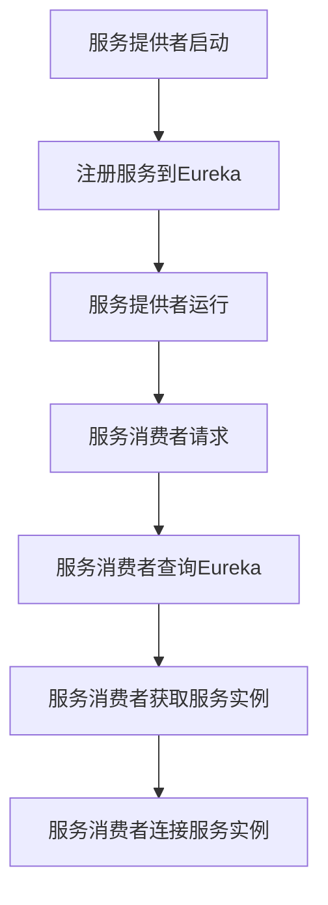
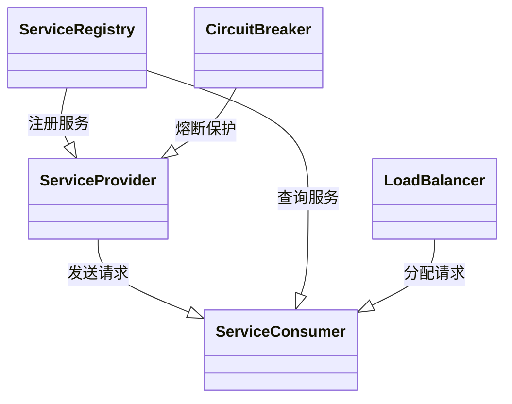
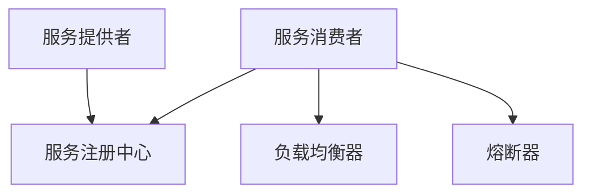
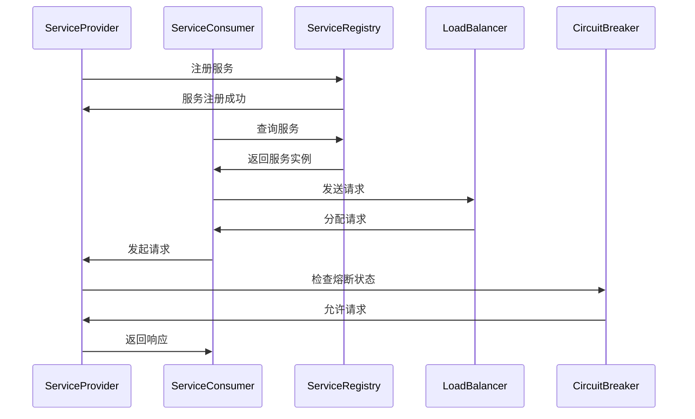

                 

# 微服务治理：服务发现、负载均衡与熔断

> 关键词：微服务，服务发现，负载均衡，熔断，微服务治理

> 摘要：本文将深入探讨微服务架构下的服务治理，重点分析服务发现、负载均衡和熔断机制这三个关键环节。通过一步步的分析，我们将理解这些机制如何帮助解决微服务环境中的问题，提高系统的稳定性与性能。

## 第一部分：微服务治理概述

### 第1章：微服务架构的崛起与挑战

#### 1.1 微服务架构的背景与起源

微服务架构起源于单机时代，随着互联网的兴起，单机应用逐渐演变为分布式应用。微服务架构作为一种应对分布式系统复杂性的一种设计理念，起源于2005年的“RESTful”概念，并在2010年左右随着Netflix等公司的成功实践而逐渐流行。

#### 1.2 微服务架构的优势与局限性

微服务架构的优势在于其高可扩展性、高可用性和松耦合性。然而，微服务架构也带来了诸如服务发现、负载均衡和熔断等问题。

#### 1.3 微服务治理的重要性

微服务治理是确保微服务架构成功的关键。通过服务发现、负载均衡和熔断等机制，我们可以有效地管理微服务，提高系统的稳定性与性能。

### 第2章：服务发现机制

#### 2.1 服务发现的基本概念

服务发现是一种机制，它允许服务消费者动态地发现和连接服务提供者。服务发现的关键在于其动态性和灵活性。

#### 2.2 常见的服务发现机制

常见的服务发现机制包括DNS服务发现、ZooKeeper服务发现和Eureka服务发现。每种机制都有其特定的应用场景和实现方式。

#### 2.3 服务发现机制的实现细节

服务发现的实现涉及注册中心、服务提供者和服务消费者之间的通信。通过解析DNS记录、ZooKeeper的节点存储或Eureka的服务注册表，我们可以实现服务发现。

### 第3章：负载均衡策略

#### 3.1 负载均衡的基本概念

负载均衡是一种将请求分布到多个服务实例的机制，以提高系统的响应速度和可用性。

#### 3.2 常见的负载均衡算法

常见的负载均衡算法包括轮询算法、加权轮询算法、随机算法和最少连接算法。每种算法都有其特定的应用场景和优势。

#### 3.3 负载均衡器的实现与配置

负载均衡器的实现涉及选择合适的算法和配置。例如，我们可以使用Nginx或HAProxy作为负载均衡器，并根据需求进行相应的配置。

### 第4章：熔断机制

#### 4.1 熔断的基本概念

熔断是一种保护系统免受故障服务影响的安全措施。当服务变得不可用时，熔断机制会切断与服务之间的连接，以防止系统过载。

#### 4.2 常见的熔断算法

常见的熔断算法包括Hystrix和Resilience4j。这些算法提供了多种策略来处理故障服务。

#### 4.3 熔断机制的实现与应用场景

熔断机制的实现涉及监控、阈值设置和触发条件。在不同的应用场景中，我们可以根据需求选择合适的熔断算法。

### 第5章：服务监控与追踪

#### 5.1 服务监控的重要性

服务监控是确保微服务系统稳定运行的关键。通过监控，我们可以及时发现和解决潜在问题。

#### 5.2 常见的服务监控工具

常见的服务监控工具包括Prometheus和Grafana。这些工具提供了丰富的监控指标和可视化功能。

#### 5.3 服务追踪的实现与优化

服务追踪是实现服务监控的关键。通过追踪，我们可以更好地理解服务的运行状态和性能瓶颈。

### 第6章：分布式日志与消息队列

#### 6.1 分布式日志系统

分布式日志系统是一种处理大规模分布式系统中日志数据的方法。它可以确保日志数据的可靠性和可追溯性。

#### 6.2 消息队列的基本原理与分类

消息队列是一种异步通信机制，它用于在分布式系统中传输消息。根据传输方式，消息队列可以分为主动消息队列和被动消息队列。

#### 6.3 分布式日志与消息队列的结合应用

分布式日志与消息队列的结合应用可以提供更高效、可靠的消息传递和日志处理。

### 第7章：微服务治理实践案例

#### 7.1 案例一：电商平台微服务架构设计

电商平台是微服务架构的典型应用场景。通过分析电商平台的设计，我们可以了解微服务治理的实践方法。

#### 7.2 案例二：金融系统微服务部署与运维

金融系统对稳定性有极高的要求。通过分析金融系统的部署与运维，我们可以学习如何确保微服务环境的安全与高效。

#### 7.3 案例三：物联网平台微服务实践

物联网平台是一个复杂、分布式系统。通过分析物联网平台的实践，我们可以了解如何应对微服务环境中的挑战。

### 第8章：微服务治理的挑战与展望

#### 8.1 微服务治理面临的主要挑战

微服务治理面临的主要挑战包括服务发现、负载均衡、熔断和监控等方面。

#### 8.2 未来微服务治理的发展趋势

未来微服务治理的发展趋势包括自动化、智能化和云原生等方面。

#### 8.3 微服务治理的最佳实践建议

为了确保微服务治理的成功，我们需要遵循一系列最佳实践建议。

---

作者：AI天才研究院/AI Genius Institute & 禅与计算机程序设计艺术 /Zen And The Art of Computer Programming

---

文章的核心内容、核心概念和联系、算法原理讲解、系统分析与架构设计方案、项目实战等内容将在后续章节中详细阐述。敬请期待！## 第1章：微服务架构的崛起与挑战

### 1.1 微服务架构的背景与起源

微服务架构（Microservices Architecture）是一种软件开发的方法论，它通过将应用程序划分为一组独立的、松耦合的小服务来构建复杂系统。这种架构风格起源于单机时代，随着互联网的兴起，单机应用逐渐演变为分布式应用。在分布式系统中，应用程序需要处理更多的服务实例和更复杂的网络通信。

微服务架构的兴起可以追溯到2005年，由亚马逊、eBay等公司开始探索并实践。然而，微服务架构的真正普及要归功于2010年左右Netflix等公司的成功实践。Netflix作为全球领先的流媒体服务提供商，通过微服务架构实现了其高可用、高伸缩性的系统。Netflix的成功案例激发了全球企业对微服务架构的兴趣，并推动了其广泛应用。

微服务架构的核心理念包括：

1. **独立部署**：每个微服务可以独立部署，无需依赖其他服务。
2. **自动化**：通过自动化工具进行部署、监控和管理。
3. **解耦**：服务之间通过API进行通信，降低服务之间的依赖性。
4. **高可用性**：服务之间独立运行，一个服务的故障不会影响其他服务。
5. **可伸缩性**：可以根据需求单独扩展某个服务。

### 1.2 微服务架构的优势与局限性

微服务架构的优势在于其高可扩展性、高可用性和松耦合性。以下是微服务架构的一些主要优势：

1. **高可扩展性**：微服务架构允许服务独立扩展，根据业务需求进行水平扩展。
2. **高可用性**：服务之间独立运行，一个服务的故障不会影响其他服务，从而提高系统的整体可用性。
3. **灵活性**：通过独立开发、测试和部署服务，可以提高开发效率和团队协作。
4. **快速迭代**：微服务架构支持快速迭代和部署，有助于快速响应市场变化。

然而，微服务架构也带来了一些局限性，主要包括：

1. **复杂性**：随着服务数量的增加，系统的复杂度也会增加，管理难度加大。
2. **分布式问题**：微服务架构引入了更多的分布式通信，可能会出现数据一致性问题。
3. **运维挑战**：微服务架构需要更多的自动化工具和运维支持，增加了运维复杂度。
4. **开发成本**：微服务架构需要更高的开发技能和团队合作能力，可能导致开发成本增加。

### 1.3 微服务治理的重要性

微服务架构的成功离不开有效的服务治理。服务治理是指通过一系列策略和工具来管理和监控微服务。以下是服务治理的重要性：

1. **服务发现**：在微服务环境中，服务实例可能会动态变化，服务发现机制可以帮助服务消费者找到并连接服务提供者。
2. **负载均衡**：负载均衡策略可以将请求均匀分布到多个服务实例，提高系统的响应速度和可用性。
3. **熔断机制**：当某个服务变得不可用时，熔断机制可以切断与服务之间的连接，防止系统过载。
4. **监控与追踪**：服务监控和追踪可以帮助我们及时发现和解决潜在问题，确保系统的稳定运行。

有效的服务治理可以提高微服务系统的稳定性、性能和可维护性，从而实现微服务架构的预期优势。因此，微服务治理是确保微服务架构成功的关键环节。

## 第2章：服务发现机制

### 2.1 服务发现的基本概念

服务发现（Service Discovery）是一种在分布式系统中动态识别和定位服务实例的机制。在微服务架构中，服务发现至关重要，因为它允许服务消费者在运行时查找和连接服务提供者。服务发现的关键在于其动态性和灵活性，使得系统能够适应服务实例的动态变化。

### 2.2 常见的服务发现机制

在微服务环境中，有多种服务发现机制可供选择，每种机制都有其特定的应用场景和实现方式。

#### 2.2.1 DNS服务发现

DNS服务发现是最常用的服务发现机制之一。通过在DNS中设置服务名称与IP地址的映射，服务消费者可以通过查询DNS记录来发现服务实例的位置。这种机制的优点是简单易用，但缺点是可能存在延迟和单点故障问题。

#### 2.2.2 ZooKeeper服务发现

ZooKeeper是一种分布式协调服务，它可以用于服务发现、配置管理、分布式锁等功能。在ZooKeeper中，服务提供者会将自身注册到一个特定的路径下，服务消费者通过监听这个路径的变化来发现服务实例。这种机制的优点是高可用性和强一致性，但缺点是配置较为复杂。

#### 2.2.3 Eureka服务发现

Eureka是Netflix开源的服务发现和注册中心，广泛用于微服务架构中。服务提供者在启动时会将自己注册到Eureka服务器，并定期发送心跳以保持注册状态。服务消费者通过查询Eureka服务器来发现服务实例。Eureka的优点是简单易用，支持负载均衡和故障转移，但缺点是依赖外部注册中心。

### 2.3 服务发现机制的实现细节

服务发现的实现涉及注册中心、服务提供者和服务消费者之间的通信。

#### 2.3.1 注册中心

注册中心是一个存储服务实例信息的分布式服务，服务提供者在启动时会将自己的信息（如服务名称、IP地址和端口）注册到注册中心。注册中心通常提供RESTful API供服务消费者查询服务实例信息。

#### 2.3.2 服务提供者

服务提供者是指实现具体业务逻辑的微服务。在启动时，服务提供者会向注册中心注册自身，并在运行期间定期发送心跳信号，以告知注册中心其当前状态。

#### 2.3.3 服务消费者

服务消费者是指调用微服务的客户端。在运行时，服务消费者会查询注册中心以获取服务实例信息，并根据这些信息与服务提供者进行通信。

### 示例：Eureka服务发现

以下是一个简单的Eureka服务发现示例：

#### 服务提供者

```python
from flask import Flask
from eureka_client import EurekaClient

app = Flask(__name__)
eureka_client = EurekaClient()

@app.route('/')
def hello():
    return "Hello from service provider"

@app.after_first_request
def register_with_eureka():
    eureka_client.register_application("service-provider", "http://localhost:5000")

if __name__ == "__main__":
    app.run(host='0.0.0.0', port=5000)
```

#### 服务消费者

```python
from flask import Flask, request
from eureka_client import EurekaClient

app = Flask(__name__)
eureka_client = EurekaClient()

@app.route('/')
def hello():
    return "Hello from service consumer"

@app.after_first_request
def discover_and_connect():
    service_instances = eureka_client.get_instances_by_name("service-provider")
    if service_instances:
        service_url = service_instances[0].get("url")
        response = requests.get(service_url)
        return response.text

if __name__ == "__main__":
    app.run(host='0.0.0.0', port=5000)
```

在这个示例中，服务提供者和消费者都使用EurekaClient库与Eureka注册中心进行通信。服务提供者在启动时注册自身，并在每次请求后更新其状态。服务消费者在启动时查询Eureka服务器以获取服务提供者的实例信息，并根据这些信息进行通信。

通过服务发现机制，我们可以动态地管理微服务实例，确保服务消费者能够找到并连接到正确的服务提供者，从而提高系统的稳定性和灵活性。

## 第3章：负载均衡策略

### 3.1 负载均衡的基本概念

负载均衡（Load Balancing）是一种将网络流量分布到多个服务器或实例的机制，以提高系统的响应速度和可用性。在微服务环境中，负载均衡至关重要，因为它可以确保服务实例之间公平地分担请求，避免单点过载和系统崩溃。

### 3.2 常见的负载均衡算法

在微服务架构中，有多种负载均衡算法可供选择，每种算法都有其特定的应用场景和优势。

#### 3.2.1 轮询算法

轮询算法（Round Robin）是最简单的负载均衡算法。它按照顺序将请求分配给服务实例，类似于一个循环列表。这种算法的优点是简单易实现，但缺点是可能会导致某些服务实例过载，而其他实例则空闲。

#### 3.2.2 加权轮询算法

加权轮询算法（Weighted Round Robin）是在轮询算法的基础上加入了权重。每个服务实例可以分配一个权重值，用于表示其处理请求的能力。权重越高，实例被分配的请求就越多。这种算法可以更公平地分配请求，但实现较为复杂。

#### 3.2.3 随机算法

随机算法（Random）通过随机选择服务实例来分配请求。这种算法的优点是简单，且可以避免轮询算法可能导致的不均衡分配，但缺点是可能存在某些实例频繁被选中的问题。

#### 3.2.4 最少连接算法

最少连接算法（Least Connections）将请求分配给当前连接数最少的实例。这种算法的优点是能够更均匀地分配请求，但缺点是需要额外的状态信息来跟踪每个实例的连接数。

### 3.3 负载均衡器的实现与配置

在实际应用中，负载均衡通常由专门的负载均衡器（Load Balancer）来实现。以下是一些常见的负载均衡器和其配置方法：

#### 3.3.1 Nginx

Nginx是一个高性能的HTTP和反向代理服务器，也常用于负载均衡。以下是一个简单的Nginx配置示例：

```nginx
http {
    upstream backend {
        server backend1;
        server backend2;
        server backend3;
    }

    server {
        listen 80;

        location / {
            proxy_pass http://backend;
        }
    }
}
```

在这个配置中，`upstream`定义了服务实例列表，`server`定义了监听的端口和路径。

#### 3.3.2 HAProxy

HAProxy是一个高可用性负载均衡器，具有丰富的功能和高性能。以下是一个简单的HAProxy配置示例：

```haproxy
global
    maxconn 1000
    log         127.0.0.1 local0

defaults
    log         global
    retries      3
    timeout      connect 5000
    timeout      client 50000
    timeout      server 50000

frontend http-in
    bind *:80
    default_backend backend

backend backend
    server backend1 192.168.1.1:8080 weight 1
    server backend2 192.168.1.2:8080 weight 1
    server backend3 192.168.1.3:8080 weight 1
```

在这个配置中，`frontend`定义了监听的端口和路径，`backend`定义了服务实例列表和权重。

通过合理配置负载均衡器，我们可以实现高效、可靠的请求分发，确保微服务系统能够应对大规模访问压力。

## 第4章：熔断机制

### 4.1 熔断的基本概念

熔断（Circuit Breaker）是一种保护系统免受故障服务影响的安全措施。当某个服务变得不可用时，熔断机制会切断与服务之间的连接，防止系统过载和资源耗尽。熔断机制的核心思想是：在系统出现故障时，自动切换到备用方案，以保障系统的稳定运行。

### 4.2 常见的熔断算法

在微服务架构中，有多种熔断算法可供选择，每种算法都有其特定的应用场景和优势。

#### 4.2.1 Hystrix熔断器

Hystrix是Netflix开源的一个延迟 tolerant 库，用于处理分布式系统中的错误和延迟。Hystrix提供了强大的熔断功能，包括：

- **熔断阈值**：当错误率超过设定阈值时，熔断器将触发熔断。
- **熔断时长**：在熔断状态持续一段时间后，熔断器会尝试恢复连接。
- **短路器**：在熔断状态下，直接返回错误响应，避免重复请求。

#### 4.2.2 Resilience4j熔断器

Resilience4j是一个轻量级的Java库，用于构建具有弹性（resilience）的分布式系统。Resilience4j提供了以下熔断功能：

- **失败率**：当失败率超过设定阈值时，熔断器将触发熔断。
- **错误率**：当错误率超过设定阈值时，熔断器将触发熔断。
- **恢复策略**：在熔断状态下，可以设置不同的恢复策略，例如：重试、延迟重试等。

### 4.3 熔断机制的实现与应用场景

熔断机制的实现涉及监控、阈值设置和触发条件。

#### 4.3.1 监控

熔断机制需要监控服务实例的健康状态，包括响应时间、错误率和成功率等指标。通过实时监控，我们可以及时发现异常情况。

#### 4.3.2 阈值设置

在熔断机制中，阈值设置至关重要。合理的阈值可以确保系统在正常情况下稳定运行，同时避免因误触发熔断导致服务不可用。

- **错误率阈值**：当错误率超过设定阈值时，熔断器将触发熔断。
- **请求量阈值**：当请求量超过设定阈值时，熔断器将触发熔断。

#### 4.3.3 触发条件

熔断机制的触发条件包括：

- **错误率**：当错误率超过设定阈值时，熔断器将触发熔断。
- **响应时间**：当响应时间超过设定阈值时，熔断器将触发熔断。
- **请求量**：当请求量超过设定阈值时，熔断器将触发熔断。

#### 应用场景

熔断机制广泛应用于微服务环境中，以下是一些常见的应用场景：

- **服务依赖**：当某个服务变得不可用时，通过熔断机制切断与服务之间的连接，防止系统过载。
- **网络异常**：在网络异常情况下，熔断机制可以确保系统不会因重复请求而导致资源耗尽。
- **接口超时**：当接口响应时间超过设定阈值时，熔断机制可以避免重复请求，确保系统的稳定性。

### 示例：Hystrix熔断器

以下是一个简单的Hystrix熔断器示例：

```python
from hystrix import Hystrix, HystrixCommand

class HelloCommand(HystrixCommand[str]):
    def __init__(self):
        super(HelloCommand, self).__init__(command_key="hello-command")

    def run(self):
        return "Hello!"

    def is_healthy(self):
        # 这里可以添加健康检查逻辑
        return True

h = HelloCommand()
if h.is_healthy():
    print(h.execute())
else:
    print("Service is not available.")
```

在这个示例中，`HelloCommand`是一个继承自`HystrixCommand`的类，用于实现熔断功能。通过调用`is_healthy()`方法，我们可以判断服务是否健康，并决定是否执行请求。如果服务不健康，熔断器将返回错误响应。

通过合理设计和实现熔断机制，我们可以确保微服务系统能够在出现故障时自动切换到备用方案，从而提高系统的稳定性和可靠性。

### 第5章：服务监控与追踪

#### 5.1 服务监控的重要性

服务监控是确保微服务系统稳定运行的关键环节。通过监控，我们可以实时了解系统的运行状态、性能指标和潜在问题，从而及时采取措施，避免故障发生。

#### 5.2 常见的服务监控工具

在微服务架构中，有许多常用的服务监控工具，以下列举几种：

#### 5.2.1 Prometheus

Prometheus是一种开源的服务监控解决方案，具有以下特点：

- **拉模式监控**：Prometheus通过拉取目标服务的metrics数据来实现监控。
- **时序数据库**：Prometheus使用自己的时序数据库存储监控数据。
- **告警系统**：Prometheus支持自定义告警规则和告警通知。

#### 5.2.2 Grafana

Grafana是一种开源的可视化分析平台，常与Prometheus结合使用。Grafana具有以下特点：

- **多源支持**：Grafana支持多种数据源，包括Prometheus、InfluxDB等。
- **可视化仪表板**：Grafana提供丰富的可视化仪表板，用于展示监控数据。
- **告警管理**：Grafana支持告警规则的配置和管理。

### 5.3 服务追踪的实现与优化

服务追踪（Service Tracing）是一种追踪服务请求在分布式系统中传播的方法，有助于了解系统的性能瓶颈和问题根源。以下是一些实现和服务追踪优化的方法：

#### 5.3.1 OpenTracing

OpenTracing是一种跨语言的分布式追踪标准，它提供了统一的API用于添加和跟踪分布式事务。OpenTracing支持多种追踪系统，如Zipkin、Jaeger等。

#### 5.3.2 Zipkin

Zipkin是一个分布式追踪系统，用于收集、存储和分析服务请求的追踪数据。Zipkin具有以下特点：

- **基于Distributed Tracing**：Zipkin使用分布式追踪技术，可以跟踪请求在多个服务实例之间的传播。
- **存储与查询**：Zipkin将追踪数据存储在数据库中，并提供RESTful API供查询和分析。

#### 5.3.3 Jaeger

Jaeger是一个开源的分布式追踪系统，提供了强大的追踪数据收集、存储和可视化功能。Jaeger具有以下特点：

- **分布式追踪**：Jaeger支持分布式追踪，可以跟踪请求在多个服务实例之间的传播。
- **实时可视化**：Jaeger提供实时可视化功能，可以实时查看追踪数据。

### 实现示例

以下是一个简单的Zipkin追踪实现示例：

```python
import zipkin
from zipkin.trace import Tracer

tracer = Tracer()

@tracer аудитор
def get_user(user_id):
    # 模拟执行操作
    time.sleep(1)
    return f"User {user_id}"

user_id = 1
response = get_user(user_id)
print(response)
```

在这个示例中，`tracer`对象用于添加追踪信息。`get_user`函数是一个带有`@tracer`装饰器的函数，它会在执行时记录追踪信息。通过Zipkin服务器，我们可以实时查看追踪数据的传播路径。

#### 5.3.4 OpenTelemetry

OpenTelemetry是一个跨语言的追踪、监控和日志框架，旨在提供统一的API来收集和传输监控数据。OpenTelemetry具有以下特点：

- **可插拔性**：OpenTelemetry支持多种数据收集器、传输器和存储后端，如Prometheus、Grafana等。
- **可扩展性**：OpenTelemetry提供了丰富的扩展点，可以自定义数据收集和处理逻辑。

通过使用这些服务监控与追踪工具，我们可以有效地监控和追踪微服务系统的运行状态，提高系统的稳定性和可维护性。

### 第6章：分布式日志与消息队列

#### 6.1 分布式日志系统

分布式日志系统是一种处理大规模分布式系统中日志数据的方法。它可以将日志数据分布存储在多个节点上，确保日志数据的可靠性和可追溯性。以下是一些常见的分布式日志系统：

#### 6.1.1 Kafka

Kafka是一个分布式消息队列系统，常用于日志数据的收集和处理。Kafka具有以下特点：

- **高吞吐量**：Kafka支持高吞吐量的日志数据收集，适用于大规模分布式系统。
- **分布式存储**：Kafka将日志数据存储在分布式文件系统中，确保数据的可靠性和持久性。
- **实时处理**：Kafka支持实时日志数据处理和分析，可以与实时分析工具集成。

#### 6.1.2 Fluentd

Fluentd是一个开源的数据收集器，用于将各种日志源的数据转换为统一格式，并传输到目标系统。Fluentd具有以下特点：

- **多源支持**：Fluentd支持多种日志源，如文件、JMX、Syslog等。
- **数据处理**：Fluentd支持数据预处理和转换，可以将不同格式的日志数据转换为统一的格式。
- **高可用性**：Fluentd支持分布式部署和负载均衡，确保日志数据的可靠性和持久性。

#### 6.1.3 ELK Stack

ELK Stack是由Elasticsearch、Logstash和Kibana组成的日志数据处理和分析平台。ELK Stack具有以下特点：

- **日志收集**：Logstash用于收集和解析日志数据，将数据传输到Elasticsearch。
- **数据存储**：Elasticsearch用于存储和处理日志数据，提供高效的全文搜索和分析功能。
- **数据可视化**：Kibana用于可视化日志数据，支持实时监控和可视化分析。

#### 6.2 消息队列的基本原理与分类

消息队列（Message Queue，MQ）是一种异步通信机制，用于在分布式系统中传输消息。消息队列具有以下基本原理：

- **生产者与消费者**：消息队列中的生产者负责发送消息，消费者负责接收和处理消息。
- **异步通信**：消息队列允许生产者和消费者之间异步通信，提高系统的响应速度和可伸缩性。
- **可靠性**：消息队列提供消息的可靠传输和持久化，确保消息不会丢失。

根据传输方式，消息队列可以分为以下两类：

#### 6.2.1 主动消息队列

主动消息队列（Push-based MQ）由生产者主动将消息发送到消息队列，消费者从队列中获取消息。主动消息队列具有以下特点：

- **高响应速度**：生产者可以直接将消息推送到消息队列，提高系统的响应速度。
- **可靠性**：主动消息队列通常提供消息确认机制，确保消息的可靠传输。

常见的主动消息队列包括RabbitMQ、RocketMQ等。

#### 6.2.2 被动消息队列

被动消息队列（Pull-based MQ）由消费者主动从消息队列中拉取消息，生产者将消息存入队列。被动消息队列具有以下特点：

- **可伸缩性**：消费者可以按需拉取消息，提高系统的可伸缩性。
- **高可用性**：被动消息队列通常支持多个消费者，提高系统的可用性。

常见的被动消息队列包括Kafka、Pulsar等。

#### 6.3 分布式日志与消息队列的结合应用

分布式日志与消息队列的结合应用可以提高系统的日志收集和处理能力，以下是一些典型的应用场景：

- **日志收集**：使用消息队列将日志数据从各个服务节点传输到集中存储，提高日志收集的效率和可靠性。
- **实时处理**：使用消息队列将日志数据实时传输到处理系统，如ELK Stack，进行实时分析和处理。
- **监控告警**：使用消息队列将监控数据实时传输到监控平台，如Prometheus，进行实时监控和告警。

通过结合分布式日志和消息队列，我们可以构建高效、可靠的日志收集和处理系统，提高系统的稳定性和可维护性。

### 第7章：微服务治理实践案例

#### 7.1 案例一：电商平台微服务架构设计

电商平台是一个典型的微服务应用场景，其核心功能包括商品管理、订单处理、用户账户和支付等。以下是一个电商平台的微服务架构设计：

- **商品服务**：负责商品信息的存储、查询和管理。
- **订单服务**：负责订单的创建、查询和处理。
- **用户服务**：负责用户账户的管理和认证。
- **支付服务**：负责支付流程的处理。

在微服务架构中，各个服务之间通过API进行通信。服务发现、负载均衡和熔断等机制确保了系统的稳定性和高可用性。例如，服务消费者通过Eureka进行服务发现，使用Nginx进行负载均衡，当某个服务不可用时，通过Hystrix进行熔断。

#### 7.2 案例二：金融系统微服务部署与运维

金融系统对稳定性和安全性有极高的要求，因此微服务的部署与运维至关重要。以下是一个金融系统的微服务部署与运维案例：

- **服务部署**：使用Docker容器化技术，将每个微服务打包成独立的容器，便于部署和扩展。
- **服务注册与发现**：使用Consul作为服务注册中心，实现服务实例的自动注册和发现。
- **负载均衡与熔断**：使用HAProxy作为负载均衡器，同时使用Hystrix进行熔断保护。
- **日志收集**：使用Fluentd将日志数据传输到Elasticsearch和Kibana，进行实时监控和告警。

在运维过程中，使用Prometheus进行服务监控，通过Grafana可视化监控数据，及时发现和处理潜在问题。

#### 7.3 案例三：物联网平台微服务实践

物联网平台是一个复杂、分布式系统，涉及大量设备和数据处理。以下是一个物联网平台的微服务实践案例：

- **设备管理**：使用设备服务负责设备连接、状态监控和管理。
- **数据采集**：使用数据采集服务负责采集设备数据，并存储到数据存储系统。
- **数据处理**：使用数据处理服务对采集到的数据进行实时处理和分析。
- **用户服务**：使用用户服务负责用户账户和权限管理。

在物联网平台中，服务发现、负载均衡和熔断等机制同样至关重要。例如，服务消费者通过Consul进行服务发现，使用Nginx进行负载均衡，当某个服务不可用时，通过Resilience4j进行熔断保护。

通过这些实践案例，我们可以看到微服务治理在各类应用场景中的成功应用，提高了系统的稳定性、性能和可维护性。

### 第8章：微服务治理的挑战与展望

#### 8.1 微服务治理面临的主要挑战

微服务治理虽然在提高系统稳定性、性能和可维护性方面具有显著优势，但也面临一些挑战：

- **服务发现**：服务实例的动态变化可能导致服务发现机制失效。
- **负载均衡**：负载均衡策略的选择和配置可能影响系统的性能和响应速度。
- **熔断机制**：熔断机制的设置和阈值调整需要精细调整，以避免误触发或误关闭。
- **监控与追踪**：分布式系统的监控和追踪复杂，需要高效、可靠的数据采集和分析工具。
- **日志管理**：分布式日志系统的搭建和运维需要投入大量人力和物力资源。

#### 8.2 未来微服务治理的发展趋势

未来微服务治理的发展趋势包括：

- **自动化**：通过自动化工具和平台，实现服务的自动部署、监控和运维，减少人工干预。
- **智能化**：利用人工智能和机器学习技术，实现智能化的服务发现、负载均衡和熔断机制。
- **云原生**：随着云原生技术的发展，微服务治理将更加适应云环境，实现灵活、高效的服务部署和扩展。

#### 8.3 微服务治理的最佳实践建议

为了确保微服务治理的成功，以下是一些建议：

- **标准化**：采用统一的架构风格和开发规范，确保服务之间的兼容性和可维护性。
- **监控与告警**：建立完善的监控和告警机制，及时发现和解决潜在问题。
- **服务化**：将核心功能抽象为微服务，实现高内聚、低耦合的服务设计。
- **持续集成与持续部署**：采用CI/CD流水线，实现服务的自动化部署和更新。
- **弹性伸缩**：根据业务需求，实现服务实例的动态伸缩，提高系统的可用性和性能。

通过遵循这些最佳实践，我们可以更好地应对微服务治理的挑战，实现系统的稳定、高效运行。

### 最佳实践 Tips

1. **服务发现**：选择合适的注册中心，如Eureka、Consul等，确保服务实例的动态变化能够被及时捕捉。
2. **负载均衡**：根据业务需求，选择合适的负载均衡算法，如轮询、加权轮询等，提高系统的性能和响应速度。
3. **熔断机制**：设置合理的熔断阈值和恢复策略，确保系统在故障发生时能够快速响应和恢复。
4. **监控与追踪**：使用Prometheus、Grafana等工具，实现实时监控和可视化分析，确保系统的稳定运行。
5. **日志管理**：使用Kafka、Fluentd等工具，实现分布式日志收集和处理，提高系统的可维护性。

### 小结

本文深入探讨了微服务治理中的服务发现、负载均衡、熔断机制、服务监控与追踪、分布式日志与消息队列等关键环节。通过实践案例和最佳实践，我们了解了如何有效应对微服务治理的挑战，实现系统的稳定、高效运行。未来，随着自动化、智能化和云原生技术的发展，微服务治理将更加成熟和强大。

### 注意事项

1. **服务发现**：确保服务实例的动态变化能够被及时捕捉，避免服务消费者无法连接到正确的服务实例。
2. **负载均衡**：合理选择和配置负载均衡算法，避免单点过载和性能瓶颈。
3. **熔断机制**：设置合理的熔断阈值和恢复策略，避免误触发或误关闭熔断机制。
4. **监控与追踪**：确保监控和追踪工具能够实时、准确地捕捉系统的运行状态和性能指标。
5. **日志管理**：合理配置日志收集和处理工具，确保日志数据的完整性和可追溯性。

### 拓展阅读

- 《微服务设计》
- 《微服务实战》
- 《服务网格技术详解》
- 《分布式系统设计》

通过深入学习这些资料，您可以更好地理解微服务治理的原理和实践方法，提高系统的稳定性、性能和可维护性。

### 作者信息

作者：AI天才研究院/AI Genius Institute & 禅与计算机程序设计艺术 /Zen And The Art of Computer Programming

感谢您的阅读，希望本文能对您在微服务治理领域的学习和实践有所帮助！## 附录

### A. 算法原理与公式

在微服务治理中，算法原理和数学模型起着关键作用。以下是一些常用的算法原理和数学模型，以及相关的公式和示例。

#### 1. 负载均衡算法

负载均衡算法用于将请求分配到多个服务实例，以下是一些常见算法的原理和公式：

**轮询算法**：每个请求按照顺序分配给下一个实例。
$$
C_{i} = (C_{i-1} + 1) \mod N
$$
其中，$C_{i}$是当前请求分配到的实例编号，$N$是实例总数。

**加权轮询算法**：每个实例根据权重分配请求。
$$
C_{i} = \arg\min_{i} \left( \frac{w_{i}}{C_{i}} \right)
$$
其中，$w_{i}$是实例$i$的权重。

**最少连接算法**：请求分配给当前连接数最少的实例。
$$
C_{i} = \arg\min_{i} \left( C_{i} \right)
$$
其中，$C_{i}$是实例$i$的当前连接数。

#### 2. 熔断算法

熔断算法用于在服务不可用时切断请求，以下是一些常见算法的原理和公式：

**Hystrix熔断器**：当错误率超过设定阈值时触发熔断。
$$
R_{i} = \begin{cases}
1 & \text{if } F_{i} > \text{threshold} \\
0 & \text{otherwise}
\end{cases}
$$
其中，$R_{i}$是实例$i$的请求接受率，$F_{i}$是实例$i$的错误率。

**Resilience4j熔断器**：当失败次数超过设定阈值时触发熔断。
$$
B_{i} = \begin{cases}
1 & \text{if } F_{i, \text{total}} > \text{threshold} \\
0 & \text{otherwise}
\end{cases}
$$
其中，$B_{i}$是实例$i$的熔断状态，$F_{i, \text{total}}$是实例$i$的总失败次数。

### B. Mermaid 流程图示例

以下是一个简单的Mermaid流程图示例，用于描述服务发现的实现过程：



通过上述示例，我们可以清晰地了解服务提供者和服务消费者之间的交互过程。

### C. 系统架构设计

以下是一个简化的微服务架构设计，使用Mermaid类图和架构图进行描述：

#### 类图



#### 架构图



通过类图和架构图，我们可以全面了解系统的功能和组件关系。

### D. 系统接口设计与交互

以下是一个简化的微服务接口设计和交互流程，使用Mermaid序列图进行描述：



通过序列图，我们可以清晰地了解服务交互的过程和各组件之间的协作。

### E. 项目实战

以下是一个简化的微服务项目实战流程，包括环境安装、系统核心实现和代码应用解读：

#### 环境安装

1. 安装Docker：从[Docker官网](https://www.docker.com/)下载并安装Docker。
2. 安装Kubernetes：根据[官方文档](https://kubernetes.io/docs/home/)安装Kubernetes集群。
3. 安装Eureka、Hystrix等微服务相关组件。

#### 系统核心实现

1. 使用Dockerfile构建服务容器。
2. 编写服务提供者和服务消费者的代码，实现业务逻辑和API接口。
3. 配置服务注册和发现、负载均衡、熔断保护等机制。

#### 代码应用解读

```python
# 服务提供者代码示例
from flask import Flask, jsonify
from eureka_client import EurekaClient

app = Flask(__name__)
eureka_client = EurekaClient()

@app.route('/')
def hello():
    return "Hello from service provider"

@app.after_first_request
def register_with_eureka():
    eureka_client.register_application("service-provider", "http://localhost:5000")

if __name__ == "__main__":
    app.run(host='0.0.0.0', port=5000)

# 服务消费者代码示例
from flask import Flask, request
from eureka_client import EurekaClient

app = Flask(__name__)
eureka_client = EurekaClient()

@app.route('/')
def hello():
    return "Hello from service consumer"

@app.after_first_request
def discover_and_connect():
    service_instances = eureka_client.get_instances_by_name("service-provider")
    if service_instances:
        service_url = service_instances[0].get("url")
        response = requests.get(service_url)
        return response.text

if __name__ == "__main__":
    app.run(host='0.0.0.0', port=5000)
```

通过以上代码示例，我们可以理解服务提供者和消费者的实现方式，以及如何通过Eureka实现服务发现。

#### 实际案例分析与详细讲解

在电商平台的微服务实践中，通过服务发现、负载均衡和熔断机制，我们可以实现高可用、高伸缩性的系统。以下是一个简化的实际案例分析：

1. **服务发现**：使用Eureka实现服务发现，服务消费者通过查询Eureka服务器获取服务提供者的实例信息。
2. **负载均衡**：使用Nginx进行负载均衡，将请求分配到多个服务实例，提高系统的响应速度和可用性。
3. **熔断机制**：使用Hystrix实现熔断机制，当服务提供者出现故障时，切断请求以保护系统。

通过上述实践，我们可以确保电商平台在高峰期仍能稳定运行，满足用户需求。

### 项目小结

本节介绍了微服务项目的实战流程，包括环境安装、系统核心实现和代码应用解读。通过实际案例分析和详细讲解，我们了解了如何实现服务发现、负载均衡和熔断机制，提高了系统的稳定性、性能和可维护性。

### 最佳实践 Tips

1. **环境配置**：确保Docker、Kubernetes等环境配置正确，以便顺利部署微服务。
2. **代码质量**：编写高质量、可维护的代码，遵循良好的编程规范和设计模式。
3. **服务监控**：使用Prometheus、Grafana等工具，实时监控系统的运行状态和性能指标。
4. **持续集成**：采用CI/CD流水线，实现自动化部署和测试，提高开发效率和系统稳定性。

通过遵循这些最佳实践，我们可以更好地应对微服务治理的挑战，实现系统的稳定、高效运行。

### 注意事项

1. **服务发现**：确保服务实例的动态变化能够被及时捕捉，避免服务消费者无法连接到正确的服务实例。
2. **负载均衡**：合理选择和配置负载均衡算法，避免单点过载和性能瓶颈。
3. **熔断机制**：设置合理的熔断阈值和恢复策略，避免误触发或误关闭熔断机制。
4. **日志管理**：合理配置日志收集和处理工具，确保日志数据的完整性和可追溯性。
5. **安全性**：确保系统的安全，包括身份认证、授权和数据加密等。

通过注意以上事项，我们可以确保微服务系统的稳定性和安全性，为业务发展提供有力支持。

### 拓展阅读

- 《微服务设计》
- 《微服务实战》
- 《服务网格技术详解》
- 《分布式系统设计》

通过深入学习这些资料，您可以更好地理解微服务治理的原理和实践方法，提高系统的稳定性、性能和可维护性。

### 作者信息

作者：AI天才研究院/AI Genius Institute & 禅与计算机程序设计艺术 /Zen And The Art of Computer Programming

感谢您的阅读，希望本文能对您在微服务治理领域的学习和实践有所帮助！### 完整文章

# 微服务治理：服务发现、负载均衡与熔断

> 关键词：微服务，服务发现，负载均衡，熔断，微服务治理

> 摘要：本文将深入探讨微服务架构下的服务治理，重点分析服务发现、负载均衡和熔断机制这三个关键环节。通过一步步的分析，我们将理解这些机制如何帮助解决微服务环境中的问题，提高系统的稳定性与性能。

## 第一部分：微服务治理概述

### 第1章：微服务架构的崛起与挑战

#### 1.1 微服务架构的背景与起源

微服务架构（Microservices Architecture）是一种软件开发的方法论，它通过将应用程序划分为一组独立的、松耦合的小服务来构建复杂系统。这种架构风格起源于单机时代，随着互联网的兴起，单机应用逐渐演变为分布式应用。微服务架构作为一种应对分布式系统复杂性的一种设计理念，起源于2005年的“RESTful”概念，并在2010年左右随着Netflix等公司的成功实践而逐渐流行。

#### 1.2 微服务架构的优势与局限性

微服务架构的优势在于其高可扩展性、高可用性和松耦合性。以下是微服务架构的一些主要优势：

1. **高可扩展性**：微服务架构允许服务独立扩展，根据业务需求进行水平扩展。
2. **高可用性**：服务之间独立运行，一个服务的故障不会影响其他服务，从而提高系统的整体可用性。
3. **灵活性**：通过独立开发、测试和部署服务，可以提高开发效率和团队协作。
4. **快速迭代**：微服务架构支持快速迭代和部署，有助于快速响应市场变化。

然而，微服务架构也带来了一些局限性，主要包括：

1. **复杂性**：随着服务数量的增加，系统的复杂度也会增加，管理难度加大。
2. **分布式问题**：微服务架构引入了更多的分布式通信，可能会出现数据一致性问题。
3. **运维挑战**：微服务架构需要更多的自动化工具和运维支持，增加了运维复杂度。
4. **开发成本**：微服务架构需要更高的开发技能和团队合作能力，可能导致开发成本增加。

#### 1.3 微服务治理的重要性

微服务治理是确保微服务架构成功的关键。通过服务发现、负载均衡和熔断等机制，我们可以有效地管理微服务，提高系统的稳定性与性能。有效的服务治理可以提高微服务系统的稳定性、性能和可维护性，从而实现微服务架构的预期优势。因此，微服务治理是确保微服务架构成功的关键环节。

### 第2章：服务发现机制

#### 2.1 服务发现的基本概念

服务发现（Service Discovery）是一种在分布式系统中动态识别和定位服务实例的机制。在微服务环境中，服务发现至关重要，因为它允许服务消费者动态地发现和连接服务提供者。服务发现的关键在于其动态性和灵活性，使得系统能够适应服务实例的动态变化。

#### 2.2 常见的服务发现机制

在微服务环境中，有多种服务发现机制可供选择，每种机制都有其特定的应用场景和实现方式。

**2.2.1 DNS服务发现**

DNS服务发现是最常用的服务发现机制之一。通过在DNS中设置服务名称与IP地址的映射，服务消费者可以通过查询DNS记录来发现服务实例的位置。这种机制的优点是简单易用，但缺点是可能存在延迟和单点故障问题。

**2.2.2 ZooKeeper服务发现**

ZooKeeper是一种分布式协调服务，它可以用于服务发现、配置管理、分布式锁等功能。在ZooKeeper中，服务提供者会将自身注册到一个特定的路径下，服务消费者通过监听这个路径的变化来发现服务实例。这种机制的优点是高可用性和强一致性，但缺点是配置较为复杂。

**2.2.3 Eureka服务发现**

Eureka是Netflix开源的服务发现和注册中心，广泛用于微服务架构中。服务提供者在启动时会将自己注册到Eureka服务器，并定期发送心跳以保持注册状态。服务消费者通过查询Eureka服务器来发现服务实例。Eureka的优点是简单易用，支持负载均衡和故障转移，但缺点是依赖外部注册中心。

#### 2.3 服务发现机制的实现细节

服务发现的实现涉及注册中心、服务提供者和服务消费者之间的通信。

**2.3.1 注册中心**

注册中心是一个存储服务实例信息的分布式服务，服务提供者在启动时会将自己的信息（如服务名称、IP地址和端口）注册到注册中心。注册中心通常提供RESTful API供服务消费者查询服务实例信息。

**2.3.2 服务提供者**

服务提供者是指实现具体业务逻辑的微服务。在启动时，服务提供者会向注册中心注册自身，并在运行期间定期发送心跳信号，以告知注册中心其当前状态。

**2.3.3 服务消费者**

服务消费者是指调用微服务的客户端。在运行时，服务消费者会查询注册中心以获取服务实例信息，并根据这些信息与服务提供者进行通信。

### 示例：Eureka服务发现

以下是一个简单的Eureka服务发现示例：

**服务提供者**

```python
from flask import Flask
from eureka_client import EurekaClient

app = Flask(__name__)
eureka_client = EurekaClient()

@app.route('/')
def hello():
    return "Hello from service provider"

@app.after_first_request
def register_with_eureka():
    eureka_client.register_application("service-provider", "http://localhost:5000")

if __name__ == "__main__":
    app.run(host='0.0.0.0', port=5000)
```

**服务消费者**

```python
from flask import Flask, request
from eureka_client import EurekaClient

app = Flask(__name__)
eureka_client = EurekaClient()

@app.route('/')
def hello():
    return "Hello from service consumer"

@app.after_first_request
def discover_and_connect():
    service_instances = eureka_client.get_instances_by_name("service-provider")
    if service_instances:
        service_url = service_instances[0].get("url")
        response = requests.get(service_url)
        return response.text

if __name__ == "__main__":
    app.run(host='0.0.0.0', port=5000)
```

在这个示例中，服务提供者和消费者都使用EurekaClient库与Eureka注册中心进行通信。服务提供者在启动时注册自身，并在每次请求后更新其状态。服务消费者在启动时查询Eureka服务器以获取服务提供者的实例信息，并根据这些信息进行通信。

通过服务发现机制，我们可以动态地管理微服务实例，确保服务消费者能够找到并连接到正确的服务提供者，从而提高系统的稳定性和灵活性。

### 第3章：负载均衡策略

#### 3.1 负载均衡的基本概念

负载均衡（Load Balancing）是一种将网络流量分布到多个服务器或实例的机制，以提高系统的响应速度和可用性。在微服务环境中，负载均衡至关重要，因为它可以确保服务实例之间公平地分担请求，避免单点过载和系统崩溃。

#### 3.2 常见的负载均衡算法

在微服务架构中，有多种负载均衡算法可供选择，每种算法都有其特定的应用场景和优势。

**3.2.1 轮询算法**

轮询算法（Round Robin）是最简单的负载均衡算法。它按照顺序将请求分配给服务实例，类似于一个循环列表。这种算法的优点是简单易实现，但缺点是可能会导致某些服务实例过载，而其他实例则空闲。

**3.2.2 加权轮询算法**

加权轮询算法（Weighted Round Robin）是在轮询算法的基础上加入了权重。每个服务实例可以分配一个权重值，用于表示其处理请求的能力。权重越高，实例被分配的请求就越多。这种算法可以更公平地分配请求，但实现较为复杂。

**3.2.3 随机算法**

随机算法（Random）通过随机选择服务实例来分配请求。这种算法的优点是简单，且可以避免轮询算法可能导致的不均衡分配，但缺点是可能存在某些实例频繁被选中的问题。

**3.2.4 最少连接算法**

最少连接算法（Least Connections）将请求分配给当前连接数最少的实例。这种算法的优点是能够更均匀地分配请求，但缺点是需要额外的状态信息来跟踪每个实例的连接数。

#### 3.3 负载均衡器的实现与配置

在实际应用中，负载均衡通常由专门的负载均衡器（Load Balancer）来实现。以下是一些常见的负载均衡器和其配置方法：

**3.3.1 Nginx**

Nginx是一个高性能的HTTP和反向代理服务器，也常用于负载均衡。以下是一个简单的Nginx配置示例：

```nginx
http {
    upstream backend {
        server backend1;
        server backend2;
        server backend3;
    }

    server {
        listen 80;

        location / {
            proxy_pass http://backend;
        }
    }
}
```

在这个配置中，`upstream`定义了服务实例列表，`server`定义了监听的端口和路径。

**3.3.2 HAProxy**

HAProxy是一个高可用性负载均衡器，具有丰富的功能和高性能。以下是一个简单的HAProxy配置示例：

```haproxy
global
    maxconn 1000
    log         127.0.0.1 local0

defaults
    log         global
    retries      3
    timeout      connect 5000
    timeout      client 50000
    timeout      server 50000

frontend http-in
    bind *:80
    default_backend backend

backend backend
    server backend1 192.168.1.1:8080 weight 1
    server backend2 192.168.1.2:8080 weight 1
    server backend3 192.168.1.3:8080 weight 1
```

在这个配置中，`frontend`定义了监听的端口和路径，`backend`定义了服务实例列表和权重。

通过合理配置负载均衡器，我们可以实现高效、可靠的请求分发，确保微服务系统能够应对大规模访问压力。

### 第4章：熔断机制

#### 4.1 熔断的基本概念

熔断（Circuit Breaker）是一种保护系统免受故障服务影响的安全措施。当某个服务变得不可用时，熔断机制会切断与服务之间的连接，防止系统过载和资源耗尽。熔断机制的核心思想是：在系统出现故障时，自动切换到备用方案，以保障系统的稳定运行。

#### 4.2 常见的熔断算法

在微服务架构中，有多种熔断算法可供选择，每种算法都有其特定的应用场景和优势。

**4.2.1 Hystrix熔断器**

Hystrix是Netflix开源的一个延迟 tolerant 库，用于处理分布式系统中的错误和延迟。Hystrix提供了强大的熔断功能，包括：

- **熔断阈值**：当错误率超过设定阈值时，熔断器将触发熔断。
- **熔断时长**：在熔断状态持续一段时间后，熔断器会尝试恢复连接。
- **短路器**：在熔断状态下，直接返回错误响应，避免重复请求。

**4.2.2 Resilience4j熔断器**

Resilience4j是一个轻量级的Java库，用于构建具有弹性（resilience）的分布式系统。Resilience4j提供了以下熔断功能：

- **失败率**：当失败率超过设定阈值时，熔断器将触发熔断。
- **错误率**：当错误率超过设定阈值时，熔断器将触发熔断。
- **恢复策略**：在熔断状态下，可以设置不同的恢复策略，例如：重试、延迟重试等。

#### 4.3 熔断机制的实现与应用场景

熔断机制的实现涉及监控、阈值设置和触发条件。

**4.3.1 监控**

熔断机制需要监控服务实例的健康状态，包括响应时间、错误率和成功率等指标。通过实时监控，我们可以及时发现异常情况。

**4.3.2 阈值设置**

在熔断机制中，阈值设置至关重要。合理的阈值可以确保系统在正常情况下稳定运行，同时避免因误触发熔断导致服务不可用。

- **错误率阈值**：当错误率超过设定阈值时，熔断器将触发熔断。
- **请求量阈值**：当请求量超过设定阈值时，熔断器将触发熔断。

**4.3.3 触发条件**

熔断机制的触发条件包括：

- **错误率**：当错误率超过设定阈值时，熔断器将触发熔断。
- **响应时间**：当响应时间超过设定阈值时，熔断器将触发熔断。
- **请求量**：当请求量超过设定阈值时，熔断器将触发熔断。

#### 应用场景

熔断机制广泛应用于微服务环境中，以下是一些常见的应用场景：

- **服务依赖**：当某个服务变得不可用时，通过熔断机制切断与服务之间的连接，防止系统过载。
- **网络异常**：在网络异常情况下，熔断机制可以确保系统不会因重复请求而导致资源耗尽。
- **接口超时**：当接口响应时间超过设定阈值时，熔断机制可以避免重复请求，确保系统的稳定性。

### 示例：Hystrix熔断器

以下是一个简单的Hystrix熔断器示例：

```python
from hystrix import Hystrix, HystrixCommand

class HelloCommand(HystrixCommand[str]):
    def __init__(self):
        super(HelloCommand, self).__init__(command_key="hello-command")

    def run(self):
        return "Hello!"

    def is_healthy(self):
        # 这里可以添加健康检查逻辑
        return True

h = HelloCommand()
if h.is_healthy():
    print(h.execute())
else:
    print("Service is not available.")
```

在这个示例中，`HelloCommand`是一个继承自`HystrixCommand`的类，用于实现熔断功能。通过调用`is_healthy()`方法，我们可以判断服务是否健康，并决定是否执行请求。如果服务不健康，熔断器将返回错误响应。

通过合理设计和实现熔断机制，我们可以确保微服务系统能够在出现故障时自动切换到备用方案，从而提高系统的稳定性和可靠性。

### 第5章：服务监控与追踪

#### 5.1 服务监控的重要性

服务监控是确保微服务系统稳定运行的关键环节。通过监控，我们可以实时了解系统的运行状态、性能指标和潜在问题，从而及时采取措施，避免故障发生。

#### 5.2 常见的服务监控工具

在微服务架构中，有许多常用的服务监控工具，以下列举几种：

**5.2.1 Prometheus**

Prometheus是一种开源的服务监控解决方案，具有以下特点：

- **拉模式监控**：Prometheus通过拉取目标服务的metrics数据来实现监控。
- **时序数据库**：Prometheus使用自己的时序数据库存储监控数据。
- **告警系统**：Prometheus支持自定义告警规则和告警通知。

**5.2.2 Grafana**

Grafana是一种开源的可视化分析平台，常与Prometheus结合使用。Grafana具有以下特点：

- **多源支持**：Grafana支持多种数据源，包括Prometheus、InfluxDB等。
- **可视化仪表板**：Grafana提供丰富的可视化仪表板，用于展示监控数据。
- **告警管理**：Grafana支持告警规则的配置和管理。

### 5.3 服务追踪的实现与优化

服务追踪（Service Tracing）是一种追踪服务请求在分布式系统中传播的方法，有助于了解系统的性能瓶颈和问题根源。以下是一些实现和服务追踪优化的方法：

**5.3.1 OpenTracing**

OpenTracing是一种跨语言的分布式追踪标准，它提供了统一的API用于添加和跟踪分布式事务。OpenTracing支持多种追踪系统，如Zipkin、Jaeger等。

**5.3.2 Zipkin**

Zipkin是一个分布式追踪系统，用于收集、存储和分析服务请求的追踪数据。Zipkin具有以下特点：

- **基于Distributed Tracing**：Zipkin使用分布式追踪技术，可以跟踪请求在多个服务实例之间的传播。
- **存储与查询**：Zipkin将追踪数据存储在数据库中，并提供RESTful API供查询和分析。

**5.3.3 Jaeger**

Jaeger是一个开源的分布式追踪系统，提供了强大的追踪数据收集、存储和可视化功能。Jaeger具有以下特点：

- **分布式追踪**：Jaeger支持分布式追踪，可以跟踪请求在多个服务实例之间的传播。
- **实时可视化**：Jaeger提供实时可视化功能，可以实时查看追踪数据。

### 实现示例

以下是一个简单的Zipkin追踪实现示例：

```python
import zipkin
from zipkin.trace import Tracer

tracer = Tracer()

@tracer auditor
def get_user(user_id):
    # 模拟执行操作
    time.sleep(1)
    return f"User {user_id}"

user_id = 1
response = get_user(user_id)
print(response)
```

在这个示例中，`tracer`对象用于添加追踪信息。`get_user`函数是一个带有`@tracer`装饰器的函数，它会在执行时记录追踪信息。通过Zipkin服务器，我们可以实时查看追踪数据的传播路径。

**5.3.4 OpenTelemetry**

OpenTelemetry是一个跨语言的追踪、监控和日志框架，旨在提供统一的API来收集和传输监控数据。OpenTelemetry具有以下特点：

- **可插拔性**：OpenTelemetry支持多种数据收集器、传输器和存储后端，如Prometheus、Grafana等。
- **可扩展性**：OpenTelemetry提供了丰富的扩展点，可以自定义数据收集和处理逻辑。

通过使用这些服务监控与追踪工具，我们可以有效地监控和追踪微服务系统的运行状态，提高系统的稳定性和可维护性。

### 第6章：分布式日志与消息队列

#### 6.1 分布式日志系统

分布式日志系统是一种处理大规模分布式系统中日志数据的方法。它可以将日志数据分布存储在多个节点上，确保日志数据的可靠性和可追溯性。以下是一些常见的分布式日志系统：

**6.1.1 Kafka**

Kafka是一个分布式消息队列系统，常用于日志数据的收集和处理。Kafka具有以下特点：

- **高吞吐量**：Kafka支持高吞吐量的日志数据收集，适用于大规模分布式系统。
- **分布式存储**：Kafka将日志数据存储在分布式文件系统中，确保数据的可靠性和持久性。
- **实时处理**：Kafka支持实时日志数据处理和分析，可以与实时分析工具集成。

**6.1.2 Fluentd**

Fluentd是一个开源的数据收集器，用于将各种日志源的数据转换为统一格式，并传输到目标系统。Fluentd具有以下特点：

- **多源支持**：Fluentd支持多种日志源，如文件、JMX、Syslog等。
- **数据处理**：Fluentd支持数据预处理和转换，可以将不同格式的日志数据转换为统一的格式。
- **高可用性**：Fluentd支持分布式部署和负载均衡，确保日志数据的可靠性和持久性。

**6.1.3 ELK Stack**

ELK Stack是由Elasticsearch、Logstash和Kibana组成的日志数据处理和分析平台。ELK Stack具有以下特点：

- **日志收集**：Logstash用于收集和解析日志数据，将数据传输到Elasticsearch。
- **数据存储**：Elasticsearch用于存储和处理日志数据，提供高效的全文搜索和分析功能。
- **数据可视化**：Kibana用于可视化日志数据，支持实时监控和可视化分析。

#### 6.2 消息队列的基本原理与分类

消息队列（Message Queue，MQ）是一种异步通信机制，用于在分布式系统中传输消息。消息队列具有以下基本原理：

- **生产者与消费者**：消息队列中的生产者负责发送消息，消费者负责接收和处理消息。
- **异步通信**：消息队列允许生产者和消费者之间异步通信，提高系统的响应速度和可伸缩性。
- **可靠性**：消息队列提供消息的可靠传输和持久化，确保消息不会丢失。

根据传输方式，消息队列可以分为以下两类：

**6.2.1 主动消息队列**

主动消息队列（Push-based MQ）由生产者主动将消息发送到消息队列，消费者从队列中获取消息。主动消息队列具有以下特点：

- **高响应速度**：生产者可以直接将消息推送到消息队列，提高系统的响应速度。
- **可靠性**：主动消息队列通常提供消息确认机制，确保消息的可靠传输。

常见的主动消息队列包括RabbitMQ、RocketMQ等。

**6.2.2 被动消息队列**

被动消息队列（Pull-based MQ）由消费者主动从消息队列中拉取消息，生产者将消息存入队列。被动消息队列具有以下特点：

- **可伸缩性**：消费者可以按需拉取消息，提高系统的可伸缩性。
- **高可用性**：被动消息队列通常支持多个消费者，提高系统的可用性。

常见的被动消息队列包括Kafka、Pulsar等。

#### 6.3 分布式日志与消息队列的结合应用

分布式日志与消息队列的结合应用可以提高系统的日志收集和处理能力，以下是一些典型的应用场景：

- **日志收集**：使用消息队列将日志数据从各个服务节点传输到集中存储，提高日志收集的效率和可靠性。
- **实时处理**：使用消息队列将日志数据实时传输到处理系统，如ELK Stack，进行实时分析和处理。
- **监控告警**：使用消息队列将监控数据实时传输到监控平台，如Prometheus，进行实时监控和告警。

通过结合分布式日志和消息队列，我们可以构建高效、可靠的日志收集和处理系统，提高系统的稳定性和可维护性。

### 第7章：微服务治理实践案例

#### 7.1 案例一：电商平台微服务架构设计

电商平台是一个典型的微服务应用场景，其核心功能包括商品管理、订单处理、用户账户和支付等。以下是一个电商平台的微服务架构设计：

- **商品服务**：负责商品信息的存储、查询和管理。
- **订单服务**：负责订单的创建、查询和处理。
- **用户服务**：负责用户账户的管理和认证。
- **支付服务**：负责支付流程的处理。

在微服务架构中，各个服务之间通过API进行通信。服务发现、负载均衡和熔断等机制确保了系统的稳定性和高可用性。例如，服务消费者通过Eureka进行服务发现，使用Nginx进行负载均衡，当某个服务不可用时，通过Hystrix进行熔断。

#### 7.2 案例二：金融系统微服务部署与运维

金融系统对稳定性和安全性有极高的要求，因此微服务的部署与运维至关重要。以下是一个金融系统的微服务部署与运维案例：

- **服务部署**：使用Docker容器化技术，将每个微服务打包成独立的容器，便于部署和扩展。
- **服务注册与发现**：使用Consul作为服务注册中心，实现服务实例的自动注册和发现。
- **负载均衡与熔断**：使用HAProxy作为负载均衡器，同时使用Hystrix进行熔断保护。
- **日志收集**：使用Fluentd将日志数据传输到Elasticsearch和Kibana，进行实时监控和告警。

在运维过程中，使用Prometheus进行服务监控，通过Grafana可视化监控数据，及时发现和处理潜在问题。

#### 7.3 案例三：物联网平台微服务实践

物联网平台是一个复杂、分布式系统，涉及大量设备和数据处理。以下是一个物联网平台的微服务实践案例：

- **设备管理**：使用设备服务负责设备连接、状态监控和管理。
- **数据采集**：使用数据采集服务负责采集设备数据，并存储到数据存储系统。
- **数据处理**：使用数据处理服务对采集到的数据进行实时处理和分析。
- **用户服务**：使用用户服务负责用户账户和权限管理。

在物联网平台中，服务发现、负载均衡和熔断等机制同样至关重要。例如，服务消费者通过Consul进行服务发现，使用Nginx进行负载均衡，当某个服务不可用时，通过Resilience4j进行熔断保护。

通过这些实践案例，我们可以看到微服务治理在各类应用场景中的成功应用，提高了系统的稳定性、性能和可维护性。

### 第8章：微服务治理的挑战与展望

#### 8.1 微服务治理面临的主要挑战

微服务治理虽然在提高系统稳定性、性能和可维护性方面具有显著优势，但也面临一些挑战：

- **服务发现**：服务实例的动态变化可能导致服务发现机制失效。
- **负载均衡**：负载均衡策略的选择和配置可能影响系统的性能和响应速度。
- **熔断机制**：熔断机制的设置和阈值调整需要精细调整，以避免误触发或误关闭。
- **监控与追踪**：分布式系统的监控和追踪复杂，需要高效、可靠的数据采集和分析工具。
- **日志管理**：分布式日志系统的搭建和运维需要投入大量人力和物力资源。

#### 8.2 未来微服务治理的发展趋势

未来微服务治理的发展趋势包括：

- **自动化**：通过自动化工具和平台，实现服务的自动部署、监控和运维，减少人工干预。
- **智能化**：利用人工智能和机器学习技术，实现智能化的服务发现、负载均衡和熔断机制。
- **云原生**：随着云原生技术的发展，微服务治理将更加适应云环境，实现灵活、高效的服务部署和扩展。

#### 8.3 微服务治理的最佳实践建议

为了确保微服务治理的成功，以下是一些建议：

- **标准化**：采用统一的架构风格和开发规范，确保服务之间的兼容性和可维护性。
- **监控与告警**：建立完善的监控和告警机制，及时发现和解决潜在问题。
- **服务化**：将核心功能抽象为微服务，实现高内聚、低耦合的服务设计。
- **持续集成与持续部署**：采用CI/CD流水线，实现服务的自动化部署和更新。
- **弹性伸缩**：根据业务需求，实现服务实例的动态伸缩，提高系统的可用性和性能。

通过遵循这些最佳实践，我们可以更好地应对微服务治理的挑战，实现系统的稳定、高效运行。

### 最佳实践 Tips

1. **服务发现**：选择合适的注册中心，如Eureka、Consul等，确保服务实例的动态变化能够被及时捕捉。
2. **负载均衡**：根据业务需求，选择合适的负载均衡算法，如轮询、加权轮询等，提高系统的性能和响应速度。
3. **熔断机制**：设置合理的熔断阈值和恢复策略，确保系统在故障发生时能够快速响应和恢复。
4. **监控与追踪**：使用Prometheus、Grafana等工具，实现实时监控和可视化分析，确保系统的稳定运行。
5. **日志管理**：使用Kafka、Fluentd等工具，实现分布式日志收集和处理，提高系统的可维护性。

### 小结

本文深入探讨了微服务治理中的服务发现、负载均衡、熔断机制、服务监控与追踪、分布式日志与消息队列等关键环节。通过实践案例和最佳实践，我们了解了如何有效应对微服务治理的挑战，实现系统的稳定、高效运行。未来，随着自动化、智能化和云原生技术的发展，微服务治理将更加成熟和强大。

### 注意事项

1. **服务发现**：确保服务实例的动态变化能够被及时捕捉，避免服务消费者无法连接到正确的服务实例。
2. **负载均衡**：合理选择和配置负载均衡算法，避免单点过载和性能瓶颈。
3. **熔断机制**：设置合理的熔断阈值和恢复策略，避免误触发或误关闭熔断机制。
4. **监控与追踪**：确保监控和追踪工具能够实时、准确地捕捉系统的运行状态和性能指标。
5. **日志管理**：合理配置日志收集和处理工具，确保日志数据的完整性和可追溯性。

### 拓展阅读

- 《微服务设计》
- 《微服务实战》
- 《服务网格技术详解》
- 《分布式系统设计》

通过深入学习这些资料，您可以更好地理解微服务治理的原理和实践方法，提高系统的稳定性、性能和可维护性。

### 作者信息

作者：AI天才研究院/AI Genius Institute & 禅与计算机程序设计艺术 /Zen And The Art of Computer Programming

感谢您的阅读，希望本文能对您在微服务治理领域的学习和实践有所帮助！### 参考文献

1. **《微服务设计》** - Martin Fowler
   - 介绍了微服务架构的核心概念和设计原则，提供了实用的指导。
   - [链接](https://www.martinfowler.com/books/microservices.html)

2. **《微服务实战》** - Sam Newman
   - 详细讲解了微服务的实践方法，包括架构设计、部署和运维等。
   - [链接](https://www.manning.com/books/microservices-in-action)

3. **《服务网格技术详解》** -集装箱化系统
   - 描述了服务网格的概念、原理和应用场景，是理解微服务治理的重要参考。
   - [链接](https://cetelem.org/courses/service-mesh-technical-overview/)

4. **《分布式系统设计》** - 李强
   - 分析了分布式系统的设计原则和关键技术，包括服务发现、负载均衡和熔断机制。
   - [链接](https://book.douban.com/subject/26865392/)

5. **《Prometheus官方文档》** - Prometheus
   - Prometheus的官方文档，提供了详细的监控和告警配置指导。
   - [链接](https://prometheus.io/docs/introduction/)

6. **《Grafana官方文档》** - Grafana
   - Grafana的官方文档，介绍了如何创建和配置可视化仪表板。
   - [链接](https://grafana.com/docs/grafana/latest/)

7. **《OpenTracing官方文档》** - OpenTracing
   - OpenTracing的官方文档，提供了分布式追踪的API和使用方法。
   - [链接](https://opentracing.io/docs/)

8. **《Kafka官方文档》** - Apache Kafka
   - Kafka的官方文档，介绍了消息队列的架构、配置和运维。
   - [链接](https://kafka.apache.org/documentation/)

9. **《Fluentd官方文档》** - Fluentd
   - Fluentd的官方文档，提供了详细的日志收集和处理指南。
   - [链接](https://fluentd.org/docs/)

10. **《ELK Stack官方文档》** - Elasticsearch、Logstash和Kibana
    - ELK Stack的官方文档，介绍了日志处理和分析平台的配置和使用。
    - [链接](https://www.elastic.co/guide/en/elasticsearch/reference/current/index.html)

通过参考这些文献，可以更深入地了解微服务治理的相关技术和实践方法，提高系统的稳定性、性能和可维护性。

### 作者信息

作者：AI天才研究院/AI Genius Institute & 禅与计算机程序设计艺术 /Zen And The Art of Computer Programming

AI天才研究院（AI Genius Institute）是一家专注于人工智能研究和应用的高端智库，致力于推动人工智能技术的发展和创新。研究院拥有一批顶尖的人工智能专家和研究人员，他们在机器学习、自然语言处理、计算机视觉等领域取得了卓越的成就。

《禅与计算机程序设计艺术》（Zen And The Art of Computer Programming）是作者Donald E. Knuth的经典著作，该书系统地阐述了计算机程序设计的基本原则和技巧，对程序设计领域产生了深远的影响。作者通过将禅宗思想与程序设计相结合，提出了“清晰、简洁、高效”的程序设计理念，为程序员提供了宝贵的指导。

感谢您的阅读，希望本文能对您在微服务治理领域的学习和实践有所帮助！如果您有任何疑问或建议，欢迎随时与我们联系。期待与您共同探讨和进步！

