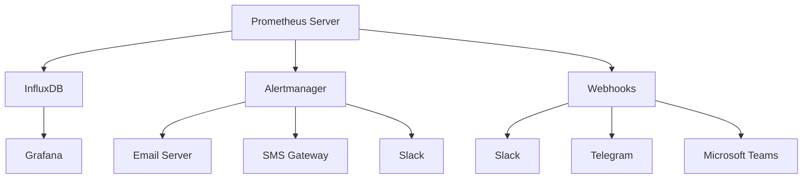

                 

### 引言：微服务与系统健康状态的重要性

#### 1.1 微服务的发展背景

微服务（Microservices）是近年来在软件架构领域逐渐流行的一种设计理念。其起源可以追溯到2000年代中期，当时一些软件公司开始采用基于组件的架构来提高软件开发的效率和可维护性。随着云计算、容器技术以及DevOps文化的兴起，微服务得到了广泛的关注和应用。

微服务的核心思想是将复杂的单体应用程序（Monolithic Application）拆分成多个独立、可复用的小型服务，每个服务负责完成特定的业务功能。这些服务通过轻量级的通信机制（如HTTP/HTTPS、REST、gRPC等）相互协作，共同实现复杂的业务逻辑。

微服务的定义与特点：

- **定义**：微服务是一种软件架构风格，它通过将应用程序构建为一组小的、独立的服务来简化复杂系统的开发、部署和维护。
- **特点**：
  - **独立性**：每个服务都是独立的，可以单独部署、升级、扩展。
  - **自治性**：每个服务拥有自己独立的数据库、缓存、配置等，可以独立进行数据管理和状态维护。
  - **可复用性**：服务可以独立开发、测试、部署，提高了软件的复用性。
  - **分布式**：服务可以部署在分布式环境中，利用云计算和容器技术实现弹性伸缩。

微服务的优势与挑战：

**优势**：
- **敏捷性**：微服务架构使得开发团队可以独立迭代和部署服务，提高了开发效率。
- **可扩展性**：通过水平扩展单个服务，可以灵活应对不同业务需求的负载。
- **可维护性**：服务之间的松耦合降低了系统的复杂性，便于维护和升级。
- **灵活性**：服务可以根据业务需求灵活调整规模和功能。

**挑战**：
- **复杂性**：微服务架构增加了系统的复杂性，包括服务间通信、数据一致性、服务发现等方面。
- **监控与运维**：由于服务分布在不同环境中，监控和运维变得更加复杂。
- **数据一致性**：在分布式系统中，如何保证数据的一致性是一个重要挑战。
- **性能问题**：分布式服务可能会引入额外的网络延迟和复杂性，影响系统性能。

#### 1.2 系统健康状态的重要性

系统健康状态是指一个软件系统在运行过程中表现出的稳定性和可靠性。系统健康状态的评估对于保障业务连续性、提高用户体验至关重要。

系统健康状态的含义：

- **含义**：系统健康状态指的是系统的性能、可用性、安全性和稳定性。一个健康的系统应能够在规定的时间内持续提供高质量的服务。

系统健康状态对业务的影响：

- **影响**：良好的系统健康状态能够保障业务的连续性，提升用户体验，减少业务风险。反之，系统故障、性能问题、安全性漏洞等都会对业务造成负面影响。

#### 1.3 监控在微服务系统中的作用

监控是确保系统健康状态的重要手段，尤其在微服务系统中。监控不仅能够实时监测系统的运行状态，还能在出现问题时及时报警，帮助运维团队快速定位和解决问题。

监控的概念与目的：

- **概念**：监控是指通过收集系统运行时的各种数据，对系统进行实时监测和分析的过程。
- **目的**：监控的主要目的是确保系统的稳定性和可靠性，及时发现并解决潜在的问题，预防业务中断。

监控在微服务系统中的重要性：

- **重要性**：
  - **实时监测**：监控能够实时监测系统的运行状态，包括性能、资源使用、错误日志等。
  - **故障报警**：监控系统能够在检测到异常时自动发出警报，通知运维人员。
  - **性能优化**：通过监控，运维团队可以识别系统瓶颈，进行性能优化。
  - **安全防护**：监控能够监测系统的安全性，及时发现并防范潜在的安全威胁。

#### 1.4 本书结构安排

本书旨在为读者提供全面、系统的微服务监控策略，帮助读者深入理解微服务监控的核心概念、策略和实践。以下是本书的结构安排：

- **第1章 引言**：介绍微服务的发展背景、系统健康状态的重要性以及监控在微服务系统中的作用。
- **第2章 基础知识**：讲解微服务监控的背景知识，包括微服务架构概述、监控与系统性能、监控工具和平台、监控数据指标等。
- **第3章 监控策略设计**：介绍监控策略的概述、制定过程、监控指标的设定与优化、监控结果的分析与应用等。
- **第4章 微服务监控实践**：通过实践案例，讲解微服务监控的环境准备、数据采集、数据处理、数据可视化以及监控结果分析等。

### 1.4.1 各章节内容概述

**第1章 引言**：

- **概述**：介绍微服务的发展背景、系统健康状态的重要性以及监控在微服务系统中的作用。
- **内容**：第1章主要从宏观层面介绍微服务和系统健康状态的重要性，并引出监控在微服务系统中的关键作用。

**第2章 基础知识**：

- **概述**：讲解微服务监控的背景知识，为后续策略和实践提供基础。
- **内容**：第2章包括微服务架构概述、监控与系统性能、监控工具和平台、监控数据指标等内容，为读者提供全面的监控知识。

**第3章 监控策略设计**：

- **概述**：介绍监控策略的制定原则和过程。
- **内容**：第3章详细讲解了监控策略的制定方法、监控指标的设定与优化、监控结果的分析与应用等。

**第4章 微服务监控实践**：

- **概述**：通过实践案例，展示微服务监控的实际应用。
- **内容**：第4章包括环境准备、数据采集、数据处理、数据可视化以及监控结果分析等，通过具体案例帮助读者理解监控策略的实施。

### 1.4.2 阅读指南

本书旨在为读者提供从理论到实践的微服务监控全面指南，以下是阅读建议：

- **循序渐进**：建议读者按照章节顺序阅读，从基础知识到监控策略，再到实际应用，逐步深入理解。
- **动手实践**：第4章提供了实践案例，读者可以在理解理论知识的基础上，动手实践，加深理解。
- **重点内容**：监控策略设计和实践是本书的核心内容，建议读者重点关注。

通过本书，读者可以全面掌握微服务监控策略，提高系统健康状态的管理能力，为业务的稳定运行提供有力保障。

## 第二部分：基础知识

### 第2章：微服务监控的背景知识

在深入探讨微服务监控策略之前，我们需要了解微服务架构的基本概念、监控在系统性能中的作用以及微服务监控的关键要素。这一章将为我们后续的讨论奠定坚实的基础。

#### 2.1 微服务架构概述

微服务架构是一种软件开发的方法论，它通过将复杂的应用程序拆分成一组独立的、小型、自治的服务来实现更灵活、可扩展和易于管理的系统。这些服务通常围绕业务功能进行组织，每个服务都有自己的数据库、API端点、进程和配置。

**基本概念**：

- **微服务**：微服务是一个小型、独立的、可重用的服务，通常由几个开发者团队负责开发和维护。
- **服务间通信**：微服务之间通过轻量级的通信机制（如HTTP/HTTPS、REST、gRPC等）进行交互。
- **容器化**：微服务通常部署在容器中（如Docker），便于隔离和部署。
- **编排与自动化**：通过自动化工具（如Kubernetes）进行服务编排、扩展和管理。

**优势与挑战**：

**优势**：

- **灵活性**：微服务架构允许独立部署和扩展单个服务，适应不同的业务需求。
- **可维护性**：服务之间的松耦合降低了系统的复杂性，便于维护和升级。
- **可扩展性**：可以通过水平扩展单个服务来提高系统的性能和可用性。
- **敏捷性**：独立开发和部署服务，提高了开发效率。

**挑战**：

- **复杂性**：微服务架构增加了系统的复杂性，包括服务发现、数据一致性和监控等方面。
- **分布式问题**：分布式系统可能会引入额外的网络延迟和复杂性，影响系统性能。
- **监控与运维**：由于服务分布在不同环境中，监控和运维变得更加复杂。

#### 2.2 监控与系统性能

监控是确保系统健康状态的重要手段，特别是在微服务系统中。监控可以帮助我们实时监测系统的性能，及时发现并解决潜在的问题。

**监控的定义**：

监控是指通过收集系统运行时的各种数据（如CPU使用率、内存使用率、网络流量、错误日志等），对系统进行实时监测和分析的过程。

**监控在系统性能中的作用**：

- **实时监测**：监控能够实时监测系统的运行状态，包括性能、资源使用、错误日志等。
- **故障报警**：监控系统能够在检测到异常时自动发出警报，通知运维人员。
- **性能优化**：通过监控，运维团队可以识别系统瓶颈，进行性能优化。
- **安全防护**：监控能够监测系统的安全性，及时发现并防范潜在的安全威胁。

**监控的重要性**：

在微服务系统中，监控尤为重要。由于服务分布在不同环境中，监控可以帮助运维团队实时掌握系统的健康状况，快速响应和处理问题，保障业务的连续性和稳定性。

#### 2.3 微服务监控的关键要素

微服务监控的关键要素包括数据采集、数据处理和数据可视化。这些要素共同构成了一个完整的监控体系，确保我们能够全面掌握系统的健康状况。

**数据采集**：

数据采集是监控系统的第一步，它负责从各个服务中收集性能指标、日志数据等。常用的数据采集工具包括Prometheus、Grafana、StatsD、Collectd等。

- **Prometheus**：Prometheus是一个开源监控解决方案，用于收集、存储和查询监控数据。
- **Grafana**：Grafana是一个开源的数据可视化工具，可以与Prometheus等监控工具集成，提供丰富的可视化仪表板。
- **StatsD**：StatsD是一个简单的数据收集器，用于将应用程序的性能数据发送到Graphite等后端存储。
- **Collectd**：Collectd是一个系统性能监控工具，可以收集各种系统性能指标，并将其发送到Riemann、Graphite等后端系统。

**数据处理**：

数据处理是监控系统的核心，它负责对采集到的数据进行存储、分析和处理。数据处理通常包括以下步骤：

- **数据存储**：将采集到的数据存储到数据库或其他存储系统中，以便后续查询和分析。
- **数据聚合**：将来自不同服务的相同类型的数据进行聚合，以获得全局的视图。
- **数据清洗**：对采集到的数据进行去重、过滤等处理，确保数据的质量。

**数据可视化**：

数据可视化是将监控数据以图形化的方式呈现出来，帮助运维人员直观地了解系统的运行状态。常用的数据可视化工具包括Grafana、Kibana、Zabbix等。

- **Grafana**：Grafana可以与Prometheus等监控工具集成，提供丰富的可视化仪表板，支持自定义图表和面板。
- **Kibana**：Kibana是Elasticsearch的配套数据可视化工具，可以用于监控和可视化各种指标数据。
- **Zabbix**：Zabbix是一个开源的监控工具，提供丰富的数据可视化功能，支持多种图表和仪表板。

#### 2.4 常见的监控工具与平台

在微服务监控领域，有许多流行的监控工具和平台可供选择。这些工具和平台各有特点，适用于不同的监控需求。

**Prometheus**：

Prometheus是一个开源监控解决方案，适用于大规模分布式系统。它具有以下特点：

- **数据采集**：Prometheus通过拉取模式（Pull Model）从服务中采集监控数据，支持多种数据源。
- **数据存储**：Prometheus使用时间序列数据库（TSDB）存储监控数据，支持高效的查询和分析。
- **告警管理**：Prometheus支持基于表达式的告警规则，可以在检测到异常时自动发送告警。
- **可视化**：Prometheus可以与Grafana集成，提供丰富的可视化仪表板。

**Grafana**：

Grafana是一个开源的数据可视化工具，可以与Prometheus等监控工具集成。它具有以下特点：

- **数据可视化**：Grafana提供丰富的图表和面板，支持自定义图表和仪表板。
- **数据源支持**：Grafana支持多种数据源，包括Prometheus、InfluxDB、Elasticsearch等。
- **告警通知**：Grafana支持多种告警通知方式，如电子邮件、短信、Slack等。

**Nagios**：

Nagios是一个开源的监控工具，适用于中小型系统。它具有以下特点：

- **监控功能丰富**：Nagios支持多种监控功能，如服务状态检查、性能监控、告警管理等。
- **插件支持**：Nagios拥有丰富的插件库，可以扩展监控功能。
- **图形化界面**：Nagios提供Web界面，方便用户查看监控数据和告警信息。

#### 2.5 监控数据指标

监控数据指标是监控系统的核心，它们反映了系统的性能、可用性、安全性和稳定性。常见的监控数据指标包括以下几种：

- **性能指标**：如CPU使用率、内存使用率、磁盘IO、网络流量等，反映了系统的资源使用情况。
- **可用性指标**：如服务响应时间、请求成功率、系统 uptime 等，反映了系统的可用性。
- **安全性指标**：如登录失败次数、入侵检测、安全漏洞等，反映了系统的安全性。
- **业务指标**：如交易成功率、用户活跃度、系统吞吐量等，反映了业务性能。

#### 2.6 小结

本章介绍了微服务监控的背景知识，包括微服务架构概述、监控与系统性能、监控工具和平台、监控数据指标等。通过了解这些基础知识，读者可以为后续的监控策略设计和实践做好准备。在下一章中，我们将进一步探讨监控策略的设计原则和过程，帮助读者制定有效的监控策略。

## 第3章：监控策略设计

### 3.1 监控策略概述

监控策略是指为了确保系统健康状态而制定的一系列监控措施和方法。一个良好的监控策略可以帮助我们及时发现和解决系统问题，提高系统的可用性和稳定性。本节将介绍监控策略的定义、目的以及设计原则。

#### 监控策略的定义与目的

**定义**：

监控策略是指为了实现特定目标，对监控活动进行系统化规划和设计的一系列措施和方法。它包括监控目标的设定、监控工具的选择、监控指标的设计、监控结果的解读与应用等。

**目的**：

监控策略的主要目的是确保系统的健康状态，具体包括：

- **实时监测**：通过监控工具实时收集系统的性能、资源使用、错误日志等数据，确保系统运行状态的可视化。
- **故障报警**：在检测到系统异常时，及时发出警报，通知运维人员，以便快速响应和处理。
- **性能优化**：通过监控数据识别系统瓶颈，进行性能优化，提高系统响应速度和吞吐量。
- **安全防护**：监测系统的安全性，及时发现并防范潜在的安全威胁。

#### 监控策略的设计原则

设计监控策略时，应遵循以下原则：

- **全面性**：监控策略应覆盖系统的各个方面，包括性能、可用性、安全性和稳定性。
- **针对性**：根据不同系统的特点，制定针对性的监控策略，确保监控措施的有效性。
- **可操作性**：监控策略应具有可操作性，确保运维人员能够根据监控数据快速识别和解决问题。
- **实时性**：监控策略应具备实时性，确保能够及时监测系统的运行状态。
- **可扩展性**：监控策略应具备可扩展性，以便在系统规模或业务需求发生变化时，能够灵活调整。

### 3.2 监控策略的制定过程

制定监控策略是一个系统化的过程，需要综合考虑系统的特点、业务需求以及技术实现等因素。以下是监控策略的制定过程：

#### 确定监控需求

监控需求的确定是监控策略制定的第一步，它需要明确以下几个问题：

- **监控目标**：明确监控的总体目标，如确保系统的可用性、性能和安全性。
- **监控范围**：确定需要监控的系统组件和指标，如Web服务、数据库、网络设备等。
- **监控频率**：确定监控数据的采集频率，如每分钟、每小时等。
- **监控阈值**：设定监控指标的阈值，以便在指标超过阈值时触发警报。

#### 选择监控工具

选择合适的监控工具是实现监控策略的关键。以下是选择监控工具时需要考虑的几个方面：

- **功能丰富性**：监控工具应支持多种监控数据源、丰富的监控指标以及灵活的告警机制。
- **可扩展性**：监控工具应支持插件或扩展，以便在需要时添加新的监控功能。
- **易用性**：监控工具应具有友好的用户界面和简洁的操作流程，便于运维人员使用。
- **稳定性**：监控工具应具备高可用性和稳定性，确保能够持续运行。

常用的监控工具有Prometheus、Grafana、Nagios、Zabbix等。

#### 设计监控指标

监控指标是监控策略的核心，它们反映了系统的性能、可用性和稳定性。以下是设计监控指标时需要考虑的几个方面：

- **性能指标**：如CPU使用率、内存使用率、磁盘IO、网络流量等。
- **可用性指标**：如服务响应时间、请求成功率、系统 uptime 等。
- **安全性指标**：如登录失败次数、入侵检测、安全漏洞等。
- **业务指标**：如交易成功率、用户活跃度、系统吞吐量等。

设计监控指标时，应确保指标全面、合理，能够准确反映系统的健康状况。

#### 制定监控计划和流程

监控计划和流程是监控策略的具体实现，它包括以下几个方面：

- **监控数据采集**：明确监控数据的采集方式和频率，如使用Prometheus等工具定期采集系统数据。
- **数据存储**：选择合适的数据存储方案，如使用InfluxDB、Elasticsearch等存储监控数据。
- **数据分析和处理**：对采集到的监控数据进行存储、聚合和分析，以便及时发现异常。
- **告警和通知**：设定监控阈值和告警规则，当监控指标超过阈值时，自动发送告警通知。

#### 监控结果的解读与应用

监控结果的解读与应用是监控策略的关键环节，它包括以下几个方面：

- **异常分析**：对监控数据进行分析，识别异常情况，如服务异常、性能瓶颈等。
- **性能优化**：根据监控结果，进行系统性能优化，提高系统响应速度和吞吐量。
- **故障处理**：在检测到故障时，快速定位问题并进行修复，确保系统稳定运行。
- **安全防护**：监测系统的安全性，及时发现并防范潜在的安全威胁。

### 3.3 监控指标的设定与优化

监控指标的设定与优化是监控策略设计的重要环节，它直接影响到监控的效果。以下是监控指标的设定与优化方法：

#### 指标设定的重要性

监控指标是监控策略的核心，它们反映了系统的性能、可用性和稳定性。合理的监控指标设定有助于：

- **及时发现异常**：通过设定监控阈值，可以在指标超过阈值时及时触发告警，通知运维人员。
- **性能优化**：通过监控数据，识别系统瓶颈，进行有针对性的性能优化。
- **安全防护**：监测系统的安全性，及时发现并防范潜在的安全威胁。

#### 常见监控指标的分析与优化

在设定监控指标时，我们需要考虑以下几个方面：

- **性能指标**：

  - **CPU使用率**：监控CPU使用率，可以识别系统是否处于高负载状态。优化方法包括升级硬件、调整系统参数等。

  - **内存使用率**：监控内存使用率，可以避免内存溢出和系统崩溃。优化方法包括增加内存、调整内存分配策略等。

  - **磁盘IO**：监控磁盘IO，可以识别磁盘瓶颈，优化方法包括升级磁盘、调整IO调度策略等。

  - **网络流量**：监控网络流量，可以识别网络瓶颈，优化方法包括增加带宽、调整网络策略等。

- **可用性指标**：

  - **服务响应时间**：监控服务响应时间，可以识别系统性能瓶颈。优化方法包括优化代码、增加缓存、调整服务器配置等。

  - **请求成功率**：监控请求成功率，可以识别系统故障和异常。优化方法包括增加冗余、优化网络通信等。

  - **系统 uptime**：监控系统 uptime，可以确保系统的可用性。优化方法包括定期维护、备份和恢复策略等。

- **安全性指标**：

  - **登录失败次数**：监控登录失败次数，可以识别潜在的安全威胁。优化方法包括增加安全性措施、调整登录策略等。

  - **入侵检测**：监控入侵检测，可以识别系统受到的攻击。优化方法包括部署防火墙、入侵检测系统等。

  - **安全漏洞**：监控安全漏洞，可以确保系统的安全性。优化方法包括定期更新系统、安装安全补丁等。

#### 指标设定的原则

在设定监控指标时，应遵循以下原则：

- **全面性**：确保监控指标覆盖系统的各个方面，包括性能、可用性、安全性和稳定性。
- **针对性**：根据不同系统的特点和业务需求，设定针对性的监控指标。
- **可操作性**：监控指标应具有可操作性，确保运维人员能够根据监控数据快速识别和解决问题。
- **实时性**：监控指标应具备实时性，确保能够及时监测系统的运行状态。
- **可扩展性**：监控指标应具备可扩展性，以便在系统规模或业务需求发生变化时，能够灵活调整。

### 3.4 监控结果的分析与应用

监控结果的分析与应用是监控策略的核心，它直接影响到监控效果。以下是监控结果的分析与应用方法：

#### 监控数据的分析方法

监控数据的分析方法包括以下几个方面：

- **数据可视化**：通过数据可视化工具（如Grafana、Kibana等），将监控数据以图表、仪表板等形式呈现，便于分析。
- **统计方法**：使用统计学方法对监控数据进行处理和分析，如平均值、中位数、标准差等。
- **趋势分析**：通过分析监控数据的趋势，预测系统的未来状态，如使用时间序列分析、机器学习等方法。
- **异常检测**：通过异常检测算法，识别监控数据中的异常值，如使用统计学方法、机器学习方法等。

#### 监控结果的应用场景

监控结果可以应用于以下几个方面：

- **性能优化**：通过监控结果识别系统瓶颈，进行性能优化，提高系统响应速度和吞吐量。
- **故障处理**：在检测到故障时，快速定位问题并进行修复，确保系统稳定运行。
- **安全防护**：监测系统的安全性，及时发现并防范潜在的安全威胁。
- **业务决策**：根据监控结果，为业务决策提供数据支持，如优化资源分配、调整业务策略等。

#### 监控策略的评估与改进

监控策略的评估与改进是确保监控效果的重要环节。以下是监控策略评估与改进的方法：

- **定期评估**：定期评估监控策略的有效性，如每季度或每半年进行一次评估。
- **反馈机制**：建立监控数据反馈机制，收集运维人员和开发人员的意见和建议。
- **持续改进**：根据评估结果和反馈，持续改进监控策略，提高监控效果。

### 3.5 监控策略的评估方法

监控策略的评估方法包括以下几个方面：

- **KPI评估**：根据监控指标的KPI（关键绩效指标），评估监控策略的有效性，如系统 uptime、服务响应时间等。
- **故障响应时间评估**：评估在检测到故障时，从故障报警到故障解决的时间，如故障响应时间。
- **用户满意度评估**：通过用户满意度调查，评估监控策略对用户体验的影响。
- **成本效益评估**：评估监控策略的成本和效益，如监控工具的购买成本、运维成本等。

### 3.6 监控策略的改进策略

监控策略的改进策略包括以下几个方面：

- **技术改进**：采用新的监控技术，提高监控的准确性和实时性，如使用机器学习算法进行异常检测。
- **流程改进**：优化监控流程，提高监控效率，如自动化监控数据的采集、处理和分析。
- **人员培训**：加强运维人员和开发人员的培训，提高他们对监控策略的理解和应用能力。
- **工具优化**：优化监控工具的功能和性能，提高监控效果，如改进数据可视化工具的交互体验。

### 3.7 小结

本章详细介绍了监控策略的设计原则、制定过程、监控指标的设定与优化、监控结果的分析与应用以及监控策略的评估与改进方法。通过本章的学习，读者可以全面了解监控策略的设计与实施，为实际应用打下坚实基础。在下一章中，我们将通过具体实践案例，展示如何将监控策略应用于微服务系统。

## 第4章：微服务监控实践

### 4.1 微服务监控实践概述

微服务监控实践是将监控策略从理论转化为实际操作的过程。本章将通过具体案例，详细介绍微服务监控的实践步骤，包括环境准备、数据采集、数据处理、数据可视化和监控结果分析等。通过这些实践，读者可以深入理解微服务监控的各个环节，为实际项目中的应用提供参考。

#### 4.1.1 实践的重要性

微服务监控实践的重要性体现在以下几个方面：

- **验证监控策略**：通过实际操作，验证监控策略的有效性和可行性，确保监控系统能够及时发现和解决问题。
- **提升运维能力**：通过实践，运维人员可以熟练掌握监控工具的使用方法和监控数据的分析技巧，提高运维效率。
- **优化系统性能**：通过监控实践，识别系统瓶颈和性能问题，进行针对性的优化，提高系统性能和用户体验。
- **保障业务连续性**：通过实时监控和及时响应，确保业务系统的稳定运行，降低故障率和中断风险。

#### 4.1.2 实践流程概述

微服务监控实践的主要流程包括以下几个步骤：

1. **环境准备**：搭建监控环境，安装和配置监控工具。
2. **数据采集**：从微服务中采集监控数据，包括性能指标、日志数据等。
3. **数据处理**：对采集到的监控数据进行存储、聚合和分析。
4. **数据可视化**：使用数据可视化工具，将监控数据以图表和仪表板的形式呈现，便于分析。
5. **监控结果分析**：对监控结果进行分析，识别异常情况，进行故障处理和性能优化。

### 4.2 环境准备

在开始微服务监控实践之前，需要搭建监控环境，安装和配置监控工具。以下是环境准备的具体步骤：

#### 4.2.1 监控工具的安装与配置

**1. 安装Prometheus**：

Prometheus是一个开源的监控解决方案，我们可以在其官网下载最新版本的Prometheus二进制文件。以下是安装步骤：

```bash
# 下载Prometheus
wget https://github.com/prometheus/prometheus/releases/download/v2.40.0/prometheus-2.40.0.linux-amd64.tar.gz

# 解压文件
tar xvfz prometheus-2.40.0.linux-amd64.tar.gz

# 进入解压后的目录
cd prometheus-2.40.0.linux-amd64

# 启动Prometheus
./prometheus
```

**2. 安装Grafana**：

Grafana是一个开源的数据可视化工具，我们可以在其官网下载最新版本的Grafana二进制文件。以下是安装步骤：

```bash
# 下载Grafana
wget https://s3-us-west-1.amazonaws.com/grafana-releases/release/grafana-9.0.3.linux-x86_64.tar.gz

# 解压文件
tar xvfz grafana-9.0.3.linux-x86_64.tar.gz

# 进入解压后的目录
cd grafana-9.0.3.linux-x86_64

# 启动Grafana
./grafana-server web
```

**3. 配置Prometheus和Grafana**：

在启动Prometheus和Grafana之前，需要配置相关配置文件。以下是配置文件示例：

**Prometheus配置文件**（prometheus.yml）：

```yaml
global:
  scrape_interval: 15s
  evaluation_interval: 15s

scrape_configs:
  - job_name: 'prometheus'
    static_configs:
      - targets: ['localhost:9090']
  - job_name: 'node-exporter'
    static_configs:
      - targets: ['localhost:9100']
  - job_name: 'cpu-exporter'
    static_configs:
      - targets: ['localhost:9110']
```

**Grafana配置文件**（grafana.ini）：

```ini
[server]
domain = localhost
http_addr = 0.0.0.0
http_port = 3000
log_level = info
```

#### 4.2.2 系统环境搭建

在环境准备阶段，还需要搭建一个模拟的微服务系统，用于数据采集和监控。以下是一个简单的微服务环境搭建步骤：

**1. 安装Docker**：

Docker是一个开源的应用容器引擎，用于构建、运行和部署应用。以下是安装步骤：

```bash
# 下载Docker安装脚本
curl -fsSL https://get.docker.com -o get-docker.sh

# 运行安装脚本
sudo sh get-docker.sh
```

**2. 启动Docker**：

```bash
sudo systemctl start docker
```

**3. 搭建微服务**：

我们可以使用Docker Compose来搭建一个简单的微服务系统，包括一个Web服务、一个数据库服务和一些监控系统。

**Web服务**（web.yml）：

```yaml
version: '3'
services:
  web:
    image: your-web-service-image
    ports:
      - "8080:8080"
    depends_on:
      - db
    environment:
      - DB_URL=jdbc:mysql://db:3306/web
```

**数据库服务**（db.yml）：

```yaml
version: '3'
services:
  db:
    image: mysql:5.7
    ports:
      - "3306:3306"
    environment:
      - MYSQL_ROOT_PASSWORD=your-password
      - MYSQL_DATABASE=web
    volumes:
      - db_data:/var/lib/mysql
volumes:
  db_data:
```

使用以下命令启动Web服务和数据库服务：

```bash
docker-compose up -d
```

### 4.3 数据采集

数据采集是监控系统的核心步骤，它负责从微服务中收集各种性能指标和日志数据。以下是如何使用Prometheus和Node.jsExporter进行数据采集的示例。

#### 4.3.1 数据采集的方法与技巧

**1. 使用Prometheus采集性能数据**：

Prometheus可以通过HTTP探针（HTTP Explorer）和 exporter（如Node.jsExporter）来采集微服务的性能数据。以下是使用Node.jsExporter采集性能数据的步骤：

**安装Node.jsExporter**：

```bash
# 下载Node.jsExporter
wget https://github.com/prometheus/node_exporter/releases/download/v1.4.0/node_exporter-1.4.0.linux-amd64.tar.gz

# 解压文件
tar xvfz node_exporter-1.4.0.linux-amd64.tar.gz

# 进入解压后的目录
cd node_exporter-1.4.0.linux-amd64

# 启动Node.jsExporter
./node_exporter
```

**2. 配置Prometheus**：

在Prometheus的配置文件（prometheus.yml）中，添加Node.jsExporter的配置：

```yaml
scrape_configs:
  - job_name: 'node-exporter'
    static_configs:
      - targets: ['localhost:9100']
```

**3. 使用Prometheus采集Web服务性能数据**：

在Web服务的Dockerfile中，添加以下内容，将Node.jsExporter集成到Web服务中：

```Dockerfile
FROM node:14-alpine
...
COPY node_modules/ node_modules/
COPY . ./
COPY node_exporter-1.4.0.linux-amd64/ node_exporter/
CMD ["node", "app.js", "--exporter"]
```

在启动Web服务时，Node.jsExporter将自动启动并暴露性能数据。

**2. 使用Prometheus采集日志数据**：

Prometheus可以通过日志文件探针（Log Collector）采集微服务的日志数据。以下是使用Log Collector采集日志数据的步骤：

**安装Log Collector**：

```bash
# 下载Log Collector
wget https://github.com/prometheus/log_exporter/releases/download/v0.1.0/log_exporter-0.1.0.linux-amd64.tar.gz

# 解压文件
tar xvfz log_exporter-0.1.0.linux-amd64.tar.gz

# 进入解压后的目录
cd log_exporter-0.1.0.linux-amd64

# 启动Log Collector
./log_exporter
```

**3. 配置Prometheus**：

在Prometheus的配置文件（prometheus.yml）中，添加Log Collector的配置：

```yaml
scrape_configs:
  - job_name: 'log-exporter'
    static_configs:
      - targets: ['localhost:9200']
```

**3. 数据采集的技巧**：

- **定时采集**：使用Prometheus的scrape_interval配置项，设置数据采集的时间间隔。
- **性能优化**：避免在高峰时段进行大量数据采集，以免影响系统性能。
- **日志格式**：确保日志格式规范，便于Prometheus解析和采集。

#### 4.3.2 数据采集案例

以下是一个简单的数据采集案例，演示如何使用Prometheus和Node.jsExporter采集微服务性能数据：

**1. 配置Web服务**：

在Web服务的Dockerfile中，集成Node.jsExporter：

```Dockerfile
FROM node:14-alpine
...
COPY node_modules/ node_modules/
COPY . ./
COPY node_exporter-1.4.0.linux-amd64/ node_exporter/
CMD ["node", "app.js", "--exporter"]
```

**2. 启动Web服务**：

```bash
docker-compose up -d
```

**3. 配置Prometheus**：

在Prometheus的配置文件（prometheus.yml）中，添加Node.jsExporter的配置：

```yaml
scrape_configs:
  - job_name: 'node-exporter'
    static_configs:
      - targets: ['localhost:9100']
```

**4. 查看采集数据**：

启动Prometheus和Grafana后，在Grafana中创建一个仪表板，添加以下指标图表：

- **CPU使用率**：`node_cpu_seconds_total`
- **内存使用率**：`node_memory_total`
- **磁盘IO**：`node_disk_io总量`

图表示例：


#### 4.3.3 数据处理

数据处理是监控系统的核心步骤，它负责对采集到的监控数据进行存储、聚合和分析。以下是如何使用Prometheus和InfluxDB进行数据处理的示例：

**1. 安装InfluxDB**：

InfluxDB是一个开源的时间序列数据库，用于存储和查询监控数据。以下是安装步骤：

```bash
# 下载InfluxDB
wget https://s3-us-west-1.amazonaws.com/influxdb/influxdb-2.0.x/influxdb_2.0.3_linux_amd64.tar.gz

# 解压文件
tar xvfz influxdb_2.0.3_linux_amd64.tar.gz

# 进入解压后的目录
cd influxdb_2.0.3

# 启动InfluxDB
./bin/influxdb
```

**2. 配置Prometheus**：

在Prometheus的配置文件（prometheus.yml）中，添加InfluxDB的配置：

```yaml
scrape_configs:
  - job_name: 'influxdb'
    static_configs:
      - targets: ['localhost:8086']
```

**3. 数据存储和查询**：

使用PromQL（Prometheus查询语言），可以对InfluxDB中的监控数据进行存储和查询。以下是一个简单的查询示例：

```bash
# 查询过去1小时的CPU使用率
query="select mean(node_cpu_seconds_total{mode=\"idle\"}) from \"node\" group by time(1h)"
```

#### 4.3.4 数据可视化

数据可视化是将监控数据以图形化的方式呈现出来，帮助运维人员直观地了解系统的运行状态。以下是如何使用Grafana进行数据可视化的示例：

**1. 安装Grafana**：

已在4.2节中介绍过Grafana的安装过程。

**2. 配置Grafana**：

在Grafana的Web界面中，进行以下配置：

- **添加数据源**：选择InfluxDB作为数据源，填写InfluxDB的URL、用户名和密码。
- **创建仪表板**：点击“Create dashboard”，选择“InfluxDB”作为数据源，添加所需的图表和面板。

**3. 创建图表**：

在仪表板中，可以添加以下图表：

- **CPU使用率**：使用PromQL查询`node_cpu_seconds_total{mode=\"idle\"}`，并设置时间范围。
- **内存使用率**：使用PromQL查询`node_memory_total{state=\"used\"}`，并设置时间范围。
- **磁盘IO**：使用PromQL查询`node_disk_io总量`，并设置时间范围。

图表示例：


#### 4.3.5 监控结果分析

监控结果分析是将监控数据转化为可操作的信息，帮助运维人员识别异常、优化性能和保障系统稳定运行。以下是如何分析监控结果的示例：

**1. 识别异常情况**：

通过监控图表，可以识别系统的异常情况。例如，如果CPU使用率持续高于80%，可能是由于系统负载过高引起的。

**2. 定位问题**：

根据监控数据，可以定位问题的发生位置。例如，如果Web服务的响应时间显著增加，可能是由于数据库查询缓慢引起的。

**3. 优化性能**：

根据监控结果，进行系统性能优化。例如，如果磁盘IO持续高于阈值，可以增加磁盘容量或优化数据库查询。

**4. 故障处理**：

在检测到故障时，快速定位并解决问题。例如，如果Web服务无法访问，可能是由于网络故障引起的。

**5. 安全防护**：

监控系统的安全性，及时发现并防范潜在的安全威胁。例如，如果登录失败次数显著增加，可能是由于暴力破解攻击引起的。

#### 4.3.6 项目小结

本章通过一个简单的案例，介绍了微服务监控实践的过程，包括环境准备、数据采集、数据处理、数据可视化和监控结果分析等。通过本章的学习，读者可以了解如何将监控策略应用于实际项目，提高系统性能和稳定性。在实际应用中，可以根据项目需求进行调整和优化，实现更全面的监控。

## 第5章：系统架构设计

### 5.1 项目介绍

本章节将详细阐述一个微服务监控系统的项目介绍，包括项目的背景、目标、功能和实现方式。

#### 5.1.1 项目背景

随着互联网和云计算技术的快速发展，现代企业越来越依赖复杂分布式系统来支持其业务运营。微服务架构因其可扩展性、灵活性和可维护性等特点，成为许多企业技术选型的重要方向。然而，随着服务数量的增加和分布式程度的加深，如何确保微服务系统的稳定性和可靠性成为一个重要的挑战。为了实现这一目标，一个完善的微服务监控系统至关重要。

#### 5.1.2 项目目标

本项目旨在设计并实现一个高效、可扩展的微服务监控系统，主要目标包括：

1. **实时监控**：实现对系统各组件（如服务、数据库、网络等）的实时监控，确保系统状态的可视化和异常检测。
2. **性能优化**：通过监控数据识别系统瓶颈，提供性能优化建议，提高系统响应速度和吞吐量。
3. **故障预警**：在系统出现异常时，及时发出预警，减少故障对业务的影响。
4. **安全性保障**：监控系统的安全性，及时发现并防范潜在的安全威胁。

#### 5.1.3 项目功能

本项目的主要功能模块包括：

1. **数据采集**：从各微服务、数据库、网络设备等收集性能指标、日志数据等。
2. **数据处理**：对采集到的数据进行存储、聚合和分析，提供全面的监控数据视图。
3. **数据可视化**：使用数据可视化工具将监控数据以图表和仪表板的形式呈现，便于分析和决策。
4. **异常检测**：通过异常检测算法，识别系统异常，自动触发预警。
5. **告警通知**：通过邮件、短信、Slack等渠道发送告警通知，确保运维人员及时响应。

#### 5.1.4 实现方式

本项目采用以下技术栈和架构设计：

1. **技术栈**：
   - **监控工具**：Prometheus、Grafana
   - **数据存储**：InfluxDB
   - **消息队列**：Kafka
   - **数据可视化**：Grafana
   - **异常检测**：机器学习算法

2. **架构设计**：
   - **数据采集**：使用Prometheus Server定期从微服务和数据库中采集监控数据，通过HTTP探针和exporter方式实现。
   - **数据处理**：使用Prometheus和InfluxDB对采集到的数据进行存储、聚合和分析。
   - **数据可视化**：使用Grafana将监控数据以图表和仪表板的形式展示，提供直观的数据视图。
   - **异常检测**：使用机器学习算法对监控数据进行异常检测，识别系统异常并触发告警。

### 5.2 系统功能设计

系统功能设计是监控系统实现的核心，它决定了系统能够提供的监控能力和用户体验。以下是对系统功能的具体设计：

#### 5.2.1 性能监控

性能监控是监控系统最基本的功能之一，它包括以下几个方面：

1. **CPU使用率**：实时监控系统CPU的使用情况，包括用户态、内核态的CPU使用率。
2. **内存使用率**：监控系统内存的使用情况，包括物理内存和虚拟内存的使用率。
3. **磁盘IO**：监控系统磁盘的读写速度和利用率。
4. **网络流量**：监控系统网络接口的流量，包括接收和发送的数据包数量。

#### 5.2.2 可用性监控

可用性监控关注系统是否能够持续提供服务，包括以下几个方面：

1. **服务响应时间**：监控服务对外提供请求的响应时间，识别服务性能瓶颈。
2. **请求成功率**：监控服务请求的成功率，识别服务故障和异常。
3. **系统Uptime**：监控系统的运行时间，确保系统的连续性。

#### 5.2.3 安全监控

安全监控是保障系统安全的关键，包括以下几个方面：

1. **登录失败次数**：监控系统登录失败的次数，识别潜在的安全威胁。
2. **入侵检测**：监控系统中的异常行为和攻击，如DDoS攻击、SQL注入等。
3. **安全漏洞**：监控系统中的安全漏洞，及时更新和修复。

#### 5.2.4 告警通知

告警通知是监控系统的重要功能之一，它确保运维人员能够在系统出现异常时及时收到通知。告警通知包括以下几个方面：

1. **邮件通知**：通过电子邮件发送告警通知，确保运维人员及时了解系统状态。
2. **短信通知**：通过短信发送告警通知，适用于紧急情况。
3. **Slack通知**：通过Slack机器人发送告警通知，便于团队协作。

### 5.3 系统架构设计

系统架构设计是确保监控系统高效、稳定运行的关键，以下是对系统架构的具体设计：

#### 5.3.1 组件设计

系统架构由以下几个核心组件组成：

1. **Prometheus Server**：负责从各个服务中采集监控数据，并存储到InfluxDB中。
2. **Grafana**：负责展示监控数据和仪表板，提供用户友好的数据可视化界面。
3. **InfluxDB**：负责存储Prometheus Server采集到的监控数据，支持高效的查询和分析。
4. **Kafka**：负责处理和传输监控数据，提高系统的可扩展性和容错性。
5. **告警通知系统**：负责发送告警通知，包括邮件、短信、Slack等。

#### 5.3.2 系统架构图

以下是一个简单的系统架构图，展示各组件之间的关系和交互：



#### 5.3.3 数据流设计

以下是系统中的数据流设计，描述监控数据的流动过程：

1. **数据采集**：Prometheus Server通过HTTP探针和exporter方式从各个服务中采集监控数据。
2. **数据存储**：采集到的监控数据存储到InfluxDB中，供Grafana查询和展示。
3. **数据查询**：Grafana从InfluxDB中查询监控数据，生成仪表板和图表。
4. **告警处理**：Prometheus Server将监控数据发送给Alertmanager，Alertmanager根据配置的告警规则触发告警，并通过Webhooks发送到邮件、短信、Slack等通知渠道。

### 5.4 系统接口设计

系统接口设计是确保各组件之间能够有效通信和协同工作的关键。以下是对系统接口的具体设计：

#### 5.4.1 Prometheus Server接口

Prometheus Server提供了以下接口：

- **HTTP探针接口**：用于从服务中采集监控数据，探针通过访问服务提供的HTTP接口获取监控指标。
- **Exporter接口**：用于从服务中采集监控数据，Exporter通过暴露Metrics API提供监控数据。

#### 5.4.2 InfluxDB接口

InfluxDB提供了以下接口：

- **InfluxDB API**：用于与InfluxDB进行交互，包括数据存储、查询和分析等功能。
- **InfluxDB HTTP API**：用于通过HTTP请求与InfluxDB进行交互。

#### 5.4.3 Grafana接口

Grafana提供了以下接口：

- **Grafana API**：用于与Grafana进行交互，包括创建仪表板、查询数据等。
- **Grafana Web UI**：用于用户浏览和交互仪表板，提供友好的数据可视化界面。

### 5.5 系统交互设计

系统交互设计是确保各组件之间能够高效、有序地协同工作的关键。以下是对系统交互的具体设计：

#### 5.5.1 数据流交互

系统中的数据流交互如下：

1. **数据采集**：Prometheus Server定期从各个服务中采集监控数据，通过HTTP探针和Exporter接口获取监控指标。
2. **数据存储**：采集到的监控数据发送到InfluxDB进行存储。
3. **数据查询**：Grafana从InfluxDB中查询监控数据，生成仪表板和图表。
4. **告警处理**：Prometheus Server将监控数据发送给Alertmanager，Alertmanager根据告警规则触发告警，并通过Webhooks将告警通知发送到通知渠道。

#### 5.5.2 告警流交互

系统中的告警流交互如下：

1. **触发告警**：当Prometheus Server检测到监控指标超过阈值时，触发告警。
2. **发送通知**：Alertmanager根据配置的告警规则，将告警通知发送到邮件、短信、Slack等通知渠道。
3. **处理告警**：运维人员通过通知渠道接收告警通知，并采取措施进行处理。

### 5.6 项目小结

本章详细介绍了微服务监控系统的项目介绍、系统功能设计、系统架构设计、系统接口设计和系统交互设计。通过本章的学习，读者可以全面了解微服务监控系统的设计思路和实现方法，为实际项目中的应用提供参考。在实际项目中，可以根据需求进行调整和优化，实现更全面的监控和告警功能。

## 第6章：监控结果分析与实战案例

### 6.1 监控结果分析流程

监控结果分析是确保系统能够稳定运行、及时响应和优化性能的关键步骤。以下是一个完整的监控结果分析流程，包括数据采集、数据预处理、数据分析和结果可视化等环节。

#### 6.1.1 数据采集

数据采集是监控结果分析的基础，它涉及到从各个监控点（如微服务、数据库、网络设备等）收集性能指标、日志数据和事件数据等。常用的数据采集工具有Prometheus、StatsD、Collectd等。

- **Prometheus**：通过定期采集各个服务的HTTP探针数据和Exporter数据，获取系统性能指标。
- **StatsD**：通过UDP协议从应用程序中采集性能指标数据，并将数据发送到Graphite或InfluxDB等后端存储。
- **Collectd**：通过采集系统层面的性能指标，如CPU、内存、磁盘IO和网络流量等。

#### 6.1.2 数据预处理

数据预处理是确保监控数据质量和可分析性的重要环节。数据预处理包括以下步骤：

- **数据清洗**：去除异常值、空值和重复数据，保证数据的一致性和完整性。
- **数据转换**：将不同格式的数据转换为统一的格式，便于后续处理和分析。
- **数据聚合**：将来自不同源的数据进行聚合，生成更宏观的监控视图。

#### 6.1.3 数据分析

数据分析是监控结果分析的核心环节，通过分析监控数据，可以识别系统的瓶颈、异常情况和潜在风险。数据分析方法包括：

- **统计分析**：计算监控数据的平均值、中位数、标准差等统计指标，了解系统的整体性能。
- **趋势分析**：分析监控数据的趋势，预测系统的未来状态，识别可能的问题。
- **异常检测**：使用统计方法和机器学习算法，识别异常值和异常模式，及时发现系统故障。

#### 6.1.4 结果可视化

结果可视化是将监控数据以图形化的形式展示，帮助运维人员直观地了解系统的运行状态。常用的数据可视化工具有Grafana、Kibana、Zabbix等。

- **仪表板**：创建监控仪表板，将不同类型的数据以图表、仪表盘等形式展示。
- **告警**：设置告警规则，当监控数据超过阈值时，自动触发告警通知。

### 6.2 监控实战案例分析

以下是一个具体的监控实战案例分析，展示如何通过监控结果分析，发现并解决系统问题。

#### 6.2.1 案例背景

某电商平台在其业务高峰期（如双11、618等）频繁出现系统响应缓慢、交易失败等问题，严重影响用户体验和业务收入。为解决这一问题，该平台引入了微服务监控，希望通过监控结果分析，找出系统瓶颈和问题原因。

#### 6.2.2 监控数据采集

在案例分析前，平台使用Prometheus和Grafana搭建了监控系统，采集了以下监控数据：

- **性能指标**：CPU使用率、内存使用率、磁盘IO、网络流量等。
- **可用性指标**：服务响应时间、请求成功率、系统 uptime 等。
- **业务指标**：交易成功率、用户活跃度、系统吞吐量等。

#### 6.2.3 数据预处理

在数据分析前，平台对采集到的监控数据进行了预处理，包括数据清洗、转换和聚合等步骤。通过预处理，确保了监控数据的质量和一致性。

#### 6.2.4 数据分析

通过对监控数据的分析，平台发现以下问题：

1. **CPU使用率过高**：在业务高峰期，平台服务的CPU使用率持续高于80%，导致系统响应缓慢。
2. **内存使用率过高**：平台服务的内存使用率也较高，存在内存泄漏问题。
3. **磁盘IO瓶颈**：平台的磁盘IO性能较差，成为系统瓶颈。
4. **网络延迟**：平台与外部服务（如支付网关、物流系统等）的网络延迟较高，影响交易处理速度。

#### 6.2.5 问题定位与解决

根据数据分析结果，平台采取了以下措施解决系统问题：

1. **优化代码**：对服务进行代码优化，减少不必要的计算和IO操作，降低CPU和内存使用率。
2. **增加缓存**：在关键环节（如购物车、订单处理等）增加缓存，减少对数据库的访问，提高系统性能。
3. **优化磁盘IO**：升级磁盘硬件，调整IO调度策略，提高磁盘IO性能。
4. **优化网络配置**：调整平台与外部服务的网络配置，优化网络路由，降低网络延迟。

通过以上措施，平台显著提高了系统性能，解决了响应缓慢、交易失败等问题。

#### 6.2.6 监控结果与应用

通过监控实战案例分析，平台实现了以下监控结果与应用：

1. **实时监控**：平台实现了对系统性能、可用性和业务指标的实时监控，确保系统在业务高峰期能够稳定运行。
2. **异常检测**：平台通过异常检测算法，及时发现系统异常，提前预警，降低了故障率。
3. **性能优化**：通过监控数据分析和优化措施，平台显著提高了系统性能，提升了用户体验和业务效率。
4. **安全防护**：平台通过监控安全性指标，及时发现并防范潜在的安全威胁，保障了系统安全。

### 6.3 实战案例分析与详细讲解剖析

以下是一个具体的实战案例，详细讲解如何通过监控结果分析，发现并解决系统问题。

#### 6.3.1 案例背景

某金融科技公司在上线一款在线交易系统后，发现系统在高峰期频繁出现交易失败的情况，严重影响了用户体验和公司声誉。为解决问题，公司决定引入微服务监控，通过监控结果分析找出系统瓶颈和问题原因。

#### 6.3.2 监控数据采集

公司使用Prometheus和Grafana搭建了监控系统，采集了以下监控数据：

- **性能指标**：CPU使用率、内存使用率、磁盘IO、网络流量等。
- **可用性指标**：服务响应时间、请求成功率、系统 uptime 等。
- **业务指标**：交易成功率、用户活跃度、系统吞吐量等。

#### 6.3.3 数据预处理

在数据分析前，公司对采集到的监控数据进行了预处理，包括数据清洗、转换和聚合等步骤。通过预处理，确保了监控数据的质量和一致性。

#### 6.3.4 数据分析

通过对监控数据的分析，公司发现以下问题：

1. **CPU使用率过高**：在业务高峰期，系统服务的CPU使用率持续高于90%，导致系统响应缓慢。
2. **内存使用率过高**：系统内存使用率也较高，存在内存泄漏问题。
3. **磁盘IO瓶颈**：系统的磁盘IO性能较差，成为系统瓶颈。
4. **网络延迟**：系统与外部服务（如支付网关、结算系统等）的网络延迟较高，影响交易处理速度。

#### 6.3.5 问题定位与解决

根据数据分析结果，公司采取了以下措施解决系统问题：

1. **优化代码**：对服务进行代码优化，减少不必要的计算和IO操作，降低CPU和内存使用率。
2. **增加缓存**：在关键环节（如交易处理、订单查询等）增加缓存，减少对数据库的访问，提高系统性能。
3. **优化磁盘IO**：升级磁盘硬件，调整IO调度策略，提高磁盘IO性能。
4. **优化网络配置**：调整系统与外部服务的网络配置，优化网络路由，降低网络延迟。

通过以上措施，公司显著提高了系统性能，解决了交易失败的问题。

#### 6.3.6 监控结果与应用

通过监控实战案例分析，公司实现了以下监控结果与应用：

1. **实时监控**：公司实现了对系统性能、可用性和业务指标的实时监控，确保系统在业务高峰期能够稳定运行。
2. **异常检测**：公司通过异常检测算法，及时发现系统异常，提前预警，降低了故障率。
3. **性能优化**：通过监控数据分析和优化措施，公司显著提高了系统性能，提升了用户体验和业务效率。
4. **安全防护**：公司通过监控安全性指标，及时发现并防范潜在的安全威胁，保障了系统安全。

### 6.4 项目小结

本章通过具体的实战案例分析，详细讲解了如何通过监控结果分析，发现并解决系统问题。通过本章的学习，读者可以了解监控结果分析的基本流程和方法，学会如何应用监控数据进行问题定位和性能优化。在实际项目中，可以根据需求进行调整和优化，实现更全面的监控和告警功能。

## 第7章：最佳实践 tips、小结、注意事项、拓展阅读

### 7.1 最佳实践 tips

1. **选择合适的监控工具**：根据系统的特点和需求，选择适合的监控工具。例如，Prometheus适合大规模分布式系统，而Nagios适合中小型系统。

2. **全面覆盖监控指标**：确保监控指标覆盖系统的各个方面，包括性能、可用性、安全性和稳定性。重点关注业务关键指标，以便在问题发生时快速定位。

3. **自定义监控策略**：根据系统的实际情况，自定义监控策略，包括监控阈值、采集频率和告警规则等。避免使用默认配置，确保监控策略符合实际需求。

4. **监控数据可视化**：使用数据可视化工具（如Grafana、Kibana等）将监控数据以图表和仪表板的形式展示，便于分析和决策。

5. **自动化监控与告警**：利用自动化工具（如Prometheus Alertmanager、OpsGenie等）实现监控数据的自动化处理和告警通知，提高运维效率。

6. **定期评估与优化**：定期评估监控策略的有效性，根据评估结果和反馈进行优化。确保监控系统能够持续提供高质量的监控服务。

### 7.2 小结

微服务监控是保障系统健康状态的重要手段。通过本章的学习，读者应了解微服务监控的核心概念、策略和实践方法。监控策略的设计应考虑全面性、针对性、可操作性和实时性，确保系统能够稳定运行、及时响应和优化性能。在实际项目中，可以根据需求进行调整和优化，实现更全面的监控和告警功能。

### 7.3 注意事项

1. **避免监控数据过载**：监控数据过多会导致分析困难，应合理选择监控指标，避免过度监控。

2. **关注监控系统的性能**：监控系统本身也需要监控，确保其稳定运行，避免成为系统的瓶颈。

3. **数据安全和隐私保护**：监控数据可能包含敏感信息，应采取适当的安全措施，如加密传输、权限控制等，确保数据安全。

4. **及时响应告警**：在收到告警通知后，应迅速响应，避免问题扩大，影响业务运行。

### 7.4 拓展阅读

1. **《微服务设计》**：Martin Fowler 著，详细介绍微服务架构的设计原则和方法。
2. **《Prometheus 实践指南》**：卢锐 著，系统介绍 Prometheus 的安装、配置和实战应用。
3. **《Grafana 实战》**：陈明辉 著，深入讲解 Grafana 的功能、配置和使用技巧。
4. **《微服务架构实战》**：Sam Newman 著，探讨微服务架构在实际项目中的应用和实践。

### 7.5 作者信息

作者：AI天才研究院/AI Genius Institute & 禅与计算机程序设计艺术 /Zen And The Art of Computer Programming

通过以上章节，读者可以全面掌握微服务监控策略，提高系统健康状态的管理能力，为业务的稳定运行提供有力保障。希望本书能为读者在微服务监控领域的学习和实践提供帮助。

