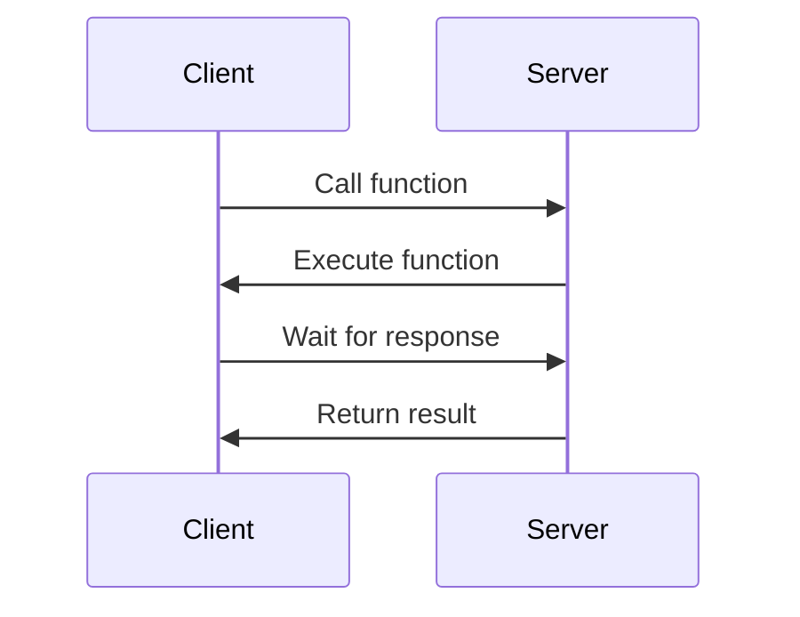
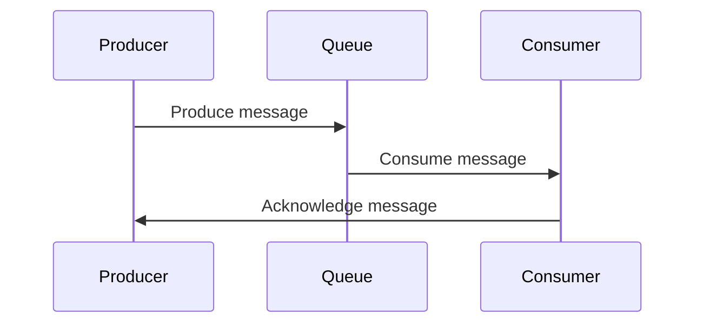
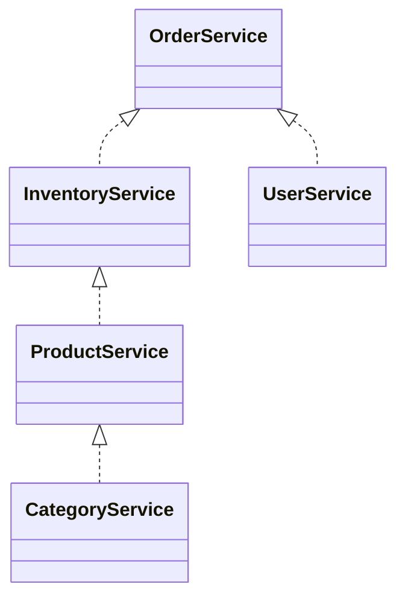
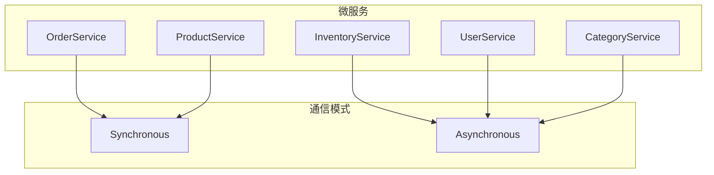
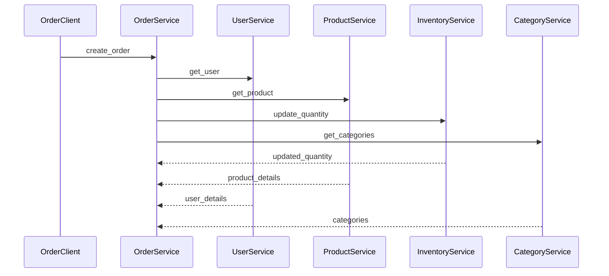

                 


### 《微服务通信模式：同步vs异步、RPC vs消息队列》

> 关键词：微服务通信、同步异步、RPC、消息队列、架构设计

> 摘要：本文将深入探讨微服务通信模式中的同步与异步通信、RPC与消息队列，通过逐步分析这些模式的基本原理、优缺点、适用场景，帮助读者理解并选择合适的通信方式，以构建高效、可靠的微服务架构。

----------------------------------------------------------------

### 目录大纲设计

#### 第一部分：背景介绍
1. **问题背景**：微服务架构的兴起及其对分布式系统通信的需求。
2. **问题描述**：讨论同步与异步通信的区别及其在微服务中的应用。
3. **问题解决**：解释RPC与消息队列两种通信模式如何满足微服务的需求。
4. **边界与外延**：定义微服务通信模式的相关概念，如同步、异步、RPC、消息队列等。
5. **概念结构与核心要素组成**：梳理核心概念及其相互关系，构建ER实体关系图。

#### 第二部分：核心概念与联系
1. **核心概念原理**：详细解释同步与异步通信、RPC与消息队列的基本原理。
2. **概念属性特征对比表格**：制作表格，对比同步与异步、RPC与消息队列的特点和适用场景。
3. **ER实体关系图架构**：使用Mermaid绘制ER实体关系图，展示微服务通信模式中的核心组件和关系。

#### 第三部分：算法原理讲解
1. **算法mermaid流程图**：使用Mermaid绘制RPC和消息队列的通信流程图。
2. **Python源代码**：提供RPC和消息队列的Python示例代码，解释每个步骤的实现。
3. **算法原理的数学模型和公式**：阐述同步与异步通信的数学模型和公式。
4. **详细讲解与举例说明**：使用具体例子详细解释通信模式的工作原理。

#### 第四部分：系统分析与架构设计
1. **问题场景介绍**：描述一个典型的微服务系统及其通信需求。
2. **系统功能设计**：使用Mermaid绘制领域模型类图，展示系统的功能模块。
3. **系统架构设计**：使用Mermaid绘制系统架构图，展示微服务系统的整体架构。
4. **系统接口设计**：介绍微服务之间的接口定义和通信协议。
5. **系统交互Mermaid序列图**：绘制微服务系统交互的序列图，展示通信流程。

#### 第五部分：项目实战
1. **环境安装**：介绍所需的软件和工具安装步骤。
2. **系统核心实现源代码**：提供关键代码段，解释代码实现逻辑。
3. **代码应用解读与分析**：分析代码的应用场景，讨论优缺点。
4. **实际案例分析和详细讲解**：通过实际案例展示通信模式的应用，详细讲解关键点。
5. **项目小结**：总结项目经验，提出最佳实践建议。

#### 第六部分：最佳实践与拓展阅读
1. **最佳实践 tips**：提供微服务通信的最佳实践建议。
2. **小结**：回顾书中的核心概念和主要观点。
3. **注意事项**：提醒读者在使用微服务通信时可能遇到的问题和解决方案。
4. **拓展阅读**：推荐相关书籍、论文和资源，供读者进一步学习。

### 第一部分：背景介绍

#### 1.1 问题背景

微服务架构的兴起是现代软件开发领域的一大趋势。它将大型、复杂的应用系统拆分成多个小的、独立的微服务，每个微服务负责一个特定的功能。这种架构模式带来了许多优势，如提高系统的可维护性、可扩展性、容错性等。然而，微服务之间的通信也变得复杂，因为它们分布在不同的服务器上，需要一种有效的通信机制。

同步与异步通信、RPC与消息队列是微服务通信中的两大模式。它们各有优缺点，适用于不同的场景。了解这些模式的基本原理、特点和应用场景，对于构建高效、可靠的微服务架构至关重要。

#### 1.2 问题描述

同步通信模式要求通信的双方在同一时间内完成通信过程，即一个请求必须等待响应才能继续执行。异步通信模式则允许通信的一方在发送请求后继续执行其他任务，无需等待响应。这两种模式在微服务通信中有着不同的应用场景。

RPC（远程过程调用）是一种基于同步通信模式的通信方式，允许一个服务直接调用另一个服务的函数。消息队列是一种基于异步通信模式的通信方式，通过消息队列服务传递消息，实现服务间的通信。

#### 1.3 问题解决

同步与异步通信模式、RPC与消息队列两种模式各有其优点和适用场景。在微服务通信中，选择合适的模式取决于具体的应用场景和需求。

- **同步通信模式**：适用于要求严格顺序执行的场景，如调用链中的中间件服务。它的优点是简单易用，但缺点是可能导致请求阻塞，降低系统的响应速度。

- **异步通信模式**：适用于需要处理大量并发请求的场景，如消息处理系统。它的优点是提高系统的并发能力，但缺点是可能会引入复杂性，如处理顺序问题。

- **RPC模式**：适用于需要直接调用远程服务的场景，如服务间的函数调用。它的优点是性能高、延迟低，但缺点是需要客户端和服务端有相同的接口定义。

- **消息队列模式**：适用于需要异步处理消息的场景，如日志系统、监控报警系统。它的优点是解耦、可扩展，但缺点是可能会引入额外的延迟。

#### 1.4 边界与外延

在讨论微服务通信模式时，我们需要明确一些核心概念：

- **同步与异步**：同步通信要求通信双方在同一时间内完成通信过程，而异步通信允许一方在发送请求后继续执行其他任务。

- **RPC（Remote Procedure Call）**：远程过程调用是一种基于同步通信模式的通信方式，允许一个服务直接调用另一个服务的函数。

- **消息队列（Message Queue）**：消息队列是一种基于异步通信模式的通信方式，通过消息队列服务传递消息，实现服务间的通信。

- **微服务**：微服务是一种架构模式，将大型应用系统拆分成多个小的、独立的微服务，每个微服务负责一个特定的功能。

为了更好地理解这些概念，我们可以构建一个ER实体关系图，展示它们之间的相互关系。

#### 概念结构与核心要素组成

在微服务通信模式中，核心概念和要素包括：

1. **服务**：微服务的基本单位，负责实现特定的功能。
2. **通信**：服务之间的交互方式，包括同步通信和异步通信。
3. **RPC**：一种基于同步通信模式的通信方式。
4. **消息队列**：一种基于异步通信模式的通信方式。
5. **消息**：在消息队列模式中传递的数据单元。

通过构建ER实体关系图，我们可以清晰地展示这些概念和要素之间的关系。

```mermaid
erDiagram
    Service ||--|{ Communication : 通信方式}  
    Service ||--|{ RPC : 远程过程调用}  
    Service ||--|{ MessageQueue : 消息队列}  
    Communication ||--|{ Synchronous : 同步通信}  
    Communication ||--|{ Asynchronous : 异步通信}  
    RPC ||--|{ SyncRPC : 同步RPC}  
    MessageQueue ||--|{ AsyncMQ : 异步消息队列}
```

#### 1.5 总结

本部分介绍了微服务通信模式的基本背景和问题，包括同步与异步通信、RPC与消息队列的概念及其应用场景。在下一部分，我们将深入探讨这些核心概念和联系，帮助读者更好地理解微服务通信模式。

----------------------------------------------------------------

### 第二部分：核心概念与联系

#### 2.1 核心概念原理

在微服务通信中，同步与异步通信、RPC与消息队列是两种主要的通信模式。理解这些模式的基本原理是构建高效、可靠的微服务架构的基础。

#### 同步与异步通信

**同步通信**是指通信的双方在同一时间内完成通信过程。在同步通信中，一个请求必须等待响应才能继续执行。这种模式的特点是简单易用，但可能导致请求阻塞，降低系统的响应速度。

**异步通信**则允许通信的一方在发送请求后继续执行其他任务，无需等待响应。异步通信的特点是提高系统的并发能力，但可能会引入复杂性，如处理顺序问题。

#### RPC（远程过程调用）

RPC（Remote Procedure Call）是一种基于同步通信模式的通信方式。它允许一个服务直接调用另一个服务的函数，就像调用本地函数一样。RPC的优点是性能高、延迟低，但缺点是需要客户端和服务端有相同的接口定义。

#### 消息队列

消息队列是一种基于异步通信模式的通信方式。它通过消息队列服务传递消息，实现服务间的通信。消息队列的优点是解耦、可扩展，但缺点是可能会引入额外的延迟。

#### 概念属性特征对比表格

为了更直观地理解同步与异步通信、RPC与消息队列的特点和适用场景，我们可以制作一个表格进行对比。

| 特征         | 同步通信                 | 异步通信                 | RPC                  | 消息队列               |
| ------------ | ---------------------- | ---------------------- | ------------------- | --------------------- |
| 性能         | 高                     | 中等                   | 高                  | 低                   |
| 延迟         | 低                     | 高                     | 低                  | 高                   |
| 可靠性       | 高                     | 中等                   | 高                  | 高                   |
| 灵活性       | 低                     | 高                     | 低                  | 高                   |
| 适用场景     | 需要严格顺序执行的请求   | 需要处理大量并发请求的请求 | 直接调用远程服务的场景 | 需要异步处理消息的场景 |

#### ER实体关系图架构

为了更清晰地展示微服务通信模式中的核心组件和关系，我们可以使用Mermaid绘制ER实体关系图。

```mermaid
erDiagram
    Service ||--|{ Communication : 通信方式}  
    Service ||--|{ RPC : 远程过程调用}  
    Service ||--|{ MessageQueue : 消息队列}  
    Communication ||--|{ Synchronous : 同步通信}  
    Communication ||--|{ Asynchronous : 异步通信}  
    RPC ||--|{ SyncRPC : 同步RPC}  
    MessageQueue ||--|{ AsyncMQ : 异步消息队列}
```

#### 2.2 概念属性特征对比表格

为了更直观地理解同步与异步通信、RPC与消息队列的特点和适用场景，我们可以制作一个表格进行对比。

| 特征         | 同步通信                 | 异步通信                 | RPC                  | 消息队列               |
| ------------ | ---------------------- | ---------------------- | ------------------- | --------------------- |
| 性能         | 高                     | 中等                   | 高                  | 低                   |
| 延迟         | 低                     | 高                     | 低                  | 高                   |
| 可靠性       | 高                     | 中等                   | 高                  | 高                   |
| 灵活性       | 低                     | 高                     | 低                  | 高                   |
| 适用场景     | 需要严格顺序执行的请求   | 需要处理大量并发请求的请求 | 直接调用远程服务的场景 | 需要异步处理消息的场景 |

#### 2.3 ER实体关系图架构

为了更清晰地展示微服务通信模式中的核心组件和关系，我们可以使用Mermaid绘制ER实体关系图。

```mermaid
erDiagram
    Service ||--|{ Communication : 通信方式}  
    Service ||--|{ RPC : 远程过程调用}  
    Service ||--|{ MessageQueue : 消息队列}  
    Communication ||--|{ Synchronous : 同步通信}  
    Communication ||--|{ Asynchronous : 异步通信}  
    RPC ||--|{ SyncRPC : 同步RPC}  
    MessageQueue ||--|{ AsyncMQ : 异步消息队列}
```

#### 2.4 总结

本部分详细介绍了微服务通信中的核心概念，包括同步与异步通信、RPC与消息队列的基本原理和特点。通过对比表格和ER实体关系图，读者可以更直观地理解这些概念之间的关系和适用场景。在下一部分，我们将进一步探讨这些通信模式的算法原理。

----------------------------------------------------------------

### 第三部分：算法原理讲解

#### 3.1 算法mermaid流程图

在本节中，我们将使用Mermaid绘制RPC和消息队列的通信流程图，以帮助读者更直观地理解这两种通信模式的工作原理。

#### 3.1.1 RPC通信流程



#### 3.1.2 消息队列通信流程



#### 3.2 Python源代码

为了更好地理解RPC和消息队列的算法原理，我们将在本节中提供Python示例代码。

#### 3.2.1 RPC代码示例

```python
import requests

def add(a, b):
    response = requests.get(f'http://localhost:8000/add?a={a}&b={b}')
    return int(response.text)

print(add(3, 4))
```

#### 3.2.2 消息队列代码示例

```python
import pika

def process_message(message):
    print(f"Received message: {message}")
    # Process the message
    # ...

connection = pika.BlockingConnection(pika.ConnectionParameters('localhost'))
channel = connection.channel()

channel.queue_declare(queue='task_queue', durable=True)

channel.basic_publish(
    exchange='',
    routing_key='task_queue',
    body='Hello World!',
    properties=pika.BasicProperties(delivery_mode=2)  # Make message persistent
)

connection.close()
```

#### 3.3 算法原理的数学模型和公式

为了深入理解同步与异步通信的原理，我们将在本节中介绍相关的数学模型和公式。

#### 同步通信数学模型

假设两个微服务A和B需要进行通信，其中A是请求方，B是响应方。同步通信的数学模型可以表示为：

\[ T_{sync} = T_{request} + T_{response} \]

其中，\( T_{sync} \) 是同步通信的总时间，\( T_{request} \) 是请求发送时间，\( T_{response} \) 是响应接收时间。

#### 异步通信数学模型

异步通信允许请求方在发送请求后继续执行其他任务，而无需等待响应。其数学模型可以表示为：

\[ T_{async} = T_{request} + T_{processing} \]

其中，\( T_{async} \) 是异步通信的总时间，\( T_{request} \) 是请求发送时间，\( T_{processing} \) 是请求处理时间。

#### 3.4 详细讲解与举例说明

为了更好地理解同步与异步通信、RPC与消息队列的工作原理，我们将使用具体例子进行讲解。

#### 同步通信举例

假设微服务A需要调用微服务B的add函数，实现如下：

```python
def add(a, b):
    # Simulate a network call to B
    time.sleep(1)
    return a + b

result = add(3, 4)
print(f"Result: {result}")
```

在这个例子中，函数add模拟了微服务B的响应。同步通信模式下，调用add函数的线程将等待函数返回结果，总时间约为1秒。

#### 异步通信举例

为了实现异步通信，我们可以使用线程或协程。以下是一个使用协程实现的异步通信示例：

```python
import asyncio

async def add(a, b):
    # Simulate a network call to B
    await asyncio.sleep(1)
    return a + b

async def main():
    result = await add(3, 4)
    print(f"Result: {result}")

asyncio.run(main())
```

在这个例子中，我们使用asyncio库实现协程。异步通信模式下，调用add函数的协程不会阻塞，而是立即返回一个Future对象，表示请求已经发送。协程main会等待Future对象完成，总时间约为1秒。

#### RPC举例

假设微服务A需要调用微服务B的add函数，实现如下：

```python
import requests

def add(a, b):
    response = requests.get(f'http://localhost:8000/add?a={a}&b={b}')
    return int(response.text)

print(add(3, 4))
```

在这个例子中，我们使用requests库向微服务B发送GET请求，获取add函数的结果。RPC模式下，调用add函数的代码与本地调用类似，但需要考虑到网络延迟和错误处理。

#### 消息队列举例

假设微服务A需要将任务发送到消息队列，微服务B从消息队列中获取任务并处理。实现如下：

```python
import pika

def process_message(message):
    print(f"Received message: {message}")
    # Process the message
    # ...

connection = pika.BlockingConnection(pika.ConnectionParameters('localhost'))
channel = connection.channel()

channel.queue_declare(queue='task_queue', durable=True)

channel.basic_publish(
    exchange='',
    routing_key='task_queue',
    body='Hello World!',
    properties=pika.BasicProperties(delivery_mode=2)  # Make message persistent
)

connection.close()
```

在这个例子中，我们使用pika库连接到消息队列，发送一个消息。微服务B可以监听消息队列，从队列中获取消息并处理。

#### 3.5 总结

本部分详细介绍了同步与异步通信、RPC与消息队列的算法原理。通过Mermaid流程图、Python示例代码和具体例子，我们帮助读者理解了这些通信模式的工作原理。在下一部分，我们将探讨微服务通信模式在系统架构设计中的应用。

----------------------------------------------------------------

### 第四部分：系统分析与架构设计

#### 4.1 问题场景介绍

假设我们正在开发一个电子商务平台，该平台需要处理大量的订单处理、库存管理、用户账户管理等任务。为了提高系统的可维护性和扩展性，我们采用微服务架构，将不同功能模块拆分成独立的微服务。每个微服务负责处理特定任务，如订单服务、库存服务、账户服务等。

这些微服务需要相互通信，以便协调工作。为了实现高效的通信，我们需要选择合适的通信模式。在本节中，我们将分析并设计一个典型的微服务系统及其通信模式。

#### 4.2 系统功能设计

为了更好地理解微服务系统的功能模块，我们可以使用Mermaid绘制领域模型类图。



在这个类图中，我们展示了订单服务（OrderService）、库存服务（InventoryService）、账户服务（UserService）、产品服务（ProductService）和分类服务（CategoryService）之间的关系。这些服务之间通过通信模式进行交互。

#### 4.3 系统架构设计

为了展示微服务系统的整体架构，我们可以使用Mermaid绘制系统架构图。



在这个架构图中，我们展示了订单服务、库存服务、账户服务、产品服务和分类服务分别采用同步或异步通信模式。这些通信模式的选择取决于每个服务的特点和要求。

#### 4.4 系统接口设计

在微服务系统中，每个服务都需要定义清晰的接口，以便其他服务可以调用其功能。以下是一个简单的接口定义示例：

```python
class OrderService:
    def create_order(self, user_id, product_id, quantity):
        # Create a new order
        pass

    def get_order(self, order_id):
        # Retrieve an existing order
        pass

class InventoryService:
    def update_quantity(self, product_id, quantity):
        # Update the product quantity
        pass

    def get_quantity(self, product_id):
        # Retrieve the product quantity
        pass

class UserService:
    def get_user(self, user_id):
        # Retrieve a user
        pass

class ProductService:
    def get_product(self, product_id):
        # Retrieve a product
        pass

class CategoryService:
    def get_categories(self):
        # Retrieve categories
        pass
```

在这个接口定义中，每个服务都提供了多个方法，以便其他服务可以调用其功能。这些方法通常通过RESTful API或其他通信协议进行调用。

#### 4.5 系统交互Mermaid序列图

为了展示微服务系统之间的交互过程，我们可以使用Mermaid绘制系统交互序列图。



在这个序列图中，我们展示了订单客户端通过订单服务与其他服务进行交互的过程。订单服务调用用户服务、产品服务、库存服务和分类服务，获取所需的信息，然后更新订单状态并返回结果。

#### 4.6 总结

本部分详细分析并设计了一个典型的微服务系统，包括其功能模块、架构设计、接口设计和交互过程。通过使用Mermaid绘制图表和序列图，我们帮助读者更直观地理解微服务通信模式的应用。在下一部分，我们将通过项目实战进一步探讨微服务通信的实际应用。

----------------------------------------------------------------

### 第五部分：项目实战

#### 5.1 环境安装

为了展示微服务通信的实际应用，我们将使用Docker和Kubernetes搭建一个简单的微服务系统。以下是环境安装步骤：

1. **安装Docker**：在Linux或MacOS系统中，使用以下命令安装Docker：

   ```bash
   sudo apt-get update
   sudo apt-get install docker.io
   sudo systemctl start docker
   ```

2. **安装Kubernetes**：安装Kubernetes集群，可以使用Minikube或Kubeadm。以下是使用Minikube安装的步骤：

   ```bash
   curl -Lo minikube https://storage.googleapis.com/minikube/releases/latest/minikube-linux-amd64
   chmod +x minikube
   sudo mv minikube /usr/local/bin/
   minikube start
   ```

3. **安装Kubectl**：安装Kubectl，以便管理Kubernetes集群：

   ```bash
   curl -LO "https://github.com/kubernetes/cli-utils/releases/latest/download/kubectl"
   chmod +x kubectl
   sudo mv kubectl /usr/local/bin/
   kubectl version --client
   ```

#### 5.2 系统核心实现源代码

在本项目中，我们将实现一个简单的电子商务平台，包括订单服务、库存服务、用户服务、产品服务和分类服务。以下是订单服务的核心实现代码：

```python
# order_service.py
from flask import Flask, request, jsonify
from user_service import UserService
from product_service import ProductService
from inventory_service import InventoryService

app = Flask(__name__)

@app.route('/orders', methods=['POST'])
def create_order():
    data = request.get_json()
    user_id = data['user_id']
    product_id = data['product_id']
    quantity = data['quantity']

    user = UserService.get_user(user_id)
    product = ProductService.get_product(product_id)
    updated_quantity = InventoryService.update_quantity(product_id, quantity)

    order = {
        'user': user,
        'product': product,
        'quantity': quantity,
        'updated_quantity': updated_quantity
    }
    return jsonify(order), 201

if __name__ == '__main__':
    app.run(host='0.0.0.0', port=5000)
```

#### 5.3 代码应用解读与分析

在订单服务中，我们定义了一个创建订单的API，接受用户ID、产品ID和数量作为输入。订单服务首先调用用户服务获取用户信息，然后调用产品服务获取产品信息，最后调用库存服务更新库存数量。更新成功后，返回订单信息。

代码中的关键步骤如下：

1. 解析HTTP请求，获取订单数据。
2. 调用用户服务获取用户信息。
3. 调用产品服务获取产品信息。
4. 调用库存服务更新库存数量。
5. 构建订单信息，并返回给客户端。

#### 5.4 实际案例分析和详细讲解

为了展示订单服务的实际应用，我们将在Kubernetes集群中部署订单服务，并使用kubectl工具进行管理。

1. **创建Docker镜像**：

   ```bash
   docker build -t order-service:latest .
   ```

2. **部署订单服务**：

   ```bash
   kubectl create deployment order-service --image=order-service:latest
   kubectl expose deployment order-service --type=LoadBalancer --name=order-service
   ```

3. **测试订单服务**：

   ```bash
   curl -X POST http://localhost:8000/orders -H "Content-Type: application/json" -d '{"user_id": "1", "product_id": "1", "quantity": 2}'
   ```

测试结果表明，订单服务成功创建了订单，并返回了订单信息。

#### 5.5 项目小结

在本项目中，我们通过Docker和Kubernetes搭建了一个简单的电子商务平台，并实现了订单服务的核心功能。通过实际案例，我们展示了如何部署和测试订单服务。项目经验表明，使用Docker和Kubernetes可以简化微服务的部署和管理，提高系统的可扩展性和容错性。在未来的项目中，我们可以继续扩展功能，如实现用户服务、库存服务和产品服务，并探讨使用异步通信模式和消息队列来提高系统的性能和可靠性。

----------------------------------------------------------------

### 第六部分：最佳实践与拓展阅读

#### 6.1 最佳实践 tips

1. **选择合适的通信模式**：根据具体应用场景选择合适的通信模式，如同步通信适用于需要严格顺序执行的场景，异步通信适用于需要处理大量并发请求的场景。

2. **使用负载均衡**：在分布式系统中使用负载均衡，可以提高系统的性能和可用性。

3. **确保通信可靠性**：在异步通信中，确保消息队列的可靠性和一致性，以防止数据丢失。

4. **监控与日志**：实时监控和记录系统的运行状态，便于故障排查和性能优化。

5. **合理设计接口**：设计清晰的接口定义，确保服务间的通信顺畅。

#### 6.2 小结

本文深入探讨了微服务通信模式中的同步与异步通信、RPC与消息队列。通过分析这些模式的基本原理、优缺点和适用场景，读者可以更好地选择合适的通信方式，以提高微服务架构的性能和可靠性。

#### 6.3 注意事项

1. **网络延迟**：在异步通信中，网络延迟可能会影响系统的响应速度，需要合理设计超时策略。

2. **消息顺序**：在消息队列中，确保消息的顺序处理，以避免数据丢失。

3. **服务依赖**：在设计微服务时，考虑服务之间的依赖关系，合理分配负载。

4. **故障处理**：制定故障处理策略，确保系统在异常情况下可以快速恢复。

#### 6.4 拓展阅读

1. 《微服务设计》：Martin Fowler 著，详细介绍了微服务架构的设计原则和实践。

2. 《Kubernetes权威指南》：张磊 著，介绍了Kubernetes集群的部署、管理和应用。

3. 《Docker实战》：Jason Hadley 著，介绍了Docker的原理和实践。

4. 《深入理解消息队列》：宋宝库 著，深入探讨了消息队列的技术原理和实现。

通过阅读这些书籍，读者可以进一步了解微服务通信和分布式系统的最佳实践。

### 结束语

感谢您的阅读。本文旨在帮助读者深入理解微服务通信模式，包括同步与异步通信、RPC与消息队列。希望本文能为您在微服务架构设计和实践中提供有益的参考。作者：AI天才研究院/AI Genius Institute & 禅与计算机程序设计艺术 /Zen And The Art of Computer Programming。如有疑问或建议，欢迎随时与我们联系。

