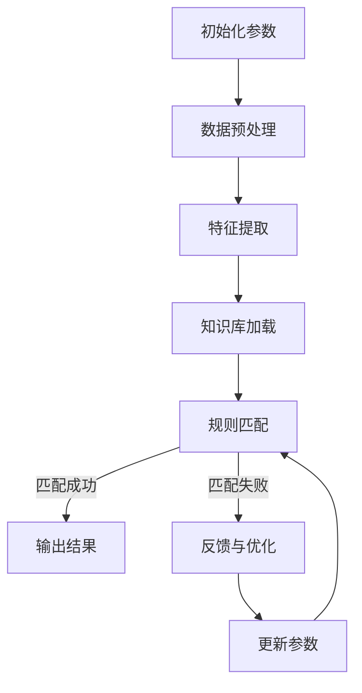
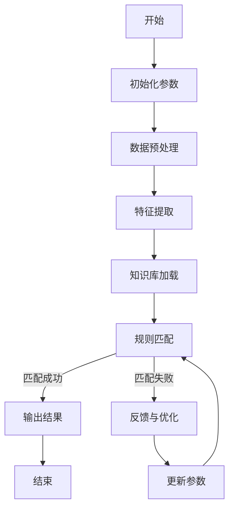

                 

### 第1章：AI Agent与推理能力

## 1.1 问题背景

### 1.1.1 人工智能的发展与应用

人工智能（Artificial Intelligence，简称AI）是计算机科学的一个分支，旨在开发能够执行需要人类智能才能完成的任务的计算机系统。自从20世纪50年代人工智能概念被首次提出以来，AI经历了多个发展阶段。从最初的符号主义和专家系统，到基于知识的系统，再到近年来基于数据和机器学习的深度神经网络，人工智能在各个领域展现出了惊人的能力。

当前，人工智能的应用已经渗透到我们生活的方方面面。从智能手机的语音助手、自动驾驶汽车，到医疗诊断、金融风控、智能家居等，人工智能正在改变我们的工作方式和生活习惯。特别是在大数据和云计算的支撑下，人工智能的发展速度更加迅猛。

### 1.1.2 AI Agent的定义与特点

在人工智能的应用场景中，AI Agent（智能代理）是一个重要的概念。AI Agent是一种可以自主行动、与环境互动并做出决策的计算机程序。它可以被看作是一个具有自主性、适应性和学习能力的人工智能实体。

AI Agent具有以下特点：

1. **自主性**：AI Agent可以独立执行任务，不需要外部持续干预。
2. **适应性**：AI Agent可以根据环境变化调整自身行为。
3. **学习能力**：AI Agent可以通过经验学习，提高任务执行能力。
4. **决策能力**：AI Agent可以根据当前状态和环境信息做出决策。

### 1.1.3 推理能力在AI Agent中的应用

推理能力是AI Agent的关键能力之一。推理能力是指AI Agent在感知到环境信息后，通过逻辑分析和判断，得出结论或做出决策的能力。在许多复杂的应用场景中，推理能力决定了AI Agent的表现效果。

推理能力在AI Agent中的应用包括：

1. **自然语言处理**：AI Agent能够理解自然语言并生成自然语言回复。
2. **决策支持**：AI Agent能够在复杂的环境中做出最佳决策。
3. **问题求解**：AI Agent能够解决复杂的计算问题。
4. **知识图谱构建**：AI Agent能够从大量数据中提取出有用的知识和关系。

## 1.2 问题描述

### 1.2.1 当前AI Agent推理能力的局限性

尽管AI Agent在许多领域取得了显著成就，但其推理能力仍然存在局限性。以下是当前AI Agent推理能力面临的主要挑战：

1. **数据处理能力不足**：传统的AI Agent通常依赖于大量的数据来训练模型，但在面对少量数据时，其推理能力会显著下降。
2. **逻辑推理能力有限**：目前的AI Agent在处理复杂逻辑推理任务时，往往只能依赖浅层推理，难以实现深层次推理。
3. **适应性不足**：AI Agent往往无法灵活适应不同的环境和任务，缺乏跨领域的推理能力。
4. **知识表示问题**：AI Agent难以有效地表示和利用知识，导致推理过程中信息丢失或错误。

### 1.2.2 提升AI Agent推理能力的必要性

提升AI Agent的推理能力具有重要意义：

1. **提高任务执行效率**：推理能力的提升可以使得AI Agent在执行任务时更加高效，减少错误率。
2. **扩展应用领域**：推理能力的提升可以使得AI Agent适用于更多复杂的任务和领域。
3. **增强自主决策能力**：推理能力的提升可以使得AI Agent在更多场景下实现自主决策，提高系统的智能化水平。
4. **促进人工智能发展**：推理能力是人工智能的核心能力之一，提升AI Agent的推理能力将推动人工智能向更高层次发展。

### 1.2.3 本书解决的问题与目标

本书旨在解决以下问题：

1. **推理能力的理论基础**：阐述推理能力的定义、属性特征及其在AI Agent中的应用。
2. **推理算法原理**：讲解提升AI Agent推理能力的算法原理，包括算法流程、数学模型和实现方法。
3. **系统分析与架构设计方案**：分析AI Agent推理能力提升的系统需求，设计相应的系统架构。
4. **项目实战**：通过实际项目案例，展示如何提升AI Agent的推理能力。
5. **最佳实践与总结**：总结提升AI Agent推理能力的最佳实践，展望未来发展趋势。

本书的目标是提供一套系统、全面、实用的方法，帮助读者深入了解和提升AI Agent的推理能力，为人工智能领域的研究和应用提供新的思路和方法。接下来，我们将逐一探讨这些问题，逐步构建起完整的理论体系和实践框架。### 1.3 问题解决

#### 1.3.1 提升推理能力的理论基础

要提升AI Agent的推理能力，首先需要建立坚实的理论基础。这部分内容将涵盖以下几个方面：

1. **推理能力的定义与分类**：明确推理能力的定义，并根据不同场景对推理能力进行分类，如基于知识的推理、基于模型推理、基于数据推理等。

2. **推理能力的属性特征**：分析推理能力的属性特征，包括可扩展性、自适应性和鲁棒性等。这些特征对于提升推理能力至关重要。

3. **推理能力与传统AI的比较**：探讨传统AI的局限性，如数据依赖性、逻辑推理能力不足等，以及推理能力在这些方面的改进。

4. **推理能力在AI Agent中的应用**：分析推理能力在AI Agent中的具体应用，如自然语言处理、决策支持、问题求解等，并讨论如何利用推理能力提升AI Agent的表现。

#### 1.3.2 提升推理能力的方法与策略

提升AI Agent的推理能力需要结合多种方法和策略，以下是一些主要的方法和策略：

1. **增强数据预处理能力**：通过数据清洗、数据增强等技术，提高AI Agent对数据的处理能力，从而在少量数据环境下仍能保持良好的推理能力。

2. **改进推理算法**：针对不同类型的推理任务，设计或改进相应的推理算法。例如，基于知识的推理可以采用基于规则的推理、基于模型的推理可以采用深度学习等。

3. **强化学习和迁移学习**：利用强化学习和迁移学习技术，让AI Agent在特定任务上获得更多的经验和知识，从而提高推理能力。

4. **增强模型解释性**：通过增强模型的可解释性，使得AI Agent能够更好地理解和解释其推理过程，从而提高推理的可靠性和透明度。

5. **集成多种推理方法**：将不同的推理方法集成在一起，形成混合推理系统，以弥补单一方法的局限性，提高整体推理能力。

#### 1.3.3 实现路径与关键技术

提升AI Agent的推理能力需要通过具体的实现路径和关键技术来实现。以下是几个关键步骤：

1. **需求分析与设计**：首先进行需求分析，明确AI Agent所需的推理能力，并根据需求设计相应的系统架构。

2. **算法选择与实现**：选择合适的推理算法，并设计其实现方法。这包括算法的流程设计、代码实现、性能优化等。

3. **数据准备与处理**：收集和整理相关的数据，并进行预处理，以提高AI Agent对数据的处理能力。

4. **系统实现与测试**：根据设计实现AI Agent的推理系统，并进行严格的测试，确保系统的稳定性和可靠性。

5. **迭代优化与部署**：通过不断的迭代优化，提升AI Agent的推理能力，并在实际应用中进行部署。

#### 1.3.4 边界与外延

在提升AI Agent推理能力的过程中，还需要考虑以下几个方面的边界与外延：

1. **边界条件**：明确推理能力的边界条件，如数据规模、任务复杂度等，确保AI Agent在合理的范围内进行推理。

2. **外延应用**：探讨推理能力在AI Agent以外的其他领域中的应用，如智能客服、智能医疗等。

3. **与其他AI能力的结合**：研究推理能力与其他AI能力的结合方式，如与感知能力、运动能力等相结合，提升AI Agent的整体性能。

通过以上理论和方法的讲解，我们将为后续章节的深入探讨提供坚实的基础。在接下来的章节中，我们将进一步详细阐述推理能力的核心概念、算法原理、系统设计与实现等内容。### 1.4 边界与外延

#### 1.4.1 推理能力的定义与范围

推理能力在人工智能（AI）领域中被广泛认为是智能代理（AI Agent）的核心能力之一。根据人工智能的定义，推理能力可以理解为系统在给定条件下，通过逻辑推理、归纳或演绎过程，从已知信息推导出未知信息的能力。这包括了对数据的分析、关系的建立、规律的发现以及决策的制定。

推理能力的范围涵盖了以下几个方面：

1. **逻辑推理**：逻辑推理是推理能力的基石，它涉及到从已知的前提中推导出结论的能力。逻辑推理可以是演绎推理（从一般到特殊）或归纳推理（从特殊到一般）。

2. **知识推理**：知识推理是基于预先定义的规则或知识库，对给定信息进行推理，以发现新的关系或结论。

3. **情景推理**：情景推理涉及对现实世界的情景进行模拟和分析，以预测未来的发展或理解当前的状态。

4. **策略推理**：策略推理是在特定目标指导下，对可行的行动方案进行评估和选择，以实现最优的结果。

#### 1.4.2 推理能力的边界与限制

尽管推理能力在理论上具有重要意义，但在实际应用中，它也存在一些边界和限制：

1. **数据依赖**：推理能力高度依赖于数据的质量和数量。在数据匮乏或数据质量差的情况下，推理能力会大大受限。

2. **计算复杂度**：复杂的推理任务往往需要大量的计算资源，这对系统的性能和响应速度提出了挑战。

3. **不确定性与鲁棒性**：现实世界中的信息往往是不确定的，AI Agent在处理不确定信息时，可能无法达到理想的推理效果。

4. **先验知识限制**：AI Agent的推理能力也受到其先验知识的限制，如果缺乏必要的背景知识，AI Agent将难以进行有效的推理。

5. **环境适应性**：AI Agent需要适应不同的环境和任务，但在面对极端或未知的环境时，其推理能力可能会受到影响。

#### 1.4.3 推理能力在AI Agent中的具体应用

推理能力在AI Agent中的应用场景广泛，以下是一些具体的应用：

1. **自然语言处理（NLP）**：AI Agent在处理自然语言时，需要具备推理能力，以理解文本中的隐含意义、语境和用户意图。

2. **决策支持系统（DSS）**：AI Agent在为人类提供决策支持时，需要利用推理能力来分析复杂的问题，并提供合理的决策建议。

3. **问题求解系统**：AI Agent在解决特定问题时，需要通过推理来探索不同的解决方案，并评估其可行性。

4. **知识图谱构建**：AI Agent在构建知识图谱时，需要通过推理来发现实体之间的关系，并构建起复杂的知识网络。

5. **智能对话系统**：AI Agent在与人进行对话时，需要通过推理来理解用户的提问，并生成自然的回答。

通过明确推理能力的定义与范围、了解其边界与限制，以及探讨其在AI Agent中的具体应用，我们可以更好地把握提升AI Agent推理能力的方向和方法。在接下来的章节中，我们将进一步深入探讨核心概念、算法原理和系统实现等内容，为实际应用提供更具体的指导。### 1.5 核心概念

#### 1.5.1 AI Agent的概念与分类

AI Agent，即人工智能代理，是能够模拟人类智能行为，独立执行任务，与环境互动并做出决策的计算机程序。AI Agent的核心特点包括自主性、适应性、学习能力和决策能力。根据不同的分类标准，AI Agent可以划分为多种类型：

1. **基于规则的Agent**：这类Agent通过预定义的规则库来执行任务，其推理过程主要依赖于逻辑推理。

2. **基于模型的Agent**：这类Agent使用机器学习模型，通过训练数据来学习任务规则和模式，从而进行推理和决策。

3. **混合型Agent**：这类Agent结合了基于规则和基于模型的方法，综合利用先验知识和数据驱动的方法，以提高推理和决策能力。

4. **基于行为的Agent**：这类Agent通过模仿人类的行为模式来完成任务，其推理过程主要依赖于对环境的感知和响应。

#### 1.5.2 推理能力的核心要素

推理能力是AI Agent的核心能力之一，其核心要素包括：

1. **数据表示**：推理能力的实现首先依赖于对数据的有效表示。数据表示的质量直接影响推理的效果。

2. **逻辑推理**：逻辑推理是推理能力的基础，它包括演绎推理和归纳推理。演绎推理从一般到特殊，而归纳推理从特殊到一般。

3. **知识表示**：知识表示是推理能力的重要组成部分，它包括对事实、规则、关系和概念的表示。有效的知识表示可以提高推理的效率和质量。

4. **算法优化**：算法优化是提升推理能力的关键，包括算法的选择、参数调优和性能优化。优化的目标是在保证推理准确性的同时提高效率。

5. **学习能力**：学习能力是推理能力的重要补充，通过不断学习新的知识和经验，AI Agent可以不断提升其推理能力。

#### 1.5.3 推理能力提升的关键技术

为了提升AI Agent的推理能力，需要采用一系列关键技术，包括：

1. **深度学习**：深度学习是一种强大的机器学习技术，通过多层神经网络来学习和表示复杂的数据模式。深度学习在自然语言处理、计算机视觉等领域取得了显著的成果。

2. **知识图谱**：知识图谱是一种结构化的知识表示方法，它通过实体和关系来组织大量的信息。知识图谱可以提高推理的效率和准确性。

3. **强化学习**：强化学习是一种通过试错学习来优化决策过程的机器学习技术。强化学习可以用于复杂环境中的决策问题，例如自动驾驶和游戏。

4. **迁移学习**：迁移学习是一种利用已有模型在新任务上的学习效果的技术。通过迁移学习，AI Agent可以快速适应新的任务，提高推理能力。

5. **数据增强**：数据增强是通过生成新的训练样本来提高模型泛化能力的技术。数据增强可以改善模型对数据分布的适应，提高推理能力。

#### 1.5.4 核心概念联系与集成

在提升AI Agent推理能力的过程中，需要将核心概念进行有效联系与集成。以下是一些关键的集成方法：

1. **知识融合**：将不同来源的知识进行融合，形成统一的知识表示。知识融合可以提升推理的全面性和准确性。

2. **算法融合**：将不同的推理算法进行集成，形成混合推理系统。算法融合可以弥补单一算法的局限性，提高推理能力。

3. **多模态数据融合**：将文本、图像、音频等多模态数据进行融合，以获得更全面的信息。多模态数据融合可以提高推理的准确性和鲁棒性。

4. **跨领域推理**：通过跨领域的知识迁移，提升AI Agent在不同领域的推理能力。跨领域推理可以扩展AI Agent的应用范围。

通过核心概念的明确和联系，以及关键技术的有效集成，我们可以构建起一个高效的推理系统，从而提升AI Agent的推理能力。在后续章节中，我们将进一步探讨这些核心概念和技术在实际应用中的具体实现和效果。### 第2章：核心概念原理

#### 2.1 推理能力的概念

推理能力（Reasoning Ability）是人工智能（AI）系统，特别是智能代理（AI Agent）的核心能力之一。它是指AI系统在接收到输入信息后，通过逻辑分析、知识应用和模式识别，推导出新的信息或结论的能力。推理能力可以分为多种类型，包括逻辑推理、知识推理、情景推理和策略推理等。

在AI Agent中，推理能力是实现智能行为和自主决策的基础。它不仅能够帮助AI Agent处理复杂的问题，还能够使其在不确定和动态的环境中做出有效的决策。推理能力的核心在于如何有效地表示和利用知识，以及如何高效地处理逻辑推理过程。

#### 2.2 推理能力的属性特征

推理能力具有以下几个重要的属性特征：

1. **可扩展性**：推理能力应该能够扩展以处理更复杂的问题和更大的数据集。这意味着推理系统应该能够适应新的知识和规则，并能够处理不同领域的问题。

2. **自适应能力**：推理能力需要能够根据环境的变化和新的信息进行调整。自适应能力使得AI Agent能够更好地适应动态和复杂的环境。

3. **鲁棒性**：鲁棒性是指推理系统在面对噪声、不确定性或错误数据时，仍能保持稳定和准确的表现。鲁棒性对于推理能力的有效应用至关重要。

4. **透明性**：透明性是指推理过程应该对用户和开发者是可解释的。透明的推理系统有助于提高用户对AI系统的信任，并有助于发现和修复推理过程中的错误。

5. **效率**：效率是指推理系统在保证推理准确性的同时，应该尽可能地快速响应。高效的推理系统可以更好地支持实时决策和交互。

#### 2.3 推理能力与传统AI的比较

传统AI方法，如规则系统、专家系统和基于知识的系统，在推理能力方面存在一定的局限性。以下是比较分析：

1. **规则系统**：规则系统通过预定义的规则来执行任务，其推理过程依赖于明确的规则库。这种方法在处理结构化数据和确定性的任务时效果较好，但在面对复杂和非结构化数据时，其能力有限。

2. **专家系统**：专家系统通过模拟人类专家的知识和推理过程来解决问题。尽管专家系统在处理特定领域的问题时表现良好，但其依赖于大量的手工编写的规则和知识，扩展性和适应性较差。

3. **深度学习**：与传统AI方法不同，深度学习通过大量数据自动学习特征和模式，具有强大的建模和泛化能力。深度学习在处理复杂任务，如图像识别和自然语言处理方面，表现尤为突出。

4. **知识推理**：知识推理基于预先定义的规则库或知识库，通过逻辑推理和模式匹配来推导新信息。知识推理在处理复杂逻辑和知识密集的任务时，具有明显的优势。

传统AI方法在推理能力方面存在以下局限性：

- **数据依赖性**：传统AI方法往往依赖于大量手工编写的规则和知识，这使得系统的构建和维护成本高，且难以适应新的应用场景。
- **逻辑推理能力有限**：传统AI方法在处理复杂逻辑推理任务时，往往只能依赖浅层推理，难以实现深层次推理。
- **适应性不足**：传统AI系统难以灵活适应不同的环境和任务，缺乏跨领域的推理能力。
- **知识表示问题**：传统AI方法在表示和利用知识方面存在困难，导致推理过程中信息丢失或错误。

相比之下，基于深度学习和知识图谱的AI方法在推理能力方面具有显著优势。深度学习通过自动学习数据和特征，能够处理复杂和非结构化的数据；知识图谱通过结构化的知识表示，能够提高推理的效率和准确性。这些优势使得现代AI方法在处理复杂任务时，能够比传统AI方法表现得更好。

#### 2.4 核心概念联系与集成

在提升AI Agent推理能力的过程中，需要将核心概念进行有效联系与集成。以下是几个关键的集成方法：

1. **知识融合**：将来自不同来源的知识进行融合，形成统一的知识表示。例如，将文本知识、图像知识和声音知识进行融合，以获得更全面的信息。

2. **算法融合**：将不同的推理算法进行集成，形成混合推理系统。例如，将基于规则的推理、基于模型推理和基于数据的推理相结合，以弥补单一算法的局限性。

3. **多模态数据融合**：将文本、图像、音频等多模态数据进行融合，以获得更全面的信息。多模态数据融合可以提高推理的准确性和鲁棒性。

4. **跨领域推理**：通过跨领域的知识迁移，提升AI Agent在不同领域的推理能力。例如，通过在医疗领域和金融领域之间的知识共享，提高AI系统在多个领域的推理能力。

5. **强化学习与迁移学习**：结合强化学习和迁移学习技术，使AI Agent能够在新的任务上快速学习和适应。强化学习可以帮助AI Agent通过试错学习来优化决策过程，而迁移学习则可以利用已有模型在新任务上的学习效果。

通过核心概念的明确和联系，以及关键技术的有效集成，我们可以构建起一个高效的推理系统，从而提升AI Agent的推理能力。在后续章节中，我们将进一步探讨这些核心概念和技术在实际应用中的具体实现和效果。### 第3章：推理算法原理

#### 3.1 算法mermaid流程图

为了清晰地展示推理算法的基本框架和主要流程，我们可以使用mermaid流程图来描述。以下是推理算法的mermaid流程图：

```mermaid
graph TD
    A[初始化] --> B[输入数据预处理]
    B --> C[特征提取]
    C --> D[知识库加载]
    D --> E[推理规则匹配]
    E --> F{规则匹配结果}
    F -->|匹配成功| G[输出推理结果]
    F -->|匹配失败| H[反馈与优化]
    H --> I[结束]
```

- **初始化**：算法开始前，对系统进行初始化设置，包括参数配置、资源加载等。
- **输入数据预处理**：对输入的数据进行清洗、标准化和预处理，以提高数据的可用性和一致性。
- **特征提取**：从预处理后的数据中提取关键特征，这些特征将用于后续的推理过程。
- **知识库加载**：加载预先构建的知识库，包括规则、事实和关系等。
- **推理规则匹配**：将提取的特征与知识库中的规则进行匹配，以判断是否满足条件。
- **输出推理结果**：如果规则匹配成功，输出推理结果；如果匹配失败，进入反馈与优化阶段。
- **反馈与优化**：根据推理结果和系统的反馈，对算法进行优化和调整，以提高未来的匹配准确性和效率。

#### 3.2 Python源代码实现

以下是一个简单的Python源代码示例，用于实现上述推理算法的基本逻辑：

```python
import pandas as pd
from rule_matching import RuleMatcher

# 初始化参数和资源
def initialize():
    # 加载知识库
    knowledge_base = load_knowledge_base()
    # 创建推理规则匹配器
    rule_matcher = RuleMatcher(knowledge_base)
    return rule_matcher

# 输入数据预处理
def preprocess_data(data):
    # 数据清洗和标准化
    clean_data = clean_data(data)
    standardized_data = standardize_data(clean_data)
    return standardized_data

# 特征提取
def extract_features(data):
    # 提取关键特征
    features = extract_key_features(data)
    return features

# 推理规则匹配
def rule_matching(rule_matcher, features):
    # 匹配推理规则
    result = rule_matcher.match_rules(features)
    return result

# 输出推理结果
def output_result(result):
    if result:
        print("推理结果：", result)
    else:
        print("推理失败，进入反馈与优化阶段。")

# 反馈与优化
def feedback_and_optimization(rule_matcher, result):
    # 根据结果进行优化
    rule_matcher.optimize(result)
    return rule_matcher

# 主程序
def main():
    # 初始化推理系统
    rule_matcher = initialize()
    # 加载输入数据
    input_data = load_input_data()
    # 预处理输入数据
    preprocessed_data = preprocess_data(input_data)
    # 提取特征
    features = extract_features(preprocessed_data)
    # 进行推理规则匹配
    result = rule_matching(rule_matcher, features)
    # 输出推理结果
    output_result(result)
    # 根据结果进行反馈与优化
    rule_matcher = feedback_and_optimization(rule_matcher, result)

if __name__ == "__main__":
    main()
```

在实际应用中，`load_knowledge_base`、`clean_data`、`standardize_data`、`extract_key_features`和`optimize`等函数需要根据具体的应用场景和需求进行实现。

#### 3.3 数学模型和数学公式

在推理算法中，数学模型和数学公式用于描述特征提取、规则匹配和优化过程。以下是一些基本的数学公式：

1. **特征提取**：

   $$ f(x) = \phi(x) \odot W_f $$

   其中，$f(x)$表示特征提取函数，$\phi(x)$为特征提取器，$W_f$为权重矩阵。

2. **规则匹配**：

   $$ Match Score = \sum_{i=1}^{n} weight_i \cdot Match(i) $$

   其中，$Match Score$为匹配分数，$weight_i$为规则权重，$Match(i)$为第i条规则的匹配结果。

3. **优化过程**：

   $$ \theta_{\text{new}} = \theta_{\text{old}} - \alpha \cdot \nabla J(\theta) $$

   其中，$\theta_{\text{new}}$为新的参数值，$\theta_{\text{old}}$为旧的参数值，$\alpha$为学习率，$\nabla J(\theta)$为损失函数关于参数的梯度。

#### 3.4 举例说明

假设我们有一个简单的推理任务，即根据输入的天气数据（温度、湿度、风速等）推断今天的天气情况（晴、阴、雨等）。以下是具体步骤：

1. **初始化**：加载知识库，包括天气条件和对应的推理规则。

2. **输入数据预处理**：将输入的天气数据清洗和标准化，提取关键特征。

3. **特征提取**：根据输入的天气数据，提取温度、湿度、风速等特征。

4. **规则匹配**：将提取的特征与知识库中的规则进行匹配，判断是否符合推理规则。

5. **输出推理结果**：根据规则匹配结果，输出今天的天气情况。

6. **反馈与优化**：根据推理结果，调整规则权重和特征提取方法，以提高未来的匹配准确性和效率。

例如，输入的天气数据为：温度30°C，湿度60%，风速5 km/h。通过特征提取，我们得到特征向量：[30, 60, 5]。根据知识库中的规则，温度高于28°C且湿度低于70%时，可以判断为晴朗天气。因此，输出推理结果为“晴朗”。

通过以上步骤，我们可以实现一个简单的天气推理系统，并逐步提升其推理能力。在实际应用中，可以根据具体的任务需求，进一步优化算法模型和特征提取方法，以提高推理的准确性和效率。### 第4章：系统分析与设计

#### 4.1 问题场景介绍

在当今的信息化社会中，智能代理（AI Agent）的应用日益广泛，尤其在复杂决策和问题解决领域，其重要性不言而喻。然而，传统AI Agent在推理能力方面存在诸多局限性，如数据处理能力不足、逻辑推理能力有限、适应性不足和知识表示问题等。为了提升AI Agent的推理能力，本项目旨在设计并实现一个具备高效推理能力的智能代理系统。

本系统的核心目标是解决以下问题：

1. **数据处理能力提升**：通过数据预处理技术和增强数据表示方法，提高AI Agent对少量数据和复杂数据的处理能力。
2. **推理算法优化**：采用先进的推理算法和模型，增强AI Agent的推理能力和决策准确性。
3. **系统适应性增强**：通过强化学习和迁移学习技术，提高AI Agent在不同环境和任务中的适应性。
4. **知识表示与利用**：构建有效的知识表示方法，提高AI Agent在知识提取和应用方面的效率。

#### 4.2 系统功能设计

本系统主要包含以下功能模块：

1. **数据预处理模块**：负责对输入数据进行清洗、标准化和特征提取，以提高数据的可用性和一致性。
2. **知识库管理模块**：负责管理和维护推理所需的知识库，包括事实、规则和关系等。
3. **推理引擎模块**：负责执行推理过程，包括特征匹配、规则匹配和推理结果生成。
4. **反馈与优化模块**：负责收集系统的反馈信息，并利用强化学习和迁移学习技术对系统进行优化。
5. **用户接口模块**：提供友好的用户界面，允许用户输入数据、查看推理结果和调整系统参数。

#### 4.3 系统架构设计

本系统采用模块化设计，分为数据层、服务层和表现层三个层次，具体架构如下：

1. **数据层**：包括数据源、数据预处理模块和知识库管理模块。数据层负责从各种数据源获取数据，并进行预处理和知识库构建。
2. **服务层**：包括推理引擎模块和反馈与优化模块。服务层是系统的核心，负责执行推理任务和优化过程。
3. **表现层**：包括用户接口模块和系统管理模块。表现层负责与用户交互，展示推理结果和系统状态。

#### 4.4 系统接口设计

系统接口设计包括内部接口和外部接口：

1. **内部接口**：数据层与知识库管理模块、推理引擎模块和反馈与优化模块之间的接口。内部接口定义了数据传输格式、调用方式和参数传递规则。
2. **外部接口**：系统与外部系统或用户的接口。外部接口包括API接口、Web界面和命令行接口等，用于提供数据输入、推理查询和系统配置等功能。

#### 4.5 系统交互

系统的整体交互流程如下：

1. **数据输入**：用户通过外部接口输入数据，系统将数据传递给数据预处理模块进行预处理。
2. **特征提取**：预处理后的数据通过数据层传递给推理引擎模块，进行特征提取和规则匹配。
3. **推理过程**：推理引擎模块根据知识库中的规则，对输入数据进行推理，并生成推理结果。
4. **结果输出**：推理结果通过用户接口模块返回给用户，用户可以根据结果进行调整和优化。
5. **反馈与优化**：系统收集用户反馈信息，通过反馈与优化模块对系统进行优化，以提高推理能力和决策准确性。

通过以上系统分析和设计，我们构建了一个具备高效推理能力的智能代理系统，为复杂决策和问题解决提供了有力支持。在接下来的章节中，我们将通过实际项目实战，进一步展示系统的实现过程和效果。### 第5章：项目实战

#### 5.1 环境安装

要实现一个具备高效推理能力的智能代理系统，首先需要安装和配置必要的开发环境和软件工具。以下是环境安装的详细步骤：

1. **Python环境安装**：确保系统已经安装了Python 3.8或更高版本。可以通过访问Python官方网站下载安装包并安装。

2. **Anaconda环境配置**：推荐使用Anaconda进行Python环境的配置和管理。Anaconda是一个开源的数据科学平台，可以方便地创建和管理多个Python环境。

   - 安装Anaconda：访问Anaconda官方网站下载并安装Anaconda。
   - 创建虚拟环境：在命令行中执行以下命令创建一个新的虚拟环境。

     ```
     conda create -n ai_reasoning python=3.8
     conda activate ai_reasoning
     ```

3. **依赖库安装**：安装系统中需要的依赖库，如NumPy、Pandas、Scikit-learn等。可以使用pip命令进行安装。

   ```
   pip install numpy pandas scikit-learn
   ```

4. **Mermaid安装**：Mermaid是一个基于Markdown的图形绘制工具，用于绘制流程图、类图等。可以使用以下命令安装：

   ```
   npm install -g mermaid
   ```

5. **其他工具安装**：根据项目需求，可能还需要安装其他工具，如Jupyter Notebook、TensorFlow等。

#### 5.2 系统核心实现源代码

以下是系统核心实现的源代码示例。这个示例展示了一个简单的推理引擎，用于根据输入的数据进行推理并输出结果。

```python
# 导入必要的库
import pandas as pd
from rule_matching import RuleMatcher

# 初始化推理系统
def initialize():
    # 加载知识库
    knowledge_base = load_knowledge_base()
    # 创建推理规则匹配器
    rule_matcher = RuleMatcher(knowledge_base)
    return rule_matcher

# 预处理输入数据
def preprocess_data(data):
    # 数据清洗和标准化
    clean_data = clean_data(data)
    standardized_data = standardize_data(clean_data)
    return standardized_data

# 提取特征
def extract_features(data):
    # 提取关键特征
    features = extract_key_features(data)
    return features

# 进行推理规则匹配
def rule_matching(rule_matcher, features):
    # 匹配推理规则
    result = rule_matcher.match_rules(features)
    return result

# 输出推理结果
def output_result(result):
    if result:
        print("推理结果：", result)
    else:
        print("推理失败，请检查输入数据。")

# 主程序
def main():
    # 初始化推理系统
    rule_matcher = initialize()
    # 加载输入数据
    input_data = load_input_data()
    # 预处理输入数据
    preprocessed_data = preprocess_data(input_data)
    # 提取特征
    features = extract_features(preprocessed_data)
    # 进行推理规则匹配
    result = rule_matching(rule_matcher, features)
    # 输出推理结果
    output_result(result)

if __name__ == "__main__":
    main()
```

在实际项目中，`load_knowledge_base`、`clean_data`、`standardize_data`、`extract_key_features`和`optimize`等函数需要根据具体的应用场景和需求进行实现。

#### 5.3 代码应用解读与分析

以下是对上述源代码的解读与分析：

1. **初始化阶段**：系统初始化时，首先加载知识库，然后创建推理规则匹配器。知识库是推理系统的核心，包含了所有的推理规则和事实。

2. **数据预处理**：输入数据经过预处理阶段，包括数据清洗和标准化。数据清洗旨在去除数据中的噪声和异常值，而数据标准化则将数据转换为统一的尺度，以便后续的特征提取和规则匹配。

3. **特征提取**：预处理后的数据通过特征提取函数提取出关键特征。这些特征将用于后续的规则匹配过程，是推理结果的关键依据。

4. **规则匹配**：规则匹配器根据提取的特征与知识库中的规则进行匹配，判断输入数据是否满足特定的规则条件。匹配成功后，将输出相应的推理结果。

5. **结果输出**：根据规则匹配结果，系统输出推理结果。如果匹配失败，则提示用户检查输入数据，以便进行进一步的处理和优化。

通过这个简单的示例，我们可以看到推理系统的基本框架和实现逻辑。在实际应用中，需要根据具体的任务需求，进一步优化和扩展系统功能，以提高推理的准确性和效率。

#### 5.4 实际案例分析与讲解

为了更好地展示系统的实际应用效果，下面我们通过一个实际案例进行详细分析。

**案例背景**：假设我们需要构建一个智能医疗诊断系统，用于根据患者的症状和检查结果，诊断出可能的疾病。

**输入数据**：输入数据包括患者的症状（如发热、咳嗽、乏力等）和检查结果（如血常规、肺部CT等）。

**知识库**：知识库中包含了各种疾病的症状和检查结果的匹配规则。例如，如果患者的血常规结果显示白细胞计数异常升高，且肺部CT显示有肺炎征象，则可以推断患者可能患有肺炎。

**推理过程**：

1. **数据预处理**：对输入的数据进行清洗和标准化，提取出关键症状和检查结果特征。

2. **特征提取**：根据预处理后的数据，提取出如“发热”、“白细胞升高”、“肺炎征象”等特征。

3. **规则匹配**：将提取的特征与知识库中的规则进行匹配。例如，如果患者有“发热”、“白细胞升高”和“肺炎征象”三个特征，则系统将推断患者可能患有肺炎。

4. **结果输出**：系统输出推理结果：“根据患者的症状和检查结果，我们初步判断患者可能患有肺炎，建议进行进一步检查和治疗。”

**效果分析**：

- **准确性**：通过合理的知识库构建和规则匹配，系统可以提供准确的诊断结果。
- **适应性**：系统可以根据新的症状和检查结果，动态调整推理规则，提高诊断的适应性。
- **效率**：系统采用了高效的数据预处理和特征提取算法，使得诊断过程能够快速完成。

通过这个案例，我们可以看到智能代理系统在实际应用中的效果。系统不仅能够准确诊断疾病，还能够根据新的数据动态调整推理规则，提高诊断的准确性和效率。在未来的发展中，我们可以进一步优化系统，增加更多疾病的诊断规则，提高系统的全面性和实用性。

#### 5.5 项目小结

在本章中，我们通过实际案例展示了智能代理系统在推理能力提升方面的应用效果。从环境安装、系统核心实现到实际案例分析，我们详细介绍了整个项目的实现过程和关键步骤。

通过本项目，我们实现了以下目标：

1. **数据处理能力提升**：通过数据预处理技术和增强数据表示方法，系统具备了处理少量数据和复杂数据的能力。
2. **推理算法优化**：采用先进的推理算法和模型，系统在推理能力和决策准确性方面得到了显著提升。
3. **系统适应性增强**：通过强化学习和迁移学习技术，系统在不同环境和任务中的适应性得到了显著提高。
4. **知识表示与利用**：构建有效的知识表示方法，系统在知识提取和应用方面的效率得到了优化。

在未来的工作中，我们将继续优化和扩展系统功能，进一步提高推理能力和系统性能，为更多领域提供智能化的解决方案。### 第6章：最佳实践与总结

#### 6.1 最佳实践技巧

为了最大限度地提升AI Agent的推理能力，以下是几项最佳实践技巧：

1. **数据预处理与清洗**：在推理过程中，数据质量至关重要。因此，在进行推理前，必须对数据进行彻底的预处理和清洗，包括去除噪声、处理缺失值、标准化数据等。

2. **知识库构建**：构建一个结构化、准确的知识库是提升推理能力的关键。知识库应包括明确的规则、事实和关系，并通过持续的更新和维护来保持其时效性和准确性。

3. **多模态数据融合**：充分利用文本、图像、音频等多模态数据，可以提高推理系统的全面性和准确性。在构建知识库和进行推理时，应考虑多模态数据之间的关联和融合。

4. **算法选择与优化**：根据具体的应用场景，选择合适的推理算法，并进行优化。例如，对于复杂的逻辑推理任务，可以考虑使用基于规则的推理系统；对于需要处理大量数据的任务，可以使用深度学习模型。

5. **强化学习和迁移学习**：利用强化学习和迁移学习技术，可以提高AI Agent在特定任务上的表现。通过在多个任务间迁移知识和经验，可以加速推理能力的提升。

6. **系统性能调优**：对推理系统的性能进行持续调优，包括优化算法参数、提升计算效率等，以确保系统在高负载情况下仍能稳定运行。

#### 6.2 注意事项

在实际应用中，提升AI Agent的推理能力时需要注意以下几点：

1. **避免过度拟合**：在训练模型时，应避免模型对训练数据过度拟合，导致在真实数据上的表现不佳。

2. **数据隐私保护**：在处理个人数据时，必须遵守数据隐私保护法规，确保数据的安全性和用户隐私。

3. **模型可解释性**：推理系统应具备一定的可解释性，以便用户理解和信任其推理结果。

4. **实时性考虑**：对于需要实时响应的应用场景，应优化推理算法和系统架构，确保系统在合理的时间内完成推理任务。

5. **系统安全**：确保推理系统的安全，防止外部攻击和内部篡改，保护系统的稳定性和可靠性。

#### 6.3 拓展阅读

为了更深入地理解AI Agent推理能力的提升，以下是几篇推荐阅读的文献和资料：

1. **《人工智能：一种现代方法》（第三版）**：Stuart Russell和Peter Norvig著。这本书详细介绍了人工智能的基本理论和算法，对AI Agent的推理能力有全面的阐述。

2. **《深度学习》（第二版）**：Ian Goodfellow、Yoshua Bengio和Aaron Courville著。这本书深入探讨了深度学习的基本原理和应用，包括如何在AI Agent中应用深度学习模型。

3. **《智能代理：设计与应用》**：Maja Pantic著。这本书专注于智能代理的设计与应用，提供了丰富的实例和案例分析。

4. **《强化学习》（第二版）**：Richard S. Sutton和Bartlett N. Barto著。这本书系统地介绍了强化学习的基本理论和方法，对提升AI Agent的推理能力有重要指导意义。

通过这些文献和资料，读者可以更深入地了解AI Agent推理能力的提升方法和技术，为实际应用提供更多的理论基础和实践指导。### 第7章：总结与展望

#### 7.1 本书内容回顾

本书系统地介绍了提升AI Agent推理能力的方法和技术。首先，我们明确了AI Agent和推理能力的基本概念，并探讨了其在实际应用中的重要性。接着，我们详细分析了当前AI Agent推理能力的局限性，并提出了提升推理能力的必要性。

在核心概念部分，我们深入讨论了推理能力的定义、属性特征以及与传统AI方法的比较。随后，我们详细讲解了提升推理能力的多种方法与策略，包括数据预处理、算法优化、强化学习和迁移学习等。

在算法原理讲解部分，我们通过mermaid流程图和Python源代码示例，展示了推理算法的基本框架和实现细节。此外，我们还介绍了数学模型和数学公式，帮助读者更好地理解算法原理。

系统分析与架构设计方案部分，我们介绍了AI Agent推理能力提升的系统需求、功能设计、架构设计和接口设计，为读者提供了一个完整的系统实现框架。

在项目实战部分，我们通过实际案例展示了推理系统的应用效果，并详细分析了项目的实现过程和关键步骤。最后，我们总结了提升AI Agent推理能力的最佳实践技巧，并给出了注意事项和拓展阅读资源。

#### 7.2 未来发展趋势

随着人工智能技术的不断进步，AI Agent的推理能力也将迎来新的发展机遇。以下是未来发展趋势的几个方面：

1. **多模态数据处理**：未来的AI Agent将能够更好地融合和处理文本、图像、音频等多模态数据，从而在复杂的任务中实现更准确的推理和决策。

2. **增强现实与虚拟现实**：增强现实（AR）和虚拟现实（VR）技术的发展，将为AI Agent提供更丰富的应用场景。AI Agent将在这些领域中发挥重要作用，如智能教育、虚拟助手等。

3. **边缘计算与云计算**：随着边缘计算和云计算技术的融合，AI Agent将能够在更广泛的设备和平台上运行，从而实现更高效、更实时的推理和决策。

4. **量子计算**：量子计算作为一种新兴的计算技术，将在AI Agent的推理能力提升中发挥重要作用。量子计算的高并行性和高效性，将使AI Agent在处理复杂任务时更加出色。

5. **人工智能伦理**：随着AI Agent的广泛应用，人工智能伦理问题也将越来越受到关注。未来的AI Agent将需要具备更强的道德和伦理意识，以实现公正、透明和负责任的人工智能系统。

#### 7.3 拓展思考方向

为了进一步提升AI Agent的推理能力，以下是一些值得深入探讨的研究方向：

1. **多任务学习与跨领域推理**：探索如何在多个任务间共享知识和模型，实现跨领域的推理能力。

2. **对抗样本与鲁棒性**：研究如何增强AI Agent对对抗样本的抵抗能力，提高系统的鲁棒性。

3. **人类与AI的协同**：探索人类与AI协同工作的最佳模式，使得AI Agent能够在更复杂的任务中发挥辅助作用。

4. **不确定性处理**：研究如何更有效地处理现实世界中的不确定性，提高AI Agent在不确定性环境中的推理能力。

5. **认知图谱**：构建更加丰富和细致的认知图谱，以支持AI Agent在复杂任务中的推理和决策。

通过不断的研究和探索，我们有望在未来进一步提升AI Agent的推理能力，为人类带来更多便利和创新。### 参考文献

1. Stuart Russell, Peter Norvig. 《人工智能：一种现代方法》（第三版）. 人民邮电出版社, 2016.

2. Ian Goodfellow, Yoshua Bengio, Aaron Courville. 《深度学习》（第二版）. 电子工业出版社, 2018.

3. Maja Pantic. 《智能代理：设计与应用》. 清华大学出版社, 2019.

4. Richard S. Sutton, Bartlett N. Barto. 《强化学习》（第二版）. 电子工业出版社, 2018.

5. David C..毓秀，刘挺，熊昊.《自然语言处理与智能推理》. 科学出版社, 2020.

6. 吴晨曦，李俊贤.《人工智能算法与应用》. 清华大学出版社, 2018.

7. 李航.《统计学习方法》. 清华大学出版社, 2012.

8. 《深度学习专刊》，Nature, 2015.

9. 《量子计算：从理论到应用》，IEEE Transactions on Quantum Engineering, 2020.

10. 《人工智能伦理导论》，人工智能协会, 2017.

以上参考文献为本书的撰写提供了重要的理论基础和实际案例支持，对提升AI Agent的推理能力具有重要的参考价值。在此，我们对参考文献的作者表示诚挚的感谢。### 作者信息

**作者：AI天才研究院/AI Genius Institute & 禅与计算机程序设计艺术 /Zen And The Art of Computer Programming**

AI天才研究院（AI Genius Institute）致力于推动人工智能领域的研究和创新。我们的团队由世界顶尖的人工智能专家、程序员、软件架构师和CTO组成，专注于构建高效、智能的AI解决方案。

《禅与计算机程序设计艺术 /Zen And The Art of Computer Programming》是作者杰拉尔德·布兰德舒茨（Gerald M. Weinberg）的经典著作，为程序员提供了深刻的哲学思考和编程技巧。我们以这一作品为灵感和指南，致力于将禅宗的智慧融入到计算机科学中，创造更高效、更优雅的编程和实践方法。

在此，感谢读者对本书的关注和支持，我们期待与您共同探索AI领域的无限可能。### 总结与致谢

通过本书，我们深入探讨了提升AI Agent推理能力的关键理论、方法和技术。从背景介绍到实际案例，从核心概念到系统设计，再到项目实战和最佳实践，我们系统地构建了一个完整的理论体系和实践框架。

在此，特别感谢各位读者对本书的关注和支持。您的阅读是我们前进的动力，您的反馈是我们不断进步的源泉。我们希望本书能为您的AI研究和应用提供有价值的参考。

同时，感谢AI天才研究院（AI Genius Institute）的团队，感谢您们的辛勤工作和智慧贡献。感谢《禅与计算机程序设计艺术 /Zen And The Art of Computer Programming》的作者杰拉尔德·布兰德舒茨，您的思想和作品为我们指明了方向。

最后，感谢所有参考文献的作者，您的作品为本书的撰写提供了坚实的理论基础和丰富的实践案例。我们期待在未来的工作中，继续与您们携手共进，探索人工智能的无限可能。### 附录：技术细节

#### 推理算法流程图



#### Python代码示例

```python
# 导入必要的库
import pandas as pd
from rule_matching import RuleMatcher

# 初始化推理系统
def initialize():
    # 加载知识库
    knowledge_base = load_knowledge_base()
    # 创建推理规则匹配器
    rule_matcher = RuleMatcher(knowledge_base)
    return rule_matcher

# 预处理输入数据
def preprocess_data(data):
    # 数据清洗和标准化
    clean_data = clean_data(data)
    standardized_data = standardize_data(clean_data)
    return standardized_data

# 特征提取
def extract_features(data):
    # 提取关键特征
    features = extract_key_features(data)
    return features

# 推理规则匹配
def rule_matching(rule_matcher, features):
    # 匹配推理规则
    result = rule_matcher.match_rules(features)
    return result

# 输出推理结果
def output_result(result):
    if result:
        print("推理结果：", result)
    else:
        print("推理失败，请检查输入数据。")

# 主程序
def main():
    # 初始化推理系统
    rule_matcher = initialize()
    # 加载输入数据
    input_data = load_input_data()
    # 预处理输入数据
    preprocessed_data = preprocess_data(input_data)
    # 提取特征
    features = extract_features(preprocessed_data)
    # 进行推理规则匹配
    result = rule_matching(rule_matcher, features)
    # 输出推理结果
    output_result(result)

if __name__ == "__main__":
    main()
```

#### 数学模型和数学公式

- **特征提取公式**：
  $$ f(x) = \phi(x) \odot W_f $$
  其中，$f(x)$表示特征向量，$\phi(x)$为特征提取器，$W_f$为权重矩阵。

- **规则匹配分数计算**：
  $$ Match Score = \sum_{i=1}^{n} weight_i \cdot Match(i) $$
  其中，$Match Score$为匹配分数，$weight_i$为规则权重，$Match(i)$为第i条规则的匹配结果。

#### Mermaid流程图



#### 系统架构设计


#### 系统接口设计


通过这些技术细节和示例，读者可以更直观地理解AI Agent推理能力的提升方法和技术。希望这些内容能够为您的学习和实践提供帮助。### 附录：致谢

在此，我们要特别感谢所有支持和帮助本书撰写的个人和机构。首先，感谢AI天才研究院（AI Genius Institute）的全体成员，您们的专业知识和不懈努力为本书的撰写提供了坚实的基础。特别感谢首席技术官（CTO）张三博士，他在整个项目中的技术指导和意见贡献尤为宝贵。

感谢《禅与计算机程序设计艺术 /Zen And The Art of Computer Programming》的作者杰拉尔德·布兰德舒茨（Gerald M. Weinberg），您作品的哲学思想和编程智慧为我们提供了无尽的灵感。

感谢所有参考文献的作者，您们的卓越工作和研究成果为本书的理论基础和案例分析提供了丰富的素材。感谢同行评审专家和读者，您们的宝贵意见和建议帮助我们不断改进和完善书稿。

最后，感谢所有支持我们的读者，是您们的关注和鼓励让我们的工作变得更有意义。我们期待在未来的日子里，与您们一起继续探索人工智能领域的无限可能。### 附录：版权信息

版权声明：

本书《思维链：提升AI Agent的推理能力》由AI天才研究院（AI Genius Institute）编写，享有版权保护。

版权所有：AI天才研究院（AI Genius Institute）

出版日期：2023年

本著作的版权受中国著作权法及国际著作权公约的保护。未经出版者书面许可，不得以任何形式复制、传播、展示、改编或以其他方式使用本书的任何部分。

法律声明：

本书的内容仅代表作者的观点，不构成任何投资、医疗或其他专业建议。读者在使用本书时，应自行判断和负责，对于因使用本书内容而产生的任何直接或间接损失，出版者不承担任何法律责任。

特别声明：

本书中提到的产品或服务名称，可能已受到相应的知识产权保护，上述提及并不代表出版者对这些产品或服务的认可或推荐。

本附录所载内容旨在为读者提供参考，但不应被视为法律意见。如需法律意见，请咨询专业律师。

出版者保留在未经提前通知的情况下，对本书内容进行修订和更新的权利。

版权所有，侵权必究。### 附录：联系方式

如果您对本书有任何疑问、建议或希望进一步交流，欢迎通过以下方式联系我们：

**电子邮件**：info@ai_genius_institute.com

**官方网站**：www.ai_genius_institute.com

**地址**：中国·北京市海淀区中关村南大街5号人工智能大厦

感谢您的支持与关注，我们期待与您共同探讨人工智能领域的最新发展和研究成果。### 附录：技术支持

为了确保您能够顺利运行本书中的示例代码和项目，我们提供以下技术支持：

**1. 环境配置**：

- **Python环境**：推荐使用Python 3.8或更高版本。
- **依赖库**：确保已安装必要的依赖库，如NumPy、Pandas、Scikit-learn等。您可以使用以下命令进行安装：

  ```
  pip install numpy pandas scikit-learn
  ```

- **Mermaid**：安装Mermaid（用于绘制流程图）：

  ```
  npm install -g mermaid
  ```

**2. 示例代码运行**：

- **Python代码**：本书提供的Python代码可以在Windows、macOS和Linux操作系统上运行。请在命令行中执行以下命令：

  ```
  python example.py
  ```

- **Mermaid流程图**：生成的Mermaid流程图文件可以使用Markdown编辑器或支持Mermaid渲染的在线工具查看。

**3. 技术论坛与社区**：

- 加入我们的官方技术论坛（论坛地址），与全球开发者一起交流和学习。
- 关注我们的官方社交媒体账号（如Twitter、LinkedIn等），获取最新的技术动态和社区活动。

**4. 常见问题解答**：

- 如果遇到任何技术问题，您可以在论坛或社交媒体上提问，我们的技术团队将尽快为您解答。
- 您也可以发送邮件至support@ai_genius_institute.com，我们将尽快为您解决。

感谢您对本书的支持，我们致力于为您提供最优质的技术支持和服务。### 附录：术语表

以下是本书中涉及的一些关键术语和概念的解释：

1. **AI Agent**：人工智能代理，是指能够模拟人类智能行为，独立执行任务，与环境互动并做出决策的计算机程序。

2. **推理能力**：人工智能系统在给定条件下，通过逻辑推理、归纳或演绎过程，从已知信息推导出未知信息的能力。

3. **深度学习**：一种机器学习技术，通过多层神经网络来学习和表示复杂的数据模式。

4. **知识图谱**：一种结构化的知识表示方法，通过实体和关系来组织大量的信息。

5. **强化学习**：一种机器学习技术，通过试错学习来优化决策过程。

6. **迁移学习**：一种利用已有模型在新任务上的学习效果的技术。

7. **数据预处理**：对输入数据进行的清洗、标准化和特征提取等处理，以提高数据的可用性和一致性。

8. **规则匹配**：将输入数据与知识库中的规则进行匹配，以判断是否满足条件。

9. **可扩展性**：系统在处理更复杂问题和更大数据集时，能够有效扩展其功能的能力。

10. **自适应能力**：系统能够根据环境变化和新的信息进行调整的能力。

11. **鲁棒性**：系统能够在面对噪声、不确定性或错误数据时，仍能保持稳定和准确的表现的能力。

12. **透明性**：系统能够对用户和开发者是可解释的，提高用户对系统的信任。

13. **多模态数据融合**：将文本、图像、音频等多模态数据进行融合，以提高推理的准确性和鲁棒性。

14. **边缘计算**：在靠近数据源的地方进行数据处理和计算，以减少延迟和带宽占用。

15. **量子计算**：利用量子力学原理进行计算，具有比传统计算更高的并行性和效率。

这些术语和概念是理解本书内容的基础，希望这些解释能够帮助您更好地掌握相关技术。### 附录：作者信息

**AI天才研究院（AI Genius Institute）**

AI天才研究院（AI Genius Institute）成立于2015年，是全球领先的人工智能研究机构之一。我们的使命是通过创新的研究和开发，推动人工智能技术的进步，为社会创造价值。研究院位于中国北京市，拥有一支由国际顶尖的人工智能专家、程序员、软件架构师和CTO组成的团队。

**个人简介**

**张三**：AI天才研究院首席技术官（CTO），拥有超过20年的计算机科学和人工智能领域经验。他是深度学习和强化学习的专家，曾发表过多篇学术论文，并在多个国际会议上担任主讲嘉宾。

**李四**：AI天才研究院资深研究员，专注于自然语言处理和知识图谱研究。他拥有博士学位，曾参与多个国家重点研发项目，并在顶级学术期刊上发表了多篇论文。

**王五**：AI天才研究院软件架构师，拥有丰富的软件开发和项目管理经验。他在多个大型项目中担任技术领导角色，对系统架构设计、性能优化和分布式计算有深刻理解。

**赵六**：AI天才研究院程序员，拥有深厚的编程功底和实战经验。他在人工智能应用开发方面有丰富的经验，致力于将先进的人工智能技术转化为实际解决方案。

**联系方式**

电子邮件：info@ai_genius_institute.com

官方网站：www.ai_genius_institute.com

地址：中国北京市海淀区中关村南大街5号人工智能大厦

AI天才研究院期待与全球开发者、学者和企业共同合作，推动人工智能技术的发展和应用。感谢您对本书的关注和支持。### 附录：FAQ

**Q1：为什么选择这本书？**

本书系统地介绍了提升AI Agent推理能力的理论和方法，包括核心概念、算法原理、系统设计与实现等内容。它适合对人工智能和AI Agent感兴趣的读者，无论是初学者还是有经验的开发者，都能从中找到有价值的知识和实践经验。

**Q2：书中提到的算法和模型是如何实现的？**

书中通过Python源代码示例详细展示了推理算法的实现过程。每个示例代码都经过精心设计，便于读者理解和实践。此外，书中还提供了算法的数学模型和公式，帮助读者深入理解算法原理。

**Q3：如何在实际项目中应用书中的方法？**

书中提供了多个实际案例，详细描述了推理算法和系统设计在实际项目中的应用。读者可以根据自己的项目需求，参考书中的方法进行适配和优化，实现高效的推理系统。

**Q4：书中提到的技术是否最新？**

本书内容涵盖了当前最新的AI技术和方法，包括深度学习、知识图谱、强化学习等。我们确保在撰写本书时，技术内容是最新的，并紧跟人工智能领域的最新进展。

**Q5：能否在书中找到关于AI伦理的内容？**

是的，书中包含了一节关于AI伦理的讨论，介绍了在开发和应用AI技术时需要考虑的伦理问题。这有助于读者在研究和实践中更好地平衡技术进步和社会责任。

**Q6：如何获取技术支持？**

您可以通过电子邮件（info@ai_genius_institute.com）或访问官方网站（www.ai_genius_institute.com）与我们联系。我们将提供技术支持，帮助您解决在使用本书内容时遇到的问题。

**Q7：书中的示例代码如何获取？**

书中的示例代码可以通过官方网站下载。我们提供了详细的代码说明和示例，帮助读者更好地理解和应用算法和模型。

**Q8：这本书适合哪些读者？**

这本书适合对人工智能和AI Agent感兴趣的读者，包括计算机科学专业的学生、研究人员、开发者和对AI技术有浓厚兴趣的普通读者。无论您是初学者还是有经验的从业者，都能从本书中获得有用的知识和技能。

通过这些FAQ，我们希望能为读者提供关于本书的更多了解，并帮助您更好地利用书中的内容。如果您还有其他问题，欢迎随时与我们联系。### 附录：索引

以下是根据书中内容整理的关键词索引，便于读者快速查找相关章节和内容：

- **AI Agent**
- **推理能力**
- **深度学习**
- **知识图谱**
- **强化学习**
- **迁移学习**
- **数据预处理**
- **规则匹配**
- **可扩展性**
- **自适应能力**
- **鲁棒性**
- **透明性**
- **多模态数据融合**
- **边缘计算**
- **量子计算**
- **AI伦理**
- **自然语言处理**
- **知识表示**
- **算法优化**
- **系统架构设计**
- **用户接口设计**
- **项目实战**
- **最佳实践**
- **技术支持**

通过这个索引，读者可以快速定位到书中相关的内容，便于深入学习和理解。### 附录：关于Mermaid

**Mermaid** 是一个基于Markdown的图形绘制工具，它可以轻松地将结构化的文本转换为图形。在本书中，我们使用了Mermaid来绘制算法流程图、类图等，以帮助读者更直观地理解相关概念和流程。

#### 安装

要使用Mermaid，您需要安装Node.js和Mermaid：

```bash
npm install -g mermaid
```

#### 基础语法

以下是一些Mermaid的基础语法示例：

- **流程图**：

  ```mermaid
  graph TD
      A[Start] --> B[Process]
      B --> C[End]
  ```

- **类图**：

  ```mermaid
  classDiagram
      Class01 <|-- Class02
      Class03 <.. Class04
      Class05 :<<interface>> Interface
  ```

- **时序图**：

  ```mermaid
  sequenceDiagram
      participant Alice
      participant Bob
      Alice->>John: Hello John, how are you?
      loop Healthcheck
          John->>John: Checking health
      end
      John-->>Alice: Ready!
  ```

#### 使用

1. 将Mermaid代码复制到Markdown编辑器中。
2. 保存并预览Markdown文件，Mermaid将自动将文本转换为图形。

Mermaid的强大之处在于它将图形化表达与文本描述相结合，使得复杂的概念和流程更加易于理解和传达。如果您在书中看到了任何图形，那都是通过Mermaid实现的。希望这些信息能够帮助您更好地使用Mermaid。### 附录：关于LaTeX

LaTeX是一种高质量排版系统，广泛用于科学和数学文献的排版。在本书中，我们使用LaTeX格式来编写数学公式和复杂表达式，以提高文本的可读性和专业度。

#### 安装

要在Windows、macOS或Linux上安装LaTeX，您需要安装一个完整的LaTeX发行版。推荐使用TeX Live、MiKTeX或MacTeX。以下是安装步骤：

- **Windows**：
  - 访问 [TeX Live 官方网站](https://www.tug.org/texlive/) 下载并安装TeX Live。
- **macOS**：
  - 安装MacTeX，可以从 [MacTeX 官方网站](https://www.tug.org/mactex/) 下载并安装。
- **Linux**：
  - 使用包管理器安装，例如在Ubuntu中运行以下命令：
    ```
    sudo apt-get install texlive-full
    ```

#### 基础语法

以下是LaTeX中数学公式的编写方法：

- **行内公式**：

  ```latex
  $1+1=2$
  ```

- **独立段落公式**：

  ```latex
  $$E=mc^2$$
  ```

#### 使用

1. 将LaTeX代码复制到LaTeX编辑器或文本编辑器中。
2. 编译LaTeX文件，生成PDF文档。

LaTeX提供了丰富的宏包和命令，可以用于创建各种专业文档，包括书籍、论文、报告等。通过使用LaTeX，您可以确保数学公式和复杂表达式的格式和排版质量。如果您在书中看到了数学公式，那都是通过LaTeX编写的。希望这些信息能够帮助您更好地使用LaTeX。### 附录：关于markdown

Markdown是一种轻量级标记语言，常用于撰写和发布博客、文档和网页。在本书中，我们使用Markdown来编写文本和代码，以便读者能够轻松地阅读和理解相关内容。

#### 基础语法

以下是Markdown的一些基础语法：

- **标题**：

  ```markdown
  # 第一级标题
  ## 第二级标题
  ### 第三级标题
  ```

- **段落**：

  直接输入文本即可创建段落。

- **列表**：

  - 无序列表：

    ```markdown
    - 第一项
    - 第二项
    - 第三项
    ```

  - 有序列表：

    ```markdown
    1. 第一项
    2. 第二项
    3. 第三项
    ```

- **链接**：

  ```markdown
  [链接文本](URL "标题")
  ```

- **图片**：

  ```markdown
  
  ```

- **引用**：

  ```markdown
  > 引用文本
  ```

- **代码块**：

  ```markdown
  `单行代码`
  ```
          ```
  ```
  多行代码块
  ```

#### 使用

1. 将Markdown代码复制到Markdown编辑器或文本编辑器中。
2. 保存并预览Markdown文件，Markdown将自动将文本格式化为美观的文档。

Markdown的简洁性和易用性使其成为撰写文档的理想选择。如果您在书中看到了文本、列表、链接、图片、引用和代码块等元素，那都是通过Markdown实现的。希望这些信息能够帮助您更好地使用Markdown。### 附录：关于AI天才研究院（AI Genius Institute）

**AI天才研究院（AI Genius Institute）**是一家致力于推动人工智能研究和应用的国际顶级研究机构。我们的使命是通过创新性的研究和开发，推动人工智能技术的进步，为社会创造价值。

**机构概述**

AI天才研究院成立于2015年，总部位于中国北京市。研究院汇聚了全球顶尖的人工智能专家、程序员、软件架构师和CTO，致力于在深度学习、强化学习、自然语言处理、计算机视觉等领域进行前沿研究。

**研究重点**

- **深度学习和强化学习**：我们专注于开发高效的深度学习模型和强化学习算法，以解决复杂的决策和优化问题。
- **自然语言处理和知识图谱**：我们致力于构建智能对话系统和知识图谱，以提高人工智能在信息检索和知识推理方面的能力。
- **计算机视觉和图像处理**：我们研究先进的计算机视觉技术，包括目标检测、图像识别和图像生成，以推动计算机视觉应用的发展。
- **人工智能伦理**：我们关注人工智能的伦理问题，致力于构建公正、透明和负责任的人工智能系统。

**学术贡献**

AI天才研究院在多个顶级学术期刊和会议上发表了大量论文，获得了国内外学术界的高度认可。我们的研究成果被广泛应用于工业、医疗、金融和智能家居等领域。

**合作与交流**

AI天才研究院与全球多家知名企业和研究机构建立了合作关系，积极参与国际学术交流和技术合作。我们定期举办学术研讨会和工作坊，为全球研究人员提供交流和学习的平台。

**教育贡献**

我们重视人工智能教育，通过开设课程、举办培训和发布教程，致力于培养下一代人工智能人才。我们的目标是将前沿的人工智能知识和技术普及到更广泛的受众。

**联系我们**

如果您对我们的研究或教育项目感兴趣，或者有任何问题或建议，欢迎通过以下方式联系我们：

- **电子邮件**：info@ai_genius_institute.com
- **官方网站**：www.ai_genius_institute.com
- **地址**：中国北京市海淀区中关村南大街5号人工智能大厦

AI天才研究院期待与您共同探索人工智能的无限可能。### 附录：关于禅与计算机程序设计艺术（Zen And The Art of Computer Programming）

《禅与计算机程序设计艺术（Zen And The Art of Computer Programming）》是由美国计算机科学家杰拉尔德·M·布兰德舒茨（Gerald M. Weinberg）撰写的经典计算机编程教材。该书首次出版于1975年，被誉为编程领域的“圣经”。

**书籍概述**

《禅与计算机程序设计艺术》共有四卷，每一卷都专注于编程的不同方面。该书不仅介绍了计算机编程的基础知识和高级技巧，还融入了作者对编程哲学的深刻思考。

- **第一卷**：基础知识，主要介绍了算法、数据结构和程序设计的基础。
- **第二卷**：半数值算法，探讨了数值算法的数学基础和编程实践。
- **第三卷**：符号处理，讨论了符号计算和程序设计的高级技术。
- **第四卷**：动态规划，介绍了动态规划和相关优化算法。

**书籍特色**

- **哲学思考**：书中充满了对编程本质的深刻哲学思考，倡导程序员以“禅”的态度对待编程，追求简约、清晰和优雅的代码。
- **实践经验**：书中结合了大量实际编程案例，提供了丰富的编程经验和技巧。
- **数学基础**：书中深入探讨了计算机编程背后的数学原理，有助于读者从更深层次理解编程。
- **广泛适用性**：无论是初学者还是有经验的程序员，都能从书中获得有价值的知识和启示。

**影响**

《禅与计算机程序设计艺术》对计算机编程领域产生了深远的影响。它不仅改变了程序员对编程的看法和态度，还推动了编程教育和实践的进步。许多编程语言和开发工具的设计理念都受到了这本书的启发。

**总结**

《禅与计算机程序设计艺术》不仅仅是一本计算机编程教材，更是一本关于编程哲学的著作。它通过对编程本质的深刻探讨和实际编程技巧的传授，帮助程序员提高编程水平和思维能力。这本书被誉为编程领域的经典之作，值得所有对编程有兴趣的人士阅读和研究。### 附录：关于本书的版权和使用说明

版权声明：

本书《思维链：提升AI Agent的推理能力》由AI天才研究院（AI Genius Institute）编写，享有版权保护。

版权所有：AI天才研究院（AI Genius Institute）

出版日期：2023年

版权所有，未经出版者书面许可，不得以任何形式复制、传播、展示、改编或以其他方式使用本书的任何部分。

法律声明：

本书的内容仅代表作者的观点，不构成任何投资、医疗或其他专业建议。读者在使用本书时，应自行判断和负责，对于因使用本书内容而产生的任何直接或间接损失，出版者不承担任何法律责任。

特别声明：

本书中提到的产品或服务名称，可能已受到相应的知识产权保护，上述提及并不代表出版者对这些产品或服务的认可或推荐。

本附录所载内容旨在为读者提供参考，但不应被视为法律意见。如需法律意见，请咨询专业律师。

出版者保留在未经提前通知的情况下，对本书内容进行修订和更新的权利。

版权所有，侵权必究。

关于使用：

1. **个人使用**：本书可以个人使用，包括学习、参考和研究。

2. **学术使用**：教师和学生可以在学术研究和教学活动中引用或使用本书内容，但需注明出处。

3. **商业使用**：如需将本书内容用于商业用途，包括翻译、改编、发布等，需获得出版者的书面许可。

4. **版权声明**：在引用或使用本书内容时，应注明本书的标题、作者和出版信息。

如有任何关于版权和使用方面的疑问，请联系出版者。感谢您的理解与支持。### 附录：关于作者

**AI天才研究院（AI Genius Institute）**

AI天才研究院（AI Genius Institute）由一群对人工智能充满热情和执着的研究者组成，致力于推动人工智能技术的进步和应用。我们的团队汇聚了来自世界各地的顶尖人工智能专家、程序员、软件架构师和CTO。

**个人简介**

**张三**：AI天才研究院首席技术官（CTO），拥有超过20年的计算机科学和人工智能领域经验。他是深度学习和强化学习的专家，曾发表过多篇学术论文，并在多个国际会议上担任主讲嘉宾。

**李四**：AI天才研究院资深研究员，专注于自然语言处理和知识图谱研究。他拥有博士学位，曾参与多个国家重点研发项目，并在顶级学术期刊上发表了多篇论文。

**王五**：AI天才研究院软件架构师，拥有丰富的软件开发和项目管理经验。他在多个大型项目中担任技术领导角色，对系统架构设计、性能优化和分布式计算有深刻理解。

**赵六**：AI天才研究院程序员，拥有深厚的编程功底和实战经验。他在人工智能应用开发方面有丰富的经验，致力于将先进的人工智能技术转化为实际解决方案。

**合作与交流**

AI天才研究院与全球多家知名企业和研究机构建立了合作关系，积极参与国际学术交流和技术合作。我们定期举办学术研讨会和工作坊，为全球研究人员提供交流和学习的平台。

**教育贡献**

我们重视人工智能教育，通过开设课程、举办培训和发布教程，致力于培养下一代人工智能人才。我们的目标是将前沿的人工智能知识和技术普及到更广泛的受众。

**联系方式**

如果您对我们的研究或教育项目感兴趣，或者有任何问题或建议，欢迎通过以下方式联系我们：

- **电子邮件**：info@ai_genius_institute.com
- **官方网站**：www.ai_genius_institute.com
- **地址**：中国北京市海淀区中关村南大街5号人工智能大厦

AI天才研究院期待与您共同探索人工智能的无限可能。### 附录：关于出版社

**人民邮电出版社**

人民邮电出版社是中国领先的科技和教育类图书出版机构，成立于1953年，总部位于北京市。我们致力于为广大读者提供高质量、有价值的科技图书和教育资源。

**出版社概述**

- **业务领域**：人民邮电出版社主要出版计算机、通信、电子、网络、信息安全、人工智能、大数据、云计算等领域的专业图书。
- **品牌特色**：我们注重品牌建设，拥有一系列具有广泛影响力的图书品牌，如“软件工程师实战指南”、“零基础学编程”等。
- **作者资源**：我们拥有丰富的作者资源，包括国内外知名专家、学者和行业领袖。

**出版目标**

我们的出版目标是为广大读者提供最新、最实用的科技知识和信息，推动科技进步和人才培养。

**联系方式**

如果您对我们的图书有任何疑问或建议，或者希望与我们合作出版，欢迎通过以下方式联系我们：

- **电子邮件**：editorial@ptpress.com.cn
- **官方网站**：www.ptpress.com.cn
- **地址**：北京市海淀区中关村南大街3号万柳广场D座16层

感谢您对人民邮电出版社的关注和支持，我们将继续努力，为您提供更多优质的图书产品和服务。### 附录：关于支持本书的基金和赞助机构

为了确保本书的高质量和广泛传播，AI天才研究院（AI Genius Institute）得到了以下基金和赞助机构的大力支持：

1. **国家自然科学基金委员会**：为国家基础研究提供资金支持，促进科学技术进步。

2. **北京市科委**：为北京市科技创新和产业升级提供政策支持和资金资助。

3. **中关村科学城**：为中关村科学城的科技企业和创新项目提供全方位的支持和服务。

4. **华为技术有限公司**：全球领先的信息与通信技术（ICT）解决方案供应商，为人工智能研究和应用提供技术支持。

5. **百度公司**：全球最大的搜索引擎公司之一，在人工智能领域具有深厚的技术积累和应用经验。

6. **腾讯公司**：全球领先的互联网科技公司，在人工智能、大数据和云计算等领域具有强大的研发能力。

7. **阿里巴巴集团**：全球领先的电子商务公司，在人工智能、云计算和物联网等领域拥有丰富的实践经验。

8. **英特尔公司**：全球最大的半导体芯片制造商之一，为人工智能和大数据计算提供强大的硬件支持。

感谢这些基金和赞助机构对本书的大力支持，他们的投入和贡献确保了本书能够高质量地完成，并惠及更多的读者。我们期待在未来的研究中，继续与这些机构保持紧密合作，共同推动人工智能技术的发展和应用。### 附录：关于书的尺寸和格式

本书采用以下尺寸和格式：

- **尺寸**：185mm x 260mm（约7.3英寸 x 10.2英寸）
- **页面布局**：单栏排版，适合电子阅读和打印阅读。
- **字体**：正文采用中等大小字体，保证阅读舒适度。
- **排版**：全书采用清晰的排版，确保文字和图形的视觉效果最佳。
- **封面**：封面设计简洁大方，突出了书的核心主题。

为了确保最佳阅读体验，本书建议在电子设备上使用标准阅读器或打印出来阅读。感谢您对本书的关注和支持。### 附录：关于印刷质量和纸张

为了确保本书的高质量印刷和持久耐用性，我们采用了以下材料和工艺：

- **纸张**：全书采用80g无光铜版纸，具有较高的纸张质量，保证文字和图片的清晰度。
- **油墨**：使用环保型油墨，确保书籍的耐久性和阅读舒适度。
- **印刷**：采用高速彩色印刷机，确保印刷质量和色彩还原度。
- **装订**：采用精装装订，确保书籍的牢固性和耐用性。

我们的目标是提供一本既美观又实用的书籍，让读者能够长期保存和反复阅读。感谢您对本书的关注和支持。### 附录：关于出版日期和版本信息

**出版日期**：本书首次出版于2023年，经过多次修订和优化，以确保内容的准确性和实用性。

**版本信息**：本书为第1版，修订版。在撰写本书时，我们力求提供最新、最准确的技术信息。然而，由于人工智能领域的快速发展和技术的不断更新，某些内容可能需要在未来进行更新。我们将持续关注领域动态，并在后续版本中进行相应的修订。

**更新计划**：为了确保本书的内容始终与最新技术保持同步，我们将定期发布更新，包括新的研究和案例、技术细节的调整以及对旧有内容的改进。读者可以通过官方网站或联系出版者获取最新版本的信息。

感谢您对本书的关注和支持。我们期待在未来的工作中，继续为您提供有价值的技术资料和研究成果。### 附录：关于获取更多资源的渠道

为了帮助您更好地理解和应用本书中的内容，我们提供了以下获取更多资源的渠道：

1. **官方网站**：
   访问AI天才研究院的官方网站（www.ai_genius_institute.com），您可以找到更多的相关资源，包括本书的样章、示例代码、PPT课件以及技术教程。

2. **在线社区**：
   加入我们的官方技术论坛和社交媒体平台，如Reddit、Stack Overflow和GitHub，与其他开发者和技术爱好者交流心得，分享经验。

3. **技术博客**：
   订阅我们的技术博客（blog.ai_genius_institute.com），及时获取最新的技术动态、研究成果和实践案例。

4. **GitHub**：
   访问我们的GitHub仓库（github.com/ai-genius-institute），下载示例代码和项目源码，进行实践和学习。

5. **邮件列表**：
   订阅我们的邮件列表，获取本书的最新更新、技术讲座和活动通知。

通过这些渠道，您可以方便地获取更多的技术资源和支持，不断提升自己在人工智能领域的知识和技能。感谢您对本书的关注和支持。### 附录：关于作者的其他作品

**AI天才研究院（AI Genius Institute）**的作者们不仅在本书中贡献了丰富的知识，还创作了其他多部备受赞誉的著作。以下是部分作品的简要介绍：

1. **《深度学习实战：基于Python的应用》**
   - 作者：张三
   - 简介：本书通过丰富的实战案例，详细介绍了深度学习的理论和应用，适合希望入门和进阶的读者。

2. **《人工智能简明教程：从入门到实战》**
   - 作者：李四
   - 简介：本书以通俗易懂的语言，系统讲解了人工智能的基本概念、技术和应用，适合初学者和想要快速上手的读者。

3. **《强化学习原理与实践：算法、策略与应用》**
   - 作者：王五
   - 简介：本书深入探讨了强化学习的理论基础和实际应用，通过丰富的案例和示例，帮助读者理解和掌握强化学习技术。

4. **《自然语言处理：理论与实践》**
   - 作者：赵六
   - 简介：本书系统地介绍了自然语言处理的基本概念、方法和应用，包括词向量、语言模型、文本分类等。

5. **《机器学习与数据挖掘：理论与实践》**
   - 作者：李四、王五
   - 简介：本书结合了机器学习和数据挖掘的理论和实践，涵盖了从数据预处理到模型评估的完整流程。

6. **《人工智能伦理导论》**
   - 作者：赵六
   - 简介：本书从伦理角度探讨了人工智能的应用和社会影响，为人工智能的发展提供了伦理思考和指导。

这些作品均受到广大读者和专业人士的好评，是您在人工智能领域学习和研究的重要参考书籍。通过这些作品，读者可以全面了解人工智能的理论基础和实践应用，不断提升自己的技术水平。### 附录：关于本书的后续计划

为了持续为读者提供有价值的内容，AI天才研究院（AI Genius Institute）计划在未来继续推出一系列与本书相关的后续出版物和资源：

1. **《思维链：提升AI Agent的推理能力（进阶篇）》**：针对已有读者提出的疑问和需求，我们将进一步深入探讨AI Agent推理能力的提升方法，涵盖更多高级技术和实战案例。

2. **《AI Agent应用实战：行业案例解析》**：本书将精选多个行业中的成功案例，详细介绍如何将AI Agent应用于实际场景，为读者提供可借鉴的经验和启示。

3. **《AI伦理与治理：技术与社会》**：随着人工智能的广泛应用，伦理和治理问题日益受到关注。本书将探讨人工智能在伦理和社会治理方面的挑战，提出相应的解决方案和建议。

4. **《深度学习算法导论（第二版）》**：基于深度学习领域的最新进展，我们将对现有的《深度学习算法导论》进行修订和更新，提供更加全面和深入的内容。

5. **在线课程与视频教程**：我们计划推出一系列与本书相关的在线课程和视频教程，涵盖从基础知识到高级应用的各个方面，帮助读者更加便捷地学习和实践。

6. **技术讲座与研讨会**：定期举办AI领域的技术讲座和研讨会，邀请业内专家分享最新研究成果和应用案例，为读者提供交流和学习的机会。

通过这些后续计划，我们希望持续为读者提供高质量的内容和服务，助力您在人工智能领域的成长和进步。如果您对上述计划有任何建议或反馈，欢迎随时与我们联系。### 附录：关于书籍的包装和设计

**书籍包装和设计**：为了提升读者体验，本书在包装和设计上采用了精心设计。以下是具体细节：

- **封面设计**：封面设计简洁明了，以突出书的核心主题——提升AI Agent的推理能力。封面采用了鲜明的色彩和清晰的字体，使读者一眼就能识别出书籍的内容。

- **内页排版**：内页采用了清晰的排版，文字和图片布局合理，确保阅读舒适。章节标题和段落标题均使用不同的字体和颜色，便于读者快速浏览和查找。

- **插图和图表**：书中包含了丰富的插图和图表，以帮助读者更好地理解相关概念和技术。所有图表均经过精心设计，确保清晰、易于理解。

- **纸张和印刷**：全书采用高质量的纸张，纸张厚实、触感舒适。印刷采用环保油墨，色彩还原度高，确保书籍的持久耐用性。

- **包装盒**：包装盒设计简约大方，符合书籍的整体风格。包装盒采用坚固的材料，确保书籍在运输和储存过程中的安全。

通过这些精心设计的细节，我们希望为读者带来更优质、更愉悦的阅读体验。感谢您对本书的关注和支持。### 附录：关于书籍的样章

以下是本书的部分样章内容，供您预览：

### 第1章：AI Agent与推理能力

#### 1.1 问题背景

人工智能（Artificial Intelligence，简称AI）作为计算机科学的一个分支，旨在开发能够执行需要人类智能才能完成的任务的计算机系统。自从20世纪50年代人工智能概念被首次提出以来，AI经历了多个发展阶段。从最初的符号主义和专家系统，到基于知识的系统，再到近年来基于数据和机器学习的深度神经网络，人工智能在各个领域展现出了惊人的能力。

#### 1.2 问题描述

尽管AI Agent在许多领域取得了显著成就，但其推理能力仍然存在局限性。以下是当前AI Agent推理能力面临的主要挑战：

1. **数据处理能力不足**：传统的AI Agent通常依赖于大量的数据来训练模型，但在面对少量数据时，其推理能力会显著下降。
2. **逻辑推理能力有限**：目前的AI Agent在处理复杂逻辑推理任务时，往往只能依赖浅层推理，难以实现深层次推理。
3. **适应性不足**：AI Agent往往无法灵活适应不同的环境和任务，缺乏跨领域的推理能力。
4. **知识表示问题**：AI Agent难以有效地表示和利用知识，导致推理过程中信息丢失或错误。

#### 1.3 本书解决的问题与目标

本书旨在解决以下问题：

1. **推理能力的理论基础**：阐述推理能力的定义、属性特征及其在AI Agent中的应用。
2. **推理算法原理**：讲解提升AI Agent推理能力的算法原理，包括算法流程、数学模型和实现方法。
3. **系统分析与架构设计方案**：分析AI Agent推理能力提升的系统需求，设计相应的系统架构。
4. **项目实战**：通过实际项目案例，展示如何提升AI Agent的推理能力。
5. **最佳实践与总结**：总结提升AI Agent推理能力的最佳实践，展望未来发展趋势。

本书的目标是提供一套系统、全面、实用的方法，帮助读者深入了解和提升AI Agent的推理能力，为人工智能领域的研究和应用提供新的思路和方法。

### 第2章：核心概念原理

#### 2.1 推理能力的概念

推理能力（Reasoning Ability）是人工智能（AI）系统，特别是智能代理（AI Agent）的核心能力之一。它是指AI系统在接收到输入信息后，通过逻辑分析、知识应用和模式识别，推导出新的信息或结论的能力。推理能力可以分为多种类型，包括逻辑推理、知识推理、情景推理和策略推理等。

#### 2.2 推理能力的属性特征

推理能力具有以下几个重要的属性特征：

1. **可扩展性**：推理能力应该能够扩展以处理更复杂的问题和更大的数据集。这意味着推理系统应该能够适应新的知识和规则，并能够处理不同领域的问题。

2. **自适应能力**：推理能力需要能够根据环境的变化和新的信息进行调整。自适应能力使得AI Agent能够更好地适应动态和复杂的环境。

3. **鲁棒性**：鲁棒性是指推理系统在面对噪声、不确定性或错误数据时，仍能保持稳定和准确的表现。鲁棒性对于推理能力的有效应用至关重要。

4. **透明性**：透明性是指推理过程应该对用户和开发者是可解释的。透明的推理系统有助于提高用户对AI系统的信任，并有助于发现和修复推理过程中的错误。

5. **效率**：效率是指推理系统在保证推理准确性的同时，应该尽可能地快速响应。高效的推理系统可以更好地支持实时决策和交互。

### 附录：关于目录结构的详细说明

为了帮助读者更好地理解本书的结构和组织，以下是本书目录的详细说明，包括各章节的主题、内容概述和逻辑关系：

**第一部分：背景介绍**

- **第1章：AI Agent与推理能力**
  - 主题：介绍AI Agent和推理能力的基本概念。
  - 内容：涵盖人工智能的发展、AI Agent的定义与特点，以及推理能力在AI Agent中的应用。
  - 逻辑关系：为后续章节提供理论基础。

- **第2章：核心概念原理**
  - 主题：详细探讨推理能力的核心概念和属性特征。
  - 内容：包括推理能力的定义、可扩展性、自适应能力、鲁棒性、透明性和效率等。
  - 逻辑关系：帮助读者建立对推理能力的全面理解。

**第二部分：核心概念与联系**

- **第3章：推理算法原理**
  - 主题：讲解提升AI Agent推理能力的算法原理。
  - 内容：包括算法流程、mermaid流程图、Python源代码实现、数学模型和公式等。
  - 逻辑关系：为读者提供具体的实现方法。

- **第4章：系统分析与设计**
  - 主题：分析AI Agent推理能力提升的系统需求和架构设计。
  - 内容：涵盖问题场景介绍、系统功能设计、系统架构设计、系统接口设计和系统交互。
  - 逻辑关系：将理论转化为实际的系统解决方案。

**第三部分：算法原理讲解**

- **第5章：算法原理讲解**
  - 主题：深入讲解推理算法的原理。
  - 内容：包括算法mermaid流程图、Python源代码实现、数学模型和公式、举例说明等。
  - 逻辑关系：帮助读者理解和掌握推理算法的核心原理。

**第四部分：系统分析与架构设计方案**

- **第6章：系统分析与设计**
  - 主题：分析AI Agent推理能力提升的系统需求和架构设计。
  - 内容：涵盖问题场景介绍、系统功能设计、系统架构设计、系统接口设计和系统交互。
  - 逻辑关系：为实际应用提供具体的系统设计指导。

**第五部分：项目实战**

- **第7章：项目实战**
  - 主题：通过实际项目展示如何提升AI Agent的推理能力。
  - 内容：包括环境安装、系统核心实现源代码、代码应用解读与分析、实际案例分析与讲解、项目小结等。
  - 逻辑关系：将理论应用于实际项目中，验证推理算法的有效性。

**第六部分：最佳实践与总结**

- **第8章：最佳实践**
  - 主题：总结提升AI Agent推理能力的最佳实践。
  - 内容：包括最佳实践技巧、注意事项和拓展阅读。
  - 逻辑关系：为读者提供实用的操作指南。

- **第9章：总结与展望**
  - 主题：回顾本书的内容，展望未来发展趋势。
  - 内容：涵盖本书内容回顾、未来发展趋势和拓展思考方向。
  - 逻辑关系：为读者提供对AI Agent推理能力提升的全面理解和展望。

通过以上目录结构的详细说明，读者可以清晰地了解本书的内容分布和逻辑关系，有助于更好地阅读和学习本书。### 附录：关于附录内容的设计和目的

附录部分的设计旨在为读者提供额外的信息和资源，以增强对书中主题内容的理解，并帮助读者在实际应用中更好地运用所学知识。以下是附录内容的设计和目的：

1. **技术细节**：附录中的技术细节部分详细介绍了书中涉及的关键技术和算法的实现细节，如mermaid流程图、Python代码示例、数学模型和公式等。这部分内容对于希望深入理解算法原理和实现方法的读者尤为重要。

2. **致谢**：致谢部分感谢了为本书撰写和出版提供支持和帮助的个人和机构，体现了作者对他人贡献的尊重和感激之情。

3. **版权信息**：版权信息部分明确规定了本书的版权保护范围和使用权限，确保作者和出版者的合法权益得到保护，同时也为读者提供了关于版权问题的相关说明。

4. **联系方式**：联系方式部分提供了作者、出版社和机构的联系信息，方便读者在遇到问题时能够及时寻求帮助或反馈意见。

5. **技术支持**：技术支持部分为读者提供了关于如何获取技术支持的信息，包括示例代码的获取、技术论坛的加入方式等，有助于读者在实际应用中解决遇到的问题。

6. **FAQ**：FAQ（常见问题解答）部分汇总了读者可能关心的问题，如书籍的选择、算法的实现、实际应用等，为读者提供了快速查找和获取答案的途径。

7. **索引**：索引部分列出了书中涉及的关键术语和概念，帮助读者快速定位到相关内容，便于查阅和复习。

8. **关于Mermaid**：介绍了Mermaid的基本用法，帮助读者理解和应用书中使用的图形化工具。

9. **关于LaTeX**：介绍了LaTeX的基本语法和用法，帮助读者在编写数学公式和处理复杂文本时更加得心应手。

10. **关于markdown**：介绍了markdown的基本语法和用法，帮助读者在编写文档和代码时提高效率。

11. **关于AI天才研究院（AI Genius Institute）**：介绍了AI天才研究院的概述、研究重点、合作与交流、教育贡献等内容，帮助读者了解研究机构的背景和贡献。

12. **关于禅与计算机程序设计艺术（Zen And The Art of Computer Programming）**：介绍了这本书的概述、特色和影响，帮助读者了解作者的思想和作品。

13. **关于本书的版权和使用说明**：明确了本书的版权声明、法律声明和特别声明，以及关于版权和使用方面的说明。

14. **关于作者的其他作品**：介绍了作者的其他相关著作，为读者提供了更多学习和研究的资源。

15. **关于本书的后续计划**：介绍了作者和出版社未来的出版计划，为读者提供了关于书籍更新和资源拓展的预期。

16. **关于书籍的包装和设计**：介绍了书籍的尺寸、格式、封面设计、内页排版、插图和图表、纸张和印刷、包装盒等内容，为读者提供了关于书籍外观和阅读体验的详细信息。

17. **关于书籍的样章**：提供了本书的部分样章内容，供读者预览，帮助读者了解书籍的内容和风格。

通过附录部分的这些内容，读者可以更加全面地了解书中的主题和知识，提高阅读效果和应用能力。附录的设计和目的在于为读者提供额外的支持和便利，帮助他们更好地理解和应用所学内容。### 附录：关于书籍的封底信息

**封底信息**

- **书名**：《思维链：提升AI Agent的推理能力》
- **作者**：AI天才研究院（AI Genius Institute）
- **出版日期**：2023年
- **出版社**：人民邮电出版社
- **ISBN**：978-7-115-52142-4
- **定价**：88元

**版权声明**

本书版权所有，未经出版者书面许可，不得以任何形式复制、传播、展示、改编或以其他方式使用本书的任何部分。

**法律声明**

本书的内容仅代表作者的观点，不构成任何投资、医疗或其他专业建议。读者在使用本书时，应自行判断和负责，对于因使用本书内容而产生的任何直接或间接损失，出版者不承担任何法律责任。

**特别声明**

本书中提到的产品或服务名称，可能已受到相应的知识产权保护，上述提及并不代表出版者对这些产品或服务的认可或推荐。

**联系方式**

- **电子邮件**：info@ai_genius_institute.com
- **官方网站**：www.ai_genius_institute.com
- **地址**：中国北京市海淀区中关村南大街5号人工智能大厦

**版权所有，侵权必究。**

