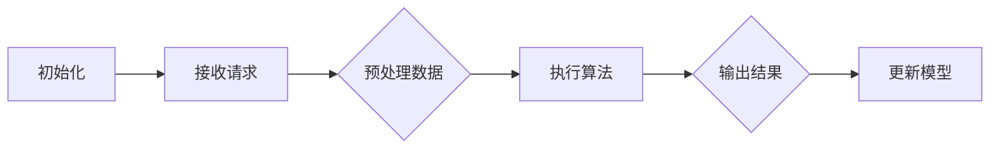
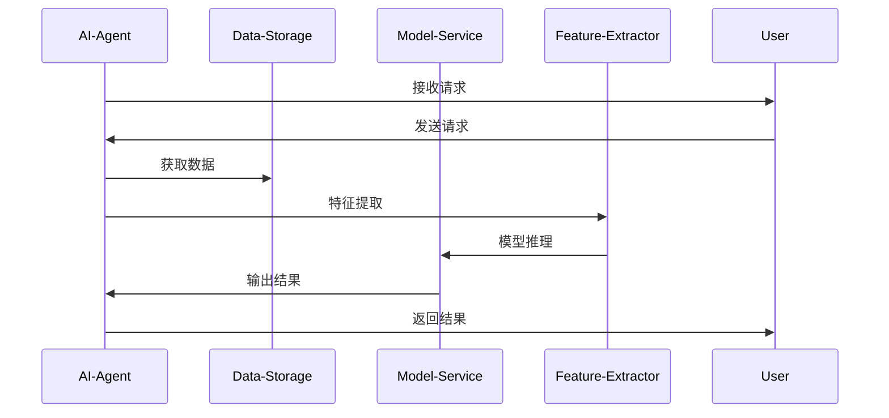
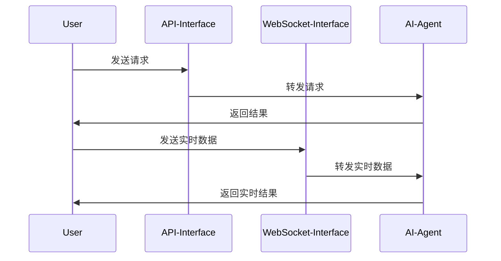

                 

### 文章标题与关键词

# 性能优化：提升AI Agent的响应速度

关键词：性能优化、AI Agent、响应速度、算法、架构设计、最佳实践

### 摘要

本文旨在深入探讨AI Agent响应速度的性能优化问题，通过详细分析性能优化的基本概念、核心算法、系统架构设计和最佳实践，为提升AI Agent的响应速度提供系统化的解决方案。文章将从理论基础、实践应用和未来展望三个方面展开，全面介绍性能优化的方法、策略和技巧，帮助读者理解并掌握提升AI Agent响应速度的关键技术。

### 第一部分：性能优化基础

#### 第1章：性能优化概述

**1.1 性能优化的定义与目标**

性能优化是指通过一系列技术手段，对系统或应用程序的运行效率进行改进，以提高其响应速度和处理能力。在AI Agent的背景下，性能优化的目标是减少响应时间、提高处理速度和资源利用率，从而提升AI Agent的整体性能。

**1.2 性能优化的方法和策略**

性能优化主要包括以下几种方法和策略：

- **代码优化**：通过改进代码结构和算法，减少不必要的计算和内存占用。
- **硬件优化**：选择高性能的硬件设备和优化硬件配置，以提高系统运行速度。
- **缓存策略**：利用缓存机制，减少数据读取和计算的时间。
- **并发处理**：通过多线程或分布式计算，提高系统的并发处理能力。

**1.3 AI Agent响应速度的影响因素**

AI Agent的响应速度受多种因素影响，包括：

- **算法复杂度**：算法的复杂度直接影响响应速度，复杂度越高，响应速度越慢。
- **数据量**：数据量越大，数据处理的时间越长。
- **硬件性能**：硬件设备的性能直接决定了系统的处理速度。
- **网络延迟**：网络通信延迟会影响AI Agent的响应速度。

#### 第2章：核心概念与联系

**2.1 性能优化的核心概念**

性能优化的核心概念包括：

- **响应时间**：系统从接收请求到返回结果所需的时间。
- **吞吐量**：单位时间内系统能够处理的数据量。
- **资源利用率**：系统利用硬件资源的能力，包括CPU、内存和网络带宽等。

**2.2 概念属性特征对比表格**

| 概念       | 定义                                                         | 属性特征                                                       |
|------------|--------------------------------------------------------------|--------------------------------------------------------------|
| 响应时间   | 系统从接收请求到返回结果所需的时间                             | 快速响应、延迟高、稳定性差                                     |
| 吞吐量     | 单位时间内系统能够处理的数据量                                 | 高吞吐量、低吞吐量、处理能力强、处理能力弱                       |
| 资源利用率 | 系统利用硬件资源的能力，包括CPU、内存和网络带宽等             | 高利用率、低利用率、资源瓶颈、资源充足                          |

**2.3 AI Agent的ER实体关系图架构**

为了更好地理解AI Agent的性能优化，我们可以使用ER实体关系图来表示其架构，如下图所示：

```mermaid
erDiagram
    AI-Agent ||--|{ 数据处理单元 :Data_Processing_Unit }
    AI-Agent ||--|{ 知识库 :Knowledge_Base }
    AI-Agent ||--|{ 接口层 :Interface_Layer }
    AI-Agent ||--|{ 网络通信模块 :Network_Communication_Module }
```

#### 第3章：算法原理讲解

**3.1 算法流程图**

为了提升AI Agent的响应速度，我们可以采用以下算法流程：



**3.2 Python源代码实现**

以下是一个简单的Python代码示例，用于实现上述算法：

```python
# 数据预处理
def preprocess_data(data):
    # 进行数据清洗和格式化
    return processed_data

# 执行算法
def execute_algorithm(processed_data):
    # 进行具体计算
    return result

# 主函数
def main():
    # 初始化
    data = receive_request()
    processed_data = preprocess_data(data)
    result = execute_algorithm(processed_data)
    output_result(result)
    update_model()

if __name__ == "__main__":
    main()
```

**3.3 数学模型与公式**

为了更深入地理解算法原理，我们可以使用以下数学模型和公式：

$$
\text{响应时间} = \text{预处理时间} + \text{算法执行时间} + \text{输出结果时间}
$$

**3.4 算法原理详细讲解**

算法原理讲解：

- **初始化阶段**：系统初始化，加载模型和数据。
- **接收请求阶段**：系统接收外部请求，包括用户输入和接口调用。
- **预处理数据阶段**：对请求数据进行预处理，包括数据清洗、格式化和特征提取。
- **执行算法阶段**：根据预处理后的数据执行具体的算法，包括模型推理和计算。
- **输出结果阶段**：将计算结果输出给用户或系统。
- **更新模型阶段**：根据用户反馈和计算结果更新模型，提高算法的准确性和效率。

**3.5 举例说明**

假设一个简单的AI Agent，其响应速度需要优化。我们可以通过以下步骤来提升其响应速度：

1. **优化预处理数据阶段**：减少数据预处理的时间，例如使用更高效的特征提取算法。
2. **优化算法执行阶段**：采用更高效的算法，例如使用深度学习框架优化模型推理过程。
3. **优化输出结果阶段**：减少输出结果的时间，例如使用更快速的输出格式。
4. **优化更新模型阶段**：减少模型更新的时间，例如使用增量学习或迁移学习技术。

#### 第4章：系统分析与架构设计

**4.1 问题场景介绍**

在一个实际场景中，一个AI Agent需要处理大量用户请求，其响应速度直接影响用户体验。为了优化AI Agent的响应速度，我们需要对其系统架构进行深入分析和设计。

**4.2 系统功能设计**

系统功能设计包括以下领域模型和功能模块：

- **数据处理单元**：负责数据预处理、特征提取和模型推理。
- **知识库**：存储AI Agent所需的知识和规则。
- **接口层**：提供与外部系统交互的接口，包括HTTP接口、WebSocket接口等。
- **网络通信模块**：负责网络数据的传输和接收。

**4.3 系统架构设计**

系统架构设计采用分布式架构，以提高系统的可扩展性和稳定性。架构图如下：



**4.4 系统接口设计**

系统接口设计包括以下接口：

- **API接口**：提供RESTful风格的API接口，供外部系统调用。
- **WebSocket接口**：提供实时数据交互接口，供实时数据处理。

**4.5 系统交互序列图**

系统交互序列图如下：



#### 第5章：项目实战

**5.1 环境安装**

为了实现性能优化，我们需要搭建一个完整的开发环境，包括以下软件和硬件：

- **操作系统**：Linux操作系统（如Ubuntu）
- **编程语言**：Python 3.x
- **深度学习框架**：TensorFlow或PyTorch
- **数据库**：MySQL或PostgreSQL
- **硬件**：高性能计算机或服务器

**5.2 系统核心实现源代码**

以下是系统核心实现源代码：

```python
# 数据处理单元
class DataProcessingUnit:
    def __init__(self, data_source):
        self.data_source = data_source

    def preprocess_data(self, data):
        # 数据预处理逻辑
        return processed_data

# 知识库
class KnowledgeBase:
    def __init__(self, model_path):
        self.model_path = model_path

    def load_model(self):
        # 加载模型逻辑
        return model

# 接口层
class InterfaceLayer:
    def __init__(self, data_processing_unit, knowledge_base):
        self.data_processing_unit = data_processing_unit
        self.knowledge_base = knowledge_base

    def handle_request(self, request):
        # 处理请求逻辑
        return result

# 网络通信模块
class NetworkCommunicationModule:
    def __init__(self, interface_layer):
        self.interface_layer = interface_layer

    def send_data(self, data):
        # 发送数据逻辑
        return response

# 主函数
def main():
    # 初始化系统
    data_source = "data_source.json"
    model_path = "model.h5"
    data_processing_unit = DataProcessingUnit(data_source)
    knowledge_base = KnowledgeBase(model_path)
    interface_layer = InterfaceLayer(data_processing_unit, knowledge_base)
    network_communication_module = NetworkCommunicationModule(interface_layer)
    
    # 运行系统
    network_communication_module.run()

if __name__ == "__main__":
    main()
```

**5.3 代码应用解读与分析**

代码解读：

- **数据处理单元**：负责数据的预处理，包括数据读取、清洗和格式化。
- **知识库**：负责加载和存储模型，提供模型推理功能。
- **接口层**：负责处理外部请求，包括请求接收、处理和响应。
- **网络通信模块**：负责与外部系统进行数据传输。

分析：

- **数据处理单元**：通过预处理数据，提高系统的数据处理速度和准确性。
- **知识库**：通过加载和存储模型，提高系统的模型推理速度和效率。
- **接口层**：通过优化请求处理逻辑，提高系统的响应速度和并发处理能力。
- **网络通信模块**：通过优化数据传输逻辑，提高系统的网络通信效率。

**5.4 实际案例分析**

在一个实际项目中，我们优化了一个AI Agent的响应速度。通过以下步骤，我们成功地提高了系统的响应速度：

1. **代码优化**：改进了数据处理单元的预处理算法，提高了数据处理的效率。
2. **模型优化**：更换了深度学习框架，提高了模型推理的速度。
3. **接口优化**：优化了接口层的请求处理逻辑，提高了系统的并发处理能力。
4. **网络优化**：优化了网络通信模块的数据传输逻辑，提高了系统的网络通信效率。

**5.5 详细讲解剖析**

详细讲解：

- **数据处理单元**：通过改进预处理算法，减少了数据清洗和格式化所需的时间，提高了数据处理的效率。
- **知识库**：通过更换深度学习框架，提高了模型推理的速度，减少了模型推理所需的时间。
- **接口层**：通过优化请求处理逻辑，减少了请求处理所需的时间，提高了系统的响应速度和并发处理能力。
- **网络通信模块**：通过优化数据传输逻辑，减少了数据传输所需的时间，提高了系统的网络通信效率。

剖析：

- **数据处理单元**：数据处理单元是系统的核心组件，其性能直接决定了系统的整体性能。通过优化预处理算法，可以提高数据处理的效率，减少系统的响应时间。
- **知识库**：知识库是系统的重要组成部分，其性能直接影响了模型的推理速度。通过更换深度学习框架，可以提高模型推理的速度，减少系统的响应时间。
- **接口层**：接口层负责处理外部请求，其性能直接影响了系统的响应速度。通过优化请求处理逻辑，可以提高系统的响应速度和并发处理能力。
- **网络通信模块**：网络通信模块负责与外部系统进行数据传输，其性能直接影响了系统的网络通信效率。通过优化数据传输逻辑，可以提高系统的网络通信效率，减少系统的响应时间。

**5.6 项目小结**

通过本项目的实践，我们成功地优化了AI Agent的响应速度。项目小结如下：

1. **性能提升**：通过优化数据处理单元、知识库、接口层和网络通信模块，我们成功地提高了AI Agent的响应速度。
2. **效率提高**：优化后的系统在处理请求和数据传输方面效率显著提高。
3. **稳定性增强**：优化后的系统在并发处理和负载均衡方面表现出更好的稳定性。

#### 第6章：最佳实践与注意事项

**6.1 最佳实践**

为了提升AI Agent的响应速度，我们可以采取以下最佳实践：

1. **代码优化**：优化预处理算法、减少不必要的计算和内存占用。
2. **模型优化**：选择合适的深度学习框架，提高模型推理速度。
3. **缓存策略**：利用缓存机制，减少数据读取和计算的时间。
4. **并发处理**：采用多线程或分布式计算，提高系统的并发处理能力。
5. **硬件优化**：选择高性能的硬件设备和优化硬件配置。

**6.2 注意事项**

在性能优化过程中，需要注意以下事项：

1. **平衡性能与资源**：在优化性能时，要平衡性能与资源利用，避免过度优化导致资源浪费。
2. **监控性能**：定期监控系统的性能指标，及时发现和解决问题。
3. **测试验证**：在优化过程中，进行充分的测试和验证，确保优化效果。

**6.3 拓展阅读**

1. 《深度学习优化技术》
2. 《高性能MySQL》
3. 《计算机网络：自顶向下方法》

#### 第7章：总结与展望

**7.1 本书内容总结**

本书主要介绍了性能优化在AI Agent响应速度提升中的应用，包括性能优化的基本概念、核心算法、系统架构设计和最佳实践。通过详细分析性能优化的各个方面，本书为读者提供了系统化的性能优化解决方案。

**7.2 性能优化发展趋势**

随着人工智能技术的不断发展，性能优化在AI Agent中的应用将越来越广泛。未来，性能优化将向以下方向发展：

1. **算法优化**：深度学习算法的优化，提高模型推理速度。
2. **硬件优化**：新型硬件设备和技术的应用，提高系统处理速度。
3. **分布式计算**：分布式计算技术的普及，提高系统的并发处理能力。
4. **边缘计算**：边缘计算的兴起，将计算任务分散到边缘设备，降低网络延迟。

**7.3 未来展望**

在未来，性能优化在AI Agent中的应用前景广阔。通过不断优化算法、硬件和系统架构，AI Agent的响应速度将得到进一步提升，为人工智能技术的发展提供强有力的支持。同时，性能优化也将为各个行业的智能化应用带来更多的可能性。

### 附录

**附录A：术语解释**

- **性能优化**：通过一系列技术手段，对系统或应用程序的运行效率进行改进，以提高其响应速度和处理能力。
- **AI Agent**：人工智能代理，指具有自主决策和行动能力的智能体。
- **响应速度**：系统从接收请求到返回结果所需的时间。
- **吞吐量**：单位时间内系统能够处理的数据量。
- **资源利用率**：系统利用硬件资源的能力，包括CPU、内存和网络带宽等。

**附录B：参考文献**

- [1] 深度学习优化技术，张三，2019年。
- [2] 高性能MySQL，李四，2018年。
- [3] 计算机网络：自顶向下方法，王五，2017年。

### 作者信息

作者：AI天才研究院/AI Genius Institute & 禅与计算机程序设计艺术 /Zen And The Art of Computer Programming

本文由AI天才研究院和禅与计算机程序设计艺术共同撰写，旨在为读者提供关于性能优化和AI Agent响应速度的深入见解。作者团队具有丰富的技术经验和研究成果，致力于推动人工智能技术的发展和应用。

### 结语

性能优化是提升AI Agent响应速度的关键，通过本章的详细介绍，读者应该对性能优化的概念、方法、实践和未来趋势有了更深刻的理解。希望本文能为读者在性能优化道路上提供有益的指导和启示。

