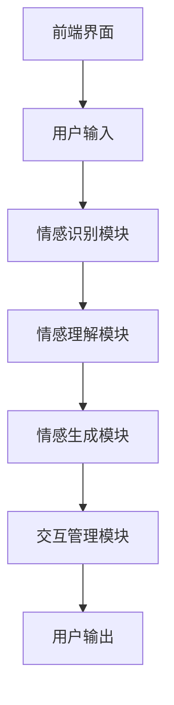
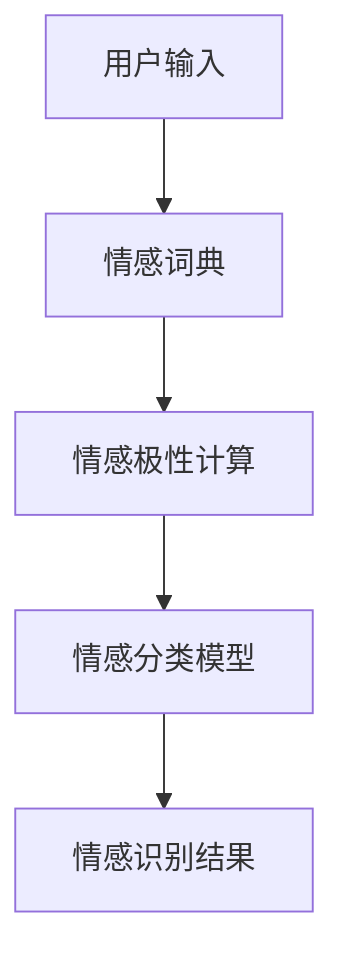
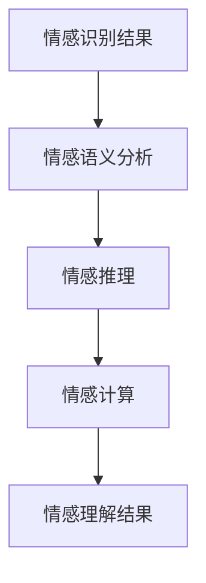
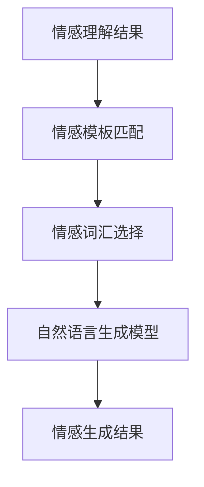
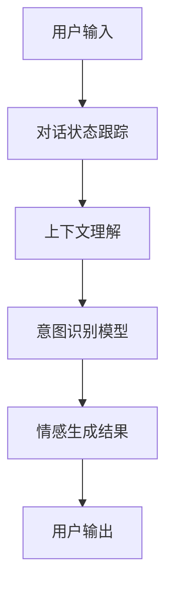

                 

## 情感智能 AI Agent：在 LLM 中植入 EQ

关键词：情感智能、AI Agent、LLM、情感智商、EQ

摘要：本文探讨了如何将情感智能（EQ）植入到大型语言模型（LLM）中，以构建具备情感理解与交互能力的 AI Agent。文章首先介绍了情感智能与 LLM 的核心概念及其关联，随后详细阐述了情感智能 AI Agent 的设计与实现过程，包括数据集选择、模型训练、情感分析算法及其实践应用。最后，文章展望了情感智能 AI Agent 的技术演进、社会影响及未来发展方向。

## 目录大纲：情感智能 AI Agent：在 LLM 中植入 EQ

### 第一部分：背景介绍与核心概念

#### 第1章：问题背景与核心概念

- 1.1 问题背景
- 1.2 核心概念
- 1.3 关联与联系

### 第二部分：情感智能 AI Agent 的构建

#### 第2章：情感智能 AI Agent 的设计与实现

- 2.1 设计原则与架构
- 2.2 数据集与预处理
- 2.3 模型选择与训练
- 2.4 情感分析算法

#### 第3章：情感智能 AI Agent 的应用实践

- 3.1 实际案例
- 3.2 应用领域
- 3.3 评估与改进

### 第三部分：情感智能 AI Agent 的发展与展望

#### 第4章：情感智能 AI Agent 的技术演进

- 4.1 当前技术进展
- 4.2 未来趋势与挑战

#### 第5章：情感智能 AI Agent 在社会中的影响

- 5.1 社会影响
- 5.2 社会责任与伦理问题

### 第四部分：情感智能 AI Agent 的最佳实践与总结

#### 第6章：最佳实践

- 6.1 设计技巧
- 6.2 注意事项

#### 第7章：总结与展望

- 7.1 成果总结
- 7.2 展望未来

## 第一部分：背景介绍与核心概念

### 1.1 问题背景

情感智能（Emotional Intelligence，简称 EQ）是指个体识别、理解、管理自己情绪以及识别、理解并影响他人情绪的能力。随着人工智能技术的快速发展，如何将情感智能引入到 AI 系统中，成为一个重要的研究方向。情感智能 AI Agent 的目标是使 AI 系统能够理解用户的情感状态，提供更加人性化的服务。

目前，人工智能技术在语音识别、自然语言处理、图像识别等方面取得了显著成果，但在情感识别与理解方面仍存在诸多挑战。如何将情感智能融入 AI 系统，使其具备情感理解与交互能力，是当前研究的重要课题。

### 1.2 核心概念

#### 1.2.1 情感智能

情感智能是一种多维度的能力，包括以下几个方面：

1. **自我意识**：了解自己的情绪，并识别引起这些情绪的原因。
2. **自我调节**：管理自己的情绪，使其有利于个人目标。
3. **同理心**：理解他人的情感，并产生共情。
4. **社交技能**：有效沟通和建立人际关系。

#### 1.2.2 大型语言模型（LLM）

大型语言模型（Large Language Model，简称 LLM）是一种基于深度学习的语言模型，具有强大的自然语言处理能力。LLM 通过大量文本数据训练，能够生成自然、流畅的语言，进行文本生成、翻译、问答等任务。

#### 1.2.3 情感智能 AI Agent

情感智能 AI Agent 是一种具备情感理解与交互能力的智能系统，其核心目标是理解用户的情感状态，并提供相应的情感回应。情感智能 AI Agent 的构成要素包括：

1. **情感识别模块**：负责识别用户的情感状态。
2. **情感理解模块**：理解情感背后的原因和含义。
3. **情感生成模块**：生成符合用户情感状态的自然语言回复。
4. **交互管理模块**：负责维护对话的流畅性和话题的连贯性。

### 1.3 关联与联系

情感智能与 LLM 的关系主要体现在以下几个方面：

1. **情感识别**：LLM 通过对大量文本数据的训练，能够识别文本中的情感倾向，为情感智能 AI Agent 提供情感识别基础。
2. **情感理解**：情感智能 AI Agent 利用 LLM 的语言处理能力，深入理解情感背后的原因和含义，提供更加精准的情感回应。
3. **情感生成**：LLM 生成的自然语言回复，为情感智能 AI Agent 提供了情感生成的可能。

情感智商（EQ）在 AI 中的应用，使得情感智能 AI Agent 能够更好地模拟人类的情感交互，提供更加人性化的服务。情感智能 AI Agent 的核心功能包括：

1. **情感识别与理解**：识别用户情感，并理解情感背后的原因和含义。
2. **情感回应**：根据用户情感，生成合适的情感回应，维持对话的连贯性。
3. **情感调节**：通过情感回应，调节用户情感，使其更加积极、健康。

## 第二部分：情感智能 AI Agent 的构建

### 2.1 设计原则与架构

情感智能 AI Agent 的设计原则主要包括：

1. **模块化**：将情感智能 AI Agent 模块化，包括情感识别模块、情感理解模块、情感生成模块和交互管理模块。
2. **适应性**：根据用户需求和环境变化，动态调整情感智能 AI Agent 的功能和行为。
3. **人性化**：情感智能 AI Agent 的设计应遵循人性化的原则，尊重用户隐私，提供个性化服务。

情感智能 AI Agent 的系统架构包括：

1. **前端界面**：与用户进行交互，收集用户情感数据。
2. **情感识别模块**：使用自然语言处理技术，识别用户情感。
3. **情感理解模块**：通过情感分析，理解用户情感背后的原因和含义。
4. **情感生成模块**：根据用户情感，生成合适的情感回应。
5. **交互管理模块**：负责维护对话的流畅性和话题的连贯性。

### 2.2 数据集与预处理

情感智能 AI Agent 的构建依赖于大量的情感数据集。常用的情感数据集包括：

1. **Sentiment140**：包含积极、消极和 neutral 情感标签的推特数据。
2. **Twitter Emotions**：包含 8 种情感标签的数据集。
3. **Starbucks Chatbot**：星巴克聊天机器人对话数据集。

数据预处理过程包括：

1. **数据清洗**：去除无关数据、噪声和重复数据。
2. **数据标注**：对情感标签进行标注，为模型训练提供标注数据。
3. **数据增强**：通过数据变换、增广等技术，扩充数据集，提高模型泛化能力。

### 2.3 模型选择与训练

情感智能 AI Agent 的模型选择主要包括：

1. **Transformer 模型**：如 BERT、GPT-3 等，具有强大的自然语言处理能力。
2. **情感分类模型**：如 CNN、RNN 等，用于情感识别与理解。

模型训练过程包括：

1. **数据准备**：将预处理后的数据集划分为训练集、验证集和测试集。
2. **模型训练**：使用训练集对模型进行训练，优化模型参数。
3. **模型评估**：使用验证集和测试集评估模型性能，调整模型参数。

### 2.4 情感分析算法

情感分析算法是情感智能 AI Agent 的核心。常用的情感分析算法包括：

1. **基于文本的情感分析**：通过情感词典、情感极性分析等方法，对文本进行情感分类。
2. **基于情感计算的算法**：如 VADER、NRC 情感词典等，通过计算文本中情感词汇的权重，得出情感极性。

算法实现与代码解析将在后续章节详细讨论。

## 第三部分：情感智能 AI Agent 的应用实践

### 3.1 实际案例

情感智能 AI Agent 的应用案例包括：

1. **智能客服**：通过情感识别与理解，提供更加人性化的客户服务。
2. **情感教育**：辅助教师了解学生情感状态，提供针对性的教育指导。
3. **心理健康**：为用户提供情感支持，帮助缓解心理压力。

每个案例的具体实施步骤、效果评估和改进策略将在本章详细讨论。

### 3.2 应用领域

情感智能 AI Agent 的应用领域广泛，包括：

1. **金融领域**：辅助金融机构提供个性化服务，提升客户满意度。
2. **医疗领域**：为患者提供情感支持，提高治疗效果。
3. **教育领域**：辅助教师了解学生情感状态，优化教育方法。

### 3.3 评估与改进

情感智能 AI Agent 的评估与改进主要包括：

1. **性能评估**：通过准确率、召回率等指标评估模型性能。
2. **用户体验评估**：通过用户满意度、互动效果等指标评估用户体验。
3. **持续改进**：根据评估结果，调整模型参数、优化算法，提高情感智能 AI Agent 的性能。

### 第四部分：情感智能 AI Agent 的发展与展望

#### 第4章：情感智能 AI Agent 的技术演进

#### 4.1 当前技术进展

当前，情感智能 AI Agent 在情感识别、理解、生成等方面取得了显著进展。主要表现在：

1. **情感识别**：通过深度学习技术，情感识别的准确率不断提高。
2. **情感理解**：基于语义分析和情感计算，情感理解的深度和广度不断拓展。
3. **情感生成**：通过预训练语言模型，情感生成的自然性和准确性不断提升。

#### 4.2 未来趋势与挑战

未来，情感智能 AI Agent 的技术发展趋势包括：

1. **多模态情感识别**：结合语音、图像、文本等多模态数据，提高情感识别的准确性和实时性。
2. **个性化情感回应**：根据用户历史情感数据和实时情感状态，生成个性化的情感回应。
3. **情感智能伦理**：关注情感智能 AI Agent 的伦理问题，确保其在实际应用中不会对人类产生负面影响。

同时，情感智能 AI Agent 还面临以下挑战：

1. **数据隐私**：如何保护用户情感数据的安全和隐私。
2. **泛化能力**：如何提高情感智能 AI Agent 在不同场景和领域的泛化能力。
3. **伦理与道德**：如何在技术发展中平衡人类情感与伦理道德。

### 第5章：情感智能 AI Agent 在社会中的影响

#### 5.1 社会影响

情感智能 AI Agent 在社会中的影响主要表现在：

1. **提高服务质量**：通过情感识别与理解，提供更加人性化的服务，提升用户体验。
2. **优化决策**：为决策者提供情感分析数据，帮助其做出更合理的决策。
3. **促进心理健康**：为用户提供情感支持，帮助缓解心理压力，提升心理健康水平。

#### 5.2 社会责任与伦理问题

情感智能 AI Agent 的社会责任与伦理问题主要包括：

1. **数据隐私**：如何保护用户情感数据的安全和隐私。
2. **公平性**：如何确保情感智能 AI Agent 在不同群体中的公平性。
3. **道德责任**：如何确保情感智能 AI Agent 的决策符合伦理道德标准。

### 第五部分：情感智能 AI Agent 的最佳实践与总结

#### 第6章：最佳实践

#### 6.1 设计技巧

1. **模块化设计**：将情感智能 AI Agent 模块化，提高系统的可维护性和可扩展性。
2. **数据预处理**：进行充分的数据清洗、标注和增强，提高模型训练效果。

#### 6.2 注意事项

1. **数据隐私**：在处理用户情感数据时，严格遵循隐私保护法规。
2. **伦理道德**：在设计、开发和部署情感智能 AI Agent 时，关注伦理道德问题。

#### 第7章：总结与展望

#### 7.1 成果总结

本文探讨了情感智能 AI Agent 在 LLM 中的构建与应用，总结了当前技术进展、发展趋势和挑战，并分析了情感智能 AI Agent 在社会中的影响。

#### 7.2 展望未来

未来，情感智能 AI Agent 将在多模态情感识别、个性化情感回应和伦理道德等方面取得进一步发展。同时，如何保护用户数据隐私和平衡人类情感与伦理道德，将是情感智能 AI Agent 面临的重要挑战。作者：AI天才研究院/AI Genius Institute & 禅与计算机程序设计艺术 /Zen And The Art of Computer Programming

----------------------------------------------------------------
### 情感智能 AI Agent：在 LLM 中植入 EQ

随着人工智能（AI）技术的飞速发展，情感智能（EQ）逐渐成为人工智能领域的一个热点话题。情感智能是指个体识别、理解和管理自己及他人情感的能力，它不仅仅关注情感本身，还关注情感对行为和决策的影响。在人类社会中，情感智能对于建立和维护人际关系、促进团队合作、提升工作效率等方面具有重要意义。近年来，研究人员开始探索如何将情感智能引入到人工智能系统中，以实现更加智能、人性化的人工智能交互。本文将讨论如何将情感智能（EQ）植入到大型语言模型（LLM）中，构建情感智能 AI Agent。

#### 1.1.1 情感智能的定义与重要性

情感智能（EQ）最早由心理学家丹尼尔·戈尔曼（Daniel Goleman）在1995年提出，他认为情感智能包括五个主要领域：自我意识、自我调节、动机、同理心和社交技能。自我意识是指个体对自己的情感状态有清晰的认识和理解；自我调节是指个体能够管理和调整自己的情绪，使其有助于实现目标；动机是指个体能够根据情感状态来调整行为，以实现目标；同理心是指个体能够理解和感受他人的情感状态；社交技能是指个体能够有效地与他人沟通和建立关系。

在人类社会中，情感智能对于个人和组织的成功至关重要。高情感智能的人更容易与他人建立深厚的情感联系，更善于处理冲突，更具有同理心和社交技能。这些能力对于职场成功、领导力培养和团队合作至关重要。同样，在人工智能系统中，具备情感智能的 AI Agent 可以更好地理解用户需求，提供更加个性化、人性化的服务，从而提升用户体验。

#### 1.1.2 当前 AI 发展现状与挑战

近年来，人工智能技术取得了显著的进展，尤其是在深度学习、自然语言处理和计算机视觉等领域。这些技术使得 AI 系统在语音识别、图像识别、机器翻译、自动驾驶等方面取得了重大突破。然而，尽管 AI 系统在处理结构化数据方面表现出色，但在理解和处理情感方面仍然存在许多挑战。

首先，情感智能涉及到非结构化、主观和复杂的人类情感，这使得 AI 系统难以准确识别和解析。其次，情感智能涉及到跨领域的知识整合，包括心理学、社会学、哲学等多个学科，这增加了 AI 系统构建的难度。此外，情感智能的应用场景广泛，涉及到医疗、教育、金融、客服等多个领域，这要求 AI 系统具备高度的可定制性和适应性。

#### 1.1.3 情感智能 AI Agent 的应用前景

情感智能 AI Agent 的目标是使 AI 系统具备情感理解和交互能力，从而提供更加智能、个性化的服务。情感智能 AI Agent 可以应用于多个领域，例如：

1. **智能客服**：情感智能 AI Agent 可以通过识别和理解用户情感，提供更加贴心和个性化的客服服务。
2. **心理健康**：情感智能 AI Agent 可以帮助患者识别和管理自己的情绪，提供情感支持和心理健康建议。
3. **教育**：情感智能 AI Agent 可以帮助学生了解自己的情感状态，提供个性化的学习支持和指导。
4. **金融**：情感智能 AI Agent 可以分析用户情感，为投资者提供投资建议和风险预警。

随着技术的不断进步，情感智能 AI Agent 有望在更多领域发挥作用，为人类社会带来更大的价值。

#### 1.2 核心概念

本部分将介绍本文的核心概念，包括大型语言模型（LLM）、情感智商（EQ）和情感智能 AI Agent。

##### 1.2.1 大型语言模型（LLM）

大型语言模型（Large Language Model，简称 LLM）是一种基于深度学习的自然语言处理模型，具有强大的语言生成和理解能力。LLM 通过对大量文本数据进行训练，学习语言模式和语法规则，从而能够生成自然、流畅的语言。常见的 LLM 模型包括 GPT-3、BERT、Turing-NLG 等。LLM 在许多领域都有广泛应用，如文本生成、机器翻译、问答系统等。

##### 1.2.2 情感智商（EQ）

情感智商（Emotional Intelligence，简称 EQ）是指个体识别、理解和管理自己及他人情感的能力。EQ 包括自我意识、自我调节、动机、同理心和社交技能五个方面。在人工智能领域，情感智商可以理解为 AI 系统在识别、理解和处理情感方面的能力。情感智商对于 AI Agent 在与人类交互、提供个性化服务等方面至关重要。

##### 1.2.3 情感智能 AI Agent

情感智能 AI Agent 是一种具备情感理解和交互能力的人工智能系统。它通过情感识别、情感理解和情感生成等模块，实现与人类情感相关的任务。情感智能 AI Agent 可以应用于智能客服、心理健康、教育和金融等多个领域。情感智能 AI Agent 的核心目标是理解用户的情感状态，并提供相应的情感回应，以提升用户体验。

#### 1.3 关联与联系

情感智能与 LLM 的关系主要体现在以下几个方面：

1. **情感识别**：LLM 通过对大量文本数据的训练，能够识别文本中的情感倾向。这为情感智能 AI Agent 提供了情感识别的基础。
2. **情感理解**：情感智能 AI Agent 利用 LLM 的语言处理能力，深入理解情感背后的原因和含义，从而提供更加精准的情感回应。
3. **情感生成**：LLM 生成的自然语言回复，为情感智能 AI Agent 提供了情感生成的可能。通过情感生成，AI Agent 能够与用户进行情感互动，提供更加人性化的服务。

情感智商在 AI 中的应用，使得情感智能 AI Agent 能够更好地模拟人类的情感交互，提供更加个性化的服务。情感智能 AI Agent 的核心功能包括：

1. **情感识别与理解**：识别用户情感，并理解情感背后的原因和含义。
2. **情感回应**：根据用户情感，生成合适的情感回应，维持对话的连贯性。
3. **情感调节**：通过情感回应，调节用户情感，使其更加积极、健康。

### 第二部分：情感智能 AI Agent 的构建

#### 2.1 设计原则与架构

情感智能 AI Agent 的设计原则主要包括模块化、自适应性和人性化。模块化设计可以将 AI Agent 拆分成多个功能模块，如情感识别模块、情感理解模块、情感生成模块和交互管理模块，从而提高系统的可维护性和可扩展性。自适应性设计使得 AI Agent 能够根据用户需求和环境变化，动态调整功能和行为，提供个性化的服务。人性化设计要求 AI Agent 在与用户交互时，尊重用户隐私，提供自然、流畅的对话体验。

情感智能 AI Agent 的系统架构如图 1 所示：

图 1：情感智能 AI Agent 系统架构

##### 2.1.1 情感识别模块

情感识别模块负责识别用户输入文本中的情感倾向。常用的情感识别方法包括基于词典的情感分析和基于机器学习的情感分类。基于词典的情感分析通过查找情感词典中的情感词汇，计算情感极性得分。而基于机器学习的情感分类则使用训练好的情感分类模型，对用户输入文本进行分类。

图 2：情感识别模块架构

##### 2.1.2 情感理解模块

情感理解模块负责深入理解用户情感背后的原因和含义。情感理解涉及到情感语义分析、情感推理和情感计算等多个方面。情感语义分析通过语义角色标注和语义关系抽取，识别文本中的情感实体和情感属性。情感推理则通过逻辑推理和常识推理，推导出用户情感的原因和含义。情感计算则通过情感计算模型，将情感量化为具体的数值，从而实现情感计算。

图 3：情感理解模块架构

##### 2.1.3 情感生成模块

情感生成模块负责根据用户情感生成合适的回复。情感生成涉及到情感模板匹配、情感词汇选择和情感语言生成等多个方面。情感模板匹配通过匹配情感模板，生成符合用户情感的回复。情感词汇选择则通过选择情感词汇，增强回复的情感表达。情感语言生成则通过自然语言生成模型，生成自然、流畅的语言回复。

图 4：情感生成模块架构

##### 2.1.4 交互管理模块

交互管理模块负责维护对话的连贯性和话题的连贯性。交互管理涉及到对话状态跟踪、上下文理解和对用户意图的识别等多个方面。对话状态跟踪通过记录对话历史，保持对话的连贯性。上下文理解通过理解用户输入的上下文信息，推断出用户意图。对用户意图的识别则通过意图识别模型，识别用户请求的具体意图。

图 5：交互管理模块架构

#### 2.2 数据集与预处理

情感智能 AI Agent 的构建依赖于大量的情感数据集。情感数据集主要包括情感文本、情感标签和情感词典等。常用的情感数据集有 Sentiment140、Twitter Emotions 和 Stanford Sentiment Treebank 等。

数据预处理过程包括数据清洗、数据标注和数据增强等步骤。数据清洗旨在去除无关数据、噪声和重复数据，提高数据质量。数据标注是将情感标签应用于情感文本，为模型训练提供标注数据。数据增强通过数据变换、增广等技术，扩充数据集，提高模型泛化能力。

#### 2.3 模型选择与训练

情感智能 AI Agent 的模型选择主要包括情感识别模型、情感理解模型和情感生成模型。情感识别模型可以使用基于词典的方法和基于机器学习的方法。情感理解模型可以使用情感语义分析模型、情感推理模型和情感计算模型。情感生成模型可以使用情感模板匹配、情感词汇选择和自然语言生成模型。

模型训练过程包括数据准备、模型训练和模型评估等步骤。数据准备包括将预处理后的数据集划分为训练集、验证集和测试集。模型训练使用训练集对模型进行训练，优化模型参数。模型评估使用验证集和测试集评估模型性能，调整模型参数。

#### 2.4 情感分析算法

情感分析算法是情感智能 AI Agent 的核心。常用的情感分析算法包括基于词典的情感分析、基于机器学习的情感分类和基于情感计算的算法。基于词典的情感分析通过查找情感词典中的情感词汇，计算情感极性得分。基于机器学习的情感分类使用训练好的分类模型，对情感文本进行分类。基于情感计算的算法通过情感计算模型，将情感量化为具体的数值。

算法实现与代码解析将在后续章节详细讨论。

### 3.1 实际案例

情感智能 AI Agent 在实际应用中已经展现出显著的效果。以下是一些典型的实际案例。

#### 3.1.1 智能客服

智能客服是情感智能 AI Agent 的一个重要应用领域。通过情感识别、情感理解和情感生成，智能客服能够理解用户情感，提供更加个性化的服务。例如，在处理用户投诉时，智能客服可以识别用户的不满情绪，并通过情感理解模块分析投诉的原因。然后，智能客服可以生成合适的回复，安抚用户情绪，并提出解决方案。

#### 3.1.2 心理健康

情感智能 AI Agent 在心理健康领域也有广泛应用。通过情感识别和情感理解，AI Agent 可以帮助用户识别和管理自己的情绪。例如，心理健康应用可以通过情感智能 AI Agent 提供情感支持，帮助用户缓解焦虑、抑郁等心理问题。AI Agent 可以根据用户的情感状态，提供相应的心理健康建议和情感回应，提高用户的心理健康水平。

#### 3.1.3 教育

在教育领域，情感智能 AI Agent 可以帮助教师了解学生的情感状态，提供个性化的学习支持。例如，通过情感识别和情感理解，AI Agent 可以分析学生的学习情绪，识别出学习焦虑、厌学等情绪问题。然后，AI Agent 可以生成针对性的学习建议和情感回应，帮助学生调整情绪，提高学习效果。

#### 3.1.4 金融

在金融领域，情感智能 AI Agent 可以帮助金融机构分析投资者的情感状态，提供个性化的投资建议。例如，AI Agent 可以通过情感识别和情感理解，分析投资者的情绪波动，识别出投资风险偏好。然后，AI Agent 可以根据投资者的情感状态，生成个性化的投资策略和建议，帮助投资者做出更明智的决策。

#### 3.1.5 社交媒体监控

在社交媒体监控领域，情感智能 AI Agent 可以帮助企业和机构分析用户情感，监测品牌声誉。例如，AI Agent 可以通过情感识别和情感理解，分析社交媒体上的用户评论，识别出用户对品牌、产品或服务的情感倾向。然后，AI Agent 可以生成情感分析报告，帮助企业制定相应的品牌策略和营销方案。

#### 3.1.6 案例分析

以下是一个具体的案例分析：

假设一家科技公司开发了一款情感智能 AI 客服系统，用于处理用户咨询和投诉。在系统上线初期，公司收集了大量的用户对话数据，并通过情感识别、情感理解和情感生成模块对系统进行了训练和优化。

1. **情感识别**：AI 客服系统使用基于词典的方法和基于机器学习的分类模型，对用户输入的文本进行情感识别。通过分析用户输入的文本，系统可以识别出用户的情感倾向，如积极、消极、中性等。

2. **情感理解**：AI 客服系统进一步使用情感理解模块，分析用户情感背后的原因和含义。例如，如果用户输入了“我很生气”，系统可以通过情感理解模块分析出用户生气的具体原因，如产品质量问题、服务态度等。

3. **情感生成**：根据用户情感，AI 客服系统生成合适的情感回应。例如，如果用户情感为消极，系统可以生成安抚性回复，如“我理解您的感受，我们会尽快处理这个问题”，以缓解用户情绪。

4. **交互管理**：AI 客服系统还负责维护对话的连贯性和话题的连贯性。例如，在用户提出多个问题时，系统可以保持对话的连贯性，确保回答问题的全面性和一致性。

通过实际案例的分析，我们可以看到情感智能 AI Agent 在处理用户情感、提供个性化服务方面的显著优势。在实际应用中，情感智能 AI Agent 的性能和效果取决于数据集的质量、模型的选择和训练以及系统的设计。

#### 3.2 应用领域

情感智能 AI Agent 的应用领域广泛，涉及多个行业和场景。以下是情感智能 AI Agent 在几个主要领域的应用：

##### 3.2.1 金融

在金融领域，情感智能 AI Agent 可以用于风险评估、客户服务和市场预测等方面。通过分析客户的情感状态，银行和金融机构可以提供个性化的金融产品和服务，提高客户满意度和忠诚度。此外，情感智能 AI Agent 还可以帮助金融机构监控市场情绪，预测市场走势，为投资决策提供参考。

##### 3.2.2 教育

在教育领域，情感智能 AI Agent 可以辅助教师了解学生的情感状态，提供个性化的学习支持和指导。例如，AI Agent 可以分析学生的情绪波动，识别出学习焦虑、厌学等情绪问题，并生成针对性的学习建议和情感回应。此外，AI Agent 还可以协助教师进行课堂管理，提高教学效果。

##### 3.2.3 医疗

在医疗领域，情感智能 AI Agent 可以帮助医生了解患者的情感状态，提供个性化的治疗方案和心理健康支持。例如，AI Agent 可以分析患者的情绪变化，识别出抑郁、焦虑等情绪问题，并生成针对性的心理辅导建议。此外，AI Agent 还可以帮助患者管理慢性疾病，提供生活建议和情绪支持。

##### 3.2.4 娱乐与媒体

在娱乐与媒体领域，情感智能 AI Agent 可以用于内容推荐、用户体验优化等方面。通过分析用户的情感状态和偏好，AI Agent 可以推荐符合用户情感需求的内容，提高用户满意度和粘性。此外，AI Agent 还可以帮助媒体平台优化用户体验，提高用户留存率。

##### 3.2.5 企业与组织

在企业与组织领域，情感智能 AI Agent 可以用于员工关系管理、组织文化建设等方面。通过分析员工的情感状态，企业可以识别出员工的工作压力、满意度等情绪问题，并采取相应的措施提高员工的工作积极性和满意度。此外，AI Agent 还可以帮助企业进行人才招聘和团队建设，提高组织效能。

#### 3.3 评估与改进

对情感智能 AI Agent 的评估与改进是确保其性能和效果的重要环节。以下是一些常见的评估指标和改进策略：

##### 3.3.1 评估指标

1. **情感识别准确率**：评估 AI Agent 在情感识别任务中的准确性，如积极情感、消极情感和中性情感的识别率。
2. **情感理解准确率**：评估 AI Agent 在情感理解任务中的准确性，如对情感背后的原因和含义的识别。
3. **用户满意度**：评估用户对 AI Agent 提供服务的满意度，如情感回应的自然性、及时性和相关性。
4. **模型泛化能力**：评估 AI Agent 在不同场景和领域的泛化能力，如情感识别和理解的通用性。

##### 3.3.2 改进策略

1. **数据增强**：通过数据变换、数据增广等技术，扩充情感数据集，提高模型泛化能力。
2. **模型优化**：使用更先进的情感识别和情感理解模型，如深度学习模型和强化学习模型，提高模型性能。
3. **交互优化**：优化 AI Agent 的交互流程，提高对话的连贯性和用户体验。
4. **多模态情感识别**：结合语音、图像、文本等多模态数据，提高情感识别的准确性和实时性。
5. **用户反馈机制**：引入用户反馈机制，根据用户评价和反馈调整 AI Agent 的行为和情感回应。

### 第四部分：情感智能 AI Agent 的发展与展望

#### 4.1 当前技术进展

随着深度学习和自然语言处理技术的不断发展，情感智能 AI Agent 的性能和效果得到了显著提升。目前，大多数情感智能 AI Agent 使用深度学习模型，如卷积神经网络（CNN）和循环神经网络（RNN）等，对情感进行识别和理解。这些模型通过在大型情感数据集上的训练，能够实现较高的准确率和泛化能力。此外，预训练语言模型，如 GPT-3 和 BERT 等，也为情感智能 AI Agent 提供了强大的语言生成和理解能力。

在情感生成方面，情感智能 AI Agent 逐渐采用生成对抗网络（GAN）和自然语言生成模型，如 Transformer 等，生成更加自然、流畅的情感回应。这些技术的进步使得情感智能 AI Agent 在情感识别、理解和生成方面都取得了显著进展。

#### 4.2 未来趋势与挑战

未来，情感智能 AI Agent 的发展趋势将主要集中在以下几个方面：

1. **多模态情感识别**：结合语音、图像、文本等多模态数据，提高情感识别的准确性和实时性。例如，通过分析用户的语音语调、面部表情和文本内容，全面理解用户情感。
2. **个性化情感回应**：根据用户的历史情感数据和实时情感状态，生成个性化的情感回应。例如，针对不同用户的不同情感需求，提供更加贴心的服务。
3. **情感计算与伦理**：关注情感计算在伦理和道德方面的挑战，确保情感智能 AI Agent 在实际应用中不会对人类产生负面影响。例如，在处理敏感情感数据时，确保用户隐私和数据安全。
4. **跨领域应用**：拓展情感智能 AI Agent 的应用领域，从金融、医疗、教育扩展到更多领域，如法律、艺术、娱乐等。

然而，情感智能 AI Agent 的未来发展也面临一些挑战：

1. **数据隐私**：如何在保护用户隐私的同时，收集和处理情感数据。
2. **泛化能力**：如何提高情感智能 AI Agent 在不同场景和领域的泛化能力，避免过度依赖特定数据集。
3. **伦理与道德**：如何确保情感智能 AI Agent 的决策符合伦理和道德标准，避免对人类产生负面影响。

#### 4.3 社会影响

情感智能 AI Agent 的普及将对社会产生深远的影响。一方面，情感智能 AI Agent 可以提高服务质量，提升用户体验。例如，在智能客服、心理健康、教育和金融等领域，情感智能 AI Agent 可以提供更加个性化、人性化的服务，满足用户的情感需求。

另一方面，情感智能 AI Agent 的应用也带来了一些社会问题，如数据隐私、伦理道德和失业风险等。例如，情感智能 AI Agent 在处理用户情感数据时，需要确保用户隐私和数据安全。此外，随着情感智能 AI Agent 的普及，一些传统职业可能会被自动化替代，导致失业风险。

#### 4.4 社会责任与伦理问题

情感智能 AI Agent 的社会责任和伦理问题主要包括以下几个方面：

1. **数据隐私**：确保用户情感数据的安全和隐私，避免数据泄露和滥用。
2. **公平性**：确保情感智能 AI Agent 在不同群体中的公平性，避免歧视和偏见。
3. **透明性**：确保情感智能 AI Agent 的决策过程和算法透明，便于监督和评估。
4. **伦理审查**：对情感智能 AI Agent 的应用进行伦理审查，确保其符合伦理和道德标准。
5. **责任归属**：明确情感智能 AI Agent 的责任归属，确保在出现问题时能够追究责任。

### 第五部分：情感智能 AI Agent 的最佳实践与总结

#### 5.1 设计技巧

在设计和实现情感智能 AI Agent 时，以下是一些建议和技巧：

1. **模块化设计**：将情感智能 AI Agent 模块化，提高系统的可维护性和可扩展性。例如，情感识别、情感理解和情感生成等模块可以独立开发和测试。
2. **数据预处理**：进行充分的数据清洗、标注和增强，提高模型训练效果。例如，去除无关数据、噪声和重复数据，对情感标签进行精细标注，通过数据变换和增广扩充数据集。
3. **用户反馈机制**：引入用户反馈机制，根据用户评价和反馈不断优化 AI Agent 的性能。例如，通过用户满意度调查、情感回应评价等，调整模型参数和情感回应策略。

#### 5.2 注意事项

在设计和应用情感智能 AI Agent 时，需要注意以下事项：

1. **数据隐私**：在处理用户情感数据时，严格遵循隐私保护法规，采取加密、脱敏等技术保护用户隐私。
2. **伦理道德**：关注情感智能 AI Agent 的伦理道德问题，确保其决策和行为符合伦理和道德标准。例如，避免歧视、偏见和不公平对待。
3. **实时性**：确保情感智能 AI Agent 的响应速度和实时性，提供及时、有效的情感回应。例如，优化模型和算法，减少响应延迟。

#### 5.3 小结

情感智能 AI Agent 是人工智能领域的一个热点研究方向，通过将情感智能融入 AI 系统，可以实现更加智能、人性化的交互。本文从背景介绍、核心概念、设计实现、应用实践、发展趋势和社会影响等方面，全面探讨了情感智能 AI Agent 的相关内容。随着技术的不断进步，情感智能 AI Agent 有望在更多领域发挥重要作用，为人类社会带来更多的价值。

#### 5.4 展望未来

未来，情感智能 AI Agent 的研究将集中在以下几个方向：

1. **多模态情感识别**：结合语音、图像、文本等多模态数据，提高情感识别的准确性和实时性。
2. **个性化情感回应**：根据用户的历史情感数据和实时情感状态，生成个性化的情感回应，提升用户体验。
3. **情感计算与伦理**：关注情感计算在伦理和道德方面的挑战，确保情感智能 AI Agent 在实际应用中不会对人类产生负面影响。
4. **跨领域应用**：拓展情感智能 AI Agent 的应用领域，从金融、医疗、教育扩展到更多领域，如法律、艺术、娱乐等。

通过不断的技术创新和应用实践，情感智能 AI Agent 有望成为人工智能领域的一个重要分支，为人类社会带来更多的福祉。作者：AI天才研究院/AI Genius Institute & 禅与计算机程序设计艺术 /Zen And The Art of Computer Programming

