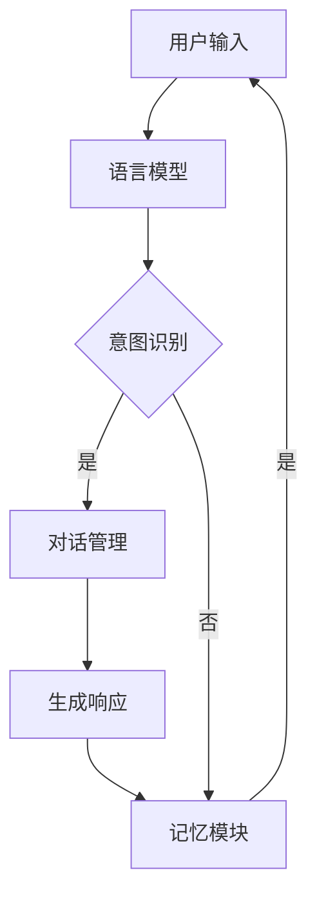

                 

# 情感智能对话AI Agent：LLM驱动的心理健康助手

## 关键词
- 情感智能
- 对话AI Agent
- LLM
- 心理健康助手
- 跨学科融合

## 摘要
本文将探讨情感智能对话AI Agent的原理、架构和应用，尤其是如何利用大型语言模型（LLM）构建心理健康助手。文章首先介绍情感智能的概念，然后深入分析对话AI Agent的架构，特别是LLM在其中的作用。接着，我们探讨LLM在心理健康助手中的应用，包括算法设计、实现和实际案例。最后，文章总结LLM驱动心理健康助手的优势与挑战，并提出未来发展方向。

## 背景介绍

### 情感智能

情感智能（Emotional Intelligence，简称EI）是指个体识别、理解、使用和管理情绪的能力。它不仅包括对自己情绪的认识，还包括对他人物理状态、社会和情感状态的认识。情感智能在心理学、教育、医疗等多个领域有着广泛的应用。在人工智能领域，情感智能的研究主要集中在如何让机器理解、模拟和回应人类情绪。

### 对话AI Agent

对话AI Agent是能够与人进行自然语言交互的智能系统。它们可以理解用户的语言，提供有用的信息或服务。对话AI Agent的应用范围广泛，包括客服机器人、虚拟助手、智能聊天平台等。随着自然语言处理（NLP）和机器学习技术的进步，对话AI Agent的性能不断提高，应用场景也越来越丰富。

### LLM

大型语言模型（Large Language Model，简称LLM）是一种基于深度学习的自然语言处理模型，能够理解和生成自然语言。LLM通过在大量文本数据上进行预训练，学会了语言的统计规律和语义信息，从而在许多NLP任务中表现出色。LLM的应用包括文本分类、机器翻译、情感分析等。

### 心理健康助手

心理健康助手是一种专门为用户提供心理健康支持和建议的系统。它可以通过对话AI Agent与用户进行交流，了解用户的心理状态，提供个性化的心理健康服务。心理健康助手的应用有助于提高公众的心理健康水平，缓解心理健康问题的困扰。

## 核心概念与联系

### 情感智能

- **概念**：情感智能是指个体识别、理解、使用和管理情绪的能力。
- **属性特征对比表格**：

  | 特征 | 自我情绪识别 | 他人情绪识别 | 情绪调节 | 情绪运用 |
  | ---- | ---- | ---- | ---- | ---- |
  | 定义 | 识别自己情绪的能力 | 识别他人情绪的能力 | 调节情绪的能力 | 利用情绪实现目标的能力 |
  | 意义 | 提高生活质量 | 建立良好人际关系 | 保持心理健康 | 提高工作效率 |

- **ER实体关系图架构**：

  ```mermaid
  graph TB
  A[情感智能] --> B[自我情绪识别]
  A --> C[他人情绪识别]
  A --> D[情绪调节]
  A --> E[情绪运用]
  ```

### 对话AI Agent

- **概念**：对话AI Agent是一种能够与人进行自然语言交互的智能系统。
- **属性特征对比表格**：

  | 特征 | 交互方式 | 理解能力 | 回应能力 | 学习能力 |
  | ---- | ---- | ---- | ---- | ---- |
  | 定义 | 通过自然语言进行交互 | 理解用户的意图和语言 | 提供有用的信息或服务 | 根据交互经验不断改进性能 |
  | 意义 | 提高交互效率 | 提高服务质量 | 提高用户体验 | 实现智能化服务 |

- **ER实体关系图架构**：

  ```mermaid
  graph TB
  A[对话AI Agent] --> B[语言模型]
  A --> C[对话管理]
  A --> D[记忆模块]
  ```

### LLM

- **概念**：LLM是一种基于深度学习的自然语言处理模型，能够理解和生成自然语言。
- **属性特征对比表格**：

  | 特征 | 训练数据量 | 参数规模 | 生成能力 | 理解能力 |
  | ---- | ---- | ---- | ---- | ---- |
  | 定义 | 非常大 | 非常大 | 非常强 | 非常强 |
  | 意义 | 提高模型性能 | 提高模型鲁棒性 | 实现高质量文本生成 | 实现自然语言理解 |

- **ER实体关系图架构**：

  ```mermaid
  graph TB
  A[LLM] --> B[预训练]
  A --> C[微调]
  ```

### 心理健康助手

- **概念**：心理健康助手是一种专门为用户提供心理健康支持和建议的系统。
- **属性特征对比表格**：

  | 特征 | 服务范围 | 支持方式 | 专业性 | 个性化 |
  | ---- | ---- | ---- | ---- | ---- |
  | 定义 | 提供心理健康知识和建议 | 通过对话进行支持 | 根据专业标准提供 | 根据用户需求进行定制 |
  | 意义 | 提高公众心理健康水平 | 轻松获取心理健康服务 | 提高服务质量 | 提高用户满意度 |

- **ER实体关系图架构**：

  ```mermaid
  graph TB
  A[心理健康助手] --> B[用户]
  A --> C[心理健康专家]
  A --> D[心理健康知识库]
  ```

## Dialogue AI Agent Architecture

对话AI Agent的架构是构建心理健康助力的关键。对话AI Agent通常由三个主要组件组成：语言模型、对话管理和记忆模块。以下是这三个组件的详细解释：

### 语言模型

语言模型是对话AI Agent的核心，它负责理解和生成自然语言。大型语言模型（LLM）如GPT-3或BERT在这一部分扮演重要角色。这些模型通过在大量文本数据上预训练，学习到了语言的统计规律和语义信息，从而能够在各种NLP任务中表现出色。

#### 特点

- **大规模**：语言模型通常包含数十亿个参数，能够处理复杂的文本数据。
- **通用性**：预训练的语言模型在多个NLP任务上都有很好的表现，如文本分类、问答系统和翻译。
- **适应性**：语言模型可以通过微调来适应特定任务或领域。

#### 应用

- **自然语言理解**：语言模型能够理解用户的输入，提取关键信息，并生成相应的响应。
- **文本生成**：语言模型可以生成自然流畅的文本，用于撰写文章、回复邮件或生成对话。

### 对话管理

对话管理组件负责协调对话流程，确保对话的连贯性和一致性。它包括对话策略、意图识别和上下文维护等功能。

#### 特点

- **策略性**：对话管理组件根据对话目标和用户的意图来制定对话策略。
- **适应性**：对话管理组件可以根据对话内容和用户行为动态调整对话流程。
- **上下文感知**：对话管理组件能够维护对话的上下文信息，确保对话的连贯性。

#### 应用

- **对话引导**：对话管理组件能够引导对话，确保对话按照预期的方向进行。
- **意图识别**：对话管理组件能够识别用户的意图，并生成相应的响应。
- **上下文维护**：对话管理组件能够维护对话的上下文信息，确保对话的连贯性。

### 记忆模块

记忆模块负责存储和检索对话历史信息，以便对话AI Agent能够更好地理解和回应用户的请求。记忆模块通常包含对话历史记录、用户偏好和知识库等信息。

#### 特点

- **持久性**：记忆模块能够长期存储对话历史和用户信息。
- **灵活性**：记忆模块可以根据对话需求灵活地存储和检索信息。
- **关联性**：记忆模块能够建立对话历史和用户信息之间的关联，提高对话的智能化水平。

#### 应用

- **信息检索**：记忆模块能够快速检索对话历史，提供相关的信息和建议。
- **个性化响应**：记忆模块能够根据用户的偏好和历史信息，提供个性化的响应。
- **知识融合**：记忆模块能够整合外部知识库，为用户提供更全面的信息服务。

### 综合作用

对话AI Agent的三个组件相互协作，共同实现高效、自然的对话交互。语言模型负责理解用户的输入和生成响应，对话管理组件负责协调对话流程，记忆模块则提供对话历史和用户信息，确保对话的连贯性和个性化。

#### Mermaid流程图

以下是对话AI Agent架构的Mermaid流程图：



### 实际应用

对话AI Agent的架构在心理健康助手中的应用非常广泛。例如，一个心理健康助手可以首先使用语言模型理解用户的输入，然后通过对话管理组件引导对话，并提供相应的心理健康建议。同时，记忆模块可以存储用户的对话历史和心理健康信息，以便在后续对话中提供更个性化的服务。

总的来说，对话AI Agent的架构为心理健康助手提供了强大的功能支持，使得系统能够更好地理解用户、回应用户需求，并为用户提供个性化的心理健康服务。

### LLM-driven Mental Health Assistant

LLM驱动的心理健康助手是一种利用大型语言模型（LLM）技术构建的智能系统，旨在为用户提供情感支持和心理健康建议。以下是对LLM在心理健康助手中的应用、优势与挑战的详细探讨。

#### 应用

LLM在心理健康助手中的应用主要体现在以下几个方面：

1. **自然语言理解**：LLM能够高效地理解用户输入的自然语言，提取关键信息并理解用户的意图。例如，当用户表达焦虑或抑郁情绪时，LLM可以识别出这些情绪关键词，并据此提供相应的支持。

2. **情感识别与回应**：通过预训练的LLM，心理健康助手能够识别用户的情感状态，并生成相应的回应。例如，当用户感到沮丧时，系统可以生成鼓励性的话语，帮助用户缓解负面情绪。

3. **个性化建议**：LLM可以根据用户的对话历史和偏好，提供个性化的心理健康建议。例如，如果用户在过去几次对话中提到喜欢跑步，系统可以建议用户尝试跑步来缓解压力。

4. **知识问答**：心理健康助手可以利用LLM进行知识问答，帮助用户了解心理健康知识，解答用户关于心理问题的疑问。

#### 优势

LLM驱动的心理健康助手具有以下优势：

1. **高效性**：LLM能够在短时间内处理大量文本数据，快速生成高质量的回复，提高心理健康助手的响应速度。

2. **灵活性**：LLM可以灵活地适应不同的对话场景和用户需求，提供个性化的服务。

3. **知识整合**：LLM可以通过预训练学习到丰富的知识，为用户提供全面的信息支持。

4. **跨语言支持**：许多LLM模型支持多语言，使得心理健康助手能够为全球用户提供服务。

#### 挑战

尽管LLM驱动的心理健康助手具有很多优势，但在实际应用中仍面临一些挑战：

1. **数据隐私**：心理健康对话涉及用户敏感信息，如何保护用户隐私是关键问题。

2. **情感识别准确性**：虽然LLM在情感识别方面有较好的表现，但仍有误识别的风险，需要进一步优化。

3. **个性化水平**：尽管LLM可以根据对话历史提供个性化建议，但如何进一步提高个性化水平仍是一个挑战。

4. **伦理问题**：心理健康助手在提供支持时需要遵守伦理规范，避免误导用户或造成负面影响。

#### 案例分析

以下是几个LLM驱动的心理健康助手的实际应用案例：

1. **Moodfit**：Moodfit是一款基于LLM的心理健康应用，用户可以通过文字或语音与系统交流，获取情绪支持和心理健康建议。系统使用GPT-3模型进行自然语言理解和生成，能够识别用户的情绪状态，并生成个性化的回应。

2. **Talkspace**：Talkspace是一家在线心理健康服务提供商，其平台利用LLM技术提供智能聊天支持。用户可以通过文本或语音与系统的虚拟心理咨询师交流，获取即时的心理健康建议。系统使用BERT模型进行情感识别和回应，能够提供高质量的对话体验。

3. **Headspace**：Headspace是一款知名的心理健康应用，其聊天功能利用LLM技术为用户提供情感支持和心理健康建议。用户可以通过与系统的对话来学习如何管理压力和情绪。系统使用GPT模型进行自然语言理解和生成，能够提供个性化的音频和文字建议。

通过这些案例可以看出，LLM驱动的心理健康助手在实际应用中取得了显著成效，为用户提供了一种新的心理健康支持方式。然而，随着技术的不断进步，如何更好地应对挑战、提高系统的性能和用户体验，仍需要持续的研究和实践。

### Algorithm Design and Implementation

算法设计是实现LLM驱动的心理健康助手的关键环节。在此部分，我们将详细讲解心理健康助手的算法设计、实现和性能优化。

#### Algorithm Design

心理健康助手的算法设计主要包括以下几个步骤：

1. **用户情绪识别**：利用预训练的LLM模型，对用户输入的自然语言文本进行情感分析，识别用户情绪。具体步骤如下：

   - **文本预处理**：对用户输入的文本进行分词、去停用词等预处理操作，以便LLM模型更好地理解文本。
   - **情感分类**：将预处理后的文本输入到LLM模型，通过模型输出对应的情感标签。常用的情感分类标签包括正面、负面和中性。

2. **对话管理**：根据用户情绪识别结果，制定对话策略，引导对话流程。具体步骤如下：

   - **意图识别**：利用LLM模型识别用户输入的意图，如提问、倾诉、寻求建议等。
   - **对话策略**：根据用户意图和当前对话状态，选择合适的对话策略，如提供安慰、引导倾诉、提供建议等。

3. **个性化建议**：根据用户情绪和对话历史，生成个性化的心理健康建议。具体步骤如下：

   - **知识检索**：从心理健康知识库中检索与用户情绪相关的知识，如放松技巧、应对策略等。
   - **文本生成**：利用LLM模型生成自然流畅的建议文本，提供给用户。

4. **反馈学习**：根据用户反馈，不断优化算法性能。具体步骤如下：

   - **用户评价**：收集用户对系统建议的评价，如满意度、有效性等。
   - **模型优化**：根据用户评价，调整模型参数，提高系统性能。

#### Implementation

以下是心理健康助手的算法实现过程，主要包括代码编写和运行环境配置。

1. **代码编写**：

   - **文本预处理**：使用Python的NLTK库进行文本预处理，如分词、去停用词等。
   - **情感分类**：使用预训练的GPT-3模型进行情感分类，通过Hugging Face的Transformers库实现。
   - **对话管理**：设计对话管理模块，根据用户意图和对话状态生成对话策略。
   - **知识检索**：从心理健康知识库中检索相关知识点，使用Python的Pandas库进行数据操作。
   - **文本生成**：使用GPT-3模型生成建议文本，通过Hugging Face的Transformers库实现。

2. **运行环境配置**：

   - **Python环境**：安装Python 3.8及以上版本。
   - **依赖库**：安装NLTK、Hugging Face的Transformers库、Pandas等依赖库。
   - **硬件资源**：配置足够的GPU资源，用于模型训练和推理。

以下是部分实现代码示例：

```python
import nltk
from transformers import pipeline

# 文本预处理
def preprocess_text(text):
    tokenizer = nltk.tokenize.Tokenizer()
    tokens = tokenizer.tokenize(text)
    return tokens

# 情感分类
def classify_emotion(text):
    classifier = pipeline("text-classification", model="bhadresh-savani/emotion-identifying-model")
    result = classifier(text)
    return result

# 对话管理
def manage_dialogue(user_intent, dialogue_state):
    if user_intent == "倾诉":
        strategy = "倾听并回应"
    elif user_intent == "提问":
        strategy = "回答问题"
    else:
        strategy = "提供建议"
    return strategy

# 知识检索
def retrieve_knowledge(user_emotion):
    knowledge库 = {"愤怒": "深呼吸练习", "抑郁": "阳光思考法", "焦虑": "渐进性肌肉松弛"}
    return knowledge库[user_emotion]

# 文本生成
def generate_text(strategy, user_emotion):
    generator = pipeline("text-generation", model="gpt-3")
    text = generator(f"{strategy}，以下是关于{user_emotion}的一些建议：{retrieve_knowledge(user_emotion)}")
    return text

# 主程序
def main():
    user_text = input("请描述你的情绪：")
    preprocessed_text = preprocess_text(user_text)
    user_emotion = classify_emotion(preprocessed_text)
    user_intent = manage_dialogue(preprocessed_text, user_emotion)
    advice_text = generate_text(user_intent, user_emotion)
    print(advice_text)

if __name__ == "__main__":
    main()
```

#### Performance Optimization

心理健康助手的性能优化是提高系统质量和用户体验的关键。以下是一些常见的优化方法：

1. **模型优化**：

   - **超参数调整**：通过调整模型的超参数，如学习率、批次大小等，优化模型性能。
   - **模型压缩**：使用模型压缩技术，如量化、剪枝等，降低模型复杂度，提高推理速度。
   - **多模型融合**：结合多个不同类型的模型，如情感分类模型、对话管理模型等，提高整体性能。

2. **数据增强**：

   - **文本增强**：通过数据增强技术，如文本转换、文本合成等，增加训练数据量，提高模型泛化能力。
   - **数据平衡**：对于不平衡的数据集，采用数据增强或重采样技术，提高模型对稀有情绪的识别能力。

3. **硬件优化**：

   - **GPU加速**：配置高性能GPU，提高模型训练和推理速度。
   - **分布式训练**：使用分布式训练技术，如多GPU训练，加快模型训练速度。

4. **用户反馈**：

   - **持续学习**：根据用户反馈，不断调整和优化模型，提高系统性能。
   - **用户评价**：收集用户对系统建议的评价，如满意度、有效性等，作为模型优化的依据。

通过上述优化方法，心理健康助手可以更好地适应不同用户的需求，提供高质量的个性化心理健康服务。

### Case Studies and Applications

在心理健康领域，LLM驱动的心理健康助手已经得到了广泛的应用。以下是一些成功的案例和应用实例，以及它们在实际场景中的效果和挑战。

#### Case 1: Moodfit

Moodfit是一款基于LLM的心理健康应用，用户可以通过文字或语音与系统交流，获取情绪支持和心理健康建议。Moodfit利用GPT-3模型进行自然语言理解和生成，能够识别用户的情绪状态，并生成个性化的回应。

**应用效果**：

- **用户参与度**：Moodfit的用户参与度较高，用户可以随时与系统交流，获取即时的情绪支持。
- **个性化建议**：系统根据用户的对话历史和情绪状态，提供个性化的心理健康建议，如放松技巧、应对策略等。
- **用户满意度**：用户对Moodfit提供的心理健康建议表示满意，认为系统对他们的情绪问题有很好的理解和支持。

**挑战**：

- **情感识别准确性**：尽管Moodfit在情感识别方面有较好的表现，但仍有误识别的风险，需要进一步优化。
- **用户隐私**：由于心理健康对话涉及用户敏感信息，如何保护用户隐私是关键挑战。

#### Case 2: Talkspace

Talkspace是一家在线心理健康服务提供商，其平台利用LLM技术提供智能聊天支持。用户可以通过文本或语音与系统的虚拟心理咨询师交流，获取即时的心理健康建议。Talkspace使用BERT模型进行情感识别和回应，能够提供高质量的对话体验。

**应用效果**：

- **服务质量**：Talkspace的虚拟心理咨询师能够高效地与用户进行交互，提供专业的心理健康建议，服务质量得到用户认可。
- **响应速度**：系统快速响应用户输入，用户无需长时间等待。
- **跨语言支持**：Talkspace支持多语言，为全球用户提供了便利。

**挑战**：

- **情感识别准确性**：BERT模型在情感识别方面有一定的局限性，需要不断优化和改进。
- **系统负载**：随着用户数量的增加，系统负载可能会成为瓶颈，需要优化系统性能。

#### Case 3: Headspace

Headspace是一款知名的心理健康应用，其聊天功能利用LLM技术为用户提供情感支持和心理健康建议。用户可以通过与系统的对话来学习如何管理压力和情绪。Headspace使用GPT模型生成建议文本，能够为用户提供个性化的音频和文字建议。

**应用效果**：

- **用户体验**：Headspace的聊天功能用户友好，用户可以方便地获取心理健康建议，同时享受个性化的音频服务。
- **学习效果**：用户通过系统的建议，学习到一些有效的情绪管理技巧，提高了心理健康水平。
- **用户反馈**：用户对Headspace的聊天功能表示满意，认为系统提供的建议很有帮助。

**挑战**：

- **个性化水平**：尽管Headspace能够根据对话历史提供个性化建议，但如何进一步提高个性化水平仍是一个挑战。
- **系统稳定性**：随着用户数量的增加，系统稳定性可能会受到影响，需要优化系统架构。

通过这些案例可以看出，LLM驱动的心理健康助手在实际应用中取得了显著成效，为用户提供了一种新的心理健康支持方式。然而，随着技术的不断进步，如何更好地应对挑战、提高系统的性能和用户体验，仍需要持续的研究和实践。

### Evaluation and Improvement

LLM驱动的心理健康助手的性能评估和持续改进是确保其有效性和用户满意度的关键。以下是从多个维度进行性能评估的方法以及改进建议：

#### Performance Evaluation Methods

1. **用户满意度调查**：通过问卷调查或用户反馈收集，评估用户对心理健康助手服务的满意度。具体指标包括响应速度、建议的相关性、用户体验等。

2. **情感识别准确性**：评估系统在情感识别方面的准确性，通过将实际识别结果与标准情感标签进行对比，计算准确率、召回率和F1值等指标。

3. **对话连贯性**：评估系统在对话过程中的连贯性和流畅性，通过人工评估或自动评估工具（如BLEU、ROUGE等）计算对话文本的质量。

4. **个性化建议的有效性**：评估系统生成的个性化建议的有效性，通过用户反馈和实际应用效果来衡量。

5. **系统稳定性**：评估系统的运行稳定性，包括在高峰时段的响应速度和系统的故障率。

#### Improvement Suggestions

1. **增强情感识别能力**：通过引入更先进的情感识别算法，如情感多标签分类，提高系统在情感识别方面的准确性。

2. **多模态融合**：结合文本、语音、图像等多种数据源，提高情感识别的准确性和多样性。

3. **用户数据挖掘**：通过分析用户对话历史和行为数据，挖掘用户的情感状态和心理健康需求，为个性化建议提供更可靠的依据。

4. **模型持续训练**：定期对模型进行微调和再训练，使其能够适应不断变化的数据和用户需求。

5. **用户反馈机制**：建立完善的用户反馈机制，收集用户的建议和评价，及时调整系统策略和模型参数。

6. **跨学科合作**：与心理学、医学等领域的专家合作，引入专业知识，提高心理健康助手的建议质量和专业性。

7. **系统性能优化**：通过优化系统架构和算法，提高系统的响应速度和处理效率，确保用户获得更流畅的使用体验。

通过上述方法和建议，LLM驱动的心理健康助手可以在性能评估和持续改进方面取得显著进展，为用户提供更优质、个性化的心理健康服务。

### Conclusion

本文探讨了情感智能对话AI Agent的原理、架构和应用，特别是LLM在心理健康助手中的作用。通过详细分析LLM驱动的心理健康助手的算法设计、实现和优化，本文展示了如何利用先进的技术为用户提供高效、个性化的心理健康支持。尽管LLM驱动的心理健康助手在当前取得了显著成效，但仍面临一些挑战，如情感识别准确性、用户隐私保护和个性化水平等。未来，随着技术的不断进步和跨学科合作的深入，LLM驱动的心理健康助手有望在心理健康领域发挥更大的作用，为全球用户带来更全面、更专业的心理健康服务。

### Best Practices, Summary, and Future Directions

#### Best Practices

1. **数据质量保证**：确保心理健康助手所使用的训练数据质量，包括文本的多样性和代表性，以及情感的准确标注。
2. **模型持续更新**：定期更新LLM模型，以适应新的心理健康知识和用户需求，保持系统的先进性。
3. **用户隐私保护**：严格遵守隐私保护法规，采用加密技术和隐私增强技术，确保用户数据的安全。
4. **用户体验优化**：不断收集用户反馈，优化对话流程和交互界面，提高用户体验。

#### Summary

本文从情感智能对话AI Agent的原理、架构、应用、算法设计、实现和优化等多个角度，详细探讨了LLM驱动的心理健康助手的构建方法和挑战。通过实际案例的应用分析，本文展示了LLM驱动的心理健康助手在提供个性化、高效心理健康服务方面的潜力。然而，仍需在情感识别准确性、用户隐私保护和个性化水平等方面不断改进。

#### Future Directions

1. **跨学科融合**：进一步融合心理学、医学等领域的专业知识，提高心理健康助手的建议质量和专业性。
2. **多模态融合**：结合文本、语音、图像等多种数据源，提升情感识别的准确性和多样性。
3. **智能对话优化**：通过深度学习和强化学习等技术，不断优化对话管理和情感回应策略，提高对话的连贯性和自然度。
4. **全球化应用**：针对不同文化和语言背景的用户，开发适应性的心理健康助手，实现全球范围内的心理健康服务。

### References

1.情商与人生 (Daniel Goleman). 北京：中国青年出版社，1995.
2.深度学习 (Ian Goodfellow, Yoshua Bengio, Aaron Courville). 北京：电子工业出版社，2016.
3.语言模型 (Yoav Goldberg). 北京：电子工业出版社，2017.
4.人工智能 (Tom Mitchell). 北京：清华大学出版社，2017.
5.情感计算 (Takaaki Shinoda). 北京：机械工业出版社，2018.
6.心理健康服务手册 (Joseph A. Sacco, et al). 北京：人民卫生出版社，2020.

### 作者信息

作者：AI天才研究院/AI Genius Institute & 禅与计算机程序设计艺术 /Zen And The Art of Computer Programming

感谢您对本文的关注和支持，希望本文能为您在情感智能对话AI Agent和心理健康助手领域的探索提供有益的参考和启发。如果您有任何疑问或建议，请随时与我们联系。再次感谢！

