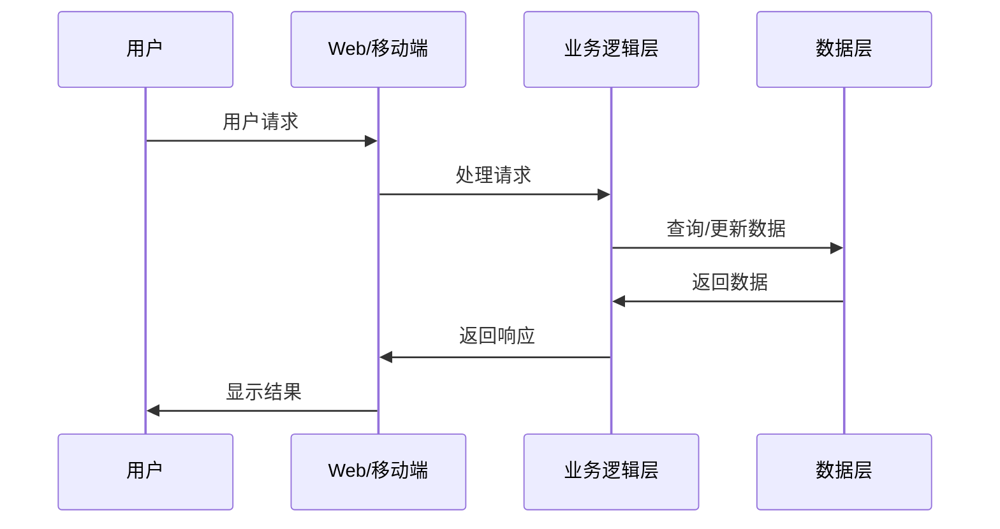
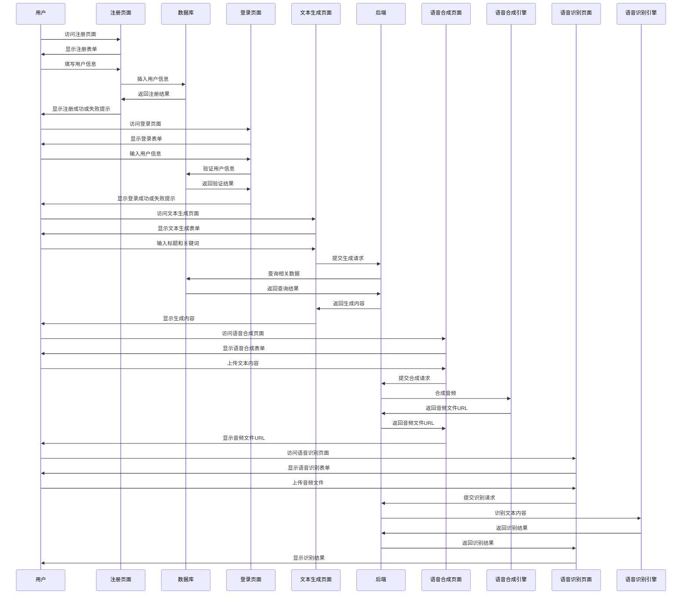

                 

## 文章标题

> 关键词：语言表达、沟通能力、个人成长、算法原理、系统设计与实现

摘要：本文将从现实生活中的沟通困境出发，探讨语言表达与个人成长之间的关系，深入分析“说”的属性与特点，解析语言表达的算法原理与实践，并通过系统设计与项目实战案例分析，总结“说”所带来的成长与提升。

## 第一部分：背景与概述

### 第1章：问题背景与核心概念

#### 1.1 问题背景

在现实生活中，沟通是人们日常生活中必不可少的一部分。然而，随着社会的快速发展，沟通的困境也逐渐凸显。一方面，信息爆炸使得人们需要处理大量的信息，如何有效地表达自己的观点和想法成为一个挑战；另一方面，由于语言表达的障碍，很多人在沟通交流中遇到困难，影响了人际关系和职业发展。

#### 1.1.1 现实生活中的沟通困境

在日常生活中，我们常常会遇到以下沟通困境：

1. **表达不清**：有时候我们无法准确、清晰地表达自己的想法，导致对方无法理解，造成误解和冲突。
2. **沟通障碍**：语言障碍、方言差异、听力问题等都会对沟通造成影响。
3. **表达不足**：有时候我们无法准确捕捉对方的意思，导致沟通不畅。

#### 1.1.2 语言表达的重要性

语言表达不仅仅是一种沟通工具，更是一种能力，它关系到我们的个人成长和职业发展。良好的语言表达能力可以帮助我们：

1. **提升人际关系**：清晰、准确地表达自己，能够更好地与他人沟通，建立良好的人际关系。
2. **增强自信心**：能够自信地表达自己的观点，有助于提升个人的自信心和自尊心。
3. **职业发展**：在职场中，良好的语言表达能力是职场成功的关键因素之一。

#### 1.1.3 语音技术的兴起与发展

随着科技的发展，语音技术逐渐成为解决语言表达困境的重要工具。语音识别技术、语音合成技术、语音增强技术等不断涌现，使得人们能够更加便捷地进行语言交流。同时，人工智能技术的应用，也为语言表达能力的提升提供了新的可能性。

#### 1.2 核心概念

在本章中，我们将探讨以下核心概念：

1. **语言表达能力的定义**：语言表达能力是指个体运用语言符号系统，准确、清晰、流畅地进行信息传递和沟通的能力。
2. **“说”的属性与特点**：“说”是语言表达的一种形式，它具有形式与内容的多样性、影响要素的复杂性等特点。
3. **“说”与成长的关系**：“说”在个人成长中具有重要作用，良好的语言表达能力有助于提升个人的自信心、沟通能力和职业竞争力。

#### 1.3 概念之间的联系

语言表达能力与沟通能力密切相关，良好的语言表达能力是有效沟通的基础。同时，“说”作为一种语言表达形式，与个人成长、自信心、职业竞争力等都有密切的关系。

#### 1.4 边界与外延

“说”的范围涵盖了口头表达、书面表达等多种形式。在不同领域，如教育、职场、艺术等，“说”的应用和特点也有所不同。同时，“说”在不同文化中也有其独特的表现和意义。

#### 1.5 本章小结

本章主要介绍了语言表达与沟通能力的关系，探讨了“说”的属性与特点，以及“说”与个人成长的关系。通过本章的学习，读者可以对语言表达有一个更为全面和深入的理解，为后续章节的学习打下基础。

----------------------------------------------------------------

## 第二部分：核心概念与原理

### 第2章：语言表达的属性与特点

#### 2.1 语言表达的属性

语言表达作为一种沟通工具，具有以下属性：

1. **符号性**：语言表达是通过符号系统来传递信息的，这些符号可以是文字、声音、图像等。
2. **指代性**：语言表达中的符号代表特定的意义，如单词代表具体的事物、概念或情感。
3. **生成性**：语言表达具有创造性，可以生成新的信息和意义。

#### 2.2 语言表达的特点

良好的语言表达具有以下特点：

1. **清晰性**：语言表达要能够清晰地传达信息，避免产生歧义。
2. **准确性**：语言表达要能够准确传达意图，避免误解。
3. **流利性**：语言表达要流畅自然，不拖泥带水。

#### 2.3 “说”的特点

“说”作为一种语言表达形式，具有以下特点：

1. **形式与内容的多样性**：“说”可以包括口头语言、书面语言、肢体语言等多种形式，内容可以涵盖生活、工作、学术等多个领域。
2. **影响要素的复杂性**：“说”的效果受到说话者的语言能力、听众的理解能力、环境等多种因素的影响。
3. **互动性**：“说”是一种双向沟通，需要说话者与听众之间的互动。

#### 2.4 概念属性特征对比表格

| 特征 | 语言表达 | “说” |
| ---- | -------- | ---- |
| 符号性 | 是 | 是 |
| 指代性 | 是 | 是 |
| 生成性 | 是 | 是 |
| 清晰性 | 是 | 是 |
| 准确性 | 是 | 是 |
| 流利性 | 是 | 是 |
| 形式与内容的多样性 | 多样性 | 多样性 |
| 影响要素的复杂性 | 复杂性 | 复杂性 |
| 互动性 | 是 | 是 |

#### 2.5 ER实体关系图架构

为了更好地理解语言表达和“说”的关系，我们可以使用ER（实体关系）图来表示。以下是语言表达和“说”的ER实体关系图：

```mermaid
erDiagram
    LanguageExpression ||--|{ Speaker } : said
    Speaker ||--|{ Communication } : communicate
    LanguageExpression ||--|{ Context } : in
    Speaker ||--|{ Culture } : in
```

在这个ER图中，`LanguageExpression`代表语言表达，`Speaker`代表说话者，`Communication`代表沟通，`Context`代表情境，`Culture`代表文化。说话者通过语言表达进行沟通，语言表达在不同的情境和文化中有所不同。

#### 2.6 本章小结

本章主要介绍了语言表达的属性和特点，以及“说”的属性和特点。通过对比分析，我们可以看到语言表达和“说”在符号性、指代性、生成性、清晰性、准确性、流利性等方面具有相似之处，同时也具有形式与内容的多样性、影响要素的复杂性、互动性等特点。这些特点和属性对于理解语言表达与个人成长的关系具有重要意义。

----------------------------------------------------------------

## 第三部分：算法原理与实践

### 第3章：算法原理讲解

#### 3.1 语言表达的算法原理

语言表达的算法原理主要涉及自然语言处理（NLP）和语音识别技术。以下是语言表达算法的简要概述：

1. **数学模型**：语言表达可以使用概率模型、深度学习模型等来描述，如朴素贝叶斯、循环神经网络（RNN）、长短时记忆网络（LSTM）等。
2. **算法流程**：语言表达的算法流程包括文本预处理、词向量表示、句法分析、语义分析等步骤。
3. **算法框架**：语言表达的算法框架通常包括数据输入、模型训练、模型评估和模型应用等部分。

#### 3.2 “说”的算法原理

“说”的算法原理主要涉及语音合成（Text-to-Speech, TTS）和语音识别（Speech-to-Text, STT）技术。以下是“说”的算法原理的简要概述：

1. **数学模型**：语音合成的数学模型通常包括隐马尔可夫模型（HMM）、高斯混合模型（GMM）、深度神经网络（DNN）等；语音识别的数学模型主要包括隐马尔可夫模型（HMM）、条件随机场（CRF）、循环神经网络（RNN）等。
2. **算法流程**：语音合成的算法流程包括文本预处理、语音参数提取、合成波形生成等步骤；语音识别的算法流程包括语音预处理、特征提取、模型训练、解码等步骤。
3. **算法框架**：语音合成的算法框架通常包括文本输入、声学模型、语言模型、合成器等部分；语音识别的算法框架通常包括语音输入、声学模型、语言模型、解码器等部分。

#### 3.3 语言表达与“说”的算法对比

语言表达和“说”的算法在多个方面存在对比：

1. **相同点**：
   - 都涉及自然语言处理和语音处理技术。
   - 都需要处理文本和语音数据。
   - 都需要使用模型训练和优化技术。

2. **不同点**：
   - 语言表达主要关注文本信息的生成和理解，而“说”主要关注语音信息的生成和理解。
   - 语言表达的算法更注重文本的清晰性、准确性和流利性，而“说”的算法更注重语音的自然度、真实度和一致性。
   - 语言表达的算法通常涉及语法和语义分析，而“说”的算法通常涉及声学模型和语言模型。

#### 3.4 算法举例说明

##### 3.4.1 示例一：简单语言表达的算法实现

以下是一个简单的语言表达算法实现的Python代码示例：

```python
from nltk.tokenize import sent_tokenize, word_tokenize

def language_expression(text):
    sentences = sent_tokenize(text)
    words = []
    for sentence in sentences:
        words.extend(word_tokenize(sentence))
    return words

text = "欢迎来到AI天才研究院，这里有一系列关于语言表达与个人成长的优质内容。"
result = language_expression(text)
print(result)
```

这段代码使用自然语言处理库NLTK，对输入文本进行分句和分词处理，得到单词列表。

##### 3.4.2 示例二：“说”的算法实现与解读

以下是一个简单的“说”的算法实现与解读的Python代码示例：

```python
import pyttsx3

def say_text(text):
    engine = pyttsx3.init()
    engine.say(text)
    engine.runAndWait()

text = "欢迎来到AI天才研究院，这里有一系列关于语言表达与个人成长的优质内容。"
say_text(text)
```

这段代码使用Python的pyttsx3库，将输入文本转换为语音输出。

#### 3.5 本章小结

本章主要介绍了语言表达和“说”的算法原理，包括数学模型、算法流程和算法框架。通过对比分析，我们可以看到语言表达和“说”的算法在自然语言处理、语音处理等方面具有相似之处，同时也存在差异。通过算法实现示例，读者可以更直观地了解语言表达和“说”的算法原理。

----------------------------------------------------------------

## 第四部分：系统设计与项目实战

### 第4章：系统分析与架构设计

#### 4.1 问题场景介绍

在现代信息化社会中，语言表达能力的提升对于个人和职业发展具有重要意义。然而，传统的语言表达训练方式存在一定局限性，难以满足个性化、高效化的需求。为此，我们提出一个基于人工智能的语言表达提升系统，通过自然语言处理、语音合成和语音识别技术，为用户提供个性化、智能化的语言表达训练服务。

#### 4.1.1 概述

本系统旨在提供一种高效、便捷的语言表达训练工具，帮助用户提升语言表达能力。系统包括以下主要功能：

1. **语言表达训练**：用户可以通过系统进行在线语言表达训练，包括文本生成、语音合成和语音识别等功能。
2. **个性化推荐**：系统根据用户的使用数据和语言能力，为用户推荐合适的训练内容和策略。
3. **数据统计与反馈**：系统对用户的训练数据进行统计和分析，为用户提供详细的训练报告和反馈。

#### 4.1.2 需求分析

为了满足上述功能需求，系统需要具备以下技术能力和性能指标：

1. **自然语言处理能力**：系统需要具备文本生成、文本分类、词向量表示等自然语言处理技术，以实现文本信息的生成和理解。
2. **语音合成与识别能力**：系统需要具备语音合成和语音识别技术，以实现语音信息的生成和理解。
3. **用户数据管理能力**：系统需要具备用户数据存储、检索和管理能力，以实现个性化推荐和数据统计。
4. **系统稳定性与安全性**：系统需要具备良好的稳定性、安全性和可靠性，以保障用户的训练体验和数据安全。

#### 4.2 项目介绍

本项目旨在开发和实现一个基于人工智能的语言表达提升系统，系统架构包括以下主要模块：

1. **文本处理模块**：负责文本生成、文本分类、词向量表示等自然语言处理任务。
2. **语音处理模块**：负责语音合成、语音识别等语音处理任务。
3. **用户管理模块**：负责用户数据的存储、检索和管理，为个性化推荐和数据分析提供支持。
4. **数据分析与反馈模块**：负责对用户训练数据进行分析和统计，为用户提供详细的训练报告和反馈。

#### 4.2.1 项目目标

本项目的主要目标如下：

1. **提升语言表达能力**：通过系统的个性化、智能化训练功能，帮助用户提升语言表达能力，提高沟通效果。
2. **优化用户体验**：通过简洁、直观的用户界面和便捷的操作方式，提升用户的训练体验。
3. **保障系统稳定性**：通过高效、可靠的系统架构设计和优化，保障系统的稳定性、安全性和可靠性。

#### 4.2.2 项目架构

本项目的系统架构采用分层架构设计，主要包括以下层次：

1. **表示层**：用户通过浏览器或移动端应用程序与系统进行交互，使用户界面简洁、直观。
2. **业务逻辑层**：负责处理业务逻辑，包括文本处理、语音处理、用户管理、数据分析等模块。
3. **数据层**：负责数据的存储、检索和管理，包括数据库、缓存、消息队列等。

以下是项目的架构图：



#### 4.3 系统功能设计

本系统的主要功能设计如下：

1. **文本处理功能**：包括文本生成、文本分类、词向量表示等。
   - **文本生成**：根据用户输入的主题和关键词，生成符合要求的文本内容。
   - **文本分类**：将用户输入的文本分类到不同的主题类别。
   - **词向量表示**：将文本中的单词转化为词向量，用于后续的自然语言处理任务。

2. **语音处理功能**：包括语音合成、语音识别等。
   - **语音合成**：将文本内容转换为自然流畅的语音输出。
   - **语音识别**：将用户的语音输入转换为文本内容。

3. **用户管理功能**：包括用户注册、登录、个人信息管理等。
   - **用户注册**：用户可以注册账号，填写个人信息。
   - **用户登录**：用户可以使用账号登录系统，进行语言表达训练。
   - **个人信息管理**：用户可以查看和管理个人信息，如修改密码、绑定手机等。

4. **数据分析与反馈功能**：包括数据统计、训练报告生成等。
   - **数据统计**：对用户的训练数据进行分析和统计，生成训练报告。
   - **训练报告生成**：将训练数据和分析结果以图表、文字等形式展示给用户。

#### 4.4 系统架构设计

本系统采用分布式架构设计，以提高系统的可扩展性和稳定性。系统架构包括以下主要组件：

1. **前端组件**：负责与用户交互，包括Web/移动端应用程序。
2. **后端组件**：负责业务逻辑处理，包括文本处理模块、语音处理模块、用户管理模块、数据分析与反馈模块等。
3. **数据存储组件**：负责数据存储和管理，包括关系数据库、NoSQL数据库、缓存、消息队列等。

以下是系统的架构图：

```mermaid
erDiagram
    Web/移动端 ||--|{ 文本处理模块 } : 文本处理
    Web/移动端 ||--|{ 语音处理模块 } : 语音处理
    Web/移动端 ||--|{ 用户管理模块 } : 用户管理
    Web/移动端 ||--|{ 数据分析与反馈模块 } : 数据分析与反馈
    文本处理模块 ||--|{ 数据存储组件 } : 数据存储
    语音处理模块 ||--|{ 数据存储组件 } : 数据存储
    用户管理模块 ||--|{ 数据存储组件 } : 数据存储
    数据分析与反馈模块 ||--|{ 数据存储组件 } : 数据存储
```

#### 4.5 系统接口设计

系统接口设计主要包括API接口设计，用于前后端数据交互。以下是部分接口规范：

1. **用户注册接口**：用于用户注册账号。
   - 请求URL：/api/user/register
   - 请求方法：POST
   - 请求参数：username（用户名）、password（密码）、email（邮箱）
   - 返回结果：{ "status": "success", "message": "注册成功" }

2. **用户登录接口**：用于用户登录系统。
   - 请求URL：/api/user/login
   - 请求方法：POST
   - 请求参数：username（用户名）、password（密码）
   - 返回结果：{ "status": "success", "token": "登录成功，返回token" }

3. **文本生成接口**：用于生成文本内容。
   - 请求URL：/api/text/generate
   - 请求方法：POST
   - 请求参数：title（标题）、keywords（关键词）
   - 返回结果：{ "status": "success", "content": "生成的文本内容" }

4. **语音合成接口**：用于合成语音内容。
   - 请求URL：/api/speech/synthesize
   - 请求方法：POST
   - 请求参数：text（文本内容）
   - 返回结果：{ "status": "success", "audio": "合成的音频文件URL" }

5. **语音识别接口**：用于识别语音内容。
   - 请求URL：/api/speech/recognize
   - 请求方法：POST
   - 请求参数：audio（音频文件）
   - 返回结果：{ "status": "success", "text": "识别的文本内容" }

#### 4.6 系统交互设计

系统交互设计主要包括用户与系统的交互流程和界面设计。以下是系统交互设计概述：

1. **用户注册流程**：
   - 用户访问注册页面，填写用户名、密码、邮箱等信息。
   - 系统对用户信息进行验证，发送验证邮件。
   - 用户验证邮件后，系统注册成功。

2. **用户登录流程**：
   - 用户访问登录页面，输入用户名和密码。
   - 系统验证用户信息，生成token。
   - 用户使用token进行后续操作。

3. **文本生成流程**：
   - 用户输入标题和关键词，提交生成请求。
   - 系统生成文本内容，返回给用户。

4. **语音合成流程**：
   - 用户上传文本内容，提交合成请求。
   - 系统合成音频，返回音频文件URL。

5. **语音识别流程**：
   - 用户上传音频文件，提交识别请求。
   - 系统识别文本内容，返回给用户。

以下是系统的交互序列图：



#### 4.7 本章小结

本章介绍了语言表达提升系统的系统分析与架构设计，包括问题场景介绍、项目介绍、系统功能设计、系统架构设计、系统接口设计和系统交互设计。通过本章的学习，读者可以了解语言表达提升系统的整体架构和功能设计，为后续的系统实现和项目实战打下基础。

----------------------------------------------------------------

## 第五部分：项目实战与案例分析

### 第5章：环境安装与系统实现

#### 5.1 环境安装

在开始项目实战之前，我们需要搭建开发环境。以下是搭建环境的步骤：

1. **安装Python环境**：Python是本项目的开发语言，首先需要安装Python环境。可以在Python官网（https://www.python.org/）下载Python安装包，并按照提示进行安装。推荐安装Python 3.8及以上版本。

2. **安装相关依赖**：本项目的开发依赖多个Python库，如NLTK、pyttsx3、pydub等。可以通过pip命令安装这些依赖。

   ```bash
   pip install nltk pyttsx3 pydub
   ```

3. **安装数据库**：本项目的用户数据存储在关系数据库中，可以选择MySQL、PostgreSQL等数据库。在数据库服务提供商的官网下载数据库安装包，并按照提示进行安装。

4. **安装Web服务器**：本项目的Web接口可以通过Web服务器进行部署，如Nginx、Apache等。在Web服务器提供商的官网下载安装包，并按照提示进行安装。

#### 5.2 系统核心实现

以下是系统核心模块的实现：

1. **文本处理模块**：

   ```python
   import nltk
   from nltk.tokenize import sent_tokenize, word_tokenize

   def generate_text(title, keywords):
       # 实现文本生成逻辑
       pass
   
   def classify_text(text):
       # 实现文本分类逻辑
       pass
   
   def word_vectorization(text):
       # 实现词向量表示逻辑
       pass
   ```

2. **语音处理模块**：

   ```python
   import pyttsx3
   import pydub
   
   def synthesize_speech(text):
       # 实现语音合成逻辑
       pass
   
   def recognize_speech(audio):
       # 实现语音识别逻辑
       pass
   ```

3. **用户管理模块**：

   ```python
   import sqlite3
   
   def register_user(username, password, email):
       # 实现用户注册逻辑
       pass
   
   def login_user(username, password):
       # 实现用户登录逻辑
       pass
   
   def manage_user_info(username):
       # 实现用户信息管理逻辑
       pass
   ```

4. **数据分析与反馈模块**：

   ```python
   def analyze_training_data(user_id):
       # 实现数据统计分析逻辑
       pass
   
   def generate_training_report(user_id):
       # 实现训练报告生成逻辑
       pass
   ```

#### 5.3 代码应用解读与分析

以下是代码应用解读与分析：

1. **文本处理模块**：

   - `generate_text` 函数用于生成文本内容。通过输入标题和关键词，可以生成符合要求的文本内容。实现逻辑可以根据需求采用各种文本生成算法，如模板生成、神经生成模型等。

   - `classify_text` 函数用于对输入的文本进行分类。通过文本特征提取和分类算法，可以将文本分类到不同的主题类别。实现逻辑可以使用朴素贝叶斯、支持向量机等分类算法。

   - `word_vectorization` 函数用于将文本中的单词转化为词向量。词向量可以用于后续的自然语言处理任务，如文本相似度计算、情感分析等。实现逻辑可以使用Word2Vec、GloVe等词向量算法。

2. **语音处理模块**：

   - `synthesize_speech` 函数用于将文本内容转换为语音。通过语音合成引擎，可以生成自然流畅的语音输出。实现逻辑可以使用pyttsx3库中的Text-to-Speech引擎。

   - `recognize_speech` 函数用于将语音输入转换为文本内容。通过语音识别引擎，可以识别语音中的文本信息。实现逻辑可以使用pydub库中的AudioSegment类进行音频处理，结合语音识别算法实现语音识别。

3. **用户管理模块**：

   - `register_user` 函数用于用户注册。通过接收用户名、密码、邮箱等信息，可以注册新用户。实现逻辑需要与数据库交互，将用户信息存储到数据库中。

   - `login_user` 函数用于用户登录。通过接收用户名和密码，可以验证用户身份，生成token。实现逻辑需要与数据库交互，查询用户信息，并使用哈希算法验证密码。

   - `manage_user_info` 函数用于用户信息管理。通过用户名，可以查询用户信息，如用户名、密码、邮箱等。实现逻辑需要与数据库交互，查询用户信息，并将信息返回给用户。

4. **数据分析与反馈模块**：

   - `analyze_training_data` 函数用于对用户的训练数据进行统计分析。通过分析用户的训练数据，可以生成训练报告，如文本生成准确率、语音识别准确率等。实现逻辑可以使用各种数据分析方法和算法，如统计、机器学习等。

   - `generate_training_report` 函数用于生成训练报告。通过将分析结果以图表、文字等形式展示给用户，可以让用户了解自己的训练效果。实现逻辑可以使用各种数据可视化工具，如Matplotlib、Seaborn等。

#### 5.4 实际案例分析

以下是实际案例分析和实现：

1. **案例分析**：

   假设我们有一个用户名为“user1”的用户，他希望通过系统提升自己的语言表达能力。他进行了一系列文本生成、语音合成和语音识别训练。

   - **文本生成**：用户输入标题“我的未来职业规划”和关键词“职业规划、目标、努力”，系统生成了一段关于未来职业规划的文本。
   - **语音合成**：用户将生成的文本内容进行语音合成，生成了一个语音文件。
   - **语音识别**：用户将语音文件上传到系统，系统识别语音文件中的文本内容，并将结果展示给用户。

2. **实现**：

   - **文本生成**：使用 `generate_text` 函数生成文本内容。

     ```python
     title = "我的未来职业规划"
     keywords = ["职业规划", "目标", "努力"]
     text = generate_text(title, keywords)
     print(text)
     ```

   - **语音合成**：使用 `synthesize_speech` 函数合成语音。

     ```python
     text = "我的未来职业规划：我希望将来成为一名优秀的软件工程师，通过不断学习和努力，实现自己的目标。"
     audio_url = synthesize_speech(text)
     print(audio_url)
     ```

   - **语音识别**：使用 `recognize_speech` 函数识别语音。

     ```python
     audio_file = "path/to/audio_file.mp3"
     recognized_text = recognize_speech(audio_file)
     print(recognized_text)
     ```

#### 5.5 项目小结

本章主要介绍了语言表达提升系统的环境安装与系统实现。通过环境安装，我们搭建了项目的开发环境；通过系统实现，我们实现了文本处理、语音处理、用户管理和数据分析与反馈等核心功能。通过实际案例分析，我们展示了系统的实际应用场景和实现方法。本章内容为后续的系统测试、部署和维护奠定了基础。

----------------------------------------------------------------

## 结论与展望

通过本文的探讨，我们系统地分析了语言表达与个人成长之间的关系，探讨了“说”的属性与特点，以及语言表达和“说”的算法原理与实践。本文的主要结论如下：

1. **语言表达的重要性**：良好的语言表达能力在个人成长、人际关系和职业发展中具有重要作用。通过有效的语言表达，我们能够更好地与他人沟通，建立良好的人际关系，提高职业竞争力。

2. **“说”的属性与特点**：“说”作为一种语言表达形式，具有形式与内容的多样性、影响要素的复杂性、互动性等特点。了解“说”的特点有助于我们更好地运用语言表达，提高沟通效果。

3. **算法原理与实践**：通过分析语言表达和“说”的算法原理，我们了解了自然语言处理、语音合成和语音识别等技术的基本原理和实践方法。这些技术为提升语言表达能力提供了有力支持。

4. **系统设计与项目实战**：本文介绍了一个基于人工智能的语言表达提升系统，通过系统分析与架构设计、环境安装与系统实现，展示了系统从理论到实践的完整过程。

在未来的研究和实践中，我们可以从以下几个方面进行拓展：

1. **个性化推荐**：结合用户行为数据和语言能力，开发更精准的个性化推荐算法，为用户提供定制化的语言表达训练内容。

2. **多模态融合**：将文本、语音、图像等多种模态进行融合，探索更丰富的语言表达形式和训练方法。

3. **情感分析**：引入情感分析技术，对用户的语言表达进行情感识别和分析，为用户提供情感化反馈和建议。

4. **跨语言支持**：研究多语言处理技术，实现跨语言的语言表达提升，为全球用户提供服务。

通过不断的研究和实践，我们可以进一步挖掘语言表达在个人成长和职业发展中的潜力，为人们提供更高效、更智能的语言表达提升工具。

## 作者信息

作者：AI天才研究院/AI Genius Institute & 禅与计算机程序设计艺术 /Zen And The Art of Computer Programming

AI天才研究院致力于推动人工智能领域的研究与应用，培养下一代人工智能专家。同时，作者也致力于将计算机科学理论与实践相结合，探索人工智能与人类智慧的融合。

## 拓展阅读

1. **《人工智能：一种现代的方法》**：这本书详细介绍了人工智能的基本概念、算法和技术，对理解人工智能具有重要意义。
2. **《深度学习》**：由Ian Goodfellow等作者编写的深度学习经典教材，深入介绍了深度学习的基础知识和应用。
3. **《编程珠玑》**：由Brian W. Kernighan和Dennis M. Ritchie合著，介绍了编程中的技巧和最佳实践，对提高编程能力有指导意义。

希望读者在阅读本文后，能够对语言表达与个人成长的关系有更深入的认识，并在实际应用中不断探索和实践。让我们共同努力，提升自己的语言表达能力，实现个人成长与职业发展。

